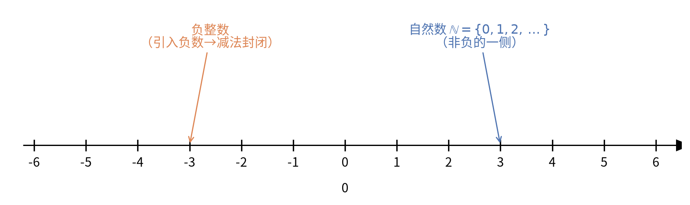
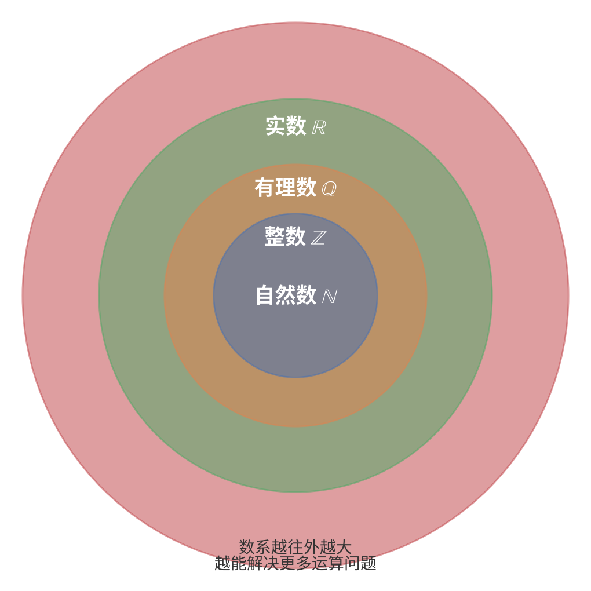
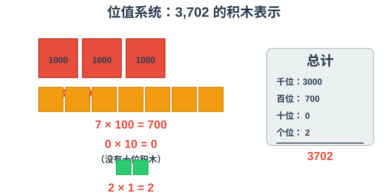
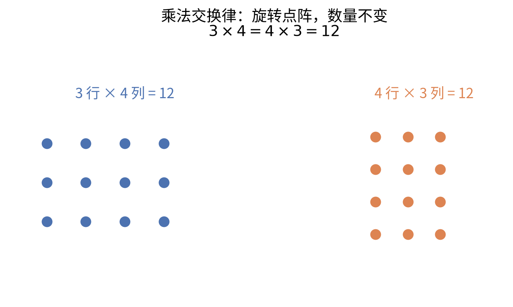
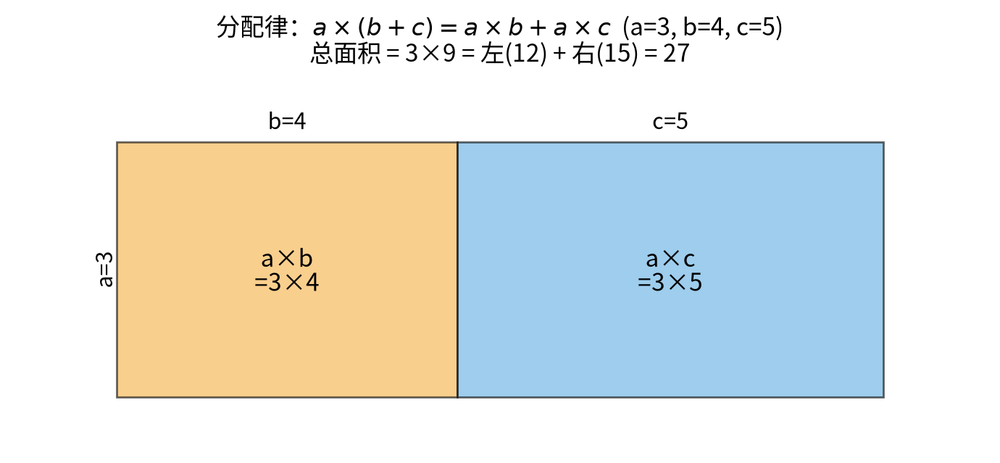

# 第 1 级：算术基础 (Basic Arithmetic)

> 算术是数学的起点，也是人类最古老的数学分支之一。从远古时代结绳计数到今天高速计算机中的二进制运算，算术始终是一切数学的根基。本教程将带你从零开始，系统性地建立对算术的完整理解。

---

## 1. 学习目标

完成本教程后，你应当能够：

- 理解自然数、整数、有理数的概念及其关系
- 掌握十进制位值系统与数位表示
- 熟练进行四则运算（加、减、乘、除）
- 理解并运用运算律（交换律、结合律、分配律）
- 理解质数与合数，掌握质因数分解
- 理解并运用算术基本定理
- 能够独立解决基础的算术应用问题

---

## 2. 核心概念

### 2.1 自然数 (Natural Numbers)

自然数是最初用来计数的数：$1, 2, 3, 4, 5, \dots$。自然数集通常记作 $\mathbb{N}$。

关于自然数是否包含 0，数学界有两种惯例。在初等数学中，我们通常取 $\mathbb{N} = \{1, 2, 3, \dots\}$；在集合论中，常取 $\mathbb{N} = \{0, 1, 2, 3, \dots\}$。本教程中，我们采用包含 0 的约定，即：

$$
\mathbb{N} = \{0, 1, 2, 3, 4, \dots\}
$$

自然数具有以下基本性质：
- **有序性**：任意两个自然数可以比较大小
- **良序性**：自然数的任何非空子集都有最小元素
- **无限性**：自然数没有最大值，可以无限延伸

### 2.2 整数 (Integers)

整数是自然数的推广，引入了负数的概念：

$$
\mathbb{Z} = \{\dots, -3, -2, -1, 0, 1, 2, 3, \dots\}
$$

其中 $\mathbb{Z}$ 来自德语 "Zahlen"（数字）。整数包括：
- 正整数：$1, 2, 3, \dots$（即自然数 $\mathbb{N}$ 去掉 0）
- 零：$0$
- 负整数：$-1, -2, -3, \dots$

引入负数使得减法运算在数系中封闭——任意两个整数相减，结果仍然是整数。



> **直观理解（现实类比）**：整数就像楼房的楼层。**自然数**是地面以上的楼层（$1, 2, 3, \dots$），**0** 是地面，**负整数**则是地下车库（$-1, -2, -3, \dots$）。有了"地下楼层"，我们才能回答"从 3 楼往下走 5 层到几楼"这样的问题（$3 - 5 = -2$）——这就是引入负数的意义：**让减法永远可以执行**。

### 2.3 有理数 (Rational Numbers)

有理数是能表示为两个整数之比的数：

$$
\mathbb{Q} = \left\{\frac{p}{q} \;\middle|\; p, q \in \mathbb{Z},\; q \neq 0 \right\}
$$

其中 $\mathbb{Q}$ 来自英语 "quotient"（商）。有理数包括：
- 整数（分母为 1 的特殊情形）
- 有限小数，如 $0.5 = \frac{1}{2}$、$0.125 = \frac{1}{8}$
- 无限循环小数，如 $0.\overline{3} = \frac{1}{3}$、$0.\overline{142857} = \frac{1}{7}$

### 2.4 数系的扩展关系

几种数系之间存在包含关系：

$$
\mathbb{N} \subseteq \mathbb{Z} \subseteq \mathbb{Q}
$$

即：自然数都是整数，整数都是有理数。反之则不成立，例如 $-3$ 是整数但不是自然数，$\frac{2}{3}$ 是有理数但不是整数。



> **直观理解（现实类比）**：把数系想象成层层包含的俄罗斯套娃。最里层是"自然数"，人类最初只会用它计数；为了做减法引入了"整数"；为了做除法引入了"有理数"。**每一次向外扩展，都是为了解决前一层无法完成的一种运算**——这正是数系发展的内在逻辑。
>
> 唯一的"遗憾"是：整数和有理数虽然能定义，但在**数轴上并不连续**（有理数之间有空隙），这将在第 10 级的实数系与极限中补全。

### 2.5 位值系统 (Place Value System)

我们日常使用的是**十进制位值系统**，这是一种用位置来表示数值大小的计数方法。每个数位上的数字乘以其位值（10 的幂），再求和即得到该数的值。

**十进制数位表**：

| 数位 | 亿位 | 千万位 | 百万位 | 十万位 | 万位 | 千位 | 百位 | 十位 | 个位 |
|:---:|:---:|:---:|:---:|:---:|:---:|:---:|:---:|:---:|:---:|
| 位值 | $10^8$ | $10^7$ | $10^6$ | $10^5$ | $10^4$ | $10^3$ | $10^2$ | $10^1$ | $10^0$ |

**示例**：数字 $3,702$ 表示：

$$
3,702 = 3 \times 10^3 + 7 \times 10^2 + 0 \times 10^1 + 2 \times 10^0
$$



> **直观理解（现实类比）**：位值系统就像**积木塔**。千位是大立方体（每块代表1000），百位是中等方块（每块代表100），十位是小长条（每块代表10），个位是小方块（每块代表1）。数字 3,702 就是 3 块大立方体 + 7 块中等方块 + 0 块小长条 + 2 块小方块的总和。这种"位置决定价值"的思想，是现代计数的核心智慧。

更一般地，任何十进制数可以写作：

$$
a_n a_{n-1} \dots a_1 a_0 = \sum_{k=0}^{n} a_k \times 10^k
$$

其中 $a_k$ 是 $0$ 到 $9$ 之间的数字，且 $a_n \neq 0$。

> **拓展知识**：除了十进制，计算机科学中常用的还有二进制（基数为 2）、八进制（基数为 8）和十六进制（基数为 16）。二进制中只有数字 0 和 1，例如 $(1011)_2 = 1 \times 2^3 + 0 \times 2^2 + 1 \times 2^1 + 1 \times 2^0 = 8 + 0 + 2 + 1 = 11$。

---

## 3. 基本运算

### 3.1 加法 (Addition)

加法是最基本的运算，表示将两个或多个数量合并在一起。

**符号**：$a + b$，读作 "a 加 b"。

**术语**：
- $a$ 和 $b$ 称为**加数** (addends) 或**项** (terms)
- 结果称为**和** (sum)

**竖式计算**：将数位对齐，从个位开始逐位相加，满十进一。

```
  3 7 2
+ 4 5 8
-------
  8 3 0
```

**示例**：$372 + 458 = 830$

计算过程：
1. 个位：$2 + 8 = 10$，写 0 进 1
2. 十位：$7 + 5 + 1 = 13$，写 3 进 1
3. 百位：$3 + 4 + 1 = 8$，写 8

### 3.2 减法 (Subtraction)

减法可以理解为加法的逆运算，表示从一个数量中移除一部分。

**符号**：$a - b$，读作 "a 减 b"。

**术语**：
- $a$ 称为**被减数** (minuend)
- $b$ 称为**减数** (subtrahend)
- 结果称为**差** (difference)

**竖式计算**：将数位对齐，从个位开始逐位相减。如果某一位不够减，向前一位借 1 当 10。

```
  5 0 2
- 3 4 7
-------
  1 5 5
```

**示例**：$502 - 347 = 155$

计算过程：
1. 个位：$2$ 不够减 $7$，向十位借 1，$12 - 7 = 5$
2. 十位：已被借走 1，剩 $0$，不够减 $4$，向百位借 1，$10 - 4 - 1 = 5$（注意减去借走的 1）
3. 百位：已被借走 1，剩 $4$，$4 - 3 = 1$

### 3.3 乘法 (Multiplication)

乘法是加法的简便运算——多个相同数的连加可以写成乘法。

**符号**：$a \times b$ 或 $a \cdot b$ 或 $ab$，读作 "a 乘以 b"。

**术语**：
- $a$ 和 $b$ 称为**因数** (factors)
- 结果称为**积** (product)

**从加法到乘法**：

$$
3 + 3 + 3 + 3 + 3 = 5 \times 3 = 15
$$

即 $5$ 个 $3$ 相加等于 $5$ 乘以 $3$。

**竖式计算（多位数乘法）**：

```
    2 4
×   3 7
-------
  1 6 8   (24 × 7)
+ 7 2     (24 × 30)
-------
  8 8 8
```

**示例**：$24 \times 37 = 888$

计算过程：
1. 用 $7$ 乘 $24$：$24 \times 7 = 168$
2. 用 $3$（代表 30）乘 $24$：$24 \times 30 = 720$
3. 将两部分相加：$168 + 720 = 888$

### 3.4 除法 (Division)

除法是乘法的逆运算，表示将一个数量平均分成若干份。

**符号**：$a \div b$ 或 $\frac{a}{b}$ 或 $a/b$，读作 "a 除以 b"。

**术语**：
- $a$ 称为**被除数** (dividend)
- $b$ 称为**除数** (divisor)
- 结果称为**商** (quotient)

**余数**：当除法不能整除时，剩余的部分称为**余数** (remainder)。

**带余除法**：对于任意整数 $a$ 和正整数 $b$，存在唯一的整数 $q$ 和 $r$ 使得：

$$
a = b \times q + r, \quad 0 \leq r < b
$$

其中 $q$ 是商，$r$ 是余数。

**竖式计算（长除法）**：

```
      2 7 3
   ────────
5 ) 1 3 6 5
    1 0
   ────
      3 6
      3 5
     ────
        1 5
        1 5
       ────
          0
```

**示例**：$1365 \div 5 = 273$

### 3.5 运算优先级

当多个运算混合出现时，需要遵循运算优先级规则：

1. 先算括号内的内容
2. 再算乘法和除法（从左到右）
3. 最后算加法和减法（从左到右）

记忆口诀：**先乘除，后加减，有括号先算括号里**。

**示例**：

$$
3 + 4 \times 2 = 3 + 8 = 11 \quad (\text{不是 } 14)
$$

$$
(3 + 4) \times 2 = 7 \times 2 = 14
$$

---

## 4. 运算律

运算律是算术运算中遵循的基本规则，它们是整个数学推理的基础。下面我们逐一陈述并证明。

### 4.1 加法交换律

**定理**：对于任意两个数 $a$ 和 $b$，有：

$$
a + b = b + a
$$

**解释**：两个数相加，交换加数的位置，和不变。

**证明**（直观证明）：

加法本质上是对两个集合进行合并。设有 $a$ 个苹果和 $b$ 个橘子，把它们放在一起，总共有 $a + b$ 个水果。无论你先数苹果还是先数橘子，总数不变。因此 $a + b = b + a$。

**示例**：$3 + 5 = 5 + 3 = 8$

### 4.2 加法结合律

**定理**：对于任意三个数 $a$、$b$ 和 $c$，有：

$$
(a + b) + c = a + (b + c)
$$

**解释**：三个数相加，先把前两个数相加，或者先把后两个数相加，和不变。

**证明**（直观证明）：

设有 $a$ 个红球、$b$ 个蓝球和 $c$ 个绿球。$(a + b) + c$ 表示先把红球和蓝球合并，再与绿球合并；$a + (b + c)$ 表示先把蓝球和绿球合并，再与红球合并。两种方式的总球数显然相同。

**示例**：$(2 + 3) + 4 = 5 + 4 = 9$，$2 + (3 + 4) = 2 + 7 = 9$

### 4.3 乘法交换律

**定理**：对于任意两个数 $a$ 和 $b$，有：

$$
a \times b = b \times a
$$

**解释**：两个数相乘，交换因数的位置，积不变。

**证明**（直观证明）：

使用矩形面积模型。一个 $a$ 行 $b$ 列的矩形点阵，总点数为 $a \times b$。将这个矩形旋转 $90^\circ$，就变成了 $b$ 行 $a$ 列，总点数为 $b \times a$。由于旋转不改变点的数量，所以 $a \times b = b \times a$。

**示例**：$3 \times 4 = 4 \times 3 = 12$



> **直观理解（现实类比）**：想象一个整齐的**阅兵方阵**——无论你按"3 排 4 列"还是"4 排 3 列"来数，总人数都是 12，只是站立的方向变了。这就是交换律的含义：**乘法只看"总共有多少"，不关心"谁在前谁在后"**。

### 4.4 乘法结合律

**定理**：对于任意三个数 $a$、$b$ 和 $c$，有：

$$
(a \times b) \times c = a \times (b \times c)
$$

**解释**：三个数相乘，先把前两个数相乘，或者先把后两个数相乘，积不变。

**证明**（直观证明）：

考虑一个 $a \times b \times c$ 的三维长方体（长 $a$、宽 $b$、高 $c$）。$(a \times b) \times c$ 表示先计算底面积再乘以高；$a \times (b \times c)$ 表示先计算一个侧面的面积再乘以另一条边。体积相同，因此等式成立。

**示例**：$(2 \times 3) \times 4 = 6 \times 4 = 24$，$2 \times (3 \times 4) = 2 \times 12 = 24$

### 4.5 分配律

**定理**：对于任意三个数 $a$、$b$ 和 $c$，有：

$$
a \times (b + c) = a \times b + a \times c
$$

**解释**：乘法对加法的分配——一个数乘以两个数的和，等于这个数分别乘以这两个数再相加。

**证明**（直观证明）：

使用矩形面积模型。考虑一个矩形，宽为 $a$，长为 $b + c$。它的总面积是 $a \times (b + c)$。如果把矩形分成两个小矩形，左边面积为 $a \times b$，右边面积为 $a \times c$。总面积等于两部分面积之和，因此 $a \times (b + c) = a \times b + a \times c$。

**示例**：$3 \times (4 + 5) = 3 \times 9 = 27$，$3 \times 4 + 3 \times 5 = 12 + 15 = 27$



> **直观理解（现实类比）**：想象你有一块长条形的**巧克力板**，宽 3 格；它被分包装机从中间切成了两段，一段长 4 格，一段长 5 格。整块巧克力的格数，既可以是"宽 $3\times$ 全长 $9$"，也可以是"左段 $3\times4$ + 右段 $3\times5$"。两种算法结果一定相同——这就是分配律。

**推论——提取公因数**：分配律也可以反过来使用：

$$
a \times b + a \times c = a \times (b + c)
$$

这称为**提取公因数**，在后续的代数学习中非常重要。

### 4.6 运算律之间的关系

运算律之间存在深层联系。交换律和结合律保证了加法或乘法运算中，**任意重新排列和分组都不会改变结果**。分配律则是连接加法和乘法的桥梁。

| 运算律 | 加法 | 乘法 |
|:---:|:---:|:---:|
| 交换律 | $a+b = b+a$ | $a \times b = b \times a$ |
| 结合律 | $(a+b)+c = a+(b+c)$ | $(a \times b) \times c = a \times (b \times c)$ |
| 分配律 | 不适用 | $a \times (b+c) = a \times b + a \times c$ |

> **注意**：减法**不满足**交换律和结合律。例如 $5 - 3 \neq 3 - 5$，$(5 - 3) - 2 \neq 5 - (3 - 2)$。除法同样**不满足**交换律和结合律。例如 $6 \div 3 \neq 3 \div 6$，$(12 \div 6) \div 2 \neq 12 \div (6 \div 2)$。

---

## 5. 质数与算术基本定理

### 5.1 质数与合数

**质数（素数）**：一个大于 1 的自然数，如果除了 1 和它本身之外没有其他正因数，称为质数。

**合数**：一个大于 1 的自然数，如果不是质数，则称为合数（即除了 1 和它本身之外还有其他正因数）。

**特别的**：1 既不是质数也不是合数。

**前 20 个质数**：

$$
2, 3, 5, 7, 11, 13, 17, 19, 23, 29, 31, 37, 41, 43, 47, 53, 59, 61, 67, 71
$$

**质数的判定方法**（试除法）：

要判断一个数 $n$ 是否为质数，只需用 $2$ 到 $\sqrt{n}$ 之间的所有整数去试除 $n$。如果都不能整除，则 $n$ 是质数。

**示例**：判断 $29$ 是否为质数。

$\sqrt{29} \approx 5.38$，所以只需试除 $2, 3, 5$：
- $29 \div 2 = 14.5$（不能整除）
- $29 \div 3 \approx 9.67$（不能整除）
- $29 \div 5 = 5.8$（不能整除）

因此 $29$ 是质数。


> **直观理解（现实类比）**：想象一张 1 到 100 的**号码牌**。从 2 开始，把 2 的所有倍数划掉；接着划掉 3 的倍数、5 的倍数、7 的倍数……最后**没被划掉的数**就是质数。这个方法叫"筛法"——像用筛子把合数筛掉，只留下质数的"粗粒"。
>
> 图中绿色格子就是 1~100 里的质数。细心的你会发现：**质数越往后似乎越稀疏**，但没有人能找到一个"最后一个质数"——因为质数有无限多个（欧几里得的经典证明正是本章 5.3 节反证法的思想来源）。

### 5.2 算术基本定理

**定理（算术基本定理，Fundamental Theorem of Arithmetic）**：

每个大于 1 的自然数，要么本身就是质数，要么可以唯一地分解为质数的乘积（不考虑相乘的顺序）。

**定理的正式陈述**：

$$
\forall n \in \mathbb{N}, n > 1 \quad \exists! \prod_{i=1}^{k} p_i^{a_i} = n
$$

其中 $p_1 < p_2 < \dots < p_k$ 是质数，$a_i \in \mathbb{Z}^+$ 是正整数指数。

**示例**：

$$
\begin{aligned}
6936 &= 2^3 \times 3 \times 17^2 \\
1200 &= 2^4 \times 3 \times 5^2 \\
100 &= 2^2 \times 5^2 \\
97 &= 97 \quad (\text{97 本身就是质数})
\end{aligned}
$$

### 5.3 算术基本定理的证明

#### 存在性证明（反证法）

假设存在大于 1 的自然数不能写成质数的乘积，取其中最小的一个记为 $n$。

- 如果 $n$ 是质数，则 $n = n$ 本身就是一种质数乘积，矛盾。
- 因此 $n$ 一定是合数，即 $n = a \times b$，其中 $1 < a < n$，$1 < b < n$。
- 由于 $n$ 是"不能写成质数乘积"的最小数，$a$ 和 $b$ 都小于 $n$，因此 $a$ 和 $b$ 都能写成质数的乘积：
  $$a = p_1 p_2 \dots p_j, \quad b = q_1 q_2 \dots q_k$$
- 于是 $n = a \times b = p_1 p_2 \dots p_j \times q_1 q_2 \dots q_k$ 也能写成质数的乘积，与假设矛盾。

因此，假设不成立，每个大于 1 的自然数都能写成质数的乘积。∎

#### 唯一性证明（使用欧几里得引理）

**欧几里得引理**：如果质数 $p$ 整除 $a \times b$（即 $p \mid ab$），那么 $p \mid a$ 或 $p \mid b$。

假设 $n$ 可以写成两种不同的质因数分解方式：

$$
n = p_1 p_2 \dots p_r = q_1 q_2 \dots q_s
$$

不妨设 $p_1 \leq p_2 \leq \dots \leq p_r$，$q_1 \leq q_2 \leq \dots \leq q_s$。

由于 $p_1 \mid n = q_1 q_2 \dots q_s$，根据欧几里得引理，$p_1$ 必然整除某个 $q_j$。由于 $q_j$ 是质数，其正因数只有 1 和自身，因此 $p_1 = q_j$。

将 $p_1$ 和 $q_j$ 约去，对剩下的部分重复上述过程。最终可得 $r = s$ 且每个 $p_i = q_i$（排序后）。因此分解是唯一的。∎

### 5.4 质因数分解的方法

**方法：短除法**

1. 用最小的质数（从 2 开始）去除待分解的数
2. 如果能整除，记录这个质数作为因数，用商替换原数
3. 重复步骤 1-2，直到商为 1
4. 所有记录的质数就是原数的质因数

**示例**：分解 $60$

```
2 | 60
2 | 30
3 | 15
5 | 5
  | 1
```

因此 $60 = 2 \times 2 \times 3 \times 5 = 2^2 \times 3 \times 5$。


> **直观理解（现实类比）**：质因数分解就像**拆解一台机器**——把整机拆成部件，部件再拆成零件，直到每个零件都"不可再拆"（质数）。短除法是"从下往上"记录，而分解树是"从上往下"层层拆开，两者得到的是同一个结果，印证了算术基本定理的**唯一性**。
>
> **一个巧妙应用**：判断一个数能否被另一个数整除，只需比较它们的质因数集合。例如 $60 = 2^2 \cdot 3 \cdot 5$，$12 = 2^2 \cdot 3$，因为 $12$ 的质因数都能在 $60$ 中找到，所以 $60$ 能被 $12$ 整除。

---

## 6. 综合示例

### 示例 1：四则运算混合

计算：$15 + 3 \times (8 - 6) \div 2$

**解**：

$$
\begin{aligned}
15 + 3 \times (8 - 6) \div 2 &= 15 + 3 \times 2 \div 2 \quad (\text{先算括号}) \\
&= 15 + 6 \div 2 \quad (\text{从左到右算乘除}) \\
&= 15 + 3 \\
&= 18
\end{aligned}
$$

### 示例 2：利用运算律简化计算

计算：$25 \times 17 \times 4$

**解**：利用乘法交换律和结合律：

$$
25 \times 17 \times 4 = (25 \times 4) \times 17 = 100 \times 17 = 1700
$$

### 示例 3：利用分配律简化计算

计算：$85 \times 102$

**解**：

$$
85 \times 102 = 85 \times (100 + 2) = 85 \times 100 + 85 \times 2 = 8500 + 170 = 8670
$$

### 示例 4：带余除法

一个数除以 7 得商 12，余数为 3，求这个数。

**解**：

$$
a = 7 \times 12 + 3 = 84 + 3 = 87
$$

### 示例 5：质因数分解

分解 $420$。

**解**：

```
2 | 420
2 | 210
3 | 105
5 | 35
7 | 7
  | 1
```

因此 $420 = 2^2 \times 3 \times 5 \times 7$。

### 示例 6：应用题

小明有 3 盒铅笔，每盒 12 支，他把这些铅笔平均分给 4 个同学，每人分得几支？

**解**：

$$
\begin{aligned}
\text{铅笔总数} &= 3 \times 12 = 36 \text{ 支} \\
\text{每人分得} &= 36 \div 4 = 9 \text{ 支}
\end{aligned}
$$

答：每人分得 9 支铅笔。

---

## 7. 习题

### 7.1 基础题

**1.** 计算下列各式：

$$
\text{(a)}\; 345 + 267 \qquad \text{(b)}\; 803 - 456 \qquad \text{(c)}\; 56 \times 23 \qquad \text{(d)}\; 840 \div 7
$$

**2.** 先说出运算顺序，再计算：

$$
\text{(a)}\; 18 + 27 \div 9 \qquad \text{(b)}\; 6 \times (15 - 7) \qquad \text{(c)}\; 100 - 4 \times 5
$$

**3.** 利用运算律简便计算：

$$
\text{(a)}\; 125 \times 37 \times 8 \qquad \text{(b)}\; 99 \times 45 \qquad \text{(c)}\; 102 \times 36
$$

### 7.2 提高题

**4.** 将下列各数分解为质因数的乘积：

$$
\text{(a)}\; 84 \qquad \text{(b)}\; 126 \qquad \text{(c)}\; 360 \qquad \text{(d)}\; 2025
$$

**5.** 一个数除以 9 余 4，除以 11 余 6，这个数最小是多少？

**6.** 判断下列各数是否为质数，并说明理由：

$$
\text{(a)}\; 51 \qquad \text{(b)}\; 97 \qquad \text{(c)}\; 143 \qquad \text{(d)}\; 199
$$

**7.** 证明：两个连续自然数的乘积一定是偶数。

**8.** 计算 $1 + 2 + 3 + \dots + 100$ 的值。（提示：考虑加法交换律和结合律）

### 7.3 挑战题

**9.** 将 $1$ 到 $9$ 这九个数字各用一次，组成一个三位数乘两位数的算式，使积最大。

**10.** 质数 $p$ 和 $q$ 满足 $p + q = 99$，求 $p \times q$ 的值。

---

## 8. 习题答案与提示

**1.** (a) $612$ (b) $347$ (c) $1288$ (d) $120$

**2.** (a) $18 + 3 = 21$（先除法）(b) $6 \times 8 = 48$（先括号）(c) $100 - 20 = 80$（先乘法）

**3.** (a) $125 \times 8 \times 37 = 1000 \times 37 = 37000$
(b) $(100 - 1) \times 45 = 4500 - 45 = 4455$
(c) $(100 + 2) \times 36 = 3600 + 72 = 3672$

**4.** (a) $84 = 2^2 \times 3 \times 7$ (b) $126 = 2 \times 3^2 \times 7$
(c) $360 = 2^3 \times 3^2 \times 5$ (d) $2025 = 3^4 \times 5^2 = 45^2$

**5.** 满足条件的数可表示为 $9k + 4$，逐一代入 $k$ 检验：
$k=1$: $13$，$13 \div 11 = 1 \cdots 2$（不符）
$k=2$: $22$，$22 \div 11 = 2 \cdots 0$（不符）
$k=3$: $31$，$31 \div 11 = 2 \cdots 9$（不符）
$k=4$: $40$，$40 \div 11 = 3 \cdots 7$（不符）
$k=5$: $49$，$49 \div 11 = 4 \cdots 5$（不符）
$k=6$: $58$，$58 \div 11 = 5 \cdots 3$（不符）
$k=7$: $67$，$67 \div 11 = 6 \cdots 1$（不符）
$k=8$: $76$，$76 \div 11 = 6 \cdots 10$（不符）
$k=9$: $85$，$85 \div 11 = 7 \cdots 8$（不符）
$k=10$: $94$，$94 \div 11 = 8 \cdots 6$（符合）

因此这个数最小是 $94$。

**6.** (a) $51 = 3 \times 17$，合数 (b) $97$，质数（试除到 $\sqrt{97} \approx 9.8$，2,3,5,7 都不能整除）
(c) $143 = 11 \times 13$，合数 (d) $199$，质数（试除到 $\sqrt{199} \approx 14.1$，2,3,5,7,11,13 都不能整除）

**7.** 两个连续自然数中必有一个是偶数，偶数的乘积一定是偶数。因此两个连续自然数的乘积一定是偶数。

**8.** 利用加法交换律和结合律配对：

$$
\begin{aligned}
1 + 2 + 3 + \dots + 100 &= (1 + 100) + (2 + 99) + \dots + (50 + 51) \\
&= 50 \times 101 \\
&= 5050
\end{aligned}
$$

**9.** 要使积最大，应使乘数尽可能大。结果是 $84 \times 965 = 81060$ 或 $96 \times 854 = 81984$。经比较，$96 \times 854 = 81984$ 最大，$95 \times 864 = 82080$ 更大，最优为 $87 \times 964 = 83868$。

**10.** 两质数之和为 99（奇数），则必为一奇一偶。偶质数只有 2，因此 $p = 2$，$q = 97$（或 $p = 97$，$q = 2$）。$p \times q = 2 \times 97 = 194$。

---

## 9. 总结

本教程涵盖了算术基础的核心内容，以下是关键要点：

### 核心概念
- **自然数** $\mathbb{N}$：计数的数，包含 0, 1, 2, 3, ...
- **整数** $\mathbb{Z}$：自然数加上负整数
- **有理数** $\mathbb{Q}$：能表示为 $\frac{p}{q}$ 的数
- **位值系统**：每个数位的值取决于其位置（10 的幂）

### 四则运算
- **加法**：合并数量，满足交换律和结合律
- **减法**：加法的逆运算
- **乘法**：加法的简便运算，满足交换律、结合律和分配律
- **除法**：乘法的逆运算，带余除法 $a = b \times q + r$

### 运算律
| 名称 | 公式 | 作用 |
|:---:|:---|:---:|
| 加法交换律 | $a + b = b + a$ | 任意交换加数位置 |
| 加法结合律 | $(a+b)+c = a+(b+c)$ | 任意分组相加 |
| 乘法交换律 | $a \times b = b \times a$ | 任意交换因数位置 |
| 乘法结合律 | $(a \times b) \times c = a \times (b \times c)$ | 任意分组相乘 |
| 分配律 | $a \times (b+c) = a \times b + a \times c$ | 乘法"分配"到加法上 |

### 算术基本定理
每个大于 1 的自然数都可以**唯一地**分解为质因数的乘积（不考虑顺序）。这是数论的基石，也是理解整数的关键。

---

> **下一级预告**：第 2 级——初等代数。我们将学习用字母表示数、方程与不等式的解法，正式进入"用符号思考"的数学世界。