# 第 2 级：初等代数 (Elementary Algebra)

> 从算术迈向代数的关键一步——用字母表示数，用符号推演世界。

---

## 📖 学习目标

完成本教程后，你将能够：

1. 理解**变量**与**代数式**的概念，能用字母表示未知数和数量关系
2. 掌握**多项式**的基本运算（加、减、乘）
3. 掌握**因式分解**的常用方法（提取公因式、公式法、十字相乘法）
4. 熟练求解**一元一次方程**和**一元二次方程**
5. 理解并推导**二次方程求根公式**
6. 掌握**韦达定理**并利用它解决根与系数关系的问题
7. 理解**二项式定理**及其在展开中的应用

---

## 一、核心概念

### 1.1 变量与代数式

**变量**是用字母（如 $x, y, a, b$ 等）表示的数，它可以代表未知数，也可以代表可变化的量。

**代数式**是由数字、变量和运算符号（$+$、$-$、$\times$、$\div$、乘方等）组成的数学表达式。例如：

- $x + 3$
- $2x - 5$
- $y^2 + 2x - 3$
- $\frac{a + b}{2}$

> **代数与算术的区别**：算术中只有具体的数字，如 $3 + 5 = 8$；代数中则引入字母，如 $x + 5 = 8$，我们需要求出 $x$ 的值。

### 1.2 代数式的值

给定代数式中变量的具体数值，代入计算得到的结果称为**代数式的值**。

**示例**：求代数式 $2x^2 - 3x + 1$ 在 $x = 2$ 时的值。

$$
2(2)^2 - 3(2) + 1 = 2 \times 4 - 6 + 1 = 8 - 6 + 1 = 3
$$

### 1.3 单项式与多项式

#### 严格定义

**单项式**：由常数与变量的**有限次乘积**组成的代数式，其中每个变量的指数必须是**非负整数**（即 $0, 1, 2, 3, \dots$）。单独一个常数或一个变量也是单项式。

用形式化的语言描述：单项式是形如

$$
c \cdot x_1^{n_1} \cdot x_2^{n_2} \cdots x_k^{n_k}
$$

的表达式，其中 $c$ 是常数（称为**系数**），$x_1, x_2, \dots, x_k$ 是变量，$n_1, n_2, \dots, n_k$ 是非负整数。

- **系数**：单项式中的常数因数。例如 $-2a^2b$ 的系数是 $-2$。
- **次数**：单项式中所有变量的指数之和 $n_1 + n_2 + \cdots + n_k$。例如 $3x^2y$ 的次数是 $2 + 1 = 3$；常数项（如 $5$）的次数为 $0$。

**多项式**：若干个单项式的**有限和**。用形式化的语言描述：多项式是形如

$$
a_n x^n + a_{n-1} x^{n-1} + \cdots + a_1 x + a_0
$$

的表达式，其中 $a_0, a_1, \dots, a_n$ 是常数，$x$ 是变量，各变量的指数均为非负整数。

- **项**：多项式中的每个单项式称为一项。例如 $x^2 + 2x - 3$ 有三项：$x^2$、$2x$、$-3$（常数项）。
- **次数**：多项式中次数最高的项的次数。例如 $x^3 + 2x^2 - 5$ 是三次多项式。

#### 关键约束：什么不是单项式/多项式

单项式和多项式统称为**整式**。整式有一个核心约束：**变量只能出现在底数位置，且指数必须是非负整数**。变量不能出现在以下位置：

| 表达式 | 是否为单项式/多项式 | 原因 |
|:------:|:------------------:|:-----|
| $3x^2$ | ✅ 是（单项式） | 变量 $x$ 的指数 $2$ 是非负整数 |
| $-5a^3b^2$ | ✅ 是（单项式） | 变量指数 $3, 2$ 均为非负整数 |
| $x^2 + 2x - 3$ | ✅ 是（多项式） | 各项变量指数均为非负整数 |
| $\dfrac{1}{x}$（即 $x^{-1}$） | ❌ 否 | 变量指数为 $-1$，不是非负整数（属于**分式**） |
| $\sqrt{x}$（即 $x^{1/2}$） | ❌ 否 | 变量指数为 $\frac{1}{2}$，不是非负整数（属于**无理式**） |
| $2^x$ | ❌ 否 | **变量出现在指数位置**（属于**指数表达式**，不是整式） |
| $\log_2 x$ | ❌ 否 | **变量出现在对数的真数位置**（属于**对数表达式**，不是整式） |
| $\sin x$ | ❌ 否 | 变量出现在三角函数中（属于**三角表达式**，不是整式） |

> **核心区分**：$3x^2$ 是单项式（常数 $\times$ 变量的非负整数次幂），而 $2^x$ 不是单项式（变量在指数位置，底数是常数）。类似地，$\log_2 x$ 不是多项式，因为对数运算不属于"常数与变量的有限次乘积"。

#### 代数式的分类

根据运算结构，代数式可以按如下层次分类：

$$
\text{代数式} \begin{cases}
\textbf{整式} \begin{cases}
\text{单项式} & \text{如 } 3x^2,\; -5,\; 2ab^3 \\
\text{多项式} & \text{如 } x^2 + 2x - 3
\end{cases} \\[1em]
\textbf{分式} \;\dfrac{P(x)}{Q(x)}\text{（分母含变量）} & \text{如 } \dfrac{1}{x},\; \dfrac{x+1}{x-2} \\[1em]
\textbf{无理式} \text{（含根号下变量）} & \text{如 } \sqrt{x},\; \sqrt{x^2 + 1}
\end{cases}
$$

指数表达式（如 $2^x$）和对数表达式（如 $\log_2 x$）不属于上述分类中的整式、分式或无理式，它们属于**超越表达式**，将在本节的"指数与对数"部分（第六章）详细学习。

---

## 二、基本运算

### 2.1 多项式的加减法

**规则**：合并同类项（同类项是指所含字母相同且相同字母的指数也相同的项）。

**示例 1**：计算 $(3x^2 + 2x - 5) + (x^2 - 4x + 3)$

$$
\begin{aligned}
& (3x^2 + 2x - 5) + (x^2 - 4x + 3) \\
&= 3x^2 + x^2 + 2x - 4x - 5 + 3 \\
&= 4x^2 - 2x - 2
\end{aligned}
$$

**示例 2**：计算 $(5a^2 - 3ab + 2b^2) - (2a^2 + ab - b^2)$

$$
\begin{aligned}
& (5a^2 - 3ab + 2b^2) - (2a^2 + ab - b^2) \\
&= 5a^2 - 3ab + 2b^2 - 2a^2 - ab + b^2 \\
&= (5a^2 - 2a^2) + (-3ab - ab) + (2b^2 + b^2) \\
&= 3a^2 - 4ab + 3b^2
\end{aligned}
$$

### 2.2 多项式的乘法

#### 单项式乘多项式

**规则**：用单项式乘以多项式的每一项，再将结果相加。

$$
a(b + c) = ab + ac
$$

**示例**：$2x(3x^2 - 4x + 1) = 2x \cdot 3x^2 - 2x \cdot 4x + 2x \cdot 1 = 6x^3 - 8x^2 + 2x$

#### 多项式乘多项式

**规则**：用一个多项式的每一项乘以另一个多项式的每一项，再合并同类项。

$$
(a + b)(c + d) = ac + ad + bc + bd
$$

**示例**：$(2x + 1)(x - 3)$

$$
\begin{aligned}
(2x + 1)(x - 3) &= 2x \cdot x + 2x \cdot (-3) + 1 \cdot x + 1 \cdot (-3) \\
&= 2x^2 - 6x + x - 3 \\
&= 2x^2 - 5x - 3
\end{aligned}
$$


> **直观理解（现实类比）**：多项式乘法像**计算长方形面积**——长和宽都是复合长度 $(x+a)(x+b)$，把整块大地按"两条切割线"分成四块小矩形，总面积就是四块之和。
> - 例如 $(x+a)(x+b)$ 切成四块：$x\cdot x=x^2$、$x\cdot b=bx$、$a\cdot x=ax$、$a\cdot b=ab$，合并后得 $x^2+(a+b)x+ab$。
> - "交叉项" $ax+bx=(a+b)x$ 就是中间两条长条的面积之和，这正是分配律的几何来源。
> - 当 $a$、$b$ 异号时，某一块面积为负，相当于"挖去"一部分——这解释了平方差公式中交叉项为何相消。

#### 常用乘法公式

##### 公式一：平方差公式

$$
(a + b)(a - b) = a^2 - b^2
$$

**推导**：直接用多项式乘法展开（分配律）：

$$
(a + b)(a - b) = a \cdot a + a \cdot (-b) + b \cdot a + b \cdot (-b) = a^2 - ab + ab - b^2 = a^2 - b^2
$$

**思考过程——怎么想到这个公式的？**

> 第一步：从"对称结构"出发。我们注意到 $(a+b)$ 和 $(a-b)$ 是一对"对称"的因式——它们只有中间一项的符号不同。一个自然的疑问是：这两个因式相乘，结果会怎样？
>
> 第二步：展开后观察规律。展开得到四项 $a^2 - ab + ab - b^2$，其中 $-ab$ 和 $+ab$ 恰好**互为相反数**，互相抵消。这不是巧合——因为 $(a+b)$ 和 $(a-b)$ 的"差异"仅在于一个符号，展开时交叉项必然一正一负、大小相等，所以必然抵消。
>
> 第三步：几何直觉验证。想象一个边长为 $a$ 的大正方形，从中挖去一个边长为 $b$ 的小正方形（$b < a$），剩余面积为 $a^2 - b^2$。将剩余部分沿对角线切开，可以重新拼成一个长为 $(a+b)$、宽为 $(a-b)$ 的矩形，面积为 $(a+b)(a-b)$。两种算法得到同一面积，因此 $a^2 - b^2 = (a+b)(a-b)$。
>
> **核心洞察**：两个"和与差"相乘，交叉项必然抵消，结果就是"平方之差"。

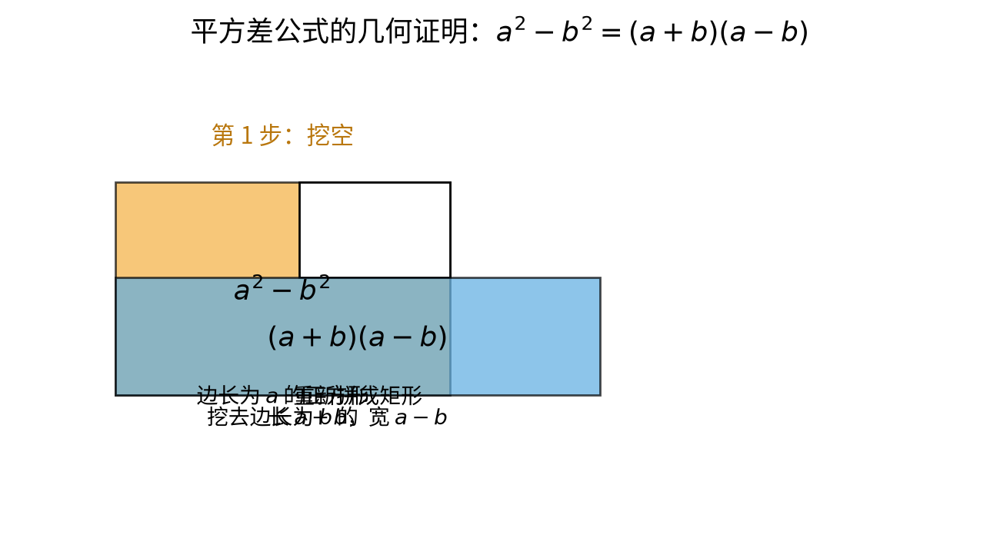

> **直观理解（现实类比）**：想象一块边长为 $a$ 的**大地毯**，角落被剪掉一块边长为 $b$ 的小方块。剩下的部分面积当然是 $a^2 - b^2$。这些剩余布料的形状虽然不规则，但只要沿折线剪开再拼一拼，就能拼成一个长为 $(a+b)$、宽为 $(a-b)$ 的矩形——面积不变，于是 $a^2-b^2=(a+b)(a-b)$。**"和与差相乘"恰好就是"剪下来再拼回去"的数学表达。**

**示例**：$(x + 3)(x - 3) = x^2 - 9$

---

##### 公式二：完全平方公式

$$
(a + b)^2 = a^2 + 2ab + b^2
$$
$$
(a - b)^2 = a^2 - 2ab + b^2
$$

**推导**：$(a+b)^2$ 就是 $(a+b)(a+b)$，用分配律展开：

$$
(a + b)(a + b) = a \cdot a + a \cdot b + b \cdot a + b \cdot b = a^2 + ab + ab + b^2 = a^2 + 2ab + b^2
$$

$(a-b)^2$ 同理：

$$
(a - b)(a - b) = a^2 - ab - ab + b^2 = a^2 - 2ab + b^2
$$

**思考过程——怎么想到这个公式的？**

> 第一步：从"自己乘自己"出发。$(a+b)^2$ 意味着两个完全相同的因式相乘。展开后得到四项，其中 $a \cdot b$ 和 $b \cdot a$ 是**相同的**（都等于 $ab$），所以合并为 $2ab$。
>
> 第二步：为什么是 $2ab$ 而不是 $ab$？因为 $(a+b)$ 和 $(a+b)$ 完全一样，交叉项 $a \cdot b$ 出现了**两次**（第一个括号的 $a$ 配第二个括号的 $b$，以及第一个括号的 $b$ 配第二个括号的 $a$）。这就是"完全"二字的含义——两项完全相同，交叉贡献翻倍。
>
> 第三步：为什么 $(a-b)^2$ 的结果也是正的 $b^2$？因为 $(-b) \times (-b) = b^2$（负负得正）。所以无论加减，完全平方展开后的首项和末项**永远是正的**。
>
> 第四步：几何直觉。边长为 $(a+b)$ 的正方形可以分成四块：一个 $a \times a$ 的大正方形、一个 $b \times b$ 的小正方形、两个 $a \times b$ 的矩形。总面积 = $a^2 + ab + ab + b^2 = a^2 + 2ab + b^2$。
>
> **核心洞察**：两个相同因式相乘，交叉项出现两次，所以中间项系数为 $2$。


> **直观理解（现实类比）**：想象铺设一块边长为 $a+b$ 的**正方形花砖**。整块面积是 $(a+b)^2$。但若把它按"大方块 $a^2$ + 两条长条 $ab$ 和 $ab$ + 小方块 $b^2$"来分，就得到 $a^2 + 2ab + b^2$。**图中的中间项 $2ab$ 正是那两块完全相同的长条**——这就是"为什么中间项系数是 2"的几何答案。

**示例**：
- $(2x + 5)^2 = 4x^2 + 20x + 25$
- $(3a - 2b)^2 = 9a^2 - 12ab + 4b^2$

---

##### 公式三：立方和与立方差公式

$$
a^3 + b^3 = (a + b)(a^2 - ab + b^2)
$$
$$
a^3 - b^3 = (a - b)(a^2 + ab + b^2)
$$

**推导**（以立方和为例）：用分配律展开右边验证：

$$
\begin{aligned}
(a + b)(a^2 - ab + b^2) &= a \cdot a^2 + a \cdot (-ab) + a \cdot b^2 + b \cdot a^2 + b \cdot (-ab) + b \cdot b^2 \\
&= a^3 - a^2b + ab^2 + a^2b - ab^2 + b^3 \\
&= a^3 + b^3
\end{aligned}
$$

中间四项 $-a^2b + a^2b$ 和 $ab^2 - ab^2$ 互相抵消。立方差同理可证。

**思考过程——这个公式是怎么被发现的？**

> 第一步：从平方差公式类比。我们已经知道 $a^2 - b^2 = (a+b)(a-b)$。一个自然的推广问题是：$a^3 - b^3$ 能不能也分解因式？$a^3 + b^3$ 呢？
>
> 第二步：猜测因式的结构。如果 $a^3 - b^3$ 能分解，其中一个因式很可能是 $(a - b)$（因为当 $a = b$ 时，$a^3 - b^3 = 0$，说明 $(a-b)$ 应该是一个因式——这就是**因式分解定理**的思想，见 3.4 节）。
>
> 第三步：确定另一个因式。$a^3 - b^3$ 是三次式，$(a-b)$ 是一次式，所以另一个因式必须是**二次式**。设：
> $$a^3 - b^3 = (a - b)(a^2 + \square \cdot ab + \square \cdot b^2)$$
> 展开右边并与左边对比系数：
> - $a^3$ 项：$a \cdot a^2 = a^3$ ✅ 已匹配
> - $b^3$ 项：$(-b) \cdot (\square \cdot b^2) = -b^3$，所以 $\square = 1$，即 $b^2$ 的系数为 $1$
> - $a^2b$ 项：$a \cdot (\square \cdot ab) + (-b) \cdot a^2 = 0$（因为左边没有 $a^2b$ 项），所以 $\square - 1 = 0$，即 $ab$ 的系数为 $1$
>
> 因此另一个因式为 $a^2 + ab + b^2$，即：
> $$a^3 - b^3 = (a - b)(a^2 + ab + b^2)$$
>
> 第四步：立方和怎么办？用同样的思路——当 $a = -b$ 时，$a^3 + b^3 = (-b)^3 + b^3 = 0$，所以 $(a + b)$ 是一个因式。设 $a^3 + b^3 = (a + b)(a^2 + \square \cdot ab + b^2)$，对比系数可得 $\square = -1$：
> $$a^3 + b^3 = (a + b)(a^2 - ab + b^2)$$
>
> 第五步：记忆规律。对比两个公式：
> - 立方**和** $a^3 + b^3$ → 因式 $(a+b)$，括号内符号为 "$-+-$"（减、加）
> - 立方**差** $a^3 - b^3$ → 因式 $(a-b)$，括号内符号为 "$+++$"（全加）
>
> 规律：**一次因式的符号与原始运算一致**，括号内的中间项符号**总是与原始运算相反**。
>
> **核心洞察**：从已知的平方差公式出发，通过"猜测因式 → 待定系数 → 对比验证"的方法，自然推导出立方和/差公式。这个方法（待定系数法）是发现新公式的通用策略。

### 2.3 多项式运算规则（定理与证明）

**定理 1（多项式加法交换律）**：两个多项式相加，交换加数的位置，和不变。

$$
P(x) + Q(x) = Q(x) + P(x)
$$

**定理 2（多项式加法结合律）**：三个多项式相加，先把前两个相加，或先把后两个相加，和不变。

$$
(P(x) + Q(x)) + R(x) = P(x) + (Q(x) + R(x))
$$

**定理 3（多项式乘法分配律）**：多项式乘法对加法满足分配律。

$$
P(x) \cdot (Q(x) + R(x)) = P(x) \cdot Q(x) + P(x) \cdot R(x)
$$

**证明思路**：以上定理均可由实数的运算律直接推广得到，因为多项式中的变量 $x$ 在代入具体数值时，运算归结为实数的运算。

---

## 三、因式分解

**因式分解**是把一个多项式分解为两个或多个因式的乘积的过程。它是多项式乘法的逆运算。

### 3.1 提取公因式法

找出各项的公因式，将其提取到括号外面。

**示例**：因式分解 $6x^3 + 9x^2 - 3x$

$$
6x^3 + 9x^2 - 3x = 3x(2x^2 + 3x - 1)
$$

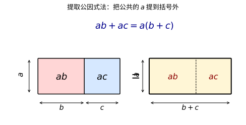

> **直观理解（现实类比）**：提取公因式像把两个矩形（$ab$ 和 $ac$）合并成一个大矩形 $a(b+c)$——公共边 $a$ 提到外面，剩下的 $(b+c)$ 放进括号。
> - 把 $6x^3$、$9x^2$、$-3x$ 想成三块"并列的矩形"，它们共享的"宽度"是 $3x$，把它抽出来后，里面只剩各自不同的"长度" $2x^2$、$3x$、$-1$。
> - 几何上相当于把三块矩形重新拼成"宽 $3x$、长 $(2x^2+3x-1)$"的一个大矩形——面积不变，只是换了一种摆放方式。
> - 这正是分配律 $a(b+c)=ab+ac$ 的**逆向操作**：乘法把"一个矩形切成多块"，因式分解把"多块拼回一个矩形"。

### 3.2 公式法

利用乘法公式反过来进行因式分解。

**平方差公式**：
$$
a^2 - b^2 = (a + b)(a - b)
$$

**完全平方公式**：
$$
a^2 + 2ab + b^2 = (a + b)^2
$$
$$
a^2 - 2ab + b^2 = (a - b)^2
$$

**立方和与立方差公式**：
$$
a^3 + b^3 = (a + b)(a^2 - ab + b^2)
$$
$$
a^3 - b^3 = (a - b)(a^2 + ab + b^2)
$$

**示例**：
- $x^2 - 25 = (x + 5)(x - 5)$
- $4x^2 - 12x + 9 = (2x - 3)^2$
- $8x^3 + 27 = (2x + 3)(4x^2 - 6x + 9)$

### 3.3 十字相乘法

对于二次三项式 $x^2 + (a+b)x + ab$，可分解为 $(x + a)(x + b)$。

更一般地，对于 $ax^2 + bx + c$，若能将 $a$ 分解为 $a_1 \cdot a_2$，$c$ 分解为 $c_1 \cdot c_2$，且 $a_1c_2 + a_2c_1 = b$，则：

$$
ax^2 + bx + c = (a_1x + c_1)(a_2x + c_2)
$$

**示例**：因式分解 $x^2 + 5x + 6$

寻找两个数 $a$、$b$，使得 $a + b = 5$，$a \cdot b = 6$。显然 $a = 2$，$b = 3$。

$$
x^2 + 5x + 6 = (x + 2)(x + 3)
$$

**示例**：因式分解 $2x^2 + 7x + 3$

$$
2x^2 + 7x + 3 = (2x + 1)(x + 3)
$$


> **直观理解（现实类比）**：十字相乘像"**相亲配对**"——把二次项 $ax^2$ 和常数项 $c$ 各拆成两个因子，画十字交叉相乘，看哪对组合相加恰好等于一次项 $bx$。
> - 对 $2x^2+7x+3$：把 $2x^2$ 拆成 $2x\cdot x$，把 $3$ 拆成 $3\cdot 1$，交叉相乘得 $2x\cdot1+x\cdot3=5x$（不对）和 $2x\cdot3+x\cdot1=7x$（对！），所以配对成功。
> - "十字"的两条对角线就是在试两种配对方案，哪条线上的乘积之和等于 $b$，就选那条。
> - 这比死记公式更灵活：当 $a\neq1$ 时，十字相乘把"拆二次项"和"拆常数项"两件事并列处理，一眼就能看出答案。

### 3.4 因式分解定理（Factor Theorem）

**定理**：设 $f(x)$ 是一个多项式，$c$ 是一个常数。若 $f(c) = 0$，则 $(x - c)$ 是 $f(x)$ 的一个因式。反之，若 $(x - c)$ 是 $f(x)$ 的一个因式，则 $f(c) = 0$。

**证明**：

由多项式除法，用 $(x - c)$ 除 $f(x)$，可得商式 $q(x)$ 和余数 $r$（$r$ 为常数）：
$$
f(x) = (x - c)q(x) + r
$$
将 $x = c$ 代入上式：
$$
f(c) = (c - c)q(c) + r = 0 + r = r
$$

因此，$f(c) = 0$ 当且仅当 $r = 0$，即 $(x - c)$ 整除 $f(x)$。这就证明了定理。

**示例**：判断 $x - 2$ 是否是 $f(x) = x^3 - 3x^2 + 4$ 的因式。

计算 $f(2) = 2^3 - 3 \cdot 2^2 + 4 = 8 - 12 + 4 = 0$，所以 $(x - 2)$ 是 $f(x)$ 的因式。

验证：$x^3 - 3x^2 + 4 = (x - 2)(x^2 - x - 2)$

---

## 四、方程

### 4.1 一元一次方程

形如 $ax + b = 0$（$a \neq 0$）的方程称为一元一次方程。

**解法**：移项、合并同类项、系数化为 1。

**示例**：解方程 $3x - 7 = 2x + 5$

$$
\begin{aligned}
3x - 7 &= 2x + 5 \\
3x - 2x &= 5 + 7 \\
x &= 12
\end{aligned}
$$

### 4.2 一元二次方程

形如 $ax^2 + bx + c = 0$（$a \neq 0$）的方程称为一元二次方程。

#### 解法一：因式分解法

若方程可分解为 $a(x - x_1)(x - x_2) = 0$，则 $x = x_1$ 或 $x = x_2$。

**示例**：解方程 $x^2 - 5x + 6 = 0$

因式分解：$(x - 2)(x - 3) = 0$，所以 $x_1 = 2$，$x_2 = 3$。

#### 解法二：配方法

**示例**：解方程 $x^2 + 6x + 7 = 0$

$$
\begin{aligned}
x^2 + 6x + 7 &= 0 \\
x^2 + 6x &= -7 \\
x^2 + 6x + 9 &= -7 + 9 \\
(x + 3)^2 &= 2 \\
x + 3 &= \pm \sqrt{2} \\
x &= -3 \pm \sqrt{2}
\end{aligned}
$$

#### 解法三：求根公式法

**定理（二次方程求根公式）**：对于一元二次方程 $ax^2 + bx + c = 0$（$a \neq 0$），其根为：

$$
x = \frac{-b \pm \sqrt{b^2 - 4ac}}{2a}
$$

**推导（配方法）**：

$$
\begin{aligned}
ax^2 + bx + c &= 0 \quad (a \neq 0) \\
x^2 + \frac{b}{a}x + \frac{c}{a} &= 0 \quad \text{（两边同除以 } a \text{）} \\
x^2 + \frac{b}{a}x &= -\frac{c}{a} \\
x^2 + \frac{b}{a}x + \left(\frac{b}{2a}\right)^2 &= \left(\frac{b}{2a}\right)^2 - \frac{c}{a} \quad \text{（配方）} \\
\left(x + \frac{b}{2a}\right)^2 &= \frac{b^2}{4a^2} - \frac{c}{a} = \frac{b^2 - 4ac}{4a^2}
\end{aligned}
$$

令 $\Delta = b^2 - 4ac$，称为**判别式**。则：

$$
x + \frac{b}{2a} = \pm \sqrt{\frac{b^2 - 4ac}{4a^2}} = \pm \frac{\sqrt{b^2 - 4ac}}{2|a|}
$$

由于 $|a|$ 的符号可以并入 $\pm$ 中，因此：

$$
x = \frac{-b \pm \sqrt{b^2 - 4ac}}{2a}
$$

**判别式的意义**：
- 当 $\Delta > 0$ 时，方程有两个不相等的实数根
- 当 $\Delta = 0$ 时，方程有两个相等的实数根（重根）
- 当 $\Delta < 0$ 时，方程没有实数根，有一对共轭复数根

**示例**：用公式法解方程 $2x^2 - 4x - 3 = 0$

$$
\begin{aligned}
a &= 2, \quad b = -4, \quad c = -3 \\
\Delta &= b^2 - 4ac = (-4)^2 - 4 \cdot 2 \cdot (-3) = 16 + 24 = 40 \\
x &= \frac{-(-4) \pm \sqrt{40}}{2 \cdot 2} = \frac{4 \pm 2\sqrt{10}}{4} = \frac{2 \pm \sqrt{10}}{2}
\end{aligned}
$$

所以 $x_1 = \frac{2 + \sqrt{10}}{2}$，$x_2 = \frac{2 - \sqrt{10}}{2}$。

### 4.3 韦达定理（Vieta's Formulas）

**定理**：设一元二次方程 $ax^2 + bx + c = 0$（$a \neq 0$）的两个根为 $x_1$ 和 $x_2$，则：

$$
x_1 + x_2 = -\frac{b}{a}
$$
$$
x_1 \cdot x_2 = \frac{c}{a}
$$

**证明**：

设 $x_1$、$x_2$ 是方程 $ax^2 + bx + c = 0$ 的两个根，则多项式可分解为：

$$
ax^2 + bx + c = a(x - x_1)(x - x_2)
$$

展开右边：

$$
a(x - x_1)(x - x_2) = a[x^2 - (x_1 + x_2)x + x_1x_2] = ax^2 - a(x_1 + x_2)x + a x_1 x_2
$$

比较两边对应项的系数：

$$
\begin{cases}
b = -a(x_1 + x_2) \\
c = a x_1 x_2
\end{cases}
\Rightarrow
\begin{cases}
x_1 + x_2 = -\dfrac{b}{a} \\[1em]
x_1 x_2 = \dfrac{c}{a}
\end{cases}
$$

**示例**：已知方程 $x^2 - 5x + 6 = 0$，不解方程求两根之和与两根之积。

$$
x_1 + x_2 = -\frac{-5}{1} = 5, \quad x_1 \cdot x_2 = \frac{6}{1} = 6
$$

（验证：该方程的两根为 $2$ 和 $3$，确实 $2 + 3 = 5$，$2 \times 3 = 6$。）

**示例**：已知方程 $2x^2 + 3x - 4 = 0$ 的两根为 $x_1$、$x_2$，求 $x_1^2 + x_2^2$ 的值。

$$
\begin{aligned}
x_1 + x_2 &= -\frac{3}{2}, \quad x_1x_2 = \frac{-4}{2} = -2 \\
x_1^2 + x_2^2 &= (x_1 + x_2)^2 - 2x_1x_2 \\
&= \left(-\frac{3}{2}\right)^2 - 2 \cdot (-2) \\
&= \frac{9}{4} + 4 = \frac{25}{4}
\end{aligned}
$$

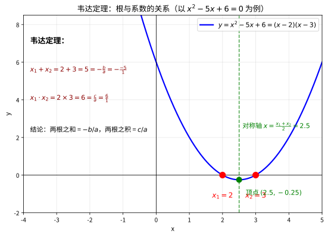

> **直观理解（现实类比）**：韦达定理像"通过两个孩子的总和与乘积反推他们各自是谁"——只要知道根之和 $x_1+x_2=-b/a$ 与根之积 $x_1x_2=c/a$，就能重建整个二次方程 $x^2-(x_1+x_2)x+x_1x_2=0$。
> - 根之和告诉你两根的"重心"，根之积告诉你两根的"整体规模"。
> - 二次方程 $ax^2+bx+c=0$ 的全部信息，其实只藏在两个数（和、积）里，系数 $a,b,c$ 只是它们的"伪装"。
> - 这也是为什么求 $x_1^2+x_2^2$ 时不必先解出两根，只用 $(x_1+x_2)^2-2x_1x_2$ 即可——韦达定理把"解方程"翻译成了"算对称式"。

---

## 五、二项式定理

### 5.1 定理陈述

**二项式定理**：对于任意非负整数 $n$，有：

$$
(a + b)^n = \sum_{k=0}^{n} \binom{n}{k} a^{n-k} b^k
$$

其中 $\displaystyle \binom{n}{k} = \frac{n!}{k!(n-k)!}$ 称为**二项式系数**，$n! = n \times (n-1) \times \cdots \times 2 \times 1$ 表示 $n$ 的阶乘。

### 5.2 从排列组合理解二项式定理

#### 核心问题：为什么展开式的系数是组合数 $\binom{n}{k}$？

二项式定理的公式中出现了组合数 $\binom{n}{k}$，这看起来并不自然——展开一个代数式，跟"从 $n$ 个东西中选 $k$ 个"有什么关系？下面我们从最基本的乘法原理出发，一步步揭示这个联系。

#### 第一步：从具体例子入手——展开 $(a + b)^3$

$(a + b)^3 = (a + b)(a + b)(a + b)$，即三个括号相乘。

根据乘法原理，展开的过程是：**从每个括号中各选一项（选 $a$ 或选 $b$），然后把选出的三项乘在一起**。所有可能的选法汇总起来，就是展开式的全部项。

列出所有选法：

| 选法 | 从第1个括号选 | 从第2个括号选 | 从第3个括号选 | 乘积 |
|:----:|:----------:|:----------:|:----------:|:----:|
| 1 | $a$ | $a$ | $a$ | $a^3$ |
| 2 | $a$ | $a$ | $b$ | $a^2b$ |
| 3 | $a$ | $b$ | $a$ | $a^2b$ |
| 4 | $a$ | $b$ | $b$ | $ab^2$ |
| 5 | $b$ | $a$ | $a$ | $a^2b$ |
| 6 | $b$ | $a$ | $b$ | $ab^2$ |
| 7 | $b$ | $b$ | $a$ | $ab^2$ |
| 8 | $b$ | $b$ | $b$ | $b^3$ |

合并同类项：

$$
(a + b)^3 = a^3 + 3a^2b + 3ab^2 + b^3
$$

#### 第二步：观察规律——组合数的出现

观察上面的表格，关键发现是：

- **$a^3$** 出现了 $1$ 次：3 个括号都选 $a$，即从 3 个括号中选 0 个取 $b$ → $\binom{3}{0} = 1$
- **$a^2b$** 出现了 $3$ 次：3 个括号中有 1 个选了 $b$，即从 3 个括号中选 1 个取 $b$ → $\binom{3}{1} = 3$
- **$ab^2$** 出现了 $3$ 次：3 个括号中有 2 个选了 $b$，即从 3 个括号中选 2 个取 $b$ → $\binom{3}{2} = 3$
- **$b^3$** 出现了 $1$ 次：3 个括号都选 $b$，即从 3 个括号中选 3 个取 $b$ → $\binom{3}{3} = 1$

> **本质原因**：展开 $(a+b)^3$ 时，$a^2b$ 这一项的含义是"3 个括号中有 1 个贡献了 $b$，其余 2 个贡献了 $a$"。而"从 3 个括号中选 1 个取 $b$"恰好就是一个**组合问题**，方案数为 $\binom{3}{1} = 3$。

#### 第三步：推广到一般情况——$(a + b)^n$

$(a + b)^n$ 是 $n$ 个括号相乘。展开时，从每个括号中各选 $a$ 或 $b$。

要得到 $a^{n-k} b^k$ 这一项，需要**从 $n$ 个括号中恰好选出 $k$ 个取 $b$**（其余 $n - k$ 个自然取 $a$）。从 $n$ 个括号中选 $k$ 个的方案数就是组合数：

$$
\binom{n}{k} = \frac{n!}{k!(n-k)!}
$$

因此 $a^{n-k} b^k$ 的系数恰好是 $\binom{n}{k}$，对所有 $k = 0, 1, 2, \dots, n$ 求和就得到二项式定理：

$$
(a + b)^n = \sum_{k=0}^{n} \binom{n}{k} a^{n-k} b^k
$$

#### 第四步：用组合视角重新理解展开式的结构

有了组合解释，展开式的每个特点都不再是"规定"，而是"必然"：

| 结构特点 | 组合解释 |
|:--------:|:---------|
| 共有 $n + 1$ 项 | $k$ 可以取 $0, 1, 2, \dots, n$，共 $n + 1$ 个值 |
| $a$ 的指数从 $n$ 递减到 $0$ | 选了 $k$ 个 $b$，剩下的 $n - k$ 个都是 $a$ |
| $b$ 的指数从 $0$ 递增到 $n$ | $k$ 从 $0$ 增加到 $n$ |
| 系数为 $\binom{n}{k}$ | 从 $n$ 个括号中选 $k$ 个取 $b$ 的方案数 |
| 系数对称 $\binom{n}{k} = \binom{n}{n-k}$ | "选 $k$ 个取 $b$"等价于"选 $n-k$ 个取 $a$"——选法数相同 |
| 所有系数之和为 $2^n$ | 每个括号有 2 种选法（$a$ 或 $b$），$n$ 个括号共 $2^n$ 种选法 |

#### 第五步：一个直观的类比

> 想象 $n$ 个人排成一排，每个人手里有两个球：一个红球（代表 $a$）和一个蓝球（代表 $b$）。每个人从自己手里的两个球中选一个举起来。
>
> - 如果 $k$ 个人举蓝球、$n-k$ 个人举红球，那么场上就是 $a^{n-k} b^k$ 的局面。
> - "哪些人举了蓝球"的不同选法有 $\binom{n}{k}$ 种，所以 $a^{n-k} b^k$ 的系数就是 $\binom{n}{k}$。
>
> 这就是二项式定理的组合本质：**展开式的系数就是在描述"选择方案数"**。

### 5.3 杨辉三角（帕斯卡三角）

二项式系数可以排成如下三角形（杨辉三角）：

```
n=0:        1
n=1:       1 1
n=2:      1 2 1
n=3:     1 3 3 1
n=4:    1 4 6 4 1
n=5:   1 5 10 10 5 1
```

每个数等于它上方两数之和。

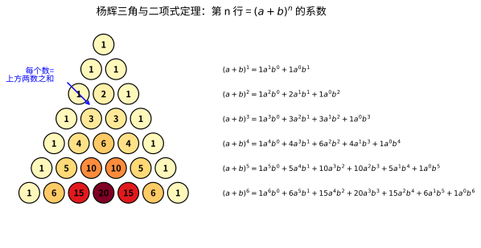

> **直观理解（现实类比）**：杨辉三角像一棵**家谱树**——每个数都是它"双亲"（上方相邻两个数）之和，例如第 4 行的 $6=3+3$、$4=3+1$，子代的"血统"完全由上一代决定。
> - 二项式展开 $(a+b)^n$ 像"把 $n$ 个括号拆成所有可能的 $a$ 与 $b$ 组合"：每一项 $a^{n-k}b^k$ 对应"从 $n$ 个括号中挑 $k$ 个取 $b$"的方案数 $\binom{n}{k}$。
> - 三角形第 $n$ 行的第 $k$ 个数恰好就是 $\binom{n}{k}$，所以杨辉三角本身就是"二项式系数的可视化家谱"。
> - 家谱的左右对称（$\binom{n}{k}=\binom{n}{n-k}$）对应"选 $k$ 个 $b$"和"选 $n-k$ 个 $a$"本质相同。

### 5.4 证明（数学归纳法）

**基础情况**：当 $n = 0$ 时，$(a + b)^0 = 1$，而 $\sum_{k=0}^{0} \binom{0}{k} a^{0-k} b^k = \binom{0}{0} a^0 b^0 = 1$，成立。

**归纳步骤**：假设 $n = m$ 时定理成立，即：

$$
(a + b)^m = \sum_{k=0}^{m} \binom{m}{k} a^{m-k} b^k
$$

则当 $n = m + 1$ 时：

$$
\begin{aligned}
(a + b)^{m+1} &= (a + b)(a + b)^m \\
&= (a + b) \sum_{k=0}^{m} \binom{m}{k} a^{m-k} b^k \\
&= a \sum_{k=0}^{m} \binom{m}{k} a^{m-k} b^k + b \sum_{k=0}^{m} \binom{m}{k} a^{m-k} b^k \\
&= \sum_{k=0}^{m} \binom{m}{k} a^{m+1-k} b^k + \sum_{k=0}^{m} \binom{m}{k} a^{m-k} b^{k+1}
\end{aligned}
$$

令第二个求和中的 $j = k + 1$，则 $k = j - 1$，$j$ 从 $1$ 到 $m+1$：

$$
\begin{aligned}
(a + b)^{m+1} &= \sum_{k=0}^{m} \binom{m}{k} a^{m+1-k} b^k + \sum_{j=1}^{m+1} \binom{m}{j-1} a^{m+1-j} b^j \\
&= \binom{m}{0} a^{m+1} + \sum_{k=1}^{m} \left[\binom{m}{k} + \binom{m}{k-1}\right] a^{m+1-k} b^k + \binom{m}{m} b^{m+1}
\end{aligned}
$$

由组合恒等式 $\binom{m}{k} + \binom{m}{k-1} = \binom{m+1}{k}$，且 $\binom{m}{0} = \binom{m+1}{0}$，$\binom{m}{m} = \binom{m+1}{m+1}$，得：

$$
(a + b)^{m+1} = \sum_{k=0}^{m+1} \binom{m+1}{k} a^{m+1-k} b^k
$$

因此 $n = m + 1$ 时定理也成立。由数学归纳法，二项式定理对所有非负整数 $n$ 成立。∎

### 5.5 示例

**示例 1**：展开 $(x + 2)^3$

$$
\begin{aligned}
(x + 2)^3 &= \binom{3}{0} x^3 \cdot 2^0 + \binom{3}{1} x^2 \cdot 2^1 + \binom{3}{2} x^1 \cdot 2^2 + \binom{3}{3} x^0 \cdot 2^3 \\
&= 1 \cdot x^3 \cdot 1 + 3 \cdot x^2 \cdot 2 + 3 \cdot x \cdot 4 + 1 \cdot 1 \cdot 8 \\
&= x^3 + 6x^2 + 12x + 8
\end{aligned}
$$

**示例 2**：展开 $(1 - x)^4$

$$
\begin{aligned}
(1 - x)^4 &= \sum_{k=0}^{4} \binom{4}{k} 1^{4-k} (-x)^k \\
&= \binom{4}{0} \cdot 1 + \binom{4}{1} (-x) + \binom{4}{2} (-x)^2 + \binom{4}{3} (-x)^3 + \binom{4}{4} (-x)^4 \\
&= 1 - 4x + 6x^2 - 4x^3 + x^4
\end{aligned}
$$

**示例 3**：求 $(2x + 3y)^5$ 展开式中 $x^3y^2$ 项的系数。

通项公式：$\binom{5}{k} (2x)^{5-k} (3y)^k$

要求 $x^3y^2$，即 $5 - k = 3$，$k = 2$。

系数为：
$$
\binom{5}{2} \cdot 2^{3} \cdot 3^{2} = 10 \cdot 8 \cdot 9 = 720
$$

---

## 六、指数与对数

### 6.1 指数运算法则

**定义**：设 $a > 0$，$m, n$ 为实数，则以下法则成立：

| 法则 | 公式 | 说明 |
|:----:|:----:|:-----|
| 同底数幂相乘 | $a^m \cdot a^n = a^{m+n}$ | 指数相加 |
| 同底数幂相除 | $\dfrac{a^m}{a^n} = a^{m-n}$ | 指数相减 |
| 幂的乘方 | $(a^m)^n = a^{mn}$ | 指数相乘 |
| 积的乘方 | $(ab)^n = a^n b^n$ | 分别乘方 |
| 零指数幂 | $a^0 = 1$ | 任何非零数的零次幂为1 |
| 负指数幂 | $a^{-n} = \dfrac{1}{a^n}$ | 负指数取倒数 |
| 分数指数幂 | $a^{\frac{m}{n}} = \sqrt[n]{a^m}$ | 根式与幂的转换 |

**证明（同底数幂相乘）**：由正整数指数的定义，$a^m$ 表示 $m$ 个 $a$ 相乘，$a^n$ 表示 $n$ 个 $a$ 相乘。因此 $a^m \cdot a^n$ 共有 $m+n$ 个 $a$ 相乘，即 $a^{m+n}$。

**证明（零指数幂）**：为使 $a^m \cdot a^0 = a^{m+0} = a^m$ 成立，必须有 $a^0 = 1$。

**证明（负指数幂）**：为使 $a^n \cdot a^{-n} = a^{n-n} = a^0 = 1$ 成立，定义 $a^{-n} = \dfrac{1}{a^n}$。

**示例**：计算 $2^3 \cdot 2^5$。

$$
2^3 \cdot 2^5 = 2^{3+5} = 2^8 = 256
$$

### 6.2 指数函数

**定义**：形如 $f(x) = a^x$（$a > 0$，$a \neq 1$）的函数称为**指数函数**，其中 $a$ 称为**底数**。

**图像特征**：

| 性质 | $a > 1$（如 $y = 2^x$） | $0 < a < 1$（如 $y = \left(\dfrac{1}{2}\right)^x$） |
|:----:|:------------------------:|:---------------------------------------------------:|
| 定义域 | $\mathbb{R}$（全体实数） | $\mathbb{R}$ |
| 值域 | $(0, +\infty)$ | $(0, +\infty)$ |
| 过定点 | $(0, 1)$ | $(0, 1)$ |
| 单调性 | 单调递增 | 单调递减 |
| 渐近线 | $y = 0$（$x$ 轴） | $y = 0$（$x$ 轴） |

**指数函数的图像**：

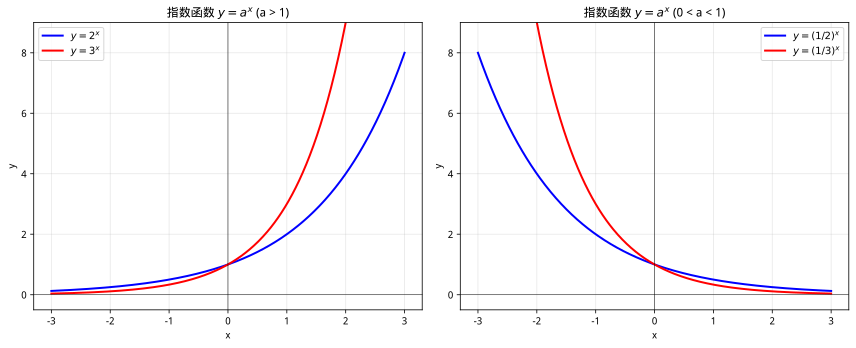

**重要性质**：
1. **指数增长**：当 $a > 1$ 时，$x$ 增大，$y$ 急剧增大（如细菌繁殖、复利增长）
2. **指数衰减**：当 $0 < a < 1$ 时，$x$ 增大，$y$ 急剧减小（如放射性衰变、药物代谢）
3. **恒正性**：$a^x > 0$ 对所有实数 $x$ 成立

**示例**：比较 $2^{3.5}$ 和 $2^{4}$ 的大小。

因为底数 $2 > 1$，指数函数 $y = 2^x$ 单调递增，且 $3.5 < 4$，所以 $2^{3.5} < 2^4$。

### 6.3 对数的概念

**定义**：若 $a^b = N$（$a > 0$，$a \neq 1$），则 $b = \log_a N$，称为**以 $a$ 为底 $N$ 的对数**。

其中：
- $a$ 称为**底数**
- $N$ 称为**真数**
- $b$ 称为**对数**

**特殊对数**：
- **常用对数**：以 10 为底，记作 $\lg N$ 或 $\log_{10} N$
- **自然对数**：以 $e \approx 2.71828$ 为底，记作 $\ln N$ 或 $\log_e N$

**对数与指数的关系**：

$$
a^b = N \iff b = \log_a N
$$

**示例**：
- $2^3 = 8 \iff \log_2 8 = 3$
- $10^2 = 100 \iff \lg 100 = 2$
- $e^1 = e \iff \ln e = 1$

### 6.4 对数运算法则

设 $a > 0$，$a \neq 1$，$M, N > 0$，$n$ 为实数，则：

| 法则 | 公式 | 说明 |
|:----:|:----:|:-----|
| 积的对数 | $\log_a(MN) = \log_a M + \log_a N$ | 乘法变加法 |
| 商的对数 | $\log_a \dfrac{M}{N} = \log_a M - \log_a N$ | 除法变减法 |
| 幂的对数 | $\log_a M^n = n \log_a M$ | 幂运算变乘法 |
| 换底公式 | $\log_a b = \dfrac{\log_c b}{\log_c a}$ | 统一底数 |
| 对数恒等式 | $a^{\log_a N} = N$ | 指数与对数互逆 |
| 1的对数 | $\log_a 1 = 0$ | 任何底数的1的对数为0 |
| 底数的对数 | $\log_a a = 1$ | 底数的对数为1 |

**证明（积的对数）**：设 $\log_a M = x$，$\log_a N = y$，则 $a^x = M$，$a^y = N$。于是：

$$
MN = a^x \cdot a^y = a^{x+y}
$$

由对数定义得 $\log_a(MN) = x + y = \log_a M + \log_a N$。∎

**证明（换底公式）**：设 $\log_a b = x$，则 $a^x = b$。两边取以 $c$ 为底的对数：

$$
\log_c(a^x) = \log_c b \implies x \log_c a = \log_c b
$$

解得 $x = \dfrac{\log_c b}{\log_c a}$，即 $\log_a b = \dfrac{\log_c b}{\log_c a}$。∎

**示例**：计算 $\log_2 8 + \log_2 4$。

$$
\log_2 8 + \log_2 4 = \log_2(8 \times 4) = \log_2 32 = 5
$$

验证：$\log_2 8 = 3$，$\log_2 4 = 2$，$3 + 2 = 5$。✓

### 6.5 对数函数

**定义**：形如 $f(x) = \log_a x$（$a > 0$，$a \neq 1$）的函数称为**对数函数**，其中 $a$ 称为**底数**。

**图像特征**：

| 性质 | $a > 1$（如 $y = \log_2 x$） | $0 < a < 1$（如 $y = \log_{\frac{1}{2}} x$） |
|:----:|:----------------------------:|:--------------------------------------------:|
| 定义域 | $(0, +\infty)$ | $(0, +\infty)$ |
| 值域 | $\mathbb{R}$ | $\mathbb{R}$ |
| 过定点 | $(1, 0)$ | $(1, 0)$ |
| 单调性 | 单调递增 | 单调递减 |
| 渐近线 | $x = 0$（$y$ 轴） | $x = 0$（$y$ 轴） |

**对数函数的图像**：


**重要性质**：
1. **对数增长**：当 $a > 1$ 时，$x$ 增大，$y$ 缓慢增大（增长越来越慢）
2. **对数衰减**：当 $0 < a < 1$ 时，$x$ 增大，$y$ 缓慢减小
3. **定义域限制**：$x > 0$，对数函数只在正实数上有定义

### 6.6 指数函数与对数函数的关系

**互为反函数**：指数函数 $y = a^x$ 与对数函数 $y = \log_a x$ 互为反函数。

**关系式**：

$$
y = a^x \iff x = \log_a y
$$

**图像关系**：两个函数的图像关于直线 $y = x$ 对称。


**示例**：已知 $f(x) = 2^x$，求 $f^{-1}(x)$。

设 $y = 2^x$，则 $x = \log_2 y$。交换 $x, y$ 得 $y = \log_2 x$，即 $f^{-1}(x) = \log_2 x$。

### 6.7 指数与对数的综合示例

**示例 1**：解方程 $2^x = 8$。

**解法一**：因为 $8 = 2^3$，所以 $2^x = 2^3$，得 $x = 3$。

**解法二**：两边取以 2 为底的对数：$\log_2(2^x) = \log_2 8$，即 $x = 3$。

**示例 2**：解方程 $\log_3(x + 1) = 2$。

由对数定义，$3^2 = x + 1$，即 $9 = x + 1$，得 $x = 8$。

**示例 3**：计算 $\log_2 5 \cdot \log_5 2$。

利用换底公式：

$$
\log_2 5 \cdot \log_5 2 = \frac{\ln 5}{\ln 2} \cdot \frac{\ln 2}{\ln 5} = 1
$$

**示例 4**：已知 $\lg 2 = a$，$\lg 3 = b$，求 $\lg 12$。

$$
\lg 12 = \lg(4 \times 3) = \lg 4 + \lg 3 = \lg 2^2 + \lg 3 = 2\lg 2 + \lg 3 = 2a + b
$$

**示例 5**：比较 $\log_2 3$ 和 $\log_3 2$ 的大小。

因为 $\log_2 3 > \log_2 2 = 1$，而 $\log_3 2 < \log_3 3 = 1$，所以 $\log_2 3 > \log_3 2$。

### 6.8 指数与对数的解题技巧

> 指数对数题目"想不到"的根源，往往是没有掌握**换底、恒等式、换元**这几把钥匙。下面按题型系统梳理。

#### 技巧 1：换底公式——统一底数

遇到不同底的对数相乘、比较，先用换底公式统一：

$$
\log_a b = \frac{\ln b}{\ln a} = \frac{\log_c b}{\log_c a}
$$

> **思路示范**：计算 $\log_2 3 \cdot \log_3 4 \cdot \log_4 8$。
>
> $$
> \log_2 3 \cdot \log_3 4 \cdot \log_4 8 = \frac{\ln 3}{\ln 2} \cdot \frac{\ln 4}{\ln 3} \cdot \frac{\ln 8}{\ln 4} = \frac{\ln 8}{\ln 2} = \log_2 8 = 3
> $$
>
> **要点**：换底后分子分母"首尾相消"，化为一层对数。

#### 技巧 2：对数恒等式——指数与对数互逆

$$
a^{\log_a N} = N, \qquad \log_a(a^x) = x
$$

> **思路示范**：计算 $2^{\log_2 5} + 3^{\log_3 4}$。
>
> 由恒等式 $2^{\log_2 5} = 5$，$3^{\log_3 4} = 4$，故原式 $= 5 + 4 = 9$。

#### 技巧 3：指数方程与对数方程的解法

- **指数方程**：先化成同底，再令指数相等；否则两边取对数。
- **对数方程**：化为同底后脱去对数；**最后必须检验定义域**（真数 > 0）。

> **思路示范**：解方程 $4^x - 2^{x+1} - 3 = 0$。
>
> **经典换元**：令 $t = 2^x$（$t > 0$），则 $4^x = t^2$，$2^{x+1} = 2t$。方程化为：
> $$
> t^2 - 2t - 3 = 0 \implies (t - 3)(t + 1) = 0
> $$
> 因为 $t > 0$，取 $t = 3$，即 $2^x = 3$，得 $x = \log_2 3$。**（若不限定 $t > 0$ 会误取 $t = -1$）**

#### 技巧 4：比较大小（对数的常用手段）

| 情形 | 方法 |
|:-----|:-----|
| 同底 | 直接看单调性 |
| 同真数 | 换底后比较，或借助图像 |
| 底数、真数都不同 | 找中间值（$0$、$1$、$\pm 1$） |
| 指数型 | 化为同底或用单调性 |

> **思路示范**：比较 $\log_2 3$ 与 $\log_3 4$ 的大小。
>
> 都大于 $1$，需找更细的中间值。$\log_2 3 > \log_2 2\sqrt{2} = \frac{3}{2}$，而 $\log_3 4 < \log_3 3\sqrt{3} = \frac{3}{2}$，故 $\log_2 3 > \log_3 4$。

#### 技巧 5：复合函数的单调性（同增异减）

对 $y = \log_a[g(x)]$ 或 $y = a^{g(x)}$，单调性取决于**外层与内层单调性的"同增同减"关系**：

- 外层增（$a > 1$）时，$y$ 与 $g(x)$ 同增减；
- 外层减（$0 < a < 1$）时，$y$ 与 $g(x)$ 反增减。

> **思路示范**：求 $y = \log_2(x^2 - 2x)$ 的单调递增区间。
>
> 先求定义域 $x^2 - 2x > 0 \Rightarrow x < 0$ 或 $x > 2$。外层 $\log_2$ 递增，故 $y$ 在 $g(x) = x^2 - 2x$ 递增的区间上递增。$g(x)$ 在 $x > 1$ 时递增，结合定义域得递增区间为 $(2, +\infty)$。**（必须先求定义域！）**

#### 技巧 6：换元求值域

含 $a^x$ 或 $\log_a x$ 的分式、二次结构，常用换元化为二次函数求值域，并**牢记换元后变量的取值范围**。

> **思路示范**：求 $y = \left(\frac{1}{2}\right)^{x^2 - 2x}$ 的值域。
>
> 设 $u = x^2 - 2x = (x-1)^2 - 1$，则 $u \geqslant -1$。$y = \left(\frac12\right)^u$ 在 $u \geqslant -1$ 上递减，故 $0 < y \leqslant \left(\frac12\right)^{-1} = 2$，值域为 $(0, 2]$。

### 6.9 微积分中的指数与对数使用技巧

> 进入微积分后，指数与对数因**求导、积分形式最简洁**而成为主角。核心是：**一切指数对数都向 $e$ 和 $\ln$ 靠拢**。

#### 技巧 1：$e$ 为什么如此重要

$$
(e^x)' = e^x, \qquad \int e^x\, dx = e^x + C
$$

$e^x$ 是**唯一导数为自身的函数**，这就是自然常数的"自然"之处。所有指数函数 $a^x$ 求导时都会出现 $\ln a$：

$$
(a^x)' = a^x \ln a
$$

#### 技巧 2：对数求导的万能写法

$$
\ln x \text{ 的导数简单：} (\ln x)' = \frac{1}{x}, \qquad (\log_a x)' = \frac{1}{x \ln a}
$$

**因此微积分中把一切对数都写成 $\ln$**（换底公式是桥梁）。

> **思路示范**：求 $y = \log_2 x$ 的导数。
>
> $$
> y = \frac{\ln x}{\ln 2}, \quad y' = \frac{1}{\ln 2} \cdot \frac{1}{x} = \frac{1}{x \ln 2}
> $$

#### 技巧 3：取对数求导法（对数微分法）

对 $y = f(x)^{g(x)}$ 型或含幂指函数的式子，两边取 $\ln$ 再求导：

> **思路示范**：求 $y = x^x$ 的导数。
>
> $$
> \ln y = x \ln x \implies \frac{y'}{y} = \ln x + 1 \implies y' = x^x (\ln x + 1)
> $$

#### 技巧 4：$\displaystyle\int \frac{1}{x}\, dx = \ln|x| + C$

对数函数最初正是为"幂函数积分砸到 $x^{-1}$"而生。这是连接代数与微积分的关键积分：

$$
\int x^n\, dx = \frac{x^{n+1}}{n+1} + C \ (n \neq -1), \qquad \int x^{-1}\, dx = \ln|x| + C
$$

#### 技巧 5：指数增长与衰减模型

微分方程 $y' = ky$ 的解就是指数函数 $y = Ce^{kx}$，用于复利、放射衰变、人口增长：

- $k > 0$：指数增长；$k < 0$：指数衰减
- 半衰期 $T$ 满足 $e^{kT} = \frac{1}{2}$

#### 技巧 6：含指数对数的积分常用手法

| 被积结构 | 手法 |
|:---------|:-----|
| $xe^x$ | 分部积分 |
| $x e^{x^2}$ | 凑微分（$e^{x^2}$ 的导数是 $2xe^{x^2}$） |
| $\dfrac{f'(x)}{f(x)}$ | 凑成 $\ln|f(x)|$ |
| $e^x \sin x$ | 分部积分（两次） |

> **思路示范**：求 $\displaystyle\int xe^{x^2}\, dx$。
>
> 令 $u = x^2$，$du = 2x\, dx$，则
> $$
> \int xe^{x^2}\, dx = \frac{1}{2}\int e^u\, du = \frac{1}{2}e^{x^2} + C
> $$

#### 微积分指数对数速查表

| 对象 | 导数 | 积分 | 关键点 |
|:-----|:-----|:-----|:-------|
| $e^x$ | $e^x$ | $e^x + C$ | 导数不变 |
| $a^x$ | $a^x\ln a$ | $\dfrac{a^x}{\ln a} + C$ | 出现 $\ln a$ |
| $\ln x$ | $\dfrac{1}{x}$ | $x\ln x - x + C$ | 定义域 $x>0$ |
| $\log_a x$ | $\dfrac{1}{x\ln a}$ | $\dfrac{x\ln x - x}{\ln a} + C$ | 换底为 $\ln$ |

---

## 七、不等式

**不等式**是表示两个数（或代数式）之间大小关系的式子，通常用符号 $>$、$<$、$\geqslant$、$\leqslant$ 连接。不等式是描述数量关系、刻画取值范围、求解优化问题的重要工具。

### 7.1 不等式的定义与基本性质

**定义**：用不等号（$>$、$<$、$\geqslant$、$\leqslant$、$\neq$）表示大小关系的式子称为**不等式**。例如 $2x + 1 > 5$、$x^2 \geqslant 0$。

实数的大小关系具有**三歧性**：对任意实数 $a, b$，下列三种关系有且只有一种成立：

$$
a > b, \quad a = b, \quad a < b
$$

不等式满足以下**基本性质**：

| 性质 | 内容 | 说明 |
|:----|:-----|:-----|
| **三歧性** | 对任意 $a, b$，恰有一个成立：$a > b$、$a = b$、$a < b$ | 总可以比较大小 |
| **传递性** | 若 $a > b$ 且 $b > c$，则 $a > c$ | 大小的链条关系 |
| **加法性质** | 若 $a > b$，则 $a + c > b + c$（同加同减不改变方向） | 两边同加一个数 |
| **乘法性质（正数）** | 若 $a > b$ 且 $c > 0$，则 $ac > bc$ | 乘正数不变号 |
| **乘法性质（负数）** | 若 $a > b$ 且 $c < 0$，则 $ac < bc$ | 乘负数要变号 |
| **同向相加** | 若 $a > b$ 且 $c > d$，则 $a + c > b + d$ | 同向不等式可相加 |
| **倒数性质** | 若 $a > b > 0$，则 $\frac{1}{a} < \frac{1}{b}$ | 正数取倒数方向反转 |

> **示例 1**：解不等式 $3x - 2 > 4$。
>
> 两边同加 $2$：$3x > 6$；两边同除以正数 $3$：$x > 2$。

> **示例 2**：解不等式 $-2x + 1 \geqslant 5$。
>
> 两边同加 $-1$：$-2x \geqslant 4$；两边同除以负数 $-2$，**方向改变**：$x \leqslant -2$。

**证明（乘法性质）**：若 $a > b$ 且 $c < 0$，则 $ac < bc$。

**证明**：因为 $a > b$，所以 $a - b > 0$。又 $c < 0$，故 $(a - b)c < 0$（正数乘负数为负数），即 $ac - bc < 0$，所以 $ac < bc$。$\blacksquare$

**证明（传递性）**：若 $a > b$ 且 $b > c$，则 $a > c$。

**证明**：由条件得 $a - b > 0$ 且 $b - c > 0$。两正数之和仍为正数，故 $(a - b) + (b - c) > 0$，即 $a - c > 0$，所以 $a > c$。$\blacksquare$

**证明（加法性质）**：若 $a > b$，则 $a + c > b + c$。

**证明**：$(a + c) - (b + c) = a - b$。由 $a > b$ 知 $a - b > 0$，故 $a + c > b + c$。$\blacksquare$

**证明（乘法性质·正数）**：若 $a > b$ 且 $c > 0$，则 $ac > bc$。

**证明**：$ac - bc = (a - b)c$。由 $a - b > 0$ 且 $c > 0$，两正数之积为正，故 $ac - bc > 0$，即 $ac > bc$。$\blacksquare$

**证明（同向相加）**：若 $a > b$ 且 $c > d$，则 $a + c > b + d$。

**证明**：由加法性质，$a > b \Rightarrow a + c > b + c$；又 $c > d \Rightarrow b + c > b + d$。由传递性得 $a + c > b + d$。$\blacksquare$

**证明（倒数性质）**：若 $a > b > 0$，则 $\dfrac{1}{a} < \dfrac{1}{b}$。

**证明**：$\dfrac{1}{a} - \dfrac{1}{b} = \dfrac{b - a}{ab}$。由 $a > b$ 知 $b - a < 0$，又 $a, b > 0$ 故 $ab > 0$，所以 $\dfrac{b - a}{ab} < 0$，即 $\dfrac{1}{a} < \dfrac{1}{b}$。$\blacksquare$

> **说明**：以上证明均从"正数之和（积）为正、负数之和（积）为负"这一实数基本事实出发，体现了不等式性质与数轴视图中"大小"的对应关系。

### 7.2 一元一次不等式及其解法

**定义**：只含一个未知数，且未知数的最高次数为 1 的不等式称为**一元一次不等式**，标准形式为：

$$
ax + b > 0 \quad (\text{或 } <, \geqslant, \leqslant, \text{其中 } a \neq 0)
$$

**解法步骤**：

1. 去分母、去括号（若乘负数，改变不等号方向）
2. 移项（变号）
3. 合并同类项，化为 $ax > b$（或 $<, \geqslant, \leqslant$）的形式
4. 两边同除以 $a$（注意 $a$ 的符号决定是否变号）
5. 用**数轴**表示解集

> **示例 3**：解不等式 $\frac{2x - 1}{3} \geqslant \frac{x + 2}{2}$。

两边同乘以 $6$：$2(2x - 1) \geqslant 3(x + 2)$，去括号：$4x - 2 \geqslant 3x + 6$，移项：$4x - 3x \geqslant 6 + 2$，得 $x \geqslant 8$。

**数轴表示**：在数轴上，从 $8$ 处向右画实心箭头（含端点 $8$，用实心点），表示解集 $\{x \mid x \geqslant 8\} = [8, +\infty)$。

| 解集类型 | 数轴画法 | 区间表示 |
|:---------|:---------|:---------|
| $x > a$ | 从 $a$ 向右，$a$ 用空心点 | $(a, +\infty)$ |
| $x \geqslant a$ | 从 $a$ 向右，$a$ 用实心点 | $[a, +\infty)$ |
| $x < a$ | 从 $a$ 向左，$a$ 用空心点 | $(-\infty, a)$ |
| $x \leqslant a$ | 从 $a$ 向左，$a$ 用实心点 | $(-\infty, a]$ |

### 7.3 一元二次不等式及其解法

**定义**：只含一个未知数，且最高次数为 2 的不等式称为**一元二次不等式**，标准形式为：

$$
ax^2 + bx + c > 0 \quad (\text{或 } <, \geqslant, \leqslant, \text{其中 } a \neq 0)
$$

**解法**：一元二次不等式的解集与二次函数 $y = ax^2 + bx + c$ 的图像、判别式 $\Delta = b^2 - 4ac$ 密切相关。设 $a > 0$ 且方程 $ax^2 + bx + c = 0$ 的两实根为 $x_1 < x_2$：

- 当 $\Delta > 0$ 时，$ax^2 + bx + c > 0$ 的解集为 $(-\infty, x_1) \cup (x_2, +\infty)$；$< 0$ 的解集为 $(x_1, x_2)$
- 当 $\Delta = 0$ 时，$ax^2 + bx + c \geqslant 0$ 的解集为 $\mathbb{R}$，$> 0$ 的解集为 $\mathbb{R} \setminus \{x_1\}$，$< 0$ 无解
- 当 $\Delta < 0$ 时，若 $a > 0$，则 $ax^2 + bx + c > 0$ 的解集为 $\mathbb{R}$，$< 0$ 无解

**数轴标根法（穿根法）**：画数轴，标出各根，从右上方开始穿线，遵循"奇穿偶不穿"（奇数次根穿过数轴，偶数次根不穿过），数轴上方的区间为正，下方的为负。

| $\Delta$ 值 | 图像（$a>0$） | $ax^2+bx+c>0$ 解集 | $ax^2+bx+c<0$ 解集 |
|:------------|:--------------|:------------------|:------------------|
| $\Delta > 0$ | 与 $x$ 轴交于两点 | $(-\infty, x_1) \cup (x_2, +\infty)$ | $(x_1, x_2)$ |
| $\Delta = 0$ | 与 $x$ 轴切于一点 | $(-\infty, x_1) \cup (x_1, +\infty)$ | 无解 |
| $\Delta < 0$ | 与 $x$ 轴无交点 | $\mathbb{R}$ | 无解 |

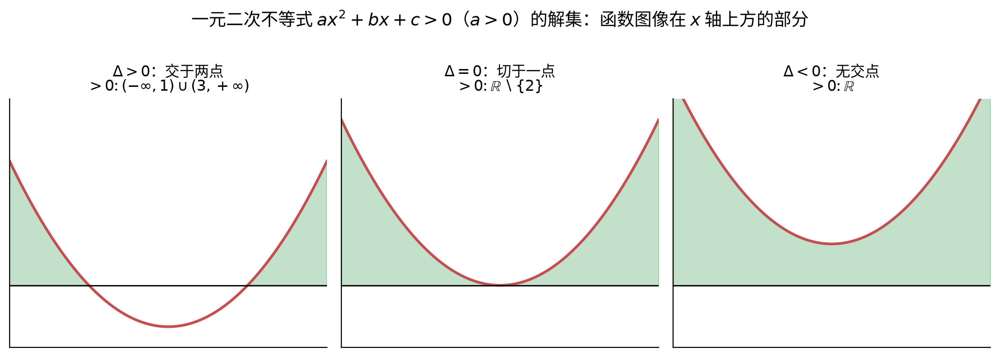

> **直观理解（现实类比）**：解 $ax^2+bx+c>0$，本质是问"二次函数的图像**在哪一段跑到了地面（$x$ 轴）以上**"。上图绿色阴影就是"跑在地面上方"的部分：
>
> - 绿色 = "$y>0$"，即解集；
> - 图像与 $x$ 轴的交点 = 方程的根，恰好是解集的**分界点**。
>
> 所以只要会画抛物线的草图像，不等式的解集就能**直接看图读出**，完全不用死记硬背三种情况。

**证明（$\Delta > 0$ 时解集的推导）**：设 $a > 0$，方程 $ax^2 + bx + c = 0$ 的两实根为 $x_1 < x_2$，则二次三项式可因式分解为：

$$
ax^2 + bx + c = a(x - x_1)(x - x_2)
$$

因为 $a > 0$，所以 $ax^2 + bx + c$ 的符号完全由 $(x - x_1)(x - x_2)$ 决定。可在数轴上把 $x_1, x_2$ 分成三个区间讨论：

| 区间 | $(x-x_1)$ 的符号 | $(x-x_2)$ 的符号 | $(x-x_1)(x-x_2)$ 的符号 |
|:-----|:----------------:|:----------------:|:----------------------:|
| $x < x_1$ | $-$ | $-$ | $+$ |
| $x_1 < x < x_2$ | $+$ | $-$ | $-$ |
| $x > x_2$ | $+$ | $+$ | $+$ |

故 $ax^2 + bx + c > 0$ 的解集为 $(-\infty, x_1) \cup (x_2, +\infty)$，$< 0$ 的解集为 $(x_1, x_2)$。$\blacksquare$

**证明（$\Delta < 0$ 时解集为 $\mathbb{R}$）**：设 $a > 0$。由配方法：

$$
ax^2 + bx + c = a\left(x + \frac{b}{2a}\right)^2 + \frac{4ac - b^2}{4a} = a\left(x + \frac{b}{2a}\right)^2 - \frac{\Delta}{4a}
$$

当 $\Delta < 0$ 时 $-\dfrac{\Delta}{4a} > 0$，且 $a\left(x + \frac{b}{2a}\right)^2 \geqslant 0$，故对一切 $x$，$ax^2 + bx + c > 0$ 恒成立，解集为 $\mathbb{R}$。$\blacksquare$

> **示例 4**：解不等式 $x^2 - 5x + 6 > 0$。

对应方程 $x^2 - 5x + 6 = 0$ 的根为 $x_1 = 2$，$x_2 = 3$。因为 $a = 1 > 0$，开口向上，所以不等式解集为 $(-\infty, 2) \cup (3, +\infty)$。

> **示例 5**：用穿根法解不等式 $x^3 - 2x^2 - x + 2 > 0$。

因式分解：$x^3 - 2x^2 - x + 2 = (x - 2)(x^2 - 1) = (x - 2)(x - 1)(x + 1)$，根为 $-1, 1, 2$。在数轴上标出三个根，从右上方穿线，得解集为 $(-1, 1) \cup (2, +\infty)$。

### 7.4 分式不等式

**定义**：分母中含有未知数的不等式称为**分式不等式**，如 $\frac{x - 1}{x + 2} > 0$。

**解法**：将分式不等式化为整式不等式，注意分母不能为 0。由于 $\frac{f(x)}{g(x)}$ 与 $f(x)g(x)$ 同号，故：

$$
\frac{f(x)}{g(x)} > 0 \iff f(x)g(x) > 0 \quad (\text{需排除 } g(x) = 0)
$$

**证明（同号转化）**：$\dfrac{f(x)}{g(x)}$ 的符号由分子 $f(x)$ 与分母 $g(x)$ 的符号决定：同号时比值为正，异号时比值为负。而 $f(x)g(x)$ 的符号同样由两者的符号决定：同号时积为正，异号时积为负。因此 $\dfrac{f(x)}{g(x)}$ 与 $f(x)g(x)$ 恒同号，故 $\dfrac{f(x)}{g(x)} > 0 \iff f(x)g(x) > 0$。分母 $g(x) = 0$ 处分式无定义，须排除。$\blacksquare$

> **示例 6**：解不等式 $\frac{x - 1}{x + 2} \geqslant 0$。

等价于 $(x - 1)(x + 2) \geqslant 0$ 且 $x \neq -2$。二次不等式 $(x - 1)(x + 2) \geqslant 0$ 的解集为 $(-\infty, -2] \cup [1, +\infty)$，排除 $x = -2$ 后得解集为 $(-\infty, -2) \cup [1, +\infty)$。

### 7.5 绝对值不等式

**定义**：含有绝对值符号的不等式称为**绝对值不等式**。对 $a > 0$，有：

$$
|x| < a \iff -a < x < a
$$

$$
|x| > a \iff x < -a \ \text{或} \ x > a
$$

| 不等式 | 解集 |
|:-------|:-----|
| $|x| < a\ (a>0)$ | $(-a, a)$ |
| $|x| \leqslant a\ (a>0)$ | $[-a, a]$ |
| $|x| > a\ (a>0)$ | $(-\infty, -a) \cup (a, +\infty)$ |
| $|x| \geqslant a\ (a>0)$ | $(-\infty, -a] \cup [a, +\infty)$ |

**证明（$|x| < a \iff -a < x < a$）**：由绝对值定义，$|x| = x$（当 $x \geqslant 0$）或 $|x| = -x$（当 $x < 0$）。分两种情形：
- 若 $x \geqslant 0$，则 $|x| < a$ 即 $x < a$，结合 $x \geqslant 0$ 得 $0 \leqslant x < a$；
- 若 $x < 0$，则 $|x| < a$ 即 $-x < a$，解得 $x > -a$，结合 $x < 0$ 得 $-a < x < 0$。

合并两情形得 $-a < x < a$。反之，若 $-a < x < a$，则无论 $x$ 正负，$|x| < a$ 均成立。故等价。$\blacksquare$

**证明（$|x| > a \iff x < -a \ \text{或} \ x > a$）**：类似地分两种情形：
- 若 $x \geqslant 0$，则 $|x| > a$ 即 $x > a$；
- 若 $x < 0$，则 $|x| > a$ 即 $-x > a$，解得 $x < -a$。

合并得 $x < -a$ 或 $x > a$。反之显然成立。$\blacksquare$

一般的绝对值不等式 $|ax + b| < c$ 可令 $t = ax + b$，先解 $|t| < c$，再回代解 $ax + b$。

> **示例 7**：解不等式 $|2x - 1| < 3$。

由 $-3 < 2x - 1 < 3$，各边同加 $1$：$-2 < 2x < 4$，同除以 $2$：$-1 < x < 2$，解集为 $(-1, 2)$。

### 7.6 均值不等式、柯西不等式与三角不等式

#### 均值不等式（AM-GM）

**定义**：对任意非负实数 $a, b$，有：

$$
\frac{a + b}{2} \geqslant \sqrt{ab}
$$

等号当且仅当 $a = b$ 时成立。$\frac{a + b}{2}$ 称为 $a, b$ 的**算术平均**，$\sqrt{ab}$ 称为**几何平均**，故称"算术平均不小于几何平均"（AM-GM）。

**$n$ 元情形**：对任意非负实数 $a_1, a_2, \dots, a_n$，有：

$$
\frac{a_1 + a_2 + \cdots + a_n}{n} \geqslant \sqrt[n]{a_1 a_2 \cdots a_n}
$$

等号当且仅当 $a_1 = a_2 = \cdots = a_n$ 时成立。

**证明（二元情形）**：因为 $(\sqrt{a} - \sqrt{b})^2 \geqslant 0$，展开得 $a - 2\sqrt{ab} + b \geqslant 0$，即 $a + b \geqslant 2\sqrt{ab}$，两边除以 $2$ 即得 $\frac{a + b}{2} \geqslant \sqrt{ab}$。等号当且仅当 $\sqrt{a} = \sqrt{b}$，即 $a = b$ 时成立。$\blacksquare$

**证明（$n$ 元情形，数学归纳法）**：记 $G_n = \dfrac{a_1 + \cdots + a_n}{n}$。先证当 $n = 2^k$ 时成立：反复对两两均值用二元 AM-GM，
$G_{2^k} \geqslant \sqrt[2^k]{a_1 \cdots a_{2^k}}$，故对 $n = 2^k$ 成立。

对一般 $n$，设 $2^{k-1} < n \leqslant 2^k$，令
$\bar{a} = \dfrac{a_1 + \cdots + a_n}{n}$，并补 $m = 2^k - n$ 个 $\bar{a}$ 使其个数为 $2^k$。对 $2^k$ 个数用 AM-GM：

$$
\frac{n\bar{a} + m\bar{a}}{2^k} = \bar{a} \geqslant \sqrt[2^k]{a_1 \cdots a_n \cdot \bar{a}^m}
$$

两边取 $2^k$ 次方得 $\bar{a}^{2^k} \geqslant a_1 \cdots a_n \cdot \bar{a}^m$，即 $\bar{a}^{2^k - m} \geqslant a_1 \cdots a_n$。因 $2^k - m = n$，故 $\bar{a}^n \geqslant a_1 \cdots a_n$，即 $\bar{a} \geqslant \sqrt[n]{a_1 \cdots a_n}$。等号当且仅当所有 $a_i$ 相等时成立。$\blacksquare$

#### 柯西不等式（Cauchy-Schwarz）

**定义**：对任意实数 $a_1, a_2, \dots, a_n$ 和 $b_1, b_2, \dots, b_n$，有：

$$
(a_1^2 + a_2^2 + \cdots + a_n^2)(b_1^2 + b_2^2 + \cdots + b_n^2) \geqslant (a_1 b_1 + a_2 b_2 + \cdots + a_n b_n)^2
$$

等号当且仅当 $\frac{a_1}{b_1} = \frac{a_2}{b_2} = \cdots = \frac{a_n}{b_n}$（或对应成比例）时成立。

**证明（柯西不等式，判别式法）**：设 $A = \sum_{i=1}^{n} a_i^2$，$B = \sum_{i=1}^{n} b_i^2$，$C = \sum_{i=1}^{n} a_i b_i$。考虑关于 $t$ 的二次函数：

$$
f(t) = \sum_{i=1}^{n} (a_i t - b_i)^2 = A t^2 - 2C t + B
$$

因为平方和 $f(t) \geqslant 0$ 对一切 $t$ 恒成立，故其判别式不大于 0：

$$
(-2C)^2 - 4AB \leqslant 0 \quad\Longrightarrow\quad C^2 \leqslant AB
$$

即 $C^2 \leqslant AB$，这正是 $(a_1 b_1 + \cdots + a_n b_n)^2 \leqslant (a_1^2 + \cdots + a_n^2)(b_1^2 + \cdots + b_n^2)$。等号当且仅当 $f(t)$ 有实根，即存在 $t$ 使 $a_i t = b_i$ 对一切 $i$ 成立，亦即 $\dfrac{a_1}{b_1} = \cdots = \dfrac{a_n}{b_n}$。$\blacksquare$

#### 三角不等式

**定义**：对任意实数 $x, y$，有：

$$
|x + y| \leqslant |x| + |y|
$$

它可推广到任意有限项：$|x_1 + x_2 + \cdots + x_n| \leqslant |x_1| + |x_2| + \cdots + |x_n|$。其几何意义是"三角形两边之和大于第三边"。

**证明（三角不等式）**：两边都是非负数，平方后比较：

$$
|x + y|^2 = (x + y)^2 = x^2 + 2xy + y^2 \leqslant x^2 + 2|xy| + y^2 = |x|^2 + 2|x||y| + |y|^2 = (|x| + |y|)^2
$$

上式中 $xy \leqslant |xy|$ 恒成立。两边取平方根（$|x + y|$ 与 $|x| + |y|$ 均为非负）即得 $|x + y| \leqslant |x| + |y|$。等号当且仅当 $x, y$ 同号（$xy \geqslant 0$）时成立。$\blacksquare$

**证明（有限项推广）**：由二元三角不等式，用数学归纳法：$|x_1 + x_2 + \cdots + x_n| \leqslant |x_1 + \cdots + x_{n-1}| + |x_n| \leqslant \cdots \leqslant \sum_{i=1}^{n} |x_i|$。$\blacksquare$

> **示例 8**：已知 $x, y > 0$ 且 $x + y = 8$，求 $xy$ 的最大值。

由均值不等式 $\sqrt{xy} \leqslant \frac{x + y}{2} = 4$，得 $xy \leqslant 16$，等号当 $x = y = 4$ 时成立。故 $xy$ 的最大值为 $16$。

### 7.7 不等式证明的基本方法

1. **比较法**：作差（作商）后判断正负（与 1 比较）。若 $a - b > 0$，则 $a > b$；若 $\frac{a}{b} > 1$（$b > 0$），则 $a > b$。
2. **综合法**：从已知条件出发，利用不等式性质逐步推导到结论（由因导果）。
3. **分析法**：从要证明的结论出发，寻找使它成立的充分条件，逐步追溯到已知条件（执果索因）。
4. **反证法**：假设结论不成立，推出矛盾，从而证明原结论成立。

> **示例 9**（比较法）：证明对任意实数 $a, b$，有 $a^2 + b^2 \geqslant 2ab$。
>
> 作差：$a^2 + b^2 - 2ab = (a - b)^2 \geqslant 0$，故 $a^2 + b^2 \geqslant 2ab$，等号当且仅当 $a = b$ 时成立。

> **示例 10**（反证法）：证明 $\sqrt{2}$ 是无理数。
>
> 假设 $\sqrt{2}$ 是有理数，则可写成既约分数 $\sqrt{2} = \frac{p}{q}$（$p, q$ 互质）。两边平方得 $2q^2 = p^2$，故 $p^2$ 为偶数，$p$ 为偶数，设 $p = 2k$，则 $2q^2 = 4k^2$，即 $q^2 = 2k^2$，故 $q$ 也为偶数，这与 $p, q$ 互质矛盾。故假设不成立，$\sqrt{2}$ 是无理数。$\blacksquare$

### 7.8 综合示例

> **示例 11**：解不等式组 $\begin{cases} 2x - 1 > 3 \\ x + 2 \leqslant 7 \end{cases}$。

解第一个：$2x > 4$，$x > 2$；解第二个：$x \leqslant 5$。取交集得解集为 $(2, 5]$。

> **示例 12**：解关于 $x$ 的不等式 $x^2 - 3x + 2 < 0$。

方程 $x^2 - 3x + 2 = 0$ 的根为 $1$ 和 $2$，开口向上，故解集为 $(1, 2)$。

> **示例 13**：已知 $x > 0$，求 $x + \frac{4}{x}$ 的最小值。

由均值不等式，$x + \frac{4}{x} \geqslant 2\sqrt{x \cdot \frac{4}{x}} = 2\sqrt{4} = 4$，等号当 $x = \frac{4}{x}$ 即 $x = 2$ 时成立。故最小值为 $4$。

> **示例 14**：求满足 $\frac{x + 3}{x - 1} \leqslant 0$ 的整数解。

等价于 $(x + 3)(x - 1) \leqslant 0$ 且 $x \neq 1$，解集为 $[-3, 1)$，整数解为 $-3, -2, -1, 0$。

> **示例 15**：已知 $a + b = 1$（$a, b > 0$），求 $\frac{1}{a} + \frac{1}{b}$ 的最小值。

$$
\frac{1}{a} + \frac{1}{b} = \frac{a + b}{ab} = \frac{1}{ab}
$$

由均值不等式 $ab \leqslant \left(\frac{a + b}{2}\right)^2 = \frac{1}{4}$，故 $\frac{1}{ab} \geqslant 4$，等号当 $a = b = \frac{1}{2}$ 时成立。故最小值为 $4$。

---

## 八、初等函数

**函数**是描述变量之间依赖关系的核心工具。初等函数包括一次函数、二次函数、反比例函数、幂函数、指数函数、对数函数等，它们共同构成了研究客观世界变化规律的基本模型。

### 8.1 函数的概念

**定义**：设 $A, B$ 是两个非空数集，如果按照某种确定的对应关系 $f$，对于集合 $A$ 中的任意一个数 $x$，在集合 $B$ 中都有唯一确定的数 $y$ 与之对应，那么称 $f$ 为从 $A$ 到 $B$ 的一个**函数**，记作 $y = f(x)$，$x \in A$。

**函数的三要素**：

| 要素 | 含义 | 记号 |
|:-----|:-----|:-----|
| **定义域** | 自变量 $x$ 的取值范围 | $A$ |
| **值域** | 因变量 $y$ 的取值范围 | $\{f(x) \mid x \in A\}$ |
| **对应关系** | 从 $x$ 到 $y$ 的映射规则 | $f$ |

**函数图像**：在平面直角坐标系中，满足 $y = f(x)$ 的所有点 $(x, f(x))$ 构成的曲线称为函数 $y = f(x)$ 的图像。图像是函数性质的直观反映。

> **示例 1**：求 $f(x) = \sqrt{x - 1}$ 的定义域。
>
> 需 $x - 1 \geqslant 0$，即 $x \geqslant 1$，定义域为 $[1, +\infty)$。

### 8.2 一次函数

**定义**：形如 $y = kx + b$（$k \neq 0$，$k, b$ 为常数）的函数称为**一次函数**。当 $b = 0$ 时，$y = kx$ 称为**正比例函数**。

**基本量**：

- **斜率 $k$**：刻画直线的倾斜程度，$k$ 越大直线越陡；$k > 0$ 时直线上升，$k < 0$ 时直线下降
- **截距 $b$**：直线与 $y$ 轴交点的纵坐标，即图像过点 $(0, b)$

**图像特征**：一次函数的图像是一条**直线**，只需确定两个点即可画出。当 $k > 0$ 时，函数在定义域上单调递增；当 $k < 0$ 时，单调递减。

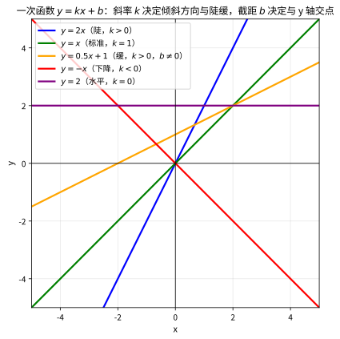

> **直观理解（现实类比）**：一次函数的图像像一座**山坡**——斜率 $k$ 就是坡度：$k>0$ 上坡、$k<0$ 下坡、$k=0$ 水平地面。
> - 截距 $b$ 是山坡与 $y$ 轴的交点高度，相当于"山坡的起点海拔"。
> - $|k|$ 越大，山坡越陡峭；直线越倾斜，单位 $x$ 变化引起的 $y$ 变化越大。
> - 平移直线（改变 $b$）相当于"整座山坡上下移动"，但不改变坡度；改变 $k$ 则相当于"调整坡度"，但不改变起点海拔。

> **示例 2**：画出 $y = 2x - 1$ 的图像并求其性质。
>
> 取两点：当 $x = 0$ 时 $y = -1$，当 $x = 1$ 时 $y = 1$，连接两点即得直线。斜率 $k = 2 > 0$，单调递增，过点 $(0, -1)$。

### 8.3 二次函数

**定义**：形如 $y = ax^2 + bx + c$（$a \neq 0$）的函数称为**二次函数**。

**基本量**：

- **开口方向**：由 $a$ 决定。$a > 0$ 开口向上，$a < 0$ 开口向下
- **顶点坐标**：$\left(-\frac{b}{2a}, \frac{4ac - b^2}{4a}\right)$
- **对称轴**：直线 $x = -\frac{b}{2a}$

**性质**：当 $a > 0$ 时，在 $(-\infty, -\frac{b}{2a})$ 上单调递减，在 $(-\frac{b}{2a}, +\infty)$ 上单调递增，在 $x = -\frac{b}{2a}$ 处取得最小值 $\frac{4ac - b^2}{4a}$；当 $a < 0$ 时，单调性与最值相反（取最大值）。

**与一元二次方程、不等式的关系**：二次函数的零点（与 $x$ 轴交点）即对应一元二次方程 $ax^2 + bx + c = 0$ 的根；函数值符号对应一元二次不等式的解集（见 7.3 节）。

> **示例 3**：求 $y = x^2 - 4x + 3$ 的顶点、对称轴和单调区间。
>
> 对称轴 $x = -\frac{-4}{2 \cdot 1} = 2$，顶点纵坐标 $y = 2^2 - 4 \cdot 2 + 3 = -1$，顶点为 $(2, -1)$。开口向上，在 $(-\infty, 2)$ 递减，在 $(2, +\infty)$ 递增，最小值 $-1$。

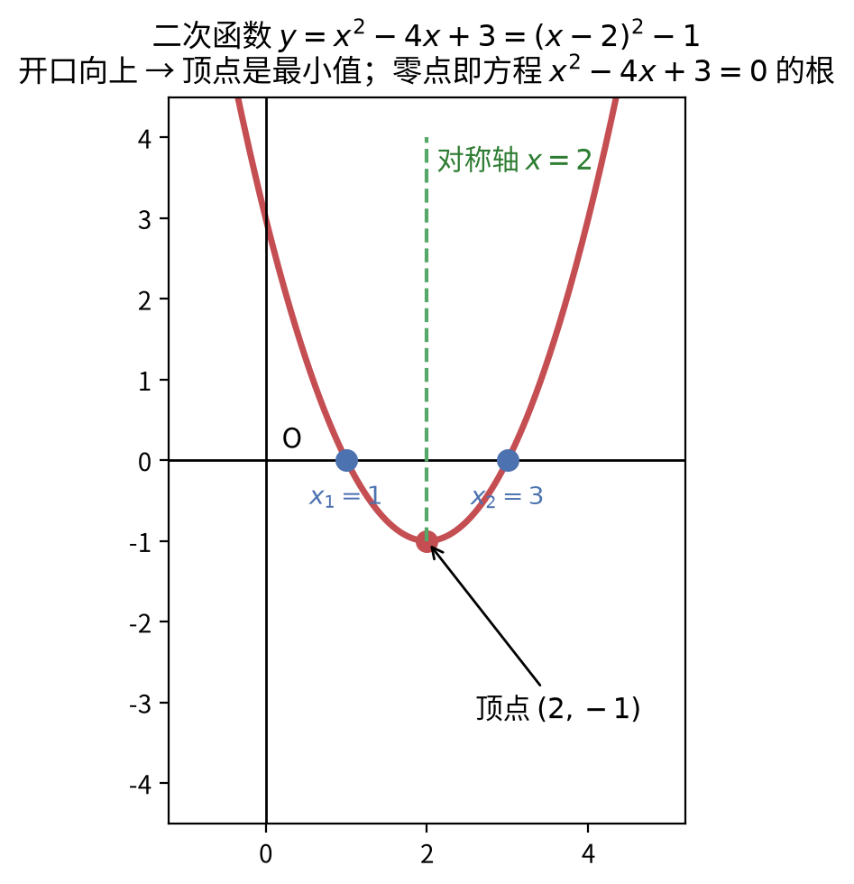

> **直观理解（现实类比）**：二次函数开口向上的图像，像一只**碗**（或滑板的 U 形滑道）。碗底就是**顶点**（最低点）；"碗"的左右对称轴把它分成相等两半；"碗"与地面的交点就是**零点**（方程的根）。
>
> 把 $y=x^2-4x+3$ 配方成 $y=(x-2)^2-1$ 后，一眼就能读出：顶点 $(2,-1)$、对称轴 $x=2$。**配方法的作用，就是把"抛物线公式"翻译成"我一抬眼就能报出答案"的形式。**

#### 🎬 动画演示：二次函数图像随系数变化

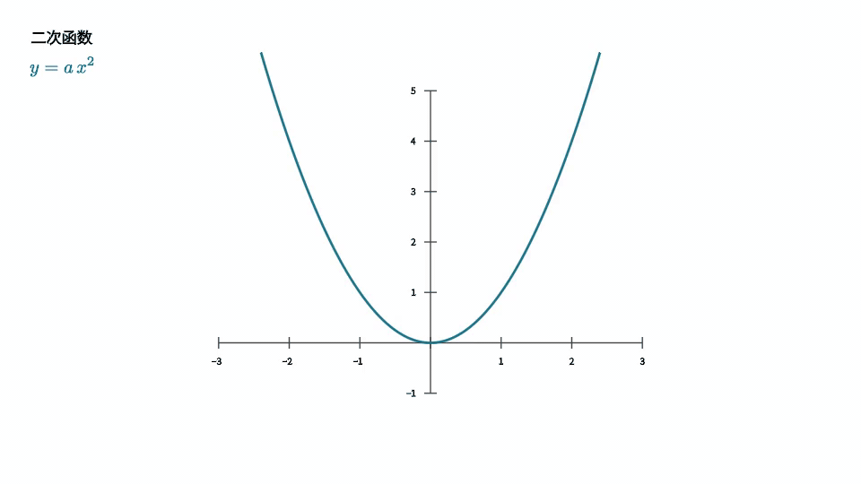

> 这个动画直观展示了二次函数 $y=ax^2$ 的图像如何随系数 $a$ 变化，抛物线的开口方向与宽窄随 $a$ 的正负和大小清晰可见。它通过动画的方式帮助理解本节核心概念。

### 8.4 反比例函数

**定义**：形如 $y = \frac{k}{x}$（$k \neq 0$）的函数称为**反比例函数**。

**图像特征**：图像是双曲线，由两支组成，分别位于第一、三象限（$k > 0$）或第二、四象限（$k < 0$）。

**渐近线**：双曲线无限接近 $x$ 轴和 $y$ 轴，但永不相交。故 $x$ 轴（$y = 0$）和 $y$ 轴（$x = 0$）是它的两条**渐近线**。

**性质**：当 $k > 0$ 时，在每个象限内 $y$ 随 $x$ 增大而减小；当 $k < 0$ 时，在每个象限内 $y$ 随 $x$ 增大而增大。定义域为 $\{x \mid x \neq 0\}$，值域为 $\{y \mid y \neq 0\}$。

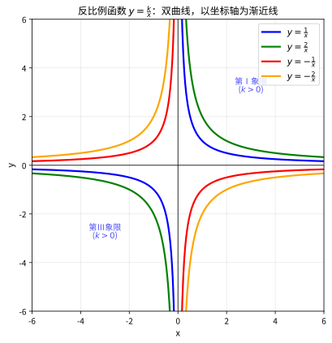

> **直观理解（现实类比）**：反比例函数像"**此消彼长**"的跷跷板——$xy=k$ 固定，$x$ 变大 $y$ 就变小，两者永远守恒。
> - 也像一个**面积固定的矩形**：长 $x$ 和宽 $y$ 变来变去，但面积 $xy=k$ 永远不变。
> - 当 $x\to\infty$ 时 $y\to 0$，当 $x\to 0$ 时 $y\to\infty$——这就是双曲线无限靠近坐标轴却永不相交（渐近线）的几何含义。
> - $k>0$ 时图像在一、三象限（同号相乘为正），$k<0$ 时在二、四象限（异号相乘为负）。

> **示例 4**：$y = \frac{2}{x}$ 的图像在第一、三象限，两支分别单调递减，以坐标轴为渐近线。

### 8.5 幂函数

**定义**：形如 $y = x^\alpha$（$\alpha$ 为常数）的函数称为**幂函数**。

**常见幂函数的图像与性质**：

| 函数 | 定义域 | 值域 | 单调性 | 图像特征 |
|:-----|:-------|:-----|:-------|:---------|
| $y = x$ | $\mathbb{R}$ | $\mathbb{R}$ | 递增 | 过原点的直线 |
| $y = x^2$ | $\mathbb{R}$ | $[0, +\infty)$ | 先减后增 | 开口向上的抛物线 |
| $y = x^3$ | $\mathbb{R}$ | $\mathbb{R}$ | 递增 | 单调上升的 S 形 |
| $y = x^{-1} = \frac{1}{x}$ | $\mathbb{R} \setminus \{0\}$ | $\mathbb{R} \setminus \{0\}$ | 各象限内递减 | 双曲线 |
| $y = x^{1/2} = \sqrt{x}$ | $[0, +\infty)$ | $[0, +\infty)$ | 递增 | 右半支抛物线 |

所有幂函数都过点 $(1, 1)$。当 $\alpha > 0$ 时，图像过原点 $(0, 0)$；当 $\alpha < 0$ 时，图像不过原点，且以坐标轴为渐近线。

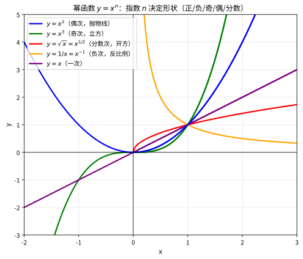

> **直观理解（现实类比）**：幂函数族像一个**大家族**——指数 $\alpha$ 决定每个成员的"性格"，但所有成员都共享"过点 $(1,1)$"这一家族徽章。
> - $\alpha$ 为正整数（如 $x^2$、$x^3$）像**抛物线 / 立方曲线**：温和成长，过原点。
> - $\alpha$ 为负数（如 $x^{-1}$）像**反比例**：$x$ 越大 $y$ 越小，以坐标轴为渐近线。
> - $\alpha$ 为分数（如 $x^{1/2}=\sqrt{x}$）像**开方曲线**：只在第一象限生长，起步快后变缓。
> - $\alpha$ 越大，曲线在 $x>1$ 处"抬升"越猛；$\alpha$ 越小（甚至为负），曲线越"低伏"。

### 8.6 函数的基本性质

1. **单调性**：若对定义域内任意 $x_1 < x_2$，都有 $f(x_1) < f(x_2)$，则 $f$ 单调递增；若 $f(x_1) > f(x_2)$，则单调递减。单调递增与单调递减合称**单调性**。
2. **奇偶性**：若对定义域内任意 $x$，有 $f(-x) = f(x)$，则 $f$ 为**偶函数**（图像关于 $y$ 轴对称）；若 $f(-x) = -f(x)$，则 $f$ 为**奇函数**（图像关于原点对称）。
3. **周期性**：若存在非零常数 $T$ 使对任意 $x$ 有 $f(x + T) = f(x)$，则 $f$ 为**周期函数**，$T$ 为周期（最小正周期常用 $T$ 表示）。
4. **有界性**：若存在常数 $M$，使对任意 $x$ 有 $f(x) \leqslant M$，则 $f$ 有上界；若存在 $m$ 使 $f(x) \geqslant m$，则 $f$ 有下界；既有上界又有下界称有界。

| 性质 | 定义条件 | 图像特征 |
|:-----|:---------|:---------|
| 偶函数 | $f(-x) = f(x)$ | 关于 $y$ 轴对称 |
| 奇函数 | $f(-x) = -f(x)$ | 关于原点对称 |
| 周期函数 | $f(x + T) = f(x)$ | 图像周期性重复 |

> **示例 5**：判断 $f(x) = x^2$ 与 $g(x) = x^3$ 的奇偶性。
>
> $f(-x) = (-x)^2 = x^2 = f(x)$，为偶函数；$g(-x) = (-x)^3 = -x^3 = -g(x)$，为奇函数。

### 8.7 综合示例

> **示例 6**：求 $f(x) = x^2 - 2x$ 在 $[0, 3]$ 上的最大值与最小值。
>
> 对称轴 $x = 1$。在 $x = 1$ 处取最小值 $1 - 2 = -1$；在端点 $x = 3$ 处取最大值 $9 - 6 = 3$。故最小值为 $-1$，最大值为 $3$。

> **示例 7**：已知 $f(x) = kx + 1$ 过点 $(2, 5)$，求 $k$。
>
> 代入得 $2k + 1 = 5$，$k = 2$。

> **示例 8**：判断 $f(x) = x^3$ 的单调性。
>
> 对任意 $x_1 < x_2$，$x_1^3 - x_2^3 = (x_1 - x_2)(x_1^2 + x_1 x_2 + x_2^2)$。因 $x_1 - x_2 < 0$ 且 $x_1^2 + x_1 x_2 + x_2^2 \geqslant 0$（等号仅当 $x_1 = x_2 = 0$，此时 $x_1 \neq x_2$ 故为正），故 $f(x_1) < f(x_2)$，$f(x) = x^3$ 在 $\mathbb{R}$ 上单调递增。

---

## 九、复数

**复数**是实数概念的推广，它引入了虚数单位 $i$，使得所有一元二次方程都有解，从而保证代数方程论的完备性。

### 9.1 复数的概念

**虚数单位**：规定 $i^2 = -1$，称 $i$ 为**虚数单位**。

**复数的代数形式**：形如 $a + bi$ 的数称为**复数**，其中 $a, b$ 为实数，$a$ 称为**实部**（记 $\operatorname{Re}(z)$），$b$ 称为**虚部**（记 $\operatorname{Im}(z)$）。

- 当 $b = 0$ 时，$a + bi = a$ 为**实数**
- 当 $b \neq 0$ 时，$a + bi$ 为**虚数**
- 当 $a = 0$ 且 $b \neq 0$ 时，$bi$ 为**纯虚数**

**复数相等**：两个复数相等当且仅当它们的实部与虚部分别相等，即 $a + bi = c + di \iff a = c$ 且 $b = d$。

**复平面**：用直角坐标系表示复数的平面，横轴（实轴）表示实部，纵轴（虚轴）表示虚部，点 $(a, b)$ 对应复数 $a + bi$。

### 9.2 复数的四则运算

设 $z_1 = a + bi$，$z_2 = c + di$，则：

**加法**：$(a + bi) + (c + di) = (a + c) + (b + d)i$（实部、虚部分别相加）

**减法**：$(a + bi) - (c + di) = (a - c) + (b - d)i$

**乘法**：$(a + bi)(c + di) = (ac - bd) + (ad + bc)i$

**除法**：$\frac{a + bi}{c + di} = \frac{(a + bi)(c - di)}{(c + di)(c - di)} = \frac{ac + bd}{c^2 + d^2} + \frac{bc - ad}{c^2 + d^2}i$（利用共轭复数将分母实数化）

> **示例 1**：计算 $(3 + 2i) + (1 - 4i)$。
>
> $(3 + 1) + (2 - 4)i = 4 - 2i$。

> **示例 2**：计算 $(1 + i)(2 - i)$。
>
> $2 - i + 2i - i^2 = 2 + i + 1 = 3 + i$。

> **示例 3**：计算 $\frac{1 + i}{1 - i}$。
>
> 分子分母同乘共轭 $1 + i$：$\frac{(1 + i)^2}{(1 - i)(1 + i)} = \frac{1 + 2i + i^2}{1 - i^2} = \frac{2i}{2} = i$。

### 9.3 复数的几何意义

**复平面上的点与向量**：复数 $z = a + bi$ 对应复平面上的点 $Z(a, b)$，也可看作从原点出发的向量 $\overrightarrow{OZ}$。

**模**：复数 $z = a + bi$ 的**模**为 $|z| = \sqrt{a^2 + b^2}$，即向量 $\overrightarrow{OZ}$ 的长度，表示点到原点的距离。

**幅角**：向量 $\overrightarrow{OZ}$ 与实轴正方向的夹角 $\theta$ 称为复数 $z$ 的**幅角**，满足：

$$
\tan\theta = \frac{b}{a}, \quad \cos\theta = \frac{a}{|z|}, \quad \sin\theta = \frac{b}{|z|}
$$

通常取 $0 \leqslant \theta < 2\pi$ 为主幅角。

> **示例 4**：求 $z = 1 + \sqrt{3}i$ 的模和主幅角。
>
> $|z| = \sqrt{1^2 + (\sqrt{3})^2} = \sqrt{4} = 2$；$\cos\theta = \frac{1}{2}$，$\sin\theta = \frac{\sqrt{3}}{2}$，故主幅角 $\theta = \frac{\pi}{3}$。


> **直观理解（现实类比）**：复数像 GPS 坐标——实部是东西向的经度，虚部是南北向的纬度，任何一个复数 $a+bi$ 都能在复平面上找到唯一的"地点"$(a,b)$。
> - 两个复数相加，像两个力合成：实部、虚部分别相加，对应"先向东走 $a$ 步、再向北走 $b$ 步"与"向东 $c$ 步、向北 $d$ 步"合成后的总位移 $(a+c)+(b+d)i$。
> - 共轭复数 $\overline{z}=a-bi$ 像关于 $x$ 轴的镜像反射——"地点"南北方向翻转，但与原点的距离（模）保持不变。
> - 模 $|z|=\sqrt{a^2+b^2}$ 就是这个"地点"到原点的直线距离，幅角 $\theta$ 是从正东方向逆时针转到的方位角。

### 9.4 共轭复数及其性质

**定义**：复数 $z = a + bi$ 的**共轭复数**为 $\overline{z} = a - bi$（虚部变号）。共轭复数在复平面上关于实轴对称。

**共轭复数的性质**（设 $z_1, z_2$ 为复数）：

| 性质 | 公式 |
|:-----|:-----|
| 共轭的共轭 | $\overline{\overline{z}} = z$ |
| 模的关系 | $\overline{z} \cdot z = a^2 + b^2 = |z|^2$ |
| 加减 | $\overline{z_1 \pm z_2} = \overline{z_1} \pm \overline{z_2}$ |
| 乘除 | $\overline{z_1 z_2} = \overline{z_1} \cdot \overline{z_2}$，$\overline{(z_1 / z_2)} = \overline{z_1} / \overline{z_2}$ |
| 实虚部 | $z + \overline{z} = 2\operatorname{Re}(z)$，$z - \overline{z} = 2i\operatorname{Im}(z)$ |
| 实数判定 | $z$ 为实数 $\iff z = \overline{z}$ |

> **示例 5**：已知 $z = 3 + 4i$，求 $z \cdot \overline{z}$。
>
> $z \cdot \overline{z} = (3 + 4i)(3 - 4i) = 9 - 16i^2 = 9 + 16 = 25 = |z|^2$。

### 9.5 复数的三角形式与欧拉公式

**三角形式**：设复数 $z = a + bi$ 的模为 $r = |z|$，幅角为 $\theta$，则 $a = r\cos\theta$，$b = r\sin\theta$，于是：

$$
z = r(\cos\theta + i\sin\theta)
$$

这称为复数的**三角形式**，记 $r \operatorname{cis} \theta$。

**欧拉公式**：对任意实数 $\theta$，有：

$$
e^{i\theta} = \cos\theta + i\sin\theta
$$

由此复数的三角形式可写成指数形式 $z = re^{i\theta}$。当 $\theta = \pi$ 时得欧拉恒等式：

$$
e^{i\pi} + 1 = 0
$$

它把数学中最重要的五个常数 $0, 1, e, i, \pi$ 联系在了一起。

**棣莫弗定理**：$(r\operatorname{cis}\theta)^n = r^n \operatorname{cis}(n\theta)$，是复数乘方的有力工具。


> **直观理解（现实类比）**：复数三角形式像**极坐标 GPS**——不再用"东西向 $a$ + 南北向 $b$"，而是用"距离 $r$ + 方向角 $\theta$"来定位，更适合描述旋转。
> - 欧拉公式 $e^{i\theta}=\cos\theta+i\sin\theta$ 像把"**旋转**"翻译成"**指数**"：乘以 $e^{i\theta}$ 就等于在复平面上逆时针旋转 $\theta$ 角度。
> - 两个复数相乘 $r_1e^{i\theta_1}\cdot r_2e^{i\theta_2}=r_1r_2e^{i(\theta_1+\theta_2)}$，相当于"模相乘、角相加"——长度按比例缩放，方向角叠加。
> - 最美公式 $e^{i\pi}+1=0$ 把五大常数 $0,1,e,i,\pi$ 联系在一起：转 $\pi$ 弧度（180°）就走到对面的 $-1$，加 $1$ 后归零。

> **示例 6**：将 $z = 1 + i$ 化为三角形式。
>
> $r = \sqrt{1^2 + 1^2} = \sqrt{2}$，$\theta = \frac{\pi}{4}$，故 $z = \sqrt{2}\left(\cos\frac{\pi}{4} + i\sin\frac{\pi}{4}\right)$。

### 9.6 综合示例

> **示例 7**：已知 $(x + yi)(2 - i) = 5 + 3i$，求 $x$ 和 $y$。
>
> 展开：$(2x + y) + (2y - x)i = 5 + 3i$。由复数相等，$\begin{cases} 2x + y = 5 \\ -x + 2y = 3 \end{cases}$。解方程组得 $x = \frac{7}{5}$，$y = \frac{11}{5}$。

> **示例 8**：求 $|z|$ 若 $z = \frac{3 - 4i}{1 + i}$。
>
> $$
> z = \frac{(3 - 4i)(1 - i)}{(1 + i)(1 - i)} = \frac{3 - 3i - 4i + 4i^2}{2} = \frac{-1 - 7i}{2}
> $$
>
> $|z| = \sqrt{\left(-\frac{1}{2}\right)^2 + \left(-\frac{7}{2}\right)^2} = \sqrt{\frac{1 + 49}{4}} = \frac{\sqrt{50}}{2} = \frac{5\sqrt{2}}{2}$。

> **示例 9**：计算 $(1 + i)^{10}$。
>
> $1 + i = \sqrt{2}\operatorname{cis}\frac{\pi}{4}$，由棣莫弗定理：
>
> $$
> (1 + i)^{10} = (\sqrt{2})^{10}\operatorname{cis}\left(10 \cdot \frac{\pi}{4}\right) = 32 \operatorname{cis}\frac{5\pi}{2} = 32 \cdot i = 32i
> $$

> **示例 10**：解方程 $x^2 + 1 = 0$。
>
> $x^2 = -1$，故 $x = \pm i$。这说明引入虚数单位 $i$ 后，一元二次方程在复数范围内总有解。

---

## 十、综合示例

### 示例 1：代数式化简与求值

化简 $3(2x - 1) - 2(3 - x)$，并求 $x = -2$ 时的值。

$$
\begin{aligned}
3(2x - 1) - 2(3 - x) &= 6x - 3 - 6 + 2x \\
&= 8x - 9
\end{aligned}
$$

当 $x = -2$ 时，$8(-2) - 9 = -16 - 9 = -25$。

### 示例 2：解方程并验证

解方程 $3x^2 - 5x + 2 = 0$，并用韦达定理验证。

**解法一（因式分解）**：
$$
3x^2 - 5x + 2 = (3x - 2)(x - 1) = 0
$$
所以 $x_1 = \frac{2}{3}$，$x_2 = 1$。

**解法二（公式法）**：
$$
\Delta = (-5)^2 - 4 \cdot 3 \cdot 2 = 25 - 24 = 1
$$
$$
x = \frac{5 \pm \sqrt{1}}{2 \cdot 3} = \frac{5 \pm 1}{6}
$$
$x_1 = \frac{5 + 1}{6} = 1$，$x_2 = \frac{5 - 1}{6} = \frac{2}{3}$。✓

**韦达定理验证**：
$$
x_1 + x_2 = 1 + \frac{2}{3} = \frac{5}{3} = -\frac{-5}{3} = -\frac{b}{a} \quad ✓
$$
$$
x_1 \cdot x_2 = 1 \cdot \frac{2}{3} = \frac{2}{3} = \frac{c}{a} \quad ✓
$$

### 示例 3：利用韦达定理构造方程

已知两数之和为 7，两数之积为 12，求这两个数。

设这两个数为 $x_1$、$x_2$，则它们满足方程 $x^2 - 7x + 12 = 0$。

因式分解：$(x - 3)(x - 4) = 0$，所以这两个数为 3 和 4。

### 示例 4：二项式定理的应用

求 $(1 + x)^6$ 的展开式中 $x^4$ 的系数。

$$
\binom{6}{4} \cdot 1^{6-4} \cdot x^4 = \binom{6}{2} x^4 = 15x^4
$$

系数为 15。

---

## 十一、习题

请认真完成以下习题，以检验你对本章内容的掌握程度。

### 基础题

1. 化简下列各式：
   - (a) $(4x^2 - 3x + 2) + (2x^2 + 5x - 7)$
   - (b) $(3a + 2b) - (a - 3b)$
   - (c) $2x(3x^2 - 4x + 1)$

2. 因式分解：
   - (a) $x^2 - 9$
   - (b) $x^2 + 6x + 9$
   - (c) $x^2 - 7x + 12$
   - (d) $2x^2 + 5x - 3$

3. 解下列方程：
   - (a) $4x - 7 = 3x + 5$
   - (b) $x^2 - 4x + 3 = 0$
   - (c) $2x^2 + 3x - 2 = 0$

### 进阶题

4. 已知 $x^2 - 3x + 1 = 0$，求 $x + \frac{1}{x}$ 的值。

5. 利用韦达定理，已知方程 $3x^2 - 6x + 2 = 0$ 的两根为 $x_1$、$x_2$，求：
   - (a) $x_1^2 + x_2^2$
   - (b) $\frac{1}{x_1} + \frac{1}{x_2}$

6. 展开 $(2x - 1)^4$，并写出各项系数。

7. 求 $(x + \frac{1}{x})^5$ 的展开式中的常数项。

8. 已知二次方程 $x^2 - (k + 2)x + 2k = 0$ 的两根相等，求 $k$ 的值。

### 挑战题

9. 求证：$(a + b + c)^2 = a^2 + b^2 + c^2 + 2ab + 2bc + 2ca$。

10. 已知 $x_1$、$x_2$ 是方程 $x^2 - 5x + 3 = 0$ 的两个根，不解方程，求 $x_1^3 + x_2^3$ 的值。

### 指数与对数

11. 计算下列各式：
   - (a) $2^3 \cdot 2^{-2} \cdot 4^2$
   - (b) $\log_2 5 \cdot \log_5 2$
   - (c) $2^{\log_2 5} + \lg 1000$

12. 解下列方程：
   - (a) $3^{x+1} = 27$
   - (b) $\log_2(x^2 - 3) = 2$
   - (c) $4^x - 3 \cdot 2^x + 2 = 0$（提示：换元）

13. 比较 $\log_2 3$ 与 $\log_3 2$ 的大小，并说明理由。

### 不等式

14. 解一元二次不等式 $x^2 - 5x + 6 > 0$，并在数轴上表示解集。

15. 解绝对值不等式 $|x - 2| < 3$。

16. 已知 $x > 0$，利用均值不等式求 $x + \frac{4}{x}$ 的最小值，并指出取等号的条件。

### 初等函数

17. 求函数 $f(x) = \sqrt{x - 1}$ 的定义域。

18. 判断 $f(x) = x^3$ 的奇偶性，并说明理由。

### 复数

19. 计算 $(1 + 2i)(3 - i)$。

20. 求复数 $\dfrac{2 + i}{1 - i}$ 的共轭复数。

---

## 📝 习题答案

<details>
<summary>点击展开答案</summary>

1. 化简：
   - (a) $6x^2 + 2x - 5$
   - (b) $2a + 5b$
   - (c) $6x^3 - 8x^2 + 2x$

2. 因式分解：
   - (a) $(x + 3)(x - 3)$
   - (b) $(x + 3)^2$
   - (c) $(x - 3)(x - 4)$
   - (d) $(2x - 1)(x + 3)$

3. 解方程：
   - (a) $x = 12$
   - (b) $x_1 = 1$，$x_2 = 3$
   - (c) $x_1 = \frac{1}{2}$，$x_2 = -2$

4. 由 $x^2 - 3x + 1 = 0$，两边同除以 $x$（$x \neq 0$）得 $x - 3 + \frac{1}{x} = 0$，所以 $x + \frac{1}{x} = 3$。

5. $x_1 + x_2 = 2$，$x_1x_2 = \frac{2}{3}$
   - (a) $x_1^2 + x_2^2 = (x_1 + x_2)^2 - 2x_1x_2 = 4 - \frac{4}{3} = \frac{8}{3}$
   - (b) $\frac{1}{x_1} + \frac{1}{x_2} = \frac{x_1 + x_2}{x_1x_2} = \frac{2}{2/3} = 3$

6. $(2x - 1)^4 = 16x^4 - 32x^3 + 24x^2 - 8x + 1$，系数分别为 $16$、$-32$、$24$、$-8$、$1$。

7. $(x + \frac{1}{x})^5$ 的通项：$\binom{5}{k} x^{5-k} \left(\frac{1}{x}\right)^k = \binom{5}{k} x^{5-2k}$。令 $5 - 2k = 0$，得 $k = 2.5$（非整数），所以展开式中没有常数项。

8. 两根相等 $\Rightarrow \Delta = 0$：
   $\Delta = (k+2)^2 - 4 \cdot 1 \cdot 2k = k^2 + 4k + 4 - 8k = k^2 - 4k + 4 = (k-2)^2 = 0$，所以 $k = 2$。

9. $(a + b + c)^2 = (a + b + c)(a + b + c)$
   $= a^2 + ab + ac + ab + b^2 + bc + ac + bc + c^2$
   $= a^2 + b^2 + c^2 + 2ab + 2bc + 2ca$ ✓

10. $x_1 + x_2 = 5$，$x_1x_2 = 3$
    $x_1^3 + x_2^3 = (x_1 + x_2)^3 - 3x_1x_2(x_1 + x_2)$
    $= 5^3 - 3 \cdot 3 \cdot 5 = 125 - 45 = 80$

11. 计算：
   - (a) $2^3 \cdot 2^{-2} \cdot 4^2 = 2^{3-2} \cdot (2^2)^2 = 2^1 \cdot 2^4 = 2^5 = 32$
   - (b) $\log_2 5 \cdot \log_5 2 = \dfrac{\ln 5}{\ln 2} \cdot \dfrac{\ln 2}{\ln 5} = 1$
   - (c) $2^{\log_2 5} = 5$，$\lg 1000 = 3$，所以 $= 5 + 3 = 8$

12. 解方程：
   - (a) $3^{x+1} = 27 = 3^3 \Rightarrow x + 1 = 3 \Rightarrow x = 2$
   - (b) $x^2 - 3 = 2^2 = 4 \Rightarrow x^2 = 7 \Rightarrow x = \pm\sqrt{7}$（检验：$x^2 - 3 = 4 > 0$，均成立）
   - (c) 令 $t = 2^x > 0$，则 $t^2 - 3t + 2 = 0 \Rightarrow (t-1)(t-2) = 0 \Rightarrow t = 1$ 或 $2$，即 $x = 0$ 或 $x = 1$

13. $\log_2 3 > \log_2 2 = 1$，而 $\log_3 2 < \log_3 3 = 1$，所以 $\log_2 3 > \log_3 2$。

14. $x^2 - 5x + 6 = (x-2)(x-3) > 0 \Rightarrow x < 2$ 或 $x > 3$，解集为 $(-\infty, 2) \cup (3, +\infty)$。

15. $|x - 2| < 3 \Rightarrow -3 < x - 2 < 3 \Rightarrow -1 < x < 5$，解集为 $(-1, 5)$。

16. 由均值不等式 $x + \frac{4}{x} \geqslant 2\sqrt{x \cdot \frac{4}{x}} = 4$，等号当且仅当 $x = \frac{4}{x}$，即 $x = 2$（$x > 0$）时成立。故最小值为 $4$。

17. 由 $x - 1 \geqslant 0$ 得 $x \geqslant 1$，定义域为 $[1, +\infty)$。

18. $f(-x) = (-x)^3 = -x^3 = -f(x)$，故 $f(x) = x^3$ 是奇函数（图像关于原点对称）。

19. $(1+2i)(3-i) = 3 - i + 6i - 2i^2 = 3 + 5i + 2 = 5 + 5i$。

20. $\dfrac{2+i}{1-i} = \dfrac{(2+i)(1+i)}{(1-i)(1+i)} = \dfrac{2 + 2i + i + i^2}{1 - i^2} = \dfrac{1 + 3i}{2} = \dfrac{1}{2} + \dfrac{3}{2}i$，其共轭复数为 $\dfrac{1}{2} - \dfrac{3}{2}i$。

</details>

---

## 十二、总结

### 关键知识点回顾

| 知识点 | 核心内容 | 示例 |
|:------|---------|:----:|
| **变量与代数式** | 用字母表示数，代入求值 | $x + 3$，$2x^2 - 5$ |
| **多项式** | 单项式的和，可按次数分类 | $x^2 + 3x - 5$ 是二次三项式 |
| **多项式运算** | 合并同类项（加减），分配律（乘法） | $(x+1)(x+2) = x^2 + 3x + 2$ |
| **因式分解** | 提取公因式、公式法、十字相乘法 | $x^2 - 9 = (x+3)(x-3)$ |
| **因式分解定理** | $f(c) = 0 \iff (x-c)$ 是因式 | 判断整除性 |
| **一元一次方程** | $ax + b = 0$，$x = -b/a$ | $2x - 3 = 0 \Rightarrow x = 3/2$ |
| **一元二次方程** | $ax^2 + bx + c = 0$，求根公式 | $x = \frac{-b \pm \sqrt{b^2 - 4ac}}{2a}$ |
| **韦达定理** | 根与系数的关系 | $x_1 + x_2 = -b/a$，$x_1x_2 = c/a$ |
| **二项式定理** | $(a + b)^n = \sum \binom{n}{k} a^{n-k} b^k$ | $(x+1)^3 = x^3 + 3x^2 + 3x + 1$ |
| **指数运算法则** | $a^m \cdot a^n = a^{m+n}$，$(a^m)^n = a^{mn}$ | $2^3 \cdot 2^5 = 2^8 = 256$ |
| **指数函数** | $f(x) = a^x$（$a > 0$，$a \neq 1$） | $y = 2^x$，过定点 $(0,1)$ |
| **对数概念** | $a^b = N \iff b = \log_a N$ | $2^3 = 8 \iff \log_2 8 = 3$ |
| **对数运算法则** | $\log_a(MN) = \log_a M + \log_a N$ | $\log_2 8 + \log_2 4 = 5$ |
| **对数函数** | $f(x) = \log_a x$（$a > 0$，$a \neq 1$） | $y = \log_2 x$，过定点 $(1,0)$ |
| **指数与对数的关系** | 互为反函数，图像关于 $y = x$ 对称 | $y = 2^x \iff x = \log_2 y$ |
| **不等式性质** | 三歧性、传递性、同加、乘正负数的变号法则 | $a > b, c < 0 \Rightarrow ac < bc$ |
| **一元一次不等式** | $ax + b > 0$ 的解集，数轴表示 | $3x - 2 > 4 \Rightarrow x > 2$ |
| **一元二次不等式** | 借助判别式与二次函数图像求解 | $x^2 - 5x + 6 > 0$ 解集为 $(-\infty,2)\cup(3,+\infty)$ |
| **均值不等式** | $\frac{a+b}{2} \geqslant \sqrt{ab}$，等号当 $a=b$ | $x + \frac{4}{x} \geqslant 4$ |
| **函数的概念** | 定义域、值域、对应关系三要素 | $f(x) = \sqrt{x-1}$ 定义域 $[1,+\infty)$ |
| **一次函数** | $y = kx + b$，斜率、截距 | $y = 2x - 1$ 单调递增 |
| **二次函数** | $y = ax^2+bx+c$，顶点、对称轴、最值 | $y = x^2 - 4x + 3$ 顶点 $(2,-1)$ |
| **幂函数与反比例函数** | $y = x^\alpha$、$y = \frac{k}{x}$ 的图像与性质 | $y = x^{-1}$ 为双曲线 |
| **函数基本性质** | 单调性、奇偶性、周期性、有界性 | $f(-x) = f(x)$ 为偶函数 |
| **复数概念** | $a + bi$、虚数单位 $i$、实部虚部、复平面 | $i^2 = -1$ |
| **复数运算** | 加减乘除，用共轭复数实数化分母 | $\frac{1+i}{1-i} = i$ |
| **复数几何与欧拉公式** | 模、幅角、$e^{i\theta} = \cos\theta + i\sin\theta$ | $e^{i\pi} + 1 = 0$ |

### 学习路径建议

1. **先掌握变量和代数式**——这是代数的语言基础
2. **再练习多项式运算**——加减乘要熟练
3. **因式分解是核心技能**——它是解方程和化简的关键
4. **解方程是代数的灵魂**——一元一次和一元二次方程必须熟练掌握
5. **韦达定理和二项式定理**是重要的进阶内容
6. **指数与对数**是函数学习的核心，理解它们的互逆关系，为微积分奠定基础
7. **不等式**是刻画取值范围的工具——掌握其性质、解法与均值不等式等，为最值问题打基础
8. **初等函数**（一次、二次、反比例、幂函数）及其性质，是研究变化规律的基石
9. **复数**将数系从实数扩展到复数，理解其运算与三角形式，为后续方程与解析几何铺路

### 下一步学习

完成本教程后，你可以进入**第 3 级：平面几何**，学习几何的基本概念和推理方法。代数和几何相辅相成，共同构成了初等数学的核心。

---

> **"代数不过是书写的几何，几何不过是图画的代数。"** —— 索菲·热尔曼