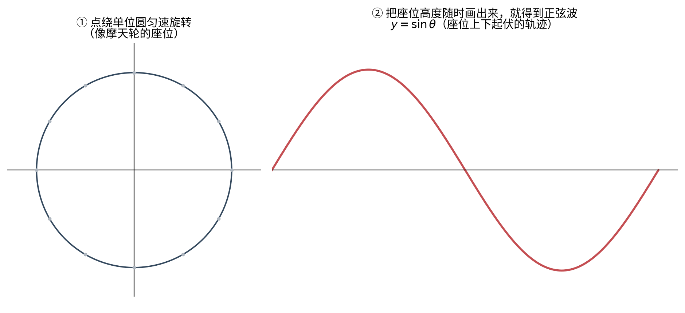
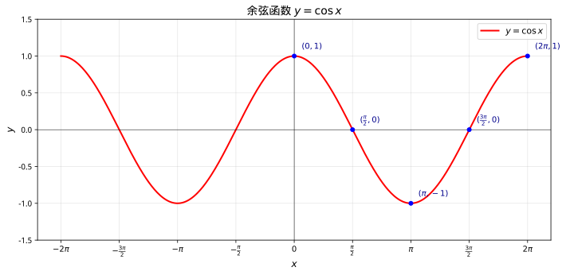
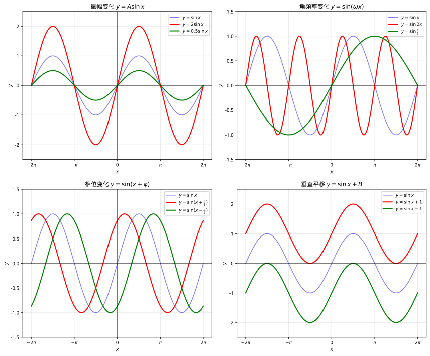
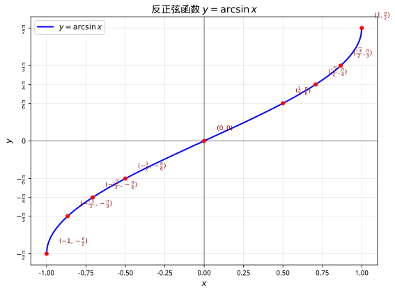

# 第 5 级：三角函数 (Trigonometry)

> 从直角三角形的边长比出发，将角度与函数联系起来，构建描述周期性现象的数学工具。

---

## 学习目标

1. 理解角度度量体系：度与弧度及其相互转换
2. 掌握六种基本三角函数的定义（直角三角形定义与单位圆定义）
3. 掌握三角函数的基本恒等式及其推导
4. 掌握和角公式、倍角公式、半角公式、和差化积公式
5. 掌握正弦定理和余弦定理及其在解三角形中的应用
6. 理解三角函数的图像特征：周期性、振幅、相位
7. 了解反三角函数的基本概念

---

## 核心概念

### 1. 角的度量：度与弧度

**度 (Degree)**

将圆周等分为 360 份，每一份所对的圆心角为 1 度（$1^\circ$）。

- $1^\circ = 60'$（1 度 = 60 分）
- $1' = 60''$（1 分 = 60 秒）

**弧度 (Radian)**

弧度的定义是：当圆弧的长度等于半径时，该圆弧所对的圆心角为 1 弧度（1 rad）。

设圆的半径为 $r$，弧长为 $l$，则圆心角 $\theta$ 的弧度数为：

$$
\theta = \frac{l}{r}
$$

由于整个圆周的弧长为 $2\pi r$，因此：

$$
360^\circ = 2\pi \text{ rad}
$$

由此得到度与弧度的转换公式：

$$
1^\circ = \frac{\pi}{180} \text{ rad}, \quad 1 \text{ rad} = \frac{180^\circ}{\pi}
$$

**常用特殊角的弧度值**：

| 角度 | $0^\circ$ |    $30^\circ$    |    $45^\circ$    |    $60^\circ$    |    $90^\circ$    | $180^\circ$ |    $270^\circ$    | $360^\circ$ |
| :--: | :---------: | :----------------: | :----------------: | :----------------: | :----------------: | :-----------: | :-----------------: | :-----------: |
| 弧度 |    $0$    | $\dfrac{\pi}{6}$ | $\dfrac{\pi}{4}$ | $\dfrac{\pi}{3}$ | $\dfrac{\pi}{2}$ |    $\pi$    | $\dfrac{3\pi}{2}$ |   $2\pi$   |

> **示例 1：角度与弧度转换**
>
> 将 $60^\circ$ 转换为弧度，将 $\dfrac{5\pi}{6}$ 转换为角度。
>
> **解**：
>
> $$
> 60^\circ = 60 \times \frac{\pi}{180} = \frac{\pi}{3} \text{ rad}
> $$
>
> $$
> \frac{5\pi}{6} \text{ rad} = \frac{5\pi}{6} \times \frac{180^\circ}{\pi} = 150^\circ
> $$

---

### 2. 直角三角形中的三角函数

在直角三角形中，对于一个锐角 $\theta$，定义以下六种三角函数：

设 $\theta$ 的对边为 $a$，邻边为 $b$，斜边为 $h$：

|      函数      | 名称             | 定义             |                倒数关系                |
| :------------: | :--------------- | :--------------- | :------------------------------------: |
| $\sin\theta$ | 正弦 (sine)      | $\dfrac{a}{h}$ | $\csc\theta = \dfrac{1}{\sin\theta}$ |
| $\cos\theta$ | 余弦 (cosine)    | $\dfrac{b}{h}$ | $\sec\theta = \dfrac{1}{\cos\theta}$ |
| $\tan\theta$ | 正切 (tangent)   | $\dfrac{a}{b}$ | $\cot\theta = \dfrac{1}{\tan\theta}$ |
| $\cot\theta$ | 余切 (cotangent) | $\dfrac{b}{a}$ | $\tan\theta = \dfrac{1}{\cot\theta}$ |
| $\sec\theta$ | 正割 (secant)    | $\dfrac{h}{b}$ | $\cos\theta = \dfrac{1}{\sec\theta}$ |
| $\csc\theta$ | 余割 (cosecant)  | $\dfrac{h}{a}$ | $\sin\theta = \dfrac{1}{\csc\theta}$ |

> **示例 2：已知直角三角形三边求三角函数值**
>
> 在直角三角形中，$\angle A = 30^\circ$，对边 $a = 1$，斜边 $h = 2$，求 $\sin 30^\circ$、$\cos 30^\circ$、$\tan 30^\circ$。
>
> **解**：
>
> 由勾股定理，邻边 $b = \sqrt{2^2 - 1^2} = \sqrt{3}$。
>
> $$
> \sin 30^\circ = \frac{a}{h} = \frac{1}{2}
> $$
>
> $$
> \cos 30^\circ = \frac{b}{h} = \frac{\sqrt{3}}{2}
> $$
>
> $$
> \tan 30^\circ = \frac{a}{b} = \frac{1}{\sqrt{3}} = \frac{\sqrt{3}}{3}
> $$

---

### 3. 单位圆与三角函数

**单位圆** 是半径为 1、圆心在原点的圆，方程为 $x^2 + y^2 = 1$。

在单位圆上，角度 $\theta$ 从正 $x$ 轴出发逆时针旋转，与单位圆交于点 $P(x, y)$，则：

$$
\sin\theta = y, \quad \cos\theta = x, \quad \tan\theta = \frac{y}{x} \;(x \neq 0)
$$

> **直观理解（现实类比）**：把角度想象成**手电筒**绕原点旋转，光斑落在单位圆上某点 $P(x,y)$。这个点的**纵坐标**就是 $\sin\theta$（上下高度），**横坐标**就是 $\cos\theta$（左右幅度），而 $\tan\theta$ 则是切线上的长度。**三角函数不是抽象公式，而是"圆上一点"的坐标投影。**
>
> 正因为这是"坐标"，所以一旦角度转到第二、三、四象限，坐标变号，三角函数的符号也随之改变——上表"各象限符号"就水到渠成，无需死记口诀背后的"为什么"。

单位圆将三角函数的定义从锐角推广到任意角：

**各象限的三角函数符号**：

|   象限   |              角度范围              | $\sin\theta$ | $\cos\theta$ | $\tan\theta$ |
| :------: | :---------------------------------: | :------------: | :------------: | :------------: |
| 第一象限 |   $0 < \theta < \dfrac{\pi}{2}$   |     $+$     |     $+$     |     $+$     |
| 第二象限 |  $\dfrac{\pi}{2} < \theta < \pi$  |     $+$     |     $-$     |     $-$     |
| 第三象限 | $\pi < \theta < \dfrac{3\pi}{2}$ |     $-$     |     $-$     |     $+$     |
| 第四象限 | $\dfrac{3\pi}{2} < \theta < 2\pi$ |     $-$     |     $+$     |     $-$     |

记忆口诀：**"一全正，二正弦，三正切，四余弦"**（即第一象限全正，第二象限正弦正，第三象限正切正，第四象限余弦正）。

**特殊角的三角函数值**：

|   $\theta$   | $0$ |   $\dfrac{\pi}{6}$   |   $\dfrac{\pi}{4}$   |   $\dfrac{\pi}{3}$   | $\dfrac{\pi}{2}$ | $\pi$ | $\dfrac{3\pi}{2}$ |
| :------------: | :---: | :---------------------: | :---------------------: | :---------------------: | :----------------: | :-----: | :-----------------: |
| $\sin\theta$ | $0$ |    $\dfrac{1}{2}$    | $\dfrac{\sqrt{2}}{2}$ | $\dfrac{\sqrt{3}}{2}$ |       $1$       |  $0$  |       $-1$       |
| $\cos\theta$ | $1$ | $\dfrac{\sqrt{3}}{2}$ | $\dfrac{\sqrt{2}}{2}$ |    $\dfrac{1}{2}$    |       $0$       | $-1$ |        $0$        |
| $\tan\theta$ | $0$ | $\dfrac{\sqrt{3}}{3}$ |          $1$          |      $\sqrt{3}$      |       不存在       |  $0$  |       不存在       |

---

## 基本定理与公式

### 1. 基本恒等式

**1.1 平方关系**

由单位圆方程 $x^2 + y^2 = 1$，即 $\cos^2\theta + \sin^2\theta = 1$：

$$
\boxed{\sin^2\theta + \cos^2\theta = 1}
$$

将上式两边同时除以 $\cos^2\theta$（$\cos\theta \neq 0$）：

$$
\boxed{1 + \tan^2\theta = \sec^2\theta}
$$

将上式两边同时除以 $\sin^2\theta$（$\sin\theta \neq 0$）：

$$
\boxed{1 + \cot^2\theta = \csc^2\theta}
$$

**1.2 商数关系**

$$
\tan\theta = \frac{\sin\theta}{\cos\theta}, \quad \cot\theta = \frac{\cos\theta}{\sin\theta}
$$

**1.3 倒数关系**

$$
\csc\theta = \frac{1}{\sin\theta}, \quad \sec\theta = \frac{1}{\cos\theta}, \quad \cot\theta = \frac{1}{\tan\theta}
$$

> **示例 3：利用恒等式求值**
>
> 已知 $\sin\theta = \dfrac{3}{5}$，且 $\theta$ 在第二象限，求 $\cos\theta$ 和 $\tan\theta$。
>
> **解**：
>
> 由 $\sin^2\theta + \cos^2\theta = 1$：
>
> $$
> \cos^2\theta = 1 - \sin^2\theta = 1 - \left(\frac{3}{5}\right)^2 = 1 - \frac{9}{25} = \frac{16}{25}
> $$
>
> 由于 $\theta$ 在第二象限，$\cos\theta < 0$，所以 $\cos\theta = -\dfrac{4}{5}$。
>
> $$
> \tan\theta = \frac{\sin\theta}{\cos\theta} = \frac{3/5}{-4/5} = -\frac{3}{4}
> $$

---

### 2. 和角公式

**2.1 正弦的和角与差角公式**

$$
\boxed{\sin(\alpha + \beta) = \sin\alpha\cos\beta + \cos\alpha\sin\beta}
$$

$$
\boxed{\sin(\alpha - \beta) = \sin\alpha\cos\beta - \cos\alpha\sin\beta}
$$

**2.2 余弦的和角与差角公式**

$$
\boxed{\cos(\alpha + \beta) = \cos\alpha\cos\beta - \sin\alpha\sin\beta}
$$

$$
\boxed{\cos(\alpha - \beta) = \cos\alpha\cos\beta + \sin\alpha\sin\beta}
$$

**2.3 正切的和角与差角公式**

$$
\boxed{\tan(\alpha + \beta) = \frac{\tan\alpha + \tan\beta}{1 - \tan\alpha\tan\beta}}
$$

$$
\boxed{\tan(\alpha - \beta) = \frac{\tan\alpha - \tan\beta}{1 + \tan\alpha\tan\beta}}
$$

**证明（余弦和角公式）**：在单位圆上，设 $A$ 点对应角度 $\alpha$ 坐标为 $(\cos\alpha, \sin\alpha)$，$B$ 点对应角度 $-\beta$ 坐标为 $(\cos\beta, -\sin\beta)$。则 $\angle AOB = \alpha + \beta$。由向量点积公式：

$$
\cos(\alpha + \beta) = \overrightarrow{OA} \cdot \overrightarrow{OB} = \cos\alpha\cos\beta + \sin\alpha(-\sin\beta) = \cos\alpha\cos\beta - \sin\alpha\sin\beta
$$

**证明（正弦和角公式）**：利用 $\sin(\alpha + \beta) = \cos\left(\frac{\pi}{2} - (\alpha + \beta)\right) = \cos\left((\frac{\pi}{2} - \alpha) - \beta\right)$，展开即得。

**几何证明（单位圆法）**：

如图所示，在单位圆上取点 $C$，使 $\angle AOC = \alpha + \beta$。作以下辅助线：

- $CD \perp OA$，垂足为 $D$
- $CE \perp OB$，垂足为 $E$
- $EF \perp OA$，垂足为 $F$

**第一步：求 $OE$ 和 $CE$**

在直角三角形 $OCE$ 中，$OC=1$（单位圆半径），$\angle COE = \beta$，故：

$$
OE = \cos\beta, \quad CE = \sin\beta
$$

**第二步：求 $OF$ 和 $EF$**

在直角三角形 $OEF$ 中，$\angle EOF = \alpha$，斜边为 $OE = \cos\beta$，故：

$$
OF = OE\cos\alpha = \cos\alpha\cos\beta
$$

$$
EF = OE\sin\alpha = \sin\alpha\cos\beta
$$

**第三步：分解 $CE$ 的方向**

$CE \perp OB$，而 $OB$ 与水平方向（$OA$）夹角为 $\alpha$，因此 $CE$ 与竖直方向夹角为 $\alpha$。将 $CE$ 分解为水平和竖直两个分量：

- 水平分量（向左）：$CE\sin\alpha = \sin\alpha\sin\beta$
- 竖直分量（向上）：$CE\cos\alpha = \cos\alpha\sin\beta$

**第四步：证明 $\cos(\alpha+\beta)$**

$D$ 和 $F$ 分别是 $C$ 和 $E$ 在 $OA$ 上的投影。由于 $C$ 相对于 $E$ 向左偏移了 $CE$ 的水平分量 $\sin\alpha\sin\beta$，所以 $D$ 在 $F$ 左侧，且：

$$
FD = \sin\alpha\sin\beta
$$

因此：

$$
OD = OF - FD = \cos\alpha\cos\beta - \sin\alpha\sin\beta
$$

又因为 $OC=1$，$\angle AOC = \alpha+\beta$，所以 $OD = \cos(\alpha+\beta)$，即：

$$
\boxed{\cos(\alpha+\beta) = \cos\alpha\cos\beta - \sin\alpha\sin\beta}
$$

**第五步：证明 $\sin(\alpha+\beta)$**

$CD$ 是 $C$ 到 $OA$ 的竖直距离。由于 $C$ 相对于 $E$ 向上偏移了 $CE$ 的竖直分量 $\cos\alpha\sin\beta$，所以：

$$
CD = EF + CE\cos\alpha = \sin\alpha\cos\beta + \cos\alpha\sin\beta
$$

又因为 $CD = \sin(\alpha+\beta)$，即：

$$
\boxed{\sin(\alpha+\beta) = \sin\alpha\cos\beta + \cos\alpha\sin\beta}
$$

> **示例 4：利用和角公式计算 $75^\circ$ 的三角函数值**
>
> 求 $\sin 75^\circ$ 和 $\cos 75^\circ$。
>
> **解**：
>
> $$
> 75^\circ = 45^\circ + 30^\circ
> $$
>
> $$
> \sin 75^\circ = \sin(45^\circ + 30^\circ) = \sin 45^\circ\cos 30^\circ + \cos 45^\circ\sin 30^\circ
> $$
>
> $$
> = \frac{\sqrt{2}}{2} \cdot \frac{\sqrt{3}}{2} + \frac{\sqrt{2}}{2} \cdot \frac{1}{2} = \frac{\sqrt{6} + \sqrt{2}}{4}
> $$
>
> $$
> \cos 75^\circ = \cos(45^\circ + 30^\circ) = \cos 45^\circ\cos 30^\circ - \sin 45^\circ\sin 30^\circ
> $$
>
> $$
> = \frac{\sqrt{2}}{2} \cdot \frac{\sqrt{3}}{2} - \frac{\sqrt{2}}{2} \cdot \frac{1}{2} = \frac{\sqrt{6} - \sqrt{2}}{4}
> $$

---

### 3. 倍角公式

**3.1 二倍角公式**

由和角公式令 $\alpha = \beta = \theta$ 可得：

$$
\boxed{\sin 2\theta = 2\sin\theta\cos\theta}
$$

$$
\boxed{\cos 2\theta = \cos^2\theta - \sin^2\theta = 2\cos^2\theta - 1 = 1 - 2\sin^2\theta}
$$

$$
\boxed{\tan 2\theta = \frac{2\tan\theta}{1 - \tan^2\theta}}
$$

**3.2 三倍角公式**

$$
\sin 3\theta = 3\sin\theta - 4\sin^3\theta
$$

$$
\cos 3\theta = 4\cos^3\theta - 3\cos\theta
$$

**证明（二倍角正弦公式）**：

由 $\sin(\alpha + \beta) = \sin\alpha\cos\beta + \cos\alpha\sin\beta$，令 $\alpha = \beta = \theta$：

$$
\sin 2\theta = \sin\theta\cos\theta + \cos\theta\sin\theta = 2\sin\theta\cos\theta
$$

> **示例 5：利用二倍角求值**
>
> 已知 $\cos\theta = \dfrac{3}{5}$，且 $\theta$ 在第四象限，求 $\sin 2\theta$ 和 $\cos 2\theta$。
>
> **解**：
>
> 由 $\sin^2\theta + \cos^2\theta = 1$，$\sin^2\theta = 1 - \frac{9}{25} = \frac{16}{25}$。
>
> 由于 $\theta$ 在第四象限，$\sin\theta < 0$，所以 $\sin\theta = -\dfrac{4}{5}$。
>
> $$
> \sin 2\theta = 2\sin\theta\cos\theta = 2 \cdot \left(-\frac{4}{5}\right) \cdot \frac{3}{5} = -\frac{24}{25}
> $$
>
> $$
> \cos 2\theta = 2\cos^2\theta - 1 = 2 \cdot \frac{9}{25} - 1 = \frac{18}{25} - 1 = -\frac{7}{25}
> $$

---

### 4. 半角公式

由二倍角公式 $\cos 2\alpha = 2\cos^2\alpha - 1 = 1 - 2\sin^2\alpha$，令 $\alpha = \dfrac{\theta}{2}$ 可得：

$$
\boxed{\sin^2\frac{\theta}{2} = \frac{1 - \cos\theta}{2}}
$$

$$
\boxed{\cos^2\frac{\theta}{2} = \frac{1 + \cos\theta}{2}}
$$

$$
\boxed{\tan\frac{\theta}{2} = \frac{1 - \cos\theta}{\sin\theta} = \frac{\sin\theta}{1 + \cos\theta}}
$$

开方时需注意 $\frac{\theta}{2}$ 所在象限以确定符号：

$$
\sin\frac{\theta}{2} = \pm\sqrt{\frac{1 - \cos\theta}{2}}, \quad \cos\frac{\theta}{2} = \pm\sqrt{\frac{1 + \cos\theta}{2}}
$$

> **示例 6：利用半角公式求 $15^\circ$ 的三角函数值**
>
> 求 $\sin 15^\circ$ 和 $\cos 15^\circ$。
>
> **解**：
>
> $15^\circ = \dfrac{30^\circ}{2}$，且 $\cos 30^\circ = \dfrac{\sqrt{3}}{2}$。
>
> $$
> \sin^2 15^\circ = \frac{1 - \cos 30^\circ}{2} = \frac{1 - \frac{\sqrt{3}}{2}}{2} = \frac{2 - \sqrt{3}}{4}
> $$
>
> 由于 $15^\circ$ 在第一象限，$\sin 15^\circ > 0$，所以：
>
> $$
> \sin 15^\circ = \sqrt{\frac{2 - \sqrt{3}}{4}} = \frac{\sqrt{2 - \sqrt{3}}}{2} = \frac{\sqrt{6} - \sqrt{2}}{4}
> $$
>
> $$
> \cos^2 15^\circ = \frac{1 + \cos 30^\circ}{2} = \frac{1 + \frac{\sqrt{3}}{2}}{2} = \frac{2 + \sqrt{3}}{4}
> $$
>
> $$
> \cos 15^\circ = \frac{\sqrt{2 + \sqrt{3}}}{2} = \frac{\sqrt{6} + \sqrt{2}}{4}
> $$

---

### 5. 和差化积公式

和差化积公式将三角函数的和差形式转化为乘积形式：

$$
\boxed{\sin\alpha + \sin\beta = 2\sin\frac{\alpha + \beta}{2}\cos\frac{\alpha - \beta}{2}}
$$

$$
\boxed{\sin\alpha - \sin\beta = 2\cos\frac{\alpha + \beta}{2}\sin\frac{\alpha - \beta}{2}}
$$

$$
\boxed{\cos\alpha + \cos\beta = 2\cos\frac{\alpha + \beta}{2}\cos\frac{\alpha - \beta}{2}}
$$

$$
\boxed{\cos\alpha - \cos\beta = -2\sin\frac{\alpha + \beta}{2}\sin\frac{\alpha - \beta}{2}}
$$

**证明（以 $\sin\alpha + \sin\beta$ 为例）**：

令 $A = \dfrac{\alpha + \beta}{2}$，$B = \dfrac{\alpha - \beta}{2}$，则 $\alpha = A + B$，$\beta = A - B$。

由和角公式：

$$
\sin\alpha = \sin(A + B) = \sin A\cos B + \cos A\sin B
$$

$$
\sin\beta = \sin(A - B) = \sin A\cos B - \cos A\sin B
$$

两式相加：

$$
\sin\alpha + \sin\beta = 2\sin A\cos B = 2\sin\frac{\alpha + \beta}{2}\cos\frac{\alpha - \beta}{2}
$$

**积化和差公式**（和差化积的逆用）：

$$
\sin\alpha\cos\beta = \frac{1}{2}[\sin(\alpha + \beta) + \sin(\alpha - \beta)]
$$

$$
\cos\alpha\sin\beta = \frac{1}{2}[\sin(\alpha + \beta) - \sin(\alpha - \beta)]
$$

$$
\cos\alpha\cos\beta = \frac{1}{2}[\cos(\alpha + \beta) + \cos(\alpha - \beta)]
$$

$$
\sin\alpha\sin\beta = -\frac{1}{2}[\cos(\alpha + \beta) - \cos(\alpha - \beta)]
$$

> **示例 7：和差化积求值**
>
> 化简 $\sin 75^\circ + \sin 15^\circ$。
>
> **解**：
>
> $$
> \sin 75^\circ + \sin 15^\circ = 2\sin\frac{75^\circ + 15^\circ}{2}\cos\frac{75^\circ - 15^\circ}{2}
> $$
>
> $$
> = 2\sin 45^\circ\cos 30^\circ = 2 \cdot \frac{\sqrt{2}}{2} \cdot \frac{\sqrt{3}}{2} = \frac{\sqrt{6}}{2}
> $$

---

### 6. 正弦定理

**定理**：在任意三角形 $ABC$ 中，各边与其对角的正弦之比相等，且等于该三角形外接圆直径 $2R$：

$$
\boxed{\frac{a}{\sin A} = \frac{b}{\sin B} = \frac{c}{\sin C} = 2R}
$$

其中 $a, b, c$ 分别为 $\angle A, \angle B, \angle C$ 的对边，$R$ 为外接圆半径。

**证明**：

如图，作三角形 $ABC$ 的外接圆，圆心为 $O$，半径为 $R$。连接 $BO$ 并延长交圆于 $A'$，则 $BA'$ 为直径，$BA' = 2R$。

$\angle A' = \angle A$（同弧所对的圆周角相等），且 $\angle BCA' = 90^\circ$（直径所对的圆周角为直角）。

在直角三角形 $BCA'$ 中：

$$
\sin A' = \frac{a}{2R}
$$

即 $\sin A = \dfrac{a}{2R}$，所以 $\dfrac{a}{\sin A} = 2R$。同理可证 $\dfrac{b}{\sin B} = 2R$，$\dfrac{c}{\sin C} = 2R$。

**应用**：正弦定理用于以下两种情况解三角形：

1. 已知两角一边（AAS 或 ASA）
2. 已知两边及其中一边的对角（SSA，可能有两解）

> **示例 8：正弦定理的应用**
>
> 在 $\triangle ABC$ 中，已知 $A = 30^\circ$，$B = 45^\circ$，$a = 10$，求 $b$ 和外接圆半径 $R$。
>
> **解**：
>
> 由正弦定理 $\dfrac{a}{\sin A} = \dfrac{b}{\sin B}$：
>
> $$
> b = \frac{a\sin B}{\sin A} = \frac{10 \cdot \sin 45^\circ}{\sin 30^\circ} = \frac{10 \cdot \frac{\sqrt{2}}{2}}{\frac{1}{2}} = 10\sqrt{2}
> $$
>
> 由 $\dfrac{a}{\sin A} = 2R$：
>
> $$
> R = \frac{a}{2\sin A} = \frac{10}{2 \cdot \frac{1}{2}} = 10
> $$

---

### 7. 余弦定理

**定理**：在任意三角形 $ABC$ 中，任意一边的平方等于其他两边平方和减去这两边与其夹角余弦乘积的两倍：

$$
\boxed{a^2 = b^2 + c^2 - 2bc\cos A}
$$

$$
\boxed{b^2 = a^2 + c^2 - 2ac\cos B}
$$

$$
\boxed{c^2 = a^2 + b^2 - 2ab\cos C}
$$

**证明**：

在 $\triangle ABC$ 中，以 $A$ 为原点，$AB$ 为 $x$ 轴建立平面直角坐标系，则：

$A(0,0)$，$B(c,0)$，$C(b\cos A, b\sin A)$。

由两点间距离公式：

$$
a^2 = |BC|^2 = (c - b\cos A)^2 + (0 - b\sin A)^2
$$

$$
= c^2 - 2bc\cos A + b^2\cos^2 A + b^2\sin^2 A
$$

$$
= b^2 + c^2 - 2bc\cos A
$$

当 $A = 90^\circ$ 时，$\cos A = 0$，余弦定理退化为勾股定理 $a^2 = b^2 + c^2$。

**应用**：余弦定理用于以下两种情况解三角形：

1. 已知两边及其夹角（SAS）
2. 已知三边（SSS）

> **示例 9：余弦定理的应用**
>
> 在 $\triangle ABC$ 中，已知 $a = 7$，$b = 8$，$c = 5$，求 $\angle A$。
>
> **解**：
>
> 由余弦定理 $a^2 = b^2 + c^2 - 2bc\cos A$：
>
> $$
> 7^2 = 8^2 + 5^2 - 2 \cdot 8 \cdot 5 \cdot \cos A
> $$
>
> $$
> 49 = 64 + 25 - 80\cos A
> $$
>
> $$
> 49 = 89 - 80\cos A
> $$
>
> $$
> \cos A = \frac{89 - 49}{80} = \frac{40}{80} = \frac{1}{2}
> $$
>
> 所以 $A = 60^\circ$。

---

## 三角函数图像

> **直观理解（现实类比）**：三角函数图像为什么是**波浪**？因为本质是"**旋转**"。想象一个**摩天轮**的座位匀速转圈——座位在水平地面上的"高度"随角度上下起伏，把每个时刻的高度画出来，就是一条正弦波。**周期 $2\pi$ 就是旋转一整圈，最大值/最小值就是座位升到最高/降到最低点。**
>
> 记住这个直觉，你就能理解为什么 $y=\sin x$ 是周期为 $2\pi$ 的波浪、值域不超过 $[-1,1]$——这些都只是"旋转"的必然结果，而不是需要背诵的结论。

### 1. 正弦函数 $y = \sin x$

**基本性质**：

- 定义域：$\mathbb{R}$
- 值域：$[-1, 1]$
- 周期：$2\pi$
- 奇函数：$\sin(-x) = -\sin x$
- 零点：$x = k\pi, k \in \mathbb{Z}$
- 最大值：$y = 1$ 在 $x = \dfrac{\pi}{2} + 2k\pi$
- 最小值：$y = -1$ 在 $x = \dfrac{3\pi}{2} + 2k\pi$

### 2. 余弦函数 $y = \cos x$

**基本性质**：

- 定义域：$\mathbb{R}$
- 值域：$[-1, 1]$
- 周期：$2\pi$
- 偶函数：$\cos(-x) = \cos x$
- 零点：$x = \dfrac{\pi}{2} + k\pi, k \in \mathbb{Z}$
- 最大值：$y = 1$ 在 $x = 2k\pi$
- 最小值：$y = -1$ 在 $x = \pi + 2k\pi$

### 3. 正切函数 $y = \tan x$

**基本性质**：

- 定义域：$x \neq \dfrac{\pi}{2} + k\pi, k \in \mathbb{Z}$
- 值域：$\mathbb{R}$
- 周期：$\pi$
- 奇函数：$\tan(-x) = -\tan x$
- 零点：$x = k\pi, k \in \mathbb{Z}$
- 渐近线：$x = \dfrac{\pi}{2} + k\pi$

### 4. 一般形式 $y = A\sin(\omega x + \varphi) + B$

参数含义：

- $A$——**振幅**（amplitude）：函数值偏离平衡位置的最大距离，$|A|$
- $B$——**垂直平移**（vertical shift）：平衡位置
- $\omega$——**角频率**（angular frequency）：周期 $T = \dfrac{2\pi}{\omega}$
- $\varphi$——**初相**（initial phase）：相位偏移
- 相位（phase）：$\omega x + \varphi$
- 频率（frequency）：$f = \dfrac{1}{T} = \dfrac{\omega}{2\pi}$

**图像变换**：

从 $y = \sin x$ 到 $y = A\sin(\omega x + \varphi) + B$：

1. 水平平移：$\varphi$ 左加右减
2. 水平伸缩：$\omega$ 使周期变为 $\dfrac{2\pi}{\omega}$
3. 垂直伸缩：$A$ 使振幅变为 $|A|$
4. 垂直平移：$B$ 上加下减

> **示例 10：分析三角函数图像**
>
> 求函数 $y = 3\sin(2x - \dfrac{\pi}{3}) + 1$ 的振幅、周期、初相和值域。
>
> **解**：
>
> 振幅 $A = 3$，角频率 $\omega = 2$，周期 $T = \dfrac{2\pi}{2} = \pi$，
>
> 初相 $\varphi = -\dfrac{\pi}{3}$，垂直平移 $B = 1$，
>
> 值域为 $[1 - 3, 1 + 3] = [-2, 4]$。

---

## 反三角函数

反三角函数是三角函数的反函数，用于已知三角函数值求角度。

### 1. 反正弦函数 $y = \arcsin x$

- 定义：$x = \sin y$，$y \in \left[-\dfrac{\pi}{2}, \dfrac{\pi}{2}\right]$
- 定义域：$[-1, 1]$
- 值域：$\left[-\dfrac{\pi}{2}, \dfrac{\pi}{2}\right]$
- 奇函数：$\arcsin(-x) = -\arcsin x$
- 性质：$\sin(\arcsin x) = x$，$\arcsin(\sin x) = x$（当 $x \in \left[-\frac{\pi}{2}, \frac{\pi}{2}\right]$）

### 2. 反余弦函数 $y = \arccos x$

- 定义：$x = \cos y$，$y \in [0, \pi]$
- 定义域：$[-1, 1]$
- 值域：$[0, \pi]$
- 性质：$\arccos(-x) = \pi - \arccos x$
- 恒等式：$\arcsin x + \arccos x = \dfrac{\pi}{2}$

### 3. 反正切函数 $y = \arctan x$

- 定义：$x = \tan y$，$y \in \left(-\dfrac{\pi}{2}, \dfrac{\pi}{2}\right)$
- 定义域：$\mathbb{R}$
- 值域：$\left(-\dfrac{\pi}{2}, \dfrac{\pi}{2}\right)$
- 奇函数：$\arctan(-x) = -\arctan x$
- 渐近线：$y = \pm\dfrac{\pi}{2}$

> **示例 11：反三角函数求值**
>
> 求 $\arcsin\left(\dfrac{\sqrt{3}}{2}\right)$ 和 $\arctan(1)$。
>
> **解**：
>
> 因为 $\sin\dfrac{\pi}{3} = \dfrac{\sqrt{3}}{2}$ 且 $\dfrac{\pi}{3} \in \left[-\dfrac{\pi}{2}, \dfrac{\pi}{2}\right]$，所以 $\arcsin\left(\dfrac{\sqrt{3}}{2}\right) = \dfrac{\pi}{3}$。
>
> 因为 $\tan\dfrac{\pi}{4} = 1$ 且 $\dfrac{\pi}{4} \in \left(-\dfrac{\pi}{2}, \dfrac{\pi}{2}\right)$，所以 $\arctan(1) = \dfrac{\pi}{4}$。

---

## 解题思路与技巧

> 三角函数题目"想不到怎么做"的根源，往往是没有掌握**观察式子的"结构"**和**选用公式的时机**。本节按题型系统梳理核心技巧与思考路径。

### 技巧 1：遇"切"化"弦"，遇"1"化"角"

**核心思想**：$\tan\theta = \dfrac{\sin\theta}{\cos\theta}$，把正切、余切换成弦函数后，往往能露出通分、约分的结构。

**常用等式**：

- $1 = \sin^2\theta + \cos^2\theta$（可代换任何 $1$）
- $1 = \tan 45^\circ$（构造 $45^\circ$ 角）
- $\sec^2\theta = 1 + \tan^2\theta$，$\csc^2\theta = 1 + \cot^2\theta$

> **思路示范**：证明 $\dfrac{\cos\theta}{1 - \sin\theta} = \dfrac{1 + \sin\theta}{\cos\theta}$。
>
> **思考路径**：左边式子含 $1 - \sin\theta$，可乘 $1 + \sin\theta$ 用平方关系消去分母。
>
> $$
> \frac{\cos\theta}{1 - \sin\theta} \cdot \frac{1 + \sin\theta}{1 + \sin\theta} = \frac{\cos\theta(1 + \sin\theta)}{1 - \sin^2\theta} = \frac{\cos\theta(1 + \sin\theta)}{\cos^2\theta} = \frac{1 + \sin\theta}{\cos\theta}
> $$
>
> $\blacksquare$

### 技巧 2：处理 $1 \pm \sin\theta$ 与 $1 \pm \cos\theta$

**常用手段**：分子分母同乘"共轭式"，构造平方差。

- $1 - \sin\theta$ 的共轭是 $1 + \sin\theta$，且 $(1 - \sin\theta)(1 + \sin\theta) = \cos^2\theta$
- $1 + \cos\theta$ 的共轭是 $1 - \cos\theta$，且 $(1 + \cos\theta)(1 - \cos\theta) = \sin^2\theta$

> **思路示范**：化简 $\sqrt{1 - \sin 2x}$。
>
> **思考路径**：$\sin 2x = 2\sin x\cos x$，与 $1$（即 $\sin^2x + \cos^2x$）配成完全平方。
>
> $$
> \sqrt{1 - \sin 2x} = \sqrt{\sin^2x + \cos^2x - 2\sin x\cos x} = \sqrt{(\sin x - \cos x)^2} = |\sin x - \cos x|
> $$

### 技巧 3：辅助角公式（$a\sin x + b\cos x$）

**核心公式**：$a\sin x + b\cos x = \sqrt{a^2 + b^2}\sin(x + \varphi)$，其中 $\varphi$ 满足 $\cos\varphi = \dfrac{a}{\sqrt{a^2+b^2}}$，$\sin\varphi = \dfrac{b}{\sqrt{a^2+b^2}}$。

**何时想到**：求 $a\sin x + b\cos x$ 型函数的最值、值域、单调性、周期时，**首选**辅助角公式化为单一正弦。

**记忆技巧**：$\sqrt{a^2+b^2}$ 是振幅，$\varphi$ 是相位平移，$\tan\varphi = \dfrac{b}{a}$。

> **思路示范**：求 $y = \sin x - \sqrt{3}\cos x$ 的最大值。
>
> $$
> y = 2\left(\frac{1}{2}\sin x - \frac{\sqrt{3}}{2}\cos x\right) = 2\sin\left(x - \frac{\pi}{3}\right)
> $$
>
> 故最大值为 $2$。（注意 $\cos\varphi = \frac{1}{2}$，$\sin\varphi = -\frac{\sqrt{3}}{2}$，故 $\varphi = -\frac{\pi}{3}$）

### 技巧 4：倍角公式的"三选一"

$\cos 2\theta$ 有三种等价形式，按需选用：

- $\cos 2\theta = \cos^2\theta - \sin^2\theta$（消弦）
- $\cos 2\theta = 2\cos^2\theta - 1$（**降幂**：$\cos^2\theta = \frac{1+\cos 2\theta}{2}$）
- $\cos 2\theta = 1 - 2\sin^2\theta$（**降幂**：$\sin^2\theta = \frac{1-\cos 2\theta}{2}$）

**何时想到**：题目出现 $\sin^2\theta$ 或 $\cos^2\theta$ 时，常**降幂**化为 $\cos 2\theta$ 以统一角、求周期。

> **思路示范**：求 $y = \sin^2x + \cos^2x$ 的周期（先降幂）。
>
> $$
> y = \frac{1 - \cos 2x}{2} + \frac{1 + \cos 2x}{2} = 1
> $$
>
> 常数函数，无周期（或任意实数都是其周期）。

### 技巧 5：拆角法（用已知角表示待求角）

**核心思想**：把待求角写成已知角的**和、差、倍、半**。例如 $\beta = (\alpha + \beta) - \alpha$，$\alpha = \frac{\alpha + \beta}{2} + \frac{\alpha - \beta}{2}$。

**何时想到**：题目给出几个角的三角函数值，要求另一个"组合角"的三角函数值，且已知角之间能通过加减乘除凑出待求角。

> **思路示范**：已知 $\sin(\alpha + \beta) = \frac{3}{5}$，$\sin(\alpha - \beta) = \frac{4}{5}$，求 $\tan\alpha \tan\beta$。
>
> **思考路径**：$\cos2\alpha = \cos[(\alpha+\beta)+(\alpha-\beta)]$。由和角公式展开后，利用两式构造 $\sin\alpha\sin\beta$ 与 $\cos\alpha\cos\beta$。
>
> 展开两式相减：$\sin(\alpha+\beta) - \sin(\alpha-\beta) = 2\cos\alpha\sin\beta = -\frac{1}{5}$；两式相加：$2\sin\alpha\cos\beta = \frac{7}{5}$。两式相除得 $\tan\alpha\tan\beta = \dfrac{\sin\alpha\sin\beta}{\cos\alpha\cos\beta} = \dfrac{-1/10}{7/10} = -\dfrac{1}{7}$。

### 技巧 6：给值求值、给值求角

**给值求值**：由已知三角函数值，用同角关系或公式求另一值，**务必先判象限定符号**。

**给值求角**：先求该角的某三角函数值（通常用余弦，因为余弦在 $[0,\pi]$ 单调，可唯一确定角），再结合角的范围确定角。

> **思路示范**：已知 $\alpha, \beta$ 为锐角，$\cos\alpha = \frac{3}{5}$，$\sin\beta = \frac{5}{13}$，求 $\cos(\alpha + \beta)$。
>
> **思考路径**：用和角公式需要 $\sin\alpha$ 与 $\cos\beta$，先由同角关系求。
>
> $\sin\alpha = \frac{4}{5}$（锐角），$\cos\beta = \frac{12}{13}$（锐角）。于是
>
> $$
> \cos(\alpha+\beta) = \cos\alpha\cos\beta - \sin\alpha\sin\beta = \frac{3}{5}\cdot\frac{12}{13} - \frac{4}{5}\cdot\frac{5}{13} = \frac{36 - 20}{65} = \frac{16}{65}
> $$

### 技巧 7：解三角形的边角互化与多解判断

**边角互化**：利用正弦定理 $\frac{a}{\sin A} = \frac{b}{\sin B} = \frac{c}{\sin C} = 2R$ 可实现边与角的互换，常用于化简 $\dfrac{a}{b}$ 型或 $\sin A$ 型混合式子。

**多解的判断（难点）**：已知两边及其中一边对角（SSA）时，用正弦定理求角可能有两解。判断技巧：

- **大边对大角**：$a > b \Rightarrow A > B$
- 求出的 $\sin B$ 若有两个可能角（锐角、钝角），需检验是否满足内角和 $< 180^\circ$

> **思路示范**：在 $\triangle ABC$ 中，$a = 2$，$b = \sqrt{6}$，$A = 45^\circ$，求 $B$。
>
> $$
> \sin B = \frac{b\sin A}{a} = \frac{\sqrt{6}\cdot\frac{\sqrt{2}}{2}}{2} = \frac{\sqrt{3}}{2}
> $$
>
> 故 $B = 60^\circ$ 或 $120^\circ$。检验：若 $B = 120^\circ$，则 $C = 15^\circ$，合理；若 $B = 60^\circ$，则 $C = 75^\circ$，也合理。故两解都成立。

### 技巧 8：恒等式证明的"方向感"

| 待证目标           | 常用策略                              |
| :----------------- | :------------------------------------ |
| 边、角、次数不统一 | **化切为弦**、降幂统一角        |
| 分式结构           | 通分、约分、乘共轭                    |
| 右端是"最简式"     | 从复杂的一端往简单的一端化            |
| 含$\tan$ 的出现  | 考虑$\tan(\alpha+\beta)$ 公式或化弦 |

**基本原则**：**从复杂端出发，朝简单端化简**；中间若卡住，尝试"切化弦"或"1 的代换"。

### 技巧 9：三角比大小的常用方法

1. **单位圆法**：在单位圆中比较正弦线、余弦线、正切线。
2. **图象法**：画出函数图象比较。
3. **单调性法**：利用正弦、余弦在相应区间的单调性。
4. **中间值法**：与 $0$、$1$、$\pm 1$ 等特殊值比较。
5. **化同名**：利用诱导公式把角化到同一单调区间。

---

## 微积分中的三角函数变换技巧

> 三角函数在微积分中频繁出现，难点在于**把复杂的三角式子化成便于求导、求积分的标准形式**。本节针对微积分场景，系统梳理最常用的七类三角变换与对应套路。

### 变换一：降幂公式（二次化一次）

微积分中 $\sin^2 x$、$\cos^2 x$ 无法直接积分，需用倍角公式**降幂**：

$$
\sin^2 x = \frac{1 - \cos 2x}{2}, \qquad \cos^2 x = \frac{1 + \cos 2x}{2}
$$

> **思路示范**：求 $\displaystyle\int \sin^2 x\, dx$。
>
> $$
> \int \sin^2 x\, dx = \int \frac{1 - \cos 2x}{2}\, dx = \frac{x}{2} - \frac{\sin 2x}{4} + C
> $$

### 变换二：积化和差 / 和差化积（乘积化加减）

两个不同角的正弦、余弦**相乘**时，用积化和差化为加减，便于积分：

$$
\sin\alpha\cos\beta = \frac{1}{2}\big[\sin(\alpha+\beta) + \sin(\alpha-\beta)\big]
$$

$$
\cos\alpha\cos\beta = \frac{1}{2}\big[\cos(\alpha+\beta) + \cos(\alpha-\beta)\big]
$$

$$
\sin\alpha\sin\beta = \frac{1}{2}\big[\cos(\alpha-\beta) - \cos(\alpha+\beta)\big]
$$

> **思路示范**：求 $\displaystyle\int \sin 2x\cos 3x\, dx$。
>
> $$
> \sin 2x\cos 3x = \frac{1}{2}\big[\sin 5x + \sin(-x)\big] = \frac{1}{2}(\sin 5x - \sin x)
> $$
>
> $$
> \int \sin 2x\cos 3x\, dx = \frac{1}{2}\left(-\frac{\cos 5x}{5} + \cos x\right) + C
> $$

### 变换三：三角代换（处理根号）

被积函数含根号时，用三角代换消去根号。这是**微积分中最核心的三角技巧**：

| 根号形式 | 代换 | 化简结果 |
|:---------|:-----|:---------|
| $\sqrt{a^2 - x^2}$ | $x = a\sin\theta$ | $a\cos\theta$ |
| $\sqrt{a^2 + x^2}$ | $x = a\tan\theta$ | $a\sec\theta$ |
| $\sqrt{x^2 - a^2}$ | $x = a\sec\theta$ | $a\tan\theta$ |

> **思路示范**：求 $\displaystyle\int \frac{dx}{\sqrt{1 - x^2}}$。
>
> 令 $x = \sin\theta$，$dx = \cos\theta\, d\theta$，则
> $$
> \int \frac{dx}{\sqrt{1 - x^2}} = \int \frac{\cos\theta\, d\theta}{\cos\theta} = \int d\theta = \theta = \arcsin x + C
> $$

### 变换四：奇偶次幂的积分策略

对 $\displaystyle\int \sin^n x\cos^m x\, dx$，按幂的奇偶选择策略：

- **$m$ 为奇数**：令 $t = \sin x$（留一个 $\cos x\, dx$ 作 $dt$）
- **$n$ 为奇数**：令 $t = \cos x$（留一个 $\sin x\, dx$ 作 $dt$）
- **$m, n$ 均为偶数**：反复用降幂公式降幂

> **思路示范**：求 $\displaystyle\int \sin^3 x\, dx$（$n=3$ 为奇数）。
>
> 令 $t = \cos x$，$dt = -\sin x\, dx$，$\sin^2 x = 1 - \cos^2 x = 1 - t^2$：
> $$
> \int \sin^3 x\, dx = \int (1 - t^2)(-dt) = -t + \frac{t^3}{3} + C = -\cos x + \frac{\cos^3 x}{3} + C
> $$

### 变换五：对称性与定积分

- 奇函数在 $[-a, a]$ 上的积分为 $0$：$\displaystyle\int_{-a}^{a} f(x)\, dx = 0$（$f$ 为奇函数）
- $\displaystyle\int_0^{\pi/2} \sin^n x\, dx = \int_0^{\pi/2} \cos^n x\, dx$（华里士公式的思想）
- 周期函数在一个周期上的积分与起点选择无关

> **思路示范**：利用对称性求 $\displaystyle\int_{-\pi}^{\pi} \sin x\cos x\, dx$。
>
> 因为 $\sin x\cos x = \frac{1}{2}\sin 2x$ 是奇函数，对称区间上积分为 $0$，故直接得 $\displaystyle\int_{-\pi}^{\pi} \sin x\cos x\, dx = 0$。

### 变换六：链式法则中的三角

复合函数求导是微积分中三角变换的高频场景，务必乘上内层导数：

$$
(\sin u)' = \cos u \cdot u', \qquad (\cos u)' = -\sin u \cdot u', \qquad (\tan u)' = \sec^2 u \cdot u'
$$

> **思路示范**：求 $y = \sin(x^2)$ 的导数。
>
> 内层 $u = x^2$，$u' = 2x$，故 $y' = \cos(x^2) \cdot 2x = 2x\cos(x^2)$。

### 变换七：万能公式（三角→有理式）

令 $t = \tan\dfrac{x}{2}$，可将任意三角函数化为关于 $t$ 的有理式：

$$
\sin x = \frac{2t}{1 + t^2}, \qquad \cos x = \frac{1 - t^2}{1 + t^2}, \qquad dx = \frac{2\, dt}{1 + t^2}
$$

主要用于某些含 $\sin x, \cos x$ 的有理化积分，是"万不得已"的兜底手段。

### 微积分三角变换速查表

| 场景 | 变换 | 目的 |
|:-----|:-----|:-----|
| $\sin^2 x, \cos^2 x$ | 降幂公式 | 二次化一次，可积分 |
| $\sin mx \cdot \cos nx$ | 积化和差 | 乘积化加减 |
| $\sqrt{a^2 - x^2}$ | $x = a\sin\theta$ | 消根号 |
| $\sqrt{a^2 + x^2}$ | $x = a\tan\theta$ | 消根号 |
| $\sqrt{x^2 - a^2}$ | $x = a\sec\theta$ | 消根号 |
| $\sin^n x\cos^m x$ | 奇留偶降 | 换元或降幂 |
| 对称区间积分 | 奇偶性 | 直接得结果 |
| 复合函数 | 链式法则 | 乘内层导数 |

---

## 综合示例

> **示例 12：解三角形（综合应用）**
>
> 在 $\triangle ABC$ 中，已知 $a = 2\sqrt{3}$，$b = 2$，$C = 30^\circ$，求 $c$ 及 $\angle A$。
>
> **解**：
>
> **第一步**：用余弦定理求 $c$。
>
> $$
> c^2 = a^2 + b^2 - 2ab\cos C = (2\sqrt{3})^2 + 2^2 - 2 \cdot 2\sqrt{3} \cdot 2 \cdot \cos 30^\circ
> $$
>
> $$
> = 12 + 4 - 8\sqrt{3} \cdot \frac{\sqrt{3}}{2} = 16 - 12 = 4
> $$
>
> 所以 $c = 2$。
>
> **第二步**：用正弦定理求 $\angle A$。
>
> $$
> \frac{a}{\sin A} = \frac{c}{\sin C} \Rightarrow \frac{2\sqrt{3}}{\sin A} = \frac{2}{\sin 30^\circ} = \frac{2}{1/2} = 4
> $$
>
> $$
> \sin A = \frac{2\sqrt{3}}{4} = \frac{\sqrt{3}}{2}
> $$
>
> 所以 $A = 60^\circ$ 或 $A = 120^\circ$。
>
> 检验：由于 $C = 30^\circ$，若 $A = 120^\circ$，则 $B = 30^\circ$，$b = c = 2$，符合题意。若 $A = 60^\circ$，则 $B = 90^\circ$，也合理。所以本题有两解。

> **示例 13：恒等式证明**
>
> 证明：$\dfrac{\sin 2\theta}{1 + \cos 2\theta} = \tan\theta$。
>
> **证明**：
>
> 左边 $= \dfrac{2\sin\theta\cos\theta}{1 + (2\cos^2\theta - 1)} = \dfrac{2\sin\theta\cos\theta}{2\cos^2\theta} = \dfrac{\sin\theta}{\cos\theta} = \tan\theta =$ 右边。

> **示例 14：求函数的最值**
>
> 求函数 $f(x) = \sin x + \cos x$ 的最大值和最小值。
>
> **解**：
>
> $$
> f(x) = \sin x + \cos x = \sqrt{2}\left(\frac{\sqrt{2}}{2}\sin x + \frac{\sqrt{2}}{2}\cos x\right)
> $$
>
> $$
> = \sqrt{2}\sin\left(x + \frac{\pi}{4}\right)
> $$
>
> 所以最大值 $f_{\max} = \sqrt{2}$（当 $x + \frac{\pi}{4} = \frac{\pi}{2} + 2k\pi$，即 $x = \frac{\pi}{4} + 2k\pi$），
>
> 最小值 $f_{\min} = -\sqrt{2}$（当 $x + \frac{\pi}{4} = \frac{3\pi}{2} + 2k\pi$，即 $x = \frac{5\pi}{4} + 2k\pi$）。

> **示例 15：求给定区间上的最值（易错）**
>
> 求 $y = \sin x + \cos x$ 在 $x \in [0, \frac{\pi}{2}]$ 上的最大值与最小值。
>
> **思路**：先辅助角化为 $y = \sqrt{2}\sin\left(x + \frac{\pi}{4}\right)$。此时注意 $x$ 有范围，**不能直接说最大值是 $\sqrt{2}$**，要看 $x + \frac{\pi}{4}$ 的范围。
>
> **解**：$x \in [0, \frac{\pi}{2}] \Rightarrow x + \frac{\pi}{4} \in [\frac{\pi}{4}, \frac{3\pi}{4}]$。在该区间内，$\sin$ 先增后减，最大值在 $\frac{\pi}{2}$ 处取到：
>
> $$
> y_{\max} = \sqrt{2}\sin\frac{\pi}{2} = \sqrt{2}，\quad y_{\min} = \sqrt{2}\sin\frac{\pi}{4} = 1
> $$
>
> **易错提醒**：若忽视定义域，误取 $y_{\min} = -\sqrt{2}$ 则错。

> **示例 16：利用辅助角公式求值域**
>
> 求 $y = 3\sin x - 4\cos x$ 的值域。
>
> **思路**：辅助角公式 $y = \sqrt{3^2 + 4^2}\sin(x + \varphi) = 5\sin(x + \varphi)$。
>
> **解**：因为 $|\sin(x + \varphi)| \leqslant 1$，所以值域为 $[-5, 5]$。

> **示例 17：给值求角（确定范围）**
>
> 已知 $\sin\alpha = \frac{\sqrt{2}}{2}$，$\cos\beta = \frac{1}{2}$，且 $\alpha, \beta \in (0, \frac{\pi}{2})$，求 $\alpha + \beta$。
>
> **思路**：先算 $\cos(\alpha + \beta)$，利用余弦在 $(0, \pi)$ 单调确定角。
>
> **解**：$\alpha = \frac{\pi}{4}$，$\beta = \frac{\pi}{3}$，故 $\alpha + \beta = \frac{7\pi}{12}$。
>
> ---
>
> **更一般的做法**：也可以不算出具体角，直接算 $\cos(\alpha+\beta)$。$\sin\alpha = \frac{\sqrt2}{2},\cos\alpha = \frac{\sqrt2}{2}$；$\sin\beta = \frac{\sqrt3}{2},\cos\beta = \frac12$。于是 $\cos(\alpha+\beta) = \frac{\sqrt2}{2}\cdot\frac12 - \frac{\sqrt2}{2}\cdot\frac{\sqrt3}{2} = \frac{\sqrt2 - \sqrt6}{4} < 0$。又 $\alpha+\beta \in (0, \pi)$，故 $\alpha+\beta = \frac{7\pi}{12}$（余弦为负，说明角在第二象限）。

> **示例 18：三角形中的边角互化**
>
> 在 $\triangle ABC$ 中，$\sin^2 A = \sin^2 B + \sin^2 C$，判断三角形形状。
>
> **思路**：出现"一边的长度平方等于另两边平方和"的结构，联想到余弦定理/勾股定理，用正弦定理化角为边。
>
> **解**：由正弦定理 $\frac{a}{\sin A} = \frac{b}{\sin B} = \frac{c}{\sin C} = 2R$，得 $\sin A = \frac{a}{2R}$，代入得
>
> $$
> \left(\frac{a}{2R}\right)^2 = \left(\frac{b}{2R}\right)^2 + \left(\frac{c}{2R}\right)^2 \Rightarrow a^2 = b^2 + c^2
> $$
>
> 由勾股定理逆定理，$\triangle ABC$ 为直角三角形，且 $A = 90^\circ$。

---

## 习题

### 基础题

1. 将 $135^\circ$ 转换为弧度，将 $\dfrac{7\pi}{4}$ 转换为角度。
2. 已知 $\sin\theta = \dfrac{12}{13}$，且 $\theta$ 在第一象限，求 $\cos\theta$ 和 $\tan\theta$。
3. 求下列各式的值：

   - $\sin 120^\circ$
   - $\cos 210^\circ$
   - $\tan(-45^\circ)$
4. 化简：$\dfrac{\cos\theta}{1 - \sin\theta} + \dfrac{\cos\theta}{1 + \sin\theta}$。

### 应用题

5. 计算 $\sin 15^\circ$（利用半角公式或差角公式）。
6. 在 $\triangle ABC$ 中，$A = 45^\circ$，$B = 60^\circ$，$a = 10$，求 $b$。
7. 在 $\triangle ABC$ 中，$a = 6$，$b = 8$，$c = 10$，求最大角的度数。
8. 已知 $\cos\theta = -\dfrac{3}{5}$，$\theta$ 在第三象限，求 $\sin 2\theta$ 和 $\cos 2\theta$。

### 提高题

9. 化简：$\dfrac{\sin 3x + \sin x}{\cos 3x + \cos x}$。
10. 求函数 $y = 2\sin(3x + \dfrac{\pi}{6}) - 1$ 的振幅、周期、值域，并求当 $x \in [0, \pi]$ 时函数的最大值。
11. 证明恒等式：$\dfrac{1 - \cos 2\theta}{\sin 2\theta} = \tan\theta$。
12. 在 $\triangle ABC$ 中，已知 $a = 2$，$b = \sqrt{6}$，$A = 45^\circ$，求 $\angle B$ 和 $\angle C$。

---

### 习题答案

1. $135^\circ = \dfrac{3\pi}{4}$，$\dfrac{7\pi}{4} = 315^\circ$
2. $\cos\theta = \dfrac{5}{13}$，$\tan\theta = \dfrac{12}{5}$
3. $\sin 120^\circ = \dfrac{\sqrt{3}}{2}$，$\cos 210^\circ = -\dfrac{\sqrt{3}}{2}$，$\tan(-45^\circ) = -1$
4. $\dfrac{\cos\theta}{1 - \sin\theta} + \dfrac{\cos\theta}{1 + \sin\theta} = \dfrac{\cos\theta(1 + \sin\theta) + \cos\theta(1 - \sin\theta)}{(1 - \sin\theta)(1 + \sin\theta)} = \dfrac{2\cos\theta}{1 - \sin^2\theta} = \dfrac{2\cos\theta}{\cos^2\theta} = \dfrac{2}{\cos\theta} = 2\sec\theta$
5. $\sin 15^\circ = \dfrac{\sqrt{6} - \sqrt{2}}{4}$
6. $b = \dfrac{a\sin B}{\sin A} = \dfrac{10 \cdot \sin 60^\circ}{\sin 45^\circ} = \dfrac{10 \cdot \frac{\sqrt{3}}{2}}{\frac{\sqrt{2}}{2}} = 5\sqrt{6}$
7. 最大边 $c = 10$ 所对角 $C$ 最大，$\cos C = \dfrac{6^2 + 8^2 - 10^2}{2 \cdot 6 \cdot 8} = \dfrac{36 + 64 - 100}{96} = 0$，$C = 90^\circ$
8. $\sin\theta = -\dfrac{4}{5}$，$\sin 2\theta = 2 \cdot \left(-\dfrac{4}{5}\right) \cdot \left(-\dfrac{3}{5}\right) = \dfrac{24}{25}$，$\cos 2\theta = 2 \cdot \dfrac{9}{25} - 1 = -\dfrac{7}{25}$
9. $\dfrac{\sin 3x + \sin x}{\cos 3x + \cos x} = \dfrac{2\sin 2x\cos x}{2\cos 2x\cos x} = \tan 2x$
10. 振幅 $A = 2$，周期 $T = \dfrac{2\pi}{3}$，值域 $[-3, 1]$。当 $x = \dfrac{\pi}{9}$ 时，$y_{\max} = 1$
11. $\dfrac{1 - \cos 2\theta}{\sin 2\theta} = \dfrac{1 - (1 - 2\sin^2\theta)}{2\sin\theta\cos\theta} = \dfrac{2\sin^2\theta}{2\sin\theta\cos\theta} = \dfrac{\sin\theta}{\cos\theta} = \tan\theta$
12. 由正弦定理 $\dfrac{a}{\sin A} = \dfrac{b}{\sin B}$，$\sin B = \dfrac{b\sin A}{a} = \dfrac{\sqrt{6} \cdot \frac{\sqrt{2}}{2}}{2} = \dfrac{\sqrt{3}}{2}$，所以 $B = 60^\circ$ 或 $120^\circ$。

    - 若 $B = 60^\circ$，则 $C = 75^\circ$
    - 若 $B = 120^\circ$，则 $C = 15^\circ$

---

## 强化训练

> 以下习题覆盖本章全部核心知识点，按难度递进组织。建议先独立完成，再对照答案检查；做错的题目建议整理进错题本，并回到对应章节复习相关公式。

### 训练一：弧度制与角度互化

1. 将下列角度化为弧度：
   - $30^\circ,\ 45^\circ,\ 60^\circ,\ 90^\circ,\ 120^\circ,\ 150^\circ$
2. 将下列弧度化为角度：
   - $\dfrac{\pi}{6},\ \dfrac{2\pi}{3},\ \dfrac{5\pi}{4},\ \dfrac{11\pi}{6}$
3. 判断 $\theta$ 所在的象限：
   - $\theta = \dfrac{3\pi}{4},\ \theta = -\dfrac{\pi}{3},\ \theta = \dfrac{7\pi}{6}$
4. 扇形半径为 $2$，圆心角为 $60^\circ$，求弧长和扇形面积。

### 训练二：同角三角函数关系

5. 已知 $\sin\theta = \dfrac{3}{5}$，且 $\theta$ 在第二象限，求 $\cos\theta$ 和 $\tan\theta$。
6. 已知 $\tan\theta = 2$，求 $\dfrac{\sin\theta + \cos\theta}{\sin\theta - \cos\theta}$ 的值。
7. 已知 $\cos\theta = \dfrac{4}{5}$，且 $\theta$ 在第四象限，求 $\sin\theta$ 和 $\tan\theta$。
8. 化简：$\dfrac{1}{1 + \sin\theta} + \dfrac{1}{1 - \sin\theta}$。

### 训练三：诱导公式与特殊角

9. 求下列各式的值：
   - $\sin 150^\circ,\ \cos 225^\circ,\ \tan 240^\circ,\ \sin(-210^\circ)$
10. 化简：$\sin\left(\dfrac{\pi}{2} - \theta\right) + \cos\left(\dfrac{\pi}{2} + \theta\right)$。
11. 已知 $\sin\theta = \dfrac{1}{3}$，求 $\sin(\pi - \theta) + \cos\left(\dfrac{\pi}{2} - \theta\right)$ 的值。

### 训练四：和角与差角公式

12. 求 $\sin 75^\circ$、$\cos 105^\circ$ 的值。
13. 已知 $\sin\alpha = \dfrac{3}{5}$（$\alpha$ 为锐角），$\cos\beta = \dfrac{5}{13}$（$\beta$ 为锐角），求 $\sin(\alpha + \beta)$。
14. 化简：$\sin(x + 30^\circ) + \sin(x - 30^\circ)$。
15. 求 $\tan 15^\circ$ 的值。

### 训练五：倍角公式

16. 已知 $\sin\theta = \dfrac{1}{3}$，且 $\theta$ 为锐角，求 $\sin 2\theta$、$\cos 2\theta$、$\tan 2\theta$。
17. 化简：$\dfrac{\sin 2\theta}{2\cos\theta}$。
18. 已知 $\cos 2\theta = \dfrac{3}{5}$，且 $\theta$ 为锐角，求 $\sin\theta$ 和 $\cos\theta$。

### 训练六：半角公式

19. 求 $\sin 22.5^\circ$、$\cos 22.5^\circ$ 的值。
20. 已知 $\cos\theta = \dfrac{4}{5}$ 且 $\dfrac{\pi}{2} < \theta < \pi$，求 $\sin\dfrac{\theta}{2}$ 和 $\cos\dfrac{\theta}{2}$。

### 训练七：积化和差与和差化积

21. 将 $\sin 3\theta\cos\theta$ 化为和差形式。
22. 求 $\cos 75^\circ - \cos 15^\circ$ 的值。
23. 化简：$\dfrac{\sin 5x + \sin 3x}{\cos 5x + \cos 3x}$。

### 训练八：辅助角公式

24. 将 $f(x) = \sin x - \sqrt{3}\cos x$ 化为辅助角形式，并求其周期和值域。
25. 求函数 $y = 5\sin x + 12\cos x$ 的最大值和最小值。

### 训练九：三角函数图像与性质

26. 求函数 $y = 3\sin\left(2x - \dfrac{\pi}{3}\right)$ 的振幅、周期、初相、单调递增区间与值域。
27. 求函数 $y = \cos\left(\dfrac{x}{2} + \dfrac{\pi}{4}\right)$ 的周期和值域。
28. 由函数 $y = \sin x$ 的图像，经过怎样的平移和伸缩得到 $y = 2\sin\left(3x - \dfrac{\pi}{6}\right)$？

### 训练十：反三角函数

29. 求下列各式的值：
   - $\arcsin\dfrac{\sqrt{3}}{2},\ \arccos\left(-\dfrac{1}{2}\right),\ \arctan 1$
30. 求 $\arcsin\left(\sin\dfrac{5\pi}{6}\right)$ 的值。

### 训练十一：解三角形

31. 在 $\triangle ABC$ 中，$A = 30^\circ$，$B = 45^\circ$，$a = 10$，求 $b$、$c$。
32. 在 $\triangle ABC$ 中，$a = 5$，$b = 7$，$C = 60^\circ$，求 $c$。
33. 在 $\triangle ABC$ 中，三边 $a = 13$，$b = 14$，$c = 15$，求最大角的余弦值。
34. 在 $\triangle ABC$ 中，$\sin A = 2\sin B\cos C$，判断三角形形状。

### 训练十二：综合提高

35. 求函数 $f(x) = \sin x + \sqrt{3}\cos x$ 在 $x \in \left[0, \dfrac{\pi}{2}\right]$ 上的最大值与最小值。
36. 证明恒等式：$\dfrac{1 + \sin 2\theta - \cos 2\theta}{1 + \sin 2\theta + \cos 2\theta} = \tan\theta$。
37. 已知 $\tan\alpha = \dfrac{1}{2}$，$\tan\beta = \dfrac{1}{3}$，求 $\tan(\alpha + \beta)$ 及 $\alpha + \beta$（$\alpha, \beta$ 为锐角）。
38. 在 $\triangle ABC$ 中，$B = 60^\circ$，$b^2 = ac$，判断三角形形状。

### 强化训练答案

**训练一**

1. $30^\circ = \dfrac{\pi}{6}$，$45^\circ = \dfrac{\pi}{4}$，$60^\circ = \dfrac{\pi}{3}$，$90^\circ = \dfrac{\pi}{2}$，$120^\circ = \dfrac{2\pi}{3}$，$150^\circ = \dfrac{5\pi}{6}$。
2. $\dfrac{\pi}{6} = 30^\circ$，$\dfrac{2\pi}{3} = 120^\circ$，$\dfrac{5\pi}{4} = 225^\circ$，$\dfrac{11\pi}{6} = 330^\circ$。
3. $\dfrac{3\pi}{4}$ 在第二象限；$-\dfrac{\pi}{3}$ 在第四象限；$\dfrac{7\pi}{6}$ 在第三象限。
4. $60^\circ = \dfrac{\pi}{3}$，弧长 $l = r\theta = 2 \cdot \dfrac{\pi}{3} = \dfrac{2\pi}{3}$；面积 $S = \dfrac{1}{2}r^2\theta = \dfrac{1}{2} \cdot 4 \cdot \dfrac{\pi}{3} = \dfrac{2\pi}{3}$。

**训练二**

5. $\theta$ 在第二象限，$\cos\theta < 0$。$\cos\theta = -\sqrt{1 - \sin^2\theta} = -\sqrt{1 - \dfrac{9}{25}} = -\dfrac{4}{5}$；$\tan\theta = \dfrac{\sin\theta}{\cos\theta} = \dfrac{3/5}{-4/5} = -\dfrac{3}{4}$。
6. $\tan\theta = 2$，分子分母同除以 $\cos\theta$：$\dfrac{\tan\theta + 1}{\tan\theta - 1} = \dfrac{2 + 1}{2 - 1} = 3$。
7. $\theta$ 在第四象限，$\sin\theta < 0$。$\sin\theta = -\sqrt{1 - \dfrac{16}{25}} = -\dfrac{3}{5}$；$\tan\theta = \dfrac{\sin\theta}{\cos\theta} = \dfrac{-3/5}{4/5} = -\dfrac{3}{4}$。
8. $\dfrac{1}{1 + \sin\theta} + \dfrac{1}{1 - \sin\theta} = \dfrac{1 - \sin\theta + 1 + \sin\theta}{1 - \sin^2\theta} = \dfrac{2}{\cos^2\theta} = 2\sec^2\theta$。

**训练三**

9. $\sin 150^\circ = \sin 30^\circ = \dfrac{1}{2}$；$\cos 225^\circ = -\cos 45^\circ = -\dfrac{\sqrt{2}}{2}$；$\tan 240^\circ = \tan 60^\circ = \sqrt{3}$；$\sin(-210^\circ) = -\sin 210^\circ = -\left(-\dfrac{1}{2}\right) = \dfrac{1}{2}$。
10. $\sin\left(\dfrac{\pi}{2} - \theta\right) = \cos\theta$，$\cos\left(\dfrac{\pi}{2} + \theta\right) = -\sin\theta$，所以原式 $= \cos\theta - \sin\theta$。
11. $\sin(\pi - \theta) = \sin\theta = \dfrac{1}{3}$，$\cos\left(\dfrac{\pi}{2} - \theta\right) = \sin\theta = \dfrac{1}{3}$，所以原式 $= \dfrac{1}{3} + \dfrac{1}{3} = \dfrac{2}{3}$。

**训练四**

12. $\sin 75^\circ = \sin(45^\circ + 30^\circ) = \dfrac{\sqrt{2}}{2}\cdot\dfrac{\sqrt{3}}{2} + \dfrac{\sqrt{2}}{2}\cdot\dfrac{1}{2} = \dfrac{\sqrt{6} + \sqrt{2}}{4}$；$\cos 105^\circ = \cos(60^\circ + 45^\circ) = \dfrac{1}{2}\cdot\dfrac{\sqrt{2}}{2} - \dfrac{\sqrt{3}}{2}\cdot\dfrac{\sqrt{2}}{2} = \dfrac{\sqrt{2} - \sqrt{6}}{4}$。
13. $\cos\alpha = \dfrac{4}{5}$，$\sin\beta = \dfrac{12}{13}$，$\sin(\alpha + \beta) = \dfrac{3}{5}\cdot\dfrac{5}{13} + \dfrac{4}{5}\cdot\dfrac{12}{13} = \dfrac{15 + 48}{65} = \dfrac{63}{65}$。
14. $\sin(x + 30^\circ) + \sin(x - 30^\circ) = 2\sin x\cos 30^\circ = 2\sin x \cdot \dfrac{\sqrt{3}}{2} = \sqrt{3}\sin x$。
15. $\tan 15^\circ = \tan(45^\circ - 30^\circ) = \dfrac{1 - \frac{\sqrt{3}}{3}}{1 + \frac{\sqrt{3}}{3}} = 2 - \sqrt{3}$。

**训练五**

16. $\theta$ 为锐角，$\cos\theta = \sqrt{1 - \dfrac{1}{9}} = \dfrac{2\sqrt{2}}{3}$。$\sin 2\theta = 2\cdot\dfrac{1}{3}\cdot\dfrac{2\sqrt{2}}{3} = \dfrac{4\sqrt{2}}{9}$；$\cos 2\theta = 1 - 2\cdot\dfrac{1}{9} = \dfrac{7}{9}$；$\tan 2\theta = \dfrac{\sin 2\theta}{\cos 2\theta} = \dfrac{4\sqrt{2}}{7}$。
17. $\dfrac{\sin 2\theta}{2\cos\theta} = \dfrac{2\sin\theta\cos\theta}{2\cos\theta} = \sin\theta$。
18. $\sin^2\theta = \dfrac{1 - \cos 2\theta}{2} = \dfrac{1 - 3/5}{2} = \dfrac{1}{5}$，$\theta$ 为锐角，$\sin\theta = \dfrac{\sqrt{5}}{5}$；$\cos\theta = \sqrt{1 - \dfrac{1}{5}} = \dfrac{2\sqrt{5}}{5}$。

**训练六**

19. $\sin 22.5^\circ = \sqrt{\dfrac{1 - \cos 45^\circ}{2}} = \sqrt{\dfrac{1 - \frac{\sqrt{2}}{2}}{2}} = \dfrac{\sqrt{2 - \sqrt{2}}}{2}$；$\cos 22.5^\circ = \sqrt{\dfrac{1 + \cos 45^\circ}{2}} = \dfrac{\sqrt{2 + \sqrt{2}}}{2}$。
20. $\dfrac{\pi}{2} < \theta < \pi$，则 $\dfrac{\pi}{4} < \dfrac{\theta}{2} < \dfrac{\pi}{2}$，$\sin\dfrac{\theta}{2}, \cos\dfrac{\theta}{2}$ 均为正。$\sin\dfrac{\theta}{2} = \sqrt{\dfrac{1 - 4/5}{2}} = \sqrt{\dfrac{1}{10}} = \dfrac{\sqrt{10}}{10}$；$\cos\dfrac{\theta}{2} = \sqrt{\dfrac{1 + 4/5}{2}} = \sqrt{\dfrac{9}{10}} = \dfrac{3\sqrt{10}}{10}$。

**训练七**

21. $\sin 3\theta\cos\theta = \dfrac{1}{2}[\sin(3\theta + \theta) + \sin(3\theta - \theta)] = \dfrac{1}{2}(\sin 4\theta + \sin 2\theta)$。
22. $\cos 75^\circ - \cos 15^\circ = -2\sin\dfrac{75^\circ + 15^\circ}{2}\sin\dfrac{75^\circ - 15^\circ}{2} = -2\sin 45^\circ\sin 30^\circ = -2\cdot\dfrac{\sqrt{2}}{2}\cdot\dfrac{1}{2} = -\dfrac{\sqrt{2}}{2}$。
23. $\dfrac{\sin 5x + \sin 3x}{\cos 5x + \cos 3x} = \dfrac{2\sin 4x\cos x}{2\cos 4x\cos x} = \tan 4x$。

**训练八**

24. $f(x) = \sin x - \sqrt{3}\cos x = 2\left(\dfrac{1}{2}\sin x - \dfrac{\sqrt{3}}{2}\cos x\right) = 2\sin\left(x - \dfrac{\pi}{3}\right)$。周期 $T = 2\pi$，值域 $[-2, 2]$。
25. $y = 5\sin x + 12\cos x = \sqrt{5^2 + 12^2}\sin(x + \varphi) = 13\sin(x + \varphi)$，最大值 $13$，最小值 $-13$。

**训练九**

26. 振幅 $A = 3$，周期 $T = \dfrac{2\pi}{2} = \pi$，初相 $\varphi = -\dfrac{\pi}{3}$，值域 $[-3, 3]$。单调递增区间：$2x - \dfrac{\pi}{3} \in \left[-\dfrac{\pi}{2} + 2k\pi, \dfrac{\pi}{2} + 2k\pi\right]$，即 $x \in \left[-\dfrac{\pi}{12} + k\pi, \dfrac{5\pi}{12} + k\pi\right]$。
27. 周期 $T = 2\pi \cdot 2 = 4\pi$，值域 $[-1, 1]$。
28. 由 $y = \sin x$ 到 $y = 2\sin\left(3x - \dfrac{\pi}{6}\right)$：先向右平移 $\dfrac{\pi}{6}$ 得 $y = \sin\left(x - \dfrac{\pi}{6}\right)$，再横坐标压缩为原来的 $\dfrac{1}{3}$ 得 $y = \sin\left(3x - \dfrac{\pi}{6}\right)$，最后纵坐标拉伸为原来的 $2$ 倍。注意平移量应从 $\varphi$ 中提取：$3x - \dfrac{\pi}{6} = 3\left(x - \dfrac{\pi}{18}\right)$，即也可先压缩再向右平移 $\dfrac{\pi}{18}$。

**训练十**

29. $\arcsin\dfrac{\sqrt{3}}{2} = \dfrac{\pi}{3}$；$\arccos\left(-\dfrac{1}{2}\right) = \dfrac{2\pi}{3}$；$\arctan 1 = \dfrac{\pi}{4}$。
30. $\arcsin\left(\sin\dfrac{5\pi}{6}\right)$：$\dfrac{5\pi}{6}$ 不在 $\arcsin$ 的值域 $\left[-\dfrac{\pi}{2}, \dfrac{\pi}{2}\right]$ 内，需先化简。$\sin\dfrac{5\pi}{6} = \dfrac{1}{2}$，所以 $\arcsin\left(\sin\dfrac{5\pi}{6}\right) = \arcsin\dfrac{1}{2} = \dfrac{\pi}{6}$。

**训练十一**

31. 由正弦定理 $\dfrac{a}{\sin A} = \dfrac{b}{\sin B}$，$b = \dfrac{a\sin B}{\sin A} = \dfrac{10\cdot\frac{\sqrt{2}}{2}}{\frac{1}{2}} = 10\sqrt{2}$。$C = 180^\circ - 30^\circ - 45^\circ = 105^\circ$，$c = \dfrac{a\sin C}{\sin A} = \dfrac{10\sin 105^\circ}{\frac{1}{2}} = 20\sin 105^\circ$。$\sin 105^\circ = \dfrac{\sqrt{6} + \sqrt{2}}{4}$，所以 $c = 5(\sqrt{6} + \sqrt{2})$。
32. 由余弦定理 $c^2 = a^2 + b^2 - 2ab\cos C = 25 + 49 - 2\cdot 5 \cdot 7 \cdot \dfrac{1}{2} = 74 - 35 = 39$，$c = \sqrt{39}$。
33. 最大边 $c = 15$，最大角为 $C$。$\cos C = \dfrac{a^2 + b^2 - c^2}{2ab} = \dfrac{169 + 196 - 225}{2\cdot 13 \cdot 14} = \dfrac{140}{364} = \dfrac{5}{13}$。
34. 由正弦定理 $\sin A = \dfrac{a}{2R}$，$\sin B = \dfrac{b}{2R}$，$\sin C = \dfrac{c}{2R}$，代入 $\sin A = 2\sin B\cos C$ 得 $\dfrac{a}{2R} = 2\cdot\dfrac{b}{2R}\cdot\cos C$，即 $a = 2b\cos C$。由余弦定理 $\cos C = \dfrac{a^2 + b^2 - c^2}{2ab}$，代入 $a = 2b\cdot\dfrac{a^2 + b^2 - c^2}{2ab} = \dfrac{a^2 + b^2 - c^2}{a}$，得 $a^2 = a^2 + b^2 - c^2$，即 $b^2 = c^2$，$b = c$。所以 $\triangle ABC$ 为等腰三角形。

**训练十二**

35. $f(x) = \sin x + \sqrt{3}\cos x = 2\sin\left(x + \dfrac{\pi}{3}\right)$。$x \in \left[0, \dfrac{\pi}{2}\right]$，则 $x + \dfrac{\pi}{3} \in \left[\dfrac{\pi}{3}, \dfrac{5\pi}{6}\right]$。$\sin$ 在该区间先增后减，最大值在 $\dfrac{\pi}{2}$ 处取到：$f_{\max} = 2\sin\dfrac{\pi}{2} = 2$；最小值在端点处取到：$f_{\min} = 2\sin\dfrac{5\pi}{6} = 1$。
36. 左边 $= \dfrac{(1 - \cos 2\theta) + \sin 2\theta}{(1 + \cos 2\theta) + \sin 2\theta}$。用 $1 - \cos 2\theta = 2\sin^2\theta$，$1 + \cos 2\theta = 2\cos^2\theta$，$\sin 2\theta = 2\sin\theta\cos\theta$：
    左边 $= \dfrac{2\sin^2\theta + 2\sin\theta\cos\theta}{2\cos^2\theta + 2\sin\theta\cos\theta} = \dfrac{2\sin\theta(\sin\theta + \cos\theta)}{2\cos\theta(\cos\theta + \sin\theta)} = \dfrac{\sin\theta}{\cos\theta} = \tan\theta$。∎
37. $\tan(\alpha + \beta) = \dfrac{\tan\alpha + \tan\beta}{1 - \tan\alpha\tan\beta} = \dfrac{\frac{1}{2} + \frac{1}{3}}{1 - \frac{1}{2}\cdot\frac{1}{3}} = \dfrac{\frac{5}{6}}{\frac{5}{6}} = 1$。$\alpha, \beta$ 为锐角且 $\tan\alpha, \tan\beta < 1$，故 $\alpha + \beta \in \left(0, \dfrac{\pi}{2}\right)$，$\alpha + \beta = \dfrac{\pi}{4}$。
38. 由余弦定理 $b^2 = a^2 + c^2 - 2ac\cos B$，代入 $B = 60^\circ$：$b^2 = a^2 + c^2 - ac$。又 $b^2 = ac$，所以 $ac = a^2 + c^2 - ac$，即 $a^2 + c^2 - 2ac = 0$，$(a - c)^2 = 0$，$a = c$。所以 $\triangle ABC$ 为等边三角形。

---

## 总结

### 关键公式速查表

**基本恒等式**：

$$
\sin^2\theta + \cos^2\theta = 1,\quad 1 + \tan^2\theta = \sec^2\theta,\quad 1 + \cot^2\theta = \csc^2\theta
$$

**和角公式**：

$$
\sin(\alpha \pm \beta) = \sin\alpha\cos\beta \pm \cos\alpha\sin\beta
$$

$$
\cos(\alpha \pm \beta) = \cos\alpha\cos\beta \mp \sin\alpha\sin\beta
$$

$$
\tan(\alpha \pm \beta) = \frac{\tan\alpha \pm \tan\beta}{1 \mp \tan\alpha\tan\beta}
$$

**二倍角公式**：

$$
\sin 2\theta = 2\sin\theta\cos\theta
$$

$$
\cos 2\theta = \cos^2\theta - \sin^2\theta = 2\cos^2\theta - 1 = 1 - 2\sin^2\theta
$$

$$
\tan 2\theta = \frac{2\tan\theta}{1 - \tan^2\theta}
$$

**半角公式**：

$$
\sin^2\frac{\theta}{2} = \frac{1 - \cos\theta}{2},\quad \cos^2\frac{\theta}{2} = \frac{1 + \cos\theta}{2},\quad \tan\frac{\theta}{2} = \frac{1 - \cos\theta}{\sin\theta} = \frac{\sin\theta}{1 + \cos\theta}
$$

**和差化积**：

$$
\sin\alpha + \sin\beta = 2\sin\frac{\alpha + \beta}{2}\cos\frac{\alpha - \beta}{2}
$$

$$
\cos\alpha + \cos\beta = 2\cos\frac{\alpha + \beta}{2}\cos\frac{\alpha - \beta}{2}
$$

**正弦定理**：

$$
\frac{a}{\sin A} = \frac{b}{\sin B} = \frac{c}{\sin C} = 2R
$$

**余弦定理**：

$$
a^2 = b^2 + c^2 - 2bc\cos A
$$

### 核心要点

1. **弧度制**是三角函数的自然度量，$\pi$ rad $= 180^\circ$
2. **单位圆**将三角函数定义从锐角推广到任意角，是理解三角函数性质的核心工具
3. **三角恒等式**可以通过基本恒等式推导，形成完整的公式体系
4. **正弦定理和余弦定理**是解三角形的两大基本工具
5. **三角函数图像**具有周期性，参数 $A, \omega, \varphi, B$ 控制图像的形状和位置
6. **反三角函数**用于从三角函数值反求角度，注意其值域限制
