# 第 6 级：平面解析几何 (Plane Analytic Geometry)

> 用代数的方法研究几何，通过坐标系架起"数"与"形"之间的桥梁，为后续学习微积分奠定基础。

---

## 学习目标

1. 理解平面直角坐标系的概念，掌握两点间距离公式和中点公式
2. 掌握直线的斜率、各种方程形式及其相互转化
3. 理解两条直线平行与垂直的条件，掌握点到直线的距离公式
4. 掌握四种圆锥曲线（圆、椭圆、双曲线、抛物线）的标准方程和基本性质
5. 理解圆锥曲线的统一定义（用离心率）
6. 了解坐标变换（平移和旋转）的基本思想
7. 能够运用解析几何方法解决综合问题

---

## 核心概念

### 1. 平面直角坐标系

平面直角坐标系（笛卡尔坐标系）由两条互相垂直的数轴构成：水平的称为 **x 轴**（横轴），竖直的称为 **y 轴**（纵轴）。两轴的交点称为 **原点**，记为 $O$。

- 平面上任意一点 $P$ 对应一对有序实数 $(x, y)$，称为 $P$ 的坐标
- $x$ 称为横坐标，$y$ 称为纵坐标
- 坐标轴将平面分为四个象限（第一、二、三、四象限）

> **直观理解（现实类比）**：平面直角坐标系就像一张带经纬度的地图——经度是 $x$ 坐标，纬度是 $y$ 坐标，原点是地图的中心。地球上每个城市都能用"经度+纬度"两个数字定位，平面上每个点也能用 $(x, y)$ 唯一确定。GPS 给你指路时说的"前方 200 米右转"，本质就是在坐标系里算出你的位置和目标位置之间的差。
> - **棋盘**也是天然的坐标系：横排是 $x$，纵列是 $y$，每格的交叉点就是一个点。国际象棋记谱法（如 e4、d5）就是坐标表示。
> - 四个象限就像地图的四个方位（东北、西北、西南、东南），由 $x$、$y$ 的正负决定。

### 2. 两点间距离公式

平面上两点 $P_1(x_1, y_1)$ 和 $P_2(x_2, y_2)$ 之间的距离为：

$$
|P_1P_2| = \sqrt{(x_2 - x_1)^2 + (y_2 - y_1)^2}
$$

### 3. 中点公式

连接 $P_1(x_1, y_1)$ 和 $P_2(x_2, y_2)$ 的线段的中点坐标为：

$$
M\left(\frac{x_1 + x_2}{2},\ \frac{y_1 + y_2}{2}\right)
$$

### 4. 定比分点公式

若点 $P$ 分有向线段 $P_1P_2$ 的比为 $\lambda = \dfrac{P_1P}{PP_2}$（$\lambda \neq -1$），则 $P$ 的坐标为：

$$
P\left(\frac{x_1 + \lambda x_2}{1 + \lambda},\ \frac{y_1 + \lambda y_2}{1 + \lambda}\right)
$$

特别地，当 $\lambda = 1$ 时即为中点公式。

---

## 直线

### 1. 直线的斜率

一条直线与 $x$ 轴正方向所成的最小正角 $\alpha$（$0 \leq \alpha < \pi$）称为直线的**倾斜角**。倾斜角 $\alpha$ 的正切值称为直线的**斜率**，记为 $k$：

$$
k = \tan \alpha \quad (\alpha \neq \frac{\pi}{2})
$$

过两点 $P_1(x_1, y_1)$ 和 $P_2(x_2, y_2)$ 的直线的斜率为：

$$
k = \frac{y_2 - y_1}{x_2 - x_1} \quad (x_1 \neq x_2)
$$

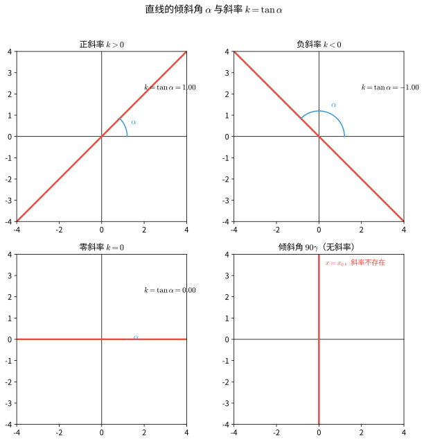

> **直观理解（现实类比）**：斜率就像山坡的**陡峭程度**——坡越陡，斜率的绝对值越大；坡越缓，斜率越接近 $0$。上山时你会感到吃力，正是因为斜率大。
> - **楼梯**的倾斜度就是斜率：每阶楼梯的"高度/水平宽度"就是斜率 $k=\dfrac{\Delta y}{\Delta x}$。陡峭的消防滑梯斜率大，平缓的无障碍坡道斜率小。
> - 斜率为正：上坡（向右上方）；斜率为负：下坡（向右下方）；斜率为 $0$：平路；斜率不存在：直立的悬崖。
> - 楼梯扶手、屋顶坡面、滑梯都是直线的现实原型。建筑规范要求楼梯坡度不超过约 $38°$（$k \le 0.8$），就是为了保证行走安全。

### 2. 直线的方程

#### 点斜式

已知直线过点 $P_0(x_0, y_0)$，斜率为 $k$，则方程为：

$$
y - y_0 = k(x - x_0)
$$

#### 斜截式

已知直线斜率为 $k$，在 $y$ 轴上的截距为 $b$，则方程为：

$$
y = kx + b
$$

#### 两点式

已知直线过两点 $P_1(x_1, y_1)$ 和 $P_2(x_2, y_2)$（$x_1 \neq x_2,\ y_1 \neq y_2$），则方程为：

$$
\frac{y - y_1}{y_2 - y_1} = \frac{x - x_1}{x_2 - x_1}
$$

#### 截距式

已知直线在 $x$ 轴上的截距为 $a$（$a \neq 0$），在 $y$ 轴上的截距为 $b$（$b \neq 0$），则方程为：

$$
\frac{x}{a} + \frac{y}{b} = 1
$$

#### 一般式

所有直线方程都可化为一般式：

$$
Ax + By + C = 0 \quad (A, B \text{ 不同时为 } 0)
$$

其中斜率为 $k = -\dfrac{A}{B}$（$B \neq 0$）。

> **直观理解（现实类比）**：直线方程的不同形式就像用不同的"已知条件"去描述同一条山路。
> - **点斜式**：已知山坡上某一点的位置和坡度，就能写出整条路面方程——就像告诉测绘员"从山门（$x_0,y_0$）开始按 $k$ 的坡度铺路"。
> - **斜截式**：直接告诉你坡度 $k$ 和路面在山脚（$y$ 轴）的高度 $b$，是 $y=kx+b$ 的"截到地面"版本，是最常见的路面对应方程。
> - **两点式**：已知山坡上两个里程碑的位置，就能确定整条路——两点定一线。
> - **截距式**：告诉你这条路在 $x$ 轴、$y$ 轴上的两个交点，就像桥两端落在两岸的位置。
> - **一般式**：把所有形式统一打包成 $Ax+By+C=0$，是"通用的快递包装"，便于判断平行、垂直、求交点。

#### 直线的法向量与方向向量

对于直线 $l: Ax + By + C = 0$（$A, B$ 不同时为 $0$），由方程本身可立即读出两个关键向量：

- **法向量** $\vec{n} = (A, B)$：与直线 $l$ **垂直**的向量。它刻画了直线的"朝向"。
- **方向向量** $\vec{d} = (B, -A)$（或 $(-B, A)$）：与直线 $l$ **平行**的向量。它刻画了直线的"走向"。

两者满足 $\vec{n} \cdot \vec{d} = AB + B(-A) = 0$，即法向量与方向向量互相垂直。直线的斜率 $k = -\dfrac{A}{B}$ 正是方向向量 $(B, -A)$ 的纵坐标与横坐标之比 $k = \dfrac{-A}{B}$。

> 法向量与方向向量是研究直线位置关系（平行、垂直）与点到直线距离的常用工具，下面"两条直线的位置关系"一节将直接用到。

### 3. 两条直线的位置关系

设两条直线 $l_1: A_1x + B_1y + C_1 = 0$，$l_2: A_2x + B_2y + C_2 = 0$。

#### 平行

$$
l_1 \parallel l_2 \iff \frac{A_1}{A_2} = \frac{B_1}{B_2} \neq \frac{C_1}{C_2}
$$

若斜率存在，则 $k_1 = k_2$ 且截距不等。

**证明**：直线 $l: Ax + By + C = 0$ 的法向量为 $\vec{n} = (A, B)$，方向向量为 $\vec{d} = (-B, A)$。故 $l_1$ 的方向向量 $\vec{d}_1 = (-B_1, A_1)$，$l_2$ 的方向向量 $\vec{d}_2 = (-B_2, A_2)$。

两条直线平行当且仅当方向向量共线，即

$$
\vec{d}_1 \parallel \vec{d}_2 \iff (-B_1)A_2 - A_1(-B_2) = 0 \iff A_1B_2 - A_2B_1 = 0
$$

当 $A_2, B_2 \neq 0$ 时，$A_1B_2 = A_2B_1 \iff \dfrac{A_1}{A_2} = \dfrac{B_1}{B_2}$。

但方向向量共线只保证两直线平行或重合。若 $\dfrac{A_1}{A_2} = \dfrac{B_1}{B_2} = \dfrac{C_1}{C_2}$，则两方程成比例，表示同一直线（**重合**）。因此平行（不重合）还须排除该情形，即

$$
l_1 \parallel l_2 \iff \frac{A_1}{A_2} = \frac{B_1}{B_2} \neq \frac{C_1}{C_2}
$$

当斜率存在时，$k = -\dfrac{A}{B}$。$k_1 = k_2 \iff -\dfrac{A_1}{B_1} = -\dfrac{A_2}{B_2} \iff \dfrac{A_1}{B_1} = \dfrac{A_2}{B_2}$，与 $A_1B_2 = A_2B_1$ 等价；"截距不等"正是排除重合情形。$\square$

#### 垂直

$$
l_1 \perp l_2 \iff A_1A_2 + B_1B_2 = 0
$$

若斜率存在，则 $k_1 \cdot k_2 = -1$。

**证明**：两条直线垂直当且仅当它们的法向量垂直（法向量方向相差 $90°$），即

$$
\vec{n}_1 \perp \vec{n}_2 \iff \vec{n}_1 \cdot \vec{n}_2 = 0 \iff A_1A_2 + B_1B_2 = 0
$$

当斜率都存在（$B_1, B_2 \neq 0$）时，

$$
k_1 \cdot k_2 = \left(-\frac{A_1}{B_1}\right)\left(-\frac{A_2}{B_2}\right) = \frac{A_1A_2}{B_1B_2}
$$

由垂直条件 $A_1A_2 + B_1B_2 = 0$ 得 $A_1A_2 = -B_1B_2$，代入得

$$
k_1 \cdot k_2 = \frac{-B_1B_2}{B_1B_2} = -1
$$

反之，若 $k_1k_2 = -1$，则 $A_1A_2 = -B_1B_2$，即 $A_1A_2 + B_1B_2 = 0$。$\square$

#### 相交

两条直线相交，交点坐标由方程组解出：

$$
\begin{cases}
A_1x + B_1y + C_1 = 0 \\
A_2x + B_2y + C_2 = 0
\end{cases}
$$

**证明（唯一性）**：两条直线相交当且仅当它们不平行（且不重合），即方向向量不共线，等价于

$$
\Delta = \begin{vmatrix} A_1 & B_1 \\ A_2 & B_2 \end{vmatrix} = A_1B_2 - A_2B_1 \neq 0
$$

此时该二元一次方程组有**唯一解**（由克莱姆法则）：

$$
x = \frac{\begin{vmatrix} -C_1 & B_1 \\ -C_2 & B_2 \end{vmatrix}}{\Delta}
= \frac{(-C_1)B_2 - B_1(-C_2)}{A_1B_2 - A_2B_1}
= \frac{B_1C_2 - B_2C_1}{A_1B_2 - A_2B_1}
$$

$$
y = \frac{\begin{vmatrix} A_1 & -C_1 \\ A_2 & -C_2 \end{vmatrix}}{\Delta}
= \frac{A_1(-C_2) - (-C_1)A_2}{A_1B_2 - A_2B_1}
= \frac{C_1A_2 - C_2A_1}{A_1B_2 - A_2B_1}
$$

$(x, y)$ 即为两条直线的交点坐标。$\square$

**克莱姆法则（Cramer's rule）附注**：求解二元一次方程组

$$
\begin{cases}
a_1x + b_1y = c_1 \\
a_2x + b_2y = c_2
\end{cases}
$$

记系数行列式 $D = \begin{vmatrix} a_1 & b_1 \\ a_2 & b_2 \end{vmatrix} = a_1b_2 - a_2b_1$。若 $D \neq 0$，则方程组有唯一解：

$$
x = \frac{D_x}{D} = \frac{\begin{vmatrix} c_1 & b_1 \\ c_2 & b_2 \end{vmatrix}}{D}, \qquad
y = \frac{D_y}{D} = \frac{\begin{vmatrix} a_1 & c_1 \\ a_2 & c_2 \end{vmatrix}}{D}
$$

即把系数行列式中**欲求未知数所对应的那一列**替换为常数项列得到 $D_x$、$D_y$，再除以系数行列式 $D$。此处直线方程 $A_1x+B_1y+C_1=0$ 移项为 $A_1x+B_1y=-C_1$，常数项 $c_1=-C_1$，代入即得上式。

该法则由瑞士数学家**克莱姆（Gabriel Cramer）**于 1750 年提出，可推广到 $n$ 元一次方程组：当系数行列式不为零时有唯一解，且每个未知数等于"把对应列替换为常数项后的行列式"除以系数行列式。

> **直观理解（现实类比）**：两条直线的位置关系就像两条马路的关系。
> - **平行**像铁轨——两条钢轨永远保持等距，永不相交（斜率相等，截距不同）。如果截距也相同，就是"同一条铁路"了（重合）。
> - **相交**像十字路口或立交桥——两条路在一点交汇，方向不同。斜率不相等就一定相交。
> - **垂直**是相交的特殊情况，像东西向与南北向的街道成 $90°$ 交叉（$k_1 k_2 = -1$）。
> - 现实中：北京的长安街与各条南北向胡同就是垂直关系；两条平行的地铁隧道是平行关系；斜交的乡间小路是普通相交。

### 4. 点到直线的距离公式

点 $P_0(x_0, y_0)$ 到直线 $l: Ax + By + C = 0$ 的距离为：

$$
d = \frac{|Ax_0 + By_0 + C|}{\sqrt{A^2 + B^2}}
$$

### 5. 两条平行线间的距离

两条平行线 $l_1: Ax + By + C_1 = 0$ 和 $l_2: Ax + By + C_2 = 0$ 之间的距离为：

$$
d = \frac{|C_1 - C_2|}{\sqrt{A^2 + B^2}}
$$

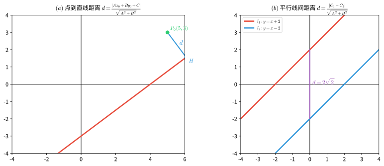

> **直观理解（现实类比）**：点到直线的距离就是"最短路径"——从你所在的位置到一条公路最近的那段路。
> - 你站在野外的某点 $P$，前方有一条笔直的铁路，要走到铁路上最近的一点，肯定垂直地走过去最近，斜着走或绕路都会更长。这个"垂直最短"的长度就是点到直线的距离。
> - **平行线间距离**像两条铁轨之间的固定间距——无论你在哪测量，距离都相等，因为平行线处处等距。
> - 工程上：高铁的接触网到铁轨的距离、两栋楼之间的最小间距、管道到墙面的距离，都用这个公式计算。

### 6. 两直线的夹角公式

两条直线 $l_1$ 和 $l_2$ 的夹角 $\theta$（$0 \leq \theta \leq \frac{\pi}{2}$）满足：

$$
\tan \theta = \left|\frac{k_2 - k_1}{1 + k_1k_2}\right| \quad (k_1k_2 \neq -1)
$$

或使用一般式：

$$
\cos \theta = \frac{|A_1A_2 + B_1B_2|}{\sqrt{A_1^2 + B_1^2}\sqrt{A_2^2 + B_2^2}}
$$

---

## 圆锥曲线

### 0. 圆锥曲线的来源与退化情形

"圆锥曲线"之名源于其几何生成方式：用一个平面去截一个**对顶圆锥**（双锥面），所得交线即为圆锥曲线。根据截面与圆锥面的相对位置，交线可为圆、椭圆、抛物线或双曲线：

- 截平面只与圆锥一侧相交且**不经过顶点** → 椭圆；若截平面垂直于对称轴 → 圆
- 截平面**平行于圆锥的某一条母线** → 抛物线
- 截平面与圆锥**两侧都相交**且不经过顶点 → 双曲线

当截平面经过圆锥的顶点时，交线退化为**点、一条直线或一对相交直线**，称为**退化圆锥曲线**（以下讨论均指非退化的情形）。

> 历史上，圆锥曲线约在公元前 200 年由古希腊数学家**阿波罗尼奥斯**（Apollonius）系统研究并命名。其统一定义（焦点—准线—离心率）与平面截圆锥的一致性可由**丹德林球**（Dandelin spheres）证明。

### 1. 圆 (Circle)

#### 定义

平面上到定点（圆心）的距离等于定长（半径）的点的轨迹。

#### 标准方程

圆心为 $C(h, k)$，半径为 $r$ 的圆的标准方程为：

$$
(x - h)^2 + (y - k)^2 = r^2
$$

特别地，圆心在原点 $(0, 0)$ 时：

$$
x^2 + y^2 = r^2
$$

#### 一般方程

$$
x^2 + y^2 + Dx + Ey + F = 0
$$

配方后化为标准形式：

$$
\left(x + \frac{D}{2}\right)^2 + \left(y + \frac{E}{2}\right)^2 = \frac{D^2 + E^2 - 4F}{4}
$$

其中圆心为 $\left(-\dfrac{D}{2},\ -\dfrac{E}{2}\right)$，半径 $r = \dfrac{1}{2}\sqrt{D^2 + E^2 - 4F}$（需满足 $D^2 + E^2 - 4F > 0$）。

#### 圆的参数方程

$$
\begin{cases}
x = h + r\cos \theta \\
y = k + r\sin \theta
\end{cases} \quad \theta \in [0, 2\pi)
$$

> **直观理解（现实类比）**：圆的方程就像**雷达扫描范围**或**GPS 定义的圆形区域**。
> - 圆心 $(h, k)$ 是雷达站的位置，半径 $r$ 是雷达能扫描的最远距离。圆上每一点都满足"到雷达站的距离恰好等于 $r$"，圆内是扫描覆盖区，圆外是盲区。
> - 打开手机地图，搜索"附近的咖啡店 1 公里内"，地图画出的圆形范围就是圆的方程——你站在圆心，半径 1 公里。
> - **投石入水**激起的涟漪、**手电筒光圈**的边缘、**唱片**的轮廓都是圆——它们都遵循"到中心距离相等"这一规则。

### 2. 椭圆 (Ellipse)

#### 定义

平面上到两个定点（焦点 $F_1$、$F_2$）的距离之和等于常数（$2a$，且 $2a > |F_1F_2|$）的点的轨迹。

> **直观理解（现实类比）**：椭圆像**行星的轨道**——开普勒发现地球绕太阳的轨道是椭圆，太阳在一个焦点上。
> - 想象你在椭圆花坛的边缘散步，花坛里有两个水池 $F_1$、$F_2$，你走到任意位置时，到两个水池的距离之和**始终相等**（等于 $2a$）。这是椭圆定义的精确含义。
> - **绳钉画椭圆**：把一根绳子两端钉在两点（焦点）上，用笔把绳子绷紧滑动，画出的就是椭圆。绳子总长不变（$=2a$），所以距离和恒定。
> - **花园椭圆花坛**、**体育场跑道**、**橄榄球**、**鸡蛋俯视图**都是椭圆的实例。两个焦点是它的"灵魂"——它们越靠近，椭圆越接近圆。

#### 标准方程

焦点在 $x$ 轴上时：

$$
\frac{x^2}{a^2} + \frac{y^2}{b^2} = 1 \quad (a > b > 0)
$$

其中 $a$ 为**半长轴**，$b$ 为**半短轴**，满足 $a^2 = b^2 + c^2$，$c$ 为**半焦距**。

焦点坐标为 $F_1(-c, 0)$、$F_2(c, 0)$，顶点坐标为 $(\pm a, 0)$、$(0, \pm b)$。

焦点在 $y$ 轴上时：

$$
\frac{x^2}{b^2} + \frac{y^2}{a^2} = 1 \quad (a > b > 0)
$$

#### 准线

焦点在 $x$ 轴上时，椭圆有两条准线 $l_1$、$l_2$：

$$
x = \pm \frac{a^2}{c}
$$

椭圆上任意一点到焦点的距离与到对应准线的距离之比等于离心率 $e$，即 $\dfrac{|PF|}{d(P, l)} = e = \dfrac{c}{a}$。

#### 离心率

椭圆的离心率 $e = \dfrac{c}{a}$，$0 < e < 1$。

- $e$ 越接近 0，椭圆越接近圆
- $e$ 越接近 1，椭圆越扁

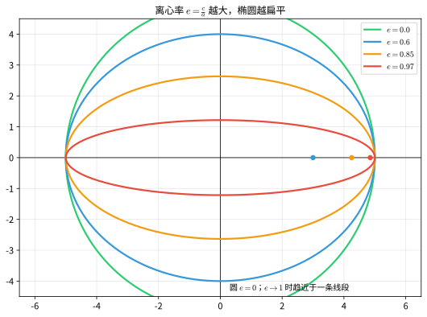

> **直观理解（现实类比）**：椭圆离心率 $e$ 描述椭圆**扁圆的程度**——像衡量一个面团被压扁的程度。
> - $e$ 越接近 $0$，焦点越靠近中心，椭圆越像圆（圆是 $e=0$ 的特例）——就像一张煎饼圆鼓鼓的。
> - $e$ 越接近 $1$，两焦点离得越远，椭圆越扁长——就像被擀面杖压扁的面皮，越来越细长。
> - **行星轨道对比**：金星的 $e \approx 0.007$，几乎是圆；地球的 $e \approx 0.017$，微微扁；哈雷彗星的 $e \approx 0.97$，又扁又长。$e$ 越大，轨道越"狂野"——近日点离太阳近，远日点跑得老远。

#### 椭圆的参数方程

$$
\begin{cases}
x = a\cos \theta \\
y = b\sin \theta
\end{cases} \quad \theta \in [0, 2\pi)
$$

#### 面积

椭圆面积 $S = \pi ab$。

### 3. 双曲线 (Hyperbola)

#### 定义

平面上到两个定点（焦点 $F_1$、$F_2$）的距离之差的绝对值等于常数（$2a$，且 $0 < 2a < |F_1F_2|$）的点的轨迹。

> **直观理解（现实类比）**：双曲线就像**两个雷达的时差定位**——这是它在现代科技中最有名的应用。
> - **GPS 双曲线定位**：如果你听到两个雷达站同时发信号，但信号到达你这儿有**时间差**（因为距离差恒定），你就站在一条双曲线上。三个雷达站就能用两条双曲线的交点确定你的位置——这正是导航系统的原理。
> - 双曲线定义是"到两点距离**之差**为常数"——和椭圆的"之和"恰好相反。想象两个邻居 $F_1$、$F_2$，你到他们家距离的差始终不变。
> - **冷却塔**的截面、**核电站通风塔**的轮廓都是双曲线——它们利用双曲线的几何性质实现高效散热。
> - 双曲线有**两支**，分别对应"离 $F_1$ 近"和"离 $F_2$ 近"两类点。

#### 标准方程

焦点在 $x$ 轴上时：

$$
\frac{x^2}{a^2} - \frac{y^2}{b^2} = 1 \quad (a > 0,\ b > 0)
$$

其中 $c^2 = a^2 + b^2$，$c$ 为半焦距。

焦点坐标为 $F_1(-c, 0)$、$F_2(c, 0)$，顶点坐标为 $(\pm a, 0)$。

焦点在 $y$ 轴上时：

$$
\frac{y^2}{a^2} - \frac{x^2}{b^2} = 1 \quad (a > 0,\ b > 0)
$$

#### 渐近线

双曲线 $\dfrac{x^2}{a^2} - \dfrac{y^2}{b^2} = 1$ 的渐近线方程为：

$$
y = \pm \frac{b}{a}x
$$

双曲线 $\dfrac{y^2}{a^2} - \dfrac{x^2}{b^2} = 1$ 的渐近线方程为：

$$
y = \pm \frac{a}{b}x
$$

#### 准线

焦点在 $x$ 轴上时，双曲线有两条准线：

$$
x = \pm \frac{a^2}{c} \quad (c^2 = a^2 + b^2)
$$

同样满足 $\dfrac{|PF|}{d(P, l)} = e = \dfrac{c}{a}$。

#### 离心率

双曲线的离心率 $e = \dfrac{c}{a}$，$e > 1$。

#### 等轴双曲线

当 $a = b$ 时，称为等轴双曲线，方程为 $x^2 - y^2 = a^2$，渐近线为 $y = \pm x$，离心率 $e = \sqrt{2}$。

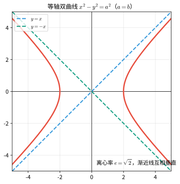

### 4. 抛物线 (Parabola)

#### 定义

平面上到一定点（焦点 $F$）的距离等于到一定直线（准线 $l$）的距离的点的轨迹。

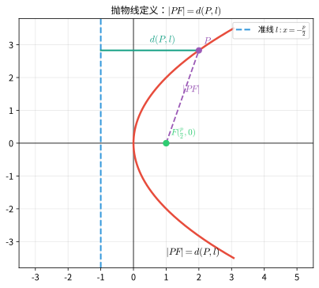

> **直观理解（现实类比）**：抛物线像**抛出去的物体的轨迹**和**卫星天线**的截面。
> - **抛物轨迹**：你扔出一颗石子，它在空中划过的弧线（不考虑空气阻力）就是抛物线——这是它名字的由来。
> - **卫星天线/雷达锅**：抛物面（抛物线绕轴旋转）能把平行入射的信号会聚到焦点，也能把焦点的信号反射成平行光束。电视卫星锅、手电筒反光杯、汽车前灯、太阳灶都是抛物面。
> - 定义"到焦点的距离=到准线的距离"可以理解为：动点 $P$ 始终在"焦点"和"准线"之间做等距拉锯——既不偏焦点，也不偏准线。
> - **喷泉**的水柱、**投篮**时篮球的轨迹，都是抛物线的鲜活例子。

#### 标准方程

四种标准形式：

|          方程          | 开口方向 |             焦点坐标             |       准线方程       |
| :---------------------: | :------: | :-------------------------------: | :-------------------: |
| $y^2 = 2px\ (p > 0)$ |   向右   | $\left(\dfrac{p}{2}, 0\right)$ | $x = -\dfrac{p}{2}$ |
| $y^2 = -2px\ (p > 0)$ |   向左   | $\left(-\dfrac{p}{2}, 0\right)$ | $x = \dfrac{p}{2}$ |
| $x^2 = 2py\ (p > 0)$ |   向上   | $\left(0, \dfrac{p}{2}\right)$ | $y = -\dfrac{p}{2}$ |
| $x^2 = -2py\ (p > 0)$ |   向下   | $\left(0, -\dfrac{p}{2}\right)$ | $y = \dfrac{p}{2}$ |

其中 $p$ 为**焦准距**，即焦点到准线的距离。

#### 离心率

抛物线的离心率 $e = 1$。

### 5. 圆锥曲线的统一定义

圆锥曲线（椭圆、抛物线、双曲线）可以统一地定义为：平面上到定点 $F$（焦点）的距离与到定直线 $l$（准线）的距离之比为常数 $e$（离心率）的点的轨迹。

$$
\frac{|PF|}{d(P, l)} = e
$$

- $0 < e < 1$：椭圆
- $e = 1$：抛物线
- $e > 1$：双曲线

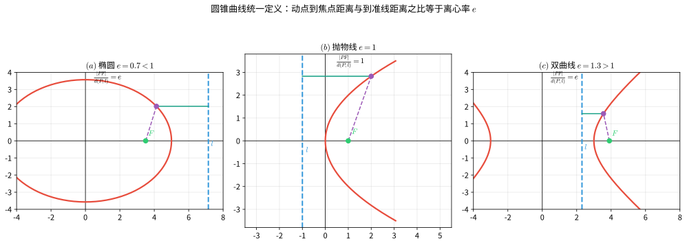

> **直观理解（现实类比）**：圆锥曲线的统一定义把圆、椭圆、抛物线、双曲线统一成"**同一个家族**"——它们都是"焦点 + 准线 + 离心率"三种参数的产物，只是离心率 $e$ 的取值不同。
> - **轨道力学**的三大轨道类型正对应三种曲线：$e<1$ 椭圆轨道（绕行星运行，像地球绕太阳）；$e=1$ 抛物线轨道（恰好能逃逸引力，像彗星一去不返）；$e>1$ 双曲线轨道（速度过快，飞出去不再回来，像探测器飞掠行星）。
> - 把 $e$ 想成"动点偏爱焦点还是准线的程度"：$e<1$ 偏爱准线（更圆滑地靠近）；$e=1$ 一视同仁（抛物线）；$e>1$ 偏爱焦点（被拉向远方，形成两支）。
> - 这就好比调节"水龙头开度"：水开小（$e$ 小）水流温和像椭圆；开到某刻度（$e=1$）水流正好成抛物线；开太大（$e>1$）水花四溅像双曲线。

#### 极坐标形式

以焦点为极点、准线为定直线 $x = d$ 时，圆锥曲线有统一的极坐标方程：

$$
\rho = \frac{ed}{1 \pm e\cos\theta}
$$

其中 $\theta$ 为动点 $\rho = |PF|$ 与极轴的夹角，$d$ 为准线到焦点的距离。$e = 1$ 时为抛物线，$0 < e < 1$ 时为椭圆，$e > 1$ 时为双曲线。

#### 判别式分类

一般二次方程 $Ax^2 + Bxy + Cy^2 + Dx + Ey + F = 0$（$A$、$B$、$C$ 不全为 $0$）表示圆锥曲线，可由判别式分类：

- $B^2 - 4AC < 0$：椭圆（若 $A = C$ 且 $B = 0$ 则为圆）
- $B^2 - 4AC = 0$：抛物线
- $B^2 - 4AC > 0$：双曲线

该判别式在坐标轴的旋转与平移下保持不变。

### 6. 圆锥曲线的光学性质与应用

所有非退化圆锥曲线都具有**反射性质**：从圆锥曲线的一个焦点发出的光线，经曲线反射后，会聚到另一个焦点（椭圆、双曲线）；抛物线的"另一个焦点"在无穷远处，故反射后成为平行于对称轴的平行光。

- **椭圆**：从一个焦点发出的光线经椭圆反射后均经过另一焦点（如椭圆的回音室）。
- **抛物线**：将光源置于焦点，反射后得到平行光束，用于**探照灯、抛物面天线、卫星接收器、射电望远镜**；反向，平行光经抛物面反射会聚于焦点（聚光镜、抛物面太阳灶）。
- **双曲线**：从一个焦点发出的光线经双曲线反射后，其延长线经过另一焦点，用于卡塞格林望远镜等光学系统。

> **直观理解（现实类比）**：圆锥曲线的光学性质是它们在工程中最惊艳的应用。
> - **抛物面反射**：手电筒、汽车前灯、探照灯把灯泡放在焦点，反光罩是抛物面，光线反射后**全部平行射出**——所以你看到的是一道强光柱而非散光。卫星接收锅反过来：平行信号被抛物面反射后会聚到焦点上的高频头。
> - **椭圆回音壁**：站在椭圆的一个焦点上低声说话，声音经椭圆墙面反射后会聚到另一焦点，那里的人听得清清楚楚——北京天坛的回音壁、圣保罗大教堂的耳语廊都是这种原理。
> - **双曲线反射**：卡塞格林望远镜用双曲面副镜把光路"折返"，让长焦距望远镜变得紧凑——天文望远镜的精髓就在这里。
> - 一句话总结：**椭圆聚焦成点，抛物线聚焦成平行光，双曲线改变光路方向**——三种曲线各司其职，撑起了现代光学工程。

#### 光学性质的证明

反射定律（入射角等于反射角）在解析几何中可表述为：曲线在切点 $P$ 处的**法线** $\vec{n}$ 平分入射方向与反射方向所夹的角，即 $\vec{n}$ 与入射方向、反射方向的夹角相等。下面分别证明三类曲线满足该性质。

**（1）椭圆**

设椭圆 $\dfrac{x^2}{a^2}+\dfrac{y^2}{b^2}=1\ (a>b>0)$，$c^2=a^2-b^2$，切点 $P(x_0,y_0)$。椭圆在 $P$ 处的切线方程为

$$
\frac{x x_0}{a^2}+\frac{y y_0}{b^2}=1
$$

故 $P$ 处的法向量为 $\vec{n}=\left(\dfrac{x_0}{a^2},\ \dfrac{y_0}{b^2}\right)$。焦点 $F_1(-c,0)$、$F_2(c,0)$，记 $r_1=|F_1P|$、$r_2=|F_2P|$。由椭圆定义 $r_1+r_2=2a$，又

$$
r_1^2-r_2^2=\big[(x_0+c)^2+y_0^2\big]-\big[(x_0-c)^2+y_0^2\big]=4cx_0
$$

两式相除得 $r_1-r_2=\dfrac{2cx_0}{a}$，于是得到焦半径公式：

$$
r_1=a+\frac{c}{a}x_0,\qquad r_2=a-\frac{c}{a}x_0
$$

入射方向 $\overrightarrow{F_1P}=(x_0+c,\ y_0)$，反射方向 $\overrightarrow{PF_2}=(c-x_0,\ -y_0)$。计算两者在法线上的投影：

$$
\overrightarrow{F_1P}\cdot\vec{n}
=\frac{x_0(x_0+c)}{a^2}+\frac{y_0^2}{b^2}
=\underbrace{\Big(\frac{x_0^2}{a^2}+\frac{y_0^2}{b^2}\Big)}_{=1}+\frac{cx_0}{a^2}
=1+\frac{cx_0}{a^2}
$$

$$
\overrightarrow{PF_2}\cdot\vec{n}
=\frac{x_0(c-x_0)}{a^2}-\frac{y_0^2}{b^2}
=\frac{cx_0}{a^2}-1
$$

于是两投影分别为

$$
\frac{\overrightarrow{F_1P}\cdot\vec{n}}{r_1}
=\frac{1+\frac{cx_0}{a^2}}{a+\frac{cx_0}{a}}=\frac{1}{a},\qquad
\frac{\overrightarrow{PF_2}\cdot\vec{n}}{r_2}
=\frac{\frac{cx_0}{a^2}-1}{a-\frac{cx_0}{a}}=-\frac{1}{a}
$$

两向量在法线上的投影**大小相等、方向相反**，故 $\overrightarrow{F_1P}$ 与 $\overrightarrow{PF_2}$ 关于法线对称，即法线平分 $\angle F_1PF_2$。由反射定律，从 $F_1$ 发出的光线经椭圆反射后必经过 $F_2$。$\square$

**（2）抛物线**

设抛物线 $y^2=2px\ (p>0)$，焦点 $F\left(\dfrac{p}{2},0\right)$，切点 $P(x_0,y_0)$，满足 $y_0^2=2px_0$。对 $y^2=2px$ 隐函数求导得切线斜率

$$
k_t=y'=\frac{p}{y_0}
$$

设切线倾角为 $\alpha$（$\tan\alpha=k_t$），焦点光线 $FP$ 的倾角为 $\beta$，则

$$
\tan\beta=\frac{y_0}{x_0-\frac{p}{2}}=\frac{2y_0}{2x_0-p}
$$

而

$$
\tan 2\alpha=\frac{2\tan\alpha}{1-\tan^2\alpha}
=\frac{2\cdot\frac{p}{y_0}}{1-\frac{p^2}{y_0^2}}
=\frac{2py_0}{y_0^2-p^2}
=\frac{2py_0}{2px_0-p^2}
=\frac{2y_0}{2x_0-p}
=\tan\beta
$$

故 $\beta=2\alpha$，即焦点光线与切线的夹角等于轴方向与切线的夹角。因此从焦点 $F$ 发出的光线经抛物线反射后，沿平行于对称轴（$x$ 轴）的方向射出。$\square$

**（3）双曲线**

设双曲线 $\dfrac{x^2}{a^2}-\dfrac{y^2}{b^2}=1$，$c^2=a^2+b^2$，切点 $P(x_0,y_0)$。切线方程为 $\dfrac{xx_0}{a^2}-\dfrac{yy_0}{b^2}=1$，故法向量为 $\vec{n}=\left(\dfrac{x_0}{a^2},\ -\dfrac{y_0}{b^2}\right)$。记 $r_1=|F_1P|$、$r_2=|F_2P|$。由双曲线定义 $r_1-r_2=2a$，且 $r_1^2-r_2^2=4cx_0$，故 $r_1+r_2=\dfrac{2cx_0}{a}$，从而

$$
r_1=a+\frac{c}{a}x_0,\qquad r_2=\frac{c}{a}x_0-a
$$

入射方向 $\overrightarrow{F_1P}=(x_0+c,\ y_0)$，出射方向 $\overrightarrow{PF_2}=(c-x_0,\ -y_0)$：

$$
\overrightarrow{F_1P}\cdot\vec{n}=1+\frac{cx_0}{a^2},\qquad
\overrightarrow{PF_2}\cdot\vec{n}=\frac{cx_0}{a^2}-1
$$

代入 $r_1$、$r_2$ 得两投影

$$
\frac{\overrightarrow{F_1P}\cdot\vec{n}}{r_1}=\frac{1}{a},\qquad
\frac{\overrightarrow{PF_2}\cdot\vec{n}}{r_2}=\frac{1}{a}
$$

两者相等，故出射方向 $\overrightarrow{PF_2}$ 恰是入射方向 $\overrightarrow{F_1P}$ 关于法线的反射像，即从 $F_1$ 发出的光线经双曲线反射后沿 $P\to F_2$ 方向射出，其**延长线经过另一焦点 $F_2$**。$\square$

### 7. 圆锥曲线分类总表

|  曲线  |                       标准方程                       |   离心率$e$   |    半焦距$c$    |  半正焦弦$\ell$  |           准线           |
| :----: | :--------------------------------------------------: | :--------------: | :----------------: | :----------------: | :-----------------------: |
|   圆   |                 $x^2 + y^2 = r^2$                 |      $0$      |       $0$       |       $r$       |          无穷远          |
|  椭圆  | $\dfrac{x^2}{a^2} + \dfrac{y^2}{b^2} = 1\ (a>b>0)$ | $\dfrac{c}{a}$ | $\sqrt{a^2-b^2}$ | $\dfrac{b^2}{a}$ | $x = \pm\dfrac{a^2}{c}$ |
| 抛物线 |                 $y^2 = 2px\ (p>0)$                 |      $1$      |     $\infty$     |       $p$       |   $x = -\dfrac{p}{2}$   |
| 双曲线 |     $\dfrac{x^2}{a^2} - \dfrac{y^2}{b^2} = 1$     | $\dfrac{c}{a}$ | $\sqrt{a^2+b^2}$ | $\dfrac{b^2}{a}$ | $x = \pm\dfrac{a^2}{c}$ |

其中半正焦弦 $\ell = \frac{b^2}{a}$ 是过焦点且垂直于主轴、夹在曲线内的弦长之半。

---

## 坐标变换

### 1. 坐标轴的平移

将坐标系的原点平移至 $O'(h, k)$ 处，新坐标系 $x'O'y'$ 与原坐标系 $xOy$ 之间的关系为：

$$
\begin{cases}
x = x' + h \\
y = y' + k
\end{cases}
\quad\text{或}\quad
\begin{cases}
x' = x - h \\
y' = y - k
\end{cases}
$$

平移变换可用于化简不含 $xy$ 项的二次曲线方程。例如，将椭圆 $\dfrac{(x - h)^2}{a^2} + \dfrac{(y - k)^2}{b^2} = 1$ 通过平移化为 $\dfrac{x'^2}{a^2} + \dfrac{y'^2}{b^2} = 1$。

### 2. 坐标轴的旋转

将坐标系绕原点逆时针旋转角度 $\theta$，新坐标系 $x'Oy'$ 与原坐标系 $xOy$ 之间的关系为：

$$
\begin{cases}
x = x'\cos\theta - y'\sin\theta \\
y = x'\sin\theta + y'\cos\theta
\end{cases}
\quad\text{或}\quad
\begin{cases}
x' = x\cos\theta + y\sin\theta \\
y' = -x\sin\theta + y\cos\theta
\end{cases}
$$

旋转变换可用于消去一般二次曲线方程中的 $xy$ 项。对于一般二次方程

$$
Ax^2 + Bxy + Cy^2 + Dx + Ey + F = 0
$$

令 $\cot 2\theta = \dfrac{A - C}{B}$，即可消去 $xy$ 项，将方程化为标准形式。

> **直观理解（现实类比）**：坐标变换就像改变"看世界的视角"，物体本身没变，只是换了参考系。
> - **平移**像**搬家**——你把家具（图形）从旧家搬到新家，但家具的形状没变。坐标轴的原点挪到了新位置 $(h, k)$，所有点的坐标都"减去搬家距离"。比如圆心在 $(2, 3)$ 的圆，把原点搬到 $(2, 3)$ 后，圆的方程就简化成 $x'^2 + y'^2 = r^2$——化繁为简就是平移的本事。
> - **旋转**像**转动视角**——你歪头看一张斜放的椅子，椅子没动，但你看它的角度变了。旋转坐标轴可以让原本"歪斜"的椭圆转正，让 $xy$ 项消失，露出标准方程的真面目。
> - 拍照时的**水平仪**、地图的**正北方向**都是固定的参考系；而旋转手机看视频、横屏竖屏切换，就是在做"坐标旋转"。

---

## 定理与证明

### 定理 1：两点间距离公式的证明

**定理**：平面上两点 $P_1(x_1, y_1)$ 和 $P_2(x_2, y_2)$ 之间的距离为 $|P_1P_2| = \sqrt{(x_2 - x_1)^2 + (y_2 - y_1)^2}$。

**证明**：

过 $P_1$ 作 $x$ 轴的平行线，过 $P_2$ 作 $y$ 轴的平行线，两线交于点 $Q(x_2, y_1)$。

则 $P_1Q = |x_2 - x_1|$（水平距离），$P_2Q = |y_2 - y_1|$（竖直距离）。

在直角三角形 $P_1QP_2$ 中，由勾股定理：

$$
|P_1P_2|^2 = |P_1Q|^2 + |P_2Q|^2 = (x_2 - x_1)^2 + (y_2 - y_1)^2
$$

两边取算术平方根，即得：

$$
|P_1P_2| = \sqrt{(x_2 - x_1)^2 + (y_2 - y_1)^2}
$$

$\square$

### 定理 2：点到直线距离公式的证明

**定理**：点 $P_0(x_0, y_0)$ 到直线 $l: Ax + By + C = 0$ 的距离为 $d = \dfrac{|Ax_0 + By_0 + C|}{\sqrt{A^2 + B^2}}$。

**证明**：

设过点 $P_0$ 且垂直于直线 $l$ 的直线为 $l'$，$l$ 的法向量为 $\vec{n} = (A, B)$，则 $l'$ 的方向向量为 $\vec{n}$。

$l'$ 的参数方程为：

$$
\begin{cases}
x = x_0 + At \\
y = y_0 + Bt
\end{cases}
$$

设 $l'$ 与 $l$ 的交点为 $P_1(x_1, y_1)$，则存在 $t_0$ 使得：

$$
x_1 = x_0 + At_0,\quad y_1 = y_0 + Bt_0
$$

代入 $l$ 的方程：

$$
A(x_0 + At_0) + B(y_0 + Bt_0) + C = 0
$$

解得：

$$
t_0 = -\frac{Ax_0 + By_0 + C}{A^2 + B^2}
$$

于是距离 $d = |P_0P_1| = \sqrt{(At_0)^2 + (Bt_0)^2} = |t_0|\sqrt{A^2 + B^2}$。

代入 $t_0$ 得：

$$
d = \frac{|Ax_0 + By_0 + C|}{\sqrt{A^2 + B^2}}
$$

$\square$

### 定理 3：圆锥曲线的统一定义

**定理**：在平面内，到定点 $F$（焦点）的距离与到定直线 $l$（准线）的距离之比为常数 $e$（离心率）的点的轨迹是圆锥曲线。具体地：

- 当 $0 < e < 1$ 时，轨迹为椭圆
- 当 $e = 1$ 时，轨迹为抛物线
- 当 $e > 1$ 时，轨迹为双曲线

**证明思路**（以椭圆为例）：

取焦点 $F(c, 0)$，准线 $l: x = \dfrac{a^2}{c}$（$a > c > 0$），离心率 $e = \dfrac{c}{a}$。

设动点 $P(x, y)$，由定义：

$$
\frac{|PF|}{d(P, l)} = e \implies \frac{\sqrt{(x - c)^2 + y^2}}{\left|x - \frac{a^2}{c}\right|} = \frac{c}{a}
$$

两边平方并整理：

$$
a^2[(x - c)^2 + y^2] = c^2\left(x - \frac{a^2}{c}\right)^2
$$

展开：

$$
a^2(x^2 - 2cx + c^2 + y^2) = c^2x^2 - 2a^2cx + a^4
$$

化简：

$$
a^2x^2 - 2a^2cx + a^2c^2 + a^2y^2 = c^2x^2 - 2a^2cx + a^4
$$

$$
(a^2 - c^2)x^2 + a^2y^2 = a^2(a^2 - c^2)
$$

令 $b^2 = a^2 - c^2$，两边除以 $a^2b^2$：

$$
\frac{x^2}{a^2} + \frac{y^2}{b^2} = 1
$$

这正是椭圆的标准方程。$\square$

类似地，对 $e = 1$ 推导可得抛物线方程，对 $e > 1$ 推导可得双曲线方程。

---

## 示例

### 示例 1：直线问题

**题目**：求过点 $P(2, 3)$，且与直线 $l: 3x - 4y + 5 = 0$ 垂直的直线方程。

**解**：

直线 $l$ 的斜率 $k_1 = -\dfrac{A}{B} = -\dfrac{3}{-4} = \dfrac{3}{4}$。

由于两直线垂直，所求直线的斜率 $k_2$ 满足 $k_1 \cdot k_2 = -1$，故 $k_2 = -\dfrac{4}{3}$。

由点斜式得：

$$
y - 3 = -\frac{4}{3}(x - 2)
$$

化为一般式：

$$
3(y - 3) = -4(x - 2) \implies 4x + 3y - 17 = 0
$$

**答案**：$4x + 3y - 17 = 0$

---

### 示例 2：圆的问题

**题目**：求圆心在 $C(2, -3)$，且过点 $P(5, 1)$ 的圆的方程。

**解**：

半径 $r = |CP| = \sqrt{(5 - 2)^2 + (1 + 3)^2} = \sqrt{3^2 + 4^2} = 5$。

由标准方程得：

$$
(x - 2)^2 + (y + 3)^2 = 25
$$

展开得一般式：

$$
x^2 - 4x + 4 + y^2 + 6y + 9 = 25 \implies x^2 + y^2 - 4x + 6y - 12 = 0
$$

**答案**：$(x - 2)^2 + (y + 3)^2 = 25$

---

### 示例 3：椭圆问题

**题目**：已知椭圆的焦点为 $F_1(-3, 0)$、$F_2(3, 0)$，且过点 $P(4, \frac{12}{5})$，求椭圆的标准方程。

**解**：

由焦点坐标可知 $c = 3$，且焦点在 $x$ 轴上，设椭圆方程为 $\dfrac{x^2}{a^2} + \dfrac{y^2}{b^2} = 1$。

由椭圆定义：$|PF_1| + |PF_2| = 2a$。

$$
|PF_1| = \sqrt{(4 + 3)^2 + \left(\frac{12}{5}\right)^2} = \sqrt{49 + \frac{144}{25}} = \sqrt{\frac{1225 + 144}{25}} = \sqrt{\frac{1369}{25}} = \frac{37}{5}
$$

$$
|PF_2| = \sqrt{(4 - 3)^2 + \left(\frac{12}{5}\right)^2} = \sqrt{1 + \frac{144}{25}} = \sqrt{\frac{169}{25}} = \frac{13}{5}
$$

$2a = \dfrac{37}{5} + \dfrac{13}{5} = 10$，故 $a = 5$。

由 $b^2 = a^2 - c^2 = 25 - 9 = 16$，得 $b = 4$。

**答案**：$\dfrac{x^2}{25} + \dfrac{y^2}{16} = 1$

---

### 示例 4：双曲线问题

**题目**：求双曲线 $9x^2 - 16y^2 = 144$ 的焦点坐标、渐近线方程和离心率。

**解**：

将方程化为标准形式：

$$
\frac{x^2}{16} - \frac{y^2}{9} = 1
$$

故 $a^2 = 16$，$a = 4$；$b^2 = 9$，$b = 3$。

$c^2 = a^2 + b^2 = 16 + 9 = 25$，$c = 5$。

- 焦点坐标：$F_1(-5, 0)$、$F_2(5, 0)$
- 渐近线方程：$y = \pm \dfrac{b}{a}x = \pm \dfrac{3}{4}x$
- 离心率：$e = \dfrac{c}{a} = \dfrac{5}{4} = 1.25$

---

### 示例 5：抛物线问题

**题目**：已知抛物线的顶点在原点，焦点在 $x$ 轴正半轴上，且过点 $P(2, 4)$，求抛物线的标准方程、焦点坐标和准线方程。

**解**：

设抛物线方程为 $y^2 = 2px$（$p > 0$）。

将 $P(2, 4)$ 代入：

$$
4^2 = 2p \cdot 2 \implies 16 = 4p \implies p = 4
$$

故抛物线方程为 $y^2 = 8x$。

- 焦点坐标：$\left(\dfrac{p}{2}, 0\right) = (2, 0)$
- 准线方程：$x = -\dfrac{p}{2} = -2$

---

### 示例 6：综合问题

**题目**：求椭圆 $\dfrac{x^2}{25} + \dfrac{y^2}{9} = 1$ 上一点 $P$，使得 $P$ 到直线 $l: 3x - 4y + 24 = 0$ 的距离最小，并求最小距离。

**解**：

设椭圆上点 $P(5\cos\theta, 3\sin\theta)$（参数形式）。

点 $P$ 到直线 $l$ 的距离为：

$$
d = \frac{|3 \cdot 5\cos\theta - 4 \cdot 3\sin\theta + 24|}{\sqrt{3^2 + (-4)^2}} = \frac{|15\cos\theta - 12\sin\theta + 24|}{5}
$$

令 $15\cos\theta - 12\sin\theta = r\cos(\theta + \varphi)$，其中 $r = \sqrt{15^2 + 12^2} = \sqrt{225 + 144} = \sqrt{369} = 3\sqrt{41}$。

于是 $d = \dfrac{|r\cos(\theta + \varphi) + 24|}{5}$。

当 $\cos(\theta + \varphi) = -1$ 时，分子取最小值 $|24 - r|$：

$$
d_{\min} = \frac{24 - 3\sqrt{41}}{5}
$$

此时 $15\cos\theta - 12\sin\theta = -3\sqrt{41}$，可解得 $\cos\theta$ 和 $\sin\theta$ 的值，进而得到 $P$ 点坐标。

**答案**：最小距离为 $\dfrac{24 - 3\sqrt{41}}{5}$。

---

## 平面向量

> 向量是连接"数"与"形"的又一重要工具。它既有大小又有方向，既能作几何运算，又能化为坐标进行代数处理。学习平面向量，可以与前面已学的坐标系、直线方程自然衔接——例如直线的方向向量、法向量与斜率的关系，正是向量坐标化的直接应用。

### 1. 向量的概念

#### 定义

既有**大小**又有**方向**的量称为**向量**。在平面上常用带箭头的有向线段 $\overrightarrow{AB}$ 表示，其中 $A$ 为**起点**，$B$ 为**终点**；也可用小写字母加箭头表示，如 $\vec{a}$、$\vec{b}$。

只研究大小而不考虑方向的量称为**标量**（或数量），如长度、质量、时间等。

#### 向量的表示

- **几何表示**：有向线段 $\overrightarrow{AB}$，箭头指向即方向，线段长度即大小
- **字母表示**：$\vec{a}$、$\vec{b}$、$\vec{c}$ 等，或 $\overrightarrow{AB}$、$\overrightarrow{CD}$

> **直观理解（现实类比）**：向量就是**带方向的箭头**——既有大小又有方向的量。
> - **力**：你推箱子，用力 $10$ 牛、方向朝东，这就是一个向量。力的方向变了，效果完全不同——往东推和往北推，箱子走的方向截然不同。
> - **速度**：汽车时速 $60$ 公里、向北行驶——速度也是向量。两辆时速都是 $60$ 的车，方向相反就会越走越远。
> - **位移**：从家到学校走 $2$ 公里、向东北方向——这是位移向量，只关心起点和终点，不关心中间怎么绕。
> - 标量（温度、质量、时间）只有大小没有方向；向量（力、速度、位移、加速度）两者兼备。区分标量和向量是物理入门的关键。

#### 向量的模

向量 $\vec{a}$ 的大小称为向量的**模**（或长度），记作 $|\vec{a}|$。设 $\vec{a} = (x, y)$，则：

$$
|\vec{a}| = \sqrt{x^2 + y^2}
$$

特别地，有向线段 $\overrightarrow{AB}$ 的模 $|\overrightarrow{AB}|$ 就等于两点 $A$、$B$ 之间的距离。

#### 零向量与单位向量

- **零向量**：模为 $0$ 的向量，记作 $\vec{0}$，其方向是任意的
- **单位向量**：模为 $1$ 的向量。与 $\vec{a}$ 同方向的单位向量记作 $\vec{e}_a = \dfrac{\vec{a}}{|\vec{a}|}$（$|\vec{a}| \neq 0$）

#### 向量的方向

向量 $\vec{a} = (x, y) \neq \vec{0}$ 的方向可以用它与 $x$ 轴正方向的夹角 $\theta$ 来描述，满足：

$$
\cos\theta = \frac{x}{|\vec{a}|},\qquad \sin\theta = \frac{y}{|\vec{a}|}
$$

夹角 $\theta$ 称为向量 $\vec{a}$ 的**方向角**。

#### 相等向量与共线向量

- **相等向量**：方向相同且模相等的向量，与起点位置无关
- **相反向量**：与 $\vec{a}$ 方向相反、模相等的向量，记作 $-\vec{a}$
- **平行（共线）向量**：方向相同或相反的向量，记作 $\vec{a} \parallel \vec{b}$

> 注意：零向量与任何向量平行。

---

### 2. 向量的线性运算

#### 加法——三角形法则

设 $\vec{a} = \overrightarrow{AB}$，$\vec{b} = \overrightarrow{BC}$，则和向量为：

$$
\vec{a} + \vec{b} = \overrightarrow{AB} + \overrightarrow{BC} = \overrightarrow{AC}
$$

即"首尾相接，指向被加向量的终点指向加向量的终点"。

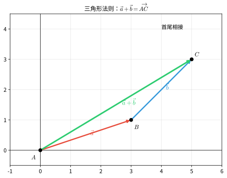

#### 加法——平行四边形法则

设 $\vec{a} = \overrightarrow{OA}$，$\vec{b} = \overrightarrow{OB}$，以 $OA$、$OB$ 为邻边作平行四边形 $OACB$，则对角线上的向量：

$$
\vec{a} + \vec{b} = \overrightarrow{OC}
$$

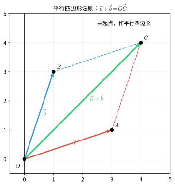

#### 减法

**定义**：$\vec{a} - \vec{b} = \vec{a} + (-\vec{b})$。

若 $\vec{a} = \overrightarrow{OA}$，$\vec{b} = \overrightarrow{OB}$，则：

$$
\vec{a} - \vec{b} = \overrightarrow{OA} - \overrightarrow{OB} = \overrightarrow{BA}
$$

即"共起点，减向量的终点指向被减向量的终点"。

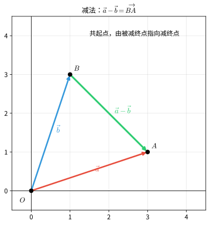

> **直观理解（现实类比）**：向量加减法就像**力的合成**与**接力跑**。
> - **加法—三角形法则（接力跑）**：第一棒从 $A$ 跑到 $B$（向量 $\vec{a}$），第二棒从 $B$ 接力跑到 $C$（向量 $\vec{b}$），总位移是从 $A$ 直接到 $C$（向量 $\vec{a}+\vec{b}$）。"首尾相接，从首到尾"就是和向量。
> - **加法—平行四边形法则（力的合成）**：两个人从同一点 $O$ 分别拉绳子，$\vec{a}$ 向东、$\vec{b}$ 向北，合力是从 $O$ 出发指向平行四边形对角的向量。这是物理学中"两个力合成一个力"的标准方法。
> - **减法（共起点）**：两个人从同一点出发，分别走到 $A$ 和 $B$，$\vec{a}-\vec{b}$ 就是从 $B$ 指向 $A$ 的向量——"被减向量的终点指向减向量的终点"。
> - **河中渡船**：船想垂直过河（$\vec{a}$），水流把它推向下游（$\vec{b}$），实际航线是 $\vec{a}+\vec{b}$——这是向量加法最经典的现实例子。

#### 数乘向量

**定义**：实数 $\lambda$ 与向量 $\vec{a}$ 的积是一个向量，记作 $\lambda \vec{a}$，其模为 $|\lambda|\,|\vec{a}|$，方向规定为：

- 当 $\lambda > 0$ 时，与 $\vec{a}$ 同向
- 当 $\lambda < 0$ 时，与 $\vec{a}$ 反向
- 当 $\lambda = 0$ 或 $\vec{a} = \vec{0}$ 时，$\lambda \vec{a} = \vec{0}$

> **直观理解（现实类比）**：向量数乘就是**放大或缩小**——像调音量、变焦距。
> - $\lambda = 2$：把向量"拉长"到原来的 $2$ 倍，方向不变——就像把照片放大、把音乐音量调到 $200\%$。
> - $\lambda = \dfrac{1}{2}$：把向量"缩短"到原来的一半，方向不变——缩小图片、调低音量。
> - $\lambda = -1$：向量长度不变，方向反过来——镜面翻转、录像倒放。
> - $\lambda = -2$：拉长到 $2$ 倍并反向——倒车时油门踩到底。
> - **物理实例**：力的 $n$ 倍（多个相同力叠加）、速度的放大（不同档位的自行车）、位移的倍数（走 $3$ 趟相同的路程），都是数乘。

#### 运算律

设 $\lambda$、$\mu$ 为实数，$\vec{a}$、$\vec{b}$、$\vec{c}$ 为向量：

- **交换律**：$\vec{a} + \vec{b} = \vec{b} + \vec{a}$
- **结合律**：$(\vec{a} + \vec{b}) + \vec{c} = \vec{a} + (\vec{b} + \vec{c})$；$(\lambda\mu)\vec{a} = \lambda(\mu\vec{a})$
- **分配律**：$\lambda(\vec{a} + \vec{b}) = \lambda\vec{a} + \lambda\vec{b}$；$(\lambda + \mu)\vec{a} = \lambda\vec{a} + \mu\vec{a}$

---

### 3. 向量的坐标表示

#### 平面向量的坐标

在平面直角坐标系中，分别取与 $x$ 轴、$y$ 轴正方向相同的两个单位向量 $\vec{i}$、$\vec{j}$ 作为基底。对任一向量 $\vec{a}$，由平面向量基本定理，存在唯一一对实数 $(x, y)$，使得：

$$
\vec{a} = x\vec{i} + y\vec{j}
$$

称 $(x, y)$ 为向量 $\vec{a}$ 的**坐标**，记作 $\vec{a} = (x, y)$。

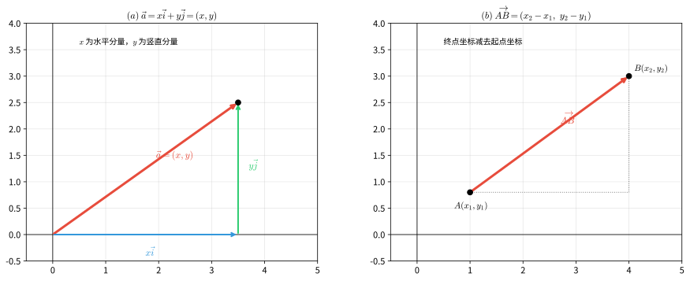

> **直观理解（现实类比）**：向量的坐标表示就像**用基底"组合"出任意向量**——就像用基本颜色调配出所有颜色。
> - **基底 $\vec{i}, \vec{j}$** 是两个互相垂直的"基本箭头"，长度都是 $1$。任意向量 $\vec{a}$ 都能写成 $\vec{a} = x\vec{i} + y\vec{j}$，意思是用 $x$ 步水平走、$y$ 步垂直走，最终到达 $\vec{a}$ 的终点。
> - 就像**调色**：红、黄、蓝三原色按不同比例混合能得到所有颜色；$\vec{i}$、$\vec{j}$ 按不同系数组合能得到所有向量。系数 $(x, y)$ 就是向量的"配方"。
> - **地图导航**："向东走 $3$ 公里，再向北走 $4$ 公里"——这就是用 $\vec{i}$（东）、$\vec{j}$（北）作基底表示位移向量 $(3, 4)$。
> - 选不同的基底就像选不同的参考方向：地理课用"东南西北"，工程上用"$x$、$y$ 轴"，但描述的是同一个位移。

#### 向量的坐标与点的坐标

设 $A(x_1, y_1)$、$B(x_2, y_2)$，则：

$$
\overrightarrow{AB} = (x_2 - x_1,\ y_2 - y_1)
$$

即**终点坐标减去起点坐标**。特例：起点为原点 $O$ 时，$\overrightarrow{OP} = (x, y)$，此时向量的坐标与点 $P$ 的坐标一致。

#### 坐标运算

设 $\vec{a} = (x_1, y_1)$，$\vec{b} = (x_2, y_2)$，$\lambda$ 为实数：

$$
\vec{a} + \vec{b} = (x_1 + x_2,\ y_1 + y_2)
$$

$$
\vec{a} - \vec{b} = (x_1 - x_2,\ y_1 - y_2)
$$

$$
\lambda\vec{a} = (\lambda x_1,\ \lambda y_1)
$$

#### 模的坐标公式

$$
|\vec{a}| = \sqrt{x_1^2 + y_1^2}
$$

两点间距离也可用向量模的形式表示：

$$
|\overrightarrow{AB}| = \sqrt{(x_2 - x_1)^2 + (y_2 - y_1)^2}
$$

这与前面第 1 节的两点间距离公式完全一致，体现了向量与解析几何的内在统一。

---

### 4. 向量共线（平行）的判定

**定理**：$\vec{a} \parallel \vec{b}$（$\vec{b} \neq \vec{0}$）当且仅当存在唯一实数 $\lambda$，使得：

$$
\vec{a} = \lambda\vec{b}
$$

**坐标形式的充要条件**：设 $\vec{a} = (x_1, y_1)$，$\vec{b} = (x_2, y_2)$（$\vec{b} \neq \vec{0}$），则：

$$
\vec{a} \parallel \vec{b} \iff x_1 y_2 - x_2 y_1 = 0
$$

即对应坐标成比例 $\dfrac{x_1}{x_2} = \dfrac{y_1}{y_2}$（当分母不为零时）。

> **直观理解（现实类比）**：向量共线（平行）就是两个向量"**朝同一个方向或反向**"——像两根平行的筷子或同向行驶的两辆车。
> - $\vec{a} = \lambda \vec{b}$ 意味着 $\vec{a}$ 是 $\vec{b}$ 的"放大版"或"缩小版"——可能同向（$\lambda>0$），可能反向（$\lambda<0$）。
> - 坐标条件 $x_1 y_2 = x_2 y_1$ 就是"对应坐标成比例"——两个向量的横纵坐标比相同，方向自然一致。
> - **铁轨**的两条钢轨、**双杠**的两根横杆、**梯子**的两根立柱都是共线向量的现实原型——方向一致，长度可能不同。
> - 反之，**垂直**就是两向量方向成 $90°$——像东西向和南北向的街道、十字交叉的筷子，用数量积为零来判定（见下一节）。

> 注意：由于 $\vec{a} = \lambda\vec{b}$ 要求 $\vec{b} \neq \vec{0}$，上面的坐标条件应优先使用 $x_1y_2 - x_2y_1 = 0$ 这一形式，以避免分母为零的情况。

---

### 5. 平面向量的数量积（点积）

#### 定义

设两个非零向量 $\vec{a}$、$\vec{b}$，它们的夹角为 $\theta$（$0 \leq \theta \leq \pi$），则 $\vec{a}$ 与 $\vec{b}$ 的**数量积**为：

$$
\vec{a} \cdot \vec{b} = |\vec{a}|\,|\vec{b}|\cos\theta
$$

规定：零向量与任一向量的数量积为 $0$。

> 数量积的结果是**标量**（一个实数），而不是向量。这也是"数量积"名称的由来。

#### 几何意义

$\vec{a} \cdot \vec{b}$ 等于 $|\vec{a}|$ 与 $\vec{b}$ 在 $\vec{a}$ 方向上的投影 $|\vec{b}|\cos\theta$ 的乘积，即"$\vec{a}$ 的模乘以 $\vec{b}$ 在 $\vec{a}$ 方向上的投影"。

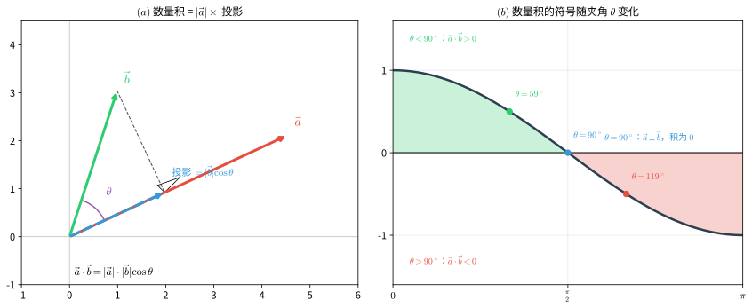

> **直观理解（现实类比）**：数量积的核心是**做功**和**投影**——它把"两个向量的方向关系"压缩成一个数。
> - **做功**：你用力 $\vec{F}$ 推箱子位移 $\vec{s}$，只有**沿位移方向的分力**才真正做了功。$W = \vec{F} \cdot \vec{s} = |\vec{F}||\vec{s}|\cos\theta$。垂直于位移方向的力（如提着箱子水平走）不做功——这就是 $\cos 90° = 0$ 的物理意义。
> - **投影**：把 $\vec{b}$ 想象成一根斜放的竹竿，太阳从 $\vec{a}$ 方向照过来，竹竿在地面（$\vec{a}$ 所在直线）上的影子长度就是 $|\vec{b}|\cos\theta$。数量积就是"$\vec{a}$ 的长度 × $\vec{b}$ 的影子长度"。
> - **斜拉船**：用斜向上的绳子拉船前行，只有水平分力让船前进，竖直分力只是把船头微微抬起——做功的就是水平投影，这正是 $\vec{F} \cdot \vec{s}$。

由 $\cos\theta$ 的取值可知数量积的符号取决于夹角 $\theta$：当 $0 \le \theta < 90^\circ$ 时 $\vec{a} \cdot \vec{b} > 0$；当 $\theta = 90^\circ$ 时 $\vec{a} \cdot \vec{b} = 0$（两向量垂直）；当 $90^\circ < \theta \le 180^\circ$ 时 $\vec{a} \cdot \vec{b} < 0$。

#### 坐标表示

设 $\vec{a} = (x_1, y_1)$，$\vec{b} = (x_2, y_2)$，则：

$$
\vec{a} \cdot \vec{b} = x_1 x_2 + y_1 y_2
$$

特别地，$\vec{a} \cdot \vec{a} = |\vec{a}|^2 = x_1^2 + y_1^2$。

#### 坐标公式的证明

几何定义 $\vec{a}\cdot\vec{b} = |\vec{a}|\,|\vec{b}|\cos\theta$ 与坐标表示 $x_1x_2 + y_1y_2$ 是等价的，可用**余弦定理**证明。

设 $\vec{a} = (x_1, y_1)$、$\vec{b} = (x_2, y_2)$，夹角为 $\theta$。在 $\vec{a}$、$\vec{b}$ 及连接两者终点的向量 $\vec{a}-\vec{b}$ 构成的三角形（如图 $(a)$）中，由余弦定理：

$$
|\vec{a} - \vec{b}|^2 = |\vec{a}|^2 + |\vec{b}|^2 - 2|\vec{a}|\,|\vec{b}|\cos\theta
$$

将坐标代入并展开：

$$
(x_1-x_2)^2 + (y_1-y_2)^2 = (x_1^2+y_1^2) + (x_2^2+y_2^2) - 2\,|\vec{a}|\,|\vec{b}|\cos\theta
$$

$$
\Rightarrow\ x_1x_2 + y_1y_2 = |\vec{a}|\,|\vec{b}|\cos\theta
$$

右端正是几何定义，故坐标公式成立。由此也得到**夹角公式**：

$$
\cos\theta = \frac{\vec{a}\cdot\vec{b}}{|\vec{a}|\,|\vec{b}|}
= \frac{x_1x_2 + y_1y_2}{\sqrt{x_1^2+y_1^2}\,\sqrt{x_2^2+y_2^2}}
$$

#### 与和角公式的联系

当 $\vec{a}$、$\vec{b}$ 均为**单位向量**时，设 $\vec{a} = (\cos\alpha, \sin\alpha)$、$\vec{b} = (\cos\beta, \sin\beta)$，其夹角为 $\theta = \alpha - \beta$（如图 $(b)$）。由坐标公式与几何定义：

$$
\cos(\alpha-\beta) = \cos\alpha\cos\beta + \sin\alpha\sin\beta
$$

这正是三角学中的**和角公式**。可见数量积把"向量夹角"与"三角函数和差公式"统一起来——三角恒等式 $\cos(\alpha-\beta)$ 不过是单位向量数量积的坐标形式。

#### 运算律

设 $\lambda$ 为实数，$\vec{a}$、$\vec{b}$、$\vec{c}$ 为向量：

- **交换律**：$\vec{a} \cdot \vec{b} = \vec{b} \cdot \vec{a}$
- **结合律（数乘）**：$(\lambda\vec{a}) \cdot \vec{b} = \lambda(\vec{a} \cdot \vec{b}) = \vec{a} \cdot (\lambda\vec{b})$
- **分配律**：$(\vec{a} + \vec{b}) \cdot \vec{c} = \vec{a} \cdot \vec{c} + \vec{b} \cdot \vec{c}$

> 注意：数量积**不满足结合律**，即 $(\vec{a} \cdot \vec{b})\vec{c} \neq \vec{a}(\vec{b} \cdot \vec{c})$。因为 $\vec{a} \cdot \vec{b}$ 是标量，左边是与 $\vec{c}$ 平行的向量，右边是与 $\vec{a}$ 平行的向量，一般并不相等。

#### 实际意义

数量积始终围绕一个核心思想：**用一个向量度量另一个向量沿其方向的分量**。它把"两个向量的方向关系"提炼成一个标量，从而把几何/物理问题转化为可计算的代数量。

- **物理意义——做功**：力 $\vec{F}$ 沿位移 $\vec{s}$ 做功只有沿位移方向的分力才起作用，即 $W = \vec{F} \cdot \vec{s} = |\vec{F}|\,|\vec{s}|\cos\theta$。当 $\theta = 0$（力与位移同向）做功最多；$\theta = 90^\circ$（力垂直于位移，如提箱水平行走）不做功；$\theta = 180^\circ$（力与位移反向，如摩擦力）做负功。
- **几何意义——垂直判定与距离**：$\vec{a} \perp \vec{b} \iff \vec{a} \cdot \vec{b} = 0$；点到直线的距离恰是位置向量在法向量上的投影长度 $d = \dfrac{|\vec{n} \cdot \vec{P}|}{|\vec{n}|}$。这两个应用都直接来自"投影"这一几何意义。
- **方向度量——余弦相似度**：$\cos\theta = \dfrac{\vec{a} \cdot \vec{b}}{|\vec{a}|\,|\vec{b}|}$ 衡量两向量方向的接近程度（越接近 $1$ 越同向，越接近 $-1$ 越反向），是搜索引擎、推荐系统中"余弦相似度"的数学基础。
- **代数化工具**：坐标表示 $\vec{a} \cdot \vec{b} = x_1x_2 + y_1y_2$ 使夹角、平行/垂直、投影、面积、距离等几何问题都变成纯坐标计算，是计算机图形学（如光照、视锥判定）的基本运算。

---

### 6. 向量的夹角与垂直判定

#### 夹角公式

设 $\vec{a} = (x_1, y_1)$，$\vec{b} = (x_2, y_2)$ 为非零向量，夹角为 $\theta$，则：

$$
\cos\theta = \frac{\vec{a} \cdot \vec{b}}{|\vec{a}|\,|\vec{b}|} = \frac{x_1x_2 + y_1y_2}{\sqrt{x_1^2 + y_1^2}\sqrt{x_2^2 + y_2^2}}
$$

#### 垂直的充要条件

$$
\vec{a} \perp \vec{b} \iff \vec{a} \cdot \vec{b} = 0
$$

用坐标表示即：

$$
\vec{a} \perp \vec{b} \iff x_1 x_2 + y_1 y_2 = 0
$$

> 这与直线垂直的条件一脉相承：两直线 $l_1: A_1x + B_1y + C_1 = 0$、$l_2: A_2x + B_2y + C_2 = 0$ 垂直等价于它们法向量 $\vec{n}_1 = (A_1, B_1)$、$\vec{n}_2 = (A_2, B_2)$ 满足 $A_1A_2 + B_1B_2 = 0$，正是"法向量点积为零"。

---

### 7. 向量的模与两点间距离（向量表示）

设 $\vec{a} = (x, y)$，则模为 $|\vec{a}| = \sqrt{\vec{a} \cdot \vec{a}} = \sqrt{x^2 + y^2}$。

设 $A(x_1, y_1)$、$B(x_2, y_2)$，则线段 $AB$ 的长度：

$$
|AB| = |\overrightarrow{AB}| = \sqrt{(x_2 - x_1)^2 + (y_2 - y_1)^2}
$$

由此，一堆几何量都可以统一地用向量表示：

- 中点公式：$M$ 为 $AB$ 中点时，$\overrightarrow{OM} = \dfrac{\overrightarrow{OA} + \overrightarrow{OB}}{2}$
- 定比分点：$\overrightarrow{OP} = \dfrac{\overrightarrow{OA} + \lambda\overrightarrow{OB}}{1 + \lambda}$
- 线段垂直：$\overrightarrow{OA} \cdot \overrightarrow{OB} = 0 \iff OA \perp OB$

---

### 8. 平面向量基本定理（基底）

**定理**：设 $\vec{e}_1$、$\vec{e}_2$ 是同一平面内两个**不共线**的向量，那么对该平面内任一向量 $\vec{a}$，有且仅有一对实数 $\lambda_1$、$\lambda_2$，使得：

$$
\vec{a} = \lambda_1\vec{e}_1 + \lambda_2\vec{e}_2
$$

其中不共线的向量 $\vec{e}_1$、$\vec{e}_2$ 称为该平面的一组**基底**。

**关于基底的说明**：

- 基底由两个不共线的向量组成，基底中的向量不能为零向量
- 同一平面内可以有无数多组基底，任一向量在给定基底下的分解是唯一的
- 当基底为正交单位基底 $\vec{i}$、$\vec{j}$（即 $x$、$y$ 轴单位向量）时，分解式 $\vec{a} = x\vec{i} + y\vec{j}$ 中的 $(x, y)$ 正是向量的坐标

**直线与向量对应（衔接前面直线方程）**：直线的法向量、方向向量在"直线的法向量与方向向量"小节（第 2 节）已定义，此处回顾其与向量坐标的联系。设直线 $l: Ax + By + C = 0$：

- 直线的**法向量** $\vec{n} = (A, B)$，方向与直线垂直
- 直线的**方向向量** $\vec{d} = (B, -A)$（或 $(-B, A)$），方向与直线平行，满足 $\vec{n} \cdot \vec{d} = AB + B(-A) = 0$
- 直线的**斜率** $k = -\dfrac{A}{B}$，正是方向向量 $(B, -A)$ 的纵坐标与横坐标之比 $k = \dfrac{-A}{B}$

因此，"点斜式"就等价于"过已知点、沿方向向量 $(1, k)$ 的直线"。

---

### 9. 向量在解三角形和几何中的应用

#### 正弦定理的向量证明

**定理**：在 $\triangle ABC$ 中，设角 $A$、$B$、$C$ 所对的边分别为 $a$、$b$、$c$，则 $\dfrac{a}{\sin A} = \dfrac{b}{\sin B} = \dfrac{c}{\sin C}$。

**证明**：

设 $\overrightarrow{AB} = \vec{c}$，$\overrightarrow{AC} = \vec{b}$（注意用向量模表示边长），则 $\vec{c} - \vec{b} = \overrightarrow{CB}$。

考虑 $\triangle ABC$ 的面积公式。以 $AB$、$AC$ 为邻边的平行四边形的面积可由叉积给出，但平面内用点积可如下处理：

由 $\vec{c} - \vec{b} = \overrightarrow{CB}$，两边平方得：

$$
|\vec{c} - \vec{b}|^2 = |\vec{c}|^2 + |\vec{b}|^2 - 2\vec{b}\cdot\vec{c}
$$

即 $a^2 = c^2 + b^2 - 2bc\cos A$，这正是**余弦定理**。$\square$

对于正弦定理，可利用面积公式 $S = \dfrac{1}{2}bc\sin A = \dfrac{1}{2}ca\sin B = \dfrac{1}{2}ab\sin C$，两边同除以 $\dfrac{1}{2}abc$ 即得 $\dfrac{\sin A}{a} = \dfrac{\sin B}{b} = \dfrac{\sin C}{c}$。$\square$

#### 余弦定理的向量证明

**定理**：$a^2 = b^2 + c^2 - 2bc\cos A$。

**证明**：

设 $\overrightarrow{AB} = \vec{c}$，$\overrightarrow{AC} = \vec{b}$，则 $\overrightarrow{CB} = \vec{c} - \vec{b}$，其模为 $a$。

$$
a^2 = |\overrightarrow{CB}|^2 = (\vec{c} - \vec{b}) \cdot (\vec{c} - \vec{b}) = |\vec{c}|^2 + |\vec{b}|^2 - 2\vec{b}\cdot\vec{c}
$$

其中 $\vec{b} \cdot \vec{c} = |\vec{b}|\,|\vec{c}|\cos A = bc\cos A$，代入即得：

$$
a^2 = b^2 + c^2 - 2bc\cos A
$$

$\square$

#### 中线定理的向量证明

**定理**：在 $\triangle ABC$ 中，$M$ 为 $BC$ 的中点，则 $AB^2 + AC^2 = 2(AM^2 + BM^2)$。

**证明**：

取 $A$ 为起点，设 $\vec{b} = \overrightarrow{AB}$，$\vec{c} = \overrightarrow{AC}$。则：

$$
\overrightarrow{AM} = \frac{\vec{b} + \vec{c}}{2},\qquad \overrightarrow{BM} = \frac{\vec{c} - \vec{b}}{2}
$$

于是：

$$
AB^2 + AC^2 = |\vec{b}|^2 + |\vec{c}|^2
$$

$$
2(AM^2 + BM^2) = 2\left(\left|\frac{\vec{b} + \vec{c}}{2}\right|^2 + \left|\frac{\vec{c} - \vec{b}}{2}\right|^2\right)
$$

利用 $|\vec{p} + \vec{q}|^2 + |\vec{p} - \vec{q}|^2 = 2(|\vec{p}|^2 + |\vec{q}|^2)$，得：

$$
2(AM^2 + BM^2) = \frac{1}{2}\left(|\vec{b} + \vec{c}|^2 + |\vec{c} - \vec{b}|^2\right) = |\vec{b}|^2 + |\vec{c}|^2
$$

故 $AB^2 + AC^2 = 2(AM^2 + BM^2)$。$\square$

#### 重心

设 $G$ 为 $\triangle ABC$ 的重心（三条中线的交点），则：

$$
\overrightarrow{OG} = \frac{\overrightarrow{OA} + \overrightarrow{OB} + \overrightarrow{OC}}{3}
$$

特别地，当 $O$ 为原点时，$G$ 的坐标为 $\left(\dfrac{x_A + x_B + x_C}{3},\ \dfrac{y_A + y_B + y_C}{3}\right)$。

**证明**：设中线 $AM$ 与 $BN$ 交于 $G$，由重心分中线为 $2:1$，$\overrightarrow{AG} = \dfrac{2}{3}\overrightarrow{AM}$，而 $\overrightarrow{AM} = \dfrac{\vec{b} + \vec{c}}{2}$，故 $\overrightarrow{AG} = \dfrac{\vec{b} + \vec{c}}{3}$，从而 $\overrightarrow{OG} = \overrightarrow{OA} + \overrightarrow{AG} = \vec{a} + \dfrac{(\vec{b} - \vec{a}) + (\vec{c} - \vec{a})}{3} = \dfrac{\vec{a} + \vec{b} + \vec{c}}{3}$。$\square$

---

### 10. 综合示例

#### 示例 7：向量共线与坐标

**题目**：已知 $\vec{a} = (2, -1)$，$\vec{b} = (1, 3)$。若 $\vec{a} + \lambda\vec{b}$ 与 $\vec{a} - \vec{b}$ 共线，求实数 $\lambda$。

**解**：

$$
\vec{a} + \lambda\vec{b} = (2 + \lambda,\ -1 + 3\lambda)
$$

$$
\vec{a} - \vec{b} = (1, -4)
$$

共线条件 $x_1y_2 - x_2y_1 = 0$：

$$
(2 + \lambda)(-4) - 1 \cdot (-1 + 3\lambda) = 0
$$

$$
-8 - 4\lambda + 1 - 3\lambda = 0 \implies -7 - 7\lambda = 0 \implies \lambda = -1
$$

**答案**：$\lambda = -1$。

---

#### 示例 8：数量积与夹角

**题目**：已知 $\vec{a} = (1, 2)$，$\vec{b} = (-2, 1)$。（1）求 $\vec{a} \cdot \vec{b}$；（2）判断 $\vec{a}$ 与 $\vec{b}$ 是否垂直。

**解**：

（1）由数量积坐标公式：

$$
\vec{a} \cdot \vec{b} = 1 \times (-2) + 2 \times 1 = -2 + 2 = 0
$$

（2）因为 $\vec{a} \cdot \vec{b} = 0$，所以 $\vec{a} \perp \vec{b}$。

**答案**：$\vec{a} \cdot \vec{b} = 0$，$\vec{a} \perp \vec{b}$。

---

#### 示例 9：余弦定理的向量应用

**题目**：在 $\triangle ABC$ 中，$\overrightarrow{AB} = (2, 3)$，$\overrightarrow{AC} = (5, -1)$，求边 $BC$ 的长度和 $\cos A$。

**解**：

$\overrightarrow{BC} = \overrightarrow{AC} - \overrightarrow{AB} = (5 - 2,\ -1 - 3) = (3, -4)$。

由余弦定理的向量形式：

$$
a^2 = |\vec{b}|^2 + |\vec{c}|^2 - 2\vec{b}\cdot\vec{c}
$$

其中 $|\vec{b}|^2 = |\overrightarrow{AC}|^2 = 5^2 + (-1)^2 = 26$，$|\vec{c}|^2 = |\overrightarrow{AB}|^2 = 2^2 + 3^2 = 13$，$\vec{b}\cdot\vec{c} = 2 \times 5 + 3 \times (-1) = 7$。

于是：

$$
a^2 = 26 + 13 - 2 \times 7 = 25 \implies a = |BC| = 5
$$

$$
\cos A = \frac{\vec{b}\cdot\vec{c}}{|\vec{b}|\,|\vec{c}|} = \frac{7}{\sqrt{26}\sqrt{13}} = \frac{7}{13\sqrt{2}} = \frac{7\sqrt{2}}{26}
$$

**答案**：$|BC| = 5$，$\cos A = \dfrac{7\sqrt{2}}{26}$。

---

#### 示例 10：直线的方向向量与法向量

**题目**：已知直线 $l: 2x - 3y + 6 = 0$。（1）求 $l$ 的一个法向量和方向向量；（2）求 $l$ 的斜率，并说明三者关系。

**解**：

（1）法向量为 $\vec{n} = (2, -3)$，方向向量可取 $\vec{d} = (3, 2)$（与 $\vec{n}$ 点积为 $2 \times 3 + (-3) \times 2 = 0$，故垂直）。

（2）斜率 $k = -\dfrac{A}{B} = -\dfrac{2}{-3} = \dfrac{2}{3}$，恰为方向向量 $(3, 2)$ 的纵坐标与横坐标之比 $k = \dfrac{2}{3}$。

**答案**：$\vec{n} = (2, -3)$，$\vec{d} = (3, 2)$，$k = \dfrac{2}{3}$。

---

## 习题

### 基础题

**1.** 求点 $P(3, -2)$ 到直线 $l: 4x + 3y - 5 = 0$ 的距离。

**2.** 求过点 $A(1, 2)$ 和 $B(3, 6)$ 的直线方程，并求其斜率与截距。

**3.** 判断直线 $l_1: 2x - 3y + 1 = 0$ 与 $l_2: 3x + 2y - 4 = 0$ 的位置关系。

**4.** 求圆心在 $(-1, 2)$ 且半径为 $3$ 的圆的方程，并化为一般式。

**5.** 求椭圆 $\dfrac{x^2}{36} + \dfrac{y^2}{25} = 1$ 的焦点坐标、顶点坐标和离心率。

### 提高题

**6.** 求双曲线 $\dfrac{x^2}{9} - \dfrac{y^2}{16} = 1$ 的渐近线方程、焦点坐标和离心率。

**7.** 已知抛物线的准线方程为 $x = -3$，焦点在 $x$ 轴正半轴上，求抛物线的标准方程。

**8.** 求过点 $P(1, 2)$ 且与圆 $x^2 + y^2 = 5$ 相切的直线方程。

**9.** 椭圆 $\dfrac{x^2}{a^2} + \dfrac{y^2}{b^2} = 1$ 的离心率为 $\dfrac{1}{2}$，且过点 $(2, 3)$，求椭圆方程。

**10.** 已知直线 $y = kx + 1$ 与双曲线 $x^2 - y^2 = 1$ 有两个不同的交点，求 $k$ 的取值范围。

### 挑战题

**11.** 求椭圆 $\dfrac{x^2}{4} + y^2 = 1$ 上的点到直线 $x + 2y - 4 = 0$ 的最大距离和最小距离。

**12.** 已知抛物线 $y^2 = 4x$ 的焦点为 $F$，过 $F$ 的直线与抛物线交于 $A$、$B$ 两点，求 $|AB|$ 的最小值。

**13.** 证明：双曲线 $\dfrac{x^2}{a^2} - \dfrac{y^2}{b^2} = 1$ 上任一点到两条渐近线的距离之积为常数。

**14.** 一动点 $P$ 到点 $F(2, 0)$ 的距离与到直线 $x = 8$ 的距离之比为 $\dfrac{1}{2}$，求点 $P$ 的轨迹方程，并说明轨迹类型。

---

## 总结

### 核心公式速查表

| 公式类型         | 公式                                                                                             |
| :--------------- | :----------------------------------------------------------------------------------------------- |
| 两点间距离       | $\sqrt{(x_2 - x_1)^2 + (y_2 - y_1)^2}$                                                         |
| 中点坐标         | $\left(\dfrac{x_1 + x_2}{2},\ \dfrac{y_1 + y_2}{2}\right)$                                     |
| 直线斜率         | $k = \dfrac{y_2 - y_1}{x_2 - x_1}$                                                             |
| 点斜式           | $y - y_0 = k(x - x_0)$                                                                         |
| 斜截式           | $y = kx + b$                                                                                   |
| 一般式           | $Ax + By + C = 0$                                                                              |
| 点到直线距离     | $d = \dfrac{|Ax_0 + By_0 + C|}{\sqrt{A^2 + B^2}}$                                              |
| 平行条件         | $k_1 = k_2$（或 $\dfrac{A_1}{A_2} = \dfrac{B_1}{B_2} \neq \dfrac{C_1}{C_2}$）                |
| 垂直条件         | $k_1 \cdot k_2 = -1$（或 $A_1A_2 + B_1B_2 = 0$）                                             |
| 圆的标准方程     | $(x - h)^2 + (y - k)^2 = r^2$                                                                  |
| 椭圆标准方程     | $\dfrac{x^2}{a^2} + \dfrac{y^2}{b^2} = 1\ (a > b > 0)$                                         |
| 椭圆离心率       | $e = \dfrac{c}{a}\ (0 < e < 1)$                                                                |
| 双曲线标准方程   | $\dfrac{x^2}{a^2} - \dfrac{y^2}{b^2} = 1$                                                      |
| 双曲线渐近线     | $y = \pm \dfrac{b}{a}x$                                                                        |
| 双曲线离心率     | $e = \dfrac{c}{a}\ (e > 1)$                                                                    |
| 抛物线标准方程   | $y^2 = 2px$                                                                                    |
| 抛物线焦点       | $\left(\dfrac{p}{2}, 0\right)$                                                                 |
| 抛物线准线       | $x = -\dfrac{p}{2}$                                                                            |
| 圆锥曲线统一定义 | $\dfrac{|PF|}{d(P, l)} = e$                                                                    |
| 坐标平移         | $\begin{cases} x = x' + h \\ y = y' + k \end{cases}$                                           |
| 坐标旋转         | $\begin{cases} x = x'\cos\theta - y'\sin\theta \\ y = x'\sin\theta + y'\cos\theta \end{cases}$ |

### 学习要点

1. **坐标思想**：解析几何的核心是用代数方法研究几何问题，将几何条件转化为代数方程
2. **数形结合**：养成"画图分析"的习惯，图形能直观地提示解题思路
3. **方程思想**：熟练掌握从几何条件到代数方程的翻译过程
4. **分类讨论**：处理直线问题时注意斜率不存在的情况，处理圆锥曲线时注意离心率取值范围
5. **参数法**：适当引入参数（如椭圆的参数方程 $\theta$）可以简化计算

---

> **下一级预告**：第 7 级——数列与数学归纳法，将学习数列的概念、通项公式、求和以及数学归纳法。
