# 第 9 级：集合论基础 (Foundations of Set Theory)

---

## 1. 学习目标

完成本教程后，你应该能够：

- 理解集合、元素、子集等基本概念及其符号表示
- 掌握集合的基本运算（并、交、差、补、对称差、笛卡尔积）
- 熟练运用德摩根定律、分配律、吸收律等集合恒等式
- 理解关系、等价关系、偏序关系及函数的基本性质
- 区分可数集与不可数集，理解康托尔对角线论证
- 运用集合论方法解决实际问题

---

## 2. 核心概念

### 2.1 集合（Set）与元素（Element）

**集合** 是数学中最基本的概念之一，由一些确定的、互不相同的对象组成的整体。这些对象称为集合的 **元素**。

**符号表示：**
- 若 $a$ 是集合 $A$ 的元素，记作 $a \in A$（读作"$a$ 属于 $A$"）
- 若 $a$ 不是集合 $A$ 的元素，记作 $a \notin A$

**集合的表示法：**

1. **列举法**：列出所有元素，用花括号括起来
   $$A = \{1, 2, 3, 4, 5\}$$

2. **描述法**：用元素满足的条件来描述
   $$B = \{x \mid x \text{ 是正整数且 } x < 10\}$$

3. **文氏图（Venn Diagram）**：用图形直观表示集合

### 2.2 子集（Subset）

若集合 $A$ 的所有元素都是集合 $B$ 的元素，则称 $A$ 是 $B$ 的 **子集**，记作 $A \subseteq B$。

**形式定义：**
$$A \subseteq B \iff \forall x (x \in A \Rightarrow x \in B)$$

若 $A \subseteq B$ 且 $A \neq B$，则称 $A$ 是 $B$ 的 **真子集**，记作 $A \subsetneq B$。

**性质：**
- 自反性：$A \subseteq A$
- 传递性：若 $A \subseteq B$ 且 $B \subseteq C$，则 $A \subseteq C$
- 反对称性：若 $A \subseteq B$ 且 $B \subseteq A$，则 $A = B$

### 2.3 空集（Empty Set）

不含任何元素的集合称为 **空集**，记作 $\varnothing$ 或 $\{\}$。

**性质：**
- 空集是任何集合的子集：$\varnothing \subseteq A$（对任意集合 $A$）
- 空集是唯一的

### 2.4 全集（Universal Set）

在特定讨论中，包含所有可能元素的集合称为 **全集**，通常记作 $U$ 或 $\Omega$。

### 2.5 幂集（Power Set）

集合 $A$ 的所有子集构成的集合称为 $A$ 的 **幂集**，记作 $\mathcal{P}(A)$ 或 $2^A$。

$$\mathcal{P}(A) = \{X \mid X \subseteq A\}$$

**示例：** 若 $A = \{1, 2\}$，则
$$\mathcal{P}(A) = \{\varnothing, \{1\}, \{2\}, \{1, 2\}\}$$

**性质：** 若 $|A| = n$，则 $|\mathcal{P}(A)| = 2^n$

### 2.6 基数（Cardinality）

集合 $A$ 中元素的个数称为 $A$ 的 **基数**（或势），记作 $|A|$ 或 $\text{card}(A)$。

- **有限集**：基数为有限值
- **无限集**：基数为无穷大
  - 可数无穷：$|\mathbb{N}| = \aleph_0$（阿列夫零）
  - 连续统：$|\mathbb{R}| = \mathfrak{c}$（或 $2^{\aleph_0}$）

---

## 3. 集合运算

### 3.1 并集（Union）

集合 $A$ 与 $B$ 的 **并集** 是由所有属于 $A$ 或属于 $B$ 的元素组成的集合。

$$A \cup B = \{x \mid x \in A \lor x \in B\}$$

**示例：** $\{1, 2, 3\} \cup \{2, 3, 4\} = \{1, 2, 3, 4\}$

### 3.2 交集（Intersection）

集合 $A$ 与 $B$ 的 **交集** 是由所有同时属于 $A$ 和 $B$ 的元素组成的集合。

$$A \cap B = \{x \mid x \in A \land x \in B\}$$

**示例：** $\{1, 2, 3\} \cap \{2, 3, 4\} = \{2, 3\}$

若 $A \cap B = \varnothing$，则称 $A$ 与 $B$ **互不相交**。

### 3.3 差集（Difference）

集合 $A$ 与 $B$ 的 **差集**（或相对补集）是由所有属于 $A$ 但不属于 $B$ 的元素组成的集合。

$$A \setminus B = \{x \mid x \in A \land x \notin B\}$$

**示例：** $\{1, 2, 3\} \setminus \{2, 3, 4\} = \{1\}$

### 3.4 补集（Complement）

若 $A \subseteq U$，则 $A$ 在全集 $U$ 中的 **补集** 是 $U$ 中所有不属于 $A$ 的元素组成的集合。

$$A^c = U \setminus A = \{x \in U \mid x \notin A\}$$

有时也记作 $\overline{A}$ 或 $A'$。

### 3.5 对称差（Symmetric Difference）

集合 $A$ 与 $B$ 的 **对称差** 是由恰好属于 $A$ 和 $B$ 中一个的元素组成的集合。

$$A \triangle B = (A \setminus B) \cup (B \setminus A) = (A \cup B) \setminus (A \cap B)$$

**示例：** $\{1, 2, 3\} \triangle \{2, 3, 4\} = \{1, 4\}$

### 3.6 笛卡尔积（Cartesian Product）

集合 $A$ 与 $B$ 的 **笛卡尔积** 是由所有有序对 $(a, b)$（其中 $a \in A$, $b \in B$）组成的集合。

$$A \times B = \{(a, b) \mid a \in A \land b \in B\}$$

**示例：** $\{1, 2\} \times \{\text{红}, \text{白}\} = \{(1, \text{红}), (1, \text{白}), (2, \text{红}), (2, \text{白})\}$

**推广到多元组：**
$$A_1 \times A_2 \times \cdots \times A_n = \{(a_1, a_2, \dots, a_n) \mid a_i \in A_i\}$$

### 3.7 运算性质汇总

| 运算 | 符号 | 定义 |
|------|------|------|
| 并集 | $A \cup B$ | $\{x \mid x \in A \lor x \in B\}$ |
| 交集 | $A \cap B$ | $\{x \mid x \in A \land x \in B\}$ |
| 差集 | $A \setminus B$ | $\{x \mid x \in A \land x \notin B\}$ |
| 补集 | $A^c$ 或 $\overline{A}$ | $\{x \in U \mid x \notin A\}$ |
| 对称差 | $A \triangle B$ | $(A \setminus B) \cup (B \setminus A)$ |
| 笛卡尔积 | $A \times B$ | $\{(a, b) \mid a \in A, b \in B\}$ |

---

## 4. 定理与证明

### 4.1 德摩根定律（De Morgan's Laws）

**定理 1（德摩根定律）：** 设 $A, B$ 是全集 $U$ 的子集，则

$$(A \cup B)' = A' \cap B'$$
$$(A \cap B)' = A' \cup B'$$

其中 $A'$ 表示 $A$ 在 $U$ 中的补集。

**证明第一式：$(A \cup B)' = A' \cap B'$**

我们通过证明两边集合互相包含来证明集合相等。

**（$\subseteq$ 方向）** 任取 $x \in (A \cup B)'$，则 $x \notin A \cup B$。由并集的定义，$x \notin A$ 且 $x \notin B$。因此 $x \in A'$ 且 $x \in B'$，即 $x \in A' \cap B'$。故 $(A \cup B)' \subseteq A' \cap B'$。

**（$\supseteq$ 方向）** 任取 $x \in A' \cap B'$，则 $x \in A'$ 且 $x \in B'$，即 $x \notin A$ 且 $x \notin B$。因此 $x \notin A \cup B$，即 $x \in (A \cup B)'$。故 $A' \cap B' \subseteq (A \cup B)'$。

综上，$(A \cup B)' = A' \cap B'$。$\square$

**证明第二式：$(A \cap B)' = A' \cup B'$**

**（$\subseteq$ 方向）** 任取 $x \in (A \cap B)'$，则 $x \notin A \cap B$。这意味着 $x \notin A$ 或 $x \notin B$。若 $x \notin A$，则 $x \in A' \subseteq A' \cup B'$；若 $x \notin B$，则 $x \in B' \subseteq A' \cup B'$。故 $(A \cap B)' \subseteq A' \cup B'$。

**（$\supseteq$ 方向）** 任取 $x \in A' \cup B'$，则 $x \in A'$ 或 $x \in B'$。若 $x \in A'$，则 $x \notin A$，从而 $x \notin A \cap B$，即 $x \in (A \cap B)'$；若 $x \in B'$，同理可得 $x \in (A \cap B)'$。故 $A' \cup B' \subseteq (A \cap B)'$。

综上，$(A \cap B)' = A' \cup B'$。$\square$

### 4.2 分配律（Distributive Laws）

**定理 2（分配律）：** 对任意集合 $A, B, C$，有

$$A \cup (B \cap C) = (A \cup B) \cap (A \cup C)$$
$$A \cap (B \cup C) = (A \cap B) \cup (A \cap C)$$

**证明第一式：$A \cup (B \cap C) = (A \cup B) \cap (A \cup C)$**

**（$\subseteq$ 方向）** 任取 $x \in A \cup (B \cap C)$，则 $x \in A$ 或 $x \in B \cap C$。

- 若 $x \in A$，则 $x \in A \cup B$ 且 $x \in A \cup C$，故 $x \in (A \cup B) \cap (A \cup C)$。
- 若 $x \in B \cap C$，则 $x \in B$ 且 $x \in C$。由 $x \in B$ 得 $x \in A \cup B$；由 $x \in C$ 得 $x \in A \cup C$。故 $x \in (A \cup B) \cap (A \cup C)$。

因此 $A \cup (B \cap C) \subseteq (A \cup B) \cap (A \cup C)$。

**（$\supseteq$ 方向）** 任取 $x \in (A \cup B) \cap (A \cup C)$，则 $x \in A \cup B$ 且 $x \in A \cup C$。

- 若 $x \in A$，则 $x \in A \cup (B \cap C)$。
- 若 $x \notin A$，则由 $x \in A \cup B$ 得 $x \in B$；由 $x \in A \cup C$ 得 $x \in C$。故 $x \in B \cap C$，从而 $x \in A \cup (B \cap C)$。

因此 $(A \cup B) \cap (A \cup C) \subseteq A \cup (B \cap C)$。

综上，等式成立。$\square$

**证明第二式：$A \cap (B \cup C) = (A \cap B) \cup (A \cap C)$**

**（$\subseteq$ 方向）** 任取 $x \in A \cap (B \cup C)$，则 $x \in A$ 且 $x \in B \cup C$。即 $x \in A$ 且（$x \in B$ 或 $x \in C$）。

- 若 $x \in B$，则 $x \in A \cap B$，故 $x \in (A \cap B) \cup (A \cap C)$。
- 若 $x \in C$，则 $x \in A \cap C$，故 $x \in (A \cap B) \cup (A \cap C)$。

因此 $A \cap (B \cup C) \subseteq (A \cap B) \cup (A \cap C)$。

**（$\supseteq$ 方向）** 任取 $x \in (A \cap B) \cup (A \cap C)$，则 $x \in A \cap B$ 或 $x \in A \cap C$。

- 若 $x \in A \cap B$，则 $x \in A$ 且 $x \in B \subseteq B \cup C$，故 $x \in A \cap (B \cup C)$。
- 若 $x \in A \cap C$，则 $x \in A$ 且 $x \in C \subseteq B \cup C$，故 $x \in A \cap (B \cup C)$。

因此 $(A \cap B) \cup (A \cap C) \subseteq A \cap (B \cup C)$。

综上，等式成立。$\square$

### 4.3 吸收律（Absorption Laws）

**定理 3（吸收律）：** 对任意集合 $A, B$，有

$$A \cup (A \cap B) = A$$
$$A \cap (A \cup B) = A$$

**证明第一式：$A \cup (A \cap B) = A$**

- 任取 $x \in A \cup (A \cap B)$，则 $x \in A$ 或 $x \in A \cap B$。无论哪种情况，都有 $x \in A$。故 $A \cup (A \cap B) \subseteq A$。
- 任取 $x \in A$，则 $x \in A \cup (A \cap B)$（由并集定义）。故 $A \subseteq A \cup (A \cap B)$。

因此 $A \cup (A \cap B) = A$。$\square$

**证明第二式：$A \cap (A \cup B) = A$**

- 任取 $x \in A \cap (A \cup B)$，则 $x \in A$。故 $A \cap (A \cup B) \subseteq A$。
- 任取 $x \in A$，则 $x \in A \cup B$，且 $x \in A$，故 $x \in A \cap (A \cup B)$。因此 $A \subseteq A \cap (A \cup B)$。

因此 $A \cap (A \cup B) = A$。$\square$

### 4.4 其他重要恒等式

**幂等律：**
$$A \cup A = A, \quad A \cap A = A$$

**交换律：**
$$A \cup B = B \cup A, \quad A \cap B = B \cap A$$

**结合律：**
$$(A \cup B) \cup C = A \cup (B \cup C)$$
$$(A \cap B) \cap C = A \cap (B \cap C)$$

**零一律：**
$$A \cup U = U, \quad A \cap \varnothing = \varnothing$$

**同一律：**
$$A \cup \varnothing = A, \quad A \cap U = A$$

**补余律：**
$$A \cup A' = U, \quad A \cap A' = \varnothing$$

**对合律（双重补律）：**
$$(A')' = A$$

### 4.5 笛卡尔积的基数

**定理 4：** 若 $A$ 和 $B$ 是有限集，则

$$|A \times B| = |A| \cdot |B|$$

**证明：** 设 $|A| = m$, $|B| = n$。笛卡尔积 $A \times B$ 由所有有序对 $(a, b)$ 组成，其中 $a \in A$, $b \in B$。对于 $A$ 中的每个元素 $a$，它可以与 $B$ 中的 $n$ 个元素分别配对，形成 $n$ 个有序对。由于 $A$ 中有 $m$ 个元素，因此总共有 $m \times n$ 个有序对。$\square$

**推广：** 对于有限集 $A_1, A_2, \dots, A_k$，有
$$|A_1 \times A_2 \times \cdots \times A_k| = |A_1| \cdot |A_2| \cdots |A_k|$$

---

## 5. 关系与函数

### 5.1 关系（Relation）

**定义：** 集合 $A$ 到集合 $B$ 的一个 **二元关系** $R$ 是 $A \times B$ 的一个子集，即 $R \subseteq A \times B$。若 $(a, b) \in R$，则记作 $aRb$。

当 $A = B$ 时，称 $R$ 是 $A$ 上的一个关系。

**示例：**
- $R = \{(a, b) \in \mathbb{N} \times \mathbb{N} \mid a \leq b\}$ 是自然数上的"小于等于"关系
- $R = \{(x, y) \in \mathbb{R} \times \mathbb{R} \mid x^2 + y^2 = 1\}$ 是单位圆上的点

### 5.2 等价关系（Equivalence Relation）

**定义：** 集合 $A$ 上的关系 $R$ 称为 **等价关系**，若它满足以下三个性质：

1. **自反性**：$\forall a \in A, aRa$
2. **对称性**：$\forall a, b \in A, aRb \Rightarrow bRa$
3. **传递性**：$\forall a, b, c \in A, aRb \land bRc \Rightarrow aRc$

**等价类：** 对于等价关系 $R$，元素 $a$ 的等价类为
$$[a] = \{x \in A \mid xRa\}$$

所有等价类的集合构成 $A$ 的一个 **划分**（partition）。

**示例：**
- 模 $n$ 同余关系：$a \equiv b \pmod{n} \iff n \mid (a - b)$ 是 $\mathbb{Z}$ 上的等价关系
- 集合等势关系：$A \sim B \iff |A| = |B|$ 是集合族上的等价关系

### 5.3 偏序关系（Partial Order）

**定义：** 集合 $A$ 上的关系 $\preceq$ 称为 **偏序关系**，若它满足：

1. **自反性**：$\forall a \in A, a \preceq a$
2. **反对称性**：$\forall a, b \in A, a \preceq b \land b \preceq a \Rightarrow a = b$
3. **传递性**：$\forall a, b, c \in A, a \preceq b \land b \preceq c \Rightarrow a \preceq c$

带有偏序关系的集合称为 **偏序集**（poset），记作 $(A, \preceq)$。

**全序关系：** 若偏序 $\preceq$ 还满足可比性（$\forall a, b \in A$，$a \preceq b$ 或 $b \preceq a$），则称其为 **全序关系**（或线性序）。

**示例：**
- $(\mathbb{R}, \leq)$ 是全序集
- $(\mathcal{P}(A), \subseteq)$ 是偏序集（一般不是全序）
- $(\mathbb{N}, \mid)$（整除关系）是偏序集

### 5.4 函数（Function）

**定义：** 从集合 $A$ 到集合 $B$ 的 **函数**（或映射）$f$ 是一个满足以下条件的关系 $f \subseteq A \times B$：

$$\forall a \in A, \exists! b \in B, (a, b) \in f$$

即 $A$ 中的每个元素恰好对应 $B$ 中的一个元素。记作 $f: A \to B$，且 $f(a) = b$。

**术语：**
- $A$ 称为 **定义域**（domain）
- $B$ 称为 **陪域**（codomain）
- $\{f(a) \mid a \in A\}$ 称为 **值域**（range），记作 $f(A)$

#### 5.4.1 单射（Injective）

函数 $f: A \to B$ 称为 **单射**（一一映射），若

$$\forall a_1, a_2 \in A, f(a_1) = f(a_2) \Rightarrow a_1 = a_2$$

等价地，不同的输入映射到不同的输出。

#### 5.4.2 满射（Surjective）

函数 $f: A \to B$ 称为 **满射**（到上映射），若

$$\forall b \in B, \exists a \in A, f(a) = b$$

即值域等于陪域：$f(A) = B$。

#### 5.4.3 双射（Bijective）

函数 $f: A \to B$ 称为 **双射**（一一对应），若它既是单射又是满射。

**性质：** $f$ 是双射当且仅当存在逆函数 $f^{-1}: B \to A$。

#### 5.4.4 重要结论

**定理：** 对于有限集 $A$ 和 $B$，
- 存在单射 $f: A \to B$ 当且仅当 $|A| \leq |B|$
- 存在满射 $f: A \to B$ 当且仅当 $|A| \geq |B|$
- 存在双射 $f: A \to B$ 当且仅当 $|A| = |B|$

---

## 6. 可数与不可数

### 6.1 可数集（Countable Set）

**定义：** 集合 $A$ 称为 **可数集**，若存在一个从 $\mathbb{N}$（自然数集）到 $A$ 的满射。等价地，$A$ 是有限集或与 $\mathbb{N}$ 等势（存在双射）。

**可数无穷集** 的基数记为 $\aleph_0$（阿列夫零）。

**示例：**
- 自然数集 $\mathbb{N}$ 是可数无穷集
- 整数集 $\mathbb{Z}$ 是可数无穷集（双射：$f(n) = \lfloor n/2 \rfloor \cdot (-1)^n$）
- 有理数集 $\mathbb{Q}$ 是可数无穷集（康托尔的对角线枚举法）
- 有限个可数集的并集是可数集
- 可数无穷个可数集的并集是可数集

### 6.2 不可数集（Uncountable Set）

**定义：** 不是可数集的集合称为 **不可数集**。

**示例：**
- 实数集 $\mathbb{R}$ 是不可数集
- 区间 $(0, 1)$ 是不可数集
- 幂集 $\mathcal{P}(\mathbb{N})$ 是不可数集

### 6.3 康托尔对角线论证（Cantor's Diagonal Argument）

这是康托尔证明实数集不可数的经典方法。

**定理：** 区间 $(0, 1)$ 内的实数不可数。

**证明（反证法）：** 假设 $(0, 1)$ 内的实数是可数的，则可以将它们排成一个序列：

$$
\begin{aligned}
r_1 &= 0.a_{11}a_{12}a_{13}a_{14}\cdots \\
r_2 &= 0.a_{21}a_{22}a_{23}a_{24}\cdots \\
r_3 &= 0.a_{31}a_{32}a_{33}a_{34}\cdots \\
&\ \ \vdots
\end{aligned}
$$

其中 $a_{ij} \in \{0, 1, 2, \dots, 9\}$，且我们采用不包含无限个 9 的表示法（以避免歧义）。

现在构造一个新的实数 $b = 0.b_1b_2b_3b_4\cdots$，其中

$$b_i = \begin{cases}
1 & \text{若 } a_{ii} \neq 1 \\
2 & \text{若 } a_{ii} = 1
\end{cases}$$

则 $b \in (0, 1)$，但 $b$ 与序列中的每个 $r_i$ 都不同（因为 $b$ 的第 $i$ 位小数与 $r_i$ 的第 $i$ 位小数不同）。这与假设矛盾，故 $(0, 1)$ 不可数。$\square$

**推论：** $\mathbb{R}$ 不可数，且 $|\mathbb{R}| = 2^{\aleph_0} = \mathfrak{c}$（连续统的势）。

### 6.4 康托尔定理（Cantor's Theorem）

**定理：** 对任意集合 $A$，$|A| < |\mathcal{P}(A)|$。即 $A$ 的基数严格小于其幂集的基数。

**证明：** 定义单射 $f: A \to \mathcal{P}(A)$ 为 $f(a) = \{a\}$，故 $|A| \leq |\mathcal{P}(A)|$。

现证不存在满射 $g: A \to \mathcal{P}(A)$。假设存在这样的满射，定义

$$B = \{a \in A \mid a \notin g(a)\}$$

则 $B \subseteq A$，即 $B \in \mathcal{P}(A)$。由于 $g$ 是满射，存在 $b \in A$ 使得 $g(b) = B$。现在问：$b \in B$ 吗？

- 若 $b \in B$，则由 $B$ 的定义，$b \notin g(b) = B$，矛盾。
- 若 $b \notin B$，则由 $B$ 的定义，$b \in g(b) = B$，矛盾。

故假设不成立，$|A| < |\mathcal{P}(A)|$。$\square$

**推论：** 存在无穷多个不同大小的无穷基数：
$$\aleph_0 < 2^{\aleph_0} < 2^{2^{\aleph_0}} < \cdots$$

---

## 7. 示例

### 示例 1：集合运算

设 $U = \{1, 2, 3, 4, 5, 6, 7, 8, 9, 10\}$，$A = \{1, 2, 3, 4, 5\}$，$B = \{4, 5, 6, 7\}$，$C = \{5, 7, 9\}$。

求：
1. $A \cup B$
2. $A \cap B$
3. $A \setminus B$
4. $A'$
5. $A \triangle B$
6. $(A \cap B) \cup C$
7. $A \times \{1, 2\}$

**解：**

1. $A \cup B = \{1, 2, 3, 4, 5, 6, 7\}$
2. $A \cap B = \{4, 5\}$
3. $A \setminus B = \{1, 2, 3\}$
4. $A' = U \setminus A = \{6, 7, 8, 9, 10\}$
5. $A \triangle B = (A \setminus B) \cup (B \setminus A) = \{1, 2, 3\} \cup \{6, 7\} = \{1, 2, 3, 6, 7\}$
6. $(A \cap B) \cup C = \{4, 5\} \cup \{5, 7, 9\} = \{4, 5, 7, 9\}$
7. $A \times \{1, 2\} = \{(1,1), (1,2), (2,1), (2,2), (3,1), (3,2), (4,1), (4,2), (5,1), (5,2)\}$

### 示例 2：德摩根定律验证

用 $U = \{1, 2, 3, 4, 5\}$，$A = \{1, 2\}$，$B = \{2, 3\}$ 验证德摩根定律。

**验证：**
$$A \cup B = \{1, 2, 3\}, \quad (A \cup B)' = \{4, 5\}$$
$$A' = \{3, 4, 5\}, \quad B' = \{1, 4, 5\}$$
$$A' \cap B' = \{4, 5\} = (A \cup B)' \quad \checkmark$$

$$A \cap B = \{2\}, \quad (A \cap B)' = \{1, 3, 4, 5\}$$
$$A' \cup B' = \{3, 4, 5\} \cup \{1, 4, 5\} = \{1, 3, 4, 5\} = (A \cap B)' \quad \checkmark$$

### 示例 3：幂集

求 $A = \{a, b, c\}$ 的幂集。

**解：**
$$\mathcal{P}(A) = \{\varnothing, \{a\}, \{b\}, \{c\}, \{a, b\}, \{a, c\}, \{b, c\}, \{a, b, c\}\}$$

验证：$|A| = 3$，$|\mathcal{P}(A)| = 2^3 = 8$。$\checkmark$

### 示例 4：等价关系

判断 $\mathbb{Z}$ 上的关系 $R = \{(a, b) \mid a \equiv b \pmod{3}\}$ 是否为等价关系。

**解：**

- **自反性**：$\forall a \in \mathbb{Z}$，$a - a = 0$ 能被 3 整除，故 $aRa$。$\checkmark$
- **对称性**：若 $aRb$，则 $3 \mid (a - b)$，则 $3 \mid (b - a)$，故 $bRa$。$\checkmark$
- **传递性**：若 $aRb$ 且 $bRc$，则 $3 \mid (a - b)$ 且 $3 \mid (b - c)$，则 $3 \mid [(a - b) + (b - c)] = (a - c)$，故 $aRc$。$\checkmark$

因此 $R$ 是等价关系。其等价类为：
$$[0] = \{\dots, -6, -3, 0, 3, 6, \dots\}$$
$$[1] = \{\dots, -5, -2, 1, 4, 7, \dots\}$$
$$[2] = \{\dots, -4, -1, 2, 5, 8, \dots\}$$

### 示例 5：函数性质

判断函数 $f: \mathbb{R} \to \mathbb{R}$，$f(x) = x^2$ 是否为单射、满射或双射。

**解：**

- **单射**：$f(-1) = 1 = f(1)$ 但 $-1 \neq 1$，故不是单射。
- **满射**：不存在 $x \in \mathbb{R}$ 使得 $f(x) = -1$（因为 $x^2 \geq 0$），故不是满射。
- **双射**：既不是单射也不是满射，故不是双射。

若将定义域限制为 $f: \mathbb{R}^+ \cup \{0\} \to \mathbb{R}^+ \cup \{0\}$，$f(x) = x^2$，则它是双射。

### 示例 6：可数性证明

证明有理数集 $\mathbb{Q}$ 是可数集。

**证明思路：** 每个有理数可唯一表示为既约分数 $\frac{p}{q}$（$q > 0$，$p$ 与 $q$ 互质）。构造一个枚举：

按以下顺序枚举所有有理数：先按 $|p| + q$ 从小到大，相同则按 $p$ 从小到大。

$$
\begin{array}{c|c}
|p| + q & \text{有理数} \\
\hline
1 & 0/1 = 0 \\
2 & -1/1 = -1,\ 1/1 = 1 \\
3 & -2/1 = -2,\ -1/2 = -0.5,\ 1/2 = 0.5,\ 2/1 = 2 \\
\vdots & \vdots
\end{array}
$$

每个有理数在有限步内被枚举到，且每个有理数只出现一次。这给出了 $\mathbb{Q}$ 与 $\mathbb{N}$ 的一个双射，故 $\mathbb{Q}$ 可数。$\square$

---

## 8. 习题

### 基础题

**1.** 设 $U = \{1, 2, 3, \dots, 12\}$，$A = \{1, 3, 5, 7, 9, 11\}$，$B = \{2, 3, 5, 7, 11\}$，$C = \{2, 4, 6, 8, 10, 12\}$。求：
   (a) $A \cup B$
   (b) $A \cap C$
   (c) $(A \cup B) \cap C$
   (d) $A \triangle B$
   (e) $(A \cap B)'$
   (f) $(A \setminus B) \cup (B \setminus C)$

**2.** 写出集合 $A = \{x, y, z\}$ 的幂集 $\mathcal{P}(A)$，并验证 $|\mathcal{P}(A)| = 2^{|A|}$。

**3.** 设 $A = \{1, 2\}$，$B = \{a, b, c\}$。求 $A \times B$ 和 $B \times A$，并比较它们的大小。

**4.** 用文氏图验证：$A \cap (B \cup C) = (A \cap B) \cup (A \cap C)$。

### 证明题

**5.** 证明：对任意集合 $A, B, C$，有 $(A \cup B) \setminus C = (A \setminus C) \cup (B \setminus C)$。

**6.** 证明：$A \subseteq B$ 当且仅当 $A \cap B = A$。

**7.** 证明：$A \triangle B = \varnothing$ 当且仅当 $A = B$。

**8.** 证明：$A \times (B \cap C) = (A \times B) \cap (A \times C)$。

### 关系与函数题

**9.** 判断 $\mathbb{Z}$ 上的关系 $R = \{(a, b) \mid ab \geq 0\}$ 是否为等价关系。说明理由。

**10.** 判断下列函数是否为单射、满射或双射：
   (a) $f: \mathbb{Z} \to \mathbb{Z}$，$f(n) = 2n + 1$
   (b) $f: \mathbb{R} \to \mathbb{R}$，$f(x) = x^3$
   (c) $f: \mathbb{N} \to \mathbb{N}$，$f(n) = n^2$
   (d) $f: \mathbb{R} \to \mathbb{R}^+$，$f(x) = e^x$

### 可数性题

**11.** 证明：有限个可数集的并集是可数集。

**12.** 证明：区间 $(0, 1)$ 与 $\mathbb{R}$ 等势。（提示：考虑 $f(x) = \tan\left(\pi x - \frac{\pi}{2}\right)$）

### 综合题

**13.** 设 $A$ 和 $B$ 是有限集，$|A| = m$，$|B| = n$。
   (a) 从 $A$ 到 $B$ 共有多少个不同的函数？
   (b) 从 $A$ 到 $B$ 共有多少个不同的单射？（假设 $m \leq n$）
   (c) 从 $A$ 到 $B$ 共有多少个不同的双射？（假设 $m = n$）

**14.** 证明康托尔定理的另一形式：不存在从集合 $A$ 到其幂集 $\mathcal{P}(A)$ 的满射。

---

## 9. 总结

集合论是数学的基石，几乎所有现代数学分支都可以在集合论的基础上建立。本教程涵盖了：

| 主题 | 关键内容 |
|------|----------|
| **基本概念** | 集合、元素、子集、空集、全集、幂集、基数 |
| **集合运算** | 并、交、差、补、对称差、笛卡尔积 |
| **重要定理** | 德摩根定律、分配律、吸收律、笛卡尔积基数公式 |
| **关系** | 等价关系（自反、对称、传递）、偏序关系（自反、反对称、传递） |
| **函数** | 单射、满射、双射及其在基数比较中的应用 |
| **可数性** | 可数集、不可数集、康托尔对角线论证、康托尔定理 |

**关键要点：**

1. **集合相等**通过双向包含来证明——这是集合论中最基本的证明方法
2. **德摩根定律**揭示了并/交与补运算之间的对偶关系，在逻辑和集合论中均有广泛应用
3. **等价关系**将集合划分为互不相交的等价类，是构造新数学对象（如模运算、商空间）的重要工具
4. **双射**是衡量两个集合"大小是否相等"的精确标准，也是可数性理论的核心概念
5. **康托尔对角线论证**是数学中最优雅的证明之一，它揭示了无穷也有大小之分，开创了无穷集合理论

**推荐进阶阅读：**
- Herbert B. Enderton, *Elements of Set Theory*——经典的集合论入门教材
- Paul Halmos, *Naive Set Theory*——以朴素集合论视角介绍核心概念
- 策梅洛-弗兰克尔集合论（ZFC）——现代公理化集合论的标准框架

---

> **下一级预告：** 第 10 级将探索**实数完备性**，深入理解实数系的完备性公理、确界原理、柯西收敛准则等微积分的基础。

---

## 补充阅读：普林斯顿数学分析读本

### 第2章 基础数学与逻辑

如果你之前看过这些内容，那就太棒了！如果没有，也不要担心，我们慢慢来。

#### 一些符号

下面是一些你应该熟知的符号约定。

符号 ∀ 表示"对于所有的"或者"对于每一个"，也可以读作"只要"。例如，偶数的定义告诉我们：对于 ∀ 偶数 n，n 能被 2 整除。读作："对于所有的偶数 n，n 能被 2 整除"，或者"只要 n 是偶数，n 就能被 2 整除"。

符号 ∃ 表示"存在"或者"存在某个"。例如，数 e 的其中一个定义告诉我们：∃ a 使得 $\frac { \mathrm { d } } { \mathrm { d } x } a ^ { x } = a ^ { x }$。这个说法是正确的，因为确实存在这样一个数 a，它就是 $\mathrm { e } = 2.71828$。

注意，下面两个命题的含义完全不同：

$$
\begin{array}{l} {\forall x, \exists y \text {使得} y > x} \\ {\exists y \text {使得} \forall x, y > x} \end{array}
$$

第一个命题的意思是，对于任意给定的 x，存在某个 y 使得 $y > x$。第二个命题的意思是，存在某个 y 大于每一个 x。如果 x 和 y 都是实数，那么第一个命题是真的，因为对于任意 x，我们可以令 $y = x + 1$。第二个命题是假的，因为不管 y 有多大，总是存在比它更大的数。

序列是按整数顺序索引的一列数。例如，2,4,6,··· 是一个序列，而符号"···"表示按照类似的模式无限延伸下去。在 2,4,6,··· 中，该序列的第 10 个元素是 20。由定义可知，序列会一直延续下去（因此仅有数字 2,4,6 无法构成一个序列）。

序列也可以由变量组成，如 $x _ { 1 } , x _ { 2 } , x _ { 3 } , \cdots$。只要 i 是正整数，我们就可以说 $x _ { i }$ 是序列的第 i 个元素（于是，用上面的符号来描述：$\forall i \geqslant 1 , x _ { i }$ 是序列的第 i 个元素）。对于一个特定的 x，其整数下标就是该元素在序列中的索引。

具有相同形式的元素之和可以用求和符号 $\sum$（大写的希腊字母 sigma）来简写。例如，前 n 个整数的和可以写成 $\sum _ { i = 1 } ^ { n } i$，读作"从 $i = 1$ 到 $i = n$，所有 i 的和"。你可能已经注意到，按照惯例，从 $\sum$ 的下标开始，直到上标结束，和的索引始终采用整数值。另一个例子是 $\sum _ { i = 1 } ^ { n } 1$，读作"从 i = 1 到 $i = n$，全体 1 的和"，这个和就是 $1 + 1 + 1 + \cdots + 1$，一共加了 n 次，最后的结果就等于 n。

我们也可以对一列数求和（记住，序列中包含无穷多个元素），这种和称为无穷级数，或者就称为级数。例如，上述序列 2,4,6,··· 中所有元素的和可以写成级数 $\sum _ { i = 1 } ^ { \infty } 2 i = 2 + 4 + 6 + \cdots$。另一个例子是 $\sum _ { i = 0 } ^ { \infty } { \frac { 1 } { i ! } }$，它就等于数 e。

某些数集有特定的符号：

- N 是全体自然数的集合，其元素是所有正整数（不包含 0）
- Z 是全体整数的集合，它包含 0 和负整数
- Q 是全体有理数的集合。有理数定义为形如 $\frac { m } { n }$ 的数，其中 $m \in \mathbb { Z } , n \in \mathbb { Z }$ 且 $n \neq 0$
- R 是全体实数的集合。稍后我们将定义什么是实数

你可以通过以下助记法来记住这些符号：N 表示自然数（Natural number），R 表示实数（Real number），Q 表示商（Quotient），Z 表示整数（德语 Zahlen）。

第 4 章将给出 N、Z 和 Q 中的数进行代数运算的所有常用结论。在第 5 章中，我们将进一步研究这些性质。

#### 形式逻辑

接下来给出逻辑研究中的一些概念，我们将在证明中反复使用它们。

只有当两个逻辑命题要么同时为真要么同时为假时，这两个命题才是等价的。例如，"我已经活了 5 年"等价于"我 5 岁了"，因为如果其中一个命题是真的，那么另一个也是真的；如果其中一个命题是假的，那么另一个也是假的。

符号 $\implies$ 表示"蕴涵"。例如，下面四个命题是等价的：

命题 1. 如果 n = 5，那么 n 属于 N

命题 2. 当 n = 5 时 n 属于 N

命题 3. 仅当 n 属于 N 时 n = 5

命题 4. $n = 5 \implies n$ 属于 N

注意，这些命题不等价于"当 n 属于 N 时 n = 5"。（而且这一说法显然是不正确的，因为存在不等于 5 的自然数，比如我最喜欢的数 246 734。）

符号 $\iff$ 表示"当且仅当"（简写为 iff），它用来表示一个蕴涵的两个方向都为真。例如，"n 是偶数 $\iff n$ 能被 2 整除"。左端的命题蕴涵着右端的命题，反之亦然。这个特殊的 iff 命题是真的，因为它就是偶数的定义。

在给出定义时，有一个让人有点儿困惑的数学约定。从理论上讲，所有定义都应该写成"当且仅当"（if and only if）。例如，"一个数称为偶数当且仅当它能被 2 整除"。这里的"当"（if）是双向的，因为"偶数"只是我们分配给特定的数的一个名称。但是，数学家总是很懒。为了节省时间，他们通常只在定义中写"当"而不是"当且仅当"。不要被迷惑！如果你看到下列命题：

定义 (偶数). 当一个数能被 2 整除时，它就称为偶数

你应该读成：

定义 (偶数). 一个数称为偶数，当且仅当它能被 2 整除

我们想证明的任何命题都可以表示为 $\mathbf A \implies \mathbf B$，其中 A 和 B 是任意论述。

其逆命题是 B $\implies$ A。仅由命题 A $\implies$ B 为真得不到其逆命题 B $\implies$ A 为真。例如，我们知道"n = 5 $\implies$ n 属于 N"，但由"n 属于 N"推不出"n = 5"。

其否命题是 $\lnot \mathbf { A } \implies \lnot \mathbf { B }$（其中符号 $\lnot$ 表示"非"）。同样地，仅由命题 A $\implies$ B 为真推不出其否命题 $\lnot$ A $\implies$ $\lnot$ B 为真。例如，我们知道"n = 5 $\implies$ n 属于 N"，但"n $\neq$ 5"并不代表"n 不属于 N"（比如，n 可以是数 246 734）。

如果 A $\implies$ B 是一个命题，那么 $\lnot$ B $\implies$ $\lnot$ A 就是它的逆否命题。事实上，命题 A $\implies$ B 总是等价于命题 $\lnot$ B $\implies$ $\lnot$ A。如果其中一个命题为真，那么另一个也为真；如果其中一个命题为假，那么另一个也为假。

为什么每一个命题都等价于它的逆否命题呢？将 A $\implies$ B 看作"如果 x 属于 A，那么 x 也属于 B"会更容易理解。通过这种读法，我们可以把 A 视为一个完全包含在 B 中的集合。

图 2.1 让我们更直观地看到这一点：如果 x 不属于 B，那么它肯定不属于 A。

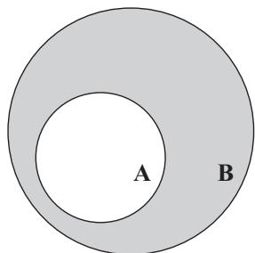

图 2.1 事实上 A 完全包含在 B 中。如果 x 属于 A，那么 x 也属于 B。

最后还要注意，如果 A 是 x 的某种性质，那么以下两种表述是等价的：

命题 1. $\lnot$($\forall$ x, x 具有性质 A)

命题 2. $\exists$ x 满足 $\lnot$(x 具有性质 A)

第一个命题说"并不是每个 x 都具有性质 A"，第二个命题说的是"有一些 x 没有性质 A"。大声地读出这两句话，你就会明白为什么它们说的是一回事。

同样地，下面两个命题也是等价的：

命题 3. $\lnot$($\exists$ x 满足 x 具有性质 A)

命题 4. $\forall$ x, $\lnot$(x 具有性质 A)

试着大声读出来，把所有符号都翻译成中文。

#### 证明的技巧

证明一个定理有许多不同的方法。有时候，不止一种方法可行。本书采用五种主要的技巧：

1. 举反例证明
2. 证明逆否命题
3. 反证法
4. 归纳证明
5. 分两步直接证明

**举反例证明。** 在某些情况下，证明可能只需要举出一个反例。如何证明并非每个整数都是偶数？如果我说"每个整数都是偶数"，那么你只需要找到一个不是偶数的整数，比如数 3，这样就能证明我是错的。任何形如"$\exists$ x 满足 x 具有性质 A"或"$\lnot$($\forall$ x, x 具有性质 A)"的命题都可以通过举反例来证明。对于第一种形式，我们只需要找到一个具有性质 A 的 x；对于第二种形式，我们只需要找到一个没有性质 A 的 x。

**例 2.1 (举反例证明).**

试着证明下面这个命题："并非每个连续函数都是可微的"。为此，我们只需要给出一个反例，任意一个连续且不可微的函数都可以，比如 $f ( x ) = \left| x \right|$。

现在我们需要严格地证明 $|x|$ 是连续且不可微的。在以后的实分析学习中，你将学会如何做到这一点。

这个例子告诉我们，给出一个反例只完成了一半的工作。难点在于我们要严格地证明它确实满足所有必要条件。

**证明逆否命题。** 正如我们之前所了解的，$\lnot$ B $\implies$ $\lnot$ A 等价于 A $\implies$ B。因此，为了证明 A $\implies$ B，我们可以假设 B 为假并证明 A 也为假。

**例 2.2 (证明逆否命题).**

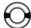

试着证明以下命题：对于任意两个数 x 和 y，当且仅当 $\forall \epsilon > 0 , | x - y | < \epsilon$ 时 $x = y$。这个命题断言如果两个数可以任意接近（这意味着我们可以选择任意小的距离 $\epsilon$，并且这两个数之间的距离比 $\epsilon$ 还要小），那么它们就是相等的。由于该命题中包含"当且仅当"（iff），因此蕴涵是双向的，两个方向都要证明。

$$
1. x = y \Longrightarrow \forall \epsilon > 0, | x - y | < \epsilon .
$$

证明这个方向很简单。假设 $x = y$。那么 $x - y = 0$，因此 $| x - y | = 0$。由于我们选择的任何 $\epsilon$ 都必须大于 0，所以 $| x - y | = 0 < \epsilon$。于是，$\forall \epsilon > 0 , | x - y | < \epsilon$。

$$
2. \forall \epsilon > 0, | x - y | < \epsilon \Longrightarrow x = y.
$$

这个命题应该很直观。也就是说，如果 x 和 y 之间的距离小于每一个正数，那么它们之间的距离必须等于 0。

为了证明这个方向，我们来证明其逆否命题。此时，命题 $\lnot$ B $\implies$ $\lnot$ A 就是

$$
x \neq y \Longrightarrow \neg (\forall \epsilon > 0, | x - y | < \epsilon).
$$

回忆一下之前的逻辑讨论，上式右端可以简化成

$$
x \neq y \Longrightarrow \exists \epsilon > 0 \text {使得} \neg (| x - y | < \epsilon).
$$

如果 $x \neq y$，那么 x 一定等于 y 加上某个 z，其中 $z \neq 0$。于是，$| x - y | = | z |$。任何非零数的绝对值都是正的，所以如果令 $\epsilon = | z |$，那么 $\epsilon > 0$ 且 $| x - y | = \epsilon$。这样就证明了 $\exists \epsilon > 0$，使得 $\neg (| x - y | < \epsilon)$！

**反证法。** 不要把"反证法"和"证明逆否命题"混为一谈，反证法是完全不同的东西。不妨设我们要证明 A $\implies$ B。如果假设 A 为真但 B 为假，那么就会出现严重的错误。我们最终会得到一个矛盾，一些违反基本数学公理或定义的东西，比如"0 = 1"或"5.3 是整数"。当这种情况发生时，我们就证明了如果 A 为真，那么 B 不可能为假——否则数学的定义就会崩溃。

**例 2.3 (反证法).**

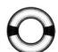

我们来证明定理"$\sqrt { 2 }$ 不是有理数"。此时，如果把该定理写成 A $\implies$ B 的形式，那么 B 就是"$\sqrt { 2 }$ 不是有理数"。注意，这里并不存在命题 A。由该定理可知，除了通常的数学公理外，B 为真不需要任何必要条件。因此，利用逆否命题证明是行不通的。那么反证法可行吗？假设 $\sqrt { 2 }$ 属于 Q，并证明这将导致可怕的错误。

在开始证明之前，这里有一些关于数的一般事实将会派上用场。

事实 1. 任何有理数 $\frac { m } { n }$ 都可以化简成 m 和 n 不同时为偶数的形式。（如果 m 和 n 都是偶数，那么只要让分子和分母同时除以 2，我们就可以得到该有理数的更简单的形式。）

事实 2. 对于某些整数 a 和 b，如果 $a = 2 b$，那么 a 一定是偶数，因为它可以被 2 整除。

事实 3. 如果数 a 是奇数，那么 $a ^ { 2 }$ 也是奇数，因为 $a ^ { 2 }$ 是一个奇数自加了奇数次。

现在开始证明。如果 $\sqrt { 2 }$ 是有理数，那么由事实 1 可知，$\sqrt { 2 }$ 可以写成一个化简后的分数，因此存在整数 m 和 n（不同时为偶数）使得 $\left( { \frac { m } { n } } \right) ^ { 2 } = 2$。于是 $m ^ { 2 } = 2 n ^ { 2 }$，由事实 2 可知，$m ^ { 2 }$ 一定是个偶数。根据事实 3，如果 m 是奇数，那么 $m ^ { 2 }$ 也是奇数，所以 m 一定是偶数。

我们可以把 m 写成 2b，其中 b 是某个整数，那么 $m ^ { 2 } = ( 2 b ) ^ { 2 } = 4 b ^ { 2 }$，这意味着 $m ^ { 2 }$ 可以被 4 整除。那么 $2 n ^ { 2 }$ 也可以被 4 整除，所以 $n ^ { 2 }$ 是偶数。同样地，由事实 3 可知，n 一定是偶数。

等等！事实 1 告诉我们，如果 $\sqrt { 2 }$ 是有理数，那么它可以写成 $\frac { m } { n }$，其中 m 和 n 不同时为偶数。但我们刚刚证明了它们都是偶数！这与分数的基本公理相矛盾，所以唯一可能的逻辑结论是：我们的主要假设（即 $\sqrt { 2 }$ 是有理数）一定是错误的。

顺便说一下，这种方法同样适用于证明任何素数的平方根都是无理数。

通常认为反证法是最后采用的办法。在很多情况下，如果你用反证法证明了某个定理，那么你也可以用相同的关键步骤来直接证明这个结论。不过，在 $\sqrt { 2 }$ 的例子中，情况并非如此。请注意，反证法是着手思考问题的好方法，但你也要经常检验自己是否可以进一步直接证明结论（这是学习数学的加分点）。

**归纳证明。** 数学归纳法就像多米诺骨牌一样：如果我们把所有的多米诺骨牌都摆好，然后只撞倒第一张骨牌，那么其余所有的骨牌都会倒下。归纳法适用于需要证明无穷多种情形的问题（实际上，这种问题一定包含可数无穷多种情形，当学到第 8 章时，你就会明白这意味着什么）。

假设我们能够通过证明以下几点来建立多米诺骨牌：当定理在情形 1 下成立时，它在情形 2 下也一定成立；当定理在情形 2 下成立时，它在情形 3 下也一定成立；以此类推。概括地说，我们只需要证明：当定理在情形 n-1 下成立时，它在情形 n 下也一定成立。现在我们要做的就是证明定理在情形 1 下成立，即撞倒第一张多米诺骨牌。接下来所有的多米诺骨牌都会倒下，这是因为由假设可知，一旦定理在情形 1 下成立，那么它在情形 2 下也成立；现在情形 2 下的定理成立了，那么在情形 3 下定理也一定成立；以此类推。

撞倒第一张多米诺骨牌会更容易些，所以我们通常先考虑第 1 种情形（这一步称为基本情形）。然后我们假设定理在第 n-1 种情形下成立（这个假设称为归纳假设），并证明它在第 n 种情形下也成立（这一步称为归纳步骤）。

**例 2.4 (归纳证明).**

我们试着找出计算前 n 个自然数之和的公式，即 $1 + 2 + 3 + \cdots + n$。使用上一节的符号，这个和就等于 $\sum _ { i = 1 } ^ { n } i$。如果花费足够的时间来考察这个和，你可能会突然找到答案：

$$
\sum_ {i = 1} ^ {n} i = \frac {n (n + 1)}{2}.
$$

你可以代入几个值来验证一下这个公式的正确性。为了证明这个公式，我们需要更加严格的证明（几个例子并不能构成一个证明，因为它们无法排除存在反例的可能性）。我们要证明这个公式适用于所有可能的正整数 n。因此，归纳法可能是最好的选择。

1. 基本情形。我们只需要证明当 $n = 1$ 时公式成立。由于 $\sum _ { i = 1 } ^ { 1 } i = 1 = \frac { 1 ( 1 + 1 ) } { 2 }$，因此第一步就完成了。哇哦！（基本情形通常都很简单。）
2. 归纳步骤。由归纳假设可知，我们要假设公式适用于 n - 1 的情形，因此不妨设 $\sum _ { i = 1 } ^ { n - 1 } i = \frac { ( n - 1 ) n } { 2 }$。利用这个假设，我们要证明该公式对 n 成立，即 $\sum _ { i = 1 } ^ { n } i = { \frac { n ( n + 1 ) } { 2 } }$。通过替换和化简，我们得到

$$
\sum_ {i = 1} ^ {n} i = \left(\sum_ {i = 1} ^ {n - 1} i\right) + n = \frac {(n - 1) n}{2} + n = \frac {n ^ {2} - n}{2} + \frac {2 n}{2} = \frac {n ^ {2} + n}{2} = \frac {n (n + 1)}{2},
$$

这一步就完成了！

尽管这看起来好像太简单了，但记住这并不神奇。我们没有"自举"证明或使用循环逻辑。我们只是按照归纳步骤来推导，即"如果它适用于 1，那么它也适用于 2；如果它适用于 2，那么它也适用于 3；依此类推"。因为基本情形"它适用于 1"是成立的，所以我们就证明了它适用于每一个可能的正整数 n（即，适用于 N 中的每一个 n）。

**分两步直接证明。** 到目前为止，我们已经讲过的所有技巧都没有展示如何直接证明 A $\implies$ B，即假设 A 为真，然后通过逻辑步骤推出 B 为真。

要想得出一个直接证明，你需要反复思考一段时间，直到你找到了问题的症结并弄清楚该如何解决它为止。在很多情况下，关键是要找到一些合适的函数或变量，使问题变得清晰明了。除非你写的是一本教科书，否则读者并不关心你是如何解决这个难题的，他们只想知道这个定理为什么成立。一旦确定了证明定理所要使用的关键步骤，下一步你只需要以线性方式清晰地写出该定理即可。

**例 2.5 (分两步直接证明).**

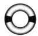

在微积分中，我们把函数的极限定义为：$\lim _ { x \to p } f ( x ) = q$，当且仅当对于任意 $\epsilon > 0$，存在某个 $\delta > 0$ 使得

$$
| x - p | < \delta \Longrightarrow | f (x) - q | < \epsilon .
$$

当你学到连续性时，会更详细地理解其中的含义。不过，现在让我们看看下面这个命题："令 $f ( x ) = 3 x + 1$，则 $\lim _ { x \to 2 } f ( x ) = 7$。"这个结论应该是正确的，因为所有多项式都是连续的。这个命题的证明方法有很多种，但我们试着用刚才看到的定义去直接证明。

首先，需要做一些工作来找出关键步骤。对于每一个可能的 $\epsilon > 0$，我们要找到合适的 $\delta > 0$ 使得

$$
| x - 2 | < \delta \Longrightarrow | f (x) - 7 | < \epsilon ,
$$

也就是

$$
- \delta + 2 < x < \delta + 2 \Longrightarrow - \epsilon < 3 x - 6 < \epsilon .
$$

因此所求的 $\delta$ 要使得

$$
\frac {- \epsilon + 6}{3} < x < \frac {\epsilon + 6}{3},
$$

于是，只需要令

$$
\delta + 2 = \frac {\epsilon + 6}{3} \Longrightarrow \delta = \frac {\epsilon}{3}.
$$

既然已经找到了合适的 $\delta$，接下来就可以简明地写出证明过程：对于任意 $\epsilon > 0$，令 $\delta = \frac { \epsilon } { 3 }$。于是 $\delta > 0$，并且

$$
| x - p | < \delta \Longrightarrow | x - 2 | < \frac {\epsilon}{3}
$$

$$
\begin{array}{l} \Longrightarrow 2 - \frac {\epsilon}{3} < x < 2 + \frac {\epsilon}{3} \\ \Longrightarrow - \epsilon < 3 x - 6 < \epsilon \\ \Longrightarrow | (3 x + 1) - 7 | < \epsilon \\ \Longrightarrow | f (x) - q | < \epsilon . \end{array}
$$

这样就得到 $\lim _ { x \to 2 } ( 3 x + 1 ) = 7$。

关于证明，这里再给出一点提示：如果你遇到了困难，请看看还有哪些已知条件没有使用。在前面的例子中，唯一可用的"事实"是极限的定义。但是在后面的章节中，你将有大量的定义和定理可供参考。一个被你遗忘的"事实"很有可能是让你走出困境的关键。

在后面的章节中，我们将把这个象征着 Q.E.D. 的符号 □ 放在每一个证明的末尾。它代表拉丁文 quod erat demonstrandum，基本意思是（我随意解释一下）"我们已经证明了我们说过要证明的东西"。

我们要出发了！现在你已经知道了实分析入门所需要的一切预备知识。按照之前的承诺，我们将在下一章学习集合，然后再考察实数。

### 第3章 集合论

在开始学习实分析之前，了解集合的基本知识（以及如何处理它们）会非常有用。集合是什么？好吧，并非所有数都是实数。事实上，我们要考察的"事物"并不都是数。集合是一个有用的抽象概念。集合包含元素，元素可以是实数、虚数、美元、人、白鲸，等等。

在这一章中，我们将回顾描述抽象集合的基本符号和定理。当提到数学运算时，你通常会想到加法、减法、乘法和除法。然而，集合的基本操作却是并集、交集和补集。

**定义 3.1 (集合).** 集合是一堆元素的集体。包含无穷多个元素的集合称为无限集。

**例 3.2 (集合).** 下面是一些集合及其符号的例子：

- $\{1, 2, 3\}$：包含数 1、2 和 3 的集合。用 $1 \in \{1,2,3\}$ 来表示 1 是集合中的元素。
- A：名字为 A 的集合。
- $A = \{1, 2, 3\}$：包含数 1、2 和 3 的集合 A。
- $\{a, b, c\}$：包含元素 a、b 和 c 的集合（这些元素不一定是数）。
- $\{A, B, C\}$：包含元素 A、B 和 C 的集合。集合通常用大写字母来表示，因此这个集合可能包含其他三个集合。
- R：包含全体实数的集合。例如，$\pi \in \mathbb{R}$。这是一个无限集。
- $\{x \in \mathbb{R} \mid x < 3\}$：这个符号读作："R 中所有小于 3 的 x 的集合"，因此这是全体小于 3 的实数的集合。这也是一个无限集。
- $\{p \in A \mid p \neq 3\}$：集合 A 中所有不等于 3 的元素的集合。稍后将会看到，这个集合也可以表示为 A \setminus \{3\}，即集合 A 中去掉由单个元素 3 构成的集合。
- $\varnothing$：这个集合在每个数学家心中都占有特殊的位置。它称为空集，也就是：没有元素的集合。任何不是空集的集合都称为非空集。
- $|A| = 3$：这个符号表示 A 的大小是 3，所以 A 包含 3 个元素。注意，$|\{A\}|$ 不一定等于 $|A|$。第一个集合只包含集合 A，其大小是 $|\{A\}| = 1$，但是如果 A 包含 100 个元素，那么 $|A| = 100$。

**定义 3.3 (索引族).** 如果每一个 $i \in I$ 都对应着一个集合 $A_i$，那么 $\mathcal{A} = \{A_i \mid i \in I\}$ 就是索引集为 I 的集合 A 的索引族。

在某些情况下，当我们要处理任意索引集（其元素为 $\alpha$）时，可以将集合的索引族写成 $\{A_\alpha\}$。这种类型的索引族也称为集合族。

**例 3.4 (索引族).** 对于所有 $n \in \mathbb{N}$，如果 $A_n = \{1, 2, n^2\}$，那么 $A_3 = \{1, 2, 9\}$。于是，如果

$$
\mathscr{A} = \left\{A_n \mid n \in \mathbb{N}, n \leqslant 10\right\},
$$

那么 $\mathcal{A}$ 就是一组集合的集合，就像这样

$$
\mathscr{A} = \{\{1, 2, 1\}, \{1, 2, 4\}, \dots, \{1, 2, 100\}\}.
$$

注意，索引族不一定是有限集。在这个例子中，如果

$$
\mathcal{B} = \left\{A_n \mid n \in \mathbb{N}\right\},
$$

那么 $\mathcal{B}$ 是包含无穷多个集合的集合，就像这样

$$
\mathcal{B} = \{\{1, 2, 1\}, \{1, 2, 4\}, \{1, 2, 9\}, \dots\}.
$$

不要被集合 $\{1,2,1\}$ 迷惑。它与集合 $\{1,2\}$ 是一样的，只是书写方式更冗余而已。例如，如果我们有一个集合 $\{1\}$，那么你可以把它写成 $\{1, 1, 1, 1\}$。但是请不要这么做。

**定义 3.5 (子集).** 如果集合 A 中的每一个元素也都是集合 B 的元素，那么集合 A 就是集合 B 的子集，记作 $A \subseteq B$ 或者 $B \supseteq A$。此时，B 称为 A 的超集。

如果集合 A 与集合 B 具有完全相同的元素，那么集合 A 就等于集合 B，记作 $A = B$。（如果两个集合相等，那么它们就是同一个集合。）这就相当于说"A $\subseteq$ B 且 B $\subseteq$ A"。

如果集合 A 的每一个元素也都是集合 B 的元素，但集合 B 在集合 A 之外还有一些其他元素，那么集合 A 就是集合 B 的真子集，记作 $A \subset B$ 或 $B \supset A$。用符号表示即：

$$
A \subset B \iff A \subseteq B \text {且} A \neq B.
$$

**例 3.6 (子集).** 如果 $A = \{1, 2\}$ 且 $B = \{1, 2, 3\}$，那么 $A \subseteq B$。更进一步，$A \subset B$。

使用例 3.2 中的符号，我们有 $\{x \mid x$ 是实数$\} = \mathbb{R}$。另外，由于每个有理数都是实数，所以 $\mathbb{Q} \subseteq \mathbb{R}$。更进一步，$\mathbb{Q} \subset \mathbb{R}$，这是因为有些实数不是有理数（例如 $\sqrt{2}$）。

奇怪的不精确的数学惯例。出于某种原因，即使集合 A 可能等于集合 B，传统的表示法也是写成 $A \subset B$ 而不是 $A \subseteq B$。我知道这与之前的写法相矛盾，这只是我采用的一种惯例，从而使你能习惯大多数数学家的书写方式。因此，当你看到 $A \subset B$ 时，除非明确声明，否则不要假定 A 是 B 的真子集。

为了进一步迷惑你。注意，$A \in B$ 和 $A \subset B$ 这两种书写方式是有区别的。前者意味着 B 是一组集合的集合，而集合 A 是其元素之一，而后者意味着 B 包含 A 中的所有元素。

例如，令 $A = \{1, 2\}$。为了得到 $A \in B$，B 必须形如 $\{\{1, 2\}, \{3, 4\}, \{1\}, \{100\}\}$（所以 B 是由一组集合构成的集合）。如果 $A \subset B$，那么 B 形如 $\{1, 2, 3, 100\}$。

**定理 3.7 (每个集合都包含空集).** 对于任意集合 A，有 $\varnothing \subset A$。

注意，我们不能说"$\varnothing$ 是所有集合 A 的真子集"，因为 A 可能等于空集。

**证明.** 我们必须证明 $\varnothing$ 的每个元素也都是 A 的元素。但是 $\varnothing$ 不包含元素，故其所有元素均在 A 中。□

**定义 3.8 (区间).** 开区间 (a, b) 是集合

$$
(a, b) = \{x \in \mathbb{R} \mid a < x < b\}.
$$

闭区间 [a, b] 是集合

$$
[ a, b ] = \{x \in \mathbb{R} \mid a \leqslant x \leqslant b\}.
$$

半开区间是集合

$$
[ a, b) = \{x \in \mathbb{R} \mid a \leqslant x < b\},
$$

或者集合

$$
(a, b ] = \{x \in \mathbb{R} \mid a < x \leqslant b\}.
$$

有些人也称开区间为线段，称闭区间为（普通的）区间，但这个术语有点过时了（而且更容易造成混淆）。为了保持一致性，我们将坚持使用术语开区间 (a, b) 和闭区间 [a, b]。

**例 3.9 (区间).** $(-3,3)$ 是开区间，$[0,99.5]$ 是闭区间。它们都是实数集的子集。

**定义 3.10 (并集和交集).** 集合 A 与 B 的并集是由 A 的所有元素和 B 的所有元素共同构成的集合。A 与 B 的并集用符号来表示即：

$$
A \cup B = \{x \mid x \in A \text {或} x \in B\}.
$$

集合 A 与 B 的交集是由既包含在 A 中又包含在 B 中的所有元素构成的集合。A 与 B 的交集用符号来表示即：

$$
A \cap B = \{x \mid x \in A \text {且} x \in B\}.
$$

如果 $A \cap B = \varnothing$，那么 A 与 B 不相交。否则，我们说 A 与 B 相交。

**例 3.11 (并集和交集).** 并集 $\{1, 2, 3\} \cup \{3, 4, 5\}$ 是 $\{1, 2, 3, 4, 5\}$，也可以记作 $\{n \in \mathbb{N} \mid 1 \leqslant n \leqslant 5\}$。交集 $\{1, 2, 3\} \cap \{3, 4, 5\}$ 是集合 $\{3\}$，它由单个元素 3 组成。

由于区间都是集合，所以我们可以对区间取并集和交集。例如，$[1,3] \cup [2,4] = [1,4]$，$[1,3] \cap [2,4] = [2,3]$。注意，$(1,3) \cup (3,5) \neq (1,5)$，而是

$$
(1, 3) \cup (3, 5) = \{x \in \mathbb{R} \mid 1 < x < 3 \text {或} 3 < x < 5\},
$$

因此 $(1,3) \cup (3,5)$ 是这个并集最简单的写法。另外，$(1,3) \cap (3,5) = \varnothing$。

记住，由定义可知，区间只包含实数。我们把 a 与 b 之间全体有理数的集合记作 $(a,b) \cap \mathbb{Q}$。注意，$\mathbb{Q} \cup \mathbb{R} = \mathbb{R}$ 且 $\mathbb{Q} \cap \mathbb{R} = \mathbb{Q}$。

最后一个例子是关于并集和交集的一些简单事实：

事实 1. 对于任意集合 A，有 $A \cup A = A = A \cap A$。

事实 2. 如果 x 属于 A 或 x 属于 B，那么我们也可以说 x 属于 B 或 x 属于 A（我们只是交换了顺序），这使得下面的交换律和结合律显然成立：

$$
A \cup B = B \cup A \quad {\text {且}} \quad (A \cup B) \cup C = A \cup (B \cup C),
$$

$$
A \cap B = B \cap A \quad {\text {且}} \quad (A \cap B) \cap C = A \cap (B \cap C).
$$

事实 3. $A \cup \varnothing = A$ 且 $A \cap \varnothing = \varnothing$。因此，每个集合都与空集不相交。

**定理 3.12 (并集和交集的性质).** 对于任意集合 A 与集合 B，下列性质均成立。

性质 1. $A \subset (A \cup B)$ 且 $A \supset (A \cap B)$。

性质 2. 当且仅当 $A \cup B = B$ 时 $A \subset B$。

性质 3. 当且仅当 $A \cap B = A$ 时 $A \subset B$。

性质 4. 对于任意 $n \in \mathbb{N}$，有

$$
A \cup (B_1 \cap B_2 \cap \dots \cap B_n) = (A \cup B_1) \cap (A \cup B_2) \cap \dots \cap (A \cup B_n).
$$

性质 5. 对于任意 $n \in \mathbb{N}$，有

$$
A \cap (B_1 \cup B_2 \cup \dots \cup B_n) = (A \cap B_1) \cup (A \cap B_2) \cup \dots \cup (A \cap B_n).
$$

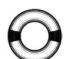

**证明.** 这些性质的证明都非常简单。试着把性质 3 和性质 5 的证明补充完整。

性质 1. 令 $x \in A$。那么 $x \in A$ 或 $x \in B$，因此 $x \in A \cup B$，所以 $A \subset (A \cup B)$。对于第二个结果，令 $x \in A \cap B$。那么 $x \in A$ 且 $x \in B$，因此 $x \in A$，所以 $A \cap B \subset A$。

性质 2. 假设 $A \subset B$。如果我们能证明 $B \subset (A \cup B)$ 和 $B \supset (A \cup B)$，那么就证明了 $A \cup B = B$。根据刚刚证明的第一条性质，$B \subset (A \cup B)$ 是成立的。根据假设 $A \subset B$，将该式两端同时与 B 做并集就会得到 $(A \cup B) \subset (B \cup B) = B$。结论得证。

为了证明另一个方向，假设 $A \cup B = B$。同样由第一条性质可得 $A \subset (A \cup B)$，于是 $A \subset (A \cup B) = B$，因此 $A \subset B$。

性质 3. 这个证明与上一个证明几乎相同。

#### 定理 3.12 中性质 3 的证明

假设 $A \subset B$。我们想要证明 $A \subset (A \cap B)$ 和 $A \supset (A \cap B)$。第一个结果显然成立：由于 $A \subset B$，如果 $x \in A$，那么 $x \in B$，因此，如果 $x \in A$，那么 $x \in A$ 且 $x \in B$，即 $x \in A \cap B$。第二个结果可以利用 $A \cap B \subset A$ 得到。反过来，假设 $A \cap B = A$。利用第一条性质，$A \cap B \subset B$，于是有 $A = A \cap B \subset B$。

性质 4. 下面给出一些符号，用来简化我们要证明的内容：

$$
A \cup \left(\bigcap_ {i = 1} ^ {n} B _ {i}\right) = \bigcap_ {i = 1} ^ {n} (A \cup B _ {i}).
$$

大交集符号与求和符号 $\sum_{i=1}^n$ 的工作方式相同。我们首先证明

$$
A \cup \left(\bigcap_ {i = 1} ^ {n} B _ {i}\right) \subset \bigcap_ {i = 1} ^ {n} (A \cup B _ {i}),
$$

然后证明

$$
A \cup \left(\bigcap_ {i = 1} ^ {n} B _ {i}\right) \supset \bigcap_ {i = 1} ^ {n} (A \cup B _ {i}).
$$

这条性质的说明见图 3.1。通过绘制类似的文氏图，你可以更好地理解并集和交集的概念。作图时，要确保图中包含所有可能的交集。例如，如果你画了另一个叫作 $B_3$ 的区域，而它看起来只与 A 相交（而与 $B_1$ 和 $B_2$ 都不相交），那么最后可能会得到关于这些集合的错误结论。

令 $x \in A \cup ( \bigcap _ { i = 1 } ^ { n } B _ { i } )$，那么 $x \in A$ 或 $x \in \bigcap _ { i = 1 } ^ { n } B _ { i }$。如果 $x \in A$，那么对于每一个 i 均有 $x \in A \cup B _ { i }$（这是因为由第一条性质可知 $A \subset ( A \cup B _ { i } )$），于是 $x \in \bigcap _ { i = 1 } ^ { n } ( A \cup B _ { i } )$。如果 $x \in \bigcap _ { i = 1 } ^ { n } B _ { i }$，那么对于每一个 i 均有 $x \in B _ { i }$，因此对于每一个 i 都有 $x \in A \cup B _ { i }$，于是 $x \in \bigcap _ { i = 1 } ^ { n } ( A \cup B _ { i } )$。

为了得到这个子集等式的另一个方向，猜猜我们要做什么？要做几乎完全一样的事情。令 $x \in \bigcap _ { i = 1 } ^ { n } ( A \cup B _ { i } )$，那么对于每一个 i 均有 $x \in A \cup B _ { i }$。现在，我们将其分为两种可能的情形：

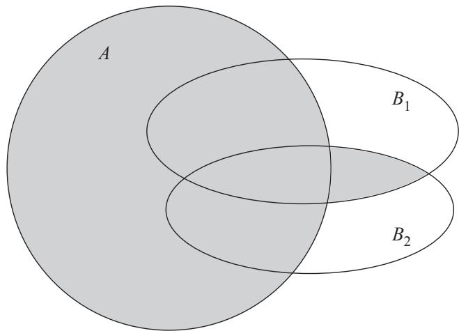

图 3.1 阴影区域是 $A \cup (B_1 \cap B_2) = (A \cup B_1) \cap (A \cup B_2)$。

情形 1. $x \in A$。显然 $x \in A \cup ( \bigcap _ { i = 1 } ^ { n } B _ { i } )$。（为什么？因为 $A \subset A \cup ( \bigcap _ { i = 1 } ^ { n } B _ { i } )$。看到我们是如何继续使用第一条性质了吗？）

情形 2. $x \notin A$。那么 x 一定属于每一个 $B_i$（因为 x 或者属于 A 或者属于每一个 $B_i$）。于是 $x \in \bigcap _ { i = 1 } ^ { n } B _ { i }$，进而 $x \in A \cup ( \bigcap _ { i = 1 } ^ { n } B _ { i } )$。

性质 5. 这些论述远没有看上去那么复杂，只要使用"$A \subset B$ 且 $A \supset B \Longrightarrow A = B$"的技巧就行了。对于证明的每一个方向，我们只考察集合中的一个元素，看看由它可以轻松得出哪些结论。我已经把这部分证明简写成符号和箭头，从而使你能快速地把它补充完整。但首先要画一幅像图 3.1 那样的图，这样你就可以直观地理解这个结论为什么成立。

定理 3.12 中性质 5 的证明：$A \cap (\bigcup_{i=1}^{n} B_i) \subset \bigcup_{i=1}^{n}(A \cap B_i)$，因为：
$x \in A \cap \left( \bigcup_{i=1}^{n} B_i \right) \Longrightarrow$ ____ 且 ____ $\Longrightarrow x \in$ ____（存在某个 i）$\Longrightarrow x \in A \cap B_i$（存在 ____）$\Longrightarrow$ ____ 或 $x \in A \cap B_2$ 或 $\cdots$ 或 ____ $\Longrightarrow x \in \bigcup_{i=1}^{n}(A \cap B_i)$。

另一方面，$A \cap (\bigcup_{i=1}^{n} B_i) \supset \bigcup_{i=1}^{n}(A \cap B_i)$，因为：

$$
\begin{array}{r l} {x \in \bigcup_ {i = 1} ^ {n} (A \cap B _ {i}) \Longrightarrow} & {\text {(存在某个} i)} \\ & {\Longrightarrow \text {且} \text {(存在某个} i)} \\ & {\Longrightarrow \text {或} \text {或} \dots \text {或}} \\ & {\Longrightarrow x \in A \text {且} x \in \bigcup_ {i = 1} ^ {n} B _ {i}} \\ & {\Longrightarrow .} \end{array}
$$

**定义 3.13 (索引族中的并集和交集).** 索引族 $\mathcal{A} = \{A_i \mid i \in I\}$ 中集合的并集 $\cup_{i \in I} A_i$ 定义为至少包含在某一个 $A_i$ 中的元素的集合。

索引族 $\mathcal{A} = \{A_i \mid i \in I\}$ 中集合的交集 $\cap_{i \in I} A_i$ 定义为包含在每一个 $A_i$ 中的元素的集合。

注意，这种表示法使我们可以处理无限并集和无限交集。定理 3.12 的性质 4 和性质 5 也同样适用于无限并集和无限交集的情形。在论证中，我们不需要假设索引 i 属于一个有限索引集。

**例 3.14 (索引族中的并集和交集).** 在符号表示中，注意 $\bigcup_{n=1}^{\infty} A_n = \bigcup_{n \in \mathbb{N}} A_n$ 且 $\bigcap_{n=1}^{\infty} A_n = \bigcap_{n \in \mathbb{N}} A_n$。当然，全体自然数的无限并集就是 $\bigcup_{n=1}^{\infty} \{n\} = \mathbb{N}$。

对于任意 $\alpha$，令 $A_\alpha = \{\alpha\}$。那么 $\bigcup_{\alpha \in \mathbb{R}} A_\alpha = \mathbb{R}$ 且 $\cap_{\alpha \in \mathbb{R}} A_\alpha = \varnothing$。实际上，对于任意索引集 I，我们都有 $\bigcup_{\alpha \in I} \{\alpha\} = I$ 和 $\cap_{\alpha \in I} \{\alpha\} = \varnothing$。

对于任意 $n \in \mathbb{N}$，令 $A_n = \left( - \frac{1}{n}, \frac{1}{n} \right)$。那么 $\bigcup_{n=1}^{\infty} A_n = (-1, 1)$。为什么？对于任意 $m > n$，均有 $A_m \subset A_n$，所以由定理 3.12 的性质 3 可知，这个并集就是索引族中最大的集合，即下标最小的集合 A。于是

$$
\bigcup_ {n = 1} ^ {\infty} A _ {n} = A _ {1} = (-1, 1).
$$

对于任意 $n \in \mathbb{N}$，令 $A_n = [0, 2 - \frac{1}{n}]$。那么 $\bigcup_{n=1}^{\infty} A_n = [0, 2)$。（注意，这是一个半开区间。这个区间不包含数 2，因为不存在 $n \in \mathbb{N}$ 使得 $2 \in A_n$。）为什么？当学到定理 5.5 时，我们才能理解该结论为什么成立。另外，$\bigcap_{n=1}^{\infty} A_n = [0, 1]$。为什么？对于任意 $m > n$，均有 $A_m \supset A_n$，所以由定理 3.12 的性质 3 可知，这个交集就是索引族中最小的集合，即下标最小的集合 A。于是

$$
\bigcap_ {n = 1} ^ {\infty} A _ {n} = A _ {1} = [0, 1].
$$

**定义 3.15 (补集).** 集合 A 在另一个集合 B 中的补集是由属于 B 但不属于 A 的元素构成的集合，记作在 B 中 $A^C$，或者记作 $B \setminus A$。

用符号来表示在 B 中 A 的补集，即：

$$
B \setminus A = \{x \in B \mid x \notin A\}.
$$

**例 3.16 (补集).** 在 $\mathbb{R}$ 中，$[-3, 3]$ 的补集是 $(-\infty, -3) \cup (3, \infty)$，$(-3, 3)$ 的补集是 $(-\infty, 3] \cup [3, \infty)$。注意，在 $\mathbb{R}$ 中，$\mathbb{Q}^C$ 是全体无理数的集合。

对于任意集合 A 与集合 B，均有 $(A \cup B) \setminus B = A \setminus B$ 和 $(A \cap B) \setminus B = \varnothing$。如果 $A \subset B$，那么 $A \setminus B = \varnothing$。（$(A \cap B) \setminus B = \varnothing$ 就是这个结论的一个实例，原因在于 $(A \cap B) \subset B$。）

集合 A 的补集的补集就是那些不是不属于 A 的元素所构成的集合，也就是集合 A 本身。因此，我们总有 $B \setminus (B \setminus A) = A$。

我们还可以用补集来描述不包含某些元素的集合。例如，如果 $A = \{1, 2, 100\}$，那么 $A \setminus \{100\}$ 就是 A 中 $\{100\}$ 的补集，它包含 A 中除了元素 100 以外的所有元素，即集合 $\{1,2\}$。

接下来的定理是一个几乎适用于所有数学领域的标准结论。这个定理以 Augustus De Morgan 的名字命名，因为 Augustus De Morgan 正式确立了该定理在逻辑学领域的类似定理：对于两个命题 A 和 B，有

$$
\begin{array}{r l} & {\neg (A \text {或} B) \iff (\neg A) \text {且} (\neg B)} \\ & {\neg (A \text {且} B) \iff (\neg A) \text {或} (\neg B).} \end{array}
$$

**定理 3.17 (德摩根律).** 令 $E_\alpha$ 表示任意一族（有限个或无穷多个）集合，令所有 $E_\alpha$ 都是集合 X 的子集。（在该定理及其证明中，我们将简写成"$E_\alpha^C$"，而不是"在 X 中 $E_\alpha^C$"。）

则下列命题成立：

$$
\begin{array}{l} \left(\bigcup_ {\alpha} E _ {\alpha}\right) ^ {C} = \bigcap_ {\alpha} \left(E _ {\alpha} ^ {C}\right), \\ \left(\bigcap_ {\alpha} E _ {\alpha}\right) ^ {C} = \bigcup_ {\alpha} \left(E _ {\alpha} ^ {C}\right). \end{array}
$$

看看这两个命题与前面给出的两个逻辑结果有什么相似之处？并集对应逻辑运算符"或"，而交集对应逻辑运算符"且"。德摩根律基本上是说并集的补集就是各补集的交集，反之亦然。看一看图 3.2，弄明白该定律为什么有意义。

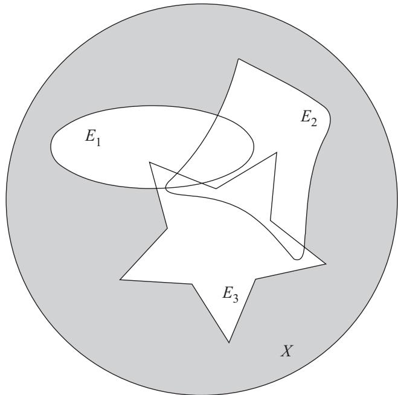

图 3.2 阴影区域是 $(E_1 \cup E_2 \cup E_3)^C = E_1^C \cap E_2^C \cap E_3^C$。

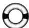

**证明.** 你要如何证明该定律呢？你可能会在房间里四处走动以使自己更清醒一些，但却被电视节目分散了注意力。你意识到自己可能太累了，于是去喝了杯咖啡，却偶遇了一位年初认识的人，你已经忘记了这个人的名字（于是你笨拙地挥了挥手）。接着就跑回房间，想看看锻炼是否会有所帮助。又发现这是个非常糟糕的主意，因为现在你更累了，满身是汗。然后你坐下来，盯着书本发呆……接着突然顿悟："嘿！我可以采用作者在上亿次证明中所使用的方法！"没错：只需要令 $A = ( \bigcup _ { \alpha } E _ { \alpha } ) ^ { C }$ 和 $B = \bigcap _ { \alpha } ( E _ { \alpha } ^ { C } )$，然后证明 $A \subset B$ 且 $B \subset A$ 即可。

令 $x \in A$，那么由补集的定义可知 $x \in X$ 且 $x \notin \bigcup _ { \alpha } E _ { \alpha }$。因此 x 不属于任意一个 $E _ { \alpha }$，所以 x 属于每一个 $E _ { \alpha } ^ { C }$。于是 $x \in \bigcap _ { \alpha } ( E _ { \alpha } ^ { C } ) = B$，从而有 $A \subset B$。

现在，令 $x \in B$，那么对于任意 $\alpha$，均有 $x \in E _ { \alpha } ^ { C }$，所以 $x \in X$ 且 x 不属于任意一个 $E _ { \alpha }$。于是，$x \notin \bigcup _ { \alpha } E _ { \alpha }$，因此 $x \in ( \bigcup _ { \alpha } E _ { \alpha } ) ^ { C } = A$，从而有 $B \subset A$。

现在，为了得到第二个结论，我们只需要做补集。因为 $\{E_\alpha\}$ 是任意一族集合，所以我们可以把已经证明的结论应用到索引族 $\{E_\alpha^C\}$ 上，从而得到

$$
\left(\bigcup_ {\alpha} E _ {\alpha} ^ {C}\right) ^ {C} = \bigcap_ {\alpha} (E _ {\alpha} ^ {C}) ^ {C} = \bigcap_ {\alpha} E _ {\alpha}.
$$

对两端同时取补集就得到了我们想要的结论，即 $\bigcup _ { \alpha } E _ { \alpha } ^ { C } = ( \bigcap _ { \alpha } E _ { \alpha } ) ^ { C }$。

当你看到这样一个简单而又严密的证明时，你的视线会很自然地继续向前移动，同时点头说"是的，这是有道理的"，但你并没有真正理解发生了什么。为了确保你的注意力集中（并真正熟练掌握集合的相关知识），请把这个证明抄写到笔记本上，然后再把该证明默写到另一张纸上。

已经完成证明了吗？没错，你可以去睡觉了。

不久，我们就要开始利用数（填空！）来研究实分析。实数集实际上是一个有序域。有序域是一种特定类型的集合，我们将在第 5 章中讨论有序域的性质。但首先，我们要学习边界的相关知识。

### 第7章 双射

从基本层次上说，拓扑学关注的是集合及其元素的性质。第 9 章将给出大量的拓扑定义，但我们首先要理解可数性的概念。为此，本章将讨论函数的一些重要性质，为建立双射的定义做好准备。

我相信当读到"函数"这个词的时候，你会发出一声叹息。在多年的数学课上，你可能反复地看到它们，一次又一次地定义它们。但是我们仍然需要正式地定义函数，并让它们与集合符号保持一致。没有函数就不可能有微积分，更不会有实分析。

**定义 7.1 (函数).** 如果集合 A 的每一个元素 x 都可以在集合 B 中找到唯一对应的元素 f(x)，那么关系 f 就是一个函数（也称为映射）。我们说 f 把 A 映射成 B，记作

$$
f: A \to B, f: x \mapsto f (x).
$$

集合 A 称为 f 的定义域，集合 B 称为 f 的上域。

**例 7.2 (函数).** 图 7.1 演示了一个不是函数的关系。

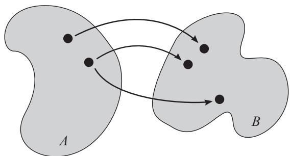

图 7.1 图中的关系不是函数 A → B，因为它把 A 的同一个元素映射到 B 中两个不同的元素。

下面是一个定义域为 A = R 且上域为 B = R 的函数：

$$
f: \mathbb{R} \to \mathbb{R}, f: x \mapsto x ^ {2}.
$$

简言之，我们可以把这个函数写成 $f(x) = x^2$。不过，这确实容易产生歧义，因为我们没有指定要映射哪些集合，可能是 $f: \mathbb{Q} \to \mathbb{Q}$，也可能是 $f: \{1,2,3\} \to \{1,4,9\}$。当需要知道哪些集合被映射时，我们要把它们明确地写出来。

另一个例子是

$$
\forall x \in \mathbb{N}, \quad f: x \mapsto 1,
$$

这个函数的定义域是 A = N。这里没有指定上域。

另一方面，

$$
\forall x \in \mathbb{R}, \quad f: x \mapsto \sqrt{x},
$$

不是函数，因为同一个 x 被映射到了多个值，即 $+\sqrt{x}$ 和 $-\sqrt{x}$。注意 $f(x) = +\sqrt{x}$ 和 $g(x) = -\sqrt{x}$ 都是函数。

**定义 7.3 (像和值域).** 对于任意函数 $f: A \to B$ 和任意 $E \subset A$，$f(E)$ 是 E 中所有元素经 f 映射得到的元素的集合。集合 f(E) 叫作 E 在 f 下的像。

用符号来表示，E 在 f 下的像是集合：

$$
f (E) = \{f (x) \mid x \in E\}.
$$

集合 f(A) 称为 f 的值域。

**例 7.4 (像和值域).** 图 7.2 演示了一个集合的像和一个函数的值域。

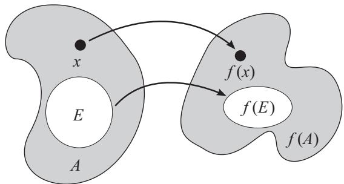

图 7.2 函数 f 作用在集合 A 上。f 的值域是 f(A)。它把元素 x 映射到元素 f(x)，把集合 E 映射到集合 f(E)。当然，这两者都包含在值域 f(A) 中。

如果 $E = (-3, 3)$，并且

$$
f: \mathbb{R} \to \mathbb{R}, f: x \mapsto x ^ {2},
$$

那么 E 在 f 下的像是半开区间 $f(E) = [0, 9)$。因为每一个正实数都是某个实数的平方，所以 f 的值域是 $[0, \infty)$。

如果 $E = \{1, 2, 3\}$ 且

$$
\forall x \in \mathbb{N}, \quad f: x \mapsto 1,
$$

那么 E 在 f 下的像就是集合 $f(E) = \{1\}$。事实上，f 的值域也是集合 $\{1\}$。

**定义 7.5 (原像).** 对于任意函数 $f: A \to B$ 和任意 $G \subset B$，$f^{-1}(G)$ 是 A 中那些在 f 下的像包含在 G 中的所有元素的集合。集合 $f^{-1}(G)$ 称为 G 在 f 下的原像。

用符号来表示，G 在 f 下的原像是集合：

$$
f^{-1}(G) = \{x \in A \mid f(x) \in G\}.
$$

对于任意 $y \in B$，$f^{-1}(y)$ 是 A 中所有像为 y 的元素的集合。

用符号来表示，对于任意 $y \in B$

$$
f^{-1}(y) = \{x \in A \mid f(x) = y\}.
$$

**例 7.6 (原像).** 图 7.3 演示了函数 f 以及几个集合的原像。

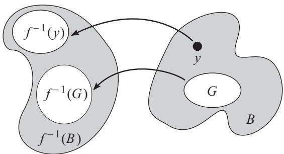

图 7.3 G, B 和 y 在函数 f 下的原像。

函数 $\forall x \in \mathbb{Z}, f(x) = x^2$ 的映射关系是 $\mathbb{Z} \to \mathbb{N} \cup \{0\}$。集合 N 在 f 下的原像是那些平方为自然数的全体整数的集合，所以 $f^{-1}(\mathbb{N}) = \mathbb{Z} \setminus \{0\}$。只包含一个数 16 的集合在 f 下的原像是 $f^{-1}(\{16\}) = \{4, -4\}$。注意，这意味着 $f^{-1}$ 不是函数（因为它把一个元素映射到两个不同的元素）。

**定义 7.7 (逆).** 对于任意函数 $f: A \to B$，如果关系 $f^{-1}: B \to A$ 是一个函数，那么我们称 $f^{-1}$ 为 f 的逆。如果存在这样的逆，则称 f 是可逆的。

**例 7.8 (逆).** 函数

$$
f: \mathbb{R} \to \mathbb{R}, f: x \mapsto x ^ {2}
$$

是不可逆的，因为它的逆 $f^{-1}(y) = \sqrt{y}$ 不是一个函数（它把 y 同时映射到 $+\sqrt{y}$ 和 $-\sqrt{y}$）。

另一方面，函数

$$
\forall x \in \mathbb{R}, \quad f: x \mapsto 2 x
$$

是可逆的，因为它的逆是 $f^{-1}(y) = \frac{y}{2}$。

注意，我们记作 $f^{-1}(y) = \frac{y}{2}$ 而不是 $f^{-1}(x) = \frac{x}{2}$。虽然它们的意思相同，但我们要弄清楚，对于 $f: A \to B$，$f^{-1}$ 作用于 B 中的元素 y，而不是 A 中的元素 x。

在上面的例子中，如果我们把 f 的定义域限制为集合 N，那么 f 就是不可逆的，因为 $f^{-1}(3) = \frac{3}{2}$ 不是自然数。

为了弄清楚哪些函数是可逆的，我们需要学习两种特殊类型的函数：映上函数和一对一函数。

**定义 7.9 (映上函数).** 对于任意函数 $f: A \to B$，如果 $f^{-1}(y)$ 对于每个 $y \in B$ 都至少包含 A 的一个元素，那么 f 就是 A 到 B 的映上映射。映上函数也称为满射函数或满射。

如果上域 B 中的每一个元素都能被定义域 A 中的某个元素映射到，那么这个函数就是一个满射。换句话说，f 的值域必须是整个 B，也就是说 $f(A) = B$。

**例 7.10 (映上函数).** 图 7.4 演示了映上函数。

如果 $B = \{1\}$，那么函数

$$
f: \mathbb{N} \to B, f: x \mapsto 1
$$

是映上的。但是，如果 $B \neq \{1\}$，那么 f 不是映上的，因为 B 中某些元素在 f 下没有原像。

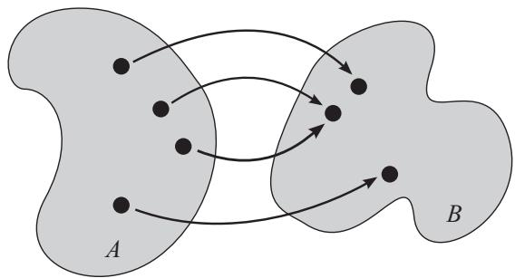

图 7.4 如果 B 只包含图中的三个点，那么这个函数就是映上（满射）函数（因为 B 的每个元素至少被 A 中一个元素映射到）。

任何非映上的函数都是不可逆的，因为 $f^{-1}$ 不是对 B 的所有元素都有定义。但是，其逆命题不一定为真：确实存在不可逆的映上函数。例如，函数

$$
f: \{1, 2\} \to \{1\}, \quad f: x \mapsto 1,
$$

是映上的，因为 B 的每一个元素（即它的唯一元素）都能被 f 映射到。但 f 是不可逆的，因为 $f^{-1}(1)$ 映射到 A 的两个不同元素。

**定义 7.11 (一对一函数).** 对于任意函数 $f: A \to B$，如果 $f^{-1}(y)$ 对于每个 $y \in B$ 都至多包含 A 中的一个元素，那么 f 就是 A 到 B 的一对一映射。一对一函数也被称为单射函数或单射。

如果上域 B 的每一个元素都被定义域 A 中至多一个元素映射到，那么这个函数就是单射。换句话说，对于每一对不同的元素 $x_1, x_2 \in A$（"不同"意味着 $x_1 \neq x_2$），我们一定有 $f(x_1) \neq f(x_2)$。

**例 7.12 (一对一函数).** 图 7.5 演示了一对一函数。

函数

$$
\forall x \in \mathbb{R}, \quad f: x \mapsto 2 x
$$

是一对一函数，因为 $x_1 \neq x_2 \Longrightarrow 2 x_1 \neq 2 x_2$。

另一方面，函数

$$
\forall x \in \mathbb{R}, \quad f: x \mapsto x ^ {2}
$$

不是一对一函数。例如，数 4 有两个原像：$-2$ 和 $2$。

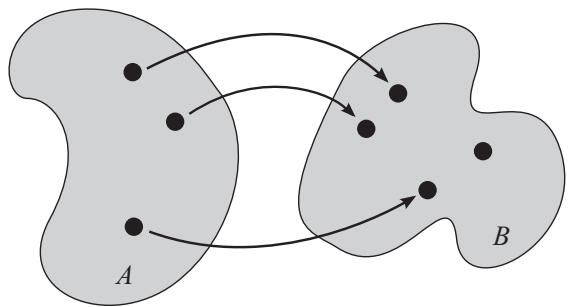

图 7.5 如果 A 只包含图中的三个点，那么这个函数就是一对一（单射）函数（因为 B 的每个元素最多被 A 的一个元素映射到）。

与非满射的函数一样，任何非单射的函数也不可逆：如果 B 的某个元素至少被 A 中两个元素映射到，那么 $f^{-1}$ 就不是函数。

同样地，其逆命题不一定为真：确实存在不可逆的单射函数。例如，函数

$$
f: \{1\} \rightarrow \{1, 2\}, \quad f: x \mapsto 1,
$$

是单射函数，因为 B 中没有哪个元素是被 A 中多个元素映射到的。但 f 不可逆，因为 $f^{-1}(2)$ 无定义。

**定义 7.13 (双射).** 双射是既映上又一对一的函数。

**例 7.14 (双射).** 图 7.6 演示了双射。将其与图 7.4 和图 7.5 进行对比，它们都不是双射。

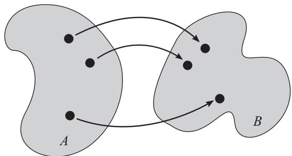

图 7.6 如果 A 和 B 都只包含图中的三个点，那么这个函数就是双射（因为 B 的每个元素都恰好被 A 的一个元素映射到）。

到目前为止，在我们看到的所有函数中，只有

$$
f: x \mapsto 2 x, \quad \forall x \in \mathbb{R}
$$

是双射。

**定理 7.15 (双射 $\iff$ 可逆).** 当且仅当 $f: A \to B$ 是可逆函数时它是双射。

**证明.** 我们先证明双射是可逆函数。为了使 $f^{-1}$ 存在，$f^{-1}$ 必须对 B 的每个元素都有定义，而且 B 的每个元素只能对应 A 的一个元素（如果与 A 的两个不同元素对应，那么 $f^{-1}$ 就不是函数了）。这一点可以利用定义来证明！因为 f 是满射，所以 B 的每一个元素都被 A 的某个元素映射到，因此 $f^{-1}$ 对 B 的每个元素都有定义。由于 f 是单射函数，所以 B 的任意两个元素都不会被 A 的同一个元素映射到，因此 $\forall y \in B, f^{-1}(y)$ 是唯一的。

另一个方向可以按照类似的方法来证明。如果 f 是可逆函数，那么 $f^{-1}$ 对 B 的每个元素都有定义，因此 B 的每个元素一定可以通过 f 被 A 的某个元素映射到，所以 f 是满射。另外，因为 $f^{-1}$ 是一个函数，所以每个 $x \in A$ 对应不超过一个 $f(x) \in B$，因此 f 是单射。□

实际上，双射的逆不仅存在，而且其本身也是一个双射！

**定理 7.16 (双射的逆).** 如果 $f: A \to B$ 是双射，那么 $f^{-1}: B \to A$ 也是双射。

**证明.** 你能完成的！把下框中的空白填充完整。

#### 证明定理 7.16

因为 f 是单射函数，所以 B 的每个元素都在 f 的作用下由 A 中至多一个元素映射到，因此 $f^{-1}$ 是单射。因为 f 必须对 A 的每个元素都有定义，所以集合 A 是 $f^{-1}$ 的值域。

因为 f 是满射函数，所以 B 的每个元素在 f 下由 A 中至少一个元素映射到，所以 $f^{-1}$ 的定义域是 B。

因为 f 是一个函数，所以 A 的每个元素只能映射到 B 的一个元素，所以 $f^{-1}$ 是满射。

因此，$f^{-1}$ 既是单射函数又是满射函数，所以它是双射。

**定义 7.17 (复合函数).** 由 $f: A \to B$ 和 $g: B \to C$ 这两个函数复合而成的函数是：

$$
g \circ f: A \to C, g \circ f: x \mapsto g (f (x)).
$$

**例 7.18 (复合函数).** 复合函数很简单，你只需要先应用一个函数，然后再应用另一个函数即可。如果 $f(x) = 2x$ 且 $g(x) = x^2$，那么

$$
(g \circ f)(x) = g(f(x)) = (2x)^2 = 4x^2.
$$

记住，要想复合两个函数 f: A → B 和 g: B → C，f 的上域 B 必须与 g 的定义域 B 相同。如果想交换复合顺序来计算 $f \circ g$，则必须有 $C = A$。

注意，一个函数与其逆的复合（以任意顺序复合）就是恒等映射 $x \mapsto x$，因为

$$
(f^{-1} \circ f)(x) = f^{-1}(f(x)) = x = f(f^{-1}(x)) = (f \circ f^{-1})(x).
$$

在下一章中，我们将使用双射来更好地理解无限集的含义。你可能已经听说过不止一种类型的无穷大，这将使我们的生活变得更加复杂（但也更有趣，不是吗？！）

### 第8章 可数性

如前所述，我们将研究两种不同类型的无限集：可数集和不可数集。对于每一种类型的无限集，我们都会给出例子来做进一步探讨，并且会明白 Q 是可数集，而 R 是不可数集。这些定义根植于势的度量，而势是一种等价关系。

**定义 8.1 (等价关系).** 当两个对象 a 和 b 之间的关系 ≡ 满足以下三条性质时，则称为等价关系：

性质 1.（自反性）$a \equiv a$。

性质 2.（对称性）如果 a ≡ b，那么 $b \equiv a$。

性质 3.（传递性）如果 $a \equiv b$ 且 $b \equiv c$，那么 $a \equiv c$。

在这个定义中，≡ 是用来表示任意关系的符号。

**例 8.2 (等价关系).** 对于集合中的数和元素来说，相等（记为 =）显然是一种等价关系。对集合自身而言，相等也是一种等价关系，因为对于任意集合 A，均有

$$
A = A; \qquad A = B \Longrightarrow B = A; \qquad A = B, B = C \Longrightarrow A = C.
$$

**定义 8.3 (势).** 我们将关系 ∼ 定义为：对于任意两个集合 A 和 B，当且仅当存在一个双射 f: A → B 时 A ∼ B。

如果 A ∼ B，那么我们说 A 和 B 是一一对应的，并且 A 和 B 具有相同的基数（或简称势）。

**区别.** "一一对应"与一对一函数是不同的。如果两个集合之间存在既一对一又映上的函数，那么这两个集合就是一一对应的。

**定理 8.4 (势是等价关系).** 关系 ∼ 是等价关系。

**证明.** 对于等价关系的三条性质中的每一个，我们需要证明存在满足该性质的双射 f。

性质 1. A ∼ A。我们要找一个双射函数 f，它可以将任意集合 A 映射到其自身。你猜 A → A 的双射是什么样的？我猜应该是 $f: x \mapsto x$。（我很有可能是对的，因为这本书是我写的。）我们来验证一下：f 将 A 中的每个元素都映射到 A 中相同的（单个）元素，因此上域中的每个元素都经 f 由定义域中的单个元素映射而来，所以 $f: A \to A$ 是双射。

性质 2. $A \sim B \Longrightarrow B \sim A$。假设 $f: A \to B$ 是双射，那么我们需要找到一个 $B \to A$ 的双射。还记得定理 7.16 吗？它告诉我们 $f^{-1}$ 就是我们要找的函数。

性质 3. $A \sim B, B \sim C \Longrightarrow A \sim C$。设 f 为 $A \to B$ 的双射，g 为 $B \to C$ 的双射。一般来说，两个双射的复合函数也是一个双射。因为 f 和 g 都是单射，所以 C 中的每个元素至多由 B 中一个元素（经 g）映射而来，而 B 中的每个元素至多由 A 中的一个元素（经 f）映射而来，所以 $g \circ f$ 也是单射。同样的，f 和 g 都是满射，所以 C 中的每个元素至少由 B 中一个元素（经 g）映射而来，而 B 中的每个元素至少由 A 中一个元素（经 f）映射而来，所以 $g \circ f$ 也是满射。因此，$g \circ f$ 就是我们想要的双射。

等一下。我认为"A 等于 B"意味着 A 和 B 有完全相同的元素，而不是它们之间存在一个双射！记住等价和相等之间的区别：相等是集合之间的一种等价关系，而 ∼ 是另一种等价关系。

实际上，具有相同势（即等价 ∼）的两个有限集具有相同数量的元素。

**定理 8.5 (有限集的势).** 设 A 和 B 是有限集，那么当且仅当 A 和 B 具有相同数量的元素时 $A \sim B$。

**证明.** 对于有限集 A 和 B，我们将证明"当且仅当"的两个方向。

如果 $A \sim B$，那么存在一个函数 f，该函数将 A 的每个元素（因为 f 是一个定义良好的函数）至多映射到 B 的一个元素（因为 f 是单射），并且 B 的每个元素都被 A 的某个元素映射到（因为 f 是满射）。因此，对于 A 的每个元素，B 中都有一个元素与之对应，并且 B 的所有元素都被这种对应关系覆盖，所以 A 和 B 一定具有相同数量的元素。

如果 A 和 B 都包含 n 个元素，那么我们可以将集合记作 $A = \{a_1, a_2, \cdots, a_n\}$ 和 $B = \{b_1, b_2, \cdots, b_n\}$。把 $f: A \to B$ 定义为 $f: a_i \mapsto b_i$，其中 $1 \leqslant i \leqslant n$。那么 f 是一对一且映上的函数，所以 f 是一个双射。我们找到了一个 A → B 的双射，所以 A ∼ B。□

我们很快就会看到，这种一一对应关系（在某种程度上）也能推广到无限集上。一个无限集与另一个无限集不能具有相同的元素"个数"（因为它们都有无穷多个元素），但这两个集合元素的"无穷多类型"可以是相同的。

**定义 8.6 (可数性).** 对于任意集合 A，如果 A ∼ N，我们就说 A 是可数的。如果 A 是有限的或者可数的，则 A 是至多可数的。如果 A 是无限的且不是可数的，那么 A 就是不可数的。

为了理解这个定义，我们重新考虑一下集合是有限的意味着什么。A 包含有限个元素，当且仅当存在某个有限的 $n \in \mathbb{N}$，使得 $A = \{a_1, a_2, \cdots, a_n\}$。实际上，这意味着在集合 $\{1, 2, \cdots, n\}$ 和集合 A 之间有一个双射。这个双射是

$$
f: 1 \mapsto a_1, f: 2 \mapsto a_2, \dots, f: n \mapsto a_n.
$$

所以

$$
A \text { 是有限集 } \Longleftrightarrow A \sim \mathbb{N}_n.
$$

（这里的 $\mathbb{N}_n$ 是自然数集的子集，它由前 n 个自然数构成。）

简单地说，A 无限但可数意味着你可以用自然数来"计数"它的元素。A 的元素能以某种方式表示出来，而这种方式可以通过双射映射到自然数集。

有些无限集是可数的，而另一些则不是，就像某些有限集有 4 个元素，而另一些有 3 个元素一样。事实证明，两个集合的势相同意味着其元素具有相同的数量"类型"（有限、无限可数或无限不可数）。

**定理 8.7 (势与可数性).** 对于任意两个集合 A 和 B，如果 A ∼ B，那么 A 和 B 要么是元素个数相同的有限集，要么都是可数集，要么都是不可数集。

**证明.** 在定理 8.5 中，我们已经证明了有限集的情形（如果 A 和 B 是有限集，那么 $A \sim B \iff A$ 和 B 具有相同数量的元素），所以现在只需要考虑 A 和 B 为无限集的情形。

假设 $A \sim B$。如果 A 是可数集，则有 A ∼ N，那么由定理 8.4 的性质 2 可知，$\mathbb{N} \sim A$，再利用定理 8.4 的性质 3 可得，$\mathbb{N} \sim B$，所以 B 也是可数集。

如果 A 是不可数集，那么 B 也一定是不可数集。为什么？假设 B 是可数集，那么 $B \sim \mathbb{N}$。于是 $\mathbb{N} \sim B$，所以 $\mathbb{N} \sim A$，这是一个矛盾（我们已知 A 是不可数集）。□

当然，这个定理的逆命题不完全正确。如果 A 和 B 都是可数集，那么 A ∼ N 且 $B \sim \mathbb{N}$，所以 $A \sim B$。但是，如果 A 和 B 都是不可数的，那么我们只能得到 $A \sim ?$，而这里的 ? 不是 N。我们并不知道 A 和 B 是否可以一一对应。B 包含的元素个数可以比 A 多得多。

从这个定理中，你应该了解到势的真正含义：它用来判断一个集合是有限集、可数集或者不可数集。

**例 8.8 (Z 是可数集).** 如果我们既可以向前计数也可以向后计数，那么就可以断言全体整数的集合 Z 是可数集。我们要证明存在一个双射 $f: \mathbb{N} \to \mathbb{Z}$。（根据定理 7.16，我们也可以寻找一个反向的映射，但这个方向会更容易些。）

但是，我们不能说："让 N 向前计数映射到无穷大，然后再让 N 向后计数映射到负无穷大，从而可以覆盖全体整数"，因为这是一个一对二的映射（因为每个自然数都映射到自身及其相反数），这并不是一个函数。

相反，我们可以让整数交替映射，如下所示：

$$
f: 2 \mapsto 1, f: 3 \mapsto -1, f: 4 \mapsto 2, f: 5 \mapsto -2, \dots
$$

如果能给出该函数的形式化定义，那么我们就可以轻松地证明它是一个双射。

$$
\begin{array}{c c c c c c c c} 1 & 2 & 3 & 4 & 5 & 6 & 7 & \dots \\ \downarrow & \downarrow & \downarrow & \downarrow & \downarrow & \downarrow & \downarrow \\ 0 & 1 & -1 & 2 & -2 & 3 & -3 & \dots \end{array}
$$

对于任意 $n \in \mathbb{N}$，令

$$
f (n) = {\left\{ \begin{array}{l l} {{\frac {n}{2}}} & \quad {\text {如果}} n {\text {是偶数}}, \\ {-{\frac {n - 1}{2}}} & \quad {\text {如果}} n {\text {是奇数}}. \end{array} \right.}
$$

函数 f 对每一个 $n \in \mathbb{N}$ 都有定义，并且每个自然数都恰好映射到一个整数，因此 $f: \mathbb{N} \to \mathbb{Z}$ 是一个定义良好的函数。因为任意两个自然数都不会映射到同一个整数，所以 f 是单射。因为每一个整数都可以写成 $\frac{n}{2}$（n 是偶数）或 $-\frac{n-1}{2}$（n 是奇数），所以 f 是满射。因此，f 确实是一个双射。

注意，在这个例子中，虽然 N 是 Z 的真子集，但我们仍然证明了 N ∼ Z。由于这两个集合都是无限集，所以这种"真包含但等价"的关系是可能存在的。如果其中一个是有限集，那么由定理 8.5 可知，只有当两个集合的元素个数相等时，它们的势才相同，所以不可能出现一个集合是另一个集合的真子集的情况。

事实上，无限集的正式定义如下：

**定义 8.9 (无限集).** 无限集是指至少与它的一个真子集的势相同的集合。

当然，在等价关系"="下，任意一个集合都不可能等价于它的真子集（即便它们都是无限集），因为定义 3.5 将真子集定义为与其不相等的子集。

**例 8.10 (一个不可数集).** 这就是你一直在等待的：一个不可数集的例子。我们要考察的是介于 0 和 1 之间的全体实数的集合 S。根据定义 3.8，可以将其记作 (0,1)。

如何证明 S 是不可数集？如果 S 是不可数集，那么当我们选取 S 的一个可数子集 E 时，S 中应该还有一些不包含在 E 中的元素，对吧？

因此，如果我们可以证明 S 的每个可数子集都是一个真子集，那么 S 就是不可数集。这是因为如果 S 的每个可数子集都是一个真子集并且 S 是可数集，那么 S 本身就是它自己的一个真子集，这是不可能的。

这基本上意味着无论我们如何计数 S 中的元素，总会有一些元素被漏掉。

我们认为数论中的下列定理是显然成立的，即每个实数都可以写成一个无限小数，所以我们可以把 S 中的每一个数都写成 $0.d^1 d^2 d^3 d^4 \dots$，其中每个小数位上的 $d^i$ 都是介于 0 到 9 之间（包括 0 和 9）的整数。

这里的 $d^i$ 不是 d 的 i 次幂，它表示集合 $\{d^1, d^2, d^3, \cdots\}$ 中的第 i 个元素。这种模棱两可的记号确实让人困惑，但不幸的是它一直沿用至今，所以你最好也习惯这种用法。（通常可以从上下文中判断出上标何时表示幂，何时表示索引。）

注意，某些有理数可以写成有限小数，但我们可以在末尾附加无穷多个零使其成为无限小数。

现在，选取一个可数子集 $E \subset S$。E 的元素可以记作 $e_1, e_2, e_3, e_4, \cdots$，这样就可以按顺序把元素排成一列。

$$
\begin{array}{r l} & {e_1 = 0. d_1^1 d_1^2 d_1^3 d_1^4 \dots} \\ & {e_2 = 0. d_2^1 d_2^2 d_2^3 d_2^4 \dots} \\ & {e_3 = 0. d_3^1 d_3^2 d_3^3 d_3^4 \dots} \\ & {e_4 = 0. d_4^1 d_4^2 d_4^3 d_4^4 \dots} \end{array}
$$

我们按照下述方法来构造元素 $s = 0.s^1 s^2 s^3 s^4 \cdots$。如果 $d_1^1$（$e_1$ 的第一位小数）为 0，则令 $s^1 = 1$。否则，令 $s^1 = 0$。那么 $s^1 \neq d_1^1$，所以 s 不可能等于 $e_1$。s 的每一位小数都按照这种模式来定义。为了更加精确，我们对每个 $i \in \mathbb{N}$ 定义如下规则：

$$
s^i = \left\{ \begin{array}{l l} 1 & \text {如果} d_i^i = 0, \\ 0 & \text {如果} d_i^i \neq 0. \end{array} \right.
$$

例如，如果有

$$
\begin{array}{l} e_1 = 0.3208 \dots \\ e_2 = 0.9066 \dots \\ e_3 = 0.1507 \dots \\ e_4 = 0.2427 \dots \\ \vdots \end{array}
$$

那么 s = 0.0110 ···。

因此，s 与每个 $e_i$ 至少有一位小数不同（具体来说是第 i 位小数不同）。很明显，对于任意 $i \in \mathbb{N}$，s 都不可能等于 $e_i$。记住，E 是可数的，所以 E 的每个元素都可以写成某个 $e_i$（$i \in \mathbb{N}$），因此我们刚刚证明了 $s \notin E$。但是 $s \in S$，所以 E 一定是 S 的真子集。

由于 E 是任意，所以我们证明了 S 的每个可数子集都是一个真子集。因此 S 是不可数的。

这个论证叫作康托尔对角线法，因为乔治·康托尔是第一个这么做的人。为什么称之为"对角线法"？当构造额外元素 s 时，还记得我们是如何让 s 与每个 $e_i$ 都不相同的吗？嗯，s 与每个 $e_i$ 的第 i 位小数不同。如果你留意的话，不难发现，s 与 E 中元素不同的小数位就是下图中对角线上的位置：

$$
\begin{array}{r c l r c l r c l} e_1 & = & 0 & . & d_1^1 & d_1^2 & d_1^3 & d_1^4 & \dots \\ e_2 & = & 0 & . & d_2^1 & d_2^2 & d_2^3 & d_2^4 & \dots \\ e_3 & = & 0 & . & d_3^1 & d_3^2 & d_3^3 & d_3^4 & \dots \\ e_4 & = & 0 & . & d_4^1 & d_4^2 & d_4^3 & d_4^4 & \dots \\ \vdots \end{array}
$$

给出上面这个例子有两个原因。首先，结合接下来的定理，我们可以证明 R 是不可数的。其次，它让我们更好地理解什么是不可数。集合 S 不可数是因为我们无法按顺序排列其元素。对于任意一种排列方式，总会有一些元素遗漏在外。（如果可以找到一种包含所有元素的排列方式，那么我们就可以找到将自然数集映射到该排列方式的双射，从而该集合就是可数的。）

**定理 8.11 (子集和超集的势).** 设 E 是 A 的子集。如果 A 是至多可数的，那么 E 也是至多可数的。如果 E 是不可数的，那么 A 也是不可数的。

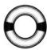

**证明.** 前几种情形很简单。设 A 是至多可数的，那么 A 要么是有限的，要么是无限可数的。如果 A 是有限的，那么显然 E 也是有限的，因此 E 是至多可数的。如果 A 是无限可数的，那么 E 是有限的或者无限的。如果 E 是有限的，那么 E 就是至多可数的。

因此证明的关键就归结为 A 是无限可数而 E 是无限集的情形。因为 A ∼ N，所以我们可以把 A 的元素依次排列成 $\{x_1, x_2, x_3, \cdots\}$。显然，这个序列中的某些元素包含在 E 中，而另一些元素则不在 E 中。我们的目标是把 A 中元素的这种排列顺序应用到 E 的元素上。我们不能直接把 A 的第一个元素映射到 E 的第一个元素，然后依次类推。因为 A 的每个元素并不一定都包含在 E 中。相反，为了给 E 中的 10 个元素排序，我们可以说，"看看 A 中属于 E 的前 10 个元素，让它们按照 A 中的顺序在 E 中排成一列。"

让我们把这个过程形式化。设 $n_1$ 是使得 $x_{n_1}$ 包含在 E 中的最小自然数。设 $n_2$ 是使得 $x_{n_2}$ 包含在 E 中且大于 $n_1$ 的最小自然数。在这个索引序列中选择了 k-1 个元素后，让下一个元素 $n_k$ 是使得 $x_{n_k}$ 包含在 E 中且大于 $n_{k-1}$ 的最小自然数。（对于任意 k ∈ N，$n_k$ 始终存在，因为 A 中元素的序列 $\{x_i\}$ 是无限的，并且这些元素中有无数多个包含在子集 E 中。）那么对于任意 $k \in \mathbb{N}$，我们有一个很好的双射 $f: \mathbb{N} \to \mathbb{N}, f: k \mapsto n_k$。

现在我们可以把 E 的元素像在 A 中那样写成一列 $E = \{x_{n_1}, x_{n_2}, x_{n_3}, \cdots\}$。

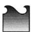

这里的记号是用来描述子序列的。在第 15 章中，我们将对子序列进行大量练习，但现在只需要试着理解它的表面意思：每个 $n_k$ 都是自然数，因此对于任意特定的 k，我们都可以令 $i = n_k$。那么对于这个 k，$x_{n_k} = x_i$，这正好是集合 A 中的一个元素。

这给了我们另一个双射

$$
g: \{n_1, n_2, n_3, \dots\} \to E, g: n_k \mapsto x_{n_k}, \forall k \in \mathbb{N}.
$$

注意

$$
(g \circ f)(k) = g(f(k)) = g(n_k) = x_{n_k},
$$

因此 $g \circ f: \mathbb{N} \mapsto E$。因为 f 和 g 都是双射，所以 $g \circ f$ 是双射（利用定理 8.4 中性质 3 的证明）。因此，$\mathbb{N} \sim E$，所以 E 是可数的。

为了证明定理的第二个命题，请注意第一个命题的逆否命题："如果 E 不是至多可数的，那么 A 也不是至多可数的。"由定义可知，"不是至多可数"的意思是不可数，所以如果 E 是不可数的，那么 A 也是不可数的。□

**推论 8.12 (R 是不可数的).** 实数集 R 是不可数的。

在第 13 章中，我们将看到这个定理的另一种证明。但现在我们只需要将定理 8.11 应用于例 8.10 即可。

**证明.** 由例 8.10 可知，开区间 (0,1) 是不可数的。但这个开区间是实数集的子集，所以根据定理 8.11，R 也是不可数的。□

我们会经常用到可数集，所以在你还记得它们的时候，了解一些关于可数集的事实是很有必要的（在接下来的几章中，那些令人惊叹的数学知识将分散你的注意力）。

**定理 8.13 (可数集的可数并).** 对于任意 $n \in \mathbb{N}$，设 $E_n$ 是可数集。如果 $S = \bigcup_{n=1}^{\infty} E_n$，那么 S 也是可数的。

**证明.** 对于任意 $n \in \mathbb{N}$，$E_n$ 都是可数的，那么可以记作 $E_n = \{x_n^1, x_n^2, x_n^3, \cdots\}$。我们还将利用以下事实，即并集中的集合可以按顺序写成一列：$E_1, E_2, E_3, \cdots$。

这些事实为我们提供了一种计数 S 元素的好方法。从第一个集合的第一个元素 $x_1^1$ 开始；然后是第一个集合的第二个元素 $x_1^2$，其后是第二个集合的第一个元素 $x_2^1$；接下来是第一个集合的第三个元素 $x_1^3$，其后是第二个集合的第二个元素 $x_2^2$ 和第三个集合的第一个元素 $x_3^1$；以此类推。

如果把 S 的元素写在网格上，其中第 n 行是 $E_n$ 中的元素，那么这种排列方式会有很好的视觉效果：

$$
\begin{array}{r c l r c l} E_1 & = & x_1^1 & x_1^2 & x_1^3 & \dots \\ E_2 & = & x_2^1 & x_2^2 & x_2^3 & \dots \\ E_3 & = & x_3^1 & x_3^2 & x_3^3 & \dots \\ \vdots \end{array}
$$

注意，这种对角线排序法与下列计数方式相同：首先，对 S 中满足 $i+j=2$ 的所有元素 $x_i^j$ 进行计数，然后对满足 $i+j=3$ 的所有元素进行计数，接下来对满足 $i+j=4$ 的所有元素进行计数，以此类推。（对于满足"$i+j$ = 某个数"的所有 $x_i^j$，我们从最小的 i 元素开始，然后是下一个 i 元素，以此类推。）

现在我们有了一个双射函数 $f: \mathbb{N} \to S$，所以 S 是可数的，对吧？

$$
\begin{array}{c c c c c c c c c c c} 1 & 2 & 3 & 4 & 5 & 6 & 7 & 8 & 9 & 10 & \ldots \\ \downarrow & \downarrow & \downarrow & \downarrow & \downarrow & \downarrow & \downarrow & \downarrow & \downarrow & \downarrow & \downarrow \\ x_1^1 & x_1^2 & x_2^1 & x_1^3 & x_2^2 & x_3^1 & x_1^4 & x_2^3 & x_3^2 & x_4^1 & \ldots \end{array}
$$

错误！如果 $x_1^2 = x_3^1$ 怎么办？此时 f 将两个不同的自然数 2 和 6 映射到了 S 的同一个元素，所以 f 不是单射。换一个思路，我们可以定义一个新的函数 g，让 g 与 f 的定义相同，但 g 会跳过 S 中所有重复的项。因此，如果存在某个大于 m 的 n，使得 $g(n) = g(m)$，那就不要为这个 n 定义 g。设 $T \subset \mathbb{N}$ 是 g 的定义域，现在我们有 $g: T \to S$，并且 g 确实是一个双射。

由定理 8.11 可知，N 的任意一个子集都是至多可数的，所以 T 是至多可数的。因为 g 是双射，所以 $S \sim T$。那么根据定理 8.7，S 也是至多可数的。由于 S 不可能是有限集（因为它是无限集 $E_i$ 的并集），所以 S 一定是可数的。□

注意，在上一个定理的证明中，我们使用了这样一个事实：集合的个数是可数的；事实上，对于可数集的不可数并，这个结果是错误的（例如，令 $S = \bigcup_{\alpha \in \mathbb{R}} \{\alpha\}$，那么 $S = \mathbb{R}$ 是不可数的）。下面的推论表明可数集的任意可数并也是可数的（这与上一个定理不同，前面的定理只说明了索引在自然数集上的并）。

**推论 8.14 (可数集的任意可数并).** 设 A 是一个至多可数的集合。对于任意 $\alpha \in A$，设 $E_\alpha$ 是一个至多可数的集合。那么 $T = \bigcup_{\alpha \in A} E_\alpha$ 也是至多可数的。

**证明.** 我们先考虑 A 是无限可数集且每一个 $E_\alpha$ 也是无限可数集的情形。那么 A 和自然数集是一一对应的（记住定义 8.3，这是 $A \sim \mathbb{N}$ 的另一种说法），所以每个 $\alpha \in A$ 都有一个 $n \in \mathbb{N}$ 与之对应。因此，我们也可以用 $\alpha$ 在 N 中的相应索引来写集合的并，于是

$$
T = \bigcup_{\alpha \in A} E_\alpha = \bigcup_{n \in \mathbb{N}} E_n = \bigcup_{n = 1}^{\infty} E_n.
$$

这使得 T 的形式与定理 8.13 中的 S 相同，所以 T 是可数的。

现在我们来考察 A 或某些 $E_\alpha$ 是有限集的情形。我们可以通过添加元素来使 $E_\alpha$ 变成无限集。对于每一个 $\alpha \in A$，如果 $E_\alpha$ 是有限的，则令 $E_\alpha^\prime = E_\alpha \cup \{1, 2, 3, \cdots\}$；如果 $E_\alpha$ 是无限的，则令 $E_\alpha^\prime = E_\alpha$。那么每个 $E_\alpha \subset E_\alpha^\prime$。为了证明每个 $E_\alpha^\prime$ 都是无限可数的，我们可以利用定理 8.13。令集合 $F_1 = E_\alpha, F_2 = \{1\}, F_3 = \{2\}, F_4 = \{3\}, \cdots$。因此 $\bigcup_{n=1}^{\infty} F_n = E_\alpha^\prime$ 是可数的。此时有：

$$
T = \bigcup_{\alpha \in A} E_\alpha \subset \bigcup_{\alpha \in A} E_\alpha^\prime,
$$

利用上一种情形的逻辑，我们有 $\bigcup_{\alpha \in A} E_\alpha^\prime = \bigcup_{n=1}^{\infty} E_n^\prime$。

因此，无论 A 是有限的还是无限可数的，T 总是包含在某个形如定理 8.13 中 S 的集合里，因此由定理 8.11 可知，T 是至多可数的。□

**定理 8.15 (可数集元组).** 设 A 是可数集，$A^n$ 是由 A 中元素构成的全体 n 元组的集合，那么 $A^n$ 是可数的。

符号 $A^n$ 的含义与 $\mathbb{R}^n$ 相同：每个元素 $\pmb{a} \in A^n$ 都可以写成 $\pmb{a} = (a_1, a_2, \cdots, a_n)$，其中 $a_i \in A$ 且 $1 \leqslant i \leqslant n$。

**证明.** 因为我们要证明的情形（即 $A^n$ 可能的维数）有无穷多种（因为 $n \in \mathbb{N}$），所以可以用归纳法来证明。把下框中的空白填充完整。

#### 用归纳法证明定理 8.15

基本情形。假设 $n = 1$。那么 $A^1$ 是可数的，因为 $A^1 = A$ 且 A 是可数的。

归纳步骤。由归纳假设可知，我们假设 $A^{n-1}$ 是可数的。$A^n$ 的每个元素都可以写成 $\pmb{a} = (a_1, a_2, \cdots, a_n)$，其中 $a_1, a_2, \cdots, a_n \in A$，或等价地写成 $\pmb{a} = (\pmb{b}, a_n)$，其中 $\pmb{b} = (a_1, a_2, \cdots, a_{n-1})$。

如果固定 b，那么我们就得到了一个双射

$$
f: A \to \{(\pmb{b}, a_n) \mid a_n \in A\}, \quad f: a_n \mapsto (\pmb{b}, a_n).
$$

因此，对于每一个 $\pmb{b} \in A^{n-1}$，我们有 $A \sim \{(\pmb{b}, a_n) \mid a_n \in A\}$。根据定理 8.7，因为 A 是可数的，所以 $\{(\pmb{b}, a_n) \mid a_n \in A\}$ 是可数的。我们可以把 $A^n$ 写成

$$
A^n = \bigcup_{\pmb{b} \in A^{n-1}} \left\{(\pmb{b}, a_n) \mid a_n \in A\right\},
$$

由归纳假设可知，$A^{n-1}$ 是可数的，所以 $A^n$ 是可数集的可数并。于是，根据推论 8.14，$A^n$ 是至多可数的。所以，A 是无限集意味着 $A^n$ 是无限可数的。

**定理 8.16 (Q 是可数的).** 有理数集是可数集。

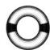

**证明.** 因为每个有理数都可以写成 $\frac{a}{b}$，其中 $a, b \in \mathbb{Z}$，所以我们可以得到一个满射函数 f

$$
f: \mathbb{Z} \times \mathbb{N} \to \mathbb{Q}, f: (a, b) \mapsto \frac{a}{b}.
$$

这里 $\mathbb{Z} \times \mathbb{N}$ 是形如 $(a \in \mathbb{Z}, b \in \mathbb{N})$ 的二元数组集。（与使用更简单的 $\mathbb{Z}^2$ 不同，我们这样做是为了避免出现 $b = 0$ 这种无效的分数。）

但是，在这种情况下，f 不是一对一的，例如，$(1,2) \in \mathbb{Z} \times \mathbb{N}$ 和 $(3,6) \in \mathbb{Z} \times \mathbb{N}$ 映射到了同一个有理数。

如何解决这个问题呢？就像定理 8.11 的证明那样，我们定义 f 的"双射形式"g，它将作用于 $\mathbb{Z} \times \mathbb{N}$ 的子集。为了使重复的分数唯一，我们将使用 gcd 函数，即最大公约数函数。令

$$
Z_n = \{k \in \mathbb{Z} \mid \operatorname{gcd}(k, n) = 1\}.
$$

那么 $Z_1 = \{1\}$，$Z_2$ 是全体奇数的集合，$Z_3$ 是所有不能被 3 整除的整数的集合，以此类推。

令 $T_n = \{ (z, n) \in \mathbb{Z} \times \mathbb{N} \mid z \in Z_n \}$。换句话说，$T_n$ 是所有不能被 n 整除的整数与 n 组成的数对的集合。如果令 $T = \bigcup_{n \in \mathbb{N}} T_n$，那么 T 就是彼此不能整除的整数对或自然数对的集合。因此，函数

$$
g: T \to \mathbb{Q}, (z, n) \mapsto \frac{z}{n}
$$

是一个双射。为什么？因为每个分数都可以写成 $\frac{z}{n}$，所以 g 是一个满射；由于每个这样的分数都是唯一的（因为 z 不能被 n 整除），所以 g 是一个单射。

由例 8.8 可知 Z 是可数的，那么根据定理 8.15，$\mathbb{Z}^2$ 也是可数的；利用定理 8.11，$\mathbb{Z}^2$ 的任意一个子集都是可数的。T 是 $\mathbb{Z} \times \mathbb{N}$ 的子集，而 $\mathbb{Z} \times \mathbb{N}$ 又是 $\mathbb{Z}^2$ 的子集，所以我们得到的是从 $\mathbb{Z}^2$ 的可数子集到 Q 的双射。因此 Q 是可数的。

**推论 8.17 (无理数集是不可数的).** 无理数集是不可数集。

**证明.** 设 I 是全体无理数的集合，那么 $\mathbb{R} = \mathbb{Q} \cup I$。我们利用反证法做一个简短的证明。

由定理 8.16 可知，Q 是可数的。如果 I 是至多可数的，那么 $\mathbb{R} = \mathbb{Q} \cup I$ 就是两个至多可数集合的有限并，于是根据推论 8.14，R 是可数的。

但是由推论 8.12 可知，R 不是可数的，这样就得到了一个矛盾。因此，I 不是至多可数的，所以无理数集一定是不可数的。□

由于可数性的相关概念比较抽象，所以这一章并不是非常直观，我觉得你可能需要一张图。

图 8.1 是一个很好的例子，它说明了在技术上"至多可数"的集合名称可能具有欺骗性；试着数出 S 中的所有点。

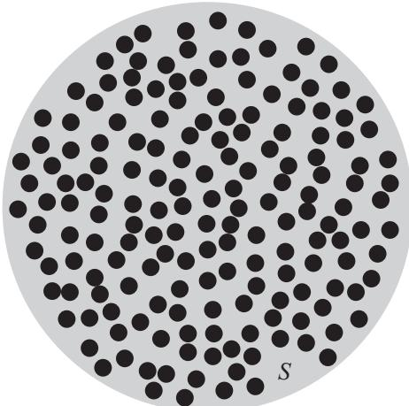

图 8.1 集合 S 是有限的，从而是至多可数的。

再想一想，你为什么不去做点有意义的事呢？

接下来，我们将进入拓扑学领域。从度量空间开始，然后继续介绍大量其他定义。在接下来的几章中，我们将看到这些定义可以帮助我们进一步了解集合是否可数。