# 第 10 级：实数系与极限 (Real Number System and Limits)

> 微积分的逻辑基础建立在对实数系的深刻理解之上。本章将从数系的扩张开始，系统地建立极限理论，为后续的微积分学习打下坚实的基础。

---

## 1. 学习目标

完成本教程后，你应当能够：

1. 理解数系的扩张过程：$\mathbb{N} \subset \mathbb{Z} \subset \mathbb{Q} \subset \mathbb{R}$
2. 掌握实数的完备性公理（确界原理）和 Archimedes 性质
3. 熟练运用 $\varepsilon$-$N$ 语言定义数列极限并证明极限
4. 理解并证明极限的基本性质：唯一性、有界性、四则运算法则
5. 掌握夹逼定理和单调有界定理及其应用
6. 理解柯西收敛准则（Cauchy Criterion）及其意义
7. 熟悉 $\varepsilon$-$\delta$ 语言定义函数极限
8. 掌握无穷小与无穷大的概念及其阶的比较
9. 能够运用极限理论解决实际问题

---

## 2. 实数系

### 2.1 数系的扩张

数学分析的研究对象是实数。我们从自然数开始，逐步扩张数系：

| 数系 | 符号 | 定义 | 举例 |
|:---:|:---:|------|------|
| 自然数 | $\mathbb{N}$ | $\{1, 2, 3, \dots\}$ | $1, 2, 100$ |
| 整数 | $\mathbb{Z}$ | $\{\dots, -2, -1, 0, 1, 2, \dots\}$ | $-3, 0, 42$ |
| 有理数 | $\mathbb{Q}$ | $\{\frac{p}{q} \mid p \in \mathbb{Z}, q \in \mathbb{Z}\setminus\{0\}\}$ | $\frac{1}{2}, -\frac{3}{4}, 0.333\ldots$ |
| 实数 | $\mathbb{R}$ | 有理数与无理数的全体 | $\sqrt{2}, \pi, e$ |
| 复数 | $\mathbb{C}$ | $\{a+bi \mid a,b \in \mathbb{R}\}$ | $1+i, 2-3i$ |

它们之间的包含关系是：

$$
\mathbb{N} \subset \mathbb{Z} \subset \mathbb{Q} \subset \mathbb{R} \subset \mathbb{C}
$$

### 2.2 自然数 $\mathbb{N}$ 与整数 $\mathbb{Z}$

**自然数** $\mathbb{N}$ 是最基本的数系，满足 Peano 公理：
- 存在一个自然数 $1$（或 $0$，视定义而定）
- 每个自然数都有唯一的后继
- 数学归纳法原理成立

**整数** $\mathbb{Z}$ 在自然数的基础上引入了 $0$ 和负数的概念，使得减法运算封闭。也就是说，任意两个整数的差仍然是整数。

### 2.3 有理数 $\mathbb{Q}$

有理数是形如 $\frac{p}{q}$（$p, q \in \mathbb{Z}$，$q \neq 0$）的数的全体。有理数对加、减、乘、除（除数不为零）四种运算封闭，构成了一个**数域**。

有理数的一个重要特征是：**有理数可以表示为有限小数或无限循环小数**。

然而，有理数对极限运算不封闭。例如，考虑数列：

$$
a_1 = 1,\quad a_2 = 1.4,\quad a_3 = 1.41,\quad a_4 = 1.414,\quad a_5 = 1.4142,\quad \dots
$$

这个数列的每一项都是有理数，但它趋近于 $\sqrt{2}$，而 $\sqrt{2}$ 不是有理数。这说明有理数存在"空隙"。

### 2.4 无理数的发现

古希腊的毕达哥拉斯学派认为"万物皆数"，即一切量都可以用有理数表示。但该学派的 Hippasus 发现，边长为 $1$ 的正方形的对角线长度 $\sqrt{2}$ 无法表示为两个整数的比。

**证明 $\sqrt{2}$ 是无理数**（反证法）：

假设 $\sqrt{2} = \frac{p}{q}$，其中 $p, q$ 是互质的正整数。则 $2 = \frac{p^2}{q^2}$，即 $p^2 = 2q^2$。因此 $p^2$ 是偶数，$p$ 也是偶数。设 $p = 2k$，代入得 $4k^2 = 2q^2$，即 $q^2 = 2k^2$，所以 $q$ 也是偶数。这与 $p, q$ 互质矛盾。因此 $\sqrt{2}$ 不是有理数。

### 2.5 实数 $\mathbb{R}$

**定义**：实数是有理数和无理数的全体。实数与数轴上的点一一对应。

实数有两种等价的构造方式：

1. **Dedekind 分割**：实数是有理数集的一个分割（Dedekind cut）
2. **Cauchy 序列**：实数是所有有理数 Cauchy 序列的等价类

### 2.6 实数的完备性（Completeness）

这是实数区别于有理数的最根本性质。

**确界原理**（Supremum Principle, 完备性公理）：

> 非空有上界的实数集必有上确界（最小上界）。

等价地：
> 非空有下界的实数集必有下确界（最大下界）。

**定义**（上确界）：设 $S \subset \mathbb{R}$ 非空，$\alpha \in \mathbb{R}$ 称为 $S$ 的**上确界**（记作 $\sup S$），如果：
1. $\forall x \in S,\; x \le \alpha$（$\alpha$ 是上界）
2. $\forall \varepsilon > 0,\; \exists x \in S,\; x > \alpha - \varepsilon$（$\alpha$ 是最小的上界）

**定义**（下确界）：设 $S \subset \mathbb{R}$ 非空，$\beta \in \mathbb{R}$ 称为 $S$ 的**下确界**（记作 $\inf S$），如果：
1. $\forall x \in S,\; x \ge \beta$（$\beta$ 是下界）
2. $\forall \varepsilon > 0,\; \exists x \in S,\; x < \beta + \varepsilon$（$\beta$ 是最大的下界）

**例**：设 $S = \{1 - \frac{1}{n} \mid n \in \mathbb{N}\}$，则 $\sup S = 1$，$\inf S = 0$。

### 2.7 Archimedes 性质

**Archimedes 性质**：对任意正实数 $a, b$，总存在自然数 $n$，使得 $na > b$。

等价地：
- 对任意 $\varepsilon > 0$，存在自然数 $n$，使得 $\frac{1}{n} < \varepsilon$
- 对任意实数 $M$，存在自然数 $n$，使得 $n > M$

**证明**（由确界原理导出）：

假设结论不成立，即存在 $a > 0, b > 0$，对任意 $n \in \mathbb{N}$ 都有 $na \le b$。则集合 $A = \{na \mid n \in \mathbb{N}\}$ 有上界 $b$。由确界原理，$A$ 有上确界 $\alpha = \sup A$。

由于 $\alpha - a < \alpha$（$a > 0$），$\alpha - a$ 不是 $A$ 的上界，因此存在 $m \in \mathbb{N}$ 使得 $ma > \alpha - a$，即 $(m+1)a > \alpha$。但 $(m+1)a \in A$，这与 $\alpha$ 是上界矛盾。故假设不成立。

---

## 3. 数列极限

### 3.1 数列的概念

**定义**：数列是以自然数集为定义域的函数 $a: \mathbb{N} \to \mathbb{R}$，记作 $\{a_n\}_{n=1}^{\infty}$ 或简写为 $\{a_n\}$。

数列的项按顺序排列：$a_1, a_2, a_3, \dots, a_n, \dots$

### 3.2 极限的 $\varepsilon$-$N$ 定义

**定义**：设 $\{a_n\}$ 是一个数列，$A$ 是一个常数。如果对任意给定的 $\varepsilon > 0$，总存在正整数 $N$，使得当 $n > N$ 时，有

$$
|a_n - A| < \varepsilon
$$

则称数列 $\{a_n\}$ **收敛**于 $A$，$A$ 称为数列的极限，记作

$$
\lim_{n \to \infty} a_n = A
$$

或 $a_n \to A$（$n \to \infty$）。如果不存在这样的 $A$，则称数列**发散**。

**直观理解**：无论我们要求 $a_n$ 与 $A$ 多近（$\varepsilon$ 任意小），总存在一个时刻 $N$ 之后，所有项都在这个范围内。

### 3.3 收敛数列的例子

**例 1**：$\lim_{n \to \infty} \frac{1}{n} = 0$

**证明**：对任意 $\varepsilon > 0$，由 Archimedes 性质，存在 $N \in \mathbb{N}$，使得 $N > \frac{1}{\varepsilon}$。当 $n > N$ 时，

$$
\left|\frac{1}{n} - 0\right| = \frac{1}{n} < \frac{1}{N} < \varepsilon
$$

因此 $\lim_{n \to \infty} \frac{1}{n} = 0$。

**例 2**：$\lim_{n \to \infty} \frac{n}{n+1} = 1$

**证明**：对任意 $\varepsilon > 0$，需要 $\left|\frac{n}{n+1} - 1\right| = \frac{1}{n+1} < \varepsilon$。

取 $N = \lceil \frac{1}{\varepsilon} \rceil$，当 $n > N$ 时，$\frac{1}{n+1} < \frac{1}{n} \le \frac{1}{N} < \varepsilon$。$\square$

### 3.4 发散数列的例子

**例 3**：$\{(-1)^n\}$ 发散

**证明**（反证法）：假设 $\lim_{n \to \infty} (-1)^n = A$。取 $\varepsilon = \frac{1}{2}$，则存在 $N$，当 $n > N$ 时 $|(-1)^n - A| < \frac{1}{2}$。

取两个足够大的奇数 $m$ 和偶数 $k$，则 $|(-1)^m - A| = | -1 - A| < \frac{1}{2}$，$|(-1)^k - A| = |1 - A| < \frac{1}{2}$。

由三角不等式：

$$
2 = |1 - (-1)| \le |1 - A| + |A - (-1)| < \frac{1}{2} + \frac{1}{2} = 1
$$

矛盾。故数列发散。$\square$

---

## 4. 定理与证明

### 4.1 极限的唯一性

**定理**：收敛数列的极限是唯一的。

**证明**（反证法）：

假设 $\lim_{n \to \infty} a_n = A$ 且 $\lim_{n \to \infty} a_n = B$，且 $A \neq B$。

取 $\varepsilon = \frac{|A - B|}{2} > 0$。

由极限定义：
- 存在 $N_1$，当 $n > N_1$ 时，$|a_n - A| < \varepsilon$
- 存在 $N_2$，当 $n > N_2$ 时，$|a_n - B| < \varepsilon$

取 $N = \max\{N_1, N_2\}$，当 $n > N$ 时，由三角不等式：

$$
|A - B| \le |A - a_n| + |a_n - B| < \varepsilon + \varepsilon = 2\varepsilon = |A - B|
$$

得到 $|A - B| < |A - B|$，矛盾。故 $A = B$。$\square$

### 4.2 收敛数列的有界性

**定理**：如果数列 $\{a_n\}$ 收敛，则 $\{a_n\}$ 有界。即存在 $M > 0$，使得对一切 $n$，$|a_n| \le M$。

**证明**：

设 $\lim_{n \to \infty} a_n = A$。取 $\varepsilon = 1$，则存在 $N$，当 $n > N$ 时，$|a_n - A| < 1$。

由三角不等式，当 $n > N$ 时：

$$
|a_n| = |a_n - A + A| \le |a_n - A| + |A| < 1 + |A|
$$

令 $M = \max\{|a_1|, |a_2|, \dots, |a_N|, 1 + |A|\}$，则对一切 $n$，$|a_n| \le M$。$\square$

**注**：该定理的逆命题不成立。有界数列不一定收敛，如 $\{(-1)^n\}$ 有界但不收敛。

### 4.3 极限的四则运算法则

**定理**：设 $\lim_{n \to \infty} a_n = A$，$\lim_{n \to \infty} b_n = B$，则：

1. **加法**：$\lim_{n \to \infty} (a_n + b_n) = A + B$
2. **减法**：$\lim_{n \to \infty} (a_n - b_n) = A - B$
3. **乘法**：$\lim_{n \to \infty} (a_n \cdot b_n) = A \cdot B$
4. **除法**：若 $B \neq 0$，则 $\lim_{n \to \infty} \frac{a_n}{b_n} = \frac{A}{B}$

**证明**：

**(1) 加法**：对任意 $\varepsilon > 0$，存在 $N_1, N_2$ 使得：
- 当 $n > N_1$ 时，$|a_n - A| < \frac{\varepsilon}{2}$
- 当 $n > N_2$ 时，$|b_n - B| < \frac{\varepsilon}{2}$

取 $N = \max\{N_1, N_2\}$，当 $n > N$ 时：

$$
|(a_n + b_n) - (A + B)| \le |a_n - A| + |b_n - B| < \frac{\varepsilon}{2} + \frac{\varepsilon}{2} = \varepsilon
$$

**(3) 乘法**：先证明 $\{b_n\}$ 有界，即存在 $M > 0$，$|b_n| \le M$ 对一切 $n$ 成立。

对任意 $\varepsilon > 0$：
- 存在 $N_1$，当 $n > N_1$ 时，$|a_n - A| < \frac{\varepsilon}{2M}$
- 存在 $N_2$，当 $n > N_2$ 时，$|b_n - B| < \frac{\varepsilon}{2(|A| + 1)}$

取 $N = \max\{N_1, N_2\}$，当 $n > N$ 时：

$$
\begin{aligned}
|a_n b_n - AB| &= |a_n b_n - a_n B + a_n B - AB| \\
&\le |a_n|\cdot|b_n - B| + |B|\cdot|a_n - A| \\
&\le (|A| + 1)\cdot\frac{\varepsilon}{2(|A| + 1)} + M\cdot\frac{\varepsilon}{2M} = \varepsilon
\end{aligned}
$$

**(4) 除法**：只需证明 $\lim_{n \to \infty} \frac{1}{b_n} = \frac{1}{B}$，然后与乘法结合。

由于 $B \neq 0$，取 $\varepsilon = \frac{|B|}{2}$，存在 $N_1$，当 $n > N_1$ 时，$|b_n - B| < \frac{|B|}{2}$，从而 $|b_n| > \frac{|B|}{2}$。

对任意 $\varepsilon > 0$，存在 $N_2$，当 $n > N_2$ 时，$|b_n - B| < \frac{B^2}{2}\varepsilon$。

取 $N = \max\{N_1, N_2\}$，当 $n > N$ 时：

$$
\left|\frac{1}{b_n} - \frac{1}{B}\right| = \frac{|b_n - B|}{|b_n|\cdot|B|} < \frac{|b_n - B|}{\frac{|B|}{2} \cdot |B|} = \frac{2|b_n - B|}{B^2} < \varepsilon
$$

$\square$

### 4.4 夹逼定理（Squeeze Theorem）

**定理**：设三个数列 $\{a_n\}$、$\{b_n\}$、$\{c_n\}$ 满足：
1. 存在 $N_0$，当 $n > N_0$ 时，$a_n \le b_n \le c_n$
2. $\lim_{n \to \infty} a_n = \lim_{n \to \infty} c_n = L$

则 $\lim_{n \to \infty} b_n = L$。

**证明**：

对任意 $\varepsilon > 0$：
- 存在 $N_1$，当 $n > N_1$ 时，$|a_n - L| < \varepsilon$，即 $L - \varepsilon < a_n < L + \varepsilon$
- 存在 $N_2$，当 $n > N_2$ 时，$|c_n - L| < \varepsilon$，即 $L - \varepsilon < c_n < L + \varepsilon$

取 $N = \max\{N_0, N_1, N_2\}$，当 $n > N$ 时：

$$
L - \varepsilon < a_n \le b_n \le c_n < L + \varepsilon
$$

即 $|b_n - L| < \varepsilon$。$\square$

**例 4**：求 $\lim_{n \to \infty} \frac{\sin n}{n}$。

**解**：由于 $-1 \le \sin n \le 1$，有 $-\frac{1}{n} \le \frac{\sin n}{n} \le \frac{1}{n}$。

而 $\lim_{n \to \infty} \left(-\frac{1}{n}\right) = \lim_{n \to \infty} \frac{1}{n} = 0$。

由夹逼定理，$\lim_{n \to \infty} \frac{\sin n}{n} = 0$。

### 4.5 单调有界定理（Monotone Convergence Theorem）

**定理**：单调有界数列必收敛。

具体地：
- 若 $\{a_n\}$ 单调递增且有上界，则 $\{a_n\}$ 收敛，且 $\lim_{n \to \infty} a_n = \sup\{a_n\}$
- 若 $\{a_n\}$ 单调递减且有下界，则 $\{a_n\}$ 收敛，且 $\lim_{n \to \infty} a_n = \inf\{a_n\}$

**证明**（仅证递增有上界的情况）：

设 $\{a_n\}$ 单调递增且有上界。令 $S = \{a_n \mid n \in \mathbb{N}\}$，则 $S$ 非空有上界。由确界原理，$S$ 有上确界 $\alpha = \sup S$。

下面证明 $\lim_{n \to \infty} a_n = \alpha$。

对任意 $\varepsilon > 0$，由 $\alpha - \varepsilon < \alpha$ 及上确界的定义，存在 $N$，使得 $a_N > \alpha - \varepsilon$。

由于 $\{a_n\}$ 单调递增，当 $n > N$ 时，$a_n \ge a_N > \alpha - \varepsilon$。

又因为 $\alpha$ 是上界，$a_n \le \alpha$，所以 $|a_n - \alpha| = \alpha - a_n < \varepsilon$。

故 $\lim_{n \to \infty} a_n = \alpha$。$\square$

**例 5**：证明数列 $a_n = \left(1 + \frac{1}{n}\right)^n$ 收敛。

**证明思路**：可以证明 $\{a_n\}$ 单调递增且有上界（上界为 $3$），因此由单调有界定理，数列收敛。其极限定义为 $e$。

### 4.6 柯西收敛准则（Cauchy Criterion）

**定义**（Cauchy 序列）：数列 $\{a_n\}$ 称为 Cauchy 序列，如果对任意 $\varepsilon > 0$，存在正整数 $N$，使得对任意 $m, n > N$，有

$$
|a_m - a_n| < \varepsilon
$$

**柯西收敛准则**：数列 $\{a_n\}$ 收敛当且仅当它是 Cauchy 序列。

**证明概要**：

**必要性**：若 $\lim_{n \to \infty} a_n = A$，则对任意 $\varepsilon > 0$，存在 $N$，当 $n > N$ 时 $|a_n - A| < \frac{\varepsilon}{2}$。当 $m, n > N$ 时，

$$
|a_m - a_n| \le |a_m - A| + |A - a_n| < \frac{\varepsilon}{2} + \frac{\varepsilon}{2} = \varepsilon
$$

**充分性**：若 $\{a_n\}$ 是 Cauchy 序列，则先证明 $\{a_n\}$ 有界，然后利用 Bolzano-Weierstrass 定理（有界数列必有收敛子列）和 Cauchy 条件推出原数列收敛到同一极限。

**意义**：柯西收敛准则给出了数列收敛的充要条件，且不需要预先知道极限值。这在理论上极为重要。

### 4.7 重要极限：$\lim_{n \to \infty} \left(1 + \frac{1}{n}\right)^n = e$

**证明思路**：

定义 $a_n = \left(1 + \frac{1}{n}\right)^n$，$b_n = \left(1 + \frac{1}{n}\right)^{n+1}$。

**Step 1**：证明 $\{a_n\}$ 单调递增。

利用二项式定理展开：

$$
\begin{aligned}
a_n &= \left(1 + \frac{1}{n}\right)^n \\
&= \sum_{k=0}^n \binom{n}{k} \frac{1}{n^k} \\
&= \sum_{k=0}^n \frac{1}{k!} \cdot \frac{n(n-1)\cdots(n-k+1)}{n^k} \\
&= \sum_{k=0}^n \frac{1}{k!} \left(1 - \frac{1}{n}\right)\left(1 - \frac{2}{n}\right)\cdots\left(1 - \frac{k-1}{n}\right)
\end{aligned}
$$

类似地，

$$
a_{n+1} = \sum_{k=0}^{n+1} \frac{1}{k!} \left(1 - \frac{1}{n+1}\right)\left(1 - \frac{2}{n+1}\right)\cdots\left(1 - \frac{k-1}{n+1}\right)
$$

比较 $a_n$ 和 $a_{n+1}$ 的对应项，$a_{n+1}$ 的每一项都大于等于 $a_n$ 的对应项，且 $a_{n+1}$ 还多了一个正项。因此 $a_{n+1} > a_n$。

**Step 2**：证明 $\{a_n\}$ 有上界。

$$
\begin{aligned}
a_n &= \sum_{k=0}^n \frac{1}{k!} \left(1 - \frac{1}{n}\right)\cdots\left(1 - \frac{k-1}{n}\right) \\
&\le \sum_{k=0}^n \frac{1}{k!} \\
&< 1 + 1 + \frac{1}{2} + \frac{1}{2^2} + \cdots + \frac{1}{2^{n-1}} \\
&= 1 + \frac{1 - (1/2)^n}{1 - 1/2} = 3 - \frac{1}{2^{n-1}} < 3
\end{aligned}
$$

**Step 3**：由单调有界定理，$\{a_n\}$ 收敛，定义其极限为 $e$。

数值计算：$e \approx 2.718281828459045\ldots$

---

## 5. 函数极限

### 5.1 $\varepsilon$-$\delta$ 定义

**定义**：设函数 $f$ 在点 $x_0$ 的某个去心邻域内有定义，$A$ 是一个常数。如果对任意 $\varepsilon > 0$，总存在 $\delta > 0$，使得当 $0 < |x - x_0| < \delta$ 时，有

$$
|f(x) - A| < \varepsilon
$$

则称 $f(x)$ 当 $x \to x_0$ 时以 $A$ 为极限，记作

$$
\lim_{x \to x_0} f(x) = A
$$

**直观理解**：当 $x$ 无限接近 $x_0$（但不等于 $x_0$）时，$f(x)$ 无限接近 $A$。

### 5.2 单侧极限

**左极限**：如果对任意 $\varepsilon > 0$，存在 $\delta > 0$，使得当 $x_0 - \delta < x < x_0$ 时，$|f(x) - A| < \varepsilon$，则记作 $\lim_{x \to x_0^-} f(x) = A$。

**右极限**：如果对任意 $\varepsilon > 0$，存在 $\delta > 0$，使得当 $x_0 < x < x_0 + \delta$ 时，$|f(x) - A| < \varepsilon$，则记作 $\lim_{x \to x_0^+} f(x) = A$。

**定理**：$\lim_{x \to x_0} f(x) = A$ 当且仅当 $\lim_{x \to x_0^-} f(x) = \lim_{x \to x_0^+} f(x) = A$。

### 5.3 极限的 Heine 归并原理

**定理**（Heine 定理）：$\lim_{x \to x_0} f(x) = A$ 当且仅当对任意满足 $x_n \to x_0$ 且 $x_n \neq x_0$ 的数列 $\{x_n\}$，都有 $\lim_{n \to \infty} f(x_n) = A$。

这个定理建立了函数极限与数列极限的联系，是证明函数极限性质的重要工具。

### 5.4 极限 $x \to \infty$ 的情形

**定义**：设函数 $f$ 在区间 $(a, +\infty)$ 上有定义。如果对任意 $\varepsilon > 0$，存在 $X > 0$，使得当 $x > X$ 时，有

$$
|f(x) - A| < \varepsilon
$$

则称 $\lim_{x \to +\infty} f(x) = A$。

类似地定义 $\lim_{x \to -\infty} f(x) = A$ 和 $\lim_{x \to \infty} f(x) = A$（其中 $x \to \infty$ 表示 $|x| \to \infty$）。

### 5.5 函数极限的性质

函数极限也有与数列极限类似的性质：

1. **唯一性**：若极限存在，则唯一
2. **局部有界性**：若 $\lim_{x \to x_0} f(x) = A$，则存在 $\delta > 0$ 和 $M > 0$，使得 $0 < |x - x_0| < \delta$ 时 $|f(x)| \le M$
3. **四则运算法则**：与数列极限相同
4. **夹逼定理**：与数列极限类似

---

## 6. 无穷小与无穷大

### 6.1 无穷小

**定义**：如果 $\lim_{x \to x_0} f(x) = 0$，则称 $f(x)$ 是 $x \to x_0$ 时的**无穷小**。

**性质**：
1. 有限个无穷小的和仍是无穷小
2. 有界函数与无穷小的乘积是无穷小
3. 常数与无穷小的乘积是无穷小
4. 有限个无穷小的乘积是无穷小

### 6.2 无穷大

**定义**：如果对任意 $M > 0$，存在 $\delta > 0$，使得当 $0 < |x - x_0| < \delta$ 时，$|f(x)| > M$，则称 $f(x)$ 是 $x \to x_0$ 时的**无穷大**，记作 $\lim_{x \to x_0} f(x) = \infty$。

类似地定义正无穷大 $+\infty$ 和负无穷大 $-\infty$。

**定理**：在自变量的同一变化过程中：
- 若 $f(x)$ 是无穷大，则 $\frac{1}{f(x)}$ 是无穷小
- 若 $f(x)$ 是无穷小（且 $f(x) \neq 0$），则 $\frac{1}{f(x)}$ 是无穷大

### 6.3 无穷小的阶的比较

设 $\alpha(x)$ 和 $\beta(x)$ 是 $x \to x_0$ 时的无穷小，且 $\beta(x) \neq 0$。

1. 若 $\lim_{x \to x_0} \frac{\alpha(x)}{\beta(x)} = 0$，则称 $\alpha$ 是比 $\beta$ **高阶的无穷小**，记作 $\alpha = o(\beta)$
2. 若 $\lim_{x \to x_0} \frac{\alpha(x)}{\beta(x)} = C \neq 0$，则称 $\alpha$ 与 $\beta$ **同阶无穷小**
3. 若 $\lim_{x \to x_0} \frac{\alpha(x)}{\beta(x)} = 1$，则称 $\alpha$ 与 $\beta$ **等价无穷小**，记作 $\alpha \sim \beta$
4. 若存在 $k > 0$ 使得 $\lim_{x \to x_0} \frac{\alpha(x)}{[\beta(x)]^k} = C \neq 0$，则称 $\alpha$ 是 $\beta$ 的 $k$ **阶无穷小**

**常用等价无穷小**（$x \to 0$ 时）：

| 等价关系 | 条件 |
|:---------|:-----|
| $\sin x \sim x$ | $x \to 0$ |
| $\tan x \sim x$ | $x \to 0$ |
| $\arcsin x \sim x$ | $x \to 0$ |
| $\arctan x \sim x$ | $x \to 0$ |
| $\ln(1 + x) \sim x$ | $x \to 0$ |
| $e^x - 1 \sim x$ | $x \to 0$ |
| $1 - \cos x \sim \frac{1}{2}x^2$ | $x \to 0$ |
| $(1 + x)^\alpha - 1 \sim \alpha x$ | $x \to 0$ |

---

## 7. 示例（Worked Examples）

### 示例 1：用 $\varepsilon$-$N$ 定义证明极限

证明 $\lim_{n \to \infty} \frac{2n + 1}{3n - 2} = \frac{2}{3}$。

**解**：对任意 $\varepsilon > 0$，

$$
\left|\frac{2n + 1}{3n - 2} - \frac{2}{3}\right| = \left|\frac{3(2n+1) - 2(3n-2)}{3(3n-2)}\right| = \left|\frac{6n + 3 - 6n + 4}{3(3n-2)}\right| = \frac{7}{3|3n-2|}
$$

当 $n \ge 1$ 时，$3n - 2 \ge 1$，所以 $\frac{7}{3|3n-2|} \le \frac{7}{3(3n-2)}$。

要求 $\frac{7}{3(3n-2)} < \varepsilon$，即 $n > \frac{1}{3}\left(\frac{7}{3\varepsilon} + 2\right)$。

取 $N = \max\left\{1, \left\lceil \frac{1}{3}\left(\frac{7}{3\varepsilon} + 2\right) \right\rceil \right\}$，当 $n > N$ 时，$|a_n - \frac{2}{3}| < \varepsilon$。$\square$

### 示例 2：用夹逼定理求极限

求 $\lim_{n \to \infty} \frac{n!}{n^n}$。

**解**：由于

$$
0 \le \frac{n!}{n^n} = \frac{1 \cdot 2 \cdot 3 \cdots n}{n \cdot n \cdot n \cdots n} = \frac{1}{n} \cdot \frac{2}{n} \cdot \frac{3}{n} \cdots \frac{n}{n} \le \frac{1}{n} \cdot 1 \cdot 1 \cdots 1 = \frac{1}{n}
$$

而 $\lim_{n \to \infty} 0 = 0$，$\lim_{n \to \infty} \frac{1}{n} = 0$。

由夹逼定理，$\lim_{n \to \infty} \frac{n!}{n^n} = 0$。

### 示例 3：用单调有界定理证明数列收敛

设 $a_1 = \sqrt{2}$，$a_{n+1} = \sqrt{2 + a_n}$。证明 $\{a_n\}$ 收敛并求极限。

**解**：

**Step 1**：证明 $\{a_n\}$ 单调递增且有上界。

用数学归纳法证明 $a_n < 2$ 对一切 $n$ 成立：
- $n = 1$：$a_1 = \sqrt{2} < 2$，成立
- 假设 $a_k < 2$，则 $a_{k+1} = \sqrt{2 + a_k} < \sqrt{2 + 2} = 2$，成立

同时，$a_{n+1} - a_n = \sqrt{2 + a_n} - a_n$。由于 $a_n < 2$，可证 $a_{n+1} > a_n$（可用归纳法）。

**Step 2**：由单调有界定理，$\{a_n\}$ 收敛。设 $\lim_{n \to \infty} a_n = L$。

对递推式两边取极限：

$$
L = \sqrt{2 + L} \implies L^2 = 2 + L \implies L^2 - L - 2 = 0 \implies (L - 2)(L + 1) = 0
$$

由于 $a_n > 0$，$L \ge 0$，故 $L = 2$。

因此 $\lim_{n \to \infty} a_n = 2$。

### 示例 4：利用重要极限

求 $\lim_{n \to \infty} \left(1 + \frac{1}{2n}\right)^n$。

**解**：

$$
\left(1 + \frac{1}{2n}\right)^n = \left[\left(1 + \frac{1}{2n}\right)^{2n}\right]^{1/2}
$$

令 $m = 2n$，当 $n \to \infty$ 时 $m \to \infty$，所以

$$
\lim_{n \to \infty} \left(1 + \frac{1}{2n}\right)^n = \lim_{m \to \infty} \left[\left(1 + \frac{1}{m}\right)^m\right]^{1/2} = e^{1/2} = \sqrt{e}
$$

### 示例 5：函数极限的 $\varepsilon$-$\delta$ 证明

用 $\varepsilon$-$\delta$ 语言证明 $\lim_{x \to 2} (3x - 1) = 5$。

**解**：对任意 $\varepsilon > 0$，需要找到 $\delta > 0$，使得当 $0 < |x - 2| < \delta$ 时，$|(3x - 1) - 5| < \varepsilon$。

计算：

$$
|(3x - 1) - 5| = |3x - 6| = 3|x - 2|
$$

要使 $3|x - 2| < \varepsilon$，只需 $|x - 2| < \frac{\varepsilon}{3}$。

取 $\delta = \frac{\varepsilon}{3}$，则当 $0 < |x - 2| < \delta$ 时，$|(3x - 1) - 5| = 3|x - 2| < 3\delta = \varepsilon$。$\square$

### 示例 6：单侧极限

讨论函数 $f(x) = \frac{|x|}{x}$ 在 $x = 0$ 处的极限。

**解**：

当 $x > 0$ 时，$f(x) = \frac{x}{x} = 1$，所以 $\lim_{x \to 0^+} f(x) = 1$。

当 $x < 0$ 时，$f(x) = \frac{-x}{x} = -1$，所以 $\lim_{x \to 0^-} f(x) = -1$。

由于左右极限不相等，$\lim_{x \to 0} f(x)$ 不存在。

### 示例 7：无穷小的阶的比较

确定当 $x \to 0$ 时，$f(x) = \sqrt{1 + x} - 1$ 的阶。

**解**：

$$
\lim_{x \to 0} \frac{\sqrt{1 + x} - 1}{x} = \lim_{x \to 0} \frac{(\sqrt{1 + x} - 1)(\sqrt{1 + x} + 1)}{x(\sqrt{1 + x} + 1)} = \lim_{x \to 0} \frac{x}{x(\sqrt{1 + x} + 1)} = \lim_{x \to 0} \frac{1}{\sqrt{1 + x} + 1} = \frac{1}{2}
$$

因此 $\sqrt{1 + x} - 1 \sim \frac{1}{2}x$，即 $f(x)$ 是 $x$ 的一阶无穷小。

### 示例 8：利用等价无穷小求极限

求 $\lim_{x \to 0} \frac{\sin 3x}{\tan 5x}$。

**解**：当 $x \to 0$ 时，$\sin 3x \sim 3x$，$\tan 5x \sim 5x$。

因此

$$
\lim_{x \to 0} \frac{\sin 3x}{\tan 5x} = \lim_{x \to 0} \frac{3x}{5x} = \frac{3}{5}
$$

**注意**：等价无穷小替换只能在乘除法中使用，不能在加减法中使用。

### 示例 9：Cauchy 序列的判定

证明数列 $a_n = \frac{1}{1^2} + \frac{1}{2^2} + \cdots + \frac{1}{n^2}$ 是 Cauchy 序列。

**证明**：对 $m > n$，

$$
|a_m - a_n| = \frac{1}{(n+1)^2} + \frac{1}{(n+2)^2} + \cdots + \frac{1}{m^2}
$$

利用不等式 $\frac{1}{k^2} < \frac{1}{k(k-1)} = \frac{1}{k-1} - \frac{1}{k}$（$k \ge 2$）：

$$
|a_m - a_n| < \left(\frac{1}{n} - \frac{1}{n+1}\right) + \left(\frac{1}{n+1} - \frac{1}{n+2}\right) + \cdots + \left(\frac{1}{m-1} - \frac{1}{m}\right) = \frac{1}{n} - \frac{1}{m} < \frac{1}{n}
$$

对任意 $\varepsilon > 0$，取 $N = \lceil \frac{1}{\varepsilon} \rceil$，当 $m, n > N$ 时，$|a_m - a_n| < \frac{1}{n} < \varepsilon$。

因此 $\{a_n\}$ 是 Cauchy 序列，由柯西收敛准则知 $\{a_n\}$ 收敛（实际上，$\sum_{n=1}^{\infty} \frac{1}{n^2} = \frac{\pi^2}{6}$）。

### 示例 10：极限不存在

证明 $\lim_{x \to 0} \sin\frac{1}{x}$ 不存在。

**证明**：取两个数列 $x_n = \frac{1}{2n\pi}$ 和 $y_n = \frac{1}{2n\pi + \frac{\pi}{2}}$。

当 $n \to \infty$ 时，$x_n \to 0$，$y_n \to 0$。

但 $\sin\frac{1}{x_n} = \sin(2n\pi) = 0 \to 0$，

而 $\sin\frac{1}{y_n} = \sin\left(2n\pi + \frac{\pi}{2}\right) = 1 \to 1$。

由 Heine 定理，如果极限存在，则沿任何趋近方式的极限应相同。这里出现了不同的极限值，故极限不存在。

---

## 8. 习题（Practice Problems）

### 基础题

1. 用 $\varepsilon$-$N$ 语言证明 $\lim_{n \to \infty} \frac{3n + 2}{5n - 1} = \frac{3}{5}$。

2. 判断下列数列是否收敛，若收敛求极限：
   - (a) $a_n = \frac{n^2 + 1}{2n^2 - 3}$
   - (b) $a_n = \sqrt{n+1} - \sqrt{n}$
   - (c) $a_n = \frac{(-1)^n n}{n+1}$
   - (d) $a_n = \frac{\cos n}{n^2}$

3. 用夹逼定理求 $\lim_{n \to \infty} \frac{1}{\sqrt{n^2 + 1}} + \frac{1}{\sqrt{n^2 + 2}} + \cdots + \frac{1}{\sqrt{n^2 + n}}$。

4. 用 $\varepsilon$-$\delta$ 语言证明：
   - (a) $\lim_{x \to 1} (2x + 3) = 5$
   - (b) $\lim_{x \to 0} x^2 = 0$
   - (c) $\lim_{x \to 2} \frac{1}{x} = \frac{1}{2}$

### 提高题

5. 设 $a_1 = 1$，$a_{n+1} = \frac{1}{2}\left(a_n + \frac{2}{a_n}\right)$。证明 $\{a_n\}$ 收敛并求极限。

6. 求极限 $\lim_{n \to \infty} \left(1 + \frac{1}{n}\right)^{n^2}$ 和 $\lim_{n \to \infty} \left(1 + \frac{1}{n^2}\right)^n$。

7. 利用等价无穷小求极限：
   - (a) $\lim_{x \to 0} \frac{\tan x - \sin x}{x^3}$
   - (b) $\lim_{x \to 0} \frac{e^{2x} - 1}{\ln(1 + 3x)}$
   - (c) $\lim_{x \to 0} \frac{1 - \cos x}{x^2}$

8. 证明：若 $\lim_{n \to \infty} a_n = A$，则 $\lim_{n \to \infty} \frac{a_1 + a_2 + \cdots + a_n}{n} = A$。（Cauchy 第一极限）

### 挑战题

9. 设 $0 < a_1 < b_1$，定义 $a_{n+1} = \sqrt{a_n b_n}$，$b_{n+1} = \frac{a_n + b_n}{2}$。证明 $\{a_n\}$ 和 $\{b_n\}$ 收敛到同一极限（称为 $a_1$ 和 $b_1$ 的算术-几何平均）。

10. 证明：数列 $a_n = \sum_{k=1}^n \frac{1}{k} - \ln n$ 收敛。（提示：证明 $\{a_n\}$ 单调递减且有下界。其极限称为 Euler 常数 $\gamma \approx 0.5772$）

11. 利用柯西收敛准则证明数列 $a_n = 1 + \frac{1}{2} + \frac{1}{3} + \cdots + \frac{1}{n}$ 发散。

12. 设 $\lim_{x \to x_0} f(x) = A$，$\lim_{x \to x_0} g(x) = B$，且 $A < B$。证明存在 $\delta > 0$，使得当 $0 < |x - x_0| < \delta$ 时，$f(x) < g(x)$。

---

## 9. 总结

### 核心概念回顾

| 概念 | 要点 |
|:-----|:-----|
| **实数系** | $\mathbb{N} \subset \mathbb{Z} \subset \mathbb{Q} \subset \mathbb{R}$，完备性（确界原理）是 $\mathbb{R}$ 区别于 $\mathbb{Q}$ 的根本性质 |
| **数列极限** | $\varepsilon$-$N$ 定义：$|a_n - A| < \varepsilon$ 当 $n > N$ |
| **极限唯一性** | 反证法 + 三角不等式 |
| **收敛 => 有界** | 取 $\varepsilon = 1$ 分段控制 |
| **四则运算** | 极限的线性性质，乘积和商的处理技巧 |
| **夹逼定理** | 两边夹中间，常用于处理振荡项或有界量 |
| **单调有界定理** | 单调 + 有界 => 收敛，极限就是确界 |
| **柯西收敛准则** | 收敛 $\iff$ Cauchy 序列，无需预知极限 |
| **重要极限** | $\lim_{n\to\infty} (1+\frac{1}{n})^n = e$ |
| **函数极限** | $\varepsilon$-$\delta$ 语言，与数列极限通过 Heine 定理联系 |
| **无穷小阶** | 高阶、同阶、等价、$k$ 阶，等价无穷小替换简化计算 |

### 学习建议

1. **$\varepsilon$-$N$ 和 $\varepsilon$-$\delta$ 语言**是数学分析的核心语言，一定要反复练习，理解其逻辑结构：对任意 $\varepsilon$，找到对应的 $N$（或 $\delta$）。

2. **证明技巧**：极限的证明通常从 $|a_n - A|$ 出发，通过放缩转化为简单形式，然后反解出 $N$ 的条件。

3. **定理网络**：各定理之间存在紧密联系：
   - 确界原理 $\Rightarrow$ 单调有界定理 $\Rightarrow$ 柯西收敛准则
   - 柯西收敛准则 $\Leftrightarrow$ 实数完备性

4. **后续衔接**：极限理论是微积分的基础，导数、积分、级数等所有概念都建立在极限之上。务必扎实掌握。

### 延伸阅读

- Rudin,《数学分析原理》（Principles of Mathematical Analysis），第 1-3 章
- 张筑生,《数学分析新讲》，第一册
- 陈纪修等,《数学分析》，上册
- 菲赫金哥尔茨,《微积分学教程》，第一卷

---

## 10. 补充阅读：《普林斯顿微积分读本》相关章节

> 本节内容整理自《普林斯顿微积分读本》（Adrian Banner 著）第 3、4、14 章及附录 A，补充了正式 ε-δ 定义的直观理解、详细证明以及洛必达法则等内容。

---

### 10.1 极限的直观理解——ε-δ 游戏

《普林斯顿微积分读本》用一个"游戏"来直观解释 ε-δ 定义：

**规则**：你（挑战者）在 y 轴上选择以 L 为中点的区间 $(L-\varepsilon, L+\varepsilon)$，画出两条水平线。我（防守者）通过舍弃函数在 x = a 附近之外的部分，使得剩余的函数值全部落在你的两条水平线之间（x = a 本身除外）。如果你总是能让 $\varepsilon$ 任意小，而我总是能做出回应，那么 $\lim_{x \to a} f(x) = L$ 成立。

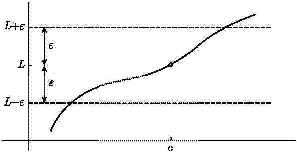

**图 10-1：** 你选择 $\varepsilon$，画出两条水平线 $y = L \pm \varepsilon$。

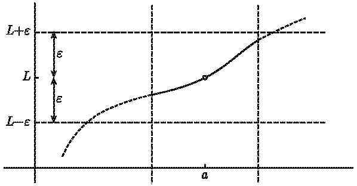

**图 10-2：** 我选择 $\delta$，保留区间 $(a-\delta, a+\delta)$ 内的函数值。

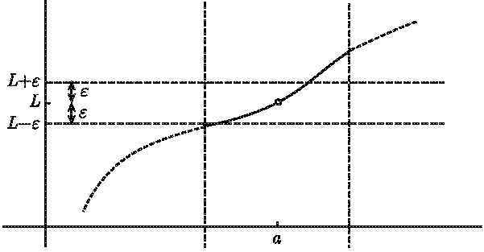

**图 10-3：** 你缩小 $\varepsilon$，部分函数值又落在水平线之外。

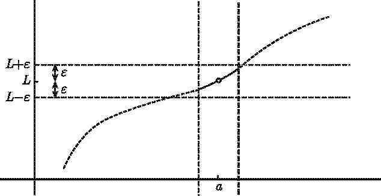

**图 10-4：** 我进一步缩小 $\delta$，使函数值重新落回容忍区间内。

游戏的正式定义即：

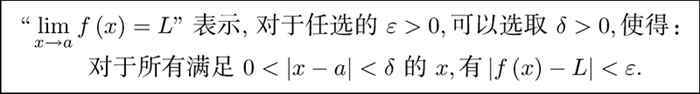

---

### 10.2 ε-δ 证明的详细例子：$\lim_{x \to 3} x^2 = 9$

下面用 ε-δ 定义严格证明 $\lim_{x \to 3} x^2 = 9$。

**证明**：对任意 $\varepsilon > 0$，我们需要找到 $\delta > 0$，使得当 $0 < |x - 3| < \delta$ 时，有 $|x^2 - 9| < \varepsilon$。

**策略**：分两种情况选取 $\delta$。

**情况 1**：若 $\varepsilon \ge 8$，取 $\delta = 1$。当 $|x - 3| < 1$ 时，$2 < x < 4$，于是 $4 < x^2 < 16$，即 $|x^2 - 9| < 7 < 8 \le \varepsilon$。

**情况 2**：若 $\varepsilon < 8$，取 $\delta = \frac{\varepsilon}{8}$。当 $|x - 3| < \frac{\varepsilon}{8}$ 时，由 $x < 3 + \frac{\varepsilon}{8}$ 和 $x < 4$，得

$$
x^2 - 9 = (x-3)(x+3) < \frac{\varepsilon}{8} \cdot (3 + \frac{\varepsilon}{8} + 3) < \frac{\varepsilon}{8} \cdot 7 = \frac{7\varepsilon}{8} < \varepsilon
$$

类似地，由 $x > 3 - \frac{\varepsilon}{8}$ 和 $x > 2$，得

$$
9 - x^2 = (3 - x)(x + 3) < \frac{\varepsilon}{8} \cdot (3 + \frac{\varepsilon}{8} + 3) < \frac{7\varepsilon}{8} < \varepsilon
$$

因此 $|x^2 - 9| < \varepsilon$。$\square$

这个例子说明，即使是最简单的极限，用 ε-δ 定义严格证明也需要相当多的代数技巧。

---

### 10.3 函数极限四则运算法则的 ε-δ 证明

在 5.5 节中列出了函数极限的四则运算法则，下面给出和与乘积的 ε-δ 证明。

#### 10.3.1 极限的和

设 $\lim_{x \to a} f(x) = L$，$\lim_{x \to a} g(x) = M$，则 $\lim_{x \to a} (f(x) + g(x)) = L + M$。

**证明**：对任意 $\varepsilon > 0$，由极限定义：
- 存在 $\delta_1 > 0$，当 $0 < |x - a| < \delta_1$ 时，$|f(x) - L| < \varepsilon/2$
- 存在 $\delta_2 > 0$，当 $0 < |x - a| < \delta_2$ 时，$|g(x) - M| < \varepsilon/2$

取 $\delta = \min\{\delta_1, \delta_2\}$，当 $0 < |x - a| < \delta$ 时，由三角不等式：

$$
|(f(x) + g(x)) - (L + M)| \le |f(x) - L| + |g(x) - M| < \frac{\varepsilon}{2} + \frac{\varepsilon}{2} = \varepsilon
$$

$\square$

#### 10.3.2 极限的乘积

设 $\lim_{x \to a} f(x) = L$，$\lim_{x \to a} g(x) = M$，则 $\lim_{x \to a} f(x)g(x) = LM$。

**证明概要**：考虑差 $f(x)g(x) - LM = f(x)g(x) - Lg(x) + Lg(x) - LM = g(x)(f(x) - L) + L(g(x) - M)$。由三角不等式：

$$
|f(x)g(x) - LM| \le |g(x)|\cdot|f(x) - L| + |L|\cdot|g(x) - M|
$$

由于 $g(x)$ 在 $a$ 附近有界，可控制 $|g(x)| \le |M| + 1$。通过对 $\varepsilon$ 的适当缩放即可完成证明。$\square$

---

### 10.4 三明治定理的 ε-δ 证明

**定理**：设 $g(x) \le f(x) \le h(x)$ 对充分接近 $a$ 的 $x$ 成立，且 $\lim_{x \to a} g(x) = \lim_{x \to a} h(x) = L$，则 $\lim_{x \to a} f(x) = L$。

**证明**：对任意 $\varepsilon > 0$，存在 $\delta > 0$，使得当 $0 < |x - a| < \delta$ 时，有
- $|g(x) - L| < \varepsilon$，即 $L - \varepsilon < g(x) < L + \varepsilon$
- $|h(x) - L| < \varepsilon$，即 $L - \varepsilon < h(x) < L + \varepsilon$
- $g(x) \le f(x) \le h(x)$

于是 $L - \varepsilon < g(x) \le f(x) \le h(x) < L + \varepsilon$，即 $|f(x) - L| < \varepsilon$。$\square$

---

### 10.5 无穷极限、单侧极限与无穷远处的极限（正式定义）

#### 10.5.1 无穷极限

**定义**：$\lim_{x \to a} f(x) = \infty$ 当且仅当对任意 $M > 0$，存在 $\delta > 0$，使得当 $0 < |x - a| < \delta$ 时，$f(x) > M$。

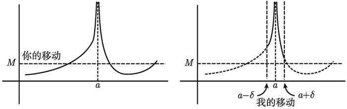

**图 10-5：** 你选取 $M$，我找到 $\delta$ 使得函数值在 $M$ 之上。

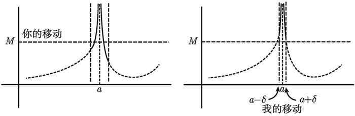

**图 10-6：** 你选取更大的 $M$，我仍然能做出回应。

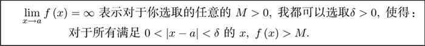

类似地，$\lim_{x \to a} f(x) = -\infty$ 当且仅当对任意 $M > 0$，存在 $\delta > 0$，使得 $0 < |x - a| < \delta$ 时 $f(x) < -M$。

#### 10.5.2 单侧极限

**右极限**：$\lim_{x \to a^+} f(x) = L$ 当且仅当对任意 $\varepsilon > 0$，存在 $\delta > 0$，使得当 $0 < x - a < \delta$ 时，$|f(x) - L| < \varepsilon$。

**左极限**：$\lim_{x \to a^-} f(x) = L$ 当且仅当对任意 $\varepsilon > 0$，存在 $\delta > 0$，使得当 $0 < a - x < \delta$ 时，$|f(x) - L| < \varepsilon$。

#### 10.5.3 无穷远处的极限

**定义**：$\lim_{x \to \infty} f(x) = L$ 当且仅当对任意 $\varepsilon > 0$，存在 $N > 0$，使得当 $x > N$ 时，$|f(x) - L| < \varepsilon$。

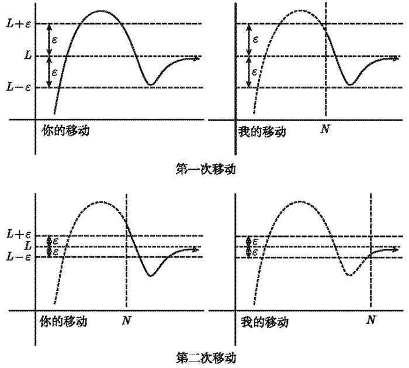

**图 10-7：** 你选择 $\varepsilon$，我选择 $N$ 使得 $x > N$ 时函数值落在容忍区间内。

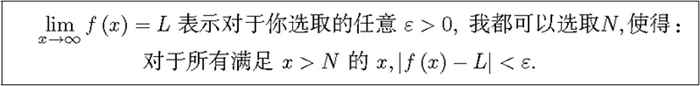

**数列极限的正式定义**：

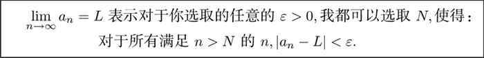

---

### 10.6 极限不存在的证明：三角函数例子

#### 10.6.1 $\lim_{x \to \infty} \sin x$ 不存在

**证明**：假设 $\lim_{x \to \infty} \sin x = L$ 存在。取 $\varepsilon = \frac{1}{2}$，则应存在 $N$，使得当 $x > N$ 时 $|\sin x - L| < \frac{1}{2}$。

但无论 $N$ 多大，总存在整数 $n$ 使得 $n\pi > N$。此时 $\sin(n\pi + \pi/2) = 1$，$\sin(n\pi + 3\pi/2) = -1$，这两个值相差 2，不可能同时落在长度为 1 的区间 $(L - 1/2, L + 1/2)$ 中。矛盾。$\square$

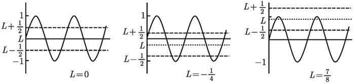

**图 10-8：** 无论 $L$ 取何值，$\sin x$ 的振荡总会超出宽度为 1 的容忍区间。

#### 10.6.2 $\lim_{x \to 0} \sin\frac{1}{x}$ 不存在

**证明**：取 $x_n = \frac{1}{2n\pi + \pi/2} \to 0$，$y_n = \frac{1}{2n\pi + 3\pi/2} \to 0$。但 $\sin(1/x_n) = 1$，$\sin(1/y_n) = -1$，由 Heine 定理知极限不存在。$\square$

---

### 10.7 连续函数的复合

**定理**：若 $g$ 在 $x = a$ 处连续，$f$ 在 $x = g(a)$ 处连续，则复合函数 $f \circ g$ 在 $x = a$ 处连续。

**证明（ε-δ 游戏）**：由于 $f$ 在 $g(a)$ 处连续，对任意 $\varepsilon > 0$，存在 $\lambda > 0$，使得当 $|y - g(a)| < \lambda$ 时 $|f(y) - f(g(a))| < \varepsilon$。

由于 $g$ 在 $a$ 处连续，对该 $\lambda > 0$，存在 $\delta > 0$，使得当 $|x - a| < \delta$ 时 $|g(x) - g(a)| < \lambda$。

于是当 $|x - a| < \delta$ 时，$|f(g(x)) - f(g(a))| < \varepsilon$。$\square$

---

### 10.8 介值定理的证明

**定理**：若 $f$ 在 $[a, b]$ 上连续，且 $f(a) < 0 < f(b)$，则存在 $c \in (a, b)$ 使得 $f(c) = 0$。

**证明概要**：考虑集合 $S = \{x \in [a, b] \mid f(x) < 0\}$。$S$ 非空（$a \in S$）且有上界 $b$，由确界原理，令 $c = \sup S$。

- 若 $f(c) < 0$，则由于 $f$ 连续，在 $c$ 右侧附近仍有 $f(x) < 0$，与 $c$ 是上界矛盾。
- 若 $f(c) > 0$，则由于 $f$ 连续，在 $c$ 左侧附近 $f(x) > 0$，与 $c$ 是上确界矛盾。

因此 $f(c) = 0$。$\square$

---

### 10.9 最大-最小定理（极值定理）的证明

**定理**：若 $f$ 在闭区间 $[a, b]$ 上连续，则 $f$ 在 $[a, b]$ 上取得最大值和最小值。

**证明思路**：

1. **有界性**：反证法。假设 $f$ 无上界，则存在点列 $x_n \in [a, b]$ 使 $f(x_n) \to \infty$。通过不断二分区间，可找到子列收敛到某点 $q$。由 $f$ 在 $q$ 处的连续性，$f(x_n)$ 应有界，矛盾。

2. **最大值存在**：令 $M = \sup\{f(x) \mid x \in [a, b]\}$（由有界性，$M$ 有限）。取点列 $x_n$ 使 $f(x_n) \to M$，再由区间二分法找收敛子列，其极限点 $c$ 满足 $f(c) = M$。$\square$

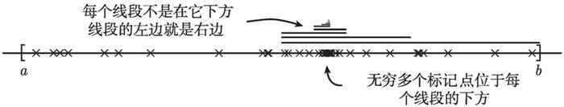

**图 10-9：** 不断二分区间，找到包含无穷多个标记点的子区间序列。

---

### 10.10 洛必达法则的证明

**定理**：设 $f$ 和 $g$ 在 $a$ 的某邻域内可导（$a$ 本身可能除外），$f(a) = g(a) = 0$，且除 $a$ 外 $g'(x) \neq 0$。若 $\lim_{x \to a} \frac{f'(x)}{g'(x)}$ 存在，则

$$
\lim_{x \to a} \frac{f(x)}{g(x)} = \lim_{x \to a} \frac{f'(x)}{g'(x)}
$$

**证明**（利用柯西中值定理）：

**柯西中值定理**：若 $f, g$ 在 $[A, B]$ 上连续，在 $(A, B)$ 内可导，且 $g'(x) \neq 0$，则存在 $C \in (A, B)$ 使得

$$
\frac{f(B) - f(A)}{g(B) - g(A)} = \frac{f'(C)}{g'(C)}
$$

**证明**：定义 $h(x) = f(x) - \frac{f(B) - f(A)}{g(B) - g(A)}g(x)$，则 $h(A) = h(B)$。由罗尔定理，存在 $C \in (A, B)$ 使 $h'(C) = 0$，即得证。

**洛必达法则的证明**：由 $f(a) = g(a) = 0$，对 $x \neq a$，在 $[a, x]$ 或 $[x, a]$ 上应用柯西中值定理，存在介于 $a$ 和 $x$ 之间的 $c$，使得

$$
\frac{f(x)}{g(x)} = \frac{f(x) - f(a)}{g(x) - g(a)} = \frac{f'(c)}{g'(c)}
$$

当 $x \to a$ 时，$c \to a$，因此

$$
\lim_{x \to a} \frac{f(x)}{g(x)} = \lim_{c \to a} \frac{f'(c)}{g'(c)} = \lim_{x \to a} \frac{f'(x)}{g'(x)}
$$

$\square$

---

### 10.11 泰勒近似定理的证明

**定理**：若 $f$ 在 $x = a$ 处光滑，则所有次数不超过 $N$ 的多项式中，$N$ 阶泰勒多项式

$$
P_N(x) = \sum_{k=0}^N \frac{f^{(k)}(a)}{k!}(x-a)^k
$$

是在 $a$ 附近对 $f(x)$ 的最佳逼近。

**证明思路**（设 $a = 0$ 简化问题）：

由完整泰勒定理，$f(x) = P_N(x) + R_N(x)$，其中余项 $R_N(x) = \frac{f^{(N+1)}(c)}{(N+1)!}x^{N+1}$，$c$ 介于 $0$ 和 $x$ 之间。

故当 $x \to 0$ 时，$|f(x) - P_N(x)| = |R_N(x)| \sim |C|\cdot|x|^{N+1}$，其中 $C = \frac{f^{(N+1)}(0)}{(N+1)!}$。

任取另一个次数不超过 $N$ 的多项式 $Q(x) \neq P_N(x)$，令 $S(x) = P_N(x) - Q(x)$，则 $S(x)$ 是次数不超过 $N$ 的非零多项式。设其最低次项为 $a_m x^m$（$0 \le m \le N$），则当 $x \to 0$ 时，$S(x) \sim a_m x^m$，于是

$$
|f(x) - Q(x)| = |S(x) + R_N(x)| \sim |a_m|\cdot|x|^m
$$

由于 $m \le N < N+1$，当 $x$ 充分接近 $0$ 时，$|C|\cdot|x|^{N+1}$ 远小于 $|a_m|\cdot|x|^m$，即

$$
|f(x) - P_N(x)| < |f(x) - Q(x)|
$$

因此 $P_N$ 确实是最佳逼近。$\square$

---

### 10.12 补充阅读小结

以上内容整理了《普林斯顿微积分读本》中与极限相关的核心补充材料，重点包括：

| 补充内容 | 来源 | 说明 |
|:---------|:-----|:-----|
| ε-δ 游戏直观理解 | 附录 A.1.1—A.1.2 | 以"游戏"方式理解极限定义 |
| $\lim_{x \to 3} x^2 = 9$ 的 ε-δ 证明 | 附录 A.1.3 | 完整的代数推导过程 |
| 极限四则运算法则的 ε-δ 证明 | 附录 A.2.1—A.2.3 | 和、差、积、商的严格证明 |
| 三明治定理的 ε-δ 证明 | 附录 A.2.4 | 函数版本的严格证明 |
| 无穷极限、单侧极限的正式定义 | 附录 A.3.1—A.3.2 | 全部 18 种极限情形的定义框架 |
| 无穷远处极限的正式定义 | 附录 A.3.3 | 包含数列极限的 ε-N 定义 |
| 三角函数极限不存在 | 附录 A.3.4 | $\sin x$ 和 $\sin(1/x)$ 的严格证明 |
| 连续函数复合的证明 | 附录 A.4.1 | 三层"游戏"嵌套 |
| 介值定理和最大-最小定理的证明 | 附录 A.4.2—A.4.3 | 基于实数完备性的严格证明 |
| 洛必达法则的证明 | 附录 A.6.11 | 利用柯西中值定理 |
| 泰勒近似定理的证明 | 附录 A.7 | 最佳逼近的严格证明 |

这些内容与主教程第 1—9 节相互补充，既提供了更严格的证明，也提供了更直观的理解方式。

---

## 11. 补充阅读：普林斯顿数学分析读本

> 本节内容整理自《普林斯顿数学分析读本》（R. 拉波特 著），补充了实数域、收敛、极限与子序列、柯西序列与单调序列、子序列极限以及特殊序列等内容，为主教程第 1—10 节提供更深入的理论背景和详细证明。

### 第5章 实数域

在学习了有序域的定义之后，我们终于可以理解实数是什么了．R
作为一个域具有三个重要特征：阿基米德性质、Q
的稠密性和根的存在性．我们将对这些特征逐一加以证明，并且以后也会经常用到它们

定义 5.1 (域).

设 F 是任意一个具有加法和乘法两种运算的集合．如果 F 满足下列域公理，那么
F 就是一个域：

A1.（加法的封闭性）如果 $x , y \in F$ ，那么 $x + y \in F$

A2.（加法交换律） $\forall x , y \in F , \ x + y = y + x .$

A3.（加法结合律）
$\forall x , y , z \in F , \ ( x + y ) + z = x + ( y + z )$

A4.（加法单位元）F 包含元素 0 使得 $\forall x \in F , \ x + 0 = x .$

A5.（加法逆元）对于每一个 $x \in F$ ，存在元素 $- x \in F$ 使得
$x + ( - x ) = 0$

M1.（乘法的封闭性）如果 $x , y \in F$ ，那么 $x y \in F$

M2.（乘法交换律） $\forall x , y \in F , \ x y = y x .$

M3.（乘法结合律） $\forall x , y , z \in F , \ ( x y ) z = x ( y z )$

M4.（乘法单位元）F 包含元素 $1 \ (  { \neq } 0 \ )$
使得 $\forall x \in F , \ 1 x = x$

M5.（乘法逆元）对于每一个 $x \in F$ ，如果 $x \neq 0$ ，那么存在元素
${ \frac { 1 } { x } } \in F$ 使得
$( x ) { \frac { 1 } { x } } = 1$

D.（分配律） $\forall x , y , z \in F , \ x ( y + z ) = x y + x z .$

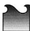

对于任意一个集合，如果将其与普通加法和乘法结合在一起，那么上面的大多数公理都自然成立．例如，乘法单位元是
1，因为 1
乘以任何数都等于它自身如果有需要，我们可以在集合上定义一些不同于传统的新加法和新乘法，并试着让它们满足域公理，但我们并不是真的想要这么做．以抽象的方式研究像域这样的结构是代数学的重点，这是数学的高级领域，与``如果
$3 x + 2 = 8$ ，求 $x '$ 完全不同

就我们的目的而言，我们要考察的每一个域，其元素都是做传统加法和乘法的普通数，因此通常认为公理
A2 --A5、M2 --M5 和 D 是显然成立的．然而，封闭性公理 A1 和 M1
在许多情况下都不是显然的．如果想证明某个东西是一个域，我们必须给出封闭性的详细证明

例 5.2 (域).

有理数集与普通的加法和乘法共同构成了一个域．我们来验证一下封闭性公理是否成立．对于任意
$x , y \in \mathbb { Q }$ , 我们可以记
$x = { \frac { a } { b } }$ 和
$y = { \frac { c } { d } }$ ，其中
$a , b , c , d \in \mathbb { Z } .$ 那么

$$
x + y = \frac {a}{b} + \frac {c}{d} = \frac {a d + b c}{b d}
$$

是一个有理数，并且

$$
x y = \frac {a c}{b d}
$$

也是一个有理数

另一方面，N 不是域．由于 N 不包含负整数，所以 N
的每一个元素都没有加法逆元．Z 也不是域．由于 Z 不包含分数，所以 Z
的每一个元素① 都没有乘法逆元

集合 $S = \{ 0 , 1 , 2 , 3 , 4 \}$
结合普通的加法和乘法无法构成一个域．因为 S 包含2 和 3，但是
$2 + 3 = 5$ 不属于 S，所以 S 对加法不封闭．同样地，
$( 2 ) ( 3 ) = 6 \notin S$ 所以 S 对乘法也不封闭

但是，不妨设 $T = S \mod 5$ ，也就是说，我们在 S 中把数 5 设为
0．那么$1 0 = 5 + 5 = 0 + 0$ ；同样地，5 的任何倍数也都等于 0．此时，
$2 + 3 = 5 = 0$ 就包含在 T 中．在 T 中，元素的任意和或积 x 均包含在
$T$ 中；因为当 $x \geqslant 5$ 时，我们可以把 x 写成
$x = 5 n + m = m$ ，其中
$m , n \in \mathbb { N }  ~ H ~  m < 5$ ．这个奇怪的域T
通常记作 $\mathbb { Z } _ { 5 }$

仅使用域公理，我们就可以证明域的许多基本性质，例如
$- ( - x ) = x , 0 x = 0$ 当 $x \neq 0$ 时
$x y = 1 \Longrightarrow y = { \frac { 1 } { x } }$
，等等．多使用几次域公理就可以证明这些性质

定义 5.3 (有序域).

有序域 F 是一个域，它也是满足下列公理的有序集：

O1. 如果 $y < z$ ，那么
$\forall x , y , z \in F , \ x + y < x + z .$

O2. 如果 $x > 0$ 且 $y > 0$ ，那么
$\forall x , y \in F , \ x y > 0$

回到定义 4.2，回顾一下有序集的含义

有序域公理非常直观，我们可以利用它们来证明一些基本性质，例如 $x > 0$
$y < z \implies x y < x z , ~ 0 < x < y \implies 0 < \frac { 1 } { y } < \frac { 1 } { x }$
，等等．（我们将跳过这些简单的证明，因为时间就是金钱，而金钱可以买到一个新的笔记本，你试着在笔记本上自己写出这些证明．）

现在我们来定义实数！

定义 5.4 (实数). 实数集 R 是具有最小上界性且包含 Q 的有序域

换句话说， 满足有序域的全部公理，并填充了有理数集中的所有``洞''

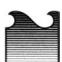

虽然我们可以定义
R，但这并不表示它一定存在．由于实分析教学方法的不同，解决这一问题的方式也不同．有些教科书只是假设这个
是存在的，并把这一假设称为``完备性公理''，这里的完备性就是最小上界性和最大下界性的另一种说法．不过，在假设
存在之后，
的存在性是可以证明的．有个（相当费力的）证明使用了一种叫作``戴德金分割''的方法．如果感兴趣，你可以查一下

除了完备性和包含 Q
以外，实数集还有一些非常有用的性质，接下来的三个定理将对此进行探讨

定理 5.5 (R 的阿基米德性质).

对于任意一个给定的正实数，我们都可以找到一个自然数，使得这两个数的乘积任意大

用符号表示，即：

$$
\forall x, y \in \mathbb {R}    且    x > 0,   \exists n \in \mathbb {N}    使得    n x > y.
$$

换句话说，阿基米德性质断言：对于任意两个实数，你总是可以找到一个大于这两个实数比值的自然数．一个常用的推论是
$\forall y \in \mathbb { R }$ $\exists n \in \mathbb { N }$ 使得
$n > y$ （令定理中的 $x = 1$ 即得到该推论）

当然，Q 也有阿基米德性质．对于任意 $x , y \in \mathbb { Q }$ 且
$x > 0$ ，我们记 $x = { \frac { a } { b } }$
和$y = { \frac { c } { d } }$ ，其中
$a , b , c , d \in \mathbb { N } .$ ．令 $n = 2 b c$ ，显然
$n \in \mathbb { N }$ ，并且

$$
n x = (2 b c) \frac {a}{b} = 2 a c = (2 a d) \frac {c}{d} = 2 a d y > y.
$$

（这里假设 $y > 0$ ．如果 $y \leqslant 0$ ，只需令 $n = 1$
，又因为 $x > 0$ ，从而有 $n x = x > y .$ ．）

证明实数集的阿基米德性质有点棘手，因为大部分实数都不像分数那样有一个简单的表示．相反，我们将利用
R 的特殊之处：最小上界性

证明.
我们借此机会来演示分两步证明的过程．首先，利用定义找出问题的关键，进而逐步分解证明．其次，把已知条件用一种优美的线性方式写下来

第一步．设 A 为所有可能的 nx 的集合，其中 n
是任意自然数．阿基米德性质断言了 A 中存在大于 $y$
的元素．如果想利用最小上界性，那么集合 A
并没有什么用，因为它没有上界，除非我们假设阿基米德性质为假．在这个假设下，A的所有元素都不大于
$y$ ，这意味着 $y$ 是 A
的上界．这似乎是一个合理的方向，所以我们考虑利用反证法来证明

假设阿基米德性质为假，y 是 $A = \{ n x \mid n \in \mathbb { N } \}$
的上界．现在 A 是 R 的一个非空子集，那么由定义 4.10 可知，在 中存在
supA．为方便起见，令 $\alpha = { s u p } A .$
现在还有哪些已知条件没有用到？我们能利用的基本上就是上确界的定义：如果$\gamma < \alpha$
，那么 $\gamma$ 不是 A 的上界．这意味着 $\gamma$ 小于 A
的某个元素，因此存在某个自然数 m，使得 $\gamma < m x$

这有帮助吗？有点．我们希望最终得到 ${ } ^ { 6 6 } \alpha$ 不是 A
的上界''这个矛盾．因此，如果能证明某个自然数乘以 x 大于 $\alpha$
就好了（因为这与 $\alpha = { s u p } A$
相矛盾）．现在已经得到了 $\gamma < m x$ ，如果我们可以用 α 来表示
$\gamma$ ，那么这个不等式就更有用了．由于 $\gamma$ 必须小于
$\alpha$ ，所以不妨记作 $\gamma = \alpha - k$ ，其中 $k > 0 .$
．于是$\gamma < m x \Longrightarrow \alpha < m x + k$

现在的目标是把 $m x + k$ 写成 nx 的形式，其中 n 是自然数．如果
$k = c x$ 且 $c \in \mathbb { N }$ ，那么
$m x + k = m x + c x = ( m + c ) x$ ，这确实是一个自然数乘以 x
的形式．事实上，令 $c = 1$ 就可以了，此时 $k = x$
就是我们想要的．现在 $\alpha < ( m + 1 ) x$ 所以 α 小于 A
的某个元素，这与 $\alpha = { s u p } A$
相矛盾．因此，实数集的阿基米德性质一定为真

第二步．经过所有这些思考，证明这个定理并不需要很多步骤．我们现在就把它正式地写出来

假设 没有阿基米德性质．那么 $A = \{ n x \mid n \in \mathbb { N } \}$
有上界 y，于是由 R 的最小上界性可知，在 R 中存在
$\alpha = { s u p } A .$ ．因为 $x > 0$ ，所以
$\alpha - x < \alpha$ ，那么 $\alpha - x$ 不可能是 A
的上界．因此，存在 $m \in \mathbb { N }$ 使得 $\alpha - x < m x$
，即 $\alpha < ( m + 1 ) x$ ．但是， $( m + 1 ) x \in A$ ，所以 α
不是 A 的上界，这样就得到了矛盾

如果愿意的话，我们可以把几乎所有东西都用符号表示，进而缩短证明过程：

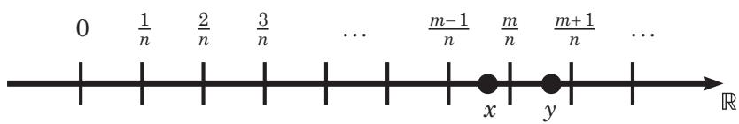

### 第14章 收敛

我们通过考察收敛的概念来开始对序列和级数的研究，基本问题是，``当一个序列趋向于无穷时，它能否任意接近于某个点？''

虽然在第 2
章中引入了序列，但我们首先应该给出一个更正式的定义，该定义要基于我们在定义
8.3 中所了解的函数

定义 14.1 (序列).

度量空间 X 中的序列就是一个函数：

$$
f: \mathbb {N} \to X, f: n \mapsto p _ {n},
$$

其中 $p _ { n } \in X , \ \forall n \in \mathbb { N }$
．我们把序列表示为 $\left\{ p _ { n } \right\}$ 或
$p _ { 1 } , p _ { 2 } , \cdots$

该序列所有可能值的集合称为 $\left\{ p _ { n } \right\}$
的范围．如果序列的范围在 X 中有界（根据定义 9.3），那么该序列就是有界的

例 14.2 (序列).

根据这个定义，每个可数集都可以构成一个序列．特别是， $\mathbb { Q }$
可以排成一个序列，但是 不能

记住，所有序列的长度都是无限的，但如果序列中有重复元素，那么序列的范围可能是有限的．例如，集合
\{1\} 本身并不是一个序列，但是我们可以通过写成 1, 1, 1, · · ·
使其成为序列

我们看一下度量空间 R 中的以下序列：

\item
  如果对于任意 $n \in \mathbb { N }$ 均有
  $\begin{array} { r } { s _ { n } = \frac { 1 } { n } } $
  ，那么 $\left\{ s _ { n } \right\}$ 的范围是集合
  $\{ 1 , { \frac { 1 } { 2 } } , { \frac { 1 } { 3 } } , \cdots \}$
  这个范围是无限且有界的（因为任意两个元素之间的距离 $\leqslant 1 )$
  ）．因此我们说 $\left\{ s _ { n } \right\}$ 是有界的
\item
  如果对于任意 $n \in \mathbb { N }$ 均有 $s _ { n } = n ^ { 2 }$
  ，那么 $\left\{ s _ { n } \right\}$ 的范围是集合
  $\{ 1 , 4 , 9 , \cdots \}$
  这个范围是无限且无界的（因为数越来越大）．因此我们说
  $\left\{ s _ { n } \right\}$ 是无界的
\item
  如果对于任意 $n \in \mathbb N$ 均有
  $\begin{array} { r } { s _ { n } \ = \ 1 + \ \frac { ( - 1 ) ^ { n } } { n } } $
  ，那么 $\left\{ s _ { n } \right\}$
  的范围是集合$\{ 0 , { \frac { 2 } { 3 } } , { \frac { 4 } { 5 } } , { \frac { 6 } { 7 } } , \cdot \cdot \cdot \} \cup \{ { \frac { 3 } { 2 } } , { \frac { 5 } { 4 } } , { \frac { 7 } { 6 } } , \cdot \cdot \cdot \}$
  ．这个范围是无限且有界的（因为任意两个元素之间的距离
  $\leqslant \frac { 3 } { 2 } )$ ）．因此我们说
  $\left\{ s _ { n } \right\}$ 是有界的
\item
  如果对于任意 $n \in \mathbb { N }$ 均有 $s _ { n } = 1$ ，那么
  $\left\{ s _ { n } \right\}$ 的范围是集合
  \{1\}．这个范围是有限且有界的（因为任意两个元素之间的距离
  $\leqslant 0 ~ )$ ）．因此我们说 $\left\{ s _ { n } \right\}$
  是有界的
\item
  在这个例子中，我们将使用度量空间 C 而不是 R．如果对于任意
  $n \in \mathbb { N }$ 均有 $s _ { n } =  i  ^ { n }$
  （其中 $ i  ^ { 2 } = - 1$ ，见第 6 章），那么
  $\left\{ s _ { n } \right\}$ 的范围就是集合
  $\{  i  , - 1 , -  i  , 1 \}$
  这个范围是有限且有界的（因为任意两个元素之间的距离 $\leqslant 2 )$
  ）．因此我们说 $\left\{ s _ { n } \right\}$ 是有界的

定义 14.3 (收敛).

$\left\{ p _ { n } \right\}$ 是度量空间 X
中的任意一个序列．如果对于任意 $\epsilon > 0$ ，存在某个自然数
N，使得对于每一个大于等于 N 的 n 均有 $d ( p _ { n } , p ) < \epsilon$
，那么 $\left\{ p _ { n } \right\}$ 就收敛到点 $p \in X$ ．我们把 p
称为 $\left\{ p _ { n } \right\}$ 的极限

用符号来表示，即如果

$$
\forall \epsilon > 0, \exists N \in \mathbb {N} 使得 n \geqslant N \Longrightarrow d (p _ {n}, p) <   \epsilon ,
$$

那么我们记
$\scriptstyle { l i m } _ { n \to \infty } p _ { n } = p$
（或简写为 $p _ { n } \to p \dag$

如果序列 $\left\{ p _ { n } \right\}$ 不收敛到任何 $p \in X$ ，那么
$\left\{ p _ { n } \right\}$ 发散

区别．极限不是极限点．前者与序列有关，而后者与拓扑有关．但是，这些概念是有关联的，正如我们稍后将在本章看到的那样

这与 $\forall \epsilon$ 和 ∃N 有什么关系呢？为了让
$\left\{ p _ { n } \right\}$ 收敛到 $p$
，需要确保以下论述成立：给定任意小的距离 ，存在一个下标
N，使得序列中下标大于等于 N 的每一个元素与极限 $p$ 的距离都小于
．（有时你会看到 $N _ { \epsilon }$ ，这是为了强调下标 N 取决于距离 ）

例如，如果 中的序列 $\left\{ p _ { n } \right\}$ 收敛到数
1，那么存在某个数 N 使得 $p _ { N } , p _ { N + 1 }$
$p _ { N + 2 } , \cdots$ 介于 0.9 和 1.1 之间．同样地，存在另一个数 N
使得 $p _ { N } , p _ { N + 1 } , p _ { N + 2 } , \cdot \cdot \cdot$
介于 0.95 和 1.05 之间，等等．因为这对每一个可能的距离 $\epsilon$
都成立，所以我们确信该序列会无限接近于点
1（虽然它可能永远不会真正``接触到''1）

$N _ { \epsilon }$ 挑战．下面给出另一种思路：为了证明序列收敛到 $p$
，你需要完成 $N _ { \epsilon }$ 挑战你的朋友说 $^ { 6 6 } \epsilon$
是 $0 . 1 ^ { \ ' }$ ，那么你必须找到一个自然数 N 使得
$p _ { N } , p _ { N + 1 } , p _ { N + 2 } , \cdot \cdot \cdot$ 与
$p$ 的距离小于 0.1．然后你的朋友说``好吧，这个很简单．现在让
$\epsilon = 0 . 0 0 4 5 6$ 哈！''你需要保持冷静，并找到另一个自然数 N
使得 $p _ { N } , p _ { N + 1 } , p _ { N + 2 } , \cdot \cdot \cdot$ ·
与 $p$ 的距离小于 0.00456．你的朋友一直用不同的 $\epsilon > 0$
值来挑战你，而你必须找到一个有效的 N 来做出回应

最终，你的朋友非常狡猾地编写了一个计算机程序，持续不断地抛出  的随机值：
$3 , 0 . 2 4 1 , 1 0 0 , \frac { \sqrt { \pi } } { 7 }$
，等等．它们的数量是无限的，而你人工查找 N
的速度无法跟上计算机．现在，你必须以其人之道还治其人之身

你决定编写自己的程序，它可以接收任何 $\epsilon > 0$ ，并自动找到数 N
使得$p _ { N } , p _ { N + 1 } , p _ { N + 2 } , \cdot \cdot \cdot$ 与
$p$ 之间的距离小于 ．为此，必须说明对于任何可能的 $\epsilon _ { : }$
，如何查找相应的 N．你告诉它如何找到 $N _ { \epsilon }$
：这个自然数是输入值  的函数．例如，
$\begin{array} { r } { N = \left\lceil 5 + \frac { 3 } { \epsilon ^ { 2 } } \right\rceil } $
可能会适用于某些序列

如果这是可能的（也就是说，存在一种规则可以找到任意给定的
$\epsilon > 0$ 所对应的 N），那么你就完成了 $N _ { \epsilon }$
挑战．你的朋友因失败而变得谦卑，承诺永远不再打扰你（明年也不会忘记你的生日）．你开心地笑了，因为没有什么比证明序列收敛更能让你开心的了

例 14.4 (收敛).

我们看看上一个例子中的序列，同样是在度量空间 R 中：

\item
  如果对于任意 $n \in \mathbb { N }$ 均有
  $\begin{array} { r } { s _ { n } = \frac { 1 } { n } } $
  ，那么 $\left\{ s _ { n } \right\}$ 收敛到 0

为了证明这一点，我们需要为每一个 $\epsilon > 0$ 明确地找到一个
N，使得对于所有 $n \geqslant N$ 均有
$d ( s _ { n } , 0 ) < \epsilon .$ ．注意，
$\begin{array} { r } { d ( s _ { n } , 0 ) = | s _ { n } - 0 | = \left| \frac { 1 } { n } \right| } $
，所以只要 $n \epsilon > 1$ 就够了．我们希望
$n > { \frac { 1 } { \epsilon } }$ ，因此不妨令
$\begin{array} { r } { N = \left\lceil \frac { 1 } { \epsilon } \right\rceil + 1 . } $
．上取整函数是为了保证 N是自然数，而
$^ { 6 6 } { + 1 } ^ { \prime 3 }$ 是为了保证 $n \epsilon > 1$
而不是 $n \epsilon \geqslant 1$

$\begin{array} { r } { N = \left\lceil \frac { 1 } { \epsilon } \right\rceil + 1 } $
的整体情况看起来要比实际复杂得多．我们要说的是，如果$\epsilon = { \frac { 1 } { 2 } }$
，那么令 $N \ : = \ : 3$ ，因为
${ \frac { 1 } { 3 } } , { \frac { 1 } { 4 } } , { \frac { 1 } { 5 } } , \cdots$
都小于 ${ \frac { 1 } { 2 } }$ ；如果
$\epsilon = \frac { 1 } { 1 0 0 . 5 }$ ，那么令$N = 1 0 2$ ，因为
${ \frac { 1 } { 1 0 2 } } , { \frac { 1 } { 1 0 3 } } , { \frac { 1 } { 1 0 4 } } , \cdots$
· 都小于 $\frac { 1 } { 1 0 0 . 5 }$ ，以此类推

注意，我们也可以选择
$\begin{array} { r } { N = \left\lceil \frac { 1 } { \epsilon } \right\rceil + 2 } $
，或者
$\begin{array} { r } { N = \left\lceil \frac { 1 } { \epsilon } \right\rceil + 3 } $
，等等．只要 N 是大于 $\frac { 1 } { \epsilon }$ 的自然数就够了

我们可以像下面这样严格地陈述该证明．对于任意 $\epsilon > 0 .$ , 令
$\begin{array} { r } { N = \left\lceil \frac { 1 } { \epsilon } \right\rceil + 1 } $
那么对于每一个 $n \geqslant N$ 均有

$$
d (s _ {n}, 0) = \left| \frac {1}{n} \right| \leqslant \left| \frac {1}{N} \right| = \left| \frac {1}{\lceil \frac {1}{\epsilon} \rceil + 1} \right| <   \left| \frac {1}{\frac {1}{\epsilon}} \right| = | \epsilon | = \epsilon .
$$

\item
  如果对于任意 $n \in \mathbb { N }$ 均有 $s _ { n } = n ^ { 2 }$
  ，那么 $\left\{ s _ { n } \right\}$ 是发散的

为了证明这一点，我们需要错误地假设存在某个实数 p 使得
$s _ { n } \ \to \ p$ ，然后推导出矛盾．如果 $s _ { n } \ \to \ p$
，那么对于任意 $\epsilon > 0$ ，存在一个自然数 N
使得$n \geqslant N \Longrightarrow d ( s _ { n } , p ) < \epsilon$
．但是，当 $n \geqslant N$ 时，
$| n ^ { 2 } | - | p | \leqslant | n ^ { 2 } - p | < \epsilon$
，所以$| n ^ { 2 } | < | p | + \epsilon .$ ．这意味着 p 的绝对值（加上
）一定大于每一个自然数的平方，但这是不可能的（除非 $p$
是无穷大，但无穷大不是一个有效的极限）．这个矛盾表明不存在 $p \in$ R
使得 $s _ { n } \to p .$

\item
  如果对于任意 $n \in \mathbb N$ 均有
  $\begin{array} { r } { s _ { n } = 1 + \frac { ( - 1 ) ^ { n } } { n } } $
  ，那么 $\left\{ s _ { n } \right\}$ 收敛到 1（参见图 14.1 和图
  14.2）

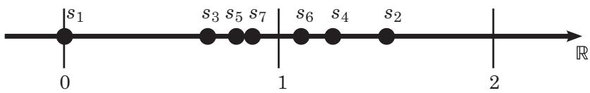

图 14.1 序列
$\begin{array} { r } { s _ { n } = 1 + \frac { ( - 1 ) ^ { n } } { n } } $
的前几个元素

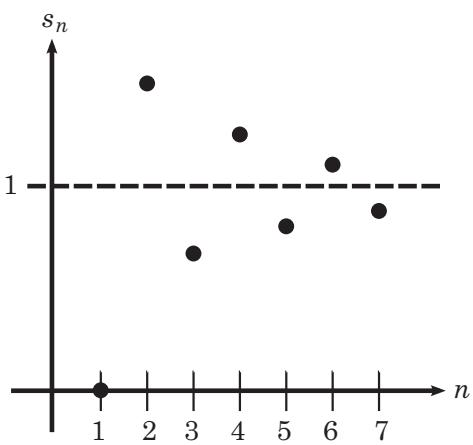

图 14.2 序列
$\begin{array} { r } { s _ { n } = 1 + \frac { ( - 1 ) ^ { n } } { n } } $
的前几个元素，这次对应 n 绘制

为了证明这一点，我们需要为每一个 $\epsilon > 0$ 明确地找到一个
N，使得对于所有 $n \geqslant N$ 均有
$d ( s _ { n } , 1 ) < \epsilon .$ ．因为

$$
d (s _ {n}, 1) = | s _ {n} - 1 | = \left| \frac {(- 1) ^ {n}}{n} \right| = \left| \frac {1}{n} \right|,
$$

所以我们选择
$\begin{array} { r } { N = \left\lceil \frac { 1 } { \epsilon } \right\rceil + 1 } $
（就像
$\begin{array} { r } { s _ { n } = \frac { 1 } { n } } $
的例子那样），这是一个不错的选择

注意，虽然该序列在其极限的左右两侧来回跳跃，如图 14.1 和图 14.2
所示，但这个序列仍然是收敛的，因为 1 左侧和右侧的点都趋向于 1

\item
  如果对于任意 $n \in \mathbb { N }$ 均有 $s _ { n } = 1$ ，那么
  $\left\{ s _ { n } \right\}$ 收敛到 1

为了证明这一点，我们需要为每一个 $\epsilon > 0$ 明确地找到一个
N，使得对于所有 $n \geqslant N$ 均有
$d ( s _ { n } , 1 ) < \epsilon$ ．因为
$d ( s _ { n } , 1 ) = | 1 - 1 | = 0 < \epsilon$ 对任意
$\epsilon > 0$ 均成立，所以令 $N = 1$ 即可（或任意一个
$N \in \mathbb N$ 都可行）

\item
  在这个例子中，我们重新回到度量空间 C．如果对于任意 $n \in \mathbb N$
  均有$s _ { n } =  i  ^ { n }$ ，那么
  $\left\{ s _ { n } \right\}$ 是发散的

正如你在图 14.3
中所看到的，这个序列不收敛的原因是它的任意两个元素之间的距离都大于  = 1

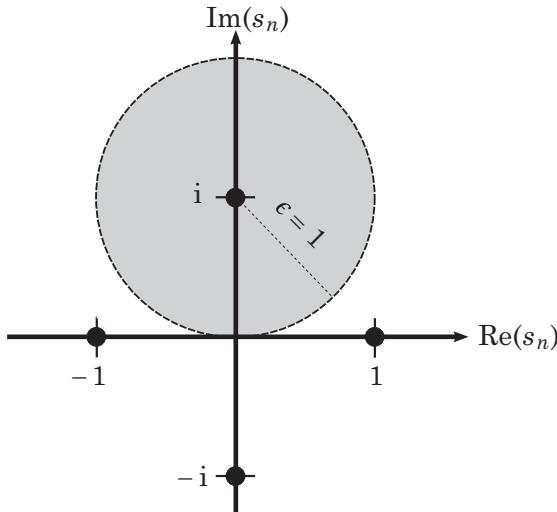

图 14.3 序列 $s _ { n } =  i  ^ { n }$ 的所有四个元素．
$s _ { n }$ 中不存在与 i 的距离小于等于 $\epsilon = 1$ 的其他元素

现在严格地证明这一点：如果 $\left\{ s _ { n } \right\}$ 有一个极限
$p$ ，那么对于任意 $\epsilon > 0$ ，存在一个 $N \in \mathbb N$
使得 $d ( s _ { n } , p ) < \epsilon$ 对每一个 $n \geqslant N$
均成立．由于上述结论对每一个 $\epsilon > 0$ 均成立，因此对于给定的
$\epsilon > 0$ ，该结论对 $\frac { \epsilon } { 2 }$
也是成立的，于是我们可以得到

$$
d (s _ {n}, s _ {n + 1}) \leqslant d (s _ {n}, p) + d (p, s _ {n + 1}) <   \frac {\epsilon}{2} + \frac {\epsilon}{2} = \epsilon .
$$

（这个关于 $\frac { \epsilon } { 2 }$ 的技巧会经常用到．）

但是，因为这个序列是重复的，所以对于每一个 $N \in  { \mathbb { N } }$
，存在某个 $n \geqslant N$ 使得 $s _ { n } =  i $
．于是，当 $\epsilon = 1$ 时，

$$
d (s _ {n}, s _ {n + 1}) = d (i, 1) > 1 = \epsilon .
$$

这是一个矛盾．因此 $s _ { n }$ 不可能有这样的极限 $p .$

注意，在度量空间 X = R 中，我们知道序列
$\begin{array} { r } { s _ { n } = \frac { 1 } { n } } $
收敛到 0．但是如果我们把 $s _ { n }$ 看作度量空间
$X = \mathbb { R } \backslash \{ 0 \}$ 的一个子集，那么 $s _ { n }$
不会收敛到 X 的任何点，因此，记作 ${ } ^ { * } s _ { n }$ 在 X
中收敛''始终要比 ${ } ^ { * } s _ { n }$
收敛''更加精确（但我们都很懒，通常只写 $^ { 6 6 } s _ { n }$ 收敛''）

序列 $\left\{ p _ { n } \right\}$ 的范围是一个集合，它实际上是
$\left\{ p _ { n } \right\}$ 所在度量空间 X 的子集在第 9
章中，我们学习了度量空间子集的极限点．在本章中，我们学习了序列的极限．我们自然会提出以下问题：序列
$\left\{ p _ { n } \right\}$ 的极限与 $\left\{ p _ { n } \right\}$
的范围的极限点有什么区别？（回顾定义
9.9，集合的极限点是一个点，其每个邻域都至少包含集合中的另一个点．）事实证明，两者相似但不相同，如下例所示

首先， $p _ { n } \to p$ 并不意味着 p 是
$\left\{ p _ { n } \right\}$
的范围的极限点．为了看清这一点，对于每一个 $n \in \mathbb { N }$ ，令
$p _ { n } = 1$ ，则 $\left\{ p _ { n } \right\}$ 是序列 1, 1, 1, ·
· · ，其范围为集合
\{1\}．正如我们在前面的例子中所看到的，这个序列是收敛的．但是 $p = 1$
并不是集合 \{1\}的极限点，因为 p 的每一个邻域都只包含集合 \{1\}
中的一个点，即 1 本身

另外，p 是 $\left\{ p _ { n } \right\}$ 的范围的一个极限点并不意味着
$p _ { n }  p .$ ．为了看清这一点，对于每一个 $n \in \mathbb { N }$
，令
$p _ { n } = ( - 1 ) ^ { n } + { \frac { ( - 1 ) ^ { n } } { n } }$
，则 $\left\{ p _ { n } \right\}$ 是序列
$\begin{array} { r } { - 2 , \frac { 3 } { 2 } , - \frac { 4 } { 3 } , \frac { 5 } { 4 } , - \frac { 6 } { 5 } , \frac { 7 } { 6 } , \cdot \cdot \cdot } $
其范围为集合
$\{ - 2 , - { \frac { 4 } { 3 } } , - { \frac { 6 } { 5 } } , \cdot \cdot \cdot \} \cup \big \{ { \frac { 3 } { 2 } } , { \frac { 5 } { 4 } } , { \frac { 7 } { 6 } } , \cdot \cdot \cdot \big \}$
．从图 14.4 和图 14.5 中可以看出，这个序列不收敛．（为什么？对于任意
$n \in \mathbb { N }$ $\left| p _ { n } - p _ { n + 1 } \right| > 2$
，所以我们找不到一个 N 使得 $| p - p _ { n } | < \epsilon$ 对所有
$n \geqslant N$ 均成立．）但 $p = 1$ 是
$\left\{ p _ { n } \right\}$ 的范围的一个极限点，因为对于任意
$r > 0$ ，我们根据阿基米德性质可以找到满足 $n r > 1$ 的
$n \in \mathbb { N } .$ ．于是
$1 - r < 1 + { \frac { 1 } { n } } < 1 + r$ ，因此点
$1 + { \frac { 1 } { n } } \in N _ { r } ( 1 )$ ．（这里的
n 必须是偶数，如果我们根据阿基米德性质找到的满足 $n r > 1$ 的 n
是奇数，那就选择$n + 1 , ~ )$ 同样地， $p = - 1$ （当 n
为奇数时）也是 $\left\{ p _ { n } \right\}$ 的范围的一个极限点

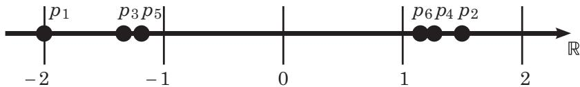

图 14.4 序列
$\begin{array} { r } { p _ { n } = ( - 1 ) ^ { n } + \frac { ( - 1 ) ^ { n } } { n } } $
的前几个元素

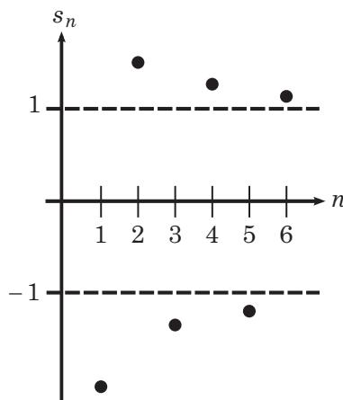

图 14.5 序列
$\begin{array} { r } { p _ { n } = ( - 1 ) ^ { n } + \frac { ( - 1 ) ^ { n } } { n } } $
的前几个元素，这次根据 n 来绘制

这表明序列的极限与其范围的极限点不同．它们看起来仍然很相似，正如下一个定理所示，序列的极限还有另一种定义（它更类似于我们在定理
9.11 中看到的极限点的性质）

定理 14.5 (收敛的另一种定义).

$\left\{ p _ { n } \right\}$ 是度量空间 X 中的任意一个序列
$\left\{ p _ { n } \right\}$ 收敛到 $p \in X$ ，当且仅当对于 $p$
的每一个邻域，在该邻域外只存在 $\left\{ p _ { n } \right\}$
的有限多个元素

证明. 假设 $p _ { n } \to p$ ，那么对于任意 $\epsilon > 0$ ，存在
$N \in \mathbb N$ ，使得只要 $n \geqslant N$
就有$d ( p _ { n } , p ) < \epsilon .$ ．换句话说，当
$n \geqslant N$ 时， $p _ { n }$ 到 $p$ 的距离小于 $\epsilon$
，所以对于每一个$n \geqslant N$ 均有
$p _ { n } \in N _ { \epsilon } ( p )$ ．那么
$p _ { n } \notin N _ { \epsilon } ( p )$ 意味着 $n < N$ ．因为 N
是一个固定的有限数，所以小于 N 的自然数只存在有限多个，那么
$\left\{ p _ { n } \right\}$ 中只有有限多个元素不在
$N _ { \epsilon } ( p )$ 中．因为这对每一个 $\epsilon > 0$
都成立，所以对于 $p$ 的每一个邻域，上述结论均成立

反过来，假设 $p$ 的每一个邻域都包含 $\left\{ p _ { n } \right\}$
中除了有限多个元素之外的所有元素．那么对于给定的 $\epsilon > 0$
，存在一个由 $\left\{ p _ { n } \right\}$ 中有限多个元素构成的集合
$\{ p _ { i } \}$ 其中每个 $p _ { i }$ 都不属于
$N _ { \epsilon } ( p )$ ．由于 $\{ p _ { i } \}$
是有限的，所以我们可以取最大下标 N，那么对于每一个 $n \geqslant N + 1$
均有 $p _ { n } \in N _ { \epsilon } ( p )$ ，即
$d ( p _ { n } , p ) < \epsilon .$ ．因为这对每一个$\epsilon > 0$
均成立，所以我们有 $p _ { n } \to p .$ □

下一个定理证明了如果一个序列收敛，那么它的极限是唯一的

定理 14.6 (极限的唯一性).

设 $\left\{ p _ { n } \right\}$ 是度量空间 X 中的任意一个序列．如果
$p _ { n }$ 同时收敛到 $p \in X$ 和 $p ^ { \prime } \in X$ ，那么
$p ^ { \prime } = p$

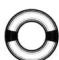

证明. 这里我们会用到一个在实分析中反复出现的论证．其基本思路是，如果
$p _ { n }$ 可以任意地接近 $p$ 和 $p ^ { \prime }$
，那么在某一步之后， $p _ { n }$ 就开始任意地接近它们．在这种情况下，
$p$ 和 $p ^ { \prime }$ 也必须彼此任意接近

对于任意 $\epsilon > 0$ ，我们可以将收敛的定义应用于
$\frac { \epsilon } { 2 }$ ，从而得到两个自然数 N和 $N ^ { \prime }$
，使得

### 第15章 极限与子序列

\subsection{第 15 章
极限与子序列}

在本章中，首先考察序列的极限是如何与代数运算（如加法）相互作用的．然后，我们将研究子序列，它听起来就像：子集的类似物，但它是用于序列的

事实证明，当我们把两个收敛序列相加时，新序列仍然是收敛的，它的极限就是两个原始极限之和．对于数乘、乘法和除法运算也是如此

当然，我们不可能在任意度量空间 X 中都应用这些运算（加法等），因为
X可能不支持它们（请记住，度量空间必须具有的唯一运算是距离函数
d）．因此，我们将这些性质限制在 k 或 上

实际上，为了简单起见，我们只证明在 R
中的性质（稍后我们可以轻松地对其进行推广）

定理 15.1 (R 中极限的代数运算).

设 $\left\{ s _ { n } \right\}$ 和 $\left\{ t _ { n } \right\}$ 是 R
中任意两个序列．如果
$\begin{array} { r } { { l i m } _ { n \to \infty } s _ { n } = s , { l i m } _ { n \to \infty } t _ { n } = t } $
那么

\item
  $\begin{array} { r } { { l i m } _ { n  \infty } ( s _ { n } + t _ { n } ) = s + t . } $
\item
  对于任意 $c \in$ R，
  $\scriptstyle { l i m } _ { n \to \infty } c s _ { n } = c s$
  且
  $\begin{array} { r } { { l i m } _ { n  \infty } ( c + s _ { n } ) = c + s . } $
\item
  $\begin{array} { r } { { l i m } _ { n \to \infty } s _ { n } t _ { n } = s t . } $
\item
  如果 $s \neq 0$ 且对于任意 $n \in \mathbb { N }$ 均有
  $s _ { n } \neq 0$ ，那么
  $\begin{array} { r } { { l i m } _ { n \to \infty } \frac { 1 } { s _ { n } } = \frac { 1 } { s } } $

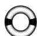

证明. 对于每个序列，我们要证明它收敛到正确的极限

\item
  我们将使用与定理 14.6 相同的证明技巧．给定任意 $\epsilon > 0$ ，因为
  $\left\{ s _ { n } \right\}$ 和 $\{ t _ { n } \}$ 都收敛，所以存在
  $N _ { 1 } , N _ { 2 } \in \mathbb { N }$ 使得

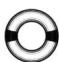

### 第16章 柯西序列与单调序列

\subsection{第 16 章
柯西序列与单调序列}

在讨论收敛性时，我们看到一些序列可能在一个度量空间中收敛，但在另一个度量空间中却发散．因此，与闭集和开集一样，收敛性取决于序列所在的度量空间．那么是否存在一种与收敛性相似，但不依赖于度量空间的性质呢？是的，有！就像紧性那样，柯西序列是在任何度量空间中都成立的性质：某个度量空间中的柯西序列在任何度量空间中都是柯西序列

定义 16.1 (柯西序列).

$\left\{ p _ { n } \right\}$ 是度量空间 X
中的任意一个序列．如果对于任意 $\epsilon > 0$ ，存在某个自然数
N，使得对于任意大于等于 N 的 n 和 m 均有
$d ( p _ { n } , p _ { m } ) < \epsilon$ ，那么
$\left\{ p _ { n } \right\}$ 就是一个柯西序列

用符号来表示，即如果

$$
\forall \epsilon > 0, \exists N \in \mathbb {N} 使得 n, m \geqslant N \implies d (p _ {n}, p _ {m}) <   \epsilon ,
$$

那么 $\left\{ p _ { n } \right\}$ 就是一个柯西序列

这与定义 14.3
中的收敛性不一样吗？不一样！关键区别在于，柯西序列满足$d ( p _ { n } , p _ { m } ) < \epsilon$
，这与收敛序列中的 $d ( p _ { n } , p ) < \epsilon$
不同．柯西序列并不是越来越接近于某一点，而是元素之间的距离会越来越小．在柯西序列中，给定任意距离
$\epsilon > 0$ 在某一项之后，序列中任意两个元素之间的距离都会小于 

$N _ { \epsilon }$ 挑战在这里同样适用，但要稍作修改．给定任意
$\epsilon > 0$ ，你能找到一个 N使得
$p _ { N } , p _ { N + 1 } , p _ { N + 2 } , \cdot \cdot$ ·
彼此之间的距离都小于  吗？

例 16.2 (柯西序列).

定义柯西序列的过程引出了以下问题：如果元素之间的距离越来越近，那么它们怎么可能不收敛到某一个点呢？

举一个简单的例子，对于任意 $n \in \mathbb { N }$ ，令
$p _ { n } = { \frac { 1 } { n } }$ ，并设
$\left\{ p _ { n } \right\}$ 所在的度量空间为
$X = \mathbb { R } \backslash \{ 0 \}$ ．那么
$\left\{ p _ { n } \right\}$ 在 X 中不收敛，因为 0 不是 X 的元素．但
$\left\{ p _ { n } \right\}$ 是柯西序列．为什么？如果
$n , m \geqslant N$ ，我们有

$$
d (p _ {n}, p _ {m}) = \left| \frac {1}{n} - \frac {1}{m} \right| \leqslant \max \left\{\frac {1}{n}, \frac {1}{m} \right\} \leqslant \frac {1}{N}.
$$

对于任意 $\epsilon > 0$ ，我们希望 $1 < N \epsilon$ ，所以令
$\begin{array} { r } { N = \left\lceil \frac { 1 } { \epsilon } \right\rceil + 1 } $
就是个不错的选择

再举一个例子，在度量空间 Q 中，设 $s _ { n }$ 为 $\sqrt { 2 }$
保留前 n 位小数的近似值因此，
$s _ { n } = 1 . 4 , 1 . 4 1 , 1 . 4 1 4 , \cdot \cdot \cdot$
，序列中的每个元素都是有理数，因为我们可以将这些小数改写为 14 ,
${ \frac { 1 4 1 } { 1 0 0 } } , { \frac { 1 4 1 4 } { 1 0 0 0 } } , \cdots$
．由于这个序列收敛到 $\sqrt { 2 }$ ，所以
$\left\{ s _ { n } \right\}$ 在 $\mathbb { Q }$ 中不收敛．但是
$\left\{ s _ { n } \right\}$ 是柯西序列．为什么？如果
$n , m \geqslant N$ ，我们有

$$
d (p _ {n}, p _ {m}) \leqslant 1 0 ^ {- N}.
$$

对于任意 $\epsilon > 0$ ，我们希望
$- N < \log _ { 1 0 } ( \epsilon )$ ，所以令
$N = { m a x } \left\{ 0 , \lceil - \log _ { 1 0 } ( \epsilon ) \rceil \right\} + 1$
就是个不错的选择

这可能会导致你认为柯西序列只能在类似于
的度量空间中收敛，而关键因素是最小上界性（因此柯西序列不可能收敛到任何``洞''）．你是对的！我们很快就会看到
具有一个被称为完备性的性质，这意味着``每个柯西序列都收敛''

虽然仅在完备度量空间中才有``柯西序列 =⇒
收敛序列''，但事实证明在任何度量空间中，``收敛序列 =⇒ 柯西序列''

定理 16.3 (收敛序列 =⇒ 柯西序列).

设 $\left\{ p _ { n } \right\}$ 是度量空间 X 中的任意一个序列．如果
$\left\{ p _ { n } \right\}$ 收敛到某个 $p \in X$ 那么
$\left\{ p _ { n } \right\}$ 是一个柯西序列

证明. 对于任意 $\epsilon > 0$ ，存在一个 $N \in \mathbb N$ ，使得当
$n \geqslant N$ 时
$\begin{array} { r } { d ( p _ { n } , p ) < \frac { \epsilon } { 2 } } $
．当然，对于任意 $m \geqslant N$ ，我们也有
$\begin{array} { r } { d ( p _ { m } , p ) < \frac { \epsilon } { 2 } } $
．那么对于任意 $n , m \geqslant N$ ，由三角不等式可得

$$
d (p _ {n}, p _ {m}) \leqslant d (p _ {n}, p) + d (p, p _ {m}) <   \frac {\epsilon}{2} + \frac {\epsilon}{2} = \epsilon .
$$

因为这对每一个 $\epsilon > 0$ 均成立，所以
$\left\{ p _ { n } \right\}$ 肯定是一个柯西序列

在继续研究柯西序列之前，我们先定义直径的概念．虽然一开始看起来很棘手，但它会为我们提供一种更直观的方法来考察柯西序列，并将帮助我们证明一些原本很难证明的定理

定义 16.4 (直径).

设 E 是度量空间 X 的任意一个非空子集．E 的直径是 E
中每两个元素之间的距离的上确界

用符号来表示，即：

$$
{diam} E = \sup \{d (p, q) \mid p, q \in E \}.
$$

例 16.5 (直径).

下列集合均视为度量空间 R 的子集：

\item
  如果 $E = \{ 1 , 2 , 3 \}$ ，那么

$$
{diam} E = \sup \{d (1, 2), d (2, 3), d (1, 3) \} = \sup \{1, 1, 2 \} = 2.
$$

\item
  如果 $E = [ - 3 , 3 ]$ ，那么 \$ d i a m  E = 6 \$
  ．这表明直径基本上就是它听起来的样子：从集合的一端到另一端的长度
\item
  如果 $E = [ - 3 , 3 )$ ，那么 diamE 仍等于 6，因为

$$
\{d (- 3, p) \mid p \in [ - 3, 3) \} = [ 0, 6),
$$

这个区间的最小上界是 6

\item
  如果 $E = [ 0 , \sqrt { 2 } )$ ，那么
  $ d i a m  E = { \sqrt { 2 } } .$ ．即使我们将 E
  看作度量空间 Q的子集， $E$ 的直径仍然是 $\sqrt { 2 }$
  ，因为直径不必是所在度量空间中的元素．为什么？因为直径是一组距离的上确界．回忆一下定义
  9.1，任何距离都是一个实数，所以每个直径也都是实数
\item
  如果 $E = [ 0 , \infty )$ ，那么 E 没有直径，因为 E
  中各点之间的距离是无界的
\item
  我们还可以考虑直径的序列．例如，对于任意 $n \in \mathbb { N }$ ，令
  $A _ { n } = [ 0 , \frac { 1 } { n } )$ ，现在取序列

$$
{diam} A _ {1}, {diam} A _ {2}, {diam} A _ {3}, \dots ,
$$

即 1, ${ \frac { 1 } { 2 } } , { \frac { 1 } { 3 } } , \cdots$ ．那么

$$
\lim _ {n \to \infty} diam A _ {n} = \lim _ {n \to \infty} \frac {1}{n} = 0.
$$

注意，直径序列都是正实数序列

下面的讨论将有助于阐明即将给出的定理

设 $\left\{ p _ { n } \right\}$ 是任意一个序列， $E _ { N }$
是该序列从第 N 项开始的范围，那么 $E _ { N } =$
$\{ p _ { N } , p _ { N + 1 } , p _ { N + 2 } , \cdot \cdot \cdot \}$
．我们可以构造序列
$\dim E _ { 1 } , \dim E _ { 2 } , \dim E _ { 3 } , \cdot \cdot .$
，并通过考察
$\scriptstyle { l i m } _ { N \to \infty } \dim E _ { N }$
来判断 $E _ { N }$ 是否收敛．需要说明的是，这是序列

$$
{diam} \left\{p _ {1}, p _ {2}, p _ {3}, p _ {4}, \dots \right\}, {diam} \left\{p _ {2}, p _ {3}, p _ {4}, \dots \right\}, {diam} \left\{p _ {3}, p _ {4}, \dots \right\}, \dots ,
$$

的极限，如图 16.1 所示

如果 $p _ { n } \to p$ ，那么
$\begin{array} { r } { { l i m } _ { N \to \infty } \dim E _ { N } = 0 } $
．为什么？对于任意 $\epsilon > 0$ ，存在一个
$N \in  { \mathbb { N } }$ ，使得当 $n \geqslant N$ 时有
$\begin{array} { r } { d ( p _ { n } , p ) < \frac { \epsilon } { 2 } } $
．换句话说，对于每一个 $\epsilon > 0$ ，存在某个 $E _ { N }$
，其直径 diam $E _ { N } < \epsilon$ ．（为什么这里是
，而不是最初使用的 $\frac { \epsilon } { 2 }$ 呢？因为可能出现
$\begin{array} { r } { p _ { n } = p - \frac { \epsilon } { 2 }  ~ H ~  p _ { n + 1 } = p + \frac { \epsilon } { 2 } } $
的情况．因为每个点到 $p$ 的距离最多为 $\frac { \epsilon } { 2 }$
，所以任意两点之间的距离最多为 ．）因此，对于任意 $\epsilon > 0$
，序列 $\{ \dim E _ { n } \}$ 中存在一个小于  的点
$ d i a m  E _ { N }$

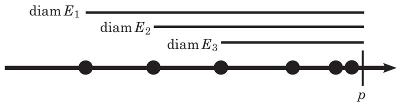

图 16.1 给定的序列 $\left\{ p _ { n } \right\}$ 收敛到
p（其前几个元素由直线上的点来表示），序列 $\{ \dim E _ { n } \}$
的前几个元素如图所示

实际上，当 $n \geqslant N$ 时，对于所有 $E _ { n }$
都是如此，因为我们知道 $E _ { n } \subset E _ { N }$ ，于是

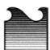
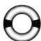
### 第17章 子序列极限

\subsection{第 17 章
子序列极限}

回顾一下``交替''序列的经典例子，即对于任意 $n \in \mathbb { N }$ 有
$\begin{array} { r } { p _ { n } = ( - 1 ) ^ { n } + \frac { ( - 1 ) ^ { n } } { n } } $
（参见图 14.4 和图
14.5）．虽然这个序列看起来好像确实收敛到了两个不同的极限，但它是发散的．为了更好地理解这类序列，我们应该建立这样一种序列理论，即序列发散但又有非常显著的子序列极限

在定理 15.9 中，我们得到序列 $\left\{ p _ { n } \right\}$
，并考察了集合 $E ^ { * }$ ，它是由全体子序列极限（即
$\left\{ p _ { n } \right\}$
的收敛子序列的极限）组成的．因此，我们的目标是更加详细地研究这类集合，尤其是研究它的上下界性质．为什么？因为这些界限有时候可以为我们提供诸如
$\begin{array} { r } { p _ { n } = ( - 1 ) ^ { n } + \frac { ( - 1 ) ^ { n } } { n } } $
这类序列的有价值的信息

为了考察一个序列的全体子序列极限的边界，仅仅知道哪些子序列收敛是不够的．我们还想知道发散的子序列是否都趋向于无穷大或者无穷小．例如，取序列
1, 2, 1, 3, 1, 4, 1, 5, · · · ．这里唯一的子序列极限是 1（因为 1, 1, 1,
· · · 是一个子序列），但是还有其他子序列（比如 2,3,4,· ·
·）会增加到无穷大．因此，认为全体子序列极限的上界是 1
并不合理．实际上，这里的子序列极限没有上界，因为很多子序列都变得任意大

考虑到所有这些复杂情况，我们需要一种方法来区分发散序列和虽然发散但却变得任意大的序列．因此，在本章的其余部分中，我们将讨论扩张的实数系
R∪$\{ + \infty , - \infty \}$ 中的序列，定义 5.10
对扩张的实数系做出了解释

不要惊慌！这至少比考察 $\mathbb { R } ^ { k }$
或任意度量空间中的序列要容易．我们所做的一切应该适用于任何一个满足下列条件的有序域，即具有最小上界性且
$+ \infty$ 和$- \infty$ 有合理定义

定义 17.1 (发散到无穷大).

设 $\left\{ s _ { n } \right\}$ 是度量空间 R
中的任意一个序列．如果对于任意 $M \in$ R，存在某个自然数
N，使得对于每一个大于等于 N 的 n 有 $s _ { n } \geqslant M$ ，那么
$\left\{ s _ { n } \right\}$ 就发散到无穷大

用符号来表示，即如果

$$
\forall M \in \mathbb {R}, \exists N \in \mathbb {N} \quad {使得} \quad n \geqslant N \implies s _ {n} \geqslant M  ,
$$

则记作
$\scriptstyle { l i m } _ { n \to \infty } s _ { n } = + \infty$
（或简写成 $s _ { n } \to + \infty \ )$

同样地，如果对于任意 M ∈ R，存在某个自然数 N，使得对于每一个大于等于 N
的 n 有 $s _ { n } \leqslant M$ ，那么 $\left\{ s _ { n } \right\}$
也发散到无穷大

用符号来表示，即如果

$$
\forall M \in \mathbb {R}, \exists N \in \mathbb {N} \quad 使得 \quad n \geqslant N \implies s _ {n} \leqslant M,
$$

则记作
$\begin{array} { r } { { l i m } _ { n \to \infty } s _ { n } = - \infty } $
（或简写成 $s _ { n } \to - \infty { } )$

将极限符号和箭头符号（→）用于发散到无穷大的序列是对符号的滥用．我们并不是说
$\left\{ s _ { n } \right\}$ 以某种方式收敛．相反，我们说的是
$\left\{ s _ { n } \right\}$
发散并且可以变得任意大．这里使用与收敛序列相同符号的唯一原因是，当定义由子序列极限组成的集合时，我们会更加方便（因为这个集合可能包含
$+ \infty$ 和 $- \infty )$ ）

例 17.2 (发散到无穷大).

对于任意 $n \in \mathbb { N }$ ，如果 $s _ { n } = n ^ { 2 }$
，那么序列 $\left\{ s _ { n } \right\}$ 发散到无穷大，记作
$s _ { n } \to \infty$ 如果 $s _ { n } = - 5 n$ ，那么
$s _ { n } \to - \infty$ ．如果 $s _ { n } = ( - 1 ) ^ { n }$
，那么序列 $\left\{ s _ { n } \right\}$ 是发散的，但它不发散到无穷大

同样地，如果对于任意 $n \in \mathbb N$ ，令
$s _ { n } = ( - 1 ) ^ { n } n$ ，那么 $\left\{ s _ { n } \right\}$
是发散的，但它不发散到无穷大．为什么 $? \left\{ s _ { n } \right\}$
的值不是任意趋向于 $+ \infty$ 和 $- \infty$
吗？是的，但这正是问题所在！序列在大正数和大负数之间波动．给定任意
$M \in$ R，我们不能说存在某个 $N \in \mathbb { N }$
，使得对于所有大于等于 N 的 n 均有 $s _ { n } \geqslant M$
，因为$s _ { n + 1 } = - ( s _ { n } + 1 ) < M$ ．如果我们让
$s _ { n } \leqslant M$
，则会出现相同的问题．另一方面，$\left\{ s _ { n } \right\}$
确实有一个发散到 $+ \infty$ 的子序列，而剩下的部分则发散到
$- \infty$

定理 17.3 (无界 ⇐⇒ 一个子序列发散到无穷大).

设 $\left\{ s _ { n } \right\}$ 是度量空间 R 中的任意一个序列
$\left\{ s _ { n } \right\}$ 是无界的当且仅当
$\left\{ s _ { n } \right\}$ 的某个子序列发散到无穷大

证明. 如果 $\left\{ s _ { n } \right\}$ 是无界的，那么对于任意
$q \in$ 和任意 $M \in \mathbb { R }$ ，序列中存在一个元素
$s _ { n }$ 满足 $| s _ { n } - q | > M$ ．因此对于任意
M，有一个元素 $s _ { n }$ 使得 $s _ { n } \geqslant M$ （或
$s _ { n } \leqslant M )$ ．由于 M 是任意数，所以
$\left\{ s _ { n } \right\}$ 中还有另一个满足
$s _ { n } \geqslant M + 1$ （或$s _ { n } \leqslant M - 1 )$
）的元素，另一个满足 $s _ { n } \geqslant M + 2$ （或
$s _ { n } \leqslant M - 2 \ O )$ ）的元素，等等因此，
$\left\{ s _ { n } \right\}$
中有无穷多个元素大于（或小于）M，那么由这些元素组成的子序列将发散到无穷大

如果 $\left\{ s _ { n } \right\}$ 的某个子序列
$\left\{ { { s } _ { n _ { k } } } \right\}$
发散到无穷大，那么对于任意 $M \in \mathbb { R }$ ，我们都可以找到一个
$N \in \mathbb N$ ，使得当 $k \geqslant N$ 时
$s _ { n _ { k } } \geqslant M$
（为了简单起见，我们假设它发散到正无穷大；如果是负无穷大，相同的论证仍然适用）．因此，给定任意
$q \in$ R和任意 $M < \infty , \ \left\{ s _ { n } \right\}$
中有无穷多个元素满足 $s _ { n } \geqslant M + q + 1$ ，即
$s _ { n } - q > M$ 同样地， $\left\{ s _ { n } \right\}$
中也有无穷多个元素满足 $s _ { n } \geqslant - M + q + 1$ ，即
$s _ { n } - q > - M$ ．所以 $\left\{ s _ { n } \right\}$
中至少有一个元素使得 $| s _ { n } - q | > M$ ，因此
$\left\{ s _ { n } \right\}$ 无界 □

下面是我们致力于给出的重要定义

定义 17.4 (上极限和下极限).

设 $\left\{ s _ { n } \right\}$ 是度量空间 R 中的任意一个序列，E
是满足下列条件的数 $x \in$ R ∪ $\{ + \infty , - \infty \}$
的集合：存在某个子序列 $\left\{ { { s } _ { n _ { k } } } \right\}$
使得 $s _ { n _ { k } } \to x .$

设
$s ^ { * } = { s u p } E , \ s _ { * } = { i n f } E .$
．那么 $s ^ { * }$ 是 $\left\{ s _ { n } \right\}$ 的上极限，而 s∗
是 $\left\{ s _ { n } \right\}$ 的下极限．记作
$\begin{array} { r } { { l i m } { s u p } _ { n \to \infty } s _ { n } = s ^ { * } } $
${ l i m } { i n f } _ { n \to \infty } s _ { n } = s _ { * }$

在定理 15.9 中，我们把子序列极限的集合记作 $E ^ { * }$ ．这里的集合 E
则略有不同．如果 $\left\{ s _ { n } \right\}$ 的某个子序列
$\left\{ { { s } _ { n _ { k } } } \right\}$ 发散到无穷大，那么 E 就是
$\left\{ s _ { n } \right\}$ 的全体子序列极限再加上 +∞ 和
−∞．这样定义是合理的，因为如果 x 在扩张的实数系中，并且
$s _ { n _ { k } } \to x$ ，那么 x 可以是实数，但如果子序列
$\left\{ { { s } _ { n _ { k } } } \right\}$ 发散到无穷大，那么 x
也可以是 +∞ 或 −∞

记住，在扩张的实数系中，如果一个集合没有上界，那么它的上确界就是
$+ \infty$ 如果一个集合没有下界，那么它的下确界就是 $- \infty$
．因此，如果 $\left\{ s _ { n } \right\}$ 的某个子序列
$\left\{ { { s } _ { n _ { k } } } \right\}$ 满足
$s _ { n _ { k } } \to + \infty$ ，那么 $s ^ { * } = + \infty$
；如果 $s _ { n _ { k } } \to - \infty$ ，那么
$s _ { * } = - \infty ,$

为了方便起见，在本章的其余部分，我们不写``E 是满足下列条件的数 $x \in$
R ∪ $\{ + \infty , - \infty \}$ 的集合：存在某个子序列
$\{ s _ { n _ { k } } \}$ ，使得
$s _ { n _ { k } } \to x ^ { \prime \prime }$ ，而只写 $^ { 6 6 } E$
是 $\left\{ s _ { n } \right\}$ 的全体子序列极限 *
的集合''．这里的星号（*）表示 E 是所有子序列极限的集合，但如果
$\left\{ s _ { n } \right\}$ 的某个子序列发散到无穷大，那么 E 中就包含
+∞ 和（或）−∞．（但要记住，+∞ 和 $- \infty$ 实际上并不是极限．）

抱怨．我讨厌``lim
sup''这个符号，它太令人困惑了！上极限并不是某一类上确界序列的极限，但这个符号可能会让你产生这样的误解．实际上，上极限是全体子序列极限的上确界．所以它应该写得更像``sup
lim''才有助于你记忆

另外，上极限不是极限．它是由子序列极限所组成的集合的边界．这个符号中看不出任何与子序列相关的东西！

$^ { * } n  \infty ^ { \prime \prime }$ 让情况变得更糟．在序列中，符号
$\scriptstyle { l i m } _ { n \to \infty } s _ { n } = s$
和 $s _ { n } \to s$ 的意义相同，所以你可能认为我们也可以将
$\scriptstyle { l i m } { s u p } _ { n \to \infty } s _ { n } = s ^ { * }$
记作 ${ s u p } s _ { n } \to s ^ { * }$
但不能这样做．写 ${ s u p } s _ { n } \to s ^ { * }$
就等同于写
$\begin{array} { r } { { l i m } _ { n \to \infty } { s u p } s _ { n } = s ^ { * } } $
（注意，这里的$^ { * } n \to \infty ^ { \prime \prime }$
放在了``lim''下面，而不是``sup''下面）．无论哪种方式，这都没有多大意义，因为每个
$s _ { n }$ 都是一个点，不是集合，而你只能对集合取上确界

最糟糕的是，大多数人把``lim sup''读作``limb soup''，这听起来并不特别开胃

我们使用 lim sup
的通用定义，但你应该知道还存在其他的（等价）定义．另一个定义确实将 lim
sup
定义为一个上确界序列的极限，这与符号更一致，但这个定义在证明接下来的定理时很难使用

\subsection{例 17.5
(上极限和下极限).}

对于度量空间 R 中的以下每个序列，设 E 是其全体子序列极限 * 的集合

\item
  对于任意 $n \in \mathbb { N }$ ，令
  $s _ { n } = [ ( - 1 ) ^ { n } + 1 ] n$ ，那么如图 17.1 所示，当 n
  为奇数时， $s _ { n } = 0$ ；当 n 为偶数时， $s _ { n } = 2 n$
  ．所以 $\left\{ s _ { n } \right\}$ 的每个子序列要么收敛到
  0，要么发散到无穷大．（记住，像 12
  这样的数并不是子序列的极限，因为任何一个以 4,8,12
  为开头的子序列其后都必须有无穷多项．）

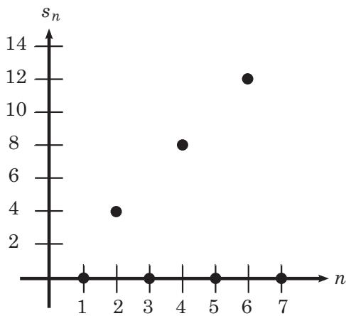

图 17.1 序列 $s _ { n } = [ ( - 1 ) ^ { n } + 1 ] n$ 的前几个元素

对于任意 $k \in \mathbb N$ ，令 $n _ { k } = 2 k$ ，那么子序列
$\{ s _ { n _ { k } } \}$ 就是
$s _ { 2 } , s _ { 4 } , s _ { 6 } , \cdot \cdot \cdot = 4 , 8 .$
$1 2 , \cdots$ ．换句话说，对于每一个 $k \in \mathbb N$ 有
$s _ { n _ { k } } = 4 k$ ，并且我们想证明它发散到无穷大．给定任意
$M \in$ R，我们需要找到一个 $N \in  { \mathbb { N } }$ ，使得当
$k \geqslant N$ 时有 $s _ { n _ { k } } \geqslant M$ 令
$\begin{array} { r } { N = \lceil \frac { M } { 4 } \rceil } $
，于是有

$$
k \geqslant N \implies s _ {n _ {k}} = 4 k \geqslant 4 \left\lceil \frac {M}{4} \right\rceil \geqslant M.
$$

因此 $\left\{ s _ { n } \right\}$ 的子序列极限 * 的集合就是二元集
$E = \{ 0 , + \infty \}$ ．那么 $s ^ { * } = + \infty$
且$s _ { * } = 0$ ，或者换句话说

$$
\lim _ {n \to \infty} \sup s _ {n} = + \infty   且   \lim _ {n \to \infty} \inf s _ {n} = 0.
$$

\item
  对于任意 $n \in \mathbb { N }$ ，令 $s _ { n } = 1$ ，那么
  $\left\{ s _ { n } \right\}$ 的每一个子序列都收敛到 1．因此
  $E = \{ 1 \}$ ，所以 $s ^ { * } = 1$ 且 $s _ { * } = 1$
  ，也就是说

$$
\lim _ {n \to \infty} \sup s _ {n} = 1   且   \lim _ {n \to \infty} \inf s _ {n} = 1.
$$

\item
  回顾例 14.2，Q 的元素可以排列成一个序列 $\left\{ s _ { n } \right\}$
  ．任意给定一个实数 $x$ ，我们实际上可以构造一个
  $\left\{ s _ { n } \right\}$ 的子序列，使其收敛到 x．如例 16.2
  所示，只需对 x 进行越来越精确的十进制展开即可

等等，该怎么做呢？我们从未见过从 N 到 Q 的显式映射，所以我们对
$\left\{ s _ { n } \right\}$
中元素的排列顺序一无所知．如果想找到一个收敛到 $\sqrt { 2 }$
的子序列，我们不一定非要取 1.4, 1.41, 1.414, · · · ，因为在序列
$\left\{ s _ { n } \right\}$ 中 1.41 可能位于 1.4
之前；另一方面，我们知道有无穷多个有理数接近 ${ \sqrt { 2 } } .$
．于是，在序列中首先找到 1.4，然后找到 1.41．如果在
$\left\{ s _ { n } \right\}$ 中已经出现了 1.41，那就查找 1.414；如果在
$\left\{ s _ { n } \right\}$ 中已经出现了 1.414，则查找
1.4142，以此类推．由于存在无穷多个点趋向于 $\sqrt { 2 }$ ，并且在
$\left\{ s _ { n } \right\}$ 中只有有限多个点可能出现在 1.4 之前，因此
1.4 之后肯定有无穷多个点，所以这个子序列是有效的

按照相同的逻辑，由于 $\left\{ s _ { n } \right\}$ 的范围是 Q，而 Q
既无上界也无下界，所以$\left\{ s _ { n } \right\}$ 存在发散到
$+ \infty$ 和 $- \infty$ 的子序列．因此，E
实际上就是整个扩张的实数系，所以
$s ^ { * } = + \infty , \ s _ { * } = - \infty$ ，换句话说，

$$
\lim _ {n \to \infty} \sup s _ {n} = + \infty   且   \lim _ {n \to \infty} \inf s _ {n} = - \infty .
$$

\item
  以经典的``交替''序列为例，对于任意 $n \in \mathbb { N }$ ，令
  $\begin{array} { r } { p _ { n } = ( - 1 ) ^ { n } + \frac { ( - 1 ) ^ { n } } { n } } $
  （参见图 14.4 和图 14.5）．这个序列是发散的，但是偶数元素收敛到
  1，而奇数元素收敛到 −1．注意，任何子序列都不可能收敛到其他极限

因此 $E = \{ - 1 , 1 \}$ ，所以 $s ^ { * } = 1$ 且
$s _ { * } = - 1$ ，也就是说，

$$
\lim _ {n \to \infty} \sup s _ {n} = 1   且   \lim _ {n \to \infty} \inf s _ {n} = - 1.
$$

这就是上极限和下极限对我们有用的原因．如果只说``这个序列是发散的''，那么我们就完全忽略了它看起来确实收敛到两个不同的点这一事实

定理 17.6 (收敛序列的上极限和下极限).

设 $\left\{ s _ { n } \right\}$ 是度量空间 R 中的任意一个序列
$\left\{ s _ { n } \right\}$ 收敛到有限数 $s \in \mathbb R$ 当且仅当

$$
\limsup _ {n \to \infty} s _ {n} = \liminf _ {n \to \infty} s _ {n} = s.
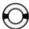

证明. 为了证明第二个方向，我们要证明 $\left\{ s _ { n } \right\}$
的每个子序列都是有界的．然后利用波尔查诺--魏尔斯特拉斯定理（定理
15.8）得出， $\left\{ s _ { n } \right\}$ 的每个子序列都有一个收敛到 s
的子序列．如果 $\left\{ s _ { n } \right\}$ 不收敛到 s，那么
$\left\{ s _ { n } \right\}$ 就有一个不收敛到 s 的子序列，从而产生矛盾

为
$\overline { { \int } } \overline { { \boldsymbol { J } } } ^ {  n  \overline { { \mathsf { z } } } }$
格地说明这一点，假设对于同一个有限数 $s \in \mathbb R$
${ l i m } { s u p } _ { n \to \infty } s _ { n } = s$
且
${ l i m } { i n f } _ { n \to \infty } s _ { n } = s$
．那么 $\left\{ s _ { n } \right\}$ 的全体子序列极限 * 的集合 E
就由单个点 s 组成，因此 $\left\{ s _ { n } \right\}$
的每个收敛子序列都会收敛到 s

另外， $\left\{ s _ { n } \right\}$ 的子序列不可能发散到无穷大（否则
$\scriptstyle { l i m } { s u p } _ { n \to \infty } s _ { n } = + \infty$
，或者
${ l i m } { i n f } _ { n \to \infty } s _ { n } = - \infty )$
）．因此，根据定理 $1 7 . 3 , \{ s _ { n } \}$ 是有界的

如果序列 $\left\{ s _ { n } \right\}$ 不收敛到 s，那么存在一个
$\epsilon > 0$ ，使得对于无穷多个自然数 n 有
$s _ { n } - s \geqslant \epsilon ~ \cdot ~$ （或
$s - s _ { n } \geqslant \epsilon ) .$ ．设
$\left\{ { { s } _ { n _ { k } } } \right\}$ 是由
$\left\{ s _ { n } \right\}$ 中所有这些元素组成的子序列．因为
$\left\{ s _ { n } \right\}$ 是有界的，所以
$\{ s _ { n _ { k } } \}$
也是有界的，那么根据波尔查诺--魏尔斯特拉斯定理，
$\left\{ { { s } _ { n _ { k } } } \right\}$ 的某个子序列
$\{ s _ { n _ { k _ { i } } } \}$ 收敛．但是
$\left\{ { { s } _ { n _ { k } } } \right\}$ 的每个元素都
$\geqslant s + \epsilon$ （或 $\leqslant s - \epsilon )$ ，所以
$\{ s _ { n _ { k _ { j } } } \}$ 的每个元素也都
$\geqslant s + \epsilon$ （或 $\leqslant s - \epsilon )$ ，因此
$\{ s _ { n _ { k _ { j } } } \}$ 不可能收敛到
s．（这种收敛是不可能的，因为  是一个固定的正数．）因此，我们找到了
$\left\{ s _ { n } \right\}$ 的一个子序列，它收敛到 s
之外的某个数，这是一个矛盾．因此$\left\{ s _ { n } \right\}$
一定收敛到 s

另一个方向要容易得多．假设 $\left\{ s _ { n } \right\}$ 收敛到某个点
$s \in$ R．那么根据定理 15.6，$\left\{ s _ { n } \right\}$
的每个子序列都收敛到 s．于是， $\left\{ s _ { n } \right\}$
的全体子序列极限 * 的集合 E 由单个点 s 组成，所以

$$
\limsup _ {n \to \infty} s _ {n} = \sup E = \sup \{s \} = s = \inf \{s \} = \inf E = \liminf _ {n \to \infty} s _ {n}.
$$

我们要问的下一个问题是：``每个序列的上极限和下极限都一定是某个子序列的极限吗？''我们已经看到了一些不包含其上确界和下确界的集合的例子．那么，每个序列的全体子序列极限
*
的集合是否一定包含其上确界和下确界？答案是\ldots\ldots 请击鼓欢呼\ldots\ldots 是的！

定理 17.7 (上极限和下极限都是子序列极限 *).

设 $\left\{ s _ { n } \right\}$ 是度量空间 R 中的任意一个序列，E
是其子序列极限 * 的集合．那么，

$s ^ { * } = { l i m } { s u p } _ { n \to \infty } s _ { n }$
是 E 的一个元素，
$s _ { * } = { l i m } { i n f } _ { n \to \infty } s _ { n }$
也是 E 的一个元素

换句话说， $\left\{ s _ { n } \right\}$ 的某个子序列收敛到
$s ^ { * }$ ，并且 $\left\{ s _ { n } \right\}$ 的某个子序列收敛到
$s _ { * }$ 证明. 我们首先考察 lim sup．这里有三种可能的情形

情形 1. $s ^ { * } = + \infty$ ．此时 E 在 R
中无上界，那么对于任意给定的 $N \in \mathbb { R }$ 存在一个
$\left\{ s _ { n } \right\}$ 的子序列
$\left\{ { { s } _ { n _ { k } } } \right\}$ 将收敛到某个
$\geqslant N$ 的值．对于任意
$\epsilon > 0 , \left\{ s _ { n _ { k } } \right\}$ 中有无穷多个元素
$\geqslant N - \epsilon$ ．于是固定 ，令 $M = N - \epsilon$ ，注意
$\{ s _ { n _ { k } } \}$ 的每个元素也都是
$\left\{ s _ { n } \right\}$ 的元素．因此，对于任意 $M \in$ R，
$\left\{ s _ { n } \right\}$ 中有无穷多个元素 $\geqslant M$
因此存在某个子序列发散到 $+ \infty$ ．所以 $+ \infty \in E$ ，从而有
\$s \^{} \{ * \} \in E \$

情形 2. $s ^ { * } \in \mathbb { R }$ ．此时 E 有上界，并且由定理 15.9
可知 E 是闭集．根据推论 10.11，有上界的闭集包含其上确界，因此
$s ^ { * } \in E$

情形 3. $s ^ { * } = - \infty$ ．此时 E 中不存在大于 $- \infty$
的元素，所以 $- \infty$ 一定是 E的唯一元素．因此 $s ^ { * } \in E$

对 lim inf 的证明基本上是一样的．请把下框中的空白填充完整

\subsection{证明定理 17.7 中关于 lim inf
的部分}

情形 1. $s _ { * } = + \infty$ ．此时 E 中不存在 +∞
的元素，所以$+ \infty$ 一定是 E 的唯一元素．因此 $s _ { * } \in$

情形 2. $s _ { * } \in \mathbb { R } .$ ．此时 E 有 界，并且由定理
可知 E 是闭集．根据推论 10.11，有下界的 集包含其下确界，因此 $\in E .$

情形 \$~3 . ~s \_ \{ * \} = \$ ．此时 E 在 R 中无 ，那么对于任意给定的
$N \in \mathbb { R }$ 和任意
$\epsilon > 0 , \{ s _ { n _ { k } } \}$ 中有无穷多个元素
$\leqslant .$ 因此，对于任意
$M \in \mathbb { R } , \ \{ s _ { n } \}$ 中有 个元素 $\leqslant M$
，因此存在某个子序列发散到 ．所以 $- \infty \in E$ ，从而有
$s _ { * } \in E$

我们可能还想知道，精确指出一个序列的上极限能否得到关于这个序列本身的所有信息，而不仅仅是其子序列的信息．事实证明，上极限其实就是序列中
(在某一项之后) 所有元素的上界

定理 17.8 (作为序列边界的上极限和下极限).

设 $\left\{ s _ { n } \right\}$ 是度量空间 R 中的任意一个序列，E
是其子序列极限 * 的集合，并设
$s ^ { * } = { l i m } { s u p } _ { n \to \infty } s _ { n }$
．那么对于任意 $x > s ^ { * }$ ，存在一个 $N \in \mathbb N$ ，使得当
$n \geqslant N$ 时有 $s _ { n } < x$

同样地，设
$s _ { * } = { l i m } { i n f } _ { n \to \infty } s _ { n }$
．那么对于任意 $x < s _ { * }$ ，存在一个 $N \in  { \mathbb { N } }$
，使得只要 $n \geqslant N$ 就有 $s _ { n } > x$

换句话说，任何大于上极限的数也大于序列中（在某一项之后）的任何元素

注意，只有当 $s ^ { * }$ 不是 $+ \infty$ 时，我们才能取到满足
$x > s ^ { * }$ 的 x．同样地，如果 $s _ { * } = - \infty$
，那么我们不可能取到满足 $x < s _ { * }$ 的 $x .$

证明. 我们利用反证法来证明．如果存在一个 $x > s ^ { * }$
，使得对于任意 $N \in \mathbb N$ 存在某个 $n \geqslant N$ 满足
$s _ { n } \geqslant x$ ，那么就有无穷多个 n 满足
$s _ { n } \geqslant x .$ ．于是，所有这些元素构成了
$\left\{ s _ { n } \right\}$ 的一个子序列
$\left\{ { { s } _ { n _ { k } } } \right\}$ ，其中每个元素都满足
$s _ { n _ { k } } \geqslant x$

现在我们按照定理 17.6 的证明给出相同的论述

情形 1. 如果 $\left\{ { { s } _ { n _ { k } } } \right\}$
是无界的，那么根据定理 17.3，它有一个发散到无穷大的子序列
$\{ s _ { n _ { k _ { i } } } \}$ ．那么
$+ \infty \in E  ~ ( ~  s _ { n _ { k _ { i } } }  - \infty$
是不可能的，因为 $\{ s _ { n _ { k _ { i } } } \}$
的每个元素都大于一个固定的数 $x )$ ，这是一个矛盾，因为
$+ \infty > x > s ^ { * }$ ，但 $s ^ { * }$ 是 $E$ 的上确界

情形 2. 如果 $\{ s _ { n _ { k } } \}$
是有界的，那么根据波尔查诺--魏尔斯特拉斯定理，它有一个收敛的子序列
$\{ s _ { n _ { k _ { i } } } \}$ ．因为
$\left\{ { { s } _ { n _ { k } } } \right\}$ 的每个元素都
$\geqslant x$ ，所以
$\left\{ { { s _ { n _ { k _ { j } } } } } \right\}$ 的每个元素也都
$\geqslant x$ ，因此这个子序列一定收敛到某个 $y \geqslant x$ ，并且
$y \in E .$ ．这样就产生了一个矛盾，因为 $y \geqslant x > s ^ { * }$
，但 $s ^ { * }$ 是 E 的上确界

请留意我们是如何利用看似不必要的 x
值的．如果定理说的是``存在一个$N \in \mathbb N$ ，使得当
$n \geqslant N$ 时有 $s _ { n } \leqslant s ^ { * } ^ { * }$
''，那么该定理不一定成立，因为我们可能只找到了一个收敛到
$y \geqslant s ^ { * }$ 的子序列．这不会给我们带来矛盾，因为 y
可能等于$s ^ { * }$ ，这与 $s ^ { * } = { s u p } E$
的事实并非不一致．我们需要一个严格大于 $s ^ { * }$ 的 x
来得出$y > s ^ { * }$

对 $s _ { * }$ 的证明基本上是一样的．请把下框中的空白填充完整

\subsection{证明定理 17.8 中关于 lim inf
的部分}

如果存在一个 $x < s _ { * }$ ，使得对于任意 $N \in \mathbb N$
，存在某个 $n \geqslant N$ 满足 $s _ { n } \leqslant$
x，那么我们可以构造一个子序列
$\left\{ { { s } _ { n _ { k } } } \right\}$ ，其中每个元素都满足
$s _ { n _ { k } }$ ⩽

情形 1. 如果 $\left\{ { { s } _ { n _ { k } } } \right\}$
是无界的，那么根据定理 ，它有一个无穷大的子序列
$\{ s _ { n _ { k _ { j } } } \}$ ．于是， $\in E$
，这是一个矛盾，因为 \textless{}$x < s _ { * }$

情形 2. 如果 $\left\{ { { s } _ { n _ { k } } } \right\}$
是有界的，那么根据 定理，它有一个 的子序列
$\{ s _ { n _ { k _ { j } } } \}$ ．因为
$\left\{ { { s } _ { n _ { k } } } \right\}$ 的每个元素都
$\leqslant x$ ，所以 的每个元素也都 $\leqslant x$
，因此这个子序列一定收敛到某个 $y \leqslant x$ ，所以
∈E．这样就产生了一个矛盾，因为 ⩽ $x < s _ { * }$

前面几个定理帮助我们证明了，对于任意一个序列，总是恰好有一个上极限和一个下极限．这相当于断言了存在性（即至少有一个上极限和一个下极限）和唯一性（即最多有一个上极限和一个下极限）

定理 17.9 (上极限和下极限的存在性与唯一性).

设 $\left\{ s _ { n } \right\}$ 是度量空间 R
中的任意一个序列．（在扩张的实数系中） $s ^ { * } =$
${ l i m } \ { s u p } \ s _ { n }$
存在且是唯一的，（在扩张的实数系中）
$s _ { * } = { l i m } _ { n \to \infty } s _ { n }$
存在且是n→∞$w / \dot { \Xi } - \dot { \Xi } \stackrel { . } { \cdot }$

证明. 为了证明存在性，我们只需证明子序列极限 * 的集合 E 是非空的．如果
E无上界，那么在这种情况下 $s ^ { * } = + \infty$ ；如果 E
有上界，那么可以利用 R 的最小上界性来断言
$s ^ { * } = { s u p } E$ 存在．同样地，如果 E
无下界，那么 $s _ { * } = - \infty$ ；否则，我们可以利用 R
的最大下界性来断言 $s _ { * } = { i n f } E$ 存在

为了证明 E 是非空的，我们将使用经典的论证方法．如果
$\left\{ s _ { n } \right\}$ 是无界的，那么根据定理
17.3，某个序列会发散到无穷大，所以要么 $+ \infty \in E$ ，要么
$- \infty \in E$ 否则， $\left\{ s _ { n } \right\}$
是有界的，那么根据波尔查诺--魏尔斯特拉斯定理，存在一个子序列收敛到某个点
s，所以 $s \in E$

为了证明唯一性，我们从 lim sup 开始．如果存在两个不同的数 $p$ 和 $q$
（其中 $p < q )$ ，并且
$p = { l i m } { s u p } _ { n \to \infty } s _ { n } , q = { l i m } { s u p } _ { n \to \infty } s _ { n }$
，那么我们会得到一个矛盾．为什么？任取一个满足 $p < x < q$ 的实数
x．那么根据定理 17.8，存在一个$N \in \mathbb N$ ，使得只要
$n \geqslant N$ 就有 $s _ { n } < x$ ．于是，
$\left\{ s _ { n } \right\}$ 的每个子序列都只能收敛到一个
$\leqslant x$ 的数，因此 $\left\{ s _ { n } \right\}$
的任何子序列都不可能收敛到 $q$ （因为 $q > x ^ { ) }$
．那么$q \notin E$ ，这与定理 17.7 相矛盾

同样地，如果存在两个不同的数 $p$ 和 $q$ （其中 $p < q )$ ，并且
$p = { l i m } { i n f } _ { n \to \infty } s _ { n } .$
$q = { l i m } { i n f } _ { n \to \infty } s _ { n }$
，那么任取一个满足 $p < x < q$ 的实数 x．根据定理 17.8，存在一个
$N \in \mathbb N$ ，使得只要 $n \geqslant N$ 就有
$s _ { n } > x .$ ．于是， $\left\{ s _ { n } \right\}$
的任何子序列都不可能收敛到 p，这与定理 17.7 相矛盾 □

定理 17.10 (上极限和下极限的比较).

设 $\left\{ s _ { n } \right\}$ 和 $\{ t _ { n } \}$ 是度量空间 R
中的任意两个序列，N 是任意一个自然数如果对于每一个 $n \geqslant N$
均有 $s _ { n } \leqslant t _ { n }$ ，那么
$\left\{ t _ { n } \right\}$ 的上极限大于等于
$\left\{ s _ { n } \right\}$ 的上极限， $\left\{ t _ { n } \right\}$
的下极限大于等于 $\left\{ s _ { n } \right\}$ 的下极限

用符号来表示，即

$$

### 第18章 特殊序列

\subsection{第 18 章
特殊序列}

在结束对序列的研究并继续考察级数之前，让我们先来看看 R
中的一些重要序列（它们在实分析研究中反复出现）并证明它们是收敛的．这些序列（及其极限）分别是：

\item
  $\begin{array} { r } { \frac { 1 } { n ^ { p } }  0 } $
  （当 $p > 0$ 时）
\item
  $\sqrt [ n ] { p }  1$ （当 $p > 0$ 时）
\item
  $\sqrt [ n ] { n }  1$
\item
  $\frac { n ^ { \alpha } } { ( 1 + p ) ^ { n } } \to 0$ （当
  $p > 0$ 且 $\alpha \in$ R 时）
\item
  $x ^ { n } \to 0$ （当 $| x | < 1$ 时）

为了证明它们的收敛性，首先需要证明实数序列的夹逼定理

定理 18.1 (夹逼定理).

设 $\left\{ s _ { n } \right\} , \left\{ a _ { n } \right\}$ 和
$\left\{ b _ { n } \right\}$ 是度量空间 R 中的序列，并且对于每一个
$n \in \mathbb { N }$
有$a _ { n } \leqslant s _ { n } \leqslant b _ { n }$ ．如果
$a _ { n }$ 和 $b _ { n }$ 收敛到相同的实数 s，那么 $s _ { n }$
也收敛到这个实数 s用符号来表示，即对于 R 中的任意序列
$\{ s _ { n } \} , \{ a _ { n } \} , \{ b _ { n } \}$ ：

$$
a _ {n} \leqslant s _ {n} \leqslant b _ {n} \forall n \in \mathbb {N}, \lim _ {n \to \infty} a _ {n} = s 且 \lim _ {n \to \infty} b _ {n} = s \Rightarrow \lim _ {n \to \infty} s _ {n} = s.
$$

从根本上说，正如我们在图 18.1 中所看到的，对于任意一个序列
$\left\{ s _ { n } \right\}$ ，如果 $\left\{ s _ { n } \right\}$
夹在两个收敛到同一点的序列之间，那么当 n 趋向于无穷大时， $s _ { n }$
就被``压缩''到这个点

证明. 对于任意 $\epsilon > 0$ ，可以利用收敛的定义来得到两个自然数
$N _ { 1 }$ 和 $N _ { 2 }$ ，使得

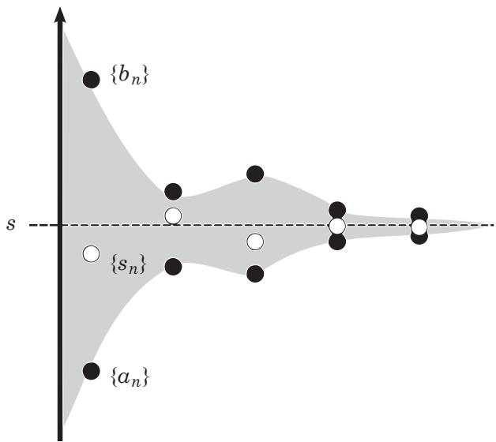

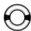

