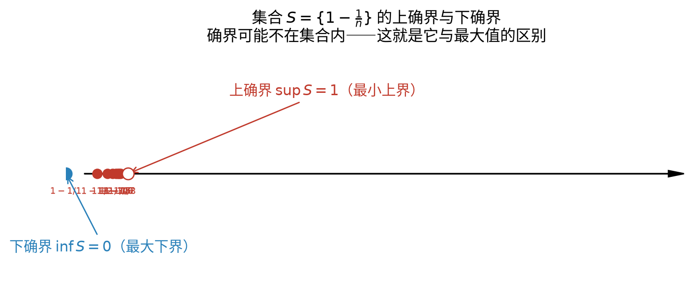
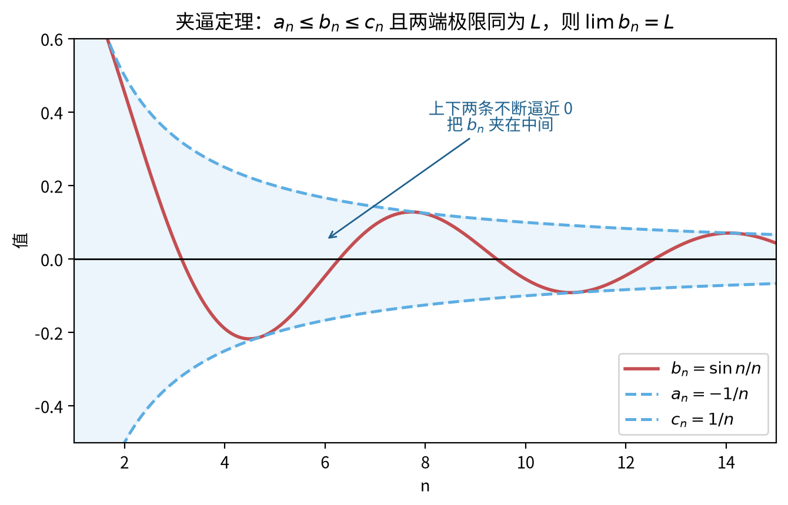
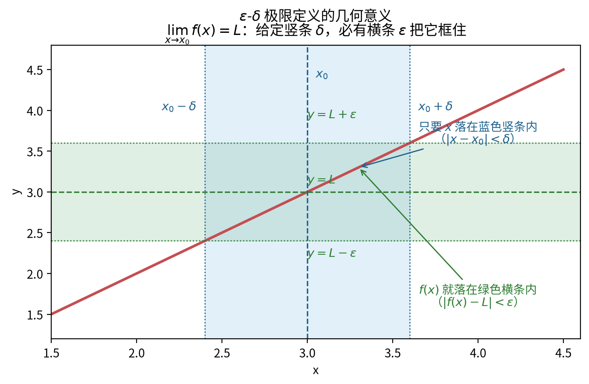
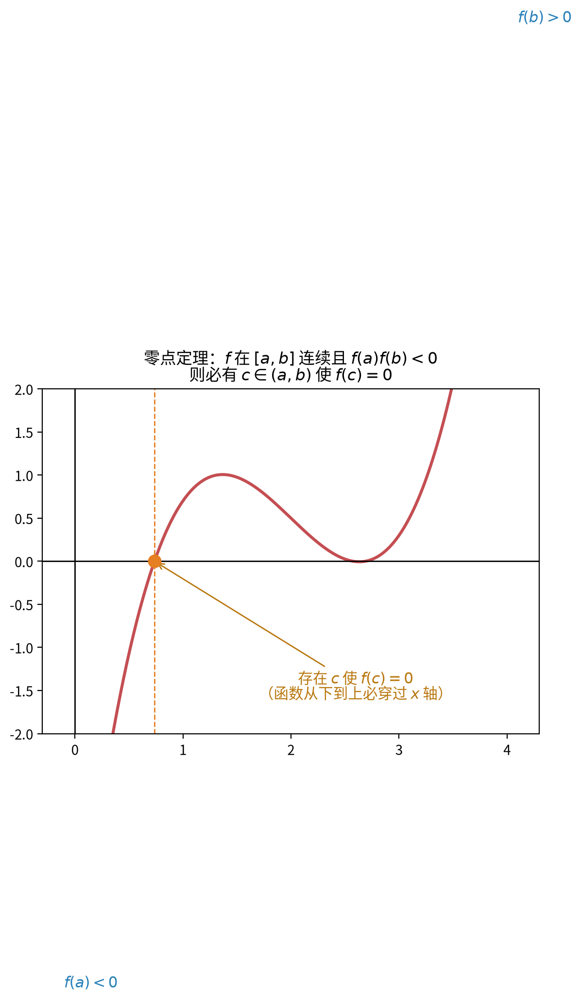

# 第 10 级：实数系与极限 (Real Number System and Limits)

> 微积分的逻辑基础建立在对实数系的深刻理解之上。本章将从数系的扩张开始，系统地建立极限理论，为后续的微积分学习打下坚实的基础。

---

## 1. 学习目标

完成本教程后，你应当能够：

1. 理解数系的扩张过程：$\mathbb{N} \subset \mathbb{Z} \subset \mathbb{Q} \subset \mathbb{R}$
2. 掌握实数的完备性公理（确界原理）和 Archimedes 性质
3. 熟练运用 $\varepsilon$-$N$ 语言定义数列极限并证明极限
4. 理解并证明极限的基本性质：唯一性、有界性、四则运算法则
5. 掌握夹逼定理和单调有界定理及其应用
6. 理解柯西收敛准则（Cauchy Criterion）及其意义
7. 熟悉 $\varepsilon$-$\delta$ 语言定义函数极限
8. 掌握无穷小与无穷大的概念及其阶的比较
9. 能够运用极限理论解决实际问题

---

## 2. 实数系

### 2.1 数系的扩张

数学分析的研究对象是实数。我们从自然数开始，逐步扩张数系：

| 数系 | 符号 | 定义 | 举例 |
|:---:|:---:|------|------|
| 自然数 | $\mathbb{N}$ | $\{1, 2, 3, \dots\}$ | $1, 2, 100$ |
| 整数 | $\mathbb{Z}$ | $\{\dots, -2, -1, 0, 1, 2, \dots\}$ | $-3, 0, 42$ |
| 有理数 | $\mathbb{Q}$ | $\{\frac{p}{q} \mid p \in \mathbb{Z}, q \in \mathbb{Z}\setminus\{0\}\}$ | $\frac{1}{2}, -\frac{3}{4}, 0.333\ldots$ |
| 实数 | $\mathbb{R}$ | 有理数与无理数的全体 | $\sqrt{2}, \pi, e$ |
| 复数 | $\mathbb{C}$ | $\{a+bi \mid a,b \in \mathbb{R}\}$ | $1+i, 2-3i$ |

它们之间的包含关系是：

$$
\mathbb{N} \subset \mathbb{Z} \subset \mathbb{Q} \subset \mathbb{R} \subset \mathbb{C}
$$

### 2.2 自然数 $\mathbb{N}$ 与整数 $\mathbb{Z}$

**自然数** $\mathbb{N}$ 是最基本的数系，满足 Peano 公理：
- 存在一个自然数 $1$（或 $0$，视定义而定）
- 每个自然数都有唯一的后继
- 数学归纳法原理成立

**整数** $\mathbb{Z}$ 在自然数的基础上引入了 $0$ 和负数的概念，使得减法运算封闭。也就是说，任意两个整数的差仍然是整数。

### 2.3 有理数 $\mathbb{Q}$

有理数是形如 $\frac{p}{q}$（$p, q \in \mathbb{Z}$，$q \neq 0$）的数的全体。有理数对加、减、乘、除（除数不为零）四种运算封闭，构成了一个**数域**。

有理数的一个重要特征是：**有理数可以表示为有限小数或无限循环小数**。

然而，有理数对极限运算不封闭。例如，考虑数列：

$$
a_1 = 1,\quad a_2 = 1.4,\quad a_3 = 1.41,\quad a_4 = 1.414,\quad a_5 = 1.4142,\quad \dots
$$

这个数列的每一项都是有理数，但它趋近于 $\sqrt{2}$，而 $\sqrt{2}$ 不是有理数。这说明有理数存在"空隙"。

### 2.4 无理数的发现

古希腊的毕达哥拉斯学派认为"万物皆数"，即一切量都可以用有理数表示。但该学派的 Hippasus 发现，边长为 $1$ 的正方形的对角线长度 $\sqrt{2}$ 无法表示为两个整数的比。

**证明 $\sqrt{2}$ 是无理数**（反证法）：

假设 $\sqrt{2} = \frac{p}{q}$，其中 $p, q$ 是互质的正整数。则 $2 = \frac{p^2}{q^2}$，即 $p^2 = 2q^2$。因此 $p^2$ 是偶数，$p$ 也是偶数。设 $p = 2k$，代入得 $4k^2 = 2q^2$，即 $q^2 = 2k^2$，所以 $q$ 也是偶数。这与 $p, q$ 互质矛盾。因此 $\sqrt{2}$ 不是有理数。

### 2.5 实数 $\mathbb{R}$

**定义**：实数是有理数和无理数的全体。实数与数轴上的点一一对应。

实数有两种等价的构造方式：

1. **Dedekind 分割**：实数是有理数集的一个分割（Dedekind cut）
2. **Cauchy 序列**：实数是所有有理数 Cauchy 序列的等价类

### 2.6 实数的完备性（Completeness）

这是实数区别于有理数的最根本性质。

**确界原理**（Supremum Principle, 完备性公理）：

> 非空有上界的实数集必有上确界（最小上界）。

等价地：
> 非空有下界的实数集必有下确界（最大下界）。

**定义**（上确界）：设 $S \subset \mathbb{R}$ 非空，$\alpha \in \mathbb{R}$ 称为 $S$ 的**上确界**（记作 $\sup S$），如果：
1. $\forall x \in S,\; x \le \alpha$（$\alpha$ 是上界）
2. $\forall \varepsilon > 0,\; \exists x \in S,\; x > \alpha - \varepsilon$（$\alpha$ 是最小的上界）

**定义**（下确界）：设 $S \subset \mathbb{R}$ 非空，$\beta \in \mathbb{R}$ 称为 $S$ 的**下确界**（记作 $\inf S$），如果：
1. $\forall x \in S,\; x \ge \beta$（$\beta$ 是下界）
2. $\forall \varepsilon > 0,\; \exists x \in S,\; x < \beta + \varepsilon$（$\beta$ 是最大的下界）

**例**：设 $S = \{1 - \frac{1}{n} \mid n \in \mathbb{N}\}$，则 $\sup S = 1$，$\inf S = 0$。

> **直观理解（现实类比）**：上确界就像**"天花板"**——它是所有上界中最小的那个；下确界则像**"地板"**，是所有下界中最大的那个。它们与"最大值/最小值"的关键区别在于：**确界不一定在集合里**。
>
> 看上面的例子：$S=\{1-\tfrac{1}{n}\}$ 的所有点都严格小于 1，所以 1 不是 $S$ 的最大值；但 1 是"能达到的极限高度"，任何比 1 小的数都挡不住点无限逼近它——这就是"最小上界"的含义。**确界原理说的是：只要集合有界，这个"天花板/地板"就一定存在**（实数才有的性质，有理数不一定有）。

### 2.7 Archimedes 性质

**Archimedes 性质**：对任意正实数 $a, b$，总存在自然数 $n$，使得 $na > b$。

等价地：
- 对任意 $\varepsilon > 0$，存在自然数 $n$，使得 $\frac{1}{n} < \varepsilon$
- 对任意实数 $M$，存在自然数 $n$，使得 $n > M$

**证明**（由确界原理导出）：

假设结论不成立，即存在 $a > 0, b > 0$，对任意 $n \in \mathbb{N}$ 都有 $na \le b$。则集合 $A = \{na \mid n \in \mathbb{N}\}$ 有上界 $b$。由确界原理，$A$ 有上确界 $\alpha = \sup A$。

由于 $\alpha - a < \alpha$（$a > 0$），$\alpha - a$ 不是 $A$ 的上界，因此存在 $m \in \mathbb{N}$ 使得 $ma > \alpha - a$，即 $(m+1)a > \alpha$。但 $(m+1)a \in A$，这与 $\alpha$ 是上界矛盾。故假设不成立。

### 2.8 实数完备性的等价定理

> 除确界原理外，实数完备性还有多个等价刻画。它们与确界原理相互推导，是数学分析中证明极限、连续、一致连续等性质的理论基石。总计**六大定理**。

**区间套定理（Cantor 定理）**：

> 设 $\{[a_n, b_n]\}$ 是一列闭区间，满足 $a_n \le a_{n+1} < b_{n+1} \le b_n$（后一个套在前一个里面），且 $b_n - a_n \to 0$（$n \to \infty$），则存在**唯一**的点 $\xi$ 属于所有区间，即 $\xi \in \bigcap_{n=1}^{\infty}[a_n, b_n]$，且 $\lim a_n = \lim b_n = \xi$。

**聚点定理（Bolzano–Weierstrass 定理）**：

> 有界无限点集必有聚点。等价地：**有界数列必有收敛子列**。

（聚点：点 $p$ 的任一邻域内都含有集合中异于 $p$ 的点。）

**有限覆盖定理（Heine–Borel 定理）**：

> 设 $\mathcal{O}$ 是闭区间 $[a, b]$ 的一个开覆盖（即区间上每一点都属于某个开区间 $O \in \mathcal{O}$），则从 $\mathcal{O}$ 中必能选出**有限**个开区间，仍覆盖 $[a, b]$。

**六大完备性定理及其等价性**：

| 定理 | 名称 |
|:-----|:-----|
| 确界原理 | 非空有上界集合必有上确界 |
| 单调有界定理 | 单调有界数列必收敛 |
| 区间套定理 | 闭区间套有唯一公共点 |
| 柯西收敛准则 | 数列收敛 $\iff$ 是柯西列 |
| 聚点定理 | 有界数列必有收敛子列 |
| 有限覆盖定理 | 闭区间开覆盖有有限子覆盖 |

> **等价性脉络**：它们以确界原理为公理，彼此可互相推出，刻画的是同一条完备性。常用推导链例如
> $$
> \text{确界原理} \Rightarrow \text{单调有界} \Rightarrow \text{区间套} \Rightarrow \text{柯西准则} \Rightarrow \text{聚点定理} \Rightarrow \text{有限覆盖}
> $$
> 反向也可逐条推回，故合称"实数的完备性定理"。

---

## 3. 数列极限

### 3.1 数列的概念

**定义**：数列是以自然数集为定义域的函数 $a: \mathbb{N} \to \mathbb{R}$，记作 $\{a_n\}_{n=1}^{\infty}$ 或简写为 $\{a_n\}$。

数列的项按顺序排列：$a_1, a_2, a_3, \dots, a_n, \dots$

### 3.2 极限的 $\varepsilon$-$N$ 定义

**定义**：设 $\{a_n\}$ 是一个数列，$A$ 是一个常数。如果对任意给定的 $\varepsilon > 0$，总存在正整数 $N$，使得当 $n > N$ 时，有

$$
|a_n - A| < \varepsilon
$$

则称数列 $\{a_n\}$ **收敛**于 $A$，$A$ 称为数列的极限，记作

$$
\lim_{n \to \infty} a_n = A
$$

或 $a_n \to A$（$n \to \infty$）。如果不存在这样的 $A$，则称数列**发散**。

**直观理解**：无论我们要求 $a_n$ 与 $A$ 多近（$\varepsilon$ 任意小），总存在一个时刻 $N$ 之后，所有项都在这个范围内。

### 3.3 收敛数列的例子

**例 1**：$\lim_{n \to \infty} \frac{1}{n} = 0$

**证明**：对任意 $\varepsilon > 0$，由 Archimedes 性质，存在 $N \in \mathbb{N}$，使得 $N > \frac{1}{\varepsilon}$。当 $n > N$ 时，

$$
\left|\frac{1}{n} - 0\right| = \frac{1}{n} < \frac{1}{N} < \varepsilon
$$

因此 $\lim_{n \to \infty} \frac{1}{n} = 0$。

**例 2**：$\lim_{n \to \infty} \frac{n}{n+1} = 1$

**证明**：对任意 $\varepsilon > 0$，需要 $\left|\frac{n}{n+1} - 1\right| = \frac{1}{n+1} < \varepsilon$。

取 $N = \lceil \frac{1}{\varepsilon} \rceil$，当 $n > N$ 时，$\frac{1}{n+1} < \frac{1}{n} \le \frac{1}{N} < \varepsilon$。$\square$

### 3.4 发散数列的例子

**例 3**：$\{(-1)^n\}$ 发散

**证明**（反证法）：假设 $\lim_{n \to \infty} (-1)^n = A$。取 $\varepsilon = \frac{1}{2}$，则存在 $N$，当 $n > N$ 时 $|(-1)^n - A| < \frac{1}{2}$。

取两个足够大的奇数 $m$ 和偶数 $k$，则 $|(-1)^m - A| = | -1 - A| < \frac{1}{2}$，$|(-1)^k - A| = |1 - A| < \frac{1}{2}$。

由三角不等式：

$$
2 = |1 - (-1)| \le |1 - A| + |A - (-1)| < \frac{1}{2} + \frac{1}{2} = 1
$$

矛盾。故数列发散。$\square$

---

## 4. 定理与证明

### 4.1 极限的唯一性

**定理**：收敛数列的极限是唯一的。

**证明**（反证法）：

假设 $\lim_{n \to \infty} a_n = A$ 且 $\lim_{n \to \infty} a_n = B$，且 $A \neq B$。

取 $\varepsilon = \frac{|A - B|}{2} > 0$。

由极限定义：
- 存在 $N_1$，当 $n > N_1$ 时，$|a_n - A| < \varepsilon$
- 存在 $N_2$，当 $n > N_2$ 时，$|a_n - B| < \varepsilon$

取 $N = \max\{N_1, N_2\}$，当 $n > N$ 时，由三角不等式：

$$
|A - B| \le |A - a_n| + |a_n - B| < \varepsilon + \varepsilon = 2\varepsilon = |A - B|
$$

得到 $|A - B| < |A - B|$，矛盾。故 $A = B$。$\square$

### 4.2 收敛数列的有界性

**定理**：如果数列 $\{a_n\}$ 收敛，则 $\{a_n\}$ 有界。即存在 $M > 0$，使得对一切 $n$，$|a_n| \le M$。

**证明**：

设 $\lim_{n \to \infty} a_n = A$。取 $\varepsilon = 1$，则存在 $N$，当 $n > N$ 时，$|a_n - A| < 1$。

由三角不等式，当 $n > N$ 时：

$$
|a_n| = |a_n - A + A| \le |a_n - A| + |A| < 1 + |A|
$$

令 $M = \max\{|a_1|, |a_2|, \dots, |a_N|, 1 + |A|\}$，则对一切 $n$，$|a_n| \le M$。$\square$

**注**：该定理的逆命题不成立。有界数列不一定收敛，如 $\{(-1)^n\}$ 有界但不收敛。

### 4.3 极限的四则运算法则

**定理**：设 $\lim_{n \to \infty} a_n = A$，$\lim_{n \to \infty} b_n = B$，则：

1. **加法**：$\lim_{n \to \infty} (a_n + b_n) = A + B$
2. **减法**：$\lim_{n \to \infty} (a_n - b_n) = A - B$
3. **乘法**：$\lim_{n \to \infty} (a_n \cdot b_n) = A \cdot B$
4. **除法**：若 $B \neq 0$，则 $\lim_{n \to \infty} \frac{a_n}{b_n} = \frac{A}{B}$

**证明**：

**(1) 加法**：对任意 $\varepsilon > 0$，存在 $N_1, N_2$ 使得：
- 当 $n > N_1$ 时，$|a_n - A| < \frac{\varepsilon}{2}$
- 当 $n > N_2$ 时，$|b_n - B| < \frac{\varepsilon}{2}$

取 $N = \max\{N_1, N_2\}$，当 $n > N$ 时：

$$
|(a_n + b_n) - (A + B)| \le |a_n - A| + |b_n - B| < \frac{\varepsilon}{2} + \frac{\varepsilon}{2} = \varepsilon
$$

**(3) 乘法**：先证明 $\{b_n\}$ 有界，即存在 $M > 0$，$|b_n| \le M$ 对一切 $n$ 成立。

对任意 $\varepsilon > 0$：
- 存在 $N_1$，当 $n > N_1$ 时，$|a_n - A| < \frac{\varepsilon}{2M}$
- 存在 $N_2$，当 $n > N_2$ 时，$|b_n - B| < \frac{\varepsilon}{2(|A| + 1)}$

取 $N = \max\{N_1, N_2\}$，当 $n > N$ 时：

$$
\begin{aligned}
|a_n b_n - AB| &= |a_n b_n - a_n B + a_n B - AB| \\
&\le |a_n|\cdot|b_n - B| + |B|\cdot|a_n - A| \\
&\le (|A| + 1)\cdot\frac{\varepsilon}{2(|A| + 1)} + M\cdot\frac{\varepsilon}{2M} = \varepsilon
\end{aligned}
$$

**(4) 除法**：只需证明 $\lim_{n \to \infty} \frac{1}{b_n} = \frac{1}{B}$，然后与乘法结合。

由于 $B \neq 0$，取 $\varepsilon = \frac{|B|}{2}$，存在 $N_1$，当 $n > N_1$ 时，$|b_n - B| < \frac{|B|}{2}$，从而 $|b_n| > \frac{|B|}{2}$。

对任意 $\varepsilon > 0$，存在 $N_2$，当 $n > N_2$ 时，$|b_n - B| < \frac{B^2}{2}\varepsilon$。

取 $N = \max\{N_1, N_2\}$，当 $n > N$ 时：

$$
\left|\frac{1}{b_n} - \frac{1}{B}\right| = \frac{|b_n - B|}{|b_n|\cdot|B|} < \frac{|b_n - B|}{\frac{|B|}{2} \cdot |B|} = \frac{2|b_n - B|}{B^2} < \varepsilon
$$

$\square$

### 4.4 夹逼定理（Squeeze Theorem）

**定理**：设三个数列 $\{a_n\}$、$\{b_n\}$、$\{c_n\}$ 满足：
1. 存在 $N_0$，当 $n > N_0$ 时，$a_n \le b_n \le c_n$
2. $\lim_{n \to \infty} a_n = \lim_{n \to \infty} c_n = L$

则 $\lim_{n \to \infty} b_n = L$。

**证明**：

对任意 $\varepsilon > 0$：
- 存在 $N_1$，当 $n > N_1$ 时，$|a_n - L| < \varepsilon$，即 $L - \varepsilon < a_n < L + \varepsilon$
- 存在 $N_2$，当 $n > N_2$ 时，$|c_n - L| < \varepsilon$，即 $L - \varepsilon < c_n < L + \varepsilon$

取 $N = \max\{N_0, N_1, N_2\}$，当 $n > N$ 时：

$$
L - \varepsilon < a_n \le b_n \le c_n < L + \varepsilon
$$

即 $|b_n - L| < \varepsilon$。$\square$

**例 4**：求 $\lim_{n \to \infty} \frac{\sin n}{n}$。

**解**：由于 $-1 \le \sin n \le 1$，有 $-\frac{1}{n} \le \frac{\sin n}{n} \le \frac{1}{n}$。

而 $\lim_{n \to \infty} \left(-\frac{1}{n}\right) = \lim_{n \to \infty} \frac{1}{n} = 0$。

由夹逼定理，$\lim_{n \to \infty} \frac{\sin n}{n} = 0$。

> **直观理解（现实类比）**：夹逼定理就是**"两面夹击"**——当一个量被夹在两个"同向逼近同一目标"的量之间时，它**无处可逃**，只能也跟着逼近那个目标。
>
> 看上图：$\frac{\sin n}{n}$ 被 $-\frac{1}{n}$ 和 $\frac{1}{n}$ 上下夹住，而这两个夹子都趋于 0，所以 $\frac{\sin n}{n}$ 必然也趋于 0。**它不需要自己"表现好"，只要夹子决定性地逼近 0，它就被迫跟着走**。这就是处理"有界项 × 无穷小"这类问题的通用利器。

### 4.5 单调有界定理（Monotone Convergence Theorem）

**定理**：单调有界数列必收敛。

具体地：
- 若 $\{a_n\}$ 单调递增且有上界，则 $\{a_n\}$ 收敛，且 $\lim_{n \to \infty} a_n = \sup\{a_n\}$
- 若 $\{a_n\}$ 单调递减且有下界，则 $\{a_n\}$ 收敛，且 $\lim_{n \to \infty} a_n = \inf\{a_n\}$

**证明**（仅证递增有上界的情况）：

设 $\{a_n\}$ 单调递增且有上界。令 $S = \{a_n \mid n \in \mathbb{N}\}$，则 $S$ 非空有上界。由确界原理，$S$ 有上确界 $\alpha = \sup S$。

下面证明 $\lim_{n \to \infty} a_n = \alpha$。

对任意 $\varepsilon > 0$，由 $\alpha - \varepsilon < \alpha$ 及上确界的定义，存在 $N$，使得 $a_N > \alpha - \varepsilon$。

由于 $\{a_n\}$ 单调递增，当 $n > N$ 时，$a_n \ge a_N > \alpha - \varepsilon$。

又因为 $\alpha$ 是上界，$a_n \le \alpha$，所以 $|a_n - \alpha| = \alpha - a_n < \varepsilon$。

故 $\lim_{n \to \infty} a_n = \alpha$。$\square$

**例 5**：证明数列 $a_n = \left(1 + \frac{1}{n}\right)^n$ 收敛。

**证明思路**：可以证明 $\{a_n\}$ 单调递增且有上界（上界为 $3$），因此由单调有界定理，数列收敛。其极限定义为 $e$。

### 4.6 柯西收敛准则（Cauchy Criterion）

**定义**（Cauchy 序列）：数列 $\{a_n\}$ 称为 Cauchy 序列，如果对任意 $\varepsilon > 0$，存在正整数 $N$，使得对任意 $m, n > N$，有

$$
|a_m - a_n| < \varepsilon
$$

**柯西收敛准则**：数列 $\{a_n\}$ 收敛当且仅当它是 Cauchy 序列。

**证明概要**：

**必要性**：若 $\lim_{n \to \infty} a_n = A$，则对任意 $\varepsilon > 0$，存在 $N$，当 $n > N$ 时 $|a_n - A| < \frac{\varepsilon}{2}$。当 $m, n > N$ 时，

$$
|a_m - a_n| \le |a_m - A| + |A - a_n| < \frac{\varepsilon}{2} + \frac{\varepsilon}{2} = \varepsilon
$$

**充分性**：若 $\{a_n\}$ 是 Cauchy 序列，则先证明 $\{a_n\}$ 有界，然后利用 Bolzano-Weierstrass 定理（有界数列必有收敛子列）和 Cauchy 条件推出原数列收敛到同一极限。

**意义**：柯西收敛准则给出了数列收敛的充要条件，且不需要预先知道极限值。这在理论上极为重要。

### 4.7 重要极限：$\lim_{n \to \infty} \left(1 + \frac{1}{n}\right)^n = e$

**证明思路**：

定义 $a_n = \left(1 + \frac{1}{n}\right)^n$，$b_n = \left(1 + \frac{1}{n}\right)^{n+1}$。

**Step 1**：证明 $\{a_n\}$ 单调递增。

利用二项式定理展开：

$$
\begin{aligned}
a_n &= \left(1 + \frac{1}{n}\right)^n \\
&= \sum_{k=0}^n \binom{n}{k} \frac{1}{n^k} \\
&= \sum_{k=0}^n \frac{1}{k!} \cdot \frac{n(n-1)\cdots(n-k+1)}{n^k} \\
&= \sum_{k=0}^n \frac{1}{k!} \left(1 - \frac{1}{n}\right)\left(1 - \frac{2}{n}\right)\cdots\left(1 - \frac{k-1}{n}\right)
\end{aligned}
$$

类似地，

$$
a_{n+1} = \sum_{k=0}^{n+1} \frac{1}{k!} \left(1 - \frac{1}{n+1}\right)\left(1 - \frac{2}{n+1}\right)\cdots\left(1 - \frac{k-1}{n+1}\right)
$$

比较 $a_n$ 和 $a_{n+1}$ 的对应项，$a_{n+1}$ 的每一项都大于等于 $a_n$ 的对应项，且 $a_{n+1}$ 还多了一个正项。因此 $a_{n+1} > a_n$。

**Step 2**：证明 $\{a_n\}$ 有上界。

$$
\begin{aligned}
a_n &= \sum_{k=0}^n \frac{1}{k!} \left(1 - \frac{1}{n}\right)\cdots\left(1 - \frac{k-1}{n}\right) \\
&\le \sum_{k=0}^n \frac{1}{k!} \\
&< 1 + 1 + \frac{1}{2} + \frac{1}{2^2} + \cdots + \frac{1}{2^{n-1}} \\
&= 1 + \frac{1 - (1/2)^n}{1 - 1/2} = 3 - \frac{1}{2^{n-1}} < 3
\end{aligned}
$$

**Step 3**：由单调有界定理，$\{a_n\}$ 收敛，定义其极限为 $e$。

数值计算：$e \approx 2.718281828459045\ldots$

---

## 5. 函数极限

### 5.1 $\varepsilon$-$\delta$ 定义

**定义**：设函数 $f$ 在点 $x_0$ 的某个去心邻域内有定义，$A$ 是一个常数。如果对任意 $\varepsilon > 0$，总存在 $\delta > 0$，使得当 $0 < |x - x_0| < \delta$ 时，有

$$
|f(x) - A| < \varepsilon
$$

则称 $f(x)$ 当 $x \to x_0$ 时以 $A$ 为极限，记作

$$
\lim_{x \to x_0} f(x) = A
$$

**直观理解**：当 $x$ 无限接近 $x_0$（但不等于 $x_0$）时，$f(x)$ 无限接近 $A$。

> **直观理解（现实类比）**：想象一个**射箭靶**。极限 $L$ 是靶心，$\varepsilon$ 是你立的"命中标准"（必须射进靶心周围 $\varepsilon$ 范围内）。$\varepsilon$-$N$（或 $\varepsilon$-$\delta$）定义说的是：**不管你把标准定得多严（$\varepsilon$ 多小），我总能找到一个对应的"瞄准范围"（$\delta$），只要箭落在 $x_0$ 附近 $\delta$ 内，就一定能命中你的标准**。
>
> 上图绿色横条是"$\varepsilon$ 目标"，蓝色竖条是"$\delta$ 允许范围"。**只要蓝色竖条里所有 $x$ 的函数值都落在绿色横条里，极限就成立**。这就是"任意给你 $\varepsilon$，我都能找到 $\delta$"这句抽象定义的几何含义——看懂这张图，就真正理解了极限。

### 5.2 单侧极限

**左极限**：如果对任意 $\varepsilon > 0$，存在 $\delta > 0$，使得当 $x_0 - \delta < x < x_0$ 时，$|f(x) - A| < \varepsilon$，则记作 $\lim_{x \to x_0^-} f(x) = A$。

**右极限**：如果对任意 $\varepsilon > 0$，存在 $\delta > 0$，使得当 $x_0 < x < x_0 + \delta$ 时，$|f(x) - A| < \varepsilon$，则记作 $\lim_{x \to x_0^+} f(x) = A$。

**定理**：$\lim_{x \to x_0} f(x) = A$ 当且仅当 $\lim_{x \to x_0^-} f(x) = \lim_{x \to x_0^+} f(x) = A$。

### 5.3 极限的 Heine 归并原理

**定理**（Heine 定理）：$\lim_{x \to x_0} f(x) = A$ 当且仅当对任意满足 $x_n \to x_0$ 且 $x_n \neq x_0$ 的数列 $\{x_n\}$，都有 $\lim_{n \to \infty} f(x_n) = A$。

这个定理建立了函数极限与数列极限的联系，是证明函数极限性质的重要工具。

### 5.4 极限 $x \to \infty$ 的情形

**定义**：设函数 $f$ 在区间 $(a, +\infty)$ 上有定义。如果对任意 $\varepsilon > 0$，存在 $X > 0$，使得当 $x > X$ 时，有

$$
|f(x) - A| < \varepsilon
$$

则称 $\lim_{x \to +\infty} f(x) = A$。

类似地定义 $\lim_{x \to -\infty} f(x) = A$ 和 $\lim_{x \to \infty} f(x) = A$（其中 $x \to \infty$ 表示 $|x| \to \infty$）。

### 5.5 函数极限的性质

函数极限也有与数列极限类似的性质：

1. **唯一性**：若极限存在，则唯一
2. **局部有界性**：若 $\lim_{x \to x_0} f(x) = A$，则存在 $\delta > 0$ 和 $M > 0$，使得 $0 < |x - x_0| < \delta$ 时 $|f(x)| \le M$
3. **四则运算法则**：与数列极限相同
4. **夹逼定理**：与数列极限类似

### 5.6 连续函数及其性质

**定义（连续）**：设函数 $f(x)$ 在 $x_0$ 的某邻域内有定义。若 $\lim_{x \to x_0} f(x) = f(x_0)$，则称 $f$ 在点 $x_0$ 处**连续**。

等价地（$\varepsilon$-$\delta$ 定义）：$\forall \varepsilon > 0$，$\exists \delta > 0$，当 $|x - x_0| < \delta$ 时恒有 $|f(x) - f(x_0)| < \varepsilon$。

**增量定义**：令 $\Delta x = x - x_0$，$\Delta y = f(x) - f(x_0)$，则 $f$ 在 $x_0$ 连续 $\iff \lim_{\Delta x \to 0} \Delta y = 0$。

**单侧连续**：$\lim_{x \to x_0^-} f(x) = f(x_0)$ 为左连续，$\lim_{x \to x_0^+} f(x) = f(x_0)$ 为右连续。$f$ 在 $x_0$ 连续 $\iff$ 左右都连续。

**连续函数的运算**：连续函数的和、差、积、商（分母不为零）仍连续；连续函数复合后仍连续。初等函数在其定义域内处处连续。

**闭区间上连续函数的性质**（本部分理论核心）：

> **直观理解**：连续函数在闭区间上的图像是一条不间断的曲线，它必须"扫过"所有中间高度，因此从负到正必穿过 $x$ 轴（零点定理），也必然同时到达最高点和最低点（最值定理）。

1. **有界性**：$f$ 在 $[a,b]$ 上连续 $\Rightarrow$ $f$ 在 $[a,b]$ 上有界。
2. **最值定理**：$f$ 在 $[a,b]$ 上连续 $\Rightarrow$ 存在最大值与最小值（即前面预备知识中的最值定理）。
3. **介值定理**：$f$ 在 $[a,b]$ 上连续，且 $f(a) \neq f(b)$，则对介于 $f(a)$ 与 $f(b)$ 之间的任意值 $C$，都存在 $c \in (a,b)$ 使 $f(c) = C$。
4. **零点定理**（介值定理的推论）：$f$ 在 $[a,b]$ 上连续，且 $f(a) \cdot f(b) < 0$，则存在 $c \in (a,b)$ 使 $f(c) = 0$。

> **直观理解（现实类比）**：连续就是"**笔不离纸**"画出的曲线。零点定理说：如果曲线从 $x$ 轴**下方**一路画到**上方**（$f(a)f(b)<0$），中途**必然**要穿过 $x$ 轴——因为笔没离开纸，要跨到另一侧就绕不开那条线。
>
> 这解释了为什么"连续"如此重要：**它是"一定有解"的保证**。比如方程 $x=\cos x$ 在 $[0,\pi]$ 上必有解，正是因为连续函数 $f(x)=x-\cos x$ 在两端异号。这也是数值计算中"二分法求根"的依据——每次砍半，根必在区间内。

**一致连续（Uniform Continuity）**：

> $f$ 在 $[a,b]$ 上一致连续，如果 $\forall \varepsilon > 0$，$\exists \delta > 0$，对 $[a,b]$ 内**任意** $x_1, x_2$，只要 $|x_1 - x_2| < \delta$，就有 $|f(x_1) - f(x_2)| < \varepsilon$。

**关键区别**：
- **连续**：每点处，$\delta$ 可以随点 $x_0$ 的不同而不同；
- **一致连续**：同一个 $\delta$ 对区间内所有点都成立。

**康托定理（Cantor 定理）**：$f$ 在闭区间 $[a,b]$ 上连续 $\Rightarrow$ $f$ 在 $[a,b]$ 上一致连续。

> **注**：开区间上的连续函数不一定一致连续。例如 $f(x) = \frac{1}{x}$ 在 $(0,1)$ 上连续但**不一致连续**（越靠近 $0$，图像越陡，所需 $\delta$ 越小，无法统一）。

---

## 6. 无穷小与无穷大

### 6.1 无穷小

**定义**：如果 $\lim_{x \to x_0} f(x) = 0$，则称 $f(x)$ 是 $x \to x_0$ 时的**无穷小**。

**性质**：
1. 有限个无穷小的和仍是无穷小
2. 有界函数与无穷小的乘积是无穷小
3. 常数与无穷小的乘积是无穷小
4. 有限个无穷小的乘积是无穷小

### 6.2 无穷大

**定义**：如果对任意 $M > 0$，存在 $\delta > 0$，使得当 $0 < |x - x_0| < \delta$ 时，$|f(x)| > M$，则称 $f(x)$ 是 $x \to x_0$ 时的**无穷大**，记作 $\lim_{x \to x_0} f(x) = \infty$。

类似地定义正无穷大 $+\infty$ 和负无穷大 $-\infty$。

**定理**：在自变量的同一变化过程中：
- 若 $f(x)$ 是无穷大，则 $\frac{1}{f(x)}$ 是无穷小
- 若 $f(x)$ 是无穷小（且 $f(x) \neq 0$），则 $\frac{1}{f(x)}$ 是无穷大

### 6.3 无穷小的阶的比较

设 $\alpha(x)$ 和 $\beta(x)$ 是 $x \to x_0$ 时的无穷小，且 $\beta(x) \neq 0$。

1. 若 $\lim_{x \to x_0} \frac{\alpha(x)}{\beta(x)} = 0$，则称 $\alpha$ 是比 $\beta$ **高阶的无穷小**，记作 $\alpha = o(\beta)$
2. 若 $\lim_{x \to x_0} \frac{\alpha(x)}{\beta(x)} = C \neq 0$，则称 $\alpha$ 与 $\beta$ **同阶无穷小**
3. 若 $\lim_{x \to x_0} \frac{\alpha(x)}{\beta(x)} = 1$，则称 $\alpha$ 与 $\beta$ **等价无穷小**，记作 $\alpha \sim \beta$
4. 若存在 $k > 0$ 使得 $\lim_{x \to x_0} \frac{\alpha(x)}{[\beta(x)]^k} = C \neq 0$，则称 $\alpha$ 是 $\beta$ 的 $k$ **阶无穷小**

**常用等价无穷小**（$x \to 0$ 时）：

| 等价关系 | 条件 |
|:---------|:-----|
| $\sin x \sim x$ | $x \to 0$ |
| $\tan x \sim x$ | $x \to 0$ |
| $\arcsin x \sim x$ | $x \to 0$ |
| $\arctan x \sim x$ | $x \to 0$ |
| $\ln(1 + x) \sim x$ | $x \to 0$ |
| $e^x - 1 \sim x$ | $x \to 0$ |
| $1 - \cos x \sim \frac{1}{2}x^2$ | $x \to 0$ |
| $(1 + x)^\alpha - 1 \sim \alpha x$ | $x \to 0$ |

---

## 7. 示例（Worked Examples）

### 示例 1：用 $\varepsilon$-$N$ 定义证明极限

证明 $\lim_{n \to \infty} \frac{2n + 1}{3n - 2} = \frac{2}{3}$。

**解**：对任意 $\varepsilon > 0$，

$$
\left|\frac{2n + 1}{3n - 2} - \frac{2}{3}\right| = \left|\frac{3(2n+1) - 2(3n-2)}{3(3n-2)}\right| = \left|\frac{6n + 3 - 6n + 4}{3(3n-2)}\right| = \frac{7}{3|3n-2|}
$$

当 $n \ge 1$ 时，$3n - 2 \ge 1$，所以 $\frac{7}{3|3n-2|} \le \frac{7}{3(3n-2)}$。

要求 $\frac{7}{3(3n-2)} < \varepsilon$，即 $n > \frac{1}{3}\left(\frac{7}{3\varepsilon} + 2\right)$。

取 $N = \max\left\{1, \left\lceil \frac{1}{3}\left(\frac{7}{3\varepsilon} + 2\right) \right\rceil \right\}$，当 $n > N$ 时，$|a_n - \frac{2}{3}| < \varepsilon$。$\square$

### 示例 2：用夹逼定理求极限

求 $\lim_{n \to \infty} \frac{n!}{n^n}$。

**解**：由于

$$
0 \le \frac{n!}{n^n} = \frac{1 \cdot 2 \cdot 3 \cdots n}{n \cdot n \cdot n \cdots n} = \frac{1}{n} \cdot \frac{2}{n} \cdot \frac{3}{n} \cdots \frac{n}{n} \le \frac{1}{n} \cdot 1 \cdot 1 \cdots 1 = \frac{1}{n}
$$

而 $\lim_{n \to \infty} 0 = 0$，$\lim_{n \to \infty} \frac{1}{n} = 0$。

由夹逼定理，$\lim_{n \to \infty} \frac{n!}{n^n} = 0$。

### 示例 3：用单调有界定理证明数列收敛

设 $a_1 = \sqrt{2}$，$a_{n+1} = \sqrt{2 + a_n}$。证明 $\{a_n\}$ 收敛并求极限。

**解**：

**Step 1**：证明 $\{a_n\}$ 单调递增且有上界。

用数学归纳法证明 $a_n < 2$ 对一切 $n$ 成立：
- $n = 1$：$a_1 = \sqrt{2} < 2$，成立
- 假设 $a_k < 2$，则 $a_{k+1} = \sqrt{2 + a_k} < \sqrt{2 + 2} = 2$，成立

同时，$a_{n+1} - a_n = \sqrt{2 + a_n} - a_n$。由于 $a_n < 2$，可证 $a_{n+1} > a_n$（可用归纳法）。

**Step 2**：由单调有界定理，$\{a_n\}$ 收敛。设 $\lim_{n \to \infty} a_n = L$。

对递推式两边取极限：

$$
L = \sqrt{2 + L} \implies L^2 = 2 + L \implies L^2 - L - 2 = 0 \implies (L - 2)(L + 1) = 0
$$

由于 $a_n > 0$，$L \ge 0$，故 $L = 2$。

因此 $\lim_{n \to \infty} a_n = 2$。

### 示例 4：利用重要极限

求 $\lim_{n \to \infty} \left(1 + \frac{1}{2n}\right)^n$。

**解**：

$$
\left(1 + \frac{1}{2n}\right)^n = \left[\left(1 + \frac{1}{2n}\right)^{2n}\right]^{1/2}
$$

令 $m = 2n$，当 $n \to \infty$ 时 $m \to \infty$，所以

$$
\lim_{n \to \infty} \left(1 + \frac{1}{2n}\right)^n = \lim_{m \to \infty} \left[\left(1 + \frac{1}{m}\right)^m\right]^{1/2} = e^{1/2} = \sqrt{e}
$$

### 示例 5：函数极限的 $\varepsilon$-$\delta$ 证明

用 $\varepsilon$-$\delta$ 语言证明 $\lim_{x \to 2} (3x - 1) = 5$。

**解**：对任意 $\varepsilon > 0$，需要找到 $\delta > 0$，使得当 $0 < |x - 2| < \delta$ 时，$|(3x - 1) - 5| < \varepsilon$。

计算：

$$
|(3x - 1) - 5| = |3x - 6| = 3|x - 2|
$$

要使 $3|x - 2| < \varepsilon$，只需 $|x - 2| < \frac{\varepsilon}{3}$。

取 $\delta = \frac{\varepsilon}{3}$，则当 $0 < |x - 2| < \delta$ 时，$|(3x - 1) - 5| = 3|x - 2| < 3\delta = \varepsilon$。$\square$

### 示例 6：单侧极限

讨论函数 $f(x) = \frac{|x|}{x}$ 在 $x = 0$ 处的极限。

**解**：

当 $x > 0$ 时，$f(x) = \frac{x}{x} = 1$，所以 $\lim_{x \to 0^+} f(x) = 1$。

当 $x < 0$ 时，$f(x) = \frac{-x}{x} = -1$，所以 $\lim_{x \to 0^-} f(x) = -1$。

由于左右极限不相等，$\lim_{x \to 0} f(x)$ 不存在。

### 示例 7：无穷小的阶的比较

确定当 $x \to 0$ 时，$f(x) = \sqrt{1 + x} - 1$ 的阶。

**解**：

$$
\lim_{x \to 0} \frac{\sqrt{1 + x} - 1}{x} = \lim_{x \to 0} \frac{(\sqrt{1 + x} - 1)(\sqrt{1 + x} + 1)}{x(\sqrt{1 + x} + 1)} = \lim_{x \to 0} \frac{x}{x(\sqrt{1 + x} + 1)} = \lim_{x \to 0} \frac{1}{\sqrt{1 + x} + 1} = \frac{1}{2}
$$

因此 $\sqrt{1 + x} - 1 \sim \frac{1}{2}x$，即 $f(x)$ 是 $x$ 的一阶无穷小。

### 示例 8：利用等价无穷小求极限

求 $\lim_{x \to 0} \frac{\sin 3x}{\tan 5x}$。

**解**：当 $x \to 0$ 时，$\sin 3x \sim 3x$，$\tan 5x \sim 5x$。

因此

$$
\lim_{x \to 0} \frac{\sin 3x}{\tan 5x} = \lim_{x \to 0} \frac{3x}{5x} = \frac{3}{5}
$$

**注意**：等价无穷小替换只能在乘除法中使用，不能在加减法中使用。

### 示例 9：Cauchy 序列的判定

证明数列 $a_n = \frac{1}{1^2} + \frac{1}{2^2} + \cdots + \frac{1}{n^2}$ 是 Cauchy 序列。

**证明**：对 $m > n$，

$$
|a_m - a_n| = \frac{1}{(n+1)^2} + \frac{1}{(n+2)^2} + \cdots + \frac{1}{m^2}
$$

利用不等式 $\frac{1}{k^2} < \frac{1}{k(k-1)} = \frac{1}{k-1} - \frac{1}{k}$（$k \ge 2$）：

$$
|a_m - a_n| < \left(\frac{1}{n} - \frac{1}{n+1}\right) + \left(\frac{1}{n+1} - \frac{1}{n+2}\right) + \cdots + \left(\frac{1}{m-1} - \frac{1}{m}\right) = \frac{1}{n} - \frac{1}{m} < \frac{1}{n}
$$

对任意 $\varepsilon > 0$，取 $N = \lceil \frac{1}{\varepsilon} \rceil$，当 $m, n > N$ 时，$|a_m - a_n| < \frac{1}{n} < \varepsilon$。

因此 $\{a_n\}$ 是 Cauchy 序列，由柯西收敛准则知 $\{a_n\}$ 收敛（实际上，$\sum_{n=1}^{\infty} \frac{1}{n^2} = \frac{\pi^2}{6}$）。

### 示例 10：极限不存在

证明 $\lim_{x \to 0} \sin\frac{1}{x}$ 不存在。

**证明**：取两个数列 $x_n = \frac{1}{2n\pi}$ 和 $y_n = \frac{1}{2n\pi + \frac{\pi}{2}}$。

当 $n \to \infty$ 时，$x_n \to 0$，$y_n \to 0$。

但 $\sin\frac{1}{x_n} = \sin(2n\pi) = 0 \to 0$，

而 $\sin\frac{1}{y_n} = \sin\left(2n\pi + \frac{\pi}{2}\right) = 1 \to 1$。

由 Heine 定理，如果极限存在，则沿任何趋近方式的极限应相同。这里出现了不同的极限值，故极限不存在。

---

## 8. 习题（Practice Problems）

### 基础题

1. 用 $\varepsilon$-$N$ 语言证明 $\lim_{n \to \infty} \frac{3n + 2}{5n - 1} = \frac{3}{5}$。

2. 判断下列数列是否收敛，若收敛求极限：
   - (a) $a_n = \frac{n^2 + 1}{2n^2 - 3}$
   - (b) $a_n = \sqrt{n+1} - \sqrt{n}$
   - (c) $a_n = \frac{(-1)^n n}{n+1}$
   - (d) $a_n = \frac{\cos n}{n^2}$

3. 用夹逼定理求 $\lim_{n \to \infty} \frac{1}{\sqrt{n^2 + 1}} + \frac{1}{\sqrt{n^2 + 2}} + \cdots + \frac{1}{\sqrt{n^2 + n}}$。

4. 用 $\varepsilon$-$\delta$ 语言证明：
   - (a) $\lim_{x \to 1} (2x + 3) = 5$
   - (b) $\lim_{x \to 0} x^2 = 0$
   - (c) $\lim_{x \to 2} \frac{1}{x} = \frac{1}{2}$

### 提高题

5. 设 $a_1 = 1$，$a_{n+1} = \frac{1}{2}\left(a_n + \frac{2}{a_n}\right)$。证明 $\{a_n\}$ 收敛并求极限。

6. 求极限 $\lim_{n \to \infty} \left(1 + \frac{1}{n}\right)^{n^2}$ 和 $\lim_{n \to \infty} \left(1 + \frac{1}{n^2}\right)^n$。

7. 利用等价无穷小求极限：
   - (a) $\lim_{x \to 0} \frac{\tan x - \sin x}{x^3}$
   - (b) $\lim_{x \to 0} \frac{e^{2x} - 1}{\ln(1 + 3x)}$
   - (c) $\lim_{x \to 0} \frac{1 - \cos x}{x^2}$

8. 证明：若 $\lim_{n \to \infty} a_n = A$，则 $\lim_{n \to \infty} \frac{a_1 + a_2 + \cdots + a_n}{n} = A$。（Cauchy 第一极限）

### 挑战题

9. 设 $0 < a_1 < b_1$，定义 $a_{n+1} = \sqrt{a_n b_n}$，$b_{n+1} = \frac{a_n + b_n}{2}$。证明 $\{a_n\}$ 和 $\{b_n\}$ 收敛到同一极限（称为 $a_1$ 和 $b_1$ 的算术-几何平均）。

10. 证明：数列 $a_n = \sum_{k=1}^n \frac{1}{k} - \ln n$ 收敛。（提示：证明 $\{a_n\}$ 单调递减且有下界。其极限称为 Euler 常数 $\gamma \approx 0.5772$）

11. 利用柯西收敛准则证明数列 $a_n = 1 + \frac{1}{2} + \frac{1}{3} + \cdots + \frac{1}{n}$ 发散。

12. 设 $\lim_{x \to x_0} f(x) = A$，$\lim_{x \to x_0} g(x) = B$，且 $A < B$。证明存在 $\delta > 0$，使得当 $0 < |x - x_0| < \delta$ 时，$f(x) < g(x)$。

---

## 9. 总结

### 核心概念回顾

| 概念 | 要点 |
|:-----|:-----|
| **实数系** | $\mathbb{N} \subset \mathbb{Z} \subset \mathbb{Q} \subset \mathbb{R}$，完备性（确界原理）是 $\mathbb{R}$ 区别于 $\mathbb{Q}$ 的根本性质 |
| **数列极限** | $\varepsilon$-$N$ 定义：$|a_n - A| < \varepsilon$ 当 $n > N$ |
| **极限唯一性** | 反证法 + 三角不等式 |
| **收敛 => 有界** | 取 $\varepsilon = 1$ 分段控制 |
| **四则运算** | 极限的线性性质，乘积和商的处理技巧 |
| **夹逼定理** | 两边夹中间，常用于处理振荡项或有界量 |
| **单调有界定理** | 单调 + 有界 => 收敛，极限就是确界 |
| **柯西收敛准则** | 收敛 $\iff$ Cauchy 序列，无需预知极限 |
| **重要极限** | $\lim_{n\to\infty} (1+\frac{1}{n})^n = e$ |
| **函数极限** | $\varepsilon$-$\delta$ 语言，与数列极限通过 Heine 定理联系 |
| **无穷小阶** | 高阶、同阶、等价、$k$ 阶，等价无穷小替换简化计算 |

### 学习建议

1. **$\varepsilon$-$N$ 和 $\varepsilon$-$\delta$ 语言**是数学分析的核心语言，一定要反复练习，理解其逻辑结构：对任意 $\varepsilon$，找到对应的 $N$（或 $\delta$）。

2. **证明技巧**：极限的证明通常从 $|a_n - A|$ 出发，通过放缩转化为简单形式，然后反解出 $N$ 的条件。

3. **定理网络**：各定理之间存在紧密联系：
   - 确界原理 $\Rightarrow$ 单调有界定理 $\Rightarrow$ 柯西收敛准则
   - 柯西收敛准则 $\Leftrightarrow$ 实数完备性

4. **后续衔接**：极限理论是微积分的基础，导数、积分、级数等所有概念都建立在极限之上。务必扎实掌握。

### 延伸阅读

- Rudin,《数学分析原理》（Principles of Mathematical Analysis），第 1-3 章
- 张筑生,《数学分析新讲》，第一册
- 陈纪修等,《数学分析》，上册
- 菲赫金哥尔茨,《微积分学教程》，第一卷

