# 第 11 级：单变量微积分 (Single-Variable Calculus)

## 一、学习目标

完成本教程后，你应该能够：

1. 理解导数的定义及其几何意义，熟练运用各类求导法则计算导数
2. 掌握微分中值定理（Rolle、Lagrange、Cauchy）及其证明
3. 应用导数分析函数的单调性、凹凸性、极值与最值问题
4. 理解洛必达法则的条件并用于求极限
5. 掌握不定积分的概念与基本积分方法（换元法、分部积分法）
6. 理解定积分的黎曼和定义，掌握微积分基本定理
7. 应用定积分计算面积、体积、弧长和表面积
8. 判断广义积分的收敛性
9. 理解泰勒公式与泰勒级数展开

---

## 二、导数

### 2.1 导数的定义

设函数 $y = f(x)$ 在点 $x_0$ 的某邻域内有定义。当自变量 $x$ 在 $x_0$ 处取得增量 $\Delta x$（$\Delta x \neq 0$）时，相应的函数增量为 $\Delta y = f(x_0 + \Delta x) - f(x_0)$。如果极限

$$
f'(x_0) = \lim_{\Delta x \to 0} \frac{\Delta y}{\Delta x} = \lim_{\Delta x \to 0} \frac{f(x_0 + \Delta x) - f(x_0)}{\Delta x}
$$

存在，则称函数 $f$ 在 $x_0$ 处可导，并称此极限值为 $f$ 在 $x_0$ 处的导数，记作 $f'(x_0)$、$\frac{df}{dx}\big|_{x=x_0}$ 或 $y'(x_0)$。

**等价定义**：令 $h = \Delta x$，则

$$
f'(x_0) = \lim_{h \to 0} \frac{f(x_0 + h) - f(x_0)}{h}
$$

### 2.2 导数的几何意义

函数 $y = f(x)$ 在点 $x_0$ 处的导数 $f'(x_0)$ 在几何上表示曲线 $y = f(x)$ 在点 $(x_0, f(x_0))$ 处切线的斜率。因此，切线方程为：

$$
y - f(x_0) = f'(x_0)(x - x_0)
$$

法线方程为（当 $f'(x_0) \neq 0$ 时）：

$$
y - f(x_0) = -\frac{1}{f'(x_0)}(x - x_0)
$$

### 2.3 基本求导法则

#### 2.3.1 四则运算法则

设 $u(x), v(x)$ 可导，则：

1. **和差法则**：$(u \pm v)' = u' \pm v'$
2. **积法则（乘法法则）**：$(uv)' = u'v + uv'$
3. **商法则（除法法则）**：$\left(\frac{u}{v}\right)' = \frac{u'v - uv'}{v^2}$（$v \neq 0$）

**乘法法则的证明**：

$$
\begin{aligned}
(uv)' &= \lim_{h \to 0} \frac{u(x+h)v(x+h) - u(x)v(x)}{h} \\
&= \lim_{h \to 0} \frac{u(x+h)v(x+h) - u(x)v(x+h) + u(x)v(x+h) - u(x)v(x)}{h} \\
&= \lim_{h \to 0} \frac{[u(x+h)-u(x)]v(x+h)}{h} + \lim_{h \to 0} \frac{u(x)[v(x+h)-v(x)]}{h} \\
&= u'(x)v(x) + u(x)v'(x)
\end{aligned}
$$

#### 2.3.2 幂法则（Power Rule）

$$(x^n)' = nx^{n-1}, \quad n \in \mathbb{R}$$

**证明（$n$ 为正整数）**：使用二项式定理

$$
\begin{aligned}
(x^n)' &= \lim_{h \to 0} \frac{(x+h)^n - x^n}{h} \\
&= \lim_{h \to 0} \frac{x^n + nx^{n-1}h + \frac{n(n-1)}{2}x^{n-2}h^2 + \cdots + h^n - x^n}{h} \\
&= \lim_{h \to 0} \left(nx^{n-1} + \frac{n(n-1)}{2}x^{n-2}h + \cdots + h^{n-1}\right) \\
&= nx^{n-1}
\end{aligned}
$$

#### 2.3.3 链式法则（Chain Rule）

若 $y = f(u)$ 在 $u = g(x)$ 处可导，且 $u = g(x)$ 在 $x$ 处可导，则复合函数 $y = f(g(x))$ 在 $x$ 处可导，且

$$\frac{dy}{dx} = \frac{dy}{du} \cdot \frac{du}{dx} = f'(g(x)) \cdot g'(x)$$

**证明思路**：令 $\Delta u = g(x+\Delta x) - g(x)$，则 $\Delta y = f(u+\Delta u) - f(u)$。当 $\Delta x \to 0$ 时，$\Delta u \to 0$，于是

$$
\frac{dy}{dx} = \lim_{\Delta x \to 0} \frac{\Delta y}{\Delta x} = \lim_{\Delta x \to 0} \frac{\Delta y}{\Delta u} \cdot \frac{\Delta u}{\Delta x} = \frac{dy}{du} \cdot \frac{du}{dx}
$$

（严格证明需处理 $\Delta u = 0$ 的情况，此处略去细节。）

### 2.4 初等函数的导数公式

| 函数 | 导数 |
|------|------|
| $C$（常数） | $0$ |
| $x^n$ | $nx^{n-1}$ |
| $e^x$ | $e^x$ |
| $a^x$ | $a^x \ln a$ |
| $\ln x$ | $\frac{1}{x}$ |
| $\log_a x$ | $\frac{1}{x \ln a}$ |
| $\sin x$ | $\cos x$ |
| $\cos x$ | $-\sin x$ |
| $\tan x$ | $\sec^2 x$ |
| $\cot x$ | $-\csc^2 x$ |
| $\sec x$ | $\sec x \tan x$ |
| $\csc x$ | $-\csc x \cot x$ |
| $\arcsin x$ | $\frac{1}{\sqrt{1-x^2}}$ |
| $\arccos x$ | $-\frac{1}{\sqrt{1-x^2}}$ |
| $\arctan x$ | $\frac{1}{1+x^2}$ |
| $\operatorname{arccot} x$ | $-\frac{1}{1+x^2}$ |
| $\sinh x$ | $\cosh x$ |
| $\cosh x$ | $\sinh x$ |

### 2.5 隐函数求导法

如果函数 $y = y(x)$ 由方程 $F(x, y) = 0$ 隐式定义，则可以在方程两边同时对 $x$ 求导，将 $y$ 视为 $x$ 的函数，然后解出 $y'$。

**示例**：求由方程 $x^2 + y^2 = 1$ 所确定的隐函数的导数。

两边对 $x$ 求导：$2x + 2y \cdot y' = 0$，解得 $y' = -\frac{x}{y}$（$y \neq 0$）。

### 2.6 对数求导法

对于幂指函数 $y = f(x)^{g(x)}$ 或连乘连除形式的函数，先取自然对数再求导往往更简便。

**示例**：求 $y = x^x$ 的导数。

取对数：$\ln y = x \ln x$，两边求导：$\frac{y'}{y} = \ln x + 1$，所以 $y' = x^x (\ln x + 1)$。

---

## 三、微分中值定理

微分中值定理是联系函数与其导数的桥梁，是导数应用的理论基础。

### 3.1 罗尔定理（Rolle's Theorem）

**定理**：设函数 $f(x)$ 满足：
1. 在闭区间 $[a, b]$ 上连续；
2. 在开区间 $(a, b)$ 内可导；
3. $f(a) = f(b)$。

则至少存在一点 $\xi \in (a, b)$，使得 $f'(\xi) = 0$。

**证明**：由于 $f$ 在 $[a, b]$ 上连续，由最值定理，$f$ 在 $[a, b]$ 上存在最大值 $M$ 和最小值 $m$。

- 若 $M = m$，则 $f$ 为常数，$f'(x) = 0$ 对任意 $x \in (a, b)$ 成立，结论成立。
- 若 $M > m$，由于 $f(a) = f(b)$，最大值和最小值不可能同时出现在端点。设最大值在内部点 $\xi \in (a, b)$ 处取得（最小值同理）。由费马引理，$f'(\xi) = 0$。

### 3.2 拉格朗日中值定理（Lagrange's Mean Value Theorem）

**定理**：设函数 $f(x)$ 满足：
1. 在闭区间 $[a, b]$ 上连续；
2. 在开区间 $(a, b)$ 内可导。

则至少存在一点 $\xi \in (a, b)$，使得

$$f(b) - f(a) = f'(\xi)(b - a)$$

**证明**：构造辅助函数

$$F(x) = f(x) - f(a) - \frac{f(b) - f(a)}{b - a}(x - a)$$

容易验证 $F(a) = F(b) = 0$，且 $F$ 在 $[a, b]$ 上连续，在 $(a, b)$ 内可导。由罗尔定理，存在 $\xi \in (a, b)$ 使得 $F'(\xi) = 0$。而

$$F'(x) = f'(x) - \frac{f(b) - f(a)}{b - a}$$

代入 $x = \xi$ 即得 $f'(\xi) = \frac{f(b) - f(a)}{b - a}$。

**几何意义**：在曲线 $y = f(x)$ 上至少存在一点，该点处的切线斜率等于连接端点直线的斜率。

### 3.3 柯西中值定理（Cauchy's Mean Value Theorem）

**定理**：设函数 $f(x)$ 和 $g(x)$ 满足：
1. 在闭区间 $[a, b]$ 上连续；
2. 在开区间 $(a, b)$ 内可导；
3. $g'(x) \neq 0$ 对任意 $x \in (a, b)$ 成立。

则至少存在一点 $\xi \in (a, b)$，使得

$$\frac{f(b) - f(a)}{g(b) - g(a)} = \frac{f'(\xi)}{g'(\xi)}$$

**证明**：构造辅助函数

$$F(x) = f(x) - f(a) - \frac{f(b) - f(a)}{g(b) - g(a)}[g(x) - g(a)]$$

易见 $F(a) = F(b) = 0$，由罗尔定理，存在 $\xi \in (a, b)$ 使得 $F'(\xi) = 0$。计算 $F'(x) = f'(x) - \frac{f(b) - f(a)}{g(b) - g(a)} g'(x)$，代入 $x = \xi$ 即得结论。

**注**：拉格朗日中值定理是柯西中值定理当 $g(x) = x$ 时的特例。

---

## 四、导数的应用

### 4.1 洛必达法则（L'Hôpital's Rule）

**定理**：设 $f(x)$ 和 $g(x)$ 在 $x_0$ 的某去心邻域内可导，且 $g'(x) \neq 0$。若

$$\lim_{x \to x_0} f(x) = \lim_{x \to x_0} g(x) = 0 \quad \text{或} \quad \lim_{x \to x_0} f(x) = \lim_{x \to x_0} g(x) = \infty$$

且 $\lim_{x \to x_0} \frac{f'(x)}{g'(x)}$ 存在（或为无穷大），则

$$\lim_{x \to x_0} \frac{f(x)}{g(x)} = \lim_{x \to x_0} \frac{f'(x)}{g'(x)}$$

**证明思路**（$\frac{0}{0}$ 型）：在 $x_0$ 处补充定义 $f(x_0) = g(x_0) = 0$，由柯西中值定理，对任意 $x \neq x_0$，存在 $\xi$ 介于 $x$ 与 $x_0$ 之间，使得

$$\frac{f(x)}{g(x)} = \frac{f(x) - f(x_0)}{g(x) - g(x_0)} = \frac{f'(\xi)}{g'(\xi)}$$

当 $x \to x_0$ 时 $\xi \to x_0$，即得结论。

**常见不定型**：$\frac{0}{0}$、$\frac{\infty}{\infty}$、$0 \cdot \infty$、$\infty - \infty$、$0^0$、$1^\infty$、$\infty^0$。后四种可通过代数变换化为前两种形式。

### 4.2 函数的单调性

若 $f(x)$ 在 $[a, b]$ 上连续，在 $(a, b)$ 内可导，则：

- 若在 $(a, b)$ 内 $f'(x) > 0$，则 $f(x)$ 在 $[a, b]$ 上严格单调递增
- 若在 $(a, b)$ 内 $f'(x) < 0$，则 $f(x)$ 在 $[a, b]$ 上严格单调递减

**证明**：对任意 $x_1 < x_2$，由拉格朗日中值定理，存在 $\xi \in (x_1, x_2)$ 使得 $f(x_2) - f(x_1) = f'(\xi)(x_2 - x_1)$。由 $f'(\xi)$ 的符号即可判断。

### 4.3 函数的凹凸性与拐点

设 $f(x)$ 在 $[a, b]$ 上连续，在 $(a, b)$ 内二阶可导。

- 若在 $(a, b)$ 内 $f''(x) > 0$，则曲线 $y = f(x)$ 是**凹的**（向上弯曲，convex）
- 若在 $(a, b)$ 内 $f''(x) < 0$，则曲线 $y = f(x)$ 是**凸的**（向下弯曲，concave）

**拐点**：曲线凹凸性发生改变的点。若 $f''(x_0) = 0$ 且 $f''(x)$ 在 $x_0$ 左右两侧异号，则 $(x_0, f(x_0))$ 为拐点。

### 4.4 极值与最优化

**极值的必要条件**（费马引理）：若 $x_0$ 是 $f(x)$ 的极值点且 $f'(x_0)$ 存在，则 $f'(x_0) = 0$。满足 $f'(x) = 0$ 的点称为**驻点**。

**极值的第一充分条件**：设 $f'(x_0) = 0$，且 $f'(x)$ 在 $x_0$ 左右两侧：

- 左正右负 $\Rightarrow$ $x_0$ 为极大值点
- 左负右正 $\Rightarrow$ $x_0$ 为极小值点
- 符号不变 $\Rightarrow$ $x_0$ 不是极值点

**极值的第二充分条件**：设 $f'(x_0) = 0$ 且 $f''(x_0)$ 存在，则：

- $f''(x_0) > 0$ $\Rightarrow$ $x_0$ 为极小值点
- $f''(x_0) < 0$ $\Rightarrow$ $x_0$ 为极大值点

**最优化步骤**：
1. 求出 $f'(x)$，找到所有驻点和不可导点
2. 计算这些点及区间端点的函数值
3. 比较大小，确定最大值和最小值

---

## 五、不定积分

### 5.1 原函数与不定积分

若 $F'(x) = f(x)$，则称 $F(x)$ 为 $f(x)$ 的一个**原函数**。$f(x)$ 的所有原函数构成**不定积分**：

$$\int f(x) \, dx = F(x) + C$$

其中 $C$ 为任意常数。

**基本积分表**：

| 积分公式 | 积分公式 |
|---------|---------|
| $\int x^n \, dx = \frac{x^{n+1}}{n+1} + C$（$n \neq -1$） | $\int \frac{1}{x} \, dx = \ln|x| + C$ |
| $\int e^x \, dx = e^x + C$ | $\int a^x \, dx = \frac{a^x}{\ln a} + C$ |
| $\int \sin x \, dx = -\cos x + C$ | $\int \cos x \, dx = \sin x + C$ |
| $\int \sec^2 x \, dx = \tan x + C$ | $\int \csc^2 x \, dx = -\cot x + C$ |
| $\int \sec x \tan x \, dx = \sec x + C$ | $\int \csc x \cot x \, dx = -\csc x + C$ |
| $\int \frac{1}{1+x^2} \, dx = \arctan x + C$ | $\int \frac{1}{\sqrt{1-x^2}} \, dx = \arcsin x + C$ |

### 5.2 换元积分法

#### 第一类换元法（凑微分法）

$$\int f(g(x)) \cdot g'(x) \, dx = \int f(u) \, du \bigg|_{u = g(x)}$$

**证明**：设 $F'(u) = f(u)$，则 $\frac{d}{dx}F(g(x)) = F'(g(x))g'(x) = f(g(x))g'(x)$，两边积分即得。

#### 第二类换元法

$$x = \varphi(t)，\quad \int f(x) \, dx = \int f(\varphi(t)) \varphi'(t) \, dt$$

其中 $\varphi(t)$ 单调可导且 $\varphi'(t) \neq 0$。

**常见换元**：
- 含 $\sqrt{a^2 - x^2}$：令 $x = a \sin t$
- 含 $\sqrt{a^2 + x^2}$：令 $x = a \tan t$
- 含 $\sqrt{x^2 - a^2}$：令 $x = a \sec t$

### 5.3 分部积分法

$$\int u \, dv = uv - \int v \, du$$

**证明**：由乘法法则 $(uv)' = u'v + uv'$，两边积分得 $uv = \int v \, du + \int u \, dv$，移项即得。

**选取 $u$ 和 $dv$ 的优先顺序**（LIATE 规则）：
对数函数（Logarithmic）→ 反三角函数（Inverse trigonometric）→ 代数函数（Algebraic）→ 三角函数（Trigonometric）→ 指数函数（Exponential）

---

## 六、定积分

### 6.1 黎曼和定义

设 $f(x)$ 在 $[a, b]$ 上有定义。将 $[a, b]$ 分割为 $n$ 个子区间：

$$a = x_0 < x_1 < x_2 < \cdots < x_n = b$$

令 $\Delta x_i = x_i - x_{i-1}$，$\lambda = \max\{\Delta x_i\}$。在每个子区间 $[x_{i-1}, x_i]$ 上任取一点 $\xi_i$，作和式

$$S_n = \sum_{i=1}^{n} f(\xi_i) \Delta x_i$$

如果极限 $\lim_{\lambda \to 0} S_n$ 存在且与分割方式和 $\xi_i$ 的选取无关，则称 $f(x)$ 在 $[a, b]$ 上**黎曼可积**，该极限值称为 $f(x)$ 在 $[a, b]$ 上的**定积分**，记作

$$\int_a^b f(x) \, dx = \lim_{\lambda \to 0} \sum_{i=1}^{n} f(\xi_i) \Delta x_i$$

### 6.2 定积分的性质

1. **线性性质**：$\int_a^b [\alpha f(x) + \beta g(x)] \, dx = \alpha \int_a^b f(x) \, dx + \beta \int_a^b g(x) \, dx$
2. **区间可加性**：$\int_a^b f(x) \, dx = \int_a^c f(x) \, dx + \int_c^b f(x) \, dx$
3. **保序性**：若 $f(x) \leq g(x)$，则 $\int_a^b f(x) \, dx \leq \int_a^b g(x) \, dx$
4. **绝对值不等式**：$\left|\int_a^b f(x) \, dx\right| \leq \int_a^b |f(x)| \, dx$
5. **积分中值定理**：若 $f$ 在 $[a, b]$ 上连续，则存在 $\xi \in [a, b]$，使得 $\int_a^b f(x) \, dx = f(\xi)(b - a)$

### 6.3 微积分基本定理

这是微积分学的核心，它将微分与积分联系起来。

#### 第一部分（原函数存在定理）

设 $f(x)$ 在 $[a, b]$ 上连续，定义函数

$$F(x) = \int_a^x f(t) \, dt, \quad x \in [a, b]$$

则 $F(x)$ 在 $[a, b]$ 上可导，且 $F'(x) = f(x)$。即

$$\frac{d}{dx} \int_a^x f(t) \, dt = f(x)$$

**证明**：由导数的定义，

$$
\begin{aligned}
F'(x) &= \lim_{h \to 0} \frac{F(x+h) - F(x)}{h} \\
&= \lim_{h \to 0} \frac{1}{h} \left[ \int_a^{x+h} f(t) \, dt - \int_a^x f(t) \, dt \right] \\
&= \lim_{h \to 0} \frac{1}{h} \int_x^{x+h} f(t) \, dt
\end{aligned}
$$

由积分中值定理，存在 $\xi_h \in [x, x+h]$ 使得 $\int_x^{x+h} f(t) \, dt = f(\xi_h) \cdot h$，于是

$$F'(x) = \lim_{h \to 0} \frac{1}{h} \cdot f(\xi_h) \cdot h = \lim_{h \to 0} f(\xi_h) = f(x)$$

（最后一步由 $f$ 的连续性得到。）

#### 第二部分（牛顿-莱布尼茨公式）

设 $f(x)$ 在 $[a, b]$ 上连续，$F(x)$ 是 $f(x)$ 的任意一个原函数，则

$$\int_a^b f(x) \, dx = F(b) - F(a)$$

**证明**：由第一部分，$G(x) = \int_a^x f(t) \, dt$ 是 $f$ 的一个原函数。任一原函数 $F(x)$ 与 $G(x)$ 相差一个常数：$F(x) = G(x) + C$。于是

$$F(b) - F(a) = [G(b) + C] - [G(a) + C] = G(b) - G(a) = \int_a^b f(t) \, dt - \int_a^a f(t) \, dt = \int_a^b f(t) \, dt$$

---

## 七、定积分的应用

### 7.1 平面图形的面积

曲线 $y = f(x)$ 与 $y = g(x)$ 在 $[a, b]$ 上所围图形的面积为

$$A = \int_a^b |f(x) - g(x)| \, dx$$

### 7.2 旋转体的体积

**圆盘法**：曲线 $y = f(x)$ 绕 $x$ 轴旋转一周所得体积为

$$V = \pi \int_a^b [f(x)]^2 \, dx$$

**壳层法**：曲线 $y = f(x)$ 绕 $y$ 轴旋转一周所得体积为

$$V = 2\pi \int_a^b x |f(x)| \, dx$$

### 7.3 弧长

曲线 $y = f(x)$ 从 $x = a$ 到 $x = b$ 的弧长为

$$L = \int_a^b \sqrt{1 + [f'(x)]^2} \, dx$$

参数方程 $x = x(t), y = y(t)$（$t \in [\alpha, \beta]$）的弧长为

$$L = \int_\alpha^\beta \sqrt{[x'(t)]^2 + [y'(t)]^2} \, dt$$

### 7.4 旋转曲面的面积

曲线 $y = f(x)$ 绕 $x$ 轴旋转所得曲面的侧面积为

$$S = 2\pi \int_a^b |f(x)| \sqrt{1 + [f'(x)]^2} \, dx$$

---

## 八、广义积分

### 8.1 无穷限的广义积分

$$\int_a^{+\infty} f(x) \, dx = \lim_{t \to +\infty} \int_a^t f(x) \, dx$$

$$\int_{-\infty}^b f(x) \, dx = \lim_{t \to -\infty} \int_t^b f(x) \, dx$$

若极限存在，称积分**收敛**；否则称**发散**。

### 8.2 无界函数的广义积分（瑕积分）

若 $f(x)$ 在 $x = a$ 处无界（$a$ 为瑕点），则

$$\int_a^b f(x) \, dx = \lim_{\varepsilon \to 0^+} \int_{a+\varepsilon}^b f(x) \, dx$$

类似地可定义 $b$ 为瑕点或区间内部存在瑕点的情况。

### 8.3 收敛性判别法

**比较判别法**：设 $0 \leq f(x) \leq g(x)$，则

- 若 $\int_a^{+\infty} g(x) \, dx$ 收敛，则 $\int_a^{+\infty} f(x) \, dx$ 收敛
- 若 $\int_a^{+\infty} f(x) \, dx$ 发散，则 $\int_a^{+\infty} g(x) \, dx$ 发散

**极限比较法**：若 $\lim_{x \to +\infty} \frac{f(x)}{g(x)} = L$（$0 < L < +\infty$），则 $\int_a^{+\infty} f(x) \, dx$ 与 $\int_a^{+\infty} g(x) \, dx$ 同敛散。

**常用参考积分**：

- $\int_1^{+\infty} \frac{1}{x^p} \, dx$：$p > 1$ 时收敛，$p \leq 1$ 时发散
- $\int_0^1 \frac{1}{x^p} \, dx$：$p < 1$ 时收敛，$p \geq 1$ 时发散

---

## 九、泰勒公式

### 9.1 泰勒定理

设 $f(x)$ 在 $x_0$ 的某邻域内具有 $n+1$ 阶导数，则对该邻域内的任意 $x$，存在 $\xi$ 介于 $x$ 与 $x_0$ 之间，使得

$$f(x) = \sum_{k=0}^{n} \frac{f^{(k)}(x_0)}{k!} (x - x_0)^k + R_n(x)$$

其中余项 $R_n(x)$ 可以表示为

**拉格朗日余项**：

$$R_n(x) = \frac{f^{(n+1)}(\xi)}{(n+1)!} (x - x_0)^{n+1}$$

**佩亚诺余项**：

$$R_n(x) = o[(x - x_0)^n]$$

### 9.2 麦克劳林公式

当 $x_0 = 0$ 时的泰勒公式称为麦克劳林公式：

$$f(x) = \sum_{k=0}^{n} \frac{f^{(k)}(0)}{k!} x^k + R_n(x)$$

### 9.3 常见函数的麦克劳林展开

$$
\begin{aligned}
e^x &= \sum_{n=0}^{\infty} \frac{x^n}{n!} = 1 + x + \frac{x^2}{2!} + \frac{x^3}{3!} + \cdots, \quad x \in \mathbb{R} \\
\sin x &= \sum_{n=0}^{\infty} \frac{(-1)^n x^{2n+1}}{(2n+1)!} = x - \frac{x^3}{3!} + \frac{x^5}{5!} - \cdots, \quad x \in \mathbb{R} \\
\cos x &= \sum_{n=0}^{\infty} \frac{(-1)^n x^{2n}}{(2n)!} = 1 - \frac{x^2}{2!} + \frac{x^4}{4!} - \cdots, \quad x \in \mathbb{R} \\
\ln(1+x) &= \sum_{n=1}^{\infty} \frac{(-1)^{n-1} x^n}{n} = x - \frac{x^2}{2} + \frac{x^3}{3} - \cdots, \quad x \in (-1, 1] \\
\frac{1}{1-x} &= \sum_{n=0}^{\infty} x^n = 1 + x + x^2 + x^3 + \cdots, \quad x \in (-1, 1) \\
(1+x)^\alpha &= \sum_{n=0}^{\infty} \binom{\alpha}{n} x^n = 1 + \alpha x + \frac{\alpha(\alpha-1)}{2!} x^2 + \cdots, \quad x \in (-1, 1)
\end{aligned}
$$

---

## 十、示例（Worked Examples）

### 示例 1：利用定义求导数

用定义求 $f(x) = \frac{1}{x}$ 在 $x = a$ 处的导数。

**解**：

$$
\begin{aligned}
f'(a) &= \lim_{h \to 0} \frac{f(a+h) - f(a)}{h} \\
&= \lim_{h \to 0} \frac{\frac{1}{a+h} - \frac{1}{a}}{h} \\
&= \lim_{h \to 0} \frac{a - (a+h)}{ah(a+h)} \\
&= \lim_{h \to 0} \frac{-h}{ah(a+h)} \\
&= \lim_{h \to 0} \frac{-1}{a(a+h)} = -\frac{1}{a^2}
\end{aligned}
$$

### 示例 2：链式法则

求 $y = \sin(e^{x^2})$ 的导数。

**解**：由链式法则，

$$y' = \cos(e^{x^2}) \cdot e^{x^2} \cdot 2x = 2x e^{x^2} \cos(e^{x^2})$$

### 示例 3：隐函数求导

求由方程 $e^y + xy = e$ 所确定的隐函数在 $x = 0$ 处的导数。

**解**：当 $x = 0$ 时，$e^y = e$，即 $y = 1$。两边对 $x$ 求导：

$$e^y \cdot y' + y + x \cdot y' = 0$$

代入 $x = 0, y = 1$：$e \cdot y' + 1 = 0$，得 $y' = -\frac{1}{e}$。

### 示例 4：对数求导法

求 $y = \frac{(x+1)^3 \sqrt{x-2}}{(x+3)^5}$ 的导数。

**解**：取对数：$\ln y = 3\ln(x+1) + \frac{1}{2}\ln(x-2) - 5\ln(x+3)$

两边求导：$\frac{y'}{y} = \frac{3}{x+1} + \frac{1}{2(x-2)} - \frac{5}{x+3}$

所以 $y' = \frac{(x+1)^3 \sqrt{x-2}}{(x+3)^5} \left( \frac{3}{x+1} + \frac{1}{2(x-2)} - \frac{5}{x+3} \right)$

### 示例 5：洛必达法则

求 $\lim_{x \to 0} \frac{\sin x - x}{x^3}$。

**解**：这是 $\frac{0}{0}$ 型不定式。连续应用洛必达法则：

$$
\begin{aligned}
\lim_{x \to 0} \frac{\sin x - x}{x^3} &= \lim_{x \to 0} \frac{\cos x - 1}{3x^2} \\
&= \lim_{x \to 0} \frac{-\sin x}{6x} \\
&= \lim_{x \to 0} \frac{-\cos x}{6} = -\frac{1}{6}
\end{aligned}
$$

### 示例 6：拉格朗日中值定理

证明：对任意 $x > 0$，有 $\frac{x}{1+x} < \ln(1+x) < x$。

**证明**：令 $f(t) = \ln(1+t)$，$f$ 在 $[0, x]$ 上满足拉格朗日中值定理条件，存在 $\xi \in (0, x)$ 使得

$$\ln(1+x) - \ln 1 = \frac{1}{1+\xi} \cdot x$$

由于 $0 < \xi < x$，有 $\frac{1}{1+x} < \frac{1}{1+\xi} < 1$，代入即得 $\frac{x}{1+x} < \ln(1+x) < x$。

### 示例 7：函数的单调性与极值

求 $f(x) = x^3 - 3x + 1$ 的单调区间和极值。

**解**：$f'(x) = 3x^2 - 3 = 3(x-1)(x+1)$

令 $f'(x) = 0$，得 $x = -1$ 或 $x = 1$。

| $x$ | $(-\infty, -1)$ | $-1$ | $(-1, 1)$ | $1$ | $(1, +\infty)$ |
|-----|:---:|:----:|:---:|:---:|:---:|
| $f'(x)$ | $+$ | $0$ | $-$ | $0$ | $+$ |
| $f(x)$ | $\nearrow$ | 极大值 | $\searrow$ | 极小值 | $\nearrow$ |

极大值 $f(-1) = 3$，极小值 $f(1) = -1$。

### 示例 8：凹凸性与拐点

求 $f(x) = x^4 - 6x^2$ 的凹凸区间和拐点。

**解**：$f'(x) = 4x^3 - 12x$，$f''(x) = 12x^2 - 12 = 12(x-1)(x+1)$

令 $f''(x) = 0$，得 $x = -1$ 或 $x = 1$。

| $x$ | $(-\infty, -1)$ | $-1$ | $(-1, 1)$ | $1$ | $(1, +\infty)$ |
|-----|:---:|:----:|:---:|:---:|:---:|
| $f''(x)$ | $+$ | $0$ | $-$ | $0$ | $+$ |
| $f(x)$ | 凹 | 拐点 | 凸 | 拐点 | 凹 |

拐点为 $(-1, -5)$ 和 $(1, -5)$。

### 示例 9：最优化问题

用边长为 $a$ 的正方形铁皮，四角各截去一个相同的小正方形，折成一个无盖盒子。问截去多大的小正方形才能使盒子的容积最大？

**解**：设截去的小正方形边长为 $x$，则盒子底面边长为 $a - 2x$，高为 $x$，体积为

$$V(x) = x(a - 2x)^2, \quad 0 < x < \frac{a}{2}$$

$$V'(x) = (a - 2x)^2 + x \cdot 2(a - 2x) \cdot (-2) = (a - 2x)(a - 6x)$$

令 $V'(x) = 0$，得 $x = \frac{a}{2}$（舍去）或 $x = \frac{a}{6}$。由实际意义，$x = \frac{a}{6}$ 时容积最大，最大容积为 $V\left(\frac{a}{6}\right) = \frac{2a^3}{27}$。

### 示例 10：换元积分法

求 $\int \frac{1}{\sqrt{e^x + 1}} \, dx$。

**解**：令 $t = \sqrt{e^x + 1}$，则 $e^x = t^2 - 1$，$x = \ln(t^2 - 1)$，$dx = \frac{2t}{t^2 - 1} dt$。

$$
\begin{aligned}
\int \frac{1}{\sqrt{e^x + 1}} \, dx &= \int \frac{1}{t} \cdot \frac{2t}{t^2 - 1} \, dt \\
&= \int \frac{2}{t^2 - 1} \, dt \\
&= \int \left( \frac{1}{t-1} - \frac{1}{t+1} \right) dt \\
&= \ln\left| \frac{t-1}{t+1} \right| + C \\
&= \ln\left| \frac{\sqrt{e^x + 1} - 1}{\sqrt{e^x + 1} + 1} \right| + C
\end{aligned}
$$

### 示例 11：分部积分法

求 $\int e^x \sin x \, dx$。

**解**：

$$
\begin{aligned}
\int e^x \sin x \, dx &= e^x \sin x - \int e^x \cos x \, dx \\
&= e^x \sin x - \left( e^x \cos x + \int e^x \sin x \, dx \right) \\
&= e^x \sin x - e^x \cos x - \int e^x \sin x \, dx
\end{aligned}
$$

移项得 $2\int e^x \sin x \, dx = e^x(\sin x - \cos x) + C$，所以

$$\int e^x \sin x \, dx = \frac{e^x}{2}(\sin x - \cos x) + C$$

### 示例 12：定积分计算

求 $\int_0^{\pi/2} \sin^3 x \, dx$。

**解**：

$$
\begin{aligned}
\int_0^{\pi/2} \sin^3 x \, dx &= \int_0^{\pi/2} \sin x (1 - \cos^2 x) \, dx \\
&= \int_0^{\pi/2} \sin x \, dx - \int_0^{\pi/2} \sin x \cos^2 x \, dx \\
&= [-\cos x]_0^{\pi/2} + \int_0^{\pi/2} \cos^2 x \, d(\cos x) \\
&= (0 + 1) + \left[ \frac{\cos^3 x}{3} \right]_0^{\pi/2} \\
&= 1 - \frac{1}{3} = \frac{2}{3}
\end{aligned}
$$

### 示例 13：旋转体体积

求曲线 $y = \sqrt{x}$ 与直线 $x = 0$、$x = 4$、$y = 0$ 所围区域绕 $x$ 轴旋转一周所得体积。

**解**：由圆盘法，

$$V = \pi \int_0^4 (\sqrt{x})^2 \, dx = \pi \int_0^4 x \, dx = \pi \left[ \frac{x^2}{2} \right]_0^4 = 8\pi$$

### 示例 14：广义积分收敛性

判断 $\int_1^{+\infty} \frac{1}{x^2} \, dx$ 的收敛性。

**解**：

$$\int_1^{+\infty} \frac{1}{x^2} \, dx = \lim_{t \to +\infty} \int_1^t \frac{1}{x^2} \, dx = \lim_{t \to +\infty} \left[-\frac{1}{x}\right]_1^t = \lim_{t \to +\infty} \left(1 - \frac{1}{t}\right) = 1$$

极限存在，故积分收敛于 $1$。

### 示例 15：泰勒展开

求 $f(x) = \ln(1+x)$ 在 $x = 0$ 处的三阶泰勒公式（带拉格朗日余项）。

**解**：$f(0) = 0$，$f'(x) = \frac{1}{1+x}$，$f'(0) = 1$

$f''(x) = -\frac{1}{(1+x)^2}$，$f''(0) = -1$

$f'''(x) = \frac{2}{(1+x)^3}$，$f'''(0) = 2$

$f^{(4)}(x) = -\frac{6}{(1+x)^4}$

于是

$$\ln(1+x) = x - \frac{x^2}{2} + \frac{x^3}{3} - \frac{x^4}{4(1+\xi)^4}, \quad \xi \text{ 介于 } 0 \text{ 与 } x \text{ 之间}$$

---

## 十一、习题（Practice Problems）

### 基础题

1. 用定义求 $f(x) = \sqrt{x}$ 在 $x = 4$ 处的导数。

2. 求下列函数的导数：
   - (a) $y = \frac{x^2 + 1}{x^2 - 1}$
   - (b) $y = \sin^2(3x + 1)$
   - (c) $y = \arctan(e^{2x})$
   - (d) $y = x^{\sin x}$（使用对数求导法）

3. 求曲线 $x^2 + xy + y^2 = 3$ 在点 $(1, 1)$ 处的切线方程。

4. 求极限：
   - (a) $\lim_{x \to 0} \frac{e^x - 1 - x}{x^2}$
   - (b) $\lim_{x \to 0^+} x \ln x$
   - (c) $\lim_{x \to 0} \frac{\tan x - x}{x - \sin x}$

5. 求函数 $f(x) = 2x^3 - 3x^2 - 12x + 5$ 的单调区间、极值、凹凸区间和拐点。

### 中档题

6. 证明：对任意 $a < b$，有 $\frac{b-a}{1+b^2} < \arctan b - \arctan a < \frac{b-a}{1+a^2}$。

7. 求不定积分：
   - (a) $\int \frac{x}{\sqrt{1 - x^2}} \, dx$
   - (b) $\int \frac{1}{x^2 + 2x + 5} \, dx$
   - (c) $\int x^2 e^x \, dx$
   - (d) $\int \ln x \, dx$
   - (e) $\int \frac{1}{x \ln x} \, dx$

8. 求定积分：
   - (a) $\int_0^1 \frac{x}{1 + x^2} \, dx$
   - (b) $\int_0^{\pi} x \sin x \, dx$
   - (c) $\int_0^{\ln 2} e^x \sqrt{e^x - 1} \, dx$

9. 求曲线 $y = x^2$ 与 $y = 2 - x^2$ 所围图形的面积。

10. 求曲线 $y = \ln x$ 在 $x = 1$ 到 $x = e$ 之间的弧长。

### 提高题

11. 讨论广义积分的收敛性：
    - (a) $\int_0^{+\infty} \frac{1}{1 + x^2} \, dx$
    - (b) $\int_0^1 \frac{1}{\sqrt{x}} \, dx$
    - (c) $\int_1^{+\infty} \frac{1}{x^p} \, dx$（讨论 $p$ 的取值）

12. 求 $f(x) = e^x$ 在 $x = 0$ 处的 $n$ 阶麦克劳林公式（带拉格朗日余项）。

13. 将函数 $f(x) = \frac{1}{1 + x^2}$ 展开为 $x$ 的幂级数。

14. 用微积分基本定理求 $\frac{d}{dx} \int_0^{x^2} \sin(t^2) \, dt$。

15. 从一块半径为 $R$ 的圆形铁皮上剪去一个扇形，将剩余部分卷成一个圆锥形漏斗。问剪去多大的扇形角度才能使漏斗的容积最大？

---

## 十二、总结

### 知识体系概览

```
单变量微积分
├── 微分学
│   ├── 导数定义（极限法）
│   ├── 求导法则（四则、链式、隐函数、对数）
│   ├── 微分中值定理（Rolle → Lagrange → Cauchy）
│   └── 导数应用（洛必达、单调性、凹凸性、极值、最优化）
├── 积分学
│   ├── 不定积分（原函数、换元法、分部积分法）
│   ├── 定积分（黎曼和、微积分基本定理）
│   ├── 定积分应用（面积、体积、弧长、表面积）
│   └── 广义积分（无穷限、瑕积分、收敛性判别）
└── 泰勒公式
    ├── 泰勒定理（多项式逼近、余项）
    ├── 麦克劳林展开
    └── 幂级数展开
```

### 核心思想

1. **极限思想**：微积分的基石，导数与积分都建立在极限的基础上
2. **以直代曲**：导数用切线近似曲线，积分用矩形近似曲边梯形
3. **微分与积分的对立统一**：微积分基本定理揭示了二者互为逆运算的关系
4. **逼近思想**：泰勒公式用多项式逼近函数，是数值计算的基础

### 学习建议

- 熟练掌握求导公式和积分技巧是基本要求，需大量练习
- 理解定理的证明过程有助于加深对概念的理解，而非死记硬背
- 注重几何直观，将抽象的公式与图形对应起来
- 做习题时先独立思考，再看答案，注重总结解题方法

---

*本教程为第 11 级"单变量微积分"的学习材料，涵盖了大学阶段微积分 I 的核心内容。建议配合习题集和可视化工具（如 Desmos、GeoGebra）辅助学习。*

---

## 十三、补充阅读：普林斯顿微积分读本精选

以下内容精选自《普林斯顿微积分读本》(The Princeton Companion to Calculus)，在原有教程基础上，补充了更多直观解释、几何图示和经典例题，帮助你从不同角度加深理解。

### 13.1 连续性与介值定理

**介值定理 (Intermediate Value Theorem)**：若函数 $f$ 在闭区间 $[a, b]$ 上连续，且 $f(a) < 0$、$f(b) > 0$（或相反），则存在 $c \in (a, b)$ 使得 $f(c) = 0$。

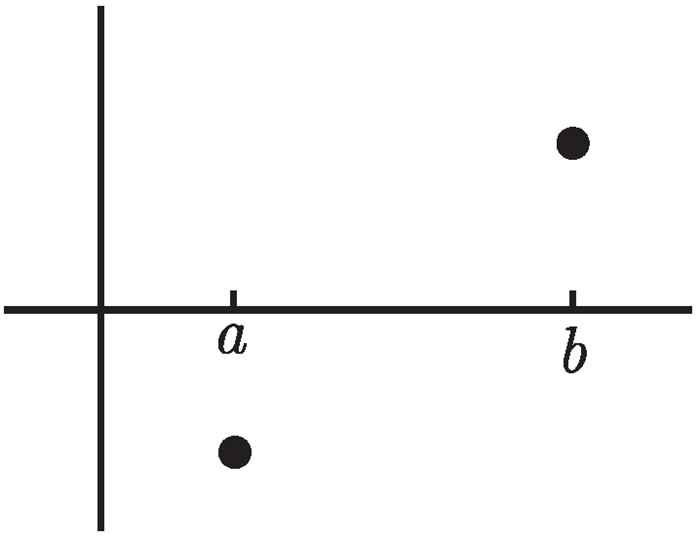

**图 13-1** 介值定理的几何直观

如果函数在区间内哪怕只有一点不连续，就可能从 $x$ 轴上方跳到下方而不穿过 $x$ 轴：

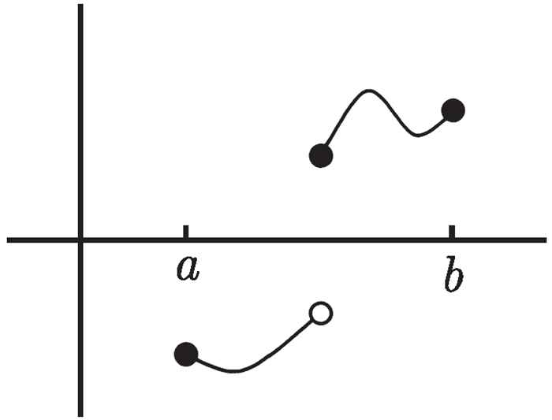

**图 13-2** 不连续函数绕过 $x$ 轴

**经典例题**：证明方程 $x = \cos x$ 有解。

令 $f(x) = x - \cos x$。$f(0) = -1 < 0$，$f(\pi/2) = \pi/2 > 0$。由于 $f$ 连续，由介值定理，存在 $c \in (0, \pi/2)$ 使得 $f(c) = 0$，即 $c = \cos c$。

**最大值与最小值定理**：闭区间上的连续函数必有最大值和最小值。

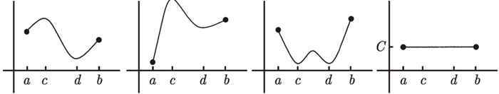

**图 13-3** 闭区间上连续函数的最大值与最小值示例

### 13.2 可导性与连续性

**核心定理**：可导函数必连续，但连续函数不一定可导。

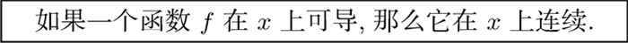

**证明概要**：由 $f'(x)$ 存在，考虑极限
$$\lim_{h \to 0} \frac{f(x+h) - f(x)}{h} \cdot h = f'(x) \cdot 0 = 0$$
可得 $\lim_{h \to 0} f(x+h) = f(x)$，即连续性。

### 13.3 导数作为变化率的直观理解

导数 $\frac{dy}{dx}$ 告诉我们：当 $x$ 发生微小变化时，$y$ 的变化大约是 $f'(x)$ 倍。

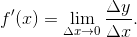

**经典例子**：$f(x) = x^2$，$f'(6) = 12$。若将 6 增加 0.01，则 $6^2 = 36$ 应增加约 $12 \times 0.01 = 0.12$，预测 $(6.01)^2 \approx 36.12$，实际为 36.1201，非常接近。$x$ 变化越小，预测越精确。

### 13.4 中值定理的直观理解

**中值定理 (Mean Value Theorem)**：若 $f$ 在 $[a, b]$ 上连续、在 $(a, b)$ 内可导，则存在 $\xi \in (a, b)$ 使得
$$f'(\xi) = \frac{f(b) - f(a)}{b - a}$$

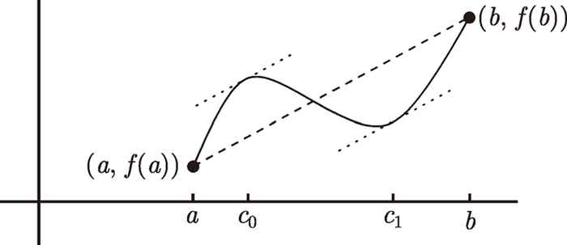

**图 13-4** 中值定理：存在某点切线平行于割线

**实际意义**：如果你在 2 小时内行驶了 100 英里（平均速度 50 mph），那么途中至少有一瞬间你的速度恰好是 50 mph。

**中值定理的推论**：
1. 若 $f'(x) = 0$ 恒成立，则 $f$ 为常数函数。
2. 若 $f'(x) = g'(x)$ 恒成立，则 $f(x) = g(x) + C$。
3. 若 $f'(x) > 0$ 恒成立，则 $f$ 为增函数；若 $f'(x) < 0$，则 $f$ 为减函数。

### 13.5 二阶导数与函数的凹凸性

二阶导数 $f''(x)$ 的符号决定函数的凹凸性：

- $f''(x) > 0$：凹向上（concave up，像碗口朝上）
- $f''(x) < 0$：凹向下（concave down，像碗口朝下）

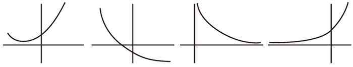

**图 13-5** 凹向上的函数（二阶导数为正）

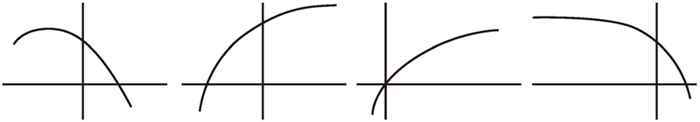

**图 13-6** 凹向下的函数（二阶导数为负）

**拐点**：函数凹凸性发生改变的点。若 $f''(c) = 0$ 且 $f''(x)$ 在 $c$ 两侧异号，则 $c$ 为拐点。但注意 $f''(c) = 0$ 不一定意味着 $c$ 是拐点（如 $f(x) = x^4$ 在 $x = 0$ 处）。

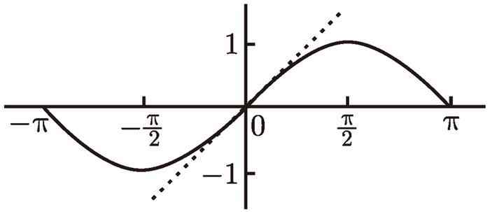

**图 13-7** $y = \sin x$ 在 $x = 0$ 处的拐点

### 13.6 临界点的分类

当 $f'(c) = 0$ 时，$c$ 可能是局部极大值、局部极小值或水平拐点：

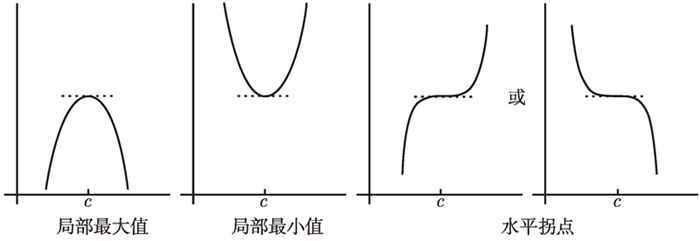

**图 13-8** 导数为零的三种常见情况

**判定方法**：
- **一阶导数法**：观察 $f'(x)$ 在 $c$ 左右的符号变化
- **二阶导数法**：若 $f''(c) > 0$ 则为极小值；$f''(c) < 0$ 则为极大值

### 13.7 线性化与近似计算

线性化是用切线近似函数值的方法。在 $x = a$ 附近，
$$f(x) \approx L(x) = f(a) + f'(a)(x - a)$$

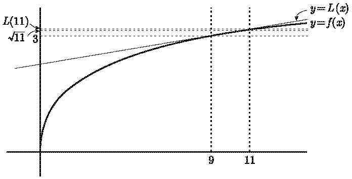

**图 13-9** 线性化示意图

**经典例题**：估算 $\sqrt{11}$ 的值。

令 $f(x) = \sqrt{x}$，$f(9) = 3$，$f'(9) = \frac{1}{6}$。线性化得
$$L(x) = 3 + \frac{1}{6}(x - 9) = \frac{x}{6} + \frac{3}{2}$$
代入 $x = 11$：$\sqrt{11} \approx L(11) = \frac{11}{6} + \frac{3}{2} = \frac{31}{6} \approx 3.1667$，而实际值约为 3.317，近似效果良好。

### 13.8 牛顿法求方程的近似解

牛顿法通过反复使用线性化来逼近方程 $f(x) = 0$ 的解。迭代公式为：
$$x_{n+1} = x_n - \frac{f(x_n)}{f'(x_n)}$$

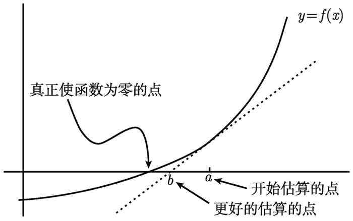

**图 13-10** 牛顿法：用切线逼近零点

**经典例题**：求方程 $x = \cos x$ 的近似解。

令 $f(x) = x - \cos x$，$f'(x) = 1 + \sin x$。从 $x_0 = \pi/2$ 开始：
$$x_1 = \frac{\pi}{2} - \frac{\pi/2}{2} = \frac{\pi}{4}$$
$$x_2 = \frac{\pi}{4} - \frac{\pi/4 - \sqrt{2}/2}{1 + \sqrt{2}/2} \approx 0.739$$
最终得到 $x \approx 0.739$，$f(x_2) \approx 0.0008$，精度很高。

### 13.9 指数函数与自然常数 $e$

**自然常数 $e$ 的来源**（复利问题）：本金 $P$，年利率 $r$，一年计 $n$ 次复利，$t$ 年后总额为
$$A = P\left(1 + \frac{r}{n}\right)^{nt}$$
当 $n \to \infty$ 时，$A = Pe^{rt}$。

**指数函数的导数**：$\frac{d}{dx} e^x = e^x$，这是唯一导数等于自身的函数。
**对数函数的导数**：$\frac{d}{dx} \ln x = \frac{1}{x}$。

### 13.10 反函数的导数

若 $y = f^{-1}(x)$，则
$$\frac{dy}{dx} = \frac{1}{f'(y)} = \frac{1}{f'(f^{-1}(x))}$$

**应用示例**：若 $f(\pi) = 2$，$f'(\pi) = 5$，$g(x) = \sin(f^{-1}(x))$，则 $g(2) = \sin(\pi) = 0$，$g'(2) = \cos(\pi) \cdot \frac{1}{5} = -\frac{1}{5}$。

### 13.11 隐函数求导与相关变化率

**隐函数求导**：若 $y$ 由方程 $F(x, y) = 0$ 隐式定义，则两边对 $x$ 求导，将 $y$ 视为 $x$ 的函数，解出 $y'$。

**相关变化率问题的一般方法**：
1. 识别所有量，画出图形
2. 写出关联各量的方程
3. 对时间 $t$ 隐函数求导
4. **最后才代入已知数值**（先求导再代入！）

### 13.12 定积分的黎曼和定义

定积分 $\int_a^b f(x) \, dx$ 定义为黎曼和的极限：
$$\int_a^b f(x) \, dx = \lim_{\text{mesh} \to 0} \sum_{j=1}^{n} f(c_j)(x_j - x_{j-1})$$

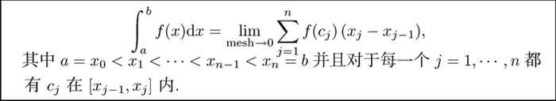

**用定义计算 $\int_0^2 x^2 \, dx$**：

将 $[0, 2]$ 等分为 $n$ 个小区间，每个区间宽 $2/n$，取右端点：
$$\int_0^2 x^2 \, dx = \lim_{n \to \infty} \sum_{j=1}^{n} \left(\frac{2j}{n}\right)^2 \cdot \frac{2}{n} = \lim_{n \to \infty} \frac{8}{n^3} \sum_{j=1}^{n} j^2 = \lim_{n \to \infty} \frac{8}{n^3} \cdot \frac{n(n+1)(2n+1)}{6} = \frac{8}{3}$$

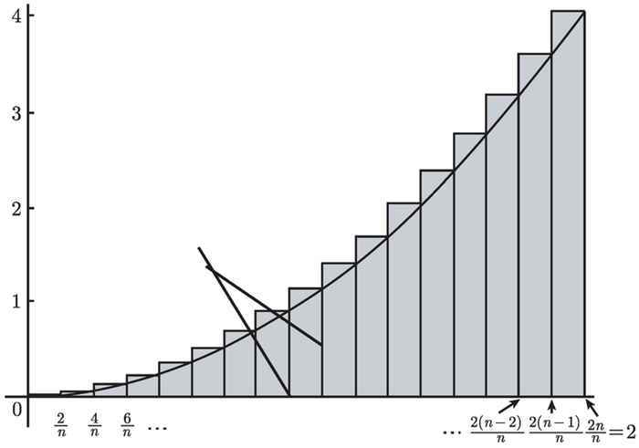

**图 13-11** 用矩形逼近曲线下面积

### 13.13 定积分的性质

**积分区间可加性**：$\int_a^b f(x) \, dx = \int_a^c f(x) \, dx + \int_c^b f(x) \, dx$，即使 $c$ 在 $[a, b]$ 之外也成立。

**交换上下限**：$\int_b^a f(x) \, dx = -\int_a^b f(x) \, dx$

**线性性质**：$\int_a^b (Cf(x) + Dg(x)) \, dx = C\int_a^b f(x) \, dx + D\int_a^b g(x) \, dx$

### 13.14 微积分基本定理

**第一基本定理**：若 $F(x) = \int_a^x f(t) \, dt$，则 $F'(x) = f(x)$。
$$\frac{d}{dx} \int_a^x f(t) \, dt = f(x)$$

**第二基本定理（牛顿-莱布尼茨公式）**：若 $F$ 是 $f$ 的任一原函数，则
$$\int_a^b f(x) \, dx = F(b) - F(a)$$

**不定积分**：$\int f(x) \, dx$ 表示 $f$ 的所有反导数的集合。例如 $\int x^2 \, dx = \frac{x^3}{3} + C$。

**基本积分公式**：
$$\int x^a \, dx = \frac{x^{a+1}}{a+1} + C \quad (a \neq -1)$$
$$\int \frac{1}{x} \, dx = \ln|x| + C$$

### 13.15 参数方程

**参数方程**：$x = x(t)$，$y = y(t)$，参数 $t$ 表示时间或角度。

**参数曲线的导数**：$\frac{dy}{dx} = \frac{dy/dt}{dx/dt}$

**二阶导数**：$\frac{d^2y}{dx^2} = \frac{d}{dx}\left(\frac{dy}{dx}\right) = \frac{d}{dt}\left(\frac{dy}{dx}\right) \bigg/ \frac{dx}{dt}$

**经典例子**：圆 $x^2 + y^2 = 9$ 的参数化为 $x = 3\cos t$，$y = 3\sin t$（$0 \leq t \leq 2\pi$）。

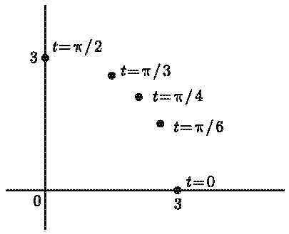

**图 13-12** 参数方程描绘的圆

### 13.16 弧长与旋转体体积

**弧长公式**：
- 直角坐标：$L = \int_a^b \sqrt{1 + [f'(x)]^2} \, dx$
- 参数形式：$L = \int_{t_0}^{t_1} \sqrt{[x'(t)]^2 + [y'(t)]^2} \, dt$
- 极坐标：$L = \int_{\theta_0}^{\theta_1} \sqrt{[f(\theta)]^2 + [f'(\theta)]^2} \, d\theta$

**旋转体体积——圆盘法**：曲线 $y = f(x)$ 绕 $x$ 轴旋转
$$V = \pi \int_a^b [f(x)]^2 \, dx$$

**旋转体体积——壳法**：曲线 $y = f(x)$ 绕 $y$ 轴旋转
$$V = 2\pi \int_a^b x|f(x)| \, dx$$

### 13.17 反常积分的收敛性判别

**两类反常积分**：
1. 无穷限积分：$\int_a^{+\infty} f(x) \, dx = \lim_{t \to +\infty} \int_a^t f(x) \, dx$
2. 瑕积分：$\int_a^b f(x) \, dx$（$f$ 在 $a$ 或 $b$ 处无界）

**$p$ 判别法**：
- $\int_1^{+\infty} \frac{1}{x^p} \, dx$：$p > 1$ 收敛，$p \leq 1$ 发散
- $\int_0^1 \frac{1}{x^p} \, dx$：$p < 1$ 收敛，$p \geq 1$ 发散

**比较判别法**：若 $0 \leq f(x) \leq g(x)$，则 $\int g$ 收敛 $\Rightarrow$ $\int f$ 收敛；$\int f$ 发散 $\Rightarrow$ $\int g$ 发散。

**常见函数在 $\infty$ 附近的表现**（增长速度由慢到快）：
$$\ln x \ll x^p \ll e^x \ll e^{x^2}$$

### 13.18 估算积分的方法

当无法求得精确原函数时，可用数值方法估算定积分：

**梯形法则**：
$$\int_a^b f(x) \, dx \approx \frac{b-a}{2n}[f(x_0) + 2f(x_1) + \cdots + 2f(x_{n-1}) + f(x_n)]$$

**辛普森法则**（更精确）：
$$\int_a^b f(x) \, dx \approx \frac{b-a}{3n}[f(x_0) + 4f(x_1) + 2f(x_2) + 4f(x_3) + \cdots + f(x_n)]$$

其中 $n$ 为偶数。

---

**参考来源**：Adrian Banner, *The Princeton Companion to Calculus*（《普林斯顿微积分读本》），第 5-13、15-21、27、29 章及附录 B。