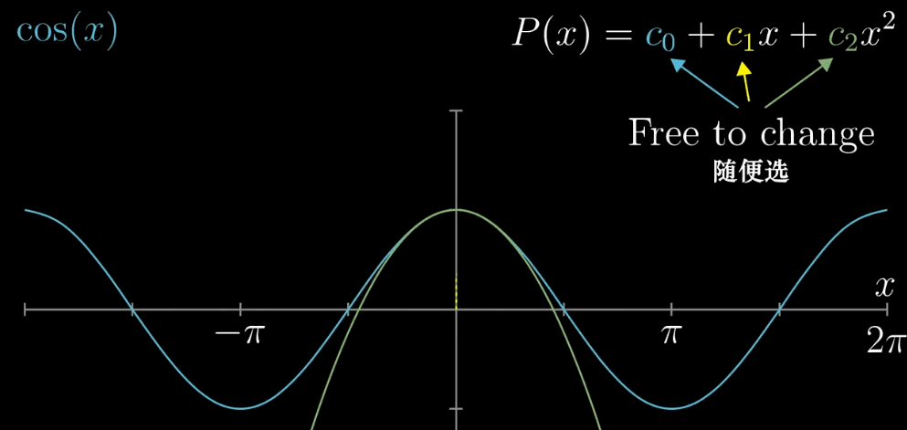
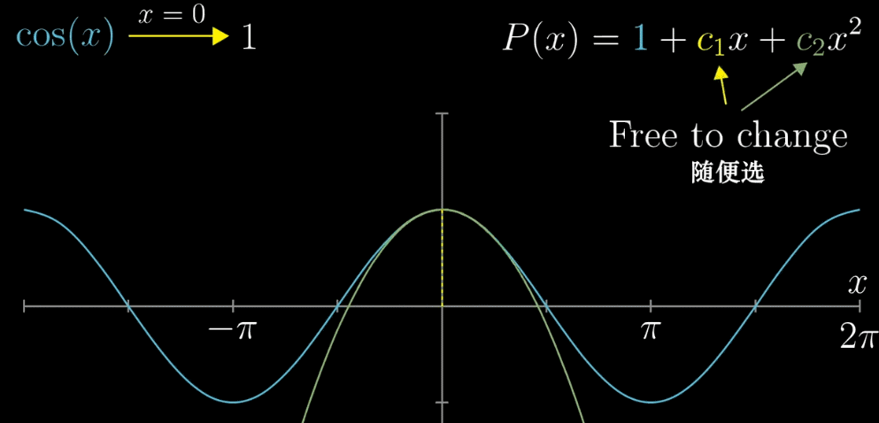
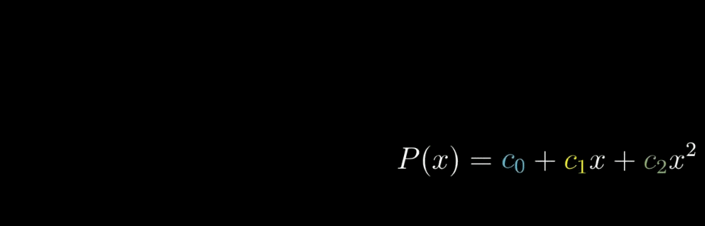
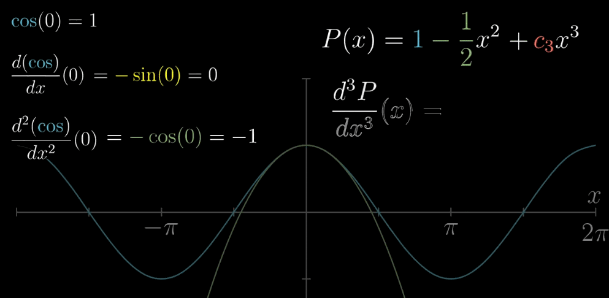
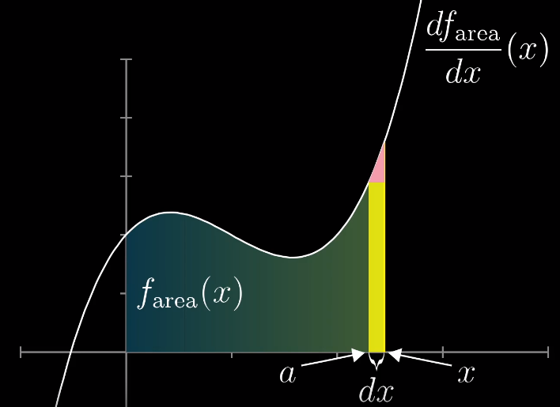
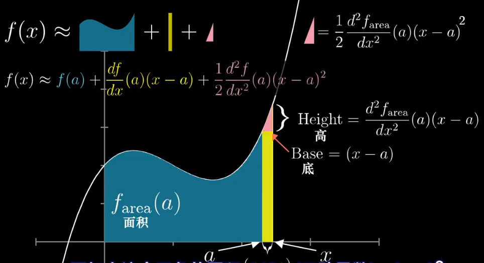
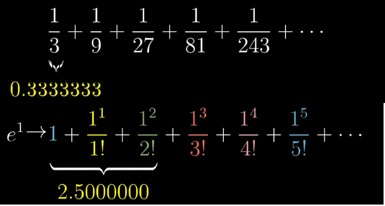

# 第 11 级：单变量微积分 (Single-Variable Calculus)

## 一、学习目标

完成本教程后，你应该能够：

1. 理解导数的定义及其几何意义，熟练运用各类求导法则计算导数
2. 掌握微分中值定理（Rolle、Lagrange、Cauchy）及其证明
3. 应用导数分析函数的单调性、凹凸性、极值与最值问题
4. 理解洛必达法则的条件并用于求极限
5. 掌握不定积分的概念与基本积分方法（换元法、分部积分法）
6. 理解定积分的黎曼和定义，掌握微积分基本定理
7. 应用定积分计算面积、体积、弧长和表面积
8. 判断广义积分的收敛性
9. 理解泰勒公式与泰勒级数展开

---

## 二、导数

### 2.1 导数的定义

设函数 $y = f(x)$ 在点 $x_0$ 的某邻域内有定义。当自变量 $x$ 在 $x_0$ 处取得增量 $\Delta x$（$\Delta x \neq 0$）时，相应的函数增量为 $\Delta y = f(x_0 + \Delta x) - f(x_0)$。如果极限

$$
f'(x_0) = \lim_{\Delta x \to 0} \frac{\Delta y}{\Delta x} = \lim_{\Delta x \to 0} \frac{f(x_0 + \Delta x) - f(x_0)}{\Delta x}
$$

存在，则称函数 $f$ 在 $x_0$ 处可导，并称此极限值为 $f$ 在 $x_0$ 处的导数，记作 $f'(x_0)$、$\frac{df}{dx}\big|_{x=x_0}$ 或 $y'(x_0)$。

**等价定义**：令 $h = \Delta x$，则

$$
f'(x_0) = \lim_{h \to 0} \frac{f(x_0 + h) - f(x_0)}{h}
$$

### 2.2 导数的几何意义

函数 $y = f(x)$ 在点 $x_0$ 处的导数 $f'(x_0)$ 在几何上表示曲线 $y = f(x)$ 在点 $(x_0, f(x_0))$ 处切线的斜率。因此，切线方程为：

$$
y - f(x_0) = f'(x_0)(x - x_0)
$$

法线方程为（当 $f'(x_0) \neq 0$ 时）：

$$
y - f(x_0) = -\frac{1}{f'(x_0)}(x - x_0)
$$

### 2.3 基本求导法则

#### 2.3.1 四则运算法则

设 $u(x), v(x)$ 可导，则：

1. **和差法则**：$(u \pm v)' = u' \pm v'$
2. **积法则（乘法法则）**：$(uv)' = u'v + uv'$
3. **商法则（除法法则）**：$\left(\frac{u}{v}\right)' = \frac{u'v - uv'}{v^2}$（$v \neq 0$）

**乘法法则的证明**：

$$
\begin{aligned}
(uv)' &= \lim_{h \to 0} \frac{u(x+h)v(x+h) - u(x)v(x)}{h} \\
&= \lim_{h \to 0} \frac{u(x+h)v(x+h) - u(x)v(x+h) + u(x)v(x+h) - u(x)v(x)}{h} \\
&= \lim_{h \to 0} \frac{[u(x+h)-u(x)]v(x+h)}{h} + \lim_{h \to 0} \frac{u(x)[v(x+h)-v(x)]}{h} \\
&= u'(x)v(x) + u(x)v'(x)
\end{aligned}
$$

**数学思维**：乘法法则的证明技巧是"**加一项再减同一项**"（即插入 $u(x)v(x+h)$），把未知的两项增量差拆成两个已知的增量差。这种"添项相消"是微积分中处理乘积、差值结构的常用手法。

**商法则的证明**：把商视作乘积 $u \cdot \frac{1}{v}$，先用乘法法则，再处理 $\frac{1}{v}$：

$$
\begin{aligned}
\left(\frac{u}{v}\right)' &= \left(u \cdot \frac{1}{v}\right)' \\
&= u' \cdot \frac{1}{v} + u \cdot \left(\frac{1}{v}\right)'
\end{aligned}
$$

其中 $\left(\frac{1}{v}\right)'$ 用定义计算：
$$
\left(\frac{1}{v}\right)' = \lim_{h\to 0} \frac{\frac{1}{v(x+h)} - \frac{1}{v(x)}}{h} = \lim_{h\to 0} \frac{v(x) - v(x+h)}{h \cdot v(x+h)v(x)} = -\frac{v'(x)}{v(x)^2}
$$

代入得：
$$
\left(\frac{u}{v}\right)' = \frac{u'}{v} - \frac{uv'}{v^2} = \frac{u'v - uv'}{v^2}
$$

> **一句话记忆**：商法则分子是"上导下不导 减 上不导下导"，顺序不可颠倒。

#### 2.3.2 幂法则（Power Rule）

$$(x^n)' = nx^{n-1}, \quad n \in \mathbb{R}$$

**证明（$n$ 为正整数）**：使用二项式定理

$$
\begin{aligned}
(x^n)' &= \lim_{h \to 0} \frac{(x+h)^n - x^n}{h} \\
&= \lim_{h \to 0} \frac{x^n + nx^{n-1}h + \frac{n(n-1)}{2}x^{n-2}h^2 + \cdots + h^n - x^n}{h} \\
&= \lim_{h \to 0} \left(nx^{n-1} + \frac{n(n-1)}{2}x^{n-2}h + \cdots + h^{n-1}\right) \\
&= nx^{n-1}
\end{aligned}
$$

#### 2.3.3 链式法则（Chain Rule）

若 $y = f(u)$ 在 $u = g(x)$ 处可导，且 $u = g(x)$ 在 $x$ 处可导，则复合函数 $y = f(g(x))$ 在 $x$ 处可导，且

$$\frac{dy}{dx} = \frac{dy}{du} \cdot \frac{du}{dx} = f'(g(x)) \cdot g'(x)$$

**证明思路**：令 $\Delta u = g(x+\Delta x) - g(x)$，则 $\Delta y = f(u+\Delta u) - f(u)$。当 $\Delta x \to 0$ 时，$\Delta u \to 0$，于是

$$
\frac{dy}{dx} = \lim_{\Delta x \to 0} \frac{\Delta y}{\Delta x} = \lim_{\Delta x \to 0} \frac{\Delta y}{\Delta u} \cdot \frac{\Delta u}{\Delta x} = \frac{dy}{du} \cdot \frac{du}{dx}
$$

**严格证明（处理 $\Delta u = 0$ 的情况）**：上面的约分在 $\Delta u = 0$ 时无意义。引入一个辅助量 $\varepsilon$ 严格化：

由 $f$ 在 $u$ 处可导，令
$$
\varepsilon = \frac{\Delta y}{\Delta u} - f'(u) \quad (\Delta u \neq 0), \qquad \varepsilon = 0 \quad (\Delta u = 0)
$$
则恒有 $\Delta y = f'(u)\Delta u + \varepsilon \Delta u$，且 $\Delta u \to 0$ 时 $\varepsilon \to 0$。于是
$$
\frac{\Delta y}{\Delta x} = \left(f'(u) + \varepsilon\right)\frac{\Delta u}{\Delta x}
$$
取极限 $\Delta x \to 0$（此时 $\Delta u \to 0$，从而 $\varepsilon \to 0$）：
$$
\frac{dy}{dx} = f'(u) \cdot \frac{du}{dx}
$$

**数学思维**：链式法则刻画的是一种"**传递率**"——外层的瞬时变化率乘以内层的瞬时变化率。形象地说，$y$ 随 $u$ 变化的速率（$f'$）乘以 $u$ 随 $x$ 变化的速率（$g'$），就是 $y$ 随 $x$ 变化的速率。这就是"复合"对应的乘法。

### 2.4 初等函数的导数公式

| 函数 | 导数 |
|------|------|
| $C$（常数） | $0$ |
| $x^n$ | $nx^{n-1}$ |
| $e^x$ | $e^x$ |
| $a^x$ | $a^x \ln a$ |
| $\ln x$ | $\frac{1}{x}$ |
| $\log_a x$ | $\frac{1}{x \ln a}$ |
| $\sin x$ | $\cos x$ |
| $\cos x$ | $-\sin x$ |
| $\tan x$ | $\sec^2 x$ |
| $\cot x$ | $-\csc^2 x$ |
| $\sec x$ | $\sec x \tan x$ |
| $\csc x$ | $-\csc x \cot x$ |
| $\arcsin x$ | $\frac{1}{\sqrt{1-x^2}}$ |
| $\arccos x$ | $-\frac{1}{\sqrt{1-x^2}}$ |
| $\arctan x$ | $\frac{1}{1+x^2}$ |
| $\operatorname{arccot} x$ | $-\frac{1}{1+x^2}$ |
| $\sinh x$ | $\cosh x$ |
| $\cosh x$ | $\sinh x$ |

**证明分类（按公式来源分四组）**：

**（一）由极限定义直接推出的**：

**$(\sin x)' = \cos x$**：利用和角公式 $\sin(x+h) = \sin x\cos h + \cos x\sin h$：
$$
\begin{aligned}
(\sin x)' &= \lim_{h\to 0}\frac{\sin(x+h) - \sin x}{h} \\
&= \lim_{h\to 0}\frac{\sin x(\cos h - 1) + \cos x\sin h}{h} \\
&= \sin x \cdot \lim_{h\to 0}\frac{\cos h - 1}{h} + \cos x \cdot \lim_{h\to 0}\frac{\sin h}{h} \\
&= \sin x \cdot 0 + \cos x \cdot 1 = \cos x
\end{aligned}
$$
其中用到两个重要极限：$\lim_{h\to 0}\frac{\sin h}{h} = 1$，$\lim_{h\to 0}\frac{\cos h - 1}{h} = 0$。

**$(\cos x)' = -\sin x$**：同理，利用 $\cos(x+h) = \cos x\cos h - \sin x\sin h$，可得 $(\cos x)' = -\sin x$。

**$e^x$ 的导数**：由重要极限 $\lim_{h\to 0}\frac{e^h - 1}{h} = 1$：
$$
(e^x)' = \lim_{h\to 0}\frac{e^{x+h} - e^x}{h} = e^x \cdot \lim_{h\to 0}\frac{e^h - 1}{h} = e^x
$$

> **数学思维**：$e^x$ 之所以"导数等于自身"，源于它被定义为使 $\lim_{h\to 0}\frac{a^h - 1}{h} = 1$ 的那个底数 $e$。其他底数 $a^x$ 求导时自然多出一个因子 $\ln a$。

**（二）由四则运算 / 链式法则推出的**：

**$(\tan x)' = \sec^2 x$**：$\tan x = \frac{\sin x}{\cos x}$，用商法则：
$$
(\tan x)' = \frac{\cos x \cdot \cos x - \sin x \cdot (-\sin x)}{\cos^2 x} = \frac{\cos^2 x + \sin^2 x}{\cos^2 x} = \frac{1}{\cos^2 x} = \sec^2 x
$$

**$(a^x)' = a^x \ln a$**：$a^x = e^{x\ln a}$，用链式法则：$(a^x)' = e^{x\ln a}\cdot \ln a = a^x \ln a$。

**$(\sec x)' = \sec x\tan x$**：$\sec x = \frac{1}{\cos x}$，用商法则或链式法则。

**$(\ln x)' = \frac{1}{x}$**：由 $y = \ln x \iff e^y = x$，隐函数求导（见 2.5）：$e^y \cdot y' = 1$，故 $y' = \frac{1}{e^y} = \frac{1}{x}$。

**$(\log_a x)' = \frac{1}{x\ln a}$**：$\log_a x = \frac{\ln x}{\ln a}$，常数因子提出来即得。

**（三）由反函数关系推出的**：

**$(\arcsin x)' = \frac{1}{\sqrt{1-x^2}}$**：$y = \arcsin x \iff x = \sin y$，且 $y \in [-\frac{\pi}{2}, \frac{\pi}{2}]$。两边对 $x$ 求导：
$$
1 = \cos y \cdot y' \implies y' = \frac{1}{\cos y} = \frac{1}{\sqrt{1 - \sin^2 y}} = \frac{1}{\sqrt{1-x^2}}
$$
（由 $y$ 的范围知 $\cos y \geqslant 0$，取正号。）

**$(\arctan x)' = \frac{1}{1+x^2}$**：$y = \arctan x \iff x = \tan y$，得 $1 = \sec^2 y \cdot y'$，故 $y' = \cos^2 y = \frac{1}{1 + \tan^2 y} = \frac{1}{1+x^2}$。

> **数学思维**：反三角函数的导数都含根号或分式，是因为反函数求导后要把 $\cos y$、$\sec^2 y$ 用 $\sin y$、$\tan y$ 表示回来，于是乎出现 $\sqrt{1-x^2}$、$1+x^2$ 这类式子。

**（四）幂法则对任意实数 $n$ 的推广**：

$y = x^n = e^{n\ln x}$（$x > 0$），用链式法则：
$$
y' = e^{n\ln x} \cdot \frac{n}{x} = x^n \cdot \frac{n}{x} = nx^{n-1}
$$
所以幂法则对任意实数 $n$ 都成立，不必限于正整数。

### 2.5 隐函数求导法

如果函数 $y = y(x)$ 由方程 $F(x, y) = 0$ 隐式定义，则可以在方程两边同时对 $x$ 求导，将 $y$ 视为 $x$ 的函数，然后解出 $y'$。

**示例**：求由方程 $x^2 + y^2 = 1$ 所确定的隐函数的导数。

两边对 $x$ 求导：$2x + 2y \cdot y' = 0$，解得 $y' = -\frac{x}{y}$（$y \neq 0$）。

**数学思维**：为什么可以对两边同时求导？因为 $y$ 是 $x$ 的隐函数，左端 $x^2 + y(x)^2$ 是 $x$ 的复合函数，对 $x$ 求导时必须用**链式法则**——$y^2$ 先对外层平方求导得 $2y$，再乘内层 $y'$。于是每一项都"顺着链式法则走"，最后把 $y'$ 解出来即可。

**一般步骤**：
1. 方程两边对 $x$ 求导，把 $y$ 当作 $x$ 的函数，凡出现 $y$ 的地方都补乘 $y'$；
2. 把含 $y'$ 的项移到一边，其余移到另一边；
3. 提出 $y'$，解出表达式。

### 2.6 对数求导法

对于幂指函数 $y = f(x)^{g(x)}$ 或连乘连除形式的函数，先取自然对数再求导往往更简便。

**数学思维**：对数能"**把乘除降为加减、把幂降为乘**"，正好把复杂函数拆成简单可导项之和。步骤是：先取 $\ln$，再对 $\ln y$ 求导（左边由链式法则得 $\frac{y'}{y}$），最后乘回 $y$。

**示例 1**：求 $y = x^x$ 的导数。

取对数：$\ln y = x \ln x$，两边求导：$\frac{y'}{y} = \ln x + 1$，所以 $y' = x^x (\ln x + 1)$。

**示例 2（连乘连除形式）**：求 $y = \sqrt[3]{\frac{x^2+1}{(x+1)^2(x-1)}}$ 的导数。

取对数：
$$
\ln y = \frac{1}{3}\left[\ln(x^2+1) - 2\ln(x+1) - \ln(x-1)\right]
$$
两边求导：
$$
\frac{y'}{y} = \frac{1}{3}\left(\frac{2x}{x^2+1} - \frac{2}{x+1} - \frac{1}{x-1}\right)
$$
回乘 $y$ 即得 $y'$。**若直接对根式＋连乘求导，将极其繁琐，取对数后变得一目了然。**

> **使用场景判断**：当遇到"幂指函数"（底数、指数都含变量）或"大量乘除/开方"的结构时，优先想到对数求导法。

---

## 三、微分中值定理

微分中值定理是联系函数与其导数的桥梁，是导数应用的理论基础。

### 预备知识一：最值定理（Extreme Value Theorem）

> 罗尔定理证明中引用的"最值定理"在此先行交代。

**定理**：若函数 $f(x)$ 在闭区间 $[a, b]$ 上**连续**，则 $f(x)$ 在 $[a, b]$ 上**必能取得最大值 $M$ 和最小值 $m$**，即存在 $x_1, x_2 \in [a, b]$ 使得 $f(x_1) = M$、$f(x_2) = m$。

**要点**：
- 前提是**闭区间** + **连续**，二者缺一不可。
- 反例：开区间 $(0, 1)$ 上的 $f(x) = x$ 连续但无最大值、最小值（端点取不到）；闭区间上不连续的函数也可能无最值。

> **直观理解**：连续函数在闭区间上画出的是"一条不断裂的曲线"，它从某个最低点连到某个最高点，这两点必然存在。

### 预备知识二：费马引理（Fermat's Theorem）

> 罗尔定理证明中"最大值在内部点取得则导数为零"的依据。

**引理**：若 $x_0$ 是函数 $f(x)$ 的**极值点**（极大值点或极小值点），且 $f'(x_0)$ **存在**，则 $f'(x_0) = 0$。

**证明**（以极大值点为例）：设 $x_0$ 为极大值点，则存在邻域使 $f(x) \leqslant f(x_0)$。当 $h > 0$ 时 $\frac{f(x_0+h) - f(x_0)}{h} \leqslant 0$，取右极限得 $f'(x_0) \leqslant 0$；当 $h < 0$ 时 $\frac{f(x_0+h) - f(x_0)}{h} \geqslant 0$，取左极限得 $f'(x_0) \geqslant 0$。故 $f'(x_0) = 0$。极小值情形同理。

> **注意**：费马引理是极值的**必要条件**，不是充分条件（如 $f(x) = x^3$ 在 $x = 0$ 处导数为零但非极值点）。

### 3.1 罗尔定理（Rolle's Theorem）

**定理**：设函数 $f(x)$ 满足：
1. 在闭区间 $[a, b]$ 上连续；
2. 在开区间 $(a, b)$ 内可导；
3. $f(a) = f(b)$。

则至少存在一点 $\xi \in (a, b)$，使得 $f'(\xi) = 0$。

**证明**：由于 $f$ 在 $[a, b]$ 上连续，由最值定理，$f$ 在 $[a, b]$ 上存在最大值 $M$ 和最小值 $m$。

- 若 $M = m$，则 $f$ 为常数，$f'(x) = 0$ 对任意 $x \in (a, b)$ 成立，结论成立。
- 若 $M > m$，由于 $f(a) = f(b)$，最大值和最小值不可能同时出现在端点。设最大值在内部点 $\xi \in (a, b)$ 处取得（最小值同理）。由费马引理，$f'(\xi) = 0$。

**几何意义**：若曲线两端点等高，则曲线上至少存在一点，该点处的切线是水平的。


### 3.2 拉格朗日中值定理（Lagrange's Mean Value Theorem）

**定理**：设函数 $f(x)$ 满足：
1. 在闭区间 $[a, b]$ 上连续；
2. 在开区间 $(a, b)$ 内可导。

则至少存在一点 $\xi \in (a, b)$，使得

$$f(b) - f(a) = f'(\xi)(b - a)$$

**证明**：构造辅助函数

$$F(x) = f(x) - f(a) - \frac{f(b) - f(a)}{b - a}(x - a)$$

容易验证 $F(a) = F(b) = 0$，且 $F$ 在 $[a, b]$ 上连续，在 $(a, b)$ 内可导。由罗尔定理，存在 $\xi \in (a, b)$ 使得 $F'(\xi) = 0$。而

$$F'(x) = f'(x) - \frac{f(b) - f(a)}{b - a}$$

代入 $x = \xi$ 即得 $f'(\xi) = \frac{f(b) - f(a)}{b - a}$。

**几何意义**：在曲线 $y = f(x)$ 上至少存在一点，该点处的切线斜率等于连接端点直线的斜率。


### 3.3 柯西中值定理（Cauchy's Mean Value Theorem）

**定理**：设函数 $f(x)$ 和 $g(x)$ 满足：
1. 在闭区间 $[a, b]$ 上连续；
2. 在开区间 $(a, b)$ 内可导；
3. $g'(x) \neq 0$ 对任意 $x \in (a, b)$ 成立。

则至少存在一点 $\xi \in (a, b)$，使得

$$\frac{f(b) - f(a)}{g(b) - g(a)} = \frac{f'(\xi)}{g'(\xi)}$$

**证明**：构造辅助函数

$$F(x) = f(x) - f(a) - \frac{f(b) - f(a)}{g(b) - g(a)}[g(x) - g(a)]$$

易见 $F(a) = F(b) = 0$，由罗尔定理，存在 $\xi \in (a, b)$ 使得 $F'(\xi) = 0$。计算 $F'(x) = f'(x) - \frac{f(b) - f(a)}{g(b) - g(a)} g'(x)$，代入 $x = \xi$ 即得结论。

**注**：拉格朗日中值定理是柯西中值定理当 $g(x) = x$ 时的特例。

**几何意义**：把 $(g(t), f(t))$ 看作平面上的参数曲线，则曲线上存在一点 $P$，该点处的切线方向与连接两端点的弦 $AB$ 方向平行。


**直观理解一：把它想成"一段运动轨迹"**（最推荐的视角）

把 $t$ 当作**时间**，质点从 $A$ 运动到 $B$，轨迹就是参数曲线 $(g(t), f(t))$。
- 弦 $AB$ 的方向 = 全程的**平均速度**方向；
- 曲线上某点处的切线方向 = 该时刻的**瞬时速度**方向。

柯西中值定理说：**从 $A$ 运动到 $B$ 的过程中，必有一时刻，瞬时速度的方向与平均速度的方向平行。** 这几乎是"显然"的——你不可能绕个弯从 A 到 B，却从来不让行驶方向正对着终点方向。

**直观理解二：为什么是两个函数？**

对比两个定理：
- **拉格朗日**：$y = f(x)$，横轴移动多少由 $x$ 自己说了算，即 $g(x) = x$。
- **柯西**：$y$ 和 $x$ 都受第三个变量 $t$ 控制，即 $(x, y) = (g(t), f(t))$。

所以**拉格朗日只是柯西的"横轴匀速"特例**。柯西额外处理了"横轴也在动"的普遍情况。

**直观理解三：看比值** $\frac{f'(t)}{g'(t)}$

- $\frac{f'(t)}{g'(t)}$ = 瞬时速度的"纵向分量 ÷ 横向分量" = 切线（即速度方向）的斜率；
- $\frac{f(b) - f(a)}{g(b) - g(a)}$ = 平均速度的"纵 ÷ 横" = 弦 $AB$ 的斜率。

等式 $\frac{f(b) - f(a)}{g(b) - g(a)} = \frac{f'(\xi)}{g'(\xi)}$ 说的正是：**某时刻速度方向（切线）的斜率 = 全程平均方向（弦）的斜率**，即两者平行。

> **一句话总结**：柯西中值定理 = "运动的质点从 A 到 B，途中必有一刻面朝终点的方向"。它比拉格朗日多出来的，只是让横轴也受时间控制，从而把"直线路径"推广到"弯曲路径"。

---

## 四、导数的应用

### 4.1 洛必达法则（L'Hôpital's Rule）

**定理**：设 $f(x)$ 和 $g(x)$ 在 $x_0$ 的某去心邻域内可导，且 $g'(x) \neq 0$。若

$$\lim_{x \to x_0} f(x) = \lim_{x \to x_0} g(x) = 0 \quad \text{或} \quad \lim_{x \to x_0} f(x) = \lim_{x \to x_0} g(x) = \infty$$

且 $\lim_{x \to x_0} \frac{f'(x)}{g'(x)}$ 存在（或为无穷大），则

$$\lim_{x \to x_0} \frac{f(x)}{g(x)} = \lim_{x \to x_0} \frac{f'(x)}{g'(x)}$$

**证明思路**（$\frac{0}{0}$ 型）：在 $x_0$ 处补充定义 $f(x_0) = g(x_0) = 0$，由柯西中值定理，对任意 $x \neq x_0$，存在 $\xi$ 介于 $x$ 与 $x_0$ 之间，使得

$$\frac{f(x)}{g(x)} = \frac{f(x) - f(x_0)}{g(x) - g(x_0)} = \frac{f'(\xi)}{g'(\xi)}$$

当 $x \to x_0$ 时 $\xi \to x_0$，即得结论。

**常见不定型**：共 $7$ 种，分为两类。

**第一类（可直接用洛必达）**：

| 不定型 | 说明 | 示例 |
|:-------|:-----|:-----|
| $\dfrac{0}{0}$ | 分子分母同趋于 $0$ | $\displaystyle\lim_{x\to 0}\frac{\sin x}{x}=1$ |
| $\dfrac{\infty}{\infty}$ | 分子分母同趋于无穷 | $\displaystyle\lim_{x\to\infty}\frac{x}{e^x}=0$ |

**第二类（须先做代数变换，化为 $\frac{0}{0}$ 或 $\frac{\infty}{\infty}$ 再用）**：

| 不定型 | 变换方法 | 示例 |
|:-------|:---------|:-----|
| $0 \cdot \infty$ | 把其中一个因子取倒数，化为 $\frac{0}{0}$ 或 $\frac{\infty}{\infty}$ | $\displaystyle\lim_{x\to 0^+} x\ln x = 0$ |
| $\infty - \infty$ | 通分，化为 $\frac{0}{0}$ | $\displaystyle\lim_{x\to 0}\left(\frac{1}{\sin x}-\frac{1}{x}\right)=0$ |
| $0^0$ | 取对数：$\ln y = g\ln f$，化为 $0\cdot\infty$ | $\displaystyle\lim_{x\to 0^+} x^x = 1$ |
| $1^\infty$ | 取对数，化为 $0\cdot\infty$ | $\displaystyle\lim_{x\to\infty}\left(1+\frac{1}{x}\right)^x = e$ |
| $\infty^0$ | 取对数，化为 $0\cdot\infty$ | $\displaystyle\lim_{x\to\infty} x^{1/x} = 1$ |

**具体处理的通用套路**：

1. **$0 \cdot \infty$ 型**：把趋于 $0$ 的因子放到分母（取倒数），可变回 $\frac{0}{0}$ 或 $\frac{\infty}{\infty}$。
   > **示例**：$\displaystyle\lim_{x\to 0^+} x\ln x = \lim_{x\to 0^+}\frac{\ln x}{1/x} \xrightarrow{\frac{\infty}{\infty}} \lim_{x\to 0^+}\frac{1/x}{-1/x^2} = \lim_{x\to 0^+}(-x) = 0$。

2. **$\infty - \infty$ 型**：先通分或分子有理化，化为分式。
   > **示例**：$\displaystyle\lim_{x\to 0}\left(\frac{1}{\sin x}-\frac{1}{x}\right) = \lim_{x\to 0}\frac{x-\sin x}{x\sin x} \xrightarrow{\frac{0}{0}} \lim_{x\to 0}\frac{1-\cos x}{\sin x + x\cos x} \xrightarrow{\frac{0}{0}} \lim_{x\to 0}\frac{\sin x}{2\cos x - x\sin x} = 0$。

3. **$0^0$、$1^\infty$、$\infty^0$ 型（幂指型）**：先取对数。设 $y = f(x)^{g(x)}$，则 $\ln y = g(x)\ln f(x)$，先求 $\lim \ln y$，再取指数还原。
   > **示例**：求 $\displaystyle\lim_{x\to 0^+} x^x$。设 $y = x^x$，$\ln y = x\ln x$。由 $0\cdot\infty$ 型的结论 $\lim_{x\to 0^+} x\ln x = 0$，故 $\lim \ln y = 0$，所以 $\displaystyle\lim_{x\to 0^+} x^x = e^0 = 1$。

> **使用须知**：
> - 洛必达法则只能用于**不定型**，若极限本身不是不定型，直接用会得到错误结果。
> - 每次使用后若仍是不定型，可**多次连续使用**（如上面的 $\infty-\infty$ 示例连用两次）。
> - $\lim \frac{f'}{g'}$ **必须存在或为无穷大**，否则洛必达法则不适用（此时不能用，需换方法）。
> - 使用前先化简、先看能否约分，避免盲目求导。

### 4.2 函数的单调性

若 $f(x)$ 在 $[a, b]$ 上连续，在 $(a, b)$ 内可导，则：

- 若在 $(a, b)$ 内 $f'(x) > 0$，则 $f(x)$ 在 $[a, b]$ 上严格单调递增
- 若在 $(a, b)$ 内 $f'(x) < 0$，则 $f(x)$ 在 $[a, b]$ 上严格单调递减

**证明**：对任意 $x_1 < x_2$，由拉格朗日中值定理，存在 $\xi \in (x_1, x_2)$ 使得 $f(x_2) - f(x_1) = f'(\xi)(x_2 - x_1)$。由 $f'(\xi)$ 的符号即可判断。

### 4.3 函数的凹凸性与拐点

设 $f(x)$ 在 $[a, b]$ 上连续，在 $(a, b)$ 内二阶可导。

- 若在 $(a, b)$ 内 $f''(x) > 0$，则曲线 $y = f(x)$ 是**凹的**（向上弯曲，convex）
- 若在 $(a, b)$ 内 $f''(x) < 0$，则曲线 $y = f(x)$ 是**凸的**（向下弯曲，concave）

**拐点**：曲线凹凸性发生改变的点。若 $f''(x_0) = 0$ 且 $f''(x)$ 在 $x_0$ 左右两侧异号，则 $(x_0, f(x_0))$ 为拐点。

### 4.4 极值与最优化

**极值的必要条件**（费马引理）：若 $x_0$ 是 $f(x)$ 的极值点且 $f'(x_0)$ 存在，则 $f'(x_0) = 0$。满足 $f'(x) = 0$ 的点称为**驻点**。

**极值的第一充分条件**：设 $f'(x_0) = 0$，且 $f'(x)$ 在 $x_0$ 左右两侧：

- 左正右负 $\Rightarrow$ $x_0$ 为极大值点
- 左负右正 $\Rightarrow$ $x_0$ 为极小值点
- 符号不变 $\Rightarrow$ $x_0$ 不是极值点

**极值的第二充分条件**：设 $f'(x_0) = 0$ 且 $f''(x_0)$ 存在，则：

- $f''(x_0) > 0$ $\Rightarrow$ $x_0$ 为极小值点
- $f''(x_0) < 0$ $\Rightarrow$ $x_0$ 为极大值点

**最优化步骤**：
1. 求出 $f'(x)$，找到所有驻点和不可导点
2. 计算这些点及区间端点的函数值
3. 比较大小，确定最大值和最小值

---

## 五、不定积分

### 5.1 原函数与不定积分

若 $F'(x) = f(x)$，则称 $F(x)$ 为 $f(x)$ 的一个**原函数**。$f(x)$ 的所有原函数构成**不定积分**：

$$\int f(x) \, dx = F(x) + C$$

其中 $C$ 为任意常数。

**基本积分表**：

| 积分公式 | 积分公式 |
|---------|---------|
| $\int x^n \, dx = \frac{x^{n+1}}{n+1} + C$（$n \neq -1$） | $\int \frac{1}{x} \, dx = \ln|x| + C$ |
| $\int e^x \, dx = e^x + C$ | $\int a^x \, dx = \frac{a^x}{\ln a} + C$ |
| $\int \sin x \, dx = -\cos x + C$ | $\int \cos x \, dx = \sin x + C$ |
| $\int \sec^2 x \, dx = \tan x + C$ | $\int \csc^2 x \, dx = -\cot x + C$ |
| $\int \sec x \tan x \, dx = \sec x + C$ | $\int \csc x \cot x \, dx = -\csc x + C$ |
| $\int \frac{1}{1+x^2} \, dx = \arctan x + C$ | $\int \frac{1}{\sqrt{1-x^2}} \, dx = \arcsin x + C$ |

### 5.2 换元积分法

#### 第一类换元法（凑微分法）

$$\int f(g(x)) \cdot g'(x) \, dx = \int f(u) \, du \bigg|_{u = g(x)}$$

**证明**：设 $F'(u) = f(u)$，则 $\frac{d}{dx}F(g(x)) = F'(g(x))g'(x) = f(g(x))g'(x)$，两边积分即得。

#### 第二类换元法

$$x = \varphi(t)，\quad \int f(x) \, dx = \int f(\varphi(t)) \varphi'(t) \, dt$$

其中 $\varphi(t)$ 单调可导且 $\varphi'(t) \neq 0$。

**常见换元**：
- 含 $\sqrt{a^2 - x^2}$：令 $x = a \sin t$
- 含 $\sqrt{a^2 + x^2}$：令 $x = a \tan t$
- 含 $\sqrt{x^2 - a^2}$：令 $x = a \sec t$

### 5.3 分部积分法

$$\int u \, dv = uv - \int v \, du$$

**证明**：由乘法法则 $(uv)' = u'v + uv'$，两边积分得 $uv = \int v \, du + \int u \, dv$，移项即得。

**选取 $u$ 和 $dv$ 的优先顺序**（LIATE 规则）：
对数函数（Logarithmic）→ 反三角函数（Inverse trigonometric）→ 代数函数（Algebraic）→ 三角函数（Trigonometric）→ 指数函数（Exponential）

---

## 六、定积分

### 6.1 黎曼和定义

设 $f(x)$ 在 $[a, b]$ 上有定义。将 $[a, b]$ 分割为 $n$ 个子区间：

$$a = x_0 < x_1 < x_2 < \cdots < x_n = b$$

令 $\Delta x_i = x_i - x_{i-1}$，$\lambda = \max\{\Delta x_i\}$。在每个子区间 $[x_{i-1}, x_i]$ 上任取一点 $\xi_i$，作和式

$$S_n = \sum_{i=1}^{n} f(\xi_i) \Delta x_i$$

如果极限 $\lim_{\lambda \to 0} S_n$ 存在且与分割方式和 $\xi_i$ 的选取无关，则称 $f(x)$ 在 $[a, b]$ 上**黎曼可积**，该极限值称为 $f(x)$ 在 $[a, b]$ 上的**定积分**，记作

$$\int_a^b f(x) \, dx = \lim_{\lambda \to 0} \sum_{i=1}^{n} f(\xi_i) \Delta x_i$$

### 6.2 定积分的性质

1. **线性性质**：$\int_a^b [\alpha f(x) + \beta g(x)] \, dx = \alpha \int_a^b f(x) \, dx + \beta \int_a^b g(x) \, dx$
2. **区间可加性**：$\int_a^b f(x) \, dx = \int_a^c f(x) \, dx + \int_c^b f(x) \, dx$
3. **保序性**：若 $f(x) \leq g(x)$，则 $\int_a^b f(x) \, dx \leq \int_a^b g(x) \, dx$
4. **绝对值不等式**：$\left|\int_a^b f(x) \, dx\right| \leq \int_a^b |f(x)| \, dx$
5. **积分中值定理**：若 $f$ 在 $[a, b]$ 上连续，则存在 $\xi \in [a, b]$，使得 $\int_a^b f(x) \, dx = f(\xi)(b - a)$

### 6.3 微积分基本定理

这是微积分学的核心，它将微分与积分联系起来。

#### 第一部分（原函数存在定理）

设 $f(x)$ 在 $[a, b]$ 上连续，定义函数

$$F(x) = \int_a^x f(t) \, dt, \quad x \in [a, b]$$

则 $F(x)$ 在 $[a, b]$ 上可导，且 $F'(x) = f(x)$。即

$$\frac{d}{dx} \int_a^x f(t) \, dt = f(x)$$

**证明**：由导数的定义，

$$
\begin{aligned}
F'(x) &= \lim_{h \to 0} \frac{F(x+h) - F(x)}{h} \\
&= \lim_{h \to 0} \frac{1}{h} \left[ \int_a^{x+h} f(t) \, dt - \int_a^x f(t) \, dt \right] \\
&= \lim_{h \to 0} \frac{1}{h} \int_x^{x+h} f(t) \, dt
\end{aligned}
$$

由积分中值定理，存在 $\xi_h \in [x, x+h]$ 使得 $\int_x^{x+h} f(t) \, dt = f(\xi_h) \cdot h$，于是

$$F'(x) = \lim_{h \to 0} \frac{1}{h} \cdot f(\xi_h) \cdot h = \lim_{h \to 0} f(\xi_h) = f(x)$$

（最后一步由 $f$ 的连续性得到。）

#### 第二部分（牛顿-莱布尼茨公式）

设 $f(x)$ 在 $[a, b]$ 上连续，$F(x)$ 是 $f(x)$ 的任意一个原函数，则

$$\int_a^b f(x) \, dx = F(b) - F(a)$$

**证明**：由第一部分，$G(x) = \int_a^x f(t) \, dt$ 是 $f$ 的一个原函数。任一原函数 $F(x)$ 与 $G(x)$ 相差一个常数：$F(x) = G(x) + C$。于是

$$F(b) - F(a) = [G(b) + C] - [G(a) + C] = G(b) - G(a) = \int_a^b f(t) \, dt - \int_a^a f(t) \, dt = \int_a^b f(t) \, dt$$

---

## 七、定积分的应用

### 7.1 平面图形的面积

曲线 $y = f(x)$ 与 $y = g(x)$ 在 $[a, b]$ 上所围图形的面积为

$$A = \int_a^b |f(x) - g(x)| \, dx$$

### 7.2 旋转体的体积

**圆盘法**：曲线 $y = f(x)$ 绕 $x$ 轴旋转一周所得体积为

$$V = \pi \int_a^b [f(x)]^2 \, dx$$

**壳层法**：曲线 $y = f(x)$ 绕 $y$ 轴旋转一周所得体积为

$$V = 2\pi \int_a^b x |f(x)| \, dx$$

### 7.3 弧长

曲线 $y = f(x)$ 从 $x = a$ 到 $x = b$ 的弧长为

$$L = \int_a^b \sqrt{1 + [f'(x)]^2} \, dx$$

参数方程 $x = x(t), y = y(t)$（$t \in [\alpha, \beta]$）的弧长为

$$L = \int_\alpha^\beta \sqrt{[x'(t)]^2 + [y'(t)]^2} \, dt$$

### 7.4 极坐标下的面积与弧长

**极坐标下的面积**：曲线 $r = r(\theta)$（$\alpha \le \theta \le \beta$）与射线 $\theta = \alpha$、$\theta = \beta$ 所围成的扇形区域面积为
$$
S = \frac{1}{2}\int_\alpha^\beta [r(\theta)]^2\, d\theta
$$
（把区域近似成无数个"小扇形"，每个小扇形面积 $\frac12 r^2 \Delta\theta$，再积分。）

> **示例**：求 $r = a(1 + \cos\theta)$（心形线）的面积。由对称性，并在 $[0, 2\pi]$ 上积分：
> $$
> S = \frac{1}{2}\int_0^{2\pi} a^2(1+\cos\theta)^2\, d\theta
> = \frac{a^2}{2}\int_0^{2\pi}(1 + 2\cos\theta + \cos^2\theta)\, d\theta
> = \frac{a^2}{2}\left(2\pi + 0 + \pi\right) = \frac{3\pi a^2}{2}
> $$

**极坐标下的弧长**：曲线 $r = r(\theta)$（$\alpha \le \theta \le \beta$）的弧长为
$$
L = \int_\alpha^\beta \sqrt{[r(\theta)]^2 + [r'(\theta)]^2}\, d\theta
$$

> **推导**：由 $x = r\cos\theta,\ y = r\sin\theta$，算得 $x' = r'\cos\theta - r\sin\theta$，$y' = r'\sin\theta + r\cos\theta$，代入参数方程弧长公式 $L = \int\sqrt{(x')^2 + (y')^2}\, d\theta$ 化简即得上式。

### 7.5 旋转曲面的面积

曲线 $y = f(x)$ 绕 $x$ 轴旋转所得曲面的侧面积为

$$S = 2\pi \int_a^b |f(x)| \sqrt{1 + [f'(x)]^2} \, dx$$

---

## 八、广义积分

### 8.1 无穷限的广义积分

$$\int_a^{+\infty} f(x) \, dx = \lim_{t \to +\infty} \int_a^t f(x) \, dx$$

$$\int_{-\infty}^b f(x) \, dx = \lim_{t \to -\infty} \int_t^b f(x) \, dx$$

若极限存在，称积分**收敛**；否则称**发散**。

### 8.2 无界函数的广义积分（瑕积分）

若 $f(x)$ 在 $x = a$ 处无界（$a$ 为瑕点），则

$$\int_a^b f(x) \, dx = \lim_{\varepsilon \to 0^+} \int_{a+\varepsilon}^b f(x) \, dx$$

类似地可定义 $b$ 为瑕点或区间内部存在瑕点的情况。

### 8.3 收敛性判别法

**比较判别法**：设 $0 \leq f(x) \leq g(x)$，则

- 若 $\int_a^{+\infty} g(x) \, dx$ 收敛，则 $\int_a^{+\infty} f(x) \, dx$ 收敛
- 若 $\int_a^{+\infty} f(x) \, dx$ 发散，则 $\int_a^{+\infty} g(x) \, dx$ 发散

**极限比较法**：若 $\lim_{x \to +\infty} \frac{f(x)}{g(x)} = L$（$0 < L < +\infty$），则 $\int_a^{+\infty} f(x) \, dx$ 与 $\int_a^{+\infty} g(x) \, dx$ 同敛散。

**常用参考积分**：

- $\int_1^{+\infty} \frac{1}{x^p} \, dx$：$p > 1$ 时收敛，$p \leq 1$ 时发散
- $\int_0^1 \frac{1}{x^p} \, dx$：$p < 1$ 时收敛，$p \geq 1$ 时发散

### 8.4 含参变量积分

> 被积函数中还含有一个（或多个）参数的积分。它把"积分"与"关于参数的求导/极限/积分"之间的换序问题，以及著名的**欧拉积分**（$\Gamma$ 函数、$\mathrm{B}$ 函数）都归于此类。

**含参正常积分及其性质**：

设 $f(x, y)$ 在矩形 $[a, b] \times [c, d]$ 上连续，记 $I(y) = \int_a^b f(x, y)\, dx$，则：

1. **连续性**（可与极限换序）：$I(y)$ 在 $[c, d]$ 上连续，即
   $$
   \lim_{y \to y_0}\int_a^b f(x, y)\, dx = \int_a^b \lim_{y \to y_0} f(x, y)\, dx
   $$
2. **Leibniz 求导法则**（可与求导换序）：若 $f_y$ 连续，则
   $$
   I'(y) = \int_a^b f_y(x, y)\, dx
   $$
3. **积分换序**（Fubini 特例）：
   $$
   \int_c^d I(y)\, dy = \int_a^b\!\int_c^d f(x, y)\, dy\, dx
   $$

> **思路**：含参积分换序的价值在于——有时某个积分本身难算，但换序后（或先对参数求导）就变得可算。这是计算许多著名积分的利器。

**含参广义积分与一致收敛**：

设 $I(y) = \int_a^{+\infty} f(x, y)\, dx$（广义含参）。称它在 $y \in E$ 上关于 $y$ **一致收敛**，若 $\forall \varepsilon > 0$，$\exists A$（与 $y$ 无关），当 $B > A$ 时对一切 $y \in E$ 有 $\left|\int_B^{+\infty} f(x, y)\, dx\right| < \varepsilon$。

**Weierstrass M-判别法**：若存在与 $y$ 无关的可积函数 $M(x)$，使 $|f(x, y)| \le M(x)$ 且 $\int_a^{+\infty} M(x)\, dx$ 收敛，则含参广义积分一致收敛。

- 一致收敛的含参广义积分可换序（连续、可导、可积）。

**欧拉积分（Euler's Integrals）**：

**$\Gamma$ 函数**：
$$
\Gamma(s) = \int_0^{+\infty} x^{s-1} e^{-x}\, dx, \qquad s > 0
$$
**重要性质**：
- 递推公式：$\Gamma(s+1) = s\,\Gamma(s)$
- 整数取值：$\Gamma(n+1) = n!$（$n$ 为非负整数）
- 特殊值：$\Gamma\left(\frac{1}{2}\right) = \sqrt{\pi}$

**$\mathrm{B}$ 函数**：
$$
\mathrm{B}(p, q) = \int_0^1 x^{p-1}(1-x)^{q-1}\, dx, \qquad p > 0,\ q > 0
$$
**重要关系**：
$$
\mathrm{B}(p, q) = \frac{\Gamma(p)\,\Gamma(q)}{\Gamma(p+q)}
$$

> **应用**：$\Gamma$ 函数把阶乘推广到实数与复数，是概率论（$\Gamma$ 分布）、数理统计（$t$ 分布、$\chi^2$ 分布）与特殊函数论的基础。

---

## 九、泰勒公式

### 9.1 泰勒定理

设 $f(x)$ 在 $x_0$ 的某邻域内具有 $n+1$ 阶导数，则对该邻域内的任意 $x$，存在 $\xi$ 介于 $x$ 与 $x_0$ 之间，使得

$$f(x) = \sum_{k=0}^{n} \frac{f^{(k)}(x_0)}{k!} (x - x_0)^k + R_n(x)$$

其中余项 $R_n(x)$ 可以表示为

**拉格朗日余项**：

$$R_n(x) = \frac{f^{(n+1)}(\xi)}{(n+1)!} (x - x_0)^{n+1}$$

**佩亚诺余项**：

$$R_n(x) = o[(x - x_0)^n]$$

### 9.2 麦克劳林公式

当 $x_0 = 0$ 时的泰勒公式称为麦克劳林公式：

$$f(x) = \sum_{k=0}^{n} \frac{f^{(k)}(0)}{k!} x^k + R_n(x)$$

### 9.3 常见函数的麦克劳林展开

$$
\begin{aligned}
e^x &= \sum_{n=0}^{\infty} \frac{x^n}{n!} = 1 + x + \frac{x^2}{2!} + \frac{x^3}{3!} + \cdots, \quad x \in \mathbb{R} \\
\sin x &= \sum_{n=0}^{\infty} \frac{(-1)^n x^{2n+1}}{(2n+1)!} = x - \frac{x^3}{3!} + \frac{x^5}{5!} - \cdots, \quad x \in \mathbb{R} \\
\cos x &= \sum_{n=0}^{\infty} \frac{(-1)^n x^{2n}}{(2n)!} = 1 - \frac{x^2}{2!} + \frac{x^4}{4!} - \cdots, \quad x \in \mathbb{R} \\
\ln(1+x) &= \sum_{n=1}^{\infty} \frac{(-1)^{n-1} x^n}{n} = x - \frac{x^2}{2} + \frac{x^3}{3} - \cdots, \quad x \in (-1, 1] \\
\frac{1}{1-x} &= \sum_{n=0}^{\infty} x^n = 1 + x + x^2 + x^3 + \cdots, \quad x \in (-1, 1) \\
(1+x)^\alpha &= \sum_{n=0}^{\infty} \binom{\alpha}{n} x^n = 1 + \alpha x + \frac{\alpha(\alpha-1)}{2!} x^2 + \cdots, \quad x \in (-1, 1)
\end{aligned}
$$


*图：$\sin x$ 的泰勒展开，阶数从 $T_1(x)$ 到 $T_{13}(x)$ 逐渐升高，红色曲线逐渐逼近蓝色原函数*

---

### 9.4 直观理解：多项式逼近过程

泰勒公式的核心思想是 **用多项式函数逼近光滑函数**。下面通过具体例子来直观理解这一过程。

#### 9.4.1 以 $\cos x$ 为例的逐步逼近

假设我们要用二次多项式 $P(x) = c_0 + c_1x + c_2x^2$ 来近似 $f(x) = \cos x$ 在 $x=0$ 附近的值。

**确定 $c_0$**：令 $P(0) = f(0)$，即 $c_0 = \cos 0 = 1$。


*图：$c_0 = 1$，$P(x) = 1$ 是一条水平线，在 $x=0$ 处与 $\cos x$ 相交*

**确定 $c_1$**：令 $P'(0) = f'(0)$，即 $c_1 = -\sin 0 = 0$。


*图：$c_1 = 0$，$P(x) = 1$ 在 $x=0$ 处与 $\cos x$ 有相同的斜率*

**确定 $c_2$**：令 $P''(0) = f''(0)$，即 $2c_2 = -\cos 0 = -1$，$c_2 = -\frac{1}{2}$。


*图：$P(x) = 1 - \frac{1}{2}x^2$ 在 $x=0$ 处与 $\cos x$ 有相同的二阶导数*

**验证**：$\cos 0.1 \approx 0.995004$，而 $P(0.1) = 1 - \frac{1}{2}(0.1)^2 = 0.995$，已经非常接近。


*图：随着多项式项数增加，红色曲线逐渐逼近蓝色 $\cos x$ 曲线*

#### 9.4.2 为什么使用多项式来近似

多项式具有以下优点，使其成为理想的逼近工具：
- **计算简单**：只需加、乘运算，计算机可以高效执行
- **导数容易**：多项式的导数仍然是多项式
- **局部性质可控**：通过调整系数，可以在某点附近精确控制函数值和高阶导数


*图：更多项的多项式逼近，在更大范围内与 $\cos x$ 吻合*

#### 9.4.3 为什么系数是 $\frac{1}{n!}$

从 $f(x) = \cos x$ 的例子可以看出，确定 $c_n$ 时需要对 $P(x)$ 和 $f(x)$ 求 $n$ 阶导数：

$$P^{(n)}(0) = n! \cdot c_n, \quad f^{(n)}(0) \text{ 已知}$$

因此 $c_n = \frac{f^{(n)}(0)}{n!}$，这就是泰勒公式中 $\frac{1}{n!}$ 的来源。


*图：$\cos x$ 的多阶泰勒逼近，阶数越高近似越精确*

#### 9.4.4 推广到一般函数

对于任意光滑函数 $f(x)$ 在 $x = a$ 处展开，其泰勒多项式为：

$$P_n(x) = f(a) + f'(a)(x-a) + \frac{f''(a)}{2!}(x-a)^2 + \cdots + \frac{f^{(n)}(a)}{n!}(x-a)^n$$


*图：一般函数 $f(x)$ 在 $x=a$ 处的泰勒逼近*


*图：泰勒展开的直观展示——各阶项逐次叠加，逼近原函数*

#### 9.4.5 几何解释

泰勒公式也可以通过 **面积函数** 来理解。根据微积分基本定理：

$$\int_a^x f'(t) \, dt = f(x) - f(a)$$

即 $f(x) = f(a) + \int_a^x f'(t) \, dt$。


*图：将 $f(x)$ 视为面积函数，$f(a)$ 为初始值，积分项为面积增量*

继续对 $f'(t)$ 做同样的展开，得到：

$$f(x) = f(a) + \int_a^x \left[ f'(a) + \int_a^t f''(s) \, ds \right] dt$$

逐层展开，最终得到泰勒公式。其中每一项都可以用矩形和三角形的面积来解释：


*图：前两项对应矩形面积，第三项对应三角形面积*


*图：各阶项对应不同维度的"面积"之和*

### 9.5 泰勒级数的收敛与发散

当泰勒展开扩展到无穷多项后，就得到了 **泰勒级数**：

$$f(x) = \sum_{n=0}^{\infty} \frac{f^{(n)}(a)}{n!} (x-a)^n$$

此时需要讨论 **收敛** 和 **发散** 的概念。

#### 收敛

如果泰勒级数在某个区间内收敛到原函数 $f(x)$，则称 $f(x)$ 在该区间上是 **解析的**。


*图：多项式的阶数越高，逼近区间越宽，最终在收敛域内完全重合*

#### 发散

泰勒级数并非对所有 $x$ 都收敛。例如 $\frac{1}{1-x}$ 的泰勒展开 $\sum_{n=0}^{\infty} x^n$ 仅在 $|x| < 1$ 时收敛。


*图：超出收敛半径后，泰勒级数发散，逼近失效*

收敛半径 $R$ 的计算公式为：

$$R = \frac{1}{\limsup_{n\to\infty} \sqrt[n]{|a_n|}}$$

其中 $a_n = \frac{f^{(n)}(a)}{n!}$ 为泰勒级数的系数。

---

### 示例 1：利用定义求导数

用定义求 $f(x) = \frac{1}{x}$ 在 $x = a$ 处的导数。

**解**：

$$
\begin{aligned}
f'(a) &= \lim_{h \to 0} \frac{f(a+h) - f(a)}{h} \\
&= \lim_{h \to 0} \frac{\frac{1}{a+h} - \frac{1}{a}}{h} \\
&= \lim_{h \to 0} \frac{a - (a+h)}{ah(a+h)} \\
&= \lim_{h \to 0} \frac{-h}{ah(a+h)} \\
&= \lim_{h \to 0} \frac{-1}{a(a+h)} = -\frac{1}{a^2}
\end{aligned}
$$

### 示例 2：链式法则

求 $y = \sin(e^{x^2})$ 的导数。

**解**：由链式法则，

$$y' = \cos(e^{x^2}) \cdot e^{x^2} \cdot 2x = 2x e^{x^2} \cos(e^{x^2})$$

### 示例 3：隐函数求导

求由方程 $e^y + xy = e$ 所确定的隐函数在 $x = 0$ 处的导数。

**解**：当 $x = 0$ 时，$e^y = e$，即 $y = 1$。两边对 $x$ 求导：

$$e^y \cdot y' + y + x \cdot y' = 0$$

代入 $x = 0, y = 1$：$e \cdot y' + 1 = 0$，得 $y' = -\frac{1}{e}$。

### 示例 4：对数求导法

求 $y = \frac{(x+1)^3 \sqrt{x-2}}{(x+3)^5}$ 的导数。

**解**：取对数：$\ln y = 3\ln(x+1) + \frac{1}{2}\ln(x-2) - 5\ln(x+3)$

两边求导：$\frac{y'}{y} = \frac{3}{x+1} + \frac{1}{2(x-2)} - \frac{5}{x+3}$

所以 $y' = \frac{(x+1)^3 \sqrt{x-2}}{(x+3)^5} \left( \frac{3}{x+1} + \frac{1}{2(x-2)} - \frac{5}{x+3} \right)$

### 示例 5：洛必达法则

求 $\lim_{x \to 0} \frac{\sin x - x}{x^3}$。

**解**：这是 $\frac{0}{0}$ 型不定式。连续应用洛必达法则：

$$
\begin{aligned}
\lim_{x \to 0} \frac{\sin x - x}{x^3} &= \lim_{x \to 0} \frac{\cos x - 1}{3x^2} \\
&= \lim_{x \to 0} \frac{-\sin x}{6x} \\
&= \lim_{x \to 0} \frac{-\cos x}{6} = -\frac{1}{6}
\end{aligned}
$$

### 示例 6：拉格朗日中值定理

证明：对任意 $x > 0$，有 $\frac{x}{1+x} < \ln(1+x) < x$。

**证明**：令 $f(t) = \ln(1+t)$，$f$ 在 $[0, x]$ 上满足拉格朗日中值定理条件，存在 $\xi \in (0, x)$ 使得

$$\ln(1+x) - \ln 1 = \frac{1}{1+\xi} \cdot x$$

由于 $0 < \xi < x$，有 $\frac{1}{1+x} < \frac{1}{1+\xi} < 1$，代入即得 $\frac{x}{1+x} < \ln(1+x) < x$。

### 示例 7：函数的单调性与极值

求 $f(x) = x^3 - 3x + 1$ 的单调区间和极值。

**解**：$f'(x) = 3x^2 - 3 = 3(x-1)(x+1)$

令 $f'(x) = 0$，得 $x = -1$ 或 $x = 1$。

| $x$ | $(-\infty, -1)$ | $-1$ | $(-1, 1)$ | $1$ | $(1, +\infty)$ |
|-----|:---:|:----:|:---:|:---:|:---:|
| $f'(x)$ | $+$ | $0$ | $-$ | $0$ | $+$ |
| $f(x)$ | $\nearrow$ | 极大值 | $\searrow$ | 极小值 | $\nearrow$ |

极大值 $f(-1) = 3$，极小值 $f(1) = -1$。

### 示例 8：凹凸性与拐点

求 $f(x) = x^4 - 6x^2$ 的凹凸区间和拐点。

**解**：$f'(x) = 4x^3 - 12x$，$f''(x) = 12x^2 - 12 = 12(x-1)(x+1)$

令 $f''(x) = 0$，得 $x = -1$ 或 $x = 1$。

| $x$ | $(-\infty, -1)$ | $-1$ | $(-1, 1)$ | $1$ | $(1, +\infty)$ |
|-----|:---:|:----:|:---:|:---:|:---:|
| $f''(x)$ | $+$ | $0$ | $-$ | $0$ | $+$ |
| $f(x)$ | 凹 | 拐点 | 凸 | 拐点 | 凹 |

拐点为 $(-1, -5)$ 和 $(1, -5)$。

### 示例 9：最优化问题

用边长为 $a$ 的正方形铁皮，四角各截去一个相同的小正方形，折成一个无盖盒子。问截去多大的小正方形才能使盒子的容积最大？

**解**：设截去的小正方形边长为 $x$，则盒子底面边长为 $a - 2x$，高为 $x$，体积为

$$V(x) = x(a - 2x)^2, \quad 0 < x < \frac{a}{2}$$

$$V'(x) = (a - 2x)^2 + x \cdot 2(a - 2x) \cdot (-2) = (a - 2x)(a - 6x)$$

令 $V'(x) = 0$，得 $x = \frac{a}{2}$（舍去）或 $x = \frac{a}{6}$。由实际意义，$x = \frac{a}{6}$ 时容积最大，最大容积为 $V\left(\frac{a}{6}\right) = \frac{2a^3}{27}$。

### 示例 10：换元积分法

求 $\int \frac{1}{\sqrt{e^x + 1}} \, dx$。

**解**：令 $t = \sqrt{e^x + 1}$，则 $e^x = t^2 - 1$，$x = \ln(t^2 - 1)$，$dx = \frac{2t}{t^2 - 1} dt$。

$$
\begin{aligned}
\int \frac{1}{\sqrt{e^x + 1}} \, dx &= \int \frac{1}{t} \cdot \frac{2t}{t^2 - 1} \, dt \\
&= \int \frac{2}{t^2 - 1} \, dt \\
&= \int \left( \frac{1}{t-1} - \frac{1}{t+1} \right) dt \\
&= \ln\left| \frac{t-1}{t+1} \right| + C \\
&= \ln\left| \frac{\sqrt{e^x + 1} - 1}{\sqrt{e^x + 1} + 1} \right| + C
\end{aligned}
$$

### 示例 11：分部积分法

求 $\int e^x \sin x \, dx$。

**解**：

$$
\begin{aligned}
\int e^x \sin x \, dx &= e^x \sin x - \int e^x \cos x \, dx \\
&= e^x \sin x - \left( e^x \cos x + \int e^x \sin x \, dx \right) \\
&= e^x \sin x - e^x \cos x - \int e^x \sin x \, dx
\end{aligned}
$$

移项得 $2\int e^x \sin x \, dx = e^x(\sin x - \cos x) + C$，所以

$$\int e^x \sin x \, dx = \frac{e^x}{2}(\sin x - \cos x) + C$$

### 示例 12：定积分计算

求 $\int_0^{\pi/2} \sin^3 x \, dx$。

**解**：

$$
\begin{aligned}
\int_0^{\pi/2} \sin^3 x \, dx &= \int_0^{\pi/2} \sin x (1 - \cos^2 x) \, dx \\
&= \int_0^{\pi/2} \sin x \, dx - \int_0^{\pi/2} \sin x \cos^2 x \, dx \\
&= [-\cos x]_0^{\pi/2} + \int_0^{\pi/2} \cos^2 x \, d(\cos x) \\
&= (0 + 1) + \left[ \frac{\cos^3 x}{3} \right]_0^{\pi/2} \\
&= 1 - \frac{1}{3} = \frac{2}{3}
\end{aligned}
$$

### 示例 13：旋转体体积

求曲线 $y = \sqrt{x}$ 与直线 $x = 0$、$x = 4$、$y = 0$ 所围区域绕 $x$ 轴旋转一周所得体积。

**解**：由圆盘法，

$$V = \pi \int_0^4 (\sqrt{x})^2 \, dx = \pi \int_0^4 x \, dx = \pi \left[ \frac{x^2}{2} \right]_0^4 = 8\pi$$

### 示例 14：广义积分收敛性

判断 $\int_1^{+\infty} \frac{1}{x^2} \, dx$ 的收敛性。

**解**：

$$\int_1^{+\infty} \frac{1}{x^2} \, dx = \lim_{t \to +\infty} \int_1^t \frac{1}{x^2} \, dx = \lim_{t \to +\infty} \left[-\frac{1}{x}\right]_1^t = \lim_{t \to +\infty} \left(1 - \frac{1}{t}\right) = 1$$

极限存在，故积分收敛于 $1$。

### 示例 15：泰勒展开

求 $f(x) = \ln(1+x)$ 在 $x = 0$ 处的三阶泰勒公式（带拉格朗日余项）。

**解**：$f(0) = 0$，$f'(x) = \frac{1}{1+x}$，$f'(0) = 1$

$f''(x) = -\frac{1}{(1+x)^2}$，$f''(0) = -1$

$f'''(x) = \frac{2}{(1+x)^3}$，$f'''(0) = 2$

$f^{(4)}(x) = -\frac{6}{(1+x)^4}$

于是

$$\ln(1+x) = x - \frac{x^2}{2} + \frac{x^3}{3} - \frac{x^4}{4(1+\xi)^4}, \quad \xi \text{ 介于 } 0 \text{ 与 } x \text{ 之间}$$

---

## 十一、习题（Practice Problems）

### 基础题

1. 用定义求 $f(x) = \sqrt{x}$ 在 $x = 4$ 处的导数。

2. 求下列函数的导数：
   - (a) $y = \frac{x^2 + 1}{x^2 - 1}$
   - (b) $y = \sin^2(3x + 1)$
   - (c) $y = \arctan(e^{2x})$
   - (d) $y = x^{\sin x}$（使用对数求导法）

3. 求曲线 $x^2 + xy + y^2 = 3$ 在点 $(1, 1)$ 处的切线方程。

4. 求极限：
   - (a) $\lim_{x \to 0} \frac{e^x - 1 - x}{x^2}$
   - (b) $\lim_{x \to 0^+} x \ln x$
   - (c) $\lim_{x \to 0} \frac{\tan x - x}{x - \sin x}$

5. 求函数 $f(x) = 2x^3 - 3x^2 - 12x + 5$ 的单调区间、极值、凹凸区间和拐点。

### 中档题

6. 证明：对任意 $a < b$，有 $\frac{b-a}{1+b^2} < \arctan b - \arctan a < \frac{b-a}{1+a^2}$。

7. 求不定积分：
   - (a) $\int \frac{x}{\sqrt{1 - x^2}} \, dx$
   - (b) $\int \frac{1}{x^2 + 2x + 5} \, dx$
   - (c) $\int x^2 e^x \, dx$
   - (d) $\int \ln x \, dx$
   - (e) $\int \frac{1}{x \ln x} \, dx$

8. 求定积分：
   - (a) $\int_0^1 \frac{x}{1 + x^2} \, dx$
   - (b) $\int_0^{\pi} x \sin x \, dx$
   - (c) $\int_0^{\ln 2} e^x \sqrt{e^x - 1} \, dx$

9. 求曲线 $y = x^2$ 与 $y = 2 - x^2$ 所围图形的面积。

10. 求曲线 $y = \ln x$ 在 $x = 1$ 到 $x = e$ 之间的弧长。

### 提高题

11. 讨论广义积分的收敛性：
    - (a) $\int_0^{+\infty} \frac{1}{1 + x^2} \, dx$
    - (b) $\int_0^1 \frac{1}{\sqrt{x}} \, dx$
    - (c) $\int_1^{+\infty} \frac{1}{x^p} \, dx$（讨论 $p$ 的取值）

12. 求 $f(x) = e^x$ 在 $x = 0$ 处的 $n$ 阶麦克劳林公式（带拉格朗日余项）。

13. 将函数 $f(x) = \frac{1}{1 + x^2}$ 展开为 $x$ 的幂级数。

14. 用微积分基本定理求 $\frac{d}{dx} \int_0^{x^2} \sin(t^2) \, dt$。

15. 从一块半径为 $R$ 的圆形铁皮上剪去一个扇形，将剩余部分卷成一个圆锥形漏斗。问剪去多大的扇形角度才能使漏斗的容积最大？

---

## 十二、总结

### 知识体系概览

```
单变量微积分
├── 微分学
│   ├── 导数定义（极限法）
│   ├── 求导法则（四则、链式、隐函数、对数）
│   ├── 微分中值定理（Rolle → Lagrange → Cauchy）
│   └── 导数应用（洛必达、单调性、凹凸性、极值、最优化）
├── 积分学
│   ├── 不定积分（原函数、换元法、分部积分法）
│   ├── 定积分（黎曼和、微积分基本定理）
│   ├── 定积分应用（面积、体积、弧长、表面积）
│   └── 广义积分（无穷限、瑕积分、收敛性判别）
└── 泰勒公式
    ├── 泰勒定理（多项式逼近、余项）
    ├── 麦克劳林展开
    └── 幂级数展开
```

### 核心思想

1. **极限思想**：微积分的基石，导数与积分都建立在极限的基础上
2. **以直代曲**：导数用切线近似曲线，积分用矩形近似曲边梯形
3. **微分与积分的对立统一**：微积分基本定理揭示了二者互为逆运算的关系
4. **逼近思想**：泰勒公式用多项式逼近函数，是数值计算的基础

### 学习建议

- 熟练掌握求导公式和积分技巧是基本要求，需大量练习
- 理解定理的证明过程有助于加深对概念的理解，而非死记硬背
- 注重几何直观，将抽象的公式与图形对应起来
- 做习题时先独立思考，再看答案，注重总结解题方法

---

*本教程为第 11 级"单变量微积分"的学习材料，涵盖了大学阶段微积分 I 的核心内容。建议配合习题集和可视化工具（如 Desmos、GeoGebra）辅助学习。*
