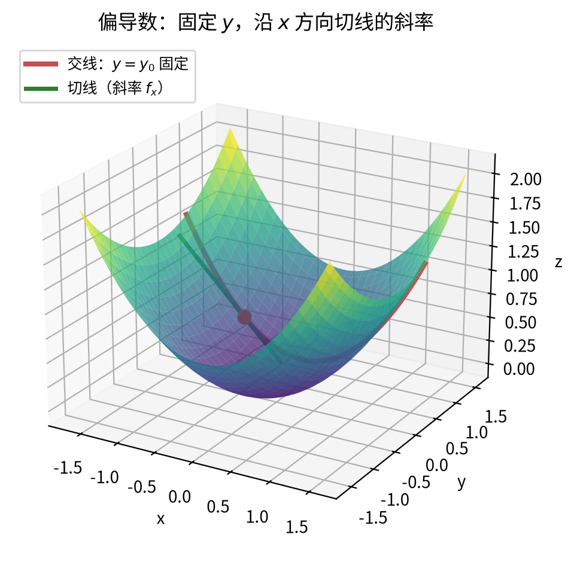
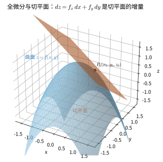
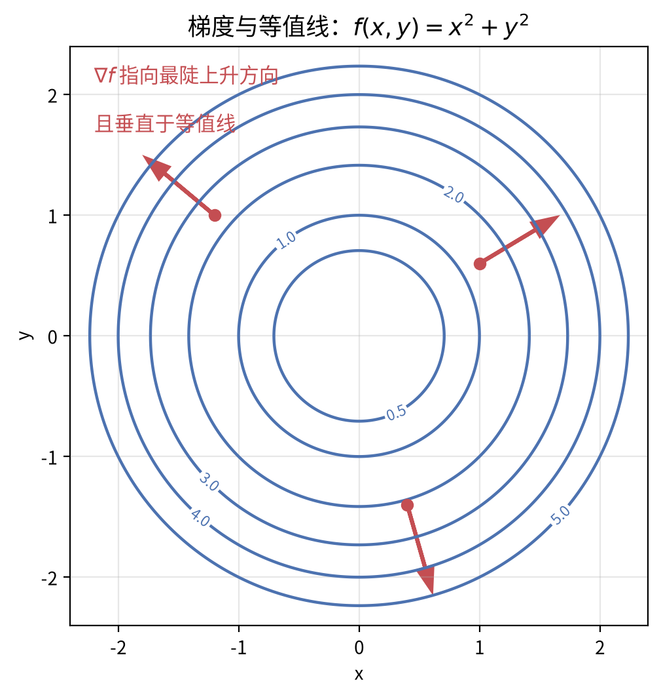
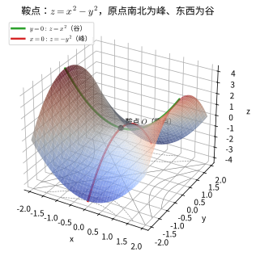
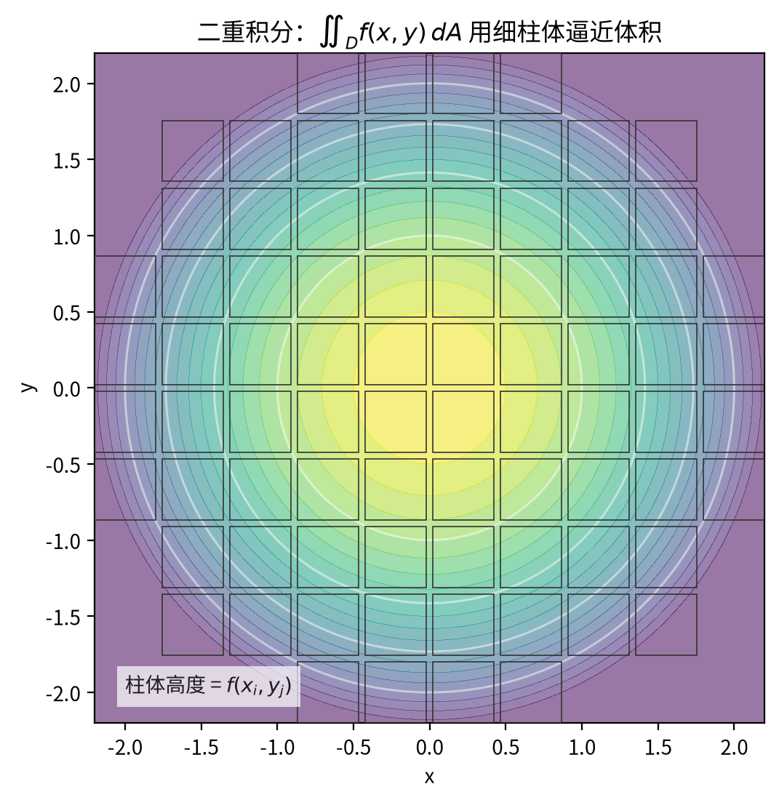

# 第 12 级：多变量微积分 (Multivariable Calculus)

## 1. 学习目标

完成本教程后，您应能够：

- 理解多元函数的概念，掌握极限与连续性的判定方法
- 熟练计算偏导数与高阶偏导数，理解 Clairaut 定理
- 掌握全微分与线性近似的几何意义
- 运用链式法则解决复合函数求导问题
- 理解方向导数与梯度，掌握拉格朗日乘数法求条件极值
- 计算二重积分与三重积分，掌握变量变换与 Jacobi 行列式
- 理解曲线积分与曲面积分，掌握 Green 定理、Stokes 定理与 Gauss 散度定理
- 运用多元微积分基本定理解决实际问题

---

## 2. 多元函数

### 2.1 多元函数的定义

**多元函数**是指定义域为 $\mathbb{R}^n$（或其子集）、值域为 $\mathbb{R}$（或 $\mathbb{R}^m$）的函数。一般形式为：

$$
f: E \subseteq \mathbb{R}^n \longrightarrow \mathbb{R},\quad (x_1, x_2, \dots, x_n) \longmapsto f(x_1, x_2, \dots, x_n)
$$

当 $n=2$ 时称为**二元函数**，记作 $z = f(x, y)$；当 $n=3$ 时称为**三元函数**，记作 $u = f(x, y, z)$。

**示例**：$f(x, y) = x^2 + y^2$ 是一个二元函数，表示一个旋转抛物面。

### 2.2 多元函数的极限

设 $f$ 定义在 $\mathbb{R}^n$ 的开集 $E$ 上，$\mathbf{a} = (a_1, \dots, a_n)$ 是 $E$ 的一个聚点。若存在常数 $L$，使得对任意 $\varepsilon > 0$，存在 $\delta > 0$，当 $0 < \|\mathbf{x} - \mathbf{a}\| < \delta$ 且 $\mathbf{x} \in E$ 时，有 $|f(\mathbf{x}) - L| < \varepsilon$，则称

$$
\lim_{\mathbf{x} \to \mathbf{a}} f(\mathbf{x}) = L.
$$

**重要性质**：多元函数的极限必须与路径无关。若沿不同路径趋近时极限值不同，则极限不存在。

**示例**：考察函数

$$
f(x, y) = \frac{x^2 y}{x^4 + y^2}
$$

当 $(x, y) \to (0, 0)$ 时的极限。

- 沿直线 $y = kx$ 趋近：$f(x, kx) = \frac{k x^3}{x^4 + k^2 x^2} = \frac{kx}{x^2 + k^2} \to 0$。
- 沿抛物线 $y = x^2$ 趋近：$f(x, x^2) = \frac{x^4}{x^4 + x^4} = \frac{1}{2}$。

由于沿不同路径极限不同，故极限 $\lim_{(x,y)\to(0,0)} f(x,y)$ 不存在。

### 2.3 多元函数的连续性

函数 $f$ 在点 $\mathbf{a}$ 处连续，当且仅当

$$
\lim_{\mathbf{x} \to \mathbf{a}} f(\mathbf{x}) = f(\mathbf{a}).
$$

**注意**：每个变量单独连续不能保证多元函数整体连续。例如函数

$$
f(x, y) =
\begin{cases}
\frac{y}{x} - y, & 1 \geq x > y \geq 0 \\
\frac{x}{y} - x, & 1 \geq y > x \geq 0 \\
1 - x, & x = y > 0 \\
0, & \text{else}
\end{cases}
$$

固定任意 $y$，$f(\cdot, y)$ 在 $\mathbb{R}$ 上连续；固定任意 $x$，$f(x, \cdot)$ 也在 $\mathbb{R}$ 上连续。但 $f$ 在原点不连续，因为沿 $x = y$ 趋近时极限为 $1$，而 $f(0,0)=0$。

### 2.4 等值线与等值面

- **等值线（Level Curve）**：对于二元函数 $z = f(x, y)$，满足 $f(x, y) = c$（常数）的点的集合。
- **等值面（Level Surface）**：对于三元函数 $u = f(x, y, z)$，满足 $f(x, y, z) = c$ 的点的集合。

等值线/面是理解多元函数几何性质的重要工具。例如，$f(x, y) = x^2 + y^2$ 的等值线是以原点为中心的同心圆。

---

## 3. 偏导数

### 3.1 偏导数的定义

设 $z = f(x, y)$ 在点 $(x_0, y_0)$ 的某邻域内有定义。固定 $y = y_0$，若极限

$$
\frac{\partial f}{\partial x}(x_0, y_0) = \lim_{\Delta x \to 0} \frac{f(x_0 + \Delta x, y_0) - f(x_0, y_0)}{\Delta x}
$$

存在，则称该极限为 $f$ 在 $(x_0, y_0)$ 处关于 $x$ 的**偏导数**。类似地定义关于 $y$ 的偏导数。

**几何意义**：$\frac{\partial f}{\partial x}(x_0, y_0)$ 是曲面 $z = f(x, y)$ 与平面 $y = y_0$ 的交线在点 $(x_0, y_0, f(x_0, y_0))$ 处的切线斜率。

> **直观理解（现实类比）**：偏导就是"**只动一个变量，其余先锁住**"的瞬时变化率。想象你站在山坡上，偏导 $\frac{\partial f}{\partial x}$ 是你**只看正东方向**的坡度——分析东西向时把南北位置固定，只看东西方向的起伏。（联系第11级：这就是一元导数曲面版的"割线趋紧切线"。）

**计算示例**：设 $f(x, y) = x^2 y + \sin(xy)$，则

$$
\frac{\partial f}{\partial x} = 2xy + y\cos(xy),\quad \frac{\partial f}{\partial y} = x^2 + x\cos(xy).
$$

### 3.2 高阶偏导数

对偏导数再求偏导，得到高阶偏导数。记法：

$$
\frac{\partial^2 f}{\partial x^2} = \frac{\partial}{\partial x}\left(\frac{\partial f}{\partial x}\right),\quad
\frac{\partial^2 f}{\partial y \partial x} = \frac{\partial}{\partial y}\left(\frac{\partial f}{\partial x}\right).
$$

**示例**：对 $f(x, y) = x^3 y^2 + e^{xy}$，

$$
\frac{\partial f}{\partial x} = 3x^2 y^2 + y e^{xy},\quad
\frac{\partial^2 f}{\partial x^2} = 6x y^2 + y^2 e^{xy},
$$
$$
\frac{\partial^2 f}{\partial y \partial x} = 6x^2 y + e^{xy} + xy e^{xy}.
$$

### 3.3 Clairaut 定理（混合偏导数的相等性）

**定理（Clairaut's Theorem / Schwarz's Theorem）**：设 $f(x, y)$ 在点 $(a, b)$ 的某邻域内具有连续的二阶偏导数，则在该点处混合偏导数与求导顺序无关，即

$$
\frac{\partial^2 f}{\partial x \partial y}(a, b) = \frac{\partial^2 f}{\partial y \partial x}(a, b).
$$

**证明**：考虑二阶差分

$$
\Delta(h, k) = f(a+h, b+k) - f(a+h, b) - f(a, b+k) + f(a, b).
$$

定义函数 $g(x) = f(x, b+k) - f(x, b)$，则 $\Delta(h, k) = g(a+h) - g(a)$。由 Lagrange 中值定理，存在 $\xi$ 介于 $a$ 与 $a+h$ 之间，使得

$$
\Delta(h, k) = g'(\xi) h = \left[\frac{\partial f}{\partial x}(\xi, b+k) - \frac{\partial f}{\partial x}(\xi, b)\right] h.
$$

再对 $\frac{\partial f}{\partial x}$ 应用中值定理，存在 $\eta$ 介于 $b$ 与 $b+k$ 之间，使得

$$
\Delta(h, k) = \frac{\partial^2 f}{\partial y \partial x}(\xi, \eta) \cdot hk.
$$

同理，若先对 $y$ 求导再对 $x$ 求导，可得 $\Delta(h, k) = \frac{\partial^2 f}{\partial x \partial y}(\xi', \eta') \cdot hk$。令 $(h, k) \to (0, 0)$，由二阶偏导数的连续性即得相等性。$\blacksquare$

---

## 4. 全微分

### 4.1 全微分的定义

若函数 $z = f(x, y)$ 在点 $(x_0, y_0)$ 处的增量可表示为

$$
\Delta z = f(x_0 + \Delta x, y_0 + \Delta y) - f(x_0, y_0) = A\Delta x + B\Delta y + o(\sqrt{\Delta x^2 + \Delta y^2}),
$$

其中 $A$、$B$ 与 $\Delta x$、$\Delta y$ 无关，则称 $f$ 在 $(x_0, y_0)$ 处**可微**，且 $A = \frac{\partial f}{\partial x}(x_0, y_0)$，$B = \frac{\partial f}{\partial y}(x_0, y_0)$。称

$$
\mathrm{d}z = \frac{\partial f}{\partial x} \mathrm{d}x + \frac{\partial f}{\partial y} \mathrm{d}y
$$

为 $f$ 的**全微分**。

**可微的充分条件**：若 $f$ 的偏导数在 $(x_0, y_0)$ 的某邻域内存在且连续，则 $f$ 在该点可微。

### 4.2 切平面与线性近似

曲面 $z = f(x, y)$ 在点 $(x_0, y_0, z_0)$ 处的**切平面**方程为

$$
z - z_0 = \frac{\partial f}{\partial x}(x_0, y_0)(x - x_0) + \frac{\partial f}{\partial y}(x_0, y_0)(y - y_0).
$$

**线性近似**（Linear Approximation）：

$$
f(x, y) \approx f(x_0, y_0) + \frac{\partial f}{\partial x}(x_0, y_0)(x - x_0) + \frac{\partial f}{\partial y}(x_0, y_0)(y - y_0).
$$

> **直观理解（现实类比）**：全微分就是"**在地形图上某点放一块小平板**"——平板的倾斜度由两个偏导 $f_x, f_y$ 决定，平板的方程正是切平面。
> 当你只在 $P_0$ 附近走一小步 $(dx, dy)$，曲面高度变化 $\Delta z$ 几乎就等于平板上的高度变化 $dz = f_x\,dx + f_y\,dy$。
> 也就是说，切平面是"**最贴近曲面的平面**"，全微分把复杂的曲面变化线性化成两块独立斜坡的叠加。（联系第11级：一元函数的切线 $\Rightarrow$ 多元函数的切平面。）

**示例**：用线性近似估算 $f(x, y) = \sqrt{x^2 + y^2}$ 在 $(3.01, 3.98)$ 处的值。

取 $(x_0, y_0) = (3, 4)$，则 $f(3, 4) = 5$，$\frac{\partial f}{\partial x} = \frac{x}{\sqrt{x^2+y^2}}$，$\frac{\partial f}{\partial y} = \frac{y}{\sqrt{x^2+y^2}}$，在 $(3,4)$ 处分别为 $\frac{3}{5}$ 和 $\frac{4}{5}$。

$$
f(3.01, 3.98) \approx 5 + \frac{3}{5}(0.01) + \frac{4}{5}(-0.02) = 5 + 0.006 - 0.016 = 4.99.
$$

---

## 5. 链式法则

### 5.1 链式法则的表述

**情形一**：若 $z = f(x, y)$ 可微，且 $x = g(t)$，$y = h(t)$ 可导，则

$$
\frac{\mathrm{d}z}{\mathrm{d}t} = \frac{\partial f}{\partial x} \frac{\mathrm{d}x}{\mathrm{d}t} + \frac{\partial f}{\partial y} \frac{\mathrm{d}y}{\mathrm{d}t}.
$$

**情形二**：若 $z = f(x, y)$ 可微，且 $x = g(s, t)$，$y = h(s, t)$ 具有偏导数，则

$$
\frac{\partial z}{\partial s} = \frac{\partial f}{\partial x} \frac{\partial x}{\partial s} + \frac{\partial f}{\partial y} \frac{\partial y}{\partial s},\quad
\frac{\partial z}{\partial t} = \frac{\partial f}{\partial x} \frac{\partial x}{\partial t} + \frac{\partial f}{\partial y} \frac{\partial y}{\partial t}.
$$

### 5.2 链式法则的证明

**证明**（情形一）：设 $z = f(x, y)$ 可微，则

$$
\Delta z = \frac{\partial f}{\partial x} \Delta x + \frac{\partial f}{\partial y} \Delta y + \varepsilon_1 \Delta x + \varepsilon_2 \Delta y,
$$

其中 $\varepsilon_1, \varepsilon_2 \to 0$ 当 $(\Delta x, \Delta y) \to (0, 0)$。

两边除以 $\Delta t$ 并令 $\Delta t \to 0$，注意到 $\frac{\Delta x}{\Delta t} \to \frac{\mathrm{d}x}{\mathrm{d}t}$，$\frac{\Delta y}{\Delta t} \to \frac{\mathrm{d}y}{\mathrm{d}t}$，且 $\varepsilon_1, \varepsilon_2 \to 0$，于是

$$
\frac{\mathrm{d}z}{\mathrm{d}t} = \frac{\partial f}{\partial x} \frac{\mathrm{d}x}{\mathrm{d}t} + \frac{\partial f}{\partial y} \frac{\mathrm{d}y}{\mathrm{d}t}. \quad \blacksquare
$$

**示例**：设 $z = x^2 y + e^{xy}$，$x = t^2$，$y = \sin t$，求 $\frac{\mathrm{d}z}{\mathrm{d}t}$。

$$
\frac{\partial z}{\partial x} = 2xy + y e^{xy},\quad \frac{\partial z}{\partial y} = x^2 + x e^{xy},
$$
$$
\frac{\mathrm{d}x}{\mathrm{d}t} = 2t,\quad \frac{\mathrm{d}y}{\mathrm{d}t} = \cos t,
$$
$$
\frac{\mathrm{d}z}{\mathrm{d}t} = (2xy + y e^{xy})(2t) + (x^2 + x e^{xy})(\cos t).
$$

---

## 6. 方向导数与梯度

### 6.1 方向导数

设 $f(x, y)$ 在点 $(x_0, y_0)$ 的某邻域内有定义，$\mathbf{u} = (\cos\theta, \sin\theta)$ 是一个单位向量。则 $f$ 沿方向 $\mathbf{u}$ 的**方向导数**定义为

$$
D_{\mathbf{u}} f(x_0, y_0) = \lim_{t \to 0^+} \frac{f(x_0 + t\cos\theta, y_0 + t\sin\theta) - f(x_0, y_0)}{t}.
$$

若 $f$ 可微，则

$$
D_{\mathbf{u}} f(x_0, y_0) = \frac{\partial f}{\partial x}(x_0, y_0) \cos\theta + \frac{\partial f}{\partial y}(x_0, y_0) \sin\theta.
$$

> **直观理解（现实类比）**：方向导数与梯度就是"**站在山坡上看哪个方向最陡**"。
> 梯度 $\nabla f$ 是一个箭头，它指向**最陡的上坡方向**，长度就是最大坡度；而方向导数 $D_\mathbf{u}f$ 是你**任意选一个方向 $\mathbf{u}$** 走时感受到的坡度，数值上等于"梯度在你这个方向上的投影" $\|\nabla f\|\cos\varphi$。
> 当 $\mathbf{u}$ 与梯度同向时 $\varphi=0$，方向导数最大（最陡上升）；当 $\mathbf{u}$ 垂直梯度时（沿等高线走）方向导数为 0（高度不变）；反向则为最陡下降。

### 6.2 梯度向量

$f$ 的**梯度**（Gradient）定义为

$$
\nabla f = \left( \frac{\partial f}{\partial x}, \frac{\partial f}{\partial y} \right) \quad (\text{二元}), \qquad
\nabla f = \left( \frac{\partial f}{\partial x}, \frac{\partial f}{\partial y}, \frac{\partial f}{\partial z} \right) \quad (\text{三元}).
$$

方向导数与梯度的关系：

$$
D_{\mathbf{u}} f = \nabla f \cdot \mathbf{u} = \|\nabla f\| \cos\phi,
$$

其中 $\phi$ 是 $\nabla f$ 与 $\mathbf{u}$ 的夹角。

**重要结论**：
- 梯度方向是函数增长最快的方向（$\phi = 0$）。
- 负梯度方向是函数下降最快的方向（$\phi = \pi$）。
- 梯度方向垂直于等值线/等值面。

> **直观理解（现实类比）**：梯度就是"**最陡的爬山箭头**"。站在地图的等高线上，梯度总是指向你**爬得最快**的方向，而且它与等高线垂直——因为只要沿着与等高线平行的方向走，高度就不变。这也是为什么山谷探险家总是**垂直**地横穿等高线爬升。（联系第2章：等值线正是"高度相同"的线。）

### 6.3 拉格朗日乘数法

**问题**：求函数 $f(x, y, z)$ 在约束条件 $g(x, y, z) = 0$ 下的极值。

**方法**：构造**拉格朗日函数**

$$
\mathcal{L}(x, y, z, \lambda) = f(x, y, z) - \lambda g(x, y, z),
$$

令所有偏导数为零：

$$
\begin{cases}
\frac{\partial \mathcal{L}}{\partial x} = \frac{\partial f}{\partial x} - \lambda \frac{\partial g}{\partial x} = 0, \\[3pt]
\frac{\partial \mathcal{L}}{\partial y} = \frac{\partial f}{\partial y} - \lambda \frac{\partial g}{\partial y} = 0, \\[3pt]
\frac{\partial \mathcal{L}}{\partial z} = \frac{\partial f}{\partial z} - \lambda \frac{\partial g}{\partial z} = 0, \\[3pt]
\frac{\partial \mathcal{L}}{\partial \lambda} = -g(x, y, z) = 0.
\end{cases}
$$

解此方程组即得候选极值点。

**证明思路**：在约束条件 $g = 0$ 下，极值点处 $\nabla f$ 必与 $\nabla g$ 平行（否则 $\nabla f$ 在切平面上的投影非零，沿该投影方向移动可增加函数值）。因此存在 $\lambda$ 使得 $\nabla f = \lambda \nabla g$，这正是上述方程组的向量形式。$\blacksquare$

**示例**：求函数 $f(x, y) = x^2 + y^2$ 在约束 $x + y = 1$ 下的最小值。

解：构造 $\mathcal{L} = x^2 + y^2 - \lambda(x + y - 1)$。

$$
\frac{\partial \mathcal{L}}{\partial x} = 2x - \lambda = 0 \Rightarrow x = \frac{\lambda}{2},
$$
$$
\frac{\partial \mathcal{L}}{\partial y} = 2y - \lambda = 0 \Rightarrow y = \frac{\lambda}{2},
$$
$$
\frac{\partial \mathcal{L}}{\partial \lambda} = -(x + y - 1) = 0 \Rightarrow \frac{\lambda}{2} + \frac{\lambda}{2} = 1 \Rightarrow \lambda = 1.
$$

于是 $x = y = \frac{1}{2}$，最小值为 $f\left(\frac{1}{2}, \frac{1}{2}\right) = \frac{1}{2}$。

> **直观理解（现实类比）**：拉格朗日乘数法就是"**在锁链上找最高点**"。想象一条狗拴在牵绳上（约束 $g$），绳长固定，它想离骨头（目标 $f$）最近。最优位置一定出现在**绳圈与"离骨头距离"的同心圆相切**的地方——此时狗再也无法沿绳移动来提高分数。数学上，相切意味着 $\nabla f$ 与 $\nabla g$ **平行**，即存在 $\lambda$ 使 $\nabla f=\lambda\nabla g$。

### 6.4 隐函数定理

> 讨论方程 $F(x, y) = 0$ 什么时候能（局部地）确定出隐函数 $y = \varphi(x)$，以及如何求其导数。这是多元微分学的理论基石。

**隐函数存在定理**：设 $F(x, y)$ 在点 $(x_0, y_0)$ 的某邻域内具有连续偏导数，且
$$
F(x_0, y_0) = 0, \qquad F_y(x_0, y_0) \neq 0
$$
则在 $(x_0, y_0)$ 的某邻域内，方程 $F(x, y) = 0$ 唯一确定一个连续可导的函数 $y = \varphi(x)$，满足 $\varphi(x_0) = y_0$，且
$$
\varphi'(x) = -\frac{F_x(x, y)}{F_y(x, y)}
$$

> **直观理解**：$F_y(x_0, y_0) \neq 0$ 保证在 $(x_0, y_0)$ 附近，$F$ 关于 $y$ 是"可逆的"，从而能把 $y$ 解出来。这正是隐函数存在的前提条件。

> **示例**：由 $x^2 + y^2 = 1$ 确定 $y = \varphi(x)$。令 $F = x^2 + y^2 - 1$，则 $F_x = 2x$，$F_y = 2y$，故 $\varphi'(x) = -\frac{2x}{2y} = -\frac{x}{y}$（与 2.5 结果一致）。

**隐映射定理（方程组情形）**：设 $\mathbf{F}(\mathbf{x}, \mathbf{y}) = \mathbf{0}$（$m$ 个方程、$m$ 个隐变量 $y_1,\dots,y_m$），若在 $(\mathbf{x}_0, \mathbf{y}_0)$ 处 $\mathbf{F} = \mathbf{0}$ 且雅可比行列式
$$
\frac{\partial(F_1,\dots,F_m)}{\partial(y_1,\dots,y_m)} \neq 0
$$
则局部能唯一解出连续可微的 $\mathbf{y} = \boldsymbol{\varphi}(\mathbf{x})$。

**反函数定理**：设 $f: \mathbb{R}^n \to \mathbb{R}^n$ 在 $x_0$ 附近连续可微，且雅可比矩阵 $Df(x_0)$ **可逆**，则 $f$ 在 $x_0$ 的某邻域内有连续可微的反函数 $f^{-1}$，且
$$
D(f^{-1})(f(x_0)) = [Df(x_0)]^{-1}
$$

### 6.5 多元函数的泰勒公式

> 用多项式近似多元函数，是研究极值、逼近与误差估计的基础。

设 $f(x, y)$ 在点 $(x_0, y_0)$ 的某邻域内具有 $n+1$ 阶连续偏导数，令 $h = x - x_0$，$k = y - y_0$，则 $f$ 在 $(x_0, y_0)$ 处的 $n$ 阶泰勒展开为
$$
f(x_0 + h, y_0 + k) = \sum_{i=0}^{n} \frac{1}{i!}\left(h\frac{\partial}{\partial x} + k\frac{\partial}{\partial y}\right)^{i} f(x_0, y_0) + R_n
$$
其中 $R_n$ 为拉格朗日型余项。

**一阶展开（线性近似）**：
$$
f(x_0+h, y_0+k) \approx f(x_0,y_0) + f_x(x_0,y_0)h + f_y(x_0,y_0)k
$$

**二阶展开（含海森矩阵）**：
$$
f(x_0+h, y_0+k) \approx f + f_x h + f_y k + \frac{1}{2}\left(f_{xx}h^2 + 2f_{xy}hk + f_{yy}k^2\right)
$$
其中各偏导数均在 $(x_0, y_0)$ 取值。用海森矩阵可写成
$$
f(\mathbf{x}_0 + \mathbf{h}) \approx f(\mathbf{x}_0) + \nabla f \cdot \mathbf{h} + \frac{1}{2}\,\mathbf{h}^T Hf(\mathbf{x}_0)\, \mathbf{h}
$$

> **应用**：二阶展开的第二项（二次型 $\mathbf{h}^T Hf\, \mathbf{h}$）的符号正是判断 $(x_0,y_0)$ 是极大值点、极小值点还是鞍点的依据（极值的二阶充分条件）。

> **直观理解（现实类比）**：鞍点就是"**马鞍或山口**"——既不是山顶也不是山谷，而是"**一方向上凸、另一方向下凹**"的临界点。
> 想象你坐在马鞍上：南北方向（沿马身）你是处在山脊的顶（前后都低），东西方向（横向）你处在山谷的底（左右都高）。
> 数学上，黑塞矩阵 $H$ 在鞍点处**既非正定也非负定**（行列式 $f_{xx}f_{yy}-f_{xy}^2<0$），所以两个特征值符号相反。对于 $z=x^2-y^2$，沿 $x$ 方向是开口向上的抛物面（谷），沿 $y$ 方向是开口向下的（峰），原点就是这种"上凹下凸"的鞍点。

---

## 7. 重积分

### 7.1 二重积分

**定义**：二重积分 $\iint_D f(x, y) \, \mathrm{d}A$ 是函数 $f$ 在区域 $D$ 上的黎曼和的极限。

> **直观理解（现实类比）**：二重积分就是"**用豆腐块堆出曲面下的体积**"。先把 $xy$ 平面切成小方格，每个方格里竖一根"以该处高度 $f(x_i,y_j)$ 为高的柱子"，再把所有柱体体积相加，格子越细越接近真实体积——细到无穷就是二重积分。（联系第11级 Riemann 和：这是它在平面上的"二维升级版"。）

**直角坐标下的累次积分**：

- 若 $D = \{(x, y) \mid a \leq x \leq b,\; g_1(x) \leq y \leq g_2(x)\}$，则

$$
\iint_D f(x, y) \, \mathrm{d}A = \int_a^b \int_{g_1(x)}^{g_2(x)} f(x, y) \, \mathrm{d}y \, \mathrm{d}x.
$$

- 若 $D = \{(x, y) \mid c \leq y \leq d,\; h_1(y) \leq x \leq h_2(y)\}$，则

$$
\iint_D f(x, y) \, \mathrm{d}A = \int_c^d \int_{h_1(y)}^{h_2(y)} f(x, y) \, \mathrm{d}x \, \mathrm{d}y.
$$

#### 极坐标变换

令 $x = r\cos\theta$，$y = r\sin\theta$，则

$$
\iint_D f(x, y) \, \mathrm{d}x \, \mathrm{d}y = \iint_{D'} f(r\cos\theta, r\sin\theta) \, r \, \mathrm{d}r \, \mathrm{d}\theta.
$$

其中 $r$ 是 Jacobi 行列式的绝对值。

**示例**：计算 $\iint_D e^{-x^2 - y^2} \, \mathrm{d}A$，其中 $D$ 是半径为 $a$ 的圆盘。

用极坐标：$x = r\cos\theta$，$y = r\sin\theta$，$0 \leq r \leq a$，$0 \leq \theta \leq 2\pi$。

$$
\iint_D e^{-(x^2+y^2)} \, \mathrm{d}A = \int_0^{2\pi} \int_0^a e^{-r^2} \cdot r \, \mathrm{d}r \, \mathrm{d}\theta = 2\pi \int_0^a r e^{-r^2} \, \mathrm{d}r = \pi(1 - e^{-a^2}).
$$

### 7.2 三重积分

**定义**：三重积分 $\iiint_V f(x, y, z) \, \mathrm{d}V$ 是函数 $f$ 在空间区域 $V$ 上的黎曼和的极限。

> **直观理解（现实类比）**：三重积分切片法就是"**切面包称重**"——把整个立体（面包）切成无数个**垂直于 $x$ 轴的薄片**，每一片的体积近似为"截面积 $A(x_i)$ × 厚度 $dx$"。
> 把所有薄片加起来就得到总体积：$V=\int_a^b A(x)\,dx$。
> 这就把三重积分"降维"成一个一重积分：先在每个切片上做二重积分求截面 $A(x)$，再沿 $x$ 方向积分。换个方向切（沿 $y$ 或 $z$）也是同样的思路，灵活选择切片方向往往能大大简化计算。

#### 柱坐标变换

$$
x = r\cos\theta,\quad y = r\sin\theta,\quad z = z,
$$
$$
\mathrm{d}V = r \, \mathrm{d}r \, \mathrm{d}\theta \, \mathrm{d}z.
$$

#### 球坐标变换

$$
x = \rho \sin\phi \cos\theta,\quad y = \rho \sin\phi \sin\theta,\quad z = \rho \cos\phi,
$$
$$
\mathrm{d}V = \rho^2 \sin\phi \, \mathrm{d}\rho \, \mathrm{d}\phi \, \mathrm{d}\theta,
$$

其中 $\rho \geq 0$，$0 \leq \phi \leq \pi$，$0 \leq \theta \leq 2\pi$。

### 7.3 Jacobi 行列式

变量变换 $(u, v) \to (x, y)$ 的 Jacobi 行列式为

$$
\frac{\partial(x, y)}{\partial(u, v)} = \begin{vmatrix}
\frac{\partial x}{\partial u} & \frac{\partial x}{\partial v} \\[3pt]
\frac{\partial y}{\partial u} & \frac{\partial y}{\partial v}
\end{vmatrix}.
$$

变换公式：

$$
\iint_D f(x, y) \, \mathrm{d}x \, \mathrm{d}y = \iint_{D'} f(x(u, v), y(u, v)) \left| \frac{\partial(x, y)}{\partial(u, v)} \right| \, \mathrm{d}u \, \mathrm{d}v.
$$

对于三重积分，变换 $(u, v, w) \to (x, y, z)$ 的 Jacobi 行列式为

$$
\frac{\partial(x, y, z)}{\partial(u, v, w)} = \begin{vmatrix}
\frac{\partial x}{\partial u} & \frac{\partial x}{\partial v} & \frac{\partial x}{\partial w} \\[3pt]
\frac{\partial y}{\partial u} & \frac{\partial y}{\partial v} & \frac{\partial y}{\partial w} \\[3pt]
\frac{\partial z}{\partial u} & \frac{\partial z}{\partial v} & \frac{\partial z}{\partial w}
\end{vmatrix}.
$$

---

## 8. 曲线积分与曲面积分

### 8.1 曲线积分

#### 第一类曲线积分（对弧长）

$$
\int_C f(x, y, z) \, \mathrm{d}s = \int_a^b f(\mathbf{r}(t)) \|\mathbf{r}'(t)\| \, \mathrm{d}t,
$$

其中 $C$ 的参数方程为 $\mathbf{r}(t) = (x(t), y(t), z(t))$，$a \leq t \leq b$。

#### 第二类曲线积分（对坐标）

$$
\int_C P \, \mathrm{d}x + Q \, \mathrm{d}y + R \, \mathrm{d}z = \int_a^b \left(P \frac{\mathrm{d}x}{\mathrm{d}t} + Q \frac{\mathrm{d}y}{\mathrm{d}t} + R \frac{\mathrm{d}z}{\mathrm{d}t}\right) \mathrm{d}t.
$$

向量形式：$\int_C \mathbf{F} \cdot \mathrm{d}\mathbf{r} = \int_a^b \mathbf{F}(\mathbf{r}(t)) \cdot \mathbf{r}'(t) \, \mathrm{d}t$。

### 8.2 Green 定理

**定理（Green's Theorem）**：设 $D$ 是由分段光滑的简单闭曲线 $L$ 围成的平面区域，函数 $P(x, y)$、$Q(x, y)$ 在 $D$ 上具有一阶连续偏导数，则

$$
\oint_{L^+} P \, \mathrm{d}x + Q \, \mathrm{d}y = \iint_D \left( \frac{\partial Q}{\partial x} - \frac{\partial P}{\partial y} \right) \mathrm{d}x \, \mathrm{d}y,
$$

其中 $L^+$ 是 $D$ 的正向边界（逆时针方向）。

**证明**（对 $x$-型区域）：设 $D = \{(x, y) \mid a \leq x \leq b,\; g_1(x) \leq y \leq g_2(x)\}$。先证

$$
\oint_L P \, \mathrm{d}x = -\iint_D \frac{\partial P}{\partial y} \, \mathrm{d}A.
$$

计算二重积分：

$$
\iint_D \frac{\partial P}{\partial y} \, \mathrm{d}A = \int_a^b \int_{g_1(x)}^{g_2(x)} \frac{\partial P}{\partial y} \, \mathrm{d}y \, \mathrm{d}x = \int_a^b \left[P(x, g_2(x)) - P(x, g_1(x))\right] \mathrm{d}x.
$$

另一方面，曲线 $L$ 由四段组成：$C_1$（$y = g_1(x)$，$a \to b$），$C_2$（竖直线），$C_3$（$y = g_2(x)$，$b \to a$），$C_4$（竖直线）。在 $C_2$ 和 $C_4$ 上 $\mathrm{d}x = 0$，所以

$$
\oint_L P \, \mathrm{d}x = \int_a^b P(x, g_1(x)) \, \mathrm{d}x + \int_b^a P(x, g_2(x)) \, \mathrm{d}x = \int_a^b \left[P(x, g_1(x)) - P(x, g_2(x))\right] \mathrm{d}x.
$$

两式相加即得 $\oint_L P \, \mathrm{d}x = -\iint_D \frac{\partial P}{\partial y} \, \mathrm{d}A$。类似可证 $\oint_L Q \, \mathrm{d}y = \iint_D \frac{\partial Q}{\partial x} \, \mathrm{d}A$。两式相加即得 Green 公式。$\blacksquare$

> **直观理解（现实类比）**：Green 定理就像"**统计湖泊里的漩涡**"——你沿湖边走一圈感受到的水流（边界线积分 $\oint_{\partial D}\mathbf{F}\cdot d\mathbf{r}$），等于湖内**所有小漩涡强度之和**（区域内旋度的二重积分 $\iint_D(\nabla\times\mathbf{F})\cdot\hat{k}\,dA$）。
> 一个小漩涡的强度就是该点的"旋度"（标量，描述场在该点附近绕 $\hat{k}$ 轴的旋转趋势）。把无数小漩涡加起来，恰好抵消内部，只剩下贴着边界那一圈——这正是"宏观的边界环流 = 微观的局部旋转之和"。这也说明 Green 定理是 Stokes 定理在平面上的特例。

**应用**：Green 公式可用于计算平面区域的面积：

$$
A = \iint_D \mathrm{d}A = \frac{1}{2} \oint_L x \, \mathrm{d}y - y \, \mathrm{d}x.
$$

### 8.3 曲面积分

#### 第一类曲面积分（对面积）

$$
\iint_S f(x, y, z) \, \mathrm{d}S = \iint_D f(\mathbf{r}(u, v)) \|\mathbf{r}_u \times \mathbf{r}_v\| \, \mathrm{d}u \, \mathrm{d}v,
$$

其中 $S$ 的参数方程为 $\mathbf{r}(u, v) = (x(u, v), y(u, v), z(u, v))$。

#### 第二类曲面积分（对坐标/通量）

$$
\iint_S \mathbf{F} \cdot \mathrm{d}\mathbf{S} = \iint_S \mathbf{F} \cdot \mathbf{n} \, \mathrm{d}S = \iint_D \mathbf{F}(\mathbf{r}(u, v)) \cdot (\mathbf{r}_u \times \mathbf{r}_v) \, \mathrm{d}u \, \mathrm{d}v.
$$

### 8.4 Stokes 定理

**定理（Stokes' Theorem）**：设 $S$ 是分片光滑的有向曲面，$\partial S$ 是其边界闭曲线，方向与 $S$ 的法向量满足右手定则。若 $\mathbf{F} = (P, Q, R)$ 在 $S$ 上具有一阶连续偏导数，则

$$
\iint_S (\nabla \times \mathbf{F}) \cdot \mathrm{d}\mathbf{S} = \oint_{\partial S} \mathbf{F} \cdot \mathrm{d}\mathbf{r},
$$

即

$$
\iint_S \left( \frac{\partial R}{\partial y} - \frac{\partial Q}{\partial z} \right) \mathrm{d}y \, \mathrm{d}z + \left( \frac{\partial P}{\partial z} - \frac{\partial R}{\partial x} \right) \mathrm{d}z \, \mathrm{d}x + \left( \frac{\partial Q}{\partial x} - \frac{\partial P}{\partial y} \right) \mathrm{d}x \, \mathrm{d}y = \oint_{\partial S} P \, \mathrm{d}x + Q \, \mathrm{d}y + R \, \mathrm{d}z.
$$

**意义**：Stokes 定理将曲面积分与边界曲线积分联系起来，是 Green 定理在三维空间的推广。

### 8.5 散度定理（Gauss 定理）

**定理（Divergence Theorem / Gauss's Theorem）**：设 $\Omega$ 是分片光滑的闭曲面 $\Sigma$ 所围成的空间区域，$\mathbf{F} = (P, Q, R)$ 在 $\Omega$ 上具有一阶连续偏导数，则

$$
\iiint_\Omega \nabla \cdot \mathbf{F} \, \mathrm{d}V = \oiint_\Sigma \mathbf{F} \cdot \mathrm{d}\mathbf{S},
$$

即

$$
\iiint_\Omega \left( \frac{\partial P}{\partial x} + \frac{\partial Q}{\partial y} + \frac{\partial R}{\partial z} \right) \mathrm{d}V = \oiint_\Sigma (P \cos\alpha + Q \cos\beta + R \cos\gamma) \, \mathrm{d}S,
$$

其中 $\mathbf{n} = (\cos\alpha, \cos\beta, \cos\gamma)$ 是 $\Sigma$ 的向外单位法向量。

**意义**：散度定理将体积分与边界曲面积分联系起来，通量等于散度在体积内的积分。

> **直观理解（现实类比）**：Gauss 散度定理就像"**统计房间的通风**"——通过房间所有门窗的气流净总量（闭曲面通量 $\oiint_{\partial\Omega}\mathbf{F}\cdot d\mathbf{S}$），等于房间内**每个气源/气汇的强度之和**（区域内散度的三重积分 $\iiint_\Omega\nabla\cdot\mathbf{F}\,dV$）。
> 散度 $\nabla\cdot\mathbf{F}>0$ 的点是"源"（向外喷气，如暖气片），$<0$ 是"汇"（向内吸气，如排气扇）。把所有源汇的净产气量加起来，必然等于穿过房间表面的净流出量——这是"局部产出 = 整体流出"的守恒思想，也是电磁学高斯定律 $\oiint \mathbf{E}\cdot d\mathbf{S}=Q_{\text{内}}/\varepsilon_0$ 的数学基础。

---

## 9. 多元微积分基本定理

多元微积分中的四个基本定理统一了微分与积分的关系，它们都是**广义 Stokes 定理**的特例。

### 9.1 梯度定理（Gradient Theorem / Fundamental Theorem of Line Integrals）

若 $\mathbf{F} = \nabla f$ 是保守场，则曲线积分与路径无关：

$$
\int_C \nabla f \cdot \mathrm{d}\mathbf{r} = f(\mathbf{r}(b)) - f(\mathbf{r}(a)).
$$

### 9.2 Green 定理（平面上的 Stokes 定理）

$$
\oint_{\partial D} P \, \mathrm{d}x + Q \, \mathrm{d}y = \iint_D \left( \frac{\partial Q}{\partial x} - \frac{\partial P}{\partial y} \right) \mathrm{d}A.
$$

**应用**：计算不规则区域的面积，简化复杂曲线积分。

### 9.3 Stokes 定理（曲面上的 Stokes 定理）

$$
\iint_S (\nabla \times \mathbf{F}) \cdot \mathrm{d}\mathbf{S} = \oint_{\partial S} \mathbf{F} \cdot \mathrm{d}\mathbf{r}.
$$

**应用**：将曲面积分转化为更易计算的曲线积分，或反之。

### 9.4 Gauss 散度定理

$$
\iiint_\Omega \nabla \cdot \mathbf{F} \, \mathrm{d}V = \oiint_{\partial \Omega} \mathbf{F} \cdot \mathrm{d}\mathbf{S}.
$$

**应用**：计算封闭曲面的通量，物理中用于电磁学（Gauss 定律）、流体力学等。

### 9.5 统一视角——广义 Stokes 定理

以上四个定理可统一表述为：

$$
\int_M \mathrm{d}\omega = \int_{\partial M} \omega,
$$

其中 $M$ 是一个可定向的 $n$ 维流形，$\omega$ 是 $M$ 上的 $n-1$ 阶微分形式，$\mathrm{d}\omega$ 是 $\omega$ 的外微分。

---

## 10. 示例

### 示例 1：计算偏导数

求 $f(x, y) = \ln(x^2 + y^2)$ 的一阶和二阶偏导数。

**解**：

$$
\frac{\partial f}{\partial x} = \frac{2x}{x^2 + y^2},\quad \frac{\partial f}{\partial y} = \frac{2y}{x^2 + y^2},
$$
$$
\frac{\partial^2 f}{\partial x^2} = \frac{2(y^2 - x^2)}{(x^2 + y^2)^2},\quad
\frac{\partial^2 f}{\partial y^2} = \frac{2(x^2 - y^2)}{(x^2 + y^2)^2},
$$
$$
\frac{\partial^2 f}{\partial x \partial y} = \frac{-4xy}{(x^2 + y^2)^2} = \frac{\partial^2 f}{\partial y \partial x}.
$$

### 示例 2：全微分与线性近似

求 $f(x, y) = e^{xy}$ 在点 $(1, 0)$ 处的全微分，并用线性近似估算 $f(1.1, 0.1)$。

**解**：$\frac{\partial f}{\partial x} = y e^{xy}$，$\frac{\partial f}{\partial y} = x e^{xy}$。在 $(1, 0)$ 处：

$$
\frac{\partial f}{\partial x}(1, 0) = 0,\quad \frac{\partial f}{\partial y}(1, 0) = 1,
$$
$$
\mathrm{d}f = 0 \cdot \mathrm{d}x + 1 \cdot \mathrm{d}y = \mathrm{d}y,
$$
$$
f(1.1, 0.1) \approx f(1, 0) + \mathrm{d}f = 1 + 0.1 = 1.1.
$$

实际值 $e^{0.11} \approx 1.116$，误差约为 $0.016$。

### 示例 3：链式法则

设 $z = u^2 + v^2$，$u = x + y$，$v = x - y$，求 $\frac{\partial z}{\partial x}$ 和 $\frac{\partial z}{\partial y}$。

**解**：

$$
\frac{\partial z}{\partial x} = \frac{\partial z}{\partial u} \frac{\partial u}{\partial x} + \frac{\partial z}{\partial v} \frac{\partial v}{\partial x} = 2u \cdot 1 + 2v \cdot 1 = 2(u + v) = 4x,
$$
$$
\frac{\partial z}{\partial y} = \frac{\partial z}{\partial u} \frac{\partial u}{\partial y} + \frac{\partial z}{\partial v} \frac{\partial v}{\partial y} = 2u \cdot 1 + 2v \cdot (-1) = 2(u - v) = 4y.
$$

### 示例 4：方向导数与梯度

求 $f(x, y) = x^2 + 2y^2$ 在点 $(1, 1)$ 处沿方向 $\mathbf{u} = (1, 1)/\sqrt{2}$ 的方向导数。

**解**：$\nabla f = (2x, 4y)$，在 $(1, 1)$ 处 $\nabla f = (2, 4)$。

$$
D_{\mathbf{u}} f(1, 1) = \nabla f \cdot \mathbf{u} = (2, 4) \cdot \frac{(1, 1)}{\sqrt{2}} = \frac{2 + 4}{\sqrt{2}} = \frac{6}{\sqrt{2}} = 3\sqrt{2}.
$$

### 示例 5：拉格朗日乘数法

求函数 $f(x, y, z) = xyz$ 在约束 $x^2 + y^2 + z^2 = 1$ 下的最大值和最小值。

**解**：构造 $\mathcal{L} = xyz - \lambda(x^2 + y^2 + z^2 - 1)$。

$$
\begin{cases}
yz - 2\lambda x = 0 \\
xz - 2\lambda y = 0 \\
xy - 2\lambda z = 0 \\
x^2 + y^2 + z^2 = 1
\end{cases}
$$

由前三式得 $yz/x = xz/y = xy/z = 2\lambda$，即 $y^2z = x^2z$，$x^2z = x^2y$，故 $x^2 = y^2 = z^2$。

代入约束得 $3x^2 = 1$，$x = \pm \frac{1}{\sqrt{3}}$，$y = \pm \frac{1}{\sqrt{3}}$，$z = \pm \frac{1}{\sqrt{3}}$。

最大值为 $\frac{1}{3\sqrt{3}}$（三正或两负一正），最小值为 $-\frac{1}{3\sqrt{3}}$。

### 示例 6：二重积分（极坐标）

计算 $\iint_D \sqrt{x^2 + y^2} \, \mathrm{d}A$，其中 $D$ 是圆环 $1 \leq x^2 + y^2 \leq 4$。

**解**：用极坐标 $x = r\cos\theta$，$y = r\sin\theta$，$1 \leq r \leq 2$，$0 \leq \theta \leq 2\pi$。

$$
\iint_D \sqrt{x^2 + y^2} \, \mathrm{d}A = \int_0^{2\pi} \int_1^2 r \cdot r \, \mathrm{d}r \, \mathrm{d}\theta = 2\pi \int_1^2 r^2 \, \mathrm{d}r = 2\pi \cdot \frac{7}{3} = \frac{14\pi}{3}.
$$

### 示例 7：三重积分（球坐标）

计算 $\iiint_V (x^2 + y^2 + z^2) \, \mathrm{d}V$，其中 $V$ 是半径为 $R$ 的球体。

**解**：用球坐标 $x = \rho\sin\phi\cos\theta$，$y = \rho\sin\phi\sin\theta$，$z = \rho\cos\phi$。

$$
\iiint_V (x^2 + y^2 + z^2) \, \mathrm{d}V = \int_0^{2\pi} \int_0^\pi \int_0^R \rho^2 \cdot \rho^2 \sin\phi \, \mathrm{d}\rho \, \mathrm{d}\phi \, \mathrm{d}\theta
= \int_0^{2\pi} \mathrm{d}\theta \int_0^\pi \sin\phi \, \mathrm{d}\phi \int_0^R \rho^4 \, \mathrm{d}\rho
= 2\pi \cdot 2 \cdot \frac{R^5}{5} = \frac{4\pi R^5}{5}.
$$

### 示例 8：Green 定理应用

利用 Green 定理计算 $\oint_C (x^2 - y) \, \mathrm{d}x + (x + y^2) \, \mathrm{d}y$，其中 $C$ 是以 $(0,0)$、$(1,0)$、$(0,1)$ 为顶点的三角形逆时针边界。

**解**：$P = x^2 - y$，$Q = x + y^2$，$\frac{\partial Q}{\partial x} = 1$，$\frac{\partial P}{\partial y} = -1$。

$$
\oint_C P \, \mathrm{d}x + Q \, \mathrm{d}y = \iint_D \left( \frac{\partial Q}{\partial x} - \frac{\partial P}{\partial y} \right) \mathrm{d}A = \iint_D (1 - (-1)) \, \mathrm{d}A = 2 \iint_D \mathrm{d}A = 2 \cdot \frac{1}{2} = 1.
$$

### 示例 9：Stokes 定理应用

验证 Stokes 定理：$\mathbf{F} = (-y, x, z)$，$S$ 是上半球面 $z = \sqrt{1 - x^2 - y^2}$，$z \geq 0$，方向向上。

**解**：计算旋度：

$$
\nabla \times \mathbf{F} = \begin{vmatrix}
\mathbf{i} & \mathbf{j} & \mathbf{k} \\
\frac{\partial}{\partial x} & \frac{\partial}{\partial y} & \frac{\partial}{\partial z} \\
-y & x & z
\end{vmatrix} = (0, 0, 2).
$$

曲面积分：$\iint_S (\nabla \times \mathbf{F}) \cdot \mathrm{d}\mathbf{S} = \iint_S (0, 0, 2) \cdot \mathbf{n} \, \mathrm{d}S = 2 \iint_S \mathrm{d}A_{xy} = 2\pi$（因为投影面积是 $\pi$）。

边界曲线 $C$：$x^2 + y^2 = 1$，$z = 0$，参数化为 $\mathbf{r}(t) = (\cos t, \sin t, 0)$，$0 \leq t \leq 2\pi$。

$$
\oint_C \mathbf{F} \cdot \mathrm{d}\mathbf{r} = \int_0^{2\pi} (-\sin t, \cos t, 0) \cdot (-\sin t, \cos t, 0) \, \mathrm{d}t = \int_0^{2\pi} (\sin^2 t + \cos^2 t) \, \mathrm{d}t = 2\pi.
$$

两边相等，Stokes 定理成立。

### 示例 10：Gauss 散度定理应用

利用散度定理计算 $\oiint_S \mathbf{F} \cdot \mathrm{d}\mathbf{S}$，其中 $\mathbf{F} = (x^3, y^3, z^3)$，$S$ 是球面 $x^2 + y^2 + z^2 = a^2$。

**解**：$\nabla \cdot \mathbf{F} = 3x^2 + 3y^2 + 3z^2 = 3(x^2 + y^2 + z^2)$。

由散度定理：

$$
\oiint_S \mathbf{F} \cdot \mathrm{d}\mathbf{S} = \iiint_V 3(x^2 + y^2 + z^2) \, \mathrm{d}V.
$$

用球坐标计算（参考示例 7，$R = a$）：

$$
\iiint_V 3(x^2 + y^2 + z^2) \, \mathrm{d}V = 3 \cdot \frac{4\pi a^5}{5} = \frac{12\pi a^5}{5}.
$$

---

## 11. 习题

### 基础题

1. 求函数 $f(x, y) = \frac{xy}{x^2 + y^2}$ 在 $(0, 0)$ 处的极限是否存在。

2. 求 $f(x, y) = e^{x^2 + y^2} \cos(xy)$ 的一阶偏导数。

3. 验证 $f(x, y) = \arctan\frac{y}{x}$ 满足 Laplace 方程 $\frac{\partial^2 f}{\partial x^2} + \frac{\partial^2 f}{\partial y^2} = 0$（$x > 0$）。

4. 求 $f(x, y) = x^2 + 3xy + y^2$ 在点 $(1, 2)$ 处沿方向 $\mathbf{v} = (3, 4)$ 的方向导数。

5. 用拉格朗日乘数法求 $f(x, y) = x^2 y$ 在约束 $x^2 + y^2 = 3$ 下的极值。

### 中级题

6. 计算二重积分 $\iint_D \frac{1}{(1 + x^2 + y^2)^2} \, \mathrm{d}A$，其中 $D$ 是圆盘 $x^2 + y^2 \leq 1$。

7. 计算三重积分 $\iiint_V z \, \mathrm{d}V$，其中 $V$ 是由 $z = x^2 + y^2$ 和 $z = 4$ 所围成的区域。

8. 利用 Green 定理计算 $\oint_C (3y - e^{\sin x}) \, \mathrm{d}x + (7x + \sqrt{y^4 + 1}) \, \mathrm{d}y$，其中 $C$ 是圆 $x^2 + y^2 = 9$ 的逆时针边界。

9. 计算曲线积分 $\int_C y \, \mathrm{d}x + z \, \mathrm{d}y + x \, \mathrm{d}z$，其中 $C$ 是螺旋线 $\mathbf{r}(t) = (\cos t, \sin t, t)$，$0 \leq t \leq 2\pi$。

10. 利用 Stokes 定理计算 $\iint_S (\nabla \times \mathbf{F}) \cdot \mathrm{d}\mathbf{S}$，其中 $\mathbf{F} = (z^2, x^2, y^2)$，$S$ 是上半球面 $z = \sqrt{1 - x^2 - y^2}$，方向向上。

### 高级题

11. 利用散度定理计算 $\oiint_S \mathbf{F} \cdot \mathrm{d}\mathbf{S}$，其中 $\mathbf{F} = (x + \cos y, y + \sin z, z + e^{xy})$，$S$ 是立方体 $0 \leq x \leq 1$，$0 \leq y \leq 1$，$0 \leq z \leq 1$ 的表面。

12. 求函数 $f(x, y, z) = x^2 + y^2 + z^2$ 在约束 $x + y + z = 3$ 和 $x - y + z = 1$ 下的最小值。

13. 设 $f(x, y) = \begin{cases} \frac{x^3 - y^3}{x^2 + y^2}, & (x, y) \neq (0, 0) \\ 0, & (x, y) = (0, 0) \end{cases}$。证明 $f$ 在 $(0, 0)$ 处可微，并求其全微分。

14. 计算 $\iint_D \frac{x^2}{x^2 + y^2} \, \mathrm{d}A$，其中 $D$ 是由 $y = x$、$y = 0$ 和 $x = 1$ 所围成的区域。

15. 验证 Green 定理：$\oint_C (x^2 y \, \mathrm{d}x + x y^2 \, \mathrm{d}y) = \iint_D (y^2 - x^2) \, \mathrm{d}A$，其中 $C$ 是顶点为 $(0,0)$、$(1,0)$、$(1,1)$、$(0,1)$ 的正方形逆时针边界。

---

## 12. 总结

| 概念 | 核心公式 | 关键点 |
|:---|:---|:---|
| 多元函数 | $f: \mathbb{R}^n \to \mathbb{R}$ | 等值线/面，极限与路径无关 |
| 偏导数 | $\frac{\partial f}{\partial x} = \lim_{\Delta x \to 0} \frac{f(x+\Delta x, y) - f(x, y)}{\Delta x}$ | 固定其余变量，混合偏导可交换（Clairaut） |
| 全微分 | $\mathrm{d}f = \frac{\partial f}{\partial x} \mathrm{d}x + \frac{\partial f}{\partial y} \mathrm{d}y$ | 可微 $\Rightarrow$ 连续、偏导存在 |
| 链式法则 | $\frac{\mathrm{d}z}{\mathrm{d}t} = \frac{\partial z}{\partial x} \frac{\mathrm{d}x}{\mathrm{d}t} + \frac{\partial z}{\partial y} \frac{\mathrm{d}y}{\mathrm{d}t}$ | 复合函数求导 |
| 梯度 | $\nabla f = \left(\frac{\partial f}{\partial x}, \frac{\partial f}{\partial y}\right)$ | 方向：最大增长率方向，垂直于等值线 |
| 拉格朗日乘数法 | $\nabla f = \lambda \nabla g$ | 约束优化 |
| 二重积分 | $\iint_D f \, \mathrm{d}A$ | 累次积分、极坐标变换、Jacobi 行列式 |
| 三重积分 | $\iiint_V f \, \mathrm{d}V$ | 柱坐标、球坐标 |
| Green 定理 | $\oint_{\partial D} P \, \mathrm{d}x + Q \, \mathrm{d}y = \iint_D (Q_x - P_y) \, \mathrm{d}A$ | 二维 Stokes 定理 |
| Stokes 定理 | $\iint_S (\nabla \times \mathbf{F}) \cdot \mathrm{d}\mathbf{S} = \oint_{\partial S} \mathbf{F} \cdot \mathrm{d}\mathbf{r}$ | 旋度与边界 |
| Gauss 散度定理 | $\iiint_V \nabla \cdot \mathbf{F} \, \mathrm{d}V = \oiint_{\partial V} \mathbf{F} \cdot \mathrm{d}\mathbf{S}$ | 散度与通量 |
| 广义 Stokes 定理 | $\int_M \mathrm{d}\omega = \int_{\partial M} \omega$ | 统一框架 |

多变量微积分是连接一元微积分与高等数学（微分几何、偏微分方程、向量分析等）的桥梁。其核心思想可概括为：

1. **微分**：从单变量到多变量，导数推广为梯度、散度、旋度，链式法则提供复合函数求导的通用工具。
2. **积分**：从单重积分到多重积分，变量变换通过 Jacobi 行列式实现积分区域的转换。
3. **基本定理**：Green 定理、Stokes 定理、Gauss 散度定理统一了微分与积分的关系，它们是广义 Stokes 定理在不同维度下的具体表现。

掌握多变量微积分，是深入学习物理、工程、数据科学和现代数学的必备基础。