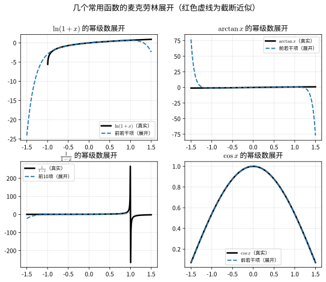

# 第 13 级：级数理论 (Series Theory)

## 一、学习目标

完成本教程后，你应该能够：

1. 理解级数的定义、部分和概念，判断级数的收敛与发散
2. 掌握正项级数的各种审敛法（比较判别法、比值判别法、根值判别法、积分判别法）及其证明
3. 掌握 p-级数的敛散性结论
4. 理解交错级数的 Leibniz 判别法及其证明，区分绝对收敛与条件收敛
5. 理解函数项级数的一致收敛概念，掌握 Weierstrass M-判别法及其证明
6. 掌握幂级数的收敛半径与收敛区间，理解逐项求导与逐项积分
7. 掌握函数的幂级数展开（泰勒级数），熟记常用展开公式并会应用
8. 理解级数的重排与柯西乘积，掌握 Riemann 重排定理和 Mertens 定理
9. 理解傅立叶级数的表示、收敛性及 Parseval 恒等式，掌握任意周期展开、正弦/余弦级数、复数形式及 Bessel 不等式、Gibbs 现象
10. 能够运用级数理论解决实际问题

---

## 二、数项级数

### 2.1 级数的定义

给定一个数列 $\{a_n\}_{n=1}^{\infty}$，将其各项依次相加得到的表达式

$$
\sum_{n=1}^{\infty} a_n = a_1 + a_2 + a_3 + \cdots + a_n + \cdots
$$

称为**无穷级数**（简称**级数**），其中 $a_n$ 称为级数的**通项**（或一般项）。

### 2.2 部分和

称级数前 $n$ 项之和为**部分和**，记作

$$
S_n = \sum_{k=1}^{n} a_k = a_1 + a_2 + \cdots + a_n
$$

这样，每个级数对应一个部分和数列 $\{S_n\}$。

### 2.3 收敛与发散

**定义**：如果部分和数列 $\{S_n\}$ 的极限存在，即

$$
\lim_{n \to \infty} S_n = S \quad (\text{有限数})
$$

则称级数 $\sum_{n=1}^{\infty} a_n$ **收敛**，$S$ 称为级数的**和**，记作

$$
S = \sum_{n=1}^{\infty} a_n
$$

如果 $\lim_{n \to \infty} S_n$ 不存在（包括无穷大），则称级数**发散**。

**例 1**：几何级数（等比级数）

$$
\sum_{n=0}^{\infty} r^n = 1 + r + r^2 + \cdots
$$

部分和 $S_n = \frac{1 - r^{n+1}}{1 - r}$（$r \neq 1$）。当 $|r| < 1$ 时，$\lim_{n \to \infty} S_n = \frac{1}{1 - r}$，级数收敛；当 $|r| \ge 1$ 时，级数发散。

**例 2**：调和级数

$$
\sum_{n=1}^{\infty} \frac{1}{n} = 1 + \frac{1}{2} + \frac{1}{3} + \cdots
$$

虽然通项 $a_n = \frac{1}{n} \to 0$，但调和级数发散（见后面积分判别法）。

### 2.4 级数收敛的必要条件

**定理**：若级数 $\sum_{n=1}^{\infty} a_n$ 收敛，则 $\lim_{n \to \infty} a_n = 0$。

**证明**：设 $S_n \to S$，则 $a_n = S_n - S_{n-1} \to S - S = 0$。

> **注意**：该条件的逆不成立。例如调和级数 $a_n = 1/n \to 0$ 但级数发散。通项趋于零是级数收敛的必要但非充分条件。

---

## 三、正项级数审敛法

**正项级数**是指所有项 $a_n \ge 0$ 的级数。对于正项级数，部分和数列 $\{S_n\}$ 单调递增，因此收敛当且仅当部分和数列有上界。

### 3.1 比较判别法 (Comparison Test)

**定理**：设 $\sum_{n=1}^{\infty} a_n$ 和 $\sum_{n=1}^{\infty} b_n$ 是两个正项级数，且存在 $N$ 使得对一切 $n \ge N$ 有 $a_n \le b_n$，则：

1. 若 $\sum b_n$ 收敛，则 $\sum a_n$ 收敛；
2. 若 $\sum a_n$ 发散，则 $\sum b_n$ 发散。

**证明**：设 $S_n = \sum_{k=1}^{n} a_k$，$T_n = \sum_{k=1}^{n} b_k$。由 $a_n \le b_n$ 知 $S_n \le T_n$（忽略前有限项不影响敛散性）。

1. 若 $\sum b_n$ 收敛，则 $T_n$ 有上界，故 $S_n$ 也有上界。由于 $S_n$ 单调递增，因而收敛。
2. 若 $\sum a_n$ 发散，则 $S_n \to +\infty$，从而 $T_n \to +\infty$，即 $\sum b_n$ 发散。

**极限形式的比较判别法**：若 $\lim_{n \to \infty} \frac{a_n}{b_n} = c$，其中 $0 < c < +\infty$，则 $\sum a_n$ 与 $\sum b_n$ 同敛散。

**证明**：由极限定义，存在 $N$，当 $n \ge N$ 时，

$$
\frac{c}{2} < \frac{a_n}{b_n} < \frac{3c}{2}
$$

即 $\frac{c}{2} b_n < a_n < \frac{3c}{2} b_n$。由比较判别法即得结论。

### 3.2 比值判别法 (Ratio Test, d'Alembert 判别法)

**定理**：设 $\sum_{n=1}^{\infty} a_n$ 为正项级数，且 $\lim_{n \to \infty} \frac{a_{n+1}}{a_n} = \rho$，则：

1. 若 $\rho < 1$，级数收敛；
2. 若 $\rho > 1$，级数发散；
3. 若 $\rho = 1$，判别法失效。

**证明**：

1. 若 $\rho < 1$，取 $r$ 满足 $\rho < r < 1$。由极限定义，存在 $N$，当 $n \ge N$ 时

$$
\frac{a_{n+1}}{a_n} < r
$$

于是

$$
a_{N+1} < r a_N,\quad a_{N+2} < r a_{N+1} < r^2 a_N,\quad \ldots,\quad a_{N+k} < r^k a_N
$$

因此

$$
\sum_{k=1}^{\infty} a_{N+k} < a_N \sum_{k=1}^{\infty} r^k = a_N \cdot \frac{r}{1-r} < \infty
$$

由比较判别法，级数收敛。

2. 若 $\rho > 1$，存在 $N$，当 $n \ge N$ 时 $\frac{a_{n+1}}{a_n} > 1$，即 $a_{n+1} > a_n > 0$，通项不趋于零，级数发散。

3. $\rho = 1$ 时，例如 $\sum \frac{1}{n}$（发散）和 $\sum \frac{1}{n^2}$（收敛）的比值极限均为 $1$，故无法判断。

### 3.3 根值判别法 (Root Test, Cauchy 判别法)

**定理**：设 $\sum_{n=1}^{\infty} a_n$ 为正项级数，且 $\lim_{n \to \infty} \sqrt[n]{a_n} = \rho$，则：

1. 若 $\rho < 1$，级数收敛；
2. 若 $\rho > 1$，级数发散；
3. 若 $\rho = 1$，判别法失效。

**证明**：

1. 若 $\rho < 1$，取 $r$ 满足 $\rho < r < 1$。存在 $N$，当 $n \ge N$ 时 $\sqrt[n]{a_n} < r$，即 $a_n < r^n$。而 $\sum r^n$ 是公比 $r < 1$ 的几何级数，收敛。由比较判别法，$\sum a_n$ 收敛。

2. 若 $\rho > 1$，存在 $N$，当 $n \ge N$ 时 $\sqrt[n]{a_n} > 1$，即 $a_n > 1$，通项不趋于零，级数发散。

3. $\rho = 1$ 时同样失效（如 $\sum 1/n$ 和 $\sum 1/n^2$ 的根值极限均为 $1$）。

### 3.4 积分判别法 (Integral Test)

**定理**：设 $f(x)$ 在 $[1, +\infty)$ 上连续、非负且单调递减，$a_n = f(n)$，则级数 $\sum_{n=1}^{\infty} a_n$ 收敛当且仅当反常积分 $\int_{1}^{\infty} f(x) \, dx$ 收敛。

**证明**：由 $f$ 单调递减，对任意 $k \ge 1$，在区间 $[k, k+1]$ 上有

$$
f(k+1) \le f(x) \le f(k),\quad x \in [k, k+1]
$$

积分得

$$
f(k+1) \le \int_{k}^{k+1} f(x) \, dx \le f(k)
$$

对 $k = 1, 2, \ldots, n-1$ 求和：

$$
\sum_{k=2}^{n} f(k) \le \int_{1}^{n} f(x) \, dx \le \sum_{k=1}^{n-1} f(k)
$$

设 $S_n = \sum_{k=1}^{n} f(k)$，则

$$
S_n - f(1) \le \int_{1}^{n} f(x) \, dx \le S_{n-1}
$$

因此 $\{S_n\}$ 有界当且仅当 $\int_{1}^{\infty} f(x) \, dx$ 收敛，即级数与积分同敛散。

### 3.5 p-级数敛散性

**p-级数**是指形如

$$
\sum_{n=1}^{\infty} \frac{1}{n^p}
$$

的级数，其中 $p > 0$。

**结论**：

- 当 $p > 1$ 时，p-级数**收敛**；
- 当 $0 < p \le 1$ 时，p-级数**发散**。

**证明**：使用积分判别法。令 $f(x) = \frac{1}{x^p}$，则

$$
\int_{1}^{\infty} \frac{1}{x^p} \, dx = \begin{cases}
\displaystyle \frac{x^{1-p}}{1-p} \bigg|_{1}^{\infty} = \infty, & 0 < p < 1 \\[2em]
\displaystyle \ln x \big|_{1}^{\infty} = \infty, & p = 1 \\[1em]
\displaystyle \frac{1}{p-1}, & p > 1
\end{cases}
$$

因此当 $p > 1$ 时积分收敛，级数收敛；当 $0 < p \le 1$ 时积分发散，级数发散。

特别地，$p = 1$ 时即为调和级数 $\sum 1/n$，发散。

---

## 四、交错级数

### 4.1 交错级数的定义

形如

$$
\sum_{n=1}^{\infty} (-1)^{n+1} b_n = b_1 - b_2 + b_3 - b_4 + \cdots
$$

的级数称为**交错级数**，其中 $b_n > 0$。

### 4.2 Leibniz 判别法 (Alternating Series Test)

**定理**（Leibniz 判别法）：若交错级数 $\sum_{n=1}^{\infty} (-1)^{n+1} b_n$ 满足以下两个条件：

1. **单调递减**：$b_{n+1} \le b_n$（对一切 $n$）；
2. **通项趋于零**：$\lim_{n \to \infty} b_n = 0$。

则级数收敛，且其和 $S$ 满足 $0 < S < b_1$，余项 $|R_n| = |S - S_n| \le b_{n+1}$。

**证明**：首先考察部分和数列的偶数项和奇数项。

$$
S_{2n} = (b_1 - b_2) + (b_3 - b_4) + \cdots + (b_{2n-1} - b_{2n})
$$

由 $b_{2k-1} \ge b_{2k}$ 知每个括号非负，故 $S_{2n}$ 单调递增。

另一方面，

$$
S_{2n} = b_1 - (b_2 - b_3) - (b_4 - b_5) - \cdots - (b_{2n-2} - b_{2n-1}) - b_{2n}
$$

由 $b_{2k} \ge b_{2k+1}$ 知每个括号非负，故 $S_{2n} < b_1$。因此 $\{S_{2n}\}$ 单调递增有上界，收敛。设 $\lim_{n \to \infty} S_{2n} = S$。

又 $S_{2n+1} = S_{2n} + b_{2n+1}$，且 $b_{2n+1} \to 0$，故 $\lim_{n \to \infty} S_{2n+1} = S$。因此 $\{S_n\}$ 收敛到 $S$。

由 $S_{2n} < S < S_{2n+1}$ 及 $S_{2n+1} - S_{2n} = b_{2n+1}$，得余项估计 $|S - S_n| \le b_{n+1}$。

**例 3**：交错调和级数

$$
\sum_{n=1}^{\infty} \frac{(-1)^{n+1}}{n} = 1 - \frac{1}{2} + \frac{1}{3} - \frac{1}{4} + \cdots
$$

满足 $b_n = 1/n$ 单调递减趋于零，故收敛。其和 $\ln 2$（可通过泰勒展开得到）。

### 4.3 绝对收敛与条件收敛

**定义**：

- 若级数 $\sum |a_n|$ 收敛，则称 $\sum a_n$ **绝对收敛**。
- 若 $\sum a_n$ 收敛但 $\sum |a_n|$ 发散，则称 $\sum a_n$ **条件收敛**。

**定理**：绝对收敛的级数一定收敛。

**证明**：由 $0 \le a_n + |a_n| \le 2|a_n|$，且 $\sum 2|a_n|$ 收敛，故 $\sum (a_n + |a_n|)$ 收敛。于是

$$
\sum a_n = \sum (a_n + |a_n|) - \sum |a_n|
$$

为两个收敛级数之差，也收敛。

**例 4**：

- 交错调和级数 $\sum (-1)^{n+1}/n$ 条件收敛（因为 $\sum 1/n$ 发散）。
- 级数 $\sum (-1)^{n+1}/n^2$ 绝对收敛（因为 $\sum 1/n^2$ 收敛）。

### 4.4 Abel 判别法与 Dirichlet 判别法

> 处理"两个数列相乘再求和" $\sum a_n b_n$ 的一般审敛法。Leibniz 判别法是 Dirichlet 判别法当 $a_n = (-1)^{n+1}$ 时的特例。

**Abel 判别法**：若数项级数 $\sum a_n$ **收敛**，且 $\{b_n\}$ **单调有界**，则级数 $\sum a_n b_n$ 收敛。

**Dirichlet 判别法**：若 $\sum a_n$ 的**部分和** $A_n = a_1 + \cdots + a_n$ **有界**，且 $\{b_n\}$ **单调趋近于 $0$**，则级数 $\sum a_n b_n$ 收敛。

> **记忆**：Abel 判别法要求 $\sum a_n$ 本身收敛；Dirichlet 判别法只要求部分和有界，条件更弱，因此适用范围更广。

> **示例**：
> - $\sum_{n=1}^{\infty}\frac{\sin(nx)}{n}$：取 $a_n = \sin(nx)$（部分和有界），$b_n = \frac{1}{n}$（单调趋于 $0$），由 Dirichlet 判别法，$x \neq 2k\pi$ 时收敛。
> - $\sum_{n=1}^{\infty}\frac{(-1)^n \ln n}{n}$：取 $a_n = (-1)^n$（部分和有界），$b_n = \frac{\ln n}{n}$（从某项起单调趋于 $0$），由 Dirichlet 判别法收敛。

### 4.5 级数的重排与柯西乘积

**重排**：设 $\tau$ 是 $\mathbb{N}$ 的一个置换（排列），则 $\sum a_{\tau(n)}$ 称为 $\sum a_n$ 的一个**重排**。

> **定理 (绝对收敛的重排)**：若 $\sum a_n$ **绝对收敛**，则它的任意重排也都收敛，且和相同（都等于 $\sum a_n$）。

> **定理 (Riemann 重排定理)**：若 $\sum a_n$ **条件收敛**，则对任意 $S \in \mathbb{R} \cup \{+\infty, -\infty\}$，都存在 $\sum a_n$ 的一个重排，使其收敛到 $S$（或发散到 $\pm\infty$）。

> **💡 直观理解**：绝对收敛的级数像"绩点"——顺序无关；条件收敛的级数像"现金流"——把正项和负项重新排队，就能把总和"调"成你想要的任意值。这正是为什么使用条件收敛级数时不能随意交换项的顺序。

**柯西乘积**：两个级数 $\sum_{n=0}^{\infty} a_n$ 与 $\sum_{n=0}^{\infty} b_n$ 的**柯西乘积**定义为
$$
\Big(\sum_{n=0}^{\infty} a_n\Big)\Big(\sum_{n=0}^{\infty} b_n\Big) = \sum_{n=0}^{\infty} c_n, \qquad c_n = \sum_{k=0}^{n} a_k b_{n-k}.
$$
即 $c_n$ 是所有"下标之和为 $n$"的项 $a_k b_{n-k}$ 之和。

> **定理 (Mertens 定理)**：若 $\sum a_n$ **绝对收敛**，$\sum b_n$ 收敛，则它们的柯西乘积收敛，且乘积等于 $(\sum a_n)(\sum b_n)$。

**例**：用柯西乘积证明 $e^x \cdot e^y = e^{x+y}$。由 $e^z = \sum z^n/n!$，
$$
c_n = \sum_{k=0}^{n} \frac{x^k}{k!}\cdot\frac{y^{n-k}}{(n-k)!} = \frac{1}{n!}\sum_{k=0}^{n}\binom{n}{k} x^k y^{n-k} = \frac{(x+y)^n}{n!},
$$
故 $e^x e^y = \sum (x+y)^n/n! = e^{x+y}$。这正是指数函数加法公式的级数证明。

---

## 五、函数项级数

### 5.1 函数项级数的定义

设 $\{u_n(x)\}$ 是定义在区间 $I$ 上的函数序列，则

$$
\sum_{n=1}^{\infty} u_n(x) = u_1(x) + u_2(x) + \cdots + u_n(x) + \cdots
$$

称为**函数项级数**。部分和为 $S_n(x) = \sum_{k=1}^{n} u_k(x)$。

### 5.2 点态收敛与一致收敛

**点态收敛**：对每个固定的 $x_0 \in I$，若数项级数 $\sum u_n(x_0)$ 收敛，则称函数项级数在 $x_0$ 处收敛。若对每个 $x \in I$ 都收敛，则称级数在 $I$ 上**点态收敛**，极限函数为 $S(x) = \lim_{n \to \infty} S_n(x)$。

**一致收敛**：若对任意 $\varepsilon > 0$，存在 $N$（与 $x$ 无关），使得当 $n > N$ 时，对所有 $x \in I$ 都有

$$
|S_n(x) - S(x)| < \varepsilon
$$

则称函数项级数在 $I$ 上**一致收敛**。

**直观理解**：一致收敛要求所有 $x$ 处的收敛速度"步调一致"，存在一个公共的 $N$ 适用于整个区间。

### 5.3 Weierstrass M-判别法 (Weierstrass M-Test)

**定理**：设函数项级数 $\sum_{n=1}^{\infty} u_n(x)$ 在区间 $I$ 上的每一项满足 $|u_n(x)| \le M_n$（对一切 $x \in I$），且正项级数 $\sum_{n=1}^{\infty} M_n$ 收敛，则 $\sum_{n=1}^{\infty} u_n(x)$ 在 $I$ 上一致收敛。

**证明**：由 $\sum M_n$ 收敛，根据 Cauchy 收敛准则，对任意 $\varepsilon > 0$，存在 $N$，当 $m > n > N$ 时

$$
\sum_{k=n+1}^{m} M_k < \varepsilon
$$

于是对任意 $x \in I$ 和 $m > n > N$，

$$
|S_m(x) - S_n(x)| = \left| \sum_{k=n+1}^{m} u_k(x) \right| \le \sum_{k=n+1}^{m} |u_k(x)| \le \sum_{k=n+1}^{m} M_k < \varepsilon
$$

由函数项级数的 Cauchy 一致收敛准则，$\sum u_n(x)$ 在 $I$ 上一致收敛。

**例 5**：级数 $\sum_{n=1}^{\infty} \frac{\sin(nx)}{n^2}$ 在 $\mathbb{R}$ 上一致收敛。

因为 $|\sin(nx)/n^2| \le 1/n^2$，而 $\sum 1/n^2$ 收敛，由 M-判别法即得。

### 5.4 一致收敛的 Cauchy 准则与 Dini 定理

**一致收敛的 Cauchy 准则**：函数项级数 $\sum u_n(x)$ 在 $I$ 上一致收敛 $\iff$ 对任意 $\varepsilon > 0$，存在 $N$（与 $x$ 无关），使得当 $m > n > N$ 时，对所有 $x \in I$ 都有
$$
\left|\sum_{k=n+1}^{m} u_k(x)\right| < \varepsilon
$$

> **说明**：这是判断一致收敛的"万能工具"，不依赖找到控制函数 $M_n$。前面的 M-判别法证明中正是用到了它。

**Dini 定理**：设 $\sum u_n(x)$ 在闭区间 $[a, b]$ 上收敛，且
1. 每项 $u_n(x)$ 连续，且所有项**同号**（例如都非负）；
2. 和函数 $S(x)$ 连续；
则 $\sum u_n(x)$ 在 $[a, b]$ 上**一致收敛**。

> **价值**：点态收敛一般不保证一致收敛，但如果每项连续、同号、和函数也连续（且定义在闭区间上），则点态收敛自动升级为一致收敛。这为验证许多幂级数、傅里叶级数的一致收敛提供了方便。

### 5.5 一致收敛级数的性质

**定理**（连续性）：若 $\sum u_n(x)$ 在 $I$ 上一致收敛，且每项 $u_n(x)$ 连续，则和函数 $S(x)$ 在 $I$ 上连续。

**定理**（逐项积分）：若 $\sum u_n(x)$ 在 $[a, b]$ 上一致收敛，且每项连续，则

$$
\int_{a}^{b} S(x) \, dx = \sum_{n=1}^{\infty} \int_{a}^{b} u_n(x) \, dx
$$

**定理**（逐项求导）：若 $\sum u_n(x)$ 在 $[a, b]$ 上收敛于 $S(x)$，且每项 $u_n(x)$ 可导，$\sum u_n'(x)$ 在 $[a, b]$ 上一致收敛，则 $S(x)$ 可导且

$$
S'(x) = \sum_{n=1}^{\infty} u_n'(x)
$$

---

## 六、幂级数

### 6.1 幂级数的定义

形如

$$
\sum_{n=0}^{\infty} a_n (x - x_0)^n = a_0 + a_1(x - x_0) + a_2(x - x_0)^2 + \cdots
$$

的级数称为**幂级数**，其中 $a_n$ 称为系数，$x_0$ 称为展开中心。

当 $x_0 = 0$ 时，简化为 $\sum_{n=0}^{\infty} a_n x^n$。

### 6.2 收敛半径与收敛区间

**定理**（Abel 定理）：若幂级数 $\sum a_n x^n$ 在 $x = x_1 \neq 0$ 处收敛，则对满足 $|x| < |x_1|$ 的所有 $x$，幂级数绝对收敛；若在 $x = x_2$ 处发散，则对满足 $|x| > |x_2|$ 的所有 $x$，幂级数发散。

**收敛半径**：存在 $R \ge 0$（$R$ 可为 $+\infty$），使得：
- 当 $|x - x_0| < R$ 时，幂级数绝对收敛；
- 当 $|x - x_0| > R$ 时，幂级数发散；
- 当 $|x - x_0| = R$ 时，需单独判断。

**收敛半径的计算公式**：

1. **比值法**：若 $\lim_{n \to \infty} \left| \frac{a_{n+1}}{a_n} \right| = \rho$，则 $R = \frac{1}{\rho}$（约定 $\rho = 0$ 时 $R = +\infty$，$\rho = +\infty$ 时 $R = 0$）。
2. **根值法**：若 $\lim_{n \to \infty} \sqrt[n]{|a_n|} = \rho$，则 $R = \frac{1}{\rho}$。

**收敛区间**：在 $(x_0 - R, x_0 + R)$ 内幂级数绝对收敛，在端点 $x_0 \pm R$ 处需单独用数项级数审敛法判断。

**例 6**：求 $\sum_{n=0}^{\infty} \frac{x^n}{n!}$ 的收敛半径。

$$
\rho = \lim_{n \to \infty} \left| \frac{a_{n+1}}{a_n} \right| = \lim_{n \to \infty} \frac{1/(n+1)!}{1/n!} = \lim_{n \to \infty} \frac{1}{n+1} = 0
$$

故 $R = +\infty$，即该级数在整个实数轴上收敛，其和函数为 $e^x$。

**例 7**：求 $\sum_{n=0}^{\infty} \frac{x^n}{n}$ 的收敛半径与收敛区间。

$$
\rho = \lim_{n \to \infty} \left| \frac{a_{n+1}}{a_n} \right| = \lim_{n \to \infty} \frac{1/(n+1)}{1/n} = \lim_{n \to \infty} \frac{n}{n+1} = 1
$$

故 $R = 1$。端点处：
- $x = 1$：$\sum 1/n$ 发散（调和级数）；
- $x = -1$：$\sum (-1)^n/n$ 收敛（交错调和级数）。

因此收敛区间为 $[-1, 1)$。

### 6.3 幂级数的逐项求导与逐项积分

**定理**：设幂级数 $\sum_{n=0}^{\infty} a_n (x - x_0)^n$ 的收敛半径为 $R > 0$，和函数为 $S(x)$，则在收敛区间 $(x_0 - R, x_0 + R)$ 内：

1. **逐项求导**：

$$
S'(x) = \sum_{n=1}^{\infty} n a_n (x - x_0)^{n-1}
$$

求导后的幂级数收敛半径不变。

2. **逐项积分**：

$$
\int_{x_0}^{x} S(t) \, dt = \sum_{n=0}^{\infty} \frac{a_n}{n+1} (x - x_0)^{n+1}
$$

积分后的幂级数收敛半径不变。

**例 8**：已知 $\frac{1}{1-x} = \sum_{n=0}^{\infty} x^n$（$|x| < 1$），求 $\ln(1+x)$ 的幂级数展开。

对 $\frac{1}{1+x} = \sum_{n=0}^{\infty} (-1)^n x^n$ 从 $0$ 到 $x$ 逐项积分：

$$
\ln(1+x) = \int_{0}^{x} \frac{1}{1+t} \, dt = \sum_{n=0}^{\infty} (-1)^n \int_{0}^{x} t^n \, dt = \sum_{n=0}^{\infty} \frac{(-1)^n}{n+1} x^{n+1} = \sum_{n=1}^{\infty} \frac{(-1)^{n-1}}{n} x^n
$$

收敛区间为 $(-1, 1]$。

### 6.4 函数的幂级数展开（Taylor 级数）

> **💡 直观理解**：幂级数展开就是用"多项式"去逼近"复杂函数"。$e^x$、$\sin x$ 这些超越函数看起来神秘，但都可以写成"无限多个幂函数项相加"。截断到前面几项就得到一个精度很高的近似——就像用无数块小积木拼出一条光滑曲线。这正是计算机计算 $e^x$、$\sin x$ 等函数的方式。

*图6.1：函数幂级数展开的本质。(a) $e^x$ 用不同项数的幂级数逼近；(b) $\sin x$ 用奇数次幂项逼近。项数越多，逼近越精确。*

**6.4.1 泰勒级数与麦克劳林级数**

设 $f$ 在 $x_0$ 的某邻域内具有任意阶导数，称幂级数
$$
f(x) = \sum_{n=0}^{\infty} \frac{f^{(n)}(x_0)}{n!}(x - x_0)^n
= f(x_0) + f'(x_0)(x-x_0) + \frac{f''(x_0)}{2!}(x-x_0)^2 + \cdots
$$
为 $f$ 在 $x_0$ 处的**泰勒级数**。当 $x_0 = 0$ 时，称为**麦克劳林级数**。

> **定理 (展开的唯一性)**：若 $f$ 能表示为 $x_0$ 处的收敛幂级数 $\sum a_n (x-x_0)^n$，则展开式**唯一**，且系数必为
> $$
> a_n = \frac{f^{(n)}(x_0)}{n!}.
> $$

**关键注意**：$f$ 的泰勒级数**不一定处处收敛到 $f$**。它在 $x$ 处收敛到 $f(x)$ 当且仅当带余项的泰勒公式（见第 11 级）中余项 $R_n(x) \to 0$（$n \to \infty$）。例如 $f(x) = e^{-1/x^2}$（规定 $f(0)=0$）在 $x=0$ 处各阶导数都为 0，其泰勒级数恒为 0，却只在 $x=0$ 处等于 $f$。

**6.4.2 常用展开公式（麦克劳林级数）**

| 函数 | 展开式 | 收敛区间 |
|------|--------|:--------:|
| $\dfrac{1}{1-x}$ | $\sum_{n=0}^{\infty} x^n$ | $(-1,1)$ |
| $e^x$ | $\sum_{n=0}^{\infty} \dfrac{x^n}{n!}$ | $(-\infty,+\infty)$ |
| $\sin x$ | $\sum_{n=0}^{\infty} \dfrac{(-1)^n x^{2n+1}}{(2n+1)!}$ | $(-\infty,+\infty)$ |
| $\cos x$ | $\sum_{n=0}^{\infty} \dfrac{(-1)^n x^{2n}}{(2n)!}$ | $(-\infty,+\infty)$ |
| $\ln(1+x)$ | $\sum_{n=1}^{\infty} \dfrac{(-1)^{n-1} x^n}{n}$ | $(-1,1]$ |
| $\arctan x$ | $\sum_{n=0}^{\infty} \dfrac{(-1)^n x^{2n+1}}{2n+1}$ | $[-1,1]$ |
| $(1+x)^\alpha$ | $\sum_{n=0}^{\infty} \binom{\alpha}{n} x^n$（二项式级数） | 依赖 $\alpha$ |

其中二项式系数 $\binom{\alpha}{n} = \dfrac{\alpha(\alpha-1)\cdots(\alpha-n+1)}{n!}$。特别地：
- 当 $\alpha = m$ 为正整数时，二项式级数退化为有限的二项式定理展开；
- 当 $\alpha = -1$ 时，$\frac{1}{1+x} = \sum_{n=0}^{\infty} (-1)^n x^n$；
- 当 $\alpha = \frac{1}{2}$ 时，得到 $\sqrt{1+x}$ 的展开。

*图6.2：几个常用函数的麦克劳林展开。黑色实线为真实函数，虚线为截断到前若干项的近似。*

**6.4.3 展开方法**

1. **直接法**：逐项求出 $f^{(n)}(x_0)$，代入泰勒公式。缺点：计算量大，且需验证余项趋于 0。
2. **间接法**（更常用）：利用已知展开式，通过**四则运算、代换、逐项求导、逐项积分**得到新函数的展开。

**例 9**：求 $\cos x$ 的麦克劳林展开。
**解**（间接法）：由 $(\sin x)' = \cos x$，对 $\sin x$ 的展开逐项求导：
$$
\cos x = \sum_{n=0}^{\infty} \frac{d}{dx}\left[\frac{(-1)^n x^{2n+1}}{(2n+1)!}\right] = \sum_{n=0}^{\infty} \frac{(-1)^n x^{2n}}{(2n)!}.
$$

**例 10**：求 $\frac{1}{1+x^2}$ 的麦克劳林展开。
**解**（代换法）：在 $\frac{1}{1-u} = \sum_{k=0}^{\infty} u^k$ 中令 $u = -x^2$，得
$$
\frac{1}{1+x^2} = \sum_{k=0}^{\infty} (-1)^k x^{2k}, \qquad |x| < 1.
$$
再逐项积分即得 $\arctan x$ 的展开。

**6.4.4 应用**

- **近似计算**：用有限项计算 $e$、$\pi$、$\sin 1$ 等，并可用余项估计误差；
- **求数项级数的和**：如由 $\cos 1 = \sum_{n=0}^{\infty}\frac{(-1)^n}{(2n)!}$，可得 $\sum_{n=0}^{\infty}\frac{(-1)^n}{(2n)!} = \cos 1$；
- **计算机基础**：超越函数（$e^x$、$\sin x$、$\log x$）的数值计算正是基于幂级数（或更快收敛的变形）。

> **🔑 数学思路**：幂级数展开把"函数"这个无限维的对象，转化为"系数序列 $\{a_n\}$"这个可处理的对象。它沟通了"分析"（函数）与"代数"（系数运算），是数学分析中最重要的技术之一。

---

## 七、傅立叶级数

### 7.1 傅立叶级数的定义

傅立叶级数用于将周期函数展开为三角函数的级数。设 $f(x)$ 是周期为 $2\pi$ 的周期函数，则其傅立叶级数为

$$
f(x) \sim \frac{a_0}{2} + \sum_{n=1}^{\infty} \left( a_n \cos(nx) + b_n \sin(nx) \right)
$$

其中傅立叶系数为：

$$
\begin{aligned}
a_0 &= \frac{1}{\pi} \int_{-\pi}^{\pi} f(x) \, dx \\[1em]
a_n &= \frac{1}{\pi} \int_{-\pi}^{\pi} f(x) \cos(nx) \, dx, \quad n = 1, 2, 3, \ldots \\[1em]
b_n &= \frac{1}{\pi} \int_{-\pi}^{\pi} f(x) \sin(nx) \, dx, \quad n = 1, 2, 3, \ldots
\end{aligned}
$$

**推导思路**：利用三角函数系 $\{1, \cos x, \sin x, \cos 2x, \sin 2x, \ldots\}$ 在 $[-\pi, \pi]$ 上的正交性：

$$
\begin{aligned}
\int_{-\pi}^{\pi} \cos(mx) \cos(nx) \, dx &= \pi \delta_{mn} \quad (m,n \ge 1) \\
\int_{-\pi}^{\pi} \sin(mx) \sin(nx) \, dx &= \pi \delta_{mn} \quad (m,n \ge 1) \\
\int_{-\pi}^{\pi} \cos(mx) \sin(nx) \, dx &= 0 \\
\int_{-\pi}^{\pi} \cos(nx) \, dx &= \int_{-\pi}^{\pi} \sin(nx) \, dx = 0
\end{aligned}
$$

其中 $\delta_{mn}$ 是 Kronecker delta（$m = n$ 时为 $1$，否则为 $0$）。

### 7.2 傅立叶级数的收敛性

**定理**（Dirichlet 充分条件）：若 $f(x)$ 在 $[-\pi, \pi]$ 上满足：
1. 除有限个第一类间断点外连续；
2. 只有有限个极值点（即分段单调）。

则 $f(x)$ 的傅立叶级数收敛，且

$$
\frac{a_0}{2} + \sum_{n=1}^{\infty} \left( a_n \cos(nx) + b_n \sin(nx) \right) = \begin{cases}
f(x), & x \text{ 为连续点} \\[1em]
\displaystyle \frac{f(x^-) + f(x^+)}{2}, & x \text{ 为间断点}
\end{cases}
$$

即在间断点处，傅立叶级数收敛于左右极限的平均值。

### 7.3 Parseval 恒等式

**定理**（Parseval 恒等式）：若 $f(x)$ 在 $[-\pi, \pi]$ 上平方可积，则

$$
\frac{1}{\pi} \int_{-\pi}^{\pi} [f(x)]^2 \, dx = \frac{a_0^2}{2} + \sum_{n=1}^{\infty} (a_n^2 + b_n^2)
$$

其中 $a_n, b_n$ 是 $f(x)$ 的傅立叶系数。

**证明思路**：将傅立叶级数代入积分，利用正交性化简交叉项即得。

**物理意义**：Parseval 恒等式反映了信号在时域中的能量等于其在频域中各谐波分量能量之和。

### 7.4 任意周期函数的傅里叶级数

设 $f(x)$ 是周期为 $2l$ 的函数。通过变量替换 $t = \dfrac{\pi x}{l}$ 归结为周期 $2\pi$ 的情形，其傅里叶级数为
$$
f(x) \sim \frac{a_0}{2} + \sum_{n=1}^{\infty}\left(a_n\cos\frac{n\pi x}{l} + b_n\sin\frac{n\pi x}{l}\right),
$$
其中
$$
a_n = \frac{1}{l}\int_{-l}^{l} f(x)\cos\frac{n\pi x}{l}\,dx, \qquad
b_n = \frac{1}{l}\int_{-l}^{l} f(x)\sin\frac{n\pi x}{l}\,dx.
$$

> **💡 直观理解**：不管周期多长，只需把"基本频率"改成 $\frac{\pi}{l}$，三角函数的波形按周期缩放即可。这就像把一段音乐按不同速度播放，频率整体同比缩放。

### 7.5 余弦级数与正弦级数

利用函数的奇偶性可简化展开：
- 若 $f$ 是**偶函数**，则 $b_n = 0$，其傅里叶级数只含余弦项，称为**余弦级数**；
- 若 $f$ 是**奇函数**，则 $a_0 = a_n = 0$，只含正弦项，称为**正弦级数**。

**半区间展开**：对只定义在 $[0, l]$ 上的函数，可人为延拓为偶函数或奇函数，从而得到余弦级数或正弦级数两种展开方式。

**例**：将 $f(x) = x$（$0 < x < \pi$）展开为正弦级数。
**解**：$a_n = 0$，$b_n = \frac{2}{\pi}\int_0^\pi x\sin(nx)\,dx = \frac{2(-1)^{n+1}}{n}$，故
$$
x = \sum_{n=1}^{\infty}\frac{2(-1)^{n+1}}{n}\sin(nx), \qquad 0 < x < \pi.
$$

*图7.1：傅里叶级数的奇偶利用。(a) 奇函数 $f(x)=x$ 展开为正弦级数；(b) 偶函数 $f(x)=|x|$ 展开为余弦级数。虚线为截断到若干项的逼近。*

### 7.6 傅里叶级数的复数形式

利用欧拉公式 $e^{i\theta} = \cos\theta + i\sin\theta$，周期 $2\pi$ 的傅里叶级数可写成更紧凑的**复指数形式**：
$$
f(x) \sim \sum_{n=-\infty}^{\infty} c_n e^{inx}, \qquad
c_n = \frac{1}{2\pi}\int_{-\pi}^{\pi} f(x)e^{-inx}\,dx.
$$
系数与实系数 $a_n, b_n$ 的关系为
$$
c_0 = \frac{a_0}{2}, \qquad
c_n = \frac{a_n - i b_n}{2}, \qquad
c_{-n} = \frac{a_n + i b_n}{2} \quad (n \ge 1).
$$

> **🔑 数学思路**：复数形式把"两个实系数"（$\cos, \sin$）合并为一个复系数 $c_n$，级数变为单项求和，形式更统一，也便于与幂级数、洛朗级数衔接，是通向傅里叶分析的桥梁。

### 7.7 Bessel 不等式与 Gibbs 现象

**定理 (Bessel 不等式)**：若 $f$ 在 $[-\pi, \pi]$ 上平方可积，则
$$
\frac{a_0^2}{2} + \sum_{n=1}^{\infty}(a_n^2 + b_n^2) \le \frac{1}{\pi}\int_{-\pi}^{\pi}[f(x)]^2\,dx.
$$
当 $f$ 平方可积且傅里叶级数收敛充分好时取等号，即得到 Parseval 恒等式。

> **💡 直观理解**：Bessel 不等式说明"用有限个频率分量逼近信号，其能量永远不超过原信号"。频域分量能量之和只是时域总能量的下界。

**定理 (Gibbs 现象)**：在函数的**间断点**附近，傅里叶级数部分和 $S_N(x)$ 会发生"过冲"（overshoot），过冲量约为跳变幅度的 **9%**（约 8.95%），且**不随项数 $N$ 增大而消失**，只是逐渐向间断点"聚拢走位"。

> **💡 直观理解**：无论取多少项三角级数，方波在跳变处总会有"翘起的小尖角"。这不是计算错误，而是用平滑的三角函数去逼近带尖角的不连续函数时固有的现象。它在图像压缩、信号处理中需要专门处理。

*图7.2：Gibbs 现象。(a) 方波的傅里叶级数部分和随 $N$ 增大逐渐逼近方波；(b) 放大间断点附近可见约 9% 的过冲，且不随 $N$ 消失，只向间断点聚拢。*

---

## 八、示例

### 示例 1：判断级数敛散性

判断 $\sum_{n=1}^{\infty} \frac{n}{2^n}$ 的敛散性。

**解**：使用比值判别法：

$$
\lim_{n \to \infty} \frac{a_{n+1}}{a_n} = \lim_{n \to \infty} \frac{(n+1)/2^{n+1}}{n/2^n} = \lim_{n \to \infty} \frac{n+1}{2n} = \frac{1}{2} < 1
$$

故级数收敛。

### 示例 2：比较判别法

判断 $\sum_{n=1}^{\infty} \frac{1}{n^2 + n}$ 的敛散性。

**解**：由于 $0 < \frac{1}{n^2 + n} < \frac{1}{n^2}$，而 $\sum \frac{1}{n^2}$ 收敛（p-级数，$p = 2 > 1$），由比较判别法知原级数收敛。

### 示例 3：根值判别法

判断 $\sum_{n=1}^{\infty} \left( \frac{n}{n+1} \right)^{n^2}$ 的敛散性。

**解**：

$$
\lim_{n \to \infty} \sqrt[n]{a_n} = \lim_{n \to \infty} \left( \frac{n}{n+1} \right)^{n} = \lim_{n \to \infty} \frac{1}{(1 + 1/n)^n} = \frac{1}{e} < 1
$$

故级数收敛。

### 示例 4：积分判别法

判断 $\sum_{n=2}^{\infty} \frac{1}{n \ln n}$ 的敛散性。

**解**：令 $f(x) = \frac{1}{x \ln x}$，$x \ge 2$，$f$ 连续、正、单调递减。

$$
\int_{2}^{\infty} \frac{1}{x \ln x} \, dx = \int_{\ln 2}^{\infty} \frac{1}{u} \, du = \lim_{b \to \infty} [\ln u]_{\ln 2}^{b} = \infty
$$

积分发散，故级数发散。

### 示例 5：交错级数

判断 $\sum_{n=1}^{\infty} \frac{(-1)^{n+1}}{\sqrt{n}}$ 的敛散性及绝对/条件收敛性。

**解**：$b_n = 1/\sqrt{n}$ 单调递减趋于零，由 Leibniz 判别法，级数收敛。

但 $\sum |a_n| = \sum 1/\sqrt{n} = \sum 1/n^{1/2}$ 是 $p = 1/2 < 1$ 的 p-级数，发散。

故原级数条件收敛。

### 示例 6：Weierstrass M-判别法

证明 $\sum_{n=1}^{\infty} \frac{\cos(nx)}{n^3}$ 在 $\mathbb{R}$ 上一致收敛。

**解**：$|\cos(nx)/n^3| \le 1/n^3$，而 $\sum 1/n^3$ 收敛（$p = 3 > 1$），由 Weierstrass M-判别法，该级数在 $\mathbb{R}$ 上一致收敛。

### 示例 7：求幂级数的收敛区间

求 $\sum_{n=1}^{\infty} \frac{(-1)^n}{n \cdot 2^n} (x-1)^n$ 的收敛区间。

**解**：先求收敛半径。$a_n = \frac{(-1)^n}{n \cdot 2^n}$，

$$
\rho = \lim_{n \to \infty} \left| \frac{a_{n+1}}{a_n} \right| = \lim_{n \to \infty} \frac{n \cdot 2^n}{(n+1) \cdot 2^{n+1}} = \lim_{n \to \infty} \frac{n}{2(n+1)} = \frac{1}{2}
$$

故 $R = 2$。收敛区间中心为 $x_0 = 1$，初步区间为 $(-1, 3)$。

端点处：
- $x = 3$：$\sum \frac{(-1)^n}{n \cdot 2^n} \cdot 2^n = \sum \frac{(-1)^n}{n}$，收敛（交错调和级数）。
- $x = -1$：$\sum \frac{(-1)^n}{n \cdot 2^n} \cdot (-2)^n = \sum \frac{1}{n}$，发散（调和级数）。

故收敛区间为 $(-1, 3]$。

### 示例 8：幂级数的和函数

求 $\sum_{n=0}^{\infty} n x^{n-1}$ 的和函数（$|x| < 1$）。

**解**：由 $\frac{1}{1-x} = \sum_{n=0}^{\infty} x^n$，两边逐项求导：

$$
\frac{1}{(1-x)^2} = \sum_{n=1}^{\infty} n x^{n-1}, \quad |x| < 1
$$

### 示例 9：傅立叶级数展开

将周期为 $2\pi$ 的函数 $f(x) = x$（$-\pi < x < \pi$）展开为傅立叶级数。

**解**：计算傅立叶系数。

$a_0 = \frac{1}{\pi} \int_{-\pi}^{\pi} x \, dx = 0$

$a_n = \frac{1}{\pi} \int_{-\pi}^{\pi} x \cos(nx) \, dx = 0$（奇函数乘偶函数为奇函数，积分为零）

$b_n = \frac{1}{\pi} \int_{-\pi}^{\pi} x \sin(nx) \, dx = \frac{2}{\pi} \int_{0}^{\pi} x \sin(nx) \, dx$

计算 $\int x \sin(nx) \, dx = -\frac{x \cos(nx)}{n} + \frac{\sin(nx)}{n^2}$，故

$$
b_n = \frac{2}{\pi} \left[ -\frac{x \cos(nx)}{n} \right]_{0}^{\pi} = \frac{2}{\pi} \cdot \frac{-\pi \cos(n\pi)}{n} = \frac{2(-1)^{n+1}}{n}
$$

因此

$$
f(x) = x = \sum_{n=1}^{\infty} \frac{2(-1)^{n+1}}{n} \sin(nx), \quad -\pi < x < \pi
$$

在 $x = \pm \pi$ 处，级数收敛于 $0$（即 $f(\pi^-) + f(\pi^+)$ 的平均值）。

### 示例 10：利用 Parseval 恒等式求级数和

利用示例 9 中 $f(x) = x$ 的傅立叶级数，求 $\sum_{n=1}^{\infty} \frac{1}{n^2}$。

**解**：由 Parseval 恒等式：

$$
\frac{1}{\pi} \int_{-\pi}^{\pi} x^2 \, dx = \frac{a_0^2}{2} + \sum_{n=1}^{\infty} b_n^2
$$

左边：$\frac{1}{\pi} \int_{-\pi}^{\pi} x^2 \, dx = \frac{1}{\pi} \cdot \frac{2\pi^3}{3} = \frac{2\pi^2}{3}$

右边：$b_n = \frac{2(-1)^{n+1}}{n}$，$b_n^2 = \frac{4}{n^2}$，故

$$
\frac{2\pi^2}{3} = \sum_{n=1}^{\infty} \frac{4}{n^2}
$$

因此 $\sum_{n=1}^{\infty} \frac{1}{n^2} = \frac{\pi^2}{6}$。这就是著名的 **Basel 问题**的解。

### 示例 11：p-级数敛散性

判断 $\sum_{n=1}^{\infty} \frac{1}{\sqrt[3]{n^2}}$ 的敛散性。

**解**：$\frac{1}{\sqrt[3]{n^2}} = \frac{1}{n^{2/3}}$，这是 $p = 2/3 < 1$ 的 p-级数，故发散。

### 示例 12：利用幂级数求数项级数的和

求 $\sum_{n=1}^{\infty} \frac{n}{3^n}$ 的值。

**解**：由示例 8，$\sum_{n=1}^{\infty} n x^{n-1} = \frac{1}{(1-x)^2}$，$|x| < 1$。

两边乘以 $x$：

$$
\sum_{n=1}^{\infty} n x^n = \frac{x}{(1-x)^2}
$$

令 $x = \frac{1}{3}$：

$$
\sum_{n=1}^{\infty} \frac{n}{3^n} = \frac{1/3}{(1-1/3)^2} = \frac{1/3}{(2/3)^2} = \frac{1/3}{4/9} = \frac{3}{4}
$$

---

## 九、习题

### 基础题

1. 判断下列级数的敛散性：

   (a) $\sum_{n=1}^{\infty} \frac{n}{n^3 + 1}$

   (b) $\sum_{n=1}^{\infty} \frac{3^n}{n!}$

   (c) $\sum_{n=1}^{\infty} \frac{1}{\sqrt{n} \ln n}$

   (d) $\sum_{n=1}^{\infty} \left( \frac{1}{\sqrt{n}} - \frac{1}{\sqrt{n+1}} \right)$

2. 判断下列交错级数的敛散性，并说明是绝对收敛还是条件收敛：

   (a) $\sum_{n=1}^{\infty} \frac{(-1)^{n+1}}{n^2 + 1}$

   (b) $\sum_{n=1}^{\infty} \frac{(-1)^{n+1}}{\ln(n+1)}$

   (c) $\sum_{n=1}^{\infty} (-1)^n \frac{n}{n+1}$

3. 求下列幂级数的收敛半径和收敛区间：

   (a) $\sum_{n=1}^{\infty} \frac{x^n}{n^2}$

   (b) $\sum_{n=1}^{\infty} \frac{(x-2)^n}{n \cdot 3^n}$

   (c) $\sum_{n=0}^{\infty} n! \, x^n$

### 提高题

4. 利用比较判别法证明：若 $\sum a_n$（$a_n > 0$）收敛，则 $\sum a_n^2$ 也收敛。举例说明逆命题不成立。

5. 证明级数 $\sum_{n=1}^{\infty} \frac{\sin(nx)}{n}$ 在任意不包含 $2k\pi$（$k \in \mathbb{Z}$）的闭区间上一致收敛，但在包含 $0$ 的区间上不一致收敛。（提示：利用 Dirichlet 判别法或 Abel 判别法）

6. 求幂级数 $\sum_{n=0}^{\infty} \frac{x^{2n}}{(2n)!}$ 的和函数，并利用它求 $\sum_{n=0}^{\infty} \frac{(-1)^n}{(2n)!}$ 的值。

7. 将函数 $f(x) = \begin{cases} 0, & -\pi < x < 0 \\ 1, & 0 < x < \pi \end{cases}$ 展开为傅立叶级数。

8. 利用习题 7 的结果，证明 $\sum_{k=0}^{\infty} \frac{(-1)^k}{2k+1} = \frac{\pi}{4}$。

9. 设 $f(x)$ 在 $[-\pi, \pi]$ 上可积，$a_n, b_n$ 为其傅立叶系数。证明：

$$
\frac{a_0^2}{2} + \sum_{n=1}^{N} (a_n^2 + b_n^2) \le \frac{1}{\pi} \int_{-\pi}^{\pi} [f(x)]^2 \, dx
$$

（此即 Bessel 不等式，是 Parseval 恒等式的前半部分。）

10. 证明：若 $\sum_{n=1}^{\infty} a_n$ 绝对收敛，则 $\sum_{n=1}^{\infty} a_n$ 的任意重排级数也绝对收敛于同一和。（**重排定理**，提示：利用 Cauchy 收敛准则和绝对收敛的定义。）

---

## 十、总结

### 10.1 核心概念回顾

| 概念 | 要点 |
|------|------|
| **级数** | 数列之和，部分和极限存在则收敛 |
| **正项级数审敛法** | 比较法、比值法、根值法、积分法 |
| **p-级数** | $\sum 1/n^p$，$p > 1$ 收敛，$p \le 1$ 发散 |
| **交错级数** | Leibniz 判别法：$b_n \searrow 0$ 则收敛 |
| **绝对/条件收敛** | $\sum |a_n|$ 收敛为绝对收敛，否则为条件收敛 |
| **一致收敛** | 与 $x$ 无关的公共 $N$，Weierstrass M-判别法 |
| **幂级数** | $\sum a_n (x-x_0)^n$，收敛半径 $R = 1/\rho$ |
| **幂级数展开** | $f(x) = \sum \dfrac{f^{(n)}(x_0)}{n!}(x-x_0)^n$，麦克劳林级数、常用展开公式 |
| **重排与乘积** | Riemann 重排定理、柯西乘积、Mertens 定理 |
| **傅立叶级数** | 周期函数的三角级数展开，Parseval 恒等式 |

### 10.2 审敛法选择指南

1. 先看通项是否趋于零——若不趋于零，级数发散。
2. 若通项含 $n!$ 或 $r^n$，优先考虑比值判别法。
3. 若通项含 $n^n$ 或幂形式，优先考虑根值判别法。
4. 若通项可表示为某正函数在整数点上的值，考虑积分判别法。
5. 若通项可被已知敛散的级数控制，考虑比较判别法。
6. 若为交错级数，检查 Leibniz 条件。
7. 若以上均失效，考虑更精细的判别法（如 Raabe 判别法、对数判别法等）。

### 10.3 级数理论的意义

级数理论是数学分析的核心组成部分，它将"无限"的求和转化为有限极限的研究。在实际应用中：

- **幂级数**是函数逼近和数值计算的基础（如 $e^x$、$\sin x$、$\cos x$ 的泰勒展开）；
- **傅立叶级数**在信号处理、图像压缩、量子力学等领域中扮演着不可替代的角色；
- **一致收敛**保证了极限运算（求和、积分、求导）的可交换性，是分析学中严格论证的基石；
- **级数求和**技巧（如 $\sum 1/n^2 = \pi^2/6$）展示了数学中离散与连续之间的深刻联系。

掌握级数理论，不仅为后续学习复变函数、微分方程、泛函分析奠定基础，也为理解现代科学和工程技术中的数学方法提供了关键工具。
