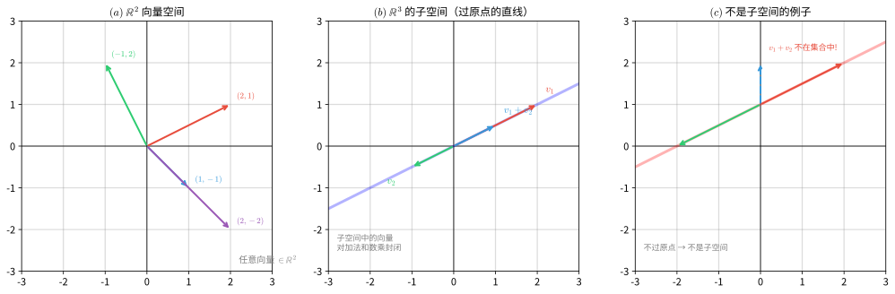
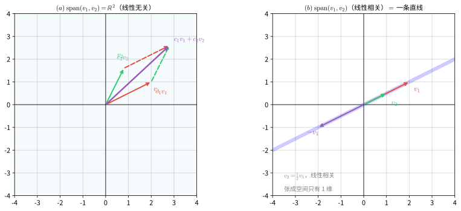
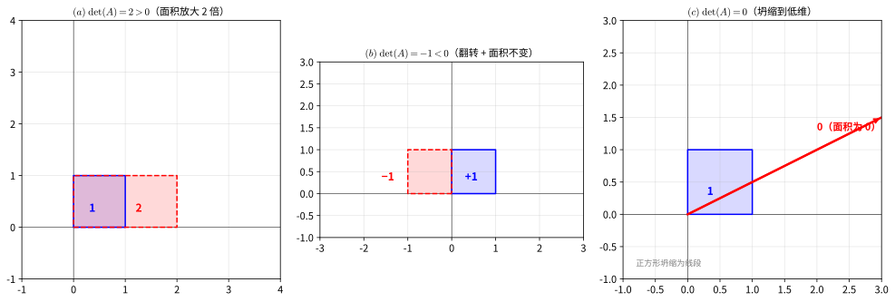
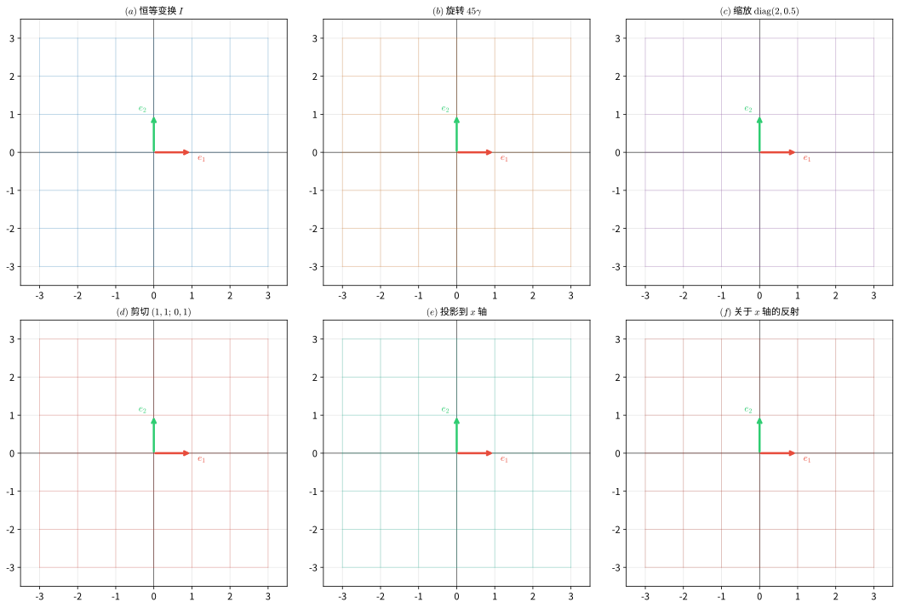
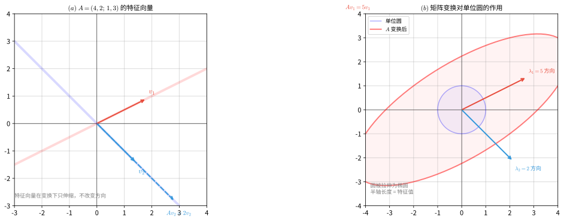
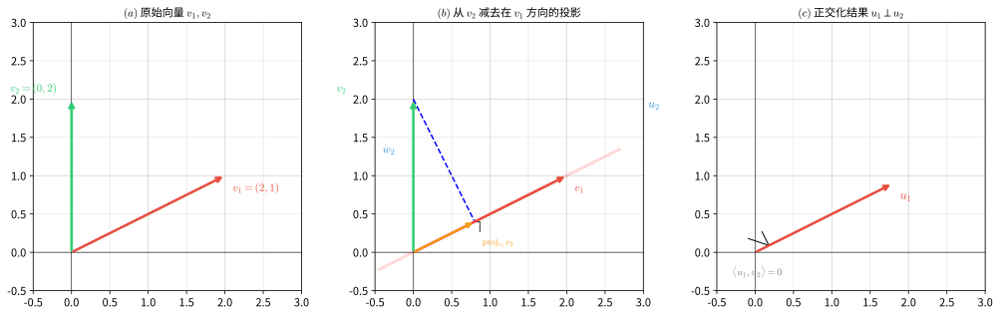
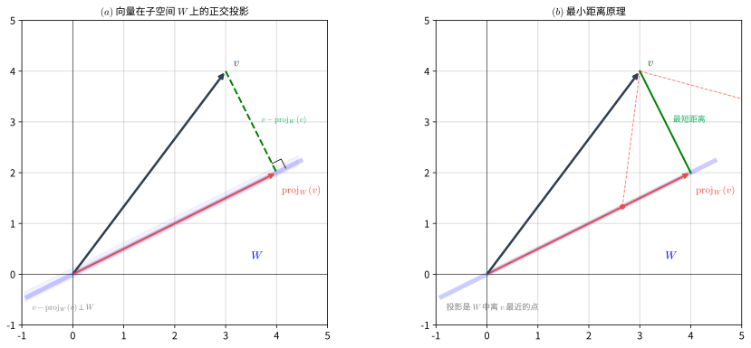
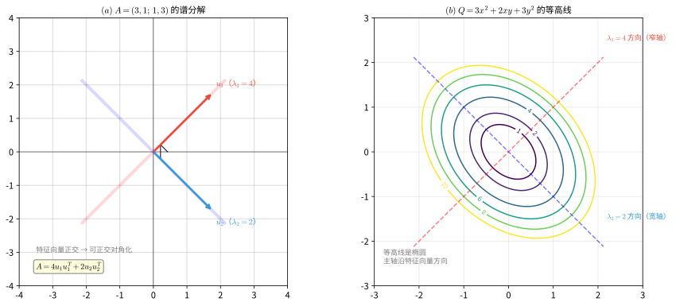
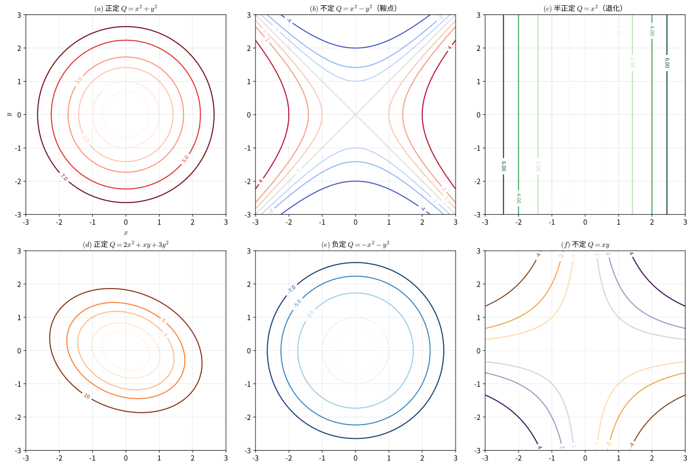

# 第 14 级：线性代数 (Linear Algebra)

## 零、导论：为什么学线性代数？

### 0.1 从你已经知道的说起

在开始之前，让我们先回顾你已经掌握的数学知识：

**中学代数**：你学过解方程 $2x + 3 = 7$，学过一元二次方程 $ax^2 + bx + c = 0$，学过函数 $y = f(x)$。这些都是**单个变量**的故事——一个未知数，一个方程，一个答案。

**微积分**：你学过导数和积分，知道如何描述"变化率"和"累积量"。微积分处理的是**连续变化**的世界——曲线、面积、速度。

**现在问题来了**：如果世界不止一个变量呢？

想象你在设计一款游戏，角色有生命值、攻击力、防御力、速度四个属性。这四个属性相互影响：攻击力影响伤害，防御力影响受伤，速度影响行动顺序……当你想同时描述这四个量的变化时，一元方程不够用了，微积分也变得复杂。

**这就是线性代数登场的时刻**——它专门研究**多个变量同时存在、相互关联**的情况。

### 0.2 线性代数的发展简史

线性代数不是一夜之间诞生的，它经历了数千年的演变：

**古代（公元前 300 年 - 1600 年）**
- 中国《九章算术》（约公元前 300 年）记载了用"方程术"解线性方程组的方法，本质上就是今天的高斯消元法
- 巴比伦人和阿拉伯数学家也研究过简单的线性问题

**近代早期（1600 - 1800 年）**
- 1637 年，笛卡尔发明坐标系，几何和代数开始融合
- 1693 年，莱布尼茨开始研究行列式
- 1750 年，克莱姆（Cramer）提出用行列式解线性方程组的法则

**黄金时代（1800 - 1900 年）**
- 1812 年，高斯（Gauss）系统化高斯消元法，用于天文计算
- 1844 年，格拉斯曼（Grassmann）提出向量空间的概念
- 1850 年，凯莱（Cayley）和西尔维斯特（Sylvester）建立矩阵理论
- 1855 年，哈密顿（Hamilton）提出四元数，推动线性代数发展

**现代（1900 年至今）**
- 1900 年代，希尔伯特（Hilbert）将线性代数应用于泛函分析
- 1920 年代，量子力学发现：微观世界的状态用向量描述，可观测量用矩阵表示
- 1940 年代，计算机诞生，线性代数成为数值计算的核心
- 1960 年代，计算机图形学兴起，矩阵变换成为 3D 渲染的基础
- 2000 年代，大数据时代来临，线性代数成为机器学习和数据科学的"语言"

**一句话总结**：线性代数从"解方程"起步，经过几百年的发展，成为描述**多维世界**和**线性关系**的通用语言。

### 0.3 线性代数在现实世界的应用

你可能觉得线性代数很抽象，但它其实无处不在：

**计算机图形学与游戏**
- 3D 游戏中的角色移动、旋转、缩放，都是矩阵变换
- 电影特效中的 CGI 动画，每一帧都是矩阵运算的结果
- 手机屏幕的触控响应，涉及坐标变换

**机器学习与人工智能**
- 神经网络的核心运算：$y = Wx + b$（矩阵乘法）
- 推荐系统（如抖音、淘宝推荐）用矩阵分解预测用户偏好
- 图像识别：一张 1000×1000 的图片就是一个 100 万元素的向量

**搜索引擎与社交网络**
- Google 的 PageRank 算法：用矩阵特征向量给网页排名
- 微博、微信的社交关系可以用矩阵表示
- 信息检索中的"词袋模型"：文档 = 词频向量

**物理与工程**
- 量子力学：粒子状态 = 向量，可观测量 = 矩阵
- 电路分析：基尔霍夫定律 = 线性方程组
- 结构工程：桥梁受力分析 = 线性系统

**经济学与金融**
- 投入产出模型：各部门之间的经济关系 = 矩阵
- 投资组合优化：风险与收益的平衡 = 二次型
- 期权定价：Black-Scholes 模型的数值解法

**数据科学**
- 主成分分析（PCA）：用特征值降维
- 最小二乘法：线性回归的数学基础
- 信号处理：傅里叶变换 = 基变换

### 0.4 从中学数学到线性代数的思维跃迁

| 中学数学 | 线性代数 | 思维变化 |
|---------|---------|---------|
| 解一个方程 $2x = 6$ | 解方程组 $Ax = b$ | 从"一个"到"多个" |
| 数 $a, b, c$ | 向量 $(a, b, c)$、矩阵 $A$ | 从"标量"到"高维对象" |
| 函数 $y = f(x)$ | 线性变换 $T(v) = Av$ | 从"输入-输出"到"空间变换" |
| 几何图形（点、线、面） | 向量空间、子空间 | 从"具体图形"到"抽象空间" |
| 公式计算 | 结构分析（秩、特征值） | 从"算出答案"到"理解结构" |

**关键思维转变**：
1. **从具体到抽象**：不再只关心"算出 $x = 3$"，而是关心"解的结构是什么"
2. **从计算到结构**：矩阵不只是数字表格，它是"空间的变换规则"
3. **从低维到高维**：从二维平面到 $n$ 维空间，直觉需要升级

### 0.5 如何学习线性代数

**给小白的建议**：

1. **先建立几何直觉**：每个概念都问自己"这在二维/三维空间中长什么样？"
2. **动手算例子**：用 2×2、3×3 的小矩阵验证定理
3. **联系现实应用**：学完每个概念，想想"这东西能用来干什么？"
4. **不要怕抽象**：抽象是为了"一次证明，处处适用"，理解本质比记住公式更重要

**本教程的组织方式**：
- 每个概念都有"💡 直观理解"——用大白话解释
- 每个概念都有"🔑 核心思想"——点明本质
- 配有 matplotlib 图形——让抽象概念可视化
- 丰富的例题和习题——通过实践巩固理解

---

## 〇、概念速览：用生活例子看穿线性代数

在啃正式定义之前，先用一整页给你"剧透"线性代数里每个概念的**本质**和**生活原型**。看不懂没关系——先让大脑有个"锚点"，学细节时才不会迷路。

### 0.6 向量：把"一堆数"打包成"一个东西"

**本质**：向量就是用一组数同时描述一个对象的多个属性。

**生活例子**：
- 你点的外卖订单：`(大杯珍珠奶茶×2, 鸡排×1, 薯条×3)` 就是一个三维向量
- 学生的成绩单：`(语文, 数学, 英语, 物理)` 每科分数组成一个向量
- 手机里的照片：一张 1000×1000 像素的图，就是一个 100 万个数字组成的向量

**为什么抽象**：把"多个数"打包成"一个向量"后，就可以像处理一个数一样处理一整组信息——加向量、缩放向量。

### 0.7 向量空间：一个"封闭的超市"

**本质**：向量空间就是"无论你怎么做加法、怎么缩放，结果都还留在里面"的集合。

**生活例子**：
- 想象一个超市只卖饮料：两瓶水加三瓶水还是水，半瓶水还是水——"水的集合"是一个封闭空间
- 但如果你在"只能放整数的集合"里做一半乘法 $3 \div 2 = 1.5$，结果跑出去了——整数集合**不是**（数乘意义下的）向量空间

**为什么重要**：只要确认某个集合是向量空间，就能套用一整套定理，不用从头验证。

### 0.8 子空间：超市里的"饮料专柜"

**本质**：子空间就是大空间里"自成一体、且包含原点"的小空间。

**生活例子**：
- 全校学生是一个空间，一班的同学可能是子空间（若一班所有学生组合起来还是这个班的人）
- 三维空间里过原点的平面是子空间，但"地球表面"不是——因为地球表面不含原点（地心），且把两个地面点相加可能"飘到空中"

### 0.9 线性组合 & 张成空间：用几种原料能调出什么

**本质**：线性组合是"把几个东西按一定比例混合"，张成空间是"用这些原料能调出的全部配方"。

**生活例子**：
- 你有红、蓝、黄三种颜料，按各种比例混合能调出所有颜色——这三种颜料"张成"整个色域
- 如果只有红色和粉色（粉 = 红 + 白），那只能调出红色系——张成的空间只有"一条线"

### 0.10 线性无关 & 基：辨认"真正的原料"

**本质**：线性无关 = 每个向量都提供了"别处没有的新信息"，基 = 一组"最精简的原料，一个不多一个不少"。

**生活例子**：
- 红、蓝、黄是三原色，谁都不能靠另外两个调出来——它们线性无关，且能作为"基"
- 如果老板进了一箱"红、蓝、黄、紫"的颜料，紫色=红+蓝，是多余的——整个集合线性相关，放弃紫色后剩下的三原色就是"基"

### 0.11 维数：需要几个数才能定位

**本质**：维数 = 空间里"自由变动的独立方向"有几个。

**生活例子**：
- 电梯里你只需要报"第几层"——一维
- 地图定位需要"经度+纬度"——二维
- 无人机定位需要"经度+纬度+高度"——三维
- 网购订单需要"商品+数量+用户+地址"——四维

### 0.12 矩阵：空间的"变形说明书"

**本质**：矩阵记录"空间里的每个方向被拉抻、旋转、压缩了多少"。它是一台"变形机"的操作手册。

**生活例子**：
- 手机旋转屏幕：一条竖着的线变成横着的线，就是矩阵在作用
- 照片放大缩小：每个像素的坐标被矩阵缩放
- 游戏里角色转身：整个身体的坐标被旋转矩阵作用

### 0.13 矩阵乘法：连续执行两个变形

**本质**：$AB$ 表示"先做 $B$ 的变形，再做 $A$ 的变形"。

**生活例子**：
- 先"把照片放大 2 倍"再"旋转 90°"，和先旋转再放大，结果**一样**（因为缩放和旋转"可交换"）——但"先剪切再旋转"和"先旋转再剪切"结果**不同**，这就是矩阵乘法不满足交换律的原因

### 0.14 秩：矩阵"压缩空间"的程度

**本质**：秩 = 变形后空间还剩几维。

**生活例子**：
- 把一张纸（二维）放在桌上投影到一条线，变成了一维——秩为 1
- 把纸投影到地面，还是二维——秩为 2
- 秩为 0 的矩阵（零矩阵）把一切都压成一个点

### 0.15 逆矩阵：变形的"撤销键"

**本质**：$A^{-1}$ 就是把 $A$ 做的变形"原样撤销"的那个操作。

**生活例子**：
- 把照片放大 2 倍，逆操作就是缩小到 1/2
- 把照片旋转 90°，逆操作就是转回来 -90°
- 如果变形把空间压扁了（比如投影、秩 < n），信息丢失，就无法撤销——对应矩阵不可逆

### 0.16 行列式：变形后"面积/体积"的变化倍数

**本质**：行列式告诉你，这个变形把"一块单位的面积/体积"放大或缩小了多少倍，以及是否翻转了方向。

**生活例子**：
- 放大 2 倍 → 面积变 4 倍，行列式 = 4
- 旋转一下 → 面积不变，行列式 = 1
- 把正方形压成一条线 → 面积变 0，行列式 = 0（不可逆！）
- 上下翻转 → 面积不变但方向反了，行列式 = -1

### 0.17 线性变换 & 秩-零化度：变形"压扁了多少、保留了多少"

**本质**：线性变换是"保持网格线平行且等距"的变形；秩-零化度定理说"被压扁的维度 + 保留的维度 = 原来的维度"。

**生活例子**：
- 把三维空间投影到桌面（二维）：被压扁的"高度方向"（1 维）+ 保留的桌面（2 维）= 3 维
- 就像把一盒水压成一个扁平的饼：厚度变没了（1 维），桌面上的面积还在（2 维）

### 0.18 特征值与特征向量：变形中的"定海神针"

**本质**：特征向量是"变形后方向不变、只伸缩"的特殊方向；特征值是"伸缩了几倍"。

**生活例子**：
- 用力拉一块橡皮泥：沿拉力方向的那条线只被拉长、不偏转——那是特征向量，拉长倍数就是特征值
- 地震时，房子有"固有振动方向"（特征向量）和"固有频率"（特征值），共振就是频率对上

### 0.19 内积：两个向量的"匹配度"

**本质**：内积衡量两个向量"方向有多一致"，同时能算出长度和夹角。

**生活例子**：
- 高考成绩与大学录取的匹配度：方向越一致，匹配度越高
- 物理做功：力量方向与位移方向越一致，做的功越多（$W = F \cdot s$ 就是内积）

### 0.20 正交 & 正交投影：互不干扰的方向、找最近点

**本质**：正交 = 两个方向完全垂直、互不影响；正交投影 = 在某个子空间里找"离目标最近的点"。

**生活例子**：
- 东西方向和南北方向正交：向东走不影响你在南北方向的位置
- 阳光把人影投到地面上：影子就是人在"地面"这个子空间上的正交投影，也是地面上离人最近的点
- 最小二乘法拟合直线，就是找"离所有数据点总和最近"的投影

### 0.21 对角化：换个坐标系让变形变简单

**本质**：对角化 = 找到一组"沿特征方向"的坐标轴，让复杂的变形变成"各方向独立缩放"。

**生活例子**：
- 斜着拉伸一块布很麻烦，但如果你把坐标轴转到拉伸方向上，就变成"只是横着拉、竖着拉"——简单多了
- 让杂乱的声音变成"各个标准音调的叠加"，每个音调的音量就是特征值

### 0.22 谱定理 & 二次型：对称矩阵的"体检报告"

**本质**：实对称矩阵可以被拆成"几个正交方向 × 各自强度"的叠加；二次型描述"以原点为中心的椭圆/双曲线"形状。

**生活例子**：
- 用少数几个"主方向"（特征向量）就能近似描述一团数据——这就是主成分分析PCA降维的原理
- 振动、能量、误差等"二次"量，用二次型判断是"稳定（正定）"还是"发散（不定）"

---

## 〇、概念速览：一张思维导图

```
线性代数 = 研究"多个数同时共存、相互关联"的数学
│
├─ 向量（打包一堆数）→ 向量空间（封闭的超市）→ 子空间（超市的专柜）
│                                             → 基（最精简原料）/ 维数（几个独立方向）
│
├─ 矩阵（变形说明书）→ 矩阵乘法（连贯变形）→ 秩（压扁几维）→ 逆矩阵（撤销变形）
│                                             → 行列式（面积变化倍数）
│
├─ 线性方程组 Ax=b（找满足条件的点）→ 高斯消元（逐个消元求解）
│                                             → Cramer法则（用面积比求解）
│
├─ 线性变换（空间变形）→ 核/像 → 秩-零化度（压扁的+保留的=原来的）
│
├─ 特征值/特征向量（变形的定海神针）→ 对角化（换坐标简化）
│                                             → Cayley-Hamilton（矩阵满足自己的方程）
│
└─ 内积（匹配度）→ 正交（互不干扰）→ Gram-Schmidt（逐步找垂直方向）
                → 正交投影（找最近点）→ 谱定理（对称矩阵分解）→ 二次型（椭圆/双曲线）
```

---

## 一、学习目标

完成本教程后，你应该能够：

1. 理解向量空间的定义、子空间、线性组合、张成空间、线性无关性、基和维数
2. 掌握矩阵的基本运算、秩、迹、逆矩阵、初等行变换及高斯消元法
3. 熟练求解线性方程组，理解齐次方程组解的结构
4. 理解行列式的定义、性质及计算方法（Laplace 展开、Cramer 法则）
5. 掌握线性变换的定义、核与像、秩-零化度定理及其证明
6. 理解特征值与特征向量的概念、特征多项式、对角化及 Cayley-Hamilton 定理
7. 掌握内积空间、正交性、Gram-Schmidt 正交化方法及正交投影
8. 理解谱定理（对称矩阵的谱分解）
9. 掌握二次型及其定性、Sylvester 惯性定理

---

## 二、向量空间

### 2.1 向量空间的定义

**定义**：设 $\mathbb{F}$ 是一个域（通常取 $\mathbb{R}$ 或 $\mathbb{C}$）。一个 $\mathbb{F}$ 上的**向量空间**（或线性空间）是一个集合 $V$，配备两种运算：**加法** $V \times V \to V$ 和**数乘** $\mathbb{F} \times V \to V$，满足以下公理：

**加法公理**（对任意 $u, v, w \in V$）：
1. **交换律**：$u + v = v + u$
2. **结合律**：$(u + v) + w = u + (v + w)$
3. **零向量**：存在 $\mathbf{0} \in V$，使得 $v + \mathbf{0} = v$
4. **负向量**：对每个 $v \in V$，存在 $-v \in V$，使得 $v + (-v) = \mathbf{0}$

**数乘公理**（对任意 $a, b \in \mathbb{F}$，$v, w \in V$）：
5. 分配律 1：$a(v + w) = av + aw$
6. 分配律 2：$(a + b)v = av + bv$
7. 结合律：$a(bv) = (ab)v$
8. 单位元：$1v = v$

**例**：
- $\mathbb{R}^n = \{(x_1, \dots, x_n) \mid x_i \in \mathbb{R}\}$ 是 $\mathbb{R}$ 上的向量空间
- 所有 $m \times n$ 实矩阵的集合 $M_{m \times n}(\mathbb{R})$ 是向量空间
- 区间 $[a,b]$ 上所有实值连续函数的集合 $C[a,b]$ 是向量空间
- 所有次数不超过 $n$ 的多项式集合 $\mathcal{P}_n(\mathbb{R})$ 是向量空间

> **💡 直观理解**：向量空间就像一个"封闭的游乐场"——只要你在里面做加法和数乘，永远不会"跑出去"。$\mathbb{R}^2$ 就是平面上所有箭头的集合，两个箭头相加还是箭头，箭头拉长缩短还是箭头。

> **🔑 核心思想**：向量空间的本质不在于"向量是什么"，而在于"向量能做什么运算"。无论是几何箭头、函数还是矩阵，只要满足8条公理，就能用同一套理论处理。这就是抽象的力量——**一次证明，处处适用**。



*图1：向量空间与子空间。(a) $\mathbb{R}^2$ 中的向量；(b) 子空间必须过原点，对加法和数乘封闭；(c) 不过原点的直线不是子空间，因为两个向量的和可能"跑出去"。*

### 2.2 子空间

**定义**：设 $V$ 是 $\mathbb{F}$ 上的向量空间，$W \subseteq V$ 的非空子集称为 $V$ 的**子空间**，如果 $W$ 在 $V$ 的加法和数乘下自身构成向量空间。

**子空间判定定理**：$W$ 是子空间 $\iff$ 对任意 $u, v \in W$ 和 $c \in \mathbb{F}$，有：
1. $u + v \in W$
2. $c u \in W$

等价地，$W$ 非空且对线性组合封闭：$u + cv \in W$ 对任意 $u, v \in W$，$c \in \mathbb{F}$。

**例**：
- $\{\mathbf{0}\}$ 和 $V$ 本身是 $V$ 的平凡子空间
- $W = \{(x, y, 0) \mid x, y \in \mathbb{R}\}$ 是 $\mathbb{R}^3$ 的子空间（$xy$-平面）
- $W = \{(x, y, z) \in \mathbb{R}^3 \mid x + y + z = 0\}$ 是 $\mathbb{R}^3$ 的子空间
- 所有 $n$ 阶对称矩阵的集合是 $M_{n \times n}(\mathbb{R})$ 的子空间

> **💡 直观理解**：子空间就是"大空间里自成一体的小空间"。想象 $\mathbb{R}^3$ 是三维世界，那么过原点的平面是子空间（二维），过原点的直线也是子空间（一维），原点本身是零维子空间。关键特征：**子空间必须过原点**——不过原点的平面不是子空间，因为两个向量的和可能"跑出"这个平面。

### 2.3 线性组合与张成空间

**定义**：设 $v_1, v_2, \dots, v_k \in V$，$c_1, c_2, \dots, c_k \in \mathbb{F}$。表达式
$$c_1 v_1 + c_2 v_2 + \cdots + c_k v_k$$
称为 $v_1, \dots, v_k$ 的一个**线性组合**。

**定义**：集合 $S = \{v_1, \dots, v_k\}$ 的**张成空间**（span）是所有线性组合的集合：
$$\operatorname{span}(S) = \left\{ \sum_{i=1}^k c_i v_i \;\middle|\; c_i \in \mathbb{F} \right\}$$

$\operatorname{span}(S)$ 是 $V$ 的一个子空间，称为由 $S$ **张成**的子空间。

> **💡 直观理解**：张成空间就像"用这些向量能到达的所有地方"。两个不共线的向量能张成整个平面（像用两个方向的力可以到达平面上的任何位置），而两个共线的向量只能张成一条直线（因为它们指向同一个方向）。

> **🔑 线性无关的本质**：线性无关意味着"每个向量都提供了新的信息"。如果 $v_2$ 可以被 $v_1$ 线性表示，那 $v_2$ 就是"冗余的"——它没有带来任何新方向。基就是"最精简的生成集"：去掉任何一个向量都无法张成整个空间。



*图2：线性组合与张成空间。(a) 两个线性无关的向量张成整个 $\mathbb{R}^2$，任意向量都可以表示为它们的线性组合（平行四边形法则）；(b) 两个线性相关的向量（共线）只能张成一条直线。*

### 2.4 线性无关性

**定义**：向量组 $\{v_1, \dots, v_k\}$ 称为**线性相关**的，如果存在不全为零的标量 $c_1, \dots, c_k \in \mathbb{F}$，使得
$$c_1 v_1 + c_2 v_2 + \cdots + c_k v_k = \mathbf{0}$$

如果上述等式仅当 $c_1 = c_2 = \cdots = c_k = 0$ 时成立，则称向量组是**线性无关**的。

**性质**：
- 单个向量 $v$ 线性无关 $\iff$ $v \neq \mathbf{0}$
- 两个向量线性相关 $\iff$ 其中一个可以被另一个数乘得到
- 若向量组包含 $\mathbf{0}$，则一定线性相关
- 若部分向量相关，则整体相关；若整体无关，则部分无关

> **💡 直观理解**：线性相关就是"有向量是多余的"。想象你在地图上导航：如果已经有了"向东走"和"向北走"的指令，那么"向东北走"就是多余的——它可以由前两个组合得到。线性无关意味着每个向量都提供了"新方向"，没有任何一个可以被其他向量组合出来。

### 2.5 基与维数

**定义**：向量空间 $V$ 的一组**基**是一个线性无关且张成 $V$ 的向量组 $B$。

**定义**：$V$ 的**维数** $\dim(V)$ 是基中向量的个数（如果 $V$ 有有限基）。若 $V = \{\mathbf{0}\}$，则 $\dim(V) = 0$。

**定理**：若 $V$ 是有限维向量空间，则 $V$ 的所有基都有相同数量的向量。

**定理**：设 $\dim(V) = n$，则：
- 任何 $n$ 个线性无关的向量构成一组基
- 任何 $n$ 个张成 $V$ 的向量构成一组基
- 任何线性无关组可以扩充为一组基
- 任何张成组可以缩减为一组基

**标准基**：
- $\mathbb{R}^n$ 的标准基：$e_1 = (1,0,\dots,0),\; e_2 = (0,1,\dots,0),\; \dots,\; e_n = (0,\dots,0,1)$
- $\mathcal{P}_n(\mathbb{R})$ 的标准基：$1, x, x^2, \dots, x^n$
- $M_{m \times n}(\mathbb{R})$ 的标准基：矩阵单位 $E_{ij}$（第 $i$ 行第 $j$ 列为 1，其余为 0）

> **💡 直观理解**：基是向量空间的"坐标轴"，维数是"自由度的个数"。$\mathbb{R}^3$ 的标准基 $e_1, e_2, e_3$ 就是我们熟悉的 $x, y, z$ 三个方向。维数为 3 意味着你需要 3 个数才能确定空间中的一个点。基的选择不是唯一的——你可以旋转、倾斜坐标轴，但只要向量个数相同（维数不变），它们就描述的是同一个空间。

### 2.6 向量组的秩与极大线性无关组

**定义**：设 $S = \{v_1, \dots, v_k\}$ 是一个向量组。$S$ 的一个**极大线性无关组**是从 $S$ 中选出的一个线性无关向量组，且再添加 $S$ 中任何其他向量都会使它线性相关（即已经"到极限"，无法再扩充）。

**定义**：向量组 $S$ 的任何极大线性无关组所含向量的个数，称为 $S$ 的**秩**，记作 $\operatorname{rank}(S)$。

**定理**：
- 一个向量组的任意两个极大线性无关组所含向量个数相等（都等于该组的秩）
- 向量组 $S$ 的秩 = $\operatorname{span}(S)$ 的维数 = 以 $S$ 为列（或行）构成的矩阵的秩
- 向量组与其任一极大线性无关组等价（可以互相线性表示）

> **💡 直观理解**：极大线性无关组就是"一支队伍里真正不可或缺的核心成员"。想象一个团队，有些人掌握的核心技能是别人没有的（线性无关），有些人只会重复别人的技能（冗余）。极大无关组就是"去掉任何一个都会战力下降"的那批核心成员，而秩就是"核心成员的人数"。
>
> **🔑 与矩阵秩的联系**：矩阵的秩 = 它的行向量组的秩 = 列向量组的秩。所以"矩阵的秩"和"向量组的秩"是同一个概念的两面——矩阵的秩告诉我们它的行（列）里有多少个"真正独立"的向量。

**例**：求向量组 $v_1 = (1, 2, 0)$，$v_2 = (0, 1, 1)$，$v_3 = (1, 3, 1)$ 的秩和极大线性无关组。

**解**：注意到 $v_3 = v_1 + v_2$，所以 $v_3$ 是冗余的。而 $v_1, v_2$ 线性无关（不成比例），故 $\{v_1, v_2\}$ 是一个极大线性无关组，$\operatorname{rank}(\{v_1, v_2, v_3\}) = 2$。

---

## 三、矩阵

### 3.1 矩阵的定义与基本运算

**定义**：一个 $m \times n$ 矩阵是 $m$ 行 $n$ 列排列的数的矩形阵列：
$$A = \begin{pmatrix}
a_{11} & a_{12} & \cdots & a_{1n} \\
a_{21} & a_{22} & \cdots & a_{2n} \\
\vdots & \vdots & \ddots & \vdots \\
a_{m1} & a_{m2} & \cdots & a_{mn}
\end{pmatrix}$$
记作 $A = (a_{ij})_{m \times n}$。

**矩阵运算**：
1. **加法**：$A + B = (a_{ij} + b_{ij})$（同型矩阵）
2. **数乘**：$cA = (c a_{ij})$
3. **乘法**：$A_{m \times n} B_{n \times p} = C_{m \times p}$，其中 $c_{ij} = \sum_{k=1}^n a_{ik} b_{kj}$
4. **转置**：$(A^T)_{ij} = a_{ji}$

**性质**：
- $(AB)C = A(BC)$
- $A(B + C) = AB + AC$
- $(A + B)^T = A^T + B^T$
- $(AB)^T = B^T A^T$

> **💡 直观理解**：矩阵不仅仅是数字表格，它是**线性变换的"操作手册"**。矩阵乘法 $AB$ 表示"先做变换 $B$，再做变换 $A$"。注意顺序很重要——先旋转再缩放 ≠ 先缩放再旋转（除非是特殊矩阵），这就是为什么矩阵乘法不满足交换律 $AB \neq BA$。

### 3.1b 分块矩阵

**定义**：用横线和竖线把一个矩阵分割成若干块，每块是一个**子矩阵**，这种方法叫**分块**。分块后的矩阵称为**分块矩阵**。

**例**：把 $4 \times 4$ 矩阵分成四块：
$$\begin{pmatrix} A & B \\ C & D \end{pmatrix}$$
其中 $A, B, C, D$ 是较小的子矩阵。

**分块矩阵的运算**（对分块得当的矩阵）：
- **加法**：对应块相加（要求分块方式一致）
- **数乘**：每块都乘以该数
- **乘法**：像普通矩阵乘法一样，但把"数"换成"块"：
  $$\begin{pmatrix} A & B \\ C & D \end{pmatrix} \begin{pmatrix} E & F \\ G & H \end{pmatrix} = \begin{pmatrix} AE + BG & AF + BH \\ CE + DG & CF + DH \end{pmatrix}$$
  （要求各子块的维数满足乘法条件）

> **💡 直观理解**：分块矩阵就像把一个大乐高拼图拆成几块小乐高来处理。它可以：
> - **简化计算**：把大矩阵的乘法变成小矩阵的乘法，尤其当矩阵有特殊结构（如对角块）时
> - **看清结构**：很多矩阵天然是分块的（如分块对角矩阵、增广矩阵 $[A \mid b]$）
>
> **🔑 重要应用**：
> - **分块对角矩阵**：$\begin{pmatrix} A & 0 \\ 0 & B \end{pmatrix}$ 的行列式 = $\det(A)\det(B)$，逆矩阵 = $\begin{pmatrix} A^{-1} & 0 \\ 0 & B^{-1} \end{pmatrix}$（若 $A, B$ 可逆）
> - **分块下三角/上三角**：$\det\begin{pmatrix} A & * \\ 0 & B \end{pmatrix} = \det(A)\det(B)$
> - **解大规模方程组**：把大系统拆成小块逐块求解，是数值计算的重要技巧

### 3.2 矩阵的秩

**定义**：矩阵 $A$ 的**列秩**是列向量张成空间的维数，**行秩**是行向量张成空间的维数。

**定理**：对任何矩阵，列秩等于行秩，称为矩阵的**秩**，记作 $\operatorname{rank}(A)$。

**性质**：
- $0 \leq \operatorname{rank}(A) \leq \min(m, n)$
- $\operatorname{rank}(A) = \operatorname{rank}(A^T)$
- $\operatorname{rank}(AB) \leq \min(\operatorname{rank}(A), \operatorname{rank}(B))$
- $\operatorname{rank}(A + B) \leq \operatorname{rank}(A) + \operatorname{rank}(B)$
- 初等行变换不改变矩阵的秩

> **💡 直观理解**：秩是矩阵最重要的"指纹"。它告诉你：
> - **信息量**：秩 = 矩阵中"真正独立"的行（或列）的数量。秩为 3 的 3×3 矩阵包含 3 个独立信息；秩为 1 的矩阵只包含 1 个独立信息（其他行都是它的倍数）。
> - **变换效果**：秩 = 变换后空间的维数。秩为 2 的 3×3 矩阵把三维空间压扁成二维平面；秩为 1 的矩阵把空间压扁成一条线；秩为 0 的矩阵（零矩阵）把整个空间压成一个点。
> - **可逆性**：方阵可逆 ⟺ 秩 = n ⟺ 列向量线性无关 ⟺ 变换是"一对一"的。

### 3.3 矩阵的迹

**定义**：$n$ 阶方阵 $A = (a_{ij})$ 的**迹**是对角线元素之和：
$$\operatorname{tr}(A) = \sum_{i=1}^n a_{ii}$$

**性质**：
- $\operatorname{tr}(A + B) = \operatorname{tr}(A) + \operatorname{tr}(B)$
- $\operatorname{tr}(cA) = c \operatorname{tr}(A)$
- $\operatorname{tr}(AB) = \operatorname{tr}(BA)$
- $\operatorname{tr}(A^T) = \operatorname{tr}(A)$

> **💡 直观理解**：迹有一个深刻的几何意义——它等于矩阵所有特征值的和。如果矩阵代表一个线性变换，迹告诉你这个变换在各个特征方向上的"总伸缩量"。迹为正说明总体是"扩张"的，迹为负说明总体是"压缩"的。迹为零则说明扩张和压缩相互抵消（如剪切变换）。

### 3.4 逆矩阵

**定义**：$n$ 阶方阵 $A$ 称为**可逆**的（或**非奇异**的），如果存在 $n$ 阶方阵 $B$ 使得
$$AB = BA = I_n$$
其中 $I_n$ 是 $n$ 阶单位矩阵。$B$ 称为 $A$ 的逆矩阵，记作 $A^{-1}$。

**性质**：
- 若 $A$ 可逆，则 $A^{-1}$ 唯一
- $(A^{-1})^{-1} = A$
- $(AB)^{-1} = B^{-1}A^{-1}$
- $(A^T)^{-1} = (A^{-1})^T$
- $A$ 可逆 $\iff$ $\det(A) \neq 0$ $\iff$ $\operatorname{rank}(A) = n$ $\iff$ $A$ 的列（行）向量线性无关

> **💡 直观理解**：逆矩阵是"撤销变换"的操作。如果 $A$ 把空间旋转了 45°，那么 $A^{-1}$ 就把它旋转 -45° 转回来。如果 $A$ 把空间拉伸了 2 倍，$A^{-1}$ 就把它压缩回原来的 1/2。不可逆矩阵（奇异矩阵）就像"压路机"——把三维空间压扁成二维平面，信息丢失了，无法"恢复"原状。这就是为什么 $\det(A) = 0$ 时矩阵不可逆。

### 3.5 初等行变换与高斯消元法

**三种初等行变换**：
1. **交换**：交换两行 $R_i \leftrightarrow R_j$
2. **倍乘**：将某行乘以非零常数 $R_i \to cR_i$（$c \neq 0$）
3. **倍加**：将某行的倍数加到另一行 $R_i \to R_i + cR_j$

**行阶梯形矩阵**满足：
1. 所有非零行在零行之上
2. 每个非零行的首非零元（称为**主元**）的列索引严格递增
3. 主元下方的元素全为零

**简化行阶梯形矩阵**（RREF）进一步满足：
4. 每个主元为 1
5. 每个主元所在的列中，其他元素全为零

**高斯消元法**：通过初等行变换将矩阵化为行阶梯形。
**Gauss-Jordan 消元法**：进一步化为简化行阶梯形。

### 3.5b 初等矩阵

**定义**：对单位矩阵 $I$ 做一次初等变换得到的矩阵，称为**初等矩阵**。对应三种初等（行/列）变换：

1. **交换矩阵** $E(R_i \leftrightarrow R_j)$：交换 $I$ 的第 $i, j$ 行
2. **倍乘矩阵** $E(R_i \to cR_i)$（$c \neq 0$）：将 $I$ 的第 $i$ 行乘以 $c$
3. **倍加矩阵** $E(R_i \to R_i + cR_j)$：将 $I$ 的第 $j$ 行乘以 $c$ 加到第 $i$ 行

**核心性质**：对矩阵 $A$ 做一次初等**行**变换，等价于在 $A$ 的**左边**乘一个对应的初等矩阵；做一次初等**列**变换，等价于在 $A$ 的**右边**乘一个对应的初等矩阵。

> **💡 直观理解**：初等矩阵是"基本动作的按钮"。任何复杂的行变换（高斯消元）都是这些基本按钮的连按——$E_k \cdots E_2 E_1 A$。把一个矩阵左乘一堆初等矩阵，等价于对它做了一连串行变换。
>
> **🔑 深刻结论**：
> - **可逆 ⟺ 初等矩阵之积**：方阵 $A$ 可逆 $\iff$ $A$ 可以写成若干个初等矩阵的乘积
> - **求逆的机制**：$A$ 可逆时，$A^{-1} = E_k \cdots E_2 E_1$，即对增广矩阵 $[A \mid I]$ 做行变换把 $A$ 化成 $I$ 时，$I$ 就变成了 $A^{-1}$——这正是 Gauss-Jordan 求逆法的原理
> - **矩阵等价标准形**：任何矩阵 $A$ 都可以通过初等变换化为标准形 $\begin{pmatrix} I_r & 0 \\ 0 & 0 \end{pmatrix}$，其中 $r = \operatorname{rank}(A)$

---

## 四、线性方程组

### 4.1 基本概念

一般线性方程组的形式：
$$\begin{cases}
a_{11}x_1 + a_{12}x_2 + \cdots + a_{1n}x_n = b_1 \\
a_{21}x_1 + a_{22}x_2 + \cdots + a_{2n}x_n = b_2 \\
\vdots \\
a_{m1}x_1 + a_{m2}x_2 + \cdots + a_{mn}x_n = b_m
\end{cases}$$

写成矩阵形式 $Ax = b$，其中 $A = (a_{ij})$ 是系数矩阵，$x = (x_1, \dots, x_n)^T$ 是未知向量，$b = (b_1, \dots, b_m)^T$ 是常数向量。

**增广矩阵**：$(A \mid b)$。

### 4.2 高斯消元法求解

**步骤**：
1. 写出增广矩阵 $(A \mid b)$
2. 通过初等行变换化为行阶梯形
3. 回代求解

**例**：
$$\begin{cases}
x + 2y + z = 8 \\
2x + y + z = 7 \\
x + y + 2z = 7
\end{cases}$$

增广矩阵：
$$\begin{pmatrix}
1 & 2 & 1 & 8 \\
2 & 1 & 1 & 7 \\
1 & 1 & 2 & 7
\end{pmatrix}$$

$R_2 \to R_2 - 2R_1$，$R_3 \to R_3 - R_1$：
$$\begin{pmatrix}
1 & 2 & 1 & 8 \\
0 & -3 & -1 & -9 \\
0 & -1 & 1 & -1
\end{pmatrix}$$

$R_3 \to 3R_3 - R_2$：
$$\begin{pmatrix}
1 & 2 & 1 & 8 \\
0 & -3 & -1 & -9 \\
0 & 0 & 4 & 6
\end{pmatrix}$$

回代：$4z = 6 \Rightarrow z = \frac{3}{2}$，$-3y - \frac{3}{2} = -9 \Rightarrow y = \frac{5}{2}$，$x + 5 + \frac{3}{2} = 8 \Rightarrow x = \frac{3}{2}$。

### 4.3 Gauss-Jordan 消元法

直接化为简化行阶梯形（RREF），无需回代。

继续上面的例子，从行阶梯形继续：
$$\begin{pmatrix}
1 & 2 & 1 & 8 \\
0 & -3 & -1 & -9 \\
0 & 0 & 4 & 6
\end{pmatrix}$$

$R_2 \to -\frac{1}{3}R_2$，$R_3 \to \frac{1}{4}R_3$：
$$\begin{pmatrix}
1 & 2 & 1 & 8 \\
0 & 1 & \frac{1}{3} & 3 \\
0 & 0 & 1 & \frac{3}{2}
\end{pmatrix}$$

$R_2 \to R_2 - \frac{1}{3}R_3$，$R_1 \to R_1 - R_3$：
$$\begin{pmatrix}
1 & 2 & 0 & \frac{13}{2} \\
0 & 1 & 0 & \frac{5}{2} \\
0 & 0 & 1 & \frac{3}{2}
\end{pmatrix}$$

$R_1 \to R_1 - 2R_2$：
$$\begin{pmatrix}
1 & 0 & 0 & \frac{3}{2} \\
0 & 1 & 0 & \frac{5}{2} \\
0 & 0 & 1 & \frac{3}{2}
\end{pmatrix}$$

直接读出解：$x = \frac{3}{2}$，$y = \frac{5}{2}$，$z = \frac{3}{2}$。

### 4.4 解的存在性与唯一性

**定理**（线性方程组解的存在性）：$Ax = b$ 有解 $\iff$ $\operatorname{rank}(A) = \operatorname{rank}(A \mid b)$。

**定理**（解的结构）：
- 若 $\operatorname{rank}(A) = \operatorname{rank}(A \mid b) = n$（未知数个数），则方程组有**唯一解**
- 若 $\operatorname{rank}(A) = \operatorname{rank}(A \mid b) < n$，则方程组有**无穷多解**，自由变量个数为 $n - \operatorname{rank}(A)$

### 4.5 齐次线性方程组

**定义**：$Ax = \mathbf{0}$ 称为齐次线性方程组。

**性质**：
- 齐次方程组总有解（零解 $x = \mathbf{0}$）
- 齐次方程组的解集是 $\mathbb{F}^n$ 的子空间（称为**解空间**或**零空间**）
- 解空间的维数 = $n - \operatorname{rank}(A)$
- 齐次方程组有非零解 $\iff$ $\operatorname{rank}(A) < n$（当 $m < n$ 时自动成立）

**非齐次方程组解的结构**：若 $x_p$ 是 $Ax = b$ 的一个特解，则通解为
$$x = x_p + x_h$$
其中 $x_h$ 是齐次方程组 $Ax = \mathbf{0}$ 的任意解。

> **💡 直观理解**：线性方程组 $Ax = b$ 的解取决于"信息"与"未知数"的关系。
>
> **🔑 几何视角**：
> - **唯一解**：三个平面交于一点（信息充足，未知数被完全确定）
> - **无穷多解**：三个平面交于一条线（信息不足，有一个"自由度"可以任意取值）
> - **无解**：三个平面没有公共交点（信息矛盾，如两个平行平面）
>
> **🔑 解的结构**：非齐次方程组的通解 = 特解 + 齐次通解。就像"定位 + 浮动"：特解是满足条件的一个具体位置，齐次通解是可以在这个位置上"自由浮动"的范围。比如 $x + y = 5$ 的一个特解是 $(5, 0)$，齐次通解是 $t(1, -1)$，所以通解是 $(5 + t, -t)$——沿着直线 $(1, -1)$ 方向自由滑动。

---

## 五、行列式

### 5.1 行列式的定义

**定义**（置换定义）：$n$ 阶方阵 $A = (a_{ij})$ 的行列式定义为
$$\det(A) = \sum_{\sigma \in S_n} \operatorname{sgn}(\sigma) \prod_{i=1}^n a_{i,\sigma(i)}$$
其中 $S_n$ 是所有 $n$ 元置换的集合，$\operatorname{sgn}(\sigma)$ 是置换 $\sigma$ 的符号（偶置换为 $+1$，奇置换为 $-1$）。

**低阶情形**：
- $n = 1$：$\det(a) = a$
- $n = 2$：$\det\begin{pmatrix} a & b \\ c & d \end{pmatrix} = ad - bc$
- $n = 3$（Sarrus 法则）：
  $$\det\begin{pmatrix} a_{11} & a_{12} & a_{13} \\ a_{21} & a_{22} & a_{23} \\ a_{31} & a_{32} & a_{33} \end{pmatrix} = a_{11}a_{22}a_{33} + a_{12}a_{23}a_{31} + a_{13}a_{21}a_{32} - a_{13}a_{22}a_{31} - a_{11}a_{23}a_{32} - a_{12}a_{21}a_{33}$$

> **💡 几何意义**：行列式的绝对值表示线性变换对"面积"（或"体积"）的缩放因子。
> - $|\det(A)| > 1$：面积放大
> - $|\det(A)| < 1$：面积缩小
> - $\det(A) = 0$：变换将空间坍缩到低维（如正方形压成线段），矩阵不可逆
> - $\det(A) < 0$：变换翻转了空间的"方向"（如左手系变右手系）



*图3：行列式的几何意义。(a) $\det(A)=2>0$：单位正方形面积放大2倍，方向不变；(b) $\det(A)=-1<0$：面积不变但方向翻转；(c) $\det(A)=0$：正方形坍缩为线段，面积变为零。*

### 5.2 行列式的性质

**基本性质**：
1. $\det(I_n) = 1$
2. 交换两行，行列式变号
3. 将某行乘以常数 $c$，行列式乘以 $c$
4. 将某行的倍数加到另一行，行列式不变
5. $\det(A^T) = \det(A)$
6. $\det(AB) = \det(A)\det(B)$
7. $A$ 可逆 $\iff$ $\det(A) \neq 0$，此时 $\det(A^{-1}) = \frac{1}{\det(A)}$
8. 若 $A$ 有相同的两行或一行全为零，则 $\det(A) = 0$

**性质 5 的证明**：由定义，$\det(A^T) = \sum_{\sigma \in S_n} \operatorname{sgn}(\sigma) \prod_{i=1}^n a_{\sigma(i),i}$。对每个置换 $\sigma$，令 $\tau = \sigma^{-1}$，则 $\operatorname{sgn}(\tau) = \operatorname{sgn}(\sigma)$，且 $\prod_{i=1}^n a_{\sigma(i),i} = \prod_{j=1}^n a_{j,\tau(j)}$。因此 $\det(A^T) = \sum_{\tau \in S_n} \operatorname{sgn}(\tau) \prod_{j=1}^n a_{j,\tau(j)} = \det(A)$。

**性质 6 的证明**：设 $C = AB$，则 $c_{ij} = \sum_{k=1}^n a_{ik}b_{kj}$。于是
$$\begin{aligned}
\det(AB) &= \sum_{\sigma \in S_n} \operatorname{sgn}(\sigma) \prod_{i=1}^n \left(\sum_{k_i=1}^n a_{i,k_i} b_{k_i,\sigma(i)}\right) \\
&= \sum_{k_1,\dots,k_n} \left(\prod_{i=1}^n a_{i,k_i}\right) \sum_{\sigma \in S_n} \operatorname{sgn}(\sigma) \prod_{i=1}^n b_{k_i,\sigma(i)}
\end{aligned}$$
当 $(k_1,\dots,k_n)$ 不是置换时，内层和为零（因为会出现重复行）。当 $(k_1,\dots,k_n) = \tau$ 是一个置换时，内层和等于 $\operatorname{sgn}(\tau) \det(B)$。因此
$$\det(AB) = \sum_{\tau \in S_n} \operatorname{sgn}(\tau) \left(\prod_{i=1}^n a_{i,\tau(i)}\right) \det(B) = \det(A)\det(B)$$

### 5.3 Laplace 展开

**定义**：$A$ 的 $(i,j)$**-余子式** $M_{ij}$ 是删除第 $i$ 行和第 $j$ 列后得到的 $(n-1)$ 阶子式的行列式。**代数余子式** $C_{ij} = (-1)^{i+j} M_{ij}$。

**Laplace 展开定理**：沿第 $i$ 行展开：
$$\det(A) = \sum_{j=1}^n a_{ij} C_{ij} = \sum_{j=1}^n (-1)^{i+j} a_{ij} M_{ij}$$

沿第 $j$ 列展开：
$$\det(A) = \sum_{i=1}^n a_{ij} C_{ij} = \sum_{i=1}^n (-1)^{i+j} a_{ij} M_{ij}$$

**证明概要**：由置换定义，将 $\det(A) = \sum_{\sigma} \operatorname{sgn}(\sigma) \prod_{i} a_{i,\sigma(i)}$ 按固定 $i$ 行中 $a_{ij}$ 的项分组。每个含 $a_{ij}$ 的项对应 $\sigma(i)=j$ 的置换，剩下的 $\prod_{k \neq i} a_{k,\sigma(k)}$ 构成 $M_{ij}$ 的置换和，符号由 $(-1)^{i+j}$ 校正。

### 5.4 Cramer 法则

**定理**（Cramer 法则）：若 $A$ 是 $n \times n$ 可逆矩阵，则线性方程组 $Ax = b$ 有唯一解，其分量为
$$x_i = \frac{\det(A_i)}{\det(A)}$$
其中 $A_i$ 是将 $A$ 的第 $i$ 列替换为 $b$ 得到的矩阵。

**证明**：设 $x = (x_1,\dots,x_n)^T$ 满足 $Ax = b$。记 $A$ 的列向量为 $a_1,\dots,a_n$，则 $b = \sum_{j=1}^n x_j a_j$。于是
$$\begin{aligned}
\det(A_i) &= \det(a_1,\dots,a_{i-1},b,a_{i+1},\dots,a_n) \\
&= \det\left(a_1,\dots,a_{i-1},\sum_{j=1}^n x_j a_j,a_{i+1},\dots,a_n\right) \\
&= \sum_{j=1}^n x_j \det(a_1,\dots,a_{i-1},a_j,a_{i+1},\dots,a_n)
\end{aligned}$$
当 $j = i$ 时，行列式为 $\det(A)$；当 $j \neq i$ 时，行列式有两列相同，值为 $0$。因此 $\det(A_i) = x_i \det(A)$，即 $x_i = \det(A_i)/\det(A)$。

> **💡 直观理解**：Cramer 法则用"面积/体积比"来求解线性方程组。想象 $Ax = b$ 中 $A$ 的列向量张成一个平行四边形（2D）或平行六面体（3D），$\det(A)$ 就是这个"基准体积"。
>
> **🔑 几何意义**：$x_i = \det(A_i)/\det(A)$ 的含义是：
> - $\det(A)$：原始"基准体积"
> - $\det(A_i)$：用 $b$ 替换第 $i$ 列后的"新体积"
> - 比值 $x_i$：第 $i$ 个未知数的"贡献比例"
>
> **🔑 为什么重要**：
> - **理论价值**：给出了解析解的显式公式，揭示了线性方程组解的结构
> - **局限性**：计算复杂度高（需要计算 $n+1$ 个行列式），实际计算中不如高斯消元法高效
> - **应用场景**：适用于低维（2×2、3×3）方程组，或需要解析表达式的理论推导

---

## 六、线性变换

### 6.1 定义与例子

**定义**：设 $V$ 和 $W$ 是 $\mathbb{F}$ 上的向量空间。映射 $T: V \to W$ 称为**线性变换**（或线性映射），如果对任意 $u, v \in V$ 和 $c \in \mathbb{F}$：
1. $T(u + v) = T(u) + T(v)$（加法保持性）
2. $T(cu) = cT(u)$（数乘保持性）

**例**：
- 零变换：$T(v) = \mathbf{0}$ 对任意 $v \in V$
- 恒等变换：$I(v) = v$ 对任意 $v \in V$
- 旋转：$T: \mathbb{R}^2 \to \mathbb{R}^2$，将向量绕原点旋转 $\theta$ 角
- 投影：$T: \mathbb{R}^3 \to \mathbb{R}^3$，$T(x,y,z) = (x,y,0)$
- 微分：$D: \mathcal{P}_n \to \mathcal{P}_{n-1}$，$D(p) = p'$
- 积分：$T: C[a,b] \to \mathbb{R}$，$T(f) = \int_a^b f(x) dx$

> **💡 直观理解**：线性变换就是"保持网格线平行且等距的空间变形"。你可以把矩阵想象成一台"空间变形机"：旋转、缩放、剪切、投影、反射——只要网格线变形后仍然平行且等距，就是线性变换。矩阵的列就是基向量 $e_1, e_2$ 变换后的去向——知道了基向量的新位置，就知道了整个变换。



*图4：常见线性变换的几何效果。矩阵作用在网格上，观察基向量 $e_1, e_2$（红、绿箭头）的变换即可完全确定变换：(a) 恒等变换；(b) 旋转 45°；(c) 不等比缩放；(d) 剪切；(e) 投影到 x 轴（降维！）；(f) 关于 x 轴的反射。*

### 6.2 核与像

**定义**：设 $T: V \to W$ 是线性变换。
- **核**（kernel，也称零空间）：$\ker(T) = \{v \in V \mid T(v) = \mathbf{0}\}$
- **像**（image，也称值域）：$\operatorname{im}(T) = \{T(v) \mid v \in V\}$

**定理**：$\ker(T)$ 是 $V$ 的子空间，$\operatorname{im}(T)$ 是 $W$ 的子空间。

**证明**：若 $u, v \in \ker(T)$，则 $T(u+v) = T(u) + T(v) = \mathbf{0} + \mathbf{0} = \mathbf{0}$，所以 $u+v \in \ker(T)$。若 $c \in \mathbb{F}$，$T(cu) = cT(u) = c\mathbf{0} = \mathbf{0}$，所以 $cu \in \ker(T)$。因此 $\ker(T)$ 是子空间。类似可证 $\operatorname{im}(T)$ 是子空间。

### 6.3 秩-零化度定理

**定理**（rank-nullity theorem）：设 $T: V \to W$ 是线性变换，$V$ 是有限维向量空间。则
$$\dim(\ker(T)) + \dim(\operatorname{im}(T)) = \dim(V)$$
记 $\operatorname{nullity}(T) = \dim(\ker(T))$（零化度），$\operatorname{rank}(T) = \dim(\operatorname{im}(T))$（秩），则
$$\operatorname{nullity}(T) + \operatorname{rank}(T) = \dim(V)$$

**证明**：设 $\dim(V) = n$，$\{v_1, \dots, v_k\}$ 是 $\ker(T)$ 的一组基。将其扩充为 $V$ 的一组基：
$$\{v_1, \dots, v_k, w_1, \dots, w_{n-k}\}$$
我们断言 $\{T(w_1), \dots, T(w_{n-k})\}$ 是 $\operatorname{im}(T)$ 的一组基。

首先证明张成性：对任意 $v \in V$，存在标量使得 $v = \sum_{i=1}^k a_i v_i + \sum_{j=1}^{n-k} b_j w_j$。则
$$T(v) = \sum_{i=1}^k a_i T(v_i) + \sum_{j=1}^{n-k} b_j T(w_j) = \sum_{j=1}^{n-k} b_j T(w_j)$$
因为 $T(v_i) = \mathbf{0}$。所以 $\{T(w_j)\}$ 张成 $\operatorname{im}(T)$。

再证明线性无关性：设 $\sum_{j=1}^{n-k} c_j T(w_j) = \mathbf{0}$，则 $T\left(\sum_{j=1}^{n-k} c_j w_j\right) = \mathbf{0}$，所以 $\sum c_j w_j \in \ker(T)$。于是存在标量 $d_i$ 使得 $\sum_{j=1}^{n-k} c_j w_j = \sum_{i=1}^k d_i v_i$，即 $\sum_{j=1}^{n-k} c_j w_j - \sum_{i=1}^k d_i v_i = \mathbf{0}$。由于 $\{v_i, w_j\}$ 线性无关，所有系数为零，特别地 $c_j = 0$。因此 $\{T(w_j)\}$ 线性无关。

这就证明了 $\dim(\operatorname{im}(T)) = n - k = \dim(V) - \dim(\ker(T))$。

> **💡 直观理解**：秩-零化度定理是一个"守恒定律"——变换"压缩"了多少维度到原点（零化度），就"保留"了多少维度到像空间（秩），两者之和恰好等于原始空间的维数。比如把三维空间投影到平面上，被压扁的那一维（零化度=1）加上投影后保留的二维（秩=2），正好是 3。


*图5：秩-零化度定理的示意图。(a) $T:\mathbb{R}^3 \to \mathbb{R}^2$，核是1维直线，像是整个 $\mathbb{R}^2$，$1+2=3$；(b) $T:\mathbb{R}^3 \to \mathbb{R}^3$，核是2维平面，像是1维直线，$2+1=3$。*

### 6.4 矩阵表示

给定 $V$ 的基 $B = \{v_1, \dots, v_n\}$ 和 $W$ 的基 $C = \{w_1, \dots, w_m\}$，线性变换 $T: V \to W$ 的矩阵表示 $[T]_C^B$ 是一个 $m \times n$ 矩阵，其第 $j$ 列是 $T(v_j)$ 在基 $C$ 下的坐标向量：
$$T(v_j) = \sum_{i=1}^m a_{ij} w_i$$
则 $[T]_C^B = (a_{ij})_{m \times n}$。

**坐标变换**：若 $x \in V$ 在基 $B$ 下的坐标为 $[x]_B$，则 $T(x)$ 在基 $C$ 下的坐标为
$$[T(x)]_C = [T]_C^B [x]_B$$

**复合与矩阵乘法**：若 $S: U \to V$，$T: V \to W$，则 $T \circ S: U \to W$ 的矩阵表示为
$$[T \circ S] = [T] [S]$$

### 6.5 过渡矩阵与坐标变换

**定义**：设 $V$ 是 $n$ 维向量空间，有两组基
$$B = \{v_1, \dots, v_n\}, \qquad B' = \{v'_1, \dots, v'_n\}$$
把 $B'$ 中每个向量用 $B$ 表示：
$$v'_j = \sum_{i=1}^n p_{ij} v_i$$
则矩阵 $P = (p_{ij})$ 称为由基 $B$ 到基 $B'$ 的**过渡矩阵**（或基变换矩阵）。$P$ 的列就是新基向量在旧基下的坐标，故 $P$ 可逆。

**坐标变换公式**：若向量 $x$ 在基 $B$ 下的坐标为 $[x]_B$，在基 $B'$ 下的坐标为 $[x]_{B'}$，则
$$[x]_B = P [x]_{B'} \qquad \text{即} \qquad [x]_{B'} = P^{-1} [x]_B$$

> **💡 直观理解**：过渡矩阵是"坐标换算表"。同一个向量（比如"1米"），在不同的尺子（基）下读数不同：用英制尺量是 39.37 英寸，用公制尺量是 100 厘米。过渡矩阵 $P$ 就是"英寸 ↔ 厘米"的换算系数表。矩阵 $P$ 的列是"新尺子每一格在旧尺子下有多长"。
>
> **🔑 与线性变换矩阵的关系**：若线性变换 $T: V \to V$ 在基 $B$ 下的矩阵是 $[T]_B$，在基 $B'$ 下的矩阵是 $[T]_{B'}$，则
> $$[T]_{B'} = P^{-1} \, [T]_B \, P$$
> 这正是下一章（7.2 节）将讲到的"相似矩阵"的来历——**同一个线性变换在不同基下的矩阵是相似的**。过渡矩阵 $P$ 就是那个相似变换矩阵。

---

## 七、特征值与特征向量

### 7.1 基本定义

**定义**：设 $A$ 是 $\mathbb{F}$ 上的 $n$ 阶方阵。若存在非零向量 $v \in \mathbb{F}^n$ 和标量 $\lambda \in \mathbb{F}$，使得
$$Av = \lambda v$$
则称 $\lambda$ 为 $A$ 的**特征值**，$v$ 为对应的**特征向量**。

**几何意义**：特征向量在 $A$ 的作用下只改变长度（伸缩 $\lambda$ 倍），不改变方向（或反向）。

> **💡 直观理解**：想象矩阵 $A$ 是一个"空间变形机"。大多数向量经过变换后都会改变方向，但有些"特殊方向"的向量只会被拉伸或压缩，不会偏转——这些就是特征向量，拉伸倍数就是特征值。
>
> **🔑 为什么重要**：特征值揭示了变换的"本质特征"——
> - 最大特征值决定了变换的"主要拉伸方向"（如 Google PageRank 的核心思想）
> - 特征值分解让我们可以用"简单变换"（沿特征方向的缩放）理解"复杂变换"
> - 单位圆在变换下变成椭圆，特征向量方向就是椭圆的轴，特征值就是半轴长度



*图6：特征值与特征向量。(a) 矩阵 $A$ 的特征向量在变换下只伸缩不转向：$Av_1 = 5v_1$（拉伸5倍），$Av_2 = 2v_2$（拉伸2倍）；(b) 单位圆在矩阵变换下变成椭圆，椭圆的半轴方向就是特征向量方向，半轴长度就是特征值。*

### 7.2 特征多项式

方程 $Av = \lambda v$ 等价于 $(A - \lambda I)v = \mathbf{0}$。$v \neq \mathbf{0}$ 要求 $A - \lambda I$ 不可逆，即
$$\det(A - \lambda I) = 0$$

**定义**：$p_A(\lambda) = \det(\lambda I - A)$ 称为 $A$ 的**特征多项式**（有时也用 $\det(A - \lambda I)$）。$p_A(\lambda) = 0$ 称为**特征方程**。

**性质**：
- $p_A(\lambda)$ 是 $\lambda$ 的 $n$ 次多项式，首项系数为 $1$
- $p_A(\lambda) = \lambda^n - (\operatorname{tr}(A))\lambda^{n-1} + \cdots + (-1)^n \det(A)$
- $A$ 的特征值之和等于 $\operatorname{tr}(A)$
- $A$ 的特征值之积等于 $\det(A)$

### 7.2b 相似矩阵

**定义**：设 $A, B$ 是 $n$ 阶方阵。若存在可逆矩阵 $P$ 使得
$$B = P^{-1} A P$$
则称 $B$ 与 $A$ **相似**，记作 $A \sim B$。$P$ 称为相似变换矩阵。

**性质**：相似矩阵有相同的：
- **特征多项式**，从而有相同的**特征值**（含重数）
- **行列式**：$\det(B) = \det(A)$
- **迹**：$\operatorname{tr}(B) = \operatorname{tr}(A)$
- **秩**：$\operatorname{rank}(B) = \operatorname{rank}(A)$

> **💡 直观理解**：相似矩阵 $B = P^{-1}AP$ 本质上是"同一个线性变换，在**不同坐标系**下的矩阵表示"。$P$ 的作用是"换坐标系"：先用 $P$ 把向量换到新坐标（$P$），在新坐标下做变换 $A$，再换回原坐标（$P^{-1}$）。所以相似矩阵是"同一变形、不同视角"。
>
> **🔑 为什么重要**：
> - **对角化正是相似的特例**：$A$ 可对角化 $\iff$ $A$ 相似于一个对角矩阵
> - **寻找"最简单的位姿"**：我们希望找到 $P$，让 $P^{-1}AP$ 尽量简单（如对角矩阵），从而看清变换的本质
> - **特征值不变性**：既然相似矩阵特征值相同，而特征值刻画变换的本质（伸缩倍数），所以"相似"捕捉了线性变换最核心的不变量

### 7.3 对角化

**定义**：$n$ 阶方阵 $A$ 称为**可对角化**的，如果存在可逆矩阵 $P$ 使得 $P^{-1}AP$ 是对角矩阵。

**定理**：$A$ 可对角化 $\iff$ $A$ 有 $n$ 个线性无关的特征向量 $\iff$ 对每个特征值，其代数重数等于几何重数。

**代数重数**：特征值 $\lambda$ 作为特征多项式根的重数。
**几何重数**：特征空间 $E_\lambda = \{v \mid Av = \lambda v\}$ 的维数，即 $\dim(\ker(A - \lambda I))$。

**对角化步骤**：
1. 求特征多项式 $\det(\lambda I - A)$，得特征值 $\lambda_1, \dots, \lambda_k$
2. 对每个特征值 $\lambda_i$，解 $(A - \lambda_i I)v = \mathbf{0}$，得特征空间的一组基
3. 若总共有 $n$ 个线性无关的特征向量，将它们排成矩阵 $P$ 的列
4. 则 $P^{-1}AP = \operatorname{diag}(\lambda_1, \dots, \lambda_n)$

> **💡 直观理解**：对角化就是"找到最合适的坐标系"，让复杂的变换变得简单。想象一个斜着拉伸的变换，在标准坐标系下看起来很复杂（矩阵有很多非零元素），但如果旋转到特征向量方向作为坐标轴，变换就变成了简单的"各方向独立缩放"（对角矩阵）。
>
> **🔑 为什么对角化重要**：
> - **简化计算**：对角矩阵的幂次、指数等运算极其简单。$A^n = P \Lambda^n P^{-1}$，而 $\Lambda^n$ 只是对角元素各自取 $n$ 次幂
> - **揭示本质**：特征值就是变换在各个"主方向"上的伸缩倍数，对角化让我们看清变换的"真面目"
> - **解微分方程**：线性微分方程组 $\dot{x} = Ax$ 的解 $x(t) = e^{At}x(0)$，对角化后 $e^{At} = P e^{\Lambda t} P^{-1}$，计算大幅简化
>
> **🔑 不可对角化的情形**：如果矩阵没有足够的特征向量（几何重数 < 代数重数），就不能对角化。这时需要用 Jordan 标准形——"几乎对角"的形式，对角线上方可能有 1。

### 7.4 Cayley-Hamilton 定理

**定理**（Cayley-Hamilton）：设 $A$ 是 $n$ 阶方阵，$p_A(\lambda) = \det(\lambda I - A)$ 是其特征多项式。则
$$p_A(A) = \mathbf{0}$$
即 $A$ 满足自己的特征多项式。

**证明**：设 $B(\lambda) = (\lambda I - A)$ 的伴随矩阵为 $\operatorname{adj}(\lambda I - A)$，则
$$(\lambda I - A) \operatorname{adj}(\lambda I - A) = \det(\lambda I - A) I = p_A(\lambda) I$$
伴随矩阵的每个元素是 $\lambda I - A$ 的 $(n-1)$ 阶余子式，因此是 $\lambda$ 的次数不超过 $n-1$ 的多项式。故可写成
$$\operatorname{adj}(\lambda I - A) = B_0 + B_1 \lambda + \cdots + B_{n-1} \lambda^{n-1}$$
其中 $B_i$ 为 $n$ 阶常数矩阵。于是
$$(\lambda I - A)(B_0 + B_1 \lambda + \cdots + B_{n-1} \lambda^{n-1}) = p_A(\lambda) I$$
设 $p_A(\lambda) = \lambda^n + c_{n-1} \lambda^{n-1} + \cdots + c_1 \lambda + c_0$。比较两边 $\lambda$ 的同次幂系数：
$$\begin{aligned}
\lambda^n &: B_{n-1} = I \\
\lambda^{n-1} &: B_{n-2} - A B_{n-1} = c_{n-1} I \\
\lambda^{n-2} &: B_{n-3} - A B_{n-2} = c_{n-2} I \\
&\vdots \\
\lambda^1 &: B_0 - A B_1 = c_1 I \\
\lambda^0 &: -A B_0 = c_0 I
\end{aligned}$$

将第 1 个等式右乘 $A^n$，第 2 个右乘 $A^{n-1}$，……，最后一个右乘 $A^0 = I$，然后相加：
$$(B_{n-1} A^n - A B_{n-1} A^{n-1}) + (B_{n-2} A^{n-1} - A B_{n-2} A^{n-2}) + \cdots + (B_0 A - A B_0) + (-A B_0) = p_A(A)$$
左边各项交错抵消，最终得到 $p_A(A) = \mathbf{0}$。

**推论**：$A^{-1}$ 可以表示为 $A$ 的多项式（次数不超过 $n-1$）。因为由 $p_A(A) = 0$ 可得
$$A^n + c_{n-1} A^{n-1} + \cdots + c_1 A + c_0 I = 0$$
若 $A$ 可逆，则 $c_0 = (-1)^n \det(A) \neq 0$，于是
$$A^{-1} = -\frac{1}{c_0} (A^{n-1} + c_{n-1} A^{n-2} + \cdots + c_1 I)$$

---

## 八、内积空间

### 8.1 内积的定义

**定义**：设 $V$ 是 $\mathbb{R}$ 上的向量空间。$V$ 上的**内积**是一个映射 $\langle \cdot, \cdot \rangle: V \times V \to \mathbb{R}$，满足：
1. **对称性**：$\langle u, v \rangle = \langle v, u \rangle$
2. **线性性**：$\langle au + bv, w \rangle = a\langle u, w \rangle + b\langle v, w \rangle$
3. **正定性**：$\langle v, v \rangle \geq 0$，且 $\langle v, v \rangle = 0 \iff v = \mathbf{0}$

配备了内积的向量空间称为**内积空间**（对 $\mathbb{C}$ 上的内积空间，对称性改为共轭对称 $\langle u, v \rangle = \overline{\langle v, u \rangle}$，线性性改为第一变元线性）。

**标准内积**（$\mathbb{R}^n$ 上的点积/点乘）：
$$\langle x, y \rangle = x \cdot y = \sum_{i=1}^n x_i y_i = x^T y$$

> **💡 直观理解**：内积是"两个向量的相似度度量"。想象两个人在多个维度上的评分（如智商、情商、体力、耐力），内积就是他们"综合匹配度"的量化。
>
> **🔑 几何意义**：在 $\mathbb{R}^2$ 中，$\langle u, v \rangle = \|u\| \|v\| \cos\theta$，其中 $\theta$ 是两向量的夹角。
> - 内积为正：夹角小于 90°，向量"方向相近"
> - 内积为零：夹角等于 90°，向量"完全无关"（正交）
> - 内积为负：夹角大于 90°，向量"方向相反"
>
> **🔑 应用实例**：
> - **推荐系统**：用户和商品的特征向量的内积 = 匹配度
> - **物理做功**：力 $F$ 和位移 $s$ 的内积 = 功 $W = F \cdot s$
> - **文本相似度**：词频向量的内积衡量文章主题的相似程度

### 8.2 范数与距离

**定义**：由内积诱导的**范数**为 $\|v\| = \sqrt{\langle v, v \rangle}$。

**性质**：
1. $\|v\| \geq 0$，且 $\|v\| = 0 \iff v = \mathbf{0}$
2. $\|cv\| = |c| \|v\|$
3. **Cauchy-Schwarz 不等式**：$|\langle u, v \rangle| \leq \|u\| \|v\|$，等号成立当且仅当 $u$ 与 $v$ 线性相关
4. **三角不等式**：$\|u + v\| \leq \|u\| + \|v\|$

**Cauchy-Schwarz 不等式的证明**：对任意 $t \in \mathbb{R}$，
$$0 \leq \langle u + tv, u + tv \rangle = \|u\|^2 + 2t\langle u, v \rangle + t^2 \|v\|^2$$
视为关于 $t$ 的二次函数，判别式非正：
$$(2\langle u, v \rangle)^2 - 4\|v\|^2 \|u\|^2 \leq 0$$
即 $\langle u, v \rangle^2 \leq \|u\|^2 \|v\|^2$，开方即得。

### 8.3 正交性

**定义**：向量 $u, v$ 称为**正交**的，记作 $u \perp v$，如果 $\langle u, v \rangle = 0$。

**定义**：向量组 $\{v_1, \dots, v_k\}$ 称为**正交组**，如果任意两个不同向量正交。如果每个向量还是单位向量（$\|v_i\| = 1$），则称为**标准正交组**。

**性质**：
- 正交组必线性无关
- **勾股定理**：若 $u \perp v$，则 $\|u + v\|^2 = \|u\|^2 + \|v\|^2$
- **正交分解**：对任意非零向量 $v$，$u$ 可分解为 $u = \frac{\langle u, v \rangle}{\|v\|^2} v + \left(u - \frac{\langle u, v \rangle}{\|v\|^2} v\right)$，其中第一部分平行于 $v$，第二部分垂直于 $v$

> **💡 直观理解**：正交就是"完全独立、互不影响"。想象你在地图上导航：向东走和向北走是正交的两个方向——向东走多远都不会改变你向北的位置。这就是正交的力量：**分解问题，互不干扰**。
>
> **🔑 为什么正交重要**：
> - **计算简化**：正交向量的内积为零，很多交叉项消失，计算大幅简化
> - **信息独立**：每个正交方向携带"独立信息"，没有冗余
> - **最佳基**：标准正交基是最"干净"的坐标系——各方向相互垂直，度量最直观
>
> **🔑 正交分解的威力**：任何向量都可以分解为"平行分量"和"垂直分量"。比如斜面上的物体，重力可以分解为"沿斜面的分力"（让物体下滑）和"垂直斜面的分力"（产生压力）。这种分解在物理、工程中无处不在。

### 8.4 Gram-Schmidt 正交化

**定理**（Gram-Schmidt 正交化过程）：给定线性无关向量组 $\{v_1, \dots, v_k\}$，可以构造一个标准正交组 $\{u_1, \dots, u_k\}$，使得对每个 $1 \leq j \leq k$，$\operatorname{span}\{v_1, \dots, v_j\} = \operatorname{span}\{u_1, \dots, u_j\}$。

**构造过程**：
1. 令 $w_1 = v_1$，$u_1 = \frac{w_1}{\|w_1\|}$
2. 对 $j = 2, \dots, k$：
   $$w_j = v_j - \sum_{i=1}^{j-1} \langle v_j, u_i \rangle u_i$$
   $$u_j = \frac{w_j}{\|w_j\|}$$

> **💡 直观理解**：Gram-Schmidt 正交化就像"逐步去除冗余"。每加入一个新向量，就把它在已构建的正交方向上的"分量"全部减掉，只留下真正"新的部分"。想象你在搭积木：先放第一块（$v_1$），再放第二块时把和第一块平行的部分去掉，只保留垂直的部分（$w_2$），以此类推。



*图7：Gram-Schmidt 正交化过程。(a) 原始向量 $v_1, v_2$；(b) 从 $v_2$ 中减去它在 $v_1$ 方向的投影，得到垂直分量 $w_2$；(c) 单位化后得到标准正交基 $u_1 \perp u_2$。*

**证明**（归纳法）：$j = 1$ 时显然成立。假设已构造出标准正交组 $\{u_1, \dots, u_{j-1}\}$ 张成与 $\{v_1, \dots, v_{j-1}\}$ 相同的空间。定义 $w_j = v_j - \sum_{i=1}^{j-1} \langle v_j, u_i \rangle u_i$。对 $i < j$，
$$\langle w_j, u_i \rangle = \langle v_j, u_i \rangle - \sum_{k=1}^{j-1} \langle v_j, u_k \rangle \langle u_k, u_i \rangle = \langle v_j, u_i \rangle - \langle v_j, u_i \rangle = 0$$
所以 $w_j$ 与所有 $u_1, \dots, u_{j-1}$ 正交。由于 $v_1, \dots, v_j$ 线性无关，$v_j$ 不在 $\operatorname{span}\{v_1, \dots, v_{j-1}\} = \operatorname{span}\{u_1, \dots, u_{j-1}\}$ 中，故 $w_j \neq \mathbf{0}$。令 $u_j = w_j / \|w_j\|$，则 $\{u_1, \dots, u_j\}$ 是标准正交组，且张成与 $\{v_1, \dots, v_j\}$ 相同的空间。

### 8.5 正交投影

**定义**：设 $W$ 是内积空间 $V$ 的子空间，$v \in V$。$v$ 在 $W$ 上的**正交投影**是唯一的向量 $w \in W$，使得 $v - w \perp W$（即 $v - w$ 与 $W$ 中所有向量正交）。

若 $\{u_1, \dots, u_k\}$ 是 $W$ 的一组标准正交基，则 $v$ 在 $W$ 上的正交投影为
$$\operatorname{proj}_W(v) = \sum_{i=1}^k \langle v, u_i \rangle u_i$$

**性质**：
- $\operatorname{proj}_W(v)$ 是 $W$ 中离 $v$ 最近的向量（最小距离原理）
- $v - \operatorname{proj}_W(v) \perp W$
- $\|v\|^2 = \|\operatorname{proj}_W(v)\|^2 + \|v - \operatorname{proj}_W(v)\|^2$（广义勾股定理）

> **💡 直观理解**：正交投影就是"找最近点"。想象你站在房间里（向量 $v$），地板是一个平面（子空间 $W$）。你垂直往下看，视线与地板的交点就是你在地板上的投影。这个点确实是地板上离你最近的位置——这就是最小距离原理。
>
> **🔑 应用**：正交投影是数据压缩、最小二乘法、信号处理的核心。比如用低维平面近似高维数据时，正交投影给出了"最佳近似"。



*图8：正交投影。(a) 向量 $v$ 在子空间 $W$ 上的投影：投影 $\operatorname{proj}_W(v)$ 是 $W$ 中离 $v$ 最近的点，误差 $v - \operatorname{proj}_W(v)$ 垂直于 $W$；(b) 最小距离原理：投影是 $W$ 中离 $v$ 最近的向量，其他点的距离都更大。*

---

## 九、谱定理

### 9.1 实对称矩阵

**定义**：$A \in M_{n \times n}(\mathbb{R})$ 称为**对称矩阵**，如果 $A^T = A$。

**性质**：
- 对称矩阵的特征值都是实数
- 对称矩阵的不同特征值对应的特征向量相互正交
- 对称矩阵可正交对角化：存在正交矩阵 $Q$（$Q^T Q = I$），使得 $Q^T A Q$ 为对角矩阵

### 9.2 谱定理

**定理**（有限维实谱定理）：设 $A$ 是 $n$ 阶实对称矩阵。则存在正交矩阵 $Q$ 和对角矩阵 $\Lambda = \operatorname{diag}(\lambda_1, \dots, \lambda_n)$，使得
$$A = Q \Lambda Q^T$$
其中 $\lambda_1, \dots, \lambda_n$ 是 $A$ 的特征值（按重数计），$Q$ 的列是相应的标准正交特征向量。

**等价表述**：实对称矩阵 $A$ 可以分解为
$$A = \sum_{i=1}^n \lambda_i u_i u_i^T$$
其中 $\{u_1, \dots, u_n\}$ 是 $\mathbb{R}^n$ 的一组标准正交特征向量基。

> **💡 直观理解**：谱定理告诉我们，实对称矩阵可以"完全拆解"成若干个简单的"秩-1矩阵"的叠加。每个 $u_i u_i^T$ 是沿特征向量方向的"投影"，乘以特征值 $\lambda_i$ 就是该方向上的"强度"。
>
> **🔑 为什么重要**：谱定理是线性代数中最优美的定理之一。它告诉我们对称矩阵的结构极其简单——只需要知道特征值和特征向量，就完全掌握了矩阵。这在物理学（量子力学）、统计学（主成分分析）、工程学（振动分析）中有广泛应用。



*图9：谱定理与对称矩阵。(a) 对称矩阵 $A$ 的特征向量相互正交，可分解为 $A = \lambda_1 u_1 u_1^T + \lambda_2 u_2 u_2^T$；(b) 二次型 $Q = x^T A x$ 的等高线是椭圆，主轴沿特征向量方向，半轴长度与 $1/\sqrt{\lambda_i}$ 成正比。*

**证明概要**：
1. 先证实对称矩阵的特征值均为实数。设 $Av = \lambda v$，$v \neq \mathbf{0}$。则
   $$\lambda \|v\|^2 = \lambda v^* v = v^* Av = (v^* Av)^* = v^* A^T v = v^* A v = \overline{\lambda} \|v\|^2$$
   所以 $\lambda = \overline{\lambda}$，即 $\lambda \in \mathbb{R}$。

2. 再证不同特征值的特征向量正交。设 $Av_1 = \lambda_1 v_1$，$Av_2 = \lambda_2 v_2$，$\lambda_1 \neq \lambda_2$。则
   $$\lambda_1 \langle v_1, v_2 \rangle = \langle Av_1, v_2 \rangle = \langle v_1, A^T v_2 \rangle = \langle v_1, Av_2 \rangle = \lambda_2 \langle v_1, v_2 \rangle$$
   所以 $(\lambda_1 - \lambda_2)\langle v_1, v_2 \rangle = 0$，故 $\langle v_1, v_2 \rangle = 0$。

3. 最后用归纳法证明可正交对角化。$n = 1$ 时显然。取一个特征值 $\lambda_1$ 和对应的单位特征向量 $u_1$。将 $u_1$ 扩充为 $\mathbb{R}^n$ 的一组标准正交基 $\{u_1, w_2, \dots, w_n\}$，令 $Q_1 = [u_1, w_2, \dots, w_n]$。则
   $$Q_1^T A Q_1 = \begin{pmatrix} \lambda_1 & 0 \\ 0 & A_1 \end{pmatrix}$$
   其中 $A_1$ 是 $(n-1) \times (n-1)$ 对称矩阵。由归纳假设，$A_1$ 可正交对角化，从而 $A$ 也可正交对角化。

---

## 十、二次型

### 10.1 二次型的定义

**定义**：$\mathbb{R}^n$ 上的**二次型**是一个函数 $Q: \mathbb{R}^n \to \mathbb{R}$，可以表示为
$$Q(x) = \sum_{i,j=1}^n a_{ij} x_i x_j = x^T A x$$
其中 $A$ 是 $n$ 阶实对称矩阵，称为二次型 $Q$ 的**矩阵表示**。

**例**：
- $Q(x,y) = 2x^2 + 4xy + 3y^2 = \begin{pmatrix} x & y \end{pmatrix} \begin{pmatrix} 2 & 2 \\ 2 & 3 \end{pmatrix} \begin{pmatrix} x \\ y \end{pmatrix}$
- $Q(x_1,x_2,x_3) = x_1^2 + 2x_2^2 + 3x_3^2 - 2x_1x_2 + 4x_1x_3$

### 10.2 二次型的定性

**定义**：二次型 $Q(x) = x^T A x$ 称为：
- **正定**：若对任意 $x \neq \mathbf{0}$，有 $Q(x) > 0$
- **半正定**：若对任意 $x$，有 $Q(x) \geq 0$
- **负定**：若对任意 $x \neq \mathbf{0}$，有 $Q(x) < 0$
- **半负定**：若对任意 $x$，有 $Q(x) \leq 0$
- **不定**：若 $Q(x)$ 既可取正值也可取负值

**判定定理**：
1. 对称矩阵 $A$ 正定 $\iff$ 所有特征值 $\lambda_i > 0$
2. 对称矩阵 $A$ 正定 $\iff$ 所有顺序主子式 $> 0$（Sylvester 准则）
3. 对称矩阵 $A$ 负定 $\iff$ 所有奇数阶顺序主子式 $< 0$，偶数阶 $> 0$

**顺序主子式**：左上角 $k \times k$ 子矩阵的行列式，记作 $\Delta_k$。

> **💡 直观理解**：二次型 $Q(x) = x^T A x$ 的图像是一个"曲面"。定性描述的就是这个曲面的形状：
> - **正定**：碗形（开口向上），原点是最低点
> - **负定**：倒碗形（开口向下），原点是最高点
> - **不定**：马鞍形（某些方向上凸，某些方向上凹）
> - **半正定**：扁平的碗（某个方向上没有弯曲）
>
> 从等高线看：正定的等高线是椭圆（封闭曲线），不定的等高线是双曲线（开口曲线）。



*图10：二次型的等高线。不同定性的二次型呈现不同的等高线图案：(a) 正定 $Q=x^2+y^2$ 是同心圆；(b) 不定 $Q=x^2-y^2$ 是双曲线（鞍点）；(c) 半正定 $Q=x^2$ 退化为平行线；(d)(e)(f) 更一般的二次型，通过特征值可判断定性。*

### 10.2b 用配方法化二次型为标准形

**问题**：二次型 $Q(x) = x^T A x$ 通常含交叉项（如 $xy$）。通过可逆线性替换 $x = Py$，可以把它化为**标准形**（只含平方项）：
$$Q = d_1 y_1^2 + d_2 y_2^2 + \cdots + d_n y_n^2$$
若再适当伸缩，可化为规范形（系数为 $1, -1, 0$）。

**配方法（Lagrange 配方法）步骤**：
1. 若 $Q$ 含某个平方项 $a_{11}x_1^2$（$a_{11} \neq 0$），把所有含 $x_1$ 的项集中起来配成完全平方，化为 $a_{11}(x_1 + \cdots)^2$ + 不含 $x_1$ 的剩余部分，然后对剩余部分继续配方
2. 若 $Q$ 不含任何平方项但含交叉项（如 $a_{12}x_1x_2 \neq 0$），先做替换 $x_1 = y_1 + y_2$，$x_2 = y_1 - y_2$，则 $x_1x_2 = y_1^2 - y_2^2$ 出现平方项，再回到步骤 1

**例**：化 $Q = 2x_1^2 + 4x_1x_2 - 3x_2^2$ 为标准形。

**解**：把含 $x_1$ 的项配方：
$$Q = 2\left(x_1^2 + 2x_1x_2\right) - 3x_2^2 = 2\left[(x_1 + x_2)^2 - x_2^2\right] - 3x_2^2 = 2(x_1 + x_2)^2 - 5x_2^2$$
令 $y_1 = x_1 + x_2$，$y_2 = x_2$（即 $x_1 = y_1 - y_2$，$x_2 = y_2$），则
$$Q = 2y_1^2 - 5y_2^2$$
这是标准形（正、负各一项，故对应一个不定二次型）。

> **💡 直观理解**：配方法就像"给二次型做配方"，跟中学解二次方程配完全平方是一回事，只是现在要对着多个变量逐个"配"。每次配一个变量，就把一个交叉项"消灭"掉，最后只剩下一堆独立的平方项。
>
> **🔑 与正交变换法的区别**：化二次型为标准形有两条路：
> - **配方法**：用任意可逆代换，计算简单，适合手工。
> - **正交变换法**：用正交矩阵 $Q$（$Q^T Q = I$）做代换，能保留"长度/角度"，得到的标准形系数就是特征值，几何意义最漂亮（椭圆的轴）。
>
> 两种方法得到的标准形可能不同，但**正项数、负项数一定相同**（这正是下面的 Sylvester 惯性定理）。

### 10.3 Sylvester 惯性定理

**定理**（Sylvester 惯性定理）：设 $A$ 是 $n$ 阶实对称矩阵。则存在可逆矩阵 $P$ 使得
$$P^T A P = \begin{pmatrix}
I_p & 0 & 0 \\
0 & -I_q & 0 \\
0 & 0 & 0
\end{pmatrix}$$
其中 $p$ 是 $A$ 的正特征值个数（按重数计），$q$ 是负特征值个数，$r = p+q = \operatorname{rank}(A)$。$(p, q, n - p - q)$ 称为 $A$ 的**惯性指数**，且在同余变换下保持不变。

**推论**：二次型 $Q(x) = x^T A x$ 经过可逆变数替换 $x = Py$ 后，标准形中正平方项、负平方项和零平方项的个数是唯一确定的。

---

## 十一、示例

### 示例 1：向量空间的子空间判定

判断 $W = \{(x, y, z) \in \mathbb{R}^3 \mid x - 2y + 3z = 0\}$ 是否为 $\mathbb{R}^3$ 的子空间。

**解**：取 $u = (x_1, y_1, z_1), v = (x_2, y_2, z_2) \in W$，$c \in \mathbb{R}$。
- $u + v = (x_1 + x_2, y_1 + y_2, z_1 + z_2)$，且 $(x_1 + x_2) - 2(y_1 + y_2) + 3(z_1 + z_2) = (x_1 - 2y_1 + 3z_1) + (x_2 - 2y_2 + 3z_2) = 0$，所以 $u + v \in W$
- $cu = (cx_1, cy_1, cz_1)$，且 $cx_1 - 2cy_1 + 3cz_1 = c(x_1 - 2y_1 + 3z_1) = 0$，所以 $cu \in W$
因此 $W$ 是子空间。$\dim(W) = 2$（一个线性方程约束，自由度为 2）。

### 示例 2：线性无关性判定

判断向量组 $v_1 = (1, 2, 0)$，$v_2 = (3, 1, 1)$，$v_3 = (0, 1, 1)$ 在 $\mathbb{R}^3$ 中是否线性无关。

**解**：设 $c_1 v_1 + c_2 v_2 + c_3 v_3 = \mathbf{0}$：
$$\begin{cases}
c_1 + 3c_2 = 0 \\
2c_1 + c_2 + c_3 = 0 \\
c_2 + c_3 = 0
\end{cases}$$

由第 1 式得 $c_1 = -3c_2$，代入第 3 式得 $c_3 = -c_2$，代入第 2 式：$-6c_2 + c_2 - c_2 = -6c_2 = 0$，所以 $c_2 = 0$，进而 $c_1 = 0$，$c_3 = 0$。因此向量组线性无关，构成 $\mathbb{R}^3$ 的一组基。

### 示例 3：基与维数

求 $\mathbb{R}^3$ 中平面 $x + y + z = 0$ 的一组基和维数。

**解**：平面方程给出 $z = -x - y$，所以平面中的向量可表示为
$$(x, y, -x - y) = x(1, 0, -1) + y(0, 1, -1)$$
因此 $\{(1, 0, -1), (0, 1, -1)\}$ 张成该平面。这两个向量显然线性无关，故构成一组基，维数为 2。

### 示例 4：矩阵乘法与秩

设 $A = \begin{pmatrix} 1 & 2 & 3 \\ 2 & 4 & 6 \\ 1 & 1 & 1 \end{pmatrix}$，求 $\operatorname{rank}(A)$。

**解**：进行初等行变换：
$$\begin{pmatrix} 1 & 2 & 3 \\ 2 & 4 & 6 \\ 1 & 1 & 1 \end{pmatrix} \xrightarrow{R_2 \to R_2 - 2R_1} \begin{pmatrix} 1 & 2 & 3 \\ 0 & 0 & 0 \\ 1 & 1 & 1 \end{pmatrix} \xrightarrow{R_3 \to R_3 - R_1} \begin{pmatrix} 1 & 2 & 3 \\ 0 & 0 & 0 \\ 0 & -1 & -2 \end{pmatrix}$$
交换行：$\begin{pmatrix} 1 & 2 & 3 \\ 0 & -1 & -2 \\ 0 & 0 & 0 \end{pmatrix}$，有两个非零行，所以 $\operatorname{rank}(A) = 2$。

### 示例 5：求逆矩阵

求 $A = \begin{pmatrix} 1 & 2 & 3 \\ 0 & 1 & 4 \\ 0 & 0 & 1 \end{pmatrix}$ 的逆矩阵。

**解**：用 Gauss-Jordan 消元法：
$$\begin{pmatrix} 1 & 2 & 3 & 1 & 0 & 0 \\ 0 & 1 & 4 & 0 & 1 & 0 \\ 0 & 0 & 1 & 0 & 0 & 1 \end{pmatrix}$$

$R_2 \to R_2 - 4R_3$：
$$\begin{pmatrix} 1 & 2 & 3 & 1 & 0 & 0 \\ 0 & 1 & 0 & 0 & 1 & -4 \\ 0 & 0 & 1 & 0 & 0 & 1 \end{pmatrix}$$

$R_1 \to R_1 - 3R_3$，$R_1 \to R_1 - 2R_2$：
$$\begin{pmatrix} 1 & 0 & 0 & 1 & -2 & 5 \\ 0 & 1 & 0 & 0 & 1 & -4 \\ 0 & 0 & 1 & 0 & 0 & 1 \end{pmatrix}$$

所以 $A^{-1} = \begin{pmatrix} 1 & -2 & 5 \\ 0 & 1 & -4 \\ 0 & 0 & 1 \end{pmatrix}$。

验证：$AA^{-1} = \begin{pmatrix} 1 & 2 & 3 \\ 0 & 1 & 4 \\ 0 & 0 & 1 \end{pmatrix} \begin{pmatrix} 1 & -2 & 5 \\ 0 & 1 & -4 \\ 0 & 0 & 1 \end{pmatrix} = \begin{pmatrix} 1 & 0 & 0 \\ 0 & 1 & 0 \\ 0 & 0 & 1 \end{pmatrix}$。

### 示例 6：Cramer 法则

用 Cramer 法则解方程组：
$$\begin{cases}
x + 2y + z = 5 \\
2x + y - z = 3 \\
x - y + z = 0
\end{cases}$$

**解**：$A = \begin{pmatrix} 1 & 2 & 1 \\ 2 & 1 & -1 \\ 1 & -1 & 1 \end{pmatrix}$，$b = \begin{pmatrix} 5 \\ 3 \\ 0 \end{pmatrix}$。

$\det(A) = 1(1 \cdot 1 - (-1)(-1)) - 2(2 \cdot 1 - (-1) \cdot 1) + 1(2 \cdot (-1) - 1 \cdot 1)$
$= 1(1 - 1) - 2(2 + 1) + 1(-2 - 1) = 0 - 6 - 3 = -9$

$\det(A_1) = \det\begin{pmatrix} 5 & 2 & 1 \\ 3 & 1 & -1 \\ 0 & -1 & 1 \end{pmatrix} = 5(1 - 1) - 2(3 + 0) + 1(-3 - 0) = 0 - 6 - 3 = -9$

$\det(A_2) = \det\begin{pmatrix} 1 & 5 & 1 \\ 2 & 3 & -1 \\ 1 & 0 & 1 \end{pmatrix} = 1(3 - 0) - 5(2 + 1) + 1(0 - 3) = 3 - 15 - 3 = -15$

$\det(A_3) = \det\begin{pmatrix} 1 & 2 & 5 \\ 2 & 1 & 3 \\ 1 & -1 & 0 \end{pmatrix} = 1(0 + 3) - 2(0 - 3) + 5(-2 - 1) = 3 + 6 - 15 = -6$

因此 $x = \frac{-9}{-9} = 1$，$y = \frac{-15}{-9} = \frac{5}{3}$，$z = \frac{-6}{-9} = \frac{2}{3}$。

### 示例 7：线性变换的核与像

设 $T: \mathbb{R}^3 \to \mathbb{R}^2$ 定义为 $T(x,y,z) = (x + y, y - z)$。求 $\ker(T)$ 和 $\operatorname{im}(T)$ 的基与维数。

**解**：$T(x,y,z) = (0,0) \iff x + y = 0$ 且 $y - z = 0$，即 $x = -y$，$z = y$。所以
$$\ker(T) = \{(-y, y, y) \mid y \in \mathbb{R}\} = \operatorname{span}\{(-1, 1, 1)\}$$
$\dim(\ker(T)) = 1$。

$\operatorname{im}(T) = \{(x+y, y-z) \mid x,y,z \in \mathbb{R}\}$。令 $u = x + y$，$v = y - z$，则 $\operatorname{im}(T) = \mathbb{R}^2$（因为对任意 $(u,v)$，可取 $x = u$，$y = 0$，$z = -v$），所以 $\dim(\operatorname{im}(T)) = 2$。

验证秩-零化度定理：$\dim(\ker(T)) + \dim(\operatorname{im}(T)) = 1 + 2 = 3 = \dim(\mathbb{R}^3)$。

### 示例 8：特征值与特征向量

求 $A = \begin{pmatrix} 4 & 2 \\ 1 & 3 \end{pmatrix}$ 的特征值和特征向量。

**解**：特征多项式：
$$\det(\lambda I - A) = \det\begin{pmatrix} \lambda - 4 & -2 \\ -1 & \lambda - 3 \end{pmatrix} = (\lambda - 4)(\lambda - 3) - 2 = \lambda^2 - 7\lambda + 10 = (\lambda - 2)(\lambda - 5)$$
特征值：$\lambda_1 = 2$，$\lambda_2 = 5$。

对 $\lambda_1 = 2$：解 $(A - 2I)v = \mathbf{0}$：
$$\begin{pmatrix} 2 & 2 \\ 1 & 1 \end{pmatrix} \begin{pmatrix} x \\ y \end{pmatrix} = \begin{pmatrix} 0 \\ 0 \end{pmatrix} \Rightarrow 2x + 2y = 0 \Rightarrow y = -x$$
特征向量：$v_1 = t(1, -1)^T$，$t \neq 0$。

对 $\lambda_2 = 5$：解 $(A - 5I)v = \mathbf{0}$：
$$\begin{pmatrix} -1 & 2 \\ 1 & -2 \end{pmatrix} \begin{pmatrix} x \\ y \end{pmatrix} = \begin{pmatrix} 0 \\ 0 \end{pmatrix} \Rightarrow -x + 2y = 0 \Rightarrow x = 2y$$
特征向量：$v_2 = t(2, 1)^T$，$t \neq 0$。

$A$ 可对角化，取 $P = \begin{pmatrix} 1 & 2 \\ -1 & 1 \end{pmatrix}$，则 $P^{-1}AP = \begin{pmatrix} 2 & 0 \\ 0 & 5 \end{pmatrix}$。

### 示例 9：矩阵对角化

判断 $A = \begin{pmatrix} 2 & 1 & 0 \\ 0 & 2 & 0 \\ 0 & 0 & 3 \end{pmatrix}$ 是否可对角化。

**解**：特征多项式：
$$\det(\lambda I - A) = \det\begin{pmatrix} \lambda - 2 & -1 & 0 \\ 0 & \lambda - 2 & 0 \\ 0 & 0 & \lambda - 3 \end{pmatrix} = (\lambda - 2)^2(\lambda - 3)$$
特征值：$\lambda_1 = 2$（代数重数 2），$\lambda_2 = 3$（代数重数 1）。

对 $\lambda_1 = 2$：解 $(A - 2I)v = \mathbf{0}$：
$$\begin{pmatrix} 0 & 1 & 0 \\ 0 & 0 & 0 \\ 0 & 0 & 1 \end{pmatrix} \begin{pmatrix} x \\ y \\ z \end{pmatrix} = \begin{pmatrix} 0 \\ 0 \\ 0 \end{pmatrix} \Rightarrow y = 0, z = 0$$
特征空间 $E_2 = \{(x, 0, 0) \mid x \in \mathbb{R}\}$，$\dim(E_2) = 1$。

几何重数 $1 <$ 代数重数 $2$，所以 $A$ 不可对角化。

### 示例 10：Gram-Schmidt 正交化

将向量组 $v_1 = (1, 1, 0)$，$v_2 = (1, 0, 1)$，$v_3 = (0, 1, 1)$ 标准正交化。

**解**：
1. $w_1 = v_1 = (1, 1, 0)$，$\|w_1\| = \sqrt{2}$，$u_1 = \frac{1}{\sqrt{2}}(1, 1, 0)$

2. $\langle v_2, u_1 \rangle = \frac{1}{\sqrt{2}}(1 + 0 + 0) = \frac{1}{\sqrt{2}}$
   $$w_2 = v_2 - \langle v_2, u_1 \rangle u_1 = (1, 0, 1) - \frac{1}{2}(1, 1, 0) = \left(\frac{1}{2}, -\frac{1}{2}, 1\right)$$
   $\|w_2\| = \sqrt{\frac{1}{4} + \frac{1}{4} + 1} = \sqrt{\frac{3}{2}} = \frac{\sqrt{6}}{2}$
   $$u_2 = \frac{w_2}{\|w_2\|} = \frac{2}{\sqrt{6}}\left(\frac{1}{2}, -\frac{1}{2}, 1\right) = \left(\frac{1}{\sqrt{6}}, -\frac{1}{\sqrt{6}}, \frac{2}{\sqrt{6}}\right)$$

3. $\langle v_3, u_1 \rangle = \frac{1}{\sqrt{2}}(0 + 1 + 0) = \frac{1}{\sqrt{2}}$，$\langle v_3, u_2 \rangle = 0 - \frac{1}{\sqrt{6}} + \frac{2}{\sqrt{6}} = \frac{1}{\sqrt{6}}$
   $$w_3 = v_3 - \langle v_3, u_1 \rangle u_1 - \langle v_3, u_2 \rangle u_2$$
   $$= (0, 1, 1) - \frac{1}{2}(1, 1, 0) - \frac{1}{6}(1, -1, 2)$$
   $$= \left(0 - \frac{1}{2} - \frac{1}{6},\; 1 - \frac{1}{2} + \frac{1}{6},\; 1 - 0 - \frac{1}{3}\right) = \left(-\frac{2}{3}, \frac{2}{3}, \frac{2}{3}\right)$$
   $\|w_3\| = \sqrt{\frac{4}{9} + \frac{4}{9} + \frac{4}{9}} = \frac{2}{\sqrt{3}}$
   $$u_3 = \frac{w_3}{\|w_3\|} = \left(-\frac{1}{\sqrt{3}}, \frac{1}{\sqrt{3}}, \frac{1}{\sqrt{3}}\right)$$

得到标准正交基：$\{u_1, u_2, u_3\}$。

### 示例 11：正交投影

求向量 $v = (2, 1, 3)$ 在子空间 $W = \operatorname{span}\{(1, 0, 1), (0, 1, 1)\}$ 上的正交投影。

**解**：先对 $W$ 的基进行正交化。$w_1 = (1, 0, 1)$，$\|w_1\| = \sqrt{2}$，$u_1 = \frac{1}{\sqrt{2}}(1, 0, 1)$。
$\langle w_2, u_1 \rangle = \frac{1}{\sqrt{2}}(0 + 0 + 1) = \frac{1}{\sqrt{2}}$
$$w_2' = (0, 1, 1) - \frac{1}{2}(1, 0, 1) = \left(-\frac{1}{2}, 1, \frac{1}{2}\right)$$
$\|w_2'\| = \sqrt{\frac{1}{4} + 1 + \frac{1}{4}} = \sqrt{\frac{3}{2}} = \frac{\sqrt{6}}{2}$
$$u_2 = \frac{2}{\sqrt{6}}\left(-\frac{1}{2}, 1, \frac{1}{2}\right) = \left(-\frac{1}{\sqrt{6}}, \frac{2}{\sqrt{6}}, \frac{1}{\sqrt{6}}\right)$$

$$\operatorname{proj}_W(v) = \langle v, u_1 \rangle u_1 + \langle v, u_2 \rangle u_2$$
$\langle v, u_1 \rangle = \frac{1}{\sqrt{2}}(2 + 0 + 3) = \frac{5}{\sqrt{2}}$
$\langle v, u_2 \rangle = -\frac{2}{\sqrt{6}} + \frac{2}{\sqrt{6}} + \frac{3}{\sqrt{6}} = \frac{3}{\sqrt{6}}$

$$\operatorname{proj}_W(v) = \frac{5}{\sqrt{2}} \cdot \frac{1}{\sqrt{2}}(1, 0, 1) + \frac{3}{\sqrt{6}} \cdot \left(-\frac{1}{\sqrt{6}}, \frac{2}{\sqrt{6}}, \frac{1}{\sqrt{6}}\right)$$
$$= \frac{5}{2}(1, 0, 1) + \frac{3}{6}(-1, 2, 1) = \left(\frac{5}{2} - \frac{1}{2},\; 0 + 1,\; \frac{5}{2} + \frac{1}{2}\right) = (2, 1, 3)$$

有趣的是 $v$ 本身就在 $W$ 中（因为 $v = 2(1,0,1) + 1(0,1,1)$），所以投影就是自身。

### 示例 12：二次型的定性

判断二次型 $Q(x,y,z) = 2x^2 + 5y^2 + 3z^2 - 2xy + 4xz - 2yz$ 的定性。

**解**：二次型的矩阵为
$$A = \begin{pmatrix}
2 & -1 & 2 \\
-1 & 5 & -1 \\
2 & -1 & 3
\end{pmatrix}$$

计算顺序主子式：
$$\Delta_1 = 2 > 0$$
$$\Delta_2 = \det\begin{pmatrix} 2 & -1 \\ -1 & 5 \end{pmatrix} = 10 - 1 = 9 > 0$$
$$\Delta_3 = \det(A) = 2\det\begin{pmatrix} 5 & -1 \\ -1 & 3 \end{pmatrix} - (-1)\det\begin{pmatrix} -1 & -1 \\ 2 & 3 \end{pmatrix} + 2\det\begin{pmatrix} -1 & 5 \\ 2 & -1 \end{pmatrix}$$
$$= 2(15 - 1) + 1(-3 + 2) + 2(1 - 10) = 28 - 1 - 18 = 9 > 0$$

所有顺序主子式均为正，所以 $Q$ 是正定二次型。

### 示例 13：谱分解

求 $A = \begin{pmatrix} 2 & 1 \\ 1 & 2 \end{pmatrix}$ 的谱分解。

**解**：特征多项式 $\det(\lambda I - A) = (\lambda - 2)^2 - 1 = \lambda^2 - 4\lambda + 3 = (\lambda - 1)(\lambda - 3)$。
特征值 $\lambda_1 = 1$，$\lambda_2 = 3$。

对 $\lambda_1 = 1$：解 $(A - I)v = \mathbf{0}$，$\begin{pmatrix} 1 & 1 \\ 1 & 1 \end{pmatrix} v = \mathbf{0} \Rightarrow v_1 = \frac{1}{\sqrt{2}}(1, -1)^T$。
对 $\lambda_2 = 3$：解 $(A - 3I)v = \mathbf{0}$，$\begin{pmatrix} -1 & 1 \\ 1 & -1 \end{pmatrix} v = \mathbf{0} \Rightarrow v_2 = \frac{1}{\sqrt{2}}(1, 1)^T$。

$Q = \frac{1}{\sqrt{2}}\begin{pmatrix} 1 & 1 \\ -1 & 1 \end{pmatrix}$，$\Lambda = \begin{pmatrix} 1 & 0 \\ 0 & 3 \end{pmatrix}$。
$$A = Q \Lambda Q^T = \frac{1}{2}\begin{pmatrix} 1 & 1 \\ -1 & 1 \end{pmatrix} \begin{pmatrix} 1 & 0 \\ 0 & 3 \end{pmatrix} \begin{pmatrix} 1 & -1 \\ 1 & 1 \end{pmatrix} = \frac{1}{2}\begin{pmatrix} 1 & 3 \\ -1 & 3 \end{pmatrix} \begin{pmatrix} 1 & -1 \\ 1 & 1 \end{pmatrix} = \frac{1}{2}\begin{pmatrix} 4 & 2 \\ 2 & 4 \end{pmatrix} = \begin{pmatrix} 2 & 1 \\ 1 & 2 \end{pmatrix}$$

谱分解：$A = \lambda_1 u_1 u_1^T + \lambda_2 u_2 u_2^T = 1 \cdot \frac{1}{2}\begin{pmatrix} 1 & -1 \\ -1 & 1 \end{pmatrix} + 3 \cdot \frac{1}{2}\begin{pmatrix} 1 & 1 \\ 1 & 1 \end{pmatrix}$。

### 示例 14：Cayley-Hamilton 定理的应用

利用 Cayley-Hamilton 定理求 $A = \begin{pmatrix} 2 & 1 \\ -1 & 2 \end{pmatrix}$ 的 $A^{-1}$。

**解**：特征多项式：
$$\det(\lambda I - A) = \det\begin{pmatrix} \lambda - 2 & -1 \\ 1 & \lambda - 2 \end{pmatrix} = (\lambda - 2)^2 + 1 = \lambda^2 - 4\lambda + 5$$
由 Cayley-Hamilton 定理，$A^2 - 4A + 5I = 0$，即 $A^2 - 4A = -5I$，所以
$$A(A - 4I) = -5I \Rightarrow A^{-1} = -\frac{1}{5}(A - 4I) = -\frac{1}{5}\begin{pmatrix} -2 & 1 \\ -1 & -2 \end{pmatrix} = \begin{pmatrix} \frac{2}{5} & -\frac{1}{5} \\ \frac{1}{5} & \frac{2}{5} \end{pmatrix}$$

验证：$AA^{-1} = \begin{pmatrix} 2 & 1 \\ -1 & 2 \end{pmatrix} \begin{pmatrix} \frac{2}{5} & -\frac{1}{5} \\ \frac{1}{5} & \frac{2}{5} \end{pmatrix} = \begin{pmatrix} 1 & 0 \\ 0 & 1 \end{pmatrix}$。

---

## 十二、习题

1. 判断集合 $W = \{(x, y, z) \in \mathbb{R}^3 \mid x^2 + y^2 = z^2\}$ 是否为 $\mathbb{R}^3$ 的子空间，并说明理由。

2. 在 $\mathbb{R}^4$ 中，判断向量组 $v_1 = (1, 2, 0, 1)$，$v_2 = (2, 1, 1, 0)$，$v_3 = (1, -1, 1, -1)$ 是否线性相关。若相关，找出线性关系。

3. 求 $\operatorname{span}\{(1, 2, 1), (2, 1, 0), (1, -1, -1)\}$ 的一组基和维数。

4. 计算矩阵 $A = \begin{pmatrix} 1 & 2 & 3 & 4 \\ 2 & 4 & 6 & 8 \\ 1 & 1 & 1 & 1 \\ 3 & 5 & 7 & 9 \end{pmatrix}$ 的秩。

5. 求矩阵 $A = \begin{pmatrix} 1 & 2 & 1 \\ 2 & 3 & 2 \\ 1 & 1 & 2 \end{pmatrix}$ 的逆矩阵。

6. 用 Gauss-Jordan 消元法解线性方程组：
   $$\begin{cases}
   x + 2y - z = 3 \\
   2x + y + 3z = 7 \\
   3x - y + 2z = 5
   \end{cases}$$

7. 求齐次线性方程组 $Ax = \mathbf{0}$ 的解空间的一组基，其中
   $$A = \begin{pmatrix} 1 & 2 & 1 & 1 \\ 2 & 4 & 3 & 1 \\ 1 & 2 & 2 & 0 \end{pmatrix}$$

8. 计算行列式：
   $$\det\begin{pmatrix} 1 & 2 & 3 & 4 \\ 2 & 3 & 4 & 1 \\ 3 & 4 & 1 & 2 \\ 4 & 1 & 2 & 3 \end{pmatrix}$$

9. 用 Cramer 法则解方程组：
   $$\begin{cases}
   x + y + z = 6 \\
   2x + 3y + z = 11 \\
   x + 2y + 3z = 14
   \end{cases}$$

10. 设 $T: \mathbb{R}^3 \to \mathbb{R}^3$ 定义为 $T(x, y, z) = (x + y, y + z, z + x)$。求 $\ker(T)$ 和 $\operatorname{im}(T)$ 的基与维数，并验证秩-零化度定理。

11. 求矩阵 $A = \begin{pmatrix} 3 & 1 \\ 1 & 3 \end{pmatrix}$ 的特征值和特征向量，并求可逆矩阵 $P$ 使 $P^{-1}AP$ 为对角矩阵。

12. 判断矩阵 $A = \begin{pmatrix} 3 & 1 & 0 \\ 0 & 3 & 0 \\ 0 & 0 & 4 \end{pmatrix}$ 是否可对角化，说明理由。

13. 利用 Gram-Schmidt 正交化，将向量组 $v_1 = (1, 0, 1)$，$v_2 = (1, 1, 0)$，$v_3 = (0, 1, 1)$ 化为标准正交基。

14. 求向量 $v = (1, 2, 3)$ 在子空间 $W = \operatorname{span}\{(1, 1, 0), (0, 1, 1)\}$ 上的正交投影。

15. 判断二次型 $Q(x, y, z) = x^2 + 2y^2 + 3z^2 - 2xy + 2xz$ 的定性。

16. 利用 Cayley-Hamilton 定理求 $A = \begin{pmatrix} 1 & 2 \\ 3 & 2 \end{pmatrix}$ 的 $A^{-1}$ 和 $A^3$。

---

## 十三、总结

线性代数是现代数学的基石之一，其核心概念贯穿于纯数学、应用数学、物理学、工程学、计算机科学和数据科学等各个领域。

本教程涵盖了线性代数的基本内容：

**向量空间**是线性代数的基本研究对象，子空间、线性组合、线性无关性、基和维数构成了理解向量空间结构的基本语言。

**矩阵**作为线性变换的具体表示，其运算、秩、迹和逆是线性代数计算的核心。**高斯消元法**和**Gauss-Jordan 消元法**是求解线性方程组的基本算法。

**行列式**为判断矩阵可逆性和求解线性方程组提供了理论工具，**Cramer 法则**给出了解的显式公式。

**线性变换**揭示了向量空间之间的映射结构，**秩-零化度定理**是线性代数中最基本的维数关系定理。

**特征值与特征向量**是理解线性变换内在结构的钥匙，**对角化**和**Cayley-Hamilton 定理**在理论和应用中都具有重要地位。

**内积空间**引入了几何概念（长度、角度、正交性），**Gram-Schmidt 正交化**和**正交投影**是数据科学和信号处理中的核心工具。

**谱定理**揭示了对称矩阵的优美结构，**二次型**及其定性在优化理论和物理学中有广泛应用。

这些概念相互联系，构成了一个完整的理论体系。掌握线性代数不仅为学习后续课程（如多重线性代数、泛函分析、数值分析等）奠定基础，也为解决实际问题提供强大的数学工具。