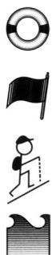
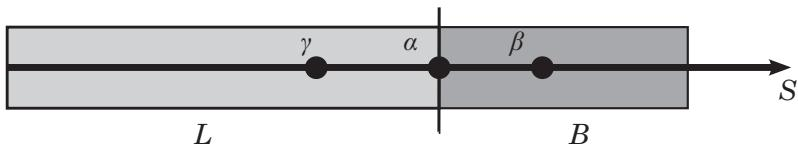

# 第 17 级：实分析 (Real Analysis)

## 一、学习目标

完成本教程后，你应当能够：

1. **理解实数的完备性**——掌握确界原理、完备性公理、区间套定理、Bolzano-Weierstrass 定理以及 Cauchy 收敛准则，理解实数与有理数的本质区别。
2. **用 ε-N 语言严谨处理序列极限**——计算极限上下确界，掌握子序列及其应用，熟练运用 Bolzano-Weierstrass 定理证明序列收敛性。
3. **用 ε-δ 语言分析函数连续性**——掌握连续性的多种等价刻画，区分一致连续与普通连续，能够证明介值定理和极值定理。
4. **掌握微分学的核心定理**——理解 Darboux 定理（导数的介值性），熟练运用中值定理解决问题，掌握带余项的 Taylor 展开。
5. **建立 Riemann 积分的严格理论**——理解 Riemann 和、可积条件，能够证明微积分基本定理。
6. **分析函数序列与函数项级数**——区分点态收敛与一致收敛，掌握一致收敛保持连续性、可积性、可微性的条件，了解 Arzelà-Ascoli 定理。
7. **在度量空间中运用抽象分析**——理解开集、闭集、紧致性、完备性的概念，掌握压缩映射原理及其应用。

---

## 二、实数完备性

### 2.1 确界 (Supremum and Infimum)

**定义 (上界与下界)**：设 $S \subseteq \mathbb{R}$ 为非空集合。若存在 $M \in \mathbb{R}$ 使得对一切 $x \in S$ 都有 $x \le M$，则称 $M$ 为 $S$ 的一个**上界**。类似定义**下界**。

**定义 (确界)**：
- 若 $S$ 有上界，则 $S$ 的最小上界称为**上确界 (supremum)**，记作 $\sup S$。
- 若 $S$ 有下界，则 $S$ 的最大下界称为**下确界 (infimum)**，记作 $\inf S$。

**例子**：若 $S = (0, 1)$，则 $\sup S = 1$，$\inf S = 0$。注意 $1 \notin S$，但仍是上确界。

### 2.2 完备性公理 (Completeness Axiom)

> **完备性公理 (Dedekind 完备性)**：$\mathbb{R}$ 的任何非空有上界的子集必有上确界（在 $\mathbb{R}$ 中）。

这是实数区别于有理数的关键性质。有理数集 $\mathbb{Q}$ 不满足完备性公理——例如 $S = \{x \in \mathbb{Q} \mid x^2 < 2\}$ 在 $\mathbb{Q}$ 中没有上确界。

**命题**：完备性公理等价于下确界版本：$\mathbb{R}$ 的任何非空有下界的子集必有下确界。

### 2.3 区间套定理 (Nested Interval Theorem)

> **定理 (区间套定理)**：设 $\{[a_n, b_n]\}_{n=1}^{\infty}$ 是一列闭区间，满足：
> 1. $[a_{n+1}, b_{n+1}] \subseteq [a_n, b_n]$ 对所有 $n$ 成立；
> 2. $\lim_{n\to\infty} (b_n - a_n) = 0$。
>
> 则存在唯一的实数 $\xi$ 属于所有区间，即 $\bigcap_{n=1}^{\infty} [a_n, b_n] = \{\xi\}$。

**证明**：由条件 (1)，数列 $\{a_n\}$ 单调递增且有上界 $b_1$，数列 $\{b_n\}$ 单调递减且有下界 $a_1$。由完备性公理，令 $\xi = \sup\{a_n\}$，则 $a_n \le \xi \le b_n$ 对所有 $n$ 成立。由条件 (2)，$\lim_{n\to\infty} (b_n - a_n) = 0$，故极限唯一。$\square$

### 2.4 Bolzano-Weierstrass 定理

> **定理 (Bolzano-Weierstrass)**：$\mathbb{R}$ 中的任何有界无穷集合至少有一个聚点（即存在收敛子序列的极限点）。

**证明**：设 $S \subseteq \mathbb{R}$ 是有界无穷集合，则存在 $[a, b]$ 包含 $S$。将 $[a, b]$ 等分为两个子区间，则至少有一个子区间包含 $S$ 的无穷多个点，记该区间为 $[a_1, b_1]$。重复此过程，得到一列闭区间 $[a_n, b_n]$ 满足：
- $[a_{n+1}, b_{n+1}] \subseteq [a_n, b_n]$；
- $b_n - a_n = (b-a)/2^n \to 0$；
- 每个 $[a_n, b_n]$ 包含 $S$ 的无穷多个点。

由区间套定理，存在 $\xi \in \bigcap_{n=1}^{\infty} [a_n, b_n]$。对任意 $\varepsilon > 0$，取 $N$ 使得 $b_N - a_N < \varepsilon$，则 $[a_N, b_N] \subseteq (\xi - \varepsilon, \xi + \varepsilon)$，从而该邻域包含 $S$ 的无穷多个点，故 $\xi$ 是 $S$ 的聚点。$\square$

### 2.5 Cauchy 完备性 (Cauchy Completeness)

**定义 (Cauchy 列)**：数列 $\{x_n\}$ 称为 **Cauchy 列**，若对任意 $\varepsilon > 0$，存在 $N \in \mathbb{N}$，使得当 $m, n \ge N$ 时，$|x_n - x_m| < \varepsilon$。

> **定理 (Cauchy 收敛准则)**：$\mathbb{R}$ 中的数列收敛当且仅当它是 Cauchy 列。

**证明概要**：
- ($\Rightarrow$) 若 $x_n \to x$，则对 $\varepsilon > 0$，存在 $N$ 使得 $n \ge N$ 时 $|x_n - x| < \varepsilon/2$，从而 $m, n \ge N$ 时 $|x_n - x_m| \le |x_n - x| + |x - x_m| < \varepsilon$。
- ($\Leftarrow$) 若 $\{x_n\}$ 是 Cauchy 列，则它有界。由 Bolzano-Weierstrass 定理，存在收敛子序列 $x_{n_k} \to x$。利用 Cauchy 性质可证 $x_n \to x$。$\square$

---

## 三、序列的极限

### 3.1 ε-N 定义回顾

**定义**：称数列 $\{a_n\}$ 收敛于 $L$，记作 $\lim_{n\to\infty} a_n = L$，若对任意 $\varepsilon > 0$，存在 $N \in \mathbb{N}$，使得当 $n > N$ 时，$|a_n - L| < \varepsilon$。

**例子**：证明 $\lim_{n\to\infty} \frac{1}{n} = 0$。对任意 $\varepsilon > 0$，取 $N = \lceil 1/\varepsilon \rceil$，则当 $n > N$ 时，$|1/n - 0| = 1/n < 1/N \le \varepsilon$。

### 3.2 极限上确界与极限下确界 (Limsup and Liminf)

**定义**：对数列 $\{a_n\}$，定义
- $\limsup_{n\to\infty} a_n = \lim_{n\to\infty} \sup_{k \ge n} a_k$；
- $\liminf_{n\to\infty} a_n = \lim_{n\to\infty} \inf_{k \ge n} a_k$。

**性质**：
- $\liminf a_n \le \limsup a_n$，且 $\{a_n\}$ 收敛当且仅当 $\liminf a_n = \limsup a_n$。
- 对任意数列，$\limsup$ 和 $\liminf$ 总是存在（可以是 $\pm\infty$）。

### 3.3 子序列 (Subsequences)

**定义**：设 $\{a_n\}$ 是数列，$\{n_k\}$ 是严格递增的自然数序列，则 $\{a_{n_k}\}$ 称为 $\{a_n\}$ 的一个**子序列**。

> **定理**：$\lim_{n\to\infty} a_n = L$ 当且仅当 $\{a_n\}$ 的每个子序列都收敛于 $L$。

### 3.4 Bolzano-Weierstrass 定理（序列版本）

> **定理 (Bolzano-Weierstrass for Sequences)**：$\mathbb{R}$ 中的任何有界数列必有收敛子序列。

**证明**：设 $\{a_n\}$ 是有界数列，考虑其值域集合 $S = \{a_n \mid n \in \mathbb{N}\}$。若 $S$ 是有限集，则存在某个值重复无穷多次，这些重复项即构成收敛子序列。若 $S$ 是无穷集，则由集合版本的 Bolzano-Weierstrass 定理，$S$ 有聚点 $\xi$。对 $k = 1, 2, \dots$，取 $a_{n_k} \in (\xi - 1/k, \xi + 1/k)$ 且 $n_k > n_{k-1}$，则 $\{a_{n_k}\}$ 收敛于 $\xi$。$\square$

---

## 四、函数的连续性

### 4.1 ε-δ 定义

**定义**：函数 $f: D \to \mathbb{R}$ 在点 $x_0 \in D$ 处连续，若对任意 $\varepsilon > 0$，存在 $\delta > 0$，使得当 $x \in D$ 且 $|x - x_0| < \delta$ 时，有 $|f(x) - f(x_0)| < \varepsilon$。

若 $f$ 在 $D$ 的每一点都连续，则称 $f$ 在 $D$ 上连续。

### 4.2 序列连续性 (Sequential Continuity)

> **定理**：$f$ 在 $x_0$ 处连续当且仅当对任意满足 $x_n \to x_0$ 的序列 $\{x_n\} \subseteq D$，都有 $f(x_n) \to f(x_0)$。

**证明**：($\Rightarrow$) 由 ε-δ 定义，对 $\varepsilon > 0$ 存在 $\delta > 0$，由 $x_n \to x_0$ 知存在 $N$ 使 $n \ge N$ 时 $|x_n - x_0| < \delta$，从而 $|f(x_n) - f(x_0)| < \varepsilon$。

($\Leftarrow$) 用反证法。若 $f$ 在 $x_0$ 不连续，则存在 $\varepsilon_0 > 0$，对每个 $\delta = 1/n$ 都存在 $x_n$ 满足 $|x_n - x_0| < 1/n$ 但 $|f(x_n) - f(x_0)| \ge \varepsilon_0$。于是 $x_n \to x_0$ 但 $f(x_n) \not\to f(x_0)$，矛盾。$\square$

### 4.3 一致连续 (Uniform Continuity)

**定义**：函数 $f: D \to \mathbb{R}$ 称为在 $D$ 上**一致连续**，若对任意 $\varepsilon > 0$，存在 $\delta > 0$，使得对任意 $x, y \in D$，只要 $|x - y| < \delta$，就有 $|f(x) - f(y)| < \varepsilon$。

**关键区别**：普通连续中的 $\delta$ 可以依赖于 $x_0$，而一致连续中的 $\delta$ 只依赖于 $\varepsilon$，对全区间一致有效。

> **定理 (Cantor)**：若 $f$ 在闭区间 $[a, b]$ 上连续，则 $f$ 在 $[a, b]$ 上一致连续。

### 4.4 介值定理 (Intermediate Value Theorem)

> **定理 (介值定理)**：设 $f: [a, b] \to \mathbb{R}$ 连续，且 $f(a) < y < f(b)$（或 $f(a) > y > f(b)$），则存在 $c \in (a, b)$ 使得 $f(c) = y$。

**证明**：不妨设 $f(a) < y < f(b)$。定义集合 $S = \{x \in [a, b] \mid f(x) \le y\}$。$a \in S$ 故 $S$ 非空，且有上界 $b$，令 $c = \sup S$。由连续性，$f(c) \le y$（因为若 $f(c) > y$，则在 $c$ 附近 $f(x) > y$ 与 $c$ 是上确界矛盾）。又若 $f(c) < y$，则存在 $c$ 右侧的点 $x'$ 使 $f(x') < y$，与 $c$ 是上界矛盾。故 $f(c) = y$。$\square$

### 4.5 极值定理 (Extreme Value Theorem)

> **定理 (极值定理)**：设 $f: [a, b] \to \mathbb{R}$ 连续，则 $f$ 在 $[a, b]$ 上取得最大值和最小值。

**证明**：先证 $f$ 有界。若 $f$ 无界，则存在 $x_n \in [a, b]$ 使 $|f(x_n)| \to \infty$。由 Bolzano-Weierstrass 定理，$\{x_n\}$ 有收敛子序列 $x_{n_k} \to x_0 \in [a, b]$。由连续性，$f(x_{n_k}) \to f(x_0)$，与 $|f(x_{n_k})| \to \infty$ 矛盾。故 $f$ 有界。

令 $M = \sup\{f(x) \mid x \in [a, b]\}$。存在 $x_n \in [a, b]$ 使 $f(x_n) \to M$。取收敛子序列 $x_{n_k} \to x^*$，由连续性 $f(x^*) = \lim f(x_{n_k}) = M$，故最大值在 $x^*$ 处取得。最小值同理。$\square$

---

## 五、可微性

### 5.1 Darboux 定理（导数的介值性）

> **定理 (Darboux)**：设 $f: [a, b] \to \mathbb{R}$ 可导。若 $f'(a) < d < f'(b)$（或 $f'(a) > d > f'(b)$），则存在 $c \in (a, b)$ 使得 $f'(c) = d$。

**证明**：设 $f'(a) < d < f'(b)$。定义 $g(x) = f(x) - dx$，则 $g'(a) = f'(a) - d < 0$，$g'(b) = f'(b) - d > 0$。由极值定理，$g$ 在 $[a, b]$ 上某点 $c$ 取得最小值。由于 $g'(a) < 0$，$a$ 不是最小值点（$g$ 在 $a$ 右侧递减）；同理 $b$ 不是最小值点。故 $c \in (a, b)$，由 Fermat 引理 $g'(c) = 0$，即 $f'(c) = d$。$\square$

**推论**：导函数不一定连续，但一定具有介值性。

### 5.2 中值定理及其应用

**Rolle 定理**：若 $f$ 在 $[a, b]$ 连续，在 $(a, b)$ 可导，且 $f(a) = f(b)$，则存在 $c \in (a, b)$ 使 $f'(c) = 0$。

**Lagrange 中值定理**：若 $f$ 在 $[a, b]$ 连续，在 $(a, b)$ 可导，则存在 $c \in (a, b)$ 使
$$f(b) - f(a) = f'(c)(b - a).$$

**Cauchy 中值定理**：若 $f, g$ 在 $[a, b]$ 连续，在 $(a, b)$ 可导，且 $g'(x) \neq 0$，则存在 $c \in (a, b)$ 使
$$\frac{f(b) - f(a)}{g(b) - g(a)} = \frac{f'(c)}{g'(c)}.$$

**应用举例**：
1. 若 $f'(x) = 0$ 对所有 $x \in (a, b)$ 成立，则 $f$ 在 $[a, b]$ 上为常数。
2. 若 $f'(x) > 0$ 对所有 $x \in (a, b)$ 成立，则 $f$ 严格递增。
3. 证明不等式：对 $0 < a < b$，有 $\frac{b-a}{b} < \ln\frac{b}{a} < \frac{b-a}{a}$。

### 5.3 Taylor 定理（带余项）

> **定理 (Taylor)**：设 $f$ 在 $[a, b]$ 上有 $n$ 阶连续导数，在 $(a, b)$ 上有 $n+1$ 阶导数。则对 $x_0 \in [a, b]$，存在 $\xi$ 介于 $x$ 与 $x_0$ 之间，使得
>
> $$f(x) = \sum_{k=0}^{n} \frac{f^{(k)}(x_0)}{k!}(x-x_0)^k + R_n(x),$$
>
> 其中 **Lagrange 余项**：$R_n(x) = \frac{f^{(n+1)}(\xi)}{(n+1)!}(x-x_0)^{n+1}$。

**证明思路**：定义辅助函数，反复应用 Cauchy 中值定理。

---

## 六、黎曼积分

### 6.1 Riemann 积分的定义

设 $f: [a, b] \to \mathbb{R}$ 有界。取分割 $P = \{x_0, x_1, \dots, x_n\}$，其中 $a = x_0 < x_1 < \cdots < x_n = b$。记 $\Delta x_i = x_i - x_{i-1}$，$\|P\| = \max \Delta x_i$。

**Darboux 和**：
- 下和：$L(P, f) = \sum_{i=1}^{n} m_i \Delta x_i$，其中 $m_i = \inf\{f(x) \mid x \in [x_{i-1}, x_i]\}$。
- 上和：$U(P, f) = \sum_{i=1}^{n} M_i \Delta x_i$，其中 $M_i = \sup\{f(x) \mid x \in [x_{i-1}, x_i]\}$。

**定义**：$f$ 在 $[a, b]$ 上 **Riemann 可积**，若
$$\sup_P L(P, f) = \inf_P U(P, f),$$
该公共值称为 $\int_a^b f(x)\,dx$。

### 6.2 Riemann 和

**定义**：对分割 $P$ 和取样点 $\xi_i \in [x_{i-1}, x_i]$，Riemann 和为
$$S(P, f) = \sum_{i=1}^{n} f(\xi_i) \Delta x_i.$$

> **定理**：$f$ 在 $[a, b]$ 上 Riemann 可积当且仅当对任意分割序列 $P_n$ 满足 $\|P_n\| \to 0$ 和任意取样，Riemann 和收敛于同一极限。

### 6.3 可积条件

> **定理 (Riemann 可积的充要条件)**：有界函数 $f$ 在 $[a, b]$ 上 Riemann 可积当且仅当 $f$ 在 $[a, b]$ 上几乎处处连续（即不连续点集为零测集）。

**简单判定**：
- 连续函数必可积。
- 单调函数必可积。
- 只有有限个间断点的有界函数必可积。

### 6.4 微积分基本定理 (Fundamental Theorem of Calculus)

**第一部分**：设 $f$ 在 $[a, b]$ 上 Riemann 可积，定义
$$F(x) = \int_a^x f(t)\,dt, \quad x \in [a, b].$$
则 $F$ 在 $[a, b]$ 上连续；若 $f$ 在 $x_0 \in [a, b]$ 处连续，则 $F$ 在 $x_0$ 处可导且 $F'(x_0) = f(x_0)$。

**证明**：对 $x, x+h \in [a, b]$，
$$F(x+h) - F(x) = \int_x^{x+h} f(t)\,dt.$$
由于 $f$ 有界，设 $|f(t)| \le M$，则 $|F(x+h) - F(x)| \le M|h|$，故 $F$ 一致连续。

若 $f$ 在 $x$ 处连续，对 $\varepsilon > 0$，存在 $\delta > 0$ 使 $|t - x| < \delta$ 时 $|f(t) - f(x)| < \varepsilon$。当 $|h| < \delta$ 时，
$$\left|\frac{F(x+h) - F(x)}{h} - f(x)\right| = \left|\frac{1}{h}\int_x^{x+h} (f(t) - f(x))\,dt\right| \le \frac{1}{|h|}\cdot \varepsilon |h| = \varepsilon,$$
故 $F'(x) = f(x)$。$\square$

**第二部分**：设 $f$ 在 $[a, b]$ 上 Riemann 可积，$F$ 是 $f$ 在 $[a, b]$ 上的一个原函数（即 $F' = f$），则
$$\int_a^b f(x)\,dx = F(b) - F(a).$$

**证明**：对任意分割 $P = \{x_0, \dots, x_n\}$，
$$F(b) - F(a) = \sum_{i=1}^{n} [F(x_i) - F(x_{i-1})].$$
由 Lagrange 中值定理，存在 $\xi_i \in (x_{i-1}, x_i)$ 使 $F(x_i) - F(x_{i-1}) = F'(\xi_i)(x_i - x_{i-1}) = f(\xi_i)\Delta x_i$。于是
$$F(b) - F(a) = \sum_{i=1}^{n} f(\xi_i)\Delta x_i,$$
这就是一个 Riemann 和。当 $\|P\| \to 0$ 时，该和趋于 $\int_a^b f(x)\,dx$。$\square$

---

## 七、函数序列与一致收敛

### 7.1 点态收敛 vs 一致收敛

**定义**：设 $\{f_n\}$ 是定义在 $D \subseteq \mathbb{R}$ 上的函数序列，$f$ 是 $D$ 上的函数。

- **点态收敛**：对每个 $x \in D$，$\lim_{n\to\infty} f_n(x) = f(x)$。即对 $\forall x \in D, \forall \varepsilon > 0, \exists N(x, \varepsilon)$ 使 $n \ge N$ 时 $|f_n(x) - f(x)| < \varepsilon$。
- **一致收敛**：$\lim_{n\to\infty} \sup_{x \in D} |f_n(x) - f(x)| = 0$。即对 $\forall \varepsilon > 0, \exists N(\varepsilon)$ 使 $n \ge N$ 时对一切 $x \in D$ 有 $|f_n(x) - f(x)| < \varepsilon$。

**关键区别**：一致收敛要求 $N$ 不依赖于 $x$。

**例子**：$f_n(x) = x^n$ 在 $[0, 1]$ 上点态收敛于
$$f(x) = \begin{cases} 0, & 0 \le x < 1, \\ 1, & x = 1, \end{cases}$$
但并非一致收敛，因为 $\sup_{x\in[0,1]} |x^n - f(x)| = 1 \not\to 0$。

### 7.2 一致收敛保持连续性

> **定理**：若每个 $f_n$ 在 $D$ 上连续，且 $f_n \rightrightarrows f$（一致收敛）于 $D$，则 $f$ 在 $D$ 上连续。

**证明**：对 $x_0 \in D$ 和 $\varepsilon > 0$，由一致收敛存在 $N$ 使对所有 $x$ 有 $|f_N(x) - f(x)| < \varepsilon/3$。由 $f_N$ 在 $x_0$ 连续，存在 $\delta > 0$ 使 $|x - x_0| < \delta$ 时 $|f_N(x) - f_N(x_0)| < \varepsilon/3$。于是
$$|f(x) - f(x_0)| \le |f(x) - f_N(x)| + |f_N(x) - f_N(x_0)| + |f_N(x_0) - f(x_0)| < \varepsilon.$$
故 $f$ 在 $x_0$ 连续。$\square$

### 7.3 一致收敛保持可积性

> **定理**：若 $f_n$ 在 $[a, b]$ 上 Riemann 可积，且 $f_n \rightrightarrows f$，则 $f$ 在 $[a, b]$ 上 Riemann 可积，且
$$\lim_{n\to\infty} \int_a^b f_n(x)\,dx = \int_a^b f(x)\,dx.$$

### 7.4 一致收敛与可微性

> **定理**：设 $f_n$ 在 $[a, b]$ 上可导，$f_n'$ 一致收敛于 $g$，且存在某个 $x_0 \in [a, b]$ 使 $f_n(x_0)$ 收敛，则 $f_n$ 一致收敛于某个可导函数 $f$，且 $f' = g$。

### 7.5 Arzelà-Ascoli 定理

> **定理 (Arzelà-Ascoli)**：设 $\{f_n\}$ 是定义在紧致集 $K \subseteq \mathbb{R}^m$ 上的连续函数序列。若 $\{f_n\}$ 是
> 1. **一致有界**：存在 $M > 0$ 使对所有 $n$ 和 $x \in K$ 有 $|f_n(x)| \le M$；
> 2. **等度连续**：对任意 $\varepsilon > 0$，存在 $\delta > 0$，使得对任意 $n$ 和任意 $x, y \in K$，只要 $|x - y| < \delta$ 就有 $|f_n(x) - f_n(y)| < \varepsilon$，
>
> 则 $\{f_n\}$ 存在一致收敛的子序列。

---

## 八、度量空间

### 8.1 度量空间的定义

**定义**：集合 $X$ 上的**度量**是一个函数 $d: X \times X \to \mathbb{R}$，满足：
1. 正定性：$d(x, y) \ge 0$，且 $d(x, y) = 0 \iff x = y$；
2. 对称性：$d(x, y) = d(y, x)$；
3. 三角不等式：$d(x, z) \le d(x, y) + d(y, z)$。

$(X, d)$ 称为**度量空间**。

**例子**：
- $\mathbb{R}$ 上的标准度量：$d(x, y) = |x - y|$。
- $\mathbb{R}^n$ 上的欧几里得度量：$d(x, y) = \sqrt{\sum_{i=1}^n (x_i - y_i)^2}$。
- 离散度量：$d(x, y) = 0$ 若 $x = y$，否则 $d(x, y) = 1$。

### 8.2 开集与闭集

**定义**：
- **开球**：$B(x_0, r) = \{x \in X \mid d(x, x_0) < r\}$。
- $U \subseteq X$ 是**开集**，若对每个 $x \in U$，存在 $r > 0$ 使 $B(x, r) \subseteq U$。
- $F \subseteq X$ 是**闭集**，若 $X \setminus F$ 是开集。

**性质**：
- 任意开集的并是开集，有限个开集的交是开集。
- 任意闭集的交是闭集，有限个闭集的并是闭集。

### 8.3 紧致性 (Compactness)

**定义**：$K \subseteq X$ 称为**紧致**的，若 $K$ 的任何开覆盖都有有限子覆盖。

> **定理 (Heine-Borel)**：在 $\mathbb{R}^n$ 中，$K$ 是紧致的当且仅当 $K$ 是有界闭集。

> **定理**：连续函数将紧致集映射为紧致集。特别地，紧致集上的连续函数必有最大值和最小值。

### 8.4 完备性 (Completeness)

**定义**：度量空间 $(X, d)$ 称为**完备**的，若其中的每个 Cauchy 列都收敛于 $X$ 中的一点。

**例子**：
- $\mathbb{R}$ 是完备的。
- $\mathbb{Q}$ 不是完备的。
- $C[0, 1]$（带 sup 度量）是完备的。

### 8.5 压缩映射原理 (Banach Fixed Point Theorem)

> **定理 (Banach 不动点定理)**：设 $(X, d)$ 是完备度量空间，$T: X \to X$ 是**压缩映射**，即存在 $\lambda \in [0, 1)$ 使得对任意 $x, y \in X$，
> $$d(Tx, Ty) \le \lambda \, d(x, y).$$
>
> 则 $T$ 有唯一的不动点 $x^*$（即 $Tx^* = x^*$）。且对任意 $x_0 \in X$，迭代序列 $x_{n+1} = Tx_n$ 收敛于 $x^*$，且有误差估计：
> $$d(x_n, x^*) \le \frac{\lambda^n}{1-\lambda} d(x_1, x_0).$$

**证明**：
1. **存在性**：对任意 $x_0 \in X$，定义 $x_{n+1} = Tx_n$。则
   $$d(x_{n+1}, x_n) = d(Tx_n, Tx_{n-1}) \le \lambda d(x_n, x_{n-1}) \le \cdots \le \lambda^n d(x_1, x_0).$$
   对 $m > n$，
   $$d(x_m, x_n) \le \sum_{k=n}^{m-1} d(x_{k+1}, x_k) \le d(x_1, x_0) \sum_{k=n}^{\infty} \lambda^k = d(x_1, x_0) \frac{\lambda^n}{1-\lambda}.$$
   故 $\{x_n\}$ 是 Cauchy 列。由 $(X, d)$ 完备，存在 $x^* = \lim_{n\to\infty} x_n$。由压缩映射的连续性（Lipschitz 连续），
   $$Tx^* = T(\lim x_n) = \lim Tx_n = \lim x_{n+1} = x^*.$$

2. **唯一性**：若 $Tx^* = x^*$ 且 $Ty^* = y^*$，则
   $$d(x^*, y^*) = d(Tx^*, Ty^*) \le \lambda d(x^*, y^*),$$
   由于 $\lambda < 1$，必有 $d(x^*, y^*) = 0$，即 $x^* = y^*$。

3. **误差估计**：由上述不等式，令 $m \to \infty$ 即得。$\square$

**应用**：解微分方程 $y' = f(x, y)$ 的 Picard 存在唯一性定理、隐函数定理等。

---

## 九、示例 (Worked Examples)

### 例 1：用 ε-N 定义证明极限

证明 $\lim_{n\to\infty} \frac{2n+1}{3n+2} = \frac{2}{3}$。

**解**：对任意 $\varepsilon > 0$，
$$\left|\frac{2n+1}{3n+2} - \frac{2}{3}\right| = \left|\frac{3(2n+1) - 2(3n+2)}{3(3n+2)}\right| = \frac{1}{3(3n+2)}.$$
要使 $\frac{1}{3(3n+2)} < \varepsilon$，只需 $n > \frac{1}{9\varepsilon} - \frac{2}{3}$。取 $N = \max\{1, \lceil \frac{1}{9\varepsilon} - \frac{2}{3} \rceil\}$，则当 $n > N$ 时不等式成立。$\square$

### 例 2：求极限上确界

求 $\limsup_{n\to\infty} \sin\left(\frac{n\pi}{2}\right)$ 和 $\liminf_{n\to\infty} \sin\left(\frac{n\pi}{2}\right)$。

**解**：数列为 $\sin(\pi/2), \sin(\pi), \sin(3\pi/2), \sin(2\pi), \dots$，即 $1, 0, -1, 0, 1, 0, -1, 0, \dots$。

$\limsup = 1$，$\liminf = -1$。数列不收敛。$\square$

### 例 3：用 ε-δ 证明连续性

证明 $f(x) = x^2$ 在任意点 $x_0$ 连续。

**解**：对 $\varepsilon > 0$，$|x^2 - x_0^2| = |x - x_0| \cdot |x + x_0|$。若 $|x - x_0| < 1$，则 $|x + x_0| \le |x - x_0| + 2|x_0| < 1 + 2|x_0|$。取 $\delta = \min\{1, \varepsilon/(1+2|x_0|)\}$，则当 $|x - x_0| < \delta$ 时 $|x^2 - x_0^2| < \varepsilon$。$\square$

### 例 4：一致连续的反例

证明 $f(x) = 1/x$ 在 $(0, 1]$ 上不一致连续。

**解**：取 $\varepsilon = 1$，对任意 $\delta > 0$，取 $n$ 足够大使 $1/n < \delta$，令 $x = 1/n$，$y = 1/(n+1)$，则 $|x - y| = \frac{1}{n(n+1)} < \frac{1}{n} < \delta$，但 $|f(x) - f(y)| = |n - (n+1)| = 1 \ge \varepsilon$。$\square$

### 例 5：介值定理的应用

证明方程 $x^3 - 3x + 1 = 0$ 在 $(0, 1)$ 内有根。

**解**：令 $f(x) = x^3 - 3x + 1$，$f$ 连续。$f(0) = 1 > 0$，$f(1) = -1 < 0$。由介值定理，存在 $c \in (0, 1)$ 使 $f(c) = 0$。$\square$

### 例 6：中值定理的应用

证明 $\sin x \le x$ 对所有 $x \ge 0$ 成立。

**解**：若 $x = 0$，等号成立。若 $x > 0$，对 $f(t) = \sin t$ 在 $[0, x]$ 上应用中值定理，存在 $c \in (0, x)$ 使
$$\frac{\sin x - \sin 0}{x - 0} = \cos c \le 1,$$
即 $\sin x \le x$。$\square$

### 例 7：Taylor 展开

求 $f(x) = e^x$ 在 $x_0 = 0$ 处的 $n$ 阶 Taylor 展开，并写出余项。

**解**：$f^{(k)}(0) = 1$ 对所有 $k$ 成立，故
$$e^x = \sum_{k=0}^{n} \frac{x^k}{k!} + \frac{e^{\xi}}{(n+1)!}x^{n+1},$$
其中 $\xi$ 介于 $0$ 与 $x$ 之间。$\square$

### 例 8：Riemann 积分计算

用定义计算 $\int_0^1 x^2\,dx$。

**解**：取等分分割 $x_i = i/n$，$\Delta x_i = 1/n$，取右端点 $\xi_i = i/n$，则
$$S_n = \sum_{i=1}^{n} \left(\frac{i}{n}\right)^2 \cdot \frac{1}{n} = \frac{1}{n^3}\sum_{i=1}^{n} i^2 = \frac{1}{n^3} \cdot \frac{n(n+1)(2n+1)}{6} = \frac{(n+1)(2n+1)}{6n^2}.$$
令 $n \to \infty$，$S_n \to \frac{1}{3}$，故 $\int_0^1 x^2\,dx = \frac{1}{3}$。$\square$

### 例 9：一致收敛的判断

判断 $f_n(x) = \frac{x}{1+nx^2}$ 在 $\mathbb{R}$ 上是否一致收敛。

**解**：对每个 $x$，$f_n(x) \to 0$。计算
$$\sup_{x\in\mathbb{R}} |f_n(x)| = \sup_{x\in\mathbb{R}} \frac{|x|}{1+nx^2}.$$
令 $g(x) = \frac{|x|}{1+nx^2}$，由 $g(x) \le \frac{1}{2\sqrt{n}}$（通过 AM-GM 不等式或求导得到），且 $x = \pm 1/\sqrt{n}$ 时取等。故 $\sup |f_n(x)| = \frac{1}{2\sqrt{n}} \to 0$，所以一致收敛于 $0$。$\square$

### 例 10：压缩映射

设 $T: \mathbb{R} \to \mathbb{R}$，$Tx = \frac{x}{2} + 1$。求不动点并验证压缩性。

**解**：$|Tx - Ty| = |x/2 - y/2| = \frac{1}{2}|x - y|$，故 $\lambda = \frac{1}{2} < 1$，是压缩映射。解 $x = x/2 + 1$ 得不动点 $x^* = 2$。从任意 $x_0$ 出发，迭代 $x_{n+1} = x_n/2 + 1$ 收敛于 $2$。$\square$

---

## 十、习题 (Practice Problems)

### 基础题

1. **确界**：设 $S = \{1 - \frac{1}{n} \mid n \in \mathbb{N}\}$。求 $\sup S$ 和 $\inf S$，并证明你的结论。

2. **ε-N 证明**：用 ε-N 语言证明 $\lim_{n\to\infty} \frac{n^2 + 1}{2n^2 + 3} = \frac{1}{2}$。

3. **ε-δ 连续性**：用 ε-δ 语言证明 $f(x) = \sqrt{x}$ 在 $[0, \infty)$ 上一致连续。

4. **中值定理**：证明对任意 $a < b$，$\frac{b-a}{1+b^2} \le \arctan b - \arctan a \le \frac{b-a}{1+a^2}$。

### 进阶题

5. **Darboux 定理**：构造一个可导函数，其导函数在 $x=0$ 处不连续，并验证 Darboux 定理成立。

6. **Riemann 可积**：证明 Dirichlet 函数
   $$D(x) = \begin{cases} 1, & x \in \mathbb{Q}, \\ 0, & x \notin \mathbb{Q} \end{cases}$$
   在 $[0, 1]$ 上不是 Riemann 可积的。

7. **一致收敛**：设 $f_n(x) = n^2 x e^{-nx}$ 在 $[0, 1]$ 上。证明 $f_n$ 点态收敛于 $0$，但不是一致收敛的。计算 $\int_0^1 f_n(x)\,dx$ 并说明与极限交换积分次序的可行性。

8. **Taylor 定理**：用带 Lagrange 余项的 Taylor 公式证明 $|\sin x - x + \frac{x^3}{6}| \le \frac{|x|^5}{120}$ 对所有 $x$ 成立。

### 挑战题

9. **Banach 不动点**：考虑 $C[0, 1]$ 上的算子 $Tf(x) = 1 + \int_0^x f(t)\,dt$。证明 $T$ 是压缩映射，从而存在唯一的 $f \in C[0, 1]$ 满足 $Tf = f$，并求出该不动点。

10. **Bolzano-Weierstrass 应用**：设 $\{a_n\}$ 是有界数列，且 $\lim_{n\to\infty} (a_{n+1} - a_n) = 0$。证明 $\{a_n\}$ 的聚点集合是一个闭区间（即所有聚点构成一个闭区间）。

---

## 十一、总结

实分析是微积分的严格化基础，它将微积分中直观的"极限"、"连续"、"微分"、"积分"等概念建立在精确的数学语言之上。本教程覆盖了以下核心内容：

| 主题 | 核心概念 | 关键定理 |
|------|---------|---------|
| **实数完备性** | 确界、Cauchy 列 | 完备性公理、区间套定理、Bolzano-Weierstrass 定理、Cauchy 收敛准则 |
| **序列极限** | ε-N 语言、limsup/liminf | 子序列收敛定理、Bolzano-Weierstrass 定理（序列版） |
| **函数连续性** | ε-δ 语言、一致连续 | 介值定理、极值定理、Cantor 一致连续定理 |
| **可微性** | 导数、中值定理 | Darboux 定理、Lagrange 中值定理、Taylor 定理 |
| **Riemann 积分** | Darboux 和、Riemann 和 | 可积充要条件、微积分基本定理 |
| **函数序列** | 点态/一致收敛 | 连续性保持、可积性保持、可微性保持、Arzelà-Ascoli 定理 |
| **度量空间** | 度量、开/闭集、紧致、完备 | Heine-Borel 定理、Banach 不动点定理 |

**学习建议**：实分析的关键在于"证明"。建议在学习过程中：
1. 每个定理都尝试自己证明一遍，再对照标准证明。
2. 多构造反例来理解概念的边界——例如，连续但不可导的函数（魏尔斯特拉斯函数）、可积但有无限多个间断点的函数等。
3. 将度量空间的概念与 $\mathbb{R}$ 上的具体例子对照理解，为后续的泛函分析、拓扑学打下基础。

实分析不仅是一门理论课程，更是现代数学的通用语言。掌握了实分析，你就打开了通往复分析、泛函分析、微分方程、概率论等更深领域的大门。

---

## 补充阅读：普林斯顿数学分析读本

### 第1章 引言

请慢下来，学霸．我知道你很聪明------你或许一直都很擅长数字运算，并且能熟练地计算微积分------但我希望你慢下来．实分析①不同于微积分，甚至与线性代数也完全不同．除了更难之外，这门课并不适合通过记忆公式和算法并将已知条件代入的学习方法．相反，你要反复地阅读定义和证明，直到理解了更宽泛的概念，这样才能把这些概念应用到自己的证明中．要做到这一点，最好的方法就是慢慢来：慢慢读，慢慢写，并仔细思考

下面简单地介绍一下我写这本书的原因以及你应该如何阅读这本书

### 我为什么要写这本书

实分析很难．它会让你开始了解以证明为基础且难度更大的数学．但我坚信，只要解释清楚，每个人都能掌握任何想学的知识

我的第一门实分析课学得很辛苦．我总觉得是在自学，非常希望有人能以清晰的、线性的方式把这些知识解释清楚．我努力奋斗并最终取得了成功，这使我能够成为指导你的绝佳人选．我可以轻松地回想起第一次看到这些内容的感觉．我记得那些让我感到困惑的地方，那些一直都没搞清楚的地方，以及哪些内容难倒了我．在本书中，我会先给出一些常见的解释，以此来解答你的大部分疑问

我当初使用的是 Walter Rudin 编写的《数学分析原理（第 3
版）》{[}Principleof Mathematical Analysis，也被称为 Baby Rudin 或者
That Grueling Little
BuleBook（那本折磨人的小蓝书）{]}．通常认为，这本书是经典的、标准的实分析教材我现在非常佩服
Rudin，他的书条理清晰、简明扼要．但我可以告诉你，当我第一次学习那本书时，整个过程十分艰难．它没有给出任何解释！Rudin
列出了一些定义，但没有给出例子，并在没有告知他是如何思考的情况下写出了完美的证明

请不要误解我的意思：强迫自己把事情搞清楚是非常有意义的．富有挑战性地去理解为什么这种方法可行而不是按部就班地接受给定的思路，这会让你成为一个更好的思考者和学习者．但我相信，作为一种教学技巧，在没有教你如何游泳的情况下，必须要把握好``把你扔到深水池中''的尺度．毕竟，你的老师希望你学会游泳，而不是被淹死．我认为
Rudin 可以提供最大的帮助，这本书也能在需要时为你答疑解惑

我写这本书的初衷是，如果你很聪慧但不是天才（就像我这样），并且真心想学好实分析，那么这本书正是你需要的

### 什么是实分析

数学家把实分析称为严格的微积分．``严格''意味着我们进行的每一步以及使用的每一个公式都必须得到证明．如果从一组称为公理或假说的基本假设出发，那么我们总是可以通过一个又一个合理的步骤得到最终想要的结论

在微积分中，你可能已经证明了一些重要结论，但其中有很多结果被认为是显而易见的．究竟什么是极限，如何确定什么时候无穷和会``收敛''到一个数？每一门实分析基础课都会重新介绍连续性、可微性等这些你曾见过的概念，但这一次，我们要弄清楚这些概念的本质．当弄清楚这些之后，你基本上就证明了微积分的合理性

实分析通常是纯数学理论的第一门课程，因为它在熟悉的材料背景下向你介绍纯数学的重要思想和方法

一旦严格地掌握了那些熟悉的概念，你就可以把这种思维方式应用到不熟悉的领域里．实分析的核心问题是：``如何把某些概念（比如和）推广到无限的情形？''如果不进行严格论证，我们就无法理解像无穷和这样的难题．因此，你必须掌握那些核心的证明技巧，进而将它们应用到那些更有趣的新问题上（并非高中微积分）

### 如何阅读本书

这本书并不打算简单地说一说．以第 7 章为例，我花了好几页的篇幅来论述Rudin
在短短两页里所做的事情．为了使定义不那么抽象，我在定义之后附加了一些例子．这里的证明不仅仅是为了向你展示定理为什么成立，也是为了告诉你该如何自己去证明它．我尽量把论证中用到的每一个事实都陈述一遍，而不是像高级数学文献那样把这些基本的事实省略掉

如果你正在使用 Rudin
的教材，那么你会发现我特意涵盖了他谈到的所有定义和定理，而且大多是按照相同的顺序给出的．这本书和
Rudin 的书并不是一一映射的（说笑了）．例如，下一章阐释了基本的集合论，而
Rudin
则在讨论了实数之后才解释它．另外，为了丰富你的知识，我还引入了一些额外的内容．不过，本书将尽可能地遵循
Rudin 的结构和记号，这样你就可以轻松地在两本书之间自

由穿梭

与其他一些常用来浏览、略读或参考的数学书不同，你应该逐章地阅读本书本书的章节特意写得很简短，其内容相当于一个容易理解的一小时演讲．从每一章的开头开始，不要跳来跳去，按部就班地直到读完为止

现在给你一些建议：积极地阅读．把那些我希望你填充的空白补充完整．（我故意不给出这些问题的答案；偷看的诱惑实在太大了．）即便是那些我没有提到的地方，也要做笔记．如果你习惯通过不断重复来学习，那就把定义抄到笔记本上；如果你希望有直观的认识，那就多画些图．在页边空白处写下你想到的任何疑问．当你把一章读完两遍之后，如果仍有解决不了的问题，那就问问你的学习小组、助教或者教授（也可以分别都问一遍；你听到的越多，你就会学得越好）在阅读每一章时，尽量总结其主要思想或方法．你会发现，几乎每个主题都有一两个可以用来解决大部分证明的技巧

如果你的时间有限，或者你正在复习已经学过的知识，那么可以利用下列图标来略读：

• 从这里开始逐步给出一个例子或证明

• 这是一个重要的说明，或是需要你记住的东西

• 试着完成这个填充空白的练习！

• 这是一个比较复杂的主题，此处只简单地提一下

多学点东西绝对没坏处．事实上，你读的教科书越多，你学好高等数学的概率就越大．最好的方法是，你全身心地投入学习一到两本初级教材（比如这本书和
Rudin
的书）．如果这些初级教材满足不了你的需求，那么你可以去查阅其他书，从中获得额外的练习和解释．倘若你选择忽视这一点，并试图读完与实分析有关的所有书，进而学到实分析的全部知识...... 那么祝你好运！

这本书涵盖了经典实分析课程第一学期的大部分内容，但你的学校可能会介绍更多相关知识如果这本书没有完全涵盖学校的课程，你也不要惊慌！每一步都要建立在它之前的基础上，所以成功最重要的因素是对基础知识的理解．我们将详细介绍这些基础知识，以确保你有一个坚实的基础来继续学习（同时避免使用易造成混淆的隐晦说法，比如``这句''）

一些推荐书的清单以及我的注解和评价，请阅读参考书目

翻过这一页，我们将开始学习一些基本的数学概念和逻辑概念，它们是严格学习实分析的重要背景知识．（到目前为止，我用了多少次``严格''这个词？用了这么多次：
$ l i m  _ { n \to \infty } \frac { n ^ { \alpha } } { ( 1 + p ) ^ { n } } + 7 .  .$
）

### 第4章 上确界

自然数是可以计数的数；整数包含
0、自然数及其相反数；有理数是通过整数做除法运算得到的；实数则是...... 实数到底是什么呢？当然，实数是由有理数和无理数共同构成的，但无理数只不过意味着``不是有理数''，我们没有定义这些数的真正含义

我们将在下一个定理中看到， $^ { 6 6 } \sqrt { 2 }$ 不包含在 Q
中''这一事实使得有理数集中留下了一个``洞''，这样就形成了没有最小数的子集和没有最大数的子集．这些洞使得
$\mathbb { Q }$ 缺少了上确界这一特殊性质

为了填满这些洞，我们构造
$\overline { { ** J ** } } \mathbb { Q }$ 的一个超集
R，它具有上确界的性质

定理 4.1 (Q 有``洞'').
存在没有最小数的有理数的子集，也存在没有最大数的有理数的子集

证明. 对于这个定理，举例证明就足够了．我们只需要找到 Q
的一个没有最小数的子集，以及另一个没有最大数的子集就行了．（如果想更专业一些，你会注意到定理说的``子集''是复数形式，所以对于每一种类型的子集，我们都应该找两个例子．如果这对你来说有些困难，那就把找出每种类型的另一个例子留作练习题阿哈！这就是你从专业性上获得的东西．）

由例 2.3 可知， ${ \sqrt { 2 } } \notin \mathbb { Q }$ ．设 A 是由满足
$p ^ { 2 } < 2$ 且 $p > 0$ 的所有 $p \in \mathbb { Q }$
构成的集合．为了证明 A 没有最大数，我们必须证明对于 A
中的任意一个元素，在集合 A 中一定存在比它更大的元素．用符号表示，即：

$$
p \in A \Longrightarrow \exists q \in A   使得   q > p.
$$

经过一段时间的摸索，我们发现
$\begin{array} { r } { q = \frac { 2 p + 2 } { p + 2 } } \end{array}$
是可行的．（在定理 5.8 的证明中，我们会给出一个一般公式来求像 q
这样的数．）我们有

$$
 & {q = \frac {2 p + 2}{p + 2}} \ & {\quad = \frac {2 p + 2 + p ^ {2} - p ^ {2}}{p + 2}} \ & {\quad = \frac {p (p + 2) - p ^ {2} + 2}{p + 2}}
$$

$$
= p - \frac {p ^ {2} - 2}{p + 2}.
$$

因为 $p ^ { 2 } < 2$ ，所以 $p ^ { 2 } - 2 < 0$ ；因为 $p > 0$
，所以 $p + 2 > 0 .$ ．于是
${ \frac { p ^ { 2 } - 2 } { p + 2 } } < 0$ ，从而
$p - { \frac { p ^ { 2 } - 2 } { p + 2 } } > p$ ．换言之， $q > p .$

我们还要证明 $q ^ { 2 } < 2$ （从而保证 $q \in A )$ ．我们有

$$
 q ^ {2} - 2 & = \frac {(2 p + 2) ^ {2}}{(p + 2) ^ {2}} - 2 \ & = \frac {(4 p ^ {2} + 8 p + 4) - 2 (p ^ {2} + 4 p + 4)}{(p + 2) ^ {2}} \ & = \frac {2 (p ^ {2} - 2)}{(p + 2) ^ {2}}.
$$

同样地，由 $p ^ { 2 } < 2$ 可知 $2 ( p ^ { 2 } - 2 ) < 0$ ，由
$p > 0$ 可知 $( p + 2 ) ^ { 2 } > 0$
．于是$\frac { 2 ( p ^ { 2 } - 2 ) } { ( p + 2 ) ^ { 2 } } < 0$
，进而有 $q ^ { 2 } - 2 < 0$

为了找到 $\mathbb { Q }$ 的一个没有最小数的子集，设 B 是满足
$p ^ { 2 } > 2$ 且 $p > 0$ 的所有$p \in \mathbb { Q }$
的集合．这里我们需要证明
${ } ^ { \ast } p \in B \Longrightarrow \exists q \in B$ 使得
$q < p ^ { \prime \prime }$ ．事实证明，上面的 q 对 B 也适用！为了证明
$q < p$ 且 $q ^ { 2 } > 2$ ，请把下面的空白补充完整

证明 $\mathbb{Q}$ 的子集 $B$ 没有最小数根据之前的讨论，我们知道
$q = p - \_\_\_\_$ .因为对于任意 $p\in \_\_\_\_$ 均有 $p^2 >2$
，所以 $2(p^{2} - 2)\_\_\_\_0$ 。由 $p > 0$ 可知 $p + 2 > 0$
。于是 $q$ 等于 $p$ 减去某个正数，所以 $q <   p.$ 另外，我们有
$q^{2} - 2 = \_\_\_\_$ .由 $p^2 >2$ 可知 $\_\_\_\_ >0$ ，由
$p > 0$ 可知 $\_\_\_\_ >0.$ 因此 $q^{2} - 2>\_\_\_.$

稍后，我们将回顾集合 A 与集合 B．我们有

$$
A = {p \in \mathbb {Q}   |   p ^ {2} <   2   且   p > 0 },
$$

$$
B = {p \in \mathbb {Q}   |   p ^ {2} > 2   且   p > 0 }.
$$

换句话说，它们可以记作

$$
A = (0, \sqrt {2}) \cap \mathbb {Q},
$$

$$
B = (\sqrt {2}, \infty) \cap \mathbb {Q}.
$$

为了证明前面的定理，我们想当然地认为 Q
的元素可以按顺序排列，每个有理数都夹在另外两个有理数之间．这个性质使
成为一个有序集，我们应该更严格地来定义有序集

定义 4.2 (有序集).

集合 $S$ 上的顺序是一种关系，记作 <，它具有下列性质

性质 1. 对于 $x , y \in S$ ，以下结论恰好有一个成立：

$$
x <   y 或 x = y 或 y <   x.
$$

性质 2. 对于 $x , y , z \in S$ ，如果 $x < y$ 且 $y < z$ 则
$x < z$

如果 S 上定义了一个顺序，那么 S 就是一个有序集

$x < y$ 也可以写成 $y > x . x < y$ 或 $x = y$ 也可以写成
$x \leqslant y$ ．用符号表示，这意味着：

$$
 x \leqslant y \iff \neg (x > y), \ x \geqslant y \iff \neg (x <   y).
$$

如果一个集合是有序集，那么我们就可以得到最小值和最大值的概念

定义 4.3 (最小值和最大值). 有序集 A 的最小值就是 A 中的最小元素．有序集
A的最大值就是 A 中的最大元素

例 4.4 (最小值和最大值).

A 的最小值和最大值通常记作 minA 和 maxA．例如，
$ m i n  { { 1 , 2 , 1 0 0 } } = 1$ 且
$ m a x  \left{ 1 , 2 , 1 0 0 \right} = 1 0 0$

注意，如果 $A \subset B$ 且 A 和 B 都有最小值，那么
$ m i n  A \geqslant  m i n  B$
．为什么？因为 $| A | \leqslant | B |$ ，所以 B 的最小元素 b
可能包含在 A 中，也可能不包含在 A 中如果 $b \in A$ ，那么 b 也是 A
的最小元素（因为 b 比 B 中的所有元素都小，其中也包含 A
中的所有元素），所以
$ m i n  A =  m i n  B$ ；如果
$b \not \in A$ ，那么 A 的最小元素一定比 b 大（否则，这个元素也会是 B
的最小值）．类似地，如果 $A \subset B$ ，那么
$ m a x  A \leqslant  m a x  B .$

我们也可以对索引族中集合的大小取最小值，即
$ m i n  _ { \alpha } | A _ { \alpha } |$
．考虑由所有 $| A _ { \alpha } |$ 构成的集合．因为每个
$| { A } _ { \alpha } |$
都是一个数，所以这个集合是有序的，我们可以取该集合关于索引 α
的最小值．例如，任意给定一个 $\alpha \in$ R，令

$$
A _ {\alpha} = {n \in \mathbb {N} | n \leqslant \alpha }.
$$

那么
$ m i n  _ { \alpha } \left| A _ { \alpha } \right| = 0$
，这是因为存在一个 $\alpha \in$
R，使得所有自然数都大于它．例如，$A _ { 0 . 5 } = \emptyset$ ，那么
$\left| A _ { 0 . 5 } \right| = 0$

那么
$ m a x  _ { \alpha } \left| A _ { \alpha } \right|$
是多少？对于任意 $\alpha \in$ R， $A _ { \alpha + 1 }$ 至少比
$A _ { \alpha }$ 多一个元素．因此，给定任意一个 $| A _ { \alpha } |$
的可能的最大值，我们总可以找到一个大于该值的元素当这种情况发生时，我们说最大值不存在

在很多情况下，我们不能对无限集取最小值或最大值．例如，
$ m i n  ( - 3 , 3 )$
是无定义的，因为这个区间没有最小数．（如果你觉得可以找到一个最小数
a，那么我们总能找到某个 b 使得 $- 3 < b < a . { } ~ )$ 另一方面，虽然
{[}−3,3{]} 是一个无限集，但是
$ m i n  [ - 3 , 3 ] = - 3$
．这里的规则是：我们总能取到有限有序集的最小值和最大值，但无限有序集的最小值和最大值可能存在，也可能不存在

定义 4.5 (边界).

设 E 是有序集 S 的子集，如果存在一个 $\alpha \in S$ ，使得 E
的每个元素都小于等于 $\alpha$ ，那么 $\alpha$ 是 E 的上界，即 E
是有上界的

用符号表示，E 有上界即：

$$
\exists \alpha \in S    使得    \forall x \in E    均有    x \leqslant \alpha .
$$

类似地，如果存在一个 $\beta \in S$ ，使得 E 的每个元素都大于等于
$\beta$ ，那么 $\beta$ 是E 的下界，即 E 是有下界的

用符号表示，E 有下界即：

$$
\exists \beta \in S  使得  \forall x \in E  均有  x \geqslant \beta .
$$

注意，与最小值和最大值不同，E 的上下界不一定是 E
的元素，它们只需要包含在超集 $S$ 中即可

例 4.6 (边界).

在 $S = \mathbb { Q }$ 中，集合
$E = ( - \infty , 3 ) \cap \mathbb { Q }$ 没有下界，因为对于 Q
的任意元素 $\beta$ ，我们总可以在 E 中找到一个小于 $\beta$
的元素．另一方面，E 是有上界的，任何满足 $\alpha \in \mathbb { Q }$ 且
$\alpha \geqslant 3$ 的 $\alpha$ 都是 E 的上界．注意，
$\alpha \not \in E$ 这一点无关紧要，只要满足 $\alpha \in S$
即可．另外，无限区间 $( - \infty , \infty )$ 既无上界也无下界

如果设定理 4.1 的证明中的 A 和 B 都是 R 的子集，那么 $\sqrt { 2 }$ 是
A 的上界（并且任何大于 $\sqrt { 2 }$ 的数都是 A 的上界）．因此，
${ { \sqrt { 2 } } } \cup B$ 中的每一个元素都是A 的上界；同样地，
${ { \sqrt { 2 } } } \cup A$ 中的每一个元素都是 B 的下界

如果我们忽略 R，只考虑包含在 Q 中的 A 和 B，那么 A 和 B
以对方的每一个元素为边界，但 $\sqrt { 2 }$ 不是 A 和 B 的边界（因为
${ \sqrt { 2 } } \not \in \mathbb { Q } )$

为了进一步说明这种区别，设
$E = ( 0 , 3 ) , S _ { 1 } = \mathbb { R } , S _ { 2 } = ( - 3 , 3 ) , S _ { 3 } = E$
．如果我们在 $S _ { 1 }$ 中考察 E，那么 E
显然既有上界又有下界（任何大于等于 3 的数都是 E 的上界；任何小于等于 0
的数都是 E 的下界）．如果在 $S _ { 2 }$ 中考察 E，那么 E
是没有上界的，因为任何大于等于 3 的数都不包含在 $S _ { 2 }$
中．但是，(−3,0{]}中的任意元素都是 E 的下界．如果在 $S _ { 3 }$ 中考察
E（即 E 作为其自身的一个子集），那么 E 既无上界也无下界

更精确的写法通常是``E 在 S 中有上界或下界''，而不仅仅是``E
有上界或下界''．在上面的例子中，我们可以说 E 在 $S _ { 1 }$
中有上界，但在 $S _ { 2 }$ 和 $S _ { 3 }$ 中没有上界；E 在
$S _ { 1 }$ 和 $S _ { 2 }$ 中有下界，但在 $S _ { 3 }$ 中没有下界

定义 4.7 (上确界和下确界).

设 E 是有序集 S 的子集．如果 S 中存在 E 的一个上界 $\alpha$ ，使得 S
中任何小于 α 的元素都不是 E 的上界，那么 α 是 E 的最小上界或上确界

用符号表示， $\alpha =  s u p  E$ 即：

$$
\alpha \in S; x \in E \Longrightarrow x \leqslant \alpha ; 且 \gamma \in S, \gamma <   \alpha \Longrightarrow \gamma 不是 E 的上界.
$$

同样地，如果 S 中存在 E 的一个下界 $\beta$ ，使得 S 中任何大于
$\beta$ 的元素都不是 E 的下界，那么 $\beta$ 是 E 的最大下界或下确界

用符号表示， $\beta =  i n f  E$ 即：

$$
\beta \in S; x \in E \Longrightarrow x \geqslant \beta ; 且 \gamma \in S, \gamma > \beta \Longrightarrow \gamma 不是 E 的下界.
$$

这个定义清楚地说明了为什么上确界被称为最小上界：任何小于它的元素都不是上界．注意，之所以称为上确界是因为它必须是唯一的．如果存在另一个上确界，那么这个上确界就一定大于另一个，此时这个上确界就不是最小上界

与普通的上下界一样，集合 E 的上确界和下确界不一定是 E
的元素，它们只需要包含在超集 S 中就行了．因此，尽管集合 (−3,3)
没有最小值和最大值（见例 4.4），但它在 $\mathbb { Q }$
中确实有上确界和下确界，即 3 和 −3

例 4.8 (上确界和下确界).

在 $S = \mathbb { Q }$ 中，集合
$E = ( - \infty , 3 ) \cap \mathbb { Q }$ 没有下界，但 E 的一个上界
$3 \in S$ 其实就是它的上确界．为了证明这一点，我们必须证明任何
$\gamma < 3$ 都不是 E 的上界．这是成立的，因为
${ \frac { \gamma + 3 } { 2 } }$ （即 $\gamma$ 和 3
的中点）是小于 3 的有理数，它包含在 E中．但是
${ \frac { \gamma + 3 } { 2 } } > \gamma$ ，因此 γ 不可能大于等于 E
中的每一个元素

如果设定理 4.1 的证明中的 A 和 B 都是 R 的子集，那么 $\sqrt { 2 }$
就是 A 的上界．任何实数 $p < \sqrt { 2 }$ 都不是 A 的上界（因为
$\begin{array} { r } { q = \frac { 2 p + 2 } { p + 2 } } \end{array}$
属于 A 且 $q > p  u )$
，因此$ s u p  A = { \sqrt { 2 } } .$ ．类似地，
$ i n f  B = { \sqrt { 2 } } .$

如果我们忽略 R，只考虑包含在 Q 中的 A 和 B，那么 A 没有上确界，B
也没有下确界，因为定理 4.1 表明 B（其元素都是 A 的上界）没有最小元素，而
A（其元素都是 B 的下界）没有最大元素

试着填充下框中的空白

${\frac{1}{n} | n \in \mathbb{N}}$ 的上确界和下确界 在
$S = \mathbb{Q}$ 中，集合 $E = {\frac{1}{n} | n \in \mathbb{N}}$
既有上确界又有下确界. 上确界是 $\alpha =$ \_\_\_\_．首先，因为
$\alpha \in S$ ，并且对每一个 $x \in E$
均有\_***，所以我们验证了 $\alpha$ 是 $E$
的上界．其次，对于任意 $\gamma < \alpha$ ， $\gamma$ 不是 $E$
的***\_，这是因为 $\alpha$ 属于 $E$ 且 $\alpha > \gamma$ 。
下确界是 $\beta =$ \_\_\_\_．首先，因为 $\beta \in S$
，并且对于每一个\_***均有 $x \geqslant \beta$
，所以我们验证了 $\beta$ 是 $E$ 的下界．其次，对于任意
$\gamma > \beta$ ， $\gamma$ 不是 $E$ 的***\_，这是因为\_\_\_\_属于
$E$ 且小于 $\gamma$ 。

提示：为了填充最后一个空白，你需要找到一个介于 $\beta$ 和 $\gamma$
之间且形如 $\frac { 1 } { n }$ 的数，其中 n 是某个自然数．显然，
${ \frac { 1 } { n } }$ 大于 $\beta$
，所以我们只需要找到一个满足
${ \frac { 1 } { n } } < \gamma$ 的自然数 n，即满足
$n > { \frac { 1 } { \gamma } }$ 的自然数 n．不过，
$\frac { 1 } { \gamma }$
可能不是自然数，但如果将其向上舍入，它就会变成一个自然数．我们使用上取整符号
$\lceil x \rceil$ 表示 $^ { 6 6 } x$ 向上舍入到最接近的整数''．于是
$\left\lceil { \frac { 1 } { \gamma } } \right\rceil \in \mathbb { N }$
且
$\begin{array} { r } { \left\lceil { \frac { 1 } { \gamma } } \right\rceil \geqslant \frac { 1 } { \gamma } } \end{array}$
．但我们真正需要的是 $n > { \frac { 1 } { \gamma } }$
，而不是
$\begin{array} { r } { n \geqslant \frac { 1 } { \gamma } } \end{array}$
．只要加上 1，我们就能使
$n ** \partial ** \overline { { \mathfrak { p } } } { }$
格变大，所以令
$\begin{array} { r } { n = 1 + \left\lceil \frac { 1 } { \gamma } \right\rceil } \end{array}$
，这样就得到了我们想要的数：

$$
{\frac {1}{n}} = {\frac {1}{1 + \left\lceil {\frac {1}{\gamma}} \right\rceil}}.
$$

请注意，上述例子中的上确界阐述了以下内容：如果 E 的某个上界是 E
的元素，那么该上界就自然成为E的上确界下面给出这个结果的定理形式

定理 4.9 (包含在集合中的边界).

设 E 是有序集 S 的子集．如果 E 的某个上界包含在 E
中，那么它就是最小上界．如果 E 的某个下界包含在 E 中，那么它就是最大下界

证明. 设 α 是 E 的一个上界，且 $\alpha \in E .$ ．对于任意
$\gamma < \alpha , ~ \gamma$ 不可能是 E 的上界，因为 E 中存在一个大于
$\gamma$ 的元素 $\alpha \in E$ ．因此，α 是 E 的上确界

同样地，设 $\beta$ 是 E 的一个下界，且 $\beta \in E .$ ．对于任意
$\gamma > \beta ,  \gamma$ 不可能是 E的下界，因为 E 中存在一个小于
$\gamma$ 的元素 $\beta \in E$ ．因此， $\beta$ 是 E 的下确界．

当然，如果一个集合不包含它的任何上界，那么它可能有上确界，也可能没有上确界

兴奋起来！接下来，我们将定义实分析中最重要的概念之一

定义 4.10. 设 S 是有序集．如果 S 的每一个有上界的非空子集 E 都在 S
中存在 supE，那么称有序集 S 具有最小上界性

例 4.11. Q 具有最小上界性吗？回顾定理 4.1 的证明，例 4.8 表明 A 是 Q
的一个有上界的非空子集（B 的所有元素都是 A 的上界）．但是，A 在 Q
中没有上确界（因为 ${ \sqrt { 2 } } \not \in \mathbb { Q } )$
．因此，Q 没有最小上界性．哦，好吧．（实际上，Q
缺少最小上界性的事实是我们定义 R 的主要动力．）

你可能会问：``如果有最小上界性，那么难道不应该有最大下界性吗？''嗯，是的，但事实证明，这两条性质是等价的！

定理 4.12 (下界集的上确界).

设 S 是具有最小上界性的有序集，那么 S
也具有最大下界性．也就是说，S的每一个有下界的非空子集 B 都在 S 中存在
infB

此外，如果设 L 为 B 的全体下界的集合，那么
$ i n f  B =  s u p  L$

实际上，这个定理不仅证明了一条性质蕴涵着另一条性质，它还告诉我们，在一个具有最小上界性的集合中，任何子集的下确界都是该子集全体下界的上确界

证明. 取 B 全体下界的集合为 L．首先，我们要证明在 S 中存在
supL，然后证明
$ s u p  L =  i n f  B$

为了证明在 S 中存在 supL，我们要利用最小上界性，所以我们要证明 L 是S
的一个有上界的非空子集．由 B 在 S 中有下界可知，L 至少有一个元素包含在 S
中．我们该如何证明 L 在 S 中有上界？L 的每个元素都小于等于 B
的所有元素，因此 B 的每一个元素都是 L 的上界．因为 B 是 S
的非空子集，所以 L在 S 中至少有一个上界．现在利用最小上界性就证明了在 S
中存在 supL，不妨记作 α

接下来的证明请参阅图 4.1

图 4.1 将子集 B 和 L 表示为直线 S 上的区间

为了证明 $\alpha$ 等于 infB，首先必须证明 α 是 B 的下界．因为 α 是 L
的上确界，所以如果数 $\gamma$ 小于 $\alpha$ ，那么 $\gamma$ 就不是
L 的上界，这意味着 $\gamma$ 一定小于 L 的某个元素．因此 $\gamma$
小于 B 的一个下界，所以 $\gamma$ 不可能包含在 B
中．我们已经证明了任何小于 $\alpha$ 的数都不可能包含在 B 中，所以
$\alpha$ 一定小于等于 B 中的每个元素，因此 $\alpha$ 是 B 的一个下界

现在 $\alpha$ 是 B 的下界．因为 α 是 L 的上界，所以对于任意
$\beta > \alpha ,  \beta$ 都不可能属于 L．也就是说，任何
$\beta > \alpha$ 都不是 B 的下界，所以
$\alpha =  i n f  B$ □

结合上述定理的逆命题，我们就完成了最小上界性等价于最大下界性的证明定理
4.13 (上界集的下确界).

设 S 是具有最大下界性的有序集．那么 S
也具有最小上界性．也就是说，S的每一个有上界的非空子集 B 都在 S 中存在
supB

此外，如果设 U 为 B 的全体上界的集合，那么
$ s u p  B =  i n f  U$

证明.
这个证明与上一个证明完全类似．接下来把下框中的空白填充完整．在完成第二段之前，画一张类似于图
4.1 的图

### 证明定理 4.13

为了证明在 S 中存在 infU，我们要利用 性质．由 B 在S 中有上界可知，U
至少有一个元素包含在 S 中，所以 U 是U 的每一个元素 B 的所有元素，所以 B
的每一个元素都是 U的 ．因为 B 是 S 的非空子集，所以 U 在 S
中至少有一个下界现在利用最大下界性就证明了在 S 中存在 infU，不妨记作 α

如果 $\gamma > \alpha$ ，那么 γ 就不是 U 的一个 ，这意味着 γ 一定大于
U 的某个元素，所以 $\gamma \notin B .$ ．因此 α 一定 B
中的每一个元素，那么 α 就是 B 的一个上界．因为 α 是 U
的下界，所以对于任意一个小于 α的数 $\beta$ ，均有 β U．也就是说，任何
$\beta < \alpha$ 都不是 B 的上界，所以 $\alpha =$

在实分析中经常要用到上确界和下确界．有界无限集可能没有最小值或最大值，但它总是有上确界或下确界，这通常是我们描述最窄范围的最佳方法．我们将来还会遇到上确界和下确界，所以现在有必要花些时间去真正理解它们的定义以及如何在证明中使用它们．（如果你讨厌这些概念，不想看到它们，那就试着在每次读
supE 时说``soupy''，这可能会让你感觉更好些．）

我们希望 Q 的有序超集 R
具有最小上界性和最大下界性．另外，我们还希望可以在 R
中定义加法、乘法等运算，而这些都跟``域''的性质有关，在下一章中，我们将定义域的概念

### 第6章 复数与欧几里得空间

在实分析中，我们为什么要研究复数呢？复数不包括``虚数''吗？这些``虚数''显然不是``实数''．难道没有一个叫作``复分析''的单独研究领域？没错，这些问题的答案都是肯定的．不过，复数也是二维实数（只是附加了一些特殊运算而已）

为了证明复数集构成一个域，我们首先将复数定义为由 2 个实数组成的向量，如
(a, b)．然后再证明这些复数其实与你之前见到的 $a + b  i $
形式的虚数完全相同在证明了复数的一些性质之后，我们就会发现任意大小的实向量都具有类似的性质，由这些向量构成的集合称为欧几里得空间

定义 6.1 (k 向量).

一个 k 向量或 k 维向量就是一个有序数集，记作
$( x _ { 1 } , x _ { 2 } , ... , x _ { k } )$
．这里的``顺序''很重要，除非 $x _ { 1 } = x _ { 2 }$ ，否则
$( x _ { 1 } , x _ { 2 } ) \neq ( x _ { 2 } , x _ { 1 } )$

例如， $( a , b )$ 是一个二维实向量，其中 $a , b \in \mathbb { R }$
．当且仅当 $a = c$ 且 $b = d$ 时两个 2 向量 $x = ( a , b )$ 和
$y = ( c , d )$ 相等

定义 6.2 (复数).

一个复数就是一个 2 维实向量，其加法和乘法运算定义如下：

$$
 x + y = (a + c, b + d), \ x y = (a c - b d, a d + b c).
$$

复数集用
来表示．如果不考虑复数的加法和乘法运算，那么全体复数就构成了二维实数集，用
$\mathbb { R } ^ { 2 }$ 来表示

注意，和有理数一样，复数也是有序对．但是，当且仅当 $a = c$ 且
$b = d$ 时$( a , b ) = ( c , d )$ ．这一点与有理数不同，例如，当
$a = 2 c \textrm { H } b = 2 d$ 时 $\frac { a } { b }$ 和
$\frac { c } { d }$ 相等

区别．复数(−3, 3)与开区间(−3,
3)并不相同．前者是由两个实数（−3和3）构成的数对，而后者是 −3 和 3
之间全体实数的集合．这种模棱两可的状况似乎会给人带来不必要的麻烦，但这通常不会有什么问题，在给定的上下文中，你应该能够分清开区间和复数

定理 6.3 (C 是一个域).

全体复数的集合构成一个域

具体地说，(0, 0) 是加法单位元，(1, 0) 是乘法单位元．对于任意复数 $x =$
$( a , b ) , - x = ( - a , - b )$ 是 x 的加法逆元；如果
$x \neq ( 0 , 0 )$ ，那么
$\begin{array} { r } { \frac { 1 } { x } = \big ( \frac { a } { a ^ { 2 } + b ^ { 2 } } , \frac { - b } { a ^ { 2 } + b ^ { 2 } } \big ) } \end{array}$
是 x 的乘法逆元

证明.
利用定理中给出的单位元和逆元，我们想证明每一个域公理对C都成立．注意，在证明每个公理时，我们利用了
R 满足同一公理这一事实．设 ${ x = ( a , b ) , y = }$ $( c , d )$ 和
$z = ( e , f )$ 均为复数

A1.（加法的封闭性） $x + y  =  ( a + c , b + d )$ ．因为 R
对加法封闭，所以$a + c \in$ R 且 $b + d \in \mathbb { R }$ ，于是

$$
(a + c, b + d) \in \mathbb {C}.
$$

A2.（加法交换律）

$$
 x + y = (a + c, b + d) \ = (c + a, d + b) = y + x.
$$

A3.（加法结合律）

$$
 (x + y) + z & = (a + c, b + d) + (e, f) \ & = ((a + c) + e, (b + d) + f) \ & = (a + (c + e), b + (d + f)) \ & = (a, b) + (c + e, d + f) = x + (y + z).
$$

A4.（加法单位元）

$$
 x + 0 & = (a, b) + (0, 0) \ & = (a, b) = x.
$$

A5.（加法逆元）

$$
 x + (- x) = (a + b) + (- a, - b) \ = (0, 0) = 0.
$$

M1.（乘法的封闭性） $x y = ( a c - b d , a d + b c )$ ．因为 R
对加法和乘法封闭，所以 $a c - b d \in \mathbb { R }$ 且
$a d + b c \in$ R，于是

$$
(a c - b d, a d + b c) \in \mathbb {C}.
$$

M2.（乘法交换律）

$$
 x y = (a c - b d, a d + b c) \ = (c a - d b, c b + d a) = y x.
$$

M3.（乘法结合律）

$$
 (x y) z & = (a c - b d, a d + b c) (e, f) \ & = (a c e - b d e - a d f - b c f, a c f - b d f + a d e + b c e) \ & = (a, b) (c e - d f, c f + d e) = x (y z).
$$

M4.（乘法单位元）

$$
 1 x = (1, 0) (a, b) \ = (a - 0, b + 0) = x.
$$

M5.（乘法逆元）

$$
 (x) \frac {1}{x} & = \left((a) \frac {a}{a ^ {2} + b ^ {2}} - (b) \frac {- b}{a ^ {2} + b ^ {2}}, (a) \frac {- b}{a ^ {2} + b ^ {2}} + (b) \frac {a}{a ^ {2} + b ^ {2}}\right) \ & = \left(\frac {a ^ {2} + b ^ {2}}{a ^ {2} + b ^ {2}}, \frac {- a b + a b}{a ^ {2} + b ^ {2}}\right) \ & = (1, 0) = 1.
$$

D.（分配律）

$$
 x (y + z) & = (a, b) (c + e, d + f) \ & = (a c + a e - b d - b f, a d + a f + b c + b e) \ & = (a c - b d, a d + b c) + (a e - b f, a f + b e) = x y + x z.
$$

对于任意 $a , b \in$ R，我们有
$( a , 0 ) + ( b , 0 ) = ( a + b , 0 )$ 和 $( a , 0 ) ( b , 0 ) =$
$( a b , 0 )$ ．因此，形式为 $( a , 0 )$
的复数在加法和乘法方面与相应的实数 a 相同．如果把
$( a , 0 ) \in \mathbb { C }$ 与 $a \in$ R
对应起来，那么实数域就可以看作是复域的子域．（子域是另一个域的子集，其本身就构成一个域．）

然而，复数域不是有序域．它不满足公理 O2，因为当 $x = ( 0 , 1 )$
时，虽然$x \neq 0$ ，但是

$$
 x ^ {2} & = (0 - 1, 0 + 0) \ & = (- 1, 0) \ & = (0 - 1, 0 - 0) \ & = 0 - 1 \ & = - 1 <   0.
$$

事实上，我们对复数 (a, b) 的定义与更常见的 $a + b  i $
完全相同，而后者使用了虚数 $ i  = \sqrt { - 1 }$
．对于任意实数 a，我们可以把 a 看做 $a = ( a , 0 )$
；类似地，令$ i  = ( 0 , 1 )$ ，那么

$$
 i ^ {2} = (0, 1) (0, 1) \ = (- 1, 0) = - 1.
$$

更进一步，我们有

$$
 a + b i = (a, 0) + (b, 0) (0, 1) \ = (a, 0) + (0 - 0, b + 0) = (a, b).
$$

现在我们可以理解复杂的（或应该说复数的？）乘法规则背后的动机了：
$( a , b )$ $( c , d ) = ( a c - b d , a d + b c )$ ．如果让两个
$a + b  i $ 形式的复数相乘，我们会得到

$$
 (a + b i) (c + d i) & = a c + a d i + b c i + b d (i ^ {2}) \ & = a c - b d + a d i + b c i = (a c - b d, a d + b c).
$$

定义 6.4 (复共轭).

对于任意 $a , b \in$ R，令 $z = a + b  i $ （那么
$z \in \mathbb { C } )$ ．我们称 a 为 z 的实部，记作
$a =  R e  ( z )$ ；称 b 为 z 的虚部，记作
$b =  I m  ( z )$

定义 ${ \overline { { z } } } = a - b {  i  }$ ，那么 z
也是一个复数，我们称其为 z 的复共轭（或共轭）定理 6.5 (共轭的性质).

设 $z = a + b  i  , w = c + d  i $
都是复数．下列性质成立：

性质 1.
${ \overline { { z + w } } } = { \overline { { z } } } + { \overline { { w } } } .$

性质 2.
$\overline { { z w } } = ( \overline { { z } } ) ( \overline { { w } } )$

性质 3.
$z + \overline { { z } } = 2  R e  ( z ) , z - \overline { { z } } = 2  i   I m  ( z )$

性质 4. $z { \overline { { z } } } \in \mathbb { R }$ ，当
$z \neq 0$ 时 $z { \overline { { z } } } > 0$

证明. 这些性质的证明应该是小菜一碟．注意，我们只使用复数的
$a + b  i $ 形式，但计算结果与使用 $( a , b )$
形式的计算结果相同

性质 1. 共轭运算对加法有分配律，因为

$$
 \overline {{z + w}} = \overline {{(a + c) + (b + d) i}} \ = (a + c) - (b + d) i \ = (a - b i) + (c - d i) = \overline {{z}} + \overline {{w}}.
$$

性质 2. 共轭运算对乘法有分配律，因为

$$
 \overline {{z w}} & = \overline {{(a c - b d) + (a d + b c)}} i \ & = (a c - b d) - (a d + b c) i \ & = (a - b i) (c - d i) = (\overline {{z}}) (\overline {{w}}).
$$

性质 3. 我们有

$$
z + \overline {{z}} = a + b i + (a - b i) = 2 a = 2 Re (z),
$$

类似地，有

$$
z - \overline {{z}} = a + b i - (a - b i) = 2 b i = 2 i Im (z).
$$

性质 4. 不难看出

$$
z \overline {{z}} = (a + b i) (a - b i) = a ^ {2} - (i ^ {2}) b ^ {2} = a ^ {2} + b ^ {2}
$$

是实数．显然，只要 $z \neq 0$ ，zz 就是正数（当 $z = 0$ 时，
$z { \overline { { z } } }$ 是 0） □

定义 6.6 (绝对值).

对于任意 $z \in \mathbb { C }$ ，将 z 的绝对值定义为
$z { \overline { { z } } }$ 的正平方根

用符号表示，即：

$$
| z | = + (z \overline {{z}}) ^ {\frac {1}{2}}.
$$

当然，绝对值总是 $z { \overline { { z } } }$
的正平方根．因为上面的定理证明了 $z { \overline { { z } } }$ 是
$\geqslant 0$ 的实数，所以定理 5.8
就保证了任意复数绝对值的存在性和唯一性

这个绝对值的定义与我们熟悉的实数绝对值的定义是一致的．对于任意 $x \in$
R，均有 $x = { \overline { { x } } }$ ，所以
$| x | = + { \sqrt { x ^ { 2 } } }$ ．于是

$$
| x | = \left{  x & 如果 x \geqslant 0, \ - x & 如果 x <   0,  \right.
$$

因此 $| x | =  m a x  { x , - x }$

定理 6.7 (绝对值的性质).

设 $z = a + b  i  , w = c + d  i $
均为复数．那么下列性质成立：

性质 1. 如果 $z \neq 0$ 则 $| z | > 0$ ，如果 $z = 0$ 则
$| z | = 0$

性质 2. $| \overline { { z } } | = | z | .$

性质 3. $| z w | = | z | | w | .$

性质 4.
$|  R e  ( z ) | \leqslant | z | , |  I m  ( z ) | \leqslant | z | .$

性质 5. $| z + w | \leqslant | z | + | w | .$

性质 5 称为三角不等式．如果把 z, w 和 $z + w$
看作一个三角形的三条边，那么性质 5
就断言了三角形的主要性质，即任意一条边都小于其他两条边之和

证明. 这些证明大多利用了上一个定理中的共轭性质

性质 1. $| z |$ 是 $z { \overline { { z } } }$ 的正平方根，所以只要
z 不为零，它就是正的．如果 $z = 0$ 那么
$\vert z \vert = ( 0 \overline { { 0 } } ) ^ { \frac { 1 } { 2 } } = 0$

性质 2. 一般情况下，

$$
 \overline {{\overline {{z}}}} = \overline {{a - b i}} \ = a + b i = z.
$$

所以

$$
 | \overline {{z}} | = (\overline {{z}} \overline {{\overline {{z}}}}) ^ {\frac {1}{2}} \ = (\overline {{z}} z) ^ {\frac {1}{2}} = | z |.
$$

性质 3. 由 C 的域公理 M2 可知

$$
| z w | = (z w \overline {{z w}}) ^ {\frac {1}{2}} = (z \overline {{z}} w \overline {{w}}) ^ {\frac {1}{2}}.
$$

如果 $z = 0$ 或 $w = 0$ ，显然有 $| z w | = 0 = | z | | w |$
．否则，根据定理 6.5 的性质 4，$z { \overline { { z } } }$ 和
$w { \overline { { w } } }$ 都是正实数，那么由推论 5.9 可知，

$$
\left(z \overline {{z}} w \overline {{w}}\right) ^ {\frac {1}{2}} = \left(z \overline {{z}}\right) ^ {\frac {1}{2}} \left(w \overline {{w}}\right) ^ {\frac {1}{2}},
$$

于是 $| z w | = | z | | w |$

性质 4. 我们有

$$
 | Re (z) | & = | a | \ & = \sqrt {a ^ {2}} \ & \leqslant \sqrt {a ^ {2} + b ^ {2}} (因为 b ^ {2} \geqslant 0) \ & = \sqrt {z \overline {{z}}} = | z |,
$$

类似地，有

$$
 | Im (z) | & = | b | \ & = \sqrt {b ^ {2}} \ & \leqslant \sqrt {a ^ {2} + b ^ {2}} (因为 a ^ {2} \geqslant 0) \ & = \sqrt {z \overline {{z}}} = | z |.
$$

性质 5.
$\overline { { \overline { { z } } w } } = \overline { { \overline { { z } } } } \overline { { w } } = z \overline { { w } } .$
．所以， $\overline { { z } } w$ 是 $z { \overline { { w } } }$
的共轭．根据定理 6.5 的性质 3，这意味着
$z { \overline { { w } } } + { \overline { { z } } } w = 2  R e  ( z { \overline { { w } } } )$
．我们把这个结论用在下面的不等式里：

$$
 & {| z + w | ^ {2} = (z + w) \overline {{{(z + w)}}}} \ & {\qquad = (z + w) (\overline {{{z}}} + \overline {{{w}}})} \ & {\qquad = z \overline {{{z}}} + z \overline {{{w}}} + \overline {{{z}}} w + w \overline {{{w}}}} \ & {\qquad = | z | ^ {2} + 2 Re (z \overline {{{w}}}) + | w | ^ {2}} \ & {\qquad \leqslant | z | ^ {2} + 2 | z \overline {{{w}}} | + | w | ^ {2} (利用性质 4)} \ & {\qquad = | z | ^ {2} + 2 | z | | w | + | w | ^ {2} (利用性质 2 和性质 3)} \ & {\qquad = (| z | + | w |) ^ {2}.}
$$

由于不等式的两端都是 $\geqslant ~ 0$
的实数，所以我们可以取平方根来得到 $| z + w | \leqslant$
$| z | + | w |$ □

定理 6.8 (柯西--施瓦茨不等式).

对于任意
$a _ { 1 } , a _ { 2 } , ... , a _ { n } \in \mathbb { C }$ 和
$b _ { 1 } , b _ { 2 } , · · · , b _ { n } \in \mathbb { C }$
，下列不等式成立：

$$
\left| \sum_ {j = 1} ^ {n} a _ {j} \overline {{b _ {j}}} \right| ^ {2} \leqslant \left(\sum_ {j = 1} ^ {n} | a _ {j} | ^ {2}\right) \left(\sum_ {j = 1} ^ {n} | b _ {j} | ^ {2}\right).
$$

这个不等式说明了什么？！有时候求和符号可能会让人迷糊，写成逐项和的形式或许会更有帮助：

$$
 \left| a _ {1} \overline {{b _ {1}}} + a _ {2} \overline {{b _ {2}}} + \dots + a _ {n} \overline {{b _ {n}}} \right| ^ {2} \ \leqslant \left(| a _ {1} | ^ {2} + | a _ {2} | ^ {2} + \dots + | a _ {n} | ^ {2}\right) \left(| b _ {1} | ^ {2} + | b _ {2} | ^ {2} + \dots + | b _ {n} | ^ {2}\right).
$$

左端和式中的共轭让人感到有些困惑．我们可以通过把 $b _ { j }$ 替换成
$\overline { { b _ { j } } }$ 来简化不等式（因为 $a _ { j }$ 和
$b _ { j }$ 都是任意复数），于是有

$$
 \left| a _ {1} \overline {{\overline {{b _ {1}}}}} + a _ {2} \overline {{\overline {{b _ {2}}}}} + \dots + a _ {n} \overline {{\overline {{b _ {n}}}}} \right| ^ {2} \ \leqslant \left(| a _ {1} | ^ {2} + | a _ {2} | ^ {2} + \dots + | a _ {n} | ^ {2}\right) \left(| \overline {{b _ {1}}} | ^ {2} + | \overline {{b _ {2}}} | ^ {2} + \dots + | \overline {{b _ {n}}} | ^ {2}\right),
$$

整理后即

$$
 \left| a _ {1} b _ {1} + a _ {2} b _ {2} + \dots + a _ {n} b _ {n} \right| ^ {2} \ \leqslant \left(\left| a _ {1} \right| ^ {2} + \left| a _ {2} \right| ^ {2} + \dots + \left| a _ {n} \right| ^ {2}\right) \left(\left| b _ {1} \right| ^ {2} + \left| b _ {2} \right| ^ {2} + \dots + \left| b _ {n} \right| ^ {2}\right).
$$

这看起来就像一个变异的三角不等式，不是吗？我们很快就会看到，在它的众多应用中，其中一个就是用它来证明关于任意大小的实向量的三角不等式

证明. 柯西--施瓦茨不等式的两端都是 $\geqslant 0$ 的实数．如果
$\begin{array} { r } { ( \sum _ { j = 1 } ^ { n } | a _ { j } | ^ { 2 } ) ( \sum _ { j = 1 } ^ { n } | b _ { j } | ^ { 2 } ) } \end{array}$
$= 0$ ，那么一定有
$a _ { 1 } = a _ { 2 } = · · · = a _ { n } = 0$ 或
$b _ { 1 } = b _ { 2 } = · · · = b _ { n } = 0$
，从而显然有$| \sum _ { j = 1 } ^ { n } a _ { j } { \overline { { b _ { j } } } } | ^ { 2 } = 0$
，结论得证．现在我们只需要证明不等式两端都为正的情况

由于和的范围是从 1 到某个自然数
n，所以我们可以使用归纳法来证明．首先，我们证明不等式对
$\sum _ { j = 1 } ^ { 1 }$ 成立；然后假设关于
$\sum _ { j = 1 } ^ { n - 1 }$ 的不等式成立，并证明它对
$\sum _ { j = 1 } ^ { n }$ 也成立

基本情形． 当 n = 1 时，有

$$
\left| \sum_ {j = 1} ^ {1} a _ {j} \overline {{b _ {j}}} \right| ^ {2} = | a _ {1} \overline {{b _ {1}}} | ^ {2} = | a _ {1} | ^ {2} | b _ {1} | ^ {2} = \left(\sum_ {j = 1} ^ {1} | a _ {j} | ^ {2}\right) \left(\sum_ {j = 1} ^ {1} | b _ {j} | ^ {2}\right).
$$

归纳步骤． 归纳假设是

$$
\left| \sum_ {j = 1} ^ {n - 1} a _ {j} \overline {{b _ {j}}} \right| ^ {2} \leqslant \left(\sum_ {j = 1} ^ {n - 1} | a _ {j} | ^ {2}\right) \left(\sum_ {j = 1} ^ {n - 1} | b _ {j} | ^ {2}\right).
$$

记住，我们只需要考虑不等式两端都是正的情况，所以两端同时取平方根可得

$$
\left| \sum_ {j = 1} ^ {n - 1} a _ {j} \overline {{b _ {j}}} \right| \leqslant \sqrt {\left(\sum_ {j = 1} ^ {n - 1} | a _ {j} | ^ {2}\right) \left(\sum_ {j = 1} ^ {n - 1} | b _ {j} | ^ {2}\right)}.
$$

于是

$$
 & {\left| \sum_ {j = 1} ^ {n} a _ {j} \overline {{{b _ {j}}}} \right| = \left| \left(\sum_ {j = 1} ^ {n - 1} a _ {j} \overline {{{b _ {j}}}}\right) + a _ {n} \overline {{{b _ {n}}}} \right|} \ & {\quad \leqslant \left| \sum_ {j = 1} ^ {n - 1} a _ {j} \overline {{{b _ {j}}}} \right| + | a _ {n} \overline {{{b _ {n}}}} | (利用三角不等式)} \ & {\quad \leqslant \sqrt {\left(\sum_ {j = 1} ^ {n - 1} | a _ {j} | ^ {2}\right) \left(\sum_ {j = 1} ^ {n - 1} | b _ {j} | ^ {2}\right)} + | a _ {n} \overline {{{b _ {n}}}} | (利用归纳假设)} \ & {\quad = \sqrt {\sum_ {j = 1} ^ {n - 1} | a _ {j} | ^ {2}} \sqrt {\sum_ {j = 1} ^ {n - 1} | b _ {j} | ^ {2}} + | a _ {n} | | b _ {n} |.}
$$

这里我们遇到了点儿困难．我们希望能够将 $\left| a _ { n } \right|$ 和
$\left| b _ { n } \right|$ 的平方代入到各自的平方根的和式中．如果令

$$
a = \sqrt {\sum_ {j = 1} ^ {n - 1} | a _ {j} | ^ {2}}, \quad b = \sqrt {\sum_ {j = 1} ^ {n - 1} | b _ {j} | ^ {2}}, \quad c = | a _ {n} |, \quad d = | b _ {n} |,
$$

那么我们想要的是

$$
a b + c d \leqslant \sqrt {a ^ {2} + c ^ {2}} \sqrt {b ^ {2} + d ^ {2}}.
$$

事实上，我们可以做到这一点！这个不等式对于任意
$a , b , c , d \in \mathbb { R }$ 都是成立的，因为

$$
 & 0 \leqslant (a d - b c) ^ {2} = a ^ {2} d ^ {2} - 2 a b c d + b ^ {2} c ^ {2} \ & \quad \Longrightarrow 2 a b c d \leqslant a ^ {2} d ^ {2} + b ^ {2} c ^ {2} \ & \quad \Longrightarrow a ^ {2} b ^ {2} + 2 a b c d + c ^ {2} d ^ {2} \leqslant a ^ {2} b ^ {2} + a ^ {2} d ^ {2} + b ^ {2} c ^ {2} + c ^ {2} d ^ {2}
$$

$$
\Longrightarrow (a b + c d) ^ {2} \leqslant (a ^ {2} + c ^ {2}) (b ^ {2} + d ^ {2}),
$$

又因为上式两端都是正实数，所以同时取平方根即可

利用这个不等式，我们就得到了

$$
 \left| \sum_ {j = 1} ^ {n} a _ {j} \overline {{b _ {j}}} \right| \leqslant \sqrt {\sum_ {j = 1} ^ {n - 1} | a _ {j} | ^ {2}} \sqrt {\sum_ {j = 1} ^ {n - 1} | b _ {j} | ^ {2}} + | a _ {n} | | b _ {n} | \ \leqslant \sqrt {\sum_ {j = 1} ^ {n - 1} | a _ {j} | ^ {2} + | a _ {n} | ^ {2}} \sqrt {\sum_ {j = 1} ^ {n - 1} | b _ {j} | ^ {2} + | b _ {n} | ^ {2}} \ = \sqrt {\left(\sum_ {j = 1} ^ {n} | a _ {j} | ^ {2}\right) \left(\sum_ {j = 1} ^ {n} | b _ {j} | ^ {2}\right)},
$$

对上式两端同时平方就完成了归纳步骤

现在我们可以把与复数有关的一些想法推广到任意大小的实向量

定义 6.9 (向量空间 Rk).

由全体 k 维实向量构成的集合记作 Rk．Rk 中的每一个元素（也叫作点）记作
$** x ** = \left( x _ { 1 } , x _ { 2 } , ... , x _ { k } \right)$
，其中 $x _ { 1 } , x _ { 2 } , ... , x _ { k } \in$ R 称为 x
的坐标

对于 $ b { x } ,  b { y } \in \mathbb { R } ^ { k }$ 和
$\alpha \in$ R，向量加法定义为

$$
**x** + **y** = (x _ {1} + y _ {1}, x _ {2} + y _ {2}, \dots , x _ {k} + y _ {k}),
$$

数乘运算定义为

$$
\alpha **x** = (\alpha x _ {1}, \alpha x _ {2}, \dots , \alpha x _ {k}).
$$

向量 $** 0 ** \in \mathbb { R } ^ { k }$ 定义为
$** 0 ** = ( 0 , 0 , ... , 0 )$

我们称实数集 R 为实线，称二维实数集 $\mathbb { R } ^ { 2 }$ 为实平面

注意，我们始终有 $** x ** + ** y ** \in \mathbb { R } ^ { k }$
和 $\alpha { \pmb x } \in \mathbb { R } ^ { k }$ ，所以
$\mathbb { R } ^ { k }$
对向量加法和数乘运算封闭．这两种运算都满足结合律、交换律和分配律．对于任意一个集合，如果它有满足上述条件的运算，那么该集合就称为向量空间．这是线性代数中经常研究的另一种代数结构，它跟域是不同的．因此
$\mathbb { R } ^ { k }$ 是实数域上的向量空间．（但是Rk
不是域，因为两个向量无法相乘．）

定义 6.10 (欧几里得空间).

对于任意 $ b { x } ,  b { y } \in \mathbb { R } ^ { k }$ ，x 和 y
的内积（或数量积）定义为

$$
**x** · **y** = \sum_ {i = 1} ^ {k} x _ {i} y _ {i} = x _ {1} y _ {1} + x _ {2} y _ {2} + \dots + x _ {k} y _ {k}.
$$

x 的范数定义为

$$
| **x** | = + \left(\sum_ {i = 1} ^ {k} x _ {i} ^ {2}\right) ^ {\frac {1}{2}} = + \sqrt {x _ {1} ^ {2} + x _ {2} ^ {2} + ... + x _ {k} ^ {2}}.
$$

向量空间 $\mathbb { R } ^ { k }$ 连同内积和范数运算共同构成 k
维欧几里得空间

区别．注意，数量积与数乘运算不同．在这两种运算中，``数''指的都是一维向量（即实数）．数量积
${ \pmb x } · { \pmb y } \in$ R
是让两个向量相乘从而得到标量的方法，而数乘运算
$\alpha { \pmb x } \in \mathbb { R } ^ { k }$
则是让标量乘以向量以产生向量的方法

此外，对于 2 维实向量，数量积与复数乘积也不相同．对于复数
$z = ( a , b )$ 和 $w = ( c , d ) ,  z · w = a c + b d$
是数量积，而 $z w = ( a c - b d , a d + b c )$
则是复数乘积．注意，对于维数大于 2
的实向量，我们还没有定义类似的复数乘积，因此
Rk不是域（我们需要一种将两个向量相乘并得到一个向量的方法）

当然，范数始终等于 x·x 的正平方根．由于 x
与自身的数量积始终是一个实数，所以由定理 5.8
可知任何实向量的范数一定存在且唯一

记住， $( a , b ) \in \mathbb { C }$ 的绝对值定义为

$$
| (a, b) | = \sqrt {(a , b) (a , - b)} = \sqrt {a ^ {2} + b ^ {2}},
$$

所以复数和实数的范数就是它的绝对值

定理 6.11 (范数的性质).

设 $ b x ,  b y ,  b z \in \mathbb { R } ^ { k }$ ，令
$\alpha \in$ R．则下列性质成立：

性质 1． 如果 $** ** x ** ** \neq 0$ 则
$| { \boldsymbol x } | > 0$ ，如果 ${ \pmb x } = 0$ 则
$| { \pmb x } | = 0$

性质 2 $| \alpha ** x ** | = | \alpha | | ** x ** |$

性质 3 $| x · y | \leqslant | x | | y |$

性质 4 $| x + y | \leqslant | x | + | y |$

性质 5 $| x - z | \leqslant | x - y | + | y - z | .$

性质 6 $| x - y | \geqslant | x | - | y |$

虽然这个定理告诉我们 $| { \pmb x } | \geqslant 0$ ，但注意
$" x \geqslant 0 "$ 是无意义的，因为在 $\mathbb { R } ^ { k }$
中没有定义元素的顺序

性质 4 断言欧几里得空间的三角不等式．（实际上，性质 5
更适合``三角不等式''这个名字，因为如果我们把 x, y 和 z
看作三角形的三个顶点，那么$| x - z | , | x - y |$ 和 $| y - z |$
就代表三条边的长度．）

证明. 这些性质大多与定理 6.7 中绝对值的性质相似，但又不完全相同

性质 1． 因为 $| x |$ 是 x·x 的正平方根，所以只要 x 不为零， $| x |$
就是正数如果 ${ \pmb x } = { **0 }$ ，那么

$$
\left| **0** \right| = \left(**0** · **0**\right) ^ {\frac {1}{2}} = \sqrt {0 + 0 + ... + 0} = 0.
$$

性质 2． 我们有

$$
 & {| \alpha **x** | = \sqrt {\alpha **x** · \alpha **x**}} \ & {\quad = \sqrt {\alpha^ {2} x _ {1} ^ {2} + \alpha^ {2} x _ {2} ^ {2} + ... + \alpha^ {2} x _ {k} ^ {2}}} \ & {\quad = \sqrt {\alpha^ {2}} \sqrt {**x** · **x**} = | \alpha | | **x** |.}
$$

性质 3． 令

$a _ { 1 } = x _ { 1 } ,  a _ { 2 } = x _ { 2 } ,  · · · ,  a _ { k } = x _ { k }$
且
$\overline { { b _ { 1 } } } = y _ { 1 } ,  \overline { { b _ { 2 } } } = y _ { 2 } ,  · · · ,  \overline { { b _ { k } } } = y _ { k }$

因为 x 和 y 的坐标都是实数（即形式为 (a,0) 的复数），所以每一个
$a _ { i }$ 和 $b _ { i }$ 都是复数

于是，由柯西--施瓦茨不等式可知，

$$
 | **x** · **y** | ^ {2} = \left| \sum_ {i = 1} ^ {k} x _ {i} y _ {i} \right| ^ {2} \ = \left| \sum_ {i = 1} ^ {k} a _ {i} \overline {{b _ {i}}} \right| ^ {2} \ \leqslant \left(\sum_ {i = 1} ^ {k} | a _ {i} | ^ {2}\right) \left(\sum_ {i = 1} ^ {k} | b _ {i} | ^ {2}\right) \ = \left(\sum_ {i = 1} ^ {k} | x _ {i} | ^ {2}\right) \left(\sum_ {i = 1} ^ {k} | y _ {i} | ^ {2}\right) \ = | **x** | ^ {2} | **y** | ^ {2}.
$$

由于上式两端均 $\geqslant 0$ ，所以同时取平方根即可

性质 4． 利用上一条性质，我们有

$$
 | **x** + **y** | ^ {2} = (**x** · **y**) · (**x** · **y**) \ \qquad = \sum_ {i = 1} ^ {k} (x _ {i} + y _ {i}) (x _ {i} + y _ {i}) \ \qquad = \sum_ {i = 1} ^ {k} (x _ {i} ^ {2} + 2 x _ {i} y _ {i} + y _ {i} ^ {2}) \ \qquad = **x** · **x** + 2 **x** · **y** + **y** · **y** \ \qquad \leqslant | **x** · **x** | + 2 | **x** · **y** | + | **y** · **y** | \ \qquad \leqslant | **x** | | **x** | + 2 | **x** | | **y** | + | **y** | | **y** | \ \qquad = (| **x** | + | **y** |) ^ {2}.
$$

由于上式两端均 $\geqslant 0$ ，所以同时取平方根即可

性质 5． 实际上，这条性质与上一条性质完全相同，只需将 x 替换成
${ ** *x ** } - { ** *y ** }$ 将 y 替换成
$** ** \mathsf { y ** ** } - ** ** \mathsf { z ** ** }$
即可

性质 6． 在上一条性质中，令 $z = 0$ ，并从两端同时减去 $| y |$ 即可
□

为什么要使用虚数呢？就像你了解的那样，复数集就是带有特殊加法和乘法运算的
2．学会处理新的集合、域和向量空间是学习实分析的一个重要部分

不久，我们将开始学习拓扑学知识．为此，我们将引入集合论中另一个重要概念：函数和称为双射的特殊函数

第 三 部 分

拓 扑 学

