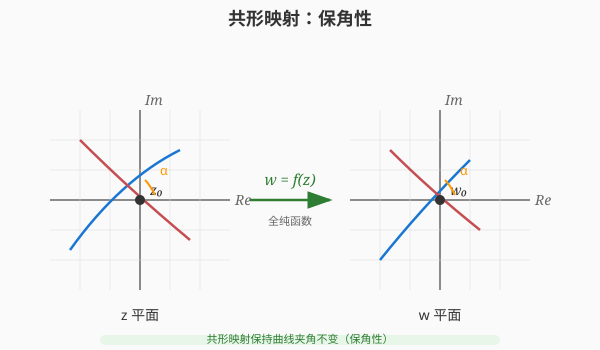

# 第 18 级：复分析 (Complex Analysis)

> 复分析是数学分析的核心分支，研究定义在复数平面上的函数——即复变函数。复分析以其优美的理论和强大的应用著称，其核心在于"可微"这一条件在复数域中远比在实数域中苛刻，从而赋予了复分析函数（全纯函数）极其丰富的性质。本教程从最基础的复数开始，系统介绍复分析的主要理论和方法。

---

## 1. 学习目标

完成本教程后，你应当能够：

1. **熟练掌握复数的代数与几何表示**——理解复平面、极坐标形式、Euler 公式，能够计算复数的幂与根。
2. **理解全纯函数的概念**——掌握 Cauchy-Riemann 方程的推导与证明，能判断函数是否全纯，理解调和函数与全纯函数的关系。
3. **掌握初等复变函数**——理解指数函数、三角函数、对数函数和幂函数在复数域中的定义与性质，理解分支切割的概念。
4. **掌握复积分理论与 Cauchy 积分定理**——理解复积分与曲线积分的关系，掌握 Cauchy 积分定理和 Cauchy 积分公式的证明，能够计算 Cauchy 型积分。
5. **理解级数展开与奇点分类**——掌握 Taylor 级数和 Laurent 级数展开，能分类孤立奇点（可去奇点、极点、本性奇点）。
6. **掌握留数定理及其应用**——理解留数的概念，掌握留数定理的证明，能够利用留数计算实积分。
7. **理解共形映射的基本理论**——掌握 Möbius 变换的性质，理解 Schwarz 引理。
8. **了解解析延拓的基本思想**——了解解析延拓的唯一性原理，初步了解 Riemann zeta 函数。

---

## 〇、复分析导论：发展历史与概念本质

在进入公式之前，先回答三个最关键的问题：**复变函数是怎么来的？复数到底是什么？为什么复分析如此强大？** 本节用最朴素的语言帮你在大脑中建立整体框架。

### 0.1 复分析发展简史

> **💡 一句话概括**：复数是"**为解方程而生的数**"，复分析则是"**把微积分搬到复数平面上之后的美丽新世界**"。

| 时期 | 关键进展 | 代表人物 |
|------|---------|---------|
| **萌芽期（16世纪）** | 为了求解三次、四次方程，数学家不得不承认 $\sqrt{-1}$ 的存在。虽然它"看起来不可能"，但在计算中却神奇地奏效 | 卡丹(Cardano)、邦贝利(Bombelli) |
| **平几化（17-18世纪）** | 沃利斯、欧拉真正开始使用 $i$，发现 $e^{i\theta}=\cos\theta+i\sin\theta$；棣莫弗给出 $(e^{i\theta})^n$ 公式。复数获得了"运算合法性" | 欧拉(Euler)、棣莫弗(de Moivre) |
| **几何化（19世纪初）** | 阿尔冈、高斯用**平面上的点**表示复数，复数从此有了"看得见的家园"——复平面。"虚数"不再虚，而是实实在在的二维对象 | 阿尔冈(Argand)、高斯(Gauss) |
| **分析化（19世纪中叶）** | 柯西建立复微分、复积分、留数理论，把"复变函数可微"这个条件推向极致，诞生了全纯函数理论 | 柯西(Cauchy)、黎曼(Riemann) |
| **几何化巅峰（19世纪后期）** | 黎曼提出 Riemann 曲面、保角映射，把复分析从"平面"推向"曲面"，并催生了 Riemann 猜想 | 黎曼(Riemann)、魏尔斯特拉斯(Weierstrass) |
| **现代（20世纪至今）** | 复分析成为流体力学、电磁学、量子物理、信号处理、数论（Riemann zeta 函数）的基石，并发展出多复变、几何函数论等分支 | 阿达马、帕利、阿尔福斯(Ahlfors) |

> **🔑 历史给我们的启示**：复分析不是空想出来的，而是**从"解方程的现实需求"一步步被逼出来的**。当你不理解一个概念时，回头想想"它当初是为了解决什么问题而诞生的"，往往豁然开朗。

### 0.2 复数到底是什么？——不是"想象的数"

> **💡 直观理解**：复数不是"虚的、假的数"。它实际上是**"带着旋转信息的二维数"**。

- 实数是一维的：只能沿一条直线前进或后退（$+1$ 或 $-1$）。
- 虚数单位 $i$ 的本质是一个**旋转开关**：乘以 $i$ 就逆时针转 $90°$。乘两次 $i$（即 $i^2$）就转 $180°$，正好等于乘以 $-1$。

所以 $i^2 = -1$ 不是"神秘的悖论"，而是"**旋转两次 90° = 旋转 180°**"这个几何事实而已！

$$
\text{乘以 } i: \text{转过 } 90° \quad \Longrightarrow \quad \text{乘以 } i^2 = -1: \text{转过 } 180°
$$

**例**：把 $1$ 乘以 $i$ 得到 $i$（转到正上方），再乘以 $i$ 得到 $-1$（转到负方向）。这就是 $i^2 = -1$ 的几何意义。

> **🔑 现实身份**：复数是一台"能同时描述**大小**（模）和**方向**（辐角）"的机器。任何同时涉及"幅度+相位"、"大小+方向"的现实问题，天然适合用复数表示。

### 0.3 概念速览：用生活例子看穿复分析

下表把复分析的核心概念对应的"本质"和"生活原型"罗列出来，先混个脸熟，学具体章节时再回来对照。

| 概念 | 本质 | 生活原型 |
|------|------|---------|
| **复数** | 带旋转的二维数 | 指南针（长度+指向） |
| **复平面** | 复数的"家" | 地图（横轴=东西，纵轴=南北） |
| **Euler公式 $e^{i\theta}$** | "旋转"与"波浪"的统一 | 旋转木马、正弦波 |
| **单位根** | 均匀切蛋糕 | 时钟的 12 个刻度 |
| **全纯函数** | "可微"到极致、无比光滑 | 没有尖角、没有裂缝的图像 |
| **Cauchy-Riemann方程** | 可微的多重紧箍咒 | 一张必须"横竖伸缩一致"的橡皮膜 |
| **解析延拓** | 沿着已知向外"推" | 从地图一角推出整张地图 |
| **奇点/极点** | 函数"爆炸"的点 | 黑洞、水漩涡中心 |
| **留数** | 奇点"残留的能量" | 漩涡的强度 |
| **留数定理** | 围一圈 = 内部能量总和 | 一圈圈数清池塘里的漩涡 |
| **保角映射** | 只改变大小不改变夹角 | 地图投影、橡皮膜拉伸 |
| **Riemann zeta** | 素数的"密码本" | 统计一百万以内的质数 |

### 0.4 复分析为什么"刚硬而有力量"？

> **💡 直观理解**：实数函数的"可微"很宽松，例如 $|x|$ 几乎所有地方都可导；但**复变函数的"可微"苛刻到令人发指**——只要在一个区域内处处可微，就自动拥有"无穷次可导、能展开成幂级数、被边界值完全确定"等一连串惊人性质。

这就像：**实变函数是"自由的食材"，可塑性极强但也杂乱；复变函数是"极硬的钻石"，一旦定型就处处闪光、密不可摧**。正因为如此"刚硬"，复变函数才极其"可预测"、极其适合用来精确计算。

### 0.5 现实意义：复分析在干什么？

| 领域 | 复分析在做什么 |
|------|--------------|
| **电磁学/电路** | 用复数表示阻抗、交流信号，相位用辐角、幅度用模 |
| **量子力学** | 波函数是复函数，概率是波函数模的平方 $|\psi|^2$ |
| **信号处理/傅里叶分析** | 复指数 $e^{i\omega t}$ 是描述正弦波、频谱的天然语言 |
| **流体力学/空气动力学** | 用保角映射解决机翼绕流问题（儒可夫斯基变换） |
| **控制理论** | 用复平面上的极点位置判断系统是否稳定 |
| **数论** | Riemann zeta 函数研究素数的分布规律 |
| **图像/信号处理** | 复数运算支撑 FFT（快速傅里叶变换） |

> **🔑 一句话总结**：复分析是"**关于旋转、振动和波浪的数学**"。凡是"转、振、波"的地方，就有复分析的身影。

---

## 2. 复数

### 2.1 复数的定义

**定义 (复数)**：复数是一个形如 $z = x + iy$ 的数，其中 $x, y \in \mathbb{R}$，$i$ 是虚数单位，满足 $i^2 = -1$。全体复数的集合记作：

$$
\mathbb{C} = \{ x + iy \mid x, y \in \mathbb{R} \}
$$

其中 $x = \operatorname{Re}(z)$ 称为 $z$ 的**实部**，$y = \operatorname{Im}(z)$ 称为 $z$ 的**虚部**。

**复数的代数运算**：
- 加法：$(x_1 + iy_1) + (x_2 + iy_2) = (x_1 + x_2) + i(y_1 + y_2)$
- 乘法：$(x_1 + iy_1)(x_2 + iy_2) = (x_1x_2 - y_1y_2) + i(x_1y_2 + x_2y_1)$
- 共轭：$\overline{z} = x - iy$
- 模：$|z| = \sqrt{x^2 + y^2}$

**性质**：
- $\overline{z_1 + z_2} = \overline{z_1} + \overline{z_2}$
- $\overline{z_1 z_2} = \overline{z_1} \cdot \overline{z_2}$
- $|z|^2 = z \overline{z}$
- $|z_1 z_2| = |z_1| |z_2|$
- 三角不等式：$|z_1 + z_2| \le |z_1| + |z_2|$
- 反向三角不等式：$||z_1| - |z_2|| \le |z_1 - z_2|$

### 2.2 复平面

复数 $z = x + iy$ 可以与平面上的点 $(x, y)$ 一一对应。这个平面称为**复平面**（或 $z$ 平面），其中 $x$ 轴称为**实轴**，$y$ 轴称为**虚轴**。

**复数的几何解释**：
- 加法对应于向量的平行四边形法则
- 乘法：$z_1 z_2$ 的模等于 $|z_1||z_2|$，辐角等于 $\arg(z_1) + \arg(z_2)$（见下文）

#### 🎬 动画演示：复平面映射

> 动画展示了复平面上的网格在映射 $f(z) = z^2$ 下的变形过程。原始的正交网格（灰色）经过平方映射后变成弯曲的网格（蓝色），单位圆（红色）映射后变成两叶曲线（绿色）。这直观说明了复变函数如何将平面上的点进行变换，是理解保角映射和解析函数几何性质的基础。

> **直观理解（现实类比）**：复平面就是"**给'数'装上坐标**"。每个复数 $z=a+bi$ 是实轴与虚轴平面上的一点，摸到原点的距离叫**模** $|z|$，与实轴的夹角叫**辐角**。这就像**雷达屏上的一个目标**：距离（模）和方位角（辐角）两个数就能定位它。复数的乘法"模相乘、辐角相加"，正是**雷达上角度旋转**的本质。

### 2.3 极坐标形式与辐角

**极坐标表示**：任何非零复数 $z = x + iy$ 可以表示为极坐标形式：

$$
z = r(\cos\theta + i\sin\theta)
$$

其中 $r = |z| = \sqrt{x^2 + y^2}$ 是模，$\theta = \arg(z)$ 是**辐角**，满足 $\tan\theta = y/x$。

辐角不是唯一确定的：若 $\theta$ 是 $z$ 的一个辐角，则 $\theta + 2k\pi$（$k \in \mathbb{Z}$）也是 $z$ 的辐角。通常取 $\theta \in (-\pi, \pi]$ 作为**主辐角**，记作 $\operatorname{Arg}(z)$。

**极坐标下的乘法**：设 $z_1 = r_1(\cos\theta_1 + i\sin\theta_1)$，$z_2 = r_2(\cos\theta_2 + i\sin\theta_2)$，则

$$
z_1 z_2 = r_1 r_2 [\cos(\theta_1 + \theta_2) + i\sin(\theta_1 + \theta_2)]
$$

### 2.4 Euler 公式

**Euler 公式**是复分析中最著名的公式之一：

$$
e^{i\theta} = \cos\theta + i\sin\theta
$$

由此可得复数的**指数形式**：

$$
z = re^{i\theta}
$$

> **直观理解（现实类比）**：Euler 公式说"**转动**就是**乘上一个单位长度的复数**"。$e^{i\theta}$ 是单位圆上辐角为 $\theta$ 的点，它的实部是 $\cos\theta$、虚部是 $\sin\theta$。这就像**钟表只有一根不断转动的指针**：指针的"水平影子"是 $\cos\theta$，"竖直影子"是 $\sin\theta$。特别地，$\theta=\pi$ 时得到 $e^{i\pi}+1=0$——把 $e$、$\pi$、$i$、$1$、$0$ 这五个最重要的常数连成一式。

**Euler 恒等式**：当 $\theta = \pi$ 时，得到

$$
e^{i\pi} + 1 = 0
$$

这个公式将五个最重要的数学常数联系在了一起：$0, 1, e, i, \pi$。

**三角函数的复指数表示**：
$$
\cos\theta = \frac{e^{i\theta} + e^{-i\theta}}{2}, \quad \sin\theta = \frac{e^{i\theta} - e^{-i\theta}}{2i}
$$

**De Moivre 公式**：由 Euler 公式直接可得

$$
(\cos\theta + i\sin\theta)^n = \cos(n\theta) + i\sin(n\theta)
$$

### 2.5 单位根

**定义 (单位根)**：方程 $z^n = 1$ 的 $n$ 个复数解称为 $n$ 次**单位根**：

$$
\omega_k = e^{2\pi i k / n} = \cos\frac{2\pi k}{n} + i\sin\frac{2\pi k}{n}, \quad k = 0, 1, \dots, n-1
$$

**性质**：
- 所有 $n$ 次单位根在复平面上均匀分布在单位圆上
- $\omega_0 = 1$，$\omega_k = \omega_1^k$
- 若 $n$ 为奇数，只有 $1$ 是实根；若 $n$ 为偶数，还有 $-1$ 是实根
- 所有 $n$ 次单位根的和为 $0$：$\sum_{k=0}^{n-1} \omega_k = 0$
- 所有 $n$ 次单位根的乘积为 $(-1)^{n-1}$

**一般形式**：方程 $z^n = a$（$a \neq 0$）的解为 $z = \sqrt[n]{|a|} e^{i(\arg(a) + 2\pi k)/n}$，$k = 0, 1, \dots, n-1$。

---

## 3. 解析函数

### 3.1 复变函数的导数

**定义**：设 $f: U \to \mathbb{C}$ 是定义在开集 $U \subseteq \mathbb{C}$ 上的函数，$z_0 \in U$。若极限

$$
f'(z_0) = \lim_{z \to z_0} \frac{f(z) - f(z_0)}{z - z_0}
$$

存在，则称 $f$ 在 $z_0$ 处**复可微**（或**全纯**）。若 $f$ 在 $U$ 的每一点都复可微，则称 $f$ 在 $U$ 上**全纯**（holomorphic）。

**关键区别**：与实可微不同，复可微要求极限与 $z \to z_0$ 的方式无关。这意味着 $z$ 可以从任意方向趋近 $z_0$，极限都必须存在且相等。这一苛刻条件使得全纯函数具有极其丰富的性质。

### 3.2 Cauchy-Riemann 方程

**定理 (Cauchy-Riemann 方程)**：设 $f(z) = u(x, y) + iv(x, y)$ 在 $z_0 = x_0 + iy_0$ 处可微，则 $f$ 在 $z_0$ 处复可微当且仅当 $u$ 和 $v$ 在 $(x_0, y_0)$ 处可微且满足：

$$
\frac{\partial u}{\partial x} = \frac{\partial v}{\partial y}, \quad \frac{\partial u}{\partial y} = -\frac{\partial v}{\partial x}
$$

**证明**：
($\Rightarrow$) 设 $f'(z_0)$ 存在。考虑沿实轴方向 $z \to z_0$，即 $z = z_0 + h$（$h \in \mathbb{R}$）：

$$
\begin{aligned}
f'(z_0) &= \lim_{h \to 0} \frac{f(z_0 + h) - f(z_0)}{h} \\
&= \lim_{h \to 0} \frac{u(x_0 + h, y_0) - u(x_0, y_0)}{h} + i \lim_{h \to 0} \frac{v(x_0 + h, y_0) - v(x_0, y_0)}{h} \\
&= \frac{\partial u}{\partial x}(x_0, y_0) + i \frac{\partial v}{\partial x}(x_0, y_0)
\end{aligned}
$$

再考虑沿虚轴方向 $z = z_0 + ih$（$h \in \mathbb{R}$）：

$$
\begin{aligned}
f'(z_0) &= \lim_{h \to 0} \frac{f(z_0 + ih) - f(z_0)}{ih} \\
&= \lim_{h \to 0} \frac{u(x_0, y_0 + h) - u(x_0, y_0)}{ih} + i \lim_{h \to 0} \frac{v(x_0, y_0 + h) - v(x_0, y_0)}{ih} \\
&= \frac{1}{i} \frac{\partial u}{\partial y}(x_0, y_0) + \frac{\partial v}{\partial y}(x_0, y_0) \\
&= \frac{\partial v}{\partial y}(x_0, y_0) - i \frac{\partial u}{\partial y}(x_0, y_0)
\end{aligned}
$$

由于两个方向的极限必须相等，比较实部和虚部即得：

$$
\frac{\partial u}{\partial x} = \frac{\partial v}{\partial y}, \quad \frac{\partial v}{\partial x} = -\frac{\partial u}{\partial y}
$$

($\Leftarrow$) 反之，若 $u, v$ 可微且满足 C-R 方程，则通过 $f(z) - f(z_0)$ 的线性逼近可证 $f'(z_0)$ 存在。$\square$

**推论**：若 $f$ 全纯，则

$$
f'(z) = \frac{\partial u}{\partial x} + i \frac{\partial v}{\partial x} = \frac{\partial v}{\partial y} - i \frac{\partial u}{\partial y}
$$

**示例**：判断 $f(z) = \overline{z} = x - iy$ 是否全纯。
解：$u(x,y) = x$，$v(x,y) = -y$。则 $\partial u/\partial x = 1$，$\partial v/\partial y = -1$，C-R 方程不成立（除非在局部退化情形），故 $f(z) = \overline{z}$ 处处不可微（非全纯）。

### 3.3 复可微与实可微的关系

使用 Wirtinger 导数可以更简洁地表达 C-R 方程：

$$
\frac{\partial}{\partial z} = \frac{1}{2}\left(\frac{\partial}{\partial x} - i\frac{\partial}{\partial y}\right), \quad
\frac{\partial}{\partial \overline{z}} = \frac{1}{2}\left(\frac{\partial}{\partial x} + i\frac{\partial}{\partial y}\right)
$$

则 C-R 方程等价于 $\partial f/\partial \overline{z} = 0$，即 $f$ 与 $\overline{z}$ 无关。此时 $f' = \partial f/\partial z$。

### 3.4 调和函数

**定义 (调和函数)**：若实值函数 $\phi(x, y)$ 满足 **Laplace 方程**：

$$
\Delta \phi = \frac{\partial^2 \phi}{\partial x^2} + \frac{\partial^2 \phi}{\partial y^2} = 0
$$

则称 $\phi$ 为**调和函数**。

**定理**：若 $f(z) = u + iv$ 是全纯函数，则 $u$ 和 $v$ 都是调和函数。

**证明**：由 C-R 方程，$\partial u/\partial x = \partial v/\partial y$，$\partial u/\partial y = -\partial v/\partial x$。对第一个方程求 $x$ 的偏导，第二个方程求 $y$ 的偏导：

$$
\frac{\partial^2 u}{\partial x^2} = \frac{\partial^2 v}{\partial x \partial y}, \quad
\frac{\partial^2 u}{\partial y^2} = -\frac{\partial^2 v}{\partial y \partial x}
$$

由于混合偏导数相等（假设 $f$ 二次连续可微），相加得 $\partial^2 u/\partial x^2 + \partial^2 u/\partial y^2 = 0$。同理可证 $v$ 也是调和的。$\square$

**定义 (共轭调和函数)**：若 $u$ 和 $v$ 是调和函数且满足 C-R 方程，则称 $v$ 是 $u$ 的**共轭调和函数**。

**示例**：求 $u(x,y) = x^2 - y^2$ 的共轭调和函数。
解：$\partial u/\partial x = 2x$，$\partial u/\partial y = -2y$。由 C-R 方程，$\partial v/\partial y = 2x$，$\partial v/\partial x = 2y$。对 $\partial v/\partial y = 2x$ 积分得 $v = 2xy + \phi(x)$，代入 $\partial v/\partial x = 2y + \phi'(x) = 2y$，得 $\phi'(x) = 0$，故 $\phi(x) = C$。取 $C = 0$，得 $v = 2xy$。于是 $f(z) = (x^2 - y^2) + i(2xy) = z^2$。

---

## 4. 初等复变函数

### 4.1 指数函数

**定义**：复指数函数定义为

$$
e^z = e^{x+iy} = e^x(\cos y + i\sin y)
$$

**性质**：
- $e^{z_1 + z_2} = e^{z_1} e^{z_2}$
- $e^z \neq 0$ 对所有 $z \in \mathbb{C}$ 成立
- $|e^z| = e^x$
- $\arg(e^z) = y + 2k\pi$
- $e^z$ 是周期函数，周期为 $2\pi i$：$e^{z + 2\pi i} = e^z$
- $(e^z)' = e^z$

### 4.2 三角函数

**定义**：由 Euler 公式推广，定义复三角函数：

$$
\sin z = \frac{e^{iz} - e^{-iz}}{2i}, \quad \cos z = \frac{e^{iz} + e^{-iz}}{2}
$$

**性质**：
- $\sin^2 z + \cos^2 z = 1$
- $\sin(z_1 + z_2) = \sin z_1 \cos z_2 + \cos z_1 \sin z_2$
- $\cos(z_1 + z_2) = \cos z_1 \cos z_2 - \sin z_1 \sin z_2$
- $(\sin z)' = \cos z$，$(\cos z)' = -\sin z$
- $\sin z$ 和 $\cos z$ 以 $2\pi$ 为周期
- 复三角函数**无界**：例如 $\sin(iy) = i\sinh y$，当 $y \to \infty$ 时趋于无穷

**双曲函数**：

$$
\sinh z = \frac{e^z - e^{-z}}{2}, \quad \cosh z = \frac{e^z + e^{-z}}{2}
$$

关系：$\sin(iz) = i\sinh z$，$\cos(iz) = \cosh z$。

### 4.3 对数函数

**定义**：复对数函数是指数函数的反函数。若 $e^w = z$，则称 $w$ 为 $z$ 的**对数**，记作 $w = \log z$。

由于 $e^w$ 是周期函数（周期 $2\pi i$），复对数函数是多值函数：

$$
\log z = \ln|z| + i(\arg z + 2k\pi), \quad k \in \mathbb{Z}
$$

**主值**：取 $\arg z$ 的主值 $\operatorname{Arg}(z) \in (-\pi, \pi]$，得到**主值对数**：

$$
\operatorname{Log} z = \ln|z| + i\operatorname{Arg}(z)
$$

**性质**：
- $\log(z_1 z_2) = \log z_1 + \log z_2$（多值意义下）
- $\operatorname{Log} z$ 在负实轴（包括原点）上不连续
- $\frac{d}{dz} \operatorname{Log} z = \frac{1}{z}$（在 $\mathbb{C} \setminus (-\infty, 0]$ 上）

### 4.4 分支切割

**定义 (分支切割)**：为使多值函数变为单值函数，我们在复平面上引入一条切割线，限制辐角的取值范围。这条切割线称为**分支切割**（branch cut）。

**对数函数的分支切割**：通常取负实轴作为分支切割，此时 $\operatorname{Arg}(z) \in (-\pi, \pi]$。也可选择其他射线作为切割。

**示例**：$\operatorname{Log} z$ 在负实轴上的跳跃：
- 从上方趋近负实轴：$\operatorname{Arg}(z) \to \pi$
- 从下方趋近负实轴：$\operatorname{Arg}(z) \to -\pi$
- 跳跃值为 $2\pi i$

### 4.5 幂函数

**定义**：对于 $a \in \mathbb{C}$，定义

$$
z^a = e^{a \log z}
$$

由于 $\log z$ 的多值性，$z^a$ 通常是多值函数。

**特殊情况**：
- 若 $a = n \in \mathbb{Z}$，$z^n = e^{n\log z} = |z|^n e^{in\arg z}$，是单值函数
- 若 $a = 1/n$，$z^{1/n} = e^{\frac{1}{n}\log z} = \sqrt[n]{|z|} e^{i(\arg z + 2\pi k)/n}$，有 $n$ 个分支

---

## 5. 复积分

### 5.1 复积分定义

**定义**：设 $\gamma: [a, b] \to \mathbb{C}$ 是一条可求长曲线，$f(z)$ 在 $\gamma$ 上连续。$f$ 沿 $\gamma$ 的**复积分**定义为

$$
\int_\gamma f(z) \, dz = \int_a^b f(\gamma(t)) \gamma'(t) \, dt
$$

**与实积分的关系**：若 $f = u + iv$，$dz = dx + idy$，则

$$
\int_\gamma f(z) \, dz = \int_\gamma (u \, dx - v \, dy) + i \int_\gamma (v \, dx + u \, dy)
$$

**性质**：
- 线性性：$\int_\gamma (af + bg) \, dz = a\int_\gamma f \, dz + b\int_\gamma g \, dz$
- 方向性：$\int_{-\gamma} f \, dz = -\int_\gamma f \, dz$
- 估计不等式：$\left|\int_\gamma f(z) \, dz\right| \le \int_\gamma |f(z)| \, |dz| \le \max_{z \in \gamma} |f(z)| \cdot L(\gamma)$，其中 $L(\gamma)$ 是 $\gamma$ 的长度

**示例**：计算 $\int_C \overline{z} \, dz$，其中 $C$ 是从 $0$ 到 $1 + i$ 的直线段。
解：参数化 $z(t) = t + it$，$t \in [0, 1]$，$dz = (1 + i)dt$，$\overline{z} = t - it = t(1 - i)$，则

$$
\int_C \overline{z} \, dz = \int_0^1 t(1-i)(1+i) \, dt = \int_0^1 2t \, dt = 1
$$

### 5.2 Cauchy 积分定理

> **直观理解（现实类比）**：Cauchy 积分定理说"**全纯函数在单连通区域内没有'源'或'汇'**"。就像在一个没有水源也没有排水口的平静湖面上，无论你沿着什么闭合路径划船，水流的总效应都是零。全纯函数太"光滑"、太"规则"了，它的积分只取决于起点和终点，与路径无关。这就是为什么围道积分会等于零——你绕了一圈回到原点，积累的效应完全抵消。

> **定理 (Cauchy 积分定理)**：设 $f$ 在单连通区域 $D$ 上全纯，$\gamma$ 是 $D$ 中的一条闭合可求长曲线，则

$$
\oint_\gamma f(z) \, dz = 0
$$

**证明 (Goursat 版本)**：先考虑 $\gamma$ 为三角形 $\Delta$ 的情形。将 $\Delta$ 反复细分为更小的三角形。假设 $\left|\int_\Delta f(z) dz\right| > 0$，则存在子三角形序列 $\Delta_n$ 使得

$$
\left|\int_{\Delta_n} f(z) \, dz\right| \ge \frac{1}{4^n} \left|\int_\Delta f(z) \, dz\right|
$$

且 $\Delta_n$ 收缩到某点 $z_0$。由全纯函数的定义，在 $z_0$ 附近有 $f(z) = f(z_0) + f'(z_0)(z - z_0) + \varepsilon(z)(z - z_0)$，其中 $\varepsilon(z) \to 0$ 当 $z \to z_0$。则

$$
\int_{\Delta_n} f(z) \, dz = \int_{\Delta_n} [f(z_0) + f'(z_0)(z - z_0)] \, dz + \int_{\Delta_n} \varepsilon(z)(z - z_0) \, dz
$$

第一项积分为 $0$（因为 $1$ 和 $z$ 沿闭合路径的积分为 $0$）。对第二项进行估计可得矛盾，故 $\int_\Delta f(z) dz = 0$。

对于一般曲线，可以通过多边形逼近来证明。$\square$

**推论 (原函数定理)**：若 $f$ 在单连通区域 $D$ 上全纯，则 $f$ 在 $D$ 上存在原函数，且积分与路径无关。

### 5.3 Cauchy 积分公式

> **定理 (Cauchy 积分公式)**：设 $f$ 在单连通区域 $D$ 上全纯，$\gamma$ 是 $D$ 中一条正向简单闭曲线，其内部区域包含于 $D$。则对 $\gamma$ 内部的任意点 $z_0$，

$$
f(z_0) = \frac{1}{2\pi i} \oint_\gamma \frac{f(z)}{z - z_0} \, dz
$$

**证明**：考虑以 $z_0$ 为圆心、$\varepsilon$ 为半径的小圆 $C_\varepsilon$，方向为正向。由 Cauchy 积分定理（推广到多连通区域），

$$
\oint_\gamma \frac{f(z)}{z - z_0} \, dz = \oint_{C_\varepsilon} \frac{f(z)}{z - z_0} \, dz
$$

在 $C_\varepsilon$ 上，$z = z_0 + \varepsilon e^{i\theta}$，$dz = i\varepsilon e^{i\theta} d\theta$，所以

$$
\begin{aligned}
\oint_{C_\varepsilon} \frac{f(z)}{z - z_0} \, dz &= \int_0^{2\pi} \frac{f(z_0 + \varepsilon e^{i\theta})}{\varepsilon e^{i\theta}} \cdot i\varepsilon e^{i\theta} \, d\theta \\
&= i \int_0^{2\pi} f(z_0 + \varepsilon e^{i\theta}) \, d\theta
\end{aligned}
$$

令 $\varepsilon \to 0$，由连续性 $f(z_0 + \varepsilon e^{i\theta}) \to f(z_0)$，得

$$
\oint_\gamma \frac{f(z)}{z - z_0} \, dz = i \cdot 2\pi f(z_0) = 2\pi i f(z_0)
$$

两边除以 $2\pi i$ 即得公式。$\square$

**均值性质**：由 Cauchy 积分公式可得，全纯函数在圆心的值等于其在圆周上的平均值：

$$
f(z_0) = \frac{1}{2\pi} \int_0^{2\pi} f(z_0 + re^{i\theta}) \, d\theta
$$

### 5.4 Cauchy 高阶导数公式

> **定理 (Cauchy 导数公式)**：若 $f$ 在单连通区域 $D$ 上全纯，则 $f$ 在 $D$ 上无穷次可微，且

$$
f^{(n)}(z_0) = \frac{n!}{2\pi i} \oint_\gamma \frac{f(z)}{(z - z_0)^{n+1}} \, dz
$$

**证明**：对 $n = 1$，由 Cauchy 积分公式：

$$
f'(z_0) = \lim_{h \to 0} \frac{f(z_0 + h) - f(z_0)}{h} = \lim_{h \to 0} \frac{1}{2\pi i} \oint_\gamma f(z) \left[\frac{1}{z - z_0 - h} - \frac{1}{z - z_0}\right] \frac{dz}{h}
$$

化简括号内项：

$$
\frac{1}{z - z_0 - h} - \frac{1}{z - z_0} = \frac{h}{(z - z_0)(z - z_0 - h)}
$$

因此

$$
f'(z_0) = \frac{1}{2\pi i} \oint_\gamma \frac{f(z)}{(z - z_0)^2} \, dz
$$

一般情况通过归纳法可得。$\square$

> **定理 (Liouville)**：设 $f$ 是整函数（在整个 $\mathbb{C}$ 上全纯）。若 $f$ 有界，即存在 $M > 0$ 使得 $|f(z)| \le M$ 对所有 $z \in \mathbb{C}$ 成立，则 $f$ 必为常数。

**证明**：对任意 $z_0$，取 $\gamma$ 为以 $z_0$ 为圆心、$R$ 为半径的圆周。由 Cauchy 导数公式：

$$
|f'(z_0)| = \left|\frac{1}{2\pi i} \oint_\gamma \frac{f(z)}{(z - z_0)^2} \, dz\right| \le \frac{1}{2\pi} \cdot \frac{M}{R^2} \cdot 2\pi R = \frac{M}{R}
$$

令 $R \to \infty$，得 $f'(z_0) = 0$。由于 $z_0$ 任意，故 $f$ 为常数。$\square$

> **💡 直观理解**：Liouville 定理说"**在无限大的平面上散步，只要走不到无穷远（有界），就根本动不了（是常数）**"。全纯函数在复平面上"刚硬"到不能有界而不恒定——这是复分析"刚性"的绝佳体现。

**代数基本定理**：任何非常数的复系数多项式在 $\mathbb{C}$ 中至少有一个根。这是 Liouville 定理的直接推论。

**证明**：设 $p(z) = a_n z^n + \cdots + a_0$（$a_n \neq 0$，$n \ge 1$）在 $\mathbb{C}$ 上无根。则 $1/p$ 是整函数，且当 $|z| \to \infty$ 时 $|1/p(z)| \to 0$，故 $1/p$ 有界。由 Liouville 定理，$1/p$ 为常数，矛盾。$\square$

### 5.5 Cauchy 不等式与最大模原理

> **定理 (Cauchy 不等式)**：设 $f$ 在闭圆盘 $\overline{D}(z_0, R)$ 上全纯，$|f(z)| \le M$ 在圆周 $|z - z_0| = R$ 上成立。则
> $$
> |f^{(n)}(z_0)| \le \frac{n! \, M}{R^n}
> $$

**证明**：由 Cauchy 高阶导数公式 $f^{(n)}(z_0) = \frac{n!}{2\pi i}\oint_\gamma \frac{f(z)}{(z - z_0)^{n+1}} dz$，取 $\gamma$ 为圆周 $|z - z_0| = R$，则 $|f^{(n)}(z_0)| \le \frac{n!}{2\pi} \cdot \frac{M}{R^{n+1}} \cdot 2\pi R = \frac{n!M}{R^n}$。$\square$

> **定理 (最大模原理)**：设 $f$ 在区域 $D$ 内全纯（或在其闭包上连续）。若 $|f|$ 在 $D$ 内取得最大值（即存在 $z_0 \in D$ 使 $|f(z_0)| \ge |f(z)|$ 对所有 $z \in D$ 成立），则 $f$ 在 $D$ 内为常数。

**证明（概要）**：设 $z_0$ 是 $|f|$ 的最大值点。取以 $z_0$ 为圆心、包含于 $D$ 的圆盘，由 Cauchy 积分公式 $f(z_0) = \frac{1}{2\pi i}\oint f(\zeta)/(\zeta - z_0) d\zeta$，取模并用 $|f| \le |f(z_0)|$ 估计，可得等号必然处处成立，从而 $f$ 在 $z_0$ 邻域内为常数。再由唯一性原理延拓到整个连通区域 $D$。$\square$

> **💡 直观理解**：最大模原理说"**全纯函数的模长最大值一定出现在边界上，不会出现在内部**"。就像一张"只能下凸、不能有内部尖峰"的曲面，内部永远是"安静"的，最有影响力的"峰"只能在边缘。这解释了为什么 Schwarz 引理、Rouche 定理等都以它为基石。

**推论**：若 $D$ 是有界区域，$f$ 在 $D$ 上全纯、在 $\overline{D}$ 上连续，则 $|f|$ 在 $\partial D$ 上取得最大值。

### 5.6 解析函数的零点

**定义**：$z_0$ 称为全纯函数 $f$ 的**零点**，如果 $f(z_0) = 0$。若 $f$ 在 $z_0$ 附近可写为 $f(z) = (z - z_0)^m g(z)$，其中 $g(z_0) \neq 0$，则称 $z_0$ 是 $m$ 阶零点（重数 $m$）。

**定理 (零点的孤立性)**：设 $f$ 在区域 $D$ 上全纯且不恒为零。若 $z_0 \in D$ 是 $f$ 的零点，则存在 $z_0$ 的邻域使其为 $f$ 唯一的零点（即零点彼此"孤立"）。

**证明**：设 $z_0$ 是 $m$ 阶零点，$f(z) = a_m(z - z_0)^m + \cdots$（$a_m \neq 0$）。对充分小的 $\varepsilon$，在 $0 < |z - z_0| < \varepsilon$ 内 $f(z) = (z - z_0)^m g(z)$ 且 $g(z) \neq 0$，故 $f(z) \neq 0$。$\square$

**推论 (零点有限性)**：在不恒为零的全纯函数的可数紧子集上，零点只能以孤立方式出现；特别地，区域内的非零全纯函数在任意紧子集上只有有限多个零点。

> **💡 直观理解**：零点的孤立性说明"**全纯函数的根不能挤在一起**"。这直接导致唯一性原理：两个全纯函数只要在一串有聚点的点上相等，就处处相等——因为差函数的零点若不离散，就必然恒为零。

---

## 6. 级数

### 6.1 幂级数

**定义**：形如 $\sum_{n=0}^{\infty} a_n (z - z_0)^n$ 的级数称为**幂级数**。

**收敛半径**：存在 $R \in [0, \infty]$（称为**收敛半径**），使得：
- 当 $|z - z_0| < R$ 时，级数绝对收敛
- 当 $|z - z_0| > R$ 时，级数发散

**Cauchy-Hadamard 公式**：收敛半径可由系数计算：

$$
\frac{1}{R} = \limsup_{n \to \infty} \sqrt[n]{|a_n|}
$$

**性质**：幂级数在其收敛圆内定义了一个全纯函数，且可以逐项求导和逐项积分。

### 6.2 Taylor 级数

> **定理 (Taylor 展开)**：若 $f$ 在 $|z - z_0| < R$ 上全纯，则 $f$ 可展开为 Taylor 级数：

$$
f(z) = \sum_{n=0}^{\infty} \frac{f^{(n)}(z_0)}{n!} (z - z_0)^n, \quad |z - z_0| < R
$$

**示例**：
- $e^z = \sum_{n=0}^{\infty} \frac{z^n}{n!}$，$R = \infty$
- $\frac{1}{1 - z} = \sum_{n=0}^{\infty} z^n$，$R = 1$
- $\sin z = \sum_{n=0}^{\infty} \frac{(-1)^n}{(2n+1)!} z^{2n+1}$，$R = \infty$
- $\cos z = \sum_{n=0}^{\infty} \frac{(-1)^n}{(2n)!} z^{2n}$，$R = \infty$
- $\operatorname{Log}(1 + z) = \sum_{n=1}^{\infty} \frac{(-1)^{n-1}}{n} z^n$，$R = 1$

### 6.3 Laurent 级数

> **定理 (Laurent 展开)**：若 $f$ 在环形区域 $A = \{z \mid r < |z - z_0| < R\}$ 上全纯，则 $f$ 可展开为 Laurent 级数：

$$
f(z) = \sum_{n=-\infty}^{\infty} a_n (z - z_0)^n
$$

其中系数

$$
a_n = \frac{1}{2\pi i} \oint_\gamma \frac{f(z)}{(z - z_0)^{n+1}} \, dz
$$

$\gamma$ 是 $A$ 中任一环绕 $z_0$ 的正向简单闭曲线。

Laurent 级数包含两部分：
- **正则部分**：$\sum_{n=0}^{\infty} a_n (z - z_0)^n$（非负幂次）
- **主要部分**：$\sum_{n=-\infty}^{-1} a_n (z - z_0)^n$（负幂次）

**示例**：求 $f(z) = \frac{1}{z(1 - z)}$ 在 $0 < |z| < 1$ 中的 Laurent 展开。

$$
\frac{1}{z(1 - z)} = \frac{1}{z} \cdot \frac{1}{1 - z} = \frac{1}{z} \sum_{n=0}^{\infty} z^n = \sum_{n=-1}^{\infty} z^n = \frac{1}{z} + 1 + z + z^2 + \cdots
$$

### 6.4 孤立奇点的分类

**定义**：若 $f$ 在 $z_0$ 的某个去心邻域 $0 < |z - z_0| < \delta$ 内全纯，但在 $z_0$ 处不解析，则称 $z_0$ 为 $f$ 的**孤立奇点**。

根据 Laurent 展开中主要部分的行为，孤立奇点分为三类：

**1. 可去奇点**：若 Laurent 展开中所有负幂次项的系数均为 $0$（即主要部分消失）。此时 $\lim_{z \to z_0} f(z)$ 存在有限，可重新定义 $f(z_0)$ 使 $f$ 全纯。

**示例**：$f(z) = \frac{\sin z}{z}$ 在 $z = 0$ 处有可去奇点，因为 $\frac{\sin z}{z} = 1 - \frac{z^2}{3!} + \cdots$。

**2. 极点**：若 Laurent 展开中只有有限个负幂次项，即存在 $m \ge 1$ 使得 $a_{-m} \neq 0$ 且 $a_{-k} = 0$ 对所有 $k > m$ 成立。$m$ 称为极点的**阶**。此时 $\lim_{z \to z_0} f(z) = \infty$。

**示例**：$f(z) = \frac{1}{(z-1)^2(z-2)}$ 在 $z = 1$ 处有二阶极点，在 $z = 2$ 处有一阶极点（单极点）。

**3. 本性奇点**：若 Laurent 展开中有无穷多个负幂次项的系数非零。此时 $\lim_{z \to z_0} f(z)$ 不存在（也不为 $\infty$）。

**示例**：$f(z) = e^{1/z}$ 在 $z = 0$ 处有本性奇点，因为 $e^{1/z} = \sum_{n=0}^{\infty} \frac{1}{n!} z^{-n}$。

**Weierstrass-Casorati 定理**：若 $z_0$ 是 $f$ 的本性奇点，则对任意 $w \in \mathbb{C}$，存在序列 $z_n \to z_0$ 使得 $f(z_n) \to w$。也就是说，$f$ 在本性奇点的任意邻域内的像在 $\mathbb{C}$ 中稠密。

> **直观理解（现实类比）**：三种奇点对应三种"**漏洞**"。**可去奇点**像**扫码时偶尔的黑点**——补一下就能擦掉（重新定义函数值即可）；**极点**像**水管破洞**——函数值"冲"向无穷大（如 $1/z$ 在 0 处）；**本性奇点**像**滚烫的火山口**——函数在附近剧烈震荡，几乎每个值都出现（如 $e^{1/z}$）。判断方法看 Laurent 展开里负幂项：没有的是可去、有限个是极点、无穷多个是本性奇点。

---

## 7. 留数定理

### 7.1 留数的定义

**定义**：设 $z_0$ 是 $f$ 的孤立奇点，$f$ 在 $z_0$ 附近有 Laurent 展开 $\sum_{n=-\infty}^{\infty} a_n (z - z_0)^n$。则 $a_{-1}$ 称为 $f$ 在 $z_0$ 处的**留数**，记作 $\operatorname{Res}(f, z_0)$。

由 Laurent 系数的公式：

$$
\operatorname{Res}(f, z_0) = a_{-1} = \frac{1}{2\pi i} \oint_\gamma f(z) \, dz
$$

其中 $\gamma$ 是环绕 $z_0$ 的充分小的正向简单闭曲线。

**留数的计算**：
- 若 $z_0$ 是一阶极点，则 $\operatorname{Res}(f, z_0) = \lim_{z \to z_0} (z - z_0) f(z)$
- 若 $z_0$ 是 $m$ 阶极点，则

$$
\operatorname{Res}(f, z_0) = \frac{1}{(m-1)!} \lim_{z \to z_0} \frac{d^{m-1}}{dz^{m-1}} \left[(z - z_0)^m f(z)\right]
$$

- 若 $f(z) = \frac{g(z)}{h(z)}$，其中 $g(z_0) \neq 0$，$h(z_0) = 0$，$h'(z_0) \neq 0$（一阶零点），则 $\operatorname{Res}(f, z_0) = \frac{g(z_0)}{h'(z_0)}$

### 7.2 留数定理

> **直观理解（现实类比）**：留数定理说"**围道积分 = 2πi × 内部奇点的留数总和**"。就像你在池塘里撒下一张网（围道γ），网里有多少鱼（奇点），每条鱼有多重（留数），一网打尽后就能算出总重量。全纯函数在奇点处"爆炸"，留下一些"残留的能量"（留数），围道积分就是在测量这些能量的总和。这是复分析最强大的计算工具之一。

> **定理 (留数定理)**：设 $f$ 在单连通区域 $D$ 中除了有限个孤立奇点 $z_1, z_2, \dots, z_n$ 外全纯，$\gamma$ 是 $D$ 中一条正向简单闭曲线，包围所有这些奇点。则

$$
\oint_\gamma f(z) \, dz = 2\pi i \sum_{k=1}^{n} \operatorname{Res}(f, z_k)
$$

**证明**：在每个奇点 $z_k$ 周围作充分小的正向圆周 $\gamma_k$，使得这些圆周互不相交且都包含在 $\gamma$ 内部。由 Cauchy 积分定理（多连通区域版本）：

$$
\oint_\gamma f(z) \, dz = \sum_{k=1}^{n} \oint_{\gamma_k} f(z) \, dz
$$

由留数的定义，$\oint_{\gamma_k} f(z) \, dz = 2\pi i \operatorname{Res}(f, z_k)$。代入即得结论。$\square$

### 7.3 利用留数计算实积分

留数定理是计算实积分的有力工具。以下是一些常见类型：

**类型 I**：$\int_{-\infty}^{\infty} \frac{P(x)}{Q(x)} \, dx$，其中 $P, Q$ 是多项式，$\deg Q - \deg P \ge 2$，且 $Q(x) \neq 0$ 对 $x \in \mathbb{R}$ 成立。

方法：考虑上半平面的半圆围道，利用留数定理。

$$
\int_{-\infty}^{\infty} \frac{P(x)}{Q(x)} \, dx = 2\pi i \sum_{\operatorname{Im}(z_k) > 0} \operatorname{Res}\left(\frac{P}{Q}, z_k\right)
$$

**示例**：计算 $\int_{-\infty}^{\infty} \frac{dx}{x^2 + 1}$。

解：$f(z) = \frac{1}{z^2 + 1} = \frac{1}{(z - i)(z + i)}$，在上半平面有奇点 $z = i$（一阶极点）。

$$
\operatorname{Res}(f, i) = \lim_{z \to i} (z - i) \cdot \frac{1}{(z - i)(z + i)} = \frac{1}{2i}
$$

故 $\int_{-\infty}^{\infty} \frac{dx}{x^2 + 1} = 2\pi i \cdot \frac{1}{2i} = \pi$。

**类型 II**：$\int_0^{2\pi} R(\cos\theta, \sin\theta) \, d\theta$，其中 $R$ 是有理函数。

方法：令 $z = e^{i\theta}$，则 $\cos\theta = \frac{z + z^{-1}}{2}$，$\sin\theta = \frac{z - z^{-1}}{2i}$，$d\theta = \frac{dz}{iz}$，积分化为单位圆上的围道积分。

**类型 III**：$\int_{-\infty}^{\infty} \frac{P(x)}{Q(x)} e^{iax} \, dx$（$a > 0$），其中 $P, Q$ 是多项式，$\deg Q - \deg P \ge 1$。

### 7.4 Jordan 引理

> **引理 (Jordan)**：设 $f(z)$ 在上半平面 $|z| > R_0$ 上连续，且当 $|z| \to \infty$ 时 $f(z) \to 0$ 一致地关于 $\arg z \in [0, \pi]$。则对 $a > 0$，

$$
\lim_{R \to \infty} \int_{C_R} f(z) e^{iaz} \, dz = 0
$$

其中 $C_R$ 是上半平面的半圆弧 $z = Re^{i\theta}$，$\theta \in [0, \pi]$。

**示例**：计算 $\int_{-\infty}^{\infty} \frac{\cos x}{x^2 + 1} \, dx$。

解：考虑 $\int_{-\infty}^{\infty} \frac{e^{ix}}{x^2 + 1} \, dx$。$f(z) = \frac{e^{iz}}{z^2 + 1}$ 在上半平面有奇点 $z = i$。

$$
\operatorname{Res}\left(\frac{e^{iz}}{z^2 + 1}, i\right) = \frac{e^{i \cdot i}}{2i} = \frac{e^{-1}}{2i}
$$

由 Jordan 引理，半圆弧上的积分趋于 $0$，故

$$
\int_{-\infty}^{\infty} \frac{e^{ix}}{x^2 + 1} \, dx = 2\pi i \cdot \frac{e^{-1}}{2i} = \frac{\pi}{e}
$$

取实部得 $\int_{-\infty}^{\infty} \frac{\cos x}{x^2 + 1} \, dx = \frac{\pi}{e}$。

### 7.5 幅角原理与 Rouché 定理

> **定理 (幅角原理)**：设 $f$ 在简单闭曲线 $\gamma$ 内部及其上除有限个极点外全纯，且在 $\gamma$ 上无零点、无极点。则
> $$
> \frac{1}{2\pi i} \oint_\gamma \frac{f'(z)}{f(z)} \, dz = N - P
> $$
> 其中 $N$ 是 $f$ 在 $\gamma$ 内部的零点个数（计重数），$P$ 是极点的个数（计阶数）。

**证明（概要）**：$f'/f$ 的奇点只可能是 $f$ 的零点或极点。若 $f$ 在 $z_0$ 有 $m$ 阶零点，则 $f = (z - z_0)^m g$（$g(z_0) \neq 0$），故 $f'/f = m/(z - z_0) + g'/g$，留数为 $m$；若 $f$ 在 $z_0$ 有 $p$ 阶极点，则留数为 $-p$。由留数定理对 $\gamma$ 内部所有奇点求和即得 $N - P$。$\square$

**物理意义**：$\frac{1}{2\pi i}\oint f'/f \, dz$ 正是 $f(\gamma)$ 绕原点的**卷绕数**（Winding number）。故幅角原理说"**$f$ 把 $\gamma$ 映射成的闭曲线绕原点转了几圈，等于内部零点数与极点数之差**"。

> **定理 (Rouché)**：设 $f, g$ 在简单闭曲线 $\gamma$ 上及其内部全纯，且在 $\gamma$ 上满足 $|f(z)| > |g(z)|$。则 $f$ 与 $f + g$ 在 $\gamma$ 内部有相同个数的零点（计重数）。

**证明**：在 $\gamma$ 上，$|g/f| < 1$，故 $f + g = f(1 + g/f)$ 在 $\gamma$ 上无零点，且 $1 + g/f$ 的像不绕原点（恒在 $|z| = 1$ 的圆盘内）。由幅角原理，$f + g$ 与 $f$ 的零点数之差为 $0$。$\square$

> **💡 直观理解**：Rouché 定理说"**如果 $g$ 在边界上比 $f$ '小声'得多，那么给 $f$ 加上这个小扰动 $g$，不会改变根的个数**"。就像在一支大乐队里加一个很轻的伴奏，调子（根的个数）不会变。它是判断多项式在指定区域内根个数的利器。

**例**：证明 $z^5 + 3z + 1$ 在单位圆 $|z| < 1$ 内恰有 1 个根。

解：取 $f(z) = 3z$，$g(z) = z^5 + 1$。在 $|z| = 1$ 上，$|g(z)| \le |z|^5 + 1 = 2 < 3 = |f(z)|$。由 Rouché 定理，$f = 3z$ 与 $f + g = z^5 + 3z + 1$ 在单位圆内有相同零点数。而 $3z$ 在 $|z| < 1$ 内恰有 1 个零点，故原多项式恰有 1 个根。$\square$

---

## 8. 共形映射

### 8.1 共形映射的概念

**定义 (共形映射)**：若 $f$ 在 $z_0$ 处全纯且 $f'(z_0) \neq 0$，则称 $f$ 在 $z_0$ 处是**共形**（保角）的。这意味着 $f$ 在 $z_0$ 附近保持曲线的夹角（大小和方向）不变。

**几何意义**：设两条曲线 $\gamma_1$ 和 $\gamma_2$ 在 $z_0$ 处相交，夹角为 $\alpha$，则 $f(\gamma_1)$ 和 $f(\gamma_2)$ 在 $f(z_0)$ 处的夹角也为 $\alpha$。

> **直观理解（现实类比）**：共形映射就像**一张神奇的橡皮膜**——你可以拉伸、旋转、弯曲它，但膜上任意两条线交叉的角度永远不变。这就像**地图投影**：虽然地球表面被"压平"到纸上会变形（格陵兰看起来比非洲还大！），但局部的小角度是精确保持的——这就是为什么航海家可以用地图量角度来导航。全纯函数（导数非零处）天然就是这样的"保角变换"，所以复分析又叫**共形映射理论**。

### 8.2 Möbius 变换

**定义**：形如

$$
T(z) = \frac{az + b}{cz + d}, \quad ad - bc \neq 0
$$

的函数称为 **Möbius 变换**（或分式线性变换）。

**性质**：
- Möbius 变换是 $\hat{\mathbb{C}} = \mathbb{C} \cup \{\infty\}$ 到自身的双全纯映射
- 复合仍为 Möbius 变换（构成群）
- 将圆（包括直线）映射为圆（包括直线）
- 保持交比（cross ratio）

**特殊 Möbius 变换**：
- 平移：$T(z) = z + b$
- 旋转：$T(z) = e^{i\theta}z$
- 伸缩：$T(z) = rz$（$r > 0$）
- 反演：$T(z) = 1/z$

**示例**：求将上半平面 $\operatorname{Im}(z) > 0$ 映射到单位圆 $|w| < 1$ 的 Möbius 变换。

解：$T(z) = \frac{z - i}{z + i}$。验证：当 $z$ 为实数时，$|z - i| = |z + i|$，故 $|T(z)| = 1$；当 $\operatorname{Im}(z) > 0$ 时，$|T(z)| < 1$。

### 8.3 Schwarz 引理

> **引理 (Schwarz)**：设 $f$ 在单位圆 $D = \{|z| < 1\}$ 上全纯，满足 $f(0) = 0$ 且 $|f(z)| \le 1$ 对所有 $z \in D$ 成立。则
> 1. $|f(z)| \le |z|$ 对所有 $z \in D$ 成立
> 2. $|f'(0)| \le 1$
> 3. 若存在某个 $z_0 \neq 0$ 使得 $|f(z_0)| = |z_0|$，或 $|f'(0)| = 1$，则 $f(z) = e^{i\theta}z$（即 $f$ 是旋转）

**证明**：考虑 $g(z) = f(z)/z$（$z \neq 0$），$g(0) = f'(0)$。$g$ 在 $D$ 上全纯。对任意 $0 < r < 1$，由最大模原理，在圆周 $|z| = r$ 上，$|g(z)| \le 1/r$，令 $r \to 1$ 得 $|g(z)| \le 1$。故 $|f(z)| \le |z|$ 且 $|f'(0)| \le 1$。若等号成立，则 $|g(z)| \equiv 1$，由最大模原理知 $g$ 为常数，故 $f(z) = e^{i\theta}z$。$\square$

---

## 9. 解析延拓

### 9.1 解析延拓的概念

**定义**：设 $f_1$ 在区域 $D_1$ 上全纯，$f_2$ 在区域 $D_2$ 上全纯，且 $D_1 \cap D_2 \neq \varnothing$，在 $D_1 \cap D_2$ 上 $f_1 = f_2$。则称 $f_2$ 是 $f_1$ 到 $D_2$ 的**解析延拓**（analytic continuation）。

### 9.2 解析延拓的唯一性原理

> **定理 (唯一性原理)**：设 $f$ 和 $g$ 在区域 $D$ 上全纯。若存在点列 $\{z_n\} \subseteq D$ 使得 $z_n \to z_0 \in D$，$z_n \neq z_0$，且 $f(z_n) = g(z_n)$ 对所有 $n$ 成立，则 $f \equiv g$ 在 $D$ 上恒等。

**推论**：若两个全纯函数在某个开子集上相等，则它们在整个区域上相等。这意味着解析延拓在同一区域上是唯一的（如果存在的话）。

**示例**：$\Gamma$ 函数 $\Gamma(z) = \int_0^\infty t^{z-1} e^{-t} \, dt$ 最初定义在 $\operatorname{Re}(z) > 0$ 上，可通过解析延拓延拓到整个复平面（除去非正整数极点）。

### 9.3 Riemann zeta 函数

**定义**：Riemann zeta 函数最初定义为 Dirichlet 级数：

$$
\zeta(s) = \sum_{n=1}^{\infty} \frac{1}{n^s}, \quad \operatorname{Re}(s) > 1
$$

该级数在 $\operatorname{Re}(s) > 1$ 时绝对收敛，定义了一个全纯函数。

**解析延拓**：$\zeta(s)$ 可解析延拓到整个复平面，仅在 $s = 1$ 处有一个一阶极点（留数为 $1$）。延拓后的函数满足函数方程：

$$
\zeta(s) = 2^s \pi^{s-1} \sin\left(\frac{\pi s}{2}\right) \Gamma(1-s) \zeta(1-s)
$$

**Riemann 猜想**：$\zeta(s)$ 的所有非平凡零点都位于直线 $\operatorname{Re}(s) = 1/2$ 上。这是数学中最重要的未解决问题之一。

---

## 10. 综合示例

### 示例 1：判断全纯性

判断 $f(z) = z \operatorname{Re}(z)$ 是否全纯。

**解**：$f(z) = (x + iy)x = x^2 + ixy$，故 $u = x^2$，$v = xy$。
$\partial u/\partial x = 2x$，$\partial v/\partial y = x$，$\partial u/\partial y = 0$，$\partial v/\partial x = y$。
C-R 方程要求 $2x = x$ 且 $0 = -y$，即 $x = 0$ 且 $y = 0$。
因此 $f$ 仅在 $z = 0$ 处满足 C-R 方程，但导数定义中极限应与方向无关，此处 $f$ 在 $z = 0$ 处也不可微（因为 $f$ 本质上是实可微而非复可微）。故 $f$ 处处非全纯。

### 示例 2：计算复积分

计算 $\int_\gamma \frac{e^z}{z^2} \, dz$，其中 $\gamma$ 是以原点为中心、半径为 $2$ 的正向圆周。

**解**：$f(z) = e^z/z^2$ 在 $z = 0$ 处有二阶极点。由 Cauchy 导数公式：

$$
\int_\gamma \frac{e^z}{z^2} \, dz = 2\pi i \cdot \left.\frac{d}{dz} e^z\right|_{z=0} = 2\pi i \cdot 1 = 2\pi i
$$

### 示例 3：Laurent 展开

求 $f(z) = \frac{1}{(z-1)(z-2)}$ 在以下区域中的 Laurent 展开：
(a) $|z| < 1$，(b) $1 < |z| < 2$，(c) $|z| > 2$。

**解**：部分分式分解：$\frac{1}{(z-1)(z-2)} = \frac{1}{z-2} - \frac{1}{z-1}$。

(a) $|z| < 1$：此时 $|z/2| < 1/2$，$|z| < 1$。

$$
\frac{1}{z-2} = -\frac{1}{2} \cdot \frac{1}{1 - z/2} = -\frac{1}{2} \sum_{n=0}^{\infty} \left(\frac{z}{2}\right)^n
$$
$$
\frac{1}{z-1} = -\frac{1}{1 - z} = -\sum_{n=0}^{\infty} z^n
$$

故 $f(z) = \sum_{n=0}^{\infty} \left(-\frac{1}{2^{n+1}} + 1\right) z^n$（Taylor 级数，无负幂次项）。

(b) $1 < |z| < 2$：

$$
\frac{1}{z-1} = \frac{1}{z} \cdot \frac{1}{1 - 1/z} = \frac{1}{z} \sum_{n=0}^{\infty} \frac{1}{z^n} = \sum_{n=1}^{\infty} \frac{1}{z^n}
$$
$$
\frac{1}{z-2} = -\frac{1}{2} \sum_{n=0}^{\infty} \left(\frac{z}{2}\right)^n = -\sum_{n=0}^{\infty} \frac{z^n}{2^{n+1}}
$$

故 $f(z) = -\sum_{n=0}^{\infty} \frac{z^n}{2^{n+1}} - \sum_{n=1}^{\infty} \frac{1}{z^n}$。

(c) $|z| > 2$：

$$
\frac{1}{z-1} = \sum_{n=1}^{\infty} \frac{1}{z^n}, \quad
\frac{1}{z-2} = \frac{1}{z} \cdot \frac{1}{1 - 2/z} = \frac{1}{z} \sum_{n=0}^{\infty} \left(\frac{2}{z}\right)^n = \sum_{n=1}^{\infty} \frac{2^{n-1}}{z^n}
$$

故 $f(z) = \sum_{n=1}^{\infty} \frac{2^{n-1} - 1}{z^n}$。

### 示例 4：留数计算

求 $f(z) = \frac{e^z}{z^2 - 1}$ 在所有奇点处的留数。

**解**：奇点为 $z = 1$ 和 $z = -1$，均为一阶极点。

$$
\operatorname{Res}(f, 1) = \lim_{z \to 1} (z - 1) \cdot \frac{e^z}{(z-1)(z+1)} = \frac{e}{2}
$$
$$
\operatorname{Res}(f, -1) = \lim_{z \to -1} (z + 1) \cdot \frac{e^z}{(z-1)(z+1)} = \frac{e^{-1}}{-2} = -\frac{1}{2e}
$$

### 示例 5：利用留数计算实积分

计算 $\int_0^{2\pi} \frac{d\theta}{2 + \cos\theta}$。

**解**：令 $z = e^{i\theta}$，则 $\cos\theta = \frac{z + z^{-1}}{2}$，$d\theta = \frac{dz}{iz}$。

$$
\int_0^{2\pi} \frac{d\theta}{2 + \cos\theta} = \oint_{|z|=1} \frac{1}{2 + \frac{z + z^{-1}}{2}} \cdot \frac{dz}{iz} = \oint_{|z|=1} \frac{2}{z^2 + 4z + 1} \cdot \frac{dz}{i}
$$

分母 $z^2 + 4z + 1 = 0$ 的根为 $z = -2 \pm \sqrt{3}$。在单位圆内的根为 $z_0 = -2 + \sqrt{3}$（一阶极点）。

$$
\operatorname{Res}\left(\frac{2}{z^2 + 4z + 1}, z_0\right) = \frac{2}{2z_0 + 4} = \frac{1}{z_0 + 2} = \frac{1}{\sqrt{3}}
$$

故原积分 $= \frac{2\pi i}{i} \cdot \frac{1}{\sqrt{3}} = \frac{2\pi}{\sqrt{3}}$。

### 示例 6：利用留数计算广义积分

计算 $\int_{-\infty}^{\infty} \frac{dx}{(x^2 + 1)^2}$。

**解**：$f(z) = \frac{1}{(z^2 + 1)^2} = \frac{1}{(z - i)^2(z + i)^2}$，在上半平面有奇点 $z = i$（二阶极点）。

$$
\operatorname{Res}(f, i) = \lim_{z \to i} \frac{d}{dz} \left[(z - i)^2 \cdot \frac{1}{(z - i)^2(z + i)^2}\right] = \lim_{z \to i} \frac{d}{dz} \frac{1}{(z + i)^2} = \lim_{z \to i} \frac{-2}{(z + i)^3} = \frac{-2}{(2i)^3} = \frac{1}{4i}
$$

故 $\int_{-\infty}^{\infty} \frac{dx}{(x^2 + 1)^2} = 2\pi i \cdot \frac{1}{4i} = \frac{\pi}{2}$。

### 示例 7：Möbius 变换

求将单位圆 $|z| < 1$ 映射到右半平面 $\operatorname{Re}(w) > 0$ 的 Möbius 变换。

**解**：$T(z) = \frac{1 + z}{1 - z}$。验证：
- 当 $|z| = 1$ 时，$z = e^{i\theta}$，$T(e^{i\theta}) = \frac{1 + e^{i\theta}}{1 - e^{i\theta}} = \frac{e^{-i\theta/2} + e^{i\theta/2}}{e^{-i\theta/2} - e^{i\theta/2}} = \frac{2\cos(\theta/2)}{-2i\sin(\theta/2)} = i\cot(\theta/2)$，是纯虚数
- 当 $z = 0$ 时，$T(0) = 1 > 0$，故单位圆内部映射到右半平面

### 示例 8：利用 Cauchy 积分公式

计算 $\oint_{|z|=2} \frac{\sin z}{z - \pi/2} \, dz$。

**解**：$f(z) = \sin z$ 在全平面全纯，$z_0 = \pi/2$ 在圆周 $|z| = 2$ 内部（因为 $|\pi/2| \approx 1.57 < 2$）。由 Cauchy 积分公式：

$$
\oint_{|z|=2} \frac{\sin z}{z - \pi/2} \, dz = 2\pi i \cdot \sin(\pi/2) = 2\pi i \cdot 1 = 2\pi i
$$

### 示例 9：极点的阶

确定 $f(z) = \frac{1 - \cos z}{z^4}$ 在 $z = 0$ 处奇点的类型。

**解**：$\cos z = 1 - \frac{z^2}{2!} + \frac{z^4}{4!} - \cdots$，故 $1 - \cos z = \frac{z^2}{2} - \frac{z^4}{24} + \cdots$，因此

$$
f(z) = \frac{1}{z^4} \left(\frac{z^2}{2} - \frac{z^4}{24} + \cdots\right) = \frac{1}{2z^2} - \frac{1}{24} + \cdots
$$

Laurent 展开中最高负幂次为 $z^{-2}$，故 $z = 0$ 是二阶极点。

### 示例 10：解析延拓示例

函数 $f(z) = \sum_{n=0}^{\infty} z^n$ 在 $|z| < 1$ 内收敛于 $1/(1-z)$，而 $g(z) = 1/(1-z)$ 在 $\mathbb{C} \setminus \{1\}$ 上全纯。因此 $g$ 是 $f$ 到整个复平面（除去 $z=1$）的解析延拓。

---

## 11. 习题

1. 将下列复数化为极坐标形式 $re^{i\theta}$：
   (a) $1 + i$，(b) $-2$，(c) $-3i$，(d) $1 - \sqrt{3}i$

2. 求方程 $z^4 + 16 = 0$ 的所有复数解，并在复平面上标出它们的位置。

3. 判断下列函数是否在全平面全纯：
   (a) $f(z) = z^2 + \overline{z}$，(b) $f(z) = e^z$，(c) $f(z) = \sin(\overline{z})$，(d) $f(z) = |z|^2$

4. 已知 $u(x,y) = e^x \cos y$ 是调和函数，求其共轭调和函数 $v(x,y)$，并写出对应的全纯函数 $f(z) = u + iv$。

5. 计算下列积分：
   (a) $\int_\gamma \frac{e^z}{z} \, dz$，$\gamma: |z| = 1$（正向）
   (b) $\int_\gamma \frac{\cos z}{(z - \pi)^3} \, dz$，$\gamma: |z| = 2\pi$（正向）
   (c) $\int_\gamma \frac{z^2 + 1}{z(z - 1)} \, dz$，$\gamma: |z| = 2$（正向）

6. 求下列函数在指定区域中的 Laurent 展开：
   (a) $f(z) = \frac{1}{z^2(1 - z)}$，$0 < |z| < 1$
   (b) $f(z) = \frac{1}{z^2 - 3z + 2}$，$1 < |z| < 2$

7. 确定下列函数的所有孤立奇点及其类型（可去奇点、极点（阶数）、本性奇点）：
   (a) $f(z) = \frac{z}{(z-1)(z-2)^2}$
   (b) $f(z) = \frac{\sin z}{z^3}$
   (c) $f(z) = e^{1/(z-1)}$
   (d) $f(z) = \frac{1 - e^z}{z^2}$

8. 计算留数：
   (a) $\operatorname{Res}\left(\frac{e^{iz}}{z^2 + 4}, 2i\right)$
   (b) $\operatorname{Res}\left(\frac{1}{z^3 \sin z}, 0\right)$
   (c) $\operatorname{Res}\left(\frac{z^2}{(z-1)(z-3)}, 1\right)$

9. 利用留数定理计算下列实积分：
   (a) $\int_{-\infty}^{\infty} \frac{dx}{x^4 + 1}$
   (b) $\int_0^{2\pi} \frac{d\theta}{5 + 3\cos\theta}$
   (c) $\int_{-\infty}^{\infty} \frac{\cos x}{(x^2 + 1)^2} \, dx$

10. 求将上半平面 $\operatorname{Im}(z) > 0$ 映射到单位圆 $|w| < 1$ 且满足 $T(i) = 0$，$T'(i) > 0$ 的 Möbius 变换。

11. 证明：若 $f$ 在区域 $D$ 上全纯且 $|f(z)|$ 在 $D$ 上为常数，则 $f$ 在 $D$ 上为常数。

12. 利用 Liouville 定理证明：若 $f$ 是整函数且存在 $M > 0$ 使得 $|f(z)| \le M|z|^n$ 对所有充分大的 $z$ 成立，则 $f$ 是次数不超过 $n$ 的多项式。

---

## 12. 总结

复分析是数学中最优美、最完整的理论之一。本教程从复数的基础概念出发，逐步深入到全纯函数、复积分、留数定理和共形映射等核心内容。以下是本教程的核心要点：

1. **复数与复平面**：复数是实数的自然推广，复平面上的几何直观为理解复变函数提供了基础。Euler 公式 $e^{i\theta} = \cos\theta + i\sin\theta$ 是连接代数与几何的桥梁。

2. **全纯函数**：复可微性比实可微性严格得多，Cauchy-Riemann 方程 $\partial u/\partial x = \partial v/\partial y$，$\partial u/\partial y = -\partial v/\partial x$ 是全纯函数的特征。全纯函数自动无穷次可微，且具有调和性。

3. **Cauchy 积分理论**：Cauchy 积分定理 $\oint_\gamma f(z) dz = 0$ 和 Cauchy 积分公式 $f(z_0) = \frac{1}{2\pi i}\oint_\gamma \frac{f(z)}{z-z_0} dz$ 是复分析的两大基石。它们揭示了全纯函数深刻的内部结构。

4. **级数展开**：全纯函数可以展开为 Taylor 级数，在环形区域中可以展开为 Laurent 级数。Laurent 展开的主要部分决定了孤立奇点的类型（可去奇点、极点、本性奇点）。

5. **留数定理**：$\oint_\gamma f(z) dz = 2\pi i \sum \operatorname{Res}(f, z_k)$ 是计算围道积分的有力工具，也是计算大量实积分的有效方法。

6. **共形映射**：全纯函数在导数非零点处保持角度，Möbius 变换是最基本的共形映射，其将圆映射为圆的性质在物理和工程中有广泛应用。

7. **解析延拓**：全纯函数的唯一性原理保证了解析延拓的唯一性，这使得我们可以将定义在局部区域上的函数延拓到更大的区域，Riemann zeta 函数就是最著名的例子。

复分析不仅是纯数学的核心分支，在物理学（电磁学、流体力学、量子力学）、工程学（信号处理、控制理论）和数论（Riemann 猜想）中都有着深远的影响。