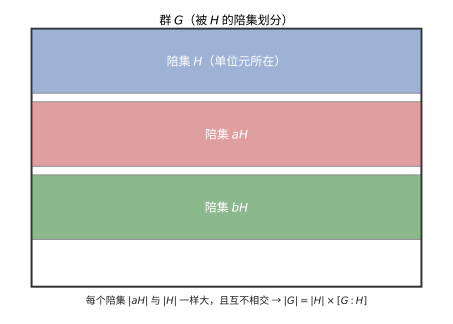
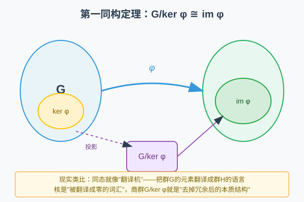

# 第 19 级：抽象代数基础 (Abstract Algebra)

> 抽象代数是现代数学的基石之一，研究代数结构的一般理论。它将具体的数系运算抽象为公理化的代数系统，揭示隐藏在算术背后的深层结构。本教程为抽象代数的入门指南，涵盖群论、环论和域论的基础知识。

---

## 1. 学习目标

完成本教程后，你应该能够：

1. **理解** 二元运算的基本性质（封闭性、结合律、交换律、单位元、逆元）以及代数结构的层级体系
2. **掌握** 群的定义、基本性质及重要例子，能够判断一个集合在给定运算下是否构成群
3. **理解** 子群、陪集、正规子群、商群等概念，并能证明和应用拉格朗日定理
4. **掌握** 群同态与同构的基本定理，并能运用它们分析群的结构
5. **理解** 环、域的定义及基本性质，掌握理想、商环、整环等概念
6. **了解** 域扩张的基本概念，初步认识有限域的结构
7. **能够** 解决抽象代数中的基本习题，具备进一步学习代数的能力

---

## 2. 二元运算与代数结构

### 2.1 二元运算

**定义 2.1（二元运算）** 设 $S$ 是一个非空集合。一个从 $S \times S$ 到 $S$ 的映射称为 $S$ 上的一个**二元运算**。即对任意 $a, b \in S$，存在唯一的 $c \in S$ 使得 $a \circ b = c$。

二元运算通常记作 $+$、$\times$、$\circ$、$*$ 等符号。

**定义 2.2（运算的基本性质）** 设 $\circ$ 是集合 $S$ 上的一个二元运算。

- **封闭性**：对任意 $a, b \in S$，有 $a \circ b \in S$。（这是运算定义本身的要求）
- **结合律**：对任意 $a, b, c \in S$，有 $(a \circ b) \circ c = a \circ (b \circ c)$。
- **交换律**：对任意 $a, b \in S$，有 $a \circ b = b \circ a$。
- **单位元（幺元）**：存在 $e \in S$，使得对任意 $a \in S$，有 $e \circ a = a \circ e = a$。
- **逆元**：若 $S$ 有单位元 $e$，对 $a \in S$，若存在 $b \in S$ 使得 $a \circ b = b \circ a = e$，则称 $b$ 是 $a$ 的逆元。

**定理 2.1（单位元的唯一性）** 若一个二元运算存在单位元，则单位元唯一。

**证明**：假设 $e$ 和 $e'$ 都是单位元，则 $e = e \circ e' = e'$。

**定理 2.2（逆元的唯一性）** 若运算满足结合律且有单位元，则每个元素的逆元（如果存在）唯一。

**证明**：假设 $b$ 和 $c$ 都是 $a$ 的逆元，则 $b = b \circ e = b \circ (a \circ c) = (b \circ a) \circ c = e \circ c = c$。

### 2.2 代数结构概述

不同的代数结构通过所满足的公理来区分，形成一个层级体系：

| 结构名称 | 封闭性 | 结合律 | 单位元 | 逆元 | 交换律 | 第二种运算 |
|:---:|:---:|:---:|:---:|:---:|:---:|:---:|
| 广群 (Groupoid) | ✓ | | | | | |
| 半群 (Semigroup) | ✓ | ✓ | | | | |
| 幺半群 (Monoid) | ✓ | ✓ | ✓ | | | |
| 群 (Group) | ✓ | ✓ | ✓ | ✓ | | |
| 阿贝尔群 (Abelian Group) | ✓ | ✓ | ✓ | ✓ | ✓ | |
| 环 (Ring) | ✓ | ✓ | ✓ | ✓（加法） | ✓（加法） | ✓（乘法） |
| 域 (Field) | ✓ | ✓ | ✓ | ✓（两种） | ✓（两种） | ✓（乘法） |

> **直观理解（现实类比）**：代数结构是"**逐步加锁的抽屉**"。广群只要求"抽屉能开能关"（一个封闭的二元运算）；加上"怎么关顺序都不影响结果"（结合律）成半群；再保证"有把万能钥匙"（单位元）成幺半群；最后"每个元素有自己的钥匙重新打开"（逆元）进化为群。环和域则是"**装了两把锁的抽屉**"——同时有加法和乘法两种运算，域还要求乘法也能"开锁"（每个非零元有乘法逆）。

#### 广群 (Groupoid)

一个非空集合 $G$ 配备一个二元运算 $\circ$，称为一个**广群**（或称**原群**）。仅要求运算封闭。

#### 半群 (Semigroup)

一个广群 $(G, \circ)$ 如果运算满足**结合律**，则称为一个**半群**。

**例：** $(\mathbb{N}, +)$ 和 $(\mathbb{N}, \times)$ 都是半群，其中 $\mathbb{N}$ 是自然数集。

#### 幺半群 (Monoid)

一个半群 $(G, \circ)$ 如果存在**单位元** $e$，则称为一个**幺半群**。

**例：** $(\mathbb{N}_0, +)$（含 0 的自然数集关于加法）是一个幺半群，单位元为 0。$(\mathbb{N}, \times)$ 是一个幺半群，单位元为 1。

#### 群 (Group)

一个幺半群 $(G, \circ)$ 如果每个元素都有**逆元**，则称为一个**群**。

#### 环 (Ring)

一个集合 $R$ 上定义了两个二元运算 $+$ 和 $\times$，如果：
- $(R, +)$ 是阿贝尔群（加法群）
- $(R, \times)$ 是半群（乘法半群）
- 乘法对加法满足分配律：$a \times (b + c) = a \times b + a \times c$，$(a + b) \times c = a \times c + b \times c$

则称 $(R, +, \times)$ 是一个**环**。

#### 域 (Field)

一个环 $(F, +, \times)$ 如果：
- $(F \setminus \{0\}, \times)$ 是阿贝尔群（即乘法满足交换律，有单位元，非零元素都有乘法逆元）
- 则称 $F$ 是一个**域**。

---

## 3. 群论基础

### 3.1 群的定义

**定义 3.1（群）** 一个**群**是一个有序对 $(G, \circ)$，其中 $G$ 是一个非空集合，$\circ$ 是 $G$ 上的一个二元运算，满足以下公理：

1. **封闭性**：对任意 $a, b \in G$，有 $a \circ b \in G$。
2. **结合律**：对任意 $a, b, c \in G$，有 $(a \circ b) \circ c = a \circ (b \circ c)$。
3. **单位元**：存在 $e \in G$，使得对任意 $a \in G$，有 $e \circ a = a \circ e = a$。
4. **逆元**：对任意 $a \in G$，存在 $a^{-1} \in G$，使得 $a \circ a^{-1} = a^{-1} \circ a = e$。

**定义 3.2（阿贝尔群）** 如果群 $G$ 的运算还满足交换律（即对任意 $a, b \in G$，$a \circ b = b \circ a$），则称 $G$ 为**阿贝尔群**（或称**交换群**）。

**定义 3.3（群的阶）** 群 $G$ 中元素的个数称为群的**阶**，记作 $|G|$。如果 $|G|$ 有限，称 $G$ 为**有限群**；否则为**无限群**。

### 3.2 群的例子

**例 3.1（整数加法群）** $(\mathbb{Z}, +)$ 是一个阿贝尔群。单位元为 0，$a$ 的逆元为 $-a$。这是一个无限群。

**例 3.2（非零有理数乘法群）** $(\mathbb{Q} \setminus \{0\}, \times)$ 是一个阿贝尔群。单位元为 1，$a$ 的逆元为 $1/a$。

**例 3.3（模 $n$ 加法群）** $(\mathbb{Z}_n, +)$，其中 $\mathbb{Z}_n = \{0, 1, \ldots, n-1\}$，加法为模 $n$ 加法，是一个 $n$ 阶阿贝尔群。

**例 3.4（模 $n$ 乘法群）** $(\mathbb{Z}_n^\times, \times)$，其中 $\mathbb{Z}_n^\times = \{a \in \mathbb{Z}_n \mid \gcd(a, n) = 1\}$，乘法为模 $n$ 乘法，是一个阿贝尔群。其阶为 $\varphi(n)$（欧拉函数）。

**例 3.5（$n$ 次对称群 $S_n$）** 集合 $\{1, 2, \ldots, n\}$ 上的所有置换（双射）在复合运算下构成一个群，称为 $n$ 次**对称群**，记作 $S_n$。$|S_n| = n!$。当 $n \geq 3$ 时，$S_n$ 不是阿贝尔群。

**例 3.6（二面体群 $D_n$）** 正 $n$ 边形的所有对称变换（旋转和反射）在复合运算下构成一个群，称为**二面体群** $D_n$。$|D_n| = 2n$。当 $n \geq 3$ 时，$D_n$ 不是阿贝尔群。

**例 3.7（一般线性群 $GL_n(\mathbb{R})$）** 所有 $n \times n$ 实可逆矩阵在矩阵乘法下构成一个群，称为**一般线性群**。当 $n \geq 2$ 时，$GL_n(\mathbb{R})$ 不是阿贝尔群。

**例 3.8（循环群）** 如果群 $G$ 中存在一个元素 $g$，使得 $G = \{g^k \mid k \in \mathbb{Z}\}$，则称 $G$ 为**循环群**，$g$ 称为**生成元**。$(\mathbb{Z}, +)$ 是无限循环群（生成元为 1 或 -1）。$(\mathbb{Z}_n, +)$ 是 $n$ 阶循环群（生成元为 1）。

### 3.3 子群

**定义 3.4（子群）** 设 $(G, \circ)$ 是一个群，$H$ 是 $G$ 的非空子集。如果 $H$ 在 $\circ$ 运算下本身构成一个群，则称 $H$ 是 $G$ 的**子群**，记作 $H \leq G$。

**定理 3.1（子群判定定理）** 设 $G$ 是一个群，$H$ 是 $G$ 的非空子集。$H$ 是 $G$ 的子群当且仅当以下条件成立：
1. 对任意 $a, b \in H$，有 $a \circ b \in H$（封闭性）
2. 对任意 $a \in H$，有 $a^{-1} \in H$（逆元封闭）

**等价条件**：对任意 $a, b \in H$，有 $a \circ b^{-1} \in H$。

**证明**：必要性显然。充分性：由条件 2 知每个元素有逆元，由条件 1 知运算封闭，结合律继承自 $G$，由 $a \circ a^{-1} = e \in H$ 知单位元存在。

**例 3.9** $(\mathbb{Z}, +)$ 是 $(\mathbb{Q}, +)$ 的子群。

**例 3.10** 对于 $n \geq 2$，**交错群** $A_n$（即 $S_n$ 中所有偶置换构成的集合）是 $S_n$ 的子群。$|A_n| = n!/2$。

**例 3.11** 特殊线性群 $SL_n(\mathbb{R}) = \{A \in GL_n(\mathbb{R}) \mid \det(A) = 1\}$ 是 $GL_n(\mathbb{R})$ 的子群。

### 3.4 陪集与拉格朗日定理

**定义 3.5（陪集）** 设 $G$ 是一个群，$H \leq G$，$a \in G$。
- **左陪集**：$aH = \{a \circ h \mid h \in H\}$
- **右陪集**：$Ha = \{h \circ a \mid h \in H\}$

**性质 3.1** 对于群 $G$ 的子群 $H$：
1. $aH = bH$ 当且仅当 $a^{-1}b \in H$
2. 任意两个左陪集要么相等，要么不相交（即左陪集构成 $G$ 的一个划分）
3. $|aH| = |H|$（所有陪集与 $H$ 等势）
4. $a \in aH$（因为 $a = a \circ e$）

**定义 3.6（指数）** 子群 $H$ 在 $G$ 中的左陪集（或右陪集）的个数称为 $H$ 在 $G$ 中的**指数**，记作 $[G : H]$。

> **直观理解（现实类比）**：陪集是"**群被切成等大的整齐格子**"。取子群 $H$，把群 $G$ 里的每个元素乘上一个固定的 $a$，得到 $aH$——就像**把整块棋盘按 $H$ 的格子平移**，得到的一批"同样形状"的棋子区。这些区要么完全重合、要么毫不重叠，且每区大小都与 $H$ 相同，于是 $|G|=|H|\times[G:H]$——这就是 Lagrange 定理：**子群大小必须整除群大小**。

**定理 3.2（拉格朗日定理）** 设 $G$ 是一个有限群，$H$ 是 $G$ 的子群。则
$$|G| = |H| \cdot [G : H]$$
即子群的阶整除群的阶。

**证明**：设 $G$ 关于 $H$ 的所有互不相同的左陪集为 $a_1H, a_2H, \ldots, a_rH$，其中 $r = [G : H]$。这些左陪集两两不交且覆盖 $G$，因此
$$|G| = \sum_{i=1}^r |a_iH| = \sum_{i=1}^r |H| = r \cdot |H| = [G : H] \cdot |H|$$
证毕。

**推论 3.1** 有限群中每个元素的阶整除群的阶。

**证明**：设 $a \in G$ 的阶为 $n$，则 $H = \langle a \rangle = \{e, a, a^2, \ldots, a^{n-1}\}$ 是 $G$ 的一个 $n$ 阶子群。由拉格朗日定理，$n \mid |G|$。

**推论 3.2** 素数阶群一定是循环群。

**证明**：设 $|G| = p$ 为素数。取 $a \in G$ 且 $a \neq e$，则 $a$ 的阶 $m > 1$ 且 $m \mid p$，所以 $m = p$。因此 $\langle a \rangle = G$，$G$ 是循环群。

### 3.5 正规子群与商群

**定义 3.7（正规子群）** 设 $G$ 是一个群，$N \leq G$。如果对任意 $g \in G$ 和任意 $n \in N$，有 $g n g^{-1} \in N$（即 $gNg^{-1} = N$），则称 $N$ 是 $G$ 的**正规子群**，记作 $N \trianglelefteq G$。

**等价条件**：$N \trianglelefteq G$ 当且仅当对任意 $g \in G$，有 $gN = Ng$（即左陪集等于右陪集）。

**例 3.12** 任何群 $G$ 都有两个平凡正规子群：$\{e\}$ 和 $G$ 本身。

**例 3.13** 阿贝尔群的每个子群都是正规子群。

**例 3.14** $A_n$ 是 $S_n$ 的正规子群（当 $n \geq 2$ 时）。

**例 3.15** $SL_n(\mathbb{R})$ 是 $GL_n(\mathbb{R})$ 的正规子群。

**定义 3.8（商群）** 设 $N \trianglelefteq G$。$G$ 关于 $N$ 的所有左陪集构成的集合 $G/N = \{gN \mid g \in G\}$ 在运算 $(aN)(bN) = (ab)N$ 下构成一个群，称为 $G$ 关于 $N$ 的**商群**。

**验证**：运算定义良好（与代表元选取无关），因为 $N$ 正规。单位元为 $N = eN$，$(aN)^{-1} = a^{-1}N$。$|G/N| = [G : N] = |G|/|N|$（当 $G$ 有限时）。

### 3.6 群同态与同构

**定义 3.9（群同态）** 设 $(G, \circ)$ 和 $(H, *)$ 是两个群。映射 $\varphi: G \to H$ 称为一个**群同态**，如果对任意 $a, b \in G$，有
$$\varphi(a \circ b) = \varphi(a) * \varphi(b)$$

**定义 3.10（群同构）** 如果 $\varphi$ 是双射的群同态，则称 $\varphi$ 为**群同构**，此时称 $G$ 与 $H$ **同构**，记作 $G \cong H$。

**定义 3.11（核与像）** 设 $\varphi: G \to H$ 是群同态。
- **核**：$\ker \varphi = \{g \in G \mid \varphi(g) = e_H\}$
- **像**：$\operatorname{im} \varphi = \{h \in H \mid \exists g \in G, \varphi(g) = h\}$

**性质 3.2** 设 $\varphi: G \to H$ 是群同态。
1. $\varphi(e_G) = e_H$
2. $\varphi(g^{-1}) = (\varphi(g))^{-1}$
3. $\ker \varphi \trianglelefteq G$（核是正规子群）
4. $\operatorname{im} \varphi \leq H$（像是子群）
5. $\varphi$ 是单射当且仅当 $\ker \varphi = \{e_G\}$

**例 3.16** 映射 $\varphi: \mathbb{Z} \to \mathbb{Z}_n$，$\varphi(k) = k \bmod n$，是一个满同态，核为 $n\mathbb{Z}$。

**例 3.17** 映射 $\det: GL_n(\mathbb{R}) \to \mathbb{R} \setminus \{0\}$，$\det(A)$ 是矩阵的行列式，是一个满同态，核为 $SL_n(\mathbb{R})$。

**例 3.18** 映射 $\operatorname{sgn}: S_n \to \{1, -1\}$，$\operatorname{sgn}(\sigma)$ 是置换的符号，是一个同态，核为 $A_n$。

### 3.7 同构基本定理

**定理 3.3（第一同构定理）** 设 $\varphi: G \to H$ 是群同态。则 $\ker \varphi \trianglelefteq G$，且
$$G / \ker \varphi \cong \operatorname{im} \varphi$$
具体地，映射 $\tilde{\varphi}: G/\ker \varphi \to \operatorname{im} \varphi$，$\tilde{\varphi}(g\ker \varphi) = \varphi(g)$ 是一个同构。

**证明**：
1. 首先验证 $\tilde{\varphi}$ 定义良好：若 $g_1\ker\varphi = g_2\ker\varphi$，则 $g_1^{-1}g_2 \in \ker\varphi$，所以 $\varphi(g_1^{-1}g_2) = e_H$，即 $\varphi(g_1) = \varphi(g_2)$。
2. $\tilde{\varphi}$ 是同态：$\tilde{\varphi}((g_1\ker\varphi)(g_2\ker\varphi)) = \tilde{\varphi}(g_1g_2\ker\varphi) = \varphi(g_1g_2) = \varphi(g_1)\varphi(g_2) = \tilde{\varphi}(g_1\ker\varphi)\tilde{\varphi}(g_2\ker\varphi)$。
3. $\tilde{\varphi}$ 是满射：对任意 $h \in \operatorname{im}\varphi$，存在 $g \in G$ 使得 $\varphi(g) = h$，则 $\tilde{\varphi}(g\ker\varphi) = h$。
4. $\tilde{\varphi}$ 是单射：若 $\tilde{\varphi}(g\ker\varphi) = e_H$，则 $\varphi(g) = e_H$，即 $g \in \ker\varphi$，所以 $g\ker\varphi = \ker\varphi$ 是零元。

证毕。

**定理 3.4（第二同构定理）** 设 $G$ 是一个群，$H \leq G$，$N \trianglelefteq G$。则 $H \cap N \trianglelefteq H$，且
$$H / (H \cap N) \cong HN / N$$

**证明思路**：考虑映射 $\varphi: H \to G/N$，$\varphi(h) = hN$。可以验证 $\varphi$ 是同态，$\ker \varphi = H \cap N$，$\operatorname{im} \varphi = HN/N$。由第一同构定理即得结论。

**定理 3.5（第三同构定理）** 设 $G$ 是一个群，$N \trianglelefteq G$，且 $N \leq K \trianglelefteq G$。则 $K/N \trianglelefteq G/N$，且
$$(G/N) / (K/N) \cong G/K$$

**证明思路**：考虑映射 $\psi: G/N \to G/K$，$\psi(gN) = gK$。可以验证 $\psi$ 是满同态，$\ker\psi = K/N$。由第一同构定理即得结论。

> **直观理解（现实类比）**：同构定理是"**群的翻译机器**"。想象你有一台神奇的翻译机 $\varphi$，能把群 $G$ 里的元素翻译成群 $H$ 的语言。翻译机有个"盲区" $\ker\varphi$——所有被翻译成 $H$ 的单位元的 $G$ 中元素。第一同构定理告诉我们：把 $G$ 中"意思相同"的元素打包成商群 $G/\ker\varphi$，就能完美对应到翻译机能到达的所有 $H$ 中的元素（即 $\operatorname{im}\varphi$）。就像把不同方言但意思相同的话归类后，就能和目标语言一一对应。

---

## 4. 环论基础

### 4.1 环的定义

**定义 4.1（环）** 一个**环**是一个三元组 $(R, +, \cdot)$，其中 $R$ 是一个非空集合，$+$ 和 $\cdot$ 是 $R$ 上的两个二元运算，满足：
1. $(R, +)$ 是阿贝尔群（加法群），记加法单位元为 $0$，$a$ 的加法逆元为 $-a$
2. $(R, \cdot)$ 是半群（乘法满足结合律）
3. **分配律**：对任意 $a, b, c \in R$，
   - 左分配律：$a \cdot (b + c) = a \cdot b + a \cdot c$
   - 右分配律：$(a + b) \cdot c = a \cdot c + b \cdot c$

**定义 4.2（环的特殊类型）**
- **交换环**：乘法满足交换律的环
- **含幺环**：乘法有单位元（记作 $1$ 或 $1_R$）的环
- **整环**：含幺交换环，且无零因子（即 $a \cdot b = 0 \Rightarrow a = 0$ 或 $b = 0$）
- **除环**：含幺环，且每个非零元素都有乘法逆元
- **域**：交换的除环

> **直观理解（现实类比）**：环到域的层级是"**逐步升级的保险箱**"。最外层的环只有加法和乘法两个基本操作；加上"乘法交换"变成交换环（像整数那样可以交换顺序）；加上"有乘法单位元1"成含幺环；再加上"没有零因子"（两个非零数相乘不会得零）成整环；最后"每个非零元素都能做除法"（有乘法逆元）就升级到了域。就像保险箱层层加锁，每多一把钥匙就能解锁更多运算。

### 4.2 环的例子

**例 4.1** $(\mathbb{Z}, +, \times)$ 是一个整环，但不是域。

**例 4.2** $(\mathbb{Q}, +, \times)$、$(\mathbb{R}, +, \times)$、$(\mathbb{C}, +, \times)$ 都是域。

**例 4.3** $(\mathbb{Z}_n, +, \times)$（模 $n$ 的剩余类环）是一个含幺交换环。当 $n$ 为素数时，$\mathbb{Z}_n$ 是域（记作 $\mathbb{F}_p$）。

**例 4.4** 所有 $n \times n$ 实矩阵构成的集合 $M_n(\mathbb{R})$ 在矩阵加法和乘法下形成一个环。当 $n \geq 2$ 时，它是非交换环，且有零因子。

**例 4.5** 多项式环 $R[x]$：系数在环 $R$ 中的多项式在加法和乘法下构成一个环。

### 4.3 子环与理想

**定义 4.3（子环）** 设 $R$ 是一个环，$S$ 是 $R$ 的非空子集。如果 $S$ 在 $R$ 的加法和乘法下本身构成一个环，则称 $S$ 是 $R$ 的**子环**。

**定义 4.4（理想）** 设 $R$ 是一个环，$I$ 是 $R$ 的非空子集。
- $I$ 是 $R$ 的**左理想**，如果：$(I, +)$ 是 $(R, +)$ 的子群，且对任意 $r \in R$，$a \in I$，有 $ra \in I$
- $I$ 是 $R$ 的**右理想**，如果：$(I, +)$ 是 $(R, +)$ 的子群，且对任意 $r \in R$，$a \in I$，有 $ar \in I$
- $I$ 是 $R$ 的**双边理想**（简称**理想**），如果它既是左理想又是右理想

**例 4.6** 在 $\mathbb{Z}$ 中，$n\mathbb{Z} = \{nk \mid k \in \mathbb{Z}\}$ 是理想。事实上，$\mathbb{Z}$ 的所有理想都是这种形式。

**例 4.7** 在 $M_n(\mathbb{R})$ 中，$\{0\}$ 和 $M_n(\mathbb{R})$ 本身是平凡理想，没有非平凡的双边理想（即 $M_n(\mathbb{R})$ 是**单环**）。

### 4.4 商环与环同态

**定义 4.5（商环）** 设 $R$ 是一个环，$I$ 是 $R$ 的理想。$R$ 关于 $I$ 的加法商群 $R/I = \{a + I \mid a \in R\}$ 在以下运算下构成一个环：
- 加法：$(a + I) + (b + I) = (a + b) + I$
- 乘法：$(a + I)(b + I) = ab + I$
称为 $R$ 关于 $I$ 的**商环**。

**定义 4.6（环同态）** 设 $R$ 和 $S$ 是环。映射 $\varphi: R \to S$ 称为**环同态**，如果对任意 $a, b \in R$：
- $\varphi(a + b) = \varphi(a) + \varphi(b)$
- $\varphi(ab) = \varphi(a)\varphi(b)$

**环同态的基本性质**：
- $\ker \varphi = \{a \in R \mid \varphi(a) = 0_S\}$ 是 $R$ 的理想
- $\operatorname{im} \varphi$ 是 $S$ 的子环
- $\varphi$ 是单射当且仅当 $\ker \varphi = \{0_R\}$

**定理 4.1（环的第一同构定理）** 设 $\varphi: R \to S$ 是环同态。则 $R / \ker \varphi \cong \operatorname{im} \varphi$。

### 4.5 整环与域的特征

**定义 4.7（零因子）** 设 $R$ 是一个含幺交换环。非零元素 $a \in R$ 称为**零因子**，如果存在非零 $b \in R$ 使得 $ab = 0$。

**定义 4.8（整环）** 一个不含零因子的含幺交换环称为**整环**。

**例 4.8** $\mathbb{Z}$、$\mathbb{Z}[x]$、$\mathbb{Z}[i]$（高斯整数环）都是整环。

**定理 4.2（有限整环是域）** 每个有限整环都是域。

**证明**：设 $R$ 是有限整环，$a \in R \setminus \{0\}$。考虑映射 $f: R \to R$，$f(x) = ax$。$f$ 是单射（因 $ax = ay \Rightarrow a(x-y) = 0 \Rightarrow x = y$），由于 $R$ 有限，$f$ 是满射，故存在 $b \in R$ 使得 $ab = 1$，即 $a$ 有乘法逆元。

**定义 4.9（环的特征）** 设 $R$ 是一个含幺环。最小的正整数 $n$ 使得 $n \cdot 1_R = 0$（即 $1_R$ 加 $n$ 次等于 $0$），称为 $R$ 的**特征**，记作 $\operatorname{char}(R)$。如果不存在这样的正整数，则称特征为 $0$。

**例 4.9** $\operatorname{char}(\mathbb{Z}) = 0$，$\operatorname{char}(\mathbb{Q}) = 0$，$\operatorname{char}(\mathbb{Z}_p) = p$（$p$ 为素数）。

**性质 4.1** 设 $R$ 是一个整环，则 $\operatorname{char}(R)$ 要么是 $0$，要么是一个素数。

**证明**：若 $\operatorname{char}(R) = mn$ 且 $m, n > 1$，则 $(m \cdot 1)(n \cdot 1) = mn \cdot 1 = 0$，但 $m \cdot 1 \neq 0$，$n \cdot 1 \neq 0$，这与整环无零因子矛盾。

---

## 5. 域论基础

### 5.1 域的定义

**定义 5.1（域）** 一个**域**是一个含幺交换环 $(F, +, \cdot)$，其中每个非零元素都有乘法逆元。即 $(F \setminus \{0\}, \cdot)$ 是一个阿贝尔群。

**等价定义**：域是交换的除环。

**例 5.1** 常见域：$\mathbb{Q}$、$\mathbb{R}$、$\mathbb{C}$、$\mathbb{F}_p = \mathbb{Z}_p$（$p$ 为素数）。

**例 5.2** 有理函数域 $\mathbb{Q}(x)$、$\mathbb{R}(x)$ 等。

### 5.2 域扩张

**定义 5.2（域扩张）** 设 $K$ 和 $F$ 是域，且 $F \subseteq K$。如果 $F$ 上的运算限制到 $K$ 上与 $K$ 的运算一致，则称 $K$ 是 $F$ 的一个**域扩张**（或扩域），记作 $K/F$。$F$ 称为**基域**。

**定义 5.3（扩张次数）** 域扩张 $K/F$ 中，$K$ 可以看作 $F$ 上的向量空间。这个向量空间的维数称为扩张的**次数**，记作 $[K : F]$。如果 $[K : F]$ 有限，则称 $K/F$ 是**有限扩张**。

**定理 5.1（扩张次数的传递性）** 设 $L/K$ 和 $K/F$ 都是有限域扩张，则 $L/F$ 也是有限扩张，且
$$[L : F] = [L : K] \cdot [K : F]$$

**证明**：设 $\{a_1, \ldots, a_m\}$ 是 $K$ 作为 $F$-向量空间的基，$\{b_1, \ldots, b_n\}$ 是 $L$ 作为 $K$-向量空间的基。则 $\{a_i b_j \mid 1 \leq i \leq m, 1 \leq j \leq n\}$ 是 $L$ 作为 $F$-向量空间的基。

**例 5.3** $[\mathbb{C} : \mathbb{R}] = 2$，基为 $\{1, i\}$。

**例 5.4** $[\mathbb{Q}(\sqrt{2}) : \mathbb{Q}] = 2$，基为 $\{1, \sqrt{2}\}$。

**例 5.5** $[\mathbb{Q}(\sqrt[3]{2}) : \mathbb{Q}] = 3$，基为 $\{1, \sqrt[3]{2}, \sqrt[3]{4}\}$。

**定义 5.4（单扩张与代数扩张）**
- 如果 $K = F(\alpha)$ 是由 $F$ 添加一个元素 $\alpha$ 生成的，则称 $K/F$ 是**单扩张**。
- 如果 $K$ 中每个元素都是某个 $F$-系数多项式的根，则称 $K/F$ 是**代数扩张**。
- 有限扩张一定是代数扩张。

### 5.3 有限域简介

**定理 5.2（有限域的结构定理）** 设 $F$ 是一个有限域，则：
1. $|F| = p^n$，其中 $p$ 是素数（$p = \operatorname{char}(F)$），$n$ 是正整数
2. 对任意素数 $p$ 和正整数 $n$，存在唯一的 $p^n$ 阶有限域（在同构意义下），记作 $\mathbb{F}_{p^n}$ 或 $GF(p^n)$
3. $\mathbb{F}_{p^n}$ 是 $\mathbb{F}_p$ 的 $n$ 次扩张

**例 5.6** $\mathbb{F}_4 = \{0, 1, \omega, \omega+1\}$，其中 $\omega^2 = \omega + 1$，特征为 2。这是 $\mathbb{F}_2$ 的二次扩张。

**例 5.7** $\mathbb{F}_9$ 是 $\mathbb{F}_3$ 的二次扩张，可表示为 $\mathbb{F}_3[x]/(x^2 + 1)$，其中 $x^2 + 1$ 在 $\mathbb{F}_3$ 上不可约（因为 $-1$ 在 $\mathbb{F}_3$ 中不是平方数）。

---

## 6. 示例

### 示例 1：判断 $\mathbb{Z}_6$ 在加法下是否为群

$\mathbb{Z}_6 = \{0, 1, 2, 3, 4, 5\}$ 在模 6 加法下：
- 封闭性：任意两个元素相加模 6 仍在 $\mathbb{Z}_6$ 中 ✓
- 结合律：模加法满足结合律 ✓
- 单位元：0 是单位元 ✓
- 逆元：0 的逆元为 0，1 的逆元为 5，2 的逆元为 4，3 的逆元为 3，等等 ✓

因此 $(\mathbb{Z}_6, +)$ 是一个 6 阶循环群。

### 示例 2：判断 $\mathbb{Z}_6$ 在乘法下是否为群

$\mathbb{Z}_6$ 在模 6 乘法下：考虑非零元素 $\{1, 2, 3, 4, 5\}$。
- $2 \times 3 = 6 \equiv 0 \pmod{6}$，不在集合中，不封闭
- 即使考虑所有元素，$2 \times 3 = 0$ 表明 2 和 3 没有乘法逆元
因此 $(\mathbb{Z}_6, \times)$ 不是群。

但 $\mathbb{Z}_6^\times = \{1, 5\}$ 在模 6 乘法下构成一个 2 阶群（因为 $5 \times 5 = 25 \equiv 1 \pmod{6}$）。

### 示例 3：求 $S_3$ 的所有子群

$S_3 = \{e, (12), (13), (23), (123), (132)\}$，$|S_3| = 6$。

子群（由拉格朗日定理，子群阶只能为 1、2、3、6）：
- 1 阶：$\{e\}$
- 2 阶：$\{e, (12)\}$，$\{e, (13)\}$，$\{e, (23)\}$
- 3 阶：$\{e, (123), (132)\} \cong \mathbb{Z}_3$（这是 $A_3$）
- 6 阶：$S_3$ 本身

### 示例 4：证明 $A_n$ 是 $S_n$ 的正规子群

定义符号同态 $\operatorname{sgn}: S_n \to \{1, -1\}$，$\operatorname{sgn}(\sigma) = 1$ 若 $\sigma$ 为偶置换，$\operatorname{sgn}(\sigma) = -1$ 若 $\sigma$ 为奇置换。$\ker(\operatorname{sgn}) = A_n$。由于核是正规子群，所以 $A_n \trianglelefteq S_n$。

### 示例 5：求 $\mathbb{Z}/12\mathbb{Z}$ 的全部理想

$\mathbb{Z}$ 是主理想整环，所有理想形如 $m\mathbb{Z}$。$\mathbb{Z}/12\mathbb{Z}$ 的理想对应于包含 $12\mathbb{Z}$ 的 $\mathbb{Z}$ 的理想，即 $d\mathbb{Z}$ 其中 $d \mid 12$。

所以 $\mathbb{Z}/12\mathbb{Z}$ 的全部理想为：
- $\{0\} = 12\mathbb{Z}/12\mathbb{Z}$（对应 $d = 12$）
- $\{0, 6\} = 6\mathbb{Z}/12\mathbb{Z}$（对应 $d = 6$）
- $\{0, 4, 8\} = 4\mathbb{Z}/12\mathbb{Z}$（对应 $d = 4$）
- $\{0, 3, 6, 9\} = 3\mathbb{Z}/12\mathbb{Z}$（对应 $d = 3$）
- $\{0, 2, 4, 6, 8, 10\} = 2\mathbb{Z}/12\mathbb{Z}$（对应 $d = 2$）
- $\mathbb{Z}/12\mathbb{Z}$ 本身（对应 $d = 1$）

### 示例 6：求 $\mathbb{Z}_8$ 的单位群

$\mathbb{Z}_8^\times = \{a \in \mathbb{Z}_8 \mid \gcd(a, 8) = 1\} = \{1, 3, 5, 7\}$。
乘法表：
- $3 \times 3 = 9 \equiv 1 \pmod{8}$
- $5 \times 5 = 25 \equiv 1 \pmod{8}$
- $7 \times 7 = 49 \equiv 1 \pmod{8}$
- $3 \times 5 = 15 \equiv 7 \pmod{8}$
- $3 \times 7 = 21 \equiv 5 \pmod{8}$
- $5 \times 7 = 35 \equiv 3 \pmod{8}$

$\mathbb{Z}_8^\times \cong \mathbb{Z}_2 \times \mathbb{Z}_2$（Klein 四元群），不是循环群。

### 示例 7：证明 $\mathbb{Z}[x]/(x) \cong \mathbb{Z}$

考虑环同态 $\varphi: \mathbb{Z}[x] \to \mathbb{Z}$，$\varphi(f(x)) = f(0)$（即多项式在 0 处的取值）。
- $\varphi$ 是满同态
- $\ker \varphi = \{f(x) \in \mathbb{Z}[x] \mid f(0) = 0\} = (x)$（常数项为 0 的多项式）

由第一同构定理，$\mathbb{Z}[x]/(x) \cong \mathbb{Z}$。

### 示例 8：求 $\mathbb{Q}(\sqrt{2}, \sqrt{3})$ 在 $\mathbb{Q}$ 上的扩张次数

首先，$[\mathbb{Q}(\sqrt{2}) : \mathbb{Q}] = 2$，基为 $\{1, \sqrt{2}\}$。
其次，$\sqrt{3} \notin \mathbb{Q}(\sqrt{2})$（反证：若 $\sqrt{3} = a + b\sqrt{2}$，则 $3 = a^2 + 2b^2 + 2ab\sqrt{2}$，由有理数比较得 $ab = 0$，若 $b = 0$ 则 $\sqrt{3} = a$ 矛盾，若 $a = 0$ 则 $\sqrt{3} = b\sqrt{2}$ 即 $\sqrt{3/2} = b$ 矛盾），所以 $[\mathbb{Q}(\sqrt{2}, \sqrt{3}) : \mathbb{Q}(\sqrt{2})] = 2$。

由扩张次数的传递性：
$$[\mathbb{Q}(\sqrt{2}, \sqrt{3}) : \mathbb{Q}] = [\mathbb{Q}(\sqrt{2}, \sqrt{3}) : \mathbb{Q}(\sqrt{2})] \cdot [\mathbb{Q}(\sqrt{2}) : \mathbb{Q}] = 2 \times 2 = 4$$

基为 $\{1, \sqrt{2}, \sqrt{3}, \sqrt{6}\}$。

### 示例 9：证明 $\mathbb{R} \not\cong \mathbb{C}$（作为域）

假设存在域同构 $\varphi: \mathbb{C} \to \mathbb{R}$。在 $\mathbb{C}$ 中，$i^2 = -1$，所以 $\varphi(i)^2 = \varphi(i^2) = \varphi(-1) = -\varphi(1) = -1$。但在 $\mathbb{R}$ 中，任何元素的平方都不等于 $-1$，矛盾。因此 $\mathbb{R} \not\cong \mathbb{C}$。

### 示例 10：求 $S_4$ 中元素 $(12)(34)$ 的阶

$(12)(34)$ 是两个不相交对换的乘积。对换的阶为 2，不相交置换的乘积的阶等于各因子阶的最小公倍数。所以：
$$\operatorname{ord}((12)(34)) = \operatorname{lcm}(2, 2) = 2$$

验证：$((12)(34))^2 = (12)(34)(12)(34) = e$。

### 示例 11：证明 $GL_2(\mathbb{R})$ 的中心为 $\{\lambda I \mid \lambda \in \mathbb{R} \setminus \{0\}\}$

设 $Z = \{\lambda I \mid \lambda \in \mathbb{R} \setminus \{0\}\}$。显然 $Z \subseteq Z(GL_2(\mathbb{R}))$（中心）。

反之，设 $A = \begin{pmatrix} a & b \\ c & d \end{pmatrix}$ 在中心中。则 $A$ 与所有可逆矩阵可交换。特别地，与 $E_{12} = \begin{pmatrix} 1 & 0 \\ 0 & 0 \end{pmatrix}$ 可交换：
$$AE_{12} = \begin{pmatrix} a & 0 \\ c & 0 \end{pmatrix}, \quad E_{12}A = \begin{pmatrix} a & b \\ 0 & 0 \end{pmatrix}$$
由 $AE_{12} = E_{12}A$ 得 $b = c = 0$。

再与 $\begin{pmatrix} 0 & 1 \\ 0 & 0 \end{pmatrix}$ 可交换得 $a = d$。所以 $A = \lambda I$。因此 $Z(GL_2(\mathbb{R})) = Z$。

### 示例 12：求 $\mathbb{F}_4$ 的乘法群

$\mathbb{F}_4 = \{0, 1, \omega, \omega^2\}$，其中 $\omega^2 = \omega + 1$，$\omega^3 = 1$。
乘法群 $\mathbb{F}_4^\times = \{1, \omega, \omega^2\}$ 是 3 阶循环群。
- $\omega^1 = \omega$
- $\omega^2 = \omega + 1$
- $\omega^3 = 1$

---

## 7. 习题

### 基础题

**习题 1** 判断以下集合在给定运算下是否构成群。如果是，请说明是阿贝尔群还是非阿贝尔群；如果不是，请说明违反哪条公理。

(a) 整数集 $\mathbb{Z}$ 关于减法运算
(b) 非零实数集 $\mathbb{R} \setminus \{0\}$ 关于乘法
(c) 偶数集 $2\mathbb{Z}$ 关于加法
(d) 所有 $n \times n$ 可逆实矩阵关于矩阵加法
(e) 集合 $\{1, -1, i, -i\}$ 关于复数乘法

**习题 2** 求 $S_4$ 中元素 $(123)(45)$ 的阶。

**习题 3** 证明：如果群 $G$ 中每个元素都满足 $x^2 = e$，则 $G$ 是阿贝尔群。

**习题 4** 求 $\mathbb{Z}_{20}^\times$ 的阶，并判断它是否为循环群。

**习题 5** 列出 $D_4$（正方形的对称群）的所有元素，并求其所有子群。

### 提高题

**习题 6** 证明：群 $G$ 中，若 $H$ 和 $K$ 是子群，则 $H \cap K$ 也是子群。若 $H$ 和 $K$ 都是正规子群，则 $H \cap K$ 也是正规子群。

**习题 7** 设 $\varphi: G \to H$ 是群同态。证明：$G$ 中阶有限的元素 $a$ 满足 $\operatorname{ord}(\varphi(a)) \mid \operatorname{ord}(a)$。

**习题 8** 判断 $\mathbb{Z}_4$ 和 $\mathbb{Z}_2 \times \mathbb{Z}_2$ 是否同构。说明理由。

**习题 9** 证明：$\mathbb{Z}[x]/(x^2 + 1) \cong \mathbb{Z}[i]$，其中 $\mathbb{Z}[i] = \{a + bi \mid a, b \in \mathbb{Z}\}$ 是高斯整数环。

**习题 10** 设 $R$ 是一个含幺环。证明：如果 $1 = 0$，则 $R$ 是零环（即 $R = \{0\}$）。

**习题 11** 求 $\mathbb{Q}(\sqrt{2} + \sqrt{3})$ 在 $\mathbb{Q}$ 上的扩张次数。

**习题 12** 证明：有限整环 $\mathbb{Z}_n$ 是域当且仅当 $n$ 是素数。

**习题 13** 设 $F$ 是域，$f(x) \in F[x]$ 是不可约多项式。证明：$F[x]/(f(x))$ 是域。

**习题 14** 证明：特征为 $p$ 的域 $F$ 中，对任意 $a, b \in F$，有 $(a + b)^p = a^p + b^p$（**Freshman's Dream** 公式）。

**习题 15** 构造一个 8 阶域 $\mathbb{F}_8$ 的乘法表，并在 $\mathbb{F}_8$ 中求出 $x^3 + x + 1 = 0$ 的根。

---

## 8. 总结

抽象代数是现代数学的核心语言，它将具体的计算提升为对代数结构的抽象研究。本教程涵盖了以下核心内容：

1. **代数结构层级**：从广群、半群、幺半群到群、环、域，每个结构通过增加公理而逐步精细化，形成了一个自然的层级体系。

2. **群论**：群是研究对称性的数学语言。我们从群的定义出发，学习了子群、陪集、拉格朗日定理（子群的阶整除群的阶）、正规子群、商群，以及群同态与同构基本定理。这些工具使我们能够"分解"群，理解其内部结构。

3. **环论**：环是同时具有加法与乘法两种运算的代数结构。整数环 $\mathbb{Z}$ 和多项式环 $F[x]$ 是最重要的例子。理想在环论中扮演着类似于正规子群在群论中的角色，使我们能够构造商环。

4. **域论**：域是最丰富的代数结构，具有加法和乘法两种运算，且非零元素都有乘法逆元。域扩张理论是伽罗瓦理论的基础，而有限域 $\mathbb{F}_{p^n}$ 在编码理论和密码学中有重要应用。

5. **同构基本定理**：这三个定理（第一、第二、第三同构定理）是代数结构的统一理论，适用于群、环、模等各种代数结构，揭示了商结构、子结构和同态像之间的深刻关系。

抽象代数的思维方法——公理化、结构化、通过同态比较不同结构——是现代数学的基本思维方式。掌握本教程内容后，可以进一步学习伽罗瓦理论、交换代数、表示论、同调代数等更深入的代数分支。

---

> **进阶阅读建议**：
> - 第 20 级「群论」将深入探讨群的分类、Sylow 定理、可解群和幂零群等内容
> - 伽罗瓦理论将域扩张与群论联系起来，是抽象代数的顶峰之一
> - 交换代数（亦称交换环论）是代数几何和代数数论的基础