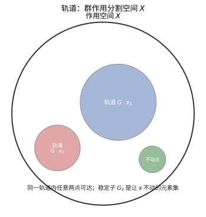
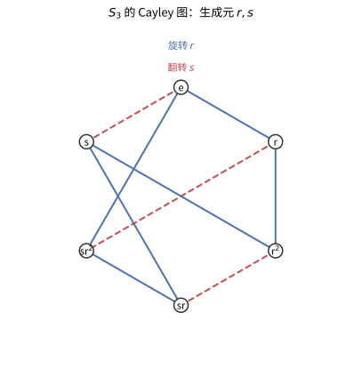

# 第 20 级：群论（Group Theory）

> 群论是抽象代数的核心分支之一，研究对称性的数学结构。本教程建立在抽象代数基础之上，深入探讨群的结构、分类与应用。

---

## 1. 学习目标

完成本教程后，你应该能够：

- 熟练掌握群的基本概念与性质，理解子群、陪集、Lagrange 定理
- 深刻理解正规子群与商群的概念，能构造商群并分析其结构
- 掌握同态与同构的三大基本定理，并能运用它们证明群的同构关系
- 理解群的直积与半直积构造，能分类小阶群
- 掌握群作用理论，能运用轨道-稳定子定理和 Burnside 引理解决计数问题
- 理解 Sylow 定理的证明与应用，能分析有限群的结构
- 了解可解群与幂零群的定义与性质
- 了解有限单群分类的基本框架
- 理解自由群与群表示的基本概念

---

## 2. 群的基本概念复习

### 2.1 群的定义

**定义 2.1（群）** 一个**群**是一个有序对 $(G, \cdot)$，其中 $G$ 是一个非空集合，$\cdot: G \times G \to G$ 是一个二元运算，满足以下三条公理：

1. **结合律**：$\forall a, b, c \in G,\ (a \cdot b) \cdot c = a \cdot (b \cdot c)$
2. **单位元**：$\exists e \in G,\ \forall a \in G,\ e \cdot a = a \cdot e = a$
3. **逆元**：$\forall a \in G,\ \exists a^{-1} \in G,\ a \cdot a^{-1} = a^{-1} \cdot a = e$

如果群还满足交换律，即 $\forall a, b \in G,\ a \cdot b = b \cdot a$，则称 $G$ 为**交换群**（或**阿贝尔群**）。

**定义 2.2（群的阶）** 群 $G$ 中元素的个数称为群的**阶**，记作 $|G|$。若 $|G|$ 有限，称 $G$ 为**有限群**；否则为**无限群**。

**定义 2.3（元素的阶）** 群 $G$ 中元素 $a$ 的**阶**是满足 $a^n = e$ 的最小正整数 $n$，记作 $|a|$ 或 $\operatorname{ord}(a)$。若不存在这样的 $n$，则称 $a$ 的阶为无限。

### 2.2 群的例子

| 集合 | 运算 | 说明 |
|------|------|------|
| $\mathbb{Z}$ | 加法 | 无限交换群 |
| $\mathbb{Z}_n = \{0, 1, \ldots, n-1\}$ | 模 $n$ 加法 | $n$ 阶循环群 |
| $S_n$（$n$ 元置换全体） | 置换的复合 | $n!$ 阶非交换群（$n \ge 3$） |
| $D_{2n}$（正 $n$ 边形的对称） | 变换的复合 | $2n$ 阶二面体群 |
| $\operatorname{GL}_n(\mathbb{R})$（可逆 $n$ 阶实矩阵） | 矩阵乘法 | 无限非交换群 |
| $(\mathbb{Z}/p\mathbb{Z})^\times$ | 模 $p$ 乘法 | $p-1$ 阶循环群（$p$ 为素数） |

### 2.3 子群

**定义 2.4（子群）** 设 $G$ 是一个群，$H \subseteq G$ 是非空子集。若 $H$ 在 $G$ 的运算下本身构成一个群，则称 $H$ 为 $G$ 的**子群**，记作 $H \le G$。

**子群判定定理**：$H \le G$ 当且仅当：
1. $H \neq \varnothing$
2. $\forall a, b \in H,\ ab^{-1} \in H$

**定义 2.5（生成子群）** 设 $S \subseteq G$，$G$ 中包含 $S$ 的最小子群称为由 $S$ **生成**的子群，记作 $\langle S \rangle$。若 $G = \langle S \rangle$，则称 $S$ 为 $G$ 的一个**生成元集**。

**定义 2.6（循环群）** 若群 $G$ 可由一个元素生成，即 $G = \langle a \rangle$，则称 $G$ 为**循环群**。循环群的结构完全由生成元的阶决定：
- 若 $|a| = n$，则 $G \cong \mathbb{Z}_n$
- 若 $|a| = \infty$，则 $G \cong \mathbb{Z}$

### 2.4 陪集与 Lagrange 定理

**定义 2.7（陪集）** 设 $H \le G$，$a \in G$。定义：
- **左陪集**：$aH = \{ah \mid h \in H\}$
- **右陪集**：$Ha = \{ha \mid h \in H\}$

**性质 2.1** 对于 $a, b \in G$，$aH = bH$ 当且仅当 $a^{-1}b \in H$。左陪集构成 $G$ 的一个划分。

**定义 2.8（指数）** 子群 $H$ 在 $G$ 中的**指数**是 $H$ 的左陪集的个数，记作 $[G : H]$。

**定理 2.1（Lagrange 定理）** 设 $G$ 为有限群，$H \le G$，则
$$|G| = |H| \cdot [G : H]$$

特别地，$|H|$ 整除 $|G|$，且每个元素的阶整除 $|G|$。

**推论 2.1** 素数阶群一定是循环群。

**证明**：设 $|G| = p$ 为素数。取 $a \neq e$，则 $|a|$ 整除 $p$ 且 $|a| > 1$，故 $|a| = p$，因此 $G = \langle a \rangle$ 是循环群。

---

## 3. 正规子群与商群

### 3.1 正规子群

**定义 3.1（正规子群）** 设 $N \le G$。若对任意 $g \in G$，有 $gNg^{-1} = N$（即 $N$ 在共轭下不变），则称 $N$ 为 $G$ 的**正规子群**，记作 $N \trianglelefteq G$。

**等价条件**：以下条件等价于 $N \trianglelefteq G$：
1. $\forall g \in G,\ gNg^{-1} = N$
2. $\forall g \in G,\ gNg^{-1} \subseteq N$
3. $\forall g \in G,\ gN = Ng$（左右陪集相同）
4. $N$ 是 $G$ 的若干共轭类的并集

**例子**：
- 任何群 $G$ 都有正规子群 $\{e\}$ 和 $G$（平凡正规子群）
- 交换群的所有子群都是正规的
- 交错群 $A_n$ 是 $S_n$ 的正规子群（$[S_n : A_n] = 2$）
- 特殊线性群 $\operatorname{SL}_n(F)$ 是一般线性群 $\operatorname{GL}_n(F)$ 的正规子群

### 3.2 商群

**定理 3.1（商群构造）** 设 $N \trianglelefteq G$。在陪集集合 $G/N = \{gN \mid g \in G\}$ 上定义运算：
$$(aN)(bN) = (ab)N$$
则 $G/N$ 在此运算下构成一个群，称为 $G$ 模 $N$ 的**商群**，其阶为 $[G : N]$。

**证明**：需要验证运算的定义是良定的（well-defined）。若 $aN = a'N$，$bN = b'N$，则 $a' = an_1$，$b' = bn_2$，其中 $n_1, n_2 \in N$。于是
$$a'b' = an_1bn_2 = a(b b^{-1}) n_1 b n_2 = ab(b^{-1}n_1b)n_2$$
由于 $N$ 正规，$b^{-1}n_1b \in N$，故 $a'b' \in (ab)N$，即 $(a'b')N = (ab)N$。运算良定。

### 3.3 单群与合成列

**定义 3.2（单群）** 若群 $G$ 没有非平凡的正规子群（即正规子群只有 $\{e\}$ 和 $G$ 自身），则称 $G$ 为**单群**。

**重要例子**：
- 素数阶循环群 $\mathbb{Z}_p$ 是单群
- 交错群 $A_n$（$n \ge 5$）是单群
- 李型单群（如 $\operatorname{PSL}_n(q)$）

**定义 3.3（合成列）** 群 $G$ 的一个**合成列**是正规子群链：
$$\{e\} = G_0 \trianglelefteq G_1 \trianglelefteq \cdots \trianglelefteq G_n = G$$
使得每个商群 $G_{i+1}/G_i$ 是单群。这些商群称为**合成因子**。

**定理 3.2（Jordan-Hölder 定理）** 任何有限群的任意两个合成列（在同构意义下）有相同的长度，且合成因子（不计顺序）在同构意义下唯一。

### 3.4 戴德金群

**定义 3.4** 若群 $G$ 的所有子群都是正规子群，则称 $G$ 为**戴德金群**。非交换的戴德金群称为**哈密顿群**。

最小的哈密顿群是**四元数群** $Q_8 = \{\pm 1, \pm i, \pm j, \pm k\}$，其中 $i^2 = j^2 = k^2 = -1$，$ijk = -1$。

---

## 4. 同态与同构定理

### 4.1 群同态

**定义 4.1（群同态）** 设 $(G, \cdot)$ 和 $(H, *)$ 是群。映射 $\varphi: G \to H$ 若满足
$$\varphi(a \cdot b) = \varphi(a) * \varphi(b),\quad \forall a, b \in G$$
则称 $\varphi$ 为**群同态**。

**定义 4.2（核与像）** 
- $\ker \varphi = \{g \in G \mid \varphi(g) = e_H\}$（同态的核）
- $\operatorname{Im} \varphi = \{\varphi(g) \mid g \in G\}$（同态的像）

**性质 4.1** $\ker \varphi \trianglelefteq G$，$\operatorname{Im} \varphi \le H$。

**定义 4.3（同构）** 若 $\varphi$ 是双射同态，则称 $\varphi$ 为**同构**，记作 $G \cong H$。

### 4.2 第一同构定理

**定理 4.1（第一同构定理）** 设 $\varphi: G \to H$ 是群同态。则
$$G / \ker \varphi \cong \operatorname{Im} \varphi$$

**证明**：令 $N = \ker \varphi$。定义 $\overline{\varphi}: G/N \to \operatorname{Im} \varphi$ 为 $\overline{\varphi}(gN) = \varphi(g)$。
- **良定性**：若 $gN = g'N$，则 $g' = gn$，$n \in N$，故 $\varphi(g') = \varphi(g)\varphi(n) = \varphi(g)$。
- **同态性**：$\overline{\varphi}((aN)(bN)) = \overline{\varphi}(abN) = \varphi(ab) = \varphi(a)\varphi(b) = \overline{\varphi}(aN)\overline{\varphi}(bN)$。
- **单射**：若 $\overline{\varphi}(gN) = e_H$，则 $\varphi(g) = e_H$，即 $g \in N$，故 $gN = N$。
- **满射**：显然。

因此 $\overline{\varphi}$ 是同构。

### 4.3 第二同构定理

**定理 4.2（第二同构定理）** 设 $G$ 是群，$H \le G$，$N \trianglelefteq G$。则
$$H / (H \cap N) \cong HN / N$$

**证明**：定义 $\varphi: H \to HN/N$ 为 $\varphi(h) = hN$。易验证 $\varphi$ 是满同态，且 $\ker \varphi = \{h \in H \mid hN = N\} = H \cap N$。由第一同构定理即得。

### 4.4 第三同构定理

**定理 4.3（第三同构定理）** 设 $G$ 是群，$N \trianglelefteq G$，$K \trianglelefteq G$ 且 $N \subseteq K$。则 $K/N \trianglelefteq G/N$，且
$$(G/N) / (K/N) \cong G/K$$

**证明**：定义 $\varphi: G/N \to G/K$ 为 $\varphi(gN) = gK$。这是良定的（因为 $N \subseteq K$），且是满同态。
$$\ker \varphi = \{gN \mid gK = K\} = \{gN \mid g \in K\} = K/N$$
由第一同构定理得证。

### 4.5 对应定理

**定理 4.4（对应定理）** 设 $N \trianglelefteq G$。则映射
$$\{H \mid N \le H \le G\} \to \{H' \mid H' \le G/N\}$$
$$H \mapsto H/N$$
是双射，且保持包含关系、指数和正规性：
- $H_1 \le H_2 \iff H_1/N \le H_2/N$
- $[H_2 : H_1] = [H_2/N : H_1/N]$
- $H \trianglelefteq G \iff H/N \trianglelefteq G/N$

---

## 5. 群的直积与半直积

### 5.1 直积

**定义 5.1（外直积）** 设 $G$ 和 $H$ 是群。在笛卡尔积 $G \times H$ 上定义运算：
$$(g_1, h_1)(g_2, h_2) = (g_1g_2, h_1h_2)$$
则 $G \times H$ 构成一个群，称为 $G$ 和 $H$ 的**（外）直积**。

**定义 5.2（内直积）** 设 $G$ 是群，$N \trianglelefteq G$，$H \trianglelefteq G$，且 $N \cap H = \{e\}$，$G = NH$。则 $G$ 同构于 $N \times H$，称为 $G$ 的**内直积**分解。

**性质 5.1** 若 $G \cong H \times K$，则：
- $|G| = |H| \cdot |K|$
- $G$ 中元素 $(h, k)$ 的阶为 $\operatorname{lcm}(|h|, |k|)$
- $H \cong H \times \{e\} \trianglelefteq G$，$K \cong \{e\} \times K \trianglelefteq G$

### 5.2 半直积

**定义 5.3（半直积）** 设 $N \trianglelefteq G$，$H \le G$，且 $N \cap H = \{e\}$，$G = NH$。则称 $G$ 为 $N$ 和 $H$ 的**（内）半直积**，记作 $G = N \rtimes H$。

可通过群同态 $\varphi: H \to \operatorname{Aut}(N)$ 来构造**外半直积** $N \rtimes_\varphi H$，其乘法为：
$$(n_1, h_1)(n_2, h_2) = (n_1 \varphi_{h_1}(n_2), h_1h_2)$$

**例子**：二面体群 $D_{2n} \cong \mathbb{Z}_n \rtimes \mathbb{Z}_2$，其中 $\mathbb{Z}_2$ 通过逆元映射作用在 $\mathbb{Z}_n$ 上。

### 5.3 小阶群的分类

| 阶数 | 群结构 | 交换性 |
|:----:|--------|:------:|
| 1 | $\{e\}$ | 交换 |
| 2 | $\mathbb{Z}_2$ | 交换 |
| 3 | $\mathbb{Z}_3$ | 交换 |
| 4 | $\mathbb{Z}_4$，$\mathbb{Z}_2 \times \mathbb{Z}_2$ | 交换 |
| 5 | $\mathbb{Z}_5$ | 交换 |
| 6 | $\mathbb{Z}_6 \cong \mathbb{Z}_2 \times \mathbb{Z}_3$，$D_6 \cong S_3$ | 后者非交换 |
| 7 | $\mathbb{Z}_7$ | 交换 |
| 8 | $\mathbb{Z}_8$，$\mathbb{Z}_4 \times \mathbb{Z}_2$，$\mathbb{Z}_2^3$，$D_8$，$Q_8$ | 后两个非交换 |
| 9 | $\mathbb{Z}_9$，$\mathbb{Z}_3 \times \mathbb{Z}_3$ | 交换 |
| 10 | $\mathbb{Z}_{10}$，$D_{10}$ | 后者非交换 |

---

## 6. 群作用

### 6.1 基本定义

**定义 6.1（群作用）** 设 $G$ 是群，$X$ 是非空集合。$G$ 在 $X$ 上的一个**（左）作用**是一个映射 $G \times X \to X$，记作 $(g, x) \mapsto g \cdot x$，满足：
1. $\forall x \in X,\ e \cdot x = x$
2. $\forall g, h \in G,\ \forall x \in X,\ (gh) \cdot x = g \cdot (h \cdot x)$

等价地，群作用是一个群同态 $\varphi: G \to \operatorname{Sym}(X)$。

### 6.2 轨道与稳定子

**定义 6.2（轨道）** 设 $G$ 作用在 $X$ 上。$x \in X$ 的**轨道**是
$$G \cdot x = \{g \cdot x \mid g \in G\} \subseteq X$$

**定义 6.3（稳定子）** $x \in X$ 的**稳定子群**是
$$G_x = \{g \in G \mid g \cdot x = x\} \le G$$

**定义 6.4（不动点集）** 对 $g \in G$，$X^g = \{x \in X \mid g \cdot x = x\}$。

### 6.3 轨道-稳定子定理

**定理 6.1（轨道-稳定子定理）** 设 $G$ 是有限群，作用在 $X$ 上。则对任意 $x \in X$，
$$|G \cdot x| = [G : G_x] = \frac{|G|}{|G_x|}$$

**证明**：定义映射 $\phi: G/G_x \to G \cdot x$ 为 $\phi(gG_x) = g \cdot x$。
- **良定性**：若 $gG_x = g'G_x$，则 $g^{-1}g' \in G_x$，故 $g' \cdot x = g \cdot (g^{-1}g' \cdot x) = g \cdot x$。
- **单射**：若 $g \cdot x = g' \cdot x$，则 $g^{-1}g' \cdot x = x$，即 $g^{-1}g' \in G_x$，故 $gG_x = g'G_x$。
- **满射**：显然。

因此 $\phi$ 是双射，$|G \cdot x| = |G/G_x| = [G : G_x] = |G|/|G_x|$。

> **直观理解（现实类比）**：轨道-稳定子定理回答了"**一个元素能走到哪些地方**"。把群作用想成**旋转骰子的手**：一个点 $x$ 能被所有群元素送往的所有位置，构成它的**轨道**；而那些**让 $x$ 原地不动的"手型"**（如绕 $x$ 轴的那几个旋转）构成**稳定子** $G_x$。轨道越大，说明能"搬动"它的群元素越多，相对的稳定子就越小——两者大小之积恰好是群大小 $|G|$：$|G\cdot x|\cdot|G_x|=|G|$。

### 6.4 Burnside 引理

**定理 6.2（Burnside 引理，或称 Cauchy-Frobenius 引理）** 设有限群 $G$ 作用在有限集 $X$ 上。则轨道数 $N$ 为：
$$N = \frac{1}{|G|} \sum_{g \in G} |X^g|$$

**证明**：考虑集合 $S = \{(g, x) \in G \times X \mid g \cdot x = x\}$，计算 $|S|$ 的两种方式：
- 按 $g$ 求和：$\sum_{g \in G} |X^g|$
- 按 $x$ 求和：$\sum_{x \in X} |G_x|$

由轨道-稳定子定理，$|G_x| = |G|/|G \cdot x|$。将 $X$ 按轨道分解 $X = \bigsqcup_{i=1}^N \mathcal{O}_i$，则
$$\sum_{x \in X} |G_x| = \sum_{i=1}^N \sum_{x \in \mathcal{O}_i} \frac{|G|}{|\mathcal{O}_i|} = \sum_{i=1}^N |G| = N|G|$$

因此 $\sum_{g \in G} |X^g| = N|G|$，即 $N = \frac{1}{|G|} \sum_{g \in G} |X^g|$。

### 6.5 Cayley 定理

**定理 6.3（Cayley 定理）** 任何群 $G$ 都同构于某个置换群。具体地，$G \cong \operatorname{Im}(\lambda) \le \operatorname{Sym}(G)$，其中 $\lambda: G \to \operatorname{Sym}(G)$ 是左平移作用：
$$\lambda(g)(x) = gx,\quad \forall g, x \in G$$

**证明**：
- 对每个 $g \in G$，$\lambda(g)$ 是 $G$ 上的双射（有逆映射 $\lambda(g^{-1})$）
- $\lambda$ 是同态：$\lambda(gh)(x) = (gh)x = g(hx) = \lambda(g)(\lambda(h)(x))$
- $\lambda$ 是单射：若 $\lambda(g) = \operatorname{id}_G$，则 $\lambda(g)(e) = g = e$，故 $g = e$

因此 $G \cong \operatorname{Im}(\lambda) \le \operatorname{Sym}(G)$。

> **直观理解（现实类比）**：Cayley 图把群"**画成一张交通图**"。顶点是群元素，边是"走一步生成元"的路线——蓝色箭头是旋转 $r$，红色是翻转 $s$。从一个元素出发，按固定路线走一圈回到起点，就捕捉到群的全部结构。同时它也直观表明 Cayley 定理：**每个群都像对称群一样，是某个集合上的"移动"**——这张图本身就是 $S_3$ 作为置换群作用在正三角形上的几何写照。

---

## 7. Sylow 定理

Sylow 定理是有限群论中最强大的工具之一，它给出了 Lagrange 定理的部分逆。

### 7.1 基本概念

**定义 7.1（p-群）** 若群 $G$ 的每个元素的阶都是 $p$ 的幂（$p$ 为素数），则称 $G$ 为 **p-群**。有限群 $G$ 是 $p$-群当且仅当 $|G| = p^k$ 对某个 $k \ge 0$。

**定义 7.2（Sylow p-子群）** 设 $G$ 是有限群，$|G| = p^n \cdot m$，其中 $p \nmid m$。$G$ 的阶为 $p^n$ 的子群称为 $G$ 的 **Sylow p-子群**。

### 7.2 Sylow 三大定理

**定理 7.1（第一 Sylow 定理）** 设 $G$ 是有限群，$|G| = p^n \cdot m$（$p \nmid m$）。则 $G$ 存在 Sylow $p$-子群。更一般地，对每个 $0 \le k \le n$，$G$ 都存在阶为 $p^k$ 的子群。

**证明概要**：通过对 $|G|$ 归纳证明。考虑 $G$ 的共轭类方程，利用 $p$ 整除 $|G|$ 可证存在非平凡的中心元。若 $G$ 有 $p$ 阶中心元 $z$，考虑 $G/\langle z \rangle$ 用归纳假设，再通过对应定理得到 $G$ 的子群。

**定理 7.2（第二 Sylow 定理）** 设 $G$ 是有限群。$G$ 的所有 Sylow $p$-子群彼此共轭。即对任意两个 Sylow $p$-子群 $P$ 和 $Q$，存在 $g \in G$ 使得 $Q = gPg^{-1}$。

**证明概要**：考虑 $P$ 在 $G$ 的 Sylow $p$-子群集合上的共轭作用。通过分析轨道大小和 $p$ 的整除性质，证明只有一个轨道。

**定理 7.3（第三 Sylow 定理）** 设 $n_p$ 为 $G$ 的 Sylow $p$-子群的个数。则：
1. $n_p \equiv 1 \pmod{p}$
2. $n_p \mid m$（其中 $m = |G|/p^n$）

**证明概要**：$n_p$ 等于 $P$ 在共轭作用下的轨道大小，即 $[G : N_G(P)]$。通过分析 $P$ 在 Sylow $p$-子群集合上的共轭作用可得 $n_p \equiv 1 \pmod{p}$。另一方面，$N_G(P)$ 包含 $P$，故 $[G : N_G(P)]$ 整除 $[G : P] = m$。

### 7.3 Sylow 定理的应用

**例 7.1（阶为 $pq$ 的群）** 设 $p < q$ 为素数，$|G| = pq$。则 $G$ 要么是循环群 $\mathbb{Z}_{pq}$，要么是半直积 $\mathbb{Z}_q \rtimes \mathbb{Z}_p$（当 $p \mid (q-1)$ 时）。

**分析**：由 Sylow 定理，$n_q \equiv 1 \pmod{q}$ 且 $n_q \mid p$，故 $n_q = 1$（因为 $p < q$ 且 $n_q \neq 1 + q > p$ 当 $q > p$）。因此 Sylow $q$-子群 $Q$ 是正规的。$n_p \mid q$ 且 $n_p \equiv 1 \pmod{p}$，故 $n_p = 1$ 或 $q$。若 $n_p = 1$，则 $P \trianglelefteq G$，$G \cong P \times Q \cong \mathbb{Z}_{pq}$。若 $n_p = q$，则 $p \mid (q-1)$，$G$ 是半直积。

**例 7.2（阶为 $p^2$ 的群）** $p$ 为素数。则 $G$ 是交换群，同构于 $\mathbb{Z}_{p^2}$ 或 $\mathbb{Z}_p \times \mathbb{Z}_p$。

**证明**：可以证明 $Z(G) \neq \{e\}$，且 $G/Z(G)$ 是循环群，从而 $G$ 交换。

---

## 8. 可解群与幂零群

### 8.1 可解群

**定义 8.1（换位子与导群）** 对 $a, b \in G$，**换位子**为 $[a, b] = a^{-1}b^{-1}ab$。**导群**（或换位子群）$G'$ 是由所有换位子生成的子群：
$$G' = \langle [a, b] \mid a, b \in G \rangle$$

**性质 8.1** $G' \trianglelefteq G$，且 $G/G'$ 是交换群（称为 $G$ 的**交换化**）。

**定义 8.2（导列）** 定义 $G^{(0)} = G$，$G^{(1)} = G'$，$G^{(k+1)} = (G^{(k)})'$。序列
$$G = G^{(0)} \ge G^{(1)} \ge G^{(2)} \ge \cdots$$
称为 $G$ 的**导列**（或**导出列**）。

**定义 8.3（可解群）** 若存在 $n$ 使得 $G^{(n)} = \{e\}$，则称 $G$ 为**可解群**。

**例子**：
- 所有交换群都是可解的
- $S_3$ 是可解的：$S_3^{(1)} = A_3 \cong \mathbb{Z}_3$，$S_3^{(2)} = \{e\}$
- $S_4$ 是可解的：$S_4^{(1)} = A_4$，$S_4^{(2)} = V_4$（Klein 四元群），$S_4^{(3)} = \{e\}$
- $S_n$ 对 $n \ge 5$ 不可解（因为 $A_n$ 是单群）
- 所有有限 $p$-群都是可解的

**定理 8.1** $G$ 可解当且仅当存在正规子群链
$$\{e\} = N_0 \trianglelefteq N_1 \trianglelefteq \cdots \trianglelefteq N_k = G$$
使得每个商群 $N_{i+1}/N_i$ 是交换群。

### 8.2 幂零群

**定义 8.4（中心列）** 群 $G$ 的**下中心列**定义为：
$$\gamma_1(G) = G,\quad \gamma_{i+1}(G) = [\gamma_i(G), G]$$
其中 $[H, K] = \langle [h, k] \mid h \in H, k \in K \rangle$。

**定义 8.5（幂零群）** 若存在 $n$ 使得 $\gamma_{n+1}(G) = \{e\}$，则称 $G$ 为**幂零群**。最小的这样的 $n$ 称为**幂零类**。

**定义 8.6（上中心列）** 
$$Z_0(G) = \{e\},\quad Z_1(G) = Z(G)$$
$$Z_{i+1}(G) = \{g \in G \mid [g, G] \subseteq Z_i(G)\}$$
则 $\{e\} = Z_0 \le Z_1 \le Z_2 \le \cdots$ 称为**上中心列**。$G$ 是幂零群当且仅当存在 $n$ 使得 $Z_n(G) = G$。

**性质 8.2** 
- 幂零群一定是可解群
- 有限 $p$-群是幂零群
- 幂零群的直积仍是幂零群
- 幂零群的真子群是**次正规的**（即存在子群链从子群到群每个都是前一个的正规子群）

### 8.3 可解群与幂零群的关系

$$\text{交换群} \subsetneq \text{幂零群} \subsetneq \text{可解群}$$

- 交换群：幂零类 $\le 1$
- 幂零群：$Q_8$ 是幂零的（幂零类 2）但非交换
- 可解群：$S_3$ 是可解的但非幂零（因为 $Z(S_3) = \{e\}$）

---

## 9. 有限单群分类简介

### 9.1 概述

**有限单群分类定理**是 20 世纪数学最伟大的成就之一，由上百位数学家在数十年间共同努力完成，总证明超过 10,000 页。该定理断言：

**定理 9.1（有限单群分类）** 每个有限单群同构于以下三类之一：

1. **素数阶循环群** $\mathbb{Z}_p$（$p$ 为素数）
2. **交错群** $A_n$（$n \ge 5$）
3. **李型单群**（16 个无穷族）
4. **26 个散在单群**

### 9.2 李型单群

李型单群是有限域上李代数的群论类比，主要分为：

- **典型群**：$A_n(q)$（射影特殊线性群 $\operatorname{PSL}_{n+1}(q)$）、$B_n(q)$、$C_n(q)$、$D_n(q)$
- **例外群**：$E_6(q), E_7(q), E_8(q), F_4(q), G_2(q)$
- **扭群**（Steinberg 群）：$^2A_n(q), ^2D_n(q), ^3D_4(q), ^2E_6(q)$
- **Suzuki-Ree 群**：$^2B_2(2^{2n+1}), ^2G_2(3^{2n+1}), ^2F_4(2^{2n+1})$

例如，$\operatorname{PSL}_n(q)$ 是射影特殊线性群，对除 $n=2, q=2,3$ 外的情形是单群。

### 9.3 散在单群

26 个散在单群是不属于上述无穷族的单群，其中最大的称为**魔群**（Monster group），其阶为：
$$|M| = 2^{46} \cdot 3^{20} \cdot 5^9 \cdot 7^6 \cdot 11^2 \cdot 13^3 \cdot 17 \cdot 19 \cdot 23 \cdot 29 \cdot 31 \cdot 41 \cdot 47 \cdot 59 \cdot 71 \approx 8 \times 10^{53}$$

---

## 10. 自由群与表示

### 10.1 自由群

**定义 10.1（自由群）** 设 $S$ 是一个集合。$S$ 上的**自由群** $F(S)$ 是由 $S$ 生成且满足以下泛性质的群：对任意群 $G$ 和任意映射 $f: S \to G$，存在唯一的群同态 $\overline{f}: F(S) \to G$ 使得下图交换：
$$
\begin{CD}
S @>i>> F(S) \\
@| @VV\overline{f}V \\
S @>f>> G
\end{CD}
$$

**构造**：$F(S)$ 的元素是 $S \cup S^{-1}$ 上的**既约字**（不含 $ss^{-1}$ 或 $s^{-1}s$ 形式的相邻对），乘法为拼接后约化。空字对应单位元。

**例子**：
- $F(\{a\}) \cong \mathbb{Z}$（无限循环群）
- $F(\{a, b\})$ 是秩为 2 的自由群，其元素形如 $a^3b^{-2}ab$ 等既约字

**性质 10.1** 自由群是**无扭的**（即没有非平凡有限阶元素），且自由群的子群仍是自由群（Nielsen-Schreier 定理）。

### 10.2 生成元与关系

**定义 10.2（群表示）** 群 $G$ 的一个**表示**（presentation）为：
$$G = \langle S \mid R \rangle$$
其中 $S$ 是生成元集，$R$ 是关系集（即 $F(S)$ 中的一些字），使得 $G \cong F(S) / \langle \langle R \rangle \rangle$，其中 $\langle \langle R \rangle \rangle$ 是 $R$ 生成的**正规闭包**（包含 $R$ 的最小正规子群）。

**常见群的表示**：
- 循环群：$\mathbb{Z}_n = \langle a \mid a^n = e \rangle$
- 无限循环群：$\mathbb{Z} = \langle a \mid \ \rangle$（无关系）
- 二面体群：$D_{2n} = \langle r, s \mid r^n = s^2 = e, srs = r^{-1} \rangle$
- 对称群：$S_n = \langle \sigma_1, \ldots, \sigma_{n-1} \mid \sigma_i^2 = e, \sigma_i\sigma_j = \sigma_j\sigma_i\ (|i-j|>1), \sigma_i\sigma_{i+1}\sigma_i = \sigma_{i+1}\sigma_i\sigma_{i+1} \rangle$
- 四元数群：$Q_8 = \langle i, j, k \mid i^2 = j^2 = k^2 = ijk = -1, (-1)^2 = e \rangle$

**定义 10.3（有限表示群）** 若 $S$ 和 $R$ 都是有限集，则称 $G$ 是**有限表示群**。

---

## 11. 示例

### 示例 1：验证 $S_3$ 的结构

$S_3$ 有 6 个元素：$\{e, (12), (13), (23), (123), (132)\}$。
- 子群：$\{e\}$、$\{e, (12)\}$、$\{e, (13)\}$、$\{e, (23)\}$、$A_3 = \{e, (123), (132)\}$、$S_3$ 自身
- 正规子群：$\{e\}$、$A_3$、$S_3$（因为 $[S_3 : A_3] = 2$，指数为 2 的子群必正规）
- $S_3/A_3 \cong \mathbb{Z}_2$
- $S_3$ 的表示：$\langle a, b \mid a^3 = b^2 = e, bab = a^{-1} \rangle$，其中 $a = (123)$，$b = (12)$

### 示例 2：应用第一同构定理

考虑 $\det: \operatorname{GL}_n(\mathbb{R}) \to \mathbb{R}^\times$，$\ker \det = \operatorname{SL}_n(\mathbb{R})$。
由第一同构定理：$\operatorname{GL}_n(\mathbb{R}) / \operatorname{SL}_n(\mathbb{R}) \cong \mathbb{R}^\times$。

### 示例 3：应用轨道-稳定子定理

$S_4$ 作用在集合 $\{1, 2, 3, 4\}$ 上。取 $x = 1$，则 $G_1 = \{\sigma \in S_4 \mid \sigma(1) = 1\} \cong S_3$，$|G_1| = 6$。
轨道 $G \cdot 1 = \{1, 2, 3, 4\}$，$|G \cdot 1| = 4$。
验证：$4 = |S_4|/|S_3| = 24/6 = 4$。

### 示例 4：Burnside 引理应用

用 3 种颜色给正方形的 4 个顶点染色，求不等价的染色方案数（在二面体群 $D_8$ 作用下）。

$D_8$ 有 8 个元素：
- 恒等变换：$3^4 = 81$ 个不动点
- 旋转 90° 和 270°：各 $3^1 = 3$ 个不动点（所有顶点同色）
- 旋转 180°：$3^2 = 9$ 个不动点（相对顶点同色）
- 关于对角线的反射：各 $3^3 = 27$ 个不动点（2 个不动顶点，1 对交换顶点需同色）→ 实际上有 2 条对角线，每条对角线反射有 $3^2 = 9$ 个？不对，正方形有 4 条反射轴：2 条经过对角线，2 条经过对边中点。
  - 对角线反射：2 个顶点固定，另外 2 个交换需同色，所以 $3^2 \cdot 3^1 = 3^3 = 27$？不对，$3^2 = 9$（固定顶点任选颜色，交换顶点同色任选）
  - 对边中点反射：0 个固定顶点，两对交换顶点，每对需同色，所以 $3^2 = 9$

因此：
$$N = \frac{1}{8}(81 + 3 + 3 + 9 + 9 + 9 + 9 + 9) = \frac{132}{8} = 21$$

### 示例 5：Sylow 定理应用——60 阶群

$|G| = 60 = 2^2 \cdot 3 \cdot 5$。
- $n_5 \equiv 1 \pmod{5}$ 且 $n_5 \mid 12$，故 $n_5 = 1$ 或 $6$
- 若 $n_5 = 1$，则 Sylow 5-子群正规
- 若 $n_5 = 6$，则 $G$ 有 6 个 Sylow 5-子群，每个阶为 5，共 $6 \times 4 = 24$ 个 5 阶元
- $A_5$ 是 60 阶单群，其 $n_5 = 6$

### 示例 6：证明 $A_5$ 是单群

$|A_5| = 60 = 2^2 \cdot 3 \cdot 5$。
- $n_5 \equiv 1 \pmod{5}$ 且 $n_5 \mid 12$，故 $n_5 = 1$ 或 $6$。若 $n_5 = 1$，则 Sylow 5-子群正规，但 $A_5$ 无正规子群（除 $\{e\}$ 和自身），故 $n_5 = 6$
- 若 $N \trianglelefteq A_5$，考虑 $N$ 与 Sylow 子群的交，可证 $N$ 只能是 $\{e\}$ 或 $A_5$

### 示例 7：半直积构造 $D_8$

$D_8 = \langle r, s \mid r^4 = s^2 = e, srs = r^{-1} \rangle$。
令 $N = \langle r \rangle \cong \mathbb{Z}_4$，$H = \langle s \rangle \cong \mathbb{Z}_2$。
$\varphi: \mathbb{Z}_2 \to \operatorname{Aut}(\mathbb{Z}_4)$ 定义为 $\varphi(1)(r) = r^{-1} = r^3$。
则 $D_8 \cong \mathbb{Z}_4 \rtimes_\varphi \mathbb{Z}_2$。

### 示例 8：自由群 $F_2$ 的子群

秩为 2 的自由群 $F_2 = \langle a, b \rangle$。子群 $\langle a^2, b^2, ab \rangle$ 是秩为 3 的自由群（Nielsen-Schreier 定理）。

### 示例 9：可解群判定

$S_4$ 的导列：
- $S_4^{(1)} = A_4$（阶为 12）
- $S_4^{(2)} = V_4$（Klein 四元群，阶为 4）
- $S_4^{(3)} = \{e\}$
故 $S_4$ 可解。而 $S_5$ 的导列：$S_5^{(1)} = A_5$，$A_5$ 是单群，故 $S_5^{(2)} = A_5$，导列稳定，$S_5$ 不可解。

### 示例 10：群作用于多项式的对称性

$S_n$ 作用在多项式环 $\mathbb{C}[x_1, \ldots, x_n]$ 上通过置换变量。对称多项式 $\mathbb{C}[x_1, \ldots, x_n]^{S_n}$ 是全体对称多项式构成的环。
Galois 基本定理：对多项式 $f(x) \in \mathbb{Q}[x]$，其 Galois 群 $G$ 作用在根集上，$G$ 的可解性等价于 $f$ 可用根式求解。

---

## 12. 习题

### 基础题

1. 证明：群 $G$ 中，若 $a^2 = e$ 对所有 $a \in G$ 成立，则 $G$ 是交换群。

2. 求 $S_4$ 中所有 Sylow 2-子群和 Sylow 3-子群的个数。

3. 证明：指数为 2 的子群一定是正规子群。

4. 设 $G$ 是有限群，$H \le G$。证明 $[G : H] = 1$ 当且仅当 $H = G$。

5. 证明：$\mathbb{Z}_m \times \mathbb{Z}_n \cong \mathbb{Z}_{mn}$ 当且仅当 $\gcd(m, n) = 1$。

### 进阶题

6. 证明：若 $G$ 是 $p$-群，则 $Z(G) \neq \{e\}$。

7. 设 $|G| = p^2$，$p$ 为素数。证明 $G$ 是交换群。

8. 利用第二同构定理证明：若 $H \le G$，$N \trianglelefteq G$，则 $H \cap N \trianglelefteq H$。

9. 证明：$A_5$ 是单群（提示：利用 Sylow 定理分析正规子群的可能性）。

10. 计算用 3 种颜色给正六边形的 6 个顶点染色（在 $D_{12}$ 作用下）的不等价方案数。

### 挑战题

11. 设 $G$ 是群，$\operatorname{Aut}(G)$ 是 $G$ 的自同构群。证明：$G/Z(G) \cong \operatorname{Inn}(G)$，其中 $\operatorname{Inn}(G)$ 是内自同构群。

12. 证明：$S_n$ 可由对换 $(12), (13), \ldots, (1n)$ 生成。

13. 设 $G$ 是 $pq$ 阶群，$p < q$ 为素数。证明 $G$ 有正规的 Sylow $q$-子群。

14. 证明：自由群 $F(S)$ 是**无扭的**，即 $F(S)$ 中任意非单位元的阶都是无限的。

15. 分类所有阶为 12 的群（提示：考虑 Sylow 子群的结构和半直积）。

---

## 13. 总结

群论是数学中研究对称性的核心语言。本教程覆盖了从群的基本概念到有限单群分类的完整知识体系：

| 章节 | 核心内容 | 关键定理 |
|:----:|----------|----------|
| 基础 | 群的定义、子群、陪集 | Lagrange 定理 |
| 正规子群 | 正规子群、商群、合成列 | Jordan-Hölder 定理 |
| 同态定理 | 三大同构定理、对应定理 | 第一/第二/第三同构定理 |
| 直积与半直积 | 直积、半直积、小阶群分类 | 直积分解定理 |
| 群作用 | 轨道、稳定子、Burnside 引理 | 轨道-稳定子定理、Cayley 定理 |
| Sylow 定理 | Sylow 子群的存在性、共轭性、计数 | Sylow 三大定理 |
| 可解与幂零 | 导列、中心列、可解性判定 | 可解群等价条件 |
| 单群分类 | 18 个无穷族 + 26 个散在单群 | 有限单群分类定理 |
| 自由群与表示 | 自由群构造、泛性质、群表示 | Nielsen-Schreier 定理 |

群论的思想和方法渗透到数学的各个分支——从代数拓扑的基本群到数论中的 Galois 群，从几何中的对称群到物理中的 Lie 群。掌握群论，就掌握了一把打开现代数学大门的钥匙。

---

> **参考资源**
> - 维基百科中文版：群论、正规子群、西罗定理、群作用、自由群、有限单群分类等条目
> - Dummit & Foote, *Abstract Algebra*, 3rd ed.
> - Lang, *Algebra*, Revised 3rd ed.
> - Rotman, *An Introduction to the Theory of Groups*, 4th ed.