# 第 21 级：点集拓扑学（Point-Set Topology）

> 点集拓扑学是数学中最基础也最统一的分支之一，研究"连续性"和"邻近性"的最一般框架。本教程建立在实分析的基础上，系统介绍拓扑空间的基本概念、性质与构造方法。

---

## 1. 学习目标

完成本教程后，你应该能够：

- 理解拓扑空间的定义，掌握常见的拓扑构造（度量拓扑、离散拓扑、余有限拓扑、乘积拓扑等）
- 熟练运用开集、闭集、闭包、内部、边界、极限点等基本概念
- 理解连续函数的拓扑刻画，掌握同胚的概念并能判断两个空间是否同胚
- 掌握分离性公理（T₀–T₄），理解 Urysohn 引理和 Tietze 扩张定理的意义
- 掌握紧致性的定义、基本性质，理解 Heine-Borel 定理和 Tychonoff 定理
- 掌握连通性和道路连通性的概念，理解连通分支
- 理解乘积拓扑和商拓扑的构造
- 了解度量空间与可度量化理论
- 了解可数性公理

---

## 2. 拓扑空间

### 2.1 拓扑的定义

**定义 2.1（拓扑）** 设 $X$ 是一个非空集合。$X$ 上的一个**拓扑**（topology）是 $X$ 的子集族 $\mathcal{T} \subseteq \mathcal{P}(X)$，满足以下三条公理：

1. $\varnothing \in \mathcal{T}$，$X \in \mathcal{T}$；
2. **有限交封闭**：若 $U_1, U_2, \ldots, U_n \in \mathcal{T}$，则 $\bigcap_{i=1}^n U_i \in \mathcal{T}$；
3. **任意并封闭**：若 $\{U_\alpha\}_{\alpha \in I} \subseteq \mathcal{T}$，则 $\bigcup_{\alpha \in I} U_\alpha \in \mathcal{T}$。

**定义 2.2（拓扑空间）** 有序对 $(X, \mathcal{T})$ 称为一个**拓扑空间**（topological space）。$\mathcal{T}$ 中的元素称为**开集**（open set）。

**术语**：在不引起混淆时，我们常直接用 $X$ 表示拓扑空间 $(X, \mathcal{T})$。

### 2.2 拓扑的基与子基

**定义 2.3（基）** 设 $(X, \mathcal{T})$ 是拓扑空间。$\mathcal{B} \subseteq \mathcal{T}$ 称为 $\mathcal{T}$ 的一个**基**（basis），若每个开集 $U \in \mathcal{T}$ 均可表示为 $\mathcal{B}$ 中一些元素的并。

**定理 2.1（基的判定条件）** 设 $\mathcal{B} \subseteq \mathcal{P}(X)$。$\mathcal{B}$ 是 $X$ 上某个拓扑的基当且仅当：

1. $\bigcup_{B \in \mathcal{B}} B = X$；
2. 对任意 $B_1, B_2 \in \mathcal{B}$ 和任意 $x \in B_1 \cap B_2$，存在 $B_3 \in \mathcal{B}$ 使得 $x \in B_3 \subseteq B_1 \cap B_2$。

此时由 $\mathcal{B}$ 生成的拓扑 $\mathcal{T}_\mathcal{B}$ 定义为：$U$ 是开集当且仅当对每个 $x \in U$，存在 $B \in \mathcal{B}$ 使得 $x \in B \subseteq U$。

**定义 2.4（子基）** $\mathcal{S} \subseteq \mathcal{P}(X)$ 称为 $X$ 上某个拓扑的**子基**（subbasis），若 $\mathcal{S}$ 中元素的有限交构成的族 $\mathcal{B} = \{S_1 \cap S_2 \cap \cdots \cap S_n \mid S_i \in \mathcal{S}\}$ 是一个基。

### 2.3 常见拓扑的例子

**例 2.1（度量拓扑）** 设 $(X, d)$ 是度量空间。定义开球 $B(x; r) = \{y \in X \mid d(x, y) < r\}$。所有开球的并集构成 $X$ 上的一个拓扑，称为**度量拓扑**（metric topology）。这是拓扑学中最重要的一类例子。

**例 2.2（离散拓扑）** $\mathcal{T} = \mathcal{P}(X)$，即 $X$ 的所有子集都是开集。这是 $X$ 上最大的拓扑。

**例 2.3（密着拓扑 / 平凡拓扑）** $\mathcal{T} = \{\varnothing, X\}$。这是 $X$ 上最小的拓扑，也称为**密着拓扑**（indiscrete topology）。

**例 2.4（余有限拓扑）** 设 $X$ 是无限集。定义
$$\mathcal{T}_{\text{cof}} = \{U \subseteq X \mid U = \varnothing \text{ 或 } X \setminus U \text{ 是有限集}\}$$
这称为**余有限拓扑**（cofinite topology）。

**例 2.5（余可数拓扑）** 设 $X$ 是不可数集。定义
$$\mathcal{T}_{\text{coc}} = \{U \subseteq X \mid U = \varnothing \text{ 或 } X \setminus U \text{ 是可数集}\}$$
这称为**余可数拓扑**（cocountable topology）。

**例 2.6（实数集上的标准拓扑）** $\mathbb{R}$ 上的**标准拓扑**（standard topology）以开区间 $(a, b)$ 全体为基。这是由度量 $d(x, y) = |x - y|$ 诱导的度量拓扑。

**例 2.7（下限拓扑）** $\mathbb{R}$ 上的**下限拓扑**（lower limit topology）以半开区间 $[a, b)$ 全体为基，记作 $\mathbb{R}_\ell$。

**例 2.8（乘积拓扑）** 设 $(X, \mathcal{T}_X)$ 和 $(Y, \mathcal{T}_Y)$ 是拓扑空间。$X \times Y$ 上的**乘积拓扑**（product topology）以 $\{U \times V \mid U \in \mathcal{T}_X, V \in \mathcal{T}_Y\}$ 为基。

---

## 3. 开集与闭集

### 3.1 闭集

**定义 3.1（闭集）** 设 $(X, \mathcal{T})$ 是拓扑空间。$A \subseteq X$ 称为**闭集**（closed set），若 $X \setminus A$ 是开集。

**定理 3.1（闭集的性质）** 闭集满足以下性质：

1. $\varnothing$ 和 $X$ 是闭集；
2. 任意多个闭集的交是闭集；
3. 有限多个闭集的并是闭集。

### 3.2 闭包、内部与边界

**定义 3.2（闭包）** 设 $A \subseteq X$。$A$ 的**闭包**（closure）是包含 $A$ 的最小闭集，记作 $\overline{A}$ 或 $\operatorname{cl}(A)$。等价地，
$$\overline{A} = \bigcap\{F \subseteq X \mid F \text{ 是闭集且 } A \subseteq F\}$$

**定义 3.3（内部）** $A$ 的**内部**（interior）是包含在 $A$ 中的最大开集，记作 $A^\circ$ 或 $\operatorname{int}(A)$。等价地，
$$A^\circ = \bigcup\{U \subseteq X \mid U \text{ 是开集且 } U \subseteq A\}$$

**定义 3.4（边界）** $A$ 的**边界**（boundary）定义为 $\partial A = \overline{A} \setminus A^\circ$。等价地，$\partial A = \overline{A} \cap \overline{X \setminus A}$。

**定理 3.2（基本关系）** 对于任意 $A \subseteq X$：
- $A^\circ \subseteq A \subseteq \overline{A}$
- $A$ 是开集 $\iff A = A^\circ$
- $A$ 是闭集 $\iff A = \overline{A}$
- $\overline{A} = A^\circ \cup \partial A$
- $X = A^\circ \cup \partial A \cup (X \setminus A)^\circ$（三者互不相交）

### 3.3 极限点与聚点

**定义 3.5（极限点/聚点）** $x \in X$ 称为 $A \subseteq X$ 的**极限点**（limit point）或**聚点**（accumulation point），若对 $x$ 的每个邻域 $U$（即包含 $x$ 的开集），有 $U \cap (A \setminus \{x\}) \neq \varnothing$。$A$ 的极限点全体记作 $A'$，称为 $A$ 的**导集**（derived set）。

**定理 3.3（闭包与极限点）** $\overline{A} = A \cup A'$。

**定义 3.6（孤立点）** 若 $x \in A$ 不是 $A$ 的极限点，则称 $x$ 为 $A$ 的**孤立点**（isolated point）。

### 3.4 稠密集与无处稠密集

**定义 3.7（稠密集）** $A \subseteq X$ 称为**稠密**的（dense），若 $\overline{A} = X$。

**定义 3.8（无处稠密集）** $A \subseteq X$ 称为**无处稠密**的（nowhere dense），若 $(\overline{A})^\circ = \varnothing$。

**例 3.1** $\mathbb{Q}$ 在 $\mathbb{R}$（标准拓扑）中稠密。$\mathbb{Z}$ 在 $\mathbb{R}$ 中无处稠密。

### 3.5 序列收敛

**定义 3.9（序列收敛）** 序列 $\{x_n\}$ 收敛于 $x$（记作 $x_n \to x$），若对 $x$ 的每个邻域 $U$，存在 $N \in \mathbb{N}$ 使得对所有 $n \ge N$ 有 $x_n \in U$。

**注意**：在一般拓扑空间中，序列收敛不足以刻画拓扑（需要网或滤子）。但在度量空间中，序列收敛是充分的。

---

## 4. 连续性与同胚

### 4.1 连续函数

**定义 4.1（连续性）** 设 $(X, \mathcal{T}_X)$ 和 $(Y, \mathcal{T}_Y)$ 是拓扑空间。$f: X \to Y$ 称为**连续**的（continuous），若对每个开集 $V \in \mathcal{T}_Y$，其原像 $f^{-1}(V) \in \mathcal{T}_X$。

**定理 4.1（连续性的等价刻画）** 以下条件等价：

1. $f$ 连续；
2. 对每个闭集 $C \subseteq Y$，$f^{-1}(C)$ 是闭集；
3. 对每个 $A \subseteq X$，$f(\overline{A}) \subseteq \overline{f(A)}$；
4. 对每个 $x \in X$ 和 $f(x)$ 的每个邻域 $V$，存在 $x$ 的邻域 $U$ 使得 $f(U) \subseteq V$。

**定理 4.2（连续函数的复合）** 若 $f: X \to Y$ 和 $g: Y \to Z$ 连续，则 $g \circ f: X \to Z$ 连续。

**定理 4.3（连续函数的粘贴引理）** 设 $X = A \cup B$，其中 $A$ 和 $B$ 是闭集（或开集），$f: A \to Y$ 和 $g: B \to Y$ 连续，且在 $A \cap B$ 上 $f = g$。则 $h: X \to Y$ 定义为
$$h(x) = \begin{cases} f(x) & x \in A \\ g(x) & x \in B \end{cases}$$
是连续的。

### 4.2 同胚

**定义 4.2（同胚）** 连续映射 $f: X \to Y$ 称为**同胚**（homeomorphism），若 $f$ 是双射且其逆 $f^{-1}$ 也连续。此时称 $X$ 与 $Y$ **同胚**（homeomorphic），记作 $X \cong Y$。

**注**：同胚是拓扑空间之间的等价关系。同胚的空间在拓扑意义上是不可区分的——它们具有相同的拓扑性质。

**例 4.1** 以下空间两两同胚：
- 开区间 $(-1, 1)$ 与 $\mathbb{R}$（通过 $f(x) = \tan(\pi x/2)$）
- $\mathbb{R}^2$ 与去掉一点的球面 $S^2 \setminus \{p\}$（球极投影）
- 正方形与圆盘

### 4.3 开映射与闭映射

**定义 4.3（开映射/闭映射）** $f: X \to Y$ 称为**开映射**（open map），若对每个开集 $U \subseteq X$，$f(U)$ 是开集。类似地定义**闭映射**（closed map）。

**注**：同胚等价于连续的双射且是开映射（或闭映射）。

### 4.4 嵌入

**定义 4.4（嵌入）** 连续单射 $f: X \to Y$ 称为**嵌入**（embedding），若 $f$ 到其像 $f(X)$ 上的限制 $f: X \to f(X)$ 是同胚（其中 $f(X)$ 具有 $Y$ 的子空间拓扑）。

---

## 5. 分离性公理

### 5.1 T₀、T₁、T₂（Hausdorff）

**定义 5.1（T₀ 空间）** $X$ 称为 **T₀ 空间**（或 Kolmogorov 空间），若对任意两个不同的点 $x \neq y$，存在开集 $U$ 恰好包含其中之一。

**定义 5.2（T₁ 空间）** $X$ 称为 **T₁ 空间**，若对任意 $x \neq y$，存在开集 $U$ 和 $V$ 使得 $x \in U$，$y \notin U$ 且 $y \in V$，$x \notin V$。

**定理 5.1（T₁ 的刻画）** $X$ 是 T₁ 空间当且仅当每个单点集 $\{x\}$ 是闭集。

**定义 5.3（T₂ 空间 / Hausdorff 空间）** $X$ 称为 **T₂ 空间**或 **Hausdorff 空间**，若对任意 $x \neq y$，存在不相交的开集 $U$ 和 $V$ 使得 $x \in U$，$y \in V$。

**例 5.1** 
- 度量空间是 Hausdorff 空间。
- 余有限拓扑是 T₁ 但不是 Hausdorff（除非 $X$ 有限）。
- 密着拓扑不是 T₀（若 $|X| > 1$）。

**定理 5.2（Hausdorff 空间中极限的唯一性）** 在 Hausdorff 空间中，收敛序列的极限唯一。

### 5.2 T₃（正则空间）

**定义 5.4（正则空间）** $X$ 称为**正则**的（regular），若对任意闭集 $C \subseteq X$ 和任意 $x \notin C$，存在不相交的开集 $U$ 和 $V$ 使得 $x \in U$，$C \subseteq V$。

**定义 5.5（T₃ 空间）** 若 $X$ 是 T₁ 且正则，则称 $X$ 为 **T₃ 空间**。

### 5.3 T₄（正规空间）与 Urysohn 引理

**定义 5.6（正规空间）** $X$ 称为**正规**的（normal），若对任意不相交的闭集 $C, D \subseteq X$，存在不相交的开集 $U$ 和 $V$ 使得 $C \subseteq U$，$D \subseteq V$。

**定义 5.7（T₄ 空间）** 若 $X$ 是 T₁ 且正规，则称 $X$ 为 **T₄ 空间**。

**定理 5.3（Urysohn 引理）** 设 $X$ 是正规空间，$A$ 和 $B$ 是 $X$ 中不相交的闭集。则存在连续函数 $f: X \to [0, 1]$ 使得 $f(A) = \{0\}$，$f(B) = \{1\}$。

**证明**：Urysohn 引理是点集拓扑学中最深刻的定理之一。其证明思路如下：

1. 构造一列开集 $\{U_r\}_{r \in \mathbb{Q} \cap [0,1]}$。首先令 $U_1 = X \setminus B$。
2. 由于 $X$ 正规，存在开集 $U_0$ 使得 $A \subseteq U_0 \subseteq \overline{U_0} \subseteq U_1$。
3. 对每个有理数 $r \in (0,1)$，递归地构造开集 $U_r$ 使得当 $p < q$ 时 $\overline{U_p} \subseteq U_q$。
4. 定义 $f(x) = \inf\{r \in \mathbb{Q} \cap [0,1] \mid x \in U_r\}$。
5. 验证 $f$ 是连续的，且满足 $f(A) = \{0\}$，$f(B) = \{1\}$。

**推论 5.1** 正规空间中任意两个不相交的闭集可以被一个连续函数分离。

### 5.4 Tietze 扩张定理

**定理 5.4（Tietze 扩张定理）** 设 $X$ 是正规空间，$A \subseteq X$ 是闭集。则任何连续函数 $f: A \to [0, 1]$（或 $f: A \to \mathbb{R}$）均可扩张为连续函数 $F: X \to [0, 1]$（或 $F: X \to \mathbb{R}$），即 $F|_A = f$。

**证明思路**：利用 Urysohn 引理，通过构造一列逼近函数并取极限来得到扩张。

### 5.5 分离性公理的关系

$$T_4 \implies T_3 \implies T_2 \implies T_1 \implies T_0$$

**重要事实**：
- 度量空间是 T₄（即正规 Hausdorff）空间。
- 紧致 Hausdorff 空间是 T₄ 空间。
- 正则的 Lindelöf 空间是正规空间。

---

## 6. 紧致性

### 6.1 紧致性的定义

**定义 6.1（开覆盖）** 设 $X$ 是拓扑空间。$\{U_\alpha\}_{\alpha \in I}$ 是 $X$ 的一族开子集，若 $\bigcup_{\alpha \in I} U_\alpha = X$，则称其为 $X$ 的一个**开覆盖**（open cover）。

**定义 6.2（紧致性）** $X$ 称为**紧致**的（compact），若 $X$ 的每个开覆盖都有有限子覆盖。

**定义 6.3（子集的紧致性）** $A \subseteq X$ 称为紧致的，若 $A$ 作为子空间是紧致的。等价地，$A$ 的每个由 $X$ 中开集组成的覆盖都有有限子覆盖。

### 6.2 紧致性的基本性质

**定理 6.1** 紧致空间的闭子集是紧致的。

**定理 6.2** Hausdorff 空间的紧致子集是闭集。

**定理 6.3** 紧致空间在连续映射下的像是紧致的。

**推论 6.1** 紧致空间上的连续实值函数必有最大值和最小值（极值定理）。

**定理 6.4** 从紧致空间到 Hausdorff 空间的连续双射是同胚。

### 6.3 Heine-Borel 定理

**定理 6.5（Heine-Borel 定理）** $\mathbb{R}^n$ 中的子集 $A$ 是紧致的（在标准拓扑下）当且仅当 $A$ 是有界闭集。

**证明**：先在 $\mathbb{R}$ 中证明闭区间 $[a, b]$ 是紧致的，然后用乘积空间中的紧致性推广到 $\mathbb{R}^n$。

### 6.4 有限交性质

**定义 6.4（有限交性质）** 一族集合 $\{C_\alpha\}$ 称为具有**有限交性质**（finite intersection property, FIP），若其中任意有限个的交集非空。

**定理 6.6** 拓扑空间 $X$ 是紧致的当且仅当对任意一族具有有限交性质的闭集 $\{C_\alpha\}$，有 $\bigcap_\alpha C_\alpha \neq \varnothing$。

### 6.5 Tychonoff 定理

**定理 6.7（Tychonoff 定理）** 任意一族紧致空间的乘积空间（在乘积拓扑下）是紧致的。

**注**：Tychonoff 定理是点集拓扑学中最重要的定理之一，它与选择公理等价。

### 6.6 序列紧致与可数紧致

**定义 6.5（序列紧致）** $X$ 称为**序列紧致**的（sequentially compact），若每个序列都有收敛子序列。

**定理 6.8** 在度量空间中，紧致性等价于序列紧致性。

**定义 6.6（可数紧致）** $X$ 称为**可数紧致**的（countably compact），若每个可数开覆盖都有有限子覆盖。

### 6.7 局部紧致

**定义 6.7（局部紧致）** $X$ 称为**局部紧致**的（locally compact），若每个点都有一个紧致邻域。

**例 6.1** $\mathbb{R}^n$ 是局部紧致的（但不是紧致的）。$\mathbb{Q}$ 不是局部紧致的。

---

## 7. 连通性

### 7.1 连通空间

**定义 7.1（连通性）** 拓扑空间 $X$ 称为**连通**的（connected），若 $X$ 不能表示为两个非空不相交开集的并。等价地，$X$ 中只有 $\varnothing$ 和 $X$ 既是开集又是闭集。

**定理 7.1** 连通空间在连续映射下的像是连通的。

**定理 7.2** 若 $A \subseteq X$ 是连通子集，且 $A \subseteq B \subseteq \overline{A}$，则 $B$ 也连通。特别地，连通集的闭包连通。

**定理 7.3** 一族连通子集若两两相交，则它们的并也是连通的。

**定理 7.4（实数的连通性）** $\mathbb{R}$（标准拓扑）是连通的。更一般地，$\mathbb{R}$ 中的连通子集恰是区间。

### 7.2 连通分支

**定义 7.2（连通分支）** $X$ 的**连通分支**（connected component）是关于连通性关系的极大连通子集，即 $x \sim y$ 若存在连通子集同时包含 $x$ 和 $y$。该等价关系下的等价类称为连通分支。

**性质**：
- 每个连通分支是闭集。
- 连通分支构成 $X$ 的一个划分。

### 7.3 道路连通性

**定义 7.3（道路）** $X$ 中的一条**道路**（path）是从 $[0, 1]$ 到 $X$ 的连续映射 $\gamma$。$\gamma(0)$ 和 $\gamma(1)$ 分别称为道路的起点和终点。

**定义 7.4（道路连通性）** $X$ 称为**道路连通**的（path-connected），若对任意 $x, y \in X$，存在连接 $x$ 和 $y$ 的道路。

**定理 7.5** 道路连通空间必连通。反之不真。

**例 7.1（连通而非道路连通）** 拓扑学家的正弦曲线
$$S = \left\{\left(x, \sin\frac{1}{x}\right) \mid 0 < x \le 1\right\} \cup \{(0, y) \mid -1 \le y \le 1\}$$
作为 $\mathbb{R}^2$ 的子空间是连通的，但不是道路连通的。

**定义 7.5（道路连通分支）** 道路连通分支是道路连通关系下的等价类。

### 7.4 局部连通与局部道路连通

**定义 7.6（局部连通）** $X$ 称为**局部连通**的（locally connected），若每个点的每个邻域都包含一个连通邻域。

**定义 7.7（局部道路连通）** $X$ 称为**局部道路连通**的，若每个点的每个邻域都包含一个道路连通邻域。

**定理 7.6** 连通且局部道路连通的空间是道路连通的。

---

## 8. 乘积空间与商空间

### 8.1 乘积拓扑

**定义 8.1（有限乘积拓扑）** 设 $(X_1, \mathcal{T}_1), \ldots, (X_n, \mathcal{T}_n)$ 是拓扑空间。$X_1 \times \cdots \times X_n$ 上的**乘积拓扑**以 $\{U_1 \times \cdots \times U_n \mid U_i \in \mathcal{T}_i\}$ 为基。

**定义 8.2（任意乘积拓扑）** 设 $\{X_\alpha\}_{\alpha \in I}$ 是一族拓扑空间。乘积空间 $\prod_{\alpha \in I} X_\alpha$ 上的**乘积拓扑**（Tychonoff 拓扑）以 $\{\pi_\alpha^{-1}(U_\alpha) \mid \alpha \in I, U_\alpha \subseteq X_\alpha \text{ 开}\}$ 为子基，其中 $\pi_\alpha: \prod X_\alpha \to X_\alpha$ 是投影映射。

**定理 8.1（乘积拓扑的泛性质）** 映射 $f: Y \to \prod X_\alpha$ 连续当且仅当每个分量函数 $f_\alpha = \pi_\alpha \circ f$ 连续。

**定理 8.2** 乘积空间是 Hausdorff 空间当且仅当每个因子空间是 Hausdorff 空间。

### 8.2 商拓扑

**定义 8.3（商拓扑）** 设 $(X, \mathcal{T})$ 是拓扑空间，$\sim$ 是 $X$ 上的等价关系，$p: X \to X/{\sim}$ 是自然投影。$X/{\sim}$ 上的**商拓扑**（quotient topology）定义为：
$$U \subseteq X/{\sim} \text{ 是开集 } \iff p^{-1}(U) \in \mathcal{T}$$

**定义 8.4（商映射）** 连续满射 $q: X \to Y$ 称为**商映射**（quotient map），若 $Y$ 的拓扑是相对于 $q$ 的商拓扑，即 $U \subseteq Y$ 开当且仅当 $q^{-1}(U)$ 开。

**定理 8.3（商映射的泛性质）** 设 $q: X \to Y$ 是商映射。则 $f: Y \to Z$ 连续当且仅当 $f \circ q: X \to Z$ 连续。

**例 8.1（重要商空间）**
- **粘合**：将区间 $[0, 1]$ 的两端粘合得到圆 $S^1$。
- **Möbius 带**：将矩形的一对对边反向粘合。
- **射影平面** $\mathbb{RP}^2$：将球面 $S^2$ 的对径点等同。
- **环面** $T^2$：将正方形的对边分别粘合。

### 8.3 识别映射

**定义 8.5（识别映射）** 若 $f: X \to Y$ 是连续满射，且 $Y$ 的拓扑等于由 $f$ 诱导的商拓扑，则称 $f$ 为**识别映射**（identification map）。

---

## 9. 度量空间与可度量化

### 9.1 度量空间回顾

**定义 9.1（度量）** 集合 $X$ 上的一个**度量**（metric）是函数 $d: X \times X \to \mathbb{R}_{\ge 0}$，满足：
1. $d(x, y) = 0 \iff x = y$（正定性）；
2. $d(x, y) = d(y, x)$（对称性）；
3. $d(x, z) \le d(x, y) + d(y, z)$（三角不等式）。

$(X, d)$ 称为**度量空间**（metric space），其上的度量拓扑由开球 $B(x; r) = \{y \mid d(x, y) < r\}$ 生成。

### 9.2 度量化问题

**定义 9.2（可度量化）** 拓扑空间 $(X, \mathcal{T})$ 称为**可度量化**的（metrizable），若存在 $X$ 上的度量 $d$ 使得 $\mathcal{T}$ 等于 $d$ 诱导的度量拓扑。

### 9.3 Urysohn 度量化定理

**定理 9.1（Urysohn 度量化定理）** 第二可数且正则的 T₁ 空间是可度量化的。

**证明思路**：
1. 由第二可数性和正则性，构造一列连续函数 $f_n: X \to [0, 1]$ 来分离点和闭集。
2. 将这些函数嵌入到 Hilbert 立方体 $[0, 1]^\mathbb{N}$ 中。
3. 证明该嵌入是同胚嵌入，从而 $X$ 同胚于度量空间 $[0, 1]^\mathbb{N}$ 的子空间。

**推论 9.1** 第二可数的紧致 Hausdorff 空间是可度量化的。

### 9.4 完备度量空间

**定义 9.3（Cauchy 序列）** 度量空间 $(X, d)$ 中的序列 $\{x_n\}$ 称为 **Cauchy 序列**，若对任意 $\varepsilon > 0$，存在 $N$ 使得 $m, n \ge N$ 时 $d(x_m, x_n) < \varepsilon$。

**定义 9.4（完备性）** 若 $X$ 中每个 Cauchy 序列都收敛，则称 $(X, d)$ 是**完备**的（complete）。

**定理 9.2（Baire 纲定理）** 完备度量空间不能表示为可数个无处稠密集的并。等价地，完备度量空间中可数个稠密开集的交仍是稠密的。

---

## 10. 可数性公理

### 10.1 第一可数性

**定义 10.1（第一可数）** $X$ 称为**第一可数**的（first countable），若每个点 $x \in X$ 都有可数的邻域基（即一列邻域 $\{U_n\}$ 使得 $x$ 的每个邻域都包含某个 $U_n$）。

**例 10.1** 度量空间是第一可数的（取 $B(x; 1/n)$ 作为可数邻域基）。

### 10.2 第二可数性

**定义 10.2（第二可数）** $X$ 称为**第二可数**的（second countable），若 $X$ 的拓扑有一个可数基。

**例 10.2** $\mathbb{R}^n$ 是第二可数的（以有理点为球心、有理数为半径的开球全体构成可数基）。

### 10.3 可分性

**定义 10.3（可分）** $X$ 称为**可分的**（separable），若 $X$ 有一个可数稠密子集。

**定理 10.1** 第二可数的空间是可分的。

**定理 10.2** 度量空间是可分的当且仅当它是第二可数的。

### 10.4 Lindelöf 性质

**定义 10.4（Lindelöf）** $X$ 称为 **Lindelöf 空间**，若每个开覆盖都有可数子覆盖。

**定理 10.3** 第二可数的空间是 Lindelöf 空间。

**定理 10.4** 正则的 Lindelöf 空间是正规空间。

### 10.5 可数性公理之间的关系

$$\text{第二可数} \implies \text{第一可数}$$
$$\text{第二可数} \implies \text{可分}$$
$$\text{第二可数} \implies \text{Lindelöf}$$

在度量空间中，三者等价：
$$\text{可分} \iff \text{第二可数} \iff \text{Lindelöf}$$

---

## 11. 示例

### 示例 1：实数上的不同拓扑

比较 $\mathbb{R}$ 上的标准拓扑 $\mathcal{T}_{\text{std}}$、下限拓扑 $\mathcal{T}_\ell$ 和余有限拓扑 $\mathcal{T}_{\text{cof}}$：

- $\mathcal{T}_{\text{cof}} \subsetneq \mathcal{T}_{\text{std}} \subsetneq \mathcal{T}_\ell$
- $\mathbb{R}_\ell$ 是可分的、第一可数的、但不是第二可数的
- $\mathbb{R}_\ell$ 是 Hausdorff 的，且是正规的
- $\mathbb{R}_\ell$ 不是紧致的，但每个闭区间 $[a, b]$ 在 $\mathbb{R}_\ell$ 中是紧致的吗？不是——$[a, b]$ 在 $\mathbb{R}_\ell$ 中不是紧致的（因为 $[a, b)$ 是开集）。

### 示例 2：Cantor 集

Cantor 集 $C$ 是 $[0, 1]$ 中通过反复去掉中间三分之一得到的子集。$C$ 作为 $\mathbb{R}$ 的子空间：

- 是紧致的（有界闭集）
- 是无处稠密的
- 是不可数的
- 同胚于 $\{0, 1\}^\mathbb{N}$（乘积拓扑）

### 示例 3：拓扑学家的正弦曲线

$$S = \left\{\left(x, \sin\frac{1}{x}\right) \mid 0 < x \le 1\right\} \cup \{(0, 0)\}$$

- $S$ 是连通的但不是道路连通的
- $S$ 不是局部连通的
- $S$ 是紧致的

### 示例 4：Hawaiian 耳环

$$H = \bigcup_{n=1}^\infty \left\{(x, y) \in \mathbb{R}^2 \mid \left(x - \frac{1}{n}\right)^2 + y^2 = \frac{1}{n^2}\right\}$$

- $H$ 是紧致的
- $H$ 是道路连通的
- $H$ 不是局部道路连通的
- $H$ 的每个点都有一个可数邻域基（第一可数）

### 示例 5：Alexandroff 单点紧化

设 $X$ 是局部紧致但不紧致的 Hausdorff 空间（如 $\mathbb{R}^n$）。添加一个无穷远点 $\infty$，定义 $\hat{X} = X \cup \{\infty\}$，拓扑为：

- $X$ 中的开集不变
- 包含 $\infty$ 的开集是 $X$ 中紧致子集的补集再并上 $\{\infty\}$

则 $\hat{X}$ 是紧致 Hausdorff 空间，称为 $X$ 的 **Alexandroff 单点紧化**。

**例子**：
- $\mathbb{R}$ 的单点紧化同胚于 $S^1$
- $\mathbb{R}^2$ 的单点紧化同胚于 $S^2$
- $\mathbb{R}^n$ 的单点紧化同胚于 $S^n$

### 示例 6：乘积空间 $\mathbb{R}^\mathbb{N}$

考虑 $\mathbb{R}^\mathbb{N}$（所有实数列的集合）上的乘积拓扑。

- 它是 Hausdorff 的
- 它不是紧致的（但若换成 $[0, 1]^\mathbb{N}$，由 Tychonoff 定理，它是紧致的——Hilbert 立方体）
- 它是可度量化的（度量为 $d(x, y) = \sum_{n=1}^\infty \frac{1}{2^n}\frac{|x_n - y_n|}{1 + |x_n - y_n|}$）
- 它是第二可数的

### 示例 7：商空间——射影平面

$\mathbb{RP}^2$（实射影平面）可通过以下方式构造：

1. 将球面 $S^2$ 的对径点等同：$\mathbb{RP}^2 = S^2 / \{x \sim -x\}$
2. 将圆盘 $D^2$ 的边界上的对径点粘合

$\mathbb{RP}^2$ 是紧致的、连通的，但不是可定向的。

### 示例 8：箱拓扑 vs 乘积拓扑

在 $\mathbb{R}^\mathbb{N}$ 上，箱拓扑（box topology）以 $\prod U_n$（每个 $U_n$ 开）为基，而乘积拓扑以 $\prod U_n$（有限个 $U_n \neq \mathbb{R}$）为基。

- 箱拓扑比乘积拓扑更细
- 在箱拓扑下，$\mathbb{R}^\mathbb{N}$ 不是连通的（甚至不是道路连通的）
- 在乘积拓扑下，$\mathbb{R}^\mathbb{N}$ 是连通的
- 在箱拓扑下，$\mathbb{R}^\mathbb{N}$ 不是紧致的（即使 $[0, 1]^\mathbb{N}$ 在箱拓扑下也不是紧致的）

---

## 12. 习题

### 基础题

1. 证明：余有限拓扑 $\mathcal{T}_{\text{cof}}$ 是 T₁ 空间，但除非 $X$ 是有限集，否则不是 Hausdorff 空间。

2. 设 $\mathcal{B} = \{(a, b) \subseteq \mathbb{R} \mid a < b\}$。证明 $\mathcal{B}$ 是 $\mathbb{R}$ 上某个拓扑的基，并说明该拓扑与标准拓扑的关系。

3. 证明：在拓扑空间中，$A$ 是闭集当且仅当 $A = \overline{A}$。

4. 证明：若 $f: X \to Y$ 连续且 $X$ 紧致，则 $f(X)$ 紧致。

5. 证明：$\mathbb{Q}$ 作为 $\mathbb{R}$ 的子空间不是局部紧致的。

### 提高题

6. 证明：Hausdorff 空间中收敛序列的极限唯一。

7. 设 $X$ 是 Hausdorff 空间，$A \subseteq X$ 紧致，$x \notin A$。证明存在不相交的开集 $U$ 和 $V$ 使得 $x \in U$，$A \subseteq V$。

8. 证明：从紧致空间到 Hausdorff 空间的连续双射是同胚。

9. 证明：若 $X$ 是第二可数的正则空间，则 $X$ 是正规空间。

10. 证明：拓扑空间 $X$ 是连通的当且仅当每个连续函数 $f: X \to \{0, 1\}$（离散拓扑）是常值函数。

### 挑战题

11. 证明 Urysohn 引理：设 $X$ 是正规空间，$A, B \subseteq X$ 是不相交的闭集，则存在连续函数 $f: X \to [0, 1]$ 使得 $f(A) = \{0\}$，$f(B) = \{1\}$。

12. 证明：$\mathbb{R}^\omega$（$\mathbb{R}^\mathbb{N}$）在箱拓扑下不是连通的。（提示：考虑有界序列全体和无界序列全体）

13. 证明：度量空间 $X$ 是紧致的当且仅当 $X$ 是序列紧致的。

14. 证明：第二可数的紧致 Hausdorff 空间是可度量化的。

15. 证明 Tychonoff 定理：任意一族紧致空间的乘积是紧致的。（提示：使用有限交性质和 Zorn 引理）

---

## 13. 总结

点集拓扑学是现代数学的基石语言。本教程涵盖了以下核心理念：

| 概念 | 核心思想 | 关键定理 |
|------|----------|----------|
| **拓扑空间** | 开集的公理化 | 基与子基的判定 |
| **开集与闭集** | 邻近关系的形式化 | 闭包、内部、边界的性质 |
| **连续性** | 开集的原像是开集 | 粘贴引理 |
| **同胚** | 拓扑等价 | 拓扑不变性 |
| **分离性** | 点与闭集的分离能力 | Urysohn 引理、Tietze 扩张定理 |
| **紧致性** | 有限覆盖性质 | Heine-Borel 定理、Tychonoff 定理 |
| **连通性** | 空间不可分割 | 介值定理的推广 |
| **乘积与商** | 构造新空间 | 泛性质 |
| **度量化** | 拓扑与度量的一致性 | Urysohn 度量化定理 |
| **可数性** | 空间的可数性条件 | 第二可数 $\implies$ 可分 $\implies$ Lindelöf |

### 学习路径建议

点集拓扑学是许多高等数学分支的基石。完成本教程后，可以继续学习：

- **代数拓扑学**：基本群、覆盖空间、同调论
- **微分拓扑学**：流形、微分结构、配边理论
- **泛函分析**：拓扑向量空间、弱拓扑、Banach-Alaoglu 定理
- **一般拓扑学**：进一步研究基数函数、集论拓扑、一致空间

> **关键书籍推荐**：
> - Munkres, *Topology*（经典教材，点集拓扑的权威参考）
> - Kelley, *General Topology*（更深入、更抽象的处理）
> - Willard, *General Topology*（资料丰富，习题量大）
> - 熊金城, *点集拓扑讲义*（中文经典教材）

---

## 补充阅读：普林斯顿数学分析读本

### 第 9 章 拓扑定义

正如我们在第 6
章中看到的，欧几里得空间不是域．域总是跟运算（如加法和乘法）有关，而欧几里得空间则与空间有关．我们想处理比
Rk
更抽象的空间，但仍有办法将任意两个元素关联起来．在本章中，我们将以此为目的来描述度量空间

为了从拓扑学中提取我们真正需要的紧性和连通性理论（在后面几章中），我们首先要了解度量空间的元素和子集所具有的性质．本章包含许多新的定义，为方便起见，这里列出这些定义：

$$
 9. 1 \text {度量空间}  |  9. 9 \text {极限点}  |  9. 1 9 \text {内点}
 9. 3 \text {有界集}  |  9. 1 3 \text {闭集}  |  9. 2 1 \text {开集}
 9. 7 \text {邻域}  |  9. 1 6 \text {稠密集}  |  9. 2 4 \text {完备集}
$$

定义 9.1 (度量空间).

度量空间是由一个集合 X 和一个函数 $d : X \times X →$ R
决定的，并且对于任意 $p , q , r ∈ X$ ，下列性质均成立：

性质 1.（距离）如果 $p \neq q$ ，那么
$d ( p , q ) > 0 ; \ d ( p , p ) = 0 .$

性质 2.（对称性） $d ( p , q ) = d ( q , p )$

性质 3.（三角不等式） $d ( p , q ) ∈ d ( p , r ) + d ( r , q )$

X 的元素称为点，d 称为距离函数或度量

例 9.2 (度量空间).

我们可以使用第 6 章的知识来验证具有距离函数
$d ( p , q ) = | p - q |$ 的集合 $\mathbb { R } ^ { k }$
是一个度量空间：

性质 1. 由定义 6.10 可知， $d ( p , q ) = | p - q |$ 是一个实数．如果
$\pmb { p } \neq \pmb q$ ，那么由定理 6.11 的性质 1 可知，
$| p - q | > 0$ ，并且

$$
d (\boldsymbol {p}, \boldsymbol {p}) = | \boldsymbol {p} - \boldsymbol {p} | = | \mathbf {0} | = 0.
$$

性质 2. 我们有

$$
  |  {d (\pmb {p}, \pmb {q}) = | \pmb {p} - \pmb {q} |}
  |  {\qquad = | (- 1) (\pmb {q} - \pmb {p}) |}
  |  {\qquad = | - 1 | | \pmb {q} - \pmb {p} | (\text {利用定理} 6. 1 1 \text {的性质} 2)}
  |  {\qquad = d (\pmb {q}, \pmb {p}).}
$$

性质 3. 利用定理 6.11 中性质 5 的三角不等式，我们有

$$
d (\boldsymbol {p}, \boldsymbol {q}) = | \boldsymbol {p} - \boldsymbol {q} | \leqslant | \boldsymbol {p} - \boldsymbol {r} | + | \boldsymbol {r} - \boldsymbol {q} | = d (\boldsymbol {p}, \boldsymbol {r}) + d (\boldsymbol {r}, \boldsymbol {q}).
$$

当 $k = 1$ 时，我们看到 R
就是一个度量空间．一般来说，当我们说``度量空间 R''时，实际上是指``有序域
R 及其距离函数 $d ( p , q ) = | p - q | ^ { \mathfrak { p } }$

设 X 是一个度量空间，其距离函数为 d．Y 是 X 的任意一个距离函数也为
d的子集，那么 Y 也是一个度量空间．为什么？因为 $p , q ∈ Y$ 意味着
$p , q ∈ X$ ，这表明 $d ( p , q )$ 满足度量的三条性质

定义 9.3 (有界集).

设 E 是度量空间 X 的一个子集．如果 X 中存在一点 q，使得 q 到 E
中任意一点的距离均小于某个固定的有限实数 M，那么 E 是有界的

用符号来表示，即如果

$$
∃ q ∈ X, ∃ M ∈ \mathbb {R} \text {使得} ∀ p ∈ E, d (p, q) \leqslant M,
$$

那么 $E ⊂ X$ 是有界的

没有界的集合称为无界集

区别. 这个有界的含义与定义 4.5
是不同的．有上下界是有序域的子集的性质，而当前的有界是度量空间的子集的性质

当然，如果把距离函数定义为 $d ( p , q ) = | p - q |$
，那么任何有序域都是度量空间．
既是一个有序域又是一个度量空间．例如，集合 $( ∈fty , 3 ]$
有上界（任何 $\geqslant 3$
的数都是它的上界），但在当前定义下它是无界的，这一点将在下面的例子中有所体现．在定理
9.6 中，我们将给出这两种不同定义之间的具体联系

例 9.4 (有界集).

度量空间 R 中的集合 {[}−3,3{]} 和度量空间 Q 中的集合 {[}−3,3{]} ∩ Q
都被点$q = 3$ 和数 M = 6 限定，因为 {[}−3,3{]} 中的点与 3
之间的距离都不超过 6．我们也可以说它以点 $q = 3$ 和数 $M = 1 0 0$
为界，但 M 通常越小越好．另外，{[}−3, 3{]} 还被点 $q = - 3$ 和
$M = 6$ 限定，也被点 $q = 0$ 和 M = 3 以及其他许多可能性限定

正如你可能知道的，有界性就是集合是否延伸到无穷远的问题．集合
{[}−3,3{]}是有界的，因为集合中没有大于 3 的数，也没有小于 −3
的数．但是， $( - ∈fty , 3 ]$ 是无界的，因为不存在可以限定它的数
$q ∈ \mathbb { R }$ ：对于任意给定的 M，我们总能找到某个
$p ∈ ( - ∈fty , 3 ]$ 使得 $d ( p , q ) > M$ ．从根本上说，由于
$( - ∈fty , 3 ]$ 趋向于无穷远，所以始终存在一个远离 $q$ 的点

度量空间 R 中的集合 (−3,3) 和度量空间 Q 中的集合
$( - 3 , 3 ) ∩ \mathbb { Q }$ 以点 $q = 3$ 和数 $M = 6$
为界．记住： $q$ 必须在 X（度量空间）中，但不必在 E（子集）中

另一方面，度量空间 R 中的集合 $\mathbb { Q }$ 是无界的，因为对于任意点
$q ∈ \mathbb { R }$ ，当 $q$ 与某个有理数的距离为 M
时，我们总能找到另一个与 $q$ 的距离大于 M 的有理数

定理 9.5 (有界集的并).

设 $\left\{ A _ { i } \right\}$ 是度量空间 X
的任意子集族．如果对于每一个 $1 \leqslant i \leqslant n , \ A _ { i }$
均有界，那么有限并 $⋃ _ { i = 1 } ^ { n } A _ { i }$
也是有界的

证明. 我们可以利用并集的有限性证明，对于任意 $q ∈ X , \ d ( p , q )$
小于 $q$ 与最远$p _ { i }$ 的距离，而该距离以 $M _ { i }$ 为界

对于每个集合 $A _ { i }$ ，存在点 $q _ { i } ∈ X$ 和数
$M _ { i } ∈$ R，使得对于每个 $p _ { i } ∈ A _ { i }$ 均有
$d ( p _ { i } , q _ { i } ) \leqslant M _ { i }$ ．对于
$⋃ _ { i = 1 } ^ { n } A _ { i }$ 中的任意一点 $p$
，我们知道 $p$ 属于某个 $A _ { i }$ ，其中
$1 \leqslant i \leqslant n$ ，因此

$$
 d (p, q _ {1}) \leqslant d (p, q _ {i}) + d (q _ {i}, q _ {1})
 \leqslant M _ {i} + d (q _ {1}, q _ {i})
 \leqslant max \{M _ {1}, M _ {2}, ... , M _ {n} \} + max \{d (q _ {1}, q _ {1}), d (q _ {1}, q _ {2}), ... , d (q _ {1}, q _ {n}) \}.
$$

如果令

$$
q = q _ {1}, \quad M = max _ {1 \leqslant i \leqslant n} M _ {i} + max _ {1 \leqslant i \leqslant n} d (q _ {1}, q _ {i}),
$$

那么对于每一个
$p ∈ ⋃ _ { i = 1 } ^ { n } A _ { i }$ ，均有
$d ( p , q ) \leqslant M$

注意，如果这里是一个无限并
$⋃ _ { i = 1 } ^ { ∈fty } A _ { i }$
，那么这个证明就不成立了，因为我们无法取一个无限集（比如
$\{ M _ { 1 } , M _ { 2 } , M _ { 3 } , · · · \} )$
的最大值

定理 9.6 (有界 ⇐⇒ 既有上界又有下界).

设 F 是一个有序域，E 是 F 的任意一个子集．E 有界当且仅当 E
既有上界又有下界

从这个定理的表述中可以看出，有序域 F
也是一个度量空间，其距离函数为$d ( p , q ) = | p - q |$

证明. 如果 E 是有界的，那么存在 $q ∈ F$ 和 $M ∈ \mathbb { R }$
，使得对于每个 $p ∈ E$ 均有

$$
 | p - q | \leqslant M ⇒ - M \leqslant p - q \leqslant M
 ⇒ q - M \leqslant p \leqslant q + M.
$$

因此 $q - M$ 是 E 的下界， $q + M$ 是 E 的上界

如果 E 既有上界又有下界，那么存在 $\alpha , \beta ∈ F$
，使得对于每个 $p ∈ E$ 均有$\beta \leqslant p \leqslant \alpha$
．令

$$
M \geqslant max \{| \alpha |, | \beta | \},
$$

那么 $M \geqslant | \alpha | \geqslant \alpha$ ，且
$- M \leqslant - | \beta | \leqslant \beta .$ ．因为 F
是一个有序域，所以它有加法单位元 0．令 $q = 0$ ，则
$q - M \leqslant p \leqslant q + M$ ，于是 $| p - q | \leqslant M$ □

定义 9.7 (邻域).

在度量空间 X 中，围绕点 p 且半径为 $r > 0$ 的邻域 $N _ { r } ( p )$
是 X 中与 $p$ 的距离小于 r 的所有点的集合

用符号表示，即

$$
N _ {r} (p) = \{q ∈ X | d (p, q) <   r \}.
$$

例 9.8 (邻域).

在度量空间 R 中，集合 (−3,3) 是围绕点 0 且半径为 3 的邻域．集合
(99,100)是围绕点 99.5 且半径为 0.5 的邻域．集合 {[}−3,3{]}、{[}−3,3) 和
(−3,3{]} 都不是邻域，因为点 −3 和 3 与 0 的距离为 3（等于半径）

在 $\mathbb { R } ^ { 2 }$ 中，任何圆的内部都是围绕其圆心的邻域．在
$\mathbb { R } ^ { k }$ 中，任何 k
维球体的内部都是围绕其球心的邻域．（这些集合被称为开球．）

注意，所有邻域都以 $M = r$
为界，因为邻域中任意一点与中心的距离都不可能比 r 更远

定义 9.9 (极限点).

设 E 是度量空间 X 的一个子集．如果点 p 的每个邻域都包含 E 的至少一点（p
本身除外），那么 p 就是 E 的极限点

用符号表示，即如果

$$
∀ r > 0, N _ {r} (p) ∩ E \neq \{p \} \text {且} \neq ∅ ,
$$

那么 $p$ 就是 $E ⊂ X$ 的极限点

极限点也称为聚点或累积点．包含在 E 中的每个非极限点称为 E 的孤立点例
9.10 (极限点).

集合 {[}−3,3{]} 和 (−3,3) 中的每一个点都是该集合的极限点，为什么？根据
Q在 R 中的稠密性，对于每一个 $p ∈ \mathbb R$ 和每一个 $r > 0$
，我们总可以找到一个点 q使得 $p - r < q < p + r$ ，因此 q 在
$N _ { r } ( p )$ 中．现在我们只需要保证 $q ∈ ( - 3 , 3 )$
即可．于是，我们可以利用稠密性找出一个满足
$\operatorname* { m a x } ( p - r , - 3 ) < q _ { 1 } < \operatorname* { m i n } ( p + r , 3 )$
的 $q _ { 1 }$ ．那么 $q _ { 1 } ∈ N _ { r } ( p )$ ，因为

$$
- 3 \leqslant max (p - r, - 3) <   q _ {1} <   min (p + r, 3) \leqslant 3,
$$

并且 $q _ { 1 } ∈ ( - 3 , 3 )$ ，因为 $- 3 < q _ { 1 } < 3$

注意，按照同样的逻辑，−3 和 3 都是开区间 (−3,3)
的极限点（虽然它们不是该区间的元素）

由定义可知，极限点 $p ∈ E$ 的每一个邻域都至少包含 E
的另一个点．事实上，我们可以得到更多： $p$ 的每一个邻域都包含 E
中无穷多个点．这看起来是一个相当大的跳跃，不是吗？从包含 E
的一个点跳跃到了包含 E 的无穷多个点，但这里的关键是： $p$
的每个邻域都包含 E 的一个点，而 p 有无穷多个邻域，所以每个邻域都应该包含
E 中无穷多个点

定理 9.11 (极限点的无限邻域).

设 E 是度量空间 X 的子集．如果 $p$ 是 E 的极限点，那么对于任意
$r > 0$ $N _ { r } ( p )$ 包含 E 中无穷多个点

证明. 我们利用逆否命题来证明：不去证明 $A ⇒ B$
，而是证明 $¬ B ⇒ ¬ A$ ．此时，B 是 $^ { * } p$
的每个邻域都包含 E 的无穷多个点''，所以 ¬B 是 $^ { * } p$
的某个邻域只包含 E
的有限多个点''．证明的基本思路是，如果点的数量是有限的，那么我们可以选出与
$p$ 的距离最小的点，那么半径小于这个距离的邻域就只包含点 $p$
而不包含其他点

把下框中的空白填充完整

### 证明定理 9.11 的逆否命题

假设 ∃ $· > 0$ 使得 $N _ { r } ( p ) ∩ E$ 包含 E 中
个点．那么 $Q =$ $( N _ { r } ( p ) ∩ E ) \ \{ p \}$
（去掉点 p 的邻域）也包含有限多个点．如果 Q
是空集，那么任务就完成了（我们可以跳到证明的最后一行）．否则，我们可以将
$Q$ 的所有点标记为
$\{ q _ { 1 } , q _ { 2 } , ... , q _ { n } \}$ ，并且令

$$
D = \{d (p, q _ {1}), d (p, q _ {2}), ... , d (p, q _ {n}) \}.
$$

因为 Q 是有限的，所以 D 也是有限的，因此我们可以取最小值

令
$\begin{array} { l l l } { h } & { = } & { { \frac { 1 } { 2 } } . } \end{array}$
．因为 D 的每个元素都是正的，所以 h 也是 ．此时
$N _ { h } ( p ) ∩ Q =$

因为 $h \leqslant r$ ，所以
$N _ { h } ( p ) ⊂ N _ { r } ( p )$ ，从而有

$$
N _ {h} (p) ∩ E = \left(N _ {h} (p) ∩ N _ {r} (p)\right) ∩ E = N _ {h} (p) ∩ \left(N _ {r} (p) ∩ E\right) = N _ {h} (p) ∩ Q = \underline {{{}}}.
$$

我们找到了一个 p 的邻域，它不包含 E 中的点（p 本身除外），所以 p
不可能是 E 的

### 推论 9.12 (有限集没有极限点). 度量空间的有限子集没有极限点

证明. 如果有限集 $E ⊂ X$ 有一个极限点 p，那么由定理 9.11
可知，对于任意$r > 0 , \ N _ { r } ( p )$ 都将包含 E
中无穷多个点．那么 E 一定有无穷多个点，这显然是一个矛盾 □

### 定义 9.13 (闭集).

如果度量空间的一个子集包含其所有极限点，那么该子集就是一个闭集

用符号来表示，即如果

$$
\{p ∈ X | p \text {是} E \text {的极限点} \} ⊂ E,
$$

那么 $E ⊂ X$ 就是一个闭集

区别. 这里的闭集与定义 5.1
中封闭的含义不同．域可以对加法和（或）乘法运算封闭，度量空间的子集只在包含其所有极限点的情况下才是闭集

例 9.14 (闭集).

闭区间 {[}−3, 3{]}
是个闭集．（现在终于知道为什么称它为``闭区间''了！）{[}−3,
3{]}外的任意一点 p 都不是 {[}−3, 3{]} 的极限点，因为如果令

$$
r = \frac {min \{| - 3 - p | , | 3 - p | \}}{2},
$$

那么 $N _ { r } ( p )$ 不包含 {[}−3, 3{]} 中的任何点

但 (−3,3) 不是闭集．由例 9.10 可知，点 −3 和 3 都是开区间 (−3,3)
的极限点，但 −3 和 3 都不属于这个集合

推论 9.15 (有限子集是闭集). 度量空间的有限子集是闭集

证明. 根据推论 9.12，有限集 $E ⊂ X$ 没有极限点．因此，E
包含其所有极限点，所以 E 是闭集 □

定义 9.16 (稠密集).

设 E 是度量空间 X 的一个子集．如果 X 的每一点均属于 E 或是 E
的极限点，那么 E 在 X 中是稠密的

用符号来表示，即如果

$$
∀ x ∈ X,   x ∈ E   \text { 或 }   x   \text { 是 }   E   \text { 的极限点 },
$$

那么 $E ⊂ X$ 在 X 中是稠密的

注意，稠密性是一种相对属性．不能简单地说一个集合是``稠密的''；只有在度量空间中讨论集合的稠密性才有意义

例 9.17 (稠密集).

注意，每个度量空间都在其自身中稠密

如果度量空间 X 中的集合 E 是闭集，那么 E
就包含它的所有极限点，因此$^ { 6 6 } E$ 在 X 中稠密''就等于说``X
的每个点都属于 $E ^ { ' ' }$ ，这意味着 $X ⊂ E .$
．但是$E ⊂ X$ ，所以我们有以下规则：对于度量空间 X 的任意闭子集
E，E 在 X 中稠密当且仅当 $E = X$

区别. 这里的稠密与定理 5.6 中的意义不同．例如，根据这个定义，每一个集合
E 都在其自身中稠密（按照定理 5.6 的定义，N 并不是稠密的）

然而，事实上，无论是在新定义还是在旧定义下，Q 在 R 中都是稠密的

定理 9.18 (Q 在 R 中稠密). 有理数集 Q 在度量空间 R 中是稠密的证明.
我们希望证明每一个实数要么是有理数，要么是有理数集的一个极限点（或者两者都是）．每一个不是有理数的实数都是无理数，所以我们要证明的是：每一个无理数都是
$\mathbb { Q }$ 的极限点．换句话说，如果令 I
为全体无理数的集合，那么我们必须证明：

$$
p ∈ I ⇒ ∀ r > 0, N _ {r} (p) ∩ \mathbb {Q} \neq \{p \} \text {且} \neq ∅ .
$$

记住，在实直线上，邻域就是一个开区间．对于任意
$p ∈ I , \ N _ { r } ( p ) = ( p - r ;$ $p + r )$
，所以我们需要找到某个 $q ∈ \mathbb { Q }$ 使得
$p - r < q < p + r$ ．注意，由于 $p - r$ 和 $p + r$
都是实数，所以定理 5.6 保证了一定存在这样的有理数 $q .$ □

下面的定义有助于我们了解开集．从某种意义上说，开集与闭集相反

设 E 是度量空间 X 的一个子集．如果 $p$ 的某个邻域包含在 E 中，那么点
$p$ 就是 E 的内点

用符号来表示，即如果

$$
∃ r > 0 \text {使得} N _ {r} (p) ⊂ E,
$$

那么 $p$ 是 $E ⊂ X$ 的内点

例 9.20 (内点).

(−3,3) 的每个点都是该集合的内点．为什么？对于任意 $p ∈ ( - 3 , 3 )$
，令

$$
r = min \{| - 3 - p |, | 3 - p | \},
$$

那么 $N _ { r } ( p ) ⊂ ( - 3 , 3 )$

除了 −3 和 3 以外，{[}−3,3{]}
的每一个点都是该集合的内点．这两个数为什么不是内点呢？对于每一个
$r > 0 , N _ { r } ( - 3 )$ 都包含一个小于 −3 的点，所以 −3
的所有邻域都不是 (−3,3) 的子集．同样地，3 的每个邻域都包含一个大于 3
的点定义 9.21 (开集).

如果度量空间的一个子集的所有点都是该集合的内点，那么这个子集就是一个开集

用符号来表示，即如果

$$
∀ p ∈ E, ∃ r > 0 \text {使得} N _ {r} (p) ⊂ E,
$$

那么 $E ⊂ X$ 是一个开集

例 9.22 (开集). 在前面的例子中，(−3,3) 是开集，{[}−3,3{]} 不是开集

接下来，我们将证明所有邻域都是开集．注意，虽然 {[}−3,3{]}
是闭集不是开集，且 (−3,3) 是开集不是闭集，但这并不意味着``开集 =⇒
不是闭集''，反之亦然我们将看到既非开集也非闭集的例子，以及既是开集又是闭集的例子

定理 9.23 (邻域是开集). 度量空间 X 中的每个邻域 $N _ { r } ( p )$
都是开集

证明.
首先，利用定义找出问题的关键所在，进而逐步分解证明．然后，我们把已有的内容用线性的方式写出来

### 第一步 利用定义缩小需要证明的范围

,→ 我们想证明每个邻域都是开集

,→ 取一个邻域 $E = N _ { r } ( p )$ ，并证明每个 $q ∈ E$ 都是 E
的内点

,→ 证明 $∀ q ∈ E , ~ ∃ k > 0$ 使得邻域
$F = N _ { k } ( q )$ 包含在 E 中

,→ 证明 $∀ s ∈ F , s ∈ E$

$$
\hookrightarrow \text { 证明 } ∀ s ∈ F, d (p, s) <   r.
$$

如果能找到邻域 F 的一个半径
k，使得最后一个命题成立，那么我们的任务就完成了．（我们可以选择任何满足要求的
$k > 0$ ，为了让 q 成为内点，只需要找到一个包含在 E
中的邻域就可以了．）

首先，考虑尚未使用的可用事实：

.}
- X 是一个度量空间 =⇒ 我们有三角不等式
- $q ∈ E$ ，所以 $d ( p , q ) < r .$

那么 $d ( p , s ) \leq d ( p , q ) + d ( q , s ) < r + k .$

k 是一个任意实数，但它必须大于 0．我们的工作还没有完全结束
$d ( p , s ) <$ $r + { \mathbf { \Omega } } ^ { 6 6 }$ 大于 0
的任意值''并不意味着 $d ( p , s ) < r$

再看看第二个事实．如果 $d ( p , q ) < r$ ，那么一定存在 $h > 0$ 使得
$d ( p , q ) { + } h = r$ 于是

$$
d (p, s) \leqslant r - h + d (q, s) <   r - h + k.
$$

现在看看图 9.1，很明显！只要让 $k = h$ ，我们就得到
${ \textsf { T } } d ( p , s ) < r$

第二步
是的，我们刚刚证明了这个定理，但是请注意，如果在一开始就利用这个关键步骤（令
$k = h )$ ，那么我们可以把整个过程更清晰地写出来．接下来给出正式的证明

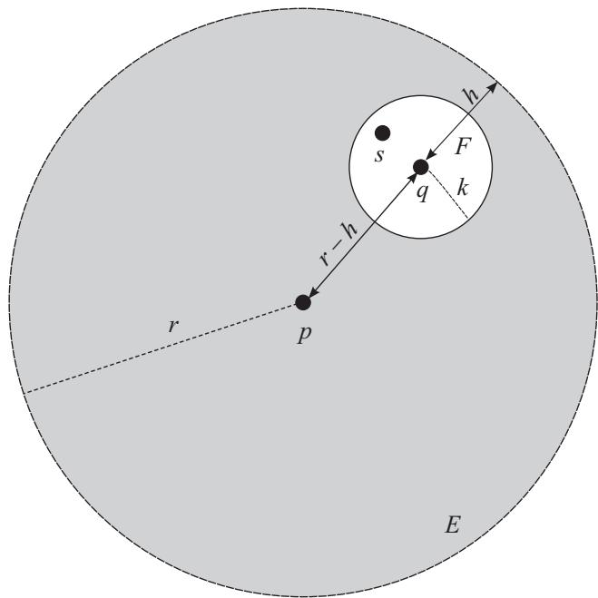

图 9.1 点 q 是 $N _ { r } ( p )$ 的内点

令 $E = N _ { r } ( p )$ ，那么对于任意
$q ∈ E , \ d ( p , q ) < r$ 意味着存在某个 $h > 0$ ，使得
$d ( p , q ) + h = r$ ．令 $F = N _ { h } ( q )$ ，那么对于任意
$s ∈ F$ ，均有 $d ( q , s ) < h$ ．X
是一个度量空间，所以根据三角不等式，我们有

$$
d (p, s) \leqslant d (p, q) + d (q, s) = r - h + d (q, s) <   (r - h) + h = r,
$$

因此 $s ∈ N _ { r } ( p ) = E$ ．由于 s 是任意，所以我们可以说
$N _ { h } ( q )$ 中的每个点都包含在 E 中，那么 q 就是 E
的一个内点．但 q 也是任意，所以我们可以说 E 中的每个点都是 E
的内点，因此 E 是一个开集

如果愿意的话，我们可以把几乎所有东西都用符号来表示，从而进一步缩短证明：

$$
  |  {∀ q ∈ E, d (p, q) <   r ⇒ ∃ h > 0 \text {使得} d (p, q) = r - h}
  |  {\qquad \text {且} ∀ s ∈ N _ {h} (q), d (q, s) <   h}
  |  {\qquad ⇒ d (p, s) \leqslant d (p, q) + d (q, s) <   r - h + h = r}
  |  {\qquad ⇒ s ∈ E}
  |  {\qquad ⇒ N _ {h} (q) ⊂ E}
  |  {\qquad ⇒ E \text {是开集}.}
$$

定义 9.24 (完备集).

如果度量空间的一个子集是闭集并且它的所有点都是极限点，那么这个子集就是一个完备集

换句话说，如果度量空间的一个子集的极限点恰好是它的所有点，那么这个子集就是完备集

例 9.25 (完备集).

在我们目前所见到的例子中，只有 $[ - 3 , 3 ]$
这样的闭区间是完备集．像{[}−3,3{]}∪\{100\}
这样的集合虽然是闭集，但不是完备集，因为 100 不是一个极限点

例 9.26 (不同集合的性质).

对于度量空间 X 的每一个子集
E，我们先考察它是否有界，然后再观察它的极限点和内点，进而确定它是闭集、开集或完备集

.}

- $E = ∅ .$

有界吗？有界，以任意点 $q ∈ X$ 和任意数 M 为界

极限点？没有，因为 E 中没有点

内点？没有，因为 E 中没有点

闭集？是的．因为 E 没有极限点，所以它包含所有的极限点

开集？是的．因为 E 中没有点，所以它的所有点都是内点

完备集？是的．E 是闭集并且 E 中没有点，所以它的所有点都是极限点

.}

- $E = \{ p \}$

有界吗？有界，以任意点 $q ∈ X$ 和数 $M = d ( p , q )$
为界．因为对于任意 $q ∈ X$ $q$ 与 $E$ 中任意一点的距离其实就是
$d ( p , q )$ ，并且 $d ( p , q ) \leqslant d ( p , q ) = M$

极限点？没有．围绕 p 的每一个邻域都只包含 E 的一个元素，即 $p$
本身．对于其他任意一点 $q ∈ X$ ，令 $0 < r < d ( p , q )$ ，则有
$N _ { r } ( q ) ∩ E = ∅$

内点？这完全取决于度量空间 X．如果 X 包含有限个点
$\{ q _ { 1 } , q _ { 2 } , ... , q _ { n } \}$ ，那么我们令

$$
r = \frac {1}{2} min \{d (p, q _ {1}), d (p, q _ {2}), ... , d (p, q _ {n}) \},
$$

此时 $N _ { r } ( p )$ 只包含 $p$ ，所以 $p$ 是 E 的内点

如果 X 包含无穷多个点，那么上述技巧就不起作用了，我们找不到 X 中与$p$
距离最小的点，因为没办法取无限集的最小值（只能取到下确界，但对这个例子没有帮助）．这里有两种可能的情形

情形 1. p 不是 E 的内点：例如，如果 X = 具有通常度量的 R，那么围绕p
的每一个邻域都包含 X 中不属于 E 点

情形 2. p 是 E 的内点：例如，如果
$X ⊂ \mathbb { R } \textrm { H } X = ( - ∈fty , - 1 ] ∪ \{ 0 \} ∪ [ 1 , ∈fty )$
并且 $p = 0$ ，那么 $N _ { 0 . 5 } ( p )$ 仅包含 X 中的一个点，即 p

闭集？是的．E 没有极限点，所以 E 包含所有的极限点

开集？同样地，这取决于度量空间．如果 p 是 E 的内点，那么 E 是开集，因为
E 的所有点都是内点．否则，E 不是开集

完备集？不是，E 是闭集，但它的唯一点 p 不是极限点

如本例所示，我们通常需要小心指定正在使用的度量空间

.}

- 在度量空间 X = R 中， $E = [ - 3 , 3 ]$

有界吗？根据例 9.4，有界

极限点？由例 9.10 可知，E 的每个点都是极限点

内点？根据例 9.20，除 −3 和 3 外，E 的每个点都是内点

闭集？是的．E 包含所有的极限点

开集？不是．E 中的点 −3 和 3 都不是内点，因此 E 不是开集

完备集？是的．E 是闭集并且 E 的所有点都是极限点

.}

- 在度量空间 X = R 中， $E = ( - 3 , 3 )$

有界吗？根据例 9.4，有界

极限点？由例 9.10 可知，E 的每个点都是极限点．另外，−3 和 3 也是 E
的极限点

内点？根据例 9.20，E 的每个点都是内点

闭集？不是．E 的两个极限点 −3 和 3 不包含在 E 中，所以 E 不是闭集

开集？是的．E 的每个点都是内点

完备集？不是．E 不是闭集

.}

- 在度量空间 X = R 中， $E = ( - 3 , 3 ]$

有界吗？根据例 9.4，有界

极限点？由例 9.10 可知，E 的每个点都是极限点．另外，−3 也是 E 的极限点

内点？除了 3 之外，E 的每个点都是内点

闭集？不是．E 的一个极限点 −3 不包含在 E 中，所以 E 不是闭集

开集？不是，E 中的点 3 不是内点

完备集？不是．E 不是闭集

注意，最后一个例子既不是闭集也不是开集

在下一章中，我们将更深入地探讨开集和闭集的性质．为此，我们会给出几个定理的证明，定义集合闭包的概念，并弄清楚对某个集合而言的开集为什么对另一个集合来说却不是开集．（我知道你迫不及待地想翻开下一页，但你最好先去见一见朋友．他们会想念你的．）

### 第 10 章 闭集和开集

上一章主要讨论定义，本章将给出一些重要的定理，这些定理将有助于我们更好地理解如何使用开集和闭集

定理 10.1 (开集的补集).

度量空间 X 的子集 E 是开集当且仅当 E 的补集是闭集

如果你认为开集有``虚线''边界（即不包含其边界），而闭集有``实线''边界，那么这个定理就是有意义的．如图
10.1 所示，如果一个集合有虚线边界，那么其边界点就是该集合之外的点

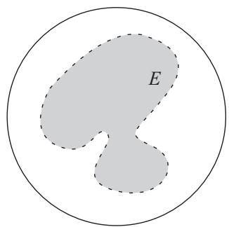

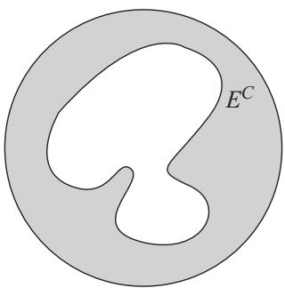

图 10.1 开集 E 是左侧的阴影区域（不包括虚线边框），闭集 $E ^ { C }$
是右侧的阴影区域（包括实线边框）

证明. 证明非常简洁．如果 $E ^ { C }$ 是闭集，那么 $x ∈ E$ 意味着 x
不可能是 $E ^ { C }$ 的极限点，因此存在 x 的某个邻域仅包含 E
中的点，所以 E 是开集．相反，如果 E是开集，那么对于 $E ^ { C }$
的任何极限点 x，x 的每个邻域都不会只包含 E 中的点，因此 x 不在 E
中，所以 $E ^ { C }$ 是闭集

如果你仍然对极限点和内点感到困惑，我们将通过填充具体的细节来展开整个证明

先证明定理的一个方向，假设 $E ^ { C }$ 是闭集．我们想证明 E
是开集，这意味着E 的每个点都存在一个完全包含在 E 中的邻域 $E ^ { C }$
包含其所有的极限点，所以对于任意 $x ∈ E$ ，我们有
$x ∉ E ^ { C }$ ，那么x既不是 $E ^ { C }$ 的点也不是
$E ^ { C }$ 的极限点．因此，x不满足极限点的定义，所以一定存在
$r > 0$ ，使得 $N _ { r } ( x ) ∩ E ^ { C } = \{ x \}$ 或
$= ∅$ 由于 $x ∉ E ^ { C }$ ，所以
$N _ { r } ( x ) ∩ E ^ { C }$ 中不包含 x，那么一定有
$N _ { r } ( x ) ∩ E ^ { C } = ∅$ ．由于$N _ { r } ( x )$
与 $E ^ { C }$ 没有公共点，因此 $N _ { r } ( x )$ 仅包含 E
的点，所以 $N _ { r } ( x ) ⊂ E .$ ．于是，x 是 E 的内点．由于 x
是任意，所以 E 的每个点都是内点，因此 E 是开集

为了证明另一个方向，假设 E 是开集．我们想证明 $E ^ { C }$
是闭集，这意味着 $E ^ { C }$ 包含其所有的极限点．如果 x 是
$E ^ { C }$ 的极限点，那么对于任意
$r > 0 , N _ { r } ( x ) ∩ E ^ { C }$ 至少包含 $E ^ { C }$
的一个点．因此 $N _ { r } ( x )$ 不仅仅包含 E 的点，所以 x
的每个邻域都不完全包含在 E 中，因此 x 不可能是 E 的内点．但 E
的每个点都必须是内点，所以 x 不在 E 中，那么 $x ∈ E ^ { C }$ ．由于
x 是 $E ^ { C }$ 的任意极限点，因此 $E ^ { C }$ 的每个极限点都属于
$E ^ { C }$ ，所以 $E ^ { C }$ 是闭集 □

推论 10.2 (闭集的补集).

度量空间 X 的子集 F 是闭集当且仅当 F 的补集是开集

证明. 如果 $F ^ { C }$ 是开集，那么由上一个定理可知， $F ^ { C }$
的补集一定是闭集．但 $( F ^ { C } ) ^ { C }$ 和 F 是一样的，所以 F
是闭集．同样地，如果 F 是闭集，那么补集为 F
的集合一定是开集，而这个集合显然就是 $F ^ { C }$ □

前面的定理和推论为我们提供了一个将闭集和开集联系起来的好方法，但不要放松警惕．始终记住，开集不是闭集的反义词（因为集合可以既是开集又是闭集，也可以两者都不是------参见例
9.26）

定理 10.3 (开集的无限并与闭集的无限交).

任意一组开集的并仍是开集

用符号来表示，即：

$$
∀ \alpha G _ {\alpha} \text {是开集} ⇒ ⋃_ {\alpha} G _ {\alpha} \text {是开集}.
$$

同样地，任意一组闭集的交仍是闭集

用符号来表示，即：

$$
∀ \alpha F _ {\alpha} \text {是闭集} ⇒ ⋂_ {\alpha} F _ {\alpha} \text {是闭集}.
$$

证明. $⋃ _ { \alpha } G _ { \alpha }$
的每个点都是某个 $G _ { \alpha }$
的内点，因此该点的某个邻域完全包含在并集中
$⋂ _ { \alpha } F _ { \alpha }$ 的每个极限点的每个邻域都与所有的
$F _ { \alpha }$ 相交，因此该点是所有 $F _ { \alpha }$
的极限点，那么它也是交集中的元素．接下来我们给出严格的论述

对于任意 $x ∈ ⋃ _ { \alpha } G _ { \alpha }$
，存在某个 α 使得 $x ∈ G _ { \alpha }$ ．因为 $G _ { \alpha }$
是开集，所以 x是 $G _ { \alpha }$ 的内点，那么 $∃ r > 0$ 使得
$N _ { r } ( x ) ⊂ G _ { \alpha }$ ．又因为
$G _ { \alpha } ⊂ ⋃ _ { \alpha } G _ { \alpha }$
，所以 $N _ { r } ( x )$ 也包含在
$⋃ _ { \alpha } G _ { \alpha }$ 中，因此 x 也是
$⋃ _ { \alpha } G _ { \alpha }$ 的内点．由于 x
是任意，所以 $⋃ _ { \alpha } G _ { \alpha }$
的每个点都是内点，因此它是开集

设 x 为 $⋂ _ { \alpha } F _ { \alpha }$
的一个极限点，因此对于任意 $r > 0$ ，有

$$
N _ {r} (x) ∩ \left(⋂_ {\alpha} F _ {\alpha}\right) \neq \{x \}   \text {且}   \neq ∅ .
$$

这意味着对于每个 α，
$N _ { r } ( x ) ∩ F _ { \alpha } \neq \{ x \}$ 且
$\neq ∅$ ．（为什么？如果 x 的邻域和所有 $F _ { \alpha }$
的交集包含某个元素，那么该邻域和任何一个 $F _ { \alpha }$
的交集当然也包含这个元素．）由于每个 $F _ { \alpha }$
都是闭集，所以对于任意 $\alpha$ 均有 $x ∈ F _ { \alpha }$ ，因此
$x ∈ ∩ _ { \alpha } F _ { \alpha }$ 由于 x 是任意一个极限点，因此
$⋂ _ { \alpha } F _ { \alpha }$ 的每个极限点都是
$⋂ _ { \alpha } F _ { \alpha }$ 中的点，所以它是闭集

注意这两个论证的相似之处．我们任意选取一个点或极限点，并直接利用开集或闭集以及并集或交集的定义．但是，如果在证明第二部分时遇到了困难，你可以直接利用推论
10.2 和德摩根律来证明：由于 $F _ { \alpha }$ 是闭集，所以
$F _ { \alpha } ^ { C }$ 是开集，那么根据第一部分的证明，
$⋃ _ { \alpha } ( F _ { \alpha } ^ { C } )$
也是开集．由德摩根律可知，
$\begin{array} { r } { ( ⋂ _ { \alpha } F _ { \alpha } ) ^ { C } = ⋃ _ { \alpha } ( F _ { \alpha } ^ { C } ) } \end{array}$
因此 $⋂ _ { \alpha } F _ { \alpha }$ 一定是闭集 □

定理 10.4 (开集的有限交和闭集的有限并).

任意有限个开集的交仍是开集

用符号来表示，即：

$$
\text { 对于 } 1 \leqslant i \leqslant n, G _ {i} \text { 是开集 } ⇒ ⋂_ {i = 1} ^ {n} G _ {i} \text { 是开集 }.
$$

同样地，任意有限个闭集的并仍是闭集

用符号来表示，即：

$$
\text {对于} 1 \leqslant i \leqslant n, F _ {i} \text {是闭集} ⇒ ⋃_ {i = 1} ^ {n} F _ {i} \text {是闭集}.
$$

这个定理（与上一个定理）的不同之处在于集合必须是有限多个

如例 3.14 所示，对于任意 $n ∈ \mathbb { N }$ ，令
$A _ { n } = \left( - { \frac { 1 } { n } } , { \frac { 1 } { n } } \right)$
，那么
$⋂ _ { n = 1 } ^ { ∈fty } A _ { n } = \{ 0 \}$ 每个
$A _ { n }$ 都是 R 中的开集，但它们的无限交是一个点，而点在 R
中不是开集

同样地，在例 3.14 中我们还看到，对于任意 $n ∈ \mathbb { N }$ ，令
$\begin{array} { r } { A _ { n } = [ 0 , 2 - \frac { 1 } { n } ] } \end{array}$
，那么
$⋃ _ { n = 1 } ^ { ∈fty } A _ { n } = [ 0 , 2 )$
．不过，我们从未真正证明过这一点，所以现在就开始吧．对于任意
$0 \leqslant x < 2$ ，由阿基米德性质可知，存在 $n ∈ \mathbb { N }$
使得 $n > { \frac { 1 } { 2 - x } }$ ，因此

$$
2 n - 1 > n x ⇒ x <   2 - \frac {1}{n}.
$$

所以，对于任意 $x ∈ [ 0 , 2 )$ ，存在某个 $n ∈$ N 使得
$x ∈ [ 0 , 2 \mathrm { ~ - ~ } { \frac { 1 } { n } } ]$
，因此 $x ∈$
$⋃ _ { n = 1 } ^ { ∈fty } [ 0 , 2 - { \frac { 1 } { n } } ]$
．（但是，该并集不包含数 2，因为找不到 $n ∈ \mathbb N$ 使得
$2 ∈ A _ { n } . \quad )$ 每个 $A _ { n }$ 都是 R
中的闭集，但它们的无限并是一个半开区间，不是 R 中的闭集（虽然 2 是
{[}0,2) 的极限点，但 2 不包含在该区间内）

这里并不是说开集的无限交一定不是开集，有时是开集，有时不是开集．例如，对于任意
$n ∈ \mathbb N$ ，令 $A _ { n } = ( - 3 , 3 )$ ．那么每个
$A _ { n }$ 都是 R
中的开集，并且$⋂ _ { n = 1 } ^ { ∈fty } A _ { n } = ( - 3 , 3 )$
也是 R 中的开集．类似的结论同样适用于闭集的无限并

证明.
因为有限性是这个定理的一个关键假设，所以我们在证明中自然会用到它$⋂ _ { i = 1 } ^ { n } G _ { i }$
的每个点都是所有 $G _ { i }$
的内点，因此其半径最小的邻域会完全包含在交集中
$⋃ _ { i = 1 } ^ { n } F _ { i }$
的每个极限点一定是某个 $F _ { i }$ 的极限点，所以它会包含在那个
$F _ { i }$ 中，从而也会包含在并集中．接下来我们给出严格的论述

令 $x ∈ ⋂ _ { i = 1 } ^ { n } G _ { i }$
．我们想证明 x 是该交集的内点．对于 $1 \leqslant i \leqslant n$ 有
$x ∈ G _ { i }$ 由于每个 $G _ { i }$ 都是开集，所以存在
$r _ { i } > 0$ 使得 $N _ { r _ { i } } ( x ) ⊂ G _ { i }$
．因为 n 是有限的，所以我们可以取最小的半径，令
$r = \operatorname* { m i n } \{ r _ { 1 } , r _ { 2 } , ... , r _ { n } \}$
．那么对于 $1 \leqslant i \leqslant n$ 有

$$
N _ {r} (x) ⊂ N _ {r _ {i}} (x) ⊂ G _ {i}.
$$

因为 $N _ { r } ( x )$ 是所有 $G _ { i }$ 的子集，所以
$\begin{array} { r } { N _ { r } ( x ) ⊂ ⋂ _ { i = 1 } ^ { n } G _ { i } } \end{array}$
，因此 x 确实是 $⋂ _ { i = 1 } ^ { n } G _ { i }$
的内点

设 x 是 $⋃ _ { i = 1 } ^ { n } F _ { i }$
的极限点，我们想证明 x 是该并集的元素．如果 x 是某个$F _ { i }$
的极限点，那么它就是该 $F _ { i }$ 的元素，所以
$x ∈ ⋃ _ { i = 1 } ^ { n } F _ { i }$
．我们只需要证明 x 是某个 $F _ { i }$
的极限点即可．下面通过反证法来证明这一点．假设 x 不是任何 $F _ { i }$
的极限点，那么对于 $1 \leqslant i \leqslant n$ ，存在某个
$r _ { i } > 0$ 使得
$N _ { r _ { i } } ( x ) ∩ F _ { i } = \{ x \}$ 或 $= ∅$
．由于 n 是有限的，所以我们可以取最小的半径，令
$r = \operatorname* { m i n } \{ r _ { 1 } , r _ { 2 } , · · · , r _ { n } \}$
．那么对于 $1 \leqslant i \leqslant n$ 有

$$
(N _ {r} (x) ∩ F _ {i}) ⊂ (N _ {r _ {i}} (x) ∩ F _ {i}) = \{x \} \text {或} = ∅ .
$$

因此
$N _ { r } ( x ) ∩ ( ⋃ _ { i = 1 } ^ { n } F _ { i } ) = \{ x \}$
或 = ∅，这与 x 是 $⋃ _ { i = 1 } ^ { n } F _ { i }$
的极限点相矛盾

为了证明第二个命题，我们同样可以直接利用定理 10.1 和德摩根律，如下框所示

### 证明有限多个闭集的并仍是闭集

因为 $F _ { i }$ 是闭集，所以 $F _ { i } ^ { C }$ 是
，那么由第一部分的证明可知，$∩ _ { i = 1 } ^ { n } ( F _ { i } ^ { C } )$
也是 ．根据德摩根律，我们有
$⋂ _ { i = 1 } ^ { n } ( F _ { i } ^ { C } ) =$
那么，因为其补集是 ，所以
$⋃ _ { i = 1 } ^ { n } F _ { i }$ 一定是闭集

定义 10.5 (闭包).

度量空间 X 的子集 E 的所有极限点的集合记为 E′．E 的闭包（记作 E）是集合
$E ∪ E ^ { ' }$

例 10.6 (闭包).

如果 $E = ( - 3 , 3 )$ ，那么由例 9.10 可知，
$- 3 , 3 ∈ E ^ { ' }$ ．另外，(−3,3) 的每个点也都是 E
的极限点，所以 $( - 3 , 3 ) ⊂ E ^ { ' }$ ．因此，
$E ^ { ' } = \{ - 3 , 3 \} ∪ ( - 3 , 3 ) = [ - 3 , 3 ]$
$\overline { { E } } = ( - 3 , 3 ) ∪ [ - 3 , 3 ]$ ，即闭区间
{[}−3,3{]}

定理 10.7 (闭包是闭集). 对于度量空间 X 的任意子集
$E , { \overline { { E } } }$ 是闭集

证明. 根据定理 10.1，我们只需证明 $\overline { { E } } ^ { C }$
是开集．对于任意 $p ∈ \overline { { E } } ^ { C }$ ，我们要证明存在
$r > 0$ 使得 $N _ { r } ( p )$ 完全包含在
$\overline { { E } } ^ { C }$ 中．换句话说，我们想得到
$N _ { r } ( p ) ∩ \overline { { E } } = ∅$ 这意味着
$N _ { r } ( p ) ∩ E = ∅$ 且
$N _ { r } ( p ) ∩ E ^ { ' } = ∅$

$p ∈ { \overline { { E } } } ^ { C }$ 意味着 $p ∉ E$ ，并且 p
不是 E 的极限点，所以存在某个 $r > 0$
使得$N _ { r } ( p ) ∩ E = ∅$

现在我们只需证明 $N _ { r } ( p ) ∩ E ^ { ' } = ∅$
．下面利用反证法来证明这一点．假设存在一个 q，使得
$q ∈ N _ { r } ( p ) ∩ E ^ { ' }$ ，如图 10.2 所示．这个 q
具有两种属性： $d ( p , q ) < r$ （因为 q 在 p 的邻域中），并且 q 是 E
的极限点（因为 $q ∈ E ^ { ' } )$
．选取一个$k < r - d ( p , q )$ ，使得
${ N _ { k } } ( q ) ⊂ { N _ { r } } ( p )$ ．因为 q 是 E
的极限点，所以 $N _ { k } ( q )$ 中一定至少包含 E 的一个点，那么
$N _ { r } ( p )$ 中也至少包含 E 的一个点，这与我们上一段的结论相矛盾
□

推论 10.8 (等于闭包 ⇐⇒ 闭集).

对于度量空间 X 的任意子集 $E , ~ E = { \overline { { E } } }$ 当且仅当
E 是闭集

证明. 如果 $E = { \overline { { E } } }$ ，那么因为（根据上一个定理）E
是闭集，所以 E 也是闭集如果 E 是闭集，那么由闭集的定义可知，
$E ^ { ' } ⊂ E$ ，所以
$E = E ∪ E ^ { ' } = \overline { { E } }$ □

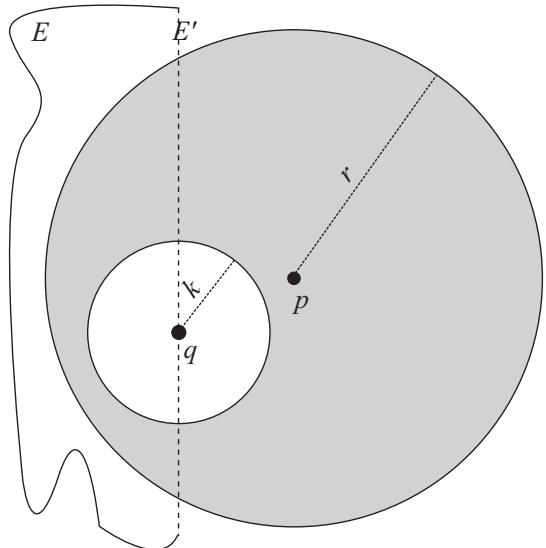

图 10.2 集合 E 的极限点由虚线 $E ^ { ' }$ 表示．如果
$N _ { r } ( p ) ∩ E ^ { ' }$ 包含一个点 q，那么
$N _ { r } ( p )$ 一定至少包含 E 的一个点

推论 10.9 (闭包是每个闭超集的子集).

设 E 是度量空间 X 的任意一个子集， $F ⊂ X$ 是任意一个闭集．如果
$E ⊂ F$ 那么 ${ \overline { { E } } } ⊂ F$

这个推论表明，集合 E 的闭包是包含 E 的最小闭集（因为 E
的每个闭超集都包含闭包 $\overline { { E } } )$
．这个结论应该比较直观，因为如果想构造一个包含 E
的闭集，那么你就不能忽略 E 的任何极限点

证明. 如果 $E ⊂ F$ ，那么 F 的极限点集一定至少包含 E
的极限点集，即 $E ^ { ' } ⊂ F ^ { ' }$ 如果 F
还是闭集，那么 $F ^ { ' } ⊂ F$ ，所以
$E ^ { ' } ⊂ F$ ，因此
$F ⊃ ( E ∪ E ^ { ' } ) = { \overline { { E } } }$ □

下一个定理将极限点与
中的上确界联系起来，为我们提供了有序集理论和度量空间理论（至少在实数集上）之间的一座桥梁．记住，大多数度量空间都不是有序域（例如，R2）

定理 10.10 (闭包中的实数上确界和下确界).

对于 R 中任意一个有上界的非空子集 $E$ ，有
$\operatorname { s u p } E ∈ { \overline { { E } } }$ ．如果 E
有下界，那么 $\operatorname { i n f } E ∈ { \overline { { E } } }$

证明. 假设 E 有上界，并且令 $y = \operatorname* { s u p } E$ ．如果
$y ∈ E$ ，那么显然 $y ∈ { \overline { { E } } }$
，因此我们只需要考虑 $y ∉ E$ 的情况．由上确界的定义可知，E
的每个元素都 $\leqslant y$ ，并且小于 y 的任何数都不是 E
的上界．因此，对于任意 $h > 0$ ，存在 $x ∈ E$
，使得$y - h < x < y$ （否则 $y - h$ 就是 E 的上界）．换句话说，
$x ∈ N _ { h } ( y ) ∩ E .$ ．因为 h是任意，所以 y 是 E
的极限点．因此 $y ∈ { \overline { { E } } } .$

对下确界的证明基本上是一样的．试着通过填充下框中的空白来复述上面的论证

### 证明定理 10.10 中关于下确界的结论

假设 ，并令 $y = \operatorname { i n f } E .$ ．如果 $y ∈ E$
，那么 $y ∈ .$ ．如果$y ∉ E$ ，那么 E 中的每个元素都
y，而且任意一个大于 y 的数都不是的 ．因此，对于任意 $h > 0$ ，存在
$x ∈ E$ 使得 $y < x <$ （否则， 就是 的下界）．换句话说，
$x ∈ N _ { h } ( y ) ∩ E .$ ．因为h 是任意，所以 y 是 E 的
．因此， $∈ { \overline { { E } } } .$

推论 10.11 (具有实数界的闭集包含其上确界和下确界).

对于 R 中任意一个有上界的非空子集 E，如果 E 是闭集，那么
$\operatorname* { s u p } E ∈ E$ 如果 E 是有下界的闭集，那么
$\operatorname { i n f } E ∈ E$

注意，这个推论的逆命题
$( \operatorname* { s u p } E ∈ E ⇒ E$
是闭集）不一定为真．例如，R中的集合 $E = [ - 3 , 0 ) ∪ ( 0 , 3 ]$
包含其下确界和上确界（分别为 −3 和 3），但 E 不是闭集，因为 0
是一个极限点

证明. 根据上一个定理，我们知道
$\operatorname { s u p } E ∈ { \overline { { E } } }$ （当 E
有上界时）和 $\operatorname { i n f } E ∈ { \overline { { E } } }$
（当E 有下界时）．由推论 10.8 可知，如果 E 是闭集，那么
$E = { \overline { { E } } }$
，所以的确有$\operatorname* { s u p } E ∈ E$ （当 E 有上界时）和
$\operatorname { i n f } E ∈ E$ （当 E 有下界时） □

现在是时候告诉你这样一个事实：集合的大多数拓扑特征完全取决于该集合所在的度量空间．例如，在例
9.26 中，开区间 (−3,3) 是 中的开集，但在 $\mathbb { R } ^ { 2 }$
中它就不是开集了，因为 $\mathbb { R } ^ { 2 }$
中的邻域是一个圆盘，并且任何圆盘都包含具有二维坐标的点，而这些点不属于一维开区间
(−3,3)．为了解决这种可能的歧义，我们首先要正式定义相对开集

定义 10.12 (相对开集).

设 E 是一个集合．如果对于任意 $p ∈ E$ ，存在 $r > 0$ ，使得

$$
q ∈ Y   \text { 且 }   d (p, q) <   r ⇒ q ∈ E.
$$

那么集合 E 相对于 Y 是开集

这与定义 9.21 基本相同．唯一的区别是，对于每个 $p ∈ E$ ，不要求存在
$r > 0$ 使得 $N _ { r } ( p ) ⊂ E$ ，而是要求存在 $r > 0$
使得 $N _ { r } ( p ) ∩ Y ⊂ E$

例 10.13 (相对开集).

在前面的例子中，我们看到 $E = ( - 3 , 3 )$ 相对于 Y = R
是开集，但相对于$Y = \mathbb { R } ^ { 2 }$ 不是开集

当然，对于度量空间 X 的任意一个子集 E，``E 相对于 X
是开集''与``E是开集''是一样的，因为 X 是整个度量空间

定理 10.14 (相对开集).

对于任意度量空间 $Y ⊂ X , Y$ 的子集 E 相对于 Y
是开集，当且仅当存在X 的某个开子集 G，使得 $E = Y ∩ G$

换句话说，Y 的每一个相对开子集E 都可以表示为X 的开子集G的Y 部分

证明. 我们从简单的方向开始，即如果存在某个相对于 X 是开集的集合
G，使得$E = Y ∩ G$ ，那么 E 相对于 Y 也是开集．我们知道对于每一个
$p ∈ G$ ，G 中都包含 p 的某个邻域．因为 $E ⊂ G$
，所以对于每个 $p ∈ E$ 也有相同的结论．我们称这个邻域为
$V _ { p }$ （写 $N _ { r } ( p )$ 可能会引起混淆，我们要清楚这是 X
中的邻域，而不是Y 中的邻域）．让 Y 与两端同时作交集就可以得到
$( V _ { p } ∩ Y ) ⊂ ( G ∩ Y ) = E$ ．因此，对于每一个
$p ∈ E$ ，E 都包含一个 Y 中的邻域，所以 E 相对于 Y 是开集

为了证明另一个方向，我们希望证明如果 E 相对于 Y
是开集，那么我们可以构造一个相对于 X 是开集的 G，而这个 G 必须由 E 加上
X 中的某些其他点构成．基本思路是，我们知道每一个 $p ∈ E$ 都有一个 Y
中的邻域，并且该邻域完全包含在 E 中．为了构造一个相对于 X
的开集，我们需要``扩展''这些邻域，使其包含
$\{ x ∈ X | d ( p , x ) < r \}$ 中的所有点，而不仅仅是
$\{ y ∈ Y | d ( p , y ) < r \}$ 中的点（参见图
10.3）．我们如何确保这些扩展邻域中的点都属于 $G ?$
很简单，我们直接把它们包含在 G 中．由定理 9.23
可知，所有的邻域都是开集，所以 G 是X 中开集的并，那么根据定理 10.3，G 在
X 中也是开集

接下来给出这个方向的严格证明．如果 E 相对于 Y 是开集，那么对于每一个
$p ∈ E$ ，都存在一个 $r _ { p } > 0$ ，使得所有满足
$d ( p , q ) < r _ { p }$ 的 $q ∈ Y$ 均包含在 E中．令
$V _ { p }$ 为所有满足 $d ( p , q ) < r _ { p }$ 的点 $q ∈ X$
的集合（那么 $V _ { p }$ 就是``扩展''到X 的邻域），令
$G = ⋃ _ { p ∈ E } V _ { p }$ ．每个 $V _ { p }$
都是 X 中的一个邻域，所以每个 $V _ { p }$ 相对于 X 是开集，那么 G
是开集的并，因此 G 也相对于 X 是开集

为了证明 $E = Y ∩ G$ ，我们将使用第 3 章的方法，即证明
$E ⊂ Y ∩ G$ 且$E ⊃ Y ∩ G$ ．对于 E 的每一个元素
p，
$p ∈ E ⇒ p ∈ Y \mathrm { ~ H ~ } p ∈ V _ { p } ⇒ p ∈ G$
所以 $p ∈ Y ∩ G$ ．因此 $E ⊂ Y ∩ G .$
．同样地，对于每一个 $p ∈ E$ ，由 $V _ { p }$ 的构造不难看出，
$V _ { p } ∩ Y$ 恰好是 p 在 Y 中的邻域，并且它完全包含在 E
中．因此$\begin{array} { r } { E ⊃ ⋃ _ { p ∈ E } ( Y ∩ V _ { p } ) = Y ∩ ( ⋃ _ { p ∈ E } V _ { p } ) } \end{array}$
，所以 $Y ∩ G ⊂ E$ □

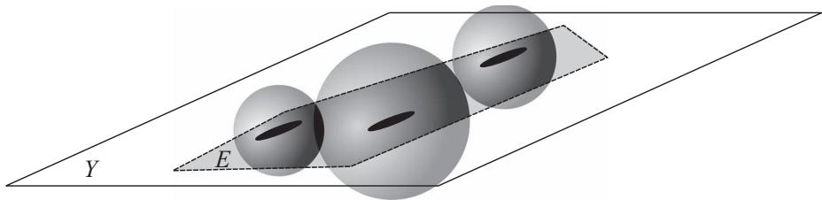

图 10.3 集合 E 是 2-维度量空间 Y 中的五边形．由于 E
的每个点都有一个完全包含在 E中的邻域，因此我们想把这些邻域扩展为
3-维度量空间 X 中的球体

需要指出的是，与开集一样，闭集也是一种相对属性．相对于 Y 的闭集
E可能相对于 X 不是闭集（比如，E 在 X 中有极限点，但在 Y 中没有）

如果对于每一个满足下列条件的 $p ∈ Y$

$$
N _ {r} (p) ∩ E \neq \{∅ \} \text {且} \neq \{p \},
$$

均有 $p ∈ E$ ，那么 E 相对于 Y 是闭集

例 10.16 (相对闭集).

如果 X = R 且 $Y = [ 0 , 2 )$ ，那么 $E = \left⌈ 1 , 2 \right.$
在 Y 中是闭集，但在 X 中不是闭集．（2 显然是 E 的极限点，但是由于
$2 \not ∈ Y$ ，所以当考虑 E 相对于 $Y$ 的情况时，不需要检验
$2 ∈ E . \ )$ ）

在对开集和闭集有了深入了解后，我们就可以开始学习拓扑学的核心内容：紧集．（你是否觉得我们已经有一段时间没给出新定义了？哈！）

### 第 11 章 紧集

哦，紧集．对新手来说，这部分内容可能会非常混乱，但它们是实分析不可或缺的组成部分．（明白了吗？不可或缺的部分？！）当讨论连续函数的相关性质时，它们会多次出现

我们将从本章``紧集鉴赏''开始．在这一章中，我们会学习紧集的定义，并了解紧集的出色性质．在下一章中，我们将学习
R 中哪些类型的集合是紧的（以及这部分内容为什么如此重要）

定义 11.1 (开覆盖).

设 E 是度量空间 X 的任意一个子集．X 中 E 的开覆盖是一族集合
$\{ G _ { \alpha } \}$ 其中每个集合都是相对于 X 的开集，并且 E
包含在这些集合的并中

用符号来表示，即：如果

$$
∀ \alpha , G _ {\alpha} \text {相对于} X \text {是开集, 并且} E ⊂ ⋃_ {\alpha} G _ {\alpha},
$$

那么 $\{ G _ { \alpha } \}$ 是 E 的一个开覆盖

E 的开覆盖 $\{ G _ { \alpha } \}$ 的有限子覆盖是由
$\{ G _ { \alpha } \}$ 中有限多个集合组成的一族集合，并且 E
仍包含在这有限多个集合的并中

用符号来表示，即：如果

$$
n ∈ \mathbb {N}   \text {且}   E ⊂ ⋃_ {i = 1} ^ {n} G _ {\alpha_ {i}}  ,
$$

那么
$\{ G _ { \alpha _ { 1 } } , G _ { \alpha _ { 2 } } , · · · , G _ { \alpha _ { n } } \}$
就是 $\{ G _ { \alpha } \}$ 的一个有限子覆盖

在有限子覆盖的定义中，存在有限多个索引
$\alpha _ { 1 } , \alpha _ { 2 } , ... , \alpha _ { n }$ ．每个
$G _ { \alpha _ { i } }$ 都是集族 $\{ G _ { \alpha } \}$
中的一个元素．（为了彻底形式化，我们把开覆盖记作
$\{ G _ { \alpha } | \alpha ∈ { \mathcal { A } } \}$
所以有限子覆盖中集合的索引应该是
$\alpha _ { 1 } , \alpha _ { 2 } , · · · , \alpha _ { n } ∈ \mathcal { A } . \ )$

例 11.2 (开覆盖).

集合

$$
\{(z - 2, z + 2) | z ∈ \mathbb {Z} \}
$$

是区间 {[}−3,3{]} 的一个开覆盖，因为每个开区间 $( z - 2 , z + 2 )$
（长度为 4）都是开集集合 $\{ ( - 4 , 0 ) , ( - 1 , 3 ) , ( 2 , 6 ) \}$
\}是一个有限子覆盖，
$\{ ( - 5 , - 1 ) , ( - 3 , 1 ) , ( - 2 , 2 ) , ( 1 , 5 ) \}$
和其他许多集合也都是有限子覆盖．正如你所看到的，一个开覆盖可以有多个可能的有限子覆盖

设 E 是任意一个度量空间的子集，为每个 $p ∈ E$ 选择一个半径 r
（半径可 $r _ { p }$ 以是不同的）．那么集族
$\{ N _ { r _ { p } } ( p ) | p ∈ E \}$ 是 E
的一个开覆盖，为什么？显然，E 的每个点都包含在该集合中，并且由定理 10.3
可知，邻域的并是开集．（定理 10.14 的证明使用了类似的集族．）

假设 E 中包含有限个点．那么开覆盖
$\{ N _ { r _ { p } } ( p ) | p ∈ E \}$
中集合的个数是有限的，所以它也是（自身的）有限子覆盖．（注意，虽然每个邻域都可以包含无穷多个点，但有限子覆盖要求集合的个数有限，而不是点的个数有限．）

假设 E 中包含无穷多个点，但我们被告知
$\{ N _ { r _ { p } } ( p ) | p ∈ E \}$
包含一个有限子覆盖．那么我们知道 E 中一定存在有限多个点
$p _ { 1 } , p _ { 2 } , ... , p _ { n }$ 使得

$$
E ⊂ ⋃_ {i = 1} ^ {n} N _ {r _ {p _ {i}}} (p _ {i}).
$$

定义 11.3 (紧集).

设 K 是度量空间 X 的一个子集．如果 K
的每个开覆盖都有一个有限子覆盖，那么 K 就是一个紧集

用符号来表示，即：如果

$$
∀ K \text {的开覆盖} \{G _ {\alpha} \}, ∃ \{\alpha_ {1}, \alpha_ {2}, ... , \alpha_ {n} \} \text {使得} K ⊂ ⋃_ {i = 1} ^ {n} G _ {\alpha_ {i}},
$$

那么 K 是一个紧集

紧集比开集和闭集复杂得多．为了证明集合是紧的，我们必须证明每一个可能的开覆盖都存在一个有限子覆盖，这需要一些重要的证明技巧．证明集合不是紧集会稍微容易一些，因为我们只需要找到一个不存在有限子覆盖的无限开覆盖即可（但这仍有一定的难度）

例 11.4 (紧集).

空集是紧集，因为对于任意一个开覆盖 $\{ G _ { \alpha } \}$
，我们可以任取一个集合 $G _ { \alpha _ { 1 } }$ 它必然满足
$∅ ⊂ G _ { \alpha _ { 1 } }$

考虑只包含一个点的集合 $K = \{ p \}$ ．K 显然是紧的，因为每个开覆盖
$\{ G _ { \alpha } \}$ 都至少有一个包含点 $p$ 的集合．任取一个包含点
$p$ 的集合，那么这个集合就构成了一个有限子覆盖

实际上，任何包含有限多个点
$p _ { 1 } , p _ { 2 } , ... , p _ { n }$ 的集合 K
都是紧集．为什么？对于任意开覆盖 $\{ G _ { \alpha } \}$
，从中选取一个包含 $p _ { 1 }$ 的集合
$G _ { \alpha _ { 1 } } ∈ \{ G _ { \alpha } \}$
．按照同样的方法继续下去：对于每一个 $p _ { i } ∈ K$
，如果目前选取的集合都不包含 $p _ { i }$ ，那就取一个包含
$p _ { i }$ 的 $G _ { \alpha _ { i } } ∈ \{ G _ { \alpha } \}$
．经过最多 n
步之后，我们得到了一族有限多个开集$\{ G _ { \alpha _ { 1 } } , G _ { \alpha _ { 2 } } , · · · , G _ { \alpha _ { n } } \}$
，并且 K 包含在它们的并集中

下一个定理是非紧集的一个很好的基本例子

定理 11.5 (开区间不是紧集).

对于任意 $a , b ∈$ R，其中 $a < b$ ，开区间 (a, b)（或
$( a , b ) ∩ \mathbb { Q } )$ 不是紧集

证明. 为了证明 $( a , b )$
不是紧集，只需找到一个不存在有限开子覆盖的开覆盖．我们利用开覆盖

$$
\left\{G _ {n} \right\} = \left\{\left(a + \frac {1}{n}, b - \frac {1}{n}\right) \Bigg | n ∈ \mathbb {N} \right\}.
$$

（如果出现了无效区间，比如 (1,0)，我们就忽略这个元素．）

图 11.1 给出了关键思路．不难看出 $\left\{ G _ { n } \right\}$
是一个覆盖，因为对于任意元素$x ∈ ( a , b )$
，我们可以利用阿基米德性质找到一个足够大的 N，使得
$x ∈ ( a + { \frac { 1 } { N } }$
$b - { \frac { 1 } { N } } )$ ．但是
$\left\{ G _ { n } \right\}$ 没有有限子覆盖，因为对于给定的开区间
$\begin{array} { r } { ( a + \frac { 1 } { N } , b - \frac { 1 } { N } ) } \end{array}$
，我们可以利用稠密性找到该区间之外的元素 $y ∈ ( a , b )$

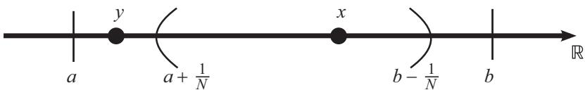

图 11.1 对于任意 $x ∈ ( a , b )$ ，我们可以找到一个 N 使得
$\begin{array} { r } { x ∈ ( a + \frac { 1 } { N } , b - \frac { 1 } { N } ) } \end{array}$
．但对于给定的
$\begin{array} { r } { ( a + \frac { 1 } { N } , b - \frac { 1 } { N } ) } \end{array}$
，我们可以找到该区间之外的元素 $y ∈ ( a , b )$

严格地说，为什么
$⋃ _ { n = 1 } ^ { ∈fty } G _ { n }$ 能覆盖
$( a , b ) ?$ 对于满足 $a < x < b$ 的任意元素 $x$
，由阿基米德性质可知，存在一个 $N ∈  { \mathbb { N } }$ ，使得

$$
N > max \left\{\frac {1}{x - a}, \frac {1}{b - x} \right\}.
$$

因此

$$
 N x - N a > 1 \text {且} N b - N x > 1  |  ⇒ N a + 1 <   N x <   N b - 1
  |  ⇒ x ∈ (a + \frac {1}{N}, b - \frac {1}{N}).
$$

所以对于 $( a , b )$ 的每一个元素，均存在某个
$N ∈  { \mathbb { N } }$ 使得该元素包含在 $G _ { N }$ 中．于是
$( a , b ) ⊂ ⋃ _ { n = 1 } ^ { ∈fty } G _ { n }$

严格地说，为什么 $\{ G _ { n } \}$ 没有有限子覆盖？对于任意 $m > n$
，我们有

$$
a + \frac {1}{m} <   a + \frac {1}{n} <   b - \frac {1}{n} <   b - \frac {1}{m},
$$

所以 $G _ { m } ⊃ G _ { n }$ ．因此，对于任意有限的
$N ∈ \mathbb N$ ，有

$$
⋃_ {n = 1} ^ {N} G _ {n} = G _ {N} = \left(a + \frac {1}{N}, b - \frac {1}{N}\right),
$$

但是 $( a , b ) \not ⊂ G _ { N }$ ，例如，
$a + { \frac { 1 } { 2 N } } ∈ ( a , b )$ ，但
$\begin{array} { r } { a + \frac { 1 } { 2 N } ∉ ( a + \frac { 1 } { N } , b - \frac { 1 } { N } ) } \end{array}$

你可能会问：``既然集合相对于某些度量空间是开集或闭集，但相对于其他度量空间则不是，那么紧集呢？''事实上，在紧集的定义中，我们完全回避了这个问题．我们甚至没有具体说明是在
X 中还是在其他度量空间中考察 K 的开覆盖

正如下一个定理所说，这真的不重要！如果集合 K
在某个度量空间中是紧集，那么它在每个度量空间中都是紧集（当然，只要这个度量空间包含
K）

由于度量空间 X 的紧子集 K
也是度量空间，并且在任何地方都是紧的，所以我们通常将 K
称为紧度量空间．当然，``闭度量空间''或``开度量空间''的说法没有太大意义．任何度量空间
X 都是其自身的闭子集（因为它包含 X
中的所有极限点），也是其自身的开子集（因为所有邻域都只包含 X 中的点）

定理 11.6 (相对紧致).

对于任意度量空间 $Y ⊂ X$ ，Y 的子集 K 相对于 X 是紧集当且仅当 K
相对于 Y 是紧集

这里的``K 相对于 Y 是紧集''是指对于任意开覆盖 $\{ V _ { \alpha } \}$
（其中每个 $V _ { \alpha } ⊂ Y$ 且每个 $V _ { \alpha }$ 相对于
Y 是开集）， $\{ V _ { \alpha } \}$ 存在有限子覆盖

证明. 我们先假设 K 相对于 X 是紧集．基本思路是，对于 Y 中 K
的任何开覆盖，我们可以将其扩展成 X 中 K 的开覆盖，并取 X
中的一个有限子覆盖，然后让其与 Y 求交，从而得到 Y 中的一个有限子覆盖

我们想证明，对于 Y 中的任意一个开覆盖 $\{ V _ { \alpha } \}$ ，均存在
Y 中的有限子覆盖
$\{ V _ { \alpha _ { 1 } } , V _ { \alpha _ { 2 } } , ...b , V _ { \alpha _ { n } } \}$
．如何把相对于一个度量空间的开集与相对于另一个度量空间的开集联系起来？利用定理
10.14！于是，对于每一个可能的 $V _ { \alpha }$ ，存在一个相对于 X
的开集 $G _ { \alpha } ⊂ X$ ，使得
$V _ { \alpha } = Y ∩ G _ { \alpha }$ ．所以

$$
K ⊂ ⋃_ {\alpha} V _ {\alpha} = ⋃_ {\alpha} (Y ∩ G _ {\alpha}) = Y ∩ \left(⋃_ {\alpha} G _ {\alpha}\right).
$$

我们已经知道 K 是 Y 的一个子集，所以上式表明 $\{ G _ { \alpha } \}$ 是
K 的一个开覆盖．因为 K 相对于 X 是紧集，所以存在一个有限子覆盖
$\{ G _ { \alpha _ { 1 } } , G _ { \alpha _ { 2 } } , · · · , G _ { \alpha _ { n } } \} ⊂$
$\{ G _ { \alpha } \}$ ．由于每一个 $G _ { \alpha _ { i } }$ 都是
$\{ G _ { \alpha } \}$ 中的元素，所以对于介于 1 和 n 之间的每个
i，均有 $V _ { \alpha _ { i } } = Y ∩ G _ { \alpha _ { i } }$
，其中 $V _ { \alpha _ { i } } ∈ \{ V _ { \alpha } \}$ ．于是

$$
 {{K ⊂ Y   \text {且}   K ⊂  ⋃_ {i = 1} ^ {n} G _ {\alpha_ {i}}}}
 {{⇒ K ⊂ Y ∩ \left( ⋃_ {i = 1} ^ {n} G _ {\alpha_ {i}}\right) =  ⋃_ {i = 1} ^ {n} (Y ∩ G _ {\alpha_ {i}}) =  ⋃_ {i = 1} ^ {n} V _ {\alpha_ {i}}.}}
$$

这表明 $\{ V _ { \alpha } \}$ 存在一个 K 的有限子覆盖，因此 K 相对于 Y
是紧集

另一个方向则使用了相同的反向论证．试着把下框中的空白填充完整

### 证明定理 11.6 的第二个方向

假设 K 相对于 Y 是紧集，令 $\{ G _ { \alpha } \}$ 为 X 中 K
的一个开覆盖．设 $V _ { \alpha } =$ Y ∩ ，那么由定理 10.14 可知，
$V _ { \alpha }$ 是 开集．因为 $K ⊂$
$⋃ _ { \alpha } G _ { \alpha }$ 且 $K ⊂ Y$
，所以有 $K ⊂$
$= ⋃ _ { \alpha } V _ { \alpha }$ ，因此 Y 中存在一个
K的有限子覆盖 $\{ V _ { \alpha _ { i } } \}$ ．于是

$$
K ⊂ ⋃_ {i = 1} ^ {n} V _ {\alpha_ {i}} = ⋃_ {i = 1} ^ {n} \underline {{\quad}} = \underline {{\quad}} ∩ \underline {{\quad}},
$$

所以 $\{ G _ { \alpha _ { i } } \}$ 是 K 在 中的有限子覆盖

接下来的几个定理将紧集与闭集联系了起来，从而帮助我们更好地刻画哪些集合是紧集

### 定理 11.7 (紧子集是闭集).

对于度量空间 X 的任意紧子集 K，K 是 X 中的闭集

因为 X 中的紧集 K
在任何度量空间中都是紧的，所以这个定理意味着任何紧集在每个可能的度量空间（K
为其子集的度量空间）中都是闭集

注意，如果考虑该定理的逆否命题，则可以得出``如果 K 相对于某个度量空间 X
不是闭集，那么 K
在任何度量空间中都不是紧集．''利用这个结论，我们可以更容易地证明定理
11.5：(a, b) 在 R 中不是闭集（因为 a 和 b 是极限点），所以 (a, b)
不是紧集

证明. 证明 $K ^ { C }$ 是 X 的开子集会更简单（之后再利用定理
10.1）．我们想证明对于 $K ^ { C }$ 中的任意一点 p，存在一个包含在
$K ^ { C }$ 中的邻域．为此，我们可以把
K覆盖在其点的邻域中（要确保这些邻域不包含点 p），然后取一个 K
的有限子覆盖．现在构造 p 的一个邻域，使其半径小于 p
到子覆盖中最近开集的距离，那么该邻域就包含在 $K ^ { C }$ 中

为了明确这一点，任取一个满足 $p ∉ K$ 的点 $p ∈ X$ （那么
$p ∈ K ^ { C } \ ,$ ）．我们想证明存在 $r > 0$ 使得
$N _ { r } ( p ) ⊂ K ^ { C }$

在例 11.2 中，我们看到由 K 中所有点的（任意半径的）邻域构成的集族是K
的一个开覆盖．对于任意 $q ∈ K$ ，令

$$
W _ {q} = N _ {\frac {1}{3} d (p, q)} (q),
$$

因此 $\{ W _ { q } | q ∈ K \}$ 是 K 的一个开覆盖（参见图
11.2）．因为 K
是紧集，所以这个开覆盖一定存在有限子覆盖，因此一定存在有限多个点
$q _ { 1 } , q _ { 2 } , ... , q _ { n }$
，使得$K ⊂ ⋃ _ { i = 1 } ^ { n } W _ { q _ { i } }$

因为 $\{ q _ { 1 } , q _ { 2 } , ... , q _ { n } \}$
是有限集，所以我们可以选取最接近 p 的元素．令

$$
d = min \left\{d \left(p, q _ {1}\right), d \left(p, q _ {2}\right), ... , d \left(p, q _ {n}\right) \right\},
$$

并令 $V = N _ { \frac { 1 } { 3 } d } ( p )$

那么，对于介于 1 到 n 之间的任何 i，有

$$
 \frac {1}{3} d <   \frac {1}{3} d + \frac {1}{3} d (p, q _ {i})
 \quad = \frac {1}{3} d (p, q _ {i}) + \frac {1}{3} min \{d (p, q _ {1}), d (p, q _ {2}), ... , d (p, q _ {n}) \}
 \quad \leqslant \frac {1}{3} d (p, q _ {i}) + \frac {1}{3} d (p, q _ {i})
 \quad <   d (p, q _ {i}),
$$

所以 V 和 $W _ { q _ { i } }$ 不相交

因此
$V ∩ ( ⋃ _ { i = 1 } ^ { n } W _ { q _ { i } } ) = ∅$
，从而有 $V ∩ K = ∅$ ．因为 V 与 K 没有公共点，所以 V
必须完全包含在 $K ^ { C }$ 中，因此 p 确实是 $K ^ { C }$ 的内点 □

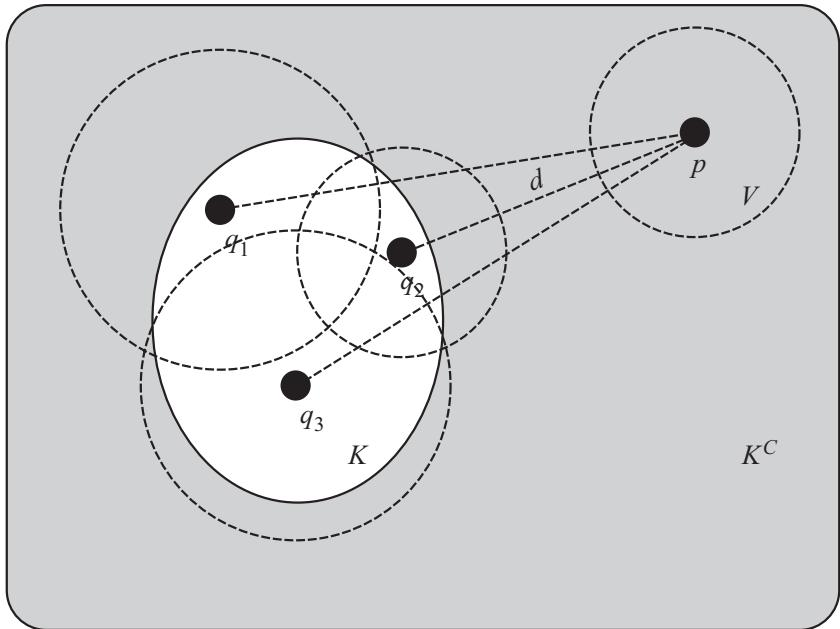

图 11.2 图中的集合 K 被三个点的邻域所覆盖，并且每个邻域的半径为
${ { \frac { 1 } { 3 } } } d ( p , q _ { i } )$ ．d 是
$p$ 和所有 $q _ { i }$ 距离的最小值． $p$ 的半径为
${ { \frac { 1 } { 3 } } d }$ 的邻域 V 不与任何
$q _ { i }$ 的邻域相交，所以 V 完全包含在 $K ^ { C }$ 中

注意，这个证明依赖于一个事实，即存在一个 K 的有限子覆盖．如果不存在K
的有限子覆盖，那么我们就取不到 $p$ 与 $q _ { i }$
的最小距离（因为无限集不一定有最小值）

另外还要注意，这里的开覆盖和有限子覆盖与 $p$
有关．当知道集合是紧集时，我们才可以这样操作．由于每个开覆盖都存在一个有限子覆盖，所以我们可以根据需要来选择

定理 11.8 (紧集的闭子集仍是紧集).

对于任意度量空间 $K ⊂ X$ ，如果 K 是紧集，并且 K 的子集 F 相对于
X是闭集，那么 F 也是紧集

证明. 证明其实很简单，关键是 F 在 K 中的补集是开集，所以这个补集与 F
的一个开覆盖共同构成了 K 的开覆盖，然后取 K
的一个有限子覆盖，再从中去掉$F ^ { C }$ 即可

设 $\{ V _ { \alpha } \}$ 是 F 的一个（相对于 K 的）开覆盖．由于
$K = F ∪ F ^ { C }$ （这里 $F ^ { C }$

表示 F 在 K 中的补集，而不是在 X 中的补集）且
$F ⊂ ⋃ _ { \alpha } V _ { \alpha }$ ，所以有

$$
K ⊂ \left(⋃_ {\alpha} V _ {\alpha}\right) ∪ F ^ {C}.
$$

每个 $V _ { \alpha }$ 都是（相对于 K 的）开集，并且 $F ^ { C }$
也是开集，所以 $\{ V _ { \alpha } \} ∪ F ^ { C }$ 是 K
的一个开覆盖．由于 K 是紧集，所以存在一个有限子覆盖
$\{ V _ { \alpha _ { 1 } } , V _ { \alpha _ { 2 } } , · · · , V _ { \alpha _ { n } } , F ^ { C } \}$
（其中 $F ^ { C }$ 不一定是这个有限子覆盖的元素）

于是有

$$
F ⊂ K ⊂ \left(⋃_ {i = 1} ^ {n} V _ {\alpha_ {i}}\right) ∪ F ^ {C},
$$

因为 $F ∩ F ^ { C } = ∅$ ，所以这意味着
$\{ V _ { \alpha _ { 1 } } , V _ { \alpha _ { 2 } } , ...b , V _ { \alpha _ { n } } \}$
是F 的一个有限子覆盖．推论 11.9 (闭集与紧集的交).

对于任意度量空间 $K ⊂ X$ ，如果 K 是紧集，并且 X 的子集 F 相对于
X是闭集，那么 $F ∩ K$ 也是紧集

这个推论告诉我们，如果把紧集 K 嵌入到任何一个度量空间中，那么 K
与该度量空间中任何闭集的交集都是紧集

证明. 由定理 11.7 可知，K 在 X 中是闭集．因为闭集的交仍是闭集，所以
$F ∩ K$ 是闭集．注意， $F ∩ K ⊂ K$ ，于是根据定理 11.8，
$F ∩ K$ 是紧集 □

重要的是要理解紧性是一个普遍的性质，而闭集依赖于嵌入的度量空间．这些区别可能在最后几个定理中已经变得模糊了，所以这里有一个小测试：下面这段话有什么问题？（我们稍后会了解到，任何闭区间
$[ a , b ]$ 都是紧集．现在就暂且把这个事实当作已知的．）

设 X 是由开区间 (−3,3) 给出的度量空间，令 $F = X$ ，那么 F 在 X
中是闭集（因为 $p ∈ X ⇒ p ∈ F$ ，所以 F
包含其所有极限点）．设 $K = [ - 5 , 5 ]$ ，那么K 是紧集．于是根据推论
11.9， $F ∩ K = ( - 3 , 3 )$ 是紧集，这与定理 11.5 相矛盾！

你找到错误了吗？这是对推论 11.9 的公然滥用．在这个例子中，我们有
$F ⊂$ $X ⊂ \mathbb { R }$ 且 K ⊂ R．F 在 X
中是闭集，但在 R 中不是．由推论 11.9 可知，对于X 中的任意一个紧集 K，
$F ∩ K$ 是一个紧集．但是 $K = [ - 5 , 5 ]$ 不是 X
的子集，所以我们无法利用这个推论．（不过，对于 $K = [ - 2 , 2 ]$
，我们可以利用推论 11.9得出 $F ∩ K = [ - 2 , 2 ]$ 是紧集．）

定理 11.10 (紧集是有界的).

对于度量空间 X 的任意紧子集 K，K 在 X 中有界

证明. 要想证明 $^ { * } K$ 是紧集 =⇒K
有界''，我们可以证明其逆否命题（即证明 $^ { * } K$ 无界 =⇒K
不是紧集''）．有界的定义是

$$
∃ q ∈ X, ∃ M ∈ \mathbb {R}   \text {使得}   d (p, q) \leqslant M, ∀ p ∈ K,
$$

那么其否命题为

$$
∀ q ∈ X, ∀ M ∈ \mathbb {R}, ∃ p ∈ K   \text {使得}   d (p, q) > M.
$$

如果 K 是紧集，那么开覆盖 $\{ N _ { 1 } ( p ) | p ∈ K \}$ （即 K
中每个点的半径为 1 的邻域族）就存在一个有限子覆盖
$\left\{ N _ { 1 } ( p _ { 1 } ) , N _ { 1 } ( p _ { 2 } ) , ... , N _ { 1 } ( p _ { n } ) \right\}$
．我们取离 $p _ { 1 }$ 最远的距离，记作

$$
r = max \left\{d \left(p _ {1}, p _ {i}\right) | 1 \leqslant i \leqslant n \right\}.
$$

那么 $N _ { r + 1 } ( p _ { 1 } )$ 包含整个有限子覆盖
$\{ N _ { 1 } ( p _ { 1 } ) , N _ { 1 } ( p _ { 2 } ) , ... , N _ { 1 } ( p _ { n } ) \}$
，因为对于 1和 n 之间的任意 i，
$d ( p _ { 1 } , p _ { i } ) + 1 \leqslant r + 1$ ，所以
$N _ { 1 } ( p _ { i } ) ⊂ N _ { r + 1 } ( p _ { 1 } )$ ．由于 K
是无界的，所以当 $q = p _ { 1 }$ 且 $M = r + 1$ 时，存在某个
$p ∈ K$ 使得 $d ( p , p _ { 1 } ) > r + 1$ 所以
$p ∉ N _ { r + 1 } ( p _ { 1 } )$ ，因此 K
中至少有一个元素没有包含在有限子覆盖的超集中，那么该元素也不在有限子覆盖中，所以
K 不是紧集 □

定理 11.11 (紧集的交集).

设 $\{ K _ { \alpha } \}$ 是度量空间 X 中的一族非空紧集．如果
$\{ K _ { \alpha } \}$ 中任意有限多个集合的交集都是非空的，那么
$∩ _ { \alpha } K _ { \alpha }$ 也是非空的

这难道不是一个平凡的性质吗？在 $\{ K _ { \alpha } \}$
中，如果集合的每个可能组合的交集都是非空的，那么所有集合的交集怎么可能是空的呢？

这种情况的发生是因为无限交集的复杂性．例如，设
$A _ { n } = \left( - { \frac { 1 } { n } } , { \frac { 1 } { n } } \right)$
，取由无穷多个 $A _ { n }$ 构成的集族
$\{ A _ { n } | n ∈ \mathbb { N } \}$ ．我们知道
$⋂ _ { n = 1 } ^ { ∈fty } A _ { n } = \{ 0 \}$
（因为对于任意一个非 0 点 $p$ ，存在一个开区间
$\left( - \frac { 1 } { k } , \frac { 1 } { k } \right)$ 使得
$\begin{array} { r } { p < - \frac { 1 } { k } } \end{array}$ 或
$p > { \frac { 1 } { k } } \ )$ ）

现在定义
$B _ { n } = A _ { n } \ \{ 0 \} = ( - \frac { 1 } { n } , 0 ) ∪ ( 0 , \frac { 1 } { n } )$
．那么， $∩ _ { n = 1 } ^ { ∈fty } B _ { n } = ∅$
，因此不存在同时属于所有 $B _ { n }$ 的元素．但是 $\{ B _ { n } \}$
中任意有限多个集合确实至少有一个公共元素．为什么？对于任意
$m > n , \ B _ { m } ⊂ B _ { n }$ ，所以

$$
⋂_ {n = 1} ^ {k} B _ {k} = B _ {k} = (- \frac {1}{k}, 0) ∪ (0, \frac {1}{k}) \neq ∅ .
$$

定理 11.11 基本上说的是，集族 $\{ B _ { n } \}$
上发生的事不可能出现在紧集上．（在这个例子中，每个 $B _ { n }$ 都不是
R 中的闭集，所以也不是紧集．）

证明. 我们利用反证法来证明．如果 $∩ _ { \alpha } K _ { \alpha }$
为空，那么集合 $K _ { 1 }$ 可以被有限个集合 $K _ { \alpha } ^ { C }$
覆盖，但有限个 $K _ { \alpha }$ 的交集是空集

为了更清楚地说明这一点，我们将使用集合的下列性质：

$$
A ∩ \left(⋂_ {\alpha} B _ {\alpha}\right) = ∅ ⇔ A ⊂ ⋃_ {\alpha} B _ {\alpha} ^ {C}.
$$

为了证明蕴涵关系的一个方向，令 $x ∈ A$ ，那么至少存在一个 α 使得
$x ∉ B _ { \alpha }$ （否则，x 属于每一个 $B _ { \alpha }$
，那么 $A ∩ ( ⋂ _ { \alpha } B _ { \alpha } )$ 将包含
x，而不是空集．），所以至少有一个 $\alpha$ 使得
$x ∈ B _ { \alpha } ^ { C }$ ．因此，A 的每个元素都包含在某个
$B _ { \alpha } ^ { C }$
中，所以$A ⊂ ⋃ _ { \alpha } B _ { \alpha } ^ { C }$

为了证明另一个方向，我们假设：如果 $x ∈ A$ ，那么存在某个 α，使得
$x ∈ B _ { \alpha } ^ { C }$ 因此，对于 A 的每个元素 x，至少有一个
$B _ { \alpha }$ 不包含它，因此不存在同时属于 A和每个
$B _ { \alpha }$ 的元素．所以，
$\begin{array} { r } { A ∩ ( ⋂ _ { \alpha } B _ { \alpha } ) = ∅ } \end{array}$

现在从集族中选取一个紧集 $K _ { 1 }$ ．假设
$∩ _ { \alpha } K _ { \alpha }$ 是空集，那么
$K _ { 1 } ∩ \left( ∩ _ { \alpha \neq 1 } K _ { \alpha } \right)$
$= ∅$ ．根据上述性质，这意味着
$K _ { 1 } ⊂ ⋃ _ { \alpha \neq 1 } K _ { \alpha } ^ { C }$
．另外，由定理 11.7 可知，每个 $K _ { \alpha }$ 都是相对于 X
的闭集，所以每个 $K _ { \alpha } ^ { C }$ 一定是相对于 X
的开集．因此，$\{ K _ { \alpha } ^ { C } | \alpha \neq 1 \}$ 是
$K _ { 1 }$ 的开覆盖

因为 $K _ { 1 }$ 是紧集，所以存在一个 $K _ { 1 }$ 的有限子覆盖
$\{ K _ { \alpha _ { 1 } } ^ { C } , K _ { \alpha _ { 2 } } ^ { C } , · · · , K _ { \alpha _ { n } } ^ { C } \}$
．记住，
$K _ { 1 } ⊂ ∪ _ { i = 1 } ^ { n } K _ { \alpha _ { i } } ^ { C }$
意味着

$$
K _ {1} ∩ \left(⋂_ {i = 1} ^ {n} K _ {\alpha_ {i}}\right) = ∅ .
$$

因此，有限多个 $K _ { \alpha }$
的交集是空集，这与定理的假设相矛盾．所以
$⋂ _ { \alpha } K _ { \alpha }$ 不可能为空 □

我们将用最后一个推论和最后一个定理来结束对紧集强大能力的（看似无止境的）漫谈．到目前为止，所有内容都是基于紧集自身构建的，因此我们最终可以得出一些结果，希望你会发现这些结果有趣且有用

推论 11.12 (嵌套的紧集).

设 $\{ K _ { n } \}$ 是一族非空紧集，并且对于任意
$n ∈ \mathbb { N }$ ，有 $K _ { n } ⊃ K _ { n + 1 }$
．那么交集$∩ _ { n = 1 } ^ { ∈fty } K _ { n } \neq ∅$

这些集合被称为是``嵌套的''，因为序列中的每个集合都包含该序列中的所有后续集合．把这族集合想象成俄罗斯套娃：你打开
$K _ { \mathrm { 1 } } \mathrm { ~ ( ~ O l g a ) }$
时，发现里面有一个更小的玩偶
$K _ { 2 } \mathrm { ~ ( ~ G a l i n a ) }$ $K _ { 2 }$ 里还有一个
$K _ { 3 }$
（Anastasia），以此类推．这一推论保证了这些玩偶（你可以一直打开来找到一个更小的玩偶）里面始终有东西．（下次你去俄罗斯的纪念品商店时，可以通过谈论``紧性''来炫耀你的数学能力．``你知道紧集？给你半价！''）

证明. 对于任意 $m > n$ ，我们有 $K _ { m } ⊂ K _ { n }$ ，所以

$$
⋂_ {n = 1} ^ {k} K _ {n} = K _ {k} \neq ∅ .
$$

因此 $\{ K _ { n } \}$
中任意有限多个集合的交都是非空的，所以由定理11.11可知
$∩ _ { n ∈ \mathbb { N } } K _ { n }$ $\neq ∅$ □

定理 11.13 (紧集中的极限点).

对于紧集 K 中的任意一个无限子集 E，E 在 K 中至少有一个极限点

关键的先决条件是 E 包含无穷多个点．（当然，如果 E
是有限的，那么该定理就不可能成立．此时 E 根本没有极限点，因为由定理 9.11
可知，极限点的任何一个邻域都包含 E 中无穷多个点．）

证明. 假设结果不成立，即 E 在 K 中没有极限点，那么对于每个 $q ∈ K$
，存在某个 $r _ { q } > 0$ ，使得
${ \cal N } _ { r _ { q } } ( q ) ∩ { \cal E } = \{ q \} \not \equiv ∅ .$
．集族 $\{ N _ { r _ { q } } ( q ) | q ∈ K \}$ 是 K
的一个开覆盖，并且集族中的每个集合最多包含 E 的一个点

因为 K 是紧集，所以这个开覆盖存在一个有限子覆盖，即

$$
\{N _ {r _ {q _ {1}}} (q _ {1}), N _ {r _ {q _ {2}}} (q _ {2}), ... , N _ {r _ {q _ {n}}} (q _ {n}) \}.
$$

但这个有限子覆盖只包含E 的有限多个点，具体地说，它包含
$\{ q _ { 1 } , q _ { 2 } , ... , q _ { n } \} ∩ E$ 但是 E
有无穷多个点．因此，E 不包含在这个子覆盖中，那么 K
也不包含在这个子覆盖中，这是一个矛盾 □

你会注意到，除了前面的几个例子，我们还没有考虑哪些集合是紧的．现在我们知道紧集能做什么，但不知道如何找出紧集

正如之前所承诺的，下一章将证明每个区间 $[ a , b ]$
都是紧集．我们还会讨论海涅--博雷尔定理，这是实分析的一个核心结论，它会告诉我们如何在
$\mathbb { R } ^ { k }$ 中找到紧集

### 第 12 章 海涅--博雷尔定理

如果你喜欢惊喜，那就跳过这一段；否则，剧透警告！我要告诉你什么是海涅--博雷尔定理：Rk
的子集是紧集当且仅当它既是闭集又是有界集．上一章证明了每一个紧集（在任何度量空间中，不仅仅在
$\mathbb { R } ^ { k }$
中）都是有界的闭集，因此海涅--博雷尔定理的实质是反向的蕴涵关系．它断言
$\mathbb { R } ^ { k }$
中的每个有界闭集都是紧集，但并非每个度量空间都有该结论．例如，集合
$( - \pi , \pi ) ∩ \mathbb { Q }$ 在 $\mathbb { Q }$
中是闭集（因为 $- \pi$ 和 π
都不是有理数）并且是有界的，但它不是紧集（利用定理 11.5）

当心！本章有一些冗长的证明，在未经训练的人看来可能有些困难．（玩笑话，你现在肯定已经训练有素了．）当你阅读长篇文章时，在页边空白处画些图来阐明每一步的内容会很有帮助

上一章讨论了任意度量空间 X 中集合的紧性，但这一章考察的是
$\mathbb { R } ^ { k }$ ．为了弄清楚 $\mathbb { R } ^ { k }$
中哪些集合是紧集（请记住，在第 6 章中， $\mathbb { R } ^ { k }$ 是所有
k 维实向量的集合），我们先了解一下区间和紧集的一个共同性质

定理 12.1 (闭区间套性质).

设 $\left\{ I _ { n } \right\}$ 是 中的一族闭区间，并且对于任意
$n ∈ \mathbb N$ 有
${ \cal I } _ { n } ⊃ { \cal I } _ { n + 1 }$
．那么$⋂ _ { n = 1 } ^ { ∈fty } I _ { n } \neq ∅$

这个定理看起来应该不陌生，因为我们在推论 11.12
中证明了紧集的类似性质．闭区间套性质是 R
的一个固有特性，它是最小上界性的直接结果

证明. 每个区间都形如 $I = [ a _ { n } , b _ { n } ]$
．我们想找到一个数 x，使得对于所有的 $n ∈ \mathbb { N }$ 均有
$x ∈ [ a _ { n } , b _ { n } ]$ （如果存在这样的 x，则有
$⋂ _ { n = 1 } ^ { ∈fty } I _ { n } ⊃ \{ x \} \ )$
）．全体下界 $a _ { n }$ 的上确界 x 似乎是一个不错的选择，因为对于任意
$n ∈ \mathbb { N }$ ，x 满足 $\geqslant a _ { n }$ 且
$\leqslant b _ { n }$ ，如图 12.1 所示

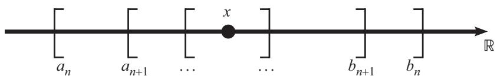

图 12.1 对于任意 $n ∈ \mathbb { N }$ ，点
$x = \operatorname* { s u p } \{ a _ { n } | n ∈ \mathbb { N } \} \geqslant a _ { n }$
且 $\leqslant b _ { n }$

令 $E = \{ a _ { n } | n ∈ \mathbb { N } \}$ ．每个 $b _ { n }$
都是 E 的上界，因为如果存在 $n , m ∈ \mathbb { N }$
使得$a _ { n } > b _ { m }$ ，那么
$I _ { n } ∩ I _ { m } = ∅$
，此时这两个区间不存在包含关系，这样就产生了矛盾．因此，E 是 R
的一个有上界的非空子集，那么根据 R 的最小上界性，supE在 R
中存在，我们称它为 x

因为 x 是 E 的上界，所以对于任意 $n ∈ \mathbb { N }$ 均有
$x \geqslant a _ { n }$ ．此外，由于 $b _ { n }$ 是E 的上界，而 x 是
E 的最小上界，所以 $x \leqslant b _ { n }$ ．因此
$x ∈ [ a _ { n } , b _ { n } ]$

注意，如果令
$x = \operatorname* { i n f } \{ b _ { n } | n ∈ \mathbb { N } \}$
，那么上述证明仍然成立

事实上，这个性质不仅适用于 中的区间，也适用于 $\mathbb { R } ^ { k }$
中的等价概念，我们称之为 k 维格子

定义 12.2 (k 维格子).

如果对于 1 和 k 之间的每个 j 均有 $a _ { j } < b _ { j }$ ，那么
$\mathbb { R } ^ { k }$ 中的向量集

$$
\left\{\boldsymbol {x} = \left(x _ {1}, x _ {2}, ... , x _ {k}\right) | x _ {j} ∈ \left[ a _ {j}, b _ {j} \right], ∀ 1 \leqslant j \leqslant k \right\}
$$

就称为 k 维格子

我们可以在图 12.2 中看到 k 维格子．在一维情况下，令 $k = 1$
，可以看到1 维格子就是一个闭区间．在二维空间中，2
维格子是一个矩形，因为它是位于两组边界之间的所有点的集合．在三维空间中，3
维格子是一个盒子．在四维空间中，根据爱因斯坦的理论，第四维可能是时间，所以我猜
4
维格子就是一个永远停留在某个固定时间段内的盒子（举个例子，去看看你祖父的阁楼）

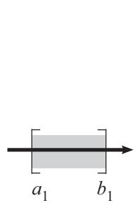

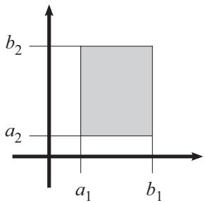

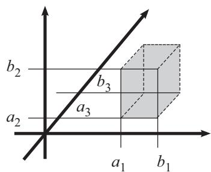

图 12.2 1 维格子、2 维格子和 3 维格子（一定要戴上 3D
眼镜以获得最佳观看体验）

定理 12.3 (k 维格子嵌套性质).

设 $\left\{ I _ { n } \right\}$ 是 $\mathbb { R } ^ { k }$ 中一族 k
维格子，并且对于任意 $n ∈ \mathbb N$ 均有
$I _ { n } ⊃ I _ { n + 1 }$ ．那么
$⋂ _ { n = 1 } ^ { ∈fty } I _ { n } \neq ∅$

证明. 证明非常简单：只需对这族 k
维格子的每个维度都应用闭区间套性质即可导致证明过程多于两行的唯一原因是，我们必须同时考虑在讨论哪一个
k 维格子（其下标 n 可以是任意自然数）以及所讨论的维数是多少（其下标 j 在
1 和 k 之间取值）

每一个 k 维格子 $I _ { n }$ 都是满足下列条件的点
$\pmb { x } = \left( x _ { 1 } , x _ { 2 } , ... , x _ { k } \right)$
的集合：对于 1 到 k 之间的每个 $j$ 均有
$a _ { n _ { j } } \leqslant x _ { j } \leqslant b _ { n _ { j } }$
．因此， $I _ { n }$ 就是第 j 个坐标落在闭区间
$I _ { n _ { j } } = [ a _ { n _ { j } } , b _ { n _ { j } } ]$
中的向量的集合．由于每个 k 维格子都包含在前一个 k 维格子中，因此对于任意
$n ∈ \mathbb { N }$ 和介于 1 和 k 之间的每个 j 均有
$I _ { n _ { j } } ⊃ I _ { ( n + 1 ) _ { j } }$

我们想证明存在一个属于所有 $I _ { n }$ 的向量
$\pmb { x } = \left( x _ { 1 } , x _ { 2 } , ... , x _ { k } \right)$
，这意味着该向量的坐标对于任意 $n ∈ \mathbb { N }$ 均有
$x _ { 1 } ∈ I _ { n _ { 1 } }$ ；对于任意 $n ∈ \mathbb { N }$
均有 $x _ { 2 } ∈ I _ { n _ { 2 } } ; ... ;$ 对于任意
$n ∈ \mathbb { N }$ 均有 $x _ { k } ∈ I _ { n _ { k } }$

根据定理 12.1，交集
$⋂ _ { n = 1 } ^ { ∈fty } I _ { n _ { 1 } }$
中至少包含一个点，我们将其称为 $x _ { 1 } ^ { * }$ ．类似地，存在
$\begin{array} { r } { x _ { 2 } ^ { * } ∈ ⋂ _ { n = 1 } ^ { ∈fty } I _ { n _ { 2 } } , ... \qquad } \end{array}$
，存在
$x _ { k } ^ { * } ∈ ⋂ _ { n = 1 } ^ { ∈fty } I _ { n _ { k } }$
．因此，向量
$\pmb { x } ^ { * } = ( x _ { 1 } ^ { * } , x _ { 2 } ^ { * } , · · · , x _ { k } ^ { * } )$
属于每一个 $I _ { n }$ □

我们不仅可以证明每个闭区间是紧集，而且可以证明每个 k 维格子也是紧集

上一个定理对我们的证明是有用的，但要注意，它本身并不是一个证明．（只知道
k 维格子与紧集有一个相同的性质，并不能说明所有 k 维格子都是紧集．）定理
12.4 (k 维格子是紧集). 对于任意 $k ∈ \mathbb N$ ，每个 k
维格子都是紧集

证明.
尽管这看起来好像是一个复杂的论证，但其基本逻辑并不是很糟糕．我们分两步走．首先弄清楚该怎么做，然后正式地写出来

第一步．使用反证法，假设 k 维格子 I 不是紧集，那么某个开覆盖
$\{ G _ { \alpha } \}$ 就没有有限子覆盖．把 I 划分成有限多个更小的 k
维格子，其中至少有一个子 k 维格子不能被 $\{ G _ { \alpha } \}$
中任意有限多个集合覆盖．（否则 $\{ G _ { \alpha } \}$ 就存在一个 I
的有限子覆盖．）于是，选取这个子 k 维格子并将其划分成更小的 k
维格子．同样地，其中至少有一个子 k 维格子不能被有限覆盖...... 如图
12.3 所示，我们继续划分下去，从而得到一族嵌套的 k
维格子，其中每一个都不能被有限覆盖

根据定理 12.3，它们的交集一定至少包含一个元素
$\mathbf { \boldsymbol { x } } ^ { * }$ ．既然
${ \pmb x } ^ { * } ∈ I$ ，那么$\{ G _ { \alpha } \}$
中一定存在一个包含 $\mathbf { \boldsymbol { x } } ^ { * }$ 的集合
$G _ { 1 }$ ．又因为 $G _ { 1 }$ 是开集，所以 $\pmb { x } ^ { * }$
的某个邻域会包含在 $G _ { 1 }$ 中．由于每个嵌套的 k
维格子都包含一个更小的子 k 维格子，所以可以找到一个足够小的 k
维格子，使其包含在 $\mathbf { ∇ } _ { \pmb { x } ^ { * } }$
的该邻域中．因此，在这些嵌套的 k 维格子中，有一个 k 维格子被
$G _ { 1 }$ 覆盖（即被 $\{ G _ { \alpha } \}$
中有限多个集合覆盖），这样就得到了矛盾

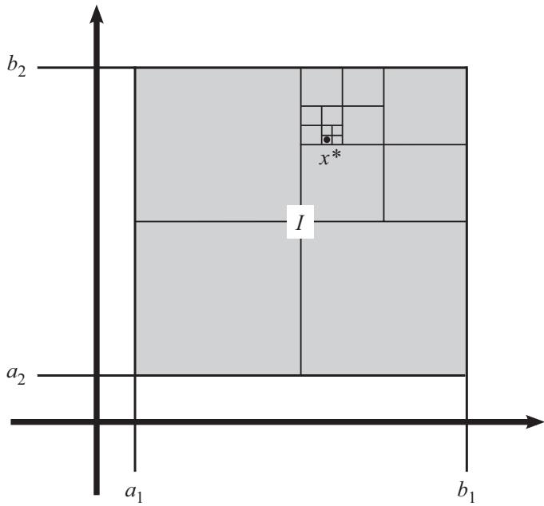

图 12.3 以 2 维格子 I 为例．在每一步中，我们将其划分成 4 个子 2
维格子，然后选取不能被有限覆盖的子 2 维格子，再将其划分成 4 个子 2
维格子．因为这是一个嵌套的 2 维格子序列，所以它们的交集中至少包含一个点
$\pmb { x } ^ { * }$

为了使论证的最后一步起作用，我们必须考虑这些 k
维格子的大小．下面是划分方法：由于 k 维格子 I
由每个维度上的一个区间给定，因此我们把每个区间都分成两半，从而得到
$2 ^ { k }$ 个子 k 维格子（如图 12.3
所示，在二维空间中，这意味着我们把 I 划分成了 $2 ^ { 2 } = 4$
个部分）．在每次划分中，我们把不能被有限覆盖的子 k 维格子划分成
$2 ^ { k }$ 个子 k 维格子．因此，在 n 次划分之后，我们得到的子k
维格子的体积是原来 k 维格子 I 的体积的
$\left( { \frac { 1 } { 2 ^ { k } } } \right) \left( { \frac { 1 } { 2 ^ { k } } } \right) · · · \left( { \frac { 1 } { 2 ^ { k } } } \right) = 2 ^ { - n k }$
倍

I 有多大？我们关心的是 k 维格子中两点之间的距离（记住，我们希望它小于
$G _ { 1 }$ 中 $\mathbf { \boldsymbol { x } } ^ { * }$
邻域的半径）．这个距离受到 I 内最大可能距离的限制，而这个最大距离是由 I
的对角线决定的．我们把组成 I 的 k 个闭区间 $[ a _ { j } , b _ { j } ]$
的端点放入向量的坐标中，从而得到
$\pmb { a } = ( a _ { 1 } , a _ { 2 } , ... , a _ { n } )$ 和
$\pmb { b } = ( b _ { 1 } , b _ { 2 } , ... , b _ { n } )$

那么对角线就是

$$
\left| \boldsymbol {b} - \boldsymbol {a} \right| = + \left(\sum_ {i = 1} ^ {k} (b _ {j} - a _ {j}) ^ {2}\right) ^ {\frac {1}{2}},
$$

（根据定义 6.10）称之为 δ．因此，第 n 次划分后的子 k
维格子中任意两点之间的距离小于等于 $2 ^ { - n } \delta$

我们想找到一个小到足以容纳在 $G _ { 1 }$ 中
$\mathbf { \boldsymbol { x } } ^ { * }$ 邻域内的子 k
维格子．因此，对于
$N _ { r } ( { \pmb x } ^ { * } ) ⊂ G _ { 1 }$
，如果我们能够证明 $2 ^ { - n } \delta < r$ ，那么
$\pmb { x } ^ { * }$ 与第 n 次划分后的子k
维格子中任意一点之间的距离都小于 r，这意味着第 n 次划分后的子 k
维格子包含在 $N _ { r } ( { \pmb x } ^ { * } )$ 中，从而也包含在
$G _ { 1 }$ 中．我们希望 $\delta < 2 ^ { n } r$ ，这意味着

$$
n > \frac {\log (\frac {\delta}{r})}{\log (2)}.
$$

因为 $\delta > 0 \mathrm { ~ H ~ } r > 0$ ，所以我们有
$\log ( \frac { \delta } { r } ) ∈ \mathbb { R }$ ．那么由 R
的阿基米德性质可知，这样的 $n ∈ \mathbb { N }$ 的确存在

第二步．下面给出严格的证明

固定一个维数 k，设 I 是一个 k 维格子，于是

$$
I = \left\{\boldsymbol {x} = \left(x _ {1}, x _ {2}, ... , x _ {k}\right) | a _ {j} \leqslant x _ {j} \leqslant b _ {j}, ∀ 1 \leqslant j \leqslant k \right\},
$$

令

$$
\delta = \left(\sum_ {i = 1} ^ {k} (b _ {j} - a _ {j}) ^ {2}\right) ^ {\frac {1}{2}}.
$$

那么，对于任意 ${ \pmb { x } } , { \pmb { y } } ∈ I$ 有
$| x - y | \leqslant \delta$

假设 I 不是紧集，那么选取 I 的一个没有有限子覆盖的开覆盖
$\{ G _ { \alpha } \}$ ．通过将 $[ a _ { j } , b _ { j } ]$ 分解为

$$
\left[ a _ {j}, \frac {a _ {j} + b _ {j}}{2} \right] \text {和} \left[ \frac {a _ {j} + b _ {j}}{2}, b _ {j} \right],
$$

我们把 I 划分成了 $2 ^ { k }$ 个子 k 维格子 $Q _ { i }$ ，所以
$⋃ _ { i = 1 } ^ { 2 ^ { k } } Q _ { i } = I$
，其中至少存在一个集合
$I _ { 1 } ∈ \{ Q _ { i } | 1 \leqslant i \leqslant 2 ^ { k } \}$
不能被 $\{ G _ { \alpha } \}$ 中任意有限多个集合覆盖．然后把
$I _ { 1 }$ 划分成 $2 ^ { k }$ 个子 k
维格子并继续此过程，这样就创建了一族满足
$I ⊃ I _ { 1 } ⊃ I _ { 2 } ⊃ ...$ 的 k 维格子
$\left\{ I _ { n } \right\}$ ，并且每个 $I _ { n }$ 都不能被有限覆盖

根据定理 12.3，存在某个 $\mathbf { \boldsymbol { x } } ^ { * }$
属于所有 $I _ { n }$ ．另外，因为 ${ \pmb x } ^ { * } ∈ I$
，所以一定存在某个 $G _ { 1 } ∈ \{ G _ { \alpha } \}$ 使得
${ \pmb x } ^ { * } ∈ G _ { 1 }$ ．由于 $G _ { 1 }$
是开集，因此存在 $r > 0$ 使得

$N _ { r } ( { \pmb x } ^ { * } ) ⊂ G _ { 1 }$ ．根据 R
的阿基米德性质，存在某个 $n ∈ \mathbb { N }$ 使得
$\begin{array} { r } { n > { \frac { \log ( { \frac { \delta } { r } } ) } { \log ( 2 ) } } } \end{array}$
，从而有$2 ^ { - n } \delta < r$ ．注意，对于任意
$\pmb { y } ∈ I _ { n } , | \pmb { x } ^ { * } - \pmb { y } | \leqslant 2 ^ { - n } \delta < r$
，所以
$I _ { n } ⊂ N _ { r } ( { \pmb x } ^ { * } ) ⊂ G _ { 1 }$
因此， $I _ { n }$ 被 $\{ G _ { \alpha } \}$ 中有限多个集合（即
$G _ { 1 } )$ 覆盖，这是一个矛盾．所以，I 一定是紧集 □

我们差不多准备好证明海涅--博雷尔定理了，该定理描述了 Rk
中哪些集合是紧集．不过，我们先证明下面的结果，它会派上用场

定理 12.5 (Rk 中的有界集).

如果 $\mathbb { R } ^ { k }$ 的子集 E 有界，那么它就包含在某个 k
维格子中

回顾一下定义 9.3，以确保你还记得度量空间中的有界意味着什么

证明. 基本思路是，如果 E 的每一个点与某个
$\pmb q ∈ \mathbb { R } ^ { k }$ 的距离都小于 M，那么我们可以以 M 和
q 为界构造一个 k
维格子（用几何术语来说，每个圆都可以内接在一个正方形中，每个球都可以内接在一个立方体中，等等）

为精确起见，如果 E 是有界的，则存在某个 $q ∈ \mathbb { R } ^ { k }$
和某个 $M \ ∈$ R，使得对于 E 中的每一个点 p 均有
$| p - q | \leqslant M$ ．如果记
$\pmb { p } = \left( p _ { 1 } , p _ { 2 } , ... , p _ { k } \right)$
和$\pmb q = \left( q _ { 1 } , q _ { 2 } , ... , q _ { k } \right)$
，那么这意味着

$$
\left(\sum_ {j = 1} ^ {k} \left(p _ {j} - q _ {j}\right) ^ {2}\right) ^ {\frac {1}{2}} \leqslant M.
$$

于是，对于 1 和 k 之间的每个 j，我们有

$$
0 + ... + 0 + \left(p _ {j} - q _ {j}\right) ^ {2} + 0 + ... + 0 \leqslant \left(p _ {1} - q _ {1}\right) ^ {2} + \left(p _ {2} - q _ {2}\right) ^ {2} + ... + \left(p _ {k} - q _ {k}\right) ^ {2} \leqslant M ^ {2},
$$

从而有 $q _ { j } - M \leqslant p _ { j } \leqslant q _ { j } + M$
．记住，这对每一个 $\pmb { p } ∈ E$ 均成立，所以如果令

$$
I = \left\{\boldsymbol {x} = \left(x _ {1}, x _ {2}, ... , x _ {k}\right) | x _ {j} ∈ \left[ q _ {j} - M, q _ {j} + M \right], ∀ 1 \leqslant j \leqslant k \right\},
$$

那么 I 就是一个 k 维格子，并且 $E ⊂ I .$

定理 12.6 (海涅--博雷尔定理).

Rk 的子集 E 是紧集当且仅当它既是闭集又是有界集

这里``闭集''和``有界集''是指 $\mathbb { R } ^ { k }$ 中的闭集和
$\mathbb { R } ^ { k }$ 中的有界集

证明. 利用本章已经证明过的所有定理，我们已经完成了大部分工作

如果 E 是紧集，那么由定理 11.7 可知，E 是 Rk 中的闭集，而根据定理
11.10，E 也是 $\mathbb { R } ^ { k }$ 中的有界集

为了证明定理的另一个方向，假设 E 是有界闭集．因为 E 是有界集，所以由定理
12.5 可知，它一定包含在某个 k 维格子 I 中．根据定理 12.4，I 是紧集由于
$E ⊂ I$ 且 E 是闭集，所以根据定理 11.8，E 是紧集 □

除了海涅--博雷尔定理，下面的定理提供了另一种在 Rk
中寻找紧集的方法还记得定理 11.13
证明了紧集的每一个无限子集都有一个包含在该紧集中的极限点．现在我们来证明在
$\mathbb { R } ^ { k }$ 中的逆命题

定理 12.7 (实紧集中的极限点).

Rk 的一个子集 E 是紧集，当且仅当 E 的每个无限子集在 E 中都有一个极限点

证明. 假设 E 是紧集．那么根据定理 11.13，E 的每个无限子集在 E
中都有一个极限点

反过来，假设 E 的每个无限子集在 E 中都有一个极限点．我们要证明 E
是紧集，根据海涅--博雷尔定理，我们只需要证明 E
是有界闭集．现在来证明其逆否命题：如果 E 不是有界集，那么 E
的某个无限子集在 E 中没有极限点；同样地，如果 E 不是闭集，那么 E
的某个无限子集在 E 中没有极限点

如果 E 不是有界集，那么我们可以构造一个在 E 中没有极限点的无限子集
S．对于 $\pmb q = \mathbf 0$ 和 $M = 1 , 2 , 3 , ...$ ，存在点
${ \pmb x } _ { n } ∈ E$ 使得
$| { \pmb x } _ { n } - { \pmb q } | > M$ ．因此，对于每一个
$n ∈ \mathbb N$ 均存在 ${ \pmb x } _ { n } ∈ E$ 使得
$\left| { \pmb x } _ { n } \right| > n$ ．令
$S = \{ { \pmb x } _ { n } \ | \ n ∈ \mathbb { N } \}$
，那么$S ⊂ E .$

另外，S 是无限集．如果 S 中包含有限多个点
$\{ \pmb { x } _ { 1 } , \pmb { x } _ { 2 } , \pmb { · } · \pmb { · } , \pmb { x } _ { N } \}$
，那么令

$$
n = ⌈ max \{| \boldsymbol {x} _ {1} |, | \boldsymbol {x} _ {2} |, ... , | \boldsymbol {x} _ {N} | \} ⌉ + 1
$$

（使用例 4.8 中的上取整符号表示``向上舍入''）．所以不存在满足
$\left| { \pmb x } _ { n } \right| > n$ 的${ \pmb x } _ { n } ∈ E$
，这是一个矛盾

此外，每个点 $\pmb { p } ∈ \mathbb { R } ^ { k }$ 都不是 S
的极限点．为什么？参见图 12.4．给定任意一个
$\pmb { p } ∈ \mathbb { R } ^ { k }$ ，设 N 是 $\geqslant | p |$
的最小自然数．那么对于任意一个大于 N 的自然数 n，我们有
$n \geqslant N + 1$ ，于是

$$
  |  {| \pmb {x} _ {n} - \pmb {p} | \geqslant | \pmb {x} _ {n} | - | \pmb {p} | \quad (\text {利用定理6.11的性质6})}
  |  {\qquad > n - | \pmb {p} |}
  |  {\qquad \geqslant N + 1 - | \pmb {p} |}
  |  {\qquad \geqslant 1 \quad (\text {因为} N \geqslant | \pmb {p} |)}
$$

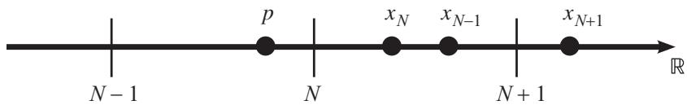

图 12.4 当维数 $k = 1$ 时，S 中点的例子，其中 N 是 $\geqslant | p |$
的最小整数注意， $\pmb { x } _ { N - 1 }$ 可以大于
$\mathbf { \mathcal { x } } _ { N }$ ．但重要的是对于任意 $n > N$
均有$| { \pmb x } _ { n } - { \pmb p } | > 1$

现在有两种情形．如果 $p \not ∈ S$ ，那么对于任意
$n ∈ \mathbb { N }$ 均有 ${ \pmb p } \neq { \pmb x } _ { n }$
，于是令

$$
r = \frac {1}{2} min \{| \boldsymbol {x} _ {1} - \boldsymbol {p} |, | \boldsymbol {x} _ {2} - \boldsymbol {p} |, ... , | \boldsymbol {x} _ {N} - \boldsymbol {p} |, 1 \}.
$$

对于任意 $n ∈ \mathbb N$ ，如果 $n \leqslant N$ ，我们有
$| { \pmb x } _ { n } - { \pmb p } | > r ;$ ；如果 $n > N$
，则有$| { \pmb x } _ { n } - { \pmb p } | > 1 > r$ ．因此，对于任意
$n ∈ \mathbb { N } , N _ { r } ( \pmb { p } )$ 不包含
${ \mathbf { \mathcal { x } } } _ { n }$ ，所以
${ \cal N } _ { r } ( { \pmb { p } } ) ∩ { \cal S } = ∅$
因此 p 不是 S 的极限点

如果 $p ∈ S$ ，那么存在某个 $i \leqslant N$ 使得
$\mathbf { ∇ } _ { \pmb { p } } = \pmb { x } _ { i }$ （记住，
$N \geqslant | p | \ )$ ．令

$$
r = \frac {1}{2} min \left\{\left| \boldsymbol {x} _ {1} - \boldsymbol {p} \right|, \left| \boldsymbol {x} _ {2} - \boldsymbol {p} \right|, ... , \left| \boldsymbol {x} _ {i - 1} - \boldsymbol {p} \right|, \left| \boldsymbol {x} _ {i + 1} - \boldsymbol {p} \right|, ... , \left| \boldsymbol {x} _ {N} - \boldsymbol {p} \right|, 1 \right\}.
$$

（其中
$\mathbf { ∇ } \mathbf { p } = \mathbf { ∇ } \pmb { x } _ { i }$
已经从最小值中移除．）按照与第一种情形相同的逻辑，
$N _ { r } ( \pmb { p } ) ∩ S =$ $\{ p \}$ ，所以 p 不是 S
的极限点

每个点 $\pmb { p } ∈ \mathbb { R } ^ { k }$ 都不是 S
的极限点，又因为 $E ⊂ \mathbb { R } ^ { k }$ ，所以 S 在 E
中没有极限点

对于另一种情况，假设 E 不是闭集．那么 E 有一个极限点
$\pmb { x } _ { 0 } ∈ \mathbb { R } ^ { k }$
满足${ \pmb x } _ { 0 } \not ∈ \ { \pmb E }$ ．我们可以再次构造 E
的一个无限子集 S，使得
${ \mathbf { { \mathit { x } } } } _ { 0 }$
是其唯一的极限点，这样 S 在 E 中就没有极限点了．对于任意 $r \ > \ 0$
，存在点 $x ∈ E$ 使得$| { \pmb x } - { \pmb x } _ { 0 } | < r$
，所以对于每一个 $n ∈ \mathbb { N }$ ，都有某个
${ \pmb x } _ { n } ∈ E$ 使得
$\begin{array} { r } { | \pmb { x } _ { n } - \pmb { x } _ { 0 } | < \frac { 1 } { n } } \end{array}$
．令$S = \{ \mathbf { x } _ { n } | n ∈ \mathbb { N } \}$ ，那么
$S ⊂ E$

同样地，S 是无限集．为什么？如果 S 包含有限多个点
$\{ \pmb { x } _ { 1 } , \pmb { x } _ { 2 } , \pmb { · } · \pmb { · } , \pmb { x } _ { N } \}$
，那么存在一个 j（介于 1 和 N 之间），对于任意整数 $n \geqslant N$
均有
$\begin{array} { r } { | \pmb { x } _ { j } - \pmb { x } _ { 0 } | < \frac { 1 } { n } } \end{array}$
．这意味着 ${ \pmb x } _ { j } = { \pmb x } _ { 0 }$
（否则，由阿基米德性质可知，存在某个 n 使得
$n \left| \pmb { x } _ { j } - \pmb { x } _ { 0 } \right| > 1 )$
\_那么我们有 ${ \pmb x } _ { N } ∉ E$ ，这是一个矛盾

显然， ${ \mathbf {  { x } } } _ { 0 }$ 是 S
的极限点．为什么？对于任意 $r > 0$ ，由阿基米德性质可知，存在一个
$n ∈ \mathbb { N }$ ，使得 $n r > 1$ ．于是
$\begin{array} { r } { | \pmb { x } _ { 0 } - \pmb { x } _ { n } | < \frac { 1 } { n } < r } \end{array}$
，因此至少存在一个 ${ \pmb x } _ { n }$ 属于
$N _ { r } ( { \pmb x } _ { 0 } ) ∩ S$

但是，对于任意一个满足 ${ \pmb y } \ne { \pmb x } _ { 0 }$ 的
$\ b { y } ∈ \mathbb { R } ^ { k }$ ，我们有

$$
  |  {| \pmb {x} _ {n} - \pmb {y} | \geqslant | \pmb {x} _ {0} - \pmb {y} | - | \pmb {x} _ {n} - \pmb {x} _ {0} | \quad (\text {利用定理6.11的性质6})}
  |  {\quad > | \pmb {x} _ {0} - \pmb {y} | - \frac {1}{n}}
  |  {\quad \geqslant \frac {1}{2} | \pmb {x} _ {0} - \pmb {y} | \quad (\text {当} \frac {1}{n} \leqslant \frac {1}{2} | \pmb {x} _ {0} - \pmb {y} | \text {时}).}
$$

换句话说，当
$\begin{array} { r } { r = \frac { 1 } { 2 } | \pmb { x } _ { 0 } - \pmb { y } | } \end{array}$
时，如果
$\begin{array} { r } { \frac { 1 } { n } \leqslant \frac { 1 } { 2 } | \pmb { x } _ { 0 } - \pmb { y } | } \end{array}$
，那么每一个 ${ \mathbf { \mathcal { x } } } _ { n }$ 与 y
的距离都至少为 r．因此

$$
N _ {r} (\boldsymbol {y}) ∩ S = \{\boldsymbol {x} _ {n} | \frac {1}{n} > \frac {1}{2} | \boldsymbol {x} _ {0} - \boldsymbol {y} | \}.
$$

只存在有限多个 $n ∈ \mathbb { N }$ 满足
$\begin{array} { r } { n < \frac { 2 } { | \pmb { x } _ { 0 } - \pmb { y } | } } \end{array}$
，所以 y 的每个邻域只能包含 $S$ 中有限多个点，因此根据定理 9.11，y
不可能是 S 的极限点

因此 E 的点都不是 S 的极限点

注意，对于任意 $E ⊂ \mathbb { R } ^ { k }$
，下面三个命题是等价的：

命题 1. E 既是闭集又是有界集

命题 2. E 是紧集

命题 3. E 的每个无限子集在 E 中都有一个极限点

事实证明，后两个命题在任何度量空间中都是等价的（不仅限于
$\mathbb { R } ^ { k } ~ )$ ，但是``命题 3 =⇒ 命题
$2 ^ { ' ' }$ 的证明非常复杂，对我们而言是不必要的

有趣的是，我们先发现了所有紧集都具有的一些性质（闭集且有界，并且包含每个无限子集的极限点），然后证明了在
$\mathbb { R } ^ { k }$
中这些性质蕴涵着紧性．但是，并非紧集的所有性质都存在这种反向表述．例如，一族嵌套集合
$\left\{ A _ { n } = { \bigl ( } - { \frac { 1 } { n } } , { \frac { 1 } { n } } { \bigr ) } \right\}$
存在一个非空的无限交集（因为
$⋂ _ { n = 1 } ^ { ∈fty } A _ { n } = \{ 0 \} ~ )$
，但是每个 $A _ { n }$ 都不是紧集

下面的定理是一个例子，它说明了为什么研究紧集是有意义的．虽然在定理的陈述中看不到紧性，但我们还是要使用之前的紧性定理来证明一个一般的（并且非常有用的）结果

定理 12.8 (魏尔斯特拉斯定理).

如果 Rk 的无限子集 E 有界，那么 E 在 Rk 中有一个极限点

证明. 小菜一碟．把下框中的空白填充完整

### 证明魏尔斯特拉斯定理

根据定理 ，存在某个 k 维格子 I，使得 E ⊂ I．由定理 12.4可知，I 是
，所以根据定理 11.13，E 在 中有一个极限点．因为 I 是 Rk 的子集，所以 E
在 Rk 中有一个

我们终于结束了在紧集世界中充满乐趣却又令人毛骨悚然的不幸经历．（不过，请放心，我们会在第
14 章中再次见到它们！）

在下一章中，我们将更详细地研究完备集，并学习连通集的相关知识

### 第 13 章 完备集与连通集

在深入研究闭集、开集和紧集时，到目前为止我们一直都忽略了完备集．可怜的完备集，孤零零地呆在角落里．好吧，这一章是它们发光的机会！

我们将通过引入连通集的概念来结束对拓扑学的研究．与紧集一样，连通集在连续函数理论中扮演着重要角色

记得我们在例 9.25 中曾看到，任何闭区间 {[}a, b{]}
都是完备集，因为它不仅包含所有极限点，而且它的每个元素其实都是极限点

我们在例 8.10 中了解到开区间 (0,1)
是不可数的，使用同样的康托尔对角线法，我们会发现任何区间 {[}a, b{]}
都是不可数的

事实证明，不仅区间是不可数的，每一个实完备集也都是不可数的

定理 13.1 (实完备集是不可数的).

如果 Rk 的非空子集 P 是完备集，那么 P 就是不可数的

``P 是不可数的''这句话实际上是指``\textbar P\textbar{} 是不可数的''（即
P 中有不可数个元素），就像我们通常写``P
是无限的''是指``\textbar P\textbar{} 是无限的''那样

注意，除了使用康托尔对角线法外，我们还可以通过证明这个定理来说明任何区间
{[}a, b{]} 都是不可数的（从而 R 也是不可数的，因为
$[ a , b ] ⊂ \mathbb { R } )$ ）

证明. 这个证明实际上会用到紧集．（惊喜吧！）因为 P
是非空的，所以它至少包含一个点 x．由于 P 是完备集，因此 x 是 P
的极限点，那么 x 的每个邻域都包含 P 的无穷多个点，所以 P
一定是无限集．这个定理断言 P 是不可数的．因此，如果假设 P
是可数的，那么我们就能把这些点写成一列
$P = \{ \pmb { x } _ { 1 } , \pmb { x } _ { 2 } , \pmb { x } _ { 3 } , · · · \}$
，这应该会引起矛盾

我们要利用推论 11.12，所以这里需要一列嵌套的紧集．我们还想利用 P
的点可以写成一列，以及 P 的所有点都是极限点的事实，所以现在要考察 P
中点的邻域．邻域本身就是有界的，为了使其成为紧集，我们还想让它们变成闭集．因此，我们不直接利用邻域，而是构造邻域的嵌套闭包

选取一个点 $\pmb { x } _ { 1 } ∈ P$ 和任意半径 $r _ { 1 } > 0$
，并令 $V _ { 1 } = N _ { r _ { 1 } } ( \pmb { x } _ { 1 } )$ ．注意

$$
\overline {{{V _ {1}}}} = \{\boldsymbol {y} ∈ \mathbb {R} ^ {k} | | \boldsymbol {x} _ {1} - \boldsymbol {y} | \leqslant r _ {1} \}.
$$

因为 $\mathbf { \boldsymbol { x } } _ { 1 }$ 是 P 的极限点，所以
$V _ { 1 }$ 肯定至少包含一个满足
$\mathbf { \boldsymbol { x } } _ { 2 }$ 6= $\pmb { x } _ { 1 }$
的其他点$\mathbf { \boldsymbol { x } } _ { 2 } ∈ P .$ ．现在，如图
13.1 所示，选取一个 $r _ { 2 } > 0$ ，使得

$$
r _ {2} <   min \left\{\left| \boldsymbol {x} _ {1} - \boldsymbol {x} _ {2} \right|, r _ {1} - \left| \boldsymbol {x} _ {1} - \boldsymbol {x} _ {2} \right| \right\},
$$

并令 $V _ { 2 } = N _ { r _ { 2 } } ( { \pmb x } _ { 2 } )$ ．于是有
${ \overline { { V _ { 2 } } } } ⊂ V _ { 1 }$ ．又因为
$\mathbf { \boldsymbol { x } } _ { 1 }$ 和
$\mathbf { \boldsymbol { x } } _ { 2 }$ 之间的距离大于 $r _ { 2 }$
，所以 $\pmb { x } _ { 1 } ∉ \overline { { V _ { 2 } } } .$
．由于 $\mathbf { \boldsymbol { x } } _ { 2 }$ 也是 P 的极限点，因此
$V _ { 2 } ∩ P$
也肯定至少包含一个其他点${ \pmb x } _ { 3 } ∈ P \left( { \pmb x } _ { 3 } \neq { \pmb x } _ { 2 } \right)$
．因为 $x _ { 3 } ∈ V _ { 2 }$ ，所以
${ \pmb x } _ { 3 } \neq { \pmb x } _ { 1 }$
，那么我们像之前那样继续选择新的半径 $r _ { 3 }$
，并继续无数次地执行上述步骤

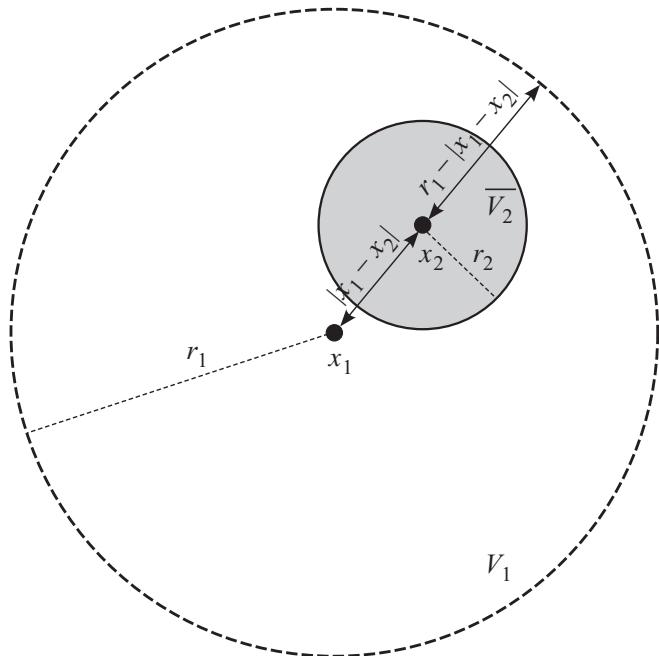

图 13.1 我们对 $r _ { 2 }$ 的选择保证了
${ \overline { { V _ { 2 } } } } ⊂ V _ { 1 }$ 且
$\pmb { x } _ { 1 } ∉ \overline { { V _ { 2 } } }$

为了使这个结构更加严格，我们从 $V _ { 1 }$
的定义开始．现在我们需要一个由 $V _ { n }$ 得到 $V _ { n + 1 }$
的规则．把 $V _ { n }$ 定义为点 ${ \pmb x } _ { n } ∈ { \cal P }$
的邻域，我们按照下述方法构造 $V _ { n + 1 }$ 由于
${ \pmb x } _ { n }$ 是 $P$ 的一个极限点，所以 $V _ { n } ∩ P$
肯定至少包含一个其他的 $\pmb { x } _ { n + 1 } ∈ P$ 使得
${ \pmb x } _ { n + 1 } \neq { \pmb x } _ { n }$ ．现在选取一个
$r _ { n + 1 } > 0$ ，使得

$$
r _ {n + 1} <   min \bigl \{\left| \boldsymbol {x} _ {n} - \boldsymbol {x} _ {n + 1} \right|, r _ {n} - \left| \boldsymbol {x} _ {n} - \boldsymbol {x} _ {n + 1} \right| \bigr \},
$$

并令
$V _ { n + 1 } = N _ { r _ { n + 1 } } ( { \pmb x } _ { n + 1 } )$
．于是有 ${ \overline { { V _ { n + 1 } } } } ⊂ V _ { n }$
，由于 ${ \mathbf { \mathcal { x } } } _ { n }$ 和
${ \pmb x } _ { n + 1 }$ 之间的距离大于 $r _ { n + 1 }$
，所以 ${ \pmb x } _ { n } ∉ \overline { { V _ { n + 1 } } }$

太酷了！现在令 $K _ { n } = { \overline { { V _ { n } } } } ∩ P$
．因为 $\overline { { V _ { n } } }$
是有界闭集，所以由海涅--博雷尔定理可知， $\overline { { V _ { n } } }$
是紧集．由于 P 是闭集，那么根据推论 11.9， $K _ { n }$ 是紧集

对于任意 $n ∈ \mathbb { N }$ ，我们有

$$
 \overline {{V _ {n + 1}}} ⊂ V _ {n} ⇒ \overline {{V _ {n + 1}}} ⊂ \overline {{V _ {n}}}
 ⇒ (\overline {{V _ {n + 1}}} ∩ P) ⊂ (\overline {{V _ {n}}} ∩ P)
 ⇒ K _ {n + 1} ⊂ K _ {n}.
$$

每个 $V _ { n }$ 都是 P 的一个极限点的邻域，所以每个 $V _ { n }$
至少包含 P 的一个点，那么每个 $K _ { n }$
至少包含一个元素．因此，我们得到了一列嵌套的非空紧集 $\{ K _ { n } \}$
，由推论 11.12 可知，
$⋂ _ { n = 1 } ^ { ∈fty } K _ { n } \neq ∅$

等一下！请记住，对于任意
$n ∈ \mathbb { N } , \ x _ { n } \ ∉ \ { \overline { { V _ { n + 1 } } } }$
，所以 ${ \pmb x } _ { n } ∉ K _ { n + 1 }$
，于是$\begin{array} { r } { { \pmb x } _ { n } ∉ ⋂ _ { i = 1 } ^ { ∈fty } K _ { i } } \end{array}$
．这就是可数性出现问题的地方．对于任意给定的 n，
$\begin{array} { r } { { \pmb x } _ { n } ∉ ⋂ _ { i = 1 } ^ { ∈fty } K _ { i } } \end{array}$
因此交集中没有 P 的元素，这就产生了矛盾．因此，P 一定是不可数的 □

此时，你可能会认为闭区间是 中最简单的完备集的例子，所以会觉得
中的每一个完备集都是某个区间的超集．但这是错的！声名狼藉的康托尔集就是一个很好的反例．它是一个实完备集（就像你一样独一无二），但它不仅不是任何闭区间的超集，实际上它甚至不包含任何开区间

为了构造康托尔集，要从集合 ${ \cal E } _ { 0 } = [ 0 , 1 ]$ 开始．删除
$E _ { 0 }$ 中间的三分之一，从而得到
$E _ { 1 } = E _ { 0 } \ ( \frac { 1 } { 3 } , \frac { 2 } { 3 } )$
，所以
$E _ { 1 } = [ 0 , \frac { 1 } { 3 } ] ∪ [ \frac { 2 } { 3 } , 1 ]$
．为了得到 $E _ { 2 }$ ，删除 $E _ { 1 }$
中每个区间中间的三分之一，于是
$\begin{array} { r } { E _ { 2 } = [ 0 , \frac { 1 } { 9 } ] ∪ [ \frac { 2 } { 9 } , \frac { 3 } { 9 } ] ∪ [ \frac { 6 } { 9 } , \frac { 7 } { 9 } ] ∪ [ \frac { 8 } { 9 } , 1 ] } \end{array}$
．然后无限次地重复这个过程（参见下框）．（前五个步骤如图 13.2 所示．）

图 13.2 计算机生成的该过程前五步的图像．第一行（就是一条黑线）对应于
$E _ { 0 }$ ，其后第 n行的黑色区域对应于 $E _ { n - 1 }$ 1

### 构造康托尔集的第 3 步

例如，集合 $E _ { 3 }$ 是集合 $E _ { 2 }$ 去掉开区间和 得到的

因此， $E _ { 3 } =$ ∪ ∪ ∪

请注意，在该过程的每一步中，我们把 $E _ { n }$
的每个闭区间分割为两个闭区间（通过删除中间的三分之一），因此
$E _ { n }$ 中闭区间的个数是 $E _ { n - 1 }$ 中闭区间个数的两倍，即
$2 ( 2 ^ { n - 1 } ) = 2 ^ { n }$ ．此外， $E _ { n }$
中每个闭区间的大小都是 $E _ { n - 1 }$
中每个闭区间大小的三分之一，这意味着 $E _ { n }$
中每个闭区间的长度均为 $\ ( { \frac { 1 } { 3 } } ) ^ { n }$

康托尔集就是所有 $E _ { n }$
的无限交集．我们将在定义中正式给出这种结构

首先要注意，当递归地定义任何概念时（比如，利用前面的集合来定义后续集合），构造过程必须像归纳证明一样起作用．我们必须有一个``基本情形''来指定第一个集合是什么样的，然后是一个``归纳步骤''，也就是说``给定这样的集合
n，那么集合 n+ 1 就应该是这个样子的''．为了使构造有效，集合 $n + 1$
必须满足与集合 n 相同的假设，这样集合 $n + 2$
就可以按照相同的方式来构造，以此类推

定义 13.2 (康托尔集).

设 $E _ { 0 } = [ 0 , 1 ]$ ．对于给定的

$$
E _ {n} = \left[ a _ {0}, b _ {0} \right] ∪ \left[ a _ {1}, b _ {1} \right] ∪ ... ∪ \left[ a _ {2 ^ {n} - 1}, b _ {2 ^ {n} - 1} \right],
$$

令

$$
 E _ {n + 1} = E _ {n} \ \left\{\left(a _ {0} + \frac {b _ {0} - a _ {0}}{3}, a _ {0} + \frac {2 (b _ {0} - a _ {0})}{3}\right) ∪ \right.
 \left. \left(a _ {1} + \frac {b _ {0} - a _ {0}}{3}, a _ {1} + \frac {2 (b _ {0} - a _ {0})}{3}\right) ∪ ... \right.
 \left. \left(a _ {2 ^ {n} - 1} + \frac {b _ {0} - a _ {0}}{3}, a _ {2 ^ {n} - 1} + \frac {2 (b _ {0} - a _ {0})}{3}\right) \right\}.
$$

康托尔集就是集合

$$
P = ⋂_ {n = 0} ^ {∈fty} E _ {n}.
$$

我们没有严格地证明 $E _ { n + 1 }$ $2 ^ { n + 1 }$
个区间的并集，因此这个构造是有效的如果想明确地证明这一点，需要使用归纳法

定理 13.3 (康托尔集是非空的). 康托尔集 P 至少包含一个元素

证明. 注意，每个 $E _ { n }$
都是区间的有限并集（这里的区间都是闭集），那么根据定理 10.4，每个
$E _ { n }$ 也是闭集．当然，所有的 $E _ { n }$
都是有界的，因此由海涅--博雷尔定理可知，每个 $E _ { n }$
都是紧集．因为每个 $E _ { n + 1 }$ 都是由 $E _ { n }$
删除某些元素构造的，所以这些集合是嵌套的．于是，根据推论 11.12，
$⋂ _ { n = 1 } ^ { ∈fty } E _ { n } \neq ∅$
，因此康托尔集 P至少包含一个元素 □

另外还要注意，P 本身是闭集（因为它是无穷多个闭集的交集），而且 P
显然是有界的，所以 P 是紧集

按照承诺，我们将看到 P 不包含开区间，但它确实是完备集

定理 13.4 (康托尔集不包含开区间).

对于任意 $a , b ∈$ R，其中 $a < b$ ，开区间 $( a , b )$
不是康托尔集 P 的子集

证明. 闭区间 $[ a , b ]$ 的长度为 $b - a$ ．记住，对于任意
$n ∈ \mathbb { N } , ~ E _ { n }$
是闭区间的并集，其中每个闭区间的长度都为 $3 ^ { - n }$ ．因为
$P = ⋂ _ { n = 1 } ^ { ∈fty } E _ { n }$ ，所以 P
是每一个 $E _ { n }$ 的子集．因此，对于任意给定的
$n ∈ \mathbb { N }$ ，P 不包含长度大于 $3 ^ { - n }$
的闭区间，从而也不包含长度大于 $3 ^ { - n }$ 的开区间

根据 R 的阿基米德性质，我们可以选择 $n ∈ \mathbb { N }$ ，使得

$$
n > - \frac {\log (b - a)}{\log (3)}.
$$

于是 $\log ( b - a ) > - n \log ( 3 )$ ，所以 $b - a > 3 ^ { - n }$
．因此，P 不可能包含 $( a , b )$ ．

这不是很简单吗？我的意思是，我们利用闭区间的并集来构造康托尔集，而现在我们利用这些闭区间会变得越来越小的事实证明了康托尔集不可能包含任何开区间（或闭区间）．但如果康托尔集被认为是闭区间的并集，那么它怎么可能不包含开区间（或闭区间）呢？

注意这种想法出现问题的关键点：康托尔集本身不是闭区间的并集，它是闭区间并集的无限交．正如我们之前所见，闭区间的无限交可能只包含一个点，比如
$⋂ _ { n = 1 } ^ { ∈fty } \left[ - { \frac { 1 } { n } } , { \frac { 1 } { n } } \right] = \{ 0 \}$

定理 13.5 (康托尔集是完备集). 在度量空间 R 中，康托尔集 P 是完备集

证明. 我们已经知道 P 在 中是闭集，所以现在只需证明 P 的每个点都是 P
的极限点即可．取任意一点 $x ∈ P$ ，对于任意 $r > 0$ ，令

$$
S = N _ {r} (x) = (x - r, x + r).
$$

我们想证明在开区间 S 中存在 P 的其他点

因为 $x ∈ ∩ _ { n = 1 } ^ { ∈fty } E _ { n }$ ，所以对于任意
$n ∈ \mathbb { N }$ 有 $x ∈ E _ { n }$ ．我们知道 $E _ { n }$
是区间的并集，因此 $x -$ 定属于某个区间
$I _ { n } ⊂ E _ { n }$

开区间 S 的长度是 $2 r$ ，并且由定义 13.2 可知，区间 $I _ { n }$
的长度是 $3 ^ { - n }$ ．根据的阿基米德性质，我们可以选取一个
$n ∈ \mathbb { N }$ ，使得

$$
n > - \frac {\log (2 r)}{\log (3)}.
$$

那么， $3 ^ { - n } < 2 r$ ，所以 $I _ { n } ⊂ S .$ ．取
$I _ { n }$ 的端点 $x _ { n }$ ，使得 $x _ { n } \neq x$
（也就是说，如果$I _ { n } = [ a , x ]$ ，则令 $x _ { n } = a ;$
；如果 $I _ { n } = [ x , b ]$ ，则令 $x _ { n } = b$ ；如果
$I _ { n } = [ a , b ]$ ，则令$x _ { n } = a$ 或 $x _ { n } = b )$
．因为 $x _ { n } ∈ I _ { n }$ ，所以 $x _ { n } ∈ S$
，我们证明了在 x 的每个邻域中都存在一些非 x 的点

因此 x 是 P 的极限点，又因为 x 是任意，所以 P 是完备集

注意，根据定理 13.1，这个定理还意味着康托尔集是不可数的

现在我们把注意力转移到连通集上，这可能有点棘手．为了更好地理解连通集，我们将给出两种不同的定义，然后证明它们是等价的．（换句话说，我们要把它们``连通''起来！）然后，我们将证明一个定理，它能更直观地描述实直线上的连通集

我们先来定义分离集，它是连通性的基础

定义 13.6 (分离集).

设 A 和 B 是度量空间 X 的两个子集．如果 A 不与 B 的闭包相交，且 B不与 A
的闭包相交，则称 A 和 B 是分离的

用符号来表示，即如果

$$
A ∩ \overline {{{B}}} = ∅ \text {且} \overline {{{A}}} ∩ B = ∅ ,
$$

那么 $A , B ⊂ X$ 是分离的

例 13.7 (分离集).

记住，点 $a ∈$ R 是半开区间 (a, b{]} 的极限点．因此，集合
$A = [ - 3 , 0 )$ 和集合$B = ( 0 , 3 ]$ 是分离的，因为
$\overline { { A } } = [ - 3 , 0 ]$ 不与 $B = ( 0 , 3 ]$ 相交，且
${ \overline { { B } } } = [ 0 , 3 ]$ 不与$A = [ - 3 , 0 )$ 相交

再举一个例子，对于任意 $n ∈ \mathbb N$ ，集合 $E _ { n }$
中的每一对闭区间（来自于康托尔集的构造过程）都是分离的

记住，在定义 3.10 中，如果两个集合没有公共元素，那么它们是不相交的例如，
$A = [ - 3 , 0 ]$ 和 $B = ( 0 , 3 ]$ 是不相交的．但是，由于
$A ∩ \overline { { B } } = [ - 3 , 0 ] ∩ [ 0 , 3 ] =$
$\{ 0 \} \ne ∅$ ，所以 A 和 B
不是分离的．把分离视为不相交的更强形式对我们是有帮助的

下面这个列表更加明确地给出了两者的区别：

{[}a, b) 和 (b, c{]} 不相交，分离

{[}a, b) 和 $[ b , c ]$ 不相交，不分离

{[}a, b{]} 和 $( b , c ]$ 不相交，不分离

{[}a, b{]} 和 {[}b, c{]} 相交，不分离

当然，如果把``{[}a''替换为 $^ { \bullet } ( a ^ { ' ' }$
并且（或者）把``c{]}''替换为``c)''，上述性质仍然成立

定理 13.8 (分离子集).

设 A 和 B 是度量空间 X 的任意两个子集，令 $A _ { 1 } ⊂ A$ 且
$B _ { 1 } ⊂ B$ ．如果 A和 B 是分离的，那么 $A _ { 1 }$ 和
$B _ { 1 }$ 也是分离的

证明. 我们知道
$A ∩ { \overline { { B } } } = { \overline { { A } } } ∩ B = ∅$
，想要证明的是
$A _ { 1 } ∩ \overline { { B _ { 1 } } } = \overline { { A _ { 1 } } } ∩ B _ { 1 } = ∅ .$

注意，
${ \overline { { A _ { 1 } } } } ⊂ { \overline { { A } } }$
（同样地，
${ \overline { { B _ { 1 } } } } ⊂ { \overline { { B } } } )$
）．实际上，这是闭包的一般属性．为什么会这样？取
$a _ { 1 } ∈ { \overline { { A _ { 1 } } } }$ ．如果
$a _ { 1 } ∈ A _ { 1 }$ ，那么 $a _ { 1 } ∈ A$ （因为
$A _ { 1 } ⊂ A )$ ，所以
$a _ { 1 } ∈ { \overline { { A } } }$ （因为
$A ⊂ { \overline { { A } } } )$ ．如果
$a _ { 1 } ∉ A _ { 1 }$ ，那么 $a _ { 1 }$ 就是 $A _ { 1 }$
的极限点，因此 $a _ { 1 }$ 的每个邻域都至少与 $A _ { 1 }$
有一个不同于 $a _ { 1 }$ 的公共点．但是 $A _ { 1 }$ 的每一个点都是 A
的点，所以 $a _ { 1 }$ 的每个邻域都至少与 A 有一个不同于 $a _ { 1 }$
的公共点．因此 $a _ { 1 }$ 是 A 的极限点，所以
$a _ { 1 } ∈ { \overline { { A } } }$

现在有

$$
\left(A _ {1} ∩ \overline {{B _ {1}}}\right) ⊂ \left(A ∩ \overline {{B _ {1}}}\right) ⊂ \left(A ∩ \overline {{B}}\right) = ∅ ,
$$

同样地，有

$$
(\overline {{A _ {1}}} ∩ B _ {1}) ⊂ (\overline {{A _ {1}}} ∩ B) ⊂ (\overline {{A}} ∩ B) = ∅ .
$$

定义 13.9 (连通集).

如果度量空间 X 的子集 E 是两个非空分离集的并集，那么 E
是不连通的用符号来表示，即如果 $∃ A , B ⊂ X$ 使得：

.}
- $A \neq ∅$ 且 $B \neq ∅$
- $E = A ∪ B$
- $A ∩ { \overline { { B } } } = ∅$ 且
  ${ \overline { { A } } } ∩ B = ∅$

那么 $E ⊂ X$ 是不连通的

如果度量空间 X 的子集 E 不是不连通的，那么 E 就是连通的

例 13.10 (连通集).

由于不连通的定义中规定了分离的集合 A 与 B 必须是非空的，因此空集
$∅$ 是连通的

集合 $E = [ - 3 , 0 ) ∪ ( 0 , 3 ]$ 是不连通的，因为我们在例 13.7
中看到 $[ - 3 , 0 )$ 和$( 0 , 3 ]$ 是分离的

另一方面，即使 {[}−3,0{]} 和 (0,3{]} 不是分离的，我们也不能确定
$E = [ - 3 , 0 ] ∪$ $( 0 , 3 ] = [ - 3 , 3 ]$
是连通的，因为我们不知道是否存在另外两个分离的集合 A 与 B，使得
$A ∪ B = [ - 3 , 3 ]$
（实际上，所有的开区间和闭区间都是连通的，但这需要
$\overrightarrow { j } ^ { \mathrm { I I } }$
格的证明，我们稍后会讲到．）

另一个例子是，康托尔集 P 是不连通的．为什么？设 A 为 P 中
$\leqslant \frac { 1 } { 2 }$ 的点的集合，那么
$A = P ∩ ( - ∈fty , { \frac { 1 } { 2 } } ]$ ；设 B 为 P 中
$> \frac { 1 } { 2 }$ 的点的集合，那么
$B = P ∩ ( { { \frac { 1 } { 2 } } } , ∈fty )$ 于是
$P = A ∪ B$ ，并且 A 和 B 都是非空的．由于 $P ⊂ E _ { 1 }$
，因此 $A ⊂ [ 0 , { \frac { 1 } { 3 } } ]$
且$B ⊂ [ { \frac { 2 } { 3 } } , 1 ]$ ．因为
$[ 0 , { \frac { 1 } { 3 } } ]$ 和
$[ \frac { 2 } { 3 } , 1 ]$ 是分离的，所以由定理 13.8 可知，A 和 B
也是分离的．因此 P 是两个非空分离集的并集

不连通还有另一种定义，你可能会发现在某些情况下使用这个定义会更容易在下面的定理中，我们将证明这两种定义是等价的

定理 13.11 (不连通的另一种定义).

度量空间 X 的子集 E 是不连通的，当且仅当 $∃ U , V ⊂ X$
使得

.}
- U 和 V 都是开集
- $E ⊂ U ∪ V$
- $E ∩ U \neq ∅$ 且 $E ∩ V \neq ∅$
- $E ∩ U ∩ V = ∅ .$

证明. 我们从等价关系的第一个方向开始，假设 E 按照定义 13.9
是不连通的，并证明它满足这个定理的条件．因此，假设存在非空集合 A 和
B，使得 $E = A ∪ B$ $A ∩ { \overline { { B } } } = ∅$
且 ${ \overline { { A } } } ∩ B = ∅$

设 $U = { \overline { { A } } } ^ { C }$ （即 $\overline { { A } }$
在 X 中的补集），设 $V = \overline { { B } } ^ { C }$ （即
$\overline { B }$ 在 X 中的补集）

.}
- 根据定理 10.7，A 和 $\overline { B }$ 都是闭集（相对于
  X），那么由定理 10.1 可知，U 和 V 都是开集（相对于 X）
- 因为 $A ∩ { \overline { { B } } } = ∅$ , 所以
  $A ⊂ { \overline { { B } } } ^ { C }$ ；因为
  ${ \overline { { A } } } ∩ B = ∅$ , 所以
  $B ⊂ { \overline { { A } } } ^ { C }$ ．于是

$$
E = (A ∪ B) ⊂ (\overline {{A}} ^ {C} ∪ \overline {{B}} ^ {C}) = U ∪ V.
$$

.}

- 因为 $B ⊂ E$ 且 $B \neq ∅$ , 所以我们有

$$
E ∩ U = (E ∩ \overline {{A}} ^ {C}) ⊃ (E ∩ B) = B \neq ∅ ,
$$

又因为 $A ⊂ E$ 且 $A \neq ∅$ , 所以我们有

$$
E ∩ V = (E ∩ \overline {{B}} ^ {C}) ⊃ (E ∩ A) = A \neq ∅ .
$$

.}

- 我们做下列运算

$$
  |  {E ∩ U ∩ V = E ∩ (\overline {{{A}}} ^ {C} ∩ \overline {{{B}}} ^ {C})}
  |  {\qquad = E ∩ (\overline {{{A}}} ∪ \overline {{{B}}}) ^ {C} \text {(利用德摩根律)}}
  |  {\qquad ⊂ E ∩ E ^ {C} \text {(因为} E ⊂ \overline {{{A}}} ∪ \overline {{{B}}}, \text {所以} E ^ {C} ⊃ (\overline {{{A}}} ∪ \overline {{{B}}}) ^ {C})}
  |  {\qquad = ∅ .}
$$

为了证明等价关系的另一个方向，假设 E
按照这个定理的条件是不连通的，并证明它满足定义 13.9．因此，假设存在开集
U 和 V，使得 $E ⊂ U ∪ V , E ∩ U \neq ∅$ 且
$E ∩ V \neq ∅$ ，但 $E ∩ U ∩ V = ∅$

设 $A = E ∩ U , B = E ∩ V$
．证明连通性的性质就是使用逻辑和集合论的问题．把这部分内容留作练习会对你有帮助，试着把下框中的空白填充完整

### 证明定理 13.11 的另一个方向

.}
- $A = E ∩ U \neq \quad \quad , B = \quad \quad \quad \neq ∅ .$
- A∪B = (E ∩U)∪(E ∩V ) = E∩ = E，因为 $E ⊂ U ∪ V$

$$
A ∩ \overline {{B}} = (E ∩ U) ∩ \overline {{(E ∩ V)}} ⊂ (E ∩ U) ∩ \underline {{\quad}} = E ∩ V ∩ U = ∅ ,
$$

$$
\overline {{A}} ∩ B = \underline {{\quad}} ∩ (E ∩ V) ⊂ (E ∩ U) ∩ \underline {{\quad}} = E ∩ V ∩ U = \underline {{\quad}}.
$$

定理 13.12 (实直线上的连通集).

R 的子集 E 是连通的，当且仅当对于任意给定的两点 $x , y ∈ E$
和任意给定的 $z ∈$ R，如果 $x < z < y$ ，那么 $z ∈ E$

证明. 我们需要证明定理的两个方向：

连通 =⇒ 包含所有中间点，

包含所有中间点 =⇒ 连通

证明每个方向的逆否命题会更容易些，即

至少不包含一个中间点 =⇒ 不连通，

不连通 =⇒ 至少不包含一个中间点

对于这个证明，使用定义 13.9 比定理 13.11 更简单

首先假设存在 $x , y ∈ E$ 和 $z ∈$ R 使得 $x < z < y$ ，但
$z \not ∈ E .$ ．设 A 是 E 中所有小于 z 的数的集合，因此
$A = E ∩ ( - ∈fty , z )$ ；设 B 是 E 中所有大于 z
的数的集合，因此 $B = E ∩ ( z , ∈fty )$ ．那么 $E = A ∪ B$
，并且 A 和 B 都是非空的（因为$x ∈ A$ 且 $y ∈ B )$ ）．注意，
$A ⊂ ( - ∈fty , z )$ 且 $B ⊂ ( z , ∈fty )$ ，而且
$( - ∈fty , z )$ 和 $( z , ∈fty )$ 是分离的，所以根据定理
13.8，A 和 B 也是分离的．因此 E 是两个非空分离集的并集

现在假设 E 是不连通的，那么存在非空分离集 A 和 B 使得 $E = A ∪ B$
．至少有一个元素 $x ∈ A$ ，至少有一个元素 $y ∈ B$ ．我们知道
$x \neq y$ （否则 $A ∩ B \neq ∅ )$
），因此可以不失一般性地假设 $x < y$ ．（如果 $x > y$
，证明依然有效，只需交换 A 和B 即可）．令

$$
z = sup \{a ∈ A | x \leqslant a \leqslant y \} = sup (A ∩ [ x, y ]).
$$

我们想证明这个 z 不是 E 的元素．从根本上说，我们要利用 A 和 B
的分离性来证明这两个集合之间存在``东西''（那么这个``东西''就不在 E
中）．证明$z \not ∈ B$ 并不难，接下来如果 $z \not ∈ A$
，那就非常好了．否则，我们就取一个充分接近于 z 的元素 $z _ { 1 }$
，使其既不在 A 中也不在 B 中

为了给出严格的论证，我们注意到 $A ∩ [ x , y ]$ 是有上界的 $( y$
即是上界），因此由定理 10.10 可知，
$z ∈ { \overline { { A ∩ [ x , y ] } } } = { \overline { { A } } } ∩ [ x , y ]$
．于是 $z ∈ { \overline { { A } } }$ ，那么 z 不可能是B 的元素（否则
${ \overline { { A } } } ∩ B \neq ∅ )$ ．我们知道
$x \leqslant z \leqslant y$ ，并且 $z \neq y$ （因为
$z \not ∈ B )$ ，所以 $x \leqslant z < y .$

现在有两种可能的情形

情形 1. 如果 $z \not ∈ A$ ，那么 $z \neq x$ ，因此 $x < z < y$
．另外， $z \not ∈ B$ ，所以$z \not ∈ E$ ，这正是我们想要证明的

情形 2. 如果 $z ∈ A$ ，那么 $z \not ∈ { \overline { { B } } }$
（否则
$A ∩ { \overline { { B } } } \neq ∅ { \mathrm { ~ ) ~ } }$
．因为 z 不是 B 的极限点，所以 z 一定存在一个不与 B
相交的邻域，这意味着存在 $r > 0$
，使得$( z - r , z + r ) ∩ B = ∅$ ．选取一个
$z _ { 1 } ∈ ( z , z + r )$ ，使得 $z < z _ { 1 } < y$
（注意，因为$z _ { 1 } ∉ B$ ，所以 $z _ { 1 } \neq y )$ ，所以
$x < z _ { 1 } < y$ ．另外，
$z _ { 1 } \stackrel { \mathrm { \scriptsize ~ \equiv ~ } } { \mathstrut }$
格大于 $A ∩ [ x , y ]$ 中的任何元素（因为
$z _ { 1 } > z = \operatorname* { s u p } A ∩ [ x , y ] )$
），因此它不可能包含在 $A ∩ [ x , y ]$ 中．显然有
$z _ { 1 } ∈ [ x , y ]$ ，这意味着 $z _ { 1 }$ 不可能是 A
的元素．因此 $z _ { 1 } \not ∈ A$ 且 $z _ { 1 } ∉ B$
，所以$z _ { 1 } \not ∈ E .$ □

推论 13.13 (开区间和闭区间都是连通的).

每个开区间 $( a , b )$ 和每个闭区间 $[ a , b ]$ 都是连通的

证明. 开区间和闭区间都是 R 的子集．根据定义，它们包含 a 和 b
之间的所有实数．因此，给定 $( a , b )$ 或 $[ a , b ]$ 中的 x 和
$y$ ，满足 $x < z < y$ 的所有 $z ∈ \mathbb { R }$
都包含在该区间中．于是，根据定理 13.12，这些区间是连通的 □

这一章结束了我们对拓扑学的研究．你已经学习了大量的新定义，希望在此过程中你学到了一些处理它们的技巧．无论将来何时遇到使用新定义的问题，你都应该先试着完全理解该定义，然后再将其应用于解决问题．用文字和符号写出其含义，考察一些基本的例子，了解它在
R 或 $\mathbb { R } ^ { k }$ 中是如何发挥作用的，并绘制一些图形

你会注意到，一般度量空间 X 的相关内容与 R 或 $\mathbb { R } ^ { k }$
的相关内容能很好地融合．尽管实分析主要研究实数，但关于一般度量空间的拓扑学知识也同样有用

接下来要出场的是：序列！太令人兴奋了！

第 四 部 分

序 列

