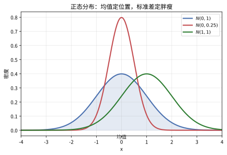
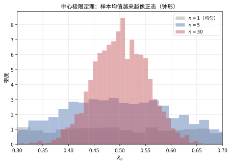

# 第 24 级：概率论基础 (Probability Theory)

## 一、学习目标

完成本教程后，你应当能够：

1. **理解概率的公理化体系**——掌握样本空间、事件、σ-代数、概率测度的定义，理解 Kolmogorov 公理。
2. **熟练运用条件概率与 Bayes 公式**——掌握乘法公式、全概率公式、Bayes 定理及其证明，理解事件的独立性与条件独立性。
3. **掌握随机变量的概念**——区分离散与连续随机变量，熟练运用概率质量函数、概率密度函数与累积分布函数。
4. **计算期望与方差**——掌握期望与方差的定义与性质，理解矩与矩母函数，能够证明 Markov 与 Chebyshev 不等式。
5. **熟悉常用概率分布**——掌握 Bernoulli、二项、Poisson、几何、均匀、正态、指数、Gamma 等分布的定义、性质与相互关系。
6. **处理多维随机变量**——掌握联合分布、边缘分布、条件分布、协方差与相关系数的概念，理解随机变量变换的方法。
7. **理解大数定律**——掌握弱大数定律的 Chebyshev 证明，理解强大数定律的陈述与 Bernoulli 大数定律。
8. **理解中心极限定理**——掌握 CLT 的 MGF 证明思路，理解 De Moivre-Laplace 定理及其应用。
9. **了解特征函数理论**——掌握特征函数的定义、基本性质，理解唯一性定理与连续性定理。
10. **能够应用概率论解决实际问题**——通过大量示例与习题，建立概率直觉与严谨推导能力。

---

## 二、样本空间与事件

### 2.1 样本空间 (Sample Space)

**定义**：一个随机试验的所有可能结果构成的集合称为**样本空间**，记作 $\Omega$（或 $S$）。样本空间中的每一个元素 $\omega \in \Omega$ 称为一个**样本点**。

**示例**：
- 掷一枚硬币：$\Omega = \{H, T\}$（正面、反面）。
- 掷一颗骰子：$\Omega = \{1, 2, 3, 4, 5, 6\}$。
- 测量某地的每日气温：$\Omega = [-\infty, \infty)$ 或 $\Omega = \mathbb{R}$。

### 2.2 事件 (Events)

**定义**：样本空间 $\Omega$ 的某个子集 $A \subseteq \Omega$ 称为一个**事件**。若试验的结果 $\omega \in A$，则称事件 $A$ 发生。

**事件运算**：
- 并集：$A \cup B$ —— $A$ 与 $B$ 至少有一个发生。
- 交集：$A \cap B$ —— $A$ 与 $B$ 同时发生。

> **直观理解（现实类比）**：掷两颗骰子是最经典的概率入门场景。6×6 的网格展示了全部 **36 种等可能结果**，每种组合概率相同（1/36）。但"点数之和"这个事件却呈现出漂亮的对称分布——和为 7 的组合最多（6种），概率 1/6；和为 2 或 12 的组合最少（各1种），概率仅 1/36。这就像**赌场里"押7"总是最热门**：不是因为骰子偏心，而是因为"7"恰好拥有最多的"路径"。离散概率的对称之美，从这里开始。

> **直观理解（现实类比）**：事件就是样本空间的"**区域**"，事件运算就是区域的**拼、叠、挖**。$A\cup B$ 是"至少踩进 $A$ 或 $B$ 一块地"（并）；$A\cap B$ 是"同时踩进两块地"（交）；$A^c$ 是"完全躲开 $A$"（补）。用**两块橡皮泥**：并是把两块捏在一起，交是只留重叠部分，补是切走要扔掉的那块。这为用面积解释概率打下基础。

**事件代数**：事件的运算满足以下性质（布尔代数）：
- 补集：$A^c = \Omega \setminus A$ —— $A$ 不发生。
- 差集：$A \setminus B = A \cap B^c$ —— $A$ 发生而 $B$ 不发生。

**互斥事件**：若 $A \cap B = \varnothing$，则称 $A$ 与 $B$ 互斥（互不相容）。

### 2.3 σ-代数 (σ-Algebra)

为了严格定义概率，我们需要限定哪些子集可以作为事件。并非 $\Omega$ 的所有子集都能被赋予概率（涉及不可测集问题），因此我们需要一个事件族。

**定义**：设 $\Omega$ 为非空集合。$\mathcal{F}$ 是 $\Omega$ 的子集族，若满足：
1. $\Omega \in \mathcal{F}$；
2. 若 $A \in \mathcal{F}$，则 $A^c \in \mathcal{F}$（对补运算封闭）；
3. 若 $A_1, A_2, \dots \in \mathcal{F}$，则 $\bigcup_{i=1}^{\infty} A_i \in \mathcal{F}$（对可数并封闭）。

则称 $\mathcal{F}$ 为 $\Omega$ 上的一个 **σ-代数**（或 σ-域）。称 $(\Omega, \mathcal{F})$ 为一个**可测空间**。

**性质**：由定义可推出 $\varnothing \in \mathcal{F}$，且 $\mathcal{F}$ 对可数交也封闭。

**Borel σ-代数**：$\mathbb{R}$ 上由所有开区间生成的 σ-代数称为 Borel σ-代数，记作 $\mathcal{B}(\mathbb{R})$。它包含所有开集、闭集、半开半闭区间等。

### 2.4 概率测度 (Probability Measure)

**定义 (Kolmogorov 公理)**：设 $(\Omega, \mathcal{F})$ 是一个可测空间。称函数 $P: \mathcal{F} \to [0, 1]$ 为一个**概率测度**，若满足：

1. **非负性**：对所有 $A \in \mathcal{F}$，$P(A) \ge 0$。
2. **规范性**：$P(\Omega) = 1$。
3. **可列可加性 (σ-可加性)**：若 $\{A_n\}_{n=1}^{\infty}$ 是一列两两互斥的事件（即 $A_i \cap A_j = \varnothing$ 对 $i \neq j$），则
   $$P\left(\bigcup_{n=1}^{\infty} A_n\right) = \sum_{n=1}^{\infty} P(A_n).$$

三元组 $(\Omega, \mathcal{F}, P)$ 称为一个**概率空间**。

### 2.5 概率的基本性质

从 Kolmogorov 公理可推导出以下重要性质：

1. **空集概率为零**：$P(\varnothing) = 0$。
2. **有限可加性**：若 $A_1, \dots, A_n$ 两两互斥，则 $P(\bigcup_{i=1}^n A_i) = \sum_{i=1}^n P(A_i)$。
3. **单调性**：若 $A \subseteq B$，则 $P(A) \le P(B)$。
4. **减法公式**：$P(B \setminus A) = P(B) - P(A \cap B)$。
5. **加法公式**：$P(A \cup B) = P(A) + P(B) - P(A \cap B)$。
6. **补集公式**：$P(A^c) = 1 - P(A)$。
7. **容斥原理 (推广)**：
   $$P\left(\bigcup_{i=1}^{n} A_i\right) = \sum_{i} P(A_i) - \sum_{i<j} P(A_i \cap A_j) + \sum_{i<j<k} P(A_i \cap A_j \cap A_k) - \cdots + (-1)^{n+1} P(A_1 \cap \cdots \cap A_n).$$

**证明示例 (加法公式)**：
$$P(A \cup B) = P(A) + P(B \setminus A) = P(A) + [P(B) - P(A \cap B)] = P(A) + P(B) - P(A \cap B).$$
其中第一步利用了 $A \cup B = A \cup (B \setminus A)$ 且 $A$ 与 $B\setminus A$ 互斥，第二步利用了 $B = (B \cap A) \cup (B \setminus A)$ 且两项互斥。

---

## 三、条件概率与独立性

### 3.1 条件概率 (Conditional Probability)

**定义**：设 $(\Omega, \mathcal{F}, P)$ 为概率空间，$A, B \in \mathcal{F}$ 且 $P(B) > 0$。在事件 $B$ 已发生的条件下，事件 $A$ 发生的**条件概率**定义为：
$$P(A \mid B) = \frac{P(A \cap B)}{P(B)}.$$

**直观理解**：条件概率将样本空间缩小为 $B$，在新空间上重新衡量 $A$ 的"占比"。

### 3.2 乘法公式 (Multiplication Rule)

由条件概率定义直接可得：
$$P(A \cap B) = P(B) \cdot P(A \mid B) = P(A) \cdot P(B \mid A).$$

推广到 $n$ 个事件：
$$P(A_1 \cap A_2 \cap \cdots \cap A_n) = P(A_1) \cdot P(A_2 \mid A_1) \cdot P(A_3 \mid A_1 \cap A_2) \cdots P(A_n \mid A_1 \cap \cdots \cap A_{n-1}).$$

### 3.3 全概率公式 (Law of Total Probability)

**定理**：设 $\{B_1, B_2, \dots, B_n\}$ 是 $\Omega$ 的一个划分（即 $B_i$ 两两互斥且 $\bigcup_{i=1}^n B_i = \Omega$），且 $P(B_i) > 0$ 对所有 $i$ 成立。则对任意事件 $A$，有：
$$P(A) = \sum_{i=1}^{n} P(B_i) \cdot P(A \mid B_i).$$

**证明**：由于 $\{B_i\}$ 是划分，$A = A \cap \Omega = A \cap \left(\bigcup_{i=1}^n B_i\right) = \bigcup_{i=1}^n (A \cap B_i)$，且这些项互斥。由可加性：
$$P(A) = \sum_{i=1}^n P(A \cap B_i) = \sum_{i=1}^n P(B_i) \cdot P(A \mid B_i). \quad \square$$

### 3.4 贝叶斯定理 (Bayes' Theorem)

**定理**：设 $\{B_1, B_2, \dots, B_n\}$ 是 $\Omega$ 的一个划分，$P(B_i) > 0$，且 $P(A) > 0$。则对任意 $k$，有：
$$P(B_k \mid A) = \frac{P(B_k) \cdot P(A \mid B_k)}{\sum_{i=1}^{n} P(B_i) \cdot P(A \mid B_i)}.$$

**证明**：由条件概率定义和乘法公式：
$$P(B_k \mid A) = \frac{P(B_k \cap A)}{P(A)} = \frac{P(B_k) \cdot P(A \mid B_k)}{P(A)}.$$
再由全概率公式 $P(A) = \sum_{i=1}^{n} P(B_i) \cdot P(A \mid B_i)$ 代入分母即得。$\square$

**Bayes 定理的直观**：
- $P(B_k)$ 称为**先验概率** (prior)，即在观察到 $A$ 之前对 $B_k$ 的信念。
- $P(B_k \mid A)$ 称为**后验概率** (posterior)，即在观察到 $A$ 之后对 $B_k$ 的更新信念。
- $P(A \mid B_k)$ 称为**似然** (likelihood)。

**示例**：一种疾病的患病率为 0.1%，检测方法的灵敏度为 99%（患者检测为阳性的概率），特异度为 98%（健康人检测为阴性的概率）。若某人检测结果为阳性，问其真正患病的概率是多少？

设 $B$ = "患病"，$A$ = "检测阳性"。则：
$$P(B \mid A) = \frac{P(B) \cdot P(A \mid B)}{P(B) \cdot P(A \mid B) + P(B^c) \cdot P(A \mid B^c)} = \frac{0.001 \times 0.99}{0.001 \times 0.99 + 0.999 \times 0.02} \approx \frac{0.00099}{0.00099 + 0.01998} \approx 0.0472.$$

即检测阳性者真正患病的概率仅为约 4.72%。这体现了"先验概率极低时，即使检测准确率很高，后验概率仍然不高"这一反直觉结论。

> **直观理解（现实类比）**：这棵树形图揭示了一个**反直觉的真相**：假设某种罕见病的患病率仅 0.1%（万人中约 10 人），即使检测方法的灵敏度高达 99%、特异度 98%，拿到阳性报告的人中真正患病的也仅约 **4.72%**。原因很简单——健康人群的基数（9990人）远远大于患病人群（10人），即使假阳性率只有 2%，"假阳性大军"（约200人）也会把"真阳性小队"（约10人）淹没。这就是为什么**体检阳性不必恐慌**——需要做第二次检测来缩小"嫌疑池"。贝叶斯定理告诉我们：**先验概率（基础发病率）决定了后验概率的上限**。

### 3.5 事件的独立性 (Independence)

**定义**：两个事件 $A$ 和 $B$ 称为**相互独立**，若
$$P(A \cap B) = P(A) \cdot P(B).$$

若 $P(B) > 0$，则独立性等价于 $P(A \mid B) = P(A)$，即 $B$ 的发生不影响 $A$ 的概率。

**多个事件的独立性**：事件族 $\{A_i\}_{i \in I}$ 称为相互独立的，若对任意有限子集 $\{i_1, \dots, i_k\} \subseteq I$，有
$$P(A_{i_1} \cap A_{i_2} \cap \cdots \cap A_{i_k}) = P(A_{i_1}) \cdot P(A_{i_2}) \cdots P(A_{i_k}).$$

**注意**：两两独立 (pairwise independence) 不能推出联合独立。例如，考虑 $\Omega = \{1,2,3,4\}$ 上的均匀分布，设 $A = \{1,2\}$，$B = \{1,3\}$，$C = \{1,4\}$。则 $P(A)=P(B)=P(C)=1/2$，且 $P(A \cap B) = P(\{1\}) = 1/4 = P(A)P(B)$，同理 $A$ 与 $C$、$B$ 与 $C$ 均两两独立。但 $P(A \cap B \cap C) = P(\{1\}) = 1/4 \neq 1/8 = P(A)P(B)P(C)$，故三者不相互独立。

### 3.6 条件独立性

**定义**：给定事件 $C$（$P(C) > 0$），称 $A$ 与 $B$ 在 $C$ 下**条件独立**，若
$$P(A \cap B \mid C) = P(A \mid C) \cdot P(B \mid C).$$

条件独立并不蕴含独立，独立也不蕴含条件独立。

---

## 四、随机变量

### 4.1 随机变量的定义

**定义**：设 $(\Omega, \mathcal{F}, P)$ 为概率空间。函数 $X: \Omega \to \mathbb{R}$ 称为一个**随机变量**，若对任意 $x \in \mathbb{R}$，有
$$\{\omega \in \Omega \mid X(\omega) \le x\} \in \mathcal{F},$$
即 $X$ 是 $\mathcal{F}$-可测的。

直观地说，随机变量是将随机试验的结果数值化的函数。

### 4.2 离散随机变量与概率质量函数

**定义**：若随机变量 $X$ 的取值集合为有限集或可数无限集，则称 $X$ 为**离散随机变量**。其**概率质量函数 (PMF)** 定义为：
$$p_X(x) = P(X = x).$$

PMF 满足：
1. $p_X(x) \ge 0$ 对所有 $x$ 成立；
2. $\sum_{x} p_X(x) = 1$，其中求和遍及 $X$ 的所有可能取值。

### 4.3 连续随机变量与概率密度函数

**定义**：若存在非负可积函数 $f_X: \mathbb{R} \to [0, \infty)$，使得对任意 $a \le b$，有
$$P(a \le X \le b) = \int_a^b f_X(x) \, dx,$$
则称 $X$ 为**连续随机变量**，$f_X$ 称为 $X$ 的**概率密度函数 (PDF)**。

PDF 满足：
1. $f_X(x) \ge 0$ 对所有 $x \in \mathbb{R}$ 成立；
2. $\int_{-\infty}^{\infty} f_X(x) \, dx = 1$。

**注意**：对连续随机变量，$P(X = a) = 0$ 对任意单点 $a$ 成立。

### 4.4 累积分布函数 (CDF)

**定义**：随机变量 $X$ 的**累积分布函数**定义为：
$$F_X(x) = P(X \le x), \quad x \in \mathbb{R}.$$

**性质**：
1. $F_X$ 是单调不减的：若 $x_1 < x_2$，则 $F_X(x_1) \le F_X(x_2)$。
2. $F_X$ 是右连续的：$\lim_{t \to x^+} F_X(t) = F_X(x)$。
3. $\lim_{x \to -\infty} F_X(x) = 0$，$\lim_{x \to \infty} F_X(x) = 1$。
4. 对离散随机变量：$F_X(x) = \sum_{t \le x} p_X(t)$。
5. 对连续随机变量：$F_X(x) = \int_{-\infty}^x f_X(t) \, dt$，且 $F_X'(x) = f_X(x)$（在 $f_X$ 连续点处）。

---

## 五、期望与方差

### 5.1 期望 (Expectation)

**定义**：随机变量 $X$ 的**期望**（或均值）定义为：
- 若 $X$ 是离散的：$\displaystyle E[X] = \sum_{x} x \cdot p_X(x)$。
- 若 $X$ 是连续的：$\displaystyle E[X] = \int_{-\infty}^{\infty} x \cdot f_X(x) \, dx$。
- 更一般地，$E[X] = \int_{\Omega} X(\omega) \, dP(\omega)$（Lebesgue 积分）。

要求级数绝对收敛或积分绝对可积，否则期望不存在。

**性质**：
1. **线性性**：$E[aX + bY] = aE[X] + bE[Y]$，对任意常数 $a, b$ 成立。
2. **单调性**：若 $X \le Y$ 几乎必然，则 $E[X] \le E[Y]$。
3. 若 $c$ 为常数，则 $E[c] = c$。
4. **函数的期望**：$E[g(X)] = \sum_x g(x) p_X(x)$（离散）或 $E[g(X)] = \int_{-\infty}^{\infty} g(x) f_X(x) \, dx$（连续）。

### 5.2 方差 (Variance)

**定义**：$X$ 的**方差**定义为：
$$\operatorname{Var}(X) = E[(X - E[X])^2] = E[X^2] - (E[X])^2.$$

**性质**：
1. $\operatorname{Var}(X) \ge 0$，且 $\operatorname{Var}(X) = 0$ 当且仅当 $X$ 几乎必然为常数。
2. $\operatorname{Var}(aX + b) = a^2 \operatorname{Var}(X)$，对任意常数 $a, b$ 成立。
3. 标准差：$\sigma_X = \sqrt{\operatorname{Var}(X)}$。

### 5.3 矩与矩母函数 (Moments and Moment Generating Functions)

**定义**：$X$ 的 **$k$ 阶矩**为 $\mu_k = E[X^k]$，**$k$ 阶中心矩**为 $E[(X - \mu)^k]$，其中 $\mu = E[X]$。

**定义**：$X$ 的**矩母函数 (MGF)** 定义为：
$$M_X(t) = E[e^{tX}],$$
要求存在 $h > 0$ 使得对 $t \in (-h, h)$ 有 $M_X(t) < \infty$。

**性质**：
1. $M_X(0) = 1$。
2. $M_X^{(k)}(0) = E[X^k]$，即 $M_X$ 在 $0$ 处的 $k$ 阶导数等于 $X$ 的 $k$ 阶矩。
3. 若 $Y = aX + b$，则 $M_Y(t) = e^{bt} M_X(at)$。
4. 若 $X$ 与 $Y$ 独立，则 $M_{X+Y}(t) = M_X(t) \cdot M_Y(t)$。
5. **唯一性**：若 MGF 在 $0$ 的邻域内存在，则它唯一确定分布。

### 5.4 Markov 不等式

**定理**：设 $X$ 为非负随机变量，则对任意 $a > 0$，
$$P(X \ge a) \le \frac{E[X]}{a}.$$

**证明**：
$$E[X] = \int_0^{\infty} x f_X(x) \, dx \ge \int_a^{\infty} x f_X(x) \, dx \ge \int_a^{\infty} a f_X(x) \, dx = a \cdot P(X \ge a).$$
两边除以 $a$ 即得。$\square$

### 5.5 Chebyshev 不等式

**定理**：设 $X$ 的期望为 $\mu$，方差为 $\sigma^2 < \infty$，则对任意 $k > 0$，
$$P(|X - \mu| \ge k\sigma) \le \frac{1}{k^2}.$$
等价地，对任意 $\varepsilon > 0$，
$$P(|X - \mu| \ge \varepsilon) \le \frac{\sigma^2}{\varepsilon^2}.$$

**证明**：令 $Y = (X - \mu)^2$，则 $Y \ge 0$ 且 $E[Y] = \sigma^2$。对 $Y$ 应用 Markov 不等式（取 $a = \varepsilon^2$）：
$$P(|X - \mu| \ge \varepsilon) = P((X - \mu)^2 \ge \varepsilon^2) \le \frac{E[(X - \mu)^2]}{\varepsilon^2} = \frac{\sigma^2}{\varepsilon^2}. \quad \square$$

**推论**：Chebyshev 不等式给出了随机变量偏离其均值的概率上界，适用于任何具有有限方差的分布。它不依赖于分布的具体形式，因此是概率论中极有用的工具。

---

## 六、常用分布

### 6.1 Bernoulli 分布 (伯努利分布)

记作 $X \sim \operatorname{Bern}(p)$，$0 \le p \le 1$。

- **描述**：单次试验，成功概率为 $p$，失败概率为 $1-p$。
- **PMF**：$P(X = 1) = p$，$P(X = 0) = 1-p$。
- **期望**：$E[X] = p$。
- **方差**：$\operatorname{Var}(X) = p(1-p)$。
- **MGF**：$M_X(t) = 1 - p + pe^t$。

### 6.2 二项分布 (Binomial Distribution)

记作 $X \sim \operatorname{Bin}(n, p)$，$n \in \mathbb{N}$，$0 \le p \le 1$。

- **描述**：$n$ 次独立 Bernoulli 试验中的成功次数。
- **PMF**：$P(X = k) = \binom{n}{k} p^k (1-p)^{n-k}$，$k = 0, 1, \dots, n$。
- **期望**：$E[X] = np$。
- **方差**：$\operatorname{Var}(X) = np(1-p)$。
- **MGF**：$M_X(t) = (1 - p + pe^t)^n$。
- **可加性**：若 $X \sim \operatorname{Bin}(n, p)$，$Y \sim \operatorname{Bin}(m, p)$ 且独立，则 $X + Y \sim \operatorname{Bin}(n+m, p)$。

### 6.3 Poisson 分布 (泊松分布)

记作 $X \sim \operatorname{Poi}(\lambda)$，$\lambda > 0$。

- **描述**：用于建模单位时间内随机事件发生的次数。
- **PMF**：$P(X = k) = \frac{\lambda^k e^{-\lambda}}{k!}$，$k = 0, 1, 2, \dots$。
- **期望**：$E[X] = \lambda$。
- **方差**：$\operatorname{Var}(X) = \lambda$。
- **MGF**：$M_X(t) = e^{\lambda(e^t - 1)}$。
- **可加性**：若 $X \sim \operatorname{Poi}(\lambda_1)$，$Y \sim \operatorname{Poi}(\lambda_2)$ 且独立，则 $X + Y \sim \operatorname{Poi}(\lambda_1 + \lambda_2)$。
- **Poisson 逼近（稀有事件定律）**：当 $n$ 很大、$p$ 很小且 $np \to \lambda$ 时，$\operatorname{Bin}(n, p)$ 近似于 $\operatorname{Poi}(\lambda)$。

### 6.4 几何分布 (Geometric Distribution)

记作 $X \sim \operatorname{Geom}(p)$，$0 < p \le 1$。

- **描述**：首次成功所需的试验次数。有两种常见定义：
  - 版本 1（支持集 $\{1, 2, \dots\}$）：$P(X = k) = (1-p)^{k-1} p$，$E[X] = 1/p$，$\operatorname{Var}(X) = (1-p)/p^2$。
  - 版本 2（支持集 $\{0, 1, \dots\}$）：$P(Y = k) = (1-p)^k p$，$E[Y] = (1-p)/p$。
- **无记忆性**：$P(X > n + m \mid X > m) = P(X > n)$，即几何分布是唯一的离散无记忆分布。

### 6.5 均匀分布 (Uniform Distribution)

- **离散均匀分布**：$X \sim \operatorname{Unif}\{1, 2, \dots, n\}$，$P(X = k) = 1/n$，$E[X] = (n+1)/2$，$\operatorname{Var}(X) = (n^2 - 1)/12$。
- **连续均匀分布**：$X \sim \operatorname{Unif}(a, b)$，$a < b$。
  - **PDF**：$f_X(x) = \frac{1}{b-a}$，$a \le x \le b$。
  - **CDF**：$F_X(x) = \frac{x - a}{b - a}$，$a \le x \le b$。
  - **期望**：$E[X] = \frac{a + b}{2}$。
  - **方差**：$\operatorname{Var}(X) = \frac{(b-a)^2}{12}$。
  - **MGF**：$M_X(t) = \frac{e^{tb} - e^{ta}}{t(b-a)}$（$t \neq 0$）。

### 6.6 正态分布 (Normal/Gaussian Distribution)

记作 $X \sim N(\mu, \sigma^2)$，$\mu \in \mathbb{R}$，$\sigma > 0$。

- **描述**：自然界中最常见的分布，中心极限定理的极限分布。
- **PDF**：$f_X(x) = \frac{1}{\sqrt{2\pi}\sigma} e^{-\frac{(x - \mu)^2}{2\sigma^2}}$，$x \in \mathbb{R}$。
- **CDF**：$F_X(x) = \Phi\left(\frac{x - \mu}{\sigma}\right)$，其中 $\Phi(z) = \frac{1}{\sqrt{2\pi}} \int_{-\infty}^z e^{-t^2/2} dt$ 是标准正态 CDF。
- **期望**：$E[X] = \mu$。
- **方差**：$\operatorname{Var}(X) = \sigma^2$。
- **MGF**：$M_X(t) = e^{\mu t + \sigma^2 t^2 / 2}$。
- **标准正态分布**：$Z = \frac{X - \mu}{\sigma} \sim N(0, 1)$。
- **可加性**：若 $X \sim N(\mu_1, \sigma_1^2)$，$Y \sim N(\mu_2, \sigma_2^2)$ 且独立，则 $X + Y \sim N(\mu_1 + \mu_2, \sigma_1^2 + \sigma_2^2)$。
- **线性变换**：若 $X \sim N(\mu, \sigma^2)$，则 $aX + b \sim N(a\mu + b, a^2\sigma^2)$。
- **3σ 法则**：$P(|X - \mu| < \sigma) \approx 0.6827$，$P(|X - \mu| < 2\sigma) \approx 0.9545$，$P(|X - \mu| < 3\sigma) \approx 0.9973$。

> **直观理解（现实类比）**：正态分布是"**大自然最钟爱的钟形**"，也叫高斯分布。它描述大量独立随机因素叠加的结果——人的身高、测量误差、IQ 都近似服从它。**均值 $\mu$ 决定山峰的位置**，**标准差 $\sigma$ 决定山脊的胖瘦**：$\sigma$ 越小越瘦高、越集中。68-95-99.7 法则（3σ 法则）正是"**多数数据都挤在平均值附近**"的量化：约 95% 的数据落在均值 ± 2 个标准差内。

### 6.7 指数分布 (Exponential Distribution)

记作 $X \sim \operatorname{Exp}(\lambda)$，$\lambda > 0$。

- **描述**：用于建模等待时间、寿命等。
- **PDF**：$f_X(x) = \lambda e^{-\lambda x}$，$x \ge 0$。
- **CDF**：$F_X(x) = 1 - e^{-\lambda x}$，$x \ge 0$。
- **期望**：$E[X] = 1/\lambda$。
- **方差**：$\operatorname{Var}(X) = 1/\lambda^2$。
- **MGF**：$M_X(t) = \frac{\lambda}{\lambda - t}$，$t < \lambda$。
- **无记忆性**：$P(X > s + t \mid X > s) = P(X > t)$，即指数分布是唯一的连续无记忆分布。
- **与 Poisson 分布的关系**：若单位时间内事件发生次数服从 $\operatorname{Poi}(\lambda)$，则事件间的时间间隔服从 $\operatorname{Exp}(\lambda)$。

### 6.8 Gamma 分布 (伽马分布)

记作 $X \sim \operatorname{Gamma}(\alpha, \beta)$，$\alpha > 0$（形状参数），$\beta > 0$（速率参数）。

- **描述**：指数分布的推广，用于建模 $k$ 个独立同分布指数随机变量之和。
- **PDF**：$f_X(x) = \frac{\beta^\alpha}{\Gamma(\alpha)} x^{\alpha - 1} e^{-\beta x}$，$x \ge 0$。
- **期望**：$E[X] = \alpha / \beta$。
- **方差**：$\operatorname{Var}(X) = \alpha / \beta^2$。
- **MGF**：$M_X(t) = \left(\frac{\beta}{\beta - t}\right)^\alpha$，$t < \beta$。
- **特殊情形**：
  - $\alpha = 1$ 时退化为 $\operatorname{Exp}(\beta)$。
  - $\alpha = n/2$，$\beta = 1/2$ 时称为 $\chi^2(n)$（自由度为 $n$ 的卡方分布）。
- **可加性**：若 $X \sim \operatorname{Gamma}(\alpha_1, \beta)$，$Y \sim \operatorname{Gamma}(\alpha_2, \beta)$ 且独立，则 $X + Y \sim \operatorname{Gamma}(\alpha_1 + \alpha_2, \beta)$。

### 6.9 负二项分布 (Negative Binomial Distribution)

**模型**：进行独立重复试验，每次成功概率为 $p$。$X$ = 第 $r$ 次成功前失败的次数。
$$
P(X = k) = \binom{k + r - 1}{k} p^r (1-p)^k, \quad k = 0, 1, 2, \dots
$$
**均值与方差**：$E[X] = \frac{r(1-p)}{p}$，$\operatorname{Var}(X) = \frac{r(1-p)}{p^2}$。

> **💡 直观理解**：二项分布问"固定试验次数里的成功数"，负二项分布问"固定成功次数后需要的失败数"，两者视角相反。$r = 1$ 时退化为几何分布。

### 6.10 超几何分布 (Hypergeometric Distribution)

**模型**：从 $N$ 个物品（其中 $K$ 个"特殊"）中不放回抽取 $n$ 个，$X$ = 抽到的特殊品个数。
$$
P(X = k) = \frac{\binom{K}{k} \binom{N-K}{n-k}}{\binom{N}{n}}, \quad \max(0, n-N+K) \le k \le \min(n, K).
$$
**均值**：$E[X] = n\frac{K}{N}$。当 $N$ 很大时，超几何分布趋近二项分布。

> **💡 直观理解**：超几何是"不放回"的抽样（每抽一次整体变化），二项是"放回"的抽样（每次独立同分布）。例如质检抽检、扑克牌抽牌都用到超几何分布。

### 6.11 Beta 分布 (Beta Distribution)

**定义**：$X \sim \operatorname{Beta}(\alpha, \beta)$，密度为
$$
f(x) = \frac{x^{\alpha-1}(1-x)^{\beta-1}}{B(\alpha, \beta)}, \quad 0 < x < 1.
$$
**均值与方差**：$E[X] = \frac{\alpha}{\alpha+\beta}$，$\operatorname{Var}(X) = \frac{\alpha\beta}{(\alpha+\beta)^2(\alpha+\beta+1)}$。

> **💡 直观理解**：Beta 分布定义在 $(0,1)$ 上，是描述"比例/概率"的理想分布。$\alpha=\beta=1$ 时退化为均匀分布。它是贝叶斯推断中二项分布参数的共轭先验。

### 6.12 对数正态分布 (Lognormal Distribution)

**定义**：若 $\ln X \sim \mathcal{N}(\mu, \sigma^2)$，则 $X$ 服从**对数正态分布**，密度为
$$
f(x) = \frac{1}{x\sigma\sqrt{2\pi}} e^{-\frac{(\ln x - \mu)^2}{2\sigma^2}}, \quad x > 0.
$$
**均值与方差**：$E[X] = e^{\mu + \sigma^2/2}$，$\operatorname{Var}(X) = (e^{\sigma^2}-1)e^{2\mu+\sigma^2}$。

> **💡 直观理解**：对数正态分布用于描述"只取正值且偏态"的量，如股票价格、收入、生物尺寸。它由大量小比例的乘法效应累积而成，是中心极限定理的乘法版本。

---

## 七、多维随机变量

### 7.1 联合分布 (Joint Distribution)

**定义**：设 $X$ 和 $Y$ 是定义在同一概率空间上的随机变量。它们的**联合累积分布函数**为：
$$F_{X,Y}(x, y) = P(X \le x, Y \le y).$$

**离散情形**：联合 PMF 为 $p_{X,Y}(x, y) = P(X = x, Y = y)$，满足 $\sum_x \sum_y p_{X,Y}(x, y) = 1$。

**连续情形**：若存在 $f_{X,Y}(x, y) \ge 0$ 使得
$$F_{X,Y}(x, y) = \int_{-\infty}^x \int_{-\infty}^y f_{X,Y}(s, t) \, dt \, ds,$$
则 $f_{X,Y}$ 称为联合 PDF，满足 $\int_{-\infty}^\infty \int_{-\infty}^\infty f_{X,Y}(x, y) \, dx \, dy = 1$。

### 7.2 边缘分布 (Marginal Distribution)

**离散情形**：
$$p_X(x) = \sum_{y} p_{X,Y}(x, y), \quad p_Y(y) = \sum_{x} p_{X,Y}(x, y).$$

**连续情形**：
$$f_X(x) = \int_{-\infty}^{\infty} f_{X,Y}(x, y) \, dy, \quad f_Y(y) = \int_{-\infty}^{\infty} f_{X,Y}(x, y) \, dx.$$

### 7.3 条件分布 (Conditional Distribution)

**离散情形**：给定 $Y = y$（$p_Y(y) > 0$），$X$ 的条件 PMF 为：
$$p_{X \mid Y}(x \mid y) = \frac{p_{X,Y}(x, y)}{p_Y(y)}.$$

**连续情形**：给定 $Y = y$（$f_Y(y) > 0$），$X$ 的条件 PDF 为：
$$f_{X \mid Y}(x \mid y) = \frac{f_{X,Y}(x, y)}{f_Y(y)}.$$

**条件期望**：$E[X \mid Y = y] = \sum_x x \cdot p_{X \mid Y}(x \mid y)$（离散）或 $\int_{-\infty}^\infty x \cdot f_{X \mid Y}(x \mid y) \, dx$（连续）。它是 $y$ 的函数，记为 $g(y)$。

**条件期望的性质**：
1. **线性性**：$E[aX_1 + bX_2 \mid Y] = aE[X_1 \mid Y] + bE[X_2 \mid Y]$。
2. **全期望公式**（塔性质）：$E[X] = E[E[X \mid Y]]$。
3. **取出已知量**：若 $X$ 在给定 $Y$ 下是"已知的"（即 $X$ 是 $Y$ 的函数），则 $E[XY \mid Y] = Y\, E[X \mid Y]$。
4. 若 $X$ 与 $Y$ **独立**，则 $E[X \mid Y] = E[X]$。

**条件方差与全方差公式**:定义条件方差 $\operatorname{Var}(X \mid Y) = E[X^2 \mid Y] - (E[X \mid Y])^2$，则
$$
\operatorname{Var}(X) = E[\operatorname{Var}(X \mid Y)] + \operatorname{Var}(E[X \mid Y]).
$$

> **💡 直观理解**：全期望公式把"总平均"拆成"各组内平均的加权平均"；全方差公式把"总波动"拆成"组内波动的平均 + 组间均值的波动"。这就像分析一个班的总成绩：波动来自每个学生自身的不稳定（组内）与不同水平小组之间的差异（组间）。

**例**：掷两枚骰子，$X$ 为点数之和，$Y$ 为第一枚的点数。则 $E[X \mid Y=y] = y + 3.5$，由全期望公式 $E[X] = E[Y] + 3.5 = 7$。

### 7.4 协方差与相关系数

**定义**：$X$ 与 $Y$ 的**协方差**为：
$$\operatorname{Cov}(X, Y) = E[(X - E[X])(Y - E[Y])] = E[XY] - E[X]E[Y].$$

**性质**：
1. $\operatorname{Cov}(X, Y) = \operatorname{Cov}(Y, X)$。
2. $\operatorname{Cov}(aX + b, cY + d) = ac \cdot \operatorname{Cov}(X, Y)$。
3. $\operatorname{Var}(X + Y) = \operatorname{Var}(X) + \operatorname{Var}(Y) + 2\operatorname{Cov}(X, Y)$。
4. 若 $X$ 与 $Y$ 独立，则 $\operatorname{Cov}(X, Y) = 0$（但反之不成立）。

**定义**：$X$ 与 $Y$ 的**Pearson 相关系数**为：
$$\rho_{X,Y} = \frac{\operatorname{Cov}(X, Y)}{\sqrt{\operatorname{Var}(X) \operatorname{Var}(Y)}}.$$

**性质**：
1. $-1 \le \rho_{X,Y} \le 1$（Cauchy-Schwarz 不等式）。
2. $|\rho_{X,Y}| = 1$ 当且仅当 $Y = aX + b$ 几乎必然（线性相关）。
3. $\rho_{X,Y} = 0$ 表示 $X$ 与 $Y$ 不相关（但不一定独立）。

### 7.5 协方差矩阵与多元正态分布

**协方差矩阵**：对 $n$ 维随机向量 $\boldsymbol{X} = (X_1, \dots, X_n)^{\mathsf{T}}$，其**均值向量**与**协方差矩阵**分别为
$$
\boldsymbol{\mu} = E[\boldsymbol{X}] = (E[X_1], \dots, E[X_n])^{\mathsf{T}}, \qquad
\Sigma = \operatorname{Cov}(\boldsymbol{X}) = E[(\boldsymbol{X}-\boldsymbol{\mu})(\boldsymbol{X}-\boldsymbol{\mu})^{\mathsf{T}}],
$$
其中 $\Sigma$ 是 $n \times n$ 对称矩阵，第 $(i,j)$ 元为 $\operatorname{Cov}(X_i, X_j)$，对角线元为 $\operatorname{Var}(X_i)$。

> **💡 直观理解**：均值向量给出"中心"，协方差矩阵给出"散布的形状"。对角线衡量每个分量自身的波动，非对角线衡量两分量的联动方向（正=同涨同跌，负=此消彼长）。

**性质**：对确定的矩阵 $A, B$，$\operatorname{Cov}(A\boldsymbol{X} + B) = A\Sigma A^{\mathsf{T}}$。

**多元正态分布**：$n$ 维随机向量 $\boldsymbol{X}$ 服从**多元正态分布** $\mathcal{N}(\boldsymbol{\mu}, \Sigma)$，其联合密度为
$$
f(\boldsymbol{x}) = \frac{1}{(2\pi)^{n/2}|\det\Sigma|^{1/2}} \exp\left[-\frac{1}{2}(\boldsymbol{x}-\boldsymbol{\mu})^{\mathsf{T}}\Sigma^{-1}(\boldsymbol{x}-\boldsymbol{\mu})\right], \quad \Sigma \succ 0.
$$

**关键性质**：多元正态分量的**不相关 ⟺ 独立**（对正态而言，协方差为 0 即独立）。这是正态分布特有的性质，也是线性回归、多元统计分析的基础。

**例**：设 $\boldsymbol{X} \sim \mathcal{N}(\boldsymbol{\mu}, \Sigma)$，$\boldsymbol{a}$ 为常数向量，则 $\boldsymbol{a}^{\mathsf{T}}\boldsymbol{X} \sim \mathcal{N}(\boldsymbol{a}^{\mathsf{T}}\boldsymbol{\mu},\, \boldsymbol{a}^{\mathsf{T}}\Sigma\boldsymbol{a})$。

### 7.6 随机变量的变换

**单变量变换**：若 $X$ 有 PDF $f_X$，$Y = g(X)$ 是严格单调可微函数，则 $Y$ 的 PDF 为：
$$f_Y(y) = f_X(g^{-1}(y)) \cdot \left| \frac{d}{dy} g^{-1}(y) \right|.$$

**多变量变换**：若 $(X_1, X_2)$ 有联合 PDF $f_{X_1, X_2}$，变换 $(Y_1, Y_2) = (g_1(X_1, X_2), g_2(X_1, X_2))$ 是一一对应且可微的，则 $(Y_1, Y_2)$ 的联合 PDF 为：
$$f_{Y_1, Y_2}(y_1, y_2) = f_{X_1, X_2}(g_1^{-1}(y_1, y_2), g_2^{-1}(y_1, y_2)) \cdot |\det J|,$$
其中 $J$ 是 Jacobi 矩阵 $\frac{\partial(x_1, x_2)}{\partial(y_1, y_2)}$。

---

## 八、大数定律

### 8.0 Borel-Cantelli 引理

**引理 (Borel-Cantelli)**：设 $\{A_n\}$ 是事件序列。
1. 若 $\sum_{n=1}^{\infty} P(A_n) < \infty$，则 $P(\text{无穷多个 } A_n \text{ 发生}) = 0$；
2. 若 $A_n$ 相互独立，且 $\sum_{n=1}^{\infty} P(A_n) = \infty$，则 $P(\text{无穷多个 } A_n \text{ 发生}) = 1$。

这里"无穷多个 $A_n$ 发生"记为 $\limsup A_n = \bigcap_{m}\bigcup_{n\ge m} A_n$，即 $A_n$ 无限次出现。

> **💡 直观理解**：第一段说"概率之和有限的事件，几乎不会无限次发生"；第二段说"独立事件概率之和发散，则几乎必然无限次发生"。它把"无穷级数收敛性"与"事件是否无限次出现"联系起来，是强大数定律和几乎必然收敛的基石。

> **🔑 数学思路**：几乎所有"几乎必然"型结论（如 $P(X_i \ne \mu \text{ 无限次}) = 0$）都可以归结为用 Borel-Cantelli 引理验证某条级数收敛。

### 8.1 弱大数定律 (Weak Law of Large Numbers, WLLN)

**定理**：设 $X_1, X_2, \dots$ 是独立同分布 (i.i.d.) 的随机变量，期望 $E[X_i] = \mu$，方差 $\operatorname{Var}(X_i) = \sigma^2 < \infty$。定义样本均值 $\bar{X}_n = \frac{1}{n} \sum_{i=1}^n X_i$。则对任意 $\varepsilon > 0$，
$$\lim_{n \to \infty} P(|\bar{X}_n - \mu| \ge \varepsilon) = 0.$$
这称为 $\bar{X}_n$ **依概率收敛**于 $\mu$，记作 $\bar{X}_n \xrightarrow{p} \mu$。

**证明（使用 Chebyshev 不等式）**：
$$E[\bar{X}_n] = \frac{1}{n} \sum_{i=1}^n E[X_i] = \mu,$$
$$\operatorname{Var}(\bar{X}_n) = \frac{1}{n^2} \sum_{i=1}^n \operatorname{Var}(X_i) = \frac{\sigma^2}{n}.$$
由 Chebyshev 不等式：
$$P(|\bar{X}_n - \mu| \ge \varepsilon) \le \frac{\operatorname{Var}(\bar{X}_n)}{\varepsilon^2} = \frac{\sigma^2}{n \varepsilon^2} \to 0 \quad (n \to \infty). \quad \square$$

### 8.2 强大数定律 (Strong Law of Large Numbers, SLLN)

**定理**：设 $X_1, X_2, \dots$ 是独立同分布的随机变量，$E[X_i] = \mu < \infty$（即期望有限）。则样本均值 $\bar{X}_n$ **几乎必然收敛**于 $\mu$：
$$P\left(\lim_{n \to \infty} \bar{X}_n = \mu\right) = 1.$$
记作 $\bar{X}_n \xrightarrow{\text{a.s.}} \mu$。

**说明**：强大数定律比弱大数定律更强——几乎必然收敛蕴含依概率收敛，但反之不成立。强大数定律的证明需要更精细的工具（如 Kolmogorov 不等式或截断方法），此处从略。

### 8.3 Bernoulli 大数定律

**定理**：设 $S_n$ 是 $n$ 次独立 Bernoulli 试验中的成功次数，每次成功概率为 $p$。则对任意 $\varepsilon > 0$，
$$\lim_{n \to \infty} P\left(\left|\frac{S_n}{n} - p\right| \ge \varepsilon\right) = 0.$$
即频率 $\frac{S_n}{n}$ 依概率收敛于概率 $p$。

**证明**：这是弱大数定律的直接推论，因为 $S_n \sim \operatorname{Bin}(n, p)$，$E[S_n/n] = p$，$\operatorname{Var}(S_n/n) = p(1-p)/n \to 0$。

---

## 九、中心极限定理

### 9.1 中心极限定理 (Central Limit Theorem, CLT)

**定理**：设 $X_1, X_2, \dots, X_n$ 是独立同分布的随机变量，$E[X_i] = \mu$，$\operatorname{Var}(X_i) = \sigma^2 \in (0, \infty)$。令
$$Z_n = \frac{\bar{X}_n - \mu}{\sigma / \sqrt{n}} = \frac{\sum_{i=1}^n X_i - n\mu}{\sigma \sqrt{n}}.$$
则 $Z_n$ 的分布函数收敛于标准正态分布函数：
$$\lim_{n \to \infty} P(Z_n \le z) = \Phi(z) = \frac{1}{\sqrt{2\pi}} \int_{-\infty}^z e^{-t^2/2} \, dt, \quad \forall z \in \mathbb{R}.$$

> **直观理解（现实类比）**：中心极限定理是概率论的"**镇山之宝**"：**无论个体分布多么"歪瓜裂枣"，只要独立同分布且方差有限，它们的样本均值在 $n$ 足够大时就"长得像"正态分布**。就像**掷很多次公平硬币**——单次结果只有 0/1 两个尖峰，但掷 30 次的均值分布已是一个漂亮的钟形。这解释了统计中大量"近似正态"现象，是参数估计和假设检验的基石。

### 9.2 证明思路 (MGF 方法)

**证明概要**：假设 $X_i$ 的 MGF $M_X(t)$ 在 $0$ 的邻域内存在。不失一般性，设 $\mu = 0$，$\sigma^2 = 1$（否则标准化）。考虑标准化和：
$$Z_n = \frac{1}{\sqrt{n}} \sum_{i=1}^n X_i.$$
$Z_n$ 的 MGF 为：
$$M_{Z_n}(t) = E\left[e^{t Z_n}\right] = E\left[\exp\left(\frac{t}{\sqrt{n}} \sum_{i=1}^n X_i\right)\right] = \left[E\left(e^{\frac{t}{\sqrt{n}} X_1}\right)\right]^n = \left[M_X\left(\frac{t}{\sqrt{n}}\right)\right]^n.$$

对 $M_X$ 在 $0$ 附近做 Taylor 展开：
$$M_X(s) = M_X(0) + M_X'(0) s + \frac{1}{2} M_X''(0) s^2 + o(s^2) = 1 + \frac{1}{2} s^2 + o(s^2),$$
其中利用了 $M_X(0)=1$，$M_X'(0)=E[X]=0$，$M_X''(0)=E[X^2]=1$。

代入 $s = t/\sqrt{n}$：
$$M_{Z_n}(t) = \left[1 + \frac{t^2}{2n} + o\left(\frac{t^2}{n}\right)\right]^n \to e^{t^2/2} \quad (n \to \infty).$$
而 $e^{t^2/2}$ 正是标准正态分布的 MGF。由 MGF 的连续性定理（若 MGF 逐点收敛到某分布的 MGF，则分布函数也收敛），得证。$\square$

**注**：上述证明假设 MGF 存在。更一般的情形（如 MGF 不存在但仍服从 CLT）需使用特征函数方法。

### 9.3 De Moivre-Laplace 定理

**定理**：设 $S_n \sim \operatorname{Bin}(n, p)$，$0 < p < 1$，则当 $n \to \infty$ 时，
$$\frac{S_n - np}{\sqrt{np(1-p)}} \xrightarrow{d} N(0, 1).$$

这是中心极限定理在二项分布上的特例。

**实际应用**：当 $n$ 足够大时，可用正态分布近似二项分布概率：
$$P(a \le S_n \le b) \approx \Phi\left(\frac{b + 0.5 - np}{\sqrt{np(1-p)}}\right) - \Phi\left(\frac{a - 0.5 - np}{\sqrt{np(1-p)}}\right),$$
其中 $\pm 0.5$ 是**连续性校正** (continuity correction)。

### 9.4 CLT 的应用

1. **置信区间估计**：基于样本均值 $\bar{X}_n$ 构造总体均值 $\mu$ 的置信区间：
   $$\bar{X}_n \pm z_{\alpha/2} \cdot \frac{\sigma}{\sqrt{n}},$$
   其中 $z_{\alpha/2}$ 是标准正态分布的 $\alpha/2$ 上分位数。

2. **假设检验**：在样本量足够大时，可用正态分布近似检验统计量的分布。

3. **蒙特卡洛方法**：利用 CLT 估计蒙特卡洛模拟的误差。

---

## 十、特征函数

### 10.1 特征函数的定义

**定义**：随机变量 $X$ 的**特征函数**定义为：
$$\varphi_X(t) = E[e^{itX}] = E[\cos(tX)] + i E[\sin(tX)], \quad t \in \mathbb{R}.$$

其中 $i = \sqrt{-1}$ 是虚数单位。

**与 MGF 的关系**：特征函数总是存在（对任意 $t$，$|e^{itX}| = 1$ 有界），而 MGF 不一定存在。

### 10.2 基本性质

1. $\varphi_X(0) = 1$。
2. $|\varphi_X(t)| \le 1$ 对所有 $t$ 成立。
3. $\varphi_X(-t) = \overline{\varphi_X(t)}$（共轭对称）。
4. 若 $Y = aX + b$，则 $\varphi_Y(t) = e^{itb} \varphi_X(at)$。
5. 若 $X$ 与 $Y$ 独立，则 $\varphi_{X+Y}(t) = \varphi_X(t) \cdot \varphi_Y(t)$。
6. 若 $E[|X|^k] < \infty$，则 $\varphi_X$ 在 $0$ 处 $k$ 次可微，且 $\varphi_X^{(k)}(0) = i^k E[X^k]$。

### 10.3 常见分布的特征函数

| 分布 | 特征函数 $\varphi(t)$ |
|:---|:---|
| $\operatorname{Bern}(p)$ | $1 - p + pe^{it}$ |
| $\operatorname{Bin}(n, p)$ | $(1 - p + pe^{it})^n$ |
| $\operatorname{Poi}(\lambda)$ | $e^{\lambda(e^{it} - 1)}$ |
| $N(\mu, \sigma^2)$ | $e^{i\mu t - \sigma^2 t^2 / 2}$ |
| $\operatorname{Exp}(\lambda)$ | $\frac{\lambda}{\lambda - it}$ |
| $\operatorname{Unif}(a, b)$ | $\frac{e^{itb} - e^{ita}}{it(b-a)}$ |

### 10.4 唯一性定理 (Uniqueness Theorem)

**定理**：随机变量的分布函数由其特征函数唯一确定。即，若 $\varphi_X(t) = \varphi_Y(t)$ 对所有 $t \in \mathbb{R}$ 成立，则 $X$ 和 $Y$ 同分布。

**反演公式**：若 $\varphi_X$ 绝对可积，则 $X$ 有 PDF：
$$f_X(x) = \frac{1}{2\pi} \int_{-\infty}^{\infty} e^{-itx} \varphi_X(t) \, dt.$$

### 10.5 连续性定理 (Continuity Theorem / Lévy's Convergence Theorem)

**定理**：设 $\{X_n\}$ 是一列随机变量，$\varphi_n$ 是相应的特征函数。若 $\varphi_n(t) \to \varphi(t)$ 对每个 $t$ 成立，且 $\varphi$ 在 $t=0$ 处连续，则 $\varphi$ 是某个随机变量 $X$ 的特征函数，且 $X_n \xrightarrow{d} X$（依分布收敛）。

**重要性**：这是中心极限定理的标准证明工具（当 MGF 不存在时）。

### 10.6 Lévy 连续性定理 (Lévy's Convergence Theorem)

Lévy 连续性定理正是上一节所述的连续性定理。它建立了特征函数的逐点收敛与分布函数弱收敛之间的等价关系（在极限函数于 $0$ 处连续的前提下），是概率论中最重要的工具之一。

---

## 十一、示例

### 示例 1：掷骰子的概率

掷一颗均匀的六面骰子，求点数为偶数的概率。

**解**：样本空间 $\Omega = \{1, 2, 3, 4, 5, 6\}$，$P(\{\omega\}) = 1/6$。事件 $A = \{2, 4, 6\}$，故 $P(A) = 3/6 = 1/2$。

---

### 示例 2：条件概率与乘法公式

袋中有 3 个红球和 2 个蓝球。不放回地取出两个球，求两次都取到红球的概率。

**解**：设 $A_1$ = 第一次取到红球，$A_2$ = 第二次取到红球。则
$$P(A_1 \cap A_2) = P(A_1) \cdot P(A_2 \mid A_1) = \frac{3}{5} \cdot \frac{2}{4} = \frac{3}{10}.$$

---

### 示例 3：全概率公式

有两个工厂生产同一种产品。工厂 A 生产 60% 的产品，次品率为 2%；工厂 B 生产 40% 的产品，次品率为 5%。求随机抽取一件产品是次品的概率。

**解**：设 $A$ = "产品来自工厂 A"，$B$ = "产品来自工厂 B"，$D$ = "产品为次品"。
$$P(D) = P(A)P(D \mid A) + P(B)P(D \mid B) = 0.6 \times 0.02 + 0.4 \times 0.05 = 0.012 + 0.02 = 0.032.$$

---

### 示例 4：Bayes 定理

接上例。若随机抽取一件产品发现是次品，求它来自工厂 A 的概率。

**解**：
$$P(A \mid D) = \frac{P(A)P(D \mid A)}{P(D)} = \frac{0.6 \times 0.02}{0.032} = \frac{0.012}{0.032} = 0.375.$$

---

### 示例 5：期望与方差的计算

设 $X$ 的 PMF 为 $P(X = -1) = 0.2$，$P(X = 0) = 0.5$，$P(X = 2) = 0.3$。求 $E[X]$ 和 $\operatorname{Var}(X)$。

**解**：
$$E[X] = (-1) \times 0.2 + 0 \times 0.5 + 2 \times 0.3 = -0.2 + 0 + 0.6 = 0.4.$$
$$E[X^2] = 1 \times 0.2 + 0 \times 0.5 + 4 \times 0.3 = 0.2 + 0 + 1.2 = 1.4.$$
$$\operatorname{Var}(X) = E[X^2] - (E[X])^2 = 1.4 - 0.16 = 1.24.$$

---

### 示例 6：Chebyshev 不等式的应用

已知某随机变量 $X$ 的期望 $\mu = 50$，方差 $\sigma^2 = 4$。估计 $P(40 < X < 60)$ 的下界。

**解**：$P(|X - 50| \ge 10) \le \frac{4}{100} = 0.04$，故
$$P(40 < X < 60) = P(|X - 50| < 10) \ge 1 - 0.04 = 0.96.$$

---

### 示例 7：二项分布

某人投篮命中率为 0.7，独立投篮 10 次，求恰好命中 7 次的概率。

**解**：$X \sim \operatorname{Bin}(10, 0.7)$，
$$P(X = 7) = \binom{10}{7} (0.7)^7 (0.3)^3 = 120 \times 0.08235 \times 0.027 \approx 0.2668.$$

---

### 示例 8：Poisson 分布

某网站平均每分钟收到 2 次访问请求。假设请求次数服从 Poisson 分布，求一分钟内恰好收到 3 次请求的概率。

**解**：$X \sim \operatorname{Poi}(2)$，
$$P(X = 3) = \frac{2^3 e^{-2}}{3!} = \frac{8 \times e^{-2}}{6} \approx \frac{8 \times 0.1353}{6} \approx 0.1804.$$

---

### 示例 9：正态分布的应用

某校学生考试成绩服从 $N(70, 100)$。求：
(1) 成绩在 60 到 80 之间的概率；
(2) 若学校要录取前 10% 的学生，最低录取分数线是多少？

**解**：
(1) 标准化：$Z = \frac{X - 70}{10} \sim N(0, 1)$。
$$P(60 < X < 80) = P\left(-1 < Z < 1\right) = \Phi(1) - \Phi(-1) = 2\Phi(1) - 1 \approx 2 \times 0.8413 - 1 = 0.6826.$$

(2) 设分数线为 $x$，则 $P(X > x) = 0.1$，即 $P\left(Z > \frac{x - 70}{10}\right) = 0.1$。
查表得 $\Phi^{-1}(0.9) \approx 1.28$，故 $\frac{x - 70}{10} = 1.28$，$x = 70 + 12.8 = 82.8$。

---

### 示例 10：指数分布的无记忆性

某电子元件的寿命（小时）服从 $\operatorname{Exp}(0.001)$。已知该元件已工作了 500 小时，问它还能再工作至少 500 小时的概率。

**解**：由无记忆性，
$$P(X > 1000 \mid X > 500) = P(X > 500) = e^{-0.001 \times 500} = e^{-0.5} \approx 0.6065.$$

---

### 示例 11：弱大数定律的应用

抛一枚均匀硬币 $n$ 次，记 $S_n$ 为正面次数。由 WLLN，$S_n/n \xrightarrow{p} 1/2$。问 $n$ 至少多大才能使 $P(|S_n/n - 1/2| \ge 0.01) \le 0.05$？

**解**：$\operatorname{Var}(S_n/n) = \frac{1/4}{n} = \frac{1}{4n}$。由 Chebyshev 不等式：
$$P\left(\left|\frac{S_n}{n} - \frac{1}{2}\right| \ge 0.01\right) \le \frac{1/(4n)}{(0.01)^2} = \frac{1}{4n \times 10^{-4}} = \frac{2500}{n} \le 0.05 \implies n \ge 50000.$$

因此至少要抛 50000 次。注意 Chebyshev 不等式给出的界通常比较保守，实际需要的样本量可能小得多。

---

### 示例 12：中心极限定理的应用

某保险公司有 10000 个客户，每位客户出险的概率为 0.005，出险时赔偿金为 10000 元。用 CLT 估计公司总赔偿金超过 550000 元的概率。

**解**：设 $X_i \sim \operatorname{Bern}(0.005)$ 为第 $i$ 个客户是否出险，总赔偿金 $S = 10000 \times \sum_{i=1}^{10000} X_i$。
$E[S] = 10000 \times 10000 \times 0.005 = 500000$，
$\operatorname{Var}(S) = 10000^2 \times 10000 \times 0.005 \times 0.995 = 10^8 \times 49.75 = 4.975 \times 10^9$，
$\sigma_S = \sqrt{4.975 \times 10^9} \approx 70534$。
$$P(S > 550000) = P\left(\frac{S - 500000}{70534} > \frac{50000}{70534}\right) \approx P(Z > 0.709) \approx 1 - \Phi(0.709) \approx 0.239.$$

---

## 十二、习题

### 习题 1
掷两颗均匀的骰子，求点数之和为 7 的概率。

### 习题 2
袋中有 4 个白球和 6 个黑球。不放回地取 3 个球，求恰好取到 2 个白球的概率。

### 习题 3
某种疾病的患病率为 0.5%。检测的灵敏度为 98%，特异度为 97%。若某人检测结果为阳性，求其真正患病的概率。

### 习题 4
设 $P(A) = 0.4$，$P(B) = 0.3$，$P(A \cup B) = 0.6$。求 $P(A \cap B)$ 和 $P(A \mid B)$。

### 习题 5
设 $X$ 的 PMF 为 $P(X = k) = c / k^2$，$k = 1, 2, 3, \dots$。求常数 $c$，并判断 $E[X]$ 是否存在。

### 习题 6
设 $X \sim \operatorname{Exp}(0.5)$，求 $P(X > 3)$ 和 $P(X > 5 \mid X > 2)$。

### 习题 7
设 $X \sim N(100, 15^2)$，求 $P(85 \le X \le 115)$ 和 $P(X \le 70)$。

### 习题 8
某手机品牌平均每月售出 3 部故障手机。假设故障数服从 Poisson 分布，求一个月内售出至少 5 部故障手机的概率。

### 习题 9
设 $X$ 与 $Y$ 的联合 PDF 为 $f_{X,Y}(x, y) = 6x^2 y$，$0 \le x \le 1$，$0 \le y \le 1$。求 $f_X(x)$、$f_Y(y)$ 以及 $P(X < 0.5, Y < 0.5)$。

### 习题 10
设 $X_1, \dots, X_{100}$ 是独立同分布的随机变量，$E[X_i] = 5$，$\operatorname{Var}(X_i) = 4$。用 CLT 估计 $P(490 < \sum_{i=1}^{100} X_i < 510)$。

### 习题 11
用 Chebyshev 不等式估计：若 $X$ 的期望为 0，方差为 1，求 $P(|X| \ge 3)$ 的上界。并与正态分布的实际概率比较。

### 习题 12
证明：若 $X$ 与 $Y$ 独立，则 $\operatorname{Var}(X + Y) = \operatorname{Var}(X) + \operatorname{Var}(Y)$。

### 习题 13
设 $X \sim \operatorname{Unif}(0, 1)$，$Y = -\ln X$。求 $Y$ 的分布。

### 习题 14
设 $X \sim \operatorname{Bin}(n, p)$。证明 $E[X] = np$，$\operatorname{Var}(X) = np(1-p)$。

### 习题 15
从 $[0, 1]$ 上均匀随机地取两个数 $X$ 和 $Y$，求 $P(X + Y \le 1)$。

---

## 十三、总结

概率论是研究随机现象的数学分支，其核心框架由 Kolmogorov 在 20 世纪 30 年代建立。

| 主题 | 核心内容 |
|:---|:---|
| **公理化体系** | 样本空间 $\Omega$、σ-代数 $\mathcal{F}$、概率测度 $P$ 构成概率空间 $(\Omega, \mathcal{F}, P)$，满足非负性、规范性与可列可加性三条公理 |
| **条件概率与独立性** | 条件概率 $P(A \mid B) = P(A \cap B)/P(B)$，Bayes 定理 $P(B_k \mid A) = P(B_k)P(A \mid B_k) / \sum P(B_i)P(A \mid B_i)$，独立性 $P(A \cap B) = P(A)P(B)$ |
| **随机变量** | 从样本空间到实数的可测函数，由 CDF $F_X(x) = P(X \le x)$ 完全刻画，离散型用 PMF、连续型用 PDF 描述 |
| **期望与方差** | 期望 $E[X]$ 是概率加权平均，方差 $\operatorname{Var}(X) = E[(X-\mu)^2]$ 衡量离散程度，Markov 与 Chebyshev 不等式给出尾部概率上界 |
| **常用分布** | Bernoulli、二项、Poisson、几何、均匀、正态、指数、Gamma 是概率论与统计中最基本的分布族 |
| **多维随机变量** | 联合分布、边缘分布、条件分布、协方差与相关系数，随机变量变换需使用 Jacobi 方法 |
| **大数定律** | 样本均值依概率收敛（WLLN）或几乎必然收敛（SLLN）于总体均值，是统计推断的理论基础 |
| **中心极限定理** | 独立同分布随机变量的标准化和依分布收敛于标准正态分布，是统计中最重要的极限定理 |
| **特征函数** | 特征函数 $\varphi_X(t) = E[e^{itX}]$ 总是存在，唯一确定分布，Lévy 连续性定理是证明极限分布的核心工具 |

概率论不仅是数理统计的基础，也是物理、工程、计算机科学、金融、生物信息学等领域不可或缺的数学工具。掌握概率论的公理体系、核心概念与极限定理，是进一步学习随机过程、数理统计、随机微分方程等高级课程的前提。