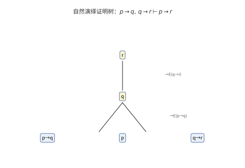

# 第 30 级：数理逻辑 (Mathematical Logic)

## 一、学习目标

完成本教程后，你应当能够：

1. **掌握命题逻辑**——理解命题、逻辑联结词、真值表、重言式、逻辑等价、范式（DNF、CNF）、逻辑推论与可满足性的概念。
2. **理解命题逻辑的证明系统**——掌握自然演绎与 Hilbert 系统的推理规则，理解并证明可靠性与完全性定理。
3. **掌握一阶逻辑**——理解谓词、量词、一阶语言、项、公式、自由/约束变元、解释与模型的概念。
4. **理解一阶逻辑的证明系统**——掌握一阶逻辑的 Hilbert 演算，理解 Gödel 完全性定理（含证明思路）、紧致性定理（含证明）与 Löwenheim-Skolem 定理。
5. **理解可计算性与可判定性**——掌握可判定性、半可判定性、不可判定性、Church-Turing 论题、停机问题（含证明）、Gödel 不完备定理（含证明思路）。
6. **了解模型论基础**——理解初等子结构、初等嵌入、型空间、量词消去、范畴性等概念。
7. **通过示例与习题巩固理论**——完成至少 8 个详细示例和 10 道习题。

---

## 二、命题逻辑

### 2.1 命题 (Propositions)

**命题**是一个可以判断真假的陈述句。例如：

- "2 + 2 = 4" 是真命题。
- "1 + 1 = 3" 是假命题。
- "x > 5" 不是命题（因为真值取决于 x）。
- "这个语句是假的" 不是命题（自指悖论）。

命题通常用字母 $p, q, r, \dots$ 表示。**原子命题**是不包含逻辑联结词的命题。

### 2.2 逻辑联结词 (Logical Connectives)

五个基本逻辑联结词：

| 联结词 | 符号 | 读法 | 英文 |
|--------|------|------|------|
| 否定 | $\neg$ | 非 | negation |
| 合取 | $\land$ | 且 | conjunction |
| 析取 | $\lor$ | 或 | disjunction |
| 蕴含 | $\to$ | 如果…则… | implication |
| 等价 | $\leftrightarrow$ | 当且仅当 | equivalence |

**合式公式 (Well-Formed Formula, WFF)** 的递归定义：
1. 原子命题是合式公式。
2. 若 $\varphi$ 是合式公式，则 $\neg\varphi$ 是合式公式。
3. 若 $\varphi, \psi$ 是合式公式，则 $(\varphi \land \psi)$, $(\varphi \lor \psi)$, $(\varphi \to \psi)$, $(\varphi \leftrightarrow \psi)$ 是合式公式。
4. 只有通过有限次应用上述规则得到的符号串才是合式公式。

约定优先级：$\neg$ 最高，$\land, \lor$ 次之，$\to, \leftrightarrow$ 最低，且 $\land, \lor$ 中 $\land$ 优先级高于 $\lor$（或按约定加括号以避免歧义）。


> **直观理解（现实类比）**：逻辑联结词像**电路里的开关组合**。$p \land q$（AND）是"**串联**"——两个开关都闭合才通电；$p \lor q$（OR）是"**并联**"——任一开关闭合就通电；$\neg p$（NOT）是"**反相器**"——把信号取反，输入高电平输出低电平。这些逻辑门是数字电路的基础：计算机的 CPU 就是由数十亿个这样的逻辑门组成的。图中展示了三种基本逻辑门的符号和对应的真值表——输入 A 和 B 的不同组合（00、01、10、11）决定输出 Y 的值。理解了这个对应关系，就理解了"软件如何变成硬件"。

### 2.3 真值表 (Truth Tables)

**真值表**枚举命题变元的所有真值赋值，列出复合公式在各赋值下的真值。

| $p$ | $q$ | $\neg p$ | $p \land q$ | $p \lor q$ | $p \to q$ | $p \leftrightarrow q$ |
|-----|-----|----------|-------------|------------|-----------|----------------------|
| T | T | F | T | T | T | T |
| T | F | F | F | T | F | F |
| F | T | T | F | T | T | F |
| F | F | T | F | F | T | T |

注意：$p \to q$ 在 $p$ 为假时从左到右均为真（空真原则）。


> **直观理解（现实类比）**：逻辑联结词像**电路里的开关组合**。$p \land q$ 是"**串联**"——两个开关都要合上才通电；$p \lor q$ 是"**并联**"——任一开关合上就通电；$\neg p$ 是"**反相器**"——把信号取反。最反直觉的是个子 $p \to q$（蕴含）：它只在"前提真但结论假"时为假，其余都为真，就像**承诺**"如果下雨就带伞"——只有下雨却没带伞才算违约，没下雨时无论带不带伞都不算违约。把这句话记牢，真值表就秒懂。

**示例 1**：构造 $(p \to q) \land (q \to p)$ 的真值表。

| $p$ | $q$ | $p \to q$ | $q \to p$ | $(p \to q) \land (q \to p)$ |
|-----|-----|-----------|-----------|------------------------------|
| T | T | T | T | T |
| T | F | F | T | F |
| F | T | T | F | F |
| F | F | T | T | T |

可见 $(p \to q) \land (q \to p)$ 与 $p \leftrightarrow q$ 逻辑等价。

### 2.4 重言式 (Tautologies)

**重言式**（永真式）是在所有真值赋值下都为真的公式。

**矛盾式**（永假式）是在所有真值赋值下都为假的公式。

**可满足式**是在至少一个真值赋值下为真的公式。

**示例 2**：证明 $p \lor \neg p$（排中律）是重言式。

| $p$ | $\neg p$ | $p \lor \neg p$ |
|-----|----------|-----------------|
| T | F | T |
| F | T | T |

所有行均为 T，故为重言式。

**示例 3**：常见重言式：
- 排中律：$p \lor \neg p$
- 矛盾律：$\neg(p \land \neg p)$
- 同一律：$p \to p$
- 双重否定律：$\neg\neg p \leftrightarrow p$
- 假言推理：$((p \to q) \land p) \to q$
- 拒取式：$((p \to q) \land \neg q) \to \neg p$
- 三段论：$((p \to q) \land (q \to r)) \to (p \to r)$

### 2.5 逻辑等价 (Logical Equivalence)

公式 $\varphi$ 与 $\psi$ **逻辑等价**（记作 $\varphi \equiv \psi$）当且仅当 $\varphi \leftrightarrow \psi$ 是重言式。

**基本等价关系**：
- 幂等律：$p \land p \equiv p$, $p \lor p \equiv p$
- 交换律：$p \land q \equiv q \land p$, $p \lor q \equiv q \lor p$
- 结合律：$(p \land q) \land r \equiv p \land (q \land r)$, $(p \lor q) \lor r \equiv p \lor (q \lor r)$
- 分配律：$p \land (q \lor r) \equiv (p \land q) \lor (p \land r)$, $p \lor (q \land r) \equiv (p \lor q) \land (p \lor r)$
- De Morgan 律：$\neg(p \land q) \equiv \neg p \lor \neg q$, $\neg(p \lor q) \equiv \neg p \land \neg q$
- 吸收律：$p \land (p \lor q) \equiv p$, $p \lor (p \land q) \equiv p$
- 蕴含改写：$p \to q \equiv \neg p \lor q$
- 等价改写：$p \leftrightarrow q \equiv (p \to q) \land (q \to p) \equiv (p \land q) \lor (\neg p \land \neg q)$
- 假言易位：$p \to q \equiv \neg q \to \neg p$
- 消去蕴含：$p \to q \equiv \neg(p \land \neg q)$

### 2.6 范式 (Normal Forms)

**文字 (Literal)**：原子命题 $p$ 或其否定 $\neg p$。

**子句 (Clause)**：文字的析取，如 $p \lor \neg q \lor r$。

**合取项 (Conjunct)**：文字的合取，如 $p \land \neg q \land r$。

**析取范式 (Disjunctive Normal Form, DNF)**：合取项的析取，即"积之和"形式：
$$(p \land q) \lor (\neg p \land r) \lor (q \land \neg r)$$

**合取范式 (Conjunctive Normal Form, CNF)**：子句的合取，即"和之积"形式：
$$(p \lor \neg q) \land (\neg p \lor r) \land (q \lor \neg r)$$

**定理**：每个命题逻辑公式都等价于一个析取范式和一个合取范式。

**示例 4**：求 $(p \to q) \land (q \to p)$ 的 CNF 和 DNF。

首先计算真值表：

| $p$ | $q$ | $p \to q$ | $q \to p$ | $\varphi$ |
|-----|-----|-----------|-----------|-----------|
| T | T | T | T | T |
| T | F | F | T | F |
| F | T | T | F | F |
| F | F | T | T | T |

**DNF**：取所有使 $\varphi$ 为真的行，每行对应一个合取项：
- 第1行 $(p, q)$ → $p \land q$
- 第4行 $(\neg p, \neg q)$ → $\neg p \land \neg q$

故 DNF 为 $(p \land q) \lor (\neg p \land \neg q)$。

**CNF**：取所有使 $\varphi$ 为假的行，每行对应一个子句（取反）：
- 第2行 $(p, \neg q)$ → $\neg p \lor q$
- 第3行 $(\neg p, q)$ → $p \lor \neg q$

故 CNF 为 $(\neg p \lor q) \land (p \lor \neg q)$。

### 2.7 逻辑推论 (Logical Consequence)

公式 $\psi$ 是公式集 $\Gamma$ 的**逻辑推论**（记作 $\Gamma \models \psi$）当且仅当在每个使 $\Gamma$ 中所有公式为真的赋值下，$\psi$ 也为真。

**定理**：$\Gamma \models \psi$ 当且仅当 $\Gamma \cup \{\neg\psi\}$ 不可满足。

**推论关系的基本性质**：
- 自反性：$\varphi \models \varphi$
- 单调性：若 $\Gamma \models \varphi$ 且 $\Gamma \subseteq \Delta$，则 $\Delta \models \varphi$
- 传递性：若 $\Gamma \models \varphi$ 且 $\{\varphi\} \models \psi$，则 $\Gamma \models \psi$
- 演绎定理（在元层次）：$\Gamma \cup \{\varphi\} \models \psi$ 当且仅当 $\Gamma \models \varphi \to \psi$

### 2.8 可满足性 (Satisfiability)

**可满足性 (SAT)** 问题：给定一个命题逻辑公式 $\varphi$，是否存在一个真值赋值使得 $\varphi$ 为真？

SAT 是第一个被证明的 NP-完全问题（Cook-Levin 定理，1971年）。

---

## 三、命题逻辑的证明系统

### 3.1 自然演绎 (Natural Deduction)

自然演绎由 Gentzen 于 1935 年提出，其推理规则模拟了自然推理过程。每个联结词有**引入规则**（$I$）和**消去规则**（$E$）。

**合取规则**：
- 引入 ($\land I$)：从 $\varphi$ 和 $\psi$ 推出 $\varphi \land \psi$
- 消去 ($\land E_1, \land E_2$)：从 $\varphi \land \psi$ 推出 $\varphi$，从 $\varphi \land \psi$ 推出 $\psi$

**析取规则**：
- 引入 ($\lor I_1, \lor I_2$)：从 $\varphi$ 推出 $\varphi \lor \psi$；从 $\psi$ 推出 $\varphi \lor \psi$
- 消去 ($\lor E$)：从 $\varphi \lor \psi$、$\varphi \vdash \chi$ 和 $\psi \vdash \chi$ 推出 $\chi$

**蕴含规则**：
- 引入 ($\to I$)：若假设 $\varphi$ 可推出 $\psi$，则推出 $\varphi \to \psi$（消去假设）
- 消去 ($\to E$，即假言推理)：从 $\varphi \to \psi$ 和 $\varphi$ 推出 $\psi$

**否定规则**：
- 引入 ($\neg I$)：若假设 $\varphi$ 可推出矛盾 $\bot$，则推出 $\neg \varphi$
- 消去 ($\neg E$)：从 $\varphi$ 和 $\neg \varphi$ 推出 $\bot$
- 反证法 (RAA)：若假设 $\neg \varphi$ 可推出 $\bot$，则推出 $\varphi$

**等价规则**：
- 引入 ($\leftrightarrow I$)：从 $\varphi \to \psi$ 和 $\psi \to \varphi$ 推出 $\varphi \leftrightarrow \psi$
- 消去 ($\leftrightarrow E$)：从 $\varphi \leftrightarrow \psi$ 推出 $\varphi \to \psi$ 和 $\psi \to \varphi$

**示例 5**：在自然演绎中证明 $p \to q, p \vdash q$（假言推理）。

```
1. p → q        前提
2. p            前提
3. q            →E 1, 2
```



> **直观理解（现实类比）**：自然演绎证明树像**一棵倒长的树**——树根是"结论"，树叶是"前提/假设"，从树叶一路长到树根。每一步（$\to$I、$\to$E 等）都像**把两块积木拼在一起**：$\to$E（假言推理）是"把'如果 A 则 B'和'A'叠成'B'"，$\to$I是"先把 A 假设进来，推出 B 后再把假设收掉，裹成'如果 A 则 B'"。看得懂每一步拼积木，就看得懂整棵树。

**示例 6**：在自然演绎中证明 $\vdash p \to (q \to p)$。

```
1. p            假设
2. q            假设
3. p            重复 1
4. q → p        →I 2-3
5. p → (q → p)  →I 1-4
```

**示例 7**：在自然演绎中证明 $\vdash (p \to q) \to (\neg q \to \neg p)$（假言易位）。

```
1. p → q        假设
2. ¬q           假设
3. p            假设
4. q            →E 1, 3
5. ⊥           ¬E 4, 2
6. ¬p           ¬I 3-5
7. ¬q → ¬p      →I 2-6
8. (p → q) → (¬q → ¬p)  →I 1-7
```

### 3.2 Hilbert 系统 (Hilbert System)

Hilbert 系统（也称为 Hilbert-Frege 系统）使用少量公理模式与一条推理规则（分离规则，modus ponens）。

**公理模式**（常见的一种选择）：
1. $p \to (q \to p)$
2. $(p \to (q \to r)) \to ((p \to q) \to (p \to r))$
3. $(\neg p \to \neg q) \to (q \to p)$

**推理规则**：分离规则 (Modus Ponens, MP)：从 $\varphi \to \psi$ 和 $\varphi$ 推出 $\psi$。

**证明**是公式的有限序列，其中每个公式是公理或由前面的公式通过 MP 得到。

**演绎定理**（在对象层次）：若 $\Gamma \cup \{\varphi\} \vdash \psi$，则 $\Gamma \vdash \varphi \to \psi$。

**示例 8**：在 Hilbert 系统中证明 $\vdash p \to p$。

```
1. (p → ((p → p) → p)) → ((p → (p → p)) → (p → p))  公理2（取 q = p→p, r = p）
2. p → ((p → p) → p)                                  公理1（取 q = p→p）
3. (p → (p → p)) → (p → p)                            MP 1, 2
4. p → (p → p)                                        公理1（取 q = p）
5. p → p                                              MP 3, 4
```

### 3.3 可靠性与完全性 (Soundness and Completeness)

**可靠性定理 (Soundness)**：若 $\Gamma \vdash \varphi$，则 $\Gamma \models \varphi$。即证明系统只产生逻辑推论。

**证明思路**：对证明的长度进行归纳。
- 基始：若 $\varphi$ 是公理，则 $\varphi$ 是重言式，故 $\Gamma \models \varphi$。
- 归纳步：若 $\varphi$ 由 MP 从 $\psi \to \varphi$ 和 $\psi$ 得到，则由归纳假设 $\Gamma \models \psi \to \varphi$ 且 $\Gamma \models \psi$，故在所有使 $\Gamma$ 为真的赋值下，$\psi$ 和 $\psi \to \varphi$ 均为真，从而 $\varphi$ 为真，即 $\Gamma \models \varphi$。

**完全性定理 (Completeness)**：若 $\Gamma \models \varphi$，则 $\Gamma \vdash \varphi$。即每个逻辑推论都能在系统中证明。

**证明思路（Henkin 构造法）**：
1. 假设 $\Gamma \not\vdash \varphi$，则 $\Gamma \cup \{\neg\varphi\}$ 是**一致的**（即不推出矛盾）。
2. 将 $\Gamma \cup \{\neg\varphi\}$ 扩展为**极大一致集** $\Delta$（即 $\Delta$ 一致且对任意公式 $\psi$，$\psi \in \Delta$ 或 $\neg\psi \in \Delta$）。
3. 定义 $\Delta$ 的真值赋值：对每个命题变元 $p$，令 $v(p) = T$ 当且仅当 $p \in \Delta$。
4. 证明**真理引理**：对任意公式 $\psi$，$v(\psi) = T$ 当且仅当 $\psi \in \Delta$。
5. 于是 $\Delta$ 可满足，故 $\Gamma \cup \{\neg\varphi\}$ 可满足，即 $\Gamma \not\models \varphi$。
6. 由逆否命题得完全性。

**系**：命题逻辑中 $\Gamma \vdash \varphi$ 当且仅当 $\Gamma \models \varphi$。

---

## 四、一阶逻辑

### 4.1 谓词与量词 (Predicates and Quantifiers)

命题逻辑只能表达原子命题及其组合，但无法表达"所有实数都是非负的"或"存在一个质数大于 100"等涉及个体和量化的陈述。

**谓词 (Predicate)** 是关于个体的性质或关系。例如 $P(x)$ 表示"$x$ 是质数"，$R(x, y)$ 表示"$x < y$"。

**量词 (Quantifiers)**：
- 全称量词 $\forall$："对所有"— $\forall x P(x)$ 表示"对所有 $x$，$P(x)$ 成立"。
- 存在量词 $\exists$："存在"— $\exists x P(x)$ 表示"存在某个 $x$，$P(x)$ 成立"。

**量词间的对偶关系**：
- $\neg\forall x P(x) \equiv \exists x \neg P(x)$
- $\neg\exists x P(x) \equiv \forall x \neg P(x)$


> **直观理解（现实类比）**：量词像**搜索范围的限定词**。$\forall x P(x)$（全称量词）像**质检员检查整批产品**——必须每一个都合格才算通过；$\exists x P(x)$（存在量词）像**在仓库里找一件合格品**——只要找到一个就行。图中展示了两种量词的直观区别：左边 $\forall x (x > 0)$ 要求论域（大圆）中所有元素都在绿色区域（$x > 0$）内，只要有一个不在就为假；右边 $\exists x (x > 5)$ 只要求至少一个元素在绿色区域内。量词顺序也很关键：$\forall x \exists y (y > x)$ 说"每个数都有比它大的数"（真），但 $\exists y \forall x (y > x)$ 说"存在一个数比所有数都大"（假）——就像"每个人都有妈妈"（真）vs"有一个人是所有人的妈妈"（假）。

### 4.2 一阶语言 (First-Order Language)

一阶语言 $\mathcal{L}$ 由下列符号组成：

**逻辑符号**：
1. 变元：$x, y, z, x_1, x_2, \dots$（可数无穷多个）
2. 逻辑联结词：$\neg, \land, \lor, \to, \leftrightarrow$
3. 量词：$\forall, \exists$
4. 等号：$=$（可选，通常在带等词的一阶逻辑中）
5. 括号：$(, )$

**非逻辑符号**（依赖于具体语言）：
1. **常量符号** (Constant symbols)：$c, d, c_1, c_2, \dots$
2. **函数符号** (Function symbols)：$f, g, h, \dots$，每个有固定的元数 (arity)
3. **谓词符号** (Predicate symbols)：$P, Q, R, \dots$，每个有固定的元数

**示例**：算术语言 $\mathcal{L}_{\text{ar}} = \{0, 1, +, \times, <\}$，其中 $0, 1$ 是常量，$+, \times$ 是二元函数，$<$ 是二元谓词。

### 4.3 项与公式 (Terms and Formulas)

**项 (Term)** 的递归定义：
1. 每个变元是项。
2. 每个常量符号是项。
3. 若 $f$ 是 $n$ 元函数符号，$t_1, \dots, t_n$ 是项，则 $f(t_1, \dots, t_n)$ 是项。

**原子公式 (Atomic Formula)**：
1. 若 $t_1, t_2$ 是项，则 $t_1 = t_2$ 是原子公式。
2. 若 $P$ 是 $n$ 元谓词符号，$t_1, \dots, t_n$ 是项，则 $P(t_1, \dots, t_n)$ 是原子公式。

**合式公式 (WFF)** 的递归定义：
1. 每个原子公式是合式公式。
2. 若 $\varphi, \psi$ 是合式公式，则 $\neg\varphi$, $(\varphi \land \psi)$, $(\varphi \lor \psi)$, $(\varphi \to \psi)$, $(\varphi \leftrightarrow \psi)$ 是合式公式。
3. 若 $\varphi$ 是合式公式，$x$ 是变元，则 $\forall x \varphi$ 和 $\exists x \varphi$ 是合式公式。
4. 只有通过有限次应用上述规则得到的才是合式公式。

### 4.4 自由变元与约束变元 (Free and Bound Variables)

在公式 $\forall x \varphi$（或 $\exists x \varphi$）中，$\varphi$ 是量词 $\forall x$（或 $\exists x$）的**辖域 (scope)**。变元 $x$ 在辖域内的出现称为**约束出现 (bound occurrence)**，否则称为**自由出现 (free occurrence)**。

**闭公式 (Sentence)**：不含自由变元的公式。

**示例**：
- $\forall x (P(x) \to Q(x))$：$x$ 约束出现，是闭公式。
- $\forall x P(x) \to Q(x)$：$x$ 在 $P(x)$ 中约束，在 $Q(x)$ 中自由，不是闭公式。
- $\forall x \exists y R(x, y)$：闭公式。

**代入 (Substitution)**：$\varphi[t/x]$ 表示将公式 $\varphi$ 中所有自由出现的 $x$ 替换为项 $t$。替换时需注意 $t$ 中的变元不能与 $\varphi$ 中的约束变元冲突（必要时重命名约束变元）。

### 4.5 解释与模型 (Interpretations and Models)

**结构 (Structure)** 或 **解释 (Interpretation)** $\mathfrak{A}$ 为一阶语言 $\mathcal{L}$ 指定：
1. 非空论域 (domain) $|\mathfrak{A}|$
2. 每个常量符号 $c$ 对应一个元素 $c^{\mathfrak{A}} \in |\mathfrak{A}|$
3. 每个 $n$ 元函数符号 $f$ 对应一个函数 $f^{\mathfrak{A}}: |\mathfrak{A}|^n \to |\mathfrak{A}|$
4. 每个 $n$ 元谓词符号 $P$ 对应一个 $n$ 元关系 $P^{\mathfrak{A}} \subseteq |\mathfrak{A}|^n$

**赋值 (Assignment)** $s$ 是从变元集合到 $|\mathfrak{A}|$ 的函数。

**Tarski 真值定义**：递归定义公式 $\varphi$ 在结构 $\mathfrak{A}$ 和赋值 $s$ 下为真（记作 $\mathfrak{A} \models \varphi[s]$）：
- 原子公式：按标准方式定义（如 $\mathfrak{A} \models P(t_1, \dots, t_n)[s]$ 当且仅当 $(t_1^{\mathfrak{A}}[s], \dots, t_n^{\mathfrak{A}}[s]) \in P^{\mathfrak{A}}$）
- 联结词：与命题逻辑相同
- $\mathfrak{A} \models \forall x \varphi[s]$ 当且仅当对每个 $a \in |\mathfrak{A}|$，$\mathfrak{A} \models \varphi[s(x|a)]$（其中 $s(x|a)$ 是将 $s$ 中 $x$ 的值改为 $a$ 后的赋值）
- $\mathfrak{A} \models \exists x \varphi[s]$ 当且仅当存在某个 $a \in |\mathfrak{A}|$，$\mathfrak{A} \models \varphi[s(x|a)]$

**模型 (Model)**：若 $\mathfrak{A} \models \varphi[s]$ 对所有赋值 $s$ 成立，则称 $\mathfrak{A}$ 是 $\varphi$ 的模型。对闭公式 $\varphi$，赋值无关紧要，可直接写 $\mathfrak{A} \models \varphi$。

**可满足性**：公式集 $\Gamma$ 可满足当且仅当存在结构 $\mathfrak{A}$ 使 $\mathfrak{A} \models \varphi$ 对所有 $\varphi \in \Gamma$ 成立。

---

## 五、一阶逻辑的证明系统

### 5.1 Hilbert 演算 (Hilbert Calculus for First-Order Logic)

一阶逻辑的 Hilbert 系统在命题逻辑 Hilbert 系统的基础上增加量词公理和规则。

**命题逻辑公理**（同前）：
1. $\varphi \to (\psi \to \varphi)$
2. $(\varphi \to (\psi \to \chi)) \to ((\varphi \to \psi) \to (\varphi \to \chi))$
3. $(\neg \varphi \to \neg \psi) \to (\psi \to \varphi)$

**量词公理**：
4. $\forall x \varphi(x) \to \varphi(t)$，其中 $t$ 对 $x$ 自由（即 $t$ 代入后不产生冲突）
5. $\varphi(t) \to \exists x \varphi(x)$，其中 $t$ 对 $x$ 自由

**等词公理**（若语言包含等号）：
6. $x = x$
7. $x = y \to (\varphi(x) \to \varphi(y))$（代换原理）

**推理规则**：
- MP：从 $\varphi$ 和 $\varphi \to \psi$ 推出 $\psi$
- 全称概括 (Generalization, Gen)：从 $\varphi$ 推出 $\forall x \varphi$（需满足变元条件）

### 5.2 Gödel 完全性定理 (Gödel's Completeness Theorem)

**定理 (Gödel, 1929/1930)**：在一阶逻辑中，$\Gamma \vdash \varphi$ 当且仅当 $\Gamma \models \varphi$。

**证明思路（Henkin 构造法，1949）**：

**可靠性方向** ($\Gamma \vdash \varphi \Rightarrow \Gamma \models \varphi$)：对证明长度归纳，验证公理均为真且 MP 和 Gen 保持真值。

**完全性方向** ($\Gamma \models \varphi \Rightarrow \Gamma \vdash \varphi$)：通过证明逆否命题：若 $\Gamma \not\vdash \varphi$，则 $\Gamma \not\models \varphi$。

1. **一致性**：若 $\Gamma \not\vdash \varphi$，则 $\Gamma \cup \{\neg\varphi\}$ 一致（即不推出矛盾）。
2. **Lindenbaum 引理**：每个一致集可扩展为极大一致集 $\Delta$。
3. **添加见证常量 (Henkin witnesses)**：对每个形如 $\exists x \psi(x)$ 的公式，添加一个新常量 $c$ 和公理 $\exists x \psi(x) \to \psi(c)$，保持一致性。
4. **构造典范模型**：论域为所有项的等价类（模可证相等关系），谓词解释按 $P([t_1], \dots, [t_n])$ 为真当且仅当 $P(t_1, \dots, t_n) \in \Delta$。
5. **真理引理**：对任意公式 $\varphi$，$\mathfrak{A} \models \varphi$ 当且仅当 $\varphi \in \Delta$。
6. 于是 $\mathfrak{A}$ 是 $\Delta$ 的模型，从而也是 $\Gamma \cup \{\neg\varphi\}$ 的模型，故 $\Gamma \not\models \varphi$。

**系**：一阶逻辑是**紧致的 (compact)** 和**完备的 (complete)**。

### 5.3 紧致性定理 (Compactness Theorem)

**定理**：公式集 $\Gamma$ 可满足当且仅当 $\Gamma$ 的每个有限子集可满足。

**证明**：
- **($\Rightarrow$)**：显然，若 $\Gamma$ 有模型，则其每个有限子集在该模型中也为真。
- **($\Leftarrow$)**：假设 $\Gamma$ 不可满足。由完全性，$\Gamma \vdash \bot$（即 $\Gamma$ 不一致）。证明是有限长的，只用到 $\Gamma$ 的有限多个公式，故存在有限子集 $\Gamma_0 \subseteq \Gamma$ 使得 $\Gamma_0 \vdash \bot$。由可靠性，$\Gamma_0$ 不可满足。$\square$

**应用示例**：
- **非标准算术的存在性**：考虑 $\text{Th}(\mathbb{N})$（自然数集的所有真一阶语句）加上一个新常量 $c$ 和公理 $\{c > n : n \in \mathbb{N}\}$。任意有限子集可满足（将 $c$ 解释为足够大的自然数），故整体可满足，从而存在非标准算术模型。
- **图论中的紧致性**：若一个图的所有有限子图都是 $k$-可着色的，则整个图也是 $k$-可着色的。

### 5.4 Löwenheim-Skolem 定理

**Löwenheim-Skolem 定理 (向下版本)**：若 $\mathcal{L}$ 是可数语言，$\Gamma$ 有无限模型，则 $\Gamma$ 有可数模型。

**证明思路**：在 Henkin 构造中，论域由项（可数多个）的等价类构成，故模型至多可数。

**Löwenheim-Skolem 定理 (向上版本)**：若 $\Gamma$ 有无限模型，则对任意基数 $\kappa \geq |\mathcal{L}|$，$\Gamma$ 有基数为 $\kappa$ 的模型。

**证明思路**：添加 $\kappa$ 个新常量 $\{c_i : i < \kappa\}$ 和公理 $c_i \neq c_j$（$i \neq j$），应用紧致性定理。

**Skolem 悖论**：ZFC 集合论断言存在不可数集，但若 ZFC 一致，则 Löwenheim-Skolem 向下定理保证 ZFC 有可数模型。这并非悖论，而是表明"可数"在模型内部和外部有不同含义——模型内部的可数性是相对于该模型不存在的双射而言的。

---

## 六、可计算性与可判定性

### 6.1 可判定性 (Decidability)

**可判定问题**：存在一个算法（图灵机），对任意输入在有限步内给出"是"或"否"的答案。

**半可判定问题**：存在一个算法，对答案为"是"的输入在有限步内停机并给出肯定答案；对答案为"否"的输入可能永远不停机。

**不可判定问题**：不存在任何算法能对任意输入给出正确答案。

### 6.2 Church-Turing 论题 (Church-Turing Thesis)

**Church-Turing 论题**：直观上"可有效计算"的函数类恰好就是图灵机可计算的函数类。

这不是一个可证明的数学定理，而是一个关于"有效计算"直观概念的论题。所有已知的计算模型（图灵机、$\lambda$ 演算、递归函数、随机存取机、量子图灵机等）都互相等价，为这一论题提供了有力证据。

### 6.3 停机问题 (Halting Problem)

**定理 (Turing, 1936)**：停机问题是不可判定的。即不存在一个算法，能对任意给定的图灵机 $M$ 和输入 $w$，判定 $M$ 在输入 $w$ 上是否停机。

**证明（对角线法）**：
1. 假设存在算法 $H(M, w)$，能在有限步内判断图灵机 $M$ 在输入 $w$ 上是否停机。
2. 构造一个新图灵机 $D$：$D$ 以图灵机的编码 $M$ 为输入，调用 $H(M, M)$。若 $H(M, M)$ 输出"停机"，则 $D$ 进入死循环；若 $H(M, M)$ 输出"不停机"，则 $D$ 停机。
3. 现在问：$D$ 在输入 $D$（即自身的编码）上是否停机？
   - 若 $D$ 停机，则 $H(D, D)$ 返回"停机"，于是 $D$ 进入死循环，不停机。
   - 若 $D$ 不停机，则 $H(D, D)$ 返回"不停机"，于是 $D$ 停机。
4. 矛盾。故假设的 $H$ 不存在。$\square$

**推论**：大量问题是不可判定的，例如：
- 一阶逻辑公式的可满足性（Church 定理，1936）
- 希尔伯特第十问题（丢番图方程的可解性，Matiyasevich 1970）
- 群的字问题（Novikov 1955）
- 谓词逻辑的永真性

### 6.4 Gödel 不完备定理 (Gödel's Incompleteness Theorems)

**第一不完备定理**：任何包含皮亚诺算术的一致递归公理化理论 $T$ 都是不完备的——存在一个在 $T$ 中不可证明也不可否证的语句。

**第二不完备定理**：这样的理论 $T$ 不能证明自身的一致性（即 $\text{Con}(T)$ 在 $T$ 中不可证明）。

**证明思路（核心步骤）**：
1. **Gödel 编码**：将公式、证明等语法对象编码为自然数，使理论 $T$ 能"谈论"自身的语法。
2. **可表示性**：所有递归函数在 $T$ 中可表示，即对每个递归函数 $f$ 存在公式 $\varphi_f(\vec{x}, y)$ 使得 $\mathbb{N} \models \varphi_f(\vec{n}, m)$ 当且仅当 $f(\vec{n}) = m$，且 $T$ 能证明相应的唯一性和存在性。
3. **自指引理 (Diagonal Lemma)**：对任意含一个自由变元的公式 $\psi(x)$，存在一个语句 $\theta$ 使得 $T \vdash \theta \leftrightarrow \psi(\ulcorner\theta\urcorner)$（其中 $\ulcorner\theta\urcorner$ 是 $\theta$ 的 Gödel 编码）。
4. **构造 Gödel 语句**：令 $\psi(x)$ 为"编号为 $x$ 的公式在 $T$ 中不可证明"，则自指引理给出 $\theta$ 满足 $T \vdash \theta \leftrightarrow \neg\text{Prov}_T(\ulcorner\theta\urcorner)$。
5. $\theta$ 说"我不可证明"。若 $T \vdash \theta$，则 $T$ 证明了一个假语句（不一致）；若 $T \vdash \neg\theta$，则 $T$ 证明 $\theta$ 可证明，但 $T$ 实际上并未证明 $\theta$（$\omega$-不一致）。故 $\theta$ 在 $T$ 中不可判定。
6. 第二定理：将 $\theta$ 取为 $\text{Con}(T)$ 的等价形式，则 $T \not\vdash \text{Con}(T)$。

**哲学意义**：
- 数学真理超出形式证明的范畴。
- 不存在能证明所有数学真理的"万能公理系统"。
- 希尔伯特的形式主义规划（证明数学一致且完备）不可能实现。


> **直观理解（现实类比）**：Gödel 不完备定理像**一套系统无法拔着自己的头发离开地面**。它通过三步让数学系统"自己谈自己"：① Gödel 编码——把公式、证明翻译成数字（像给每句话编个身份证号）；② 可表示性——系统能"证明"这些数字关系；③ 对角线自指——构造一句"**这句话在系统中不可证明**"的语句 $G$。若系统能证明 $G$，则 $G$ 为假（矛盾）；能证明 $\neg G$，则系统不一致。于是 $G$ 永远无法被证明，却**在标准模型里为真**。这就像有人说"我这个清单列不全所有清单"——如果他真列全了，把自己也列进去就会矛盾。

---

## 七、模型论

### 7.1 初等子结构 (Elementary Substructures)

**子结构 (Substructure)**：$\mathfrak{A}$ 是 $\mathfrak{B}$ 的子结构（记作 $\mathfrak{A} \subseteq \mathfrak{B}$）当且仅当 $|\mathfrak{A}| \subseteq |\mathfrak{B}|$ 且所有常量、函数、谓词的解释与 $\mathfrak{B}$ 一致。

**初等子结构 (Elementary Substructure)**：$\mathfrak{A} \preceq \mathfrak{B}$ 当且仅当 $\mathfrak{A} \subseteq \mathfrak{B}$ 且对任意公式 $\varphi(\vec{x})$ 和 $\vec{a} \in |\mathfrak{A}|$，$\mathfrak{A} \models \varphi[\vec{a}]$ 当且仅当 $\mathfrak{B} \models \varphi[\vec{a}]$。

**Tarski-Vaught 检验**：$\mathfrak{A} \preceq \mathfrak{B}$ 当且仅当 $\mathfrak{A} \subseteq \mathfrak{B}$ 且对任意公式 $\varphi(x, \vec{y})$ 和 $\vec{a} \in |\mathfrak{A}|$，若 $\mathfrak{B} \models \exists x \varphi(x, \vec{a})$，则存在 $b \in |\mathfrak{A}|$ 使 $\mathfrak{B} \models \varphi(b, \vec{a})$。

**Löwenheim-Skolem-Tarski 定理**：对任意无限结构 $\mathfrak{A}$ 和任意基数 $\kappa \geq |\mathcal{L}|$，存在 $\mathfrak{B} \preceq \mathfrak{A}$ 且 $|\mathfrak{B}| = \kappa$（如果 $\kappa < |\mathfrak{A}|$）；存在 $\mathfrak{B} \succeq \mathfrak{A}$ 且 $|\mathfrak{B}| = \kappa$（如果 $\kappa > |\mathfrak{A}|$）。

### 7.2 初等嵌入 (Elementary Embeddings)

**初等嵌入** $f: \mathfrak{A} \to \mathfrak{B}$ 是一个单射 $f: |\mathfrak{A}| \to |\mathfrak{B}|$，使得对任意公式 $\varphi(\vec{x})$ 和 $\vec{a} \in |\mathfrak{A}|$，$\mathfrak{A} \models \varphi[\vec{a}]$ 当且仅当 $\mathfrak{B} \models \varphi[f(\vec{a})]$。

初等嵌入是模型论的基本工具，用于构造扩张、研究模型之间的关系。

### 7.3 型空间 (Type Spaces)

**型 (Type)** 是一组带自由变元的公式，描述了某个元素（或元素组）可能满足的性质。

**完全 n-型** $p(x_1, \dots, x_n)$ 是公式集，满足：
1. $p$ 与 $\text{Th}(\mathfrak{A})$ 一致（即与 $\mathfrak{A}$ 的理论不矛盾）
2. $p$ 是极大一致的（对任意公式 $\varphi$，$\varphi \in p$ 或 $\neg\varphi \in p$）

**实现 (Realize)**：元素 $\vec{a} \in |\mathfrak{B}|$（其中 $\mathfrak{B} \models \text{Th}(\mathfrak{A})$）实现了型 $p$ 当且仅当 $\mathfrak{B} \models \varphi[\vec{a}]$ 对所有 $\varphi \in p$ 成立。

**省略型定理 (Omitting Types Theorem)**：给定可数语言中的可数理论 $T$ 和局部省略的 $n$-型 $p$，存在 $T$ 的可数模型省略 $p$（即不实现 $p$）。

### 7.4 量词消去 (Quantifier Elimination)

理论 $T$ 具有**量词消去**性质，当且仅当对每个公式 $\varphi(\vec{x})$，存在一个无量词公式 $\psi(\vec{x})$ 使得 $T \models \forall \vec{x} (\varphi(\vec{x}) \leftrightarrow \psi(\vec{x}))$。

**常见例子**：
- 无限域的代数闭域理论（ACF）有量词消去
- 实数闭域理论（RCF）有量词消去
- 稠密线序无端点理论（DLO）有量词消去

**量词消去的判定方法**：理论 $T$ 有量词消去当且仅当对任意两个模型 $\mathfrak{A}, \mathfrak{B} \models T$ 和任意公共子结构 $\mathfrak{C}$，$\mathfrak{A}$ 和 $\mathfrak{B}$ 在 $\mathfrak{C}$ 上一致（即 $\mathfrak{C}$ 的每个元素在两个模型中的行为相同）。

### 7.5 范畴性 (Categoricity)

**$\kappa$-范畴性**：理论 $T$ 是 $\kappa$-范畴的，当且仅当 $T$ 在基数为 $\kappa$ 的模型（在同构意义下）唯一。

**Morley 定理 (1965)**：若可数语言中的理论 $T$ 在某个不可数基数 $\kappa$ 上是 $\kappa$-范畴的，则 $T$ 在所有不可数基数上都是 $\kappa$-范畴的。

**Łoś-Vaught 检验**：若 $T$ 无有限模型且在某个 $\kappa \geq |\mathcal{L}|$ 上是 $\kappa$-范畴的，则 $T$ 是完全的（即 $T$ 对任意语句 $\varphi$ 要么证明 $\varphi$ 要么证明 $\neg\varphi$）。

**经典例子**：
- 代数闭域理论（固定特征）在不可数基数上是范畴的（但不包括可数基数——$\mathbb{Q}$ 的代数闭包和 $\mathbb{F}_p$ 的代数闭包不同构）
- 稠密线序无端点理论在 $\aleph_0$ 上是范畴的（所有可数稠密线序同构于 $\mathbb{Q}$），但不可数时不范畴
- 向量空间理论（固定域上）在所有无限基数上是范畴的

---

## 八、示例

### 示例 1：命题逻辑真值表与范式

求公式 $\varphi = (p \to q) \land (\neg q \to r)$ 的真值表与范式。

**解**：真值表如下：

| $p$ | $q$ | $r$ | $p \to q$ | $\neg q$ | $\neg q \to r$ | $\varphi$ |
|-----|-----|-----|-----------|----------|----------------|-----------|
| T | T | T | T | F | T | T |
| T | T | F | T | F | T | T |
| T | F | T | F | T | T | F |
| T | F | F | F | T | F | F |
| F | T | T | T | F | T | T |
| F | T | F | T | F | T | T |
| F | F | T | T | T | T | T |
| F | F | F | T | T | F | F |

**DNF**（取 $\varphi$ 为真的行）：
$$(p \land q \land r) \lor (p \land q \land \neg r) \lor (\neg p \land q \land r) \lor (\neg p \land q \land \neg r) \lor (\neg p \land \neg q \land r)$$

**CNF**（取 $\varphi$ 为假的行，即第 3, 4, 8 行）：
第 3 行 $(p, \neg q, r)$ → $\neg p \lor q \lor \neg r$
第 4 行 $(p, \neg q, \neg r)$ → $\neg p \lor q \lor r$
第 8 行 $(\neg p, \neg q, \neg r)$ → $p \lor q \lor r$

故 CNF 为：
$$(\neg p \lor q \lor \neg r) \land (\neg p \lor q \lor r) \land (p \lor q \lor r)$$

---

### 示例 2：自然演绎证明

在自然演绎中证明 $\vdash (p \to (q \to r)) \to ((p \to q) \to (p \to r))$。

**解**：
```
1. p → (q → r)    假设
2. p → q          假设
3. p              假设
4. q → r          →E 1, 3
5. q              →E 2, 3
6. r              →E 4, 5
7. p → r          →I 3-6
8. (p → q) → (p → r)  →I 2-7
9. (p → (q → r)) → ((p → q) → (p → r))  →I 1-8
```

---

### 示例 3：一阶逻辑公式翻译

将以下语句翻译为一阶逻辑公式：
1. "每个质数都是奇数或等于 2。"
2. "存在一个最大的质数。"
3. "任意两个不同的实数之间存在另一个实数。"

**解**：
1. $\forall x (P(x) \to (O(x) \lor x = 2))$，其中 $P(x)$ 表示"$x$ 是质数"，$O(x)$ 表示"$x$ 是奇数"。
2. $\exists x (P(x) \land \forall y (P(y) \to y \leq x))$，其中 $P(x)$ 表示"$x$ 是质数"。
3. $\forall x \forall y ((x < y) \to \exists z (x < z \land z < y))$（稠密性）。

---

### 示例 4：自然语言中的量词交替

用一阶逻辑形式化以下语句，并指出量词顺序的重要性：
- "每个人都有一个母亲"：$\forall x \exists y (M(y, x))$，其中 $M(y, x)$ 表示"$y$ 是 $x$ 的母亲"。
- "存在一个人的母亲是所有人之母"：$\exists y \forall x (M(y, x))$。

这两个公式意义完全不同，量词顺序不可交换。

---

### 示例 5：紧致性定理的应用

证明：若图 $G$ 的每个有限子图都是 $k$-可着色的，则 $G$ 也是 $k$-可着色的。

**解**：构造一阶语言 $\mathcal{L} = \{E, C_1, \dots, C_k\}$，其中 $E$ 是二元边关系，$C_i$ 是一元颜色谓词。

考虑理论 $\Gamma$ 包含：
1. 边关系公理：$\forall x \neg E(x, x)$，$\forall x \forall y (E(x, y) \to E(y, x))$
2. 染色公理：$\forall x (C_1(x) \lor \dots \lor C_k(x))$，$\forall x \bigwedge_{i \neq j} \neg(C_i(x) \land C_j(x))$
3. 相邻顶点不同色：$\forall x \forall y (E(x, y) \to \bigwedge_{i=1}^k (C_i(x) \to \neg C_i(y)))$
4. 图 $G$ 的边图：对 $G$ 的每条边 $(a, b)$，添加公式 $E(a, b)$

$G$ 的每个有限子图 $k$-可着色意味着 $\Gamma$ 的每个有限子集可满足。由紧致性定理，$\Gamma$ 可满足，即 $G$ 是 $k$-可着色的。

---

### 示例 6：Löwenheim-Skolem 定理的应用

证明：若 $T$ 是实数理论（如实闭域理论）的公理集，则 $T$ 有可数模型。

**解**：实数的标准模型 $(\mathbb{R}, +, \times, 0, 1, <)$ 是 $T$ 的模型，且是无限的。由 Löwenheim-Skolem 向下定理，$T$ 有可数模型。事实上，**实代数数**的集合 $\overline{\mathbb{Q}} \cap \mathbb{R}$（即有理系数多项式方程的实数根）构成一个可数实闭域，是 $T$ 的可数模型。

---

### 示例 7：停机问题不可判定性

详细证明：不存在能判定任意图灵机是否停机的算法。

**解**：假设存在算法 $H$，输入为 $(M, w)$，输出"停机"或"不停机"。

构造图灵机 $D$：
- 输入：图灵机 $M$ 的编码
- 运行 $H(M, M)$：
  - 若 $H$ 输出"停机"，则 $D$ 进入无限循环
  - 若 $H$ 输出"不停机"，则 $D$ 停机

考虑 $D(D)$（即 $D$ 以自身编码为输入）：
- 若 $D(D)$ 停机，则 $H(D, D)$ 输出"停机"，故 $D$ 进入无限循环——不停机。
- 若 $D(D)$ 不停机，则 $H(D, D)$ 输出"不停机"，故 $D$ 停机——停机。

矛盾。因此 $H$ 不存在。

---

### 示例 8：Gödel 第一不完备定理的构造性说明

构造一个在皮亚诺算术 $PA$ 中不可判定的具体语句。

**解**：Gödel 语句 $G$ 的大致含义是"$G$ 在 $PA$ 中不可证明"。

更具体地，通过 Gödel 编码，我们可以在 $PA$ 中定义一个谓词 $\text{Prov}(x)$，表示"编号为 $x$ 的公式在 $PA$ 中可证明"。然后利用自指引理构造语句 $G$ 使得：
$$PA \vdash G \leftrightarrow \neg\text{Prov}(\ulcorner G\urcorner)$$

分析：
- 若 $PA \vdash G$，则 $\text{Prov}(\ulcorner G\urcorner)$ 为真，但 $G$ 说 $\neg\text{Prov}(\ulcorner G\urcorner)$，矛盾。
- 若 $PA \vdash \neg G$，则 $PA \vdash \text{Prov}(\ulcorner G\urcorner)$，即 $PA$ 声称 $G$ 可证明。但若 $PA$ 是一致的，则 $G$ 实际上不可证明，矛盾。
- 故 $G$ 在 $PA$ 中既不可证明也不可否证。

注意 $G$ 在标准模型 $\mathbb{N}$ 中为真（因为 $G$ 确实不可证明），因此 $G$ 是真但不可证明的语句。

---

### 示例 9：量词消去——稠密线序

证明稠密线序无端点理论 DLO 有量词消去。

**解**：DLO 的公理：
1. $\forall x \neg(x < x)$
2. $\forall x \forall y \forall z (x < y \land y < z \to x < z)$
3. $\forall x \forall y (x < y \lor y < x \lor x = y)$
4. $\forall x \forall y (x < y \to \exists z (x < z \land z < y))$（稠密性）
5. $\forall x \exists y (y < x)$（无左端点）
6. $\forall x \exists y (x < y)$（无右端点）

要证明 DLO 有量词消去，只需证明对任意形如 $\exists x \varphi(x, \vec{y})$ 的公式（其中 $\varphi$ 无量词），存在无量词的 $\psi(\vec{y})$ 等价于它。

由于 DLO 的公理全是全称语句，且 DLO 的任意两个可数模型同构（$\mathbb{Q}$ 的序结构），根据 Łoś-Vaught 检验，DLO 是完全的。通过分析 $\exists x$ 与无量词公式的等价性（考虑 $x$ 与各 $y_i$ 之间的大小关系），可以具体消去量词。

例如：$\exists x (a < x \land x < b)$ 在 DLO 中等价于 $a < b$（当 $a \neq b$ 时），否则无意义。

---

### 示例 10：一阶逻辑的紧致性——非标准数论模型

证明：存在非标准自然数模型 $\mathfrak{M} \models \text{Th}(\mathbb{N})$，其中存在无穷大数。

**解**：考虑 $\text{Th}(\mathbb{N})$（自然数集 $\mathbb{N}$ 上的所有真一阶语句）加上新常量 $c$ 和公理模式 $\{c > n : n \in \mathbb{N}\}$（其中 $n$ 表示 $n$ 个 $1$ 之和：$1+1+\dots+1$）。

任意有限子集 $\Gamma_0$ 只包含有限多个 $n$，设最大者为 $N$，则在 $\mathbb{N}$ 中将 $c$ 解释为 $N+1$ 即可满足 $\Gamma_0$。由紧致性，整个理论可满足，其模型 $\mathfrak{M}$ 包含一个元素 $c^{\mathfrak{M}}$ 大于所有标准自然数，即"无穷大数"。

---

## 九、习题

### 习题 1

构造下列公式的真值表，并判断它们是重言式、矛盾式还是可满足式：
1. $(p \to q) \leftrightarrow (\neg p \lor q)$
2. $(p \to q) \land (p \land \neg q)$
3. $((p \to q) \to p) \to p$

### 习题 2

使用逻辑等价关系证明以下等价式：
1. $(p \to (q \to r)) \equiv (p \land q \to r)$
2. $(p \to q) \land (p \to r) \equiv p \to (q \land r)$
3. $\neg(p \leftrightarrow q) \equiv (p \leftrightarrow \neg q)$

### 习题 3

将以下公式转化为 CNF 和 DNF：
1. $(p \to q) \to r$
2. $p \leftrightarrow (q \leftrightarrow r)$
3. $(p \land q) \lor (\neg p \land r)$

### 习题 4

在自然演绎中证明以下命题：
1. $\vdash (\neg p \to \neg q) \to (q \to p)$
2. $\vdash (p \to r) \to ((q \to r) \to (p \lor q \to r))$
3. $p \lor q, \neg p \vdash q$

### 习题 5

在 Hilbert 系统中证明以下命题：
1. $\vdash \neg\neg p \to p$
2. $\vdash p \to \neg\neg p$
3. $\vdash (p \to q) \to (\neg q \to \neg p)$

### 习题 6

将以下语句翻译为一阶逻辑公式，并解释量词顺序的含义：
1. "存在一个大于所有偶数的数。"
2. "对每个数，存在一个比它大的质数。"
3. "任意两个不同的点之间至少存在一条直线。"
4. "不存在最大的自然数。"

### 习题 7

设 $\mathcal{L} = \{f\}$ 只含一个一元函数符号。构造一个 $\mathcal{L}$-语句 $\varphi$ 使得 $\mathfrak{A} \models \varphi$ 当且仅当 $f^{\mathfrak{A}}$ 是双射。

### 习题 8

证明：若 $\Gamma$ 是可满足的，则 $\Gamma$ 的每个子集也是可满足的。反之是否成立？给出反例。

### 习题 9

利用紧致性定理证明：若一个图的所有有限子图都是二部图（即可 2-着色），则整个图也是二部图。

### 习题 10

证明：一阶逻辑的可满足性问题是不可判定的。（提示：将图灵机的停机问题归约到一阶逻辑的可满足性问题。）

### 习题 11

举例说明：存在一个可数语言 $\mathcal{L}$ 和 $\mathcal{L}$-理论 $T$，使得 $T$ 有不可数模型但没有可数模型。

### 习题 12

证明：若 $T$ 是 $\aleph_0$-范畴的，则 $T$ 的每个模型都是 $\aleph_0$-饱和的。

### 习题 13

证明：实数闭域理论 RCF 有量词消去。

### 习题 14

构造一个在自然演绎中证明排中律 $\vdash p \lor \neg p$ 的证明树。

### 习题 15

证明：若 $T$ 是完备的（即对所有语句 $\varphi$，$T \vdash \varphi$ 或 $T \vdash \neg\varphi$），则 $T$ 的任意两个可数模型是初等等价的（即满足相同的语句）。

---

## 十、总结

本教程系统介绍了数理逻辑的核心内容：

1. **命题逻辑**：从命题、联结词、真值表出发，引入重言式、逻辑等价、范式（DNF 和 CNF）以及逻辑推论和可满足性的概念，为后续内容奠定了基础。

2. **命题逻辑的证明系统**：介绍了自然演绎（以推理规则模拟自然思维）和 Hilbert 系统（以最少公理和规则进行形式化证明），并证明了可靠性与完全性定理——公式可证明当且仅当它是逻辑推论。

3. **一阶逻辑**：引入谓词、量词和一阶语言，定义了项、公式、自由变元与约束变元，给出 Tarski 真值定义（解释与模型），使逻辑能表达更丰富的数学内容。

4. **一阶逻辑的证明系统**：介绍了一阶 Hilbert 演算，阐述了 Gödel 完全性定理的 Henkin 构造法证明，以及两个重要推论——紧致性定理（有限子集可满足性推出整体可满足性）和 Löwenheim-Skolem 定理（理论在任意基数上都有模型）。

5. **可计算性与可判定性**：讨论可判定性、半可判定性、不可判定性的概念，介绍 Church-Turing 论题，证明停机问题的不可判定性（对角线法），并给出 Gödel 不完备定理的证明思路——任何足够强的一致形式系统都是不完备的，且不能证明自身一致性。

6. **模型论基础**：介绍初等子结构、初等嵌入、型空间、量词消去和范畴性等概念，展示了模型论在分析数学结构方面的强大工具。

数理逻辑的核心思想贯穿始终：**形式化**（用精确的符号语言表达数学陈述）、**演算化**（给出严格的推导规则）、**元逻辑研究**（对形式系统本身进行数学分析）。这些思想不仅在数学基础研究中具有根本意义，在计算机科学（形式化验证、自动定理证明、逻辑编程、数据库理论）和人工智能（知识表示、自动推理）等领域也有广泛应用。

数理逻辑的三大经典定理——Gödel 完全性定理（一阶逻辑刻画了逻辑推论）、Gödel 不完备定理（数学真理超越形式证明）、Turing 停机定理（存在不可判定的问题）——深刻地揭示了形式化方法的本质力量与内在局限。