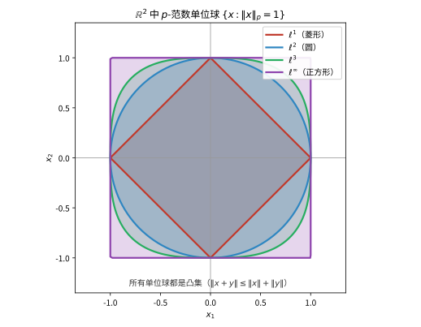

# 第 32 级：泛函分析 (Functional Analysis)

> 泛函分析是现代数学的核心分支之一，它研究无限维向量空间上的函数（泛函）与算子，将线性代数、分析与拓扑学深度融合。它在量子力学、偏微分方程、数值分析、信号处理等领域有着根本性的应用。本章从赋范空间出发，系统构建泛函分析的理论大厦。

---

## 1. 学习目标

1. 理解赋范线性空间与 Banach 空间的基本概念，掌握 C[0,1]、Lᵖ、ℓᵖ 等经典例子。
2. 掌握 Hölder 不等式与 Minkowski 不等式的证明及其在 Lᵖ 空间中的应用。
3. 理解有界线性算子与算子范数的概念，掌握空间 ℬ(X, Y) 的结构。
4. 掌握三大基本原理：一致有界性原理、开映射定理、闭图像定理及其证明。
5. 深入理解 Hahn-Banach 定理及其对偶理论，掌握自反空间的概念。
6. 理解弱拓扑与弱-* 拓扑，掌握 Banach-Alaoglu 定理与 Mazur 引理。
7. 掌握 Hilbert 空间理论：正交基、Riesz 表示定理、正交投影、Fourier 级数。
8. 掌握自伴算子、紧算子与谱定理，理解 Fredholm 替代。
9. 了解 Banach 代数与 Gelfand 理论的基本框架。
10. 通过大量例题与习题巩固对泛函分析核心思想的理解。

---

## 2. 赋范线性空间

### 2.1 范数与赋范空间

**定义 2.1**（范数）设 $X$ 是数域 $\mathbb{K}$（$\mathbb{R}$ 或 $\mathbb{C}$）上的向量空间。函数 $\|\cdot\|: X \to [0, \infty)$ 称为 **范数**（norm），若满足：

1. **正定性**：$\|x\| \geq 0$，且 $\|x\| = 0 \iff x = 0$；
2. **齐次性**：$\|\alpha x\| = |\alpha| \,\|x\|$，$\forall \alpha \in \mathbb{K}, x \in X$；
3. **三角不等式**：$\|x + y\| \leq \|x\| + \|y\|$，$\forall x, y \in X$。

$(X, \|\cdot\|)$ 称为 **赋范线性空间**（normed vector space）。

范数自然地诱导出度量 $d(x, y) = \|x - y\|$，因此赋范空间是度量空间。若在此度量下 $X$ 是完备的（即每个 Cauchy 列都收敛），则称 $X$ 为 **Banach 空间**。

**例 2.2**（$\mathbb{R}^n$ 与 $\mathbb{C}^n$）对 $x = (x_1, \ldots, x_n) \in \mathbb{K}^n$，定义
$$
\|x\|_p = \left(\sum_{i=1}^n |x_i|^p\right)^{1/p}, \quad 1 \leq p < \infty; \qquad \|x\|_\infty = \max_{1 \leq i \leq n} |x_i|.
$$
每个 $(\mathbb{K}^n, \|\cdot\|_p)$ 都是 Banach 空间（有限维空间总是完备的）。

> **直观理解（现实类比）**：单位球刻画的是"距离"的不同度量方式。$\ell^1$（菱形）像城市里只能沿街区网格走（曼哈顿距离）；$\ell^2$（圆）像两点间的直线距离；$\ell^\infty$（正方形）像只关心最大坐标差（棋盘的"国王"走法）。无论选择哪种度量，单位球都是凸集——这正是范数满足三角不等式 $\|x+y\|\le\|x\|+\|y\|$ 的几何体现。

### 2.2 C[0,1] 空间

**例 2.3**（$C[0,1]$）设 $C[0,1]$ 为 $[0,1]$ 上所有连续函数（值域为 $\mathbb{K}$）构成的向量空间。定义
$$
\|f\|_\infty = \sup_{t \in [0,1]} |f(t)|.
$$
则 $(C[0,1], \|\cdot\|_\infty)$ 是 Banach 空间。完备性源于连续函数列的一致收敛极限仍是连续的。

也可定义 $L^p$ 范数 $\|f\|_p = (\int_0^1 |f(t)|^p dt)^{1/p}$，但 $(C[0,1], \|\cdot\|_p)$ **不是** 完备的（其完备化是 $L^p[0,1]$）。

### 2.3 ℓᵖ 空间

**例 2.4**（$\ell^p$ 空间）对 $1 \leq p < \infty$，定义
$$
\ell^p = \left\{x = (x_n)_{n=1}^\infty \;\Big|\; \sum_{n=1}^\infty |x_n|^p < \infty\right\},
$$
赋予范数 $\|x\|_p = \left(\sum_{n=1}^\infty |x_n|^p\right)^{1/p}$。$\ell^\infty$ 为所有有界数列构成的空間，范数为 $\|x\|_\infty = \sup_n |x_n|$。

每个 $\ell^p$（$1 \leq p \leq \infty$）都是 Banach 空间。$c_0$（收敛到零的数列空间）是 $\ell^\infty$ 的闭子空间。

### 2.4 Lᵖ 空间

**例 2.5**（$L^p$ 空间）设 $(X, \mathcal{A}, \mu)$ 是测度空间，$1 \leq p < \infty$。定义
$$
L^p(X, \mu) = \left\{f: X \to \mathbb{K} \text{ 可测} \;\Big|\; \int_X |f|^p d\mu < \infty\right\},
$$
赋予范数 $\|f\|_p = \left(\int_X |f|^p d\mu\right)^{1/p}$。$L^\infty(X, \mu)$ 为本性有界可测函数空间，范数为 $\|f\|_\infty = \operatorname{ess\,sup}_X |f|$。

**定理**（Riesz-Fischer）$L^p(X, \mu)$ 在 $\|\cdot\|_p$ 下是 Banach 空间，$1 \leq p \leq \infty$。

### 2.5 Hölder 不等式

**定理 2.6**（Hölder 不等式）设 $p, q > 1$ 满足 $\frac{1}{p} + \frac{1}{q} = 1$（称 $p, q$ 为共轭指数）。若 $f \in L^p$，$g \in L^q$，则 $fg \in L^1$ 且
$$
\int_X |fg| \, d\mu \leq \|f\|_p \,\|g\|_q.
$$

*证明*：首先证明 Young 不等式：对 $a, b \geq 0$，
$$
ab \leq \frac{a^p}{p} + \frac{b^q}{q}.
$$
考虑函数 $\varphi(t) = \frac{t^p}{p} + \frac{1}{q} - t$（$t \geq 0$），由 $\varphi'(t) = t^{p-1} - 1$ 知 $\varphi$ 在 $t=1$ 处取最小值 0，故 $\frac{t^p}{p} + \frac{1}{q} \geq t$。令 $t = ab^{-q/p}$ 即得 Young 不等式。

现在证明 Hölder 不等式。不妨设 $\|f\|_p > 0$，$\|g\|_q > 0$。令 $F = f / \|f\|_p$，$G = g / \|g\|_q$，则 $\|F\|_p = \|G\|_q = 1$。由 Young 不等式，
$$
|F(x) G(x)| \leq \frac{|F(x)|^p}{p} + \frac{|G(x)|^q}{q}.
$$
两边积分得
$$
\int |FG| \, d\mu \leq \frac{1}{p} \int |F|^p \, d\mu + \frac{1}{q} \int |G|^q \, d\mu = \frac{1}{p} + \frac{1}{q} = 1.
$$
因此 $\int |fg| \, d\mu \leq \|f\|_p \|g\|_q$。$\square$

**特殊情况**：当 $p = q = 2$ 时，Hölder 不等式退化为 Cauchy-Schwarz 不等式：
$$
\int |fg| \, d\mu \leq \|f\|_2 \|g\|_2.
$$

### 2.6 Minkowski 不等式

**定理 2.7**（Minkowski 不等式）设 $1 \leq p \leq \infty$，$f, g \in L^p$，则 $f + g \in L^p$ 且
$$
\|f + g\|_p \leq \|f\|_p + \|g\|_p.
$$

*证明*：$p = 1$ 或 $p = \infty$ 的情形是平凡的。设 $1 < p < \infty$，$q$ 为 $p$ 的共轭指数。由 Hölder 不等式，
$$
\begin{aligned}
\|f + g\|_p^p &= \int |f + g|^p \, d\mu = \int |f + g| \cdot |f + g|^{p-1} \, d\mu \\
&\leq \int (|f| + |g|) |f + g|^{p-1} \, d\mu \\
&\leq \|f\|_p \left(\int |f + g|^{(p-1)q} \, d\mu\right)^{1/q} + \|g\|_p \left(\int |f + g|^{(p-1)q} \, d\mu\right)^{1/q}.
\end{aligned}
$$
由于 $(p-1)q = p$，所以 $\left(\int |f + g|^{(p-1)q} \, d\mu\right)^{1/q} = \|f + g\|_p^{p/q}$。代入得
$$
\|f + g\|_p^p \leq (\|f\|_p + \|g\|_p) \|f + g\|_p^{p/q}.
$$
两边除以 $\|f + g\|_p^{p/q}$（若 $\|f + g\|_p = 0$ 则不等式显然成立），并注意到 $p - p/q = 1$，即得
$$
\|f + g\|_p \leq \|f\|_p + \|g\|_p. \qquad \square
$$

---

## 3. 有界线性算子

### 3.1 定义与算子范数

**定义 3.1**（有界线性算子）设 $X, Y$ 是赋范空间。线性映射 $T: X \to Y$ 称为 **有界线性算子**（bounded linear operator），若存在常数 $C \geq 0$ 使得
$$
\|Tx\|_Y \leq C \|x\|_X, \quad \forall x \in X.
$$
满足此条件的最小 $C$ 称为 $T$ 的 **算子范数**（operator norm），记作 $\|T\|$：
$$
\|T\| = \sup_{\|x\| = 1} \|Tx\| = \sup_{x \neq 0} \frac{\|Tx\|}{\|x\|}.
$$

**命题 3.2** 线性算子 $T$ 有界 $\iff$ $T$ 连续（在 $X$ 的范数拓扑下）。

*证明概要*：若 $T$ 有界，则 $\|Tx - Ty\| \leq \|T\| \|x - y\|$，故 $T$ 是 Lipschitz 连续的。反之，若 $T$ 在 $0$ 处连续，则存在 $\delta > 0$ 使得 $\|x\| < \delta$ 时 $\|Tx\| < 1$，从而 $\|T\| \leq 1/\delta$。

### 3.2 有界算子空间

**定义 3.3**（$\mathcal{B}(X, Y)$）设 $X, Y$ 是赋范空间。记
$$
\mathcal{B}(X, Y) = \{T: X \to Y \mid T \text{ 是有界线性算子}\}.
$$
在 $\mathcal{B}(X, Y)$ 上赋予算子范数，则它是一个赋范空间。

**定理 3.4** 若 $Y$ 是 Banach 空间，则 $\mathcal{B}(X, Y)$ 是 Banach 空间。

*证明概要*：设 $\{T_n\}$ 是 $\mathcal{B}(X, Y)$ 中的 Cauchy 列。对任意 $x \in X$，$\{T_n x\}$ 是 $Y$ 中的 Cauchy 列，由 $Y$ 的完备性，可定义 $Tx = \lim_{n \to \infty} T_n x$。易验证 $T$ 是线性算子。由 $\{T_n\}$ 的有界性可证 $T$ 有界且 $\|T_n - T\| \to 0$。

### 3.3 等价范数

**定义 3.5**（等价范数）赋范空间 $X$ 上的两个范数 $\|\cdot\|_1$ 和 $\|\cdot\|_2$ 称为 **等价** 的，若存在常数 $a, b > 0$ 使得
$$
a \|x\|_1 \leq \|x\|_2 \leq b \|x\|_1, \quad \forall x \in X.
$$

**定理 3.6** 有限维空间上的所有范数都是等价的。

*证明*：设 $\dim X = n$，$\{e_1, \ldots, e_n\}$ 是一组基。定义范数 $\|x\|_\infty = \max_i |\alpha_i|$（其中 $x = \sum \alpha_i e_i$）。对任意范数 $\|\cdot\|$，有
$$
\|x\| \leq \sum |\alpha_i| \|e_i\| \leq \left(\sum \|e_i\|\right) \|x\|_\infty.
$$
另一边，考虑函数 $f(\alpha) = \|\sum \alpha_i e_i\|$ 在紧集 $\{\alpha \mid \|\alpha\|_\infty = 1\}$ 上连续，由极值定理取得最小值 $m > 0$，故 $\|x\| \geq m \|x\|_\infty$。$\square$

### 3.4 开映射定理

**定理 3.7**（开映射定理，Open Mapping Theorem）设 $X, Y$ 是 Banach 空间，$T: X \to Y$ 是有界线性满射。则 $T$ 是 **开映射**，即若 $U \subseteq X$ 是开集，则 $T(U) \subseteq Y$ 也是开集。

*证明*：设 $B_X(0, r)$ 为 $X$ 中以 $0$ 为心、$r$ 为半径的开球。只需证明存在 $\delta > 0$ 使得 $B_Y(0, \delta) \subseteq T(B_X(0, 1))$。

**第 1 步**：证明存在 $\delta > 0$ 使得 $B_Y(0, \delta) \subseteq \overline{T(B_X(0, 1))}$（闭包）。

由于 $T$ 是满射，$Y = \bigcup_{n=1}^\infty T(B_X(0, n))$。由 Baire 纲定理，Banach 空间 $Y$ 不能表示为可数个无处稠密集的并集，故存在 $n$ 使得 $\overline{T(B_X(0, n))}$ 有非空内部。于是存在 $y_0 \in Y$ 和 $r > 0$ 使得 $B_Y(y_0, r) \subseteq \overline{T(B_X(0, n))}$。

对任意 $y \in B_Y(0, r)$，$y_0$ 和 $y_0 + y$ 都在 $B_Y(y_0, r)$ 中，因此是 $\overline{T(B_X(0, n))}$ 中的点。由线性性，$y = (y_0 + y) - y_0$ 属于 $\overline{T(B_X(0, n))} - \overline{T(B_X(0, n))} \subseteq \overline{T(B_X(0, 2n))}$。取 $\delta = r/(2n)$，则 $B_Y(0, \delta) \subseteq \overline{T(B_X(0, 1))}$。

**第 2 步**：证明 $B_Y(0, \delta/2) \subseteq T(B_X(0, 1))$。

取任意 $y \in B_Y(0, \delta/2)$。由第 1 步，存在 $x_1 \in B_X(0, 1/2)$ 使得 $\|y - Tx_1\| < \delta/4$。令 $y_1 = y - Tx_1$，则 $y_1 \in B_Y(0, \delta/4)$。再次应用第 1 步，存在 $x_2 \in B_X(0, 1/4)$ 使得 $\|y_1 - Tx_2\| < \delta/8$。

依此类推，得到序列 $\{x_n\}$ 满足 $x_n \in B_X(0, 2^{-n})$ 且 $\|y - T(x_1 + \cdots + x_n)\| < \delta/2^{n+1}$。由于 $X$ 完备，$x = \sum_{n=1}^\infty x_n$ 收敛，且 $\|x\| < \sum_{n=1}^\infty 2^{-n} = 1$。由 $T$ 的连续性，$Tx = \lim_{n \to \infty} T(x_1 + \cdots + x_n) = y$。故 $y \in T(B_X(0, 1))$。$\square$

**推论 3.8**（逆算子定理）若 $T: X \to Y$ 是 Banach 空间之间的双射有界线性算子，则 $T^{-1}: Y \to X$ 也是有界线性算子。

### 3.5 闭图像定理

**定义 3.9**（闭算子）设 $X, Y$ 是赋范空间，$T: D(T) \subseteq X \to Y$ 是线性算子（$D(T)$ 为定义域）。$T$ 的 **图像**（graph）为
$$
G(T) = \{(x, Tx) \mid x \in D(T)\} \subseteq X \times Y.
$$
若 $G(T)$ 在 $X \times Y$ 的乘积范数 $\|(x, y)\| = \|x\| + \|y\|$ 下是闭集，则称 $T$ 为 **闭算子**（closed operator）。

**定理 3.10**（闭图像定理，Closed Graph Theorem）设 $X, Y$ 是 Banach 空间，$T: X \to Y$ 是定义在全空间上的线性算子。若 $T$ 的图像是闭集，则 $T$ 有界（即连续）。

*证明*：考虑乘积空间 $X \times Y$，赋予范数 $\|(x, y)\| = \|x\|_X + \|y\|_Y$。$X \times Y$ 在此范数下是 Banach 空间。$G(T) \subseteq X \times Y$ 是闭线性子空间，因此也是 Banach 空间。

考虑投影映射 $P: G(T) \to X$，$P(x, Tx) = x$。$P$ 是双射、线性且有界（因为 $\|P(x, Tx)\| = \|x\| \leq \|(x, Tx)\|$）。由逆算子定理，$P^{-1}: X \to G(T)$ 有界。

于是存在常数 $C$ 使得 $\|(x, Tx)\| \leq C \|x\|$ 对任意 $x \in X$ 成立。但 $\|(x, Tx)\| = \|x\| + \|Tx\|$，故 $\|Tx\| \leq (C-1)\|x\|$，即 $T$ 有界。$\square$

---

## 4. 一致有界性原理

### 4.1 定理的陈述与证明

**定理 4.1**（一致有界性原理 / 共鸣定理，Uniform Boundedness Principle / Banach-Steinhaus Theorem）设 $X$ 是 Banach 空间，$Y$ 是赋范空间，$\{T_\alpha\}_{\alpha \in I} \subseteq \mathcal{B}(X, Y)$ 是一族有界线性算子。若对每个 $x \in X$，$\sup_{\alpha \in I} \|T_\alpha x\| < \infty$，则
$$
\sup_{\alpha \in I} \|T_\alpha\| < \infty.
$$

*证明*：对每个 $n \in \mathbb{N}$，定义
$$
F_n = \{x \in X \mid \sup_{\alpha \in I} \|T_\alpha x\| \leq n\} = \bigcap_{\alpha \in I} \{x \in X \mid \|T_\alpha x\| \leq n\}.
$$
每个 $T_\alpha$ 连续，故 $\{x \mid \|T_\alpha x\| \leq n\}$ 是闭集，从而 $F_n$ 是闭集。

由假设，对每个 $x \in X$，$\sup_\alpha \|T_\alpha x\| < \infty$，故存在 $n$ 使得 $x \in F_n$。因此 $X = \bigcup_{n=1}^\infty F_n$。

由 Baire 纲定理，Banach 空间 $X$ 不能表示为可数个无处稠密集的并集，故存在某个 $n$ 使得 $F_n$ 有内点。于是存在 $x_0 \in X$ 和 $r > 0$ 使得 $B(x_0, r) \subseteq F_n$。

对任意 $x \in B(0, r)$，$x_0 + x \in B(x_0, r) \subseteq F_n$，故
$$
\|T_\alpha(x_0 + x)\| \leq n, \quad \forall \alpha.
$$
又 $\|T_\alpha x_0\| \leq n$，由三角不等式，
$$
\|T_\alpha x\| \leq \|T_\alpha(x_0 + x)\| + \|T_\alpha x_0\| \leq 2n, \quad \forall \alpha, \forall x \in B(0, r).
$$
因此 $\|T_\alpha\| = \sup_{\|x\| \leq r} \frac{\|T_\alpha x\|}{r} \leq \frac{2n}{r}$，即 $\sup_\alpha \|T_\alpha\| < \infty$。$\square$

### 4.2 应用

**例 4.2**（Fourier 级数发散）一致有界性原理可用于证明存在连续函数其 Fourier 级数在指定点发散。具体地，考虑 $C(\mathbb{T})$ 上的 Fourier 部分和算子 $S_N$，可证明 $\|S_N\|$ 无界（$\|S_N\| \sim \frac{4}{\pi^2} \log N$），故存在连续函数 $f$ 使得 $\sup_N \|S_N f\|_\infty = \infty$。

**例 4.3**（弱有界 $\Rightarrow$ 强有界）在 Banach 空间中，若对每个 $x \in X$，数列 $\{x_n\}$ 满足 $\sup_n |\varphi(x_n)| < \infty$ 对任意 $\varphi \in X^*$ 成立，则 $\sup_n \|x_n\| < \infty$。这通过将 $x_n$ 视为 $X^{**}$ 中的元素并由一致有界性原理得到。

---

## 5. 哈恩-巴拿赫定理

### 5.1 次线性泛函与延拓形式

**定义 5.1**（次线性泛函）设 $X$ 是实向量空间。函数 $p: X \to \mathbb{R}$ 称为 **次线性泛函**（sublinear functional），若：
1. **次可加性**：$p(x + y) \leq p(x) + p(y)$，$\forall x, y \in X$；
2. **正齐次性**：$p(\alpha x) = \alpha p(x)$，$\forall \alpha \geq 0, x \in X$。

**定理 5.2**（Hahn-Banach 定理——实向量空间形式）设 $X$ 是实向量空间，$p: X \to \mathbb{R}$ 是次线性泛函。设 $Y \subseteq X$ 是子空间，$f: Y \to \mathbb{R}$ 是线性泛函且满足 $f(y) \leq p(y)$ 对任意 $y \in Y$ 成立。则存在线性泛函 $F: X \to \mathbb{R}$ 使得：
1. $F|_Y = f$（延拓）；
2. $F(x) \leq p(x)$ 对任意 $x \in X$ 成立。

*证明*：使用 Zorn 引理。考虑所有满足条件的延拓对 $(Z, g)$ 的集合，其中 $Z$ 是包含 $Y$ 的子空间，$g: Z \to \mathbb{R}$ 是线性泛函且 $g \leq p|_Z$。定义偏序 $(Z_1, g_1) \preceq (Z_2, g_2)$ 若 $Z_1 \subseteq Z_2$ 且 $g_2|_{Z_1} = g_1$。

要应用 Zorn 引理，只需证明每条链都有上界。设 $\{(Z_\alpha, g_\alpha)\}$ 是一条链，则取 $Z = \bigcup_\alpha Z_\alpha$，定义 $g(z) = g_\alpha(z)$ 对 $z \in Z_\alpha$（由链性质保证良定义），则 $(Z, g)$ 是一个上界。

由 Zorn 引理，存在极大元 $(Z_0, F)$。需证明 $Z_0 = X$。若不然，存在 $x_0 \notin Z_0$。考虑 $Z_1 = Z_0 \oplus \mathbb{R}x_0$。对任意 $z_1, z_2 \in Z_0$，
$$
f(z_1) + f(z_2) = f(z_1 + z_2) \leq p(z_1 + z_2) \leq p(z_1 - x_0) + p(z_2 + x_0),
$$
故 $f(z_1) - p(z_1 - x_0) \leq p(z_2 + x_0) - f(z_2)$。取
$$
c = \sup_{z \in Z_0} \{f(z) - p(z - x_0)\} \leq \inf_{z \in Z_0} \{p(z + x_0) - f(z)\}.
$$
定义 $F(x_0) = c$，则对任意 $z \in Z_0$ 和 $\alpha > 0$，
$$
F(z + \alpha x_0) = f(z) + \alpha c \leq p(z + \alpha x_0).
$$
对 $\alpha < 0$ 类似可证。因此 $(Z_1, F)$ 是比 $(Z_0, F)$ 更大的延拓，矛盾。故 $Z_0 = X$。$\square$

**定理 5.3**（Hahn-Banach 定理——赋范空间形式）设 $X$ 是赋范空间，$Y \subseteq X$ 是子空间，$f \in Y^*$（即 $Y$ 上的有界线性泛函）。则存在 $F \in X^*$ 使得 $F|_Y = f$ 且 $\|F\| = \|f\|$。

*证明*：取 $p(x) = \|f\| \cdot \|x\|$，则 $p$ 是次线性泛函且 $f(y) \leq p(y)$ 对 $y \in Y$ 成立。由实向量空间形式的 Hahn-Banach 定理，存在线性泛函 $F: X \to \mathbb{R}$ 满足 $F|_Y = f$ 且 $F(x) \leq \|f\| \cdot \|x\|$。由于 $F(-x) = -F(x) \leq \|f\| \cdot \|x\|$，故 $|F(x)| \leq \|f\| \cdot \|x\|$，即 $\|F\| \leq \|f\|$。显然 $\|F\| \geq \|f\|$，因此 $\|F\| = \|f\|$。$\square$

### 5.2 几何形式与分离定理

**定理 5.4**（Hahn-Banach 分离定理——第一几何形式）设 $X$ 是赋范空间，$A, B \subseteq X$ 是互不相交的非空凸集，$A$ 是开集。则存在 $f \in X^*$ 和 $\alpha \in \mathbb{R}$ 使得
$$
\operatorname{Re} f(a) < \alpha \leq \operatorname{Re} f(b), \quad \forall a \in A, b \in B.
$$

**定理 5.5**（Hahn-Banach 分离定理——第二几何形式）设 $X$ 是赋范空间，$A, B \subseteq X$ 是互不相交的非空凸闭集，$A$ 是紧集。则存在 $f \in X^*$ 和 $\alpha_1, \alpha_2 \in \mathbb{R}$ 使得
$$
\operatorname{Re} f(a) < \alpha_1 < \alpha_2 < \operatorname{Re} f(b), \quad \forall a \in A, b \in B.
$$

> **直观理解（现实类比）**：两个互不重叠的凸集（如两团互不接触的面团），总能找到一块薄薄的"隔板"（超平面）把它们完全隔开，且隔板不会同时碰到两边。这块隔板由线性泛函 $f$ 和常数 $\alpha$ 决定 $\{x\mid \mathrm{Re}\,f(x)=\alpha\}$，满足 $\mathrm{Re}\,f(a)<\alpha\le\mathrm{Re}\,f(b)$。这正是 Hahn–Banach 延拓定理的几何本质，也是凸分析中"分离"思想的基石。

### 5.3 对偶空间与双对偶

**定义 5.6**（对偶空间）设 $X$ 是赋范空间。$X$ 上所有有界线性泛函构成的 Banach 空间称为 $X$ 的 **对偶空间**（dual space），记作 $X^* = \mathcal{B}(X, \mathbb{K})$。

**定义 5.7**（双对偶与典范嵌入）$X$ 的双对偶（bidual）为 $X^{**} = (X^*)^*$。定义典范映射 $J: X \to X^{**}$ 为
$$
(J(x))(\varphi) = \varphi(x), \quad \forall x \in X, \varphi \in X^*.
$$
由 Hahn-Banach 定理，$J$ 是等距嵌入（$\|J(x)\| = \|x\|$）。

**定义 5.8**（自反空间）若 $J$ 是满射（即 $X \cong X^{**}$ 等距同构），则称 $X$ 是 **自反的**（reflexive）。

**例 5.9**：
- 有限维空间都是自反的。
- $\ell^p$（$1 < p < \infty$）是自反的，且 $(\ell^p)^* \cong \ell^q$（$1/p + 1/q = 1$）。
- $L^p$（$1 < p < \infty$）是自反的，且 $(L^p)^* \cong L^q$。
- $\ell^1$ 和 $\ell^\infty$ 不是自反的。
- $C[0,1]$ 不是自反的。

---

## 6. 弱拓扑

### 6.1 弱拓扑与弱-* 拓扑

**定义 6.1**（弱拓扑）设 $X$ 是赋范空间。$X$ 上的 **弱拓扑**（weak topology）$\sigma(X, X^*)$ 是由所有 $f \in X^*$ 生成的拓扑（即使得每个 $f$ 都连续的最粗糙拓扑）。在此拓扑下，$x_\alpha \to x$ 当且仅当对每个 $f \in X^*$，$f(x_\alpha) \to f(x)$。

**定义 6.2**（弱-* 拓扑）设 $X^*$ 是 $X$ 的对偶空间。$X^*$ 上的 **弱-* 拓扑**（weak-* topology）$\sigma(X^*, X)$ 是由所有 $x \in X$ 生成的拓扑（即对每个 $x \in X$，映射 $\varphi \mapsto \varphi(x)$ 连续）。在此拓扑下，$\varphi_\alpha \to \varphi$ 当且仅当对每个 $x \in X$，$\varphi_\alpha(x) \to \varphi(x)$。

**性质 6.3**：
- 弱拓扑比范数拓扑弱（即更粗糙），且当 $\dim X = \infty$ 时严格更弱。
- 弱-* 拓扑比 $X^*$ 上的弱拓扑更弱。
- 若 $X$ 自反，则弱拓扑与弱-* 拓扑在 $X^*$ 上重合。

### 6.2 Banach-Alaoglu 定理

**定理 6.4**（Banach-Alaoglu 定理）设 $X$ 是赋范空间，则 $X^*$ 中的闭单位球 $\overline{B}_{X^*} = \{\varphi \in X^* \mid \|\varphi\| \leq 1\}$ 在弱-* 拓扑下是紧的。

*证明*：对每个 $x \in X$，令 $D_x = \{\lambda \in \mathbb{K} \mid |\lambda| \leq \|x\|\}$。由 Tychonoff 定理，乘积空间 $P = \prod_{x \in X} D_x$ 在乘积拓扑下是紧的。

定义映射 $\Phi: \overline{B}_{X^*} \to P$ 为 $\Phi(\varphi) = (\varphi(x))_{x \in X}$。易验证 $\Phi$ 是单射且连续（当 $P$ 赋予乘积拓扑，$\overline{B}_{X^*}$ 赋予弱-* 拓扑时）。$\Phi$ 的像集是 $P$ 的闭子集（因为线性与有界条件在逐点收敛下保持），因此是紧的。故 $\overline{B}_{X^*}$ 在弱-* 拓扑下紧。$\square$

**推论 6.5** 若 $X$ 是自反 Banach 空间，则 $X$ 中的闭单位球在弱拓扑下是紧的。

### 6.3 Mazur 引理

**引理 6.6**（Mazur 引理）设 $X$ 是赋范空间，$\{x_n\}$ 是 $X$ 中弱收敛到 $x$ 的序列。则存在 $\{x_n\}$ 的凸组合序列 $\{y_n\}$（即 $y_n = \sum_{i=1}^{k_n} \lambda_i^{(n)} x_i$，其中 $\lambda_i^{(n)} \geq 0$，$\sum \lambda_i^{(n)} = 1$）使得 $y_n \to x$ 在范数拓扑下收敛。

*证明概要*：考虑集合 $C = \operatorname{conv}\{x_n\}$（凸包），$C$ 的闭包 $\overline{C}$ 是闭凸集。由 Hahn-Banach 分离定理，若 $x \notin \overline{C}$，则存在 $f \in X^*$ 分离 $x$ 与 $\overline{C}$，与 $x_n \to x$ 弱收敛矛盾。故 $x \in \overline{C}$，即可由凸组合逼近。$\square$

---

## 7. 希尔伯特空间

### 7.1 内积空间

**定义 7.1**（内积）设 $H$ 是 $\mathbb{K}$ 上的向量空间。函数 $\langle \cdot, \cdot \rangle: H \times H \to \mathbb{K}$ 称为 **内积**（inner product），若满足：

1. **共轭对称性**：$\langle x, y \rangle = \overline{\langle y, x \rangle}$；
2. **线性性**：$\langle \alpha x + \beta y, z \rangle = \alpha \langle x, z \rangle + \beta \langle y, z \rangle$；
3. **正定性**：$\langle x, x \rangle \geq 0$，且 $\langle x, x \rangle = 0 \iff x = 0$。

$(H, \langle \cdot, \cdot \rangle)$ 称为 **内积空间**（inner product space）。内积诱导范数 $\|x\| = \sqrt{\langle x, x \rangle}$。若 $H$ 在此范数下完备，则称 $H$ 为 **Hilbert 空间**。

**定理 7.2**（Cauchy-Schwarz 不等式）$|\langle x, y \rangle| \leq \|x\| \|y\|$，等号成立当且仅当 $x$、$y$ 线性相关。

**定理 7.3**（平行四边形法则）$\|x + y\|^2 + \|x - y\|^2 = 2(\|x\|^2 + \|y\|^2)$。反之，若赋范空间中范数满足平行四边形法则，则可由 $\langle x, y \rangle = \frac{1}{4}(\|x+y\|^2 - \|x-y\|^2)$（实情形）定义内积。

### 7.2 正交基与 Gram-Schmidt 过程

**定义 7.4**（正交与规范正交）$H$ 中的两个向量 $x, y$ 称为 **正交** 的，记作 $x \perp y$，若 $\langle x, y \rangle = 0$。一族向量 $\{e_\alpha\}$ 称为 **规范正交系**（orthonormal system），若 $\langle e_\alpha, e_\beta \rangle = \delta_{\alpha\beta}$。

**定理 7.5**（Gram-Schmidt 正交化）设 $\{x_n\}$ 是 $H$ 中的线性无关序列。则存在规范正交系 $\{e_n\}$ 使得 $\operatorname{span}\{e_1, \ldots, e_n\} = \operatorname{span}\{x_1, \ldots, x_n\}$ 对每个 $n$ 成立。

*构造*：递归定义
$$
e_1 = \frac{x_1}{\|x_1\|}, \quad e_n = \frac{x_n - \sum_{i=1}^{n-1} \langle x_n, e_i \rangle e_i}{\|x_n - \sum_{i=1}^{n-1} \langle x_n, e_i \rangle e_i\|}.
$$

**定义 7.6**（Hilbert 基）规范正交系 $\{e_\alpha\}_{\alpha \in I}$ 称为 **Hilbert 基**（或完备规范正交系），若 $\overline{\operatorname{span}\{e_\alpha\}} = H$。

**定理 7.7**（Fourier 展开）设 $\{e_n\}$ 是可分 Hilbert 空间 $H$ 的 Hilbert 基。则对任意 $x \in H$，
$$
x = \sum_{n=1}^\infty \langle x, e_n \rangle e_n,
$$
其中级数在 $H$ 的范数下收敛，且 Parseval 等式成立：
$$
\|x\|^2 = \sum_{n=1}^\infty |\langle x, e_n \rangle|^2.
$$

### 7.3 Riesz 表示定理

**定理 7.8**（Riesz 表示定理）设 $H$ 是 Hilbert 空间，$f \in H^*$ 是 $H$ 上的有界线性泛函。则存在唯一的 $y \in H$ 使得
$$
f(x) = \langle x, y \rangle, \quad \forall x \in H,
$$
且 $\|f\| = \|y\|$。

*证明*：若 $f = 0$，取 $y = 0$ 即可。否则，设 $M = \ker f$，则 $M$ 是 $H$ 的真闭子空间。由闭子空间的正交补性质，$M^\perp \neq \{0\}$。取 $z \in M^\perp$ 且 $\|z\| = 1$。

对任意 $x \in H$，考虑 $x - \frac{f(x)}{f(z)} z$，它属于 $M$，故与 $z$ 正交：
$$
\left\langle x - \frac{f(x)}{f(z)} z, z \right\rangle = 0 \quad \Rightarrow \quad \langle x, z \rangle = \frac{f(x)}{f(z)}.
$$
因此 $f(x) = f(z) \langle x, z \rangle = \langle x, \overline{f(z)} z \rangle$。取 $y = \overline{f(z)} z$ 即得。

唯一性：若 $\langle x, y_1 \rangle = \langle x, y_2 \rangle$ 对所有 $x \in H$ 成立，则 $\langle x, y_1 - y_2 \rangle = 0$，取 $x = y_1 - y_2$ 得 $\|y_1 - y_2\|^2 = 0$，故 $y_1 = y_2$。

范数关系：由 Cauchy-Schwarz 不等式，$|f(x)| \leq \|y\| \|x\|$，故 $\|f\| \leq \|y\|$。又 $f(y/\|y\|) = \|y\|$，故 $\|f\| = \|y\|$。$\square$

### 7.4 正交投影

**定理 7.9**（正交投影）设 $M$ 是 Hilbert 空间 $H$ 的闭子空间。则对任意 $x \in H$，存在唯一的分解 $x = m + n$，其中 $m \in M$，$n \in M^\perp$。记 $P_M x = m$，则 $P_M$ 是 $H$ 上的有界线性算子，称为 **正交投影**（orthogonal projection），且 $\|P_M\| = 1$（若 $M \neq \{0\}$）。

**性质 7.10** 正交投影 $P = P_M$ 满足：
1. $P^2 = P$（幂等性）；
2. $P^* = P$（自伴性）；
3. $\operatorname{Ran} P = M$，$\ker P = M^\perp$。

### 7.5 Hilbert 空间中的 Fourier 级数

**例 7.11**（经典 Fourier 级数）在 $L^2[-\pi, \pi]$ 中，函数系
$$
e_n(t) = \frac{1}{\sqrt{2\pi}} e^{int}, \quad n \in \mathbb{Z},
$$
构成 Hilbert 基。对任意 $f \in L^2[-\pi, \pi]$，
$$
f(t) = \sum_{n=-\infty}^\infty \hat{f}(n) e^{int}, \quad \hat{f}(n) = \frac{1}{2\pi} \int_{-\pi}^\pi f(t) e^{-int} dt,
$$
且 Parseval 等式成立：
$$
\frac{1}{2\pi} \int_{-\pi}^\pi |f(t)|^2 dt = \sum_{n=-\infty}^\infty |\hat{f}(n)|^2.
$$

---

## 8. 自伴算子与谱理论

### 8.1 伴随算子

**定义 8.1**（伴随算子）设 $H$ 是 Hilbert 空间，$T \in \mathcal{B}(H)$。则存在唯一的 $T^* \in \mathcal{B}(H)$ 使得
$$
\langle Tx, y \rangle = \langle x, T^* y \rangle, \quad \forall x, y \in H.
$$
$T^*$ 称为 $T$ 的 **伴随算子**（adjoint operator）。

**性质 8.2**：
1. $(T^*)^* = T$；
2. $(S + T)^* = S^* + T^*$；
3. $(\alpha T)^* = \overline{\alpha} T^*$；
4. $(ST)^* = T^* S^*$；
5. $\|T^*\| = \|T\|$，$\|T^* T\| = \|T\|^2$（C$^*$-性）。

### 8.2 自伴算子

**定义 8.3**（自伴算子）若 $T^* = T$，则称 $T$ 为 **自伴算子**（self-adjoint operator）。自伴算子的谱是实数集。

**定理 8.4**（自伴算子的谱性质）设 $T$ 是自伴算子，则：
1. $\sigma(T) \subseteq \mathbb{R}$；
2. $\|T\| = \sup_{\|x\|=1} |\langle Tx, x \rangle|$；
3. 不同特征值对应的特征向量互相正交。

### 8.3 紧算子

**定义 8.5**（紧算子）设 $X, Y$ 是 Banach 空间。$T: X \to Y$ 称为 **紧算子**（compact operator），若 $T$ 将 $X$ 的有界集映射为 $Y$ 的相对紧集（即闭包紧）。记 $\mathcal{K}(X, Y)$ 为紧算子空间。

**性质 8.6**：
1. 紧算子是有界算子；
2. 有限秩算子（值域有限维）是紧算子；
3. 紧算子的极限（在算子范数下）是紧算子；
4. 紧算子与有界算子的复合仍是紧算子。

**例 8.7**（积分算子）设 $k \in C([0,1] \times [0,1])$，定义
$$
(Tf)(x) = \int_0^1 k(x, y) f(y) \, dy,
$$
则 $T: C[0,1] \to C[0,1]$ 是紧算子（实际上，它是 Hilbert-Schmidt 算子）。

### 8.4 紧自伴算子的谱定理

**定理 8.8**（紧自伴算子的谱定理）设 $H$ 是可分 Hilbert 空间，$T: H \to H$ 是紧自伴算子。则：
1. $\sigma(T)$ 是 $\mathbb{R}$ 中的紧集，且至少包含 $0$。
2. $\sigma(T) \setminus \{0\}$ 由至多可数个特征值组成，每个非零特征值 $\lambda_n$ 的代数重数有限。
3. 若 $\{\lambda_n\}$ 是无穷序列，则 $\lambda_n \to 0$。
4. 存在 $H$ 的规范正交基由 $T$ 的特征向量组成。

*证明概要*：考虑二次型 $\varphi(x) = \langle Tx, x \rangle$ 在单位球面上的极值。由 $T$ 的紧性，存在 $x_1 \in H$，$\|x_1\| = 1$ 使得 $|\varphi(x_1)| = \sup_{\|x\|=1} |\varphi(x)| = \|T\|$（由定理 8.4）。可证 $x_1$ 是 $T$ 的特征向量，对应特征值 $\lambda_1 = \pm \|T\|$。

令 $H_1 = \{x_1\}^\perp$，则 $T$ 限制在 $H_1$ 上仍是紧自伴算子。重复上述过程，得到特征值序列 $\{\lambda_n\}$ 和对应的特征向量 $\{x_n\}$。若 $T$ 有无限多个非零特征值，则 $\lambda_n \to 0$（否则由紧性可导出矛盾）。

最后，若 $H_0 = \overline{\operatorname{span}\{x_n\}}$，则 $T$ 在 $H_0^\perp$ 上的限制是零算子，因此 $H_0^\perp \subseteq \ker T$，$H_0^\perp$ 中的任何向量都是对应于 $0$ 的特征向量。$\square$

### 8.5 Fredholm 替代

**定理 8.9**（Fredholm 替代）设 $H$ 是 Hilbert 空间，$T \in \mathcal{K}(H)$ 是紧算子，$\lambda \neq 0$。则以下两个命题中恰好一个成立：
1. **第一情形**：方程 $(\lambda I - T)x = y$ 对任意 $y \in H$ 有唯一解（即 $\lambda I - T$ 可逆）；
2. **第二情形**：方程 $(\lambda I - T)x = 0$ 有非平凡解（即 $\lambda$ 是 $T$ 的特征值），此时 $\dim \ker(\lambda I - T) = \dim \ker(\lambda I - T^*) < \infty$，且 $(\lambda I - T)x = y$ 有解当且仅当 $y \perp \ker(\lambda I - T^*)$。

*证明概要*：由紧算子的 Riesz 理论，$\lambda I - T$ 是指标为零的 Fredholm 算子，故 $\dim \ker(\lambda I - T) = \dim \operatorname{coker}(\lambda I - T) < \infty$。若 $\ker(\lambda I - T) = \{0\}$，则 $\lambda I - T$ 是单射，由指标为零知它也是满射，从而可逆。否则，$\lambda$ 是特征值，且值域 $\operatorname{Ran}(\lambda I - T)$ 是闭的，其正交补为 $\ker(\lambda I - T^*)$。$\square$

---

## 9. Banach 代数

### 9.1 定义与基本例子

**定义 9.1**（Banach 代数）设 $\mathcal{A}$ 是 $\mathbb{K}$ 上的代数（即同时是向量空间和环），且赋有范数 $\|\cdot\|$。若 $\mathcal{A}$ 在此范数下是 Banach 空间，且乘法满足
$$
\|xy\| \leq \|x\| \|y\|, \quad \forall x, y \in \mathcal{A},
$$
则称 $\mathcal{A}$ 为 **Banach 代数**（Banach algebra）。若 $\mathcal{A}$ 有乘法单位元 $1$ 且 $\|1\| = 1$，称其为 **含幺 Banach 代数**。

**例 9.2**：
- $C(K)$：紧 Hausdorff 空间 $K$ 上的连续函数空间，逐点乘法，$\|\cdot\|_\infty$。
- $\mathcal{B}(X)$：Banach 空间 $X$ 上的有界线性算子空间，算子复合乘法，算子范数。
- $L^1(\mathbb{R})$ 在卷积乘法下是 Banach 代数（不含幺）。

### 9.2 Gelfand 理论

**定义 9.3**（谱）设 $\mathcal{A}$ 是含幺 Banach 代数，$x \in \mathcal{A}$。$x$ 的 **谱**（spectrum）为
$$
\sigma(x) = \{\lambda \in \mathbb{C} \mid \lambda 1 - x \text{ 在 } \mathcal{A} \text{ 中不可逆}\}.
$$
谱半径 $r(x) = \sup\{|\lambda| \mid \lambda \in \sigma(x)\}$。

**定理 9.4**（Gelfand-Mazur 定理）含幺 Banach 代数中，若每个非零元素都可逆，则 $\mathcal{A} \cong \mathbb{C}$。

**定理 9.5**（谱半径公式）$r(x) = \lim_{n \to \infty} \|x^n\|^{1/n}$。

**定义 9.6**（特征）设 $\mathcal{A}$ 是交换含幺 Banach 代数。非零乘法线性泛函 $\chi: \mathcal{A} \to \mathbb{C}$（即 $\chi(xy) = \chi(x) \chi(y)$）称为 **特征**（character）。所有特征构成的集合称为 **极大理想空间**（或 Gelfand 空间），记作 $\mathfrak{M}(\mathcal{A})$。

**定理 9.7**（Gelfand 变换）设 $\mathcal{A}$ 是交换含幺 Banach 代数。定义 $\Gamma: \mathcal{A} \to C(\mathfrak{M}(\mathcal{A}))$ 为
$$
\Gamma(x)(\chi) = \chi(x), \quad \forall \chi \in \mathfrak{M}(\mathcal{A}),
$$
则 $\Gamma$ 是范数递减的代数同态，称为 **Gelfand 变换**。$\Gamma(x)$ 的像集是 $\sigma(x)$。

### 9.3 C*-代数简介

**定义 9.8**（C$^*$-代数）Banach 代数 $\mathcal{A}$ 上若存在对合运算 $*: \mathcal{A} \to \mathcal{A}$ 满足：
1. $(x^*)^* = x$；
2. $(\alpha x + \beta y)^* = \overline{\alpha} x^* + \overline{\beta} y^*$；
3. $(xy)^* = y^* x^*$；
4. C$^*$-条件：$\|x^* x\| = \|x\|^2$，

则称 $\mathcal{A}$ 为 **C$^*$-代数**（C$^*$-algebra）。

**例 9.9**：
- $C(K)$ 在复共轭下是交换 C$^*$-代数。
- $\mathcal{B}(H)$（Hilbert 空间上的有界算子）在伴随运算下是非交换 C$^*$-代数。

**定理 9.10**（Gelfand-Naimark 定理）交换 C$^*$-代数 $\mathcal{A}$ 等距 $*$-同构于 $C(\mathfrak{M}(\mathcal{A}))$。这是 Gelfand 变换的加强形式。

---

## 10. 示例

### 示例 1：求 $\ell^1$ 中序列的范数

设 $x = (1, \frac{1}{2}, \frac{1}{4}, \ldots, \frac{1}{2^{n-1}}, \ldots) \in \ell^1$。求 $\|x\|_1$。

*解*：$\|x\|_1 = \sum_{n=1}^\infty \frac{1}{2^{n-1}} = \frac{1}{1 - 1/2} = 2$。

### 示例 2：验证 $C[0,1]$ 中范数的等价性

判断 $C[0,1]$ 上的范数 $\|f\|_\infty$ 和 $\|f\|_1 = \int_0^1 |f(t)| dt$ 是否等价。

*解*：不等价。取 $f_n(t) = t^n$，则 $\|f_n\|_\infty = 1$，但 $\|f_n\|_1 = \frac{1}{n+1} \to 0$。因此不存在常数 $a > 0$ 使得 $a \|f\|_\infty \leq \|f\|_1$ 对所有 $f$ 成立。

### 示例 3：求有界线性算子的范数

定义 $T: C[0,1] \to C[0,1]$ 为 $(Tf)(x) = \int_0^x f(t) dt$。求 $\|T\|$。

*解*：对任意 $f$，$|(Tf)(x)| \leq \int_0^x |f(t)| dt \leq \|f\|_\infty \cdot x \leq \|f\|_\infty$，故 $\|Tf\|_\infty \leq \|f\|_\infty$，因此 $\|T\| \leq 1$。取 $f \equiv 1$，则 $(Tf)(x) = x$，$\|Tf\|_\infty = 1 = \|f\|_\infty$，故 $\|T\| = 1$。

### 示例 4：验证紧算子

设 $T: \ell^2 \to \ell^2$ 定义为 $T(x_1, x_2, \ldots) = (x_1, \frac{x_2}{2}, \frac{x_3}{3}, \ldots)$。证明 $T$ 是紧算子。

*证明*：定义 $T_n(x) = (x_1, \frac{x_2}{2}, \ldots, \frac{x_n}{n}, 0, 0, \ldots)$。$T_n$ 是有限秩算子，故紧。计算
$$
\|(T - T_n)x\|^2 = \sum_{k=n+1}^\infty \frac{|x_k|^2}{k^2} \leq \frac{1}{(n+1)^2} \sum_{k=n+1}^\infty |x_k|^2 \leq \frac{1}{(n+1)^2} \|x\|^2,
$$
故 $\|T - T_n\| \leq \frac{1}{n+1} \to 0$。紧算子的范数极限仍是紧算子，因此 $T$ 紧。

### 示例 5：Hahn-Banach 延拓

设 $X = \mathbb{R}^2$ 赋予 $\|\cdot\|_\infty$ 范数，$Y = \{(t, t) \mid t \in \mathbb{R}\}$。定义 $f(t, t) = t$。求 $f$ 的保范延拓到 $X$ 上。

*解*：$\|f\| = \sup_{t \neq 0} \frac{|t|}{\|(t, t)\|_\infty} = \sup_{t \neq 0} \frac{|t|}{|t|} = 1$。$f$ 的一个保范延拓可以是 $F(x, y) = x$，因为 $\|F\| = \sup_{\|(x,y)\|_\infty = 1} |x| = 1$，且 $F(t, t) = t = f(t, t)$。

### 示例 6：内积空间中的正交化

在 $L^2[-1, 1]$ 中，对 $\{1, t, t^2\}$ 进行 Gram-Schmidt 正交化。

*解*：$e_1(t) = \frac{1}{\|1\|} = \frac{1}{\sqrt{2}}$。
$u_2(t) = t - \langle t, e_1 \rangle e_1 = t - \frac{1}{2} \int_{-1}^1 t \cdot 1 \, dt = t$，$\|u_2\|^2 = \int_{-1}^1 t^2 dt = \frac{2}{3}$，故 $e_2(t) = \sqrt{\frac{3}{2}} t$。
$u_3(t) = t^2 - \langle t^2, e_1 \rangle e_1 - \langle t^2, e_2 \rangle e_2 = t^2 - \frac{1}{2} \int_{-1}^1 t^2 dt - \frac{3}{2} t \int_{-1}^1 t^3 dt = t^2 - \frac{1}{3}$。$\|u_3\|^2 = \int_{-1}^1 (t^2 - \frac{1}{3})^2 dt = \frac{8}{45}$，故 $e_3(t) = \sqrt{\frac{45}{8}} (t^2 - \frac{1}{3})$。

### 示例 7：Riesz 表示

在 $L^2[0,1]$ 中，定义 $f(g) = \int_0^1 t^2 g(t) dt$。求 $f$ 对应的 Riesz 表示向量。

*解*：由 Riesz 表示定理，存在唯一的 $h \in L^2[0,1]$ 使得 $f(g) = \langle g, h \rangle = \int_0^1 g(t) \overline{h(t)} dt$。因此 $h(t) = t^2$（实值情形），且 $\|f\| = \|h\|_2 = \sqrt{\int_0^1 t^4 dt} = \frac{1}{\sqrt{5}}$。

### 示例 8：自伴算子

在 $\ell^2$ 上定义 $T(x_1, x_2, \ldots) = (x_1, \frac{x_2}{2}, \frac{x_3}{3}, \ldots)$。验证 $T$ 是自伴紧算子。

*验证*：$T$ 显然是自伴的（因为 $\langle Tx, y \rangle = \sum \frac{x_n \overline{y_n}}{n} = \langle x, Ty \rangle$）。由示例 4 知 $T$ 是紧算子。$T$ 的特征值为 $\lambda_n = 1/n$，对应特征向量 $e_n = (0, \ldots, 0, 1, 0, \ldots)$（第 $n$ 个位置为 1）。

### 示例 9：谱半径

设 $T: \ell^\infty \to \ell^\infty$ 为右移位算子：$T(x_1, x_2, \ldots) = (0, x_1, x_2, \ldots)$。求 $\sigma(T)$ 和 $r(T)$。

*解*：$\|T\| = 1$，故 $r(T) \leq 1$。对任意 $|\lambda| < 1$，$(\lambda I - T)^{-1}$ 存在（可写为 Neumann 级数），故 $\sigma(T) \subseteq \{\lambda \mid |\lambda| \leq 1\}$。可证 $|\lambda| \leq 1$ 中的点都在谱中，因此 $\sigma(T) = \overline{\mathbb{D}}$，$r(T) = 1$。

### 示例 10：Fredholm 替代

考虑积分方程 $f(x) - \lambda \int_0^1 e^{x-y} f(y) dy = g(x)$，其中 $\lambda$ 为参数。讨论解的存在性与唯一性。

*解*：算子 $Tf(x) = \int_0^1 e^{x-y} f(y) dy = e^x \int_0^1 e^{-y} f(y) dy$ 是秩 1 算子（紧算子）。$T$ 的非零特征值：设 $Tf = \mu f$，则 $f(x) = Ce^x$，代入得 $Ce^x = \mu Ce^x$，即 $\mu = 1$（若 $C \neq 0$）。因此：
- 若 $\lambda \neq 1$，方程有唯一解（Fredholm 第一情形）；
- 若 $\lambda = 1$，齐次方程 $f - Tf = 0$ 有非平凡解 $f(x) = Ce^x$，此时原方程有解当且仅当 $g \perp \ker(I - T^*)$，即 $\int_0^1 e^{-y} g(y) dy = 0$。

---

## 11. 习题

### 基础题

1. 设 $x = (1, \frac{1}{2}, \frac{1}{3}, \ldots) \in \ell^2$。计算 $\|x\|_2$。

2. 在 $C[0,1]$ 中，判断 $f_n(t) = \sin(nt)$ 是否在 $\|\cdot\|_\infty$ 下收敛。

3. 验证 $T: \ell^2 \to \ell^2$，$T(x_1, x_2, \ldots) = (0, x_1, 0, x_2, 0, x_3, \ldots)$ 是有界线性算子，并求 $\|T\|$。

4. 证明 $c_0$（收敛到零的数列空间）在 $\|\cdot\|_\infty$ 下是 $\ell^\infty$ 的闭子空间。

5. 在 $\mathbb{R}^2$ 中，证明 $\|(x, y)\|_1 = |x| + |y|$ 与 $\|(x, y)\|_2 = \sqrt{x^2 + y^2}$ 等价，并求出等价常数。

### 提高题

6. 利用开映射定理证明：若 $X$ 是 Banach 空间，$T: X \to X$ 是有界线性算子且 $\|I - T\| < 1$，则 $T$ 可逆。

7. 设 $X$ 是 Banach 空间，$\{x_n\} \subseteq X$ 满足 $\sum_{n=1}^\infty \|x_n\| < \infty$。证明 $\sum_{n=1}^\infty x_n$ 在 $X$ 中收敛。

8. 在 $L^2[0,1]$ 中，定义 $Tf(x) = \int_0^x f(t) dt$。证明 $T$ 是紧算子。（提示：用 Arzelà-Ascoli 定理或 Hilbert-Schmidt 性质。）

9. 证明 $\ell^1$ 不是自反空间。（提示：考虑 $(\ell^1)^* \cong \ell^\infty$，$(\ell^\infty)^*$ 严格大于 $\ell^1$。）

10. 在 $L^2[-\pi, \pi]$ 中，计算函数 $f(t) = t$ 的 Fourier 系数，并利用 Parseval 等式计算 $\sum_{n=1}^\infty \frac{1}{n^2}$。

### 挑战题

11. 设 $H$ 是 Hilbert 空间，$T \in \mathcal{B}(H)$ 是自伴算子。证明 $T$ 是正算子（即 $\langle Tx, x \rangle \geq 0$ 对所有 $x$ 成立）当且仅当 $\sigma(T) \subseteq [0, \infty)$。

12. 证明 Mazur 引理：设 $X$ 是 Banach 空间，$\{x_n\}$ 弱收敛到 $x$。则存在 $\{x_n\}$ 的凸组合序列 $\{y_n\}$ 使得 $y_n \to x$ 在范数拓扑下收敛。

13. 设 $T: \ell^2 \to \ell^2$ 为 $T(x_1, x_2, \ldots) = (\lambda_1 x_1, \lambda_2 x_2, \ldots)$，其中 $\{\lambda_n\}$ 是有界序列。证明 $T$ 是紧算子当且仅当 $\lambda_n \to 0$。

14. 证明 $C[0,1]$ 在对偶空间 $C[0,1]^*$ 中不是自反的。（提示：考虑 Dirac 泛函 $\delta_t$ 的线性组合。）

15. 设 $\mathcal{A}$ 是含幺交换 Banach 代数，$x \in \mathcal{A}$。证明 $\sigma(x) \neq \varnothing$。（提示：若 $\sigma(x) = \varnothing$，考虑 $(x - \lambda)^{-1}$ 的解析性并用 Liouville 定理导出矛盾。）

---

## 12. 总结

泛函分析是连接线性代数、分析与拓扑学的桥梁。本章系统学习了：

| 主题 | 核心内容 | 关键定理 |
|------|---------|---------|
| 赋范空间 | Banach 空间，C[0,1], Lᵖ, ℓᵖ | Hölder 不等式，Minkowski 不等式 |
| 有界算子 | 算子范数，ℬ(X, Y) | 开映射定理，闭图像定理，逆算子定理 |
| 一致有界性 | 共鸣定理 | Banach-Steinhaus 定理 |
| Hahn-Banach | 延拓，分离，对偶空间 | 延拓定理，双对偶嵌入 |
| 弱拓扑 | 弱收敛，弱-*收敛 | Banach-Alaoglu 定理，Mazur 引理 |
| Hilbert 空间 | 内积，正交，基 | Riesz 表示定理，正交投影定理 |
| 谱理论 | 自伴算子，紧算子 | 谱定理，Fredholm 替代 |
| Banach 代数 | Gelfand 理论，C*-代数 | 谱半径公式，Gelfand 变换 |

**进一步的学习方向**：
- 算子代数与 C*-代数理论（Gelfand-Naimark-Segal 构造）
- 非线性泛函分析（变分法、拓扑度理论）
- 无穷维动力系统与偏微分方程
- 非交换几何与量子群

泛函分析的思想和方法已渗透到数学的几乎所有分支，是进入现代数学研究的重要基石。