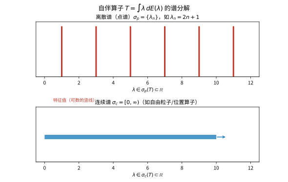

# 第 33 级：谱理论 (Spectral Theory)

> 谱理论是泛函分析的核心分支之一，它将线性代数中的特征值与特征向量理论推广到无穷维空间上的算子。谱理论不仅是量子力学的数学基石，也是微分方程、积分方程和调和分析等领域的重要工具。本章系统介绍谱的基本概念、谱半径公式、紧算子与自伴算子的谱理论、无界算子理论以及谱分解定理。

---

## 1. 学习目标

1. 理解谱、预解集、预解算子的基本概念，掌握点谱、连续谱、剩余谱的分类与判别。
2. 掌握谱半径的定义与 Gelfand 公式，理解其证明思路。
3. 深入理解 Riesz-Schauder 理论，掌握紧算子谱的结构与 Fredholm 择一性。
4. 掌握自伴算子的谱定理，理解谱测度与谱积分（函数演算）的构造。
5. 了解无界算子、闭算子、对称算子与自伴算子的基本理论。
6. 理解谱分解定理与 Stone 定理（单参数酉群）。
7. 了解谱理论在量子力学和微分方程中的典型应用。
8. 能够通过具体示例计算简单算子的谱，并解决相关习题。

---

## 2. 谱的基本概念

### 2.1 有界线性算子

设 $X$ 是复 Banach 空间，$T: X \to X$ 是有界线性算子。记 $\mathcal{B}(X)$ 为 $X$ 上所有有界线性算子的集合，其范数为算子范数：

$$
\|T\| = \sup_{\|x\|=1} \|Tx\|.
$$

### 2.2 谱与预解集

**定义 2.1**（预解集与谱）设 $T \in \mathcal{B}(X)$。定义：

- **预解集**（resolvent set）：
  $$
  \rho(T) = \{\lambda \in \mathbb{C} \mid \lambda I - T \text{ 在 } \mathcal{B}(X) \text{ 中可逆}\}.
  $$

- **谱**（spectrum）：
  $$
  \sigma(T) = \mathbb{C} \setminus \rho(T).
  $$

- **预解算子**（resolvent operator）：
  $$
  R_\lambda(T) = (\lambda I - T)^{-1}, \quad \lambda \in \rho(T).
  $$

**性质 2.2** 预解集 $\rho(T)$ 是 $\mathbb{C}$ 中的开集，谱 $\sigma(T)$ 是紧集。

**性质 2.3**（第一预解恒等式）对 $\lambda, \mu \in \rho(T)$，
$$
R_\lambda(T) - R_\mu(T) = (\mu - \lambda) R_\lambda(T) R_\mu(T).
$$

**性质 2.4** 谱半径 $\sigma(T)$ 非空（这是复 Banach 空间上算子的重要性质，而在实 Banach 空间上不一定成立）。

### 2.3 谱的分类

谱可细分为以下三类互不相交的部分：

**定义 2.5**（谱的分类）设 $T \in \mathcal{B}(X)$。

1. **点谱**（point spectrum）：
   $$
   \sigma_p(T) = \{\lambda \in \mathbb{C} \mid \ker(\lambda I - T) \neq \{0\}\}.
   $$
   即 $\lambda$ 是 $T$ 的**特征值**，存在非零向量 $x \in X$ 使得 $Tx = \lambda x$。

2. **连续谱**（continuous spectrum）：
   $$
   \sigma_c(T) = \{\lambda \in \mathbb{C} \mid \ker(\lambda I - T) = \{0\},\ \overline{\operatorname{ran}(\lambda I - T)} = X,\ \text{但 } (\lambda I - T)^{-1} \text{ 无界}\}.
   $$

3. **剩余谱**（residual spectrum）：
   $$
   \sigma_r(T) = \{\lambda \in \mathbb{C} \mid \ker(\lambda I - T) = \{0\},\ \overline{\operatorname{ran}(\lambda I - T)} \neq X\}.
   $$

显然 $\sigma(T) = \sigma_p(T) \cup \sigma_c(T) \cup \sigma_r(T)$，且三部分互不相交。

### 2.4 示例

**例 2.6**（有限维空间）设 $X = \mathbb{C}^n$，$T$ 是 $n \times n$ 矩阵。则 $\sigma(T) = \sigma_p(T)$ 为特征值集合，连续谱和剩余谱均为空集。

**例 2.7**（移位算子）设 $X = \ell^2(\mathbb{N})$，定义右移位算子 $R: (x_1, x_2, x_3, \dots) \mapsto (0, x_1, x_2, \dots)$。则：
- $\sigma_p(R) = \varnothing$（因为 $Rx = \lambda x$ 意味着 $x_1 = 0$，进而 $x_n = 0$ 对所有 $n$ 成立）；
- $\sigma_c(R) = \{\lambda \in \mathbb{C} \mid |\lambda| = 1\}$；
- $\sigma_r(R) = \{\lambda \in \mathbb{C} \mid |\lambda| < 1\}$。

**例 2.8**（乘法算子）设 $X = L^2[0,1]$，定义乘法算子 $(Mf)(t) = t f(t)$。则：
- $\sigma_p(M) = \varnothing$（因为 $tf(t) = \lambda f(t)$ 几乎处处成立意味着 $f = 0$ 几乎处处）；
- $\sigma_c(M) = [0,1]$；
- $\sigma_r(M) = \varnothing$。

**例 2.9**（Volterra 积分算子）设 $X = C[0,1]$，定义
$$
(Tf)(x) = \int_0^x f(t)\,dt.
$$
则 $\sigma(T) = \{0\}$，且 $\sigma_p(T) = \varnothing$，$\sigma_c(T) = \varnothing$，$\sigma_r(T) = \{0\}$。

---

## 3. 谱半径

### 3.1 定义

**定义 3.1**（谱半径）设 $T \in \mathcal{B}(X)$。$T$ 的**谱半径**定义为
$$
r(T) = \sup\{|\lambda| \mid \lambda \in \sigma(T)\}.
$$

### 3.2 Gelfand 公式

**定理 3.2**（Gelfand 谱半径公式）对任意 $T \in \mathcal{B}(X)$，
$$
r(T) = \lim_{n \to \infty} \|T^n\|^{1/n} = \inf_{n \ge 1} \|T^n\|^{1/n}.
$$

**证明概要**：
1. 首先证明极限存在且等于下确界。令 $a_n = \ln \|T^n\|$，利用 $\|T^{m+n}\| \le \|T^m\|\|T^n\|$ 可得 $a_n$ 是次可加的，由 Fekete 引理知 $\lim_{n\to\infty} a_n/n = \inf_n a_n/n$ 存在。
2. 然后证明 $r(T) = \lim \|T^n\|^{1/n}$。
   - 对任意 $\lambda \in \sigma(T)$，由谱映射定理知 $\lambda^n \in \sigma(T^n)$，故 $|\lambda|^n \le \|T^n\|$，从而 $|\lambda| \le \liminf \|T^n\|^{1/n}$。因此 $r(T) \le \liminf \|T^n\|^{1/n}$。
   - 反过来，对任意 $\varepsilon > 0$，考虑算子 $(\lambda I - T)^{-1}$ 的 Laurent 展开，利用 Liouville 定理（或复分析中的 Liouville 型论证）可证明 $\limsup \|T^n\|^{1/n} \le r(T) + \varepsilon$。取 $\varepsilon \to 0^+$ 即得结论。∎

**推论 3.3** 谱半径满足以下性质：
1. $r(T) \le \|T\|$；
2. $r(\alpha T) = |\alpha| r(T)$，$\alpha \in \mathbb{C}$；
3. $r(T^k) = r(T)^k$，$k \in \mathbb{N}$；
4. 若 $T$ 是 Hilbert 空间上的正规算子，则 $r(T) = \|T\|$。

**例 3.4**（严格上三角矩阵）设 $T$ 是 $\mathbb{C}^n$ 上的严格上三角矩阵（对角元全为零），则 $T^n = 0$，故 $\|T^n\|^{1/n} = 0$，因此 $r(T) = 0$。这与 $\sigma(T) = \{0\}$ 一致。

**例 3.5**（Volterra 算子）对 $L^2[0,1]$ 上的 Volterra 积分算子
$$
(Tf)(x) = \int_0^x f(t)\,dt,
$$
可证明 $\|T^n\| \le 1/n!$，故 $r(T) = 0$。

---

## 4. 紧算子的谱

### 4.1 紧算子

**定义 4.1**（紧算子）设 $X, Y$ 是 Banach 空间。线性算子 $T: X \to Y$ 称为**紧算子**（compact operator），若它将 $X$ 中的有界集映射为 $Y$ 中的相对紧集（即闭包是紧的）。记 $\mathcal{K}(X,Y)$ 为所有紧算子构成的集合。

**等价定义**：$T$ 是紧算子当且仅当对任意有界序列 $\{x_n\} \subset X$，$\{Tx_n\}$ 有收敛子列。

**性质 4.2**：
1. 紧算子是有界算子。
2. 有限秩算子（值域有限维的算子）是紧算子。
3. 紧算子的极限（在算子范数下）仍是紧算子。
4. 紧算子的复合仍为紧算子。

### 4.2 Riesz-Schauder 理论

**定理 4.3**（Riesz-Schauder 定理）设 $X$ 是 Banach 空间，$T \in \mathcal{K}(X)$ 是紧算子。则：
1. $\sigma(T)$ 是至多可数集，且唯一的可能聚点是 $0$；
2. 每个非零 $\lambda \in \sigma(T)$ 都是特征值，且对应的特征空间 $\ker(\lambda I - T)$ 是有限维的；
3. 对每个非零 $\lambda \in \sigma(T)$，$\operatorname{ran}(\lambda I - T)$ 是闭的，且 $\operatorname{codim}\operatorname{ran}(\lambda I - T) = \dim \ker(\lambda I - T) < \infty$。

**证明思路**：
1. 利用紧算子的性质证明 $\ker(I - T)$ 是有限维的。
2. 证明 $\operatorname{ran}(I - T)$ 是闭的。
3. 证明 $\dim \ker(I - T) = \operatorname{codim}\operatorname{ran}(I - T)$（Riesz 指标理论）。
4. 对一般 $\lambda \neq 0$，通过缩放化为 $\lambda = 1$ 的情形。
5. 证明非零谱点只能是特征值，且无聚点非零。

### 4.3 Fredholm 择一性

**定理 4.4**（Fredholm 择一性）设 $T$ 是 Banach 空间 $X$ 上的紧算子，$\lambda \neq 0$。则以下二者恰居其一：
- 方程 $(\lambda I - T)x = y$ 对任意 $y \in X$ 有唯一解；
- 齐次方程 $(\lambda I - T)x = 0$ 有非平凡解（即 $\lambda$ 是特征值）。

换言之，$\lambda \neq 0$ 要么属于预解集，要么是特征值。

**例 4.5**（Fredholm 积分方程）考虑第二类 Fredholm 积分方程：
$$
f(x) - \lambda \int_a^b K(x,y) f(y)\,dy = g(x),
$$
其中 $K$ 是连续核（或 $L^2$ 核）。积分算子 $Tf(x) = \int_a^b K(x,y) f(y)\,dy$ 是紧算子。Fredholm 择一性保证了：对给定的 $\lambda$，要么解存在唯一，要么齐次方程有非平凡解。

### 4.4 Hilbert 空间上紧自伴算子的谱定理

**定理 4.6**（Hilbert-Schmidt 定理）设 $H$ 是 Hilbert 空间，$T: H \to H$ 是紧自伴算子（即 $T^* = T$ 且 $T$ 紧）。则存在 $H$ 的一组标准正交基 $\{e_n\}$ 和实数列 $\{\lambda_n\}$（特征值），使得：
1. $\lambda_n \to 0$（当 $n \to \infty$）；
2. $T e_n = \lambda_n e_n$ 对所有 $n$ 成立；
3. 对任意 $x \in H$，
   $$
   Tx = \sum_{n=1}^\infty \lambda_n \langle x, e_n \rangle e_n.
   $$

**证明概要**：
1. 首先证明紧自伴算子的谱（除零外）由特征值组成，且特征值均为实数。
2. 证明 $T$ 有非零特征值（若 $T \neq 0$）：考虑 $\|T\|$ 或 $-\|T\|$ 至少有一个是特征值。
3. 设 $\lambda_1$ 是绝对值最大的特征值，$e_1$ 是单位特征向量。令 $H_1 = \{e_1\}^\perp$，则 $T$ 限制在 $H_1$ 上仍是紧自伴算子。
4. 重复上述过程，得到特征值序列 $|\lambda_1| \ge |\lambda_2| \ge \cdots \ge 0$ 和对应的标准正交特征向量 $\{e_n\}$。
5. 若 $\lambda_n \not\to 0$，则存在子列 $\lambda_{n_k} \to \lambda \neq 0$，利用紧性导出矛盾。故 $\lambda_n \to 0$。
6. 对任意 $x \in H$，$x - \sum_{n=1}^N \langle x, e_n \rangle e_n$ 正交于所有 $e_1,\dots,e_N$，由上述论证知其范数在 $T$ 作用下趋于 $0$。∎

**例 4.7**（Laplace 算子的特征函数）设 $\Omega \subset \mathbb{R}^n$ 是有界区域。考虑 Laplace 算子 $-\Delta$ 在 Dirichlet 边界条件下的逆算子，它是 $L^2(\Omega)$ 上的紧自伴算子。因此 $-\Delta$ 存在可数无穷多个特征值
$$
0 < \lambda_1 \le \lambda_2 \le \cdots \to \infty,
$$
对应的特征函数 $\{u_n\}$ 构成 $L^2(\Omega)$ 的一组标准正交基。

> **直观理解（现实类比）**：紧算子的非零特征值像一段不断减半的琴弦：$\lambda=1,\frac12,\frac13,\dots$ 越来越密地"堆积"在 $0$ 附近，$0$ 是它们唯一的聚点。就像回音室里的声波，频率越高衰减越快，能量最终都挤向无限小的频率附近。正因为谱"收缩"到 $0$，紧算子才可以在无穷维空间里像有限维矩阵一样被对角化。

---

## 5. 自伴算子的谱

### 5.1 有界自伴算子

**定义 5.1**（自伴算子）设 $H$ 是 Hilbert 空间，$T \in \mathcal{B}(H)$。若 $T^* = T$（即 $\langle Tx, y \rangle = \langle x, Ty \rangle$ 对所有 $x,y \in H$ 成立），则称 $T$ 是**自伴算子**（self-adjoint operator）。

**性质 5.2** 自伴算子 $T$ 满足：
1. $\sigma(T) \subset \mathbb{R}$；
2. $\|T\| = \sup\{|\langle Tx, x\rangle| \mid \|x\| = 1\}$；
3. 若 $\lambda \in \mathbb{C} \setminus \mathbb{R}$，则 $\|(\lambda I - T)^{-1}\| \le 1/|\operatorname{Im}\lambda|$。

### 5.2 谱测度与谱积分

**定义 5.3**（谱测度）设 $H$ 是 Hilbert 空间，$(\Omega, \mathcal{F})$ 是可测空间。**谱测度**（spectral measure）是一个映射 $E: \mathcal{F} \to \mathcal{B}(H)$，满足：
1. 对每个 $\omega \in \mathcal{F}$，$E(\omega)$ 是正交投影；
2. $E(\varnothing) = 0$，$E(\Omega) = I$；
3. 可数可加性：若 $\{\omega_n\}$ 是互不相交的可测集，则
   $$
   E\left(\bigcup_{n=1}^\infty \omega_n\right) = \sum_{n=1}^\infty E(\omega_n),
   $$
   其中级数在强算子拓扑下收敛。

### 5.3 有界自伴算子的谱定理

**定理 5.4**（谱定理——有界自伴算子）设 $T \in \mathcal{B}(H)$ 是自伴算子。则存在唯一的谱测度 $E$ 定义在 $\mathbb{R}$ 的 Borel 集上，满足：
1. $T = \int_{\sigma(T)} \lambda \, dE(\lambda)$；
2. 对任意多项式 $p$，$p(T) = \int_{\sigma(T)} p(\lambda) \, dE(\lambda)$；
3. 对任意 Borel 集 $\omega$，$E(\omega)$ 与 $T$ 可交换；
4. $\operatorname{supp}(E) = \sigma(T)$。

该积分称为**谱积分**（spectral integral），在强算子拓扑下理解。

### 5.4 函数演算

**定义 5.5**（Borel 函数演算）设 $T$ 是有界自伴算子，$E$ 是其谱测度。对任意有界 Borel 函数 $f: \mathbb{R} \to \mathbb{C}$，定义
$$
f(T) = \int_{\sigma(T)} f(\lambda) \, dE(\lambda).
$$
则映射 $f \mapsto f(T)$ 满足：
1. $(af + bg)(T) = a f(T) + b g(T)$（线性）；
2. $(fg)(T) = f(T) g(T)$（乘法）；
3. $\overline{f}(T) = f(T)^*$（对合）；
4. $\|f(T)\| \le \sup_{\lambda \in \sigma(T)} |f(\lambda)|$（范数不等式）；
5. 若 $f_n \to f$ 逐点且有界，则 $f_n(T) \to f(T)$ 在强算子拓扑下收敛。

**例 5.6**（平方根）若 $T \ge 0$（即 $\langle Tx, x \rangle \ge 0$ 对所有 $x$ 成立），则存在唯一的 $S \ge 0$ 使得 $S^2 = T$。事实上，取 $f(\lambda) = \sqrt{\lambda}$，则 $S = f(T) = \int \sqrt{\lambda} \, dE(\lambda)$。

**例 5.7**（投影算子）若 $\omega \subset \mathbb{R}$ 是 Borel 集，则 $E(\omega) = \chi_\omega(T)$ 是正交投影，其中 $\chi_\omega$ 是 $\omega$ 的特征函数。

---

## 6. 无界算子

### 6.1 基本概念

**定义 6.1**（无界线性算子）设 $H$ 是 Hilbert 空间。**无界线性算子** $T$ 是指定义在某个稠密子空间 $\mathcal{D}(T) \subset H$ 上的线性映射 $T: \mathcal{D}(T) \to H$。$\mathcal{D}(T)$ 称为 $T$ 的**定义域**（domain）。

**定义 6.2**（图与闭算子）$T$ 的**图**（graph）定义为
$$
G(T) = \{(x, Tx) \mid x \in \mathcal{D}(T)\} \subset H \times H.
$$
若 $G(T)$ 在 $H \times H$ 中是闭的，则称 $T$ 是**闭算子**（closed operator）。

**定理 6.3**（闭图像定理）若 $T$ 是定义在整个 $H$ 上的闭算子，则 $T$ 是有界的。

### 6.2 对称算子与自伴算子

**定义 6.4**（对称算子）设 $T$ 是 $\mathcal{D}(T) \subset H$ 上的稠定线性算子。若
$$
\langle Tx, y \rangle = \langle x, Ty \rangle \quad \forall x, y \in \mathcal{D}(T),
$$
则称 $T$ 是**对称算子**（symmetric operator）。

**定义 6.5**（自伴算子）对称算子 $T$ 称为**自伴的**（self-adjoint），若 $\mathcal{D}(T) = \mathcal{D}(T^*)$ 且 $T = T^*$。这里 $T^*$ 是 $T$ 的伴随算子，其定义域为
$$
\mathcal{D}(T^*) = \{y \in H \mid \exists z \in H, \forall x \in \mathcal{D}(T): \langle Tx, y \rangle = \langle x, z \rangle\}.
$$

**重要区别**：对于无界算子，对称与自伴不是等价的。自伴性要求 $\mathcal{D}(T) = \mathcal{D}(T^*)$，这比对称性严格得多。

**例 6.6**（动量算子）在 $H = L^2(\mathbb{R})$ 上，定义动量算子
$$
(p f)(x) = -i \frac{df}{dx}, \quad \mathcal{D}(p) = \{f \in L^2(\mathbb{R}) \mid f' \in L^2(\mathbb{R})\}.
$$
$p$ 是自伴算子。

**例 6.7**（位置算子）在 $H = L^2(\mathbb{R})$ 上，定义位置算子
$$
(Q f)(x) = x f(x), \quad \mathcal{D}(Q) = \{f \in L^2(\mathbb{R}) \mid \int_{\mathbb{R}} x^2 |f(x)|^2\,dx < \infty\}.
$$
$Q$ 是自伴算子，其谱 $\sigma(Q) = \mathbb{R}$（连续谱）。

### 6.3 无界自伴算子的谱定理

**定理 6.8**（无界自伴算子的谱定理）设 $T$ 是 Hilbert 空间 $H$ 上的（无界）自伴算子。则存在唯一的谱测度 $E$ 定义在 $\mathbb{R}$ 的 Borel 集上，使得
$$
T = \int_{\mathbb{R}} \lambda \, dE(\lambda),
$$
且 $T$ 的定义域为
$$
\mathcal{D}(T) = \left\{x \in H \mid \int_{\mathbb{R}} \lambda^2 \, d\|E(\lambda)x\|^2 < \infty\right\}.
$$

### 6.4 本质谱

**定义 6.9**（本质谱）设 $T$ 是 Hilbert 空间上的自伴算子。$T$ 的**本质谱**（essential spectrum）$\sigma_{\text{ess}}(T)$ 定义为 $\sigma(T)$ 中所有非孤立点或孤立但对应特征空间无穷维的点。

更具体地，$\lambda \in \sigma_{\text{ess}}(T)$ 当且仅当存在正交序列 $\{x_n\}$ 使得 $\|x_n\| = 1$ 且 $(T - \lambda I)x_n \to 0$（Weyl 准则）。

**性质 6.10** 本质谱对紧扰动是稳定的：若 $T$ 是自伴算子，$K$ 是紧自伴算子，则
$$
\sigma_{\text{ess}}(T + K) = \sigma_{\text{ess}}(T).
$$

---

## 7. 谱分解

### 7.1 谱分解定理

**定理 7.1**（谱分解）设 $T$ 是 Hilbert 空间 $H$ 上的有界自伴算子。则存在谱测度 $E$ 使得 $T$ 可表示为
$$
T = \int_{\sigma(T)} \lambda \, dE(\lambda).
$$
对任意 $x, y \in H$，
$$
\langle Tx, y \rangle = \int_{\sigma(T)} \lambda \, d\langle E(\lambda)x, y \rangle.
$$

分解的直观意义：谱测度 $E$ 将空间 $H$ 分解为 $T$ 的"广义特征空间"的正交直和，每个 $\lambda$ 对应的"分量"由 $E(\{\lambda\})$ 给出（当 $\lambda$ 是特征值时，$E(\{\lambda\})$ 就是到特征空间的正交投影）。

> **直观理解（现实类比）**：自伴算子的谱就像一根"能量标尺"。离散谱（如谐振子 $\{1,3,5,\dots\}$）像钢琴上离散的琴键，只能弹出固定的音高；连续谱（如 $[0,\infty)$）像小提琴的滑音，音高连续可变。谱分解 $T=\int_{\sigma(T)}\lambda\,dE(\lambda)$ 相当于把算子沿这根标尺的每个刻度"拆解"成一个个小投影，就像把一根琴弦在不同位置逐段剪开，每段对应一个谱分量。

### 7.2 Stone 定理

**定理 7.2**（Stone 定理）设 $\{U(t)\}_{t \in \mathbb{R}}$ 是 Hilbert 空间 $H$ 上的强连续单参数酉群，即：
1. 每个 $U(t)$ 是酉算子；
2. $U(t+s) = U(t)U(s)$ 对所有 $t, s \in \mathbb{R}$ 成立；
3. 对任意 $x \in H$，$t \mapsto U(t)x$ 是连续的。

则存在唯一的自伴算子 $A$（可能无界）使得
$$
U(t) = e^{itA}, \quad t \in \mathbb{R}.
$$
确切地说，$A$ 的定义域为
$$
\mathcal{D}(A) = \left\{x \in H \mid \lim_{t \to 0} \frac{U(t)x - x}{t} \text{ 存在}\right\},
$$
且 $A x = -i \lim_{t \to 0} \frac{U(t)x - x}{t}$。

反之，若 $A$ 是自伴算子，则 $U(t) = e^{itA}$ 定义了一个强连续单参数酉群。

**证明概要**：由谱定理，对自伴算子 $A$ 有谱分解 $A = \int \lambda \, dE(\lambda)$。定义
$$
U(t) = e^{itA} = \int_{\mathbb{R}} e^{it\lambda} \, dE(\lambda),
$$
容易验证 $\{U(t)\}$ 是强连续单参数酉群。反之，给定 $\{U(t)\}$，定义 $A$ 为无穷小生成元，利用 Stone 定理证明 $A$ 是自伴的。

**例 7.3**（Schrödinger 演化）量子力学中，Schrödinger 方程 $i\hbar \frac{\partial}{\partial t}\psi = H\psi$ 的解为 $\psi(t) = e^{-itH/\hbar}\psi_0$，其中 $H$ 是 Hamilton 量（自伴算子）。Stone 定理保证了 $\{e^{-itH/\hbar}\}$ 是一个酉群，从而演化保持概率守恒。

---

## 8. 应用

### 8.1 量子力学中的应用

谱理论是量子力学的数学语言。量子力学的基本假设可表述为：

1. **可观测量**：每个物理可观测量对应一个 Hilbert 空间上的自伴算子。例如，位置算子 $Q$、动量算子 $P$、能量算子（Hamiltonian）$H$。

2. **状态**：系统的状态由单位向量 $\psi \in H$（或更一般地，密度算子）描述。

3. **测量结果**：测量可观测量 $A$ 时，可能得到的结果是 $\sigma(A)$ 中的值。测量得到 $\lambda$ 的概率取决于谱测度 $E_A$：
   - 若 $\lambda$ 是 $A$ 的特征值（离散谱），测量到 $\lambda$ 的概率为 $\|E_A(\{\lambda\})\psi\|^2$；
   - 若 $\lambda$ 在连续谱中，概率密度由 $d\|E_A(\lambda)\psi\|^2$ 给出。

4. **时间演化**：由 Schrödinger 方程 $i\hbar \frac{d}{dt}\psi = H\psi$ 描述，解为 $\psi(t) = e^{-itH/\hbar}\psi(0)$，其中 $e^{-itH/\hbar}$ 由 Stone 定理保证是酉算子。

**例 8.1**（谐振子）一维谐振子的 Hamiltonian 为
$$
H = -\frac{\hbar^2}{2m}\frac{d^2}{dx^2} + \frac{1}{2}m\omega^2 x^2,
$$
其谱为离散谱 $\sigma(H) = \{\hbar\omega(n + 1/2) \mid n = 0, 1, 2, \dots\}$。

**例 8.2**（自由粒子）自由粒子 Hamiltonian $H = -\frac{\hbar^2}{2m}\Delta$ 在 $L^2(\mathbb{R}^3)$ 上具有连续谱 $\sigma(H) = [0, \infty)$。

### 8.2 微分方程中的应用

**例 8.3**（Sturm-Liouville 问题）考虑 Sturm-Liouville 问题
$$
-\frac{d}{dx}\left(p(x)\frac{dy}{dx}\right) + q(x)y = \lambda w(x)y, \quad x \in (a,b),
$$
带适当的边界条件。在适当的 Hilbert 空间中，该问题对应一个自伴算子。谱理论表明：
- 若区间有界且系数足够光滑，则谱是离散的，特征值 $\lambda_n \to \infty$；
- 若区间无界，则可能出现连续谱。

**例 8.4**（亥姆霍兹方程）亥姆霍兹方程 $-\Delta u = \lambda u$ 在 $\mathbb{R}^n$ 上的谱是 $\sigma(-\Delta) = [0, \infty)$（连续谱）。在有界区域带 Dirichlet 边界条件时，谱是离散的，特征值 $\lambda_n \to \infty$。

---

## 9. 示例

### 示例 1：计算矩阵的谱

计算矩阵 $A = \begin{pmatrix} 2 & 1 \\ 1 & 2 \end{pmatrix}$ 的谱、谱半径及预解算子。

**解**：特征多项式为 $\det(\lambda I - A) = (\lambda-2)^2 - 1 = \lambda^2 - 4\lambda + 3$，特征值为 $\lambda_1 = 1, \lambda_2 = 3$。故
$$
\sigma(A) = \{1, 3\}, \quad r(A) = 3.
$$
预解算子为 $R_\lambda(A) = (\lambda I - A)^{-1}$，当 $\lambda \neq 1, 3$ 时，
$$
R_\lambda(A) = \frac{1}{(\lambda-1)(\lambda-3)} \begin{pmatrix} \lambda-2 & 1 \\ 1 & \lambda-2 \end{pmatrix}.
$$

### 示例 2：乘法算子的谱

在 $L^2[0,1]$ 上定义 $(Tf)(x) = x^2 f(x)$。求 $\sigma(T)$、$\sigma_p(T)$、$\sigma_c(T)$、$\sigma_r(T)$ 及谱半径。

**解**：$T$ 是自伴算子（因为 $(x^2)^* = x^2$）。谱为 $\sigma(T) = \overline{\{x^2 \mid x \in [0,1]\}} = [0,1]$。

- 点谱：$\sigma_p(T) = \varnothing$。因为若 $x^2 f(x) = \lambda f(x)$ 几乎处处成立，则对几乎处处的 $x$，$(x^2 - \lambda)f(x) = 0$。若 $f$ 非零，则 $f$ 只能在 $x = \sqrt{\lambda}$ 处非零，但单点集测度为 0，故 $f = 0$ 几乎处处。
- 连续谱：$\sigma_c(T) = [0,1]$。因为对 $\lambda \in [0,1]$，$\ker(\lambda I - T) = \{0\}$，且值域 $\operatorname{ran}(\lambda I - T)$ 在 $L^2[0,1]$ 中稠密，但逆算子无界。
- 剩余谱：$\sigma_r(T) = \varnothing$（因为自伴算子无剩余谱）。

谱半径：$r(T) = \sup\{|\lambda| \mid \lambda \in [0,1]\} = 1$。同时，$\|T\| = \sup_{x \in [0,1]} |x^2| = 1$，$r(T) = \|T\|$（因为 $T$ 是自伴的）。

### 示例 3：移位算子的谱

在 $\ell^2(\mathbb{N})$ 上定义右移位算子 $R$：
$$
R(x_1, x_2, x_3, \dots) = (0, x_1, x_2, \dots).
$$
求 $\sigma(R)$ 及各类谱。

**解**：
- 点谱：若 $Rx = \lambda x$，则 $x_2 = \lambda x_1$，$x_3 = \lambda x_2 = \lambda^2 x_1$，…，且 $0 = \lambda x_1$。若 $\lambda \neq 0$，则 $x_1 = 0$，进而 $x_n = 0$ 对所有 $n$ 成立。若 $\lambda = 0$，则 $Rx = 0$ 意味着 $x_1 = 0$，但 $x_2, x_3, \dots$ 任意，然而 $Rx = 0$ 意味着 $(0, x_1, x_2, \dots) = (0,0,0,\dots)$，故 $x_n = 0$ 对所有 $n$ 成立。因此 $\sigma_p(R) = \varnothing$。

- 谱：$\|R\| = 1$，故 $r(R) \le 1$。可以证明 $\sigma(R) = \{\lambda \in \mathbb{C} \mid |\lambda| \le 1\}$（闭单位圆盘）。

- 连续谱：$\sigma_c(R) = \{\lambda \in \mathbb{C} \mid |\lambda| = 1\}$。

- 剩余谱：$\sigma_r(R) = \{\lambda \in \mathbb{C} \mid |\lambda| < 1\}$。

### 示例 4：紧算子的谱分解

在 $L^2[0,1]$ 上定义积分算子
$$
(Tf)(x) = \int_0^1 \min(x,y) f(y)\,dy.
$$
证明 $T$ 是紧自伴算子，并求其特征值和特征函数。

**解**：核 $K(x,y) = \min(x,y)$ 是对称的（$K(x,y) = K(y,x)$）且平方可积，故 $T$ 是 Hilbert-Schmidt 算子，从而是紧自伴算子。

考虑特征方程 $Tf = \lambda f$：
$$
\int_0^1 \min(x,y) f(y)\,dy = \lambda f(x).
$$
即
$$
\int_0^x y f(y)\,dy + x \int_x^1 f(y)\,dy = \lambda f(x).
$$
两边对 $x$ 求导得：
$$
x f(x) + \int_x^1 f(y)\,dy - x f(x) = \lambda f'(x),
$$
即 $\int_x^1 f(y)\,dy = \lambda f'(x)$。再求导得 $-f(x) = \lambda f''(x)$，即
$$
f''(x) + \frac{1}{\lambda} f(x) = 0.
$$
由边界条件 $f(0) = 0$（由原方程代入 $x=0$ 得）和 $f'(1) = 0$（由 $\int_1^1 f(y)\,dy = \lambda f'(1)$ 得），解得
$$
\lambda_n = \frac{1}{(n + \frac{1}{2})^2 \pi^2}, \quad f_n(x) = \sqrt{2} \sin\left(\left(n + \frac{1}{2}\right)\pi x\right), \quad n = 0, 1, 2, \dots
$$

### 示例 5：无界算子的谱

在 $L^2(\mathbb{R})$ 上定义算子 $Tf = -f'' + x^2 f$（量子谐振子）。求 $T$ 的谱。

**解**：$T$ 是自伴算子（在适当的 Sobolev 空间定义域上）。其特征方程为
$$
-f'' + x^2 f = \lambda f.
$$
这是量子谐振子的定态 Schrödinger 方程，特征值为
$$
\lambda_n = 2n + 1, \quad n = 0, 1, 2, \dots
$$
对应的特征函数为 Hermite 函数：
$$
f_n(x) = \frac{1}{\sqrt{2^n n! \sqrt{\pi}}} H_n(x) e^{-x^2/2},
$$
其中 $H_n$ 是 Hermite 多项式。谱为 $\sigma(T) = \{1, 3, 5, \dots\}$（纯离散谱）。

---

## 10. 习题

### 基础题

1. 设 $A \in \mathcal{B}(X)$ 满足 $A^2 = A$（幂等算子）。求 $\sigma(A)$，并证明 $A$ 的谱仅由 $0$ 和 $1$ 组成（可能只有其中之一）。

2. 在 $L^2[0,1]$ 上定义乘法算子 $(Mf)(x) = e^x f(x)$。求 $\sigma(M)$、$\sigma_p(M)$、$\sigma_c(M)$、$\sigma_r(M)$ 及谱半径。

3. 证明：对有界线性算子 $T$，$r(T) = \lim_{n\to\infty} \|T^n\|^{1/n}$ 中的极限存在。

4. 设 $T$ 是 Hilbert 空间上的自伴算子。证明：
   - $\sigma(T) \subset \mathbb{R}$；
   - 若 $\lambda \notin \mathbb{R}$，则 $\|(\lambda I - T)^{-1}\| \le 1/|\operatorname{Im}\lambda|$。

### 提高题

5. 在 $\ell^2(\mathbb{Z})$ 上定义双边移位算子 $S$：
   $$
   (Sx)_n = x_{n-1}, \quad n \in \mathbb{Z}.
   $$
   求 $\sigma(S)$、$\sigma_p(S)$、$\sigma_c(S)$ 和 $\sigma_r(S)$。

6. 设 $T$ 是 Banach 空间 $X$ 上的紧算子，$\lambda \neq 0$。证明：
   - $\dim \ker(\lambda I - T) < \infty$；
   - $\operatorname{ran}(\lambda I - T)$ 是闭的。

7. 设 $T$ 是 Hilbert 空间 $H$ 上的紧自伴算子。证明：
   $$
   \|T\| = \max\{|\lambda| \mid \lambda \in \sigma(T)\}.
   $$

8. 在 $L^2[0,1]$ 上定义 Volterra 算子
   $$
   (Vf)(x) = \int_0^x f(t)\,dt.
   证明 $V$ 是紧算子，$\sigma(V) = \{0\}$，且 $V$ 没有非零特征值。

### 挑战题

9. 设 $H = L^2(\mathbb{R})$，$T$ 是乘以函数 $f(x) = \frac{1}{1+x^2}$ 的乘法算子。求 $\sigma(T)$ 并分类谱的类型。

10. 证明 Stone 定理：若 $\{U(t)\}_{t\in\mathbb{R}}$ 是强连续单参数酉群，则存在唯一的自伴算子 $A$ 使 $U(t) = e^{itA}$。

11. 考虑 $L^2(0,1)$ 上的算子 $Tf = -f''$，定义域为
    $$
    \mathcal{D}(T) = \{f \in H^2(0,1) \cap H_0^1(0,1)\}.
    $$
    证明 $T$ 是自伴算子，并求其谱。

12. 设 $H$ 是 Hilbert 空间，$T$ 是 $H$ 上的有界自伴算子，$E$ 是其谱测度。对任意 Borel 集 $\omega \subset \mathbb{R}$，证明 $E(\omega)$ 是正交投影，且 $E(\omega)T = T E(\omega)$。

---

## 11. 总结

谱理论是泛函分析中最为深刻和富有成果的理论之一，它将有限维线性代数中的特征值理论推广到了无穷维空间，并在此过程中发展出了极为丰富的数学结构。

### 核心概念回顾

| 概念 | 定义 | 备注 |
|:---|------|------|
| 预解集 $\rho(T)$ | $\lambda I - T$ 可逆的 $\lambda$ 集合 | 开集 |
| 谱 $\sigma(T)$ | $\mathbb{C} \setminus \rho(T)$ | 非空紧集 |
| 点谱 $\sigma_p(T)$ | $\ker(\lambda I - T) \neq \{0\}$ | 特征值 |
| 连续谱 $\sigma_c(T)$ | 逆存在但无界，值域稠密 | 自伴算子常见 |
| 剩余谱 $\sigma_r(T)$ | 逆存在，值域不稠密 | 自伴算子无 |
| 谱半径 $r(T)$ | $\sup\{|\lambda| \mid \lambda \in \sigma(T)\}$ | Gelfand 公式 |
| 谱测度 $E$ | 正交投影值测度 | 谱分解核心 |

### 主要定理

1. **Gelfand 谱半径公式**：$r(T) = \lim_{n\to\infty} \|T^n\|^{1/n}$。
2. **Riesz-Schauder 定理**：紧算子的非零谱点均为特征值，特征空间有限维，0 是唯一可能的聚点。
3. **Fredholm 择一性**：对紧算子 $T$ 和 $\lambda \neq 0$，要么 $(\lambda I - T)$ 可逆，要么 $\lambda$ 是特征值。
4. **Hilbert-Schmidt 定理**：紧自伴算子可对角化，存在标准正交基由特征向量构成。
5. **谱定理**：自伴算子可表示为谱积分 $T = \int \lambda \, dE(\lambda)$，由此可建立 Borel 函数演算。
6. **Stone 定理**：强连续单参数酉群与自伴算子一一对应 $U(t) = e^{itA}$。

### 内在联系

谱理论各分支之间存在深刻的内在联系：

- **紧算子谱理论**是 Riesz-Schauder 理论的核心，揭示了紧算子与有限维算子的相似性。
- **自伴算子谱定理**是谱理论的顶峰，它使得我们可以像处理可测函数一样处理自伴算子。
- **无界算子理论**将谱定理推广到量子力学中常见的微分算子，如 Schrödinger 算子。
- **Stone 定理**将谱定理与酉群的无穷小生成元联系起来，是量子力学时间演化的数学基础。

### 学习路径

学习谱理论之前，建议先掌握：
- 泛函分析基础（Banach 空间、Hilbert 空间、有界线性算子）
- 复分析（解析函数、Cauchy 积分公式、Liouville 定理）
- 实分析（测度论、积分理论）

进一步学习的方向包括：
- C*-代数与 von Neumann 代数
- 散射理论
- 非交换几何
- 随机矩阵的谱理论

> 谱理论不仅是一个数学分支，更是连接纯数学与应用数学的桥梁——从量子力学到信号处理，从微分方程到数据科学，谱方法无处不在。掌握谱理论，就掌握了理解无穷维线性世界的钥匙。