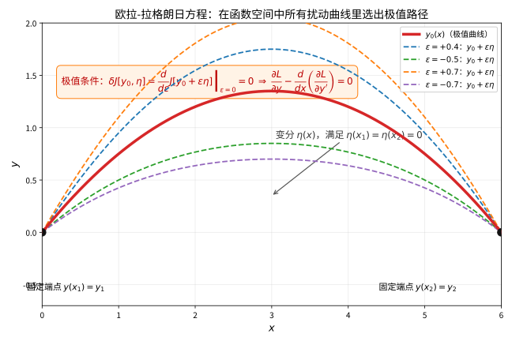

# 第 35 级：变分法 (Calculus of Variations)

> 变分法是数学分析中的一个分支，它通过研究函数与泛函的微小变分，来求解泛函的极值问题。变分法在理论物理（拉格朗日力学、最小作用量原理）、微分几何（测地线、极小曲面）、最优控制理论以及有限元方法中均有深刻而广泛的应用。

---

## 1. 学习目标

1. 理解泛函、变分、一阶变分等基本概念，掌握变分法的基本思想。
2. 掌握 Euler-Lagrange 方程的推导过程（含严格证明），并能熟练应用于各类变分问题。
3. 理解变分法基本引理及其证明。
4. 掌握泛函极值的必要条件与充分条件（Legendre 条件、Jacobi 条件）。
5. 能处理含高阶导数、多自变量、多未知函数的泛函极值问题。
6. 掌握 Lagrange 乘子法在变分问题中的应用（等周问题、完整约束）。
7. 理解 Legendre 变换与 Hamilton 力学的基本框架，掌握 Hamilton 正则方程。
8. 理解 Noether 定理及其证明，掌握对称性与守恒律的关系。
9. 了解变分问题的直接方法（Ritz 法、Galerkin 法）的基本思想。
10. 能独立求解最速降线、悬链线、测地线、极小曲面等经典变分问题。

---

## 2. 基本概念

### 2.1 泛函的定义

**定义 2.1**（泛函）设 $C$ 是某类函数组成的集合（称为**容许函数类**）。若对每个 $y \in C$，都有一个实数 $J[y]$ 与之对应，则称 $J$ 是定义在 $C$ 上的一个**泛函**（functional）。

**例 2.1** 平面上连接两点 $(x_1, y_1)$ 和 $(x_2, y_2)$ 的光滑曲线 $y = y(x)$ 的弧长为：

$$
J[y] = \int_{x_1}^{x_2} \sqrt{1 + [y'(x)]^2} \, dx
$$

这是一个典型的泛函。

**例 2.2** 在重力场中，质点沿曲线 $y = y(x)$ 从 $(0,0)$ 滑到 $(x_1, y_1)$ 所需的时间为：

$$
J[y] = \int_0^{x_1} \sqrt{\frac{1 + [y'(x)]^2}{2g y(x)}} \, dx
$$

这就是最速降线问题的泛函形式。

### 2.2 变分与一阶变分

**定义 2.2**（变分）设 $y_0(x)$ 是泛函 $J[y]$ 的定义域中的一条曲线。考虑曲线 $y(x) = y_0(x) + \epsilon \eta(x)$，其中 $\eta(x)$ 是满足边界条件 $\eta(x_1) = \eta(x_2) = 0$ 的光滑函数，$\epsilon$ 是小参数。称 $\delta y = \epsilon \eta(x)$ 为 $y_0$ 的**变分**。

**定义 2.3**（一阶变分）泛函 $J[y]$ 在 $y_0$ 处的**一阶变分**定义为：

$$
\delta J[y_0, \eta] = \left. \frac{d}{d\epsilon} J[y_0 + \epsilon \eta] \right|_{\epsilon = 0}
$$

**定义 2.4**（极值）若存在 $\delta > 0$，使得对任意满足 $\|y - y_0\| < \delta$ 的容许函数 $y$，都有 $J[y] \geq J[y_0]$（或 $J[y] \leq J[y_0]$），则称 $y_0$ 是泛函 $J$ 的**局部极小值**（或**局部极大值**），统称为**极值**（extremum）。

**定理 2.1**（极值的必要条件）若 $y_0$ 是泛函 $J[y]$ 的极值，则对任意边界为零的 $\eta(x)$，有 $\delta J[y_0, \eta] = 0$。

### 2.3 Euler-Lagrange 方程的推导

考虑标准形式的泛函：

$$
J[y] = \int_{x_1}^{x_2} L(x, y, y') \, dx
$$

其中 $L(x, y, y')$ 称为**拉格朗日量**（Lagrangian），$y(x)$ 满足边界条件 $y(x_1) = y_1$，$y(x_2) = y_2$。

设 $y_0(x)$ 是极值，考虑 $y(x) = y_0(x) + \epsilon \eta(x)$，其中 $\eta(x_1) = \eta(x_2) = 0$。则：

$$
J[\epsilon] = \int_{x_1}^{x_2} L(x, y_0 + \epsilon\eta, y_0' + \epsilon\eta') \, dx
$$

对 $\epsilon$ 求导并在 $\epsilon = 0$ 处取值：

$$
\left. \frac{dJ}{d\epsilon} \right|_{\epsilon=0} = \int_{x_1}^{x_2} \left[ \frac{\partial L}{\partial y} \eta + \frac{\partial L}{\partial y'} \eta' \right] dx = 0
$$

对第二项使用分部积分：

$$
\int_{x_1}^{x_2} \frac{\partial L}{\partial y'} \eta' \, dx = \left[ \frac{\partial L}{\partial y'} \eta \right]_{x_1}^{x_2} - \int_{x_1}^{x_2} \frac{d}{dx} \left( \frac{\partial L}{\partial y'} \right) \eta \, dx
$$

由于 $\eta(x_1) = \eta(x_2) = 0$，边界项为零，代入得：

$$
\int_{x_1}^{x_2} \left[ \frac{\partial L}{\partial y} - \frac{d}{dx} \left( \frac{\partial L}{\partial y'} \right) \right] \eta(x) \, dx = 0
$$

由变分法基本引理（见第 3 节），可得：

**定理 2.2**（Euler-Lagrange 方程）若 $y_0(x)$ 是泛函 $J[y] = \int_{x_1}^{x_2} L(x, y, y') dx$ 的极值，则 $y_0$ 必满足：

$$
\boxed{\frac{\partial L}{\partial y} - \frac{d}{dx} \left( \frac{\partial L}{\partial y'} \right) = 0}
$$

这称为 **Euler-Lagrange 方程**（欧拉-拉格朗日方程），是变分法中最基本的方程。

> **直观理解（现实类比）**：想象从山顶到山脚铺设一条滑雪道，你可以在无数条可能的路线中任选一条。欧拉-拉格朗日方程就像"在头脑里把每条候选路线轻轻拨动一下，再看下滑时间是否变化"——如果怎么拨动时间都不变，这条线就是极值路径。就像用两根手指轻轻晃动一根两端固定的绳子，看它往哪个方向"松弛"到最省力的位置。

### 2.4 Euler-Lagrange 方程的首次积分

当拉格朗日量 $L$ 不显含自变量 $x$ 时（即 $L = L(y, y')$），Euler-Lagrange 方程可简化为首次积分。

由 Euler-Lagrange 方程：

$$
\frac{d}{dx} \left( \frac{\partial L}{\partial y'} \right) = \frac{\partial L}{\partial y}
$$

计算 $\frac{d}{dx} \left( y' \frac{\partial L}{\partial y'} - L \right)$：

$$
\begin{aligned}
\frac{d}{dx} \left( y' \frac{\partial L}{\partial y'} - L \right) &= y'' \frac{\partial L}{\partial y'} + y' \frac{d}{dx} \left( \frac{\partial L}{\partial y'} \right) - \frac{\partial L}{\partial y} y' - \frac{\partial L}{\partial y'} y'' \\
&= y' \left[ \frac{d}{dx} \left( \frac{\partial L}{\partial y'} \right) - \frac{\partial L}{\partial y} \right] = 0
\end{aligned}
$$

因此得到 **Beltrami 恒等式**：

$$
\boxed{y' \frac{\partial L}{\partial y'} - L = \text{常数}}
$$

---

## 3. 变分法的基本引理

### 3.1 基本引理及其证明

**引理 3.1**（变分法基本引理）设 $f(x)$ 在 $[x_1, x_2]$ 上连续。若对任意在 $[x_1, x_2]$ 上具有连续导数且满足 $\eta(x_1) = \eta(x_2) = 0$ 的函数 $\eta(x)$，都有

$$
\int_{x_1}^{x_2} f(x) \eta(x) \, dx = 0
$$

则 $f(x) \equiv 0$ 在 $[x_1, x_2]$ 上恒成立。

**证明**：反证法。假设存在 $x_0 \in (x_1, x_2)$ 使得 $f(x_0) \neq 0$。不妨设 $f(x_0) > 0$。由连续性，存在 $\delta > 0$，使得在区间 $[x_0 - \delta, x_0 + \delta] \subset (x_1, x_2)$ 上，$f(x) \geq \frac{f(x_0)}{2} > 0$。

构造如下函数 $\eta(x)$：

$$
\eta(x) = \begin{cases}
(x - (x_0 - \delta))^2 (x - (x_0 + \delta))^2, & x \in [x_0 - \delta, x_0 + \delta] \\
0, & \text{其他}
\end{cases}
$$

易验证 $\eta(x)$ 在 $[x_1, x_2]$ 上连续可导，且 $\eta(x_1) = \eta(x_2) = 0$。于是：

$$
\int_{x_1}^{x_2} f(x) \eta(x) \, dx = \int_{x_0 - \delta}^{x_0 + \delta} f(x) \eta(x) \, dx \geq \frac{f(x_0)}{2} \int_{x_0 - \delta}^{x_0 + \delta} \eta(x) \, dx > 0
$$

这与假设矛盾。因此 $f(x) \equiv 0$。$\square$

### 3.2 推广形式

**引理 3.2**（Du Bois-Reymond 引理）设 $f(x) \in C[a,b]$。若对任意满足 $\eta(a) = \eta(b) = 0$ 的 $\eta \in C^1[a,b]$，有 $\int_a^b f(x) \eta'(x) dx = 0$，则 $f(x)$ 在 $[a,b]$ 上恒为常数。

**证明**：令 $c = \frac{1}{b-a} \int_a^b f(x) dx$，定义 $g(x) = f(x) - c$。取 $\eta(x) = \int_a^x g(t) dt$，则 $\eta(a) = 0$，$\eta(b) = \int_a^b g(x) dx = 0$，且 $\eta'(x) = g(x)$。代入：

$$
\int_a^b f(x) g(x) dx = \int_a^b f(x) \eta'(x) dx = 0
$$

于是 $\int_a^b g(x)^2 dx = 0$，故 $g(x) \equiv 0$，即 $f(x) \equiv c$。$\square$

---

## 4. 特殊情形

### 4.1 含高阶导数的泛函

考虑泛函：

$$
J[y] = \int_{x_1}^{x_2} L(x, y, y', y'', \dots, y^{(n)}) \, dx
$$

边界条件为：$y(x_1), y'(x_1), \dots, y^{(n-1)}(x_1)$ 和 $y(x_2), y'(x_2), \dots, y^{(n-1)}(x_2)$ 给定。

**定理 4.1**（高阶 Euler-Lagrange 方程）极值 $y(x)$ 满足：

$$
\boxed{\frac{\partial L}{\partial y} - \frac{d}{dx} \left( \frac{\partial L}{\partial y'} \right) + \frac{d^2}{dx^2} \left( \frac{\partial L}{\partial y''} \right) - \cdots + (-1)^n \frac{d^n}{dx^n} \left( \frac{\partial L}{\partial y^{(n)}} \right) = 0}
$$

**例 4.1**（弹性梁的弯曲）弹性梁的变形能泛函为：

$$
J[y] = \int_0^L \left[ \frac{1}{2} EI (y'')^2 - q(x) y \right] dx
$$

其中 $E$ 是杨氏模量，$I$ 是截面惯性矩，$q(x)$ 是分布载荷。由高阶 Euler-Lagrange 方程（$n=2$）：

$$
\frac{d^2}{dx^2} (EI y'') = q(x)
$$

即得弹性梁的挠曲微分方程。

### 4.2 含多个自变量的泛函

考虑泛函：

$$
J[u] = \iint_\Omega L(x, y, u, u_x, u_y) \, dx \, dy
$$

其中 $u = u(x, y)$ 在区域 $\Omega$ 的边界上取值给定。

**定理 4.2**（多自变量 Euler-Lagrange 方程）极值 $u(x, y)$ 满足：

$$
\boxed{\frac{\partial L}{\partial u} - \frac{\partial}{\partial x} \left( \frac{\partial L}{\partial u_x} \right) - \frac{\partial}{\partial y} \left( \frac{\partial L}{\partial u_y} \right) = 0}
$$

**例 4.2**（极小曲面方程）极小曲面的面积泛函为：

$$
J[u] = \iint_\Omega \sqrt{1 + u_x^2 + u_y^2} \, dx \, dy
$$

代入 Euler-Lagrange 方程，可得极小曲面方程：

$$
\frac{\partial}{\partial x} \left( \frac{u_x}{\sqrt{1 + u_x^2 + u_y^2}} \right) + \frac{\partial}{\partial y} \left( \frac{u_y}{\sqrt{1 + u_x^2 + u_y^2}} \right) = 0
$$

即：

$$
(1 + u_y^2) u_{xx} - 2 u_x u_y u_{xy} + (1 + u_x^2) u_{yy} = 0
$$

### 4.3 含多个未知函数的泛函

考虑泛函：

$$
J[y_1, y_2, \dots, y_n] = \int_{x_1}^{x_2} L(x, y_1, \dots, y_n, y_1', \dots, y_n') \, dx
$$

**定理 4.3**（多未知函数 Euler-Lagrange 方程组）极值 $y_1(x), \dots, y_n(x)$ 满足以下 $n$ 个方程：

$$
\boxed{\frac{\partial L}{\partial y_i} - \frac{d}{dx} \left( \frac{\partial L}{\partial y_i'} \right) = 0, \quad i = 1, 2, \dots, n}
$$

---

## 5. 约束极值

### 5.1 Lagrange 乘子法

在变分法中，我们常常需要求解带有附加约束条件的泛函极值问题。与有限维优化类似，我们使用 Lagrange 乘子法。

**定理 5.1**（带约束的变分问题）考虑泛函：

$$
J[y] = \int_{x_1}^{x_2} L(x, y, y') \, dx
$$

在约束条件 $G(x, y, y') = 0$ 下求极值。构造**增广拉格朗日量**：

$$
\tilde{L} = L + \lambda(x) G(x, y, y')
$$

其中 $\lambda(x)$ 是 x 的函数（Lagrange 乘子）。则极值满足关于 $\tilde{L}$ 的 Euler-Lagrange 方程：

$$
\frac{\partial \tilde{L}}{\partial y} - \frac{d}{dx} \left( \frac{\partial \tilde{L}}{\partial y'} \right) = 0
$$

### 5.2 等周问题

**等周问题**（isoperimetric problem）是带有积分约束的变分问题，其形式为：在条件

$$
K[y] = \int_{x_1}^{x_2} G(x, y, y') \, dx = \text{常数}
$$

下，求 $J[y] = \int_{x_1}^{x_2} L(x, y, y') \, dx$ 的极值。

**解法**：构造 $H = L + \lambda G$（$\lambda$ 为常数乘子），则 $y$ 满足关于 $H$ 的 Euler-Lagrange 方程：

$$
\frac{\partial H}{\partial y} - \frac{d}{dx} \left( \frac{\partial H}{\partial y'} \right) = 0
$$

**例 5.1**（经典等周问题）在给定周长的所有平面闭合曲线中，求所围面积最大的曲线。

设曲线参数化为 $(x(t), y(t))$，$t \in [0, 2\pi]$，面积为：

$$
A = \frac{1}{2} \int_0^{2\pi} (x \dot{y} - y \dot{x}) \, dt
$$

周长为：

$$
L = \int_0^{2\pi} \sqrt{\dot{x}^2 + \dot{y}^2} \, dt = \text{常数}
$$

构造 $H = \frac{1}{2}(x \dot{y} - y \dot{x}) + \lambda \sqrt{\dot{x}^2 + \dot{y}^2}$，代入 Euler-Lagrange 方程可得圆是问题的解。

### 5.3 完整约束

对于带有多个约束条件的变分问题，我们使用多个 Lagrange 乘子。例如，在约束 $G_j(x, y_1, \dots, y_n) = 0$（$j=1,\dots,m$，$m < n$）下求泛函 $J[y_1, \dots, y_n]$ 的极值，构造：

$$
\tilde{L} = L + \sum_{j=1}^m \lambda_j(x) G_j
$$

相应的 Euler-Lagrange 方程给出极值的必要条件。

---

## 6. 充分条件

### 6.1 二阶变分

考虑泛函 $J[y] = \int_{x_1}^{x_2} L(x, y, y') dx$，其二阶变分定义为：

$$
\delta^2 J[y_0, \eta] = \frac{1}{2} \left. \frac{d^2}{d\epsilon^2} J[y_0 + \epsilon \eta] \right|_{\epsilon=0}
$$

展开计算可得：

$$
\delta^2 J = \frac{1}{2} \int_{x_1}^{x_2} \left( P \eta'^2 + 2Q \eta \eta' + R \eta^2 \right) dx
$$

其中：

$$
P = \frac{\partial^2 L}{\partial y'^2}, \quad Q = \frac{\partial^2 L}{\partial y \partial y'}, \quad R = \frac{\partial^2 L}{\partial y^2}
$$

### 6.2 Legendre 条件

**定理 6.1**（Legendre 必要条件）若 $y_0$ 是泛函 $J[y]$ 的极小值，则沿 $y_0$ 必须有：

$$
\boxed{P(x) = \frac{\partial^2 L}{\partial y'^2} \geq 0, \quad \forall x \in [x_1, x_2]}
$$

对于极大值，则 $P(x) \leq 0$。

**Legendre 强条件**：若 $P(x) > 0$（严格正），则称 Legendre 强条件成立。

### 6.3 Jacobi 条件

**定义 6.1**（Jacobi 方程）考虑如下二阶线性微分方程（称为 **Jacobi 方程**）：

$$
\frac{d}{dx} \left( P \eta' \right) + \left( \frac{dQ}{dx} - R \right) \eta = 0
$$

其中 $P, Q, R$ 沿极值 $y_0$ 取值。

**定义 6.2**（共轭点）设 $\eta(x)$ 是 Jacobi 方程满足 $\eta(x_1) = 0$，$\eta'(x_1) = 1$ 的解。若存在 $\tilde{x} \in (x_1, x_2]$ 使得 $\eta(\tilde{x}) = 0$，则称 $\tilde{x}$ 是 $x_1$ 的**共轭点**（conjugate point）。

**定理 6.2**（Jacobi 必要条件）若 $y_0$ 是泛函 $J[y]$ 的极小值，则区间 $(x_1, x_2)$ 内不包含 $x_1$ 的共轭点。

**定理 6.3**（Jacobi 充分条件）若沿极值 $y_0$：
1. Legendre 强条件成立：$P(x) > 0$；
2. 区间 $(x_1, x_2]$ 内不包含 $x_1$ 的共轭点；

则 $y_0$ 是 $J[y]$ 的**弱极小值**。

### 6.4 强极小值与 Weierstrass 条件

**定义 6.3**（Weierstrass $E$ 函数）定义：

$$
E(x, y, y', p) = L(x, y, p) - L(x, y, y') - (p - y') \frac{\partial L}{\partial y'}(x, y, y')
$$

**定理 6.4**（Weierstrass 必要条件）若 $y_0$ 是 $J[y]$ 的强极小值，则沿 $y_0$ 对所有 $p$ 有 $E(x, y_0, y_0', p) \geq 0$。

---

## 7. Hamilton 力学

### 7.1 Legendre 变换

**定义 7.1**（Legendre 变换）给定函数 $L(y, y')$，定义**广义动量**：

$$
p = \frac{\partial L}{\partial y'}
$$

**Hamilton 量**（哈密顿量）定义为 $L$ 关于 $y'$ 的 Legendre 变换：

$$
\boxed{H(x, y, p) = p y' - L(x, y, y')}
$$

其中 $y'$ 通过 $p = \frac{\partial L}{\partial y'}$ 表示为 $p$ 的函数。

### 7.2 Hamilton 正则方程

**定理 7.1**（Hamilton 方程）Euler-Lagrange 方程等价于以下一阶方程组：

$$
\boxed{\dot{y} = \frac{\partial H}{\partial p}, \quad \dot{p} = -\frac{\partial H}{\partial y}}
$$

**证明**：由 $H = p y' - L$，对 $y'$ 求偏导得 $\frac{\partial H}{\partial y'} = p - \frac{\partial L}{\partial y'} = 0$，这确定了 $y' = y'(y, p)$。对 $p$ 求偏导：

$$
\frac{\partial H}{\partial p} = y' + p \frac{\partial y'}{\partial p} - \frac{\partial L}{\partial y'} \frac{\partial y'}{\partial p} = y' = \dot{y}
$$

对 $y$ 求偏导：

$$
\frac{\partial H}{\partial y} = p \frac{\partial y'}{\partial y} - \frac{\partial L}{\partial y} - \frac{\partial L}{\partial y'} \frac{\partial y'}{\partial y} = -\frac{\partial L}{\partial y}
$$

由 Euler-Lagrange 方程 $\frac{\partial L}{\partial y} = \frac{d}{dt} \left( \frac{\partial L}{\partial y'} \right) = \dot{p}$，故 $\dot{p} = -\frac{\partial H}{\partial y}$。$\square$

### 7.3 Hamilton-Jacobi 理论

**定义 7.2**（Hamilton 主函数）考虑 Hamilton 作用量：

$$
S(y, t) = \int_{t_0}^t L \, dt
$$

它满足 **Hamilton-Jacobi 方程**：

$$
\boxed{\frac{\partial S}{\partial t} + H\left( y, \frac{\partial S}{\partial y}, t \right) = 0}
$$

这是一个一阶非线性偏微分方程，其全积分给出了力学系统的完全解。

### 7.4 Noether 定理

**定理 7.2**（Noether 定理）设泛函 $J[y] = \int_{x_1}^{x_2} L(x, y, y') dx$ 在单参数变换族

$$
x^* = x + \epsilon \xi(x, y) + O(\epsilon^2), \quad y^* = y + \epsilon \eta(x, y) + O(\epsilon^2)
$$

下保持不变（即 $J[y] = J^*[y^*]$），则存在一个守恒量：

$$
\boxed{I = \left( \frac{\partial L}{\partial y'} y' - L \right) \xi + \frac{\partial L}{\partial y'} \eta = \text{常数}}
$$

**证明**：由 $J$ 在变换下的不变性，$\delta J = 0$。对 $J$ 进行变分计算：

$$
\delta J = \int_{x_1}^{x_2} \left[ \frac{\partial L}{\partial y} (\eta - y' \xi) + \frac{\partial L}{\partial y'} (\eta' - y' \xi' - y'' \xi) + L \xi' \right] dx = 0
$$

利用 Euler-Lagrange 方程（在极值曲线上成立），整理得：

$$
\frac{d}{dx} \left[ \left( y' \frac{\partial L}{\partial y'} - L \right) \xi + \frac{\partial L}{\partial y'} \eta \right] = 0
$$

因此 $I$ 沿极值曲线恒为常数。$\square$

**Noether 定理的物理意义**：

| 对称性 | 守恒量 |
|--------|--------|
| 时间平移不变性 | 能量守恒（$H = \text{常数}$） |
| 空间平移不变性 | 动量守恒 |
| 空间旋转不变性 | 角动量守恒 |
| 规范变换不变性 | 电荷守恒 |

**例 7.1**（能量守恒）若 $L$ 不显含 $x$，则 $\xi = 1$，$\eta = 0$，守恒量为：

$$
I = y' \frac{\partial L}{\partial y'} - L = H = \text{常数}
$$

这正是 Beltrami 首次积分的结果，即能量守恒。

**例 7.2**（动量守恒）若 $L$ 不显含 $y$（即 $y$ 是循环坐标），则 $\xi = 0$，$\eta = 1$，守恒量为：

$$
I = \frac{\partial L}{\partial y'} = p = \text{常数}
$$

这正是广义动量守恒。

---

## 8. 直接方法

### 8.1 Ritz 方法

Ritz 方法是一种近似求解变分问题的直接方法。其基本思想是：将无限维的变分问题离散化为有限维的优化问题。

**基本步骤**：
1. 选取一组基函数 $\{\phi_k(x)\}_{k=1}^n$，满足边界条件；
2. 将解近似表达为 $y_n(x) = \sum_{k=1}^n a_k \phi_k(x)$；
3. 将 $y_n$ 代入泛函，得到 $J[y_n] = J(a_1, \dots, a_n)$；
4. 令 $\frac{\partial J}{\partial a_k} = 0$，得到关于 $a_k$ 的代数方程组；
5. 求解该方程组获得近似解。

**例 8.1** 用 Ritz 方法求解 $J[y] = \int_0^1 (y'^2 - y^2 - 2xy) dx$，$y(0) = y(1) = 0$。

取基函数 $\phi_k(x) = x^k(1-x)$，$k=1,2,\dots,n$，则 $y_n(x) = \sum_{k=1}^n a_k x^k(1-x)$。代入后求解 $\frac{\partial J}{\partial a_k} = 0$ 可得近似解。

### 8.2 Galerkin 方法

Galerkin 方法是另一种重要的直接方法，它直接处理微分方程的弱形式。

考虑微分方程 $N[y] = f$，边界条件 $y(x_1) = y_1$，$y(x_2) = y_2$。选取试探函数 $y_n = y_0 + \sum_{k=1}^n a_k \phi_k$，其中 $y_0$ 满足边界条件，$\phi_k$ 在边界上为零。Galerkin 方法要求残差 $R_n = N[y_n] - f$ 与每个基函数正交：

$$
\int_{x_1}^{x_2} R_n \phi_k \, dx = 0, \quad k = 1, 2, \dots, n
$$

这给出关于 $a_k$ 的方程组。

### 8.3 有限元方法概述

**有限元方法**（Finite Element Method, FEM）是 Ritz 方法和 Galerkin 方法的推广，是现代工程计算中最重要的数值方法之一。

**核心思想**：
1. **区域离散化**：将求解区域划分为有限个简单子区域（单元），如三角形、四边形等；
2. **分片插值**：在每个单元上定义低阶多项式（形函数）作为基函数；
3. **单元分析**：在每个单元上计算刚度矩阵和载荷向量；
4. **总体组装**：将所有单元组装成总体方程组；
5. **求解**：求解稀疏线性方程组，得到近似解。

**优点**：适用于复杂几何区域、边界条件灵活、理论基础坚实（变分法为其提供了数学基础）。

---

## 9. 示例

### 示例 1：最速降线问题（Brachistochrone Problem）

**问题**：在重力场中，质点从 $(0,0)$ 沿光滑曲线滑到 $(x_1, y_1)$（$y_1 < 0$），不计摩擦力，求使下滑时间最短的曲线。

**解**：下滑时间为：

$$
T[y] = \int_0^{x_1} \sqrt{\frac{1 + y'^2}{2g |y|}} \, dx = \frac{1}{\sqrt{2g}} \int_0^{x_1} \sqrt{\frac{1 + y'^2}{-y}} \, dx
$$

拉格朗日量 $L = \sqrt{\frac{1 + y'^2}{-y}}$ 不显含 $x$，由 Beltrami 恒等式：

$$
y' \frac{\partial L}{\partial y'} - L = \text{常数}
$$

计算 $\frac{\partial L}{\partial y'} = \frac{y'}{\sqrt{-y(1 + y'^2)}}$，代入得：

$$
\frac{y'^2}{\sqrt{-y(1 + y'^2)}} - \sqrt{\frac{1 + y'^2}{-y}} = C
$$

整理得：

$$
y(1 + y'^2) = -\frac{1}{C^2} = -2R
$$

其中 $R = \frac{1}{2C^2}$ 为常数。解得：

$$
y' = \frac{dy}{dx} = \sqrt{\frac{-2R - y}{y}}
$$

令 $y = -R(1 - \cos\theta)$，则 $dy = -R\sin\theta\, d\theta$，代入积分得：

$$
dx = \frac{dy}{y'} = R(1 - \cos\theta) d\theta
$$

积分得 $x = R(\theta - \sin\theta) + C_1$。由初始条件 $x=0$ 时 $\theta=0$ 得 $C_1=0$。

因此最速降线为**摆线**（cycloid）：

$$
\boxed{x = R(\theta - \sin\theta), \quad y = -R(1 - \cos\theta)}
$$

常数 $R$ 由终点 $(x_1, y_1)$ 确定。

![最速降线问题：起点与终点间有多条可行路径，直线虽路程最短但并非最快，摆线 x=R(θ−sinθ), y=−R(1−cosθ) 使时间泛函 T[y] 取最小（核心公式：T[y]=∫₀ˣ¹√((1+y'²)/(2gy)) dx）](images/lv35_brachistochrone.svg)

> **直观理解（现实类比）**：给一只轮子装上粉笔，让它在竖直墙壁上不滑动地滚动，轮缘上一点划出的轨迹就是"摆线"。把两个铁钉钉在墙上，用一根细链条挂下，自然下垂的形状是悬链线；而最速降线则是"哪条溜槽能让小球最快滑到底"的答案——有意思的是，它并不是看起来更短的直线，而是先尽量陡峭加速、再平缓冲线的弧形，正如现实中过山车先俯冲再缓冲的设计。

---

### 示例 2：悬链线问题（Catenary）

**问题**：一条质量均匀分布的柔软链条两端固定于两点 $(x_1, y_1)$ 和 $(x_2, y_2)$，在重力作用下处于平衡状态，求链条的形状。

**解**：链条的势能为：

$$
J[y] = \int_{x_1}^{x_2} \rho g y \sqrt{1 + y'^2} \, dx
$$

其中 $\rho$ 是线密度，$g$ 是重力加速度。约束条件为链条长度固定：

$$
L = \int_{x_1}^{x_2} \sqrt{1 + y'^2} \, dx = \text{常数}
$$

构造 $H = \rho g y \sqrt{1 + y'^2} + \lambda \sqrt{1 + y'^2} = \sqrt{1 + y'^2} (\rho g y + \lambda)$。

$H$ 不显含 $x$，由 Beltrami 恒等式：

$$
y' \frac{\partial H}{\partial y'} - H = \text{常数}
$$

计算得：

$$
\frac{\rho g y + \lambda}{\sqrt{1 + y'^2}} = \text{常数} = C
$$

解得：

$$
y' = \sqrt{\left( \frac{\rho g y + \lambda}{C} \right)^2 - 1}
$$

积分得：

$$
\boxed{y = a \cosh\left( \frac{x - b}{a} \right) + c}
$$

其中 $a = \frac{C}{\rho g}$，$b, c$ 为积分常数，由端点条件确定。这就是**悬链线**（catenary）方程。

---

### 示例 3：测地线问题

**问题**：在曲面 $S$ 上求两点间长度最短的曲线（称为**测地线**）。

**解**：设曲面的参数表示为 $\mathbf{r}(u, v) = (x(u,v), y(u,v), z(u,v))$，曲面上曲线的弧长为：

$$
J = \int_{t_1}^{t_2} \sqrt{E u'^2 + 2F u' v' + G v'^2} \, dt
$$

其中 $E = \mathbf{r}_u \cdot \mathbf{r}_u$，$F = \mathbf{r}_u \cdot \mathbf{r}_v$，$G = \mathbf{r}_v \cdot \mathbf{r}_v$ 是第一基本形式系数。

拉格朗日量 $L = \sqrt{E u'^2 + 2F u' v' + G v'^2}$，代入 Euler-Lagrange 方程：

$$
\frac{\partial L}{\partial u} - \frac{d}{dt} \left( \frac{\partial L}{\partial u'} \right) = 0, \quad \frac{\partial L}{\partial v} - \frac{d}{dt} \left( \frac{\partial L}{\partial v'} \right) = 0
$$

可得测地线微分方程：

$$
\frac{d^2 u^k}{dt^2} + \Gamma_{ij}^k \frac{du^i}{dt} \frac{du^j}{dt} = 0
$$

其中 $\Gamma_{ij}^k$ 是 Christoffel 符号。

**特殊情况**：球面上的测地线是大圆弧。设球面半径为 $R$，球面上两点间的测地线是过球心的大圆上连接这两点的弧段。

---

### 示例 4：极小曲面问题

**问题**：求以给定空间曲线为边界的面积最小的曲面。

**解**：设曲面为 $z = u(x, y)$，定义在区域 $\Omega$ 上，其面积为：

$$
J[u] = \iint_\Omega \sqrt{1 + u_x^2 + u_y^2} \, dx \, dy
$$

由 Euler-Lagrange 方程得极小曲面方程（见例 4.2）：

$$
(1 + u_y^2) u_{xx} - 2 u_x u_y u_{xy} + (1 + u_x^2) u_{yy} = 0
$$

**旋转极小曲面**：若边界曲线是圆，则极小曲面可能是旋转曲面。设 $z = f(r)$，$r = \sqrt{x^2 + y^2}$，面积泛函为：

$$
J = 2\pi \int_{r_1}^{r_2} r \sqrt{1 + f'(r)^2} \, dr
$$

由 Euler-Lagrange 方程（$L = r\sqrt{1 + f'^2}$ 不显含 $f$）：

$$
\frac{d}{dr} \left( \frac{r f'}{\sqrt{1 + f'^2}} \right) = 0 \quad \Rightarrow \quad \frac{r f'}{\sqrt{1 + f'^2}} = a
$$

解得 $f' = \frac{a}{\sqrt{r^2 - a^2}}$，积分得：

$$
\boxed{f(r) = a \operatorname{arcosh}\left( \frac{r}{a} \right) + b}
$$

这称为**悬链面**（catenoid），是由悬链线旋转而成的曲面。

---

### 示例 5：等周问题（给定周长的最大面积）

**问题**：在长度 $L$ 固定的所有平面闭合曲线中，求所围面积最大者。

**解**：将曲线参数化为 $(x(t), y(t))$，$t \in [0, 2\pi]$，$x(0) = x(2\pi)$，$y(0) = y(2\pi)$。

面积和周长分别为：

$$
A = \frac{1}{2} \int_0^{2\pi} (x \dot{y} - y \dot{x}) \, dt, \quad L = \int_0^{2\pi} \sqrt{\dot{x}^2 + \dot{y}^2} \, dt
$$

构造 $H = \frac{1}{2}(x \dot{y} - y \dot{x}) + \lambda \sqrt{\dot{x}^2 + \dot{y}^2}$。

对 $x$ 的 Euler-Lagrange 方程：

$$
\frac{\partial H}{\partial x} - \frac{d}{dt} \left( \frac{\partial H}{\partial \dot{x}} \right) = 0
$$

计算 $\frac{\partial H}{\partial x} = \frac{\dot{y}}{2}$，$\frac{\partial H}{\partial \dot{x}} = -\frac{y}{2} + \frac{\lambda \dot{x}}{\sqrt{\dot{x}^2 + \dot{y}^2}}$，代入得：

$$
\frac{\dot{y}}{2} - \frac{d}{dt} \left( -\frac{y}{2} + \frac{\lambda \dot{x}}{\sqrt{\dot{x}^2 + \dot{y}^2}} \right) = 0
$$

同理对 $y$ 的方程。可解得：

$$
x = a + R \cos t, \quad y = b + R \sin t
$$

即圆是解，其中 $R = L / (2\pi)$。

---

### 示例 6：最小旋转曲面问题

**问题**：在 $xOy$ 平面上给定两点 $(x_1, y_1)$ 和 $(x_2, y_2)$，将曲线 $y = y(x)$ 绕 $x$ 轴旋转一周，求使旋转曲面面积最小的曲线。

**解**：旋转曲面面积为：

$$
J[y] = 2\pi \int_{x_1}^{x_2} y \sqrt{1 + y'^2} \, dx
$$

拉格朗日量 $L = y\sqrt{1 + y'^2}$ 不显含 $x$，由 Beltrami 恒等式：

$$
y' \frac{\partial L}{\partial y'} - L = \text{常数}
$$

计算 $\frac{\partial L}{\partial y'} = \frac{y y'}{\sqrt{1 + y'^2}}$，代入得：

$$
\frac{y y'^2}{\sqrt{1 + y'^2}} - y\sqrt{1 + y'^2} = -\frac{y}{\sqrt{1 + y'^2}} = C
$$

解得 $y = a \cosh\left( \frac{x - b}{a} \right)$，其中 $a = -1/C$。这正是悬链线，旋转后得到悬链面。

---

### 示例 7：最小作用量原理与 Lagrange 方程

**问题**：根据最小作用量原理，导出单个质点在势场 $V(\mathbf{r})$ 中的运动方程。

**解**：作用量泛函为：

$$
S[\mathbf{r}] = \int_{t_1}^{t_2} L(\mathbf{r}, \dot{\mathbf{r}}) \, dt = \int_{t_1}^{t_2} \left( \frac{1}{2} m \dot{\mathbf{r}}^2 - V(\mathbf{r}) \right) dt
$$

其中 $L = T - V$ 是拉格朗日量。对三个坐标分量 $x_i$（$i=1,2,3$）分别应用 Euler-Lagrange 方程：

$$
\frac{\partial L}{\partial x_i} - \frac{d}{dt} \left( \frac{\partial L}{\partial \dot{x}_i} \right) = 0
$$

计算 $\frac{\partial L}{\partial x_i} = -\frac{\partial V}{\partial x_i}$，$\frac{\partial L}{\partial \dot{x}_i} = m \dot{x}_i$，代入得：

$$
-\frac{\partial V}{\partial x_i} - \frac{d}{dt} (m \dot{x}_i) = 0 \quad \Rightarrow \quad m \ddot{x}_i = -\frac{\partial V}{\partial x_i}
$$

即 $\mathbf{F} = m \ddot{\mathbf{r}} = -\nabla V$，这正是 Newton 第二定律。

---

### 示例 8：光学的 Fermat 原理

**问题**：根据 Fermat 原理（光沿光程最短的路径传播），推导 Snell 折射定律。

**解**：光程为 $S = \int n(x, y) ds$，其中 $n(x, y)$ 是折射率。在二维情况下：

$$
S[y] = \int_{x_1}^{x_2} n(x, y) \sqrt{1 + y'^2} \, dx
$$

拉格朗日量 $L = n(x, y) \sqrt{1 + y'^2}$，Euler-Lagrange 方程为：

$$
\frac{\partial n}{\partial y} \sqrt{1 + y'^2} - \frac{d}{dx} \left( \frac{n y'}{\sqrt{1 + y'^2}} \right) = 0
$$

若 $n$ 在 $x=0$ 处发生突变（$n_-$ 到 $n_+$），在两层介质中路径均为直线。在界面处，由积分形式的 Euler-Lagrange 方程可得：

$$
n_- \frac{y'(0^-)}{\sqrt{1 + y'(0^-)^2}} = n_+ \frac{y'(0^+)}{\sqrt{1 + y'(0^+)^2}}
$$

注意到 $\frac{y'}{\sqrt{1 + y'^2}} = \sin\theta$，其中 $\theta$ 是光线与法线的夹角，因此得到 Snell 定律：

$$
\boxed{n_- \sin\theta_- = n_+ \sin\theta_+}
$$

---

## 10. 习题

### 基础题

1. 求泛函 $J[y] = \int_0^1 (y'^2 + y^2) dx$，$y(0)=0$，$y(1)=1$ 的极值曲线。

2. 求泛函 $J[y] = \int_0^{\pi/2} (y'^2 - y^2) dx$，$y(0)=0$，$y(\pi/2)=1$ 的极值曲线。

3. 求泛函 $J[y] = \int_1^2 x y'^2 dx$，$y(1)=0$，$y(2)=1$ 的极值曲线。

4. 证明：泛函 $J[y] = \int_{x_1}^{x_2} f(x, y) \sqrt{1 + y'^2} dx$ 的 Euler-Lagrange 方程等价于：

   $$
   \frac{f_y}{\sqrt{1 + y'^2}} - \frac{d}{dx} \left( \frac{f y'}{\sqrt{1 + y'^2}} \right) = 0
   $$

### 提高题

5. 求泛函 $J[y] = \int_0^1 (y''^2 + y'^2) dx$，$y(0)=0$，$y'(0)=0$，$y(1)=1$，$y'(1)=0$ 的极值曲线。

6. 在约束 $\int_0^1 y^2 dx = 1$ 下，求泛函 $J[y] = \int_0^1 y'^2 dx$，$y(0)=y(1)=0$ 的极值曲线及最小值。

7. 求曲面 $z = x^2 + y^2$ 上连接 $(0,0,0)$ 和 $(1,1,2)$ 的测地线方程。

8. 用 Ritz 方法（取 $n=2$）近似求解 $J[y] = \int_0^1 (y'^2 - y^2 - 2xy) dx$，$y(0)=y(1)=0$。

### 综合题

9. 应用 Noether 定理证明：在均匀重力场中，若拉格朗日量 $L = \frac{1}{2} m (\dot{x}^2 + \dot{y}^2) - mgy$ 不显含 $x$（水平方向平移不变），则水平动量守恒。

10. 考虑泛函 $J[y] = \int_0^1 (y'^2 + y^2 + 2y) dx$，$y(0)=0$，$y(1)=0$。
    - (a) 求解精确极值曲线；
    - (b) 验证 Legendre 条件；
    - (c) 判断该极值是否为极小值。

11. 求泛函 $J[y] = \int_{x_1}^{x_2} \frac{\sqrt{1 + y'^2}}{y} dx$ 的极值曲线（提示：$L$ 不显含 $x$，使用 Beltrami 恒等式）。

12. 在球面坐标系中，写出球面上测地线的 Euler-Lagrange 方程，并验证大圆弧是解。

---

## 11. 总结

变分法是连接数学分析、微分几何和理论物理的重要桥梁。本章涵盖了以下核心内容：

1. **基本框架**：从泛函的定义出发，引入变分概念，推导了 Euler-Lagrange 方程这一变分法的核心结果，并给出变分法基本引理的严格证明。

2. **推广情形**：系统地讨论了含高阶导数、多自变量、多未知函数的泛函极值问题，展示了变分法在不同数学结构中的统一性。

3. **约束极值**：将 Lagrange 乘子法引入变分问题，解决了等周问题和完整约束下的极值问题。

4. **充分条件**：通过 Legendre 条件和 Jacobi 条件（共轭点），给出了判断极值类型的充分条件，建立了从必要条件到充分条件的完整理论。

5. **Hamilton 力学**：通过 Legendre 变换将变分法过渡到 Hamilton 力学框架，引入 Hamilton 正则方程和 Hamilton-Jacobi 理论，建立起与经典力学的深刻联系。Noether 定理揭示了对称性与守恒律之间的本质关系，是理论物理的核心结果之一。

6. **直接方法**：Ritz 方法、Galerkin 方法和有限元方法为变分问题的数值求解提供了有效途径，是现代科学计算的重要基础。

7. **经典应用**：通过最速降线、悬链线、测地线、极小曲面、等周问题、最小作用量原理和 Fermat 原理等经典问题，展示了变分法的广泛应用。

变分法不仅是数学分析的重要分支，更是现代物理学的语言和工具。从最小作用量原理到规范场论，从微分几何中的测地线到工程中的最优控制，变分法的思想贯穿于现代科学技术的各个领域。

---

## 参考书目

1. Gelfand, I. M. & Fomin, S. V. *Calculus of Variations*. Dover Publications, 2000.
2. Weinstock, R. *Calculus of Variations with Applications to Physics and Engineering*. Dover, 1974.
3. 老大中. *变分法基础*. 国防工业出版社, 2007.
4. 吴崇试. *数学物理方法*. 北京大学出版社, 2003.
5. Arnold, V. I. *Mathematical Methods of Classical Mechanics*. Springer, 1989.
6. Sagan, H. *Introduction to the Calculus of Variations*. Dover, 1992.