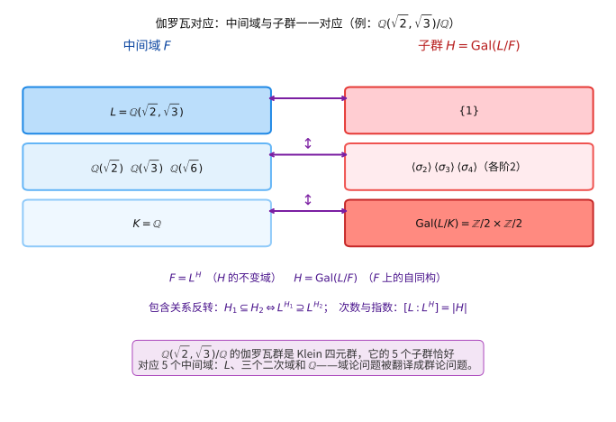
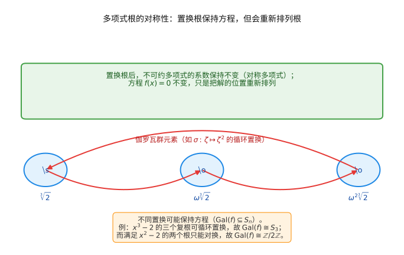

# 第 38 级：伽罗瓦理论 (Galois Theory)

> 伽罗瓦理论是数学中最深刻、最优美的理论之一，它通过群论的方法研究域扩张的对称性，将多项式方程的求解问题转化为群的结构问题，最终解决了五次及以上方程不可根式求解这一困扰数学家长达数百年的难题。

---

## 1. 学习目标

- 理解伽罗瓦扩张的定义及其基本性质，掌握伽罗瓦群的概念
- 掌握伽罗瓦理论基本定理，理解子群与中间域之间的一一对应关系
- 学会计算多项式的伽罗瓦群，包括判别式方法、三次和四次方程的伽罗瓦群
- 理解分圆域的伽罗瓦群结构
- 掌握可解群与根式求解的关系，理解伽罗瓦可解性准则
- 理解五次方程不可根式求解的证明
- 掌握尺规作图问题的伽罗瓦理论解释
- 了解无穷伽罗瓦理论和 Krull 拓扑
- 能够运用伽罗瓦理论解决具体问题

---

## 2. 预备知识

### 2.1 域扩张回顾

**定义 2.1（域扩张）** 若 $K$ 和 $L$ 是域且 $K \subseteq L$，则称 $L/K$ 为一个**域扩张**。$L$ 作为 $K$-向量空间的维数称为扩张的**次数**，记作 $[L : K]$。

- 若 $[L : K] < \infty$，称 $L/K$ 为**有限扩张**
- 若 $L = K(\alpha)$，即 $L$ 由 $K$ 添加单个元素生成，称 $L/K$ 为**单扩张**

**定义 2.2（代数元与超越元）** 设 $L/K$ 是域扩张，$\alpha \in L$。若存在非零多项式 $f(x) \in K[x]$ 使得 $f(\alpha) = 0$，则称 $\alpha$ 是 $K$ 上的**代数元**；否则称 $\alpha$ 为**超越元**。若 $L$ 中每个元素都是 $K$ 上的代数元，则称 $L/K$ 为**代数扩张**。

**定理 2.3（有限扩张必为代数扩张）** 若 $[L : K] < \infty$，则 $L/K$ 是代数扩张。

**定理 2.4（扩张次数链法则）** 若 $K \subseteq F \subseteq L$ 是域扩张，则
$$[L : K] = [L : F] \cdot [F : K].$$

**定义 2.5（极小多项式）** 设 $\alpha$ 是 $K$ 上的代数元，则 $K[x]$ 中以 $\alpha$ 为根的首一多项式 $m_\alpha(x)$ 中次数最低者称为 $\alpha$ 在 $K$ 上的**极小多项式**。它满足：
- $m_\alpha(x)$ 在 $K[x]$ 中不可约
- 若 $f(\alpha) = 0$，则 $m_\alpha(x) \mid f(x)$
- $[K(\alpha) : K] = \deg m_\alpha(x)$

### 2.2 分裂域

**定义 2.6（分裂域）** 设 $f(x) \in K[x]$ 是次数 $\ge 1$ 的多项式。$K$ 的一个扩域 $L$ 称为 $f(x)$ 在 $K$ 上的**分裂域**，若：
- $f(x)$ 在 $L[x]$ 中可分解为一次因子的乘积
- $L = K(\alpha_1, \ldots, \alpha_n)$，其中 $\alpha_1, \ldots, \alpha_n$ 是 $f(x)$ 的全部根

**定理 2.7（分裂域的存在唯一性）** 域 $K$ 上的每个多项式 $f(x) \in K[x]$ 都存在分裂域，且在同构意义下唯一。

### 2.3 可分扩张与正规扩张

**定义 2.8（可分多项式）** 设 $f(x) \in K[x]$ 是不可约多项式。若 $f(x)$ 在其分裂域中没有重根，则称 $f(x)$ 是**可分的**。特征为 $0$ 的域上的不可约多项式都是可分的。

**定义 2.9（可分扩张）** 代数扩张 $L/K$ 称为**可分扩张**，若 $L$ 中每个元素在 $K$ 上的极小多项式都是可分的。

**定义 2.10（正规扩张）** 代数扩张 $L/K$ 称为**正规扩张**，若每个在 $L$ 中有根的 $K[x]$ 中的不可约多项式都在 $L[x]$ 中分裂（即完全分解为一次因式之积）。

**定义 2.11（正规闭包）** 设 $L/K$ 是有限代数扩张，则存在 $L$ 的最小扩域 $N$ 使得 $N/K$ 是正规扩张，称为 $L/K$ 的**正规闭包**。

### 2.4 代数闭包

**定义 2.12（代数闭包）** 域 $K$ 的代数扩张 $\overline{K}$ 称为 $K$ 的**代数闭包**，若 $\overline{K}$ 没有非平凡代数扩张（即 $\overline{K}$ 是代数闭域）。代数闭包在同构意义下唯一。

**定理 2.13（代数基本定理）** 复数域 $\mathbb{C}$ 是代数闭域。等价地，$\mathbb{C}$ 是 $\mathbb{R}$ 的代数闭包。

---

## 3. 伽罗瓦扩张

### 3.1 伽罗瓦扩张的定义

**定义 3.1（$K$-自同构）** 设 $L/K$ 是域扩张。域同构 $\sigma : L \to L$ 称为 $L$ 的一个 $K$**-自同构**，若 $\sigma$ 固定 $K$ 中所有元素，即 $\forall a \in K,\ \sigma(a) = a$。所有 $K$-自同构的集合记作 $\operatorname{Aut}(L/K)$，它在映射复合下构成一个群。

**定义 3.2（不变域）** 设 $G \subseteq \operatorname{Aut}(L/K)$ 是 $K$-自同构的子群，则
$$L^G := \{x \in L \mid \forall \sigma \in G,\ \sigma(x) = x\}$$
称为 $G$ 的**不变域**。显然 $K \subseteq L^G \subseteq L$。

**定义 3.3（伽罗瓦扩张）** 有限扩张 $L/K$ 称为**伽罗瓦扩张**，若 $L^{\operatorname{Aut}(L/K)} = K$，即仅被所有 $K$-自同构固定的是 $K$ 中的元素。

**命题 3.4** 有限扩张 $L/K$ 是伽罗瓦扩张当且仅当 $L/K$ 既是可分扩张又是正规扩张。

**证明概要**：
- ($\Rightarrow$) 若 $L/K$ 是伽罗瓦扩张，可证它是可分的（否则存在不可分元导致 $K$-自同构个数不够），且是正规的（否则存在不可约多项式在某 $K$-自同构下映射到不同扩域，与 $L^G = K$ 矛盾）。
- ($\Leftarrow$) 若 $L/K$ 是可分正规扩张，则每个 $K$-嵌入 $L \to \overline{K}$ 都是 $K$-自同构，且 $|\operatorname{Aut}(L/K)| = [L : K]$，从而 $L^{\operatorname{Aut}(L/K)} = K$。

### 3.2 伽罗瓦群

**定义 3.5（伽罗瓦群）** 若 $L/K$ 是伽罗瓦扩张，则 $\operatorname{Aut}(L/K)$ 称为 $L/K$ 的**伽罗瓦群**，记作 $\operatorname{Gal}(L/K)$。

**定理 3.6（阶与次数相等）** 若 $L/K$ 是有限伽罗瓦扩张，则
$$|\operatorname{Gal}(L/K)| = [L : K].$$

**例 3.7** 扩张 $\mathbb{C}/\mathbb{R}$ 是伽罗瓦扩张，$\operatorname{Gal}(\mathbb{C}/\mathbb{R}) \cong \mathbb{Z}/2\mathbb{Z}$，其非平凡元素是复共轭映射。

**例 3.8** 扩张 $\mathbb{Q}(\sqrt{2})/\mathbb{Q}$ 是伽罗瓦扩张，$\operatorname{Gal}(\mathbb{Q}(\sqrt{2})/\mathbb{Q}) \cong \mathbb{Z}/2\mathbb{Z}$，非平凡元素将 $\sqrt{2}$ 映射为 $-\sqrt{2}$。

**例 3.9** 扩张 $\mathbb{Q}(\sqrt[3]{2})/\mathbb{Q}$ 不是伽罗瓦扩张（不是正规的），因为 $\mathbb{Q}(\sqrt[3]{2})$ 不包含 $x^3 - 2$ 的另外两个复根。

### 3.3 Artin 引理

**引理 3.10（Artin 引理）** 设 $L$ 是一个域，$G$ 是 $L$ 的有限自同构群（即 $G \subseteq \operatorname{Aut}(L)$ 是有限子群），且 $K = L^G$ 是 $G$ 的不变域。则 $L/K$ 是有限伽罗瓦扩张，且 $\operatorname{Gal}(L/K) = G$。

**证明**：
1. 首先证明 $L/K$ 是有限扩张：
   - 取 $\alpha \in L$，考虑 $G$ 在 $\alpha$ 上的轨道 $\{\sigma_1(\alpha), \ldots, \sigma_r(\alpha)\}$。
   - 构造多项式 $f(x) = \prod_{i=1}^r (x - \sigma_i(\alpha))$，其系数被 $G$ 中每个元素固定，故系数在 $K$ 中。
   - 因此 $\alpha$ 满足 $K$ 上的首一多项式 $f(x)$，且 $\deg f = r \le |G|$。
   - 这说明 $L/K$ 是代数扩张，且 $[K(\alpha) : K] \le |G|$。
   - 取 $\alpha \in L$ 使 $[K(\alpha) : K]$ 最大，可证 $L = K(\alpha)$，从而 $[L : K] \le |G|$。

2. 再证 $L/K$ 是伽罗瓦扩张：
   - 由 $K = L^G$，且 $G \subseteq \operatorname{Aut}(L/K)$，故 $\operatorname{Aut}(L/K)$ 至少包含 $G$。
   - 由 1 知 $[L : K] \le |G| \le |\operatorname{Aut}(L/K)|$。
   - 但一般有 $|\operatorname{Aut}(L/K)| \le [L : K]$（可分扩域中自同构个数不超过扩张次数）。
   - 故 $[L : K] = |G| = |\operatorname{Aut}(L/K)|$，从而 $\operatorname{Gal}(L/K) = \operatorname{Aut}(L/K) = G$。

**推论 3.11** 设 $L$ 是域，$G$ 是 $\operatorname{Aut}(L)$ 的有限子群，则 $L/L^G$ 是伽罗瓦扩张，且 $\operatorname{Gal}(L/L^G) = G$。

### 3.4 伽罗瓦理论基本定理

**定理 3.12（伽罗瓦理论基本定理）** 设 $L/K$ 是有限伽罗瓦扩张，$G = \operatorname{Gal}(L/K)$。则存在 $G$ 的子群集合与 $L/K$ 的中间域集合之间的一一对应：

$$
\{\text{中间域 } K \subseteq F \subseteq L\} \longleftrightarrow \{\text{子群 } H \subseteq G\}
$$

其中对应关系为：
- 子群 $H \subseteq G$ 对应其不变域 $F = L^H$
- 中间域 $F$ 对应子群 $H = \operatorname{Gal}(L/F) = \{\sigma \in G \mid \sigma|_F = \operatorname{id}_F\}$

这一对应满足以下性质：

1. **包含关系反转**：$H_1 \subseteq H_2 \iff L^{H_1} \supseteq L^{H_2}$
2. **次数与指数相等**：$[L : L^H] = |H|$，$[L^H : K] = [G : H]$
3. **共轭对应**：若 $\sigma \in G$，则 $\operatorname{Gal}(L/\sigma(F)) = \sigma \operatorname{Gal}(L/F) \sigma^{-1}$
4. **正规子群对应正规扩张**：$F/K$ 是正规扩张当且仅当 $\operatorname{Gal}(L/F) \trianglelefteq G$，此时
   $$\operatorname{Gal}(F/K) \cong G / \operatorname{Gal}(L/F).$$

> **直观理解（现实类比）**：伽罗瓦对应就像给"房子"和"钥匙链"之间装了一面镜子——房子每一层（中间域）都对应钥匙链上的一把钥匙（子群），且层数越多钥匙越少（包含关系反转）。比如 $\mathbb{Q}(\sqrt{2},\sqrt{3})/\mathbb{Q}$ 这座四层小楼，它的 5 个楼层恰好对应 Klein 四元群的 5 个子群。研究难以直接下手"数楼层"的域问题，就变成可以手到擒来的"数钥匙"的群问题。

**证明**：证明分为几个步骤。

**步骤 1：对应是良定义的**

对任意子群 $H \subseteq G$，$F = L^H$ 显然是 $L/K$ 的中间域。由 Artin 引理，$L/F$ 是伽罗瓦扩张且 $\operatorname{Gal}(L/F) = H$。

对任意中间域 $F$，$H = \operatorname{Gal}(L/F)$ 显然是 $G$ 的子群。由于 $L/F$ 是伽罗瓦扩张，$L^{\operatorname{Gal}(L/F)} = F$。

这即证明了 $\operatorname{Gal}(L/L^H) = H$ 和 $L^{\operatorname{Gal}(L/F)} = F$，从而对应是双射。

**步骤 2：包含关系反转**

若 $H_1 \subseteq H_2$，则 $L^{H_2} \subseteq L^{H_1}$（固定的元素更多）。反之，若 $F_1 \supseteq F_2$，则 $\operatorname{Gal}(L/F_1) \subseteq \operatorname{Gal}(L/F_2)$（固定更多域的自同构更少）。

**步骤 3：次数与指数**

由 $[L : L^H] = |\operatorname{Gal}(L/L^H)| = |H|$，再由链法则
$$[L : K] = [L : L^H] \cdot [L^H : K]$$
得 $[L^H : K] = [L : K] / |H| = |G| / |H| = [G : H]$。

**步骤 4：共轭对应**

设 $F$ 对应 $H = \operatorname{Gal}(L/F)$。对 $\sigma \in G$，考虑 $\sigma(F)$。则
$$\tau \in \operatorname{Gal}(L/\sigma(F)) \iff \forall x \in F,\ \tau(\sigma(x)) = \sigma(x) \iff \sigma^{-1}\tau\sigma \in H \iff \tau \in \sigma H \sigma^{-1}.$$

**步骤 5：正规子群与正规扩张**

$F/K$ 是正规扩张当且仅当每个 $\sigma \in G$ 满足 $\sigma(F) = F$（因为 $F/K$ 是有限的，且 $L$ 包含 $F$ 的正规闭包）。由共轭对应，$\sigma(F) = F$ 对所有 $\sigma \in G$ 成立当且仅当 $\sigma H \sigma^{-1} = H$ 对所有 $\sigma \in G$ 成立，即 $H \trianglelefteq G$。

此时，限制映射 $\sigma \mapsto \sigma|_F$ 给出群同态 $G \to \operatorname{Gal}(F/K)$，其核为 $H$，满射由正规扩张保证，从而 $\operatorname{Gal}(F/K) \cong G/H$。

---

## 4. 计算伽罗瓦群

### 4.1 多项式的伽罗瓦群

**定义 4.1（多项式的伽罗瓦群）** 设 $f(x) \in K[x]$ 是可分多项式，$L$ 是 $f(x)$ 在 $K$ 上的分裂域。则 $L/K$ 是伽罗瓦扩张，称 $\operatorname{Gal}(L/K)$ 为 $f(x)$ 的**伽罗瓦群**，记作 $G_f$ 或 $\operatorname{Gal}(f)$。

**定理 4.2** 设 $f(x) \in K[x]$ 是 $n$ 次可分多项式，$L$ 是其分裂域，$R = \{\alpha_1, \ldots, \alpha_n\}$ 是 $f$ 的根集。则 $\operatorname{Gal}(f)$ 同构于 $S_n$ 的一个子群，即通过作用在根上的置换表示嵌入到对称群中。

**证明**：每个 $\sigma \in \operatorname{Gal}(L/K)$ 将根映射到根，且由其在根上的作用唯一确定，故给出 $R$ 上的一个置换，从而得到嵌入 $\operatorname{Gal}(f) \hookrightarrow S_n$。

> **直观理解（现实类比）**：多项式方程就像一座"旋转对称的建筑物"——你可以把它的几个根像旋转展台上的展品一样交换位置，只要整座建筑（方程）看起来还一样，这种交换就是这个根的"对称变换"。例如三次方程 $x^3-2$ 的三个根可以像转风车一样循环交换；而二次方程 $x^2-2$ 的两个根只能互相"换个座位"。伽罗瓦群就是登记所有这些"换座位"方式的清单。

### 4.2 判别式

**定义 4.3（判别式）** 设 $f(x) = \prod_{i=1}^n (x - \alpha_i) \in K[x]$，其中 $\alpha_i$ 在分裂域中。$f$ 的**判别式**定义为
$$\Delta(f) = \prod_{1 \le i < j \le n} (\alpha_i - \alpha_j)^2.$$

判别式是关于 $f$ 系数的对称多项式，因此 $\Delta(f) \in K$。

**定理 4.4** 设 $f(x) \in K[x]$ 是 $n$ 次可分多项式，$\operatorname{char}(K) \neq 2$。则 $\operatorname{Gal}(f) \subseteq A_n$（即伽罗瓦群由偶置换组成）当且仅当 $\Delta(f)$ 是 $K$ 中的平方元。

**证明**：$\sqrt{\Delta} = \prod_{i<j} (\alpha_i - \alpha_j)$ 在偶置换下不变，在奇置换下变号。因此 $\sqrt{\Delta} \in K$ 当且仅当所有伽罗瓦群元素保持 $\sqrt{\Delta}$ 不变，即伽罗瓦群是 $A_n$ 的子群。

**例 4.5** 二次多项式 $f(x) = x^2 + bx + c$ 的判别式 $\Delta = b^2 - 4c$。$\operatorname{Gal}(f) \cong \begin{cases} \{1\} & \Delta \text{ 是平方元} \\ \mathbb{Z}/2\mathbb{Z} & \Delta \text{ 不是平方元} \end{cases}$

### 4.3 三次方程

**定理 4.6** 设 $f(x) = x^3 + px + q \in K[x]$ 是不可约的可分多项式，$\operatorname{char}(K) \neq 2,3$。则 $\operatorname{Gal}(f)$ 是 $S_3$ 的子群，且：
- 若 $\Delta = -4p^3 - 27q^2$ 是 $K$ 中的平方元，则 $\operatorname{Gal}(f) \cong A_3 \cong \mathbb{Z}/3\mathbb{Z}$
- 否则 $\operatorname{Gal}(f) \cong S_3$

**证明**：$f$ 不可约推出伽罗瓦群在根上的作用是传递的，因此是 $S_3$ 的传递子群。$S_3$ 的传递子群只有 $S_3$ 和 $A_3$。由判别式定理知判别式为平方元时伽罗瓦群是 $A_3$。

**例 4.7** $f(x) = x^3 - 2 \in \mathbb{Q}[x]$。判别式 $\Delta = -4 \cdot 0^3 - 27 \cdot (-2)^2 = -108$，不是 $\mathbb{Q}$ 中的平方元。故 $\operatorname{Gal}(f) \cong S_3$。事实上，$f$ 的分裂域是 $\mathbb{Q}(\sqrt[3]{2}, \omega)$，其中 $\omega$ 是三次单位根，扩张次数 $[\mathbb{Q}(\sqrt[3]{2}, \omega) : \mathbb{Q}] = 6$。

### 4.4 四次方程

**定理 4.8** 设 $f(x) \in K[x]$ 是 $4$ 次不可约可分多项式，$\operatorname{char}(K) \neq 2,3$。则 $\operatorname{Gal}(f)$ 同构于 $S_4$ 的传递子群。$S_4$ 的传递子群有：
- $S_4$（阶 $24$）
- $A_4$（阶 $12$）
- $D_4$（阶 $8$，二面体群）
- $V_4 = \{1, (12)(34), (13)(24), (14)(23)\}$（Klein 四元群，阶 $4$）
- $\mathbb{Z}/4\mathbb{Z}$（阶 $4$）

**计算四次方程伽罗瓦群的方法**（利用三次预解式）：

设 $f(x) = x^4 + px^2 + qx + r \in K[x]$，其三次预解式为
$$g(x) = x^3 - 2px^2 + (p^2 - 4r)x + q^2 \in K[x].$$

若 $g(x)$ 在 $K$ 中分裂，则 $\operatorname{Gal}(f) \cong V_4$；若 $g(x)$ 有一个根在 $K$ 中，则 $\operatorname{Gal}(f) \cong D_4$ 或 $\mathbb{Z}/4\mathbb{Z}$；若 $g(x)$ 不可约且判别式是平方元，则 $\operatorname{Gal}(f) \cong A_4$；否则 $\operatorname{Gal}(f) \cong S_4$。

### 4.5 分圆域

**定义 4.9（分圆域）** 设 $n$ 是正整数，$\zeta_n = e^{2\pi i/n}$ 是 $n$ 次本原单位根。域 $\mathbb{Q}(\zeta_n)$ 称为**分圆域**。

**定理 4.10（分圆域的伽罗瓦群）** 扩张 $\mathbb{Q}(\zeta_n)/\mathbb{Q}$ 是伽罗瓦扩张，且
$$\operatorname{Gal}(\mathbb{Q}(\zeta_n)/\mathbb{Q}) \cong (\mathbb{Z}/n\mathbb{Z})^\times,$$
其中 $(\mathbb{Z}/n\mathbb{Z})^\times$ 是模 $n$ 的单位群。同构映射由
$$\sigma_a : \zeta_n \mapsto \zeta_n^a, \quad (a, n) = 1$$
给出，其中 $\sigma_a$ 对应 $a \bmod n$。

**证明概要**：
1. $\mathbb{Q}(\zeta_n)$ 是 $x^n - 1$ 的分裂域，故 $\mathbb{Q}(\zeta_n)/\mathbb{Q}$ 是伽罗瓦扩张。
2. 每个 $\sigma \in \operatorname{Gal}(\mathbb{Q}(\zeta_n)/\mathbb{Q})$ 将 $\zeta_n$ 映射为另一个本原单位根 $\zeta_n^a$，其中 $(a, n) = 1$。
3. 映射 $\sigma \mapsto a \bmod n$ 是群同态，且单射。
4. 由 $\varphi(n) = [\mathbb{Q}(\zeta_n) : \mathbb{Q}]$（$\varphi$ 是欧拉函数），知该映射是满射。

**推论 4.11** $[\mathbb{Q}(\zeta_n) : \mathbb{Q}] = \varphi(n)$，其中 $\varphi$ 是欧拉函数。

**例 4.12** $\operatorname{Gal}(\mathbb{Q}(\zeta_5)/\mathbb{Q}) \cong (\mathbb{Z}/5\mathbb{Z})^\times \cong \mathbb{Z}/4\mathbb{Z}$，循环群。

**例 4.13** $\operatorname{Gal}(\mathbb{Q}(\zeta_8)/\mathbb{Q}) \cong (\mathbb{Z}/8\mathbb{Z})^\times \cong \mathbb{Z}/2\mathbb{Z} \times \mathbb{Z}/2\mathbb{Z}$，Klein 四元群。

---

## 5. 可解性与根式求解

### 5.1 可解群

**定义 5.1（可解群）** 群 $G$ 称为**可解群**，若存在子群链
$$\{1\} = G_0 \trianglelefteq G_1 \trianglelefteq \cdots \trianglelefteq G_n = G$$
使得每个商群 $G_i/G_{i-1}$ 是交换群（称为 Abel 群）。

**定义 5.2（换位子群）** 群 $G$ 的**换位子群** $[G, G]$ 是由所有换位子 $[g, h] = g^{-1}h^{-1}gh$ 生成的子群。

**定理 5.3** 定义 $G^{(0)} = G$，$G^{(i+1)} = [G^{(i)}, G^{(i)}]$。则 $G$ 是可解的当且仅当存在 $n$ 使得 $G^{(n)} = \{1\}$。

**定理 5.4（可解群的性质）**
- 可解群的子群和商群都是可解的
- 若 $N \trianglelefteq G$ 且 $N$ 和 $G/N$ 都可解，则 $G$ 可解
- 交换群是可解的
- $S_n$ 当 $n \le 4$ 时可解，$S_5$ 不可解

**证明（$S_5$ 不可解）**：$A_5$ 是非交换单群，$[A_5, A_5] = A_5$，故 $A_5$ 不可解。$S_5$ 包含 $A_5$ 作为子群，因此 $S_5$ 也不可解。

### 5.2 根式扩张

**定义 5.5（根式扩张）** 域扩张 $L/K$ 称为**根式扩张**，若存在链
$$K = F_0 \subseteq F_1 \subseteq \cdots \subseteq F_m = L$$
使得每个 $F_{i+1} = F_i(\alpha_i)$，其中 $\alpha_i^{n_i} \in F_i$ 对某个正整数 $n_i$ 成立（即 $\alpha_i$ 是 $F_i$ 中某个元素的根）。

**定义 5.6（根式可解）** 多项式 $f(x) \in K[x]$ 称为**根式可解**，若存在根式扩张 $L/K$ 使得 $L$ 包含 $f(x)$ 的分裂域。

### 5.3 伽罗瓦可解性准则

**定理 5.7（伽罗瓦可解性准则）** 设 $f(x) \in K[x]$ 是可分多项式，$\operatorname{char}(K) = 0$。则 $f(x)$ 根式可解当且仅当 $\operatorname{Gal}(f)$ 是可解群。

**证明思路**：

($\Leftarrow$) 若 $\operatorname{Gal}(f)$ 可解，存在子群链
$$\{1\} = G_0 \trianglelefteq G_1 \trianglelefteq \cdots \trianglelefteq G_n = G$$
使得 $G_i/G_{i-1}$ 是循环群（有限可解群有循环正规列）。设 $L$ 是分裂域，$K_i = L^{G_i}$ 是对应的中间域。每条 $K_{i-1} \subseteq K_i$ 是循环扩张，可通过添加适当的根来实现（利用 Hibert 定理 90 和 Lagrange 预解式）。

($\Rightarrow$) 若 $f(x)$ 根式可解，则存在根式扩张链 $K = F_0 \subseteq \cdots \subseteq F_m = L$ 包含分裂域。考虑正规闭包 $N$ 和 $G = \operatorname{Gal}(N/K)$。根式扩张链诱导出 $G$ 的子群链，每个商群是循环群，故 $G$ 可解。$\operatorname{Gal}(f)$ 是 $G$ 的商群，因此也可解。

### 5.4 五次方程不可根式求解

**定理 5.8（Abel-Ruffini 定理）** 一般的五次方程在有理数域上不可根式求解。更精确地说，存在 $5$ 次有理系数多项式其伽罗瓦群是 $S_5$，从而不可根式求解。

**证明**：

1. **构造例子**：考虑 $f(x) = x^5 - 4x + 2 \in \mathbb{Q}[x]$。
   
2. **证明 $f(x)$ 不可约**：由 Eisenstein 判别法（取 $p = 2$），$f(x)$ 在 $\mathbb{Q}[x]$ 中不可约。

3. **确定伽罗瓦群**：设 $G = \operatorname{Gal}(f)$，$G \subseteq S_5$。
   - 由 $f$ 不可约知 $G$ 在 $5$ 个根上传递作用，故 $5 \mid |G|$。
   - 计算 $f'(x) = 5x^4 - 4$，有三个实根（$f'(x) = 0$ 的解为 $\pm\sqrt[4]{4/5}$ 和两个虚根）。
   - $f(x)$ 在三个驻点处的值：$f(-\sqrt[4]{4/5}) > 0$, $f(\sqrt[4]{4/5}) < 0$，故 $f(x)$ 有三个实根和两个虚根。
   - 所以复共轭作用在根上是一个对换 $(ij)$（两个虚根互换）。
   - 由 $f$ 不可约知 $G$ 传递，且包含一个对换。$S_p$（$p$ 为素数）中包含对换的传递子群必须是 $S_p$ 本身。
   - 因此 $G = S_5$。

4. **$S_5$ 不可解**：$A_5$ 是非交换单群，$[A_5, A_5] = A_5$，故 $A_5$ 不可解，$S_5$ 也不可解。

5. **结论**：由伽罗瓦可解性准则，$f(x) = x^5 - 4x + 2$ 不可根式求解。

**历史注记**：Niels Henrik Abel 在 1824 年首先证明了五次方程不可根式求解，但未给出完全刻画。Évariste Galois 在 1832 年（决斗去世前夜）发展了完整的理论，给出了多项式可根式求解的充要条件。

---

## 6. 尺规作图

### 6.1 可构造数

**定义 6.1（可构造数）** 实数 $a$ 称为**可构造数**，若从单位长度出发，通过有限次尺规作图可以作出长度为 $|a|$ 的线段。

**定理 6.2（可构造数的代数刻画）** $a \in \mathbb{R}$ 是可构造数当且仅当存在域链
$$\mathbb{Q} = F_0 \subseteq F_1 \subseteq \cdots \subseteq F_n$$
使得 $a \in F_n$ 且每个 $[F_i : F_{i-1}] = 2$。等价地，存在 $2$ 的幂次 $2^k$ 使得 $[\mathbb{Q}(a) : \mathbb{Q}] = 2^k$。

**证明概要**：尺规作图允许的操作是：
- 过两点作直线（代数上对应线性方程）
- 以一点为圆心作圆（对应二次方程）
- 求直线与直线、直线与圆、圆与圆的交点（最多涉及二次方程）

因此每次作图添加的新点在域扩张中次数最多为 $2$。

**推论 6.3** 若 $a$ 是可构造数，则 $a$ 在 $\mathbb{Q}$ 上的极小多项式的次数是 $2$ 的幂。

### 6.2 三大古典难题

**问题 6.4（三等分角）** 用尺规作图将任意角三等分。

**定理 6.5** 三等分角一般不可用尺规作图实现。

**证明**：取 $\theta = 60^\circ$，三倍角公式 $\cos 3\theta = 4\cos^3\theta - 3\cos\theta$。令 $x = \cos 20^\circ$，则
$$4x^3 - 3x = \frac12 \quad\text{即}\quad 8x^3 - 6x - 1 = 0.$$
令 $y = 2x$，则 $y^3 - 3y - 1 = 0$。该多项式不可约（在 $\mathbb{Q}$ 上），$[\mathbb{Q}(y) : \mathbb{Q}] = 3$，不是 $2$ 的幂，故 $y$（从而 $x$）不可构造。

**问题 6.6（倍立方）** 作一个立方体，使其体积是给定立方体体积的两倍。

**定理 6.7** 倍立方问题不可用尺规作图实现。

**证明**：设给定立方体边长为 $1$，目标立方体边长为 $x$，则 $x^3 = 2$，即 $x = \sqrt[3]{2}$。$[\mathbb{Q}(\sqrt[3]{2}) : \mathbb{Q}] = 3$，不是 $2$ 的幂，故不可构造。

**问题 6.8（化圆为方）** 作一个正方形，使其面积等于给定圆的面积。

**定理 6.9** 化圆为方问题不可用尺规作图实现。

**证明**：设圆半径为 $1$，面积为 $\pi$，则正方形边长为 $\sqrt{\pi}$。$\pi$ 是超越数（Lindemann-Weierstrass 定理），因此 $\sqrt{\pi}$ 也不是代数数，更不是可构造数。

### 6.3 可构造正多边形

**定理 6.10（Gauss-Wantzel 定理）** 正 $n$ 边形可用尺规作图作出当且仅当
$$n = 2^k \cdot p_1 \cdot p_2 \cdots p_m,$$
其中 $p_1, \ldots, p_m$ 是互不相同的 Fermat 素数，即 $p_i = 2^{2^{a_i}} + 1$ 为素数。

**已知的 Fermat 素数**：$3, 5, 17, 257, 65537$。

**证明概要**：
正 $n$ 边形可构造等价于 $\zeta_n = e^{2\pi i/n}$ 的实部 $\cos(2\pi/n)$ 是可构造数。$\mathbb{Q}(\zeta_n)/\mathbb{Q}$ 是伽罗瓦扩张，次数为 $\varphi(n)$。$\cos(2\pi/n)$ 可构造当且仅当 $[\mathbb{Q}(\zeta_n) : \mathbb{Q}]$ 是 $2$ 的幂，即 $\varphi(n) = 2^k$。数论中 $\varphi(n) = 2^k$ 当且仅当 $n$ 具有所述形式。

**例 6.11** 正 $17$ 边形可用尺规作图作出（Gauss 在 19 岁时发现）。

---

## 7. 应用

### 7.1 代数基本定理的伽罗瓦理论证明

**定理 7.1（代数基本定理）** 复数域 $\mathbb{C}$ 是代数闭域，即每个次数 $\ge 1$ 的复系数多项式在 $\mathbb{C}$ 中都有根。

**伽罗瓦理论证明**：

1. 首先证明 $\mathbb{C}$ 的每个有限扩张 $L/\mathbb{C}$ 都是平凡的（即 $L = \mathbb{C}$）。
2. 设 $L/\mathbb{C}$ 是有限伽罗瓦扩张，$G = \operatorname{Gal}(L/\mathbb{C})$。
3. 由 Cauchy 定理，若 $G$ 非平凡，则存在 $p$ 阶子群，其中 $p$ 是素数。设 $H$ 是 $p$ 阶子群，$F = L^H$。
4. 则 $[L : F] = p$，故 $L = F(\alpha)$ 且 $\alpha$ 的极小多项式次数为 $p$。
5. 但 $\mathbb{C}$ 包含所有 $2$ 的幂次根式扩张（因为 $\mathbb{R}$ 上每个正数有平方根，且 $\mathbb{C}$ 由 $\mathbb{R}$ 添加平方根得到），通过分析可知 $p$ 只能是 $2$。
6. 若 $p = 2$，则 $L/F$ 是二次扩张，$L = F(\sqrt{d})$。但 $\mathbb{C}$ 中已有所有平方根，且 $F$ 包含 $\mathbb{C}$，故 $L = F$，矛盾。
7. 因此 $G$ 平凡，$\mathbb{C}$ 没有非平凡有限扩张。

此证明巧妙之处在于利用 $\mathbb{R}$ 的序性质（正数有平方根）和 $\mathbb{C} = \mathbb{R}(i)$ 来限制可能的扩张次数，展示了伽罗瓦理论在经典问题中的应用。

### 7.2 Casus Irreducibilis

**定理 7.2（Casus Irreducibilis）** 设 $f(x) \in \mathbb{Q}[x]$ 是 $3$ 次不可约多项式，有三个实根。则 $f(x)$ 的根**不能**用实根式表示——任何根式表示必然涉及复数。

**证明**：设 $f(x)$ 有 $\Delta > 0$（三个实根），则 $\operatorname{Gal}(f) \cong A_3 \cong \mathbb{Z}/3\mathbb{Z}$。若根可用实根式表示，则存在根式扩张链，其中每个中间域都是 $\mathbb{R}$ 的子域。但 $3$ 次循环扩张 $\mathbb{Q}(\alpha)/\mathbb{Q}$ 需要添加单位根 $\zeta_3$（非实数），矛盾。

### 7.3 Kronecker-Weber 定理

**定理 7.3（Kronecker-Weber）** 每个 $\mathbb{Q}$ 上的 Abel 扩张（即伽罗瓦群是交换群的有限伽罗瓦扩张）都包含在某个分圆域中。换言之，若 $L/\mathbb{Q}$ 是有限伽罗瓦扩张且 $\operatorname{Gal}(L/\mathbb{Q})$ 是交换群，则存在 $n$ 使得 $L \subseteq \mathbb{Q}(\zeta_n)$。

**注**：这是类域论的一个基本特例，完整证明需要代数数论工具。Kronecker 在 1853 年提出猜想，Weber 在 1886 年给出证明，但后来发现不完整，由 Hilbert 在 1896 年完成严格证明。

---

## 8. 无穷伽罗瓦理论

### 8.1 无穷伽罗瓦扩张

**定义 8.1（无穷伽罗瓦扩张）** 代数扩张 $L/K$ 称为**无穷伽罗瓦扩张**，若 $L/K$ 是可分正规扩张（不要求有限性）。

**例 8.2** $\overline{\mathbb{Q}}/\mathbb{Q}$（代数闭包/有理数）是无穷伽罗瓦扩张。

**例 8.3** $\mathbb{Q}(\zeta_{p^\infty})/\mathbb{Q}$（所有 $p$ 幂次单位根生成的分圆域）是无穷伽罗瓦扩张。

### 8.2 Krull 拓扑

对于无穷伽罗瓦扩张 $L/K$，伽罗瓦群 $G = \operatorname{Gal}(L/K)$ 是无穷群，不能直接建立与中间域的一一对应。Krull 引入了拓扑结构来解决这个问题。

**定义 8.4（Krull 拓扑）** 在 $G = \operatorname{Gal}(L/K)$ 上定义 Krull 拓扑：取所有形如
$$\sigma \operatorname{Gal}(L/F) = \{\tau \in G \mid \tau|_F = \sigma|_F\}$$
的集合作为开基，其中 $F/K$ 是 $L$ 的有限伽罗瓦子扩张。换言之，$G$ 中两个元素"接近"当且仅当它们在某个有限子扩张上一致。

**定理 8.5（Krull 拓扑的性质）**
- $G$ 在 Krull 拓扑下是 Hausdorff 的、全不连通的、紧致的拓扑群
- 开子群对应于 $L$ 的有限子扩张
- 闭子群对应于 $L$ 的任意子扩张

### 8.3 Krull 定理

**定理 8.6（Krull 定理）** 设 $L/K$ 是（可能无穷的）伽罗瓦扩张，$G = \operatorname{Gal}(L/K)$ 配备 Krull 拓扑。则 $G$ 的**闭子群**与 $L/K$ 的中间域之间存在一一对应：
- 闭子群 $H \subseteq G$ 对应 $F = L^H$
- 中间域 $F$ 对应 $H = \operatorname{Gal}(L/F)$（它是闭子群）

此外，$F/K$ 是有限扩张当且仅当 $H$ 是开子群（也是有限指数子群）。

**注**：在无穷情形下，子群必须是闭的才能与中间域对应。例如，$\operatorname{Gal}(\overline{\mathbb{Q}}/\mathbb{Q})$ 包含大量非闭子群，它们不对应任何中间域。

---

## 9. 示例

### 示例 1：$\mathbb{Q}(\sqrt{2}, \sqrt{3})/\mathbb{Q}$ 的伽罗瓦群

求 $\operatorname{Gal}(\mathbb{Q}(\sqrt{2}, \sqrt{3})/\mathbb{Q})$ 并列出所有子群和对应的中间域。

**解**：
- $L = \mathbb{Q}(\sqrt{2}, \sqrt{3})$，$K = \mathbb{Q}$
- $L/\mathbb{Q}$ 是伽罗瓦扩张，$[L : \mathbb{Q}] = 4$
- $\operatorname{Gal}(L/\mathbb{Q})$ 由在生成元 $\sqrt{2}, \sqrt{3}$ 上的作用决定：
  - $\sigma_1 : \sqrt{2} \mapsto \sqrt{2},\ \sqrt{3} \mapsto \sqrt{3}$（恒等）
  - $\sigma_2 : \sqrt{2} \mapsto -\sqrt{2},\ \sqrt{3} \mapsto \sqrt{3}$
  - $\sigma_3 : \sqrt{2} \mapsto \sqrt{2},\ \sqrt{3} \mapsto -\sqrt{3}$
  - $\sigma_4 : \sqrt{2} \mapsto -\sqrt{2},\ \sqrt{3} \mapsto -\sqrt{3}$
- 每个元素阶为 $2$，故 $\operatorname{Gal}(L/\mathbb{Q}) \cong \mathbb{Z}/2\mathbb{Z} \times \mathbb{Z}/2\mathbb{Z}$（Klein 四元群）

子群与中间域对应：
- $\{1\}$ — $\mathbb{Q}(\sqrt{2}, \sqrt{3})$
- $\{1, \sigma_2\}$ — $\mathbb{Q}(\sqrt{3})$
- $\{1, \sigma_3\}$ — $\mathbb{Q}(\sqrt{2})$
- $\{1, \sigma_4\}$ — $\mathbb{Q}(\sqrt{6})$
- $\operatorname{Gal}(L/\mathbb{Q})$ — $\mathbb{Q}$

### 示例 2：$x^4 - 5x^2 + 6$ 的伽罗瓦群

求 $f(x) = x^4 - 5x^2 + 6 \in \mathbb{Q}[x]$ 的伽罗瓦群。

**解**：
- $f(x) = (x^2 - 2)(x^2 - 3)$，根为 $\pm\sqrt{2}, \pm\sqrt{3}$
- 分裂域 $L = \mathbb{Q}(\sqrt{2}, \sqrt{3})$，与示例 1 相同
- 故 $\operatorname{Gal}(f) \cong \mathbb{Z}/2\mathbb{Z} \times \mathbb{Z}/2\mathbb{Z}$

### 示例 3：$x^3 - 5$ 的伽罗瓦群

求 $f(x) = x^3 - 5 \in \mathbb{Q}[x]$ 的伽罗瓦群。

**解**：
- 根为 $\sqrt[3]{5}, \omega\sqrt[3]{5}, \omega^2\sqrt[3]{5}$，其中 $\omega = e^{2\pi i/3}$
- 分裂域 $L = \mathbb{Q}(\sqrt[3]{5}, \omega)$
- $[\mathbb{Q}(\sqrt[3]{5}) : \mathbb{Q}] = 3$，$[\mathbb{Q}(\sqrt[3]{5}, \omega) : \mathbb{Q}(\sqrt[3]{5})] = 2$，故 $[L : \mathbb{Q}] = 6$
- 判别式 $\Delta = -27 \cdot 5^2 = -675$，不是平方元
- $\operatorname{Gal}(f) \cong S_3$

### 示例 4：$\mathbb{Q}(\zeta_7)/\mathbb{Q}$ 的伽罗瓦群

求 $\operatorname{Gal}(\mathbb{Q}(\zeta_7)/\mathbb{Q})$ 及其子群对应的中间域。

**解**：
- $(\mathbb{Z}/7\mathbb{Z})^\times \cong \mathbb{Z}/6\mathbb{Z}$，生成元为 $3 \bmod 7$
- $\operatorname{Gal}(\mathbb{Q}(\zeta_7)/\mathbb{Q}) \cong \mathbb{Z}/6\mathbb{Z}$
- 子群：$\{0\}$（阶 $1$），$\{0, 3\}$（阶 $2$），$\{0, 2, 4\}$（阶 $3$），整个群（阶 $6$）
- 阶 $3$ 子群 $\{0, 2, 4\}$ 对应中间域 $\mathbb{Q}(\zeta_7 + \zeta_7^2 + \zeta_7^4)$（即 $\mathbb{Q}(\sqrt{-7})$ 的某个子域）
- 阶 $2$ 子群 $\{0, 3\}$ 对应中间域 $\mathbb{Q}(\zeta_7 + \zeta_7^{-1}) = \mathbb{Q}(\cos(2\pi/7))$

### 示例 5：$x^5 - 1$ 的伽罗瓦群

求 $f(x) = x^5 - 1 \in \mathbb{Q}[x]$ 的伽罗瓦群。

**解**：
- 分裂域 $\mathbb{Q}(\zeta_5)$，其中 $\zeta_5 = e^{2\pi i/5}$
- $\operatorname{Gal}(\mathbb{Q}(\zeta_5)/\mathbb{Q}) \cong (\mathbb{Z}/5\mathbb{Z})^\times \cong \mathbb{Z}/4\mathbb{Z}$
- 循环群，阶为 $4$，生成元 $\sigma : \zeta_5 \mapsto \zeta_5^2$

### 示例 6：证明 $\mathbb{Q}(\sqrt[4]{2}, i)/\mathbb{Q}$ 是伽罗瓦扩张并求其伽罗瓦群

**解**：
- $L = \mathbb{Q}(\sqrt[4]{2}, i)$，$K = \mathbb{Q}$
- $L$ 是 $x^4 - 2$ 的分裂域（因为 $x^4 - 2$ 的根为 $\pm\sqrt[4]{2}, \pm i\sqrt[4]{2}$）
- 故 $L/\mathbb{Q}$ 是伽罗瓦扩张
- $[L : \mathbb{Q}] = 8$
- $\operatorname{Gal}(L/\mathbb{Q})$ 由在 $\sqrt[4]{2}$ 和 $i$ 上的作用决定：
  - $\sigma : \sqrt[4]{2} \mapsto i\sqrt[4]{2},\ i \mapsto i$（阶 $4$）
  - $\tau : \sqrt[4]{2} \mapsto \sqrt[4]{2},\ i \mapsto -i$（阶 $2$）
  - $\tau\sigma\tau^{-1} = \sigma^{-1}$，故 $\operatorname{Gal}(L/\mathbb{Q}) \cong D_4$（$8$ 阶二面体群）

### 示例 7：证明 $\sqrt{2} + \sqrt{3}$ 是代数数并求其极小多项式

**解**：
- 设 $\alpha = \sqrt{2} + \sqrt{3}$
- $\alpha^2 = 5 + 2\sqrt{6}$，$\alpha^4 = 49 + 20\sqrt{6}$
- 消去 $\sqrt{6}$：$\alpha^4 - 10\alpha^2 + 1 = 0$
- 故 $\alpha$ 的极小多项式为 $x^4 - 10x^2 + 1$
- $[\mathbb{Q}(\alpha) : \mathbb{Q}] = 4$
- 注意 $\mathbb{Q}(\alpha) = \mathbb{Q}(\sqrt{2}, \sqrt{3})$，因为 $\sqrt{6} = (\alpha^2 - 5)/2 \in \mathbb{Q}(\alpha)$，且 $\sqrt{2} = (\alpha + \sqrt{6})/2$，$\sqrt{3} = (\alpha - \sqrt{6})/2$

### 示例 8：正五边形可构造性

证明正五边形可用尺规作图作出。

**解**：
- 正五边形对应 $\zeta_5 = e^{2\pi i/5}$
- $\varphi(5) = 4 = 2^2$，是 $2$ 的幂
- 由 Gauss-Wantzel 定理，正五边形可构造
- 具体构造：$\cos(2\pi/5) = \frac{\sqrt{5} - 1}{4}$，可由尺规作出

### 示例 9：$x^3 - 3x + 1$ 的伽罗瓦群

求 $f(x) = x^3 - 3x + 1 \in \mathbb{Q}[x]$ 的伽罗瓦群。

**解**：
- 判别式 $\Delta = -4(-3)^3 - 27 \cdot 1^2 = 108 - 27 = 81 = 9^2$
- $\Delta$ 是 $\mathbb{Q}$ 中的平方元
- 故 $\operatorname{Gal}(f) \cong A_3 \cong \mathbb{Z}/3\mathbb{Z}$

### 示例 10：$x^4 + 1$ 的伽罗瓦群

求 $f(x) = x^4 + 1 \in \mathbb{Q}[x]$ 的伽罗瓦群。

**解**：
- $x^4 + 1 = \Phi_8(x)$（第 $8$ 个分圆多项式）
- 分裂域是 $\mathbb{Q}(\zeta_8)$，其中 $\zeta_8 = e^{2\pi i/8} = \frac{\sqrt{2}}{2}(1 + i)$
- $\operatorname{Gal}(\mathbb{Q}(\zeta_8)/\mathbb{Q}) \cong (\mathbb{Z}/8\mathbb{Z})^\times \cong \mathbb{Z}/2\mathbb{Z} \times \mathbb{Z}/2\mathbb{Z}$

---

## 10. 习题

### 基础题

1. 判断以下扩张是否为伽罗瓦扩张，并说明理由：
   - (a) $\mathbb{Q}(\sqrt{5})/\mathbb{Q}$
   - (b) $\mathbb{Q}(\sqrt[3]{5})/\mathbb{Q}$
   - (c) $\mathbb{Q}(\sqrt{2}, \sqrt{5})/\mathbb{Q}$
   - (d) $\mathbb{F}_p(t)/\mathbb{F}_p$（$t$ 是超越元）

2. 求 $\operatorname{Gal}(\mathbb{Q}(\sqrt{2}, \sqrt[3]{2})/\mathbb{Q})$ 并说明该扩张是否是伽罗瓦扩张。

3. 计算 $f(x) = x^3 - 3x + 1 \in \mathbb{Q}[x]$ 的判别式，并求其伽罗瓦群。

4. 证明 $\mathbb{Q}(\sqrt{2} + \sqrt{5}) = \mathbb{Q}(\sqrt{2}, \sqrt{5})$。

5. 求 $\operatorname{Gal}(\mathbb{Q}(\zeta_8)/\mathbb{Q})$ 的所有子群及对应的中间域。

### 中等题

6. 设 $f(x) = x^4 - 2 \in \mathbb{Q}[x]$，求 $f$ 的伽罗瓦群，并列出所有中间域。

7. 证明：若 $L/K$ 是伽罗瓦扩张且 $[L : K] = p$ 是素数，则 $\operatorname{Gal}(L/K) \cong \mathbb{Z}/p\mathbb{Z}$。

8. 设 $f(x) = x^5 - 5x + 12 \in \mathbb{Q}[x]$，证明 $f(x)$ 的伽罗瓦群是 $S_5$，从而不可根式求解。

9. 证明：正 $n$ 边形可尺规作图当且仅当 $\varphi(n)$ 是 $2$ 的幂。

10. 设 $L/K$ 是有限伽罗瓦扩张，$F$ 是中间域。证明 $F/K$ 是伽罗瓦扩张当且仅当 $\operatorname{Gal}(L/F) \trianglelefteq \operatorname{Gal}(L/K)$。

### 提高题

11. 证明：$\mathbb{Q}(\sqrt{p_1}, \ldots, \sqrt{p_n})/\mathbb{Q}$ 是伽罗瓦扩张，其伽罗瓦群是 $(\mathbb{Z}/2\mathbb{Z})^n$，其中 $p_1, \ldots, p_n$ 是互不相同的素数。

12. 设 $f(x) = x^p - a \in \mathbb{Q}[x]$，其中 $p$ 是素数，$a \in \mathbb{Q}$ 不是 $p$ 次幂。求 $\operatorname{Gal}(f)$。

13. 证明：$\operatorname{Gal}(\mathbb{Q}(\zeta_n)/\mathbb{Q})$ 与 $\operatorname{Gal}(\mathbb{Q}(\zeta_{2n})/\mathbb{Q})$ 同构当且仅当 $n$ 是奇数。

14. 设 $K$ 是特征为 $0$ 的域，$f(x) \in K[x]$ 是 $n$ 次不可约多项式，$\operatorname{Gal}(f) \cong S_n$。证明 $f(x)$ 的根式可解当且仅当 $n \le 4$。

15. 证明：$\sqrt[3]{2}$ 不能用尺规作图作出，但 $\sqrt[3]{2}$ 可以用尺规作图三等分角吗？（提示：$\sqrt[3]{2}$ 对应倍立方问题，而三等分角对应 $x^3 - 3x - 1 = 0$，两者不可约多项式次数不同。）

16. 设 $f(x) = x^6 - 3x^3 + 1 \in \mathbb{Q}[x]$，求 $f$ 的伽罗瓦群。提示：$f(x)$ 的根是 $2\cos(2\pi k/9)$，$k = 1,2,4,5,7,8$。

17. 证明 Krull 定理：设 $L/K$ 是无穷伽罗瓦扩张，$G = \operatorname{Gal}(L/K)$ 带 Krull 拓扑，则 $G$ 的闭子群与 $L/K$ 的中间域一一对应。

---

## 11. 总结

伽罗瓦理论是数学史上最具革命性的理论之一，它通过群论的语言深刻揭示了域扩张的结构，具体体现在以下几个方面：

| 主题 | 核心内容 | 应用 |
|------|---------|------|
| **伽罗瓦扩张** | 可分正规扩张，伽罗瓦群 | 域扩张的对称性刻画 |
| **基本定理** | 子群与中间域的一一对应 | 将域论问题转化为群论问题 |
| **计算伽罗瓦群** | 判别式、预解式、分圆域 | 确定多项式对称性 |
| **可解性准则** | 可解群与根式扩张的对应 | 五次方程不可解性 |
| **尺规作图** | 可构造数与二次扩张 | 古典三大难题的解决 |
| **无穷理论** | Krull 拓扑、闭子群 | 无穷扩张的推广 |

伽罗瓦理论的核心思想可以概括为：
- **对称性**：域扩张的对称性由自同构群描述
- **对应**：子群结构完全决定了中间域结构
- **可解性**：多项式可根式求解当且仅当其伽罗瓦群可解

伽罗瓦理论的影响远不止于多项式求解，它深刻影响了代数数论（类域论）、代数几何（基本群）、表示论等多个数学分支，并且通过 Krull 拓扑等工具推广到了无穷扩张的情形，成为现代数学的基石之一。

### 关键词

- 伽罗瓦扩张 / 伽罗瓦群 / 基本定理
- 可分扩张 / 正规扩张 / 分裂域
- 判别式 / 分圆域 / 可解群
- 根式扩张 / 根式可解
- 尺规作图 / 可构造数 / Gauss-Wantzel 定理
- Krull 拓扑 / 无穷伽罗瓦理论