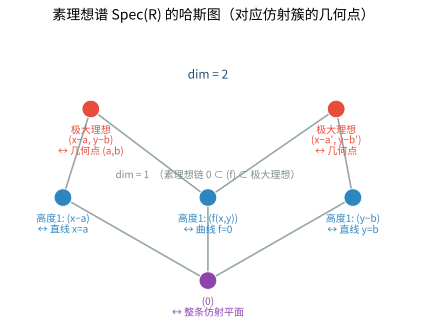

# 第 40 级：交换代数 (Commutative Algebra)

---

## 一、学习目标

完成本教程后，您应当能够：

1. **掌握交换环的基本理论**：熟练运用素理想、极大理想、幂零根、Jacobson 根、零化子、理想的扩张与收缩等核心概念。
2. **理解局部化技术**：掌握环和模的局部化构造、泛性质，以及局部性质与整体性质的转化。
3. **掌握整性理论**：理解整扩张、上升/下降定理、Noether 正规化引理和 Hilbert 零点定理的证明。
4. **区分 Noetherian 环与 Artinian 环**：掌握 Hilbert 基定理的证明，理解 Artinian 环的结构定理。
5. **理解正则序列与深度**：掌握正则序列、深度、Cohen-Macaulay 环的定义与基本性质，了解 Auslander-Buchsbaum 公式。
6. **掌握维数理论**：理解 Krull 维数、素理想的高度、Krull 主理想定理的证明，掌握多项式环的维数。
7. **理解完备化**：掌握逆向极限、环的完备化以及 Hensel 引理。
8. **了解同调方法**：了解 Tor 与 Ext、Koszul 复形和局部上同调的基本概念。
9. **能够独立完成典型例题与习题**。

---

## 二、环与理想

### 2.1 交换环回顾

**定义 2.1（交换环）** 一个**交换环**（commutative ring）是一个集合 $R$，配备加法 $+$ 和乘法 $\cdot$ 两种二元运算，满足：

1. $(R, +)$ 是阿贝尔群（加法群），记零元为 $0$；
2. 乘法交换律：$a \cdot b = b \cdot a$；
3. 乘法结合律：$(a \cdot b) \cdot c = a \cdot (b \cdot c)$；
4. 分配律：$a \cdot (b + c) = a \cdot b + a \cdot c$；
5. 存在乘法单位元 $1$ 使得 $1 \cdot a = a$ 对任意 $a \in R$ 成立。

在本教程中，除非特别说明，所有环均指含幺交换环。

**例 2.1**
- 整数环 $\mathbb{Z}$。
- 域 $k$ 上的多项式环 $k[x_1, \ldots, x_n]$。
- 形式幂级数环 $k[[x_1, \ldots, x_n]]$。
- 局部环，如 $\mathbb{Z}_{(p)} = \{ a/b \in \mathbb{Q} \mid p \nmid b \}$。

### 2.2 素理想与极大理想

**定义 2.2（素理想）** 交换环 $R$ 的理想 $P$ 称为**素理想**（prime ideal），若 $P \neq R$ 且对任意 $a, b \in R$，$ab \in P$ 蕴涵 $a \in P$ 或 $b \in P$。

**定义 2.3（极大理想）** 交换环 $R$ 的理想 $M$ 称为**极大理想**（maximal ideal），若 $M \neq R$ 且不存在理想 $I$ 使得 $M \subsetneq I \subsetneq R$。

**定理 2.1** 设 $R$ 是含幺交换环。
- $P$ 是素理想 $\iff$ $R/P$ 是整环。
- $M$ 是极大理想 $\iff$ $R/M$ 是域。

**推论** 极大理想必为素理想。反之不真，例如 $(0)$ 是 $\mathbb{Z}$ 的素理想但不是极大理想。

**Zorn 引理的应用**：每个含幺交换环 $R \neq 0$ 都至少有一个极大理想（因此也有素理想）。证明使用 Zorn 引理：考虑所有真理想的集合，按包含关系构成偏序集，链的并仍是真理想，故有极大元。

### 2.3 幂零根与 Jacobson 根

**定义 2.4（幂零元）** 元素 $a \in R$ 称为**幂零元**（nilpotent），若存在正整数 $n$ 使得 $a^n = 0$。

**定义 2.5（幂零根）** 交换环 $R$ 的**幂零根**（nilradical）定义为所有幂零元构成的集合，记作 $\operatorname{Nil}(R)$ 或 $\sqrt{0}$。

**定理 2.2** 幂零根等于所有素理想的交集：
$$\operatorname{Nil}(R) = \bigcap_{P \text{ 素理想}} P$$

**证明**：若 $a$ 幂零，则 $a^n = 0 \in P$，由素理想的定义知 $a \in P$，故 $\operatorname{Nil}(R) \subseteq \bigcap P$。

反之，若 $a$ 不幂零，考虑集合 $\Sigma = \{ I \trianglelefteq R \mid a^n \notin I, \forall n \geq 1 \}$。由 Zorn 引理，$\Sigma$ 有极大元 $P$，可证 $P$ 是素理想且 $a \notin P$。$\square$

**定义 2.6（Jacobson 根）** 环 $R$ 的 **Jacobson 根**（Jacobson radical）定义为所有极大理想的交集，记作 $J(R)$：
$$J(R) = \bigcap_{M \text{ 极大理想}} M$$

**性质 2.1**
- $\operatorname{Nil}(R) \subseteq J(R)$。
- $x \in J(R) \iff 1 - xy$ 是 $R$ 中的可逆元对任意 $y \in R$ 成立。
- 若 $R$ 是有限生成 $R$-模（如 Artin 环），则 $J(R) = \operatorname{Nil}(R)$。

### 2.4 零化子

**定义 2.7（零化子）** 设 $M$ 是 $R$-模。对子集 $S \subseteq M$，定义
$$\operatorname{Ann}_R(S) = \{ r \in R \mid rs = 0, \forall s \in S \}$$
这是 $R$ 的一个理想。对元素 $m \in M$，记 $\operatorname{Ann}_R(m) = \{ r \in R \mid rm = 0 \}$。

**性质 2.2**
- $\operatorname{Ann}_R(M)$ 是 $R$ 的理想。
- 若 $M$ 是 faithful 模（即 $\operatorname{Ann}_R(M) = 0$），则 $R$ 可嵌入 $\operatorname{End}_\mathbb{Z}(M)$。
- 对素理想 $P$，称 $P$ 是 $M$ 的**相伴素理想**（associated prime），若存在 $m \in M$ 使得 $P = \operatorname{Ann}_R(m)$。

### 2.5 理想的扩张与收缩

设 $\varphi: A \to B$ 是环同态。

**定义 2.8（扩张与收缩）**
- 对 $A$ 的理想 $I$，$I$ 的**扩张**（extension）为 $I^e = \varphi(I)B = \{ \sum \varphi(a_i)b_i \mid a_i \in I, b_i \in B \}$，这是 $B$ 的理想。
- 对 $B$ 的理想 $J$，$J$ 的**收缩**（contraction）为 $J^c = \varphi^{-1}(J)$，这是 $A$ 的理想。

**性质 2.3**
- $I \subseteq I^{ec}$，$J \supseteq J^{ce}$。
- 收缩映射保持素理想：若 $J$ 是 $B$ 的素理想，则 $J^c$ 是 $A$ 的素理想。
- 扩张映射不一定保持素理想。例如 $\mathbb{Z} \hookrightarrow \mathbb{Q}$ 中，$(0)$ 的扩张仍是 $(0)$，但 $\mathbb{Z}$ 中非零素理想的扩张都成为 $\mathbb{Q}$ 的整个环。

**定理 2.3（理想对应）** 对环同态 $\varphi: A \to B$，收缩映射 $\operatorname{Spec} B \to \operatorname{Spec} A$ 是连续的（在 Zariski 拓扑下），扩张映射则不一定。

---

## 三、局部化

### 3.1 乘性子集与局部化构造

**定义 3.1（乘性子集）** 环 $R$ 的子集 $S \subseteq R$ 称为**乘性子集**（multiplicative subset），若 $1 \in S$ 且 $S$ 对乘法封闭（即 $s, t \in S \Rightarrow st \in S$）。

**例 3.1**
- $S = \{ 1, f, f^2, f^3, \ldots \}$，其中 $f \in R$。
- $S = R \setminus P$，其中 $P$ 是素理想。
- $S = R \setminus \bigcup_{i=1}^n P_i$，其中 $P_i$ 是素理想。

**定义 3.2（局部化）** 设 $S$ 是 $R$ 的乘性子集。在集合 $R \times S$ 上定义等价关系：
$$(r, s) \sim (r', s') \iff \exists t \in S \text{ 使得 } t(rs' - r's) = 0$$
记等价类为 $r/s$。所有等价类的集合记为 $S^{-1}R$，称为 $R$ 关于 $S$ 的**局部化**（localization）。在 $S^{-1}R$ 上定义：
$$\frac{r}{s} + \frac{r'}{s'} = \frac{rs' + r's}{ss'}, \quad \frac{r}{s} \cdot \frac{r'}{s'} = \frac{rr'}{ss'}$$
则 $S^{-1}R$ 构成含幺交换环，称为 $R$ 关于 $S$ 的**分式环**。

**注**：当 $R$ 是整环且 $S = R \setminus \{0\}$ 时，$S^{-1}R$ 就是 $R$ 的**分式域**。

**特殊情形**：
- 当 $S = \{1, f, f^2, \ldots\}$ 时，记 $S^{-1}R = R_f$。
- 当 $S = R \setminus P$（$P$ 素理想）时，记 $S^{-1}R = R_P$，称为 $R$ 在 $P$ 处的**局部化**。


> **直观理解（现实类比）**：把局部化想成"放大镜"或"只看局部"。环 $R$ 是整个世界，乘性子集 $S$ 是你允许"除以"的某些数（比如 $S=\{1,f,f^2,\ldots\}$）。$S^{-1}R$ 就是在这个基础上把 $S$ 中的每个元素都"激活"成分母、使其变为可逆元后，造出的分数世界 $r/s$。这就像你用放大镜只盯着地图上的某个局部：很远处的整体纠缠被忽略，而眼前这一点的精细结构被无限放大——局部-全局原理正是靠这种"局部放大"来反推整体性质的。

### 3.2 泛性质

**定理 3.1（局部化的泛性质）** 设 $S$ 是 $R$ 的乘性子集，则存在环同态 $\iota: R \to S^{-1}R$，$\iota(r) = r/1$，满足：
1. 对任意 $s \in S$，$\iota(s)$ 在 $S^{-1}R$ 中可逆。
2. 对任意环同态 $\varphi: R \to T$，若 $\varphi(s)$ 在 $T$ 中可逆对任意 $s \in S$ 成立，则存在唯一的环同态 $\tilde{\varphi}: S^{-1}R \to T$ 使得 $\tilde{\varphi} \circ \iota = \varphi$。

```
            R
          /   \
         /     \
        /       \
       ∨         ∨
    S^{-1}R ----> T  (唯一)
```

### 3.3 模的局部化

**定义 3.3（模的局部化）** 设 $M$ 是 $R$-模，$S$ 是乘性子集。在集合 $M \times S$ 上定义等价关系：
$$(m, s) \sim (m', s') \iff \exists t \in S \text{ 使得 } t(sm' - s'm) = 0$$
记等价类为 $m/s$。所有等价类的集合 $S^{-1}M$ 构成 $S^{-1}R$-模，称为 $M$ 关于 $S$ 的**局部化**。

**性质 3.1**
- $S^{-1}M \cong S^{-1}R \otimes_R M$。
- 局部化是正合函子：若 $0 \to M' \to M \to M'' \to 0$ 正合，则 $0 \to S^{-1}M' \to S^{-1}M \to S^{-1}M'' \to 0$ 正合（即 $S^{-1}R$ 是平坦 $R$-模）。

### 3.4 局部性质

**定义 3.4（局部性质）** 称模 $M$ 的性质 $\mathcal{P}$ 是**局部性质**（local property），若 $M$ 满足 $\mathcal{P}$ 当且仅当对任意素理想 $P$，$M_P$ 满足 $\mathcal{P}$。

**定理 3.2（局部性质举例）**
- $M = 0$ 是局部性质：$M = 0 \iff$ 对所有素理想 $P$，$M_P = 0$。
- $M$ 是平坦模是局部性质。
- 单射 $N \to M$ 是局部性质：$N \to M$ 是单射 $\iff$ 对所有素理想 $P$，$N_P \to M_P$ 是单射。

**证明**：若 $M \neq 0$，取 $0 \neq m \in M$。令 $\operatorname{Ann}(m)$ 是 $R$ 的真理想，则存在极大理想 $M$ 包含 $\operatorname{Ann}(m)$。在 $M_{\mathfrak{m}}$ 中，$m/1 \neq 0$，故 $M_{\mathfrak{m}} \neq 0$。$\square$

### 3.5 局部-全局原理

**定理 3.3（局部-全局原理）** 设 $M$ 是有限生成 $R$-模。则：
1. $M = 0 \iff M_{\mathfrak{m}} = 0$ 对所有极大理想 $\mathfrak{m}$ 成立。
2. 序列 $M' \to M \to M''$ 正合 $\iff$ 对所有极大理想 $\mathfrak{m}$，局部化序列 $M'_{\mathfrak{m}} \to M_{\mathfrak{m}} \to M''_{\mathfrak{m}}$ 正合。
3. $M$ 是投射模 $\iff$ $M_{\mathfrak{m}}$ 是自由 $R_{\mathfrak{m}}$-模对所有极大理想 $\mathfrak{m}$ 成立（当 $R$ 是 Noetherian 环时）。

---

## 四、整性

### 4.1 整扩张

**定义 4.1（整元素）** 设 $A \subseteq B$ 是环的扩张。元素 $b \in B$ 称为在 $A$ 上**整**（integral over $A$），若存在首一多项式
$$f(x) = x^n + a_1 x^{n-1} + \cdots + a_n \in A[x]$$
使得 $f(b) = 0$。

**定义 4.2（整扩张）** 若 $B$ 中每个元素都在 $A$ 上整，则称 $B$ 是 $A$ 的**整扩张**（integral extension），记作 $B/A$ 是整扩张。

**定理 4.1（整元素的等价刻画）** 以下陈述等价：
1. $b \in B$ 在 $A$ 上整。
2. $A[b]$ 是有限生成 $A$-模。
3. $A[b]$ 包含在 $B$ 的某个有限生成 $A$-子模中。
4. 存在忠实 $A[b]$-模 $M$ 是有限生成 $A$-模。

**证明**：
$(1) \Rightarrow (2)$：若 $b^n + a_1 b^{n-1} + \cdots + a_n = 0$，则 $A[b]$ 由 $1, b, \ldots, b^{n-1}$ 生成。
$(2) \Rightarrow (3)$：取 $M = A[b]$ 即可。
$(3) \Rightarrow (4)$：取 $M = A[b]$，注意 $A[b]$ 是忠实 $A[b]$-模。
$(4) \Rightarrow (1)$：设 $M$ 由 $m_1, \ldots, m_k$ 生成。则对每个 $i$，$b m_i = \sum a_{ij} m_j$。令 $A$ 为矩阵 $(a_{ij})$，则 $b$ 满足特征多项式 $\det(bI - A) = 0$。$\square$

**推论 4.1** 若 $b_1, b_2 \in B$ 在 $A$ 上整，则 $b_1 \pm b_2$ 和 $b_1 b_2$ 也在 $A$ 上整。因此 $B$ 中所有在 $A$ 上整的元素构成 $B$ 的子环，称为 $A$ 在 $B$ 中的**整闭包**（integral closure）。

### 4.2 上升定理

**定理 4.2（Going-Up 定理）** 设 $A \subseteq B$ 是整扩张，$P$ 是 $A$ 的素理想。则存在 $B$ 的素理想 $Q$ 使得 $Q \cap A = P$（即 $Q$ 落在 $P$ 上方）。

**证明**：考虑局部化 $A_P$ 和 $B_P = (A \setminus P)^{-1}B$。由于 $A \subseteq B$ 是整扩张，$A_P \subseteq B_P$ 也是整扩张。取 $B_P$ 的极大理想 $Q'$（存在），则 $Q' \cap A_P$ 是 $A_P$ 的极大理想，即 $P A_P$。令 $Q$ 为 $Q'$ 在 $B$ 中的原像，则 $Q \cap A = P$。$\square$

**定理 4.3（Going-Up 定理，提升版本）** 设 $A \subseteq B$ 是整扩张，$P_1 \subseteq \cdots \subseteq P_n$ 是 $A$ 的一串素理想，$Q_1 \subseteq \cdots \subseteq Q_m$（$m < n$）是 $B$ 的一串素理想，且 $Q_i \cap A = P_i$ 对 $i \leq m$。则可将 $Q$ 扩充到 $Q_{m+1} \subseteq \cdots \subseteq Q_n$ 使得 $Q_j \cap A = P_j$。

### 4.3 下降定理

**定理 4.4（Going-Down 定理）** 设 $A \subseteq B$ 是整扩张，且 $A$ 是整闭整环（即 $A$ 在其分式域中整闭），$B$ 是整环。则对 $A$ 的素理想 $P_1 \subseteq P_2$ 和 $B$ 的素理想 $Q_2$ 满足 $Q_2 \cap A = P_2$，存在 $B$ 的素理想 $Q_1 \subseteq Q_2$ 使得 $Q_1 \cap A = P_1$。

**证明**：考虑 $A_{P_1}$ 和 $B_{P_1} = (A \setminus P_1)^{-1}B$。可证 $B_{P_1}$ 中位于 $P_1$ 上方的素理想与 $B$ 中收缩到 $P_1$ 的素理想一一对应。关键在于 $A_{P_1}$ 是整闭的（因为 $A$ 整闭且 $P_1$ 是素理想），从而 $A_{P_1} \subseteq B_{P_1}$ 满足下降条件。$\square$

### 4.4 Noether 正规化引理

**定理 4.5（Noether 正规化引理）** 设 $k$ 是域，$A = k[x_1, \ldots, x_n]/I$ 是有限生成 $k$-代数（$I$ 是理想）。则存在 $k$ 上的代数无关元 $y_1, \ldots, y_d \in A$ 使得：
1. $A$ 是 $k[y_1, \ldots, y_d]$ 的有限生成模（即整扩张）。
2. $d = \dim A$（Krull 维数）。

**证明思路**：对 $n$ 归纳。若 $x_1, \ldots, x_n$ 在 $A$ 中代数相关，存在非零多项式 $f \in k[t_1, \ldots, t_n]$ 使得 $f(x_1, \ldots, x_n) = 0$。通过适当的线性变换（如 $x_i' = x_i - x_1^{r_i}$），可将 $f$ 化为关于 $x_1$ 的首一多项式，从而 $x_1$ 在 $k[x_2', \ldots, x_n']$ 上整。重复此过程直到找到代数无关元。$\square$

### 4.5 Hilbert 零点定理

**定理 4.6（Hilbert 零点定理，弱形式）** 设 $k$ 是代数闭域，$I \subsetneq k[x_1, \ldots, x_n]$ 是真理想。则存在 $a = (a_1, \ldots, a_n) \in k^n$ 使得 $f(a) = 0$ 对所有 $f \in I$ 成立。

**定理 4.7（Hilbert 零点定理，强形式）** 设 $k$ 是代数闭域，$I \subseteq k[x_1, \ldots, x_n]$ 是理想，$V(I) = \{ a \in k^n \mid f(a) = 0, \forall f \in I \}$ 是代数集。则
$$\operatorname{I}(V(I)) = \sqrt{I}$$
其中 $\operatorname{I}(V(I)) = \{ f \in k[x_1, \ldots, x_n] \mid f(a) = 0, \forall a \in V(I) \}$ 是 $V(I)$ 的消没理想，$\sqrt{I}$ 是 $I$ 的根。

**证明**：显然 $\sqrt{I} \subseteq \operatorname{I}(V(I))$。反之，设 $f \in \operatorname{I}(V(I))$，即 $f$ 在 $V(I)$ 上恒为零。考虑环 $k[x_1, \ldots, x_n, t]$ 和理想 $J = (I, 1 - tf)$。若 $V(J)$ 非空，取 $(a, b) \in V(J)$，则 $a \in V(I)$ 且 $1 - b f(a) = 0$，但 $f(a) = 0$ 导出 $1 = 0$，矛盾。故 $V(J) = \varnothing$。由弱零点定理，$J = k[x_1, \ldots, x_n, t]$，即 $1 \in J$。于是
$$1 = \sum g_i f_i + h(1 - tf), \quad f_i \in I, g_i, h \in k[x_1, \ldots, x_n, t]$$
代入 $t = 1/f$（在分式域中考虑），得 $1 = \sum g_i(x, 1/f) f_i(x)$。两边乘以 $f^N$（$N$ 充分大），得 $f^N \in I$。$\square$

**推论 4.2（Hilbert 零点定理的等价形式）** 设 $k$ 是代数闭域，则映射
$$V \longmapsto \operatorname{I}(V) = \{ f \in k[x_1, \ldots, x_n] \mid f|_V = 0 \}$$
建立了 $k^n$ 中代数集与 $k[x_1, \ldots, x_n]$ 中根理想之间的一一对应。特别地，$k^n$ 中的点对应极大理想 $(x_1 - a_1, \ldots, x_n - a_n)$。

---

## 五、Noetherian 环与 Artinian 环

### 5.1 Noetherian 环

**定义 5.1（Noetherian 环）** 环 $R$ 称为 **Noetherian 环**（Noetherian ring），若它满足以下等价条件之一：
1. （升链条件）每个理想升链 $I_1 \subseteq I_2 \subseteq \cdots$ 最终稳定（即存在 $n$ 使得 $I_n = I_{n+1} = \cdots$）。
2. （有限生成条件）每个理想都是有限生成的。
3. （极大条件）每个非空理想集合都有极大元。

**例 5.1**
- 域 $k$ 是 Noetherian 环。
- 主理想整环（如 $\mathbb{Z}$、$k[x]$）是 Noetherian 环。
- 多项式环 $k[x_1, \ldots, x_n]$ 是 Noetherian 环（Hilbert 基定理）。

### 5.2 Hilbert 基定理

**定理 5.1（Hilbert 基定理）** 若 $R$ 是 Noetherian 环，则多项式环 $R[x]$ 也是 Noetherian 环。

**证明**：设 $I \subseteq R[x]$ 是理想。定义 $R$ 中理想 $J_n$ 为
$$J_n = \{ a \in R \mid \exists f \in I, \deg f = n, \text{首项系数为 } a \} \cup \{0\}$$
则 $J_n \subseteq J_{n+1}$（因为乘以 $x$ 可将 $n$ 次多项式提升为 $n+1$ 次）。由 $R$ 的 Noetherian 性，存在 $m$ 使得 $J_m = J_{m+1} = \cdots$。

对每个 $n \leq m$，$J_n$ 是有限生成的，设生成元为 $a_{n1}, \ldots, a_{nk_n}$，取 $f_{ni} \in I$ 为首项系数为 $a_{ni}$ 的 $n$ 次多项式。断言 $I$ 由 $\{ f_{ni} \mid 0 \leq n \leq m, 1 \leq i \leq k_n \}$ 生成。

对任意 $g \in I$，设 $\deg g = d$，首项系数为 $a$。若 $d \leq m$，则 $a \in J_d$，可减去 $f_{di}$ 的线性组合降低次数。若 $d > m$，则 $a \in J_d = J_m$，故 $a = \sum r_i a_{mi}$。考虑 $g - \sum r_i x^{d-m} f_{mi}$，其次数降低。由归纳法，$g$ 可由 $\{f_{ni}\}$ 生成。$\square$

**推论 5.1** 若 $R$ 是 Noetherian 环，则 $R[x_1, \ldots, x_n]$ 是 Noetherian 环。

### 5.3 Artinian 环

**定义 5.2（Artinian 环）** 环 $R$ 称为 **Artinian 环**（Artinian ring），若它满足降链条件：每个理想降链 $I_1 \supseteq I_2 \supseteq \cdots$ 最终稳定。

**定理 5.2（Artinian 环的结构定理）** 以下陈述等价：
1. $R$ 是 Artinian 环。
2. $R$ 是 Noetherian 环且 $\dim R = 0$（即每个素理想都是极大理想）。
3. $R$ 是有限多 Artinian 局部环的直积。

**证明**（简要）：
$(1) \Rightarrow (2)$：Artinian 环的每个素理想都是极大理想（因为素理想降链会稳定），且 $R$ 只有有限个素理想。Artinian 环也是 Noetherian 环（经典结果，证明较繁）。
$(2) \Rightarrow (3)$：$\operatorname{Spec} R$ 是有限离散空间，$R$ 可分解为局部环的直积。
$(3) \Rightarrow (1)$：Artinian 局部环的直积仍是 Artinian。$\square$

**定理 5.3（Artinian 环的 Jacobson 根）** 若 $R$ 是 Artinian 环，则 $J(R) = \operatorname{Nil}(R)$ 是幂零理想（即存在 $n$ 使得 $J(R)^n = 0$）。

**证明**：考虑降链 $J \supseteq J^2 \supseteq \cdots$，由降链条件存在 $n$ 使得 $J^n = J^{n+1} = \cdots$。若 $J^n \neq 0$，考虑所有满足 $J^n I \neq 0$ 的理想 $I$，取极小元 $I_0$。存在 $x \in I_0$ 使得 $J^n x \neq 0$，则 $I_0 = (x)$（由极小性）。又 $J^n(J^n x) = J^{2n} x = J^n x \neq 0$，故 $J^n x = (x)$，从而存在 $a \in J^n$ 使得 $ax = x$，即 $(1 - a)x = 0$。但 $a \in J$，故 $1 - a$ 可逆，推出 $x = 0$，矛盾。$\square$

---

## 六、深度与正则序列

### 6.1 正则序列

**定义 6.1（正则序列）** 设 $M$ 是 $R$-模，$x_1, \ldots, x_n \in R$ 称为 $M$ 上的**正则序列**（regular sequence），若：
1. $(x_1, \ldots, x_n)M \neq M$（即序列是 $M$ 的 proper 序列）。
2. 对每个 $i$，$x_i$ 是 $M/(x_1, \ldots, x_{i-1})M$ 上的非零因子（即乘以 $x_i$ 是单射）。

**例 6.1**
- 在多项式环 $R = k[x, y, z]$ 中，$x, y(1-x), z(1-x)$ 是正则序列吗？$x$ 是 $R$ 上的非零因子，$y(1-x)$ 在 $R/(x) \cong k[y, z]$ 上也是非零因子，$z(1-x)$ 在 $R/(x, y(1-x))$ 上也是非零因子——但注意 $1-x$ 在 $R/(x)$ 中是可逆元，故 $y(1-x)$ 与 $y$ 生成相同理想。所以 $x, y, z$ 是正则序列。
- 在 $R = k[x, y]/(xy)$ 中，$x$ 不是正则元（因为 $xy = 0$ 但 $y \neq 0$）。

### 6.2 深度

**定义 6.2（深度）** 设 $R$ 是 Noetherian 局部环，$\mathfrak{m}$ 是极大理想，$M$ 是有限生成 $R$-模。$M$ 的**深度**（depth）定义为
$$\operatorname{depth}(M) = \max\{ n \mid \text{存在 } M \text{ 上的正则序列 } x_1, \ldots, x_n \in \mathfrak{m} \}$$

**定理 6.1（深度与正则序列的关系）** 对 Noetherian 局部环 $(R, \mathfrak{m})$ 和有限生成 $R$-模 $M$，$\mathfrak{m}$ 中任意极大正则序列的长度相同，等于 $\operatorname{depth}(M)$。

**定理 6.2（Auslander-Buchsbaum 公式）** 设 $(R, \mathfrak{m})$ 是 Noetherian 局部环，$M$ 是有限生成 $R$-模且 $\operatorname{pd}(M) < \infty$（$M$ 有有限投射维数），则
$$\operatorname{pd}(M) + \operatorname{depth}(M) = \operatorname{depth}(R)$$
其中 $\operatorname{pd}(M)$ 是 $M$ 的投射维数。

### 6.3 Cohen-Macaulay 环

**定义 6.3（Cohen-Macaulay 环）** Noetherian 局部环 $(R, \mathfrak{m})$ 称为 **Cohen-Macaulay 环**（Cohen-Macaulay ring），若 $\operatorname{depth}(R) = \dim R$（即深度等于 Krull 维数）。一般 Noetherian 环称为 Cohen-Macaulay 环，若它在所有极大理想处的局部化都是 Cohen-Macaulay 的。

**例 6.2**
- 正则局部环（如 $k[[x_1, \ldots, x_n]]$）是 Cohen-Macaulay 环。
- $\mathbb{Z}$ 是 Cohen-Macaulay 环。
- 多项式环 $k[x_1, \ldots, x_n]$ 是 Cohen-Macaulay 环。
- $R = k[x, y]/(x^2, xy)$ 不是 Cohen-Macaulay 环（$\dim R = 1$，但 $\operatorname{depth} R = 0$，因为 $x$ 是零因子）。

**定理 6.3（Cohen-Macaulay 环的性质）**
- Cohen-Macaulay 环是普遍 catenary 的。
- 若 $R$ 是 Cohen-Macaulay 环，则 $R[x]$ 也是 Cohen-Macaulay 环。
- Cohen-Macaulay 环的商环不一定是 Cohen-Macaulay 的。

---

## 七、维数理论

### 7.1 Krull 维数

**定义 7.1（Krull 维数）** 环 $R$ 的 **Krull 维数**（Krull dimension）定义为 $R$ 中素理想链的最大长度：
$$\dim R = \sup\{ n \mid P_0 \subsetneq P_1 \subsetneq \cdots \subsetneq P_n \text{ 是 } R \text{ 的素理想链} \}$$

**例 7.1**
- $\dim k = 0$，$\dim \mathbb{Z} = 1$。
- $\dim k[x_1, \ldots, x_n] = n$。
- $\dim k[[x_1, \ldots, x_n]] = n$。
- $\dim R = 0 \iff R$ 是 Artinian 环（Noetherian 情形下）。



> **直观理解（现实类比）**：把 $\operatorname{Spec}(R)$ 想成一座"素理想山"的等高线分层图。每个素理想 $P$ 是山上的一层"海拔带"，带子之间用包含关系 $\subsetneq$ 层层叠起来：能连成一条 $P_0\subsetneq P_1\subsetneq\cdots\subsetneq P_n$ 的链，就相当于从山脚一路登到更高的海拔。Krull 维数 $\dim R$ 就是这座山能到达的最高"层数"。极小素理想垫底（如 $\mathbb{Z}$ 中的 $(0)$），极大理想（如 $(p)$）在顶端，一切素理想都像树的枝叶一样从这些根向上生长——这正是维数理论最直观的图景。

### 7.2 素理想的高度

**定义 7.2（高度）** 素理想 $P$ 的**高度**（height）定义为
$$\operatorname{ht}(P) = \sup\{ n \mid P_0 \subsetneq P_1 \subsetneq \cdots \subsetneq P_n = P \text{ 是素理想链} \}$$
对任意理想 $I$，定义 $\operatorname{ht}(I) = \min\{ \operatorname{ht}(P) \mid P \supseteq I, P \text{ 素理想} \}$。

**性质 7.1**
- $\operatorname{ht}(P) + \dim(R/P) \leq \dim R$。
- 对多项式环 $R[x]$，$\operatorname{ht}(P[x]) = \operatorname{ht}(P)$。

### 7.3 Krull 主理想定理

**定理 7.1（Krull 主理想定理）** 设 $R$ 是 Noetherian 环，$x \in R$ 既不是零因子也不是可逆元。则包含 $x$ 的极小素理想 $P$ 满足 $\operatorname{ht}(P) \leq 1$。更一般地，若 $I = (x_1, \ldots, x_n)$ 是 $R$ 的理想，则包含 $I$ 的极小素理想 $P$ 满足 $\operatorname{ht}(P) \leq n$。

**证明**（对 $n=1$ 的情形）：设 $P$ 是包含 $x$ 的极小素理想。考虑局部化 $R_P$，其极大理想是 $P R_P$，且 $x \in P R_P$。在 $R_P$ 中，$P R_P$ 是包含 $x$ 的唯一素理想。我们需要证 $\dim R_P \leq 1$。

假设存在素理想链 $Q \subsetneq P' \subsetneq P R_P$ 在 $R_P$ 中。考虑 $R_P / (x)$，它是 Artinian 环（因为 $R_P/(x)$ 中只有有限多个素理想，且维数为 0）。在 $R_P$ 中，对任意 $n$，考虑 $(x) \subseteq P^{(n)}$（$P$ 的符号幂），用 Krull 交定理可推出矛盾。

更精细的论证：对 $R_P$ 中的素理想 $Q$，考虑 $Q^{(n)} = Q^n R_Q \cap R_P$。通过 Artin-Rees 引理和分析 $Q^{(n)} \cap (x)$ 的包含关系，可证不存在长度为 2 的素理想链。$\square$

**推论 7.1** 在 Noetherian 局部环 $(R, \mathfrak{m})$ 中，$\dim R < \infty$ 且 $\dim R \leq \dim_{R/\mathfrak{m}} (\mathfrak{m}/\mathfrak{m}^2)$。

### 7.4 多项式环的维数

**定理 7.2** 设 $R$ 是 Noetherian 环，则
$$\dim R[x] = \dim R + 1$$

**证明**：对任意 $R$ 的素理想 $P$，$P[x]$ 是 $R[x]$ 的素理想，且 $\operatorname{ht}(P[x]) = \operatorname{ht}(P)$。另外，$R[x]$ 中还有"介于" $P[x]$ 和 $P[x] + (x)$ 之间的素理想，故 $\dim R[x] \geq \dim R + 1$。

反之，对 $R[x]$ 的素理想 $Q$，令 $P = Q \cap R$。则 $P[x] \subseteq Q$。若 $Q \supsetneq P[x]$，则 $Q/(P[x])$ 是 $R[x]/P[x] \cong (R/P)[x]$ 的素理想，且 $(R/P)[x]$ 是整环，其非零素理想的高度为 1（由 Krull 主理想定理）。因此 $\operatorname{ht}(Q) \leq \operatorname{ht}(P) + 1$。取上确界得 $\dim R[x] \leq \dim R + 1$。$\square$

**推论 7.2** $\dim k[x_1, \ldots, x_n] = n$。

---

## 八、完备化

### 8.1 逆向极限

**定义 8.1（逆向极限）** 设 $(A_n, \varphi_{nm})$ 是逆向系统（即对 $n \geq m$ 有同态 $\varphi_{nm}: A_n \to A_m$，且 $\varphi_{ml} \circ \varphi_{nm} = \varphi_{nl}$ 对 $n \geq m \geq l$ 成立）。其**逆向极限**（inverse limit）定义为
$$\varprojlim A_n = \left\{ (a_n) \in \prod_{n=1}^\infty A_n \;\middle|\; \varphi_{nm}(a_n) = a_m, \forall n \geq m \right\}$$

**例 8.1**
- $p$ 进整数环 $\mathbb{Z}_p = \varprojlim \mathbb{Z}/p^n\mathbb{Z}$，其中映射为自然投影。
- 形式幂级数环 $k[[x]] = \varprojlim k[x]/(x^n)$。

### 8.2 环的完备化

**定义 8.2（完备化）** 设 $R$ 是环，$I \subseteq R$ 是理想。定义 $R$ 关于 $I$-adic 拓扑的**完备化**（completion）为
$$\hat{R} = \varprojlim_{n} R/I^n$$

**性质 8.1**
- 存在自然映射 $R \to \hat{R}$，其核为 $\bigcap_{n=1}^\infty I^n$。
- 若 $R$ 是 Noetherian 环，则 $\hat{R}$ 也是 Noetherian 环（Krull 交定理）。
- 若 $R$ 是 Noetherian 局部环，极大理想为 $\mathfrak{m}$，则 $\hat{R}$ 是 $\mathfrak{m}$-adic 完备化，且 $\hat{R}$ 是 $R$ 的平坦扩张。

**定理 8.1（Krull 交定理）** 设 $R$ 是 Noetherian 环，$I \subseteq R$ 是理想。则
$$\bigcap_{n=1}^\infty I^n = \{ r \in R \mid r \in I \cdot r \}$$
特别地，若 $I$ 包含在 Jacobson 根中（如 $R$ 是局部环且 $I = \mathfrak{m}$），则 $\bigcap I^n = 0$。

### 8.3 Hensel 引理

**定理 8.2（Hensel 引理）** 设 $(R, \mathfrak{m})$ 是 Noetherian 局部环，完备化 $\hat{R}$ 关于 $\mathfrak{m}$-adic 拓扑。设 $f(x) \in R[x]$ 是多项式。若在剩余域 $k = R/\mathfrak{m}$ 中，$\bar{f}(x) = \bar{g}(x)\bar{h}(x)$，其中 $\bar{g}$ 和 $\bar{h}$ 互素，且 $\bar{g}$ 是首一多项式，则存在分解 $f(x) = g(x)h(x)$ 在 $R[x]$ 中，使得 $\bar{g} = g \bmod \mathfrak{m}$，$\bar{h} = h \bmod \mathfrak{m}$。

**证明**：用 Newton 迭代法构造。设 $g_0, h_0$ 是 $\bar{g}, \bar{h}$ 在 $R$ 中的任意提升。假设已有 $g_n, h_n$ 满足 $f \equiv g_n h_n \pmod{\mathfrak{m}^{n+1}}$。由于 $\bar{g}$ 和 $\bar{h}$ 互素，存在 $a, b \in R[x]$ 使得 $a g_n + b h_n \equiv 1 \pmod{\mathfrak{m}}$。令
$$g_{n+1} = g_n + b(f - g_n h_n), \quad h_{n+1} = h_n + a(f - g_n h_n)$$
则 $f - g_{n+1} h_{n+1} \equiv 0 \pmod{\mathfrak{m}^{n+2}}$。取极限得 $g = \lim g_n$，$h = \lim h_n$，则 $f = gh$。$\square$

**推论 8.1（Hensel 引理的简单形式）** 若 $R$ 是完备的局部环，$\bar{f}(x) \in (R/\mathfrak{m})[x]$ 有单根 $\bar{\alpha}$，则 $\alpha$ 可提升为 $R$ 中的根。

---

## 九、同调方法

### 9.1 Tor 与 Ext

**定义 9.1（Tor 函子）** 设 $R$ 是环，$M, N$ 是 $R$-模。取 $M$ 的投射分解 $P_\bullet \to M \to 0$，定义
$$\operatorname{Tor}_n^R(M, N) = H_n(P_\bullet \otimes_R N)$$
Tor 函子不依赖于投射分解的选择，且是平衡函子（也可用 $N$ 的投射分解计算）。

**定义 9.2（Ext 函子）** 设 $R$ 是环，$M, N$ 是 $R$-模。取 $M$ 的投射分解 $P_\bullet \to M \to 0$，定义
$$\operatorname{Ext}_R^n(M, N) = H^n(\operatorname{Hom}_R(P_\bullet, N))$$
Ext 函子也可用 $N$ 的内射分解计算。

**性质 9.1**
- $\operatorname{Tor}_0^R(M, N) \cong M \otimes_R N$，$\operatorname{Ext}_R^0(M, N) \cong \operatorname{Hom}_R(M, N)$。
- $M$ 是平坦模 $\iff \operatorname{Tor}_1^R(M, N) = 0$ 对所有 $R$-模 $N$ 成立。
- $M$ 是投射模 $\iff \operatorname{Ext}_R^1(M, N) = 0$ 对所有 $R$-模 $N$ 成立。
- $M$ 是内射模 $\iff \operatorname{Ext}_R^1(N, M) = 0$ 对所有 $R$-模 $N$ 成立。

### 9.2 Koszul 复形

**定义 9.3（Koszul 复形）** 设 $R$ 是环，$x = (x_1, \ldots, x_n) \in R^n$。Koszul 复形 $K_\bullet(x)$ 定义为
$$K_\bullet(x) = \bigotimes_{i=1}^n \left(0 \to R \xrightarrow{x_i} R \to 0\right)$$
更明确地，$K_p(x)$ 是秩为 $\binom{n}{p}$ 的自由 $R$-模，微分由"交替和"定义。

**定理 9.1（Koszul 复形与正则序列）** 设 $(R, \mathfrak{m})$ 是 Noetherian 局部环，$x_1, \ldots, x_n \in \mathfrak{m}$。则 $x_1, \ldots, x_n$ 是正则序列当且仅当 Koszul 复形 $K_\bullet(x)$ 是 $R$ 的极小自由分解，即 $H_1(K_\bullet(x)) = \cdots = H_n(K_\bullet(x)) = 0$。

### 9.3 局部上同调

**定义 9.4（局部上同调）** 设 $R$ 是 Noetherian 环，$I \subseteq R$ 是理想，$M$ 是 $R$-模。定义
$$H_I^i(M) = \varinjlim_n \operatorname{Ext}_R^i(R/I^n, M)$$
称为 $M$ 的**局部上同调模**（local cohomology module）。

**性质 9.2**
- $H_I^0(M) = \{ m \in M \mid I^n m = 0, n \gg 0 \}$，即 $M$ 中 $I$-torsion 元素。
- 若 $M$ 是 $I$-torsion 模，则 $H_I^i(M) = 0$ 对 $i \geq 1$ 成立。
- 局部上同调可由 Čech 复形计算。

**定理 9.2（局部上同调与深度）** 设 $(R, \mathfrak{m})$ 是 Noetherian 局部环，$M$ 是有限生成 $R$-模。则
$$\operatorname{depth}(M) = \min\{ i \mid H_{\mathfrak{m}}^i(M) \neq 0 \}$$
$$\dim(M) = \max\{ i \mid H_{\mathfrak{m}}^i(M) \neq 0 \}$$

---

## 十、示例

### 示例 1：素理想与极大理想的计算

**问题**：在环 $R = \mathbb{Z}[x]/(x^2 + 1)$ 中，找出所有素理想和极大理想。

**解**：$\mathbb{Z}[x]/(x^2 + 1) \cong \mathbb{Z}[i]$（高斯整数环）。高斯整数环是 PID（欧几里得整环），其素理想为：
- $(0)$。
- $(p)$，其中 $p$ 是模 4 余 3 的素数（此时 $p$ 在 $\mathbb{Z}[i]$ 中仍为素元）。
- $(\pi)$，其中 $\pi$ 是 $p = a^2 + b^2$ 的分解（$p \equiv 1 \pmod{4}$ 或 $p = 2$ 时），此时 $\pi$ 是高斯素数。
- $(1 + i)$，对应 $p = 2$ 的情形。

极大理想即非零的素理想，因为 $\dim \mathbb{Z}[i] = 1$。

### 示例 2：局部化的计算

**问题**：设 $R = \mathbb{Z}$，$S = \mathbb{Z} \setminus (2)$。计算 $S^{-1}R$ 及其素理想。

**解**：$S^{-1}R = \mathbb{Z}_{(2)} = \{ a/b \in \mathbb{Q} \mid b \text{ 是奇数} \}$。这是一个局部环，其唯一极大理想为 $2\mathbb{Z}_{(2)}$。素理想只有 $(0)$ 和 $2\mathbb{Z}_{(2)}$，因此 $\dim \mathbb{Z}_{(2)} = 1$。

### 示例 3：整扩张的判断

**问题**：判断扩张 $\mathbb{Z} \subseteq \mathbb{Z}[\sqrt{2}]$ 是否为整扩张。

**解**：$\sqrt{2}$ 满足方程 $x^2 - 2 = 0$，是首一多项式，故 $\sqrt{2}$ 在 $\mathbb{Z}$ 上整。因此 $\mathbb{Z}[\sqrt{2}]$ 中每个元素 $a + b\sqrt{2}$ 在 $\mathbb{Z}$ 上整（因为整元素的环仍是整的）。所以 $\mathbb{Z} \subseteq \mathbb{Z}[\sqrt{2}]$ 是整扩张。

### 示例 4：Hilbert 零点定理的应用

**问题**：判断 $I = (x^2 + y^2 - 1, x - y) \subseteq \mathbb{C}[x, y]$ 是否为根理想，并求 $V(I)$。

**解**：$V(I)$ 是 $x^2 + y^2 = 1$ 与 $x = y$ 的交点，即 $2x^2 = 1$，$x = \pm 1/\sqrt{2}$，$y = \pm 1/\sqrt{2}$。故 $V(I) = \{ (1/\sqrt{2}, 1/\sqrt{2}), (-1/\sqrt{2}, -1/\sqrt{2}) \}$。

由 Hilbert 零点定理，$\operatorname{I}(V(I))$ 是 $I$ 的根。由于 $V(I)$ 是有限点集，$\operatorname{I}(V(I)) = (x - 1/\sqrt{2}, y - 1/\sqrt{2}) \cap (x + 1/\sqrt{2}, y + 1/\sqrt{2})$。但 $I$ 本身不是根理想，因为 $x^2 + y^2 - 1$ 和 $x - y$ 生成的理想中，$(x - 1/\sqrt{2})(x + 1/\sqrt{2}) = x^2 - 1/2$ 不属于 $I$，但它在 $V(I)$ 上为零。实际上 $\sqrt{I} = (x^2 - 1/2, x - y)$。

### 示例 5：Noetherian 性的判断

**问题**：判断环 $R = \mathbb{Z}[x_1, x_2, \ldots]$（无限多个变元）是否为 Noetherian 环。

**解**：$R$ 不是 Noetherian 环。考虑理想升链：
$$(x_1) \subsetneq (x_1, x_2) \subsetneq (x_1, x_2, x_3) \subsetneq \cdots$$
这个链永不停止，故 $R$ 不满足升链条件。实际上，$R$ 中的理想 $(x_1, x_2, \ldots)$ 不是有限生成的。

### 示例 6：Artinian 环的判定

**问题**：判断 $R = \mathbb{Z}/n\mathbb{Z}$ 何时是 Artinian 环，并求其素理想。

**解**：$\mathbb{Z}/n\mathbb{Z}$ 是有限环，因此既是 Noetherian 又是 Artinian。其素理想对应于 $\mathbb{Z}$ 中包含 $(n)$ 的素理想，即 $(p)$ 其中 $p \mid n$。所有素理想都是极大理想，故 $\dim R = 0$。

当 $n = p_1^{e_1} \cdots p_k^{e_k}$ 时，由中国剩余定理，
$$R \cong \prod_{i=1}^k \mathbb{Z}/p_i^{e_i}\mathbb{Z}$$
每个 $\mathbb{Z}/p_i^{e_i}\mathbb{Z}$ 是 Artinian 局部环，极大理想为 $(p_i)$，幂零根为 $(p_i)$，且 $(p_i)^{e_i} = 0$。

### 示例 7：正则序列与深度

**问题**：在 $R = k[x, y, z]/(xz, yz)$ 中，判断 $x, y$ 是否为 $R$ 上的正则序列，并求 $\operatorname{depth}(R)$。

**解**：先看 $x$ 在 $R$ 上是否为非零因子。在 $R$ 中，$x \cdot z = xz = 0$，但 $z \neq 0$，故 $x$ 是零因子。因此 $x, y$ 不是正则序列。

实际上，$R$ 中 $x, y, z$ 都是零因子（$x \cdot z = 0$，$y \cdot z = 0$，$z \cdot x = 0$），所以 $\operatorname{depth}(R) = 0$。而 $\dim R = 1$（素理想链为 $(z) \subsetneq (x, y, z)$），故 $R$ 不是 Cohen-Macaulay 环。

### 示例 8：Krull 维数的计算

**问题**：计算 $R = k[x, y, z]/(xy, xz)$ 的 Krull 维数。

**解**：$R$ 的素理想对应于 $k[x, y, z]$ 中包含 $(xy, xz)$ 的素理想。注意 $(xy, xz) = x(y, z)$，故素理想要么包含 $x$，要么包含 $(y, z)$。

- 包含 $x$ 的素理想：对应 $k[x, y, z]/(x) \cong k[y, z]$ 中的素理想，维数为 2。
- 包含 $(y, z)$ 的素理想：对应 $k[x, y, z]/(y, z) \cong k[x]$ 中的素理想，维数为 1。

因此 $\dim R = 2$。素理想链为：
$$(x) \subsetneq (x, y) \subsetneq (x, y, z)$$
对应 $k[y, z]$ 中的 $(0) \subsetneq (y) \subsetneq (y, z)$。

### 示例 9：完备化的计算

**问题**：计算 $\mathbb{Z}$ 关于理想 $(p)$（$p$ 为素数）的完备化。

**解**：$\mathbb{Z}$ 关于 $(p)$-adic 拓扑的完备化为
$$\hat{\mathbb{Z}}_p = \varprojlim_n \mathbb{Z}/p^n\mathbb{Z}$$
这就是 $p$ 进整数环。$\hat{\mathbb{Z}}_p$ 是完备的离散赋值环，其分式域为 $p$ 进数域 $\mathbb{Q}_p$。

$\hat{\mathbb{Z}}_p$ 中的元素可唯一表示为
$$a = a_0 + a_1 p + a_2 p^2 + \cdots, \quad 0 \leq a_i \leq p-1$$
即 $p$ 进展开。

### 示例 10：Tor 的计算

**问题**：计算 $\operatorname{Tor}_n^{\mathbb{Z}}(\mathbb{Z}/m\mathbb{Z}, \mathbb{Z}/n\mathbb{Z})$。

**解**：取 $\mathbb{Z}/m\mathbb{Z}$ 的投射分解：
$$0 \to \mathbb{Z} \xrightarrow{\times m} \mathbb{Z} \to \mathbb{Z}/m\mathbb{Z} \to 0$$
张量积 $\mathbb{Z}/n\mathbb{Z}$ 得：
$$0 \to \mathbb{Z} \otimes \mathbb{Z}/n\mathbb{Z} \xrightarrow{\times m} \mathbb{Z} \otimes \mathbb{Z}/n\mathbb{Z} \to 0$$
即
$$0 \to \mathbb{Z}/n\mathbb{Z} \xrightarrow{\times m} \mathbb{Z}/n\mathbb{Z} \to 0$$
因此：
- $\operatorname{Tor}_0^{\mathbb{Z}}(\mathbb{Z}/m\mathbb{Z}, \mathbb{Z}/n\mathbb{Z}) = \mathbb{Z}/m\mathbb{Z} \otimes_{\mathbb{Z}} \mathbb{Z}/n\mathbb{Z} \cong \mathbb{Z}/\gcd(m,n)\mathbb{Z}$
- $\operatorname{Tor}_1^{\mathbb{Z}}(\mathbb{Z}/m\mathbb{Z}, \mathbb{Z}/n\mathbb{Z}) = \ker(\times m) = \{ a \in \mathbb{Z}/n\mathbb{Z} \mid ma \equiv 0 \pmod{n} \} \cong \mathbb{Z}/\gcd(m,n)\mathbb{Z}$
- $\operatorname{Tor}_n^{\mathbb{Z}} = 0$ 对 $n \geq 2$。

---

## 十一、习题

### 基础题

**习题 1**：设 $R = \mathbb{Z}[\sqrt{-5}]$。证明 $R$ 不是 UFD，并找出 $R$ 中一个非主理想的例子。

**习题 2**：判断以下环是否为 Noetherian 环：
1. $\mathbb{Q}[x]/(x^2)$
2. $\mathbb{Q}[x_1, x_2, \ldots]/(x_1^2, x_2^2, \ldots)$
3. $\mathbb{Z}[x]/(2, x^2 + x + 1)$

**习题 3**：设 $R = \mathbb{C}[x, y]/(y^2 - x^3)$。计算 $R$ 的 Krull 维数，并找出所有素理想。

**习题 4**：对环 $R = \mathbb{Z}[\sqrt{3}]$，判断 $2$ 是否为素元？$(2)$ 是否为素理想？是否为极大理想？

### 中等题

**习题 5**：设 $A \subseteq B$ 是整扩张。证明：
1. 若 $P$ 是 $A$ 的素理想，则存在 $B$ 的素理想 $Q$ 使得 $Q \cap A = P$（Going-Up 定理的直接应用）。
2. 若 $B$ 是整环，则 $A$ 是域 $\iff$ $B$ 是域。

**习题 6**：设 $R$ 是 Noetherian 环，$I \subseteq R$ 是理想。证明 $R/I$ 是 Noetherian 环。

**习题 7**：在环 $R = k[x, y]/(x^2, xy)$ 中：
1. 找出所有素理想和极小素理想。
2. 计算 $\operatorname{Nil}(R)$ 和 $J(R)$。
3. 判断 $R$ 是否为 Artinian 环。

**习题 8**：计算 $\operatorname{Tor}_n^{\mathbb{Z}}(M, N)$，其中 $M = \mathbb{Z}/2\mathbb{Z} \oplus \mathbb{Z}/3\mathbb{Z}$，$N = \mathbb{Z}/4\mathbb{Z}$。

### 提高题

**习题 9**：设 $R$ 是 Noetherian 局部环，$\mathfrak{m}$ 是极大理想，$M$ 是有限生成 $R$-模。证明 Nakayama 引理：若 $M = \mathfrak{m} M$，则 $M = 0$。

**习题 10**：设 $k$ 是代数闭域，$I = (x^2 + y^2 - z^2, x + y - z) \subseteq k[x, y, z]$。求 $V(I)$ 和 $\sqrt{I}$。

**习题 11**：证明：若 $R$ 是 Noetherian 环且 $\dim R = 0$，则 $R$ 是 Artinian 环。

**习题 12**：设 $R$ 是 Noetherian 环，$x \in R$ 既不是零因子也不是可逆元。证明 $\dim R/(x) \geq \dim R - 1$。

**习题 13**：设 $R$ 是 Noetherian 整环，$K$ 是其分式域。证明：$R$ 是整闭的当且仅当对任意 $R$ 的素理想 $P$，$R_P$ 是整闭的。

**习题 14**：设 $R = k[[x, y]]$ 是形式幂级数环，$f = y^2 - x^3$。利用 Hensel 引理判断 $f$ 在 $R$ 中是否可分解。

---

## 十二、总结

交换代数是现代代数几何和代数数论的语言基础。本教程涵盖了交换代数的核心内容：

1. **环与理想**：从交换环的基本概念出发，深入讨论了素理想、极大理想、幂零根、Jacobson 根、零化子以及理想的扩张与收缩，这些都是交换代数中最基本的工具。

2. **局部化**：局部化技术是交换代数中最强大的方法之一，它允许我们将整体问题转化为局部问题来处理。局部-全局原理在研究模的性质时尤为重要。

3. **整性**：整扩张理论是连接环论与代数数论、代数几何的桥梁。Hilbert 零点定理建立了代数集与多项式环中根理想之间的一一对应，是代数几何的基石。

4. **Noetherian 环与 Artinian 环**：Noetherian 条件保证理想的有限生成性，是交换代数中最常用的有限性条件。Hilbert 基定理保证了多项式环的 Noetherian 性，是代数几何中一切构造的基础。Artinian 环的结构定理给出了零维环的完整分类。

5. **深度与正则序列**：深度是同调不变量，Cohen-Macaulay 环是深度等于维数的环，这类环具有良好的性质，在代数几何中对应于无奇点的 Cohen-Macaulay 簇。

6. **维数理论**：Krull 维数是环论中最基本的几何不变量。Krull 主理想定理给出了素理想高度的基本估计，是维数理论的核心定理。

7. **完备化**：完备化是研究局部环的精细结构的重要工具，Hensel 引理允许我们在完备环中提升多项式的根，是局部代数几何的基础。

8. **同调方法**：Tor、Ext、Koszul 复形和局部上同调等工具为交换代数提供了强大的代数方法，深度、正则性等概念都可以用同调语言来刻画。

### 进一步阅读

- **M. F. Atiyah, I. G. Macdonald**, *Introduction to Commutative Algebra* — 交换代数的经典入门教材。
- **H. Matsumura**, *Commutative Ring Theory* — 更深入的交换环理论专著。
- **D. Eisenbud**, *Commutative Algebra with a View Toward Algebraic Geometry* — 面向代数几何的综合教材。
- **R. Hartshorne**, *Algebraic Geometry* — 经典代数几何教材，前两章是交换代数的快速回顾。