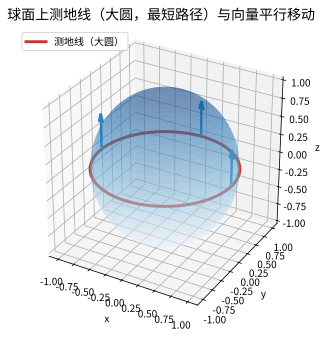

# 第 42 级：微分几何 (Differential Geometry)

> 微分几何是一门用微积分和线性代数工具研究光滑流形（微分流形）的几何结构的学科。它起源于曲线和曲面的古典微分几何，经过 Gauss、Riemann、Cartan、陈省身等数学家的开创性工作，发展成为现代数学的核心分支之一，深刻影响着拓扑学、物理学（特别是广义相对论和规范场论）、以及诸多应用领域。

---

## 1. 学习目标

1. 理解光滑流形的基本概念，掌握切空间、切丛、光滑映射等核心工具。
2. 掌握向量场、张量场、微分形式等流形上的分析工具。
3. 理解外微分运算与 de Rham 上同调理论，掌握流形上的 Stokes 定理。
4. 理解联络与曲率的概念，掌握 Levi-Civita 联络与 Bianchi 恒等式。
5. 掌握黎曼几何的核心理论：测地线、指数映射、Hopf-Rinow 定理、各种曲率概念。
6. 理解 Gauss-Bonnet 定理及其推广，感受几何与拓扑的深刻联系。
7. 掌握 Lie 导数与 Killing 向量场，理解等距变换与对称性。
8. 通过大量示例和习题培养几何直观与计算能力。

---

## 2. 光滑流形

### 2.1 光滑流形的定义

**定义 2.1**（拓扑流形）设 $M$ 是一个 Hausdorff 拓扑空间，且满足第二可数公理。称 $M$ 是一个 **$n$ 维拓扑流形**（topological manifold），若每点 $p \in M$ 都有一个邻域同胚于 $\mathbb{R}^n$ 中的某个开集。

**定义 2.2**（光滑结构）设 $M$ 是 $n$ 维拓扑流形。$M$ 上的一个 **光滑结构**（smooth structure）是一个坐标图册 $\mathcal{A} = \{(U_\alpha, \varphi_\alpha)\}$，其中：

- $\{U_\alpha\}$ 是 $M$ 的开覆盖；
- 每个 $\varphi_\alpha: U_\alpha \to \tilde{U}_\alpha \subseteq \mathbb{R}^n$ 是同胚；
- 对任意 $\alpha, \beta$，转移映射 $\varphi_\beta \circ \varphi_\alpha^{-1}: \varphi_\alpha(U_\alpha \cap U_\beta) \to \varphi_\beta(U_\alpha \cap U_\beta)$ 是 $C^\infty$（光滑）的；
- 图册是极大的（包含所有与之相容的坐标卡）。

带有光滑结构的拓扑流形称为 **光滑流形**（smooth manifold）。

**例 2.3**
- $\mathbb{R}^n$ 是光滑流形，由单个坐标卡 $(\mathbb{R}^n, \text{id})$ 覆盖。
- 单位圆 $S^1$ 是 1 维光滑流形。
- 球面 $S^n = \{x \in \mathbb{R}^{n+1} \mid \|x\| = 1\}$ 是 $n$ 维光滑流形，可用球极投影给出坐标卡。
- 环面 $T^n = S^1 \times \cdots \times S^1$ 是 $n$ 维光滑流形。

### 2.2 切空间与切丛

**定义 2.4**（切向量）设 $M$ 是光滑流形，$p \in M$。$M$ 在 $p$ 处的 **切向量** 是一个 $\mathbb{R}$-线性映射 $v: C^\infty(M) \to \mathbb{R}$，满足 **Leibniz 法则**：

$$
v(fg) = f(p) \, v(g) + g(p) \, v(f), \quad \forall f, g \in C^\infty(M).
$$

所有切向量的集合构成一个 $n$ 维向量空间，称为 $M$ 在 $p$ 处的 **切空间**（tangent space），记作 $T_p M$。

**定义 2.5**（坐标基）设 $(U, x^1, \ldots, x^n)$ 是 $p$ 附近的局部坐标。则切向量

$$
\frac{\partial}{\partial x^i}\Big|_p: f \mapsto \frac{\partial (f \circ \varphi^{-1})}{\partial x^i}(\varphi(p))
$$

构成 $T_p M$ 的一组基。任何 $v \in T_p M$ 可唯一表示为

$$
v = \sum_{i=1}^n v^i \frac{\partial}{\partial x^i}\Big|_p,\quad v^i = v(x^i).
$$

**定义 2.6**（切丛）$M$ 的 **切丛**（tangent bundle）是

$$
TM = \bigsqcup_{p \in M} T_p M,
$$

自然投射 $\pi: TM \to M$ 将 $v \in T_p M$ 映射到 $p$。$TM$ 本身是一个 $2n$ 维光滑流形，其光滑结构由 $M$ 的光滑结构诱导。

**定义 2.7**（余切丛与余切向量）$T_p M$ 的对偶空间 $T_p^* M$ 称为 **余切空间**（cotangent space）。其元素称为 **余切向量**（covector）。局部坐标 $(x^i)$ 下，$dx^i|_p$ 构成 $T_p^* M$ 的对偶基，满足

$$
dx^i\Big|_p\left(\frac{\partial}{\partial x^j}\Big|_p\right) = \delta^i_j.
$$

余切丛 $T^*M = \bigsqcup_{p \in M} T_p^* M$ 是 $2n$ 维光滑流形。

### 2.3 光滑映射

**定义 2.8**（光滑映射）设 $M, N$ 是光滑流形，映射 $F: M \to N$ 称为 **光滑映射**（smooth map），若对任意坐标卡 $(U, \varphi)$ 和 $(V, \psi)$，映射 $\psi \circ F \circ \varphi^{-1}$ 在定义域上是 $C^\infty$ 的。

**定义 2.9**（微分/切映射）光滑映射 $F: M \to N$ 在 $p \in M$ 处的 **微分**（differential）或 **切映射**（tangent map）是线性映射

$$
dF_p: T_p M \to T_{F(p)} N,
$$

定义为：对 $v \in T_p M$ 和 $f \in C^\infty(N)$，

$$
(dF_p(v))(f) = v(f \circ F).
$$

在局部坐标下，$dF_p$ 由 Jacobi 矩阵表示。

### 2.4 浸入、浸没与嵌入

**定义 2.10** 设 $F: M \to N$ 是光滑映射，$\dim M = m$，$\dim N = n$。

- 若 $dF_p$ 在每点 $p \in M$ 都是单射，则称 $F$ 为 **浸入**（immersion）。（此时 $m \leq n$）
- 若 $dF_p$ 在每点 $p \in M$ 都是满射，则称 $F$ 为 **浸没**（submersion）。（此时 $m \geq n$）
- 若 $F$ 是浸入，且 $F: M \to F(M) \subseteq N$ 是同胚（$F(M)$ 赋予子空间拓扑），则称 $F$ 为 **嵌入**（embedding）。

**例 2.11**
- 包含映射 $S^2 \hookrightarrow \mathbb{R}^3$ 是嵌入。
- 曲线 $t \mapsto (t^2, t^3)$ 在 $\mathbb{R}^2$ 中是浸入但不是嵌入（在原点处有尖点）。
- 投影 $\mathbb{R}^3 \to \mathbb{R}^2$ 是浸没。

**定理 2.12**（浸没定理）若 $F: M \to N$ 是浸没，则对任意 $q \in N$，$F^{-1}(q)$ 是 $M$ 的 $\dim M - \dim N$ 维子流形。

**定理 2.13**（Whitney 嵌入定理）每个 $n$ 维光滑流形可以光滑地嵌入到 $\mathbb{R}^{2n}$ 中。

Whitney 嵌入定理表明，抽象光滑流形总可以视为欧氏空间的子流形，这大大简化了几何直觉。

> **直观理解（现实类比）**：嵌入与浸入是研究"第二基本形式"的舞台——后者专门刻画子流形如何嵌入到外围空间。把子流形想象成一张悬浮在三维空间中的薄膜：第一基本形式量出薄膜上"蚂蚁能测的"距离与角度（内蕴量），而第二基本形式则像"测量弯曲的工具"，回答薄膜在每一点沿每个方向"往哪一侧鼓、鼓得多厉害"（外蕴量）。它输入切向量返回法向量方向的曲率，是薄膜与外围空间的"弯曲关系说明书"。浸入允许薄膜自交，而嵌入则禁止自交——这正是 Nash 嵌入定理能保证任何抽象度量都可在足够高维的 $\mathbb{R}^N$ 中"无自交地实现"的几何背景。

---

## 3. 向量场与张量场

### 3.1 向量场

**定义 3.1**（向量场）$M$ 上的一个 **光滑向量场**（vector field）是一个光滑映射 $X: M \to TM$，满足 $\pi \circ X = \text{id}_M$，即 $X_p \in T_p M$ 对每点 $p$ 成立。

向量场 $X$ 可视为 $C^\infty(M)$ 上的导子：对 $f \in C^\infty(M)$，定义 $X(f) \in C^\infty(M)$ 为

$$
(X(f))(p) = X_p(f).
$$

**例 3.2** 在 $\mathbb{R}^2$ 中，$X = x \frac{\partial}{\partial x} + y \frac{\partial}{\partial y}$ 是一个向量场。

**流与单参数变换群**：给定向量场 $X$，对每点 $p \in M$，存在唯一的积分曲线 $\gamma_p(t)$ 满足

$$
\gamma_p(0) = p,\quad \gamma_p'(t) = X_{\gamma_p(t)}.
$$

由此定义 **流**（flow）$\phi_t: M \to M$，$\phi_t(p) = \gamma_p(t)$，在局部上满足 $\phi_{t+s} = \phi_t \circ \phi_s$。

### 3.2 Lie 括号

**定义 3.3**（Lie 括号）设 $X, Y$ 是 $M$ 上的光滑向量场。它们的 **Lie 括号**（Lie bracket）$[X, Y]$ 是向量场，定义为

$$
[X, Y]_p(f) = X_p(Y(f)) - Y_p(X(f)), \quad \forall f \in C^\infty(M).
$$

在局部坐标 $(x^i)$ 下，若 $X = X^i \partial_i$，$Y = Y^i \partial_i$，则

$$
[X, Y] = \left( X^j \frac{\partial Y^i}{\partial x^j} - Y^j \frac{\partial X^i}{\partial x^j} \right) \frac{\partial}{\partial x^i}.
$$

**性质 3.4**（Lie 括号的性质）
- 反交换性：$[X, Y] = -[Y, X]$；
- Jacobi 恒等式：$[X, [Y, Z]] + [Y, [Z, X]] + [Z, [X, Y]] = 0$；
- Leibniz 法则：$[X, fY] = f[X, Y] + (Xf)Y$。

### 3.3 张量场

**定义 3.5**（$(r, s)$-型张量场）$M$ 上的一个 **$(r, s)$-型光滑张量场**（tensor field）$T$ 是一个光滑映射，在每点 $p \in M$ 给出一个多重线性映射

$$
T_p: \underbrace{T_p^* M \times \cdots \times T_p^* M}_{r\text{ 个}} \times \underbrace{T_p M \times \cdots \times T_p M}_{s\text{ 个}} \to \mathbb{R}.
$$

在局部坐标下，

$$
T = T^{i_1 \ldots i_r}_{j_1 \ldots j_s} \frac{\partial}{\partial x^{i_1}} \otimes \cdots \otimes \frac{\partial}{\partial x^{i_r}} \otimes dx^{j_1} \otimes \cdots \otimes dx^{j_s}.
$$

**例 3.6**
- $(0,0)$-型张量场就是光滑函数。
- $(1,0)$-型张量场就是向量场。
- $(0,1)$-型张量场就是余切向量场（1-形式）。
- Riemann 度量是 $(0,2)$-型对称正定张量场。

### 3.4 Riemann 度量

**定义 3.7**（Riemann 度量）$M$ 上的一个 **Riemann 度量**（Riemannian metric）$g$ 是一个 $(0,2)$-型光滑对称正定张量场。即对每点 $p$，$g_p: T_p M \times T_p M \to \mathbb{R}$ 是内积。在局部坐标 $(x^i)$ 下，

$$
g = g_{ij} \, dx^i \otimes dx^j, \quad g_{ij} = g\left(\frac{\partial}{\partial x^i}, \frac{\partial}{\partial x^j}\right),
$$

其中 $(g_{ij})$ 是光滑对称正定矩阵值函数。

带有 Riemann 度量的光滑流形称为 **Riemann 流形**（Riemannian manifold）。

**例 3.8**
- $\mathbb{R}^n$ 上的标准度量 $g = \sum_{i=1}^n dx^i \otimes dx^i$。
- 球面 $S^n$ 从 $\mathbb{R}^{n+1}$ 继承的诱导度量。
- 双曲空间 $\mathbb{H}^n$ 上的 Poincaré 度量 $g = \frac{4}{(1 - |x|^2)^2} \sum_{i=1}^n dx^i \otimes dx^i$。

> **直观理解（现实类比）**：对于 $\mathbb{R}^3$ 中嵌入的曲面，Riemann 度量 $g_{ij}=E\,du^2+2F\,du\,dv+G\,dv^2$ 就是经典微分几何中的 **第一基本形式**——一把"测量长度的工具"。它像贴在曲面上的一张"画满刻度的弹性膜"，蚂蚁用它就能量出任意两条相交切向量的长度与夹角、算出小区域的面积、定义曲面上的"最短路径"。第一基本形式只关心曲面内部的几何（内蕴量），完全不看曲面如何嵌入三维空间——这是高斯绝妙定理"曲率内蕴"的伏笔。抽象 Riemann 流形上的 $g$ 正是这一"长度规则"脱离外围空间后的独立存在。

### 3.5 微分形式

**定义 3.9**（微分形式）$M$ 上的 **$k$-次微分形式**（differential $k$-form）$\omega$ 是一个 $(0,k)$-型全反对称张量场。即 $\omega_p$ 是 $T_p M$ 上的 $k$ 重交错线性形式。

在局部坐标下，

$$
\omega = \frac{1}{k!} \omega_{i_1 \ldots i_k} \, dx^{i_1} \wedge \cdots \wedge dx^{i_k},
$$

其中 $\wedge$ 表示外积（wedge product），$\omega_{i_1 \ldots i_k}$ 关于指标全反对称。

所有 $k$-次微分形式的集合记作 $\Omega^k(M)$。外积 $\wedge: \Omega^k(M) \times \Omega^l(M) \to \Omega^{k+l}(M)$ 满足超交换性：

$$
\omega \wedge \eta = (-1)^{kl} \eta \wedge \omega.
$$

---

## 4. 外微分与积分

### 4.1 外导数

**定义 4.1**（外导数）**外导数**（exterior derivative）$d: \Omega^k(M) \to \Omega^{k+1}(M)$ 是唯一满足以下性质的 $\mathbb{R}$-线性映射：

1. 对 $k=0$，$d f$ 是函数的普通微分，即 $d f(X) = X(f)$；
2. $d^2 = 0$（即 $d(d\omega) = 0$）；
3. 对 $\omega \in \Omega^k(M)$ 和 $\eta \in \Omega^l(M)$，
   $$
   d(\omega \wedge \eta) = d\omega \wedge \eta + (-1)^k \omega \wedge d\eta.
   $$

在局部坐标下，若 $\omega = \omega_I \, dx^{i_1} \wedge \cdots \wedge dx^{i_k}$，则

$$
d\omega = d\omega_I \wedge dx^{i_1} \wedge \cdots \wedge dx^{i_k} = \frac{\partial \omega_I}{\partial x^j} \, dx^j \wedge dx^{i_1} \wedge \cdots \wedge dx^{i_k}.
$$

**性质 4.2** $d\omega = 0$ 的 $k$-形式称为 **闭形式**（closed form）。存在 $\eta$ 使得 $\omega = d\eta$ 的 $k$-形式称为 **恰当形式**（exact form）。由于 $d^2 = 0$，每个恰当形式都是闭的，但反之不一定成立。

### 4.2 de Rham 上同调

**定义 4.3**（de Rham 上同调）光滑流形 $M$ 的 **$k$ 次 de Rham 上同调群**（de Rham cohomology）定义为

$$
H^k_{\text{dR}}(M) = \frac{\ker(d: \Omega^k(M) \to \Omega^{k+1}(M))}{\operatorname{im}(d: \Omega^{k-1}(M) \to \Omega^k(M))}.
$$

即 $k$ 次闭形式模 $k$ 次恰当形式。

**定理 4.4**（de Rham 定理）de Rham 上同调群 $H^k_{\text{dR}}(M)$ 同构于 $M$ 的奇异上同调群 $H^k(M; \mathbb{R})$。因此，de Rham 上同调是拓扑不变量。

**例 4.5**
- $H^0_{\text{dR}}(M) \cong \mathbb{R}^{\text{连通分支数}}$。
- $H^k_{\text{dR}}(\mathbb{R}^n) = 0$ 对 $k \geq 1$（Poincaré 引理）。
- $H^1_{\text{dR}}(S^1) \cong \mathbb{R}$，生成元是 $\frac{1}{2\pi} d\theta$。
- $H^k_{\text{dR}}(S^n) \cong \mathbb{R}$ 当 $k = 0$ 或 $k = n$，否则为 $0$。

### 4.3 流形上的积分

**定义 4.6**（定向流形）光滑流形 $M$ 称为 **可定向的**（orientable），若 $M$ 上存在一个处处非零的 $n$-形式（$n = \dim M$）。选取这样一个 $n$-形式等价于给 $M$ 指定一个 **定向**（orientation）。

**定向流形上的积分**：设 $M$ 是 $n$ 维定向光滑流形，$\omega \in \Omega^n_c(M)$（紧支撑的 $n$-形式）。通过单位分解将 $\omega$ 分解到坐标卡上，在每个坐标卡上 $\omega = f \, dx^1 \wedge \cdots \wedge dx^n$，定义

$$
\int_M \omega = \sum_\alpha \int_{\varphi_\alpha(U_\alpha)} (\rho_\alpha f_\alpha) \circ \varphi_\alpha^{-1} \, dx^1 \cdots dx^n,
$$

其中 $\{\rho_\alpha\}$ 是从属于覆盖 $\{U_\alpha\}$ 的单位分解。此定义不依赖于坐标卡和单位分解的选取。

### 4.4 Stokes 定理

**定理 4.7**（Stokes 定理）设 $M$ 是 $n$ 维定向带边光滑流形，$\partial M$ 带有诱导定向。对任意紧支撑的 $(n-1)$-形式 $\omega$，

$$
\int_M d\omega = \int_{\partial M} \omega.
$$

**证明概要**：
1. 利用单位分解将问题化归到 $\omega$ 支撑在 $\mathbb{R}^n$ 或 $\mathbb{H}^n = \{x \in \mathbb{R}^n \mid x^1 \leq 0\}$ 的局部情形。
2. 在 $\mathbb{R}^n$ 内部，$\omega = \sum_{i=1}^n (-1)^{i-1} f_i \, dx^1 \wedge \cdots \wedge \widehat{dx^i} \wedge \cdots \wedge dx^n$，则 $d\omega = \left(\sum_i \frac{\partial f_i}{\partial x^i}\right) dx^1 \wedge \cdots \wedge dx^n$。由 Fubini 定理和 Newton-Leibniz 公式，$\int_{\mathbb{R}^n} d\omega = 0$。
3. 在 $\mathbb{H}^n$ 边界 $x^1 = 0$ 处，仅 $i=1$ 项有贡献，得到 $\int_{\mathbb{H}^n} d\omega = \int_{\partial \mathbb{H}^n} \omega$。
4. 通过单位分解拼合局部结果，完成证明。

Stokes 定理是微积分基本定理的高维推广，它将流形上的积分与边界上的积分联系起来，是微分几何和拓扑学中最重要的定理之一。

---

## 5. 联络与曲率

### 5.1 向量丛上的联络

**定义 5.1**（向量丛）$M$ 上的一个 **向量丛**（vector bundle）$E$ 是一个光滑流形，配有光滑满射 $\pi: E \to M$，使得每根纤维 $E_p = \pi^{-1}(p)$ 是 $r$ 维向量空间，且局部平凡化：每点有邻域 $U$ 和微分同胚 $\Phi: \pi^{-1}(U) \to U \times \mathbb{R}^r$，使得 $\Phi|_{E_p}: E_p \to \{p\} \times \mathbb{R}^r$ 是线性同构。

**定义 5.2**（联络）设 $E \to M$ 是向量丛。$E$ 上的一个 **联络**（connection）是一个 $\mathbb{R}$-线性映射

$$
\nabla: \Gamma(E) \to \Gamma(T^*M \otimes E),
$$

满足 **Leibniz 法则**：

$$
\nabla(f s) = df \otimes s + f \nabla s, \quad \forall f \in C^\infty(M),\; s \in \Gamma(E).
$$

对向量场 $X$，记 $\nabla_X s = \iota_X(\nabla s) \in \Gamma(E)$，称为 $s$ 沿 $X$ 方向的 **协变导数**（covariant derivative）。

### 5.2 切丛上的联络与曲率张量

当 $E = TM$ 时，联络 $\nabla$ 称为 **仿射联络**（affine connection）。

**定义 5.3**（Christoffel 符号）在局部坐标 $(x^i)$ 下，联络 $\nabla$ 由 **Christoffel 符号** $\Gamma^k_{ij}$ 确定：

$$
\nabla_{\partial_i} \partial_j = \Gamma^k_{ij} \partial_k.
$$

**定义 5.4**（挠率张量）联络 $\nabla$ 的 **挠率张量**（torsion tensor）$T$ 是 $(1,2)$-型张量场：

$$
T(X, Y) = \nabla_X Y - \nabla_Y X - [X, Y].
$$

若 $T = 0$，称联络是 **无挠的**（torsion-free）。

**定义 5.5**（曲率张量）联络 $\nabla$ 的 **曲率张量**（curvature tensor）$R$ 是 $(1,3)$-型张量场：

$$
R(X, Y)Z = \nabla_X \nabla_Y Z - \nabla_Y \nabla_X Z - \nabla_{[X, Y]} Z.
$$

在局部坐标下，$R(\partial_i, \partial_j)\partial_k = R_{kij}^l \partial_l$，其中

$$
R_{kij}^l = \partial_i \Gamma^l_{jk} - \partial_j \Gamma^l_{ik} + \Gamma^m_{jk} \Gamma^l_{im} - \Gamma^m_{ik} \Gamma^l_{jm}.
$$

### 5.3 Levi-Civita 联络

**定理 5.6**（Levi-Civita 联络的基本定理）在 Riemann 流形 $(M, g)$ 上，存在唯一的联络 $\nabla$ 满足：
1. 无挠性：$T = 0$；
2. 与度量相容：$\nabla g = 0$，即 $Z(g(X, Y)) = g(\nabla_Z X, Y) + g(X, \nabla_Z Y)$。

这个联络称为 **Levi-Civita 联络**（Levi-Civita connection）。

**Christoffel 符号的计算公式**：

$$
\Gamma^k_{ij} = \frac{1}{2} g^{kl} \left( \frac{\partial g_{jl}}{\partial x^i} + \frac{\partial g_{il}}{\partial x^j} - \frac{\partial g_{ij}}{\partial x^l} \right),
$$

其中 $(g^{ij})$ 是 $(g_{ij})$ 的逆矩阵。

### 5.4 Bianchi 恒等式

**定理 5.7**（Bianchi 恒等式）对 Levi-Civita 联络，曲率张量满足：

1. **第一 Bianchi 恒等式**：
   $$
   R(X, Y)Z + R(Y, Z)X + R(Z, X)Y = 0.
   $$

2. **第二 Bianchi 恒等式**：
   $$
   (\nabla_W R)(X, Y)Z + (\nabla_X R)(Y, W)Z + (\nabla_Y R)(W, X)Z = 0.
   $$

在局部坐标下，第二 Bianchi 恒等式写作

$$
\nabla_i R_{jkl}^m + \nabla_j R_{kil}^m + \nabla_k R_{ijl}^m = 0.
$$

---

## 6. 黎曼几何

### 6.1 Riemann 流形与测地线

**定义 6.1**（Riemann 流形）配备 Riemann 度量 $g$ 的光滑流形 $M$ 称为 **Riemann 流形**（Riemannian manifold）。

**定义 6.2**（测地线）光滑曲线 $\gamma: I \to M$ 称为 **测地线**（geodesic），若其切向量场 $\gamma'(t)$ 沿 $\gamma$ 平行移动，即

$$
\nabla_{\gamma'(t)} \gamma'(t) = 0.
$$

在局部坐标下，测地线满足 **测地线方程**：

$$
\ddot{x}^k + \Gamma^k_{ij} \dot{x}^i \dot{x}^j = 0,
$$

其中 $\dot{x}^i = dx^i/dt$。这是二阶常微分方程组，由初值 $\gamma(0) = p$ 和 $\gamma'(0) = v \in T_p M$ 唯一确定解。

> **直观理解（现实类比）**：把测地线想成飞机的"大圆航线"。从北京飞纽约，看似该走地图上的"直线"，实际却沿一段大圆弧绕极地飞行——因为球面上两点间的最短路径正是这段大圆测地线。所谓"平行移动"，就像你推着一辆指南针小车沿大圆前进，始终让车头指向正前方、不向左也不向右打方向盘（$\nabla_{\gamma'}\gamma'=0$），这样它走的轨迹就是"弯曲空间里的直线"。测地线就是"油门踩直、方向盘不动的自由滑行"在弯曲流形上的推广。

### 6.2 指数映射

**定义 6.3**（指数映射）对 $p \in M$，定义 **指数映射**（exponential map）

$$
\exp_p: T_p M \to M,
$$

满足 $\exp_p(v) = \gamma_v(1)$，其中 $\gamma_v$ 是满足 $\gamma_v(0) = p$、$\gamma_v'(0) = v$ 的唯一测地线。

**定理 6.4**（指数映射的性质）
- $\exp_p$ 在 $0 \in T_p M$ 处是局部微分同胚（其微分 $d(\exp_p)_0 = \text{id}$）。
- 存在 $p$ 的邻域 $U$（称为 **法邻域**，normal neighborhood），使得 $\exp_p$ 将 $T_p M$ 中的开球微分同胚地映到 $U$。

**定义 6.5**（测地线完备性）Riemann 流形 $M$ 称为 **测地线完备的**（geodesically complete），若对任意 $p \in M$ 和 $v \in T_p M$，测地线 $\gamma_v(t)$ 对所有 $t \in \mathbb{R}$ 有定义。

### 6.3 Hopf-Rinow 定理

**定理 6.6**（Hopf-Rinow 定理）对连通 Riemann 流形 $(M, g)$，以下条件等价：

1. $M$ 是测地线完备的；
2. $M$ 作为度量空间（由 Riemann 度量诱导的距离函数 $d$）是完备的；
3. $M$ 中的有界闭集是紧的。

此外，在这些条件下，任意两点间存在一条最短测地线。

Hopf-Rinow 定理是 Riemann 几何的基本定理，它建立了几何完备性与度量空间完备性的等价关系。

### 6.4 曲率

**定义 6.7**（截面曲率）设 $p \in M$，$\Pi \subseteq T_p M$ 是二维子空间，由向量 $u, v$ 张成。**截面曲率**（sectional curvature）定义为

$$
K(\Pi) = \frac{g(R(u, v)v, u)}{g(u, u) g(v, v) - g(u, v)^2}.
$$

截面曲率不依赖于 $u, v$ 的选取，只依赖于平面 $\Pi$。

> **直观理解（现实类比）**：当 $M$ 是二维曲面时，切空间只有一个二维平面，截面曲率就退化为 **高斯曲率** $K$——它是"内在弯曲"的总量，与曲面如何嵌入三维空间无关。想象一只住在曲面上的蚂蚁：它看不到外围的三维空间，却能量出小三角形的内角和——若和大于 $\pi$ 说明 $K>0$（像球面），等于 $\pi$ 说明 $K=0$（像平面或圆柱），小于 $\pi$ 说明 $K<0$（像马鞍）。高斯绝妙定理正是断言 $K$ 完全由第一基本形式决定：把一张纸卷成圆柱，第一基本形式不变故 $K$ 仍为 $0$；而把球面无论怎么"揉"，$K$ 都改变不了。

**定义 6.8**（Ricci 曲率）**Ricci 曲率张量**（Ricci curvature tensor）是 $(0,2)$-型张量：

$$
\operatorname{Ric}(X, Y) = \operatorname{tr}(v \mapsto R(v, X)Y).
$$

在局部坐标下，$\operatorname{Ric}_{ij} = R_{ikj}^k$。

**定义 6.9**（数量曲率）**数量曲率**（scalar curvature）$S$ 是 Ricci 曲率的迹：

$$
S = \operatorname{tr}_g \operatorname{Ric} = g^{ij} \operatorname{Ric}_{ij}.
$$

**例 6.10**（常曲率空间）
- **欧氏空间** $\mathbb{R}^n$：$K = 0$，$\operatorname{Ric} = 0$，$S = 0$。
- **球面** $S^n(r)$（半径为 $r$）：$K = 1/r^2$，$\operatorname{Ric}_{ij} = ((n-1)/r^2) g_{ij}$，$S = n(n-1)/r^2$。
- **双曲空间** $\mathbb{H}^n$：$K = -1$，$\operatorname{Ric}_{ij} = -(n-1) g_{ij}$，$S = -n(n-1)$。

> **直观理解（现实类比）**：把高斯曲率想成曲面"鼓不鼓、扭不扭"的味道。像西瓜皮那样向外鼓的球面，每点 $K>0$；像马鞍那样中间凹下去、两头翘起来的曲面，每点 $K<0$；而铺平的纸面、或者圆柱的侧面，都能"展平"成平面，故 $K=0$。高斯曲率最神奇之处是它**内蕴**——一只住在曲面上的蚂蚁不借助三维空间，只靠量距离、量夹角就能算出 $K$，这正是"高斯绝妙定理"：$\mathbb{R}^3$ 中嵌入的曲面，其曲率其实由曲面自带的内在度量决定，与它如何嵌入无关。

---

## 7. Gauss-Bonnet 定理

### 7.1 曲面的 Gauss-Bonnet 定理

**定理 7.1**（Gauss-Bonnet 定理，局部形式）设 $(M, g)$ 是定向 Riemann 曲面，$D \subset M$ 是紧带边区域，边界的测地曲率为 $\kappa_g$，则

$$
\int_D K \, dA + \int_{\partial D} \kappa_g \, ds = 2\pi \chi(D),
$$

其中 $K$ 是 Gauss 曲率，$dA$ 是面积元，$ds$ 是弧长元，$\chi(D)$ 是 $D$ 的 Euler 示性数。

> **直观理解（现实类比）**：测地曲率 $\kappa_g$ 像"偏离最短路径的程度"——它度量一条曲线在曲面内"偏离测地线"的量。想象你在山地上行走：若始终沿"最省力的直道"（测地线）走，$\kappa_g=0$，方向盘不偏不倚；若你刻意绕弯看风景，曲线在曲面内就会"扭"，$\kappa_g$ 正是这种"方向盘转动"在曲面内部的分量。Gauss-Bonnet 公式 $\int_D K\,dA+\int_{\partial D}\kappa_g\,ds=2\pi\chi(D)$ 把"内部弯曲总量"与"边界偏离测地线的总量"绑在一起：二者之和只由拓扑不变量 $\chi$ 决定，像一张"曲率守恒账单"，无论你怎么变形曲面，这笔账总是平的。

**证明概要**：
1. 在 $D$ 上选取正交标架场 $\{e_1, e_2\}$，设 $\omega^1, \omega^2$ 为对偶余标架，联络形式 $\omega^1_2$ 满足结构方程 $d\omega^1 = \omega^2 \wedge \omega^1_2$，$d\omega^2 = \omega^1 \wedge \omega^2_1$（其中 $\omega^2_1 = -\omega^1_2$）。
2. Gauss 曲率满足 $K \, dA = d\omega^1_2$（Gauss 方程）。
3. 对 $D$ 应用 Stokes 定理：$\int_D K \, dA = \int_D d\omega^1_2 = \int_{\partial D} \omega^1_2$。
4. 在边界 $\partial D$ 上，$\omega^1_2 = \kappa_g \, ds - d\theta$，其中 $\theta$ 是切向量与参考方向的夹角。
5. 由 Hopf 旋转指标定理，$\int_{\partial D} d\theta = 2\pi \chi(D)$，代入即得结论。

**定理 7.2**（Gauss-Bonnet 定理，全局形式）对紧无边的定向 Riemann 曲面 $(M, g)$，

$$
\int_M K \, dA = 2\pi \chi(M).
$$

这是几何与拓扑之间最深刻的联系之一：曲率积分完全由拓扑不变量（Euler 示性数）决定。

**例 7.3**
- 球面 $S^2$：$\chi(S^2) = 2$，$\int_{S^2} K \, dA = 4\pi$。对标准球面 $K = 1$，面积为 $4\pi$，一致。
- 环面 $T^2$：$\chi(T^2) = 0$，$\int_{T^2} K \, dA = 0$。这并不意味着 $K = 0$，而是曲率的正负部分相互抵消。
- 亏格 $g$ 的曲面：$\chi = 2 - 2g$，$\int_M K \, dA = 4\pi(1 - g)$。

### 7.2 Chern-Gauss-Bonnet 定理

**定理 7.4**（Chern-Gauss-Bonnet 定理，陈省身，1944）设 $M$ 是 $2n$ 维紧无边的定向 Riemann 流形，则

$$
\int_M \operatorname{Pf}\left( \frac{\Omega}{2\pi} \right) = \chi(M),
$$

其中 $\Omega$ 是 Levi-Civita 联络的曲率 $2$-形式矩阵，$\operatorname{Pf}$ 表示 Pfaffian，$\operatorname{Pf}(\Omega/2\pi)$ 是 $2n$-形式，称为 **Euler 形式**。

更具体地，对 $2n$ 维 Riemann 流形，

$$
\chi(M) = \frac{(-1)^n}{2^{2n} \pi^n n!} \int_M \varepsilon^{i_1 \ldots i_{2n}} \Omega_{i_1 i_2} \wedge \cdots \wedge \Omega_{i_{2n-1} i_{2n}},
$$

其中 $\varepsilon$ 是 Levi-Civita 符号。

Chern-Gauss-Bonnet 定理是 Gauss-Bonnet 定理向高维的深刻推广，也是陈省身的奠基性贡献之一。

### 7.3 应用

1. **曲面分类**：Gauss-Bonnet 定理表明，紧定向曲面的 Euler 示性数（从而拓扑类型）完全由曲率积分决定。例如，具有正曲率的紧定向曲面只能是 $S^2$ 或 $\mathbb{R}P^2$。
2. **等距嵌入的障碍**：若曲面可等距嵌入 $\mathbb{R}^3$，则其 Gauss 曲率积分必须满足 Gauss-Bonnet 公式，这给出了嵌入可能性的必要条件。
3. **高维推广**：Chern-Gauss-Bonnet 定理开创了示性类理论，推动了整个微分几何与拓扑学的发展。

---

## 8. Lie 导数与 Killing 向量场

### 8.1 Lie 导数

**定义 8.1**（Lie 导数）设 $X$ 是 $M$ 上的光滑向量场，$\phi_t$ 是 $X$ 生成的流。$M$ 上张量场 $T$ 沿 $X$ 方向的 **Lie 导数**（Lie derivative）定义为

$$
\mathcal{L}_X T = \lim_{t \to 0} \frac{\phi_t^* T - T}{t}.
$$

**Lie 导数的性质**：
- 对函数 $f$：$\mathcal{L}_X f = X(f)$；
- 对向量场 $Y$：$\mathcal{L}_X Y = [X, Y]$；
- 对 $k$-形式 $\omega$：$\mathcal{L}_X \omega = d(\iota_X \omega) + \iota_X(d\omega)$（Cartan 魔术公式）；
- 对一般张量场，$\mathcal{L}_X$ 通过 Leibniz 法则作用。

**例 8.2** 在 $\mathbb{R}^2$ 中，$X = -y \frac{\partial}{\partial x} + x \frac{\partial}{\partial y}$（旋转向量场），则 $\mathcal{L}_X (dx \wedge dy) = 0$，说明旋转保持面积。

### 8.2 Killing 向量场

**定义 8.3**（Killing 向量场）Riemann 流形 $(M, g)$ 上的向量场 $X$ 称为 **Killing 向量场**（Killing vector field），若

$$
\mathcal{L}_X g = 0,
$$

即 $X$ 生成的流 $\phi_t$ 是等距映射（isometry）。

**Killing 方程**：在局部坐标下，$\mathcal{L}_X g = 0$ 等价于

$$
\nabla_i X_j + \nabla_j X_i = 0,
$$

其中 $X_i = g_{ij} X^j$，$\nabla$ 是 Levi-Civita 联络。这称为 **Killing 方程**（Killing equation）。

**性质 8.4**（Killing 向量场的性质）
- Killing 向量场的集合构成一个 Lie 代数（在 Lie 括号下），对应于 $M$ 的等距群（isometry group）的 Lie 代数。
- 若 $X$ 是 Killing 向量场，则沿测地线 $\gamma$，$g(\gamma'(t), X_{\gamma(t)})$ 是常数（**守恒律**）。

### 8.3 等距

**定义 8.5**（等距）Riemann 流形间的光滑映射 $F: (M, g_M) \to (N, g_N)$ 称为 **等距**（isometry），若 $F^* g_N = g_M$，即

$$
g_N(dF_p(u), dF_p(v)) = g_M(u, v), \quad \forall u, v \in T_p M.
$$

若 $F$ 是微分同胚且为等距，则称 $M$ 与 $N$ **等距**（isometric）。

**例 8.6**
- $\mathbb{R}^n$ 中的平移、旋转、反射都是等距。
- 球面 $S^n$ 的等距群是 $O(n+1)$。
- 双曲平面 $\mathbb{H}^2$ 的等距群是 $PSL(2, \mathbb{R})$。

---

## 9. 示例

### 示例 1：球面 $S^2$ 上的标准度量

**问题**：在球面 $S^2 = \{(\sin\theta\cos\phi, \sin\theta\sin\phi, \cos\theta) \in \mathbb{R}^3\}$ 上，写出诱导 Riemann 度量，并计算 Gauss 曲率。

**解**：球面从 $\mathbb{R}^3$ 继承的诱导度量在球坐标 $(\theta, \phi)$ 下为

$$
g = d\theta^2 + \sin^2\theta \, d\phi^2.
$$

计算 Christoffel 符号：

$$
g_{ij} = \begin{pmatrix} 1 & 0 \\ 0 & \sin^2\theta \end{pmatrix},\quad
g^{ij} = \begin{pmatrix} 1 & 0 \\ 0 & \csc^2\theta \end{pmatrix}.
$$

非零的 $\Gamma^k_{ij}$ 为：

$$
\Gamma^\theta_{\phi\phi} = -\sin\theta\cos\theta,\quad
\Gamma^\phi_{\theta\phi} = \Gamma^\phi_{\phi\theta} = \cot\theta.
$$

曲率张量的非零分量：

$$
R^\theta_{\phi\theta\phi} = \sin^2\theta.
$$

Gauss 曲率：

$$
K = \frac{R^\theta_{\phi\theta\phi}}{\det(g)} = \frac{\sin^2\theta}{\sin^2\theta} = 1.
$$

因此 $S^2$ 的 Gauss 曲率处处为 $+1$，与预期一致。

---

### 示例 2：双曲平面 $\mathbb{H}^2$

**问题**：双曲平面 $\mathbb{H}^2 = \{(x, y) \in \mathbb{R}^2 \mid y > 0\}$ 上的 Poincaré 度量为 $g = \frac{dx^2 + dy^2}{y^2}$。计算其 Gauss 曲率。

**解**：度量矩阵为

$$
g_{ij} = \begin{pmatrix} 1/y^2 & 0 \\ 0 & 1/y^2 \end{pmatrix}.
$$

计算 Christoffel 符号：

$$
\Gamma^x_{xy} = \Gamma^x_{yx} = -\frac{1}{y},\quad
\Gamma^y_{xx} = \frac{1}{y},\quad
\Gamma^y_{yy} = -\frac{1}{y}.
$$

曲率张量 $R^y_{xyx}$ 计算得：

$$
R^y_{xyx} = \partial_x \Gamma^y_{yx} - \partial_y \Gamma^y_{xx} + \Gamma^y_{x\cdot}\Gamma^\cdot_{yx} - \Gamma^y_{y\cdot}\Gamma^\cdot_{xx} = 0 - \left(-\frac{1}{y^2}\right) + \cdots = -\frac{1}{y^2}.
$$

Gauss 曲率：

$$
K = \frac{R^y_{xyx}}{\det(g)} = \frac{-1/y^2}{1/y^4} = -1.
$$

因此双曲平面具有常数负曲率 $K = -1$。

---

### 示例 3：Lie 群 $SO(3)$ 上的度量

**问题**：$SO(3)$ 是 $3 \times 3$ 正交矩阵（行列式为 $+1$）构成的 Lie 群。其 Lie 代数 $\mathfrak{so}(3)$ 由 $3 \times 3$ 反对称矩阵构成。在 $\mathfrak{so}(3)$ 上取标准内积 $\langle A, B \rangle = -\frac{1}{2}\operatorname{tr}(AB)$，通过左平移给出 $SO(3)$ 上的左不变 Riemann 度量。写出该度量，并说明其截面曲率。

**解**：$\mathfrak{so}(3)$ 的一组基为

$$
L_1 = \begin{pmatrix} 0 & 0 & 0 \\ 0 & 0 & -1 \\ 0 & 1 & 0 \end{pmatrix},\;
L_2 = \begin{pmatrix} 0 & 0 & 1 \\ 0 & 0 & 0 \\ -1 & 0 & 0 \end{pmatrix},\;
L_3 = \begin{pmatrix} 0 & -1 & 0 \\ 1 & 0 & 0 \\ 0 & 0 & 0 \end{pmatrix}.
$$

它们满足 $[L_1, L_2] = L_3$，$[L_2, L_3] = L_1$，$[L_3, L_1] = L_2$。

在 $L_i$ 处计算内积得 $\langle L_i, L_j \rangle = \delta_{ij}$，因此度量在单位元处是标准欧氏度量。通过左平移延拓到整个 $SO(3)$ 上。

对左不变度量，截面曲率由 Lie 括号决定：

$$
K(\Pi_{ij}) = \frac{1}{4} \|[L_i, L_j]\|^2 = \frac{1}{4},
$$

其中 $\Pi_{ij}$ 是由 $L_i, L_j$ 张成的平面。因此 $SO(3)$ 具有正截面曲率 $K = 1/4$。

---

### 示例 4：$\mathbb{R}^3$ 中的环面

**问题**：设 $T^2$ 是 $\mathbb{R}^3$ 中由圆 $(R + r\cos u, 0, r\sin u)$ 绕 $z$-轴旋转得到的环面，参数化为

$$
\mathbf{x}(u, v) = ((R + r\cos u)\cos v, (R + r\cos u)\sin v, r\sin u),
$$

其中 $0 < r < R$。计算其 Riemann 度量和 Gauss 曲率。

**解**：计算偏导数：

$$
\mathbf{x}_u = (-r\sin u\cos v, -r\sin u\sin v, r\cos u),\\
\mathbf{x}_v = (-(R + r\cos u)\sin v, (R + r\cos u)\cos v, 0).
$$

度量系数：

$$
E = \|\mathbf{x}_u\|^2 = r^2,\quad
F = \mathbf{x}_u \cdot \mathbf{x}_v = 0,\quad
G = \|\mathbf{x}_v\|^2 = (R + r\cos u)^2.
$$

因此诱导度量 $g = r^2 du^2 + (R + r\cos u)^2 dv^2$。

Gauss 曲率公式（对正交坐标系 $E, G$）：

$$
K = -\frac{1}{2\sqrt{EG}} \left[ \frac{\partial}{\partial u}\left( \frac{G_u}{\sqrt{EG}} \right) + \frac{\partial}{\partial v}\left( \frac{E_v}{\sqrt{EG}} \right) \right].
$$

计算得 $G_u = -2r(R + r\cos u)\sin u$，$E_v = 0$，因此

$$
K = \frac{\cos u}{r(R + r\cos u)}.
$$

曲率在环面外侧（$u = 0$，最外侧）为正，在内侧（$u = \pi$，最内侧）为负，在顶部和底部（$u = \pm \pi/2$）为零，与直观一致。

---

### 示例 5：$\mathbb{R}^n$ 中的 Lie 导数

**问题**：在 $\mathbb{R}^3$ 中，设 $X = y\frac{\partial}{\partial z} - z\frac{\partial}{\partial y}$，$Y = z\frac{\partial}{\partial x} - x\frac{\partial}{\partial z}$。计算 $[X, Y]$。

**解**：$X = (0, -z, y)$，$Y = (-z, 0, x)$。在 $\mathbb{R}^3$ 中，

$$
[X, Y] = (Y \cdot \nabla) X - (X \cdot \nabla) Y.
$$

计算：

$$
(Y \cdot \nabla)X = (-z\partial_x + 0\partial_y + x\partial_z)(0, -z, y) = (0, -x, 0),\\
(X \cdot \nabla)Y = (0\partial_x - z\partial_y + y\partial_z)(-z, 0, x) = (y, 0, 0).
$$

因此

$$
[X, Y] = (0 - y, -x - 0, 0 - 0) = (-y, -x, 0) = -y\frac{\partial}{\partial x} - x\frac{\partial}{\partial y}.
$$

注意 $X, Y$ 是 $SO(3)$ 的无穷小生成元，它们的 Lie 括号对应 $SO(3)$ 的 Lie 代数结构。

---

### 示例 6：de Rham 上同调的计算

**问题**：计算 $S^1$ 的 de Rham 上同调群。

**解**：$S^1$ 是 1 维紧流形，坐标 $\theta \in [0, 2\pi)$。

- $H^0_{\text{dR}}(S^1)$：闭 0-形式即光滑函数 $f$ 满足 $df = 0$，即常数函数。因此 $H^0_{\text{dR}}(S^1) \cong \mathbb{R}$。
- $H^1_{\text{dR}}(S^1)$：1-形式 $\omega = f(\theta) d\theta$。$\omega$ 是闭的当且仅当 $d\omega = f'(\theta) d\theta \wedge d\theta = 0$，即所有 1-形式自动闭。$\omega$ 是恰当的当且仅当存在 $h$ 使得 $dh = h'(\theta) d\theta = \omega$，即 $\omega = f d\theta$ 是恰当的当且仅当 $\int_0^{2\pi} f(\theta) d\theta = 0$（因为 $h$ 必须在 $S^1$ 上光滑，这要求 $h(2\pi) = h(0)$，即 $\int_0^{2\pi} f = 0$）。因此 $H^1_{\text{dR}}(S^1) \cong \mathbb{R}$，由 $\frac{1}{2\pi} d\theta$ 生成。
- $H^k_{\text{dR}}(S^1) = 0$ 对 $k \geq 2$（因为 $\dim S^1 = 1$，没有 $k \geq 2$ 的微分形式）。

---

### 示例 7：Gauss-Bonnet 定理在 $S^2$ 上的验证

**问题**：对标准球面 $S^2$，验证 Gauss-Bonnet 定理。

**解**：标准球面 $S^2$ 的 Gauss 曲率 $K = 1$，面积元 $dA = \sin\theta \, d\theta \, d\phi$。因此

$$
\int_{S^2} K \, dA = \int_0^{2\pi} \int_0^\pi \sin\theta \, d\theta \, d\phi = 2\pi \cdot 2 = 4\pi.
$$

$S^2$ 的 Euler 示性数 $\chi(S^2) = 2$，因此 $2\pi \chi(S^2) = 4\pi$，等式成立。

---

### 示例 8：Killing 向量场的寻找

**问题**：在 $\mathbb{R}^2$（标准欧氏度量）中，找出所有 Killing 向量场。

**解**：Killing 方程 $\nabla_i X_j + \nabla_j X_i = 0$。在欧氏度量下，$\nabla_i = \partial_i$，方程变为

$$
\frac{\partial X_1}{\partial x} = 0,\quad
\frac{\partial X_2}{\partial y} = 0,\quad
\frac{\partial X_1}{\partial y} + \frac{\partial X_2}{\partial x} = 0.
$$

由前两式，$X_1 = f(y)$，$X_2 = g(x)$。代入第三式得 $f'(y) + g'(x) = 0$，因此 $f'(y) = -g'(x)$ 为常数，记作 $c$。于是

$$
f(y) = a + cy,\quad g(x) = b - cx,
$$

其中 $a, b, c \in \mathbb{R}$。因此 Killing 向量场的一般形式为

$$
X = (a + cy)\frac{\partial}{\partial x} + (b - cx)\frac{\partial}{\partial y}.
$$

这对应于 $\mathbb{R}^2$ 的等距群（平移、旋转）：$a, b$ 对应平移，$c$ 对应绕原点的旋转。

---

### 示例 9：$\mathbb{C}P^n$ 上的 Fubini-Study 度量

**问题**：复射影空间 $\mathbb{C}P^n$ 上的 Fubini-Study 度量是 Kähler 度量。在仿射坐标 $z_i = w_i/w_0$（$i=1,\ldots,n$）下，Kähler 势为 $\Phi = \log(1 + |z|^2)$，Fubini-Study 度量为

$$
g_{i\bar{j}} = \frac{\partial^2 \Phi}{\partial z_i \partial \bar{z}_j} = \frac{\delta_{ij}(1 + |z|^2) - \bar{z}_i z_j}{(1 + |z|^2)^2}.
$$

验证 $\mathbb{C}P^1 \cong S^2$ 的 Fubini-Study 度量与标准球面度量等价。

**解**：对 $n=1$，记 $z = w_1/w_0$，则

$$
g_{1\bar{1}} = \frac{1}{(1 + |z|^2)^2}.
$$

因此度量 $ds^2 = \frac{dz \, d\bar{z}}{(1 + |z|^2)^2}$。令 $z = re^{i\theta}$，则

$$
ds^2 = \frac{dr^2 + r^2 d\theta^2}{(1 + r^2)^2}.
$$

再令 $r = \tan(\phi/2)$（$0 \leq \phi \leq \pi$），则 $dr = \frac{1}{2}\sec^2(\phi/2) d\phi$，$1 + r^2 = \sec^2(\phi/2)$，代入得

$$
ds^2 = d\phi^2 + \sin^2\phi \, d\theta^2,
$$

这正是 $S^2$ 的标准度量（球坐标）。因此 $\mathbb{C}P^1$ 的 Fubini-Study 度量与 $S^2$ 的 Gauss 曲率 $K=1$ 的度量一致。

---

### 示例 10：Hopf-Rinow 定理的应用

**问题**：证明 $\mathbb{R}^n$ 在标准度量下是测地线完备的。

**解**：$\mathbb{R}^n$ 中的测地线是直线 $\gamma(t) = p + tv$，对所有 $t \in \mathbb{R}$ 有定义，因此 $\mathbb{R}^n$ 是测地线完备的。由 Hopf-Rinow 定理，$\mathbb{R}^n$ 作为度量空间是完备的，有界闭集是紧的，且任意两点间存在最短测地线（即直线段）。这验证了 Hopf-Rinow 定理的所有结论。

---

## 10. 习题

### 基础题

**习题 1** 证明 $S^n$ 是光滑流形。具体构造其光滑图册（使用球极投影）。

**习题 2** 在 $\mathbb{R}^3$ 中，计算向量场 $X = x\frac{\partial}{\partial y} - y\frac{\partial}{\partial x}$ 和 $Y = z\frac{\partial}{\partial x} - x\frac{\partial}{\partial z}$ 的 Lie 括号 $[X, Y]$。

**习题 3** 对 $\mathbb{R}^2$ 上的标准度量 $g = dx^2 + dy^2$，计算所有 Christoffel 符号，并写出测地线方程。

**习题 4** 计算 $\mathbb{R}^2$ 中极坐标 $(\rho, \theta)$ 下的标准度量 $g = d\rho^2 + \rho^2 d\theta^2$ 的 Christoffel 符号和 Gauss 曲率。

**习题 5** 验证：$S^2$ 上的向量场 $X = \frac{\partial}{\partial \phi}$（在球坐标 $(\theta, \phi)$ 下）是 Killing 向量场。

### 进阶题

**习题 6** 设 $M$ 是 $n$ 维光滑流形。证明：切丛 $TM$ 总是可定向的，无论 $M$ 是否可定向。

**习题 7** 计算双曲平面 $\mathbb{H}^2$（Poincaré 圆盘模型，度量为 $g = \frac{4(dx^2 + dy^2)}{(1 - x^2 - y^2)^2}$）的 Gauss 曲率，验证其为 $-1$。

**习题 8** 设 $\gamma(t)$ 是 Riemann 流形 $(M, g)$ 上的测地线。证明：$\|\gamma'(t)\|$ 沿 $\gamma$ 是常数。

**习题 9** 计算 $S^3$（标准度量）的截面曲率、Ricci 曲率和数量曲率。

**习题 10** 验证 Gauss-Bonnet 定理对环面 $T^2$（标准平坦度量）成立，即 $\int_{T^2} K \, dA = 0$。

### 研究题

**习题 11** 证明：对紧 Riemann 流形 $(M, g)$，Killing 向量场的集合构成一个有限维 Lie 代数，其维数不超过 $n(n+1)/2$（其中 $n = \dim M$）。

**习题 12** 设 $M$ 是 $2n$ 维定向 Riemann 流形。陈省身给出了 Gauss-Bonnet 定理的一个内蕴证明。阅读该证明，写出证明框架，特别关注 Pfaffian 和 Chern-Weil 理论的运用。

**习题 13** 研究 $S^2$ 上的所有 Riemann 度量，其 Gauss 曲率积分是否总是 $4\pi$？这与 Gauss-Bonnet 定理有何关系？若不要求度量是标准度量，Gauss 曲率能否处处为正？

**习题 14** 计算三维 Lie 群 $SU(2)$（微分同胚于 $S^3$）上的左不变度量，并求其截面曲率。$SU(2)$ 的曲率与 $SO(3)$ 的曲率有何关系？

**习题 15** 证明：对 Riemann 流形 $(M, g)$，若 $X$ 是 Killing 向量场，则 $\nabla^2 X = R(X, \cdot)\cdot$（即 $\nabla_i \nabla_j X_k = R_{ikj}^l X_l$）。

---

## 11. 总结

微分几何是现代数学的核心领域之一，它将微积分与几何结构深度融合，发展出了丰富而深刻的理论体系。

| 概念 | 核心内容 | 意义 |
|:---|:---|:---|
| 光滑流形 | 局部欧氏、全局光滑的拓扑空间 | 微分几何的基本研究对象 |
| 切空间与切丛 | 流形上的线性化逼近 | 将线性代数工具引入流形分析 |
| Riemann 度量 | 切空间上的内积 | 定义长度、角度、体积等几何量 |
| 联络与协变导数 | 不同切空间之间的比较 | 定义方向导数和平行移动 |
| 曲率张量 | 平行移动沿闭路的偏差 | 刻画流形的弯曲程度 |
| 测地线 | 局部最短路径 | 流形上的"直线" |
| 微分形式与外微分 | 反对称张量场及其微分 | 流形上的积分与 Stokes 定理 |
| de Rham 上同调 | 闭形式模恰当形式 | 将分析信息转化为拓扑不变量 |
| Gauss-Bonnet 定理 | 曲率积分 = $2\pi \chi$ | 几何与拓扑的深刻联系 |
| Killing 向量场 | 等距的无穷小生成元 | 流形的对称性 |

**核心脉络**：微分几何从光滑流形出发，通过切空间将线性代数工具引入流形；Riemann 度量赋予流形以长度和角度的概念；联络和曲率描述流形的弯曲程度；微分形式和外积分提供流形上的分析工具；Stokes 定理和 de Rham 上同调揭示了分析、几何与拓扑之间的深层联系；Gauss-Bonnet 定理及其推广（Chern-Gauss-Bonnet）则展示了曲率与拓扑不变量之间的美妙关系。

**关键参考**：
1. do Carmo, *Riemannian Geometry*, Birkhäuser.
2. Lee, *Introduction to Smooth Manifolds*, Springer.
3. Lee, *Riemannian Manifolds: An Introduction to Curvature*, Springer.
4. 陈省身、陈维桓，《微分几何讲义》，北京大学出版社。
5. 伍鸿熙、陈维桓，《黎曼几何选讲》，北京大学出版社。
6. Kobayashi & Nomizu, *Foundations of Differential Geometry*, Vol. I & II, Wiley.
7. Spivak, *A Comprehensive Introduction to Differential Geometry*, Vol. 1-5, Publish or Perish.