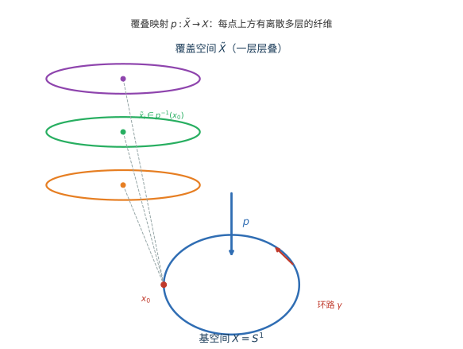

# 第 43 级：代数拓扑 (Algebraic Topology)

> 代数拓扑是现代数学的核心分支之一，它使用代数工具（如群、环、模）来研究拓扑空间的不变量。通过将拓扑问题转化为代数问题，代数拓扑不仅提供了强大的计算方法，还揭示了空间结构深刻的几何性质。从 Euler 的多面体公式到 Poincaré 的奠基性工作，代数拓扑已经发展成为连接几何、代数和分析的桥梁。

---

## 1. 学习目标

1. 理解基本群的定义与性质，掌握计算基本群的各种方法。
2. 掌握覆叠空间理论，理解基本群与覆叠空间之间的 Galois 对应。
3. 理解单纯同调与奇异同调的基本理论，掌握同调群的计算方法。
4. 掌握相对同调与长正合序列，理解 Mayer-Vietoris 序列的推导与应用。
5. 理解万有系数定理与 Künneth 公式，掌握同调与上同调的关系。
6. 掌握上同调环的结构，理解杯积及其几何意义。
7. 理解 Poincaré 对偶定理及其在流形理论中的核心地位。
8. 能够运用代数拓扑工具证明经典定理（Brouwer 不动点定理、Borsuk-Ulam 定理等）。

---

## 2. 核心概念

> **直观理解（现实类比）**：把立方体想象成一个充气的皮球，无论你把它吹成圆球形还是压扁成砖块，只要不撕开、不粘合，它的"顶点$-边+面=2"始终不变。这个颠扑不破的常数 $\chi=2$ 就像物体的"指纹"，称为拓扑不变量——它不依赖度量、形状，只依赖空间"洞"的个数。欧拉公式正是代数拓扑"用代数刻画空间本质"这一思想的最早范例。

### 2.1 基本群 (Fundamental Group)

基本群是代数拓扑中第一个也是最直观的同伦不变量，它度量了空间中环路的本质差异。

**定义 2.1.1（道路与环路）** 设 $X$ 是拓扑空间。一条从 $x_0$ 到 $x_1$ 的 **道路**（path）是一个连续映射 $\gamma: [0,1] \to X$，满足 $\gamma(0) = x_0$，$\gamma(1) = x_1$。若 $\gamma(0) = \gamma(1) = x_0$，则称 $\gamma$ 为以 $x_0$ 为基点的 **环路**（loop）。

**定义 2.1.2（道路同伦）** 两条道路 $\gamma_0, \gamma_1: [0,1] \to X$（具有相同的端点）称为 **同伦的**（homotopic），若存在连续映射 $H: [0,1] \times [0,1] \to X$，使得：
- $H(t,0) = \gamma_0(t)$，$H(t,1) = \gamma_1(t)$ 对所有 $t \in [0,1]$；
- $H(0,s) = x_0$，$H(1,s) = x_1$ 对所有 $s \in [0,1]$。

记作 $\gamma_0 \simeq \gamma_1$。道路同伦是一种等价关系。

**定义 2.1.3（基本群）** 设 $X$ 是拓扑空间，$x_0 \in X$。以 $x_0$ 为基点的所有环路的同伦类构成的集合，在道路串联运算下形成一个群，称为 $X$ 的 **基本群**（fundamental group），记作 $\pi_1(X, x_0)$。其中：
- 单位元是常值环路 $c_{x_0}(t) = x_0$ 的同伦类；
- 环路 $[\gamma]$ 的逆元是反向环路 $\gamma^{-1}(t) = \gamma(1-t)$ 的同伦类。

**命题 2.1.4** 若 $X$ 是道路连通的，则对任意 $x_0, x_1 \in X$，有 $\pi_1(X, x_0) \cong \pi_1(X, x_1)$。此时可简记为 $\pi_1(X)$。

**定义 2.1.5（单连通）** 道路连通空间 $X$ 称为 **单连通的**（simply connected），若 $\pi_1(X) = 0$（平凡群），即所有环路均可缩为一点。

**例 2.1.6**
- $\pi_1(\mathbb{R}^n) = 0$，因为 $\mathbb{R}^n$ 是单连通的。
- $\pi_1(S^1) \cong \mathbb{Z}$，这是基本群计算中最基本的非平凡例子。
- $\pi_1(S^n) = 0$ 对 $n \geq 2$ 成立。

### 2.2 覆叠空间 (Covering Spaces)

覆叠空间是研究基本群最重要的几何工具，它揭示了基本群与空间对称性之间的深刻联系。

**定义 2.2.1（覆叠空间）** 设 $p: \tilde{X} \to X$ 是连续满射。称 $p$ 是一个 **覆叠映射**（covering map），$\tilde{X}$ 是 $X$ 的 **覆叠空间**（covering space），若对每个 $x \in X$，存在开邻域 $U$，使得 $p^{-1}(U)$ 是 $\tilde{X}$ 中互不相交的开集 $\{V_\alpha\}_{\alpha \in A}$ 的并，且 $p|_{V_\alpha}: V_\alpha \to U$ 是同胚。这样的 $U$ 称为 **均匀覆盖邻域**（evenly covered neighborhood）。

**例 2.2.2**
- $p: \mathbb{R} \to S^1$，$p(t) = e^{2\pi i t}$ 是覆叠映射，纤维为 $\mathbb{Z}$。
- $p: S^1 \to S^1$，$p(z) = z^n$ 是 $n$ 重覆叠。
- $p: S^2 \to \mathbb{R}P^2$ 是双重覆叠。

> **直观理解（现实类比）**：把基空间 $X$ 想成一层地面，覆盖空间 $\tilde{X}$ 就是架在地面上方的多层楼房——每一层都是同一幅地形的"复制品"。地面上的一个行人（环路）每绕一圈，在楼上对应的人会"跨到更高的楼层"；绕的圈数正好记录了他在哪一层，这就是纤维 $p^{-1}(x)\cong\mathbb{Z}$（整数，即绕数）的含义。$p:\mathbb{R}\to S^1$ 正是这种"无限层螺旋楼梯"的数学抽象。

**定理 2.2.3（道路提升性质）** 设 $p: \tilde{X} \to X$ 是覆叠映射，$\gamma: [0,1] \to X$ 是道路，$\tilde{x}_0 \in p^{-1}(\gamma(0))$。则存在唯一的道路 $\tilde{\gamma}: [0,1] \to \tilde{X}$，使得 $p \circ \tilde{\gamma} = \gamma$ 且 $\tilde{\gamma}(0) = \tilde{x}_0$。

**证明**：利用均匀覆盖邻域和 Lebesgue 数引理，将 $[0,1]$ 划分为足够小的子区间 $[t_i, t_{i+1}]$，使得每个 $\gamma([t_i, t_{i+1}])$ 包含在某个均匀覆盖邻域中，然后逐段提升。$\square$

**定理 2.2.4（同伦提升性质）** 设 $p: \tilde{X} \to X$ 是覆叠映射，$H: [0,1] \times [0,1] \to X$ 是道路同伦，且 $\tilde{H}(0,0) = \tilde{x}_0$ 是 $H(0,0)$ 的一个提升。则存在唯一的提升 $\tilde{H}: [0,1] \times [0,1] \to \tilde{X}$，使得 $p \circ \tilde{H} = H$。

**证明**：将正方形细分为足够小的网格，使得每个小方格在 $H$ 下的像包含在某个均匀覆盖邻域中，然后逐格提升，利用道路提升的唯一性在相邻方格上一致。$\square$

### 2.3 单纯同调 (Simplicial Homology)

单纯同调是历史上最早的同调理论，它通过组合方法将空间剖分为单纯形，然后用代数方法计算同调群。

**定义 2.3.1（单纯复形）** 一个 **单纯复形**（simplicial complex）$K$ 是一族单形（simplex）的集合，满足：
- 若 $\sigma \in K$，则 $\sigma$ 的所有面也属于 $K$；
- 任意两个单形的交要么是空集，要么是它们的一个公共面。

**定义 2.3.2（定向单形与链群）** 设 $K$ 是单纯复形。$K$ 的 $n$-维 **定向单形**（oriented simplex）是一个有序的 $n+1$ 个顶点组合 $[v_0, v_1, \ldots, v_n]$，其中 $\{v_0, \ldots, v_n\}$ 张成一个 $n$-单形。交换两个顶点改变定向。$K$ 的 $n$-维链群 $C_n(K)$ 是由所有 $n$-维定向单形生成的自由 Abel 群，满足 $[v_0, \ldots, v_i, \ldots, v_j, \ldots, v_n] = -[v_0, \ldots, v_j, \ldots, v_i, \ldots, v_n]$。

**定义 2.3.3（边缘算子）** 边缘算子 $\partial_n: C_n(K) \to C_{n-1}(K)$ 定义为：
$$
\partial_n([v_0, v_1, \ldots, v_n]) = \sum_{i=0}^n (-1)^i [v_0, \ldots, \hat{v}_i, \ldots, v_n],
$$
其中 $\hat{v}_i$ 表示删除顶点 $v_i$。然后线性扩张到 $C_n(K)$ 上。

**命题 2.3.4** $\partial_{n-1} \circ \partial_n = 0$。

**证明**：直接计算：
$$
\begin{aligned}
\partial_{n-1}(\partial_n([v_0, \ldots, v_n])) &= \partial_{n-1}\left(\sum_{i=0}^n (-1)^i [v_0, \ldots, \hat{v}_i, \ldots, v_n]\right) \\
&= \sum_{i=0}^n (-1)^i \sum_{j<i} (-1)^j [v_0, \ldots, \hat{v}_j, \ldots, \hat{v}_i, \ldots, v_n] \\
&\quad + \sum_{i=0}^n (-1)^i \sum_{j>i} (-1)^{j-1} [v_0, \ldots, \hat{v}_i, \ldots, \hat{v}_j, \ldots, v_n] \\
&= 0,
\end{aligned}
$$
其中删除 $v_i$ 后再删除 $v_j$（$j>i$）会多出一个 $-1$ 因子，恰好与另一项消去。$\square$

**定义 2.3.5（单纯同调群）** 定义：
- $Z_n(K) = \ker \partial_n$ — $n$-维 **循环群**（cycle group）；
- $B_n(K) = \operatorname{im} \partial_{n+1}$ — $n$-维 **边缘群**（boundary group）；
- $H_n(K) = Z_n(K) / B_n(K)$ — $n$-维 **单纯同调群**（simplicial homology group）。

### 2.4 奇异同调 (Singular Homology)

奇异同调比单纯同调更具一般性，对任意拓扑空间都有定义，是现代同调理论的标准形式。

**定义 2.4.1（标准单形）** 标准 $n$-单形为：
$$
\Delta^n = \left\{(t_0, t_1, \ldots, t_n) \in \mathbb{R}^{n+1} \;\middle|\; \sum_{i=0}^n t_i = 1,\; t_i \geq 0\right\}.
$$

**定义 2.4.2（奇异单形与链群）** 设 $X$ 是拓扑空间。一个 **奇异 $n$-单形**（singular $n$-simplex）是一个连续映射 $\sigma: \Delta^n \to X$。$X$ 的 $n$-维 **奇异链群** $C_n(X)$ 是由所有奇异 $n$-单形生成的自由 Abel 群。

**定义 2.4.3（奇异边缘算子）** 边缘算子 $\partial_n: C_n(X) \to C_{n-1}(X)$ 定义为：
$$
\partial_n(\sigma) = \sum_{i=0}^n (-1)^i \sigma \circ \varepsilon_i^n,
$$
其中 $\varepsilon_i^n: \Delta^{n-1} \to \Delta^n$ 是第 $i$ 个面映射，它将 $\Delta^{n-1}$ 仿射线性地映射到 $\Delta^n$ 中第 $i$ 个坐标为零的面：
$$
\varepsilon_i^n(t_0, \ldots, t_{n-1}) = (t_0, \ldots, t_{i-1}, 0, t_i, \ldots, t_{n-1}).
$$

**命题 2.4.4** $\partial_{n-1} \circ \partial_n = 0$。

**证明**：对任意奇异 $n$-单形 $\sigma$，我们有：
$$
\begin{aligned}
\partial_{n-1}(\partial_n(\sigma)) &= \partial_{n-1}\left(\sum_{i=0}^n (-1)^i \sigma \circ \varepsilon_i^n\right) \\
&= \sum_{i=0}^n (-1)^i \sum_{j=0}^{n-1} (-1)^j \sigma \circ \varepsilon_i^n \circ \varepsilon_j^{n-1} \\
&= \sum_{j < i} (-1)^{i+j} \sigma \circ \varepsilon_i^n \circ \varepsilon_j^{n-1} + \sum_{j \geq i} (-1)^{i+j} \sigma \circ \varepsilon_i^n \circ \varepsilon_j^{n-1} \\
&= \sum_{j < i} (-1)^{i+j} \sigma \circ \varepsilon_{j}^{n} \circ \varepsilon_{i-1}^{n-1} + \sum_{j \geq i} (-1)^{i+j} \sigma \circ \varepsilon_{i}^{n} \circ \varepsilon_{j}^{n-1}.
\end{aligned}
$$
利用面映射关系 $\varepsilon_i^n \circ \varepsilon_j^{n-1} = \varepsilon_{j+1}^n \circ \varepsilon_i^{n-1}$ 对 $j \geq i$，以及 $\varepsilon_i^n \circ \varepsilon_j^{n-1} = \varepsilon_j^n \circ \varepsilon_{i-1}^{n-1}$ 对 $j < i$，代入后所有项两两抵消，结果为零。$\square$

**定义 2.4.5（奇异同调群）** $X$ 的 $n$-维 **奇异同调群**（singular homology group）为：
$$
H_n(X) = \ker \partial_n / \operatorname{im} \partial_{n+1}.
$$

### 2.5 相对同调 (Relative Homology)

相对同调是研究子空间与整体空间关系的工具，也是导出长正合序列的关键。

**定义 2.5.1（相对链群）** 设 $A \subseteq X$ 是子空间。定义相对链群 $C_n(X, A) = C_n(X) / C_n(A)$。边缘算子 $\partial_n$ 诱导出 $\partial_n: C_n(X, A) \to C_{n-1}(X, A)$，且满足 $\partial_{n-1} \circ \partial_n = 0$。由此定义 **相对同调群**：
$$
H_n(X, A) = \ker \partial_n / \operatorname{im} \partial_{n+1}.
$$

**定理 2.5.2（长正合序列）** 设 $A \subseteq X$，则有自然的长正合序列：
$$
\cdots \to H_n(A) \xrightarrow{i_*} H_n(X) \xrightarrow{j_*} H_n(X, A) \xrightarrow{\partial_*} H_{n-1}(A) \to \cdots \to H_0(X, A) \to 0,
$$
其中 $i: A \hookrightarrow X$ 是包含映射，$j: (X, \emptyset) \to (X, A)$ 是商映射，$\partial_*$ 是连接同态。

### 2.6 正合序列与同调代数 (Exact Sequences and Homological Algebra)

**定义 2.6.1（正合序列）** 一列 Abel 群同态 $\cdots \to A_{n+1} \xrightarrow{f_{n+1}} A_n \xrightarrow{f_n} A_{n-1} \to \cdots$ 称为 **正合的**（exact），若 $\operatorname{im} f_{n+1} = \ker f_n$ 对所有 $n$ 成立。

**定义 2.6.2（短正合序列）** 一个短正合序列是形如 $0 \to A \xrightarrow{f} B \xrightarrow{g} C \to 0$ 的正合序列，其中 $f$ 是单射，$g$ 是满射，且 $\operatorname{im} f = \ker g$。

**命题 2.6.3（蛇形引理）** 设以下行正合的交换图：
$$
\begin{CD}
0 @>>> A' @>>> A @>>> A'' @>>> 0 \\
@. @V{f'}VV @V{f}VV @V{f''}VV \\
0 @>>> B' @>>> B @>>> B'' @>>> 0
\end{CD}
$$
则存在长正合序列：
$$
\ker f' \to \ker f \to \ker f'' \xrightarrow{\delta} \operatorname{coker} f' \to \operatorname{coker} f \to \operatorname{coker} f''.
$$

**证明**：该引理的证明是标准同调代数中的核心内容，涉及"蛇形追图"（diagram chasing），具体步骤略。$\square$

### 2.7 万有系数定理 (Universal Coefficient Theorem)

万有系数定理揭示了同调与上同调之间的深刻关系，表明上同调可以由同调和对偶系数决定。

**定理 2.7.1（万有系数定理）** 设 $X$ 是拓扑空间，$G$ 是 Abel 群。则存在短正合序列：
$$
0 \to \operatorname{Ext}(H_{n-1}(X), G) \to H^n(X; G) \to \operatorname{Hom}(H_n(X), G) \to 0,
$$
该序列分裂（但非自然分裂）。其中 $H^n(X; G)$ 是以 $G$ 为系数的上同调群。

### 2.8 Künneth 公式 (Künneth Formula)

Künneth 公式计算乘积空间的同调群。

**定理 2.8.1（Künneth 公式）** 设 $X, Y$ 是拓扑空间，且 $H_n(X)$ 是有限生成的。则有短正合序列：
$$
0 \to \bigoplus_{i+j=n} H_i(X) \otimes H_j(Y) \to H_n(X \times Y) \to \bigoplus_{i+j=n-1} \operatorname{Tor}(H_i(X), H_j(Y)) \to 0,
$$
该序列分裂。

### 2.9 上同调 (Cohomology)

上同调是同调的对偶理论，但其上附加的杯积运算赋予了它更丰富的代数结构。

**定义 2.9.1（上链群与上同调）** 设 $X$ 是拓扑空间，$G$ 是 Abel 群。定义 $X$ 的 $n$-维 **上链群**（cochain group）为 $C^n(X; G) = \operatorname{Hom}(C_n(X), G)$。上边缘算子 $\delta^n: C^n(X; G) \to C^{n+1}(X; G)$ 定义为 $(\delta^n \varphi)(\sigma) = \varphi(\partial_{n+1}\sigma)$，其中 $\sigma \in C_{n+1}(X)$。则 $\delta^{n+1} \circ \delta^n = 0$。

$X$ 的 $n$-维 **上同调群**（cohomology group）为：
$$
H^n(X; G) = \ker \delta^n / \operatorname{im} \delta^{n-1}.
$$

### 2.10 杯积 (Cup Product)

杯积是上同调群上的乘法运算，赋予上同调以环结构。

**定义 2.10.1（杯积）** 设 $\varphi \in C^k(X; R)$，$\psi \in C^\ell(X; R)$，其中 $R$ 是交换环。定义它们的 **杯积**（cup product）$\varphi \smile \psi \in C^{k+\ell}(X; R)$ 为：
$$
(\varphi \smile \psi)(\sigma) = \varphi(\sigma|_{[v_0, \ldots, v_k]}) \cdot \psi(\sigma|_{[v_k, \ldots, v_{k+\ell}]}),
$$
其中 $\sigma: \Delta^{k+\ell} \to X$ 是奇异单形，$\sigma|_{[v_0, \ldots, v_k]}$ 是 $\sigma$ 限制在前 $k+1$ 个顶点张成的面上的复合。

**命题 2.10.2** 杯积诱导出上同调群上的良定义的积：
$$
\smile: H^k(X; R) \times H^\ell(X; R) \to H^{k+\ell}(X; R),
$$
满足 $\delta(\varphi \smile \psi) = \delta\varphi \smile \psi + (-1)^k \varphi \smile \delta\psi$。

**定义 2.10.3（上同调环）** $H^*(X; R) = \bigoplus_{n \geq 0} H^n(X; R)$ 在杯积下成为一个分次环，称为 $X$ 的 **上同调环**（cohomology ring）。

### 2.11 Poincaré 对偶 (Poincaré Duality)

Poincaré 对偶是流形上同调理论中最深刻的结果之一，它揭示了紧致定向流形的同调与上同调之间的对称性。

**定理 2.11.1（Poincaré 对偶）** 设 $M$ 是 $n$ 维紧致定向流形。则存在自然同构：
$$
H^k(M) \cong H_{n-k}(M).
$$
更一般地，对任意系数环 $R$，有 $H^k(M; R) \cong H_{n-k}(M; R)$。

---

## 3. 定理与证明

### 3.1 基本群与覆叠空间的对应关系

**定理 3.1.1（提升准则）** 设 $p: (\tilde{X}, \tilde{x}_0) \to (X, x_0)$ 是覆叠映射，$f: (Y, y_0) \to (X, x_0)$ 是连续映射，其中 $Y$ 是道路连通且局部道路连通的。则 $f$ 存在提升 $\tilde{f}: (Y, y_0) \to (\tilde{X}, \tilde{x}_0)$（即 $p \circ \tilde{f} = f$）当且仅当 $f_*(\pi_1(Y, y_0)) \subseteq p_*(\pi_1(\tilde{X}, \tilde{x}_0))$。

**证明**：
（$\Rightarrow$）若 $\tilde{f}$ 存在，则 $f = p \circ \tilde{f}$，于是 $f_* = p_* \circ \tilde{f}_*$，故 $f_*(\pi_1(Y)) \subseteq p_*(\pi_1(\tilde{X}))$。

（$\Leftarrow$）设 $f_*(\pi_1(Y)) \subseteq p_*(\pi_1(\tilde{X}))$。对任意 $y \in Y$，取道路 $\gamma$ 从 $y_0$ 到 $y$。令 $\alpha = f \circ \gamma$ 是 $X$ 中从 $x_0$ 到 $f(y)$ 的道路。提升 $\alpha$ 到 $\tilde{X}$ 中得到 $\tilde{\alpha}$，起点为 $\tilde{x}_0$。定义 $\tilde{f}(y) = \tilde{\alpha}(1)$。

我们需要证明 $\tilde{f}(y)$ 与道路 $\gamma$ 的选择无关。设 $\gamma'$ 是另一条从 $y_0$ 到 $y$ 的道路，$\alpha' = f \circ \gamma'$，其提升为 $\tilde{\alpha}'$。考虑环路 $\gamma * \gamma'^{-1}$（先沿 $\gamma$ 再反向沿 $\gamma'$），则 $f \circ (\gamma * \gamma'^{-1}) = \alpha * \alpha'^{-1}$ 是 $X$ 中以 $x_0$ 为基点的环路。由假设，$f_*([\gamma * \gamma'^{-1}]) \in p_*(\pi_1(\tilde{X}))$，因此 $\alpha * \alpha'^{-1}$ 提升为 $\tilde{X}$ 中的环路，其起点和终点都是 $\tilde{x}_0$。这意味着 $\tilde{\alpha}$ 和 $\tilde{\alpha}'$ 在 $\tilde{X}$ 中有相同的终点，故 $\tilde{f}(y)$ 良定义。$\square$

**定理 3.1.2（基本群与覆叠空间的 Galois 对应）** 设 $X$ 是道路连通、局部道路连通且半局部单连通的拓扑空间，$x_0 \in X$。则存在以下一一对应：

$$
\begin{aligned}
\{\text{连通覆叠 } p: (\tilde{X}, \tilde{x}_0) \to (X, x_0)\}/\text{同构} &\longleftrightarrow \{\pi_1(X, x_0) \text{的子群}\} \\
\tilde{X} &\longmapsto p_*(\pi_1(\tilde{X}, \tilde{x}_0)) \\
\tilde{X}_H = (\tilde{X}_0 / \pi_1(X))/H &\longmapsfrom H
\end{aligned}
$$

其中 $\tilde{X}_0$ 是 $X$ 的万有覆叠空间。更具体地：
- 正则覆叠（normal covering）对应于 $\pi_1(X)$ 的正规子群；
- 万有覆叠对应于 $\{1\}$；
- 平凡覆叠 $X$ 本身对应于 $\pi_1(X)$。

**证明概要**：给定子群 $H \subseteq \pi_1(X, x_0)$，构造覆叠空间 $\tilde{X}_H = (\tilde{X}_0 \times \pi_1(X))/{\sim}$，其中 $\tilde{X}_0$ 是万有覆叠，商去关系 $(\tilde{x}, g) \sim (\tilde{x} \cdot h, gh)$ 对 $h \in H$。可以验证 $p_*(\pi_1(\tilde{X}_H)) = H$。反之，给定覆叠 $p: \tilde{X} \to X$，$p_*(\pi_1(\tilde{X}))$ 是 $\pi_1(X)$ 的子群。这两个映射互逆，建立了双射。$\square$

### 3.2 Seifert-van Kampen 定理

**定理 3.2.1（Seifert-van Kampen 定理）** 设 $X$ 是道路连通空间，$U, V \subseteq X$ 是开子集，满足 $U \cup V = X$，且 $U \cap V$ 是非空道路连通的。设 $x_0 \in U \cap V$。则包含映射诱导的群同态给出一个推出（pushout）图：

$$
\begin{CD}
\pi_1(U \cap V) @>{i_*}>> \pi_1(U) \\
@V{j_*}VV @VV{}V \\
\pi_1(V) @>>> \pi_1(X)
\end{CD}
$$

等价地，$\pi_1(X)$ 是 $\pi_1(U)$ 与 $\pi_1(V)$ 沿 $\pi_1(U \cap V)$ 的 **融合自由积**（amalgamated free product）：

$$
\pi_1(X) \cong \pi_1(U) *_{\pi_1(U \cap V)} \pi_1(V).
$$

**证明**：我们分三步证明。

**第一步：生成元**。我们证明 $\pi_1(X)$ 由 $\pi_1(U)$ 和 $\pi_1(V)$ 的像生成。设 $[\gamma] \in \pi_1(X, x_0)$，$\gamma$ 是以 $x_0$ 为基点的环路。由于 $\{U, V\}$ 是 $X$ 的开覆盖，由 Lebesgue 数引理，存在划分 $0 = t_0 < t_1 < \cdots < t_m = 1$，使得每个 $\gamma([t_{i-1}, t_i])$ 完全包含在 $U$ 或 $V$ 中。将 $\gamma$ 分解为道路段 $\gamma_i = \gamma|_{[t_{i-1}, t_i]}$。由于 $U \cap V$ 道路连通，可以在 $U \cap V$ 中取道路连接每个 $\gamma(t_i)$ 到 $x_0$，从而将 $\gamma$ 表示为 $\pi_1(U)$ 和 $\pi_1(V)$ 中环路的乘积。

**第二步：关系**。我们证明 $\pi_1(X)$ 中任意关系源自 $\pi_1(U \cap V)$ 中的关系。设 $[\gamma] \in \pi_1(U)$ 和 $[\gamma'] \in \pi_1(V)$ 在 $\pi_1(X)$ 中相等，即存在同伦 $H$ 在 $X$ 中连接它们。通过网格细分，可假设 $H$ 的每个小方格落在 $U$ 或 $V$ 中，从而将同伦分解为一系列在 $U \cap V$ 中的移动，这些移动对应于 $\pi_1(U \cap V)$ 中的关系。

**第三步**：综合以上两步，根据融合自由积的定义，$\pi_1(X)$ 同构于 $\pi_1(U) *_{\pi_1(U \cap V)} \pi_1(V)$。$\square$

**推论 3.2.2（球面的基本群）** 对 $n \geq 2$，$\pi_1(S^n) = 0$。

**证明**：取 $U = S^n \setminus \{N\}$（去掉北极），$V = S^n \setminus \{S\}$（去掉南极）。$U$ 和 $V$ 都同胚于 $\mathbb{R}^n$，是单连通的。$U \cap V = S^n \setminus \{N, S\}$ 同伦等价于 $S^{n-1}$，对 $n \geq 2$ 是道路连通的。由 Seifert-van Kampen 定理，$\pi_1(S^n) \cong \pi_1(U) *_{\pi_1(U \cap V)} \pi_1(V) \cong 0 *_{0} 0 = 0$。$\square$

### 3.3 奇异同调的长正合序列

**定理 3.3.1（奇异同调的长正合序列）** 设 $A \subseteq X$ 是拓扑空间对。则存在自然的长正合序列：

$$
\cdots \xrightarrow{\partial_*} H_n(A) \xrightarrow{i_*} H_n(X) \xrightarrow{j_*} H_n(X, A) \xrightarrow{\partial_*} H_{n-1}(A) \xrightarrow{i_*} \cdots \xrightarrow{} H_0(X, A) \to 0.
$$

**证明**：考虑链复形的短正合序列：
$$
0 \to C_\bullet(A) \xrightarrow{i} C_\bullet(X) \xrightarrow{j} C_\bullet(X, A) \to 0,
$$
其中 $i$ 是包含映射，$j$ 是商映射。对每个 $n$，序列 $0 \to C_n(A) \to C_n(X) \to C_n(X, A) \to 0$ 是正合的，因为 $C_n(A)$ 是 $C_n(X)$ 的自由子模，商定义为 $C_n(X, A)$。

由同调代数中的蛇形引理，短正合序列诱导出同调群的长正合序列。具体地，连接同态 $\partial_*: H_n(X, A) \to H_{n-1}(A)$ 定义为：对 $[z] \in H_n(X, A)$，取代表 $z \in C_n(X, A)$，提升到 $\tilde{z} \in C_n(X)$（即 $j(\tilde{z}) = z$），则 $\partial_n(\tilde{z}) \in C_{n-1}(X)$ 实际上落在 $C_{n-1}(A)$ 中（因为 $j(\partial_n(\tilde{z})) = \partial_n(j(\tilde{z})) = \partial_n(z) = 0$），定义 $\partial_*([z]) = [\partial_n(\tilde{z})]$。可以验证该映射良定义且序列正合。$\square$

### 3.4 Mayer-Vietoris 序列

**定理 3.4.1（Mayer-Vietoris 序列）** 设 $X$ 是拓扑空间，$A, B \subseteq X$ 是开子集，满足 $X = A \cup B$。则存在长正合序列：

$$
\cdots \to H_n(A \cap B) \xrightarrow{\Phi} H_n(A) \oplus H_n(B) \xrightarrow{\Psi} H_n(X) \xrightarrow{\partial_*} H_{n-1}(A \cap B) \to \cdots \to H_0(X) \to 0,
$$

其中：
- $\Phi(x) = (i_*(x), -j_*(x))$，$i: A \cap B \hookrightarrow A$，$j: A \cap B \hookrightarrow B$；
- $\Psi(a, b) = k_*(a) + \ell_*(b)$，$k: A \hookrightarrow X$，$\ell: B \hookrightarrow X$；
- $\partial_*$ 是连接同态。

**证明**：考虑链复形的短正合序列：
$$
0 \to C_\bullet(A \cap B) \xrightarrow{\varphi} C_\bullet(A) \oplus C_\bullet(B) \xrightarrow{\psi} C_\bullet(A) + C_\bullet(B) \to 0,
$$
其中 $\varphi(x) = (x, -x)$，$\psi(a, b) = a + b$。这里 $C_\bullet(A) + C_\bullet(B)$ 是 $C_\bullet(X)$ 的子复形。

关键步骤是证明包含映射 $C_\bullet(A) + C_\bullet(B) \hookrightarrow C_\bullet(X)$ 是同调等价（即诱导同调群同构）。这可以通过构造一个链映射的逆——将奇异单形重分为更小的单形使之落在 $A$ 或 $B$ 中——来实现，该过程称为"细分"（subdivision）。一旦建立了这个同调等价，上述短正合序列诱导的长正合序列就给出了 Mayer-Vietoris 序列。$\square$

### 3.5 Poincaré 对偶定理

**定理 3.5.1（Poincaré 对偶）** 设 $M$ 是 $n$ 维紧致定向光滑流形，则对任意 $k$，有自然同构：
$$
H^k(M) \cong H_{n-k}(M).
$$

**证明**：（概要）证明分为以下几个步骤。

**第一步：建立对偶配对**。考虑由 **交形式**（intersection form）定义的双线性配对：
$$
H_{n-k}(M) \otimes H_k(M) \to \mathbb{Z},
$$
该配对由 $M$ 中循环的横截相交数给出。同时，由 de Rham 理论，上同调类可以用微分形式表示，而同调类可以用链表示，它们之间的配对由积分给出：
$$
H^k(M) \otimes H_k(M) \to \mathbb{Z}, \quad ([\omega], [\sigma]) \mapsto \int_\sigma \omega.
$$

**第二步：对偶映射的构造**。定义 Poincaré 对偶映射 $PD: H^k(M) \to H_{n-k}(M)$ 为满足以下条件的映射：对任意 $[\alpha] \in H_{n-k}(M)$，有
$$
\int_{PD([\omega])} \alpha = \int_M \omega \wedge \alpha,
$$
其中 $\alpha$ 是代表 $[\alpha]$ 的闭形式。

**第三步：用 Mayer-Vietoris 序列归纳证明**。将 $M$ 分解为坐标邻域的并集。对 $\mathbb{R}^n$ 中的开球，Poincaré 对偶显然成立（因为 $H^k(\mathbb{R}^n) = 0$ 对 $k > 0$，$H^0(\mathbb{R}^n) \cong \mathbb{Z} \cong H_n(\mathbb{R}^n)$）。然后利用 Mayer-Vietoris 序列和五引理（Five Lemma），通过归纳法证明对 $M$ 成立。

**第四步：紧致性与定向**。紧致性保证了同调群的有限性，定向通过**基本类**（fundamental class）$[M] \in H_n(M)$ 给出，Poincaré 对偶实际上等同于与基本类的 cap 积：
$$
PD([\omega]) = [M] \cap [\omega].
$$

$\square$

### 3.6 Brouwer 不动点定理

**定理 3.6.1（Brouwer 不动点定理）** 设 $D^n = \{x \in \mathbb{R}^n \mid \|x\| \leq 1\}$ 是 $n$ 维闭单位球，$f: D^n \to D^n$ 是连续映射。则 $f$ 至少有一个不动点，即存在 $x \in D^n$ 使得 $f(x) = x$。

**证明**：假设 $f$ 没有不动点，即对任意 $x \in D^n$，$f(x) \neq x$。定义映射 $g: D^n \to S^{n-1} = \partial D^n$ 如下：从 $f(x)$ 出发经过 $x$ 的射线交边界 $S^{n-1}$ 于唯一一点 $g(x)$。由于 $f$ 连续且无不动点，$g$ 是连续的。且对 $x \in S^{n-1}$，有 $g(x) = x$。

因此 $g$ 是 $D^n$ 到其边界 $S^{n-1}$ 的收缩（retraction），即 $g \circ i = \text{id}_{S^{n-1}}$，其中 $i: S^{n-1} \hookrightarrow D^n$ 是包含映射。

现在使用同调论证明这样的收缩不存在。考虑同调群。由长正合序列：
$$
H_{n-1}(S^{n-1}) \xrightarrow{i_*} H_{n-1}(D^n) \xrightarrow{j_*} H_{n-1}(D^n, S^{n-1}) \xrightarrow{\partial_*} H_{n-2}(S^{n-1}) \to \cdots
$$

由于 $D^n$ 可缩，$H_{n-1}(D^n) = 0$。由正合性，$i_*$ 是单射。但 $H_{n-1}(S^{n-1}) \cong \mathbb{Z}$，$H_{n-1}(D^n) = 0$，唯一可能的单射 $0 \to \mathbb{Z}$ 只能是零映射，矛盾。

更直接地，在诱导同调群上，我们有 $g_* \circ i_* = (g \circ i)_* = \text{id}_*$，即：
$$
H_{n-1}(S^{n-1}) \xrightarrow{i_*} H_{n-1}(D^n) \xrightarrow{g_*} H_{n-1}(S^{n-1})
$$
复合为恒等映射。但 $H_{n-1}(D^n) = 0$（因为 $D^n$ 可缩，所有正维同调群为零），因此 $g_* \circ i_*$ 必须为零映射，不能是恒等映射。矛盾！

因此不存在这样的收缩，故 $f$ 必有不动点。$\square$

### 3.7 Borsuk-Ulam 定理

**定理 3.7.1（Borsuk-Ulam 定理）** 设 $f: S^n \to \mathbb{R}^n$ 是连续映射。则存在 $x \in S^n$ 使得 $f(x) = f(-x)$。换言之，存在一对对径点映射到同一点。

**证明**：假设对任意 $x \in S^n$，有 $f(x) \neq f(-x)$。定义辅助映射 $g: S^n \to S^{n-1}$ 为：
$$
g(x) = \frac{f(x) - f(-x)}{\|f(x) - f(-x)\|}.
$$
则 $g$ 是连续的，且满足 $g(-x) = -g(x)$，即 $g$ 是 **对径映射**（antipodal map）。

现在考虑 $g$ 在 $n$ 维同调群上的诱导映射。设 $\tau: S^n \to S^n$ 是对径映射 $\tau(x) = -x$。则 $g \circ \tau = \tau' \circ g$，其中 $\tau': S^{n-1} \to S^{n-1}$ 是对径映射。

在 $n$ 维同调群上，对径映射 $\tau$ 诱导的映射 $H_n(\tau): H_n(S^n) \to H_n(S^n)$ 是乘以 $(-1)^{n+1}$（因为对径映射是 $n+1$ 个反射的复合，每个反射反转定向，故度为 $(-1)^{n+1}$）。类似地，$H_{n-1}(\tau')$ 是乘以 $(-1)^n$。

由于 $g$ 是关于 $S^{n-1}$ 的，$H_n(S^n) = \mathbb{Z}$，而 $H_n(S^{n-1}) = 0$，所以 $g_*: H_n(S^n) \to H_n(S^{n-1})$ 是零映射。但由 $g$ 的奇性，考虑 $g$ 限制在 $S^n$ 的赤道 $S^{n-1}$ 上，该限制映射 $h = g|_{S^{n-1}}: S^{n-1} \to S^{n-1}$ 满足 $h(-x) = -h(x)$，因此 $h$ 的度数为奇数（可证对径映射的度数为 $(-1)^n$，而奇映射的度数必为奇数）。但 $h$ 通过 $g$ 可扩张到 $D^n$ 上（上半球面），由同调论，可扩张映射的度数为零，与度数为奇数矛盾。

因此假设不成立，存在 $x \in S^n$ 使得 $f(x) = f(-x)$。$\square$

**推论 3.7.2（Borsuk-Ulam 定理的等价形式）** 不存在连续映射 $f: S^n \to S^{n-1}$ 满足 $f(-x) = -f(x)$（即不存在对径保持的奇映射）。

**推论 3.7.3（火腿三明治定理）** 设 $A_1, A_2, \ldots, A_n$ 是 $\mathbb{R}^n$ 中的 $n$ 个可测集（Lebesgue 可测且有限体积）。则存在一个超平面将每个 $A_i$ 的体积恰好平分。

---

## 4. 示例

### 4.1 计算基本群

**例 4.1.1（圆周 $S^1$ 的基本群）** 计算 $\pi_1(S^1)$。

**解**：考虑覆叠映射 $p: \mathbb{R} \to S^1$，$p(t) = e^{2\pi i t}$。$\mathbb{R}$ 是单连通的（$\pi_1(\mathbb{R}) = 0$），且纤维 $p^{-1}(1) = \mathbb{Z}$。由提升性质，$S^1$ 中以 $1$ 为基点的环路 $\gamma$ 提升为 $\mathbb{R}$ 中从 $0$ 到某个整数 $n$ 的道路。该整数 $n$ 称为环路 $\gamma$ 的 **绕数**（winding number）。映射 $\deg: \pi_1(S^1) \to \mathbb{Z}$，$[\gamma] \mapsto \deg(\gamma)$ 是群同构。

因此 $\pi_1(S^1) \cong \mathbb{Z}$。

**例 4.1.2（球面 $S^2$ 的基本群）** 计算 $\pi_1(S^2)$。

**解**：由 Seifert-van Kampen 定理的推论 3.2.2，$\pi_1(S^2) = 0$。$S^2$ 是单连通的。

更一般地，对 $n \geq 2$，$\pi_1(S^n) = 0$。

**例 4.1.3（环面 $T^2$ 的基本群）** 计算 $\pi_1(T^2)$，其中 $T^2 = S^1 \times S^1$。

**解**：将 $T^2$ 视为正方形 $[0,1] \times [0,1]$ 的对边等同。取 $U$ 为正方形去掉中心点的小开邻域，$V$ 为中心点的较小开邻域（一个开圆盘）。则 $U$ 形变收缩到 $T^2$ 的骨架（"8"字形，即两个圆 wedge 在一起），故 $\pi_1(U) \cong \mathbb{Z} * \mathbb{Z}$，由两个环路 $a$ 和 $b$ 生成（分别对应正方形的两条边）。$V$ 是单连通的（$\pi_1(V) = 0$）。$U \cap V$ 是一个圆环，形变收缩到 $S^1$，故 $\pi_1(U \cap V) \cong \mathbb{Z}$。

由 Seifert-van Kampen 定理：
$$
\pi_1(T^2) \cong \pi_1(U) *_{\pi_1(U \cap V)} \pi_1(V) \cong (\mathbb{Z} * \mathbb{Z}) / \langle a b a^{-1} b^{-1} \rangle \cong \mathbb{Z} \times \mathbb{Z}.
$$

这里 $U \cap V$ 中的生成元对应 $a b a^{-1} b^{-1}$（即正方形边界的环路），该关系被商掉，得到 Abel 化。

因此 $\pi_1(T^2) \cong \mathbb{Z} \times \mathbb{Z}$。

**例 4.1.4（实射影平面 $\mathbb{R}P^2$ 的基本群）** 计算 $\pi_1(\mathbb{R}P^2)$。

**解**：$\mathbb{R}P^2$ 可表示为圆盘 $D^2$ 的边界 $S^1$ 通过对径点等同。考虑 $\mathbb{R}P^2$ 的覆盖 $S^2 \to \mathbb{R}P^2$，这是双重覆叠。由覆叠空间理论，$\pi_1(\mathbb{R}P^2)$ 是 $\pi_1(S^2) = 0$ 的扩充，但更精确地，可由 Seifert-van Kampen 定理计算。

将 $\mathbb{R}P^2$ 分解为 $U = \mathbb{R}P^2 \setminus \{p\}$（去掉一点）和 $V$ 为 $p$ 的一个小邻域。$U$ 形变收缩到 $S^1$（$\mathbb{R}P^2$ 去掉一个圆盘后是 Möbius 带，其边界是 $S^1$），故 $\pi_1(U) \cong \mathbb{Z}$。$V$ 是单连通的。$U \cap V$ 形变收缩到 $S^1$，故 $\pi_1(U \cap V) \cong \mathbb{Z}$。

由 Seifert-van Kampen 定理：
$$
\pi_1(\mathbb{R}P^2) \cong \pi_1(U) *_{\pi_1(U \cap V)} \pi_1(V) \cong \mathbb{Z} / \langle 2 \rangle \cong \mathbb{Z}_2.
$$

这里 $\pi_1(U \cap V)$ 的生成元映射到 $\pi_1(U)$ 中为 $2$ 倍生成元（因为 Möbius 带的边界绕中心圆两圈）。

因此 $\pi_1(\mathbb{R}P^2) \cong \mathbb{Z}_2$。

### 4.2 计算同调群

**例 4.2.1（圆周 $S^1$ 的同调群）** 计算 $H_n(S^1)$。

**解**：将 $S^1$ 视为一个三角形（三个顶点 $v_0, v_1, v_2$，三条边 $[v_0, v_1], [v_1, v_2], [v_2, v_0]$）的单纯复形。

- $C_0$：由三个顶点生成，$C_0 \cong \mathbb{Z}^3$。
- $C_1$：由三条边生成，$C_1 \cong \mathbb{Z}^3$。
- $C_n = 0$ 对 $n \geq 2$。

边缘算子 $\partial_1: C_1 \to C_0$：
$$
\begin{aligned}
\partial_1([v_0, v_1]) &= v_1 - v_0, \\
\partial_1([v_1, v_2]) &= v_2 - v_1, \\
\partial_1([v_2, v_0]) &= v_0 - v_2.
\end{aligned}
$$

计算同调群：
- $H_0(S^1) = \ker \partial_0 / \operatorname{im} \partial_1$。$\ker \partial_0 = C_0 \cong \mathbb{Z}^3$，$\operatorname{im} \partial_1$ 由 $v_1 - v_0$，$v_2 - v_1$，$v_0 - v_2$ 生成，这些向量张成 $\mathbb{Z}^3$ 中秩为 2 的子群（例如 $v_1 - v_0$ 和 $v_2 - v_1$ 线性无关）。商为 $\mathbb{Z}$，故 $H_0(S^1) \cong \mathbb{Z}$。
- $H_1(S^1) = \ker \partial_1 / \operatorname{im} \partial_2$。$\ker \partial_1$ 是 $C_1$ 中满足系数和为零的链，即形如 $a[v_0, v_1] + b[v_1, v_2] + c[v_2, v_0]$ 且 $a + b + c = 0$。这是一个秩为 2 的自由 Abel 群。而 $\operatorname{im} \partial_2 = 0$（因为 $C_2 = 0$），所以 $H_1(S^1) \cong \mathbb{Z}^2$？等等，这不对。

实际上，我们需要更仔细地计算。$\ker \partial_1$ 中的元素满足 $a(v_1 - v_0) + b(v_2 - v_1) + c(v_0 - v_2) = 0$，即 $(-a+c)v_0 + (a-b)v_1 + (b-c)v_2 = 0$，所以 $a = c$，$a = b$，$b = c$，故 $a = b = c$。因此 $\ker \partial_1$ 由 $[v_0, v_1] + [v_1, v_2] + [v_2, v_0]$ 生成，$\ker \partial_1 \cong \mathbb{Z}$。

因此 $H_1(S^1) \cong \mathbb{Z}$，$H_n(S^1) = 0$ 对 $n \geq 2$。

综上：
$$
H_n(S^1) \cong \begin{cases}
\mathbb{Z}, & n = 0, 1, \\
0, & n \geq 2.
\end{cases}
$$

**例 4.2.2（球面 $S^2$ 的同调群）** 计算 $H_n(S^2)$。

**解**：将 $S^2$ 视为四面体的表面（一个 2-维球面的三角剖分）。设该复形有 4 个顶点 $v_0, v_1, v_2, v_3$，6 条边，4 个三角形面。

- $H_0(S^2) \cong \mathbb{Z}$（连通空间）。
- $H_1(S^2) = 0$（球面是单连通的，且 $H_1$ 是 $\pi_1$ 的 Abel 化）。
- $H_2(S^2)$：2-循环是 4 个面的线性组合，使得边缘为零。可以验证 $\ker \partial_2$ 由 $[v_0, v_1, v_2] - [v_0, v_1, v_3] + [v_0, v_2, v_3] - [v_1, v_2, v_3]$ 生成，即整个球面的"和"。且 $\operatorname{im} \partial_3 = 0$，故 $H_2(S^2) \cong \mathbb{Z}$。

因此：
$$
H_n(S^2) \cong \begin{cases}
\mathbb{Z}, & n = 0, 2, \\
0, & n \neq 0, 2.
\end{cases}
$$

更一般地，对 $n \geq 1$：
$$
H_k(S^n) \cong \begin{cases}
\mathbb{Z}, & k = 0, n, \\
0, & k \neq 0, n.
\end{cases}
$$

**例 4.2.3（环面 $T^2$ 的同调群）** 计算 $H_n(T^2)$。

**解**：将 $T^2$ 视为正方形 $[0,1] \times [0,1]$ 的对边等同。使用胞腔同调（cellular homology）或 Mayer-Vietoris 序列计算。

**方法一：胞腔同调**。$T^2$ 有胞腔分解：一个 0-胞腔（顶点），两个 1-胞腔（$a$ 和 $b$，分别对应正方形的两条边），一个 2-胞腔（正方形本身）。胞腔链复形为：
$$
0 \to \mathbb{Z} \xrightarrow{\partial_2} \mathbb{Z} \oplus \mathbb{Z} \xrightarrow{\partial_1} \mathbb{Z} \to 0.
$$

边缘算子：$\partial_1 = 0$（因为 $a$ 和 $b$ 的边界都是同一个顶点，但定向相消），$\partial_2$ 将 2-胞腔映射到 $a b a^{-1} b^{-1}$，即 $\partial_2(1) = 0$（因为 $a$ 和 $b$ 的系数相反，在链群中为零）。因此：
- $H_0(T^2) \cong \mathbb{Z}$；
- $H_1(T^2) \cong \mathbb{Z} \oplus \mathbb{Z}$，由 $a$ 和 $b$ 生成；
- $H_2(T^2) \cong \mathbb{Z}$，由 2-胞腔生成。

**方法二：Mayer-Vietoris 序列**。将 $T^2$ 视为 $S^1 \times S^1$。取 $A = S^1 \times (S^1 \setminus \{p\})$，$B = (S^1 \setminus \{q\}) \times S^1$，则 $A \cup B = T^2$，$A \cap B$ 同伦等价于 $S^1 \vee S^1$。使用 Mayer-Vietoris 序列可得到相同结果。

因此：
$$
H_n(T^2) \cong \begin{cases}
\mathbb{Z}, & n = 0, 2, \\
\mathbb{Z}^2, & n = 1, \\
0, & n \geq 3.
\end{cases}
$$

### 4.3 使用 Mayer-Vietoris 序列计算

**例 4.3.1（计算 $S^n$ 的同调群）** 使用 Mayer-Vietoris 序列计算 $H_k(S^n)$。

**解**：将 $S^n$ 分解为 $A = S^n \setminus \{N\}$（去掉北极），$B = S^n \setminus \{S\}$（去掉南极）。$A$ 和 $B$ 都同胚于 $\mathbb{R}^n$，因此可缩，$H_k(A) = H_k(B) = 0$ 对 $k > 0$，$H_0(A) \cong \mathbb{Z}$。$A \cap B = S^n \setminus \{N, S\}$ 同伦等价于 $S^{n-1}$。

Mayer-Vietoris 序列（对 $k > 0$）：
$$
H_k(A) \oplus H_k(B) \to H_k(S^n) \to H_{k-1}(A \cap B) \to H_{k-1}(A) \oplus H_{k-1}(B).
$$

对 $k \geq 2$，$H_k(A) = H_k(B) = 0$，$H_{k-1}(A) = H_{k-1}(B) = 0$，故序列简化为：
$$
0 \to H_k(S^n) \to H_{k-1}(S^{n-1}) \to 0,
$$
因此 $H_k(S^n) \cong H_{k-1}(S^{n-1})$ 对 $k \geq 2$。

对 $k = 1$，序列为：
$$
H_1(A) \oplus H_1(B) \to H_1(S^n) \to H_0(A \cap B) \to H_0(A) \oplus H_0(B) \to H_0(S^n) \to 0.
$$

$H_1(A) = H_1(B) = 0$，$H_0(A \cap B) \cong \mathbb{Z}^2$（$A \cap B$ 有两个连通分支，当 $n \geq 2$ 时），$H_0(A) \cong \mathbb{Z}$，$H_0(B) \cong \mathbb{Z}$。

序列部分为：
$$
0 \to H_1(S^n) \to \mathbb{Z}^2 \xrightarrow{\varphi} \mathbb{Z} \oplus \mathbb{Z} \xrightarrow{\psi} \mathbb{Z} \to 0.
$$

映射 $\varphi$ 将 $A \cap B$ 的两个分支分别映射到 $A$ 和 $B$ 中，实际上 $\varphi$ 是单射且像为 $\{(1,1)\}$ 的补？通过计算，$\varphi$ 的核为零，故 $H_1(S^n) = 0$ 对 $n \geq 2$。

由递推关系 $H_k(S^n) \cong H_{k-1}(S^{n-1})$ 对 $k \geq 2$，结合 $H_n(S^1) = 0$ 对 $n \geq 2$，$H_1(S^1) \cong \mathbb{Z}$，可得：
$$
H_k(S^n) \cong \begin{cases}
\mathbb{Z}, & k = 0, n, \\
0, & k \neq 0, n.
\end{cases}
$$

---

## 5. 习题

**习题 1**（基本群的计算）计算以下空间的基本群：
(a) 8 字形空间 $S^1 \vee S^1$（两个圆在一点粘合）；
(b) 双环面 $T^2 \# T^2$（两个环面的连通和）；
(c) 射影平面 $\mathbb{R}P^n$ 对 $n \geq 2$。

**提示**：使用 Seifert-van Kampen 定理。对于 (a)，将 8 字形分解为两个圆的邻域。对于 (b)，考虑将双环面沿一个圆切开。对于 (c)，利用 $\mathbb{R}P^n$ 的 CW 复形结构和覆叠空间 $S^n \to \mathbb{R}P^n$。

---

**习题 2**（覆叠空间）找出 $S^1 \vee S^1$ 的所有连通覆叠空间，使得其基本群是 $\pi_1(S^1 \vee S^1)$ 中指数为 2 的子群。

**提示**：$\pi_1(S^1 \vee S^1) \cong \mathbb{Z} * \mathbb{Z}$。指数为 2 的子群是正规子群。考虑 $\mathbb{Z} * \mathbb{Z}$ 到 $\mathbb{Z}_2$ 的满同态，其核即为所求。

---

**习题 3**（同调群的计算）使用 Mayer-Vietoris 序列计算以下空间的所有同调群：
(a) $S^1 \times S^1$（环面）；
(b) 实射影平面 $\mathbb{R}P^2$；
(c) Klein 瓶 $K$。

**提示**：对于 (a) 和 (c)，将空间分解为两个 Möbius 带或圆柱面的并。对于 (b)，将 $\mathbb{R}P^2$ 视为圆盘 $D^2$ 沿边界对径点等同。

---

**习题 4**（Borsuk-Ulam 定理的应用）证明：不存在连续映射 $f: S^2 \to S^1$ 满足 $f(-x) = -f(x)$。

**提示**：假设存在这样的映射，使用 Borsuk-Ulam 定理或同调论。考虑 $f$ 在 $H_1$ 上的诱导映射，并结合对径映射在 $H_2(S^2)$ 上的作用。

---

**习题 5**（相对同调）计算 $H_n(D^2, S^1)$ 对所有 $n$。

**提示**：使用长正合序列 $H_n(S^1) \to H_n(D^2) \to H_n(D^2, S^1) \to H_{n-1}(S^1)$。

---

**习题 6**（万有系数定理）设 $X$ 是拓扑空间，$H_1(X) \cong \mathbb{Z}_2$，$H_2(X) \cong \mathbb{Z}$，其余同调群为零。计算 $H^1(X; \mathbb{Z})$，$H^2(X; \mathbb{Z})$，$H^1(X; \mathbb{Z}_2)$ 和 $H^2(X; \mathbb{Z}_2)$。

**提示**：使用万有系数定理 $0 \to \operatorname{Ext}(H_{n-1}(X), G) \to H^n(X; G) \to \operatorname{Hom}(H_n(X), G) \to 0$。注意 $\operatorname{Ext}(\mathbb{Z}_2, \mathbb{Z}) \cong \mathbb{Z}_2$，$\operatorname{Ext}(\mathbb{Z}, \mathbb{Z}) = 0$，$\operatorname{Ext}(\mathbb{Z}_2, \mathbb{Z}_2) \cong \mathbb{Z}_2$。

---

**习题 7**（Poincaré 对偶）设 $M$ 是 $n$ 维紧致定向流形，证明 $H_0(M) \cong H^n(M)$ 和 $H_n(M) \cong H^0(M)$。

**提示**：直接应用 Poincaré 对偶 $H^k(M) \cong H_{n-k}(M)$，取 $k = 0$ 和 $k = n$。

---

**习题 8**（上同调环）计算 $\mathbb{R}P^2$ 的上同调环 $H^*(\mathbb{R}P^2; \mathbb{Z}_2)$。

**提示**：使用胞腔上同调。$\mathbb{R}P^2$ 有 CW 复形结构：一个 0-胞腔，一个 1-胞腔，一个 2-胞腔。上边缘算子由胞腔附着映射决定。杯积的结构由 $\mathbb{R}P^2$ 的胞腔分解给出。

---

## 6. 总结

本章系统介绍了代数拓扑的核心理论，主要内容总结如下：

1. **基本群**：$\pi_1(X, x_0)$ 是空间 $X$ 中以 $x_0$ 为基点的环路同伦类构成的群，是第一个也是最直观的同伦不变量。通过 Seifert-van Kampen 定理，我们可以从空间分解计算基本群。

2. **覆叠空间**：覆叠空间 $p: \tilde{X} \to X$ 是研究基本群的重要几何工具。基本群与覆叠空间之间存在 Galois 对应，即 $\pi_1(X)$ 的子群一一对应于 $X$ 的连通覆叠空间。

3. **单纯同调与奇异同调**：同调群 $H_n(X)$ 通过链复形 $C_\bullet(X)$ 定义，是拓扑空间的重要代数不变量。奇异同调适用于任意拓扑空间，而单纯同调适用于单纯复形。

4. **相对同调与长正合序列**：相对同调群 $H_n(X, A)$ 研究子空间 $A$ 在 $X$ 中的补空间结构，其长正合序列是计算同调群的核心工具之一。

5. **Mayer-Vietoris 序列**：将空间分解为两个开子集的并，通过 Mayer-Vietoris 序列可以计算整个空间的同调群。

6. **万有系数定理与 Künneth 公式**：万有系数定理揭示了同调与上同调的关系，Künneth 公式则给出了乘积空间的同调群计算方法。

7. **上同调与杯积**：上同调群 $H^n(X; G)$ 是同调群的对偶，杯积 $\smile$ 赋予上同调以环结构，提供了更精细的不变量。

8. **Poincaré 对偶**：对 $n$ 维紧致定向流形 $M$，有 $H^k(M) \cong H_{n-k}(M)$，这是流形理论中最深刻的结果之一。

9. **经典定理**：利用同调论可以简洁地证明 Brouwer 不动点定理和 Borsuk-Ulam 定理等经典结论，展示了代数拓扑的强大威力。

代数拓扑作为现代数学的核心分支，其思想和方法广泛渗透到代数几何、微分几何、表示论、数学物理等众多领域。掌握代数拓扑的基本工具，不仅有助于深入理解空间的几何性质，也为进一步学习同伦论、微分拓扑、指标理论等高阶专题奠定了坚实基础。