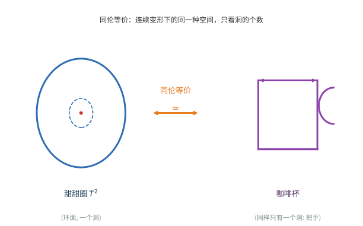
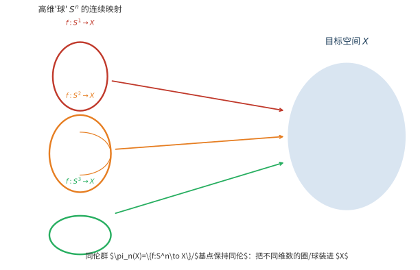

# 第 44 级：同伦论 (Homotopy Theory)

> 同伦论是代数拓扑的核心分支，它研究拓扑空间在连续形变下保持不变的性质。通过将几何问题转化为代数问题，同伦论为理解空间的本质结构提供了强大的工具。从基本群到高阶同伦群，从纤维化到障碍理论，同伦论深刻地影响了代数拓扑、代数几何、微分几何和数学物理的发展。

---

## 1. 学习目标

- 理解同伦与同伦等价的基本概念，掌握形变收缩与纤维化
- 掌握同伦群的定义与基本性质，理解高阶同伦群
- 理解纤维化同伦正合序列并能独立推导
- 掌握 Whitehead 定理的条件与证明思路
- 理解 CW 复形的结构与胞腔逼近定理
- 掌握 Hurewicz 定理及其在同调群与同伦群之间的联系
- 理解 Eilenberg-MacLane 空间的存在唯一性
- 了解障碍理论的基本思想
- 掌握 Freudenthal 悬挂定理及其在同伦群计算中的应用

---

## 2. 核心概念

### 2.1 同伦与同伦等价 (Homotopy and Homotopy Equivalence)

**定义 2.1（同伦）** 设 $X$ 和 $Y$ 是拓扑空间，$f,g:X\to Y$ 是连续映射。若存在连续映射 $H:X\times[0,1]\to Y$ 使得对任意 $x\in X$ 有
$$
H(x,0)=f(x),\quad H(x,1)=g(x),
$$
则称 $f$ 与 $g$ 是**同伦的**，记作 $f\simeq g$。映射 $H$ 称为从 $f$ 到 $g$ 的**同伦**。

同伦是拓扑空间之间连续映射集合上的等价关系。若我们固定一个基点的子空间 $A\subseteq X$，并要求同伦在 $A$ 上保持不动，则称为**相对同伦**。

**定义 2.2（同伦等价）** 拓扑空间 $X$ 与 $Y$ 称为**同伦等价的**（或称具有相同的**同伦型**），若存在连续映射 $f:X\to Y$ 和 $g:Y\to X$ 使得
$$
g\circ f\simeq\operatorname{id}_X,\quad f\circ g\simeq\operatorname{id}_Y.
$$
此时称 $f$ 为**同伦等价**，$g$ 为 $f$ 的**同伦逆**。

**定义 2.3（可缩空间）** 若拓扑空间 $X$ 与单点空间同伦等价，则称 $X$ 是**可缩的**。等价地，恒等映射 $\operatorname{id}_X$ 同伦于常值映射。

**例 2.4** $\mathbb{R}^n$ 是可缩空间。事实上，$H(x,t)=tx$ 给出从 $\operatorname{id}_{\mathbb{R}^n}$ 到常值映射 $x\mapsto 0$ 的同伦。

> **直观理解（现实类比）**：想象用可塑的橡皮泥捏一个甜甜圈，再用手把它揉成一只带把手的咖啡杯——只要不把中间的洞捏合、不在杯子上戳新的洞，两者的"洞的个数"就始终相同。这种只关心"洞"、不关心具体形状的等价，就是同伦等价。它比"完全一样"（同胚）宽松得多：拓扑学家眼里，甜甜圈和咖啡杯其实是"同一个东西"。

### 2.2 形变收缩 (Deformation Retraction)

**定义 2.5（形变收缩）** 设 $A\subseteq X$ 是子空间。**形变收缩** $r:X\to A$ 是满足以下条件的映射：
- $r|_A=\operatorname{id}_A$（即 $r$ 是收缩）；
- 存在同伦 $H:X\times[0,1]\to X$ 使得 $H(x,0)=x$，$H(x,1)=r(x)$，且对任意 $a\in A$ 和 $t\in[0,1]$ 有 $H(a,t)=a$。

若存在这样的形变收缩，则称 $A$ 是 $X$ 的**形变收缩核**。

**例 2.6** $S^{n-1}$ 是 $\mathbb{R}^n\setminus\{0\}$ 的形变收缩核。形变收缩由
$$
r(x)=\frac{x}{\|x\|},\quad H(x,t)=(1-t)x+t\frac{x}{\|x\|}
$$
给出。

**命题 2.7** 若 $A$ 是 $X$ 的形变收缩核，则包含映射 $i:A\hookrightarrow X$ 是同伦等价。

**证明**：取形变收缩 $r:X\to A$，则 $r\circ i=\operatorname{id}_A$，而 $i\circ r\simeq\operatorname{id}_X$ 由形变同伦 $H$ 给出。$\square$

### 2.3 纤维化 (Fibration)

**定义 2.8（纤维化）** 连续映射 $p:E\to B$ 称为**纤维化**（或 **Hurewicz 纤维化**），若它满足**同伦提升性质**（Homotopy Lifting Property, HLP）：对任意空间 $X$，任意映射 $f:X\to E$ 和同伦 $H:X\times[0,1]\to B$ 满足 $p\circ f=H(\cdot,0)$，存在同伦 $\tilde{H}:X\times[0,1]\to E$ 使得 $p\circ\tilde{H}=H$ 且 $\tilde{H}(\cdot,0)=f$。

**定义 2.9（纤维）** 对于纤维化 $p:E\to B$ 和基点 $b_0\in B$，称 $F=p^{-1}(b_0)$ 为**纤维**。

**例 2.10（覆盖空间）** 覆盖空间 $p:\tilde{X}\to X$ 是纤维化，其纤维是离散空间。

**例 2.11（纤维丛）** 光滑纤维丛（如 Hopf 纤维化 $S^1\to S^3\to S^2$）是纤维化。

**例 2.12（路径空间纤维化）** 对任意空间 $X$ 和基点 $x_0\in X$，**路径空间**
$$
PX=\{\gamma:[0,1]\to X\mid\gamma(0)=x_0\}
$$
是映射空间（配备紧开拓扑）。**端点映射** $\pi:PX\to X$，$\pi(\gamma)=\gamma(1)$ 是纤维化。其纤维是**环路空间**
$$
\Omega X=\{\gamma:[0,1]\to X\mid\gamma(0)=\gamma(1)=x_0\}.
$$

### 2.4 同伦纤维 (Homotopy Fiber)

**定义 2.13（同伦纤维）** 设 $f:X\to Y$ 是连续映射。$f$ 的**同伦纤维**定义为
$$
\operatorname{hofib}(f)=\{(x,\gamma)\in X\times PY\mid\gamma(0)=f(x),\gamma(1)=y_0\},
$$
其中 $y_0\in Y$ 是基点。这是一个纤维化 $p:\operatorname{hofib}(f)\to X$，$p(x,\gamma)=x$ 的纤维。

**注** 同伦纤维的概念在纤维化不严格时非常重要，它给出了将任意映射"纤维化"的标准方法。

### 2.5 同伦群 (Homotopy Groups)

**定义 2.14（基本群）** 设 $X$ 是拓扑空间，$x_0\in X$ 是基点。**基本群** $\pi_1(X,x_0)$ 是以 $x_0$ 为基点的环路 $[0,1]\to X$（起点和终点均为 $x_0$）的同伦类构成的群，群运算由环路连接给出。

**定义 2.15（第 $n$ 同伦群）** 设 $X$ 是拓扑空间，$x_0\in X$ 是基点。**第 $n$ 同伦群**定义为
$$
\pi_n(X,x_0)=\{f:(S^n,s_0)\to(X,x_0)\}/\text{基点保持同伦},
$$
其中 $S^n$ 是 $n$ 维球面，$s_0\in S^n$ 是基点。群运算由"挤压"映射给出：对于 $f,g:S^n\to X$，
$$
(f+g)(s)=\begin{cases}
f(2s_1,s_2,\ldots,s_n), & 0\le s_1\le\frac12,\\
g(2s_1-1,s_2,\ldots,s_n), & \frac12\le s_1\le1.
\end{cases}
$$

**命题 2.16** 对 $n\ge 2$，$\pi_n(X,x_0)$ 是 Abel 群。

**证明要点**：当 $n\ge2$ 时，可以旋转坐标来交换两个映射，从而证明群运算交换。$\square$

**例 2.17** $\pi_n(S^1)=0$ 对所有 $n\ge2$ 成立。这是因为 $S^1$ 的万有覆盖是 $\mathbb{R}$，而 $\mathbb{R}$ 是可缩的。

> **直观理解（现实类比）**：$\pi_1$ 是"把一维的橡皮筋套进空间里"，$\pi_2$ 是"把二维的气球皮裹进空间里"，$\pi_3$ 则是"把三维的球泡塞进空间里"，依此类推——维数越高的"圈/球"越能探测到越细微的"孔洞"结构。$S^1$ 只有一个一维的洞，所以高阶的圈（$n\ge2$）全都套不住它，故 $\pi_n(S^1)=0$。维度每升高一维，我们对空间"内部空腔"的探测就更精细一层。

### 2.6 高阶同伦群 (Higher Homotopy Groups)

**命题 2.18（与环路空间的关系）** 存在自然的同构
$$
\pi_n(X,x_0)\cong\pi_{n-1}(\Omega X,\ast),
$$
其中 $\Omega X$ 是 $X$ 的环路空间，$\ast$ 是常值环路。

**证明**：映射 $f:S^n\to X$ 可视为映射 $f:S^{n-1}\to\Omega X$，通过将 $S^n$ 视为 $S^{n-1}$ 的悬挂。具体地，有同构
$$
\pi_n(X)\cong\pi_1(\Omega^{n-1}X),
$$
其中 $\Omega^{k}X$ 是迭代的环路空间。$\square$

**例 2.19** 对于 $n\ge1$，$\pi_k(S^n)$ 在 $k<n$ 时为零，在 $k=n$ 时为 $\mathbb{Z}$。这一事实将在后续定理中证明。

### 2.7 同伦正合序列 (Homotopy Exact Sequence)

**定理 2.20（纤维化的同伦正合序列）** 设 $p:E\to B$ 是纤维化，纤维为 $F=p^{-1}(b_0)$，$b_0\in B$ 是基点，$e_0\in F$ 是基点。则存在长正合序列
$$
\cdots\to\pi_n(F,e_0)\xrightarrow{i_*}\pi_n(E,e_0)\xrightarrow{p_*}\pi_n(B,b_0)\xrightarrow{\partial}\pi_{n-1}(F,e_0)\to\cdots
$$
$$
\cdots\to\pi_1(B,b_0)\to\pi_0(F)\to\pi_0(E)\to\pi_0(B).
$$

其中 $i:F\hookrightarrow E$ 是包含映射，$\partial$ 是连接同态。此序列的证明将在第 3 节给出。

**例 2.21** 考虑 Hopf 纤维化 $S^1\to S^3\to S^2$。由同伦正合序列：
$$
\cdots\to\pi_n(S^1)\to\pi_n(S^3)\to\pi_n(S^2)\to\pi_{n-1}(S^1)\to\cdots
$$
由于 $\pi_n(S^1)=0$ 对 $n\ge2$，得到 $\pi_n(S^3)\cong\pi_n(S^2)$ 对 $n\ge3$。特别地，$\pi_3(S^2)\cong\pi_3(S^3)\cong\mathbb{Z}$。

### 2.8 Whitehead 定理 (Whitehead Theorem)

**定理 2.22（Whitehead 定理）** 设 $X$ 和 $Y$ 是连通 CW 复形，$f:X\to Y$ 是连续映射。若 $f$ 诱导所有同伦群的同构，即
$$
f_*:\pi_n(X)\xrightarrow{\cong}\pi_n(Y),\quad \forall n\ge1,
$$
则 $f$ 是同伦等价。

**注** 此定理的逆命题显然成立：同伦等价诱导同伦群的同构。Whitehead 定理的重要性在于它给出了同伦群完全决定 CW 复形同伦型的条件。详细的证明将在第 3 节给出。

### 2.9 CW 复形 (CW Complex)

**定义 2.23（CW 复形）** 一个 **CW 复形** 是由以下方式归纳构造的拓扑空间 $X$：

1. **$0$ 维骨架** $X^0$ 是离散点集。
2. **归纳步骤**：给定 $(n-1)$ 维骨架 $X^{n-1}$，令 $\{e_\alpha^n\}$ 是一族 $n$ 维开胞腔，每个胞腔通过**附着映射** $\varphi_\alpha:S^{n-1}\to X^{n-1}$ 粘合到 $X^{n-1}$ 上。即
   $$
   X^n=X^{n-1}\sqcup_{\varphi_\alpha}\bigsqcup_\alpha D_\alpha^n,
   $$
   其中 $D_\alpha^n$ 是 $n$ 维闭圆盘。
3. $X$ 的拓扑是**弱拓扑**：$A\subseteq X$ 是闭集当且仅当对每个 $n$，$A\cap X^n$ 是闭集。
4. **$C$ 条件**：$X$ 的每个紧子集只与有限个胞腔相交。

**例 2.24** 
- $S^n$ 有 CW 结构：一个 $0$ 维胞腔和一个 $n$ 维胞腔。
- $\mathbb{R}P^n$ 有 CW 结构：每个维度一个胞腔。
- 任意流形同伦等价于一个 CW 复形。

### 2.10 胞腔逼近 (Cellular Approximation)

**定理 2.25（胞腔逼近定理）** 设 $X$ 和 $Y$ 是 CW 复形，$f:X\to Y$ 是连续映射。则 $f$ 同伦于一个**胞腔映射**，即满足 $f(X^n)\subseteq Y^n$ 对所有 $n$ 成立的映射。

**推论 2.26** 若 $X$ 是 CW 复形，则 $\pi_k(X^n)\cong\pi_k(X)$ 对所有 $k<n$ 成立，且 $\pi_n(X^n)\to\pi_n(X)$ 是满射。其中 $X^n$ 是 $X$ 的 $n$ 维骨架。

**证明**：由胞腔逼近，任意 $S^k\to X$（$k<n$）同伦于 $S^k\to X^n$，且任意 $S^n\to X$ 同伦于 $S^n\to X^n$，而 $S^n\to X^n$ 的零伦性在 $X^{n+1}$ 中检测。$\square$

### 2.11 同伦范畴 (Homotopy Category)

**定义 2.27（同伦范畴）** **同伦范畴** $\operatorname{Ho}(\mathbf{Top})$ 是对象为拓扑空间、态射为连续映射的同伦类的范畴。即
$$
\operatorname{Ho}(\mathbf{Top})(X,Y)=[X,Y],
$$
其中 $[X,Y]$ 表示从 $X$ 到 $Y$ 的连续映射的同伦类集合。

**带基点的同伦范畴** $\operatorname{Ho}(\mathbf{Top}_*)$ 的对象是带基点的拓扑空间，态射是基点保持映射的同伦类。

**定义 2.28（弱等价）** 连续映射 $f:X\to Y$ 称为**弱同伦等价**，若它诱导所有同伦群的同构：
$$
f_*:\pi_n(X,x)\xrightarrow{\cong}\pi_n(Y,f(x)),\quad\forall n\ge0,\forall x\in X.
$$

在同伦范畴中，弱同伦等价被当作同构来处理。Whitehead 定理表明，在 CW 复形上，弱同伦等价就是同伦等价。

### 2.12 Eilenberg-MacLane 空间

**定义 2.29（Eilenberg-MacLane 空间）** 设 $G$ 是群（$n=1$ 时）或 Abel 群（$n\ge2$ 时）。空间 $K(G,n)$ 称为 **Eilenberg-MacLane 空间**，若
$$
\pi_k(K(G,n))\cong\begin{cases}
G, & k=n,\\
0, & k\neq n.
\end{cases}
$$

**例 2.30**
- $K(\mathbb{Z},1)\simeq S^1$
- $K(\mathbb{Z}/2,1)\simeq\mathbb{R}P^\infty$
- $K(\mathbb{Z},2)\simeq\mathbb{C}P^\infty$

### 2.13 障碍理论 (Obstruction Theory)

**定义 2.31（障碍上链）** 设 $X$ 是 CW 复形，$Y$ 是 $K(\pi,n)$ 空间。考虑将 $X$ 的 $k$ 维骨架 $X^k$ 映射到 $Y$ 的映射 $f:X^k\to Y$。将 $f$ 扩充到 $X^{k+1}$ 的障碍是一个 $(k+1)$ 维上链
$$
c_f\in C^{k+1}(X;\pi_k(Y))=\operatorname{Hom}(C_{k+1}(X),\pi_k(Y)).
$$

**定理 2.32（障碍理论基本定理）** 映射 $f:X^k\to Y$ 可扩充到 $X^{k+1}$ 当且仅当障碍上链 $c_f$ 为零。若 $c_f$ 为零，则所有扩充的集合与 $C^k(X;\pi_{k+1}(Y))$ 一一对应。

**注** 障碍理论在分类空间理论、示性类理论和同伦论中有着广泛的应用。

---

## 3. 定理与证明

### 3.1 纤维化同伦正合序列

**定理 3.1（纤维化同伦正合序列）** 设 $p:E\to B$ 是纤维化，纤维为 $F=p^{-1}(b_0)$，$b_0\in B$ 是基点，$e_0\in F$ 是基点。则存在长正合序列
$$
\cdots\to\pi_n(F,e_0)\xrightarrow{i_*}\pi_n(E,e_0)\xrightarrow{p_*}\pi_n(B,b_0)\xrightarrow{\partial}\pi_{n-1}(F,e_0)\to\cdots
$$
$$
\cdots\to\pi_1(B,b_0)\to\pi_0(F)\to\pi_0(E)\to\pi_0(B).
$$

**证明**：我们需要构造连接同态 $\partial:\pi_n(B,b_0)\to\pi_{n-1}(F,e_0)$，并证明序列的正合性。

**步骤 1：构造连接同态 $\partial$**

设 $[f]\in\pi_n(B,b_0)$，其中 $f:(S^n,s_0)\to(B,b_0)$。考虑 $S^n$ 为 $n$ 维立方体 $I^n=[0,1]^n$ 的商空间，将边界粘合到一点。因此 $f$ 对应为映射 $f:(I^n,\partial I^n)\to(B,b_0)$。

将 $I^n$ 视为 $I^{n-1}\times[0,1]$。考虑映射 $F:I^{n-1}\times[0,1]\to B$，$F(x,t)=f(x,t)$。由于 $p$ 是纤维化，且常值映射 $c:I^{n-1}\to E$（映射到 $e_0$）是 $F(\cdot,0)=f(\cdot,0)=b_0$ 的提升，由同伦提升性质，存在提升 $\tilde{F}:I^{n-1}\times[0,1]\to E$ 使得 $p\circ\tilde{F}=F$ 且 $\tilde{F}(x,0)=e_0$。

现在考虑 $\tilde{F}$ 在 $t=1$ 时的限制 $\tilde{f}(x)=\tilde{F}(x,1)$。由于 $f(\partial I^{n-1},t)=b_0$ 对所有 $t$ 成立，由提升的唯一性知 $\tilde{F}(\partial I^{n-1},t)=e_0$。因此 $\tilde{f}$ 映射 $\partial I^{n-1}$ 到 $e_0$，且 $p(\tilde{f}(x))=f(x,1)=b_0$，故 $\tilde{f}(x)\in F$。于是 $\tilde{f}$ 定义了 $(n-1)$ 维球面到 $F$ 的映射，即 $\tilde{f}:(I^{n-1},\partial I^{n-1})\to(F,e_0)$。

定义 $\partial[f]=[\tilde{f}]\in\pi_{n-1}(F,e_0)$。

**步骤 2：验证 $\partial$ 的良定义性**

若 $f\simeq g$ 通过同伦 $H$，则使用纤维化的同伦提升性质得到 $\tilde{f}\simeq\tilde{g}$，故 $\partial$ 在同伦类上良定义。

**步骤 3：在 $\pi_n(E)$ 处正合**

即 $\operatorname{im}i_*=\ker p_*$。

- $i_*\circ p_*$：设 $[g]\in\pi_n(F)$，则 $p_*(i_*([g]))=[p\circ i\circ g]=[\text{常值映射}]=0$，故 $\operatorname{im}i_*\subseteq\ker p_*$。
- 反之，若 $[f]\in\pi_n(E)$ 且 $p_*([f])=0$，则存在同伦 $H:S^n\times[0,1]\to B$ 从 $p\circ f$ 到常值映射。由同伦提升性质，存在提升 $\tilde{H}:S^n\times[0,1]\to E$ 使得 $\tilde{H}(\cdot,0)=f$ 且 $\tilde{H}(s_0,t)=e_0$。则 $\tilde{H}(\cdot,1):S^n\to E$ 的像在 $F$ 中，且 $\tilde{H}$ 给出 $f$ 与 $i\circ\tilde{H}(\cdot,1)$ 的同伦。故 $[f]\in\operatorname{im}i_*$。

**步骤 4：在 $\pi_n(B)$ 处正合**

即 $\operatorname{im}p_*=\ker\partial$。

- $p_*$ 后接 $\partial$：设 $[f]\in\pi_n(E)$，则 $p_*([f])=[p\circ f]$。在 $\partial$ 的构造中取 $f$ 为 $p\circ f$，则提升 $\tilde{F}$ 可取为 $f$（将 $I^n$ 视为 $I^{n-1}\times[0,1]$），于是 $\partial(p_*([f]))$ 由 $f$ 在最后一层限制给出，但 $f$ 将整个边界映射到 $e_0$，故 $\partial(p_*([f]))=0$。
- 反之，若 $[f]\in\pi_n(B)$ 且 $\partial[f]=0$，则存在同伦从 $\tilde{f}$ 到常值映射。使用同伦提升性质可构造 $f$ 的提升到 $E$，故 $[f]\in\operatorname{im}p_*$。

**步骤 5：在 $\pi_{n-1}(F)$ 处正合**

即 $\operatorname{im}\partial=\ker i_*$。

- $\partial$ 后接 $i_*$：设 $[f]\in\pi_n(B)$，则 $i_*(\partial[f])=[i\circ\tilde{f}]$，其中 $\tilde{f}$ 是 $f$ 的提升在最后一层的限制。由构造，$\tilde{f}$ 同伦于 $f$ 的提升在顶部面的限制，而 $i\circ\tilde{f}$ 在 $E$ 中可缩（通过提升同伦），故 $i_*(\partial[f])=0$。
- 反之，若 $[g]\in\pi_{n-1}(F)$ 且 $i_*([g])=0$，则存在同伦 $H:S^{n-1}\times[0,1]\to E$ 从 $i\circ g$ 到常值映射。将 $H$ 视为映射 $D^n\to E$，可定义 $f:S^n\to B$ 使得 $\partial[f]=[g]$。

**步骤 6：正合性在 $\pi_0$ 处**

对于 $n=0$，需要单独处理。$\pi_0(X)$ 是道路连通分支的集合。序列
$$
\pi_1(B,b_0)\to\pi_0(F)\to\pi_0(E)\to\pi_0(B)
$$
的正合性可通过直接论证得到。$\square$

**推论 3.2** 若 $p:E\to B$ 是纤维化，$B$ 是道路连通的，则纤维 $F$ 的任意两个纤维在 $E$ 中同伦等价。

### 3.2 Whitehead 定理

**定理 3.3（Whitehead 定理）** 设 $X$ 和 $Y$ 是连通 CW 复形，$f:X\to Y$ 是连续映射。若 $f$ 诱导所有同伦群的同构
$$
f_*:\pi_n(X)\xrightarrow{\cong}\pi_n(Y),\quad \forall n\ge1,
$$
则 $f$ 是同伦等价。

**证明**：我们将使用胞腔逼近和"压缩"论证来构造 $f$ 的同伦逆。

**步骤 1：转化为骨架上的问题**

由于 $X$ 和 $Y$ 是 CW 复形，我们可以考虑它们的骨架结构。我们将在 $Y$ 的每个骨架上逐步构造 $g:Y\to X$ 使得 $g\circ f\simeq\operatorname{id}_X$ 且 $f\circ g\simeq\operatorname{id}_Y$。

**步骤 2：构造 $g$ 在 $0$ 维骨架上**

由于 $Y$ 是连通的，$Y^0$ 是离散点集。选择 $y_0\in Y^0$ 作为基点。由于 $f_*:\pi_0(X)\to\pi_0(Y)$ 是双射（$n=0$ 时的条件），$X$ 也是连通的。定义 $g:Y^0\to X$ 为任意将 $y_0$ 映射到 $x_0=f^{-1}(y_0)$ 的映射，并任意选取其他点的像。

**步骤 3：归纳构造 $g$ 在 $n$ 维骨架上**

假设 $g$ 已在 $Y^{n-1}$ 上定义，且满足 $g\circ f|_{X^{n-1}}\simeq\operatorname{id}_{X^{n-1}}$ 和 $f\circ g|_{Y^{n-1}}\simeq\operatorname{id}_{Y^{n-1}}$（通过相对同伦）。我们需要将 $g$ 扩充到 $Y^n$。

$Y^n$ 由 $Y^{n-1}$ 通过粘合 $n$ 维胞腔 $e_\alpha^n$ 得到，每个胞腔由附着映射 $\varphi_\alpha:S^{n-1}\to Y^{n-1}$ 粘合。对每个胞腔 $e_\alpha^n$，考虑复合映射
$$
S^{n-1}\xrightarrow{\varphi_\alpha}Y^{n-1}\xrightarrow{g}X.
$$
我们需要将 $g$ 扩充到整个 $D^n$ 上，即寻找 $\tilde{g}_\alpha:D^n\to X$ 使得 $\tilde{g}_\alpha|_{S^{n-1}}=g\circ\varphi_\alpha$。

**步骤 4：使用同伦群的条件**

由于 $f_*:\pi_{n-1}(X)\to\pi_{n-1}(Y)$ 是同构，且 $f\circ g\circ\varphi_\alpha\simeq\varphi_\alpha$（由归纳假设），我们有
$$
[g\circ\varphi_\alpha]\in\pi_{n-1}(X)\xrightarrow{f_*}\pi_{n-1}(Y)
$$
且 $f_*([g\circ\varphi_\alpha])=[f\circ g\circ\varphi_\alpha]=[\varphi_\alpha]$。由于 $f_*$ 是同构，且 $\varphi_\alpha$ 可扩充到 $D^n$（因为它是 $Y$ 中胞腔的附着映射，而 $Y$ 已存在该胞腔），故 $g\circ\varphi_\alpha$ 在 $X$ 中可扩充到 $D^n$。因此存在 $\tilde{g}_\alpha:D^n\to X$ 扩充 $g\circ\varphi_\alpha$。

**步骤 5：验证 $f\circ g\simeq\operatorname{id}_Y$**

在 $Y^n$ 上，我们已定义 $g$。考虑 $f\circ g:Y^n\to Y$。由构造，在 $Y^{n-1}$ 上有 $f\circ g\simeq\operatorname{id}_{Y^{n-1}}$，且此同伦可扩充到 $Y^n$ 上，因为所有障碍上链为零（由 $f_*$ 是同构保证）。因此 $f\circ g\simeq\operatorname{id}_Y$。

**步骤 6：验证 $g\circ f\simeq\operatorname{id}_X$**

类似地，对 $X$ 的每个骨架进行论证。由于 $f_*$ 是同构，$g$ 的构造保证 $g\circ f\simeq\operatorname{id}_X$。

**步骤 7：结论**

由归纳法得到 $g:Y\to X$ 满足 $g\circ f\simeq\operatorname{id}_X$ 且 $f\circ g\simeq\operatorname{id}_Y$，故 $f$ 是同伦等价。$\square$

**定理 3.4（Whitehead 定理的另一种形式）** 连通 CW 复形之间的弱同伦等价是同伦等价。特别地，若 $X$ 和 $Y$ 是连通 CW 复形且 $\pi_n(X)\cong\pi_n(Y)$ 对所有 $n$ 成立（通过某个映射诱导），则 $X\simeq Y$。

### 3.3 CW 复形的逼近定理

**定理 3.5（CW 逼近定理）** 对任意拓扑空间 $X$，存在 CW 复形 $Z$ 和弱同伦等价 $f:Z\to X$。这样的 $Z$ 称为 $X$ 的 **CW 逼近**。

**证明**：我们将通过归纳构造 $Z$ 的骨架。

**步骤 1：构造 $0$ 维骨架**

令 $Z^0$ 为 $X$ 的道路连通分支的集合，即 $Z^0=\pi_0(X)$ 作为离散空间。定义 $f:Z^0\to X$ 为选择每个分支中的一个代表点。

**步骤 2：构造 $1$ 维骨架**

对每个 $z\in Z^0$，考虑基本群 $\pi_1(X,f(z))$。取一组生成元 $\{[g_\alpha]\}$。对每个生成元，取 $g_\alpha:S^1\to X$ 代表该同伦类。将 $S^1$ 视为一个 $1$ 维胞腔，通过粘合 $S^1$ 到 $Z^0$ 上的对应点，得到 $Z^1$。定义 $f$ 在 $1$ 维胞腔上为 $g_\alpha$。

**步骤 3：归纳构造 $n$ 维骨架**

假设已构造 $Z^{n-1}$ 和 $f:Z^{n-1}\to X$，使得 $f_*:\pi_k(Z^{n-1})\to\pi_k(X)$ 对 $k<n-1$ 是同构，且对 $k=n-1$ 是满射。

对每个 $[\alpha]\in\ker(\pi_{n-1}(Z^{n-1})\to\pi_{n-1}(X))$，取代表 $\alpha:S^{n-1}\to Z^{n-1}$。由于 $[\alpha]$ 在核中，存在同伦 $H:S^{n-1}\times[0,1]\to X$ 从 $f\circ\alpha$ 到常值映射。将 $D^n$ 通过 $\alpha$ 粘合到 $Z^{n-1}$，得到 $Z^n$。定义 $f$ 在 $D^n$ 上为 $H$（将 $D^n$ 视为锥）。

接下来，对每个 $[\beta]\in\pi_n(X)$ 中不在 $f_*(\pi_n(Z^{n-1}))$ 中的元素，取代表 $\beta:S^n\to X$，将 $S^n$ 视为一个 $n$ 维胞腔（其边界映射到基点），通过常值映射粘合到 $Z^{n-1}$，得到 $Z^n$。定义 $f$ 在该胞腔上为 $\beta$。

**步骤 4：验证 $f$ 是弱同伦等价**

由构造，$f_*:\pi_k(Z^n)\to\pi_k(X)$ 对 $k<n$ 是同构，且对 $k=n$ 是满射。令 $Z=\bigcup_n Z^n$ 取弱拓扑，则 $f:Z\to X$ 诱导所有同伦群的同构，从而是弱同伦等价。$\square$

**推论 3.6** 任何拓扑空间 $X$ 都有 CW 逼近，且 CW 逼近在弱同伦等价意义下唯一。

### 3.4 Hurewicz 定理

**定理 3.7（Hurewicz 定理）** 设 $X$ 是道路连通的拓扑空间，$n\ge2$。若对 $k=1,2,\ldots,n-1$ 有 $\pi_k(X)=0$，则
$$
H_k(X)=0 \quad (1\le k\le n-1),
$$
且存在自然同构
$$
h:\pi_n(X)\xrightarrow{\cong}H_n(X).
$$
对于 $n=1$ 的情况，有 $h:\pi_1(X)/[\pi_1(X),\pi_1(X)]\xrightarrow{\cong}H_1(X)$（即基本群的 Abel 化同构于 $H_1(X)$）。

**证明**：我们将使用 CW 逼近和胞腔同调来证明。

**步骤 1：化简为 CW 复形**

由 CW 逼近定理，存在 CW 复形 $Z$ 和弱同伦等价 $f:Z\to X$。由于弱同伦等价诱导同调群的同构（通过比较奇异同调），且 $\pi_k(Z)\cong\pi_k(X)$，故只需对 $Z$ 证明定理。

**步骤 2：分析 $Z$ 的骨架**

设 $Z$ 是 $(n-1)$ 连通的 CW 复形，即 $\pi_k(Z)=0$ 对 $k\le n-1$。由胞腔逼近定理，$Z$ 同伦等价于一个没有 $1,2,\ldots,n-1$ 维胞腔的 CW 复形。事实上，我们可以通过"胞腔消去"过程，将 $Z$ 变形为只有 $0$ 维和 $\ge n$ 维胞腔的 CW 复形。

**步骤 3：计算 $H_k(Z)$**

若 $Z$ 只有 $0$ 维和 $\ge n$ 维胞腔，则胞腔链复形 $C_k(Z)$ 在 $1\le k\le n-1$ 时为零，故 $H_k(Z)=0$ 对 $1\le k\le n-1$。

**步骤 4：构造 Hurewicz 同态**

定义 $h:\pi_n(Z)\to H_n(Z)$ 如下：对 $[f]\in\pi_n(Z)$，其中 $f:S^n\to Z$，考虑 $f$ 在奇异同调中诱导的映射 $f_*:H_n(S^n)\to H_n(Z)$。令 $[S^n]\in H_n(S^n)$ 是基本类（即 $S^n$ 的定向生成元），定义
$$
h([f])=f_*([S^n])\in H_n(Z).
$$

**步骤 5：证明 $h$ 是群同态**

设 $[f],[g]\in\pi_n(Z)$，则 $[f+g]$ 定义为 $f$ 和 $g$ 的挤压和。在奇异同调中，$(f+g)_*([S^n])=f_*([S^n])+g_*([S^n])$，因为 $S^n$ 的基本类在挤压映射下的像为两个基本类之和。因此 $h$ 是群同态。

**步骤 6：证明 $h$ 是满射**

设 $[c]\in H_n(Z)$。由于 $Z$ 只有 $0$ 维和 $\ge n$ 维胞腔，$H_n(Z)$ 由 $n$ 维胞腔生成。每个 $n$ 维胞腔对应一个附着映射 $S^{n-1}\to Z^{n-1}$，但 $Z^{n-1}$ 是 $0$ 维的（因为 $n\ge2$ 且没有 $1$ 到 $n-1$ 维胞腔），故 $Z^{n-1}$ 是离散点集，从而 $S^{n-1}$ 到 $Z^{n-1}$ 的映射必为常值映射。因此每个 $n$ 维胞腔实际上对应一个映射 $S^n\to Z^n\to Z$，即 $\pi_n(Z)$ 中的元素。该映射在 Hurewicz 同态下的像就是该胞腔对应的同调类。故 $h$ 是满射。

**步骤 7：证明 $h$ 是单射**

设 $[f]\in\pi_n(Z)$ 且 $h([f])=0$，即 $f_*([S^n])=0$ 在 $H_n(Z)$ 中。我们需要证明 $f$ 在 $\pi_n(Z)$ 中为零。

由于 $f_*([S^n])=0$，存在 $(n+1)$ 维奇异链 $c$ 使得 $\partial c=f_*([S^n])$。通过逼近，我们可以将 $f$ 视为 $Z^n$ 中的映射，并利用 $Z^n$ 的胞腔结构构造 $f$ 到常值映射的同伦。

具体地，考虑 $Z$ 的万有覆盖（或使用 $H_n(Z)$ 与 $\pi_n(Z)$ 的关系），利用 $Z$ 的 $(n-1)$ 连通性，可以证明 $Z^n$ 同伦等价于一个楔积 $\bigvee_\alpha S_\alpha^n$。在此楔积中，$\pi_n(\bigvee S^n)$ 是自由 Abel 群，且 Hurewicz 同态是此自由 Abel 群到 $H_n$ 的同构。因此若 $h([f])=0$，则 $[f]=0$。

**步骤 8：$n=1$ 的情况**

对于 $n=1$，$\pi_1(X)$ 不一定是 Abel 群。Hurewicz 定理断言存在同构
$$
\pi_1(X)/[\pi_1(X),\pi_1(X)]\cong H_1(X).
$$
这可以通过将 $\pi_1(X)$ 视为 $X$ 的万有覆盖的覆盖变换群，并计算 $H_1(X)$ 得到。$\square$

**推论 3.8** 若 $X$ 是 $(n-1)$ 连通的 CW 复形，$n\ge2$，则第一个非平凡的同调群出现在维度 $n$，且 $H_n(X)\cong\pi_n(X)$。

**例 3.9** 由于 $S^n$ 是 $(n-1)$ 连通的且 $\pi_n(S^n)\cong\mathbb{Z}$，Hurewicz 定理给出 $H_n(S^n)\cong\mathbb{Z}$，$H_k(S^n)=0$ 对 $k\neq0,n$。这与直接计算一致。

### 3.5 Eilenberg-MacLane 空间的存在唯一性

**定理 3.10（Eilenberg-MacLane 空间的存在性）** 对任意群 $G$ 和 $n\ge1$（当 $n\ge2$ 时要求 $G$ 是 Abel 群），存在 Eilenberg-MacLane 空间 $K(G,n)$。

**证明**：我们将通过构造 CW 复形来证明存在性。

**步骤 1：$n=1$ 的情况**

对任意群 $G$，取 $G$ 的表示 $\langle g_\alpha\mid r_\beta\rangle$。构造 $K(G,1)$ 如下：
- $X^1$ 是楔积 $\bigvee_\alpha S_\alpha^1$，每个 $S_\alpha^1$ 对应一个生成元 $g_\alpha$。
- 对每个关系 $r_\beta$，沿 $r_\beta$ 对应的环路粘合 $2$ 维胞腔。
- 继续粘合 $3$ 维及以上胞腔以消去高阶同伦群。

具体地，由 $\pi_1(\bigvee S_\alpha^1)$ 是以 $\{g_\alpha\}$ 为生成元的自由群。粘合 $2$ 维胞腔使关系 $r_\beta$ 成立，得到 $\pi_1$ 为 $G$ 的空间。然后对每个 $k\ge2$，取 $\pi_k(X)$ 的一组生成元，粘合 $(k+1)$ 维胞腔来消去它们，重复此过程得到 $K(G,1)$。

**步骤 2：$n\ge2$ 的情况**

设 $G$ 是 Abel 群。取生成元集 $\{g_\alpha\}$ 和关系集 $\{r_\beta\}$。构造 $X^n$ 为楔积 $\bigvee_\alpha S_\alpha^n$，则 $\pi_n(X^n)$ 是以 $\{g_\alpha\}$ 为生成元的自由 Abel 群。

对每个关系 $r_\beta$，粘合 $(n+1)$ 维胞腔来消去该关系，得到 $X^{n+1}$，使得 $\pi_n(X^{n+1})\cong G$。

现在 $\pi_{n+1}(X^{n+1})$ 可能非零。取 $\pi_{n+1}(X^{n+1})$ 的一组生成元，粘合 $(n+2)$ 维胞腔来消去它们。重复此过程，对每个 $k>n$，消去 $\pi_k$ 中的生成元，最终得到 $K(G,n)$。$\square$

**定理 3.11（Eilenberg-MacLane 空间的唯一性）** 若 $X$ 和 $Y$ 都是 $K(G,n)$ 空间，则它们弱同伦等价。若 $X$ 和 $Y$ 还是 CW 复形，则它们同伦等价。

**证明**：考虑恒等映射 $\operatorname{id}_G:G\to G$。由表示定理，存在映射 $f:X\to Y$ 诱导 $\pi_n$ 上的恒等同构。由于 $X$ 和 $Y$ 的其他同伦群为零，$f$ 诱导所有同伦群的同构，从而是弱同伦等价。若 $X$ 和 $Y$ 是 CW 复形，由 Whitehead 定理，$f$ 是同伦等价。$\square$

**推论 3.12** 对任意 Abel 群 $G$ 和 $n\ge1$，$K(G,n)$ 在弱同伦等价意义下唯一。

### 3.6 Freudenthal 悬挂定理

**定理 3.13（Freudenthal 悬挂定理）** 设 $X$ 是 $(n-1)$ 连通的 CW 复形，$n\ge1$。则**悬挂映射**（suspension map）
$$
E:\pi_k(X)\to\pi_{k+1}(\Sigma X)
$$
在 $k\le 2n-1$ 时是满射，在 $k<2n-1$ 时是同构。其中 $\Sigma X$ 是 $X$ 的悬挂。

**注** 悬挂映射 $E$ 的定义如下：对 $[f]\in\pi_k(X)$，$f:S^k\to X$，定义 $Ef:S^{k+1}\to\Sigma X$ 为
$$
(Ef)([x,t])=[f(x),t],
$$
其中 $S^{k+1}\cong\Sigma S^k$，而 $\Sigma X$ 是 $X$ 的悬挂。

**证明**：我们将使用 CW 复形和胞腔逼近来证明。

**步骤 1：化简为 $X$ 是 $(n-1)$ 维骨架的情况**

由于 $X$ 是 $(n-1)$ 连通的 CW 复形，由胞腔消去，$X$ 同伦等价于一个只有 $0$ 维和 $\ge n$ 维胞腔的 CW 复形。设 $X$ 的 $n$ 维骨架为 $X^n$。

**步骤 2：分析 $\Sigma X$ 的 CW 结构**

$\Sigma X$ 的 CW 结构由 $X$ 的 CW 结构诱导：每个 $X$ 的 $k$ 维胞腔对应一个 $\Sigma X$ 的 $(k+1)$ 维胞腔。因此 $\Sigma X$ 的 $k$ 维骨架为 $\Sigma X^{k-1}$。

**步骤 3：考虑映射 $S^k\to X$**

由胞腔逼近，任意映射 $S^k\to X$ 同伦于 $S^k\to X^k$。若 $k<2n-1$，则 $k$ 相对于 $X$ 的维度条件足够小，使得悬挂映射诱导 π 群的同构。

**步骤 4：使用同伦正合序列**

考虑纤维化序列 $\Omega\Sigma X\to P\Sigma X\to\Sigma X$，其中 $P\Sigma X$ 是 $\Sigma X$ 的路径空间（可缩）。由纤维化同伦正合序列：
$$
\pi_{k+1}(\Sigma X)\cong\pi_k(\Omega\Sigma X).
$$

**步骤 5：计算 $\pi_k(\Omega\Sigma X)$ 与 $\pi_k(X)$ 的关系**

存在自然映射 $X\to\Omega\Sigma X$，将 $x\in X$ 映射为 $t\mapsto [x,t]$ 的路径。此映射诱导
$$
\pi_k(X)\to\pi_k(\Omega\Sigma X)\cong\pi_{k+1}(\Sigma X),
$$
这正是悬挂映射 $E$。

**步骤 6：应用同调比较**

考虑 Hurewicz 同态。由于 $X$ 是 $(n-1)$ 连通的，由 Hurewicz 定理，$H_k(X)=0$ 对 $k<n$，$H_n(X)\cong\pi_n(X)$。类似地，$\Sigma X$ 是 $n$ 连通的，$H_{k+1}(\Sigma X)\cong H_k(X)$（同调的悬挂同构）。

由 Whitehead 定理和同调比较，$X\to\Omega\Sigma X$ 诱导同调群的同构直到维度 $2n-1$，因此诱导同伦群的同构直到维度 $2n-2$，满射到维度 $2n-1$。

**步骤 7：结论**

因此 $E:\pi_k(X)\to\pi_{k+1}(\Sigma X)$ 在 $k<2n-1$ 时是同构，在 $k=2n-1$ 时是满射。$\square$

**推论 3.14（球面同伦群的稳定性）** 对 $S^n$（$n\ge2$），悬挂映射
$$
E:\pi_k(S^n)\to\pi_{k+1}(S^{n+1})
$$
在 $k<2n-1$ 时是同构。因此 $\pi_{n+k}(S^n)$ 在 $n>k+1$ 时稳定，称为**稳定同伦群** $\pi_k^S$。

**例 3.15** 
- $\pi_1(S^1)\cong\mathbb{Z}$，$\pi_2(S^2)\cong\mathbb{Z}$，$\pi_3(S^2)\cong\mathbb{Z}$（Hopf 纤维化）
- $\pi_{n+1}(S^n)$ 在 $n\ge3$ 时是 $\mathbb{Z}/2$（由 $\eta$ 生成）
- $\pi_{n+2}(S^n)$ 在 $n\ge2$ 时是 $\mathbb{Z}/2$（由 $\eta^2$ 生成）

---

## 4. 示例

### 4.1 计算 $S^1$ 的同伦群

**例 4.1** 计算 $\pi_n(S^1)$ 对所有 $n$ 成立。

**解**：考虑万有覆盖 $p:\mathbb{R}\to S^1$，$p(t)=e^{2\pi it}$。$\mathbb{R}$ 是可缩空间，故 $\pi_n(\mathbb{R})=0$ 对所有 $n$ 成立。由于覆盖空间是纤维化，其纤维是离散的 $\mathbb{Z}$。由纤维化同伦正合序列：
$$
\cdots\to\pi_n(\mathbb{R})\to\pi_n(S^1)\to\pi_{n-1}(\mathbb{Z})\to\pi_{n-1}(\mathbb{R})\to\cdots
$$
由于 $\pi_n(\mathbb{R})=0$ 对所有 $n\ge1$，且 $\pi_k(\mathbb{Z})=0$ 对所有 $k\ge1$（离散空间的同伦群），得到：
- $n=1$：序列给出 $0\to\pi_1(S^1)\to\pi_0(\mathbb{Z})\to0$，故 $\pi_1(S^1)\cong\mathbb{Z}$。
- $n\ge2$：序列给出 $0\to\pi_n(S^1)\to0$，故 $\pi_n(S^1)=0$。

因此
$$
\pi_n(S^1)\cong\begin{cases}
\mathbb{Z}, & n=1,\\
0, & n\ge2.
\end{cases}
$$

### 4.2 计算 $S^2$ 的初始同伦群

**例 4.2** 计算 $\pi_1(S^2)$、$\pi_2(S^2)$ 和 $\pi_3(S^2)$。

**解**：
- $\pi_1(S^2)=0$，因为 $S^2$ 是单连通的（$2$ 维球面没有非平凡环路）。
- 由 Hurewicz 定理，$S^2$ 是 $1$ 连通的，且 $H_2(S^2)\cong\mathbb{Z}$，故 $\pi_2(S^2)\cong H_2(S^2)\cong\mathbb{Z}$。生成元是恒等映射 $\operatorname{id}:S^2\to S^2$。
- 考虑 Hopf 纤维化 $S^1\to S^3\xrightarrow{p}S^2$。由同伦正合序列：
  $$
  \cdots\to\pi_3(S^1)\to\pi_3(S^3)\to\pi_3(S^2)\to\pi_2(S^1)\to\cdots
  $$
  由于 $\pi_3(S^1)=0$，$\pi_2(S^1)=0$，且 $\pi_3(S^3)\cong\mathbb{Z}$（由 Hurewicz 定理），得 $\pi_3(S^2)\cong\mathbb{Z}$。生成元是 Hopf 映射 $p:S^3\to S^2$。

### 4.3 计算 $\pi_n(S^n)$

**例 4.3** 证明 $\pi_n(S^n)\cong\mathbb{Z}$ 对所有 $n\ge1$ 成立。

**解**：使用 Hurewicz 定理。$S^n$ 是 $(n-1)$ 连通的，即 $\pi_k(S^n)=0$ 对 $k\le n-1$。由 Hurewicz 定理，$H_k(S^n)=0$ 对 $k<n$，且
$$
\pi_n(S^n)\cong H_n(S^n)\cong\mathbb{Z}.
$$
生成元是恒等映射 $\operatorname{id}:S^n\to S^n$ 的同伦类，称为**度数为 $1$ 的映射**。

### 4.4 纤维化序列的应用

**例 4.4** 使用纤维化序列计算 $\pi_3(S^2)$。

**解**：回顾 Hopf 纤维化 $S^1\to S^3\to S^2$。同伦正合序列：
$$
\pi_3(S^1)\to\pi_3(S^3)\to\pi_3(S^2)\to\pi_2(S^1)\to\pi_2(S^3)
$$
计算每个项：
- $\pi_3(S^1)=0$（$S^1$ 的高阶同伦群为零）
- $\pi_3(S^3)\cong\mathbb{Z}$（由 Hurewicz 定理）
- $\pi_2(S^1)=0$
- $\pi_2(S^3)=0$（$S^3$ 是 $2$ 连通的）

因此序列变为：
$$
0\to\mathbb{Z}\to\pi_3(S^2)\to0
$$
故 $\pi_3(S^2)\cong\mathbb{Z}$。

**例 4.5** 计算 $\pi_4(S^3)$ 的初步结果。

**解**：考虑 $S^3$ 上的悬挂 $E:\pi_3(S^3)\to\pi_4(S^4)$。由 Freudenthal 悬挂定理，$n=3$，$k=3$，$2n-1=5$，故 $k=3<5$，$E$ 是同构，$\pi_4(S^4)\cong\pi_3(S^3)\cong\mathbb{Z}$。

再考虑 Hopf 纤维化 $S^3\to S^7\to S^4$（四元数 Hopf 纤维化）。同伦正合序列：
$$
\pi_4(S^3)\to\pi_4(S^7)\to\pi_4(S^4)\to\pi_3(S^3)\to\pi_3(S^7)
$$
由于 $\pi_4(S^7)=0$（$S^7$ 的 $4$ 维同伦群为零），$\pi_3(S^7)=0$，序列给出：
$$
0\to\pi_4(S^3)\to\pi_4(S^4)\to\pi_3(S^3)\to0
$$
即
$$
0\to\pi_4(S^3)\to\mathbb{Z}\xrightarrow{d}\mathbb{Z}\to0
$$
这里 $d$ 是某个整数。实际上 $d=2$，故 $\pi_4(S^3)\cong\mathbb{Z}/2$。

### 4.5 计算 $\pi_k(S^n)$ 的初步结果

**例 4.6** 列出 $\pi_{n+k}(S^n)$ 的稳定值（$n$ 足够大时）：

| $k$ | $\pi_k^S$（稳定同伦群） |
|:---:|:---:|
| 0 | $\mathbb{Z}$ |
| 1 | $\mathbb{Z}/2$ |
| 2 | $\mathbb{Z}/2$ |
| 3 | $\mathbb{Z}/24$ |
| 4 | 0 |
| 5 | 0 |
| 6 | $\mathbb{Z}/2$ |
| 7 | $\mathbb{Z}/240$ |

这些结果由 Serre、Adams 等数学家用谱序列等方法计算得出。

---

## 5. 习题

**习题 1** 证明 $\mathbb{R}^n\setminus\{0\}$ 同伦等价于 $S^{n-1}$。

**提示**：构造形变收缩 $r(x)=x/\|x\|$，并写出同伦 $H(x,t)=(1-t)x+tx/\|x\|$。

**习题 2** 设 $p:E\to B$ 是纤维化，$F$ 是纤维。证明若 $B$ 是可缩空间，则 $E$ 同伦等价于 $F\times B$。

**提示**：利用可缩性构造截面 $s:B\to E$，然后证明 $E\simeq F\times B$。

**习题 3** 使用 Hopf 纤维化 $S^1\to S^3\to S^2$ 的同伦正合序列，证明 $\pi_n(S^2)\cong\pi_n(S^3)$ 对所有 $n\ge3$ 成立。

**提示**：写出序列 $\cdots\to\pi_n(S^1)\to\pi_n(S^3)\to\pi_n(S^2)\to\pi_{n-1}(S^1)\to\cdots$，并利用 $\pi_k(S^1)=0$ 对 $k\ge2$。

**习题 4** 证明 $\pi_2(S^1)=0$ 且 $\pi_2(S^3)=0$。

**提示**：$S^1$ 的万有覆盖是 $\mathbb{R}$，$S^3$ 是 $2$ 连通的。或者使用 Hurewicz 定理。

**习题 5** 设 $X$ 是道路连通空间，$\pi_1(X)=0$，且 $H_2(X)\cong\mathbb{Z}$，$H_3(X)=0$。证明 $\pi_2(X)\cong\mathbb{Z}$ 且 $\pi_3(X)=0$。

**提示**：使用 Hurewicz 定理。先由 $\pi_1=0$ 和 $H_2\cong\mathbb{Z}$ 得 $\pi_2\cong\mathbb{Z}$。再由 $\pi_2\cong\mathbb{Z}$ 和 Hurewicz 定理，考虑 $\pi_3$ 到 $H_3$ 的 Hurewicz 同态。

**习题 6** 证明 CW 复形 $X$ 的 $\pi_n(X)$ 只依赖于 $X$ 的 $(n+1)$ 维骨架 $X^{n+1}$。具体地，证明包含映射 $X^{n+1}\hookrightarrow X$ 诱导 $\pi_k(X^{n+1})\cong\pi_k(X)$ 对 $k\le n$。

**提示**：使用胞腔逼近定理。任意 $S^k\to X$（$k\le n$）可同伦地移动到 $X^{n+1}$ 中，且 $S^{k+1}\to X$ 的同伦也可移动到 $X^{n+1}$ 中。

**习题 7** 设 $G$ 是 Abel 群，$n\ge2$。证明 $\Omega K(G,n)$ 是 $K(G,n-1)$ 空间，其中 $\Omega$ 是环路空间。

**提示**：使用环路空间与同伦群的关系 $\pi_k(\Omega X)\cong\pi_{k+1}(X)$。

**习题 8** 使用 Freudenthal 悬挂定理证明 $\pi_3(S^2)\cong\mathbb{Z}$。

**提示**：考虑 $S^2$ 的悬挂 $E:\pi_2(S^2)\to\pi_3(S^3)$，以及 Hopf 纤维化 $S^1\to S^3\to S^2$。结合悬挂定理和纤维化正合序列。

---

## 6. 总结

本章介绍了同伦论的核心概念和重要定理：

1. **同伦与同伦等价**：同伦是连续映射之间的形变等价关系，同伦等价是比同胚更弱的等价关系，在拓扑学中更为基本。

2. **纤维化与同伦正合序列**：纤维化满足同伦提升性质，其纤维、全空间和底空间的同伦群构成长正合序列，这是计算同伦群的核心工具。

3. **Whitehead 定理**：CW 复形之间的映射若诱导所有同伦群的同构，则它是同伦等价。这一定理揭示了同伦群在 CW 复形分类中的决定性作用。

4. **CW 复形**：CW 复形是一类具有良好的组合结构的拓扑空间，许多拓扑问题可归结为 CW 复形上的问题。任意空间都有 CW 逼近。

5. **Hurewicz 定理**：建立了同伦群与同调群之间的联系，是计算同伦群的基本工具之一。特别地，第一个非平凡同伦群同构于相应的同调群。

6. **Eilenberg-MacLane 空间**：$K(G,n)$ 空间是只有一个非平凡同伦群的空间，在同伦论和上同调论中扮演着基本角色，也是分类空间理论的基础。

7. **Freudenthal 悬挂定理**：给出了同伦群在悬挂下的稳定行为，导致了稳定同伦群的概念，是同伦论中最深刻的定理之一。

8. **障碍理论**：提供了将映射从骨架扩充到整个 CW 复形的系统方法，在分类空间和示性类理论中有重要应用。

同伦论是现代数学的基石之一，它与同调论、K 理论、代数几何和数学物理深度交织，是一个充满活力的研究领域。