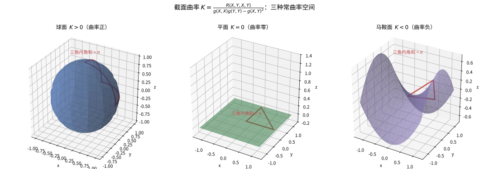

# 第 47 级：黎曼几何 (Riemannian Geometry)

> 黎曼几何是微分几何的核心分支，它将微积分的方法推广到弯曲空间上。1854 年，Bernhard Riemann 在哥廷根大学的就职演讲中奠定了这一领域的基础，提出了"流形"的概念并引入了度量结构。从 Einstein 的广义相对论（将引力解释为时空曲率）到现代几何分析，黎曼几何一直是数学与物理交汇处最活跃的领域之一。本课程将系统建立黎曼几何的基本理论，包括度量、联络、曲率、测地线以及一系列深刻的整体定理。

---

## 1. 学习目标

1. 理解黎曼度量的定义与性质，掌握黎曼流形的基本概念。
2. 掌握 Levi-Civita 联络的构造与性质，理解其唯一性定理。
3. 深入理解 Riemann 曲率张量及其各种缩并（Ricci 曲率、标量曲率）。
4. 掌握测地线的理论与测地方程，理解指数映射的性质。
5. 理解 Jacobi 场与共轭点的概念，掌握第二变分公式。
6. 掌握 Gauss 引理并理解其几何意义。
7. 理解并证明 Hopf-Rinow 定理，掌握黎曼流形的完备性理论。
8. 理解并证明 Cartan-Hadamard 定理，掌握非正曲率流形的拓扑结构。
9. 理解并证明 Bonnet-Myers 定理，掌握正 Ricci 曲率对整体拓扑的限制。
10. 掌握 Gauss-Bonnet 定理及其在闭曲面上的完整证明。
11. 理解 Rauch 比较定理及其在几何分析中的应用。
12. 通过球面、双曲空间和环面的具体计算，培养黎曼几何的具体计算能力。

---

## 2. 黎曼度量与黎曼流形 (Riemannian Metric and Riemannian Manifold)

### 2.1 黎曼度量的定义

**定义 2.1**（黎曼度量）设 $M$ 是光滑流形。$M$ 上的一个 **黎曼度量**（Riemannian metric）是一个光滑的 $(0,2)$-型张量场 $g$，满足对每点 $p \in M$：

1. **对称性**：$g_p(X, Y) = g_p(Y, X)$，$\forall X, Y \in T_p M$；
2. **正定性**：$g_p(X, X) \geq 0$，且 $g_p(X, X) = 0$ 当且仅当 $X = 0$。

配备了一个黎曼度量的光滑流形称为 **黎曼流形**（Riemannian manifold），记作 $(M, g)$。

在局部坐标 $(x^1, \ldots, x^n)$ 下，度量可表示为

$$
g = g_{ij} \, dx^i \otimes dx^j,\quad g_{ij} = g\left(\frac{\partial}{\partial x^i}, \frac{\partial}{\partial x^j}\right).
$$

矩阵 $(g_{ij})$ 是对称正定的，其逆矩阵记作 $(g^{ij})$，满足 $g^{ik} g_{kj} = \delta^i_j$。

> **直观理解（现实类比）**：黎曼度量像"定义长度的规则"——不同点可以用不同的尺子。欧氏空间里所有点共用一把刚性直尺，而黎曼流形上每一点 $p$ 都可以配一把"本地尺子" $g_p$，刻度随位置光滑变化。这样"从 A 到 B 走多远"不再由单一坐标决定，而是沿路径逐点用本地尺子度量后累加。同一流形换一本规则书（换度量），长度、角度、曲率全变；这正是广义相对论中"物质决定时空度量"的几何语言。

**例 2.2**（欧氏度量）$\mathbb{R}^n$ 上的标准黎曼度量是

$$
g_{\text{eucl}} = dx^1 \otimes dx^1 + \cdots + dx^n \otimes dx^n,
$$

即 $g_{ij} = \delta_{ij}$。

**定义 2.3**（诱导度量）设 $N \subset M$ 是黎曼流形 $(M, g)$ 的子流形，则 $g$ 在 $N$ 上的限制

$$
g|_N(X, Y) = g(X, Y),\quad \forall X, Y \in T_p N,\ p \in N
$$

定义了 $N$ 上的一个黎曼度量，称为 **诱导度量**（induced metric）。

### 2.2 黎曼流形的基本构造

**例 2.4**（乘积度量）设 $(M_1, g_1)$ 和 $(M_2, g_2)$ 是黎曼流形，则在乘积流形 $M_1 \times M_2$ 上可定义 **乘积度量**（product metric）：

$$
g = \pi_1^* g_1 + \pi_2^* g_2,
$$

其中 $\pi_i: M_1 \times M_2 \to M_i$ 是投影映射。在局部坐标下，若 $x^i$ 是 $M_1$ 的坐标，$y^\alpha$ 是 $M_2$ 的坐标，则

$$
g = (g_1)_{ij} \, dx^i dx^j + (g_2)_{\alpha\beta} \, dy^\alpha dy^\beta.
$$

**定义 2.5**（等距）设 $(M, g_M)$ 和 $(N, g_N)$ 是黎曼流形。光滑映射 $F: M \to N$ 称为 **等距**（isometry），若 $F$ 是微分同胚且保持度量：

$$
F^* g_N = g_M,
$$

即 $g_M(X, Y) = g_N(dF(X), dF(Y))$ 对一切 $X, Y \in T_p M$ 成立。

**定义 2.6**（等距嵌入）映射 $F: M \to N$ 称为 **等距嵌入**（isometric embedding），若 $F$ 是浸入且 $F^* g_N = g_M$。Nash 嵌入定理指出，任何黎曼流形都可以等距嵌入到某个欧氏空间 $\mathbb{R}^N$ 中。

---

## 3. Levi-Civita 联络 (Levi-Civita Connection)

### 3.1 仿射联络

**定义 3.1**（仿射联络）光滑流形 $M$ 上的一个 **仿射联络**（affine connection）是一个映射

$$
\nabla: \mathfrak{X}(M) \times \mathfrak{X}(M) \to \mathfrak{X}(M),
$$

记作 $\nabla(X, Y) = \nabla_X Y$，满足：

1. 关于 $X$ 是 $C^\infty(M)$-线性的：$\nabla_{fX+gY} Z = f \nabla_X Z + g \nabla_Y Z$；
2. 关于 $Y$ 是 $\mathbb{R}$-线性的：$\nabla_X (aY + bZ) = a \nabla_X Y + b \nabla_X Z$；
3. Leibniz 法则：$\nabla_X (fY) = f \nabla_X Y + (Xf) Y$，$\forall f \in C^\infty(M)$。

在局部坐标下，联络由 **Christoffel 符号**（Christoffel symbols）$\Gamma^k_{ij}$ 确定：

$$
\nabla_{\partial_i} \partial_j = \Gamma^k_{ij} \partial_k,
$$

其中 $\partial_i = \partial/\partial x^i$。

### 3.2 Levi-Civita 联络的唯一性

**定理 3.2**（Levi-Civita 联络的基本定理）在黎曼流形 $(M, g)$ 上，存在唯一的仿射联络 $\nabla$ 满足：

1. **无挠性**（torsion-free）：$\nabla_X Y - \nabla_Y X = [X, Y]$；
2. **度量相容性**（metric compatibility）：$X g(Y, Z) = g(\nabla_X Y, Z) + g(Y, \nabla_X Z)$。

这个联络称为 **Levi-Civita 联络**（Levi-Civita connection）。

**证明**：设 $\nabla$ 是满足上述条件的联络。对任意向量场 $X, Y, Z$，由度量相容性得

$$
X g(Y, Z) = g(\nabla_X Y, Z) + g(Y, \nabla_X Z), \tag{1}
$$

$$
Y g(Z, X) = g(\nabla_Y Z, X) + g(Z, \nabla_Y X), \tag{2}
$$

$$
Z g(X, Y) = g(\nabla_Z X, Y) + g(X, \nabla_Z Y). \tag{3}
$$

将 (1) $+$ (2) $-$ (3)，并利用无挠性 $\nabla_X Y - \nabla_Y X = [X, Y]$，得

$$
\begin{aligned}
& X g(Y, Z) + Y g(Z, X) - Z g(X, Y) \\
&= g(\nabla_X Y + \nabla_Y X, Z) + g(\nabla_X Z - \nabla_Z X, Y) + g(\nabla_Y Z - \nabla_Z Y, X) \\
&= 2 g(\nabla_X Y, Z) + g([Y, Z], X) + g([X, Z], Y) - g([X, Y], Z).
\end{aligned}
$$

整理得 **Koszul 公式**：

$$
\begin{aligned}
g(\nabla_X Y, Z) = \frac{1}{2} \big[ & X g(Y, Z) + Y g(Z, X) - Z g(X, Y) \\
& - g(X, [Y, Z]) - g(Y, [X, Z]) + g(Z, [X, Y]) \big].
\end{aligned}
$$

由于 $g$ 是非退化的，上式唯一确定了 $\nabla_X Y$。这证明了唯一性。存在性验证：以上式定义的 $\nabla$ 确实满足无挠性和度量相容性。$\square$

在局部坐标下，Christoffel 符号由度量张量给出：

$$
\Gamma^k_{ij} = \frac{1}{2} g^{kl} \left( \frac{\partial g_{jl}}{\partial x^i} + \frac{\partial g_{il}}{\partial x^j} - \frac{\partial g_{ij}}{\partial x^l} \right).
$$

**例 3.3** 在欧氏空间 $\mathbb{R}^n$ 中，$g_{ij} = \delta_{ij}$ 为常数，因此所有 Christoffel 符号 $\Gamma^k_{ij} = 0$。

### 3.3 协变导数

**定义 3.4**（协变导数）设 $\nabla$ 是 $M$ 上的仿射联络。沿光滑曲线 $\gamma: [a, b] \to M$ 的 **协变导数**（covariant derivative）是一个算子

$$
\frac{D}{dt}: \mathfrak{X}(\gamma) \to \mathfrak{X}(\gamma),
$$

满足对沿曲线的向量场 $V(t)$：

$$
\frac{DV}{dt} = \nabla_{\dot\gamma(t)} V,
$$

其中 $\dot\gamma(t)$ 是曲线的切向量。在局部坐标 $(x^1, \ldots, x^n)$ 中，若 $\gamma(t) = (x^1(t), \ldots, x^n(t))$，$V(t) = V^i(t) \partial_i$，则

$$
\frac{DV}{dt} = \left( \frac{dV^k}{dt} + \Gamma^k_{ij} \frac{dx^i}{dt} V^j \right) \partial_k.
$$

---

## 4. 曲率张量 (Curvature Tensor)

### 4.1 Riemann 曲率张量

**定义 4.1**（Riemann 曲率张量）设 $(M, g)$ 是黎曼流形，$\nabla$ 是 Levi-Civita 联络。**Riemann 曲率张量**（Riemann curvature tensor）定义为

$$
R(X, Y)Z = \nabla_X \nabla_Y Z - \nabla_Y \nabla_X Z - \nabla_{[X, Y]} Z,
$$

其中 $X, Y, Z \in \mathfrak{X}(M)$。对应的 $(0,4)$-型张量为

$$
R(X, Y, Z, W) = g(R(X, Y)Z, W).
$$

**命题 4.2**（对称性）Riemann 曲率张量满足以下对称性：

1. **反称性**：$R(X, Y, Z, W) = -R(Y, X, Z, W)$；
2. **反称性**：$R(X, Y, Z, W) = -R(X, Y, W, Z)$；
3. **交换对称性**：$R(X, Y, Z, W) = R(Z, W, X, Y)$；
4. **第一 Bianchi 恒等式**：$R(X, Y)Z + R(Y, Z)X + R(Z, X)Y = 0$；
5. **第二 Bianchi 恒等式**：$(\nabla_X R)(Y, Z)W + (\nabla_Y R)(Z, X)W + (\nabla_Z R)(X, Y)W = 0$。

> **直观理解（现实类比）**：曲率张量像"空间弯曲的程度"——它不只给一个数，而是告诉你在每个二维方向上弯多少。把空间想象成一顶礼帽：帽顶处往各方向看都同样鼓（各向同性曲率），但帽檐处沿环向和径向弯曲差异巨大（各向异性）。Riemann 曲率张量 $R(X,Y,Z,W)$ 正是这种"方向敏感性"的完整记录器：输入两个方向 $X,Y$ 测平行移动一周的偏转，再输入 $Z,W$ 投影到该方向读分量。截面曲率只是它在一组二维平面上的切片读数。

在局部坐标下，曲率张量的分量表示为

$$
R(\partial_i, \partial_j)\partial_k = R^\ell_{ijk} \partial_\ell,
$$

其中

$$
R^\ell_{ijk} = \partial_i \Gamma^\ell_{jk} - \partial_j \Gamma^\ell_{ik} + \Gamma^m_{jk} \Gamma^\ell_{im} - \Gamma^m_{ik} \Gamma^\ell_{jm}.
$$

对应的 $(0,4)$-型张量分量为 $R_{ijk\ell} = g_{\ell m} R^m_{ijk}$。

> **直观理解（现实类比）**：平行移动就像在弯曲表面上"平移"一支笔而不扭转它。在平面上平移一圈，笔的方向不变；但在球面上沿大圆围成的区域平移一圈，笔回到起点时方向会转过一个角度，角度大小恰好等于该区域的总曲率。好比你在球面上推一辆独轮车沿闭合路径走回原点，车把相对出发时已经偏转了。

### 4.2 截面曲率 (Sectional Curvature)

**定义 4.2**（截面曲率）设 $p \in M$，$\Pi \subset T_p M$ 是二维子空间。$M$ 在 $p$ 处沿平面 $\Pi$ 的 **截面曲率**（sectional curvature）定义为

$$
K(\Pi) = \frac{R(X, Y, X, Y)}{g(X, X) g(Y, Y) - g(X, Y)^2},
$$

其中 $\{X, Y\}$ 是 $\Pi$ 的任意一组基。上述定义与基的选取无关。

截面曲率完全确定了 Riemann 曲率张量：若已知所有二维平面的截面曲率，则可通过代数运算恢复出整个曲率张量。

> **直观理解（现实类比）**：截面曲率就像地面的"鼓起程度"。球面（$K>0$）像篮球表面，两条平行线会汇聚、三角形内角和大于 $\pi$；平面（$K=0$）像平整桌面，内角和恰为 $\pi$；马鞍面（$K<0$）像马鞍或薯片，两条平行线会发散、三角形内角和小于 $\pi$。曲率的正、负、零分别对应"汇聚""平直""发散"三种截然不同的几何世界。

### 4.3 Ricci 曲率 (Ricci Curvature)

**定义 4.3**（Ricci 曲率）Ricci 曲率是 Riemann 曲率张量的一个缩并。确切地说，Ricci 曲率张量（Ricci curvature tensor）是一个 $(0,2)$-型张量：

$$
\operatorname{Ric}(X, Y) = \operatorname{tr}(Z \mapsto R(Z, X)Y) = \sum_{i=1}^n R(e_i, X, Y, e_i),
$$

其中 $\{e_i\}$ 是 $T_p M$ 的任意标准正交基。在局部坐标下，

$$
R_{ij} = \operatorname{Ric}(\partial_i, \partial_j) = R^k_{ikj} = g^{k\ell} R_{k i \ell j}.
$$

**定义 4.4**（Ricci 曲率算子）在单位切向量 $u \in T_p M$ 方向上的 **Ricci 曲率**（Ricci curvature）为

$$
\operatorname{Ric}(u, u) = \sum_{i=2}^n K(u, e_i),
$$

其中 $\{e_1 = u, e_2, \ldots, e_n\}$ 是 $T_p M$ 的标准正交基。即 Ricci 曲率是包含 $u$ 的所有截面曲率之和。

### 4.4 标量曲率 (Scalar Curvature)

**定义 4.5**（标量曲率）**标量曲率**（scalar curvature）是 Ricci 曲率张量的迹：

$$
\operatorname{Scal} = \operatorname{tr}_g \operatorname{Ric} = g^{ij} R_{ij}.
$$

在点 $p$ 处，标量曲率可表示为

$$
\operatorname{Scal}(p) = \sum_{i \neq j} K(e_i, e_j) = 2 \sum_{1 \leq i < j \leq n} K(e_i, e_j),
$$

其中 $\{e_i\}$ 是 $T_p M$ 的标准正交基。因此标量曲率是 $p$ 处所有截面曲率的总和。

> **直观理解（现实类比）**：黎曼曲率（标量曲率）像"局部弯曲总量"，按符号分三色：球面 $K>0$ 像"处处向外鼓的西瓜皮"，三角形内角和大于 $\pi$、平行线汇聚；平面 $K=0$ 像"平整桌面"，欧氏几何成立；马鞍面 $K<0$ 像"中间凹陷两头翘起的薯片"，三角形内角和小于 $\pi$、平行线发散。曲率的正、负、零刻画了三种截然不同的几何世界，也是广义相对论中"物质使时空弯曲"的核心量。

---

## 5. 测地线 (Geodesics)

### 5.1 测地线方程

**定义 5.1**（测地线）设 $(M, g)$ 是黎曼流形。光滑曲线 $\gamma: I \to M$ 称为 **测地线**（geodesic），若其切向量沿自身平行移动：

$$
\frac{D\dot\gamma}{dt} = 0.
$$

在局部坐标下，$\gamma(t) = (x^1(t), \ldots, x^n(t))$ 满足 **测地线方程**（geodesic equation）：

$$
\frac{d^2 x^k}{dt^2} + \Gamma^k_{ij} \frac{dx^i}{dt} \frac{dx^j}{dt} = 0,\quad k = 1, \ldots, n.
$$

> **直观理解（现实类比）**：测地线像"曲面上的直线"——两点间（局部）最短路径。飞机跨洋航线不走地图上的"直线"，而是沿大圆弧绕极地飞行，因为球面上两点间的最短路径正是这段大圆测地线。方程 $\frac{D\dot\gamma}{dt}=0$ 意味着切向量"自我平行移动"——好比推一辆指南针小车不打方向盘、只踩油门，它在弯曲曲面上自由滑行的轨迹就是测地线。它把"直线"推广到了弯曲空间。

**定理 5.2**（测地线的存在唯一性）对任意 $p \in M$ 和 $v \in T_p M$，存在唯一的测地线 $\gamma: (-\varepsilon, \varepsilon) \to M$ 满足 $\gamma(0) = p$ 和 $\dot\gamma(0) = v$。

**证明**：测地线方程是一个二阶常微分方程组。由常微分方程的标准理论（Picard-Lindelöf 定理），对给定的初始条件 $x^k(0) = p^k$ 和 $\frac{dx^k}{dt}(0) = v^k$，存在唯一的局部解。$\square$

**命题 5.3**（测地线的能量守恒）沿测地线 $\gamma$，$\|\dot\gamma(t)\|^2 = g(\dot\gamma(t), \dot\gamma(t))$ 是常数。

**证明**：

$$
\frac{d}{dt} g(\dot\gamma, \dot\gamma) = 2 g\left(\frac{D\dot\gamma}{dt}, \dot\gamma\right) = 0,
$$

因为 $\frac{D\dot\gamma}{dt} = 0$。$\square$

因此，测地线以恒定速率运动。若 $\|\dot\gamma\| = 1$，则称测地线是 **弧长参数化**（arc-length parametrized）的。

### 5.2 指数映射 (Exponential Map)

**定义 5.4**（指数映射）设 $p \in M$，$v \in T_p M$，记 $\gamma_v(t)$ 为满足 $\gamma_v(0) = p$、$\dot\gamma_v(0) = v$ 的唯一测地线。定义 **指数映射**（exponential map）

$$
\exp_p: \mathcal{E}_p \to M,\quad \exp_p(v) = \gamma_v(1),
$$

其中 $\mathcal{E}_p = \{v \in T_p M \mid \gamma_v(1) \text{ 有定义}\}$。

**命题 5.5**（指数映射的性质）

1. $\exp_p$ 在 $0 \in T_p M$ 的某个邻域内有定义且光滑。
2. $d(\exp_p)_0: T_0(T_p M) \cong T_p M \to T_p M$ 是恒等映射（在自然等同下）。
3. 存在 $0$ 的邻域 $U \subset T_p M$ 使得 $\exp_p$ 将 $U$ 微分同胚地映到 $p$ 的邻域 $V \subset M$ 上。

**证明**：性质 (1) 和 (2) 由常微分方程对参数的依赖光滑性得出。性质 (3) 由逆映射定理得到，因为 $d(\exp_p)_0$ 是可逆的。$\square$

**定义 5.6**（法坐标）设 $\{e_1, \ldots, e_n\}$ 是 $T_p M$ 的标准正交基。利用 $\exp_p$ 的逆，可定义 $p$ 附近的坐标：

$$
\varphi: \exp_p(v) \mapsto (v^1, \ldots, v^n) \in \mathbb{R}^n,
$$

其中 $v = v^i e_i$。这称为 **法坐标**（normal coordinates）。在法坐标下，$g_{ij}(p) = \delta_{ij}$ 且 $\Gamma^k_{ij}(p) = 0$。

### 5.3 Gauss 引理 (Gauss Lemma)

**定理 5.7**（Gauss 引理）设 $p \in M$，$v \in T_p M$ 使得 $\exp_p(v)$ 有定义。则对任意 $w \in T_v(T_p M) \cong T_p M$，有

$$
g_{\exp_p(v)}\big( d(\exp_p)_v(v), d(\exp_p)_v(w) \big) = g_p(v, w).
$$

特别地，在 $\exp_p$ 之下，从原点出发的径向线与以原点为中心的球面保持正交。

**证明**：考虑映射 $\alpha(t, s) = \exp_p(t(v + sw))$，其中 $t \in [0, 1]$，$s$ 在 $0$ 附近。定义

$$
X(t) = \frac{\partial \alpha}{\partial t}(t, 0),\quad Y(t) = \frac{\partial \alpha}{\partial s}(t, 0).
$$

则 $X(t) = d(\exp_p)_{tv}(v)$ 是测地线 $\gamma(t) = \exp_p(tv)$ 的切向量，故 $\frac{DX}{dt} = 0$。$Y(t) = d(\exp_p)_{tv}(w)$ 是沿 $\gamma$ 的变分向量场。

我们要证 $g(X(t), Y(t)) = g_p(v, w)$ 对一切 $t$ 成立。计算

$$
\frac{d}{dt} g(X, Y) = g\left(\frac{DX}{dt}, Y\right) + g\left(X, \frac{DY}{dt}\right) = g\left(X, \frac{DY}{dt}\right).
$$

另一方面，由变分场的性质（即 $\frac{DY}{dt} = \frac{DX}{ds}$ 在 $s=0$ 处），且 $\frac{DX}{ds} = \frac{D}{ds} \frac{\partial \alpha}{\partial t} = \frac{D}{dt} \frac{\partial \alpha}{\partial s}$，在 $s=0$ 处有 $\frac{DY}{dt} = \frac{DX}{ds}$。但 $X(t, 0) = d(\exp_p)_{t(v+sw)}(v+sw)$ 在 $s=0$ 时就是 $X(t)$，且 $\frac{DX}{ds}$ 在 $s=0$ 处涉及曲率项。更直接地，利用对称性：

$$
\frac{d}{dt} g(X, Y) = g\left(X, \frac{DX}{ds}\right) = \frac{1}{2} \frac{\partial}{\partial s} g(X, X),
$$

因为 $X(t, s) = \frac{\partial \alpha}{\partial t}$。但 $g(X, X) = g_p(v+sw, v+sw)$ 沿每条曲线 $\alpha(\cdot, s)$ 是常数（因为每条都是测地线），故 $\frac{\partial}{\partial s} g(X, X) = 0$。因此 $\frac{d}{dt} g(X, Y) = 0$，即 $g(X(t), Y(t))$ 为常数。

当 $t \to 0$ 时，$X(t) \to v$，$Y(t) \to w$（因为 $d(\exp_p)_0 = \text{id}$），故

$$
g(X(t), Y(t)) = g_p(v, w),\quad \forall t.
$$

特别地，若 $w \perp v$，则 $g_{\exp_p(v)}(d(\exp_p)_v(v), d(\exp_p)_v(w)) = 0$，即径向线与切球面正交。$\square$

**几何意义**：Gauss 引理表明，指数映射在径向方向是共形的，且径向线是测地线。这保证了在法坐标下，从 $p$ 出发的径向线是测地线，且与以 $p$ 为中心的"球面"正交。

---

## 6. 雅可比场与共轭点 (Jacobi Fields and Conjugate Points)

### 6.1 雅可比场

**定义 6.1**（Jacobi 场）设 $\gamma: [a, b] \to M$ 是测地线。沿 $\gamma$ 的向量场 $J(t)$ 称为 **Jacobi 场**（Jacobi field），若它满足 **Jacobi 方程**：

$$
\frac{D^2 J}{dt^2} + R(\dot\gamma, J)\dot\gamma = 0.
$$

**定理 6.2**（Jacobi 场与变分）沿测地线 $\gamma$ 的 Jacobi 场恰好对应于 $\gamma$ 的变分（通过测地线的变分）的变分向量场。

**证明概要**：设 $\alpha(t, s)$ 是 $\gamma$ 的变分，使得对每个固定的 $s$，$t \mapsto \alpha(t, s)$ 是测地线。变分向量场 $J(t) = \frac{\partial \alpha}{\partial s}(t, 0)$ 满足 Jacobi 方程。反之，给定 Jacobi 场 $J$，可以构造相应的测地线变分。$\square$

**命题 6.3**（Jacobi 场的解空间）Jacobi 方程是二阶线性常微分方程，沿 $\gamma$ 的 Jacobi 场构成一个 $2n$ 维向量空间。给定初始条件 $J(0)$ 和 $\frac{DJ}{dt}(0)$，存在唯一的 Jacobi 场。

### 6.2 共轭点与割点

**定义 6.4**（共轭点）设 $\gamma$ 是测地线，$\gamma(a) = p$。称 $\gamma(b)$（$b \neq a$）是 $p$ 沿 $\gamma$ 的 **共轭点**（conjugate point），若存在非零 Jacobi 场 $J$ 沿 $\gamma$ 满足 $J(a) = 0$ 且 $J(b) = 0$。

**几何意义**：共轭点表示指数映射的奇点。具体地，$q = \exp_p(v)$ 是 $p$ 的共轭点当且仅当 $d(\exp_p)_v$ 非满秩（即不是同构）。

**定义 6.5**（割点）设 $\gamma$ 是从 $p$ 出发的弧长参数化测地线。称 $\gamma(t_0)$ 是 $p$ 沿 $\gamma$ 的 **割点**（cut point），若 $t_0$ 是使得 $\gamma$ 在 $[0, t_0]$ 上仍是连接 $p$ 和 $\gamma(t_0)$ 的最短测地线的最大 $t$ 值。所有割点的集合称为 $p$ 的 **割迹**（cut locus）。

**命题 6.6** 割点 $q = \gamma(t_0)$ 要么是 $p$ 沿 $\gamma$ 的第一个共轭点，要么存在另一条从 $p$ 到 $q$ 的不同测地线具有相同长度。

### 6.3 第二变分公式

**定理 6.7**（第二变分公式）设 $\gamma: [0, L] \to M$ 是弧长参数化的测地线，$V$ 是沿 $\gamma$ 的向量场，满足 $V(0) = 0$ 且 $V(L) = 0$。则 $\gamma$ 的 **能量泛函**（energy functional）$E(\gamma) = \frac{1}{2} \int_0^L \|\dot\gamma\|^2 dt$ 的第二变分为

$$
\frac{d^2}{ds^2}\Big|_{s=0} E(\gamma_s) = \int_0^L \left( \left\| \frac{DV}{dt} \right\|^2 - g(R(\dot\gamma, V)\dot\gamma, V) \right) dt,
$$

其中 $\gamma_s$ 是由 $V$ 生成的 $\gamma$ 的变分。

**证明**：设 $\alpha(t, s)$ 是 $\gamma$ 的变分，$\frac{\partial \alpha}{\partial s}(t, 0) = V(t)$，$\frac{\partial \alpha}{\partial t}(t, 0) = \dot\gamma(t)$。能量 $E(s) = \frac{1}{2} \int_0^L g\left(\frac{\partial \alpha}{\partial t}, \frac{\partial \alpha}{\partial t}\right) dt$。计算

$$
E'(s) = \int_0^L g\left(\frac{D}{ds} \frac{\partial \alpha}{\partial t}, \frac{\partial \alpha}{\partial t}\right) dt = \int_0^L g\left(\frac{D}{dt} \frac{\partial \alpha}{\partial s}, \frac{\partial \alpha}{\partial t}\right) dt.
$$

利用分部积分，得

$$
E'(0) = \big[g(V, \dot\gamma)\big]_0^L - \int_0^L g\left(V, \frac{D\dot\gamma}{dt}\right) dt = 0,
$$

因为 $\frac{D\dot\gamma}{dt} = 0$ 且 $V(0) = V(L) = 0$。再求二阶导，得到上述公式。$\square$

**推论 6.8**（沿测地线的能量）若沿 $\gamma$ 存在非零 Jacobi 场 $J$ 满足 $J(0) = 0$ 和 $J(t_0) = 0$，则 $\gamma$ 在 $(0, t_0)$ 上不是局部最短的（即 $\gamma$ 不是极小测地线）。

---

## 7. 完备性 (Completeness)

### 7.1 Hopf-Rinow 定理

**定理 7.1**（Hopf-Rinow）设 $(M, g)$ 是连通黎曼流形。以下条件等价：

1. **度量完备性**：$(M, d)$ 是完备度量空间，其中 $d$ 是由 $g$ 诱导的距离函数。
2. **测地完备性**：对任意 $p \in M$，指数映射 $\exp_p$ 定义在整个 $T_p M$ 上。
3. 存在一个点 $p \in M$ 使得 $\exp_p$ 定义在整个 $T_p M$ 上。
4. **Heine-Borel 性质**：$M$ 中每个有界闭集是紧的。

满足这些条件的流形称为 **完备黎曼流形**（complete Riemannian manifold）。

**证明**：我们将证明 (3) $\Rightarrow$ (4) $\Rightarrow$ (1) $\Rightarrow$ (2) $\Rightarrow$ (3)。

**(3) $\Rightarrow$ (4)**：假设存在 $p \in M$ 使得 $\exp_p$ 定义在整个 $T_p M$ 上。设 $K \subset M$ 是 $d$-有界闭集。取 $R > 0$ 使得 $K \subset \overline{B_R(p)}$（闭球）。由于 $\exp_p$ 是连续的，$\overline{B_R(p)} = \exp_p(\overline{B_R(0)})$ 是紧集 $\overline{B_R(0)} \subset T_p M$ 的连续像，故紧。$K$ 是紧集的闭子集，从而紧。

**(4) $\Rightarrow$ (1)**：假设 (4) 成立。取任意 Cauchy 序列 $\{q_k\}$。它是有界集，故包含在某个紧集中，从而有收敛子列，于是原序列收敛。

**(1) $\Rightarrow$ (2)**：假设 $M$ 是度量完备的。取任意 $p \in M$，设 $v \in T_p M$，$\|v\| = 1$。考虑测地线 $\gamma(t) = \exp_p(tv)$，定义在 $[0, \ell)$ 上，其中 $\ell$ 是最大存在区间。若 $\ell < \infty$，则当 $t_k \to \ell$ 时，$\{\gamma(t_k)\}$ 是 Cauchy 序列（因为 $d(\gamma(t_i), \gamma(t_j)) \leq |t_i - t_j|$），由完备性收敛到某点 $q$。利用指数映射在 $q$ 附近的性质可将 $\gamma$ 延拓到 $\ell$ 之外，矛盾。故 $\ell = \infty$。

**(2) $\Rightarrow$ (3)**：显然。$\square$

**定理 7.2**（Hopf-Rinow 定理的推论）在完备黎曼流形上，任意两点之间可以用极小测地线连接。

**证明**：设 $p, q \in M$，$d = d(p, q)$。取 $p$ 附近的小球 $B_\varepsilon(p)$，在其边界上取点 $p_1$ 使得 $d(p_1, q)$ 最小。从 $p$ 到 $p_1$ 作径向测地线 $\gamma$，可以证明 $\gamma$ 延拓到长度为 $d$ 时到达 $q$。$\square$

---

## 8. 常曲率空间 (Space Forms)

### 8.1 常曲率流形

**定义 8.1**（常曲率空间）黎曼流形 $(M, g)$ 称为 **常曲率空间**（space form），若其截面曲率为常数 $K$。记作 $M(K)$。

**定理 8.2**（常曲率流形的曲率张量）若 $M$ 具有常截面曲率 $K$，则其 Riemann 曲率张量为

$$
R(X, Y)Z = K\big( g(Y, Z)X - g(X, Z)Y \big).
$$

在局部坐标下，

$$
R_{ijk\ell} = K(g_{ik} g_{j\ell} - g_{i\ell} g_{jk}).
$$

**证明**：利用截面曲率完全确定曲率张量的代数性质，结合常曲率条件直接验证。$\square$

### 8.2 球面 $S^n$ 的黎曼几何

**例 8.3**（球面 $S^n$）考虑单位球面 $S^n = \{x \in \mathbb{R}^{n+1} \mid \|x\| = 1\}$ 带有从 $\mathbb{R}^{n+1}$ 诱导的度量。

**度量**：在球坐标下，$S^n$ 的度量可写为

$$
g_{S^n} = d\theta^2 + \sin^2\theta \, g_{S^{n-1}},
$$

其中 $\theta \in [0, \pi]$ 是纬度角，$g_{S^{n-1}}$ 是 $S^{n-1}$ 的标准度量。更具体地，对 $n = 2$，有

$$
g_{S^2} = d\theta^2 + \sin^2\theta \, d\phi^2,\quad \theta \in [0, \pi],\ \phi \in [0, 2\pi).
$$

**Christoffel 符号**：对 $S^2$，非零的 Christoffel 符号为

$$
\Gamma^\theta_{\phi\phi} = -\sin\theta \cos\theta,\quad \Gamma^\phi_{\theta\phi} = \Gamma^\phi_{\phi\theta} = \cot\theta.
$$

**曲率**：$S^n$ 具有常截面曲率 $K \equiv 1$。对 $S^2$，直接计算得

$$
R_{\theta\phi\theta\phi} = \sin^2\theta,
$$

从而

$$
K = \frac{R_{\theta\phi\theta\phi}}{g_{\theta\theta} g_{\phi\phi} - g_{\theta\phi}^2} = \frac{\sin^2\theta}{1 \cdot \sin^2\theta - 0} = 1.
$$

**测地线**：$S^n$ 上的测地线是大圆（great circles），即球面与过球心的平面的交线。大圆是闭的，长度为 $2\pi$。

**指数映射**：对 $p \in S^n$，$\exp_p: T_p S^n \to S^n$ 将 $v$ 映射为沿大圆方向走弧长 $\|v\|$ 到达的点。在 $T_p S^n$ 中半径为 $\pi$ 的球面映射到 $p$ 的对径点。$p$ 的对径点是 $p$ 的共轭点，且也是割点。

### 8.3 双曲空间 $H^n$ 的黎曼几何

**例 8.4**（双曲空间 $H^n$）双曲空间是具有常截面曲率 $K \equiv -1$ 的单连通完备黎曼流形。

**Poincaré 上半平面模型**（$n=2$）：

$$
H^2 = \{(x, y) \in \mathbb{R}^2 \mid y > 0\},\quad g = \frac{dx^2 + dy^2}{y^2}.
$$

**Poincaré 圆盘模型**：

$$
H^n = \{x \in \mathbb{R}^n \mid \|x\| < 1\},\quad g = \frac{4 (dx^1)^2 + \cdots + (dx^n)^2}{(1 - \|x\|^2)^2}.
$$

**Christoffel 符号**（上半平面模型）：

$$
\Gamma^x_{xy} = \Gamma^x_{yx} = -\frac{1}{y},\quad \Gamma^y_{xx} = \frac{1}{y},\quad \Gamma^y_{yy} = -\frac{1}{y}.
$$

**曲率**：直接计算截面曲率可得 $K \equiv -1$。

**测地线**：在 Poincaré 上半平面中，测地线是垂直于 $x$ 轴的半直线和以 $x$ 轴上的点为圆心的半圆。在 Poincaré 圆盘中，测地线是垂直于边界的圆弧和过原点的直线段。

**指数映射**：$\exp_p$ 是 $T_p H^n \cong \mathbb{R}^n$ 到 $H^n$ 的微分同胚（因为 $H^n$ 是单连通的且无共轭点）。在 Poincaré 圆盘模型中，从原点出发的指数映射就是径向伸缩。

### 8.4 环面 $T^2$ 的平坦度量

**例 8.5**（平坦环面 $T^2$）考虑 $T^2 = S^1 \times S^1 = \mathbb{R}^2 / \mathbb{Z}^2$，由 $\mathbb{R}^2$ 上的标准度量 $g = dx^2 + dy^2$ 诱导的商度量。由于 $\mathbb{R}^2$ 的曲率张量为零，$T^2$ 的曲率处处为零（$K \equiv 0$）。

**测地线**：$T^2$ 上的测地线是 $\mathbb{R}^2$ 中直线在商映射下的像。当直线的斜率为有理数时，测地线是闭的；当斜率为无理数时，测地线在 $T^2$ 中稠密。

**距离**：$T^2$ 上的距离函数为

$$
d([x], [y]) = \inf_{m, n \in \mathbb{Z}^2} \|x - y + (m, n)\|_{\mathbb{R}^2}.
$$

**多个平坦度量**：$T^2$ 上存在一族平坦度量，对应于 $\mathbb{R}^2$ 中不同的格点：

$$
T^2_\tau = \mathbb{C} / \mathbb{Z} + \tau\mathbb{Z},\quad \operatorname{Im}\tau > 0,
$$

带有标准欧氏度量 $g = dz\,d\bar z$。不同的 $\tau$ 可能给出不同的（非等距）平坦环面。

---

## 9. 等距与 Killing 向量场 (Isometries and Killing Vector Fields)

### 9.1 Killing 向量场

**定义 9.1**（Killing 向量场）向量场 $X \in \mathfrak{X}(M)$ 称为 **Killing 向量场**（Killing vector field），若它生成的单参数变换群 $\{\varphi_t\}$ 由等距构成，即每个 $\varphi_t$ 都是等距。等价地，$X$ 满足 **Killing 方程**：

$$
\mathcal{L}_X g = 0,
$$

其中 $\mathcal{L}_X$ 是 Lie 导数。

**命题 9.2**（Killing 方程的局部形式）在局部坐标下，$X = X^i \partial_i$ 是 Killing 向量场当且仅当

$$
X^k \partial_k g_{ij} + g_{kj} \partial_i X^k + g_{ik} \partial_j X^k = 0.
$$

等价地，协变形式为

$$
\nabla_i X_j + \nabla_j X_i = 0,
$$

其中 $X_i = g_{ij} X^j$。

**证明**：由 Lie 导数的定义，$\mathcal{L}_X g = 0$ 等价于对任意向量场 $Y, Z$，

$$
X g(Y, Z) - g([X, Y], Z) - g(Y, [X, Z]) = 0.
$$

利用 $\nabla$ 的度量相容性和无挠性，可化为 $\nabla_i X_j + \nabla_j X_i = 0$。$\square$

**命题 9.3**（Killing 向量场的性质）设 $X$ 是 Killing 向量场，$\gamma$ 是测地线。则函数 $g(\dot\gamma, X)$ 沿 $\gamma$ 是常数。

**证明**：

$$
\frac{d}{dt} g(\dot\gamma, X) = g\left(\frac{D\dot\gamma}{dt}, X\right) + g\left(\dot\gamma, \frac{DX}{dt}\right) = 0 + g\left(\dot\gamma, \nabla_{\dot\gamma} X\right).
$$

而由 Killing 方程，$g(\nabla_{\dot\gamma} X, \dot\gamma) = -\frac{1}{2} (\nabla_{\dot\gamma} g)(X, \dot\gamma) = 0$。$\square$

这给出了沿测地线的守恒量，是 Noether 定理在黎曼几何中的体现。

### 9.2 等距群

**定义 9.4**（等距群）黎曼流形 $(M, g)$ 上所有等距的集合构成一个群，称为 **等距群**（isometry group），记作 $\operatorname{Iso}(M, g)$。等距群是一个 Lie 群，其 Lie 代数由 Killing 向量场构成。

**例 9.5**
- $\operatorname{Iso}(S^n)$ 是正交群 $O(n+1)$，维数为 $\frac{n(n+1)}{2}$。
- $\operatorname{Iso}(H^2)$ 是 $PSL(2, \mathbb{R})$，维数为 3。
- $\operatorname{Iso}(\mathbb{R}^n)$ 是欧氏群 $E(n) = O(n) \ltimes \mathbb{R}^n$，维数为 $\frac{n(n+1)}{2}$。

---

## 10. 重要整体定理 (Important Global Theorems)

### 10.1 Cartan-Hadamard 定理

**定理 10.1**（Cartan-Hadamard）设 $(M, g)$ 是完备单连通黎曼流形，且截面曲率 $K \leq 0$。则对任意 $p \in M$，指数映射 $\exp_p: T_p M \to M$ 是微分同胚。因此 $M$ 微分同胚于 $\mathbb{R}^n$。

**证明**：由于 $K \leq 0$，我们首先证明 $M$ 中没有共轭点。设 $\gamma$ 是任意测地线，$J$ 是沿 $\gamma$ 的 Jacobi 场，满足 $J(0) = 0$ 且 $J \not\equiv 0$。考虑 Jacobi 方程

$$
\frac{D^2 J}{dt^2} + R(\dot\gamma, J)\dot\gamma = 0.
$$

在 $t > 0$ 处，计算

$$
\frac{d}{dt} g\left(J, \frac{DJ}{dt}\right) = g\left(\frac{DJ}{dt}, \frac{DJ}{dt}\right) + g\left(J, \frac{D^2 J}{dt^2}\right) = \left\| \frac{DJ}{dt} \right\|^2 - g(R(\dot\gamma, J)\dot\gamma, J).
$$

由于 $K \leq 0$，我们有 $g(R(\dot\gamma, J)\dot\gamma, J) \leq 0$（因为截面曲率 $K(\dot\gamma, J) = \frac{g(R(\dot\gamma, J)\dot\gamma, J)}{\|\dot\gamma\|^2 \|J\|^2 - g(\dot\gamma, J)^2} \leq 0$），故

$$
\frac{d}{dt} g\left(J, \frac{DJ}{dt}\right) \geq \left\| \frac{DJ}{dt} \right\|^2 \geq 0.
$$

因此 $g(J, \frac{DJ}{dt})$ 是 $t$ 的非减函数。当 $t \to 0^+$ 时，由 $J(0) = 0$ 和 $\frac{DJ}{dt}(0) \neq 0$（否则 $J \equiv 0$），

$$
\lim_{t \to 0^+} g\left(J, \frac{DJ}{dt}\right) = \lim_{t \to 0^+} t \left\| \frac{DJ}{dt}(0) \right\|^2 > 0.
$$

从而对 $t > 0$，$g(J, \frac{DJ}{dt}) > 0$，故 $J(t) \neq 0$ 对一切 $t > 0$ 成立。因此 $\gamma$ 上无共轭点。

这意味着 $d(\exp_p)_v$ 对一切 $v \in T_p M$ 均非退化（满秩）。由 Hopf-Rinow 定理，$\exp_p$ 定义在整个 $T_p M$ 上。由逆映射定理，$\exp_p$ 是局部微分同胚。我们需要证明 $\exp_p$ 是覆盖映射。

**引理**：$\exp_p$ 是覆盖映射。由于 $M$ 是单连通的，覆盖映射必为同胚。

设 $q \in M$，取 $q$ 的法坐标邻域 $U$。则 $\exp_p^{-1}(U)$ 的每个连通分支微分同胚于 $U$。事实上，$\exp_p$ 是局部微分同胚且具有路径提升性质（因为 $M$ 完备且 $K \leq 0$ 保证了 $\exp_p$ 是径向距离的等距），从而 $\exp_p$ 是覆盖映射。

由于 $M$ 单连通，覆盖映射 $\exp_p$ 必为同胚。因此 $\exp_p$ 是微分同胚。$\square$

**推论 10.2** 若 $M$ 是完备黎曼流形且 $K \leq 0$，则 $M$ 的万有覆叠空间微分同胚于 $\mathbb{R}^n$。特别地，$\pi_k(M) = 0$ 对 $k \geq 2$ 成立，且 $\pi_1(M)$ 是自由群（若 $M$ 是紧的，则 $\pi_1(M)$ 是双曲群）。

### 10.2 Bonnet-Myers 定理

**定理 10.3**（Bonnet-Myers）设 $(M, g)$ 是完备连通 $n$ 维黎曼流形，且 Ricci 曲率满足

$$
\operatorname{Ric}(v, v) \geq (n-1) \kappa > 0,\quad \forall v \in TM,\ \|v\| = 1,
$$

其中 $\kappa > 0$ 是常数。则 $M$ 的直径 $\operatorname{diam}(M) \leq \pi / \sqrt{\kappa}$。特别地，$M$ 是紧流形且基本群 $\pi_1(M)$ 是有限的。

**证明**：设 $p, q \in M$，$d = d(p, q)$。由完备性，存在连接 $p$ 和 $q$ 的极小测地线 $\gamma: [0, d] \to M$，弧长参数化，$\gamma(0) = p$，$\gamma(d) = q$。

取沿 $\gamma$ 的平行标准正交标架 $\{E_1(t), \ldots, E_n(t)\}$，其中 $E_1(t) = \dot\gamma(t)$。对 $i = 2, \ldots, n$，定义向量场

$$
V_i(t) = \sin\left(\frac{\pi t}{d}\right) E_i(t).
$$

这些 $V_i$ 满足 $V_i(0) = V_i(d) = 0$。由第二变分公式，对每个 $i$，

$$
\begin{aligned}
I(V_i, V_i) &= \int_0^d \left( \left\| \frac{DV_i}{dt} \right\|^2 - g(R(\dot\gamma, V_i)\dot\gamma, V_i) \right) dt \\
&= \int_0^d \left( \frac{\pi^2}{d^2} \cos^2\left(\frac{\pi t}{d}\right) - \sin^2\left(\frac{\pi t}{d}\right) g(R(\dot\gamma, E_i)\dot\gamma, E_i) \right) dt.
\end{aligned}
$$

由于 $\gamma$ 是极小测地线，能量泛函的 Hessian 是半正定的，故 $I(V_i, V_i) \geq 0$。

求和 $i = 2$ 到 $n$：

$$
\sum_{i=2}^n I(V_i, V_i) = \int_0^d \left( (n-1) \frac{\pi^2}{d^2} \cos^2\left(\frac{\pi t}{d}\right) - \sin^2\left(\frac{\pi t}{d}\right) \operatorname{Ric}(\dot\gamma, \dot\gamma) \right) dt \geq 0.
$$

利用 $\operatorname{Ric}(\dot\gamma, \dot\gamma) \geq (n-1)\kappa$，得

$$
\int_0^d \left( (n-1) \frac{\pi^2}{d^2} \cos^2\left(\frac{\pi t}{d}\right) - (n-1)\kappa \sin^2\left(\frac{\pi t}{d}\right) \right) dt \geq 0.
$$

计算积分：

$$
\int_0^d \cos^2\left(\frac{\pi t}{d}\right) dt = \int_0^d \sin^2\left(\frac{\pi t}{d}\right) dt = \frac{d}{2}.
$$

因此

$$
(n-1) \frac{\pi^2}{d^2} \cdot \frac{d}{2} - (n-1)\kappa \cdot \frac{d}{2} \geq 0 \quad \Rightarrow \quad \frac{\pi^2}{d^2} \geq \kappa,
$$

即 $d \leq \pi/\sqrt{\kappa}$。由于 $p, q$ 任意，$\operatorname{diam}(M) \leq \pi/\sqrt{\kappa}$。

**紧性**：完备黎曼流形中，有界闭集是紧的（Hopf-Rinow）。由于直径有限，$M$ 本身有界且完备，故紧。

**有限基本群**：考虑万有覆叠 $\tilde M \to M$，$\tilde M$ 带有提升度量，同样满足 $\operatorname{Ric} \geq (n-1)\kappa$。由直径上界，$\tilde M$ 也是紧的。因此覆叠层数（即 $\pi_1(M)$ 的阶）有限。$\square$

**推论 10.4** 常曲率空间 $S^n$ 的直径是 $\pi$，与 $\kappa = 1$ 时的 Bonnet-Myers 上界一致。因此 $S^n$ 是这种情况下的极值流形。

### 10.3 Rauch 比较定理

**定理 10.5**（Rauch 比较定理）设 $(M, g)$ 和 $(\tilde M, \tilde g)$ 是黎曼流形，$\dim M = \dim \tilde M = n$。设 $\gamma: [0, L] \to M$ 和 $\tilde\gamma: [0, L] \to \tilde M$ 是弧长参数化的测地线，且 $\gamma$ 上没有共轭点。设 $J$ 和 $\tilde J$ 是沿 $\gamma$ 和 $\tilde\gamma$ 的 Jacobi 场，满足

$$
J(0) = \tilde J(0) = 0,\quad \left\| \frac{DJ}{dt}(0) \right\| = \left\| \frac{D\tilde J}{dt}(0) \right\|,
$$

且 $J(t)$ 和 $\tilde J(t)$ 垂直于 $\dot\gamma(t)$ 和 $\dot{\tilde\gamma}(t)$。

若对一切 $t \in [0, L]$ 和一切垂直于 $\dot\gamma(t)$ 的单位向量 $v$，有

$$
\tilde K(\tilde\gamma(t), \tilde v) \geq K(\gamma(t), v),
$$

则对一切 $t \in [0, L]$，

$$
\|\tilde J(t)\| \leq \|J(t)\|.
$$

**证明概要**：考虑函数 $f(t) = \|J(t)\|^2$ 和 $\tilde f(t) = \|\tilde J(t)\|^2$。由 Jacobi 方程和曲率比较条件，可以证明 $\frac{d}{dt} \left( \frac{f'(t)}{f(t)} \right) \geq \frac{d}{dt} \left( \frac{\tilde f'(t)}{\tilde f(t)} \right)$。结合初始条件 $f(0) = \tilde f(0) = 0$ 和 $f'(0) = \tilde f'(0)$，可得 $f(t) \geq \tilde f(t)$ 对一切 $t$ 成立。$\square$

**几何意义**：曲率越大，Jacobi 场增长越慢（即测地线更倾向于汇聚）；曲率越小（越负），Jacobi 场增长越快（即测地线更倾向于发散）。

**推论 10.6**（体积比较）若 $M$ 满足 $\operatorname{Ric} \geq (n-1)\kappa$，则 $M$ 中半径为 $r$ 的球体积不超过常曲率空间 $M(\kappa)$ 中相同半径的球体积。

### 10.4 Gauss-Bonnet 定理

**定理 10.7**（Gauss-Bonnet 定理）设 $(M, g)$ 是紧致无边的可定向二维黎曼流形（闭曲面）。则

$$
\int_M K \, dA = 2\pi \chi(M),
$$

其中 $K$ 是 Gauss 曲率，$dA$ 是面积元，$\chi(M)$ 是 $M$ 的 Euler 示性数。

**证明**：我们采用三角剖分方法，给出完整的证明。

**第 1 步：局部 Gauss-Bonnet 公式**

设 $R \subset M$ 是一个测地三角形区域，即三条测地线围成的区域，内角为 $\alpha, \beta, \gamma$。则

$$
\int_R K \, dA = \alpha + \beta + \gamma - \pi.
$$

**证明**：在测地三角形中，利用平行移动和 Gauss 曲率的关系。考虑沿三角形边界的平行移动，切向量转过的总角度为 $2\pi - (\alpha + \beta + \gamma)$（外角之和）。另一方面，由 Gauss-Bonnet 的局部形式，这个总转角等于 $\int_R K \, dA$。$\square$

**第 2 步：推广到多边形区域**

对具有 $k$ 条测地线边界的多边形区域 $P$，外角为 $\theta_1, \ldots, \theta_k$（$\theta_i = \pi - \text{内角}_i$），有

$$
\int_P K \, dA + \sum_{i=1}^k \theta_i = 2\pi.
$$

这等价于 $\int_P K \, dA = \sum \text{内角}_i - (k-2)\pi$。

**第 3 步：三角剖分**

对闭曲面 $M$ 进行三角剖分，将 $M$ 分解为 $F$ 个三角形面片，$E$ 条边，$V$ 个顶点。Euler 示性数为 $\chi(M) = V - E + F$。

对每个三角形 $\Delta_j$，设其内角为 $\alpha_j, \beta_j, \gamma_j$。由局部 Gauss-Bonnet 公式，

$$
\int_{\Delta_j} K \, dA = \alpha_j + \beta_j + \gamma_j - \pi.
$$

对所有三角形求和：

$$
\int_M K \, dA = \sum_{j=1}^F (\alpha_j + \beta_j + \gamma_j) - F\pi.
$$

**第 4 步：计算角度和**

每个顶点 $v$ 处的内角之和为 $2\pi$（因为该顶点周围的三角形覆盖了该点的一个邻域）。因此

$$
\sum_{j=1}^F (\alpha_j + \beta_j + \gamma_j) = 2\pi V.
$$

**第 5 步：计算边数**

每个三角形有 3 条边，每条边被两个三角形共享（因为 $M$ 无边且可定向）。因此 $3F = 2E$，即 $F = 2E/3$。

**第 6 步：代入计算**

$$
\int_M K \, dA = 2\pi V - \pi F = 2\pi V - \pi \cdot \frac{2E}{3} = 2\pi \left( V - \frac{E}{3} \right).
$$

利用 $F = 2E/3$，得

$$
\chi(M) = V - E + F = V - E + \frac{2E}{3} = V - \frac{E}{3}.
$$

因此

$$
\int_M K \, dA = 2\pi \chi(M).
$$

$\square$

**例 10.8**（Gauss-Bonnet 定理的应用）

- **球面 $S^2$**：$\chi(S^2) = 2$，故 $\int_{S^2} K \, dA = 4\pi$。由于 $K = 1$，面积 $= 4\pi$，一致。
- **环面 $T^2$**：$\chi(T^2) = 0$，故 $\int_{T^2} K \, dA = 0$。这与平坦环面 $K \equiv 0$ 一致。
- **亏格 $g$ 曲面**：$\chi = 2 - 2g$，故 $\int_M K \, dA = 2\pi(2 - 2g) = 4\pi(1 - g)$。

**推论 10.9** 若 $M$ 是紧致可定向曲面，则 $\int_M K \, dA$ 是 $M$ 的拓扑不变量，与度量选择无关。

---

## 11. 示例：具体计算 (Examples)

### 11.1 球面 $S^2$ 上的详细计算

**例 11.1** 在 $S^2$ 上取球坐标 $(\theta, \phi)$，度量 $g = d\theta^2 + \sin^2\theta \, d\phi^2$。

**计算 Christoffel 符号**：

由 $g_{\theta\theta} = 1$，$g_{\phi\phi} = \sin^2\theta$，$g_{\theta\phi} = 0$，$g^{\theta\theta} = 1$，$g^{\phi\phi} = 1/\sin^2\theta$。

$$
\Gamma^\theta_{\theta\theta} = \frac{1}{2} g^{\theta\theta} (\partial_\theta g_{\theta\theta} + \partial_\theta g_{\theta\theta} - \partial_\theta g_{\theta\theta}) = 0.
$$

$$
\Gamma^\theta_{\theta\phi} = \frac{1}{2} g^{\theta\theta} (\partial_\theta g_{\theta\phi} + \partial_\phi g_{\theta\theta} - \partial_\theta g_{\theta\phi}) = 0.
$$

$$
\Gamma^\theta_{\phi\phi} = \frac{1}{2} g^{\theta\theta} (\partial_\phi g_{\phi\theta} + \partial_\phi g_{\theta\phi} - \partial_\theta g_{\phi\phi}) = -\frac{1}{2} \cdot 2\sin\theta \cos\theta = -\sin\theta \cos\theta.
$$

$$
\Gamma^\phi_{\theta\phi} = \frac{1}{2} g^{\phi\phi} (\partial_\theta g_{\phi\phi} + \partial_\phi g_{\theta\phi} - \partial_\phi g_{\theta\phi}) = \frac{1}{2\sin^2\theta} \cdot 2\sin\theta \cos\theta = \cot\theta.
$$

**计算 Riemann 曲率张量**：

$$
R^\theta_{\phi\theta\phi} = \partial_\theta \Gamma^\theta_{\phi\phi} - \partial_\phi \Gamma^\theta_{\theta\phi} + \Gamma^\theta_{\theta\sigma} \Gamma^\sigma_{\phi\phi} - \Gamma^\theta_{\phi\sigma} \Gamma^\sigma_{\theta\phi}.
$$

非零项为 $\partial_\theta (-\sin\theta \cos\theta) = -\cos^2\theta + \sin^2\theta = \sin^2\theta - \cos^2\theta$，以及 $\Gamma^\theta_{\phi\phi} \Gamma^\phi_{\theta\phi} = (-\sin\theta \cos\theta)(\cot\theta) = -\cos^2\theta$。故

$$
R^\theta_{\phi\theta\phi} = (\sin^2\theta - \cos^2\theta) - (-\cos^2\theta) = \sin^2\theta.
$$

因此 $R_{\theta\phi\theta\phi} = g_{\theta\theta} R^\theta_{\phi\theta\phi} = \sin^2\theta$。

**Gauss 曲率**：

$$
K = \frac{R_{\theta\phi\theta\phi}}{g_{\theta\theta} g_{\phi\phi} - g_{\theta\phi}^2} = \frac{\sin^2\theta}{1 \cdot \sin^2\theta} = 1.
$$

**验证 Gauss-Bonnet**：$\int_{S^2} K \, dA = \int_0^{2\pi} \int_0^\pi 1 \cdot \sin\theta \, d\theta d\phi = 4\pi = 2\pi \chi(S^2)$。

### 11.2 双曲空间 $H^2$ 上的详细计算

**例 11.2** 在 Poincaré 上半平面 $H^2 = \{(x, y) \mid y > 0\}$ 上，度量 $g = \frac{dx^2 + dy^2}{y^2}$。

**计算 Christoffel 符号**：

$g_{xx} = g_{yy} = 1/y^2$，$g_{xy} = 0$，$g^{xx} = g^{yy} = y^2$。

$$
\Gamma^x_{xx} = \frac{1}{2} g^{xx}(\partial_x g_{xx} + \partial_x g_{xx} - \partial_x g_{xx}) = 0.
$$

$$
\Gamma^x_{xy} = \frac{1}{2} g^{xx}(\partial_x g_{xy} + \partial_y g_{xx} - \partial_x g_{xy}) = \frac{1}{2} y^2 \cdot \partial_y (1/y^2) = \frac{1}{2} y^2 \cdot (-2/y^3) = -\frac{1}{y}.
$$

$$
\Gamma^x_{yy} = \frac{1}{2} g^{xx}(\partial_y g_{xy} + \partial_y g_{xy} - \partial_x g_{yy}) = 0.
$$

$$
\Gamma^y_{xx} = \frac{1}{2} g^{yy}(\partial_x g_{xy} + \partial_x g_{xy} - \partial_y g_{xx}) = \frac{1}{2} y^2 \cdot (-\partial_y(1/y^2)) = \frac{1}{2} y^2 \cdot (2/y^3) = \frac{1}{y}.
$$

$$
\Gamma^y_{xy} = \frac{1}{2} g^{yy}(\partial_x g_{yy} + \partial_y g_{xy} - \partial_y g_{xy}) = 0.
$$

$$
\Gamma^y_{yy} = \frac{1}{2} g^{yy}(\partial_y g_{yy} + \partial_y g_{yy} - \partial_y g_{yy}) = \frac{1}{2} y^2 \cdot \partial_y(1/y^2) = \frac{1}{2} y^2 \cdot (-2/y^3) = -\frac{1}{y}.
$$

**计算 Riemann 曲率张量**：

$$
R^x_{yxy} = \partial_x \Gamma^x_{yy} - \partial_y \Gamma^x_{xy} + \Gamma^x_{x\sigma} \Gamma^\sigma_{yy} - \Gamma^x_{y\sigma} \Gamma^\sigma_{xy}.
$$

非零项：$-\partial_y (-1/y) = -1/y^2$，以及 $-\Gamma^x_{yx} \Gamma^x_{xy} = -(-1/y)(-1/y) = -1/y^2$。故 $R^x_{yxy} = -1/y^2 - 1/y^2 = -1/y^2$。

因此 $R_{xyxy} = g_{xx} R^x_{yxy} = (1/y^2) \cdot (-1/y^2) = -1/y^4$。

**Gauss 曲率**：

$$
K = \frac{R_{xyxy}}{g_{xx} g_{yy} - g_{xy}^2} = \frac{-1/y^4}{(1/y^2)(1/y^2)} = -1.
$$

### 11.3 平坦环面 $T^2$ 上的测地线

**例 11.3** 考虑 $T^2 = \mathbb{R}^2 / \mathbb{Z}^2$ 上的平坦度量 $g = dx^2 + dy^2$。

**测地线方程**：由于 Christoffel 符号全为零，测地线方程为 $\ddot x = 0$，$\ddot y = 0$，解为

$$
x(t) = x_0 + at,\quad y(t) = y_0 + bt,
$$

即直线。在 $T^2$ 上，这对应于斜率为 $b/a$ 的直线在商映射下的像。

**测地线的分类**：
- 若 $b/a \in \mathbb{Q}$，即 $b/a = p/q$（最简分数），则测地线是闭的，长度为 $q\sqrt{a^2 + b^2}$。
- 若 $b/a \notin \mathbb{Q}$，则测地线在 $T^2$ 中稠密。

**距离函数**：$T^2$ 上两点 $[x]$ 和 $[y]$ 的距离为

$$
d([x], [y]) = \min_{(m,n) \in \mathbb{Z}^2} \sqrt{(x_1 - y_1 + m)^2 + (x_2 - y_2 + n)^2}.
$$

**共轭点**：由于 $K \equiv 0$，Jacobi 方程简化为 $\frac{D^2 J}{dt^2} = 0$，故 $J(t) = J(0) + t \frac{DJ}{dt}(0)$。若 $J(0) = 0$，则 $J(t) \neq 0$ 对一切 $t > 0$。因此平坦环面上无共轭点。

---

## 12. 习题 (Exercises)

**习题 1.** 设 $(M, g)$ 是 $n$ 维黎曼流形，$p \in M$，$\{e_i\}$ 是 $T_p M$ 的标准正交基。证明：

$$
\operatorname{Scal}(p) = \sum_{i \neq j} K(e_i, e_j),
$$

其中 $K(e_i, e_j)$ 是张成于 $e_i, e_j$ 的平面的截面曲率。

**提示**：利用定义 $\operatorname{Scal} = g^{ij} R_{ij} = \sum_i R_{ii}$，而 $R_{ii} = \sum_j R_{jiji}$，并结合截面曲率的定义。

---

**习题 2.** 在 $S^2$ 上使用球坐标 $(\theta, \phi)$，计算测地线方程并验证大圆是测地线。

**提示**：测地线方程为 $\ddot\theta - \sin\theta \cos\theta \, \dot\phi^2 = 0$，$\ddot\phi + 2\cot\theta \, \dot\theta \dot\phi = 0$。验证 $\theta(t) = \pi/2$，$\phi(t) = \phi_0 + t$ 是解。

---

**习题 3.** 设 $M$ 是完备黎曼流形，$K \geq 0$（截面曲率处处非负）。证明 $M$ 中无共轭点。

**提示**：利用 Jacobi 方程和 $g(R(\dot\gamma, J)\dot\gamma, J) = K(\dot\gamma, J)(\|\dot\gamma\|^2\|J\|^2 - g(\dot\gamma, J)^2) \geq 0$，分析 $\frac{d}{dt} g(J, \frac{DJ}{dt})$ 的符号。

---

**习题 4.** 设 $M$ 是完备黎曼流形，$K \leq 0$。证明 $M$ 的万有覆叠空间微分同胚于 $\mathbb{R}^n$。

**提示**：利用 Cartan-Hadamard 定理。注意若 $M$ 本身不是单连通的，考虑其万有覆叠 $\tilde M$ 并赋予提升度量。

---

**习题 5.** 证明：若 $(M, g)$ 是完备 $n$ 维黎曼流形，且 $\operatorname{Ric} \geq (n-1)\kappa > 0$，则 $\pi_1(M)$ 是有限群。

**提示**：利用 Bonnet-Myers 定理证明 $\tilde M$ 是紧的，从而覆叠层数有限。

---

**习题 6.** 计算 Poincaré 圆盘模型 $H^2 = \{z \in \mathbb{C} \mid |z| < 1\}$ 中度量 $g = \frac{4|dz|^2}{(1-|z|^2)^2}$ 的 Gauss 曲率。

**提示**：令 $z = re^{i\theta}$，写出度量 $g = \frac{4}{(1-r^2)^2}(dr^2 + r^2 d\theta^2)$，然后计算 Christoffel 符号和曲率。

---

**习题 7.** 设 $M$ 是紧致可定向二维黎曼流形，且 $K > 0$。证明 $M$ 微分同胚于 $S^2$。

**提示**：由 Gauss-Bonnet 定理，$\int_M K \, dA = 2\pi \chi(M)$。由于 $K > 0$，左边为正，故 $\chi(M) > 0$。对闭曲面，$\chi(M) = 2 - 2g$，故 $g = 0$，即 $M$ 同胚于 $S^2$。

---

**习题 8.** 设 $(M, g)$ 是黎曼流形，$X$ 是 Killing 向量场。证明：

1. $\nabla^2 X = R(X, \cdot) \cdot$，即 $\nabla_Y \nabla_Z X - \nabla_{\nabla_Y Z} X = R(X, Y)Z$；
2. 若 $X$ 在 $p$ 处为零且 $\nabla X$ 在 $p$ 处为零，则 $X \equiv 0$。

**提示**：利用 Killing 方程 $\nabla_i X_j + \nabla_j X_i = 0$ 和曲率张量的定义。对 (2)，利用 $X$ 满足的 Laplace 方程和唯一性定理。

---

## 13. 总结 (Summary)

本章系统介绍了黎曼几何的核心理论与方法，主要内容如下：

1. **黎曼度量**：流形上光滑的对称正定 $(0,2)$-型张量场，赋予流形以长度、角度和体积的概念。黎曼流形是配备了黎曼度量的光滑流形。

2. **Levi-Civita 联络**：黎曼流形上唯一满足无挠性和度量相容性的仿射联络，由 Koszul 公式给出。它是进行协变微分和曲率计算的基础工具。

3. **曲率理论**：
   - **Riemann 曲率张量** $R(X, Y)Z$：度量非平坦性的完整刻画，满足 Bianchi 恒等式。
   - **截面曲率** $K(\Pi)$：二维切平面的弯曲程度，完全确定 Riemann 曲率张量。
   - **Ricci 曲率** $\operatorname{Ric}(X, Y)$：曲率张量的缩并，度量体积元的变化，在广义相对论中描述物质分布。
   - **标量曲率** $\operatorname{Scal}$：曲率张量的全迹，是曲率的最粗略度量。

4. **测地线与指数映射**：
   - 测地线是局部最短路径，满足二阶常微分方程。
   - 指数映射 $\exp_p$ 将切向量映射到沿测地线走单位时间的点，提供了流形与切空间之间的局部微分同胚。
   - **Gauss 引理**：径向线是测地线且与球面正交，保证了法坐标的性质。

5. **Jacobi 场与共轭点**：
   - Jacobi 场是测地线变分的变分场，满足 Jacobi 方程。
   - 共轭点是 Jacobi 场的零点，标志着指数映射的奇点和测地线失去极小性的位置。

6. **整体定理**：
   - **Hopf-Rinow 定理**：建立了完备性的等价刻画，保证完备流形中任意两点可由极小测地线连接。
   - **Cartan-Hadamard 定理**：非正曲率完备单连通流形微分同胚于 $\mathbb{R}^n$，揭示了曲率符号对拓扑的深远影响。
   - **Bonnet-Myers 定理**：正 Ricci 曲率限制流形的直径和基本群，是曲率与拓扑关系的重要范例。
   - **Gauss-Bonnet 定理**：将曲面的总曲率与 Euler 示性数联系起来，是几何与拓扑交汇的典范。
   - **Rauch 比较定理**：提供了曲率与 Jacobi 场增长之间的比较原理，是几何分析的基本工具。

7. **常曲率空间**：球面 $S^n$（$K=1$）、欧氏空间 $\mathbb{R}^n$（$K=0$）和双曲空间 $H^n$（$K=-1$）是三种基本的模型空间，提供了黎曼几何最直观的例证。

黎曼几何是连接微分几何、拓扑学、分析学和理论物理的桥梁，在广义相对论、几何分析、规范场论等领域有着深刻的应用。理解黎曼几何的基本概念和整体定理，是进一步学习现代几何与数学物理的坚实基础。