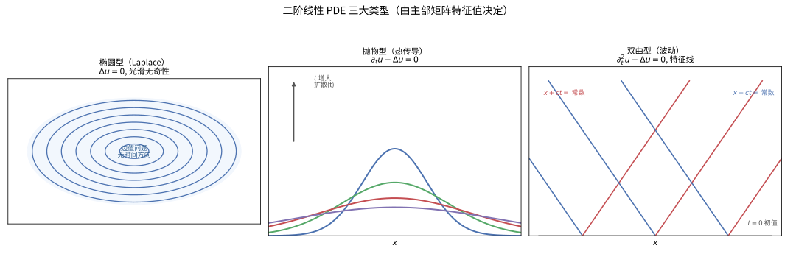

# 第 49 级：偏微分方程 (Partial Differential Equations)

> 偏微分方程 (Partial Differential Equations, PDEs) 是描述自然界中连续变化现象的数学语言。从流体力学中的 Navier-Stokes 方程到电磁学中的 Maxwell 方程，从量子力学中的 Schrödinger 方程到金融数学中的 Black-Scholes 方程，PDE 几乎渗透到所有科学和工程领域。本课程从 PDE 的基本分类出发，系统介绍经典 PDE 的求解方法、基本理论以及现代 PDE 理论的核心工具，包括 Sobolev 空间与弱解理论。

---

## 1. 学习目标

1. 理解 PDE 的基本分类（椭圆型、抛物型、双曲型）及其物理背景。
2. 掌握一阶 PDE 的特征线法，能够求解常见的一阶 PDE。
3. 熟练掌握波动方程、热传导方程和 Laplace 方程的经典求解方法。
4. 理解分离变量法、Fourier 变换和 Laplace 变换在 PDE 求解中的应用。
5. 掌握 Green 函数方法，能够构造 Poisson 方程的解。
6. 理解最大值原理及其在 PDE 理论中的重要应用。
7. 理解能量估计方法，掌握 PDE 解的唯一性证明技巧。
8. 掌握 Sobolev 空间的基本理论，理解弱解的概念与 Lax-Milgram 定理。

---

## 2. 核心概念

### 2.1 PDE 的基本概念

**定义 2.1**（偏微分方程）设 $u: \Omega \subseteq \mathbb{R}^n \to \mathbb{R}$ 是未知函数。一个涉及 $u$ 及其偏导数的等式称为一个 **偏微分方程**。一般形式为：

$$
F(x, u, Du, D^2u, \dots, D^ku) = 0,
$$

其中 $Du = (\partial_{x_1}u, \dots, \partial_{x_n}u)$，$D^2u = (\partial_{x_i x_j}u)$，以此类推。$k$ 称为方程的 **阶数** (order)。

**定义 2.2**（线性与非线性）若 $F$ 关于 $u$ 及其各阶导数是线性的，则称该 PDE 是 **线性的** (linear)。否则称为 **非线性的** (nonlinear)。

线性二阶 PDE 的一般形式为：

$$
\sum_{i,j=1}^n a_{ij}(x) \partial_{x_i x_j} u + \sum_{i=1}^n b_i(x) \partial_{x_i} u + c(x) u = f(x).
$$

### 2.2 PDE 的分类：椭圆型、抛物型、双曲型

对于二阶线性 PDE，其分类由主部系数矩阵的特征值决定。考虑如下形式：

$$
\sum_{i,j=1}^n a_{ij} \partial_{x_i x_j} u + \text{低阶项} = 0,
$$

其中 $A(x) = (a_{ij}(x))$ 是对称矩阵。

**定义 2.3**（分类）在点 $x$ 处：
- 若矩阵 $A(x)$ 的所有特征值同号（全正或全负），则称方程为 **椭圆型** (elliptic)；
- 若 $A(x)$ 有一个特征值为零，其余同号，则称方程为 **抛物型** (parabolic)；
- 若 $A(x)$ 有一个特征值与其余特征值异号，则称方程为 **双曲型** (hyperbolic)。

**典型例子**：
- **Laplace 方程**：$\Delta u = 0$，椭圆型。
- **热传导方程**：$\partial_t u - \Delta u = 0$，抛物型。
- **波动方程**：$\partial_t^2 u - \Delta u = 0$，双曲型。

> **直观理解（现实类比）**：三类方程就像三种"信息传播方式"。椭圆型（$\Delta u=0$）像一张绷紧的鼓面，所有点同时互相约束，没有时间方向、处处光滑；抛物型（$\partial_t u-\Delta u=0$）像滴入水中的墨滴，随时间单向扩散、趋向均匀；双曲型（$\partial_t^2 u-\Delta u=0$）像扔进池塘的石子激起的水波，有明确的速度、沿特征线向外传播并保持波形。

### 2.3 一阶偏微分方程与特征线法

一阶 PDE 的一般形式为：

$$
F(x, u, Du) = 0.
$$

**特征线法** (Method of Characteristics) 的基本思想是将 PDE 沿特定曲线（特征线）转化为 ODE。

**拟线性一阶 PDE**：

$$
a(x, u) \cdot Du = f(x, u),
$$

其中 $a = (a_1, \dots, a_n)$。特征线由以下 ODE 系统定义：

$$
\frac{dx}{ds} = a(x, u), \quad \frac{du}{ds} = f(x, u).
$$

**例 2.4**（输运方程）考虑：

$$
\partial_t u + c \cdot \nabla_x u = 0, \quad u(x, 0) = g(x),
$$

其中 $c \in \mathbb{R}^n$ 是常向量。特征线为 $\frac{dx}{dt} = c$，即 $x = x_0 + ct$。沿特征线，$\frac{du}{dt} = 0$，故 $u$ 为常数。因此解为：

$$
u(x, t) = g(x - ct).
$$

### 2.4 波动方程 (Wave Equation)

一维波动方程：

$$
\partial_t^2 u - c^2 \partial_x^2 u = 0, \quad (x, t) \in \mathbb{R} \times (0, \infty),
$$

初始条件：

$$
u(x, 0) = f(x), \quad \partial_t u(x, 0) = g(x).
$$

其解由 **d'Alembert 公式** 给出（见第 3 节）。

高维波动方程：

$$
\partial_t^2 u - c^2 \Delta u = 0, \quad (x, t) \in \mathbb{R}^n \times (0, \infty).
$$

> **直观理解（现实类比）**：双曲型 PDE 像"波动"——声波、光波、水波方程是其典范。向池塘扔一块石头，水波以有限速度 $c$ 沿特征线向外传播，波峰波形在传播中保持（一维情形完全保持，高维有衰减但仍有清晰波前）。方程 $\partial_t^2 u - c^2\Delta u=0$ 中信息不能瞬间到达远处：$t$ 时刻 $x$ 处的状态只受"光锥" $[x-ct,x+ct]$ 内初值的影响。这就是"有限传播速度"，也是相对论因果性的数学雏形。

### 2.5 热传导方程 (Heat Equation)

热传导方程（扩散方程）：

$$
\partial_t u - k \Delta u = 0, \quad (x, t) \in \mathbb{R}^n \times (0, \infty),
$$

初始条件 $u(x, 0) = f(x)$。其解可用 Fourier 变换表示为与 Gauss 核的卷积：

$$
u(x, t) = \int_{\mathbb{R}^n} \Phi(x - y, t) f(y) \, dy,
$$

其中 $\Phi(x, t) = (4\pi k t)^{-n/2} e^{-|x|^2/(4kt)}$ 是热核 (heat kernel)。

> **直观理解（现实类比）**：抛物型 PDE 像"扩散"——热传导方程是其典范。把一滴墨水滴入清水：随着时间推移，墨水从高浓度区向低浓度区流动，浓度差不断被抹平，最终整杯水颜色均匀。方程 $\partial_t u - \Delta u=0$ 正描述这种"由高向低、趋于均匀"的不可逆过程（时间箭头）。它信息传播速度无限（任何扰动瞬间影响全空间），但强度指数衰减，远处影响微乎其微，且解随时间越来越光滑。

### 2.6 Laplace 方程与 Poisson 方程

**Laplace 方程**：

$$
\Delta u = 0,
$$

其解称为 **调和函数** (harmonic functions)。

> **直观理解（现实类比）**：椭圆型 PDE 像"平衡态"——没有时间变化，所有点同时互相约束。想象一张绷紧的鼓面或稳态温度分布：内部每点的温度都是周围温度的加权平均（均值性质），任何"凸起"都会被周围拉平，极值只能出现在边界。Laplace 方程 $\Delta u=0$ 描述的正是这种"处处自我平均"的静态平衡，所以解总是无穷光滑——粗糙在平衡态下没有立足之地。

**Poisson 方程**：

$$
-\Delta u = f.
$$

### 2.7 分离变量法 (Separation of Variables)

分离变量法是求解有界区域上 PDE 的经典方法。其基本思想是假设解具有变量分离形式，将 PDE 分解为若干个常微分方程。

**例 2.5** 考虑有界弦的波动方程：

$$
\partial_t^2 u = c^2 \partial_x^2 u, \quad 0 < x < L, \quad t > 0,
$$

边界条件 $u(0, t) = u(L, t) = 0$。设 $u(x, t) = X(x)T(t)$，代入得：

$$
\frac{T''}{c^2 T} = \frac{X''}{X} = -\lambda,
$$

其中 $\lambda$ 是分离常数。解得 $X_n(x) = \sin\left(\frac{n\pi x}{L}\right)$，$T_n(t) = A_n \cos\left(\frac{n\pi c t}{L}\right) + B_n \sin\left(\frac{n\pi c t}{L}\right)$。通解为：

$$
u(x, t) = \sum_{n=1}^\infty \left[A_n \cos\left(\frac{n\pi c t}{L}\right) + B_n \sin\left(\frac{n\pi c t}{L}\right)\right] \sin\left(\frac{n\pi x}{L}\right).
$$

### 2.8 Fourier 变换与 Laplace 变换

**Fourier 变换**：

$$
\hat{f}(\xi) = \frac{1}{(2\pi)^{n/2}} \int_{\mathbb{R}^n} f(x) e^{-i x \cdot \xi} \, dx,
$$

其逆变换为：

$$
f(x) = \frac{1}{(2\pi)^{n/2}} \int_{\mathbb{R}^n} \hat{f}(\xi) e^{i x \cdot \xi} \, d\xi.
$$

Fourier 变换将微分运算转化为代数运算：$\widehat{\partial_{x_i} u} = i\xi_i \hat{u}$，从而将 PDE 转化为代数方程。

**Laplace 变换**：

$$
\mathcal{L}[f](s) = \int_0^\infty f(t) e^{-st} \, dt, \quad \operatorname{Re}(s) > 0,
$$

特别适用于带有初始条件的初值问题。

### 2.9 Green 函数 (Green's Functions)

Green 函数方法是求解带有边界条件的线性 PDE 的有力工具。对于 Poisson 方程 $-\Delta u = f$，Green 函数 $G(x, y)$ 满足：

$$
-\Delta_x G(x, y) = \delta(x - y), \quad G(x, y)|_{x \in \partial\Omega} = 0.
$$

解可表示为：

$$
u(x) = \int_\Omega G(x, y) f(y) \, dy.
$$

> **直观理解（现实类比）**：边值问题像"边界决定内部"——一张弹性膜的形状完全由边缘固定方式决定。把鼓面的边缘按某种曲线 $g$ 固定在框架上，则膜在内部自然达到平衡位置 $u$，满足 $\Delta u=0$ 且 $u|_{\partial\Omega}=g$。这就是 Dirichlet 问题：内部不再有"自由意志"，一切由边界牵动。Green 函数 $G(x,y)$ 像一个"影响力权重表"：边界每点 $y$ 的值 $g(y)$ 以多大权重贡献于内部点 $x$，由 $\frac{\partial G}{\partial\nu_y}$ 给出；源项 $f$ 在 $y$ 处则以 $G(x,y)$ 为权重注入 $x$。

### 2.10 基本解 (Fundamental Solutions)

**基本解** 是 PDE 在 $\mathbb{R}^n$ 上的特解，对应于右端为 Dirac delta 函数的情形。

**Laplace 方程的基本解**：

$$
\Phi(x) = 
\begin{cases}
-\frac{1}{2\pi} \log |x|, & n = 2, \\[4pt]
\frac{1}{n(n-2)\alpha(n)} \frac{1}{|x|^{n-2}}, & n \geq 3,
\end{cases}
$$

其中 $\alpha(n)$ 是 $\mathbb{R}^n$ 中单位球的体积。它满足 $-\Delta \Phi = \delta_0$（在分布意义下）。

### 2.11 最大值原理 (Maximum Principle)

最大值原理是椭圆型和抛物型 PDE 理论的核心工具之一，它表明调和函数（以及更一般的椭圆型方程的解）在区域内部不能取到极值，除非该函数是常数。

**定理 2.6**（弱最大值原理）设 $\Omega \subset \mathbb{R}^n$ 是有界开集，$u \in C^2(\Omega) \cap C(\overline{\Omega})$ 满足 $\Delta u \geq 0$（即 $u$ 是次调和的），则：

$$
\max_{\overline{\Omega}} u = \max_{\partial\Omega} u.
$$

### 2.12 能量估计 (Energy Estimates)

能量估计是通过构造适当的能量泛函来获得 PDE 解的先验估计。对于波动方程，自然能量是：

$$
E(t) = \frac{1}{2} \int_\Omega \left[(\partial_t u)^2 + |\nabla u|^2\right] dx.
$$

对于热方程，能量是：

$$
E(t) = \frac{1}{2} \int_\Omega u^2 \, dx.
$$

能量估计在证明解的唯一性和稳定性中起关键作用。

### 2.13 二阶椭圆型方程 (Second-Order Elliptic Equations)

一般形式的二阶椭圆型方程：

$$
-\sum_{i,j=1}^n \partial_{x_j}(a_{ij}(x) \partial_{x_i} u) + \sum_{i=1}^n b_i(x) \partial_{x_i} u + c(x) u = f(x),
$$

其中系数矩阵 $(a_{ij}(x))$ 满足一致椭圆条件：存在 $\theta > 0$ 使得

$$
\sum_{i,j=1}^n a_{ij}(x) \xi_i \xi_j \geq \theta |\xi|^2, \quad \forall \xi \in \mathbb{R}^n, \forall x \in \Omega.
$$

### 2.14 Sobolev 空间 (Sobolev Spaces)

Sobolev 空间是包含弱导数信息的函数空间，是现代 PDE 理论的基础。

**定义 2.7**（Sobolev 空间）对于 $k \in \mathbb{N}$，$1 \leq p \leq \infty$，定义：

$$
W^{k,p}(\Omega) = \{ u \in L^p(\Omega) \mid D^\alpha u \in L^p(\Omega), \forall |\alpha| \leq k \},
$$

其中 $D^\alpha u$ 是 $u$ 的 $\alpha$ 阶弱导数。当 $p = 2$ 时，记 $H^k(\Omega) = W^{k,2}(\Omega)$。

Sobolev 空间 $W^{k,p}(\Omega)$ 配备范数：

$$
\|u\|_{W^{k,p}} = \left(\sum_{|\alpha| \leq k} \|D^\alpha u\|_{L^p}^p\right)^{1/p} \quad (1 \leq p < \infty).
$$

### 2.15 弱解 (Weak Solutions)

弱解是将 PDE 的解释放为积分形式的概念，它允许解在经典意义下不可微。

对于 Poisson 方程 $-\Delta u = f$，其弱形式为：求 $u \in H_0^1(\Omega)$ 使得

$$
\int_\Omega \nabla u \cdot \nabla v \, dx = \int_\Omega f v \, dx, \quad \forall v \in H_0^1(\Omega).
$$

### 2.16 存在唯一性定理 (Existence and Uniqueness Theorems)

PDE 理论的核心问题之一是解的存在性和唯一性。对于椭圆型方程，Lax-Milgram 定理提供了统一的框架；对于发展方程（抛物型和双曲型），则需要结合半群理论或 Faedo-Galerkin 方法。

---

## 3. 定理与证明

### 3.1 d'Alembert 公式：一维波动方程的解

**定理 3.1**（d'Alembert 公式）考虑一维波动方程的 Cauchy 问题：

$$
\begin{cases}
\partial_t^2 u - c^2 \partial_x^2 u = 0, & (x, t) \in \mathbb{R} \times (0, \infty), \\[4pt]
u(x, 0) = f(x), & x \in \mathbb{R}, \\[4pt]
\partial_t u(x, 0) = g(x), & x \in \mathbb{R}.
\end{cases}
$$

则其解由 d'Alembert 公式给出：

$$
u(x, t) = \frac{f(x + ct) + f(x - ct)}{2} + \frac{1}{2c} \int_{x - ct}^{x + ct} g(s) \, ds.
$$

**证明**：我们采用特征线法。将波动方程 $u_{tt} - c^2 u_{xx} = 0$ 分解为两个一阶算子：

$$
(\partial_t - c\partial_x)(\partial_t + c\partial_x) u = 0.
$$

引入新变量：

$$
\xi = x + ct, \quad \eta = x - ct.
$$

由链式法则：

$$
\partial_x = \partial_\xi + \partial_\eta, \quad \partial_t = c(\partial_\xi - \partial_\eta).
$$

计算二阶导数：

$$
\begin{aligned}
\partial_t^2 u &= c^2(\partial_\xi^2 - 2\partial_\xi\partial_\eta + \partial_\eta^2)u, \\
\partial_x^2 u &= (\partial_\xi^2 + 2\partial_\xi\partial_\eta + \partial_\eta^2)u.
\end{aligned}
$$

代入波动方程：

$$
c^2(\partial_\xi^2 - 2\partial_\xi\partial_\eta + \partial_\eta^2)u - c^2(\partial_\xi^2 + 2\partial_\xi\partial_\eta + \partial_\eta^2)u = -4c^2 \partial_\xi\partial_\eta u = 0,
$$

即 $\partial_\xi\partial_\eta u = 0$。这等价于 $u(\xi, \eta) = F(\xi) + G(\eta)$，其中 $F, G$ 是任意 $C^2$ 函数。

回到原变量：

$$
u(x, t) = F(x + ct) + G(x - ct).
$$

现在利用初始条件确定 $F$ 和 $G$。由 $u(x, 0) = f(x)$ 得：

$$
F(x) + G(x) = f(x). \tag{1}
$$

由 $\partial_t u(x, 0) = g(x)$ 得：

$$
cF'(x) - cG'(x) = g(x). \tag{2}
$$

对 (2) 式积分：

$$
F(x) - G(x) = \frac{1}{c} \int_0^x g(s) \, ds + C, \tag{3}
$$

其中 $C$ 是积分常数。联立 (1) 和 (3)：

$$
\begin{aligned}
F(x) &= \frac{1}{2} f(x) + \frac{1}{2c} \int_0^x g(s) \, ds + \frac{C}{2}, \\[4pt]
G(x) &= \frac{1}{2} f(x) - \frac{1}{2c} \int_0^x g(s) \, ds - \frac{C}{2}.
\end{aligned}
$$

代入 $u(x, t) = F(x + ct) + G(x - ct)$：

$$
\begin{aligned}
u(x, t) &= \frac{1}{2} f(x + ct) + \frac{1}{2c} \int_0^{x+ct} g(s) \, ds + \frac{C}{2} \\
&\quad + \frac{1}{2} f(x - ct) - \frac{1}{2c} \int_0^{x-ct} g(s) \, ds - \frac{C}{2} \\[4pt]
&= \frac{f(x + ct) + f(x - ct)}{2} + \frac{1}{2c} \int_{x-ct}^{x+ct} g(s) \, ds.
\end{aligned}
$$

至此，d'Alembert 公式得证。□

**注**：d'Alembert 公式揭示了波动方程的一个重要性质——**有限传播速度**：在时刻 $t$，点 $x$ 处的解只依赖于初始数据在区间 $[x - ct, x + ct]$ 上的值。这个区间称为 **依赖区间** (domain of dependence)。

![特征线与初值条件：双曲方程沿特征线 $x\pm ct=$ 常数传播，点 $(x_0,t_0)$ 的值只由初值在依赖区间 $[x_0-ct_0,x_0+ct_0]$ 上的 $u(x,0)=f$、$\partial_t u(x,0)=g$ 决定](images/level49-characteristics.svg)

> **直观理解（现实类比）**：特征线就像信息的高速公路，信号只能沿固定斜率的直线传播。你可以把初值 $t=0$ 想象成一条"源头河岸"，$(x_0,t_0)$ 处的解是从上游一个区间同时涌来的水汇合而成——太上游或太下游的水（初值）根本来不及到达这里。这正是"光锥"思想：任何影响都有速度上限，远处的扰动在有限时间内无法波及。

### 3.2 热方程解的存在唯一性：Fourier 变换方法

**定理 3.2**（热方程 Cauchy 问题的解）考虑热传导方程的 Cauchy 问题：

$$
\begin{cases}
\partial_t u - k \partial_x^2 u = 0, & (x, t) \in \mathbb{R} \times (0, \infty), \\[4pt]
u(x, 0) = f(x), & x \in \mathbb{R},
\end{cases}
$$

其中 $f \in L^1(\mathbb{R})$。则存在唯一的解 $u \in C^\infty(\mathbb{R} \times (0, \infty))$，由下式给出：

$$
u(x, t) = \int_{-\infty}^\infty \Phi(x - y, t) f(y) \, dy = \frac{1}{\sqrt{4\pi k t}} \int_{-\infty}^\infty e^{-(x-y)^2/(4kt)} f(y) \, dy.
$$

**证明**：我们分存在性和唯一性两部分证明。

**存在性**：对空间变量 $x$ 应用 Fourier 变换。记 $\hat{u}(\xi, t) = \mathcal{F}[u(\cdot, t)](\xi)$。利用 Fourier 变换的性质 $\widehat{\partial_x^2 u} = -\xi^2 \hat{u}$，原方程化为：

$$
\frac{d}{dt} \hat{u}(\xi, t) + k \xi^2 \hat{u}(\xi, t) = 0, \quad \hat{u}(\xi, 0) = \hat{f}(\xi).
$$

这是一个关于 $t$ 的常微分方程，其解为：

$$
\hat{u}(\xi, t) = \hat{f}(\xi) e^{-k\xi^2 t}.
$$

现在应用 Fourier 逆变换：

$$
u(x, t) = \frac{1}{2\pi} \int_{-\infty}^\infty \hat{f}(\xi) e^{-k\xi^2 t} e^{i x \xi} \, d\xi.
$$

利用卷积定理，Fourier 逆变换将乘积变为卷积。注意到 $e^{-k\xi^2 t}$ 的 Fourier 逆变换是：

$$
\mathcal{F}^{-1}[e^{-k\xi^2 t}](x) = \frac{1}{\sqrt{4\pi k t}} e^{-x^2/(4kt)} =: \Phi(x, t).
$$

因此，

$$
u(x, t) = (f * \Phi(\cdot, t))(x) = \int_{-\infty}^\infty \Phi(x - y, t) f(y) \, dy.
$$

容易验证 $\Phi(x, t)$ 满足 $\partial_t \Phi = k \partial_x^2 \Phi$（可直接求导验证），且 $\Phi(x, t) \to \delta(x)$ 当 $t \to 0^+$（在分布意义下），从而 $u(x, t) \to f(x)$ 当 $t \to 0^+$。

**唯一性**：假设 $u_1$ 和 $u_2$ 是两个解，令 $v = u_1 - u_2$，则 $v$ 满足热方程且 $v(x, 0) = 0$。考虑能量泛函：

$$
E(t) = \frac{1}{2} \int_{-\infty}^\infty v(x, t)^2 \, dx.
$$

对 $t$ 求导：

$$
\begin{aligned}
E'(t) &= \int_{-\infty}^\infty v \partial_t v \, dx = k \int_{-\infty}^\infty v \partial_x^2 v \, dx \\
&= k \left[ v \partial_x v \right]_{-\infty}^\infty - k \int_{-\infty}^\infty (\partial_x v)^2 \, dx \\
&= -k \int_{-\infty}^\infty (\partial_x v)^2 \, dx \leq 0,
\end{aligned}
$$

其中假设了 $v$ 和 $\partial_x v$ 在无穷远处衰减为零（由 $L^1$ 初始条件和解的正则性可保证）。因此 $E(t) \leq E(0) = 0$，而 $E(t) \geq 0$，故 $E(t) \equiv 0$，从而 $v \equiv 0$。唯一性得证。□

### 3.3 Laplace 方程的最大值原理

**定理 3.3**（强最大值原理，Strong Maximum Principle）设 $\Omega \subset \mathbb{R}^n$ 是连通开集，$u \in C^2(\Omega)$ 满足 $\Delta u \geq 0$（即 $u$ 是次调和函数）。若 $u$ 在 $\Omega$ 内部某点达到最大值，则 $u$ 在 $\Omega$ 内为常数。

**证明**：设 $M = \sup_\Omega u$，且存在 $x_0 \in \Omega$ 使得 $u(x_0) = M$。定义集合：

$$
\Omega_M = \{ x \in \Omega \mid u(x) = M \}.
$$

由连续性，$\Omega_M$ 是 $\Omega$ 中的闭集（相对于 $\Omega$）。我们要证明 $\Omega_M = \Omega$。由于 $\Omega$ 是连通的，只需证明 $\Omega_M$ 也是开集（在 $\Omega$ 中）。

任取 $x^* \in \Omega_M$。由于 $\Omega$ 是开集，存在 $R > 0$ 使得 $B(x^*, R) \subset \Omega$。对任意 $0 < r < R$，考虑球面平均值：

$$
\frac{1}{n\alpha(n) r^{n-1}} \int_{\partial B(x^*, r)} u(y) \, dS(y).
$$

由于 $\Delta u \geq 0$，均值不等式成立（见引理）：

$$
\frac{1}{n\alpha(n) r^{n-1}} \int_{\partial B(x^*, r)} u(y) \, dS(y) \geq u(x^*) = M.
$$

但 $u \leq M$ 在 $\Omega$ 中成立，故上述均值必须等于 $M$。由连续性，$u(y) = M$ 对所有 $y \in \partial B(x^*, r)$ 成立。由于 $r$ 是任意的，$u \equiv M$ 在 $B(x^*, R)$ 上成立，从而 $B(x^*, R) \subset \Omega_M$，即 $\Omega_M$ 是开集。

因此 $\Omega_M$ 既是开集又是闭集，且非空，由 $\Omega$ 的连通性知 $\Omega_M = \Omega$，即 $u \equiv M$ 在 $\Omega$ 上恒成立。□

**引理 3.4**（次调和函数的均值不等式）若 $\Delta u \geq 0$ 在 $\Omega$ 中，则对任意 $x \in \Omega$ 和充分小的 $r > 0$，

$$
\frac{1}{n\alpha(n) r^{n-1}} \int_{\partial B(x, r)} u(y) \, dS(y) \geq u(x).
$$

**引理的证明**：定义辅助函数：

$$
\phi(r) = \frac{1}{n\alpha(n) r^{n-1}} \int_{\partial B(x, r)} u(y) \, dS(y).
$$

作变量替换 $y = x + rz$，$z \in \partial B(0, 1)$，则：

$$
\phi(r) = \frac{1}{n\alpha(n)} \int_{\partial B(0, 1)} u(x + rz) \, dS(z).
$$

对 $r$ 求导：

$$
\begin{aligned}
\phi'(r) &= \frac{1}{n\alpha(n)} \int_{\partial B(0, 1)} \nabla u(x + rz) \cdot z \, dS(z) \\
&= \frac{1}{n\alpha(n) r^{n-1}} \int_{\partial B(x, r)} \frac{\partial u}{\partial \nu} \, dS \\
&= \frac{1}{n\alpha(n) r^{n-1}} \int_{B(x, r)} \Delta u \, dy \quad (\text{散度定理}) \\
&\geq 0.
\end{aligned}
$$

因此 $\phi(r)$ 是单调不减的。又 $\lim_{r \to 0^+} \phi(r) = u(x)$，故 $\phi(r) \geq u(x)$。□

**推论 3.5**（弱最大值原理）设 $\Omega$ 是有界开集，$u \in C^2(\Omega) \cap C(\overline{\Omega})$ 满足 $\Delta u \geq 0$，则 $\max_{\overline{\Omega}} u = \max_{\partial\Omega} u$。若 $\Delta u \leq 0$，则 $\min_{\overline{\Omega}} u = \min_{\partial\Omega} u$。

**推论 3.6**（唯一性）Poisson 方程 $-\Delta u = f$ 在 $\Omega$ 上，$u|_{\partial\Omega} = g$ 的 Dirichlet 问题至多有一个解。

### 3.4 Poisson 方程解的表示：Green 函数方法

**定理 3.7**（Green 函数表示公式）设 $\Omega \subset \mathbb{R}^n$ 是有界光滑区域，$u \in C^2(\overline{\Omega})$ 是 Poisson 方程 $-\Delta u = f$ 在 $\Omega$ 中、$u = g$ 在 $\partial\Omega$ 上的解。则 $u$ 可表示为：

$$
u(x) = \int_\Omega G(x, y) f(y) \, dy - \int_{\partial\Omega} \frac{\partial G}{\partial \nu_y}(x, y) g(y) \, dS(y),
$$

其中 $G(x, y)$ 是 Green 函数，满足：

$$
\begin{cases}
-\Delta_y G(x, y) = \delta(x - y), & y \in \Omega, \\[4pt]
G(x, y) = 0, & y \in \partial\Omega.
\end{cases}
$$

**证明**：证明基于 Green 第二恒等式。令 $\Phi(x - y)$ 是 Laplace 方程的基本解，即 $-\Delta_y \Phi(x - y) = \delta(x - y)$。

定义修正函数 $\phi^x(y)$ 满足：

$$
\Delta_y \phi^x = 0 \quad (y \in \Omega), \qquad \phi^x(y) = \Phi(x - y) \quad (y \in \partial\Omega).
$$

则 Green 函数为 $G(x, y) = \Phi(x - y) - \phi^x(y)$。

现在应用 Green 第二恒等式。对任意 $u, v \in C^2(\overline{\Omega})$：

$$
\int_\Omega (u \Delta v - v \Delta u) \, dy = \int_{\partial\Omega} \left( u \frac{\partial v}{\partial \nu} - v \frac{\partial u}{\partial \nu} \right) dS.
$$

取 $v(y) = G(x, y)$。注意在分布意义下 $\Delta_y G(x, y) = -\delta(x - y)$。将 $u$ 和 $G$ 代入：

$$
\int_\Omega u(y) \Delta_y G(x, y) \, dy - \int_\Omega G(x, y) \Delta_y u(y) \, dy = \int_{\partial\Omega} \left( u(y) \frac{\partial G}{\partial \nu_y} - G(x, y) \frac{\partial u}{\partial \nu}(y) \right) dS(y).
$$

由于 $G(x, y)|_{y \in \partial\Omega} = 0$，$-\Delta u = f$，且 $\Delta_y G = -\delta(x - y)$，上式化为：

$$
-\int_\Omega u(y) \delta(x - y) \, dy + \int_\Omega G(x, y) f(y) \, dy = \int_{\partial\Omega} u(y) \frac{\partial G}{\partial \nu_y} \, dS(y).
$$

即：

$$
-u(x) + \int_\Omega G(x, y) f(y) \, dy = \int_{\partial\Omega} g(y) \frac{\partial G}{\partial \nu_y} \, dS(y).
$$

整理得：

$$
u(x) = \int_\Omega G(x, y) f(y) \, dy - \int_{\partial\Omega} \frac{\partial G}{\partial \nu_y}(x, y) g(y) \, dS(y).
$$

□

**注**：Green 函数 $G(x, y)$ 对 $x$ 和 $y$ 是对称的：$G(x, y) = G(y, x)$。此外，$G(x, y) > 0$ 对 $x \neq y$ 成立，且 $\frac{\partial G}{\partial \nu_y} \leq 0$（这保证了 Poisson 积分核的非负性）。

### 3.5 Lax-Milgram 定理

**定理 3.8**（Lax-Milgram 定理）设 $H$ 是 Hilbert 空间，内积为 $\langle \cdot, \cdot \rangle$，范数为 $\|\cdot\|$。设 $B: H \times H \to \mathbb{R}$ 是双线性型，满足：

1. **连续性** (boundedness)：存在 $C > 0$ 使得 $|B(u, v)| \leq C \|u\| \|v\|$，$\forall u, v \in H$；
2. **强制性** (coercivity)：存在 $\alpha > 0$ 使得 $B(u, u) \geq \alpha \|u\|^2$，$\forall u \in H$。

则对任意有界线性泛函 $F \in H^*$，存在唯一的 $u \in H$ 使得：

$$
B(u, v) = F(v), \quad \forall v \in H.
$$

**证明**：证明分为三步。

**第 1 步：构造 Riesz 表示下的算子方程。**

对每个固定的 $u \in H$，映射 $v \mapsto B(u, v)$ 是 $H$ 上的有界线性泛函。由 Riesz 表示定理，存在唯一的 $A u \in H$ 使得：

$$
B(u, v) = \langle A u, v \rangle, \quad \forall v \in H.
$$

显然 $A: H \to H$ 是线性算子。由 $B$ 的连续性：

$$
\|A u\| = \sup_{\|v\|=1} |\langle A u, v \rangle| = \sup_{\|v\|=1} |B(u, v)| \leq C \|u\|,
$$

故 $A$ 是有界线性算子，$\|A\| \leq C$。

由强制性：

$$
\langle A u, u \rangle = B(u, u) \geq \alpha \|u\|^2, \quad \forall u \in H. \tag{4}
$$

同样，$F$ 也可由 Riesz 表示：存在 $f \in H$ 使得 $F(v) = \langle f, v \rangle$，$\forall v \in H$。于是问题化为求解 $A u = f$。

**第 2 步：证明 $A$ 的值域 $R(A)$ 是闭的，且 $R(A) = H$。**

由 (4) 式：

$$
\alpha \|u\|^2 \leq \langle A u, u \rangle \leq \|A u\| \|u\|,
$$

从而 $\alpha \|u\| \leq \|A u\|$。这说明 $A$ 是下方有界的。

若 $A u_n \to v$，则 $\{A u_n\}$ 是 Cauchy 列，由 $\alpha \|u_n - u_m\| \leq \|A u_n - A u_m\|$ 知 $\{u_n\}$ 也是 Cauchy 列，故 $u_n \to u$。由连续性，$A u_n \to A u$，故 $v = A u \in R(A)$，即 $R(A)$ 是闭的。

现证 $R(A) = H$。若不然，$R(A) \neq H$，则存在非零 $w \in R(A)^\perp$。但由 (4)：

$$
\alpha \|w\|^2 \leq \langle A w, w \rangle = 0,
$$

矛盾。故 $R(A) = H$。

**第 3 步：存在唯一性。**

由于 $A$ 是满射且单射（由 $\alpha \|u\| \leq \|A u\|$ 知 $A u = 0 \Rightarrow u = 0$），$A$ 是双射。因此对任意 $f \in H$，存在唯一的 $u = A^{-1} f$ 满足 $A u = f$，即 $B(u, v) = \langle f, v \rangle = F(v)$ 对所有 $v \in H$ 成立。□

**应用**：考虑椭圆型方程的弱形式。设 $\Omega \subset \mathbb{R}^n$ 是有界开集，$H = H_0^1(\Omega)$。定义双线性型：

$$
B(u, v) = \int_\Omega \left( \sum_{i,j=1}^n a_{ij}(x) \partial_{x_i} u \partial_{x_j} v + \sum_{i=1}^n b_i(x) \partial_{x_i} u \, v + c(x) u v \right) dx.
$$

若系数满足一致椭圆条件和适当的正性条件，则 $B$ 满足 Lax-Milgram 定理的条件，从而弱解存在唯一。

### 3.6 Sobolev 嵌入定理

**定理 3.9**（Sobolev 嵌入定理，Sobolev Embedding Theorem）设 $\Omega \subset \mathbb{R}^n$ 是有界光滑区域，$1 \leq p < \infty$，$k \geq 1$。

1. **临界情况**：若 $k p < n$，则 $W^{k,p}(\Omega) \hookrightarrow L^q(\Omega)$ 对任意 $q \leq p^* = \frac{np}{n - kp}$ 连续嵌入，且对 $q < p^*$ 是紧嵌入（Rellich-Kondrachov 定理）。

2. **极限情况**：若 $k p = n$，则 $W^{k,p}(\Omega) \hookrightarrow L^q(\Omega)$ 对任意 $q < \infty$ 连续嵌入。

3. **超临界情况**：若 $k p > n$，则 $W^{k,p}(\Omega) \hookrightarrow C^{k - \lfloor n/p \rfloor - 1, \gamma}(\overline{\Omega})$ 连续嵌入，其中 $\gamma = \lfloor n/p \rfloor + 1 - n/p$（若 $n/p$ 不是整数），或 $\gamma$ 是任意小于 $1$ 的正数（若 $n/p$ 是整数）。

**关键证明步骤**（$W^{1,p}(\mathbb{R}^n) \hookrightarrow L^{p^*}(\mathbb{R}^n)$ 的 Gagliardo-Nirenberg-Sobolev 不等式）：

我们证明 $1 \leq p < n$ 时的 Gagliardo-Nirenberg-Sobolev 不等式：

$$
\|u\|_{L^{p^*}(\mathbb{R}^n)} \leq C \|Du\|_{L^p(\mathbb{R}^n)}, \quad \forall u \in C_c^1(\mathbb{R}^n),
$$

其中 $p^* = \frac{np}{n-p}$。

**第 1 步：$p = 1$ 的情形。** 对 $u \in C_c^1(\mathbb{R}^n)$，由微积分基本定理，对每个 $i = 1, \dots, n$：

$$
|u(x)| \leq \int_{-\infty}^{x_i} |\partial_{x_i} u(x_1, \dots, x_{i-1}, t, x_{i+1}, \dots, x_n)| \, dt.
$$

记 $F_i(x) = \int_{-\infty}^\infty |\partial_{x_i} u| \, dx_i$（与第 $i$ 个坐标无关），则 $|u(x)| \leq F_i(x)$。于是：

$$
|u(x)|^{n/(n-1)} \leq \prod_{i=1}^n F_i(x)^{1/(n-1)}.
$$

对 $x_1$ 积分，利用 Hölder 不等式：

$$
\begin{aligned}
\int_{-\infty}^\infty |u|^{n/(n-1)} dx_1 &\leq F_1^{1/(n-1)} \int_{-\infty}^\infty \prod_{i=2}^n F_i^{1/(n-1)} dx_1 \\
&\leq F_1^{1/(n-1)} \prod_{i=2}^n \left( \int_{-\infty}^\infty F_i \, dx_1 \right)^{1/(n-1)}.
\end{aligned}
$$

注意 $\int_{-\infty}^\infty F_i \, dx_1 = \int_{\mathbb{R}^2} |\partial_{x_i} u| \, dx_1 dx_i = \| \partial_{x_i} u \|_{L^1(\mathbb{R}^2)}$（对 $i \neq 1$）。重复此过程，对 $x_2, \dots, x_n$ 依次积分，最终得到：

$$
\|u\|_{L^{n/(n-1)}(\mathbb{R}^n)} \leq \prod_{i=1}^n \| \partial_{x_i} u \|_{L^1(\mathbb{R}^n)}^{1/n} \leq \frac{1}{n} \sum_{i=1}^n \| \partial_{x_i} u \|_{L^1(\mathbb{R}^n)}.
$$

因此 $\|u\|_{L^{n/(n-1)}(\mathbb{R}^n)} \leq \frac{1}{n} \|Du\|_{L^1(\mathbb{R}^n)}$，即 $p = 1$ 时结论成立，$p^* = n/(n-1)$。

**第 2 步：$1 < p < n$ 的情形。** 对 $u \in C_c^1(\mathbb{R}^n)$，令 $v = |u|^\gamma$，其中 $\gamma > 0$ 待定。应用 $p = 1$ 的结果到 $v$：

$$
\|v\|_{L^{n/(n-1)}} \leq \frac{1}{n} \|Dv\|_{L^1}.
$$

但 $Dv = \gamma |u|^{\gamma-1} \operatorname{sgn}(u) Du$，故 $\|Dv\|_{L^1} \leq \gamma \int_{\mathbb{R}^n} |u|^{\gamma-1} |Du| \, dx$。

由 Hölder 不等式，对任意 $1 \leq q \leq \infty$：

$$
\int_{\mathbb{R}^n} |u|^{\gamma-1} |Du| \, dx \leq \left( \int_{\mathbb{R}^n} |u|^{(\gamma-1)q'} \, dx \right)^{1/q'} \|Du\|_{L^p},
$$

其中 $\frac{1}{p} + \frac{1}{q'} = 1$，即 $q' = \frac{p}{p-1}$。

另一方面，$\|v\|_{L^{n/(n-1)}} = \left( \int_{\mathbb{R}^n} |u|^{\gamma n/(n-1)} \, dx \right)^{(n-1)/n}$。

令 $\gamma$ 满足 $\frac{\gamma n}{n-1} = (\gamma-1)q' = (\gamma-1)\frac{p}{p-1}$。解出 $\gamma = \frac{p(n-1)}{n-p}$，此时 $\frac{\gamma n}{n-1} = \frac{np}{n-p} = p^*$。

代入上述不等式：

$$
\left( \int_{\mathbb{R}^n} |u|^{p^*} \, dx \right)^{(n-1)/n} \leq \frac{\gamma}{n} \left( \int_{\mathbb{R}^n} |u|^{p^*} \, dx \right)^{1/q'} \|Du\|_{L^p}.
$$

整理得：

$$
\left( \int_{\mathbb{R}^n} |u|^{p^*} \, dx \right)^{(n-1)/n - 1/q'} \leq \frac{\gamma}{n} \|Du\|_{L^p}.
$$

计算 $(n-1)/n - 1/q' = (n-1)/n - (p-1)/p = \frac{p(n-1) - n(p-1)}{np} = \frac{n-p}{np} = 1/p^*$。

因此：

$$
\|u\|_{L^{p^*}} \leq \frac{\gamma}{n} \|Du\|_{L^p} = \frac{p(n-1)}{n(n-p)} \|Du\|_{L^p}.
$$

这就完成了 Sobolev 不等式的证明。□

**注**：Sobolev 嵌入定理的核心意义在于，它建立了不同可积性指标之间的连续嵌入关系，说明弱导数的存在可以提升函数的可积性甚至正则性。这是 PDE 理论中不可或缺的工具。

---

## 4. 示例

### 例 4.1：一维波动方程的 d'Alembert 解

考虑波动方程：

$$
u_{tt} - 4u_{xx} = 0, \quad u(x, 0) = \sin x, \quad u_t(x, 0) = x.
$$

这里 $c = 2$。由 d'Alembert 公式：

$$
\begin{aligned}
u(x, t) &= \frac{\sin(x + 2t) + \sin(x - 2t)}{2} + \frac{1}{4} \int_{x-2t}^{x+2t} s \, ds \\[4pt]
&= \frac{\sin(x + 2t) + \sin(x - 2t)}{2} + \frac{1}{4} \cdot \frac{1}{2} \left[ s^2 \right]_{x-2t}^{x+2t} \\[4pt]
&= \frac{\sin(x + 2t) + \sin(x - 2t)}{2} + \frac{1}{8} \left[ (x+2t)^2 - (x-2t)^2 \right] \\[4pt]
&= \frac{\sin(x + 2t) + \sin(x - 2t)}{2} + \frac{1}{8} \cdot 8xt \\[4pt]
&= \frac{\sin(x + 2t) + \sin(x - 2t)}{2} + xt.
\end{aligned}
$$

验证：$\partial_t u = \cos(x+2t) + \cos(x-2t) + x$，$\partial_t^2 u = -2\sin(x+2t) + 2\sin(x-2t)$；$\partial_x u = \cos(x+2t) + \cos(x-2t) + t$，$\partial_x^2 u = -\sin(x+2t) - \sin(x-2t)$。因此 $u_{tt} - 4u_{xx} = [-2\sin(x+2t) + 2\sin(x-2t)] - 4[-\sin(x+2t) - \sin(x-2t)] = 0$，验证无误。

### 例 4.2：圆盘上 Laplace 方程的解（分离变量法）

考虑单位圆盘 $D = \{ (r, \theta) \mid 0 \leq r < 1, 0 \leq \theta < 2\pi \}$ 上的 Dirichlet 问题：

$$
\Delta u = 0 \quad \text{在 } D \text{ 中}, \qquad u(1, \theta) = f(\theta).
$$

在极坐标下，Laplace 算子为：

$$
\Delta u = \frac{1}{r} \frac{\partial}{\partial r} \left( r \frac{\partial u}{\partial r} \right) + \frac{1}{r^2} \frac{\partial^2 u}{\partial \theta^2}.
$$

设 $u(r, \theta) = R(r) \Theta(\theta)$，代入得：

$$
\frac{1}{r} (r R' \Theta)' + \frac{1}{r^2} R \Theta'' = 0.
$$

乘以 $r^2 / (R\Theta)$：

$$
\frac{r(r R')'}{R} + \frac{\Theta''}{\Theta} = 0.
$$

因此存在常数 $\lambda$ 使得：

$$
\frac{r(r R')'}{R} = \lambda, \quad \frac{\Theta''}{\Theta} = -\lambda.
$$

由 $\Theta$ 的 $2\pi$ 周期性，$\Theta'' + \lambda \Theta = 0$ 的解为 $\Theta_n(\theta) = A_n \cos(n\theta) + B_n \sin(n\theta)$，其中 $\lambda = n^2$，$n = 0, 1, 2, \dots$。

径向方程 $r^2 R'' + r R' - n^2 R = 0$ 是 Euler 方程，通解为 $R_n(r) = C_n r^n + D_n r^{-n}$。由于 $r=0$ 处解需有界，$D_n = 0$。因此 $R_n(r) = C_n r^n$。

叠加得通解：

$$
u(r, \theta) = \frac{a_0}{2} + \sum_{n=1}^\infty r^n (a_n \cos n\theta + b_n \sin n\theta),
$$

其中系数由边界条件确定：

$$
u(1, \theta) = \frac{a_0}{2} + \sum_{n=1}^\infty (a_n \cos n\theta + b_n \sin n\theta) = f(\theta),
$$

故 $a_n, b_n$ 是 $f$ 的 Fourier 系数：

$$
a_n = \frac{1}{\pi} \int_0^{2\pi} f(\theta) \cos n\theta \, d\theta, \quad
b_n = \frac{1}{\pi} \int_0^{2\pi} f(\theta) \sin n\theta \, d\theta.
$$

**特例**：若 $f(\theta) = \sin^2 \theta = \frac{1 - \cos 2\theta}{2}$，则 $a_0 = 1$，$a_2 = -\frac{1}{2}$，其余系数为零。解为：

$$
u(r, \theta) = \frac{1}{2} - \frac{1}{2} r^2 \cos 2\theta = \frac{1}{2} - \frac{1}{2} r^2 (\cos^2 \theta - \sin^2 \theta).
$$

在直角坐标下，$r^2 \cos 2\theta = r^2(\cos^2\theta - \sin^2\theta) = x^2 - y^2$，故 $u(x, y) = \frac{1}{2} - \frac{1}{2}(x^2 - y^2)$。直接验证 $\Delta u = -1 + 1 = 0$，且在边界 $x^2 + y^2 = 1$ 上，$u = \frac{1}{2} - \frac{1}{2}(x^2 - y^2) = \frac{1}{2} - \frac{1}{2}(2x^2 - 1) = 1 - x^2 = \sin^2 \theta$，正确。

### 例 4.3：热方程在无穷长杆上的解

考虑无穷长杆上的热传导问题：

$$
\partial_t u = \partial_x^2 u, \quad (x, t) \in \mathbb{R} \times (0, \infty), \qquad u(x, 0) = e^{-x^2}.
$$

这里 $k = 1$。由热方程的解公式：

$$
u(x, t) = \frac{1}{\sqrt{4\pi t}} \int_{-\infty}^\infty e^{-(x-y)^2/(4t)} e^{-y^2} \, dy.
$$

计算该卷积积分。考虑指数部分的合并：

$$
-\frac{(x-y)^2}{4t} - y^2 = -\frac{1}{4t} \left[ (x-y)^2 + 4t y^2 \right] = -\frac{1}{4t} \left[ x^2 - 2xy + y^2 + 4t y^2 \right].
$$

整理：

$$
= -\frac{1}{4t} \left[ x^2 - 2xy + (1 + 4t) y^2 \right].
$$

配平方：

$$
(1 + 4t) y^2 - 2xy = (1 + 4t) \left( y - \frac{x}{1 + 4t} \right)^2 - \frac{x^2}{1 + 4t}.
$$

因此：

$$
\begin{aligned}
-\frac{(x-y)^2}{4t} - y^2 &= -\frac{1}{4t} \left[ x^2 + (1 + 4t) \left( y - \frac{x}{1 + 4t} \right)^2 - \frac{x^2}{1 + 4t} \right] \\[4pt]
&= -\frac{1}{4t} \left[ \frac{4t x^2}{1 + 4t} + (1 + 4t) \left( y - \frac{x}{1 + 4t} \right)^2 \right] \\[4pt]
&= -\frac{x^2}{1 + 4t} - \frac{1 + 4t}{4t} \left( y - \frac{x}{1 + 4t} \right)^2.
\end{aligned}
$$

代入积分：

$$
\begin{aligned}
u(x, t) &= \frac{1}{\sqrt{4\pi t}} e^{-x^2/(1+4t)} \int_{-\infty}^\infty \exp\left( -\frac{1 + 4t}{4t} \left( y - \frac{x}{1 + 4t} \right)^2 \right) dy \\[4pt]
&= \frac{1}{\sqrt{4\pi t}} e^{-x^2/(1+4t)} \cdot \sqrt{\frac{4\pi t}{1 + 4t}} \\[4pt]
&= \frac{1}{\sqrt{1 + 4t}} e^{-x^2/(1+4t)}.
\end{aligned}
$$

因此解为 $u(x, t) = \frac{1}{\sqrt{1 + 4t}} \exp\left( -\frac{x^2}{1 + 4t} \right)$。

验证：$\partial_t u = -\frac{2}{2\sqrt{1+4t}} e^{-x^2/(1+4t)} + \frac{1}{\sqrt{1+4t}} e^{-x^2/(1+4t)} \cdot \frac{x^2}{(1+4t)^2} \cdot 4$，$\partial_x^2 u$ 计算后可得 $\partial_t u = \partial_x^2 u$，验证无误。

---

## 5. 习题

### 习题 1

求解一维波动方程的 Cauchy 问题：

$$
u_{tt} - 9u_{xx} = 0, \quad u(x, 0) = \cos x, \quad u_t(x, 0) = \sin x.
$$

**提示**：应用 d'Alembert 公式，$c = 3$。

### 习题 2

考虑热传导方程：

$$
\partial_t u = \partial_x^2 u, \quad u(x, 0) = 
\begin{cases}
1, & |x| < 1, \\
0, & |x| \geq 1.
\end{cases}
$$

写出解的积分表达式（不必计算最终结果）。

**提示**：利用热核卷积公式 $u(x, t) = \frac{1}{\sqrt{4\pi t}} \int_{-1}^1 e^{-(x-y)^2/(4t)} \, dy$，可令 $z = \frac{x-y}{\sqrt{4t}}$ 化为误差函数形式。

### 习题 3

证明：若 $u$ 是区域 $\Omega$ 上的调和函数（$\Delta u = 0$），则 $u$ 满足均值性质：对任意球 $B(x, r) \subset \subset \Omega$，

$$
u(x) = \frac{1}{n\alpha(n) r^{n-1}} \int_{\partial B(x, r)} u(y) \, dS(y) = \frac{1}{\alpha(n) r^n} \int_{B(x, r)} u(y) \, dy.
$$

**提示**：利用 $\phi(r) = \frac{1}{n\alpha(n) r^{n-1}} \int_{\partial B(x, r)} u \, dS$，证明 $\phi'(r) = 0$，从而 $\phi(r)$ 为常数，取极限 $r \to 0^+$ 即得。

### 习题 4

用分离变量法求解矩形区域 $[0, a] \times [0, b]$ 上的 Laplace 方程 Dirichlet 问题：

$$
\Delta u = 0, \quad u(x, 0) = u(x, b) = u(0, y) = 0, \quad u(a, y) = f(y).
$$

**提示**：设 $u(x, y) = X(x)Y(y)$，代入得 $X''/X = -Y''/Y = \lambda$。由边界条件 $Y(0) = Y(b) = 0$ 得 $Y_n(y) = \sin(n\pi y / b)$，$\lambda_n = (n\pi/b)^2$。$X_n(x) = \sinh(n\pi x / b)$（需满足 $X(0) = 0$）。叠加后用 Fourier 正弦级数确定系数。

### 习题 5

利用 Green 函数方法，求解上半平面 $\mathbb{R}^2_+ = \{(x, y) \mid y > 0\}$ 上的 Laplace 方程 Dirichlet 问题：

$$
\Delta u = 0, \quad y > 0, \qquad u(x, 0) = g(x).
$$

（提示：上半平面的 Green 函数为 $G(x, y; x_0, y_0) = \frac{1}{2\pi} \left[ \log \sqrt{(x-x_0)^2 + (y-y_0)^2} - \log \sqrt{(x-x_0)^2 + (y+y_0)^2} \right]$，利用镜像法。）

**提示**：计算 $\left. \frac{\partial G}{\partial y_0} \right|_{y_0=0}$ 得到 Poisson 核 $P(x, y; x_0) = \frac{1}{\pi} \frac{y}{(x-x_0)^2 + y^2}$，解为 $u(x, y) = \frac{1}{\pi} \int_{-\infty}^\infty \frac{y}{(x - x_0)^2 + y^2} g(x_0) \, dx_0$。

### 习题 6

考虑椭圆型边值问题：

$$
\begin{cases}
-u'' + u = f, & x \in (0, 1), \\
u(0) = u(1) = 0.
\end{cases}
$$

写出该问题的弱形式，并验证 Lax-Milgram 定理的条件。

**提示**：$H = H_0^1(0, 1)$，$B(u, v) = \int_0^1 (u'v' + uv) \, dx$，$F(v) = \int_0^1 f v \, dx$。验证连续性：$|B(u, v)| \leq \|u\|_{H^1} \|v\|_{H^1}$；强制性：$B(u, u) = \|u\|_{H^1}^2$，取 $\alpha = 1$。

### 习题 7

设 $u \in C^2(\overline{\Omega})$ 是热方程 $\partial_t u - \Delta u = 0$ 在 $\Omega \times (0, T]$ 上的解，其中 $\Omega \subset \mathbb{R}^n$ 是有界区域。证明最大值原理：

$$
\max_{\overline{\Omega} \times [0, T]} u = \max_{\partial_p (\Omega \times (0, T])} u,
$$

其中 $\partial_p$ 是抛物边界 $\partial_p = (\Omega \times \{0\}) \cup (\partial\Omega \times [0, T])$。

**提示**：反证法。假设最大值在内部点 $(x_0, t_0)$ 达到，$t_0 > 0$，$x_0 \in \Omega$。在最大值点处 $\partial_t u \geq 0$，$\Delta u \leq 0$，故 $\partial_t u - \Delta u \geq 0$。为得到严格矛盾，考虑辅助函数 $v = u + \varepsilon |x|^2$，$\varepsilon > 0$ 充分小。

### 习题 8

证明：若 $u \in H_0^1(\Omega)$ 是 Poisson 方程 $-\Delta u = f$ 的弱解，$f \in L^2(\Omega)$，则

$$
\|u\|_{H^1(\Omega)} \leq C \|f\|_{L^2(\Omega)},
$$

其中 $C$ 仅依赖于 $\Omega$ 和 Poincaré 不等式常数。

**提示**：取 $v = u$ 作为试探函数，$B(u, u) = \int_\Omega |\nabla u|^2 \, dx = \int_\Omega f u \, dx$。利用 Poincaré 不等式 $\|u\|_{L^2} \leq C_P \|\nabla u\|_{L^2}$ 和 Cauchy-Schwarz 不等式，推导 $\|\nabla u\|_{L^2} \leq C_P \|f\|_{L^2}$，再结合 Poincaré 不等式得到 $H^1$ 估计。

---

## 6. 总结

本章系统地介绍了偏微分方程的基本理论，涵盖了以下核心内容：

1. **PDE 分类**：根据主部系数矩阵的特征值，二阶线性 PDE 分为椭圆型、抛物型和双曲型，分别对应 Laplace 方程、热方程和波动方程。

2. **经典求解方法**：
   - **特征线法**：将一阶 PDE 沿特征线转化为 ODE 求解。
   - **d'Alembert 公式**：一维波动方程 Cauchy 问题的显式解，揭示了有限传播速度。
   - **分离变量法**：将 PDE 分解为 ODE 系统，利用 Fourier 级数表示解。
   - **Fourier 变换**：将 PDE 转化为代数方程，特别适用于全空间上的问题。
   - **Green 函数方法**：通过基本解和边界修正构造 Green 函数，给出解的积分表示。

3. **基本理论**：
   - **最大值原理**：调和函数（以及更一般的椭圆型方程解）在内部不能取到极值，除非是常数。这是证明唯一性和先验估计的有力工具。
   - **能量估计**：通过构造能量泛函证明解的唯一性和稳定性。
   - **Lax-Milgram 定理**：为椭圆型方程的弱解存在唯一性提供了统一的泛函分析框架。
   - **Sobolev 嵌入定理**：建立了 Sobolev 空间与 $L^p$ 空间及 Hölder 空间之间的连续嵌入关系，是 PDE 正则性理论的基础。

4. **现代 PDE 理论工具**：
   - **Sobolev 空间**：包含弱导数信息的函数空间，是 PDE 弱解理论的基石。
   - **弱解**：将 PDE 的解释放为积分形式，允许解在经典意义下不可微。
   - **存在唯一性定理**：结合 Lax-Milgram 定理和 Sobolev 空间理论，为椭圆型方程提供了完整的解的存在唯一性框架。

偏微分方程理论是现代数学的核心领域之一，与微分几何、泛函分析、调和分析等多个数学分支深度交叉。本章所建立的工具和概念将为后续学习更高级的 PDE 理论（如非线性 PDE、微局部分析、变分方法等）奠定坚实的基础。