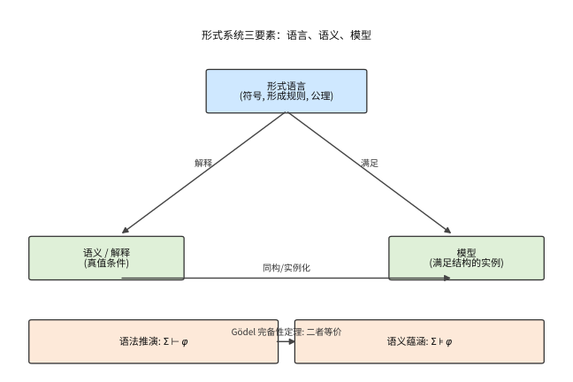

# 第 52 级：数学哲学 (Philosophy of Mathematics)

> 数学是什么？这是数学哲学最核心的问题。数学对象（如数、集合、函数）是独立存在的抽象实体，还是仅仅是人类心智的构造？数学真理是客观的、先验的，还是约定俗成的？数学证明的本质是什么？数学为何能如此有效地应用于自然科学？这些问题从古希腊柏拉图时代起就困扰着哲学家和数学家，而 19 世纪末至 20 世纪初的数学基础危机——集合论悖论的发现、非欧几何的诞生、Gödel 不完全性定理的冲击——更是将数学哲学推向了现代思想舞台的中心。本课程系统梳理数学哲学的基本问题、主要流派和核心论证，帮助读者建立对数学这门学科深刻的哲学理解。

---

## 1. 学习目标

1. 理解数学哲学的基本问题域，包括本体论、认识论和语义学三个维度。
2. 掌握柏拉图主义、唯名论、直觉主义、逻辑主义、形式主义、构造主义和结构主义等主要流派的核心观点与论证。
3. 深入理解数学基础危机的历史脉络及其哲学意义。
4. 掌握 Gödel 不完全性定理和完备性定理的哲学含义，理解其对于数学公理化计划的深刻影响。
5. 理解 Church-Turing 论题和可判定性理论的哲学意义。
6. 掌握 Cantor 对角线论证、连续统假设独立性和 Skolem 悖论所揭示的数学哲学问题。
7. 理解数学实在论与反实在论之间的核心争论，形成自己的批判性思考。
8. 理解数学与经验科学之间关系的不同哲学立场。

---

## 2. 核心概念

### 2.1 数学哲学的基本问题 (Foundational Questions)

数学哲学主要围绕以下三个相互关联的问题展开：

**本体论问题 (Ontological Questions)**：数学对象是否存在？如果存在，它们以何种方式存在？例如，自然数"2"是一个独立于人类心智的抽象实体，还是仅仅是我们思维中的一种构造？

**认识论问题 (Epistemological Questions)**：我们如何获得数学知识？如果数学对象是抽象的非时空实体，我们如何与之发生认知接触？数学知识的确定性和先验性从何而来？

**语义学问题 (Semantic Questions)**：数学陈述的意义是什么？"1 + 1 = 2"这样的陈述是在描述某种客观事实，还是仅仅表达了某种约定的规则？

这三个问题相互交织，构成了数学哲学争论的基本框架。任何完整的数学哲学都需要同时回答这三个维度的问题。

### 2.2 柏拉图主义 (Platonism)

**柏拉图主义**（Platonism）是数学实在论（mathematical realism）最经典的形态。其核心主张是：数学对象是独立于人类心智、语言和物理世界的抽象实体，它们客观存在，且数学真理是对这些独立实在的描述。

**核心论点**：

1. **存在论主张**：数学对象（数、集合、函数、几何图形等）是真实存在的抽象实体。它们不像物理对象那样存在于时空之中，也不依赖于我们是否思考它们。
2. **独立性主张**：数学真理是客观的，独立于我们的知识、信念或语言。即使没有任何理性存在者，$1 + 1 = 2$ 仍然为真。
3. **真值符合论**：数学陈述的真假取决于它们是否与数学实在相符合。

**经典论证**：Gödel 曾为柏拉图主义辩护，认为我们拥有一种类似于感官知觉的"数学直觉"（mathematical intuition），它使我们能够直接感知到数学对象。他指出，集合论公理（如选择公理）的真值可以通过这种直觉来判定。

**代表人物**：柏拉图 (Plato)、Gödel、Penelope Maddy

**数学上的比喻**：研究数学如同研究物理世界——我们在探索一个独立存在的王国，而非发明它。

### 2.3 唯名论 (Nominalism)

**唯名论**（Nominalism）是柏拉图主义的直接对立面。其核心主张是：抽象数学对象不存在，数学不应被理解为关于抽象实体的理论。

**核心论点**：

1. **本体论节俭**：只承认具体存在的物理对象，拒绝承认抽象实体。
2. **重构策略**：数学陈述必须被重新解释为关于具体对象的陈述，否则将被视为没有真值。

**Field 的数学唯名论**：Hartry Field 试图在不假设数学对象存在的前提下重建科学理论。他认为数学可以被视为一种"方便的虚构"（useful fiction）——数学本身没有真值，但它在科学推理中起到工具性作用。Field 证明了 Newton 引力理论可以不用实数而用纯定性的几何关系来表述，以此论证数学不是科学不可或缺的组成部分。

**困难**：唯名论面临的主要挑战是解释数学在科学中无可替代的效用——如果数学只是虚构，为何它如此精准地描述物理世界？

**代表人物**：Hartry Field、Goodman、Quine（在其早期）

### 2.4 直觉主义 (Intuitionism)

**直觉主义**（Intuitionism）由 L. E. J. Brouwer 创立，是数学哲学中最重要的反实在论立场之一。其核心主张是：数学是心智构造活动的产物，数学对象只存在于人类思维之中。

**核心论点**：

1. **数学即心智构造**：数学对象不是被发现的，而是被构造的。一个数学对象存在的唯一方式是它可以被人类心智构造出来。
2. **排中律的拒绝**：直觉主义拒绝在无限域中应用排中律（law of excluded middle）$P \lor \neg P$。在有限情形下排中律显然成立，但在无限情形下，我们可能无法构造性地证明 $P$ 或 $\neg P$。
3. **存在即被构造**：存在性证明必须提供具体的构造方法。"存在一个 $x$ 使得 $P(x)$" 意味着我们能够实际构造出一个满足 $P$ 的对象。

**数学实践**：直觉主义逻辑与经典逻辑不同。在直觉主义逻辑中，$\neg \neg P \to P$（双重否定消去）不成立。这意味着从"不存在 $x$ 使得 $P(x)$ 不成立"不能推出"存在 $x$ 使得 $P(x)$ 成立"。

**Brouwer 的固定点定理**：Brouwer 在拓扑学中证明了著名的 **Brouwer 固定点定理**，但他本人对该定理的非构造性证明并不满意，这促使他走向直觉主义道路。

**代表人物**：L. E. J. Brouwer、Arend Heyting、Michael Dummett

> **直观理解（现实类比）**：直觉主义与经典数学的分歧，就像"证明某件宝物藏在门后"与"直接把门打开看到宝物"的区别。经典数学只要从逻辑上排除"门后没有宝物"的可能，就敢断言"宝物在门后"（排中律）；直觉主义则要求你必须亲手打开门、亲眼看到宝物才算数（构造性证明）。在无限的世界里，经典数学允许这种"逻辑上的保证"，而直觉主义坚持每一步都要给出具体的构造。

### 2.5 逻辑主义 (Logicism)

**逻辑主义**（Logicism）的核心主张是：数学可以还原为逻辑。也就是说，数学概念可以通过纯逻辑概念来定义，数学定理可以从逻辑公理推导出来。

**核心论点**：

1. **数学即逻辑的延伸**：所有数学真理——包括算术和分析——都是逻辑真理。
2. **概念的可定义性**：数学概念（如自然数、函数、集合）都可以用纯逻辑术语定义。
3. **认识论优势**：如果数学是逻辑的一部分，那么数学知识的先验性和确定性就可以从逻辑的确定性得到解释。

**Frege 的定义**：Gottlob Frege 在《算术基础》（1884）中定义了自然数：$n$ 是一个数，当且仅当存在一个概念 $F$ 使得 $n$ 是 $F$ 的"外延"（extension）。具体地，数 $0$ 被定义为"与自身不相等"这一概念的外延；数 $1$ 被定义为"与 $0$ 相等"这一概念的外延，依此类推。

**Frege 的定理**：Frege 从 Hume 原理（Hume's Principle）——"概念 $F$ 和 $G$ 有相同的数当且仅当 $F$ 和 $G$ 之间存在一一对应"——推导出了 Peano 算术公理。

**Russell 悖论**：Frege 的计划在 1902 年被 Russell 的一封信彻底摧毁。Russell 发现，如果允许任意概念的外延都是集合，那么考虑"所有不包含自身的集合的集合"会导致矛盾。这就是著名的 **Russell 悖论**（Russell's Paradox）：

$$
R = \{x \mid x \notin x\} \implies R \in R \iff R \notin R.
$$

**Russell 与 Whitehead 的回应**：在《数学原理》（Principia Mathematica, 1910–1913）中，Russell 和 Whitehead 通过类型论（type theory）来避免悖论，试图将整个数学还原为逻辑。虽然这一计划在技术上可行，但所需的公理（如无穷公理、选择公理）是否属于"纯逻辑"存在争议。

**代表人物**：Gottlob Frege、Bertrand Russell、Alfred North Whitehead

### 2.6 形式主义 (Formalism)

**形式主义**（Formalism）与 Hilbert 的名字紧密相连。其核心主张是：数学是符号游戏，数学陈述的意义完全由它们在其中运作的形式系统所决定。

**核心论点**：

1. **数学即形式系统**：数学由一组初始符号、形成规则和变形规则（推理规则）组成。数学研究就是按照规则操作符号。
2. **意义无关性**：数学符号本身没有含义，它们只有在被解释时才有意义。数学真理是系统内的可证明性。
3. **一致性即存在**：对一个形式系统而言，"存在"就是"无矛盾"。如果一个形式系统是一致的，那么它所描述的对象就"存在"。

**Hilbert 计划**：Hilbert 为数学基础提出了一个宏大的纲领：

1. **形式化**：将全部数学形式化，即用一阶逻辑的公理系统表述。
2. **完备性**：证明该形式系统是完备的——每个数学真理都可以在该系统中被证明。
3. **一致性**：用有限的（finitistic）方法证明该形式系统的一致性，从而一劳永逸地确立数学的可靠性。

> **直观理解（现实类比）**：数学大厦就像一座用"积木"搭起的高楼：最底层的几块积木是公理（如 ZFC 集合论、Peano 公理），它们本身不被证明，只是"地基"；其上每一层都是通过逻辑推理规则（一锤一锤敲紧）从下层"砌"出来的定理；再往上就汇聚成分析、几何、代数等一幢幢"楼阁"。数学体系的魅力在于，只要地基结实（一致），整座大厦就能拔地而起。

**Gödel 的打击**：Gödel 不完全性定理（详见下文 §3.1）宣布了 Hilbert 计划的破产——任何足够强大的形式系统既不可能完备，也不可能在其内部证明自身的一致性。

**后期形式主义**：虽然 Hilbert 的原始计划失败了，但形式主义作为一种哲学立场仍然存在。现代形式主义者认为，数学研究就是在形式系统中进行推理，而一致性是数学合法性的唯一标准。

**代表人物**：David Hilbert、Haskell Curry、Rudolf Carnap（在其早期）

### 2.7 构造主义 (Constructivism)

**构造主义**（Constructivism）是一个宽泛的范畴，包括直觉主义及其变体。其核心主张是：一个数学对象存在的证明必须是构造性的——必须具体展示如何构造（或计算）该对象。

**非构造性证明的例子**：考虑以下经典论证："存在无理数 $a, b$ 使得 $a^b$ 是有理数。"考虑 $\sqrt{2}^{\sqrt{2}}$。如果它是有理数，则结论成立（取 $a = b = \sqrt{2}$）；如果它是无理数，则取 $a = \sqrt{2}^{\sqrt{2}}, b = \sqrt{2}$，则 $a^b = (\sqrt{2}^{\sqrt{2}})^{\sqrt{2}} = \sqrt{2}^{2} = 2$，是有理数。这个证明使用了排中律（$\sqrt{2}^{\sqrt{2}}$ 要么是有理数要么是无理数），但没有告诉我们实际是哪一种情况——它是一个非构造性证明。

**构造主义的要求**：构造主义者要求证明必须提供算法或具体步骤。例如，证明"存在 $x$ 使得 $P(x)$"必须给出一个具体的 $x$ 以及 $P(x)$ 成立的构造性证明。

**代表人物**：Brouwer、Heyting、Errett Bishop（构造性分析）、Per Martin-Löf（构造性类型论）

### 2.8 结构主义 (Structuralism)

**结构主义**（Structuralism）是 20 世纪下半叶兴起的重要数学哲学流派。其核心主张是：数学研究的是结构而非对象——数学对象只是结构中的位置，没有内在的本质。

**核心论点**：

1. **对象即位置**：数学对象（如自然数"2"）不独立存在，它们只是在一个结构（如自然数结构 $\langle \mathbb{N}, 0, S, +, \cdot \rangle$）中占据一个位置。
2. **结构优先性**：结构先于对象。对象由其在一个结构中的关系来定义，而非相反。
3. **抽象性**：同一个结构可以被不同的具体系统所实例化。例如，自然数的 Peano 公理系统可以被 $\omega$ 序列、冯·诺依曼序数或 Zermelo 序数所满足。

**Bourbaki 学派**：法国 Bourbaki 学派（虽然没有明确宣称结构主义哲学）在其《数学原本》中系统地将数学建立在三种母结构之上：代数结构、序结构和拓扑结构。这体现了结构主义的思想方法。

**Shapiro 的 ante rem 结构主义**：Stewart Shapiro 认为结构是独立存在的抽象实体，类似于柏拉图主义的抽象对象，但这里的"对象"是结构而非个体。

**模态结构主义**：Geoffrey Hellman 提出了一种更温和的版本，认为结构陈述应该被理解为模态陈述——"如果存在一个满足某种结构的系统，那么..."——从而避免了本体论承诺。

**代表人物**：Bourbaki、Stewart Shapiro、Geoffrey Hellman、Michael Resnik

### 2.9 数学真理性 (Mathematical Truth)

关于数学真理性的理解，各流派给出了不同的回答：

| 流派 | 真理观 | 数学真理的本质 |
|:---:|:------|:--------------|
| 柏拉图主义 | 符合论 | 数学陈述与独立数学实在的符合 |
| 直觉主义 | 可证性 | 真理 = 可构造性证明 |
| 形式主义 | 一致性 | 真理 = 系统内的可证明性 |
| 逻辑主义 | 逻辑真理 | 数学真理是逻辑真理的子类 |
| 唯名论 | 虚构论 | 数学陈述严格来说不为真，只是有用的虚构 |

### 2.10 数学本体论 (Mathematical Ontology)

数学本体论探讨数学中"存在"的含义。不同流派的观点可概括如下：

- **实在论 (Realism)**：数学对象客观存在，独立于我们的认知。柏拉图主义是最典型的实在论。
- **反实在论 (Anti-Realism)**：数学对象不是独立存在的。直觉主义、形式主义、唯名论都属于反实在论。
- **中间立场**：结构主义试图在实在论和反实在论之间找到一条中间道路，认为结构是客观的，但个体对象不是独立存在的。

### 2.11 数学证明的本质 (Nature of Mathematical Proof)

数学证明是数学哲学的核心议题之一。传统上，数学证明被理解为从公理出发，通过逻辑推理规则得到结论的一系列步骤。然而，现代数学实践和计算机科学的发展对证明的概念提出了新的挑战：

**形式证明 vs. 非形式证明**：形式证明（formal proof）是完全按照逻辑规则书写的符号序列，可以被机器验证。非形式证明（informal proof）是数学家在论文中使用的日常证明，它省略了许多细节，依赖于读者的理解能力。问题在于：非形式证明与形式证明之间的关系是什么？

**计算机辅助证明**：1976 年，Appel 和 Haken 用计算机证明了四色定理。这引发了关于证明本质的哲学争论：计算机执行的成千上万次计算是否构成了一个"证明"？如果证明可以由机器完成，那么"理解"在证明中扮演什么角色？

**证明与真理**：直觉主义认为证明就是真理（真理 = 可证明性）。经典实在论则认为真理和证明是分离的——一个陈述可以为真，即便我们永远无法证明它。Gödel 不完全性定理的存在正好支持了后一种观点。

### 2.12 数学与经验科学的关系

数学在自然科学中的"不合理的有效性"（unreasonable effectiveness）——物理学家 Eugene Wigner 的名言——是数学哲学中最令人困惑的问题之一。

**主要立场**：

1. **数学是科学的语言**：Galileo 曾说"自然这本书是用数学语言写成的"。数学提供了描述自然规律的最佳框架。
2. **数学是科学推理的工具**：数学是科学理论的演算工具，本身不提供关于世界的知识。
3. **数学是科学的一部分**：Quine 的"自然主义"（naturalism）认为数学与科学是连续的，数学真理和科学真理一样，都是我们最佳理论的一部分。
4. **数学是科学的模型**：数学结构为物理世界提供了模型，两者之间的匹配是一种经验事实。

**Wigner 的困惑**：Wigner 在 1960 年的著名文章中问道，为什么纯数学的抽象结构——那些最初只是出于数学家好奇心的产物——后来会在物理学中惊人地适用？例如，非欧几何为广义相对论提供了基础，群论为粒子物理提供了框架。这是否暗示了数学与物理世界之间存在某种深层联系？

### 2.13 数学基础的危机 (Foundational Crisis)

19 世纪末到 20 世纪初，数学基础经历了一场深刻的危机，这场危机主要源于三个方面的挑战：

**1. 非欧几何的诞生**：Gauss、Lobachevsky 和 Bolyai 各自独立地发展出了非欧几何，打破了 Euclid 几何是唯一真理的观念。如果几何不是先验必然的，那么数学的基础是什么？

**2. 微积分的严格化**：Cauchy、Weierstrass、Dedekind 等人通过 $\varepsilon$-$\delta$ 语言和实数理论为微积分建立了严格的基础，但这一过程揭示出集合论才是数学的真正基础。

**3. 集合论悖论**：Cantor 的朴素集合论在 1890 年代到 1900 年代初期被一系列悖论震撼：

- **Cantor 悖论**（1899）：所有集合的集合会导致矛盾。
- **Russell 悖论**（1902）："所有不包含自身的集合的集合"导致矛盾。
- **Burali-Forti 悖论**（1897）：所有序数的序数导致矛盾。

这些悖论迫使数学家重新思考数学的基础，从而催生了三大基础学派：逻辑主义（Frege, Russell）、形式主义（Hilbert）和直觉主义（Brouwer）。

---

## 3. 定理与证明的哲学意义

### 3.1 Gödel 不完全性定理的哲学含义 (Gödel's Incompleteness Theorems)

**定理 3.1**（Gödel 第一不完全性定理，1931）任何包含 Peano 算术的一致的形式系统 $T$ 都是不完全的：存在一个算术语句 $\varphi$，使得 $\varphi$ 在 $T$ 中既不可证明也不可否证。

**定理 3.2**（Gödel 第二不完全性定理，1931）任何包含 Peano 算术的一致的形式系统 $T$ 都不能证明自身的一致性，即 $T \nvdash \text{Con}(T)$。

**哲学含义**：

1. **形式化的固有局限**：数学不能完全被形式化。任何形式系统都无法捕捉到全部数学真理。这意味着数学理解本质上超越了任何算法过程。

2. **Hilbert 计划的终结**：Gödel 定理直接宣告了 Hilbert 计划的核心目标——证明数学形式系统的一致性和完备性——是不可实现的。

3. **真理与可证明性的分离**：Gödel 定理表明，存在为真但不可证明的数学真理。这为柏拉图主义提供了强有力的支持——数学真理超越了我们的证明能力。

4. **心智与机器的界限**：Gödel 定理被 J. R. Lucas 和 Roger Penrose 用来论证人类心智超越计算机——人类能够"看到"Gödel 语句的真值，而形式系统（机器）无法证明它。这一论证存在争议，但引发了深刻的哲学讨论。

5. **数学创造性的空间**：如果数学不是完全形式化的，那么数学创造性和直觉就具有不可替代的地位。

### 3.2 Gödel 完备性定理的哲学含义 (Gödel's Completeness Theorem)

**定理 3.3**（Gödel 完备性定理，1930）一阶逻辑是完备的：对于任意一阶语句集 $\Sigma$ 和任意一阶语句 $\varphi$，$\Sigma \models \varphi$（语义蕴涵）当且仅当 $\Sigma \vdash \varphi$（语法可推演）。

**哲学含义**：

1. **一阶逻辑的完美性**：Gödel 完备性定理表明一阶逻辑的语义和语法完美对应——逻辑推论恰好就是逻辑可证明的。这意味着一阶逻辑是"理想的"逻辑框架。

2. **与不完全性定理的对比**：Gödel 完备性定理（关于逻辑）与不完全性定理（关于算术理论）形成了鲜明的对比。一阶逻辑本身是完备的，但在一阶逻辑中表述的算术理论是不完备的。这说明数学的不完备性源自数学内容本身，而非逻辑框架。

3. **一阶 vs 高阶逻辑**：二阶逻辑等更强大的逻辑系统不具备完备性定理。这促使数学基础研究者倾向于使用一阶逻辑作为形式化的框架，尽管一阶逻辑的表达能力有限。

> **直观理解（现实类比）**：一个形式系统就像一套"象棋规则"：形式语言是棋盘上的棋子符号和走法规则（语法），语义是"将军""吃掉"这些规则赋予了符号的动作含义（解释），模型则是某局实际摆出来的具体棋局（满足规则的实例）。到底"这一步是否合法"有两种判定：按规则一步步推演（语法推演 $\vdash$）和看它在所有棋局中都成立（语义蕴涵 $\models$）——Gödel 完备性定理断言，在一阶逻辑里这两种判定永远一致。

### 3.3 Church-Turing 论题的哲学意义 (Church-Turing Thesis)

**论题 3.4**（Church-Turing 论题）一个函数是直观意义上"可计算的"当且仅当它是 Turing 机可计算的（或等价地，是递归函数、$\lambda$ 可定义的等）。

**哲学含义**：

1. **计算的哲学边界**：Church-Turing 论题划定了计算能力的绝对界限。某些问题（如停机问题、判定一阶逻辑公式是否为永真公式）在原则上是不可计算的。

2. **可判定性**：Hilbert 的 Entscheidungsproblem（判定问题）——是否存在一个通用算法来确定任何数学陈述的真假——被 Church 和 Turing 独立地证明为不可解。这进一步揭示了数学知识的局限性。

3. **物理世界的计算边界**：Church-Turing 论题不仅适用于数学，也对物理世界有深刻影响。如果物理世界可以被模拟为某种计算过程，那么物理过程也受限于计算能力的边界。

4. **量子计算的挑战**：量子计算能否超越经典 Turing 机的计算能力？目前的主流观点认为，量子 Turing 机在计算能力上并不超越经典 Turing 机（它们计算相同的函数类），只是在效率上有显著差异。

### 3.4 Cantor 对角线论证的哲学意义 (Cantor's Diagonal Argument)

**定理 3.5**（Cantor 定理）实数集 $\mathbb{R}$ 是不可数的，即 $|\mathbb{R}| > |\mathbb{N}|$。更一般地，对于任意集合 $A$，$|A| < |\mathcal{P}(A)|$（幂集的基数严格大于原集合的基数）。

**Cantor 对角线论证**（针对实数）：假设实数集是可数的，则存在一个枚举 $r_1, r_2, r_3, \ldots$。将每个实数写成十进制小数：
$$
\begin{aligned}
r_1 &= 0.a_{11}a_{12}a_{13}\ldots \\
r_2 &= 0.a_{21}a_{22}a_{23}\ldots \\
r_3 &= 0.a_{31}a_{32}a_{33}\ldots \\
&\ \vdots
\end{aligned}
$$
构造一个新实数 $d = 0.b_1b_2b_3\ldots$，其中 $b_i \neq a_{ii}$（例如，$b_i = 1$ 如果 $a_{ii} \neq 1$，否则 $b_i = 2$）。则 $d$ 与所有 $r_i$ 都不同，矛盾。

**哲学含义**：

1. **无穷的层次结构**：Cantor 的论证揭示了无穷不是单一的——存在不同"大小"的无穷。这引发了关于无穷概念的哲学争论：无穷集合是否真的存在？如果存在，它们是否构成一个"实在"的层级结构？

2. **数学直觉的局限**：Cantor 的结论违背了许多人的直觉——一条线段上的点与整个平面上的点一样多（$|\mathbb{R}| = |\mathbb{R}^2|$）。这说明数学直觉不能作为真理的最终标准。

3. **构造主义的质疑**：直觉主义者/构造主义者拒绝接受 Cantor 的论证，因为它依赖于对无穷集合的实在论假设。对于构造主义者来说，$\mathbb{R}$ 的"不可数性"只是意味着不存在一个构造性的方法将 $\mathbb{R}$ 与 $\mathbb{N}$ 一一对应。

4. **对角线论证的普遍性**：对角线论证不仅用于 Cantor 定理，也是 Gödel 不完全性定理和 Turing 停机问题的核心论证方法，具有深刻的数学哲学意义。

### 3.5 连续统假设的独立性的哲学意义 (Independence of the Continuum Hypothesis)

**假设 3.6**（连续统假设，CH）不存在基数严格介于 $\aleph_0$（自然数集的基数）和 $2^{\aleph_0}$（实数集的基数）之间的无穷集合。即 $2^{\aleph_0} = \aleph_1$。

**定理 3.7**（Gödel, 1940）如果 ZF 集合论是一致的，那么 ZFC + CH 也是一致的（即 CH 在 ZFC 中不可否证）。

**定理 3.8**（Cohen, 1963）如果 ZF 集合论是一致的，那么 ZFC + $\neg$CH 也是一致的（即 CH 在 ZFC 中不可证明）。

**哲学含义**：

1. **ZFC 的不完备性**：CH 的独立性是 ZFC 不完备性的最显著例证。ZFC 作为数学的基础，无法回答关于无穷集合大小的基本问题。

2. **实在论 vs 反实在论的争论**：实在论者认为 CH 一定有一个确定的真值（要么真要么假），只是 ZFC 公理不足以判定它。反实在论者则认为 CH 的"真值"是一个没有意义的问题——不同公理系统可以扩展 ZFC，选择不同的公理会得到不同的答案。

3. **新公理的寻求**：一些集合论学家（如 Gödel）主张我们需要寻找新的公理来判定 CH。然而，什么样的新公理是"正确"的？这个问题本身就是一个深刻的哲学问题。

4. **数学基础的开放性**：CH 的独立性表明，数学基础不是一个封闭的、已完成的项目，而是一个不断发展的、开放的领域。

### 3.6 Skolem 悖论的哲学意义 (Skolem's Paradox)

**定理 3.9**（Löwenheim-Skolem 定理）如果一阶理论 $T$ 有一个无穷模型，那么 $T$ 有一个可数模型（即基数为 $\aleph_0$ 的模型）。

**Skolem 悖论**：ZFC 集合论中，我们可以证明"存在不可数集合"。但根据 Löwenheim-Skolem 定理，ZFC（如果一致）存在一个**可数模型**。在这个可数模型中，一个集合 $A$ 在模型内部"看起来"是不可数的，但在模型外部（从"真实"的元数学视角看）它实际上只有可数多个元素。

**哲学含义**：

1. **一阶逻辑的表达能力限制**：Skolem 悖论揭示了一阶逻辑的根本局限——一阶理论无法唯一地确定其模型的基数。当我们说"存在不可数集合"时，这一陈述在一阶逻辑中只能被"近似地"表达。

2. **相对性**："可数性"和"不可数性"不是绝对的属性，而是相对于某个模型而言的。这引发了关于数学概念客观性的深刻讨论。

3. **模型论与数学实在**：Skolem 悖论使得一些哲学家（如 Putnam）认为数学实在论面临严重困难——如果"不可数"这样的基本概念都是相对的，数学实在论的基础何在？

4. **回应**：实在论者通常回应说，Skolem 悖论只涉及一阶逻辑的模型，而"真正的"数学概念是在二阶逻辑中刻画的。但二阶逻辑不具备完备性，且其自身的哲学基础也面临挑战。

---

## 4. 学派讨论

### 4.1 柏拉图主义 (Platonism)

| 维度 | 内容 |
|:----|:------|
| **核心主张** | 数学对象是独立存在的抽象实体，数学真理是对独立实在的描述 |
| **代表人物** | 柏拉图 (Plato, 约 427–347 BCE)、Kurt Gödel (1906–1978)、Penelope Maddy (1950–) |
| **论证** | Gödel 的"数学直觉"论证：我们拥有感知抽象数学对象的能力，就像我们拥有感知物理对象的能力一样。数学公理的真理性可以通过这种直觉来判断。 |
| **优势** | 1. 与数学实践的日常经验相符（数学家感觉自己在"发现"而非"发明"数学） 2. 为数学真理的客观性提供了最直接的解释 |
| **挑战** | 1. **认识论困境**：如果数学对象是抽象的非时空实体，我们如何与之发生因果联系？ 2. **Benacerraf 问题**：Paul Benacerraf 指出，如果柏拉图主义为真，那么我们关于数学知识的认识论就是不可理解的。 3. 无法解释数学在科学中的应用 |

### 4.2 逻辑主义 (Logicism)

| 维度 | 内容 |
|:----|:------|
| **核心主张** | 数学可以还原为逻辑 |
| **代表人物** | Gottlob Frege (1848–1925)、Bertrand Russell (1872–1970)、Alfred North Whitehead (1861–1947) |
| **关键著作** | Frege《算术基础》(1884)、《算术基本法则》(1893–1903)；Russell & Whitehead《数学原理》(1910–1913) |
| **论证** | 所有数学概念都可以用纯逻辑概念定义；所有数学定理都可以从逻辑公理推导出来 |
| **优势** | 1. 为数学知识提供了坚实的认识论基础 2. 展示了数学与逻辑的深刻联系 |
| **挑战** | 1. Russell 悖论：朴素逻辑主义面临矛盾 2. 类型论公理（无穷公理、选择公理）是否属于"纯逻辑"存在争议 3. Gödel 不完全性定理表明逻辑主义的认识论目标无法完全实现 |

### 4.3 形式主义 (Formalism)

| 维度 | 内容 |
|:----|:------|
| **核心主张** | 数学是符号游戏，数学真理就是系统内的可证明性 |
| **代表人物** | David Hilbert (1862–1943)、Haskell Curry (1900–1982) |
| **关键概念** | Hilbert 计划、元数学 (metamathematics)、有限主义 (finitism) |
| **论证** | 数学的本质是形式符号系统的操作，无需赋予符号任何"意义"；一致性是数学合法性的唯一标准 |
| **优势** | 1. 回避了数学本体论难题 2. 为数学的严格化提供了方法论框架 3. 促进了元数学和证明论的发展 |
| **挑战** | 1. Gödel 不完全性定理：Hilbert 计划的核心目标不可实现 2. 如果数学只是符号游戏，为什么它在科学中如此有效？ 3. 形式系统本身需要元数学来研究，元数学的哲学基础是什么？ |

### 4.4 直觉主义 (Intuitionism)

| 维度 | 内容 |
|:----|:------|
| **核心主张** | 数学是人类心智构造的产物，存在即被构造 |
| **代表人物** | L. E. J. Brouwer (1881–1966)、Arend Heyting (1898–1980)、Michael Dummett (1925–2011) |
| **关键概念** | 心智构造、排中律的拒绝、构造性证明、选择序列 (choice sequence) |
| **论证** | 数学的基础不是逻辑或公理，而是原始直觉——对"二合一"（two-oneness）的直觉，即对时间中发生的事件的感知 |
| **优势** | 1. 避免了与无穷相关的悖论 2. 提供了严格的构造性数学 3. 与计算机科学（构造性类型论、证明论）有深刻的联系 |
| **挑战** | 1. 拒绝了大量已被接受的经典数学（如非构造性存在性证明） 2. 主观主义倾向——数学真理是否依赖于个体心智？ 3. 在数学实践中，直觉主义逻辑的证明更加复杂和繁琐 |

### 4.5 结构主义 (Structuralism)

| 维度 | 内容 |
|:----|:------|
| **核心主张** | 数学研究的是结构，而非个体对象；对象只是结构中的位置 |
| **代表人物** | Bourbaki 学派 (1935–)、Stewart Shapiro (1951–)、Geoffrey Hellman (1945–)、Michael Resnik |
| **关键概念** | 结构 (structure)、位置 (place)、同构 (isomorphism) |
| **论证** | 数学中重要的是关系而非个体。例如，自然数"2"是什么不重要——重要的是"2"在自然数结构中的位置和关系 |
| **优势** | 1. 解释了数学对象的"多可实例化性"（同一结构可由不同系统实例化） 2. 与当代数学实践（范畴论、同调代数）高度一致 3. 回避了柏拉图主义的个体对象本体论难题 |
| **挑战** | 1. 结构本身的本体论地位是什么？ 2. 如何区分"同一结构"和"不同结构"？ 3. 空结构（如空集）是否构成一个结构？ |

---

## 5. 习题

**习题 5.1** 考虑以下陈述："存在无理数 $a, b$ 使得 $a^b$ 是有理数。"（1）给出该陈述的一个经典非构造性证明（如 §2.7 中的论证）。（2）尝试给出一个构造性证明。（提示：考虑 $a = \sqrt{2}, b = \log_2 9$ 或类似构造。）（3）讨论这两个证明在哲学意义上的区别。

**习题 5.2** Gödel 第一不完全性定理表明，任何包含 Peano 算术的一致形式系统 $T$ 中都存在一个真但不可证明的语句 $G_T$。假设我们扩展 $T$ 为 $T' = T + G_T$（即把 $G_T$ 作为新公理加入）。$T'$ 是否仍然不完全？如果是，$T'$ 中新的不可证明的语句是什么？这对"数学真理能否被完全公理化"这一问题有何启示？

**习题 5.3** 柏拉图主义面临的核心挑战是"认识论困境"：如果数学对象是抽象的非时空实体，我们如何与之发生认知接触？请阐述 Gödel 的"数学直觉"回应，并评估这一回应是否成功。你认为数学认识论还可以如何辩护？

**习题 5.4** 考虑 Löwenheim-Skolem 定理及其产生的 Skolem 悖论。假设 ZFC 有一个可数模型 $M$。在 $M$ 中，存在一个集合 $\omega^M$（$M$ 中的自然数集）和一个集合 $\mathbb{R}^M$（$M$ 中的实数集）。$M \models \text{"} |\mathbb{R}| > |\omega| \text{"}$。但在 $M$ 外部，$\mathbb{R}^M$ 和 $\omega^M$ 都是可数的。这是否意味着"不可数"是一个相对的概念？实在论者如何回应这一挑战？

**习题 5.5** 形式主义认为数学是"符号游戏"，数学真理就是系统内的可证明性。但为什么数学在自然科学中如此有效？Wigner 称之为"数学在自然科学中不合理的有效性"。请从形式主义、柏拉图主义和结构主义三个角度分别回应 Wigner 的问题。哪个回应最有说服力？为什么？

**习题 5.6** 直觉主义拒绝在无限域中应用排中律。考虑以下经典定理："每个有上界的实数集都有上确界。"（1）这个定理的经典证明是否使用了排中律或非构造性推理？（2）在直觉主义框架下，能否重新表述和证明上确界定理？（3）直觉主义数学对分析学的重构会面临哪些困难？

**习题 5.7** Cantor 对角线论证揭示了无穷的层次结构。构造主义者对 Cantor 的论证持批评态度。请从直觉主义/构造主义的立场分析 Cantor 对角线论证的哲学假设。Cantor 的论证是否依赖于排中律？如果排除了排中律，我们能否证明 $\mathbb{R}$ 是不可数的？"不可数"在构造主义框架中意味着什么？

**习题 5.8** 连续统假设（CH）在 ZFC 中独立。一些数学家（如 Woodin）主张通过寻找新的集合论公理来判定 CH，而另一些则认为 CH 的"真值"是一个没有意义的问题。请讨论：（1）一个数学命题是否在所有可能的公理系统中都必须有一个确定的真值？（2）如果我们可以自由选择是否接受 CH 作为公理，这是否意味着数学真理是"约定"的？这会对数学实在论产生什么影响？

---

## 6. 总结

本章系统介绍了数学哲学的核心问题和主要流派，可以总结如下：

1. **数学哲学的基本问题**：围绕本体论（数学对象是否存在）、认识论（我们如何知道数学真理）和语义学（数学陈述的意义）三个维度展开。

2. **主要流派**：柏拉图主义（数学对象独立存在）、唯名论（数学对象不存在）、逻辑主义（数学可还原为逻辑）、形式主义（数学是符号游戏）、直觉主义（数学是心智构造）、构造主义（构造性证明为存在标准）和结构主义（数学研究结构而非对象）。

3. **数学基础危机**：19 世纪末至 20 世纪初的集合论悖论、非欧几何的诞生和微积分严格化运动，共同催生了数学基础领域的深刻反思和三大基础学派的形成。

4. **Gödel 定理的哲学意义**：Gödel 不完全性定理揭示了形式化的固有局限，宣告了 Hilbert 计划的破产，同时也为柏拉图主义提供了支持——数学真理超越了可证明性。Gödel 完备性定理则表明一阶逻辑是完美的推理框架，但一阶理论本身是不完备的。

5. **Church-Turing 论题与可计算性**：划定了数学可判定性的边界，决定了哪些问题在原则上是不可解的。

6. **Cantor 与无穷的层次**：Cantor 对角线论证揭示了无穷具有不同的"大小"，连续统假设的独立性表明了 ZFC 作为数学基础的不完备性，Skolem 悖论则揭示了一阶逻辑的表达能力限制。

7. **数学与科学的关系**：数学在自然科学中的"不合理的有效性"是数学哲学中尚未完全解决的深层问题，不同流派给出了不同的回答。

数学哲学不是关于具体数学定理的研究，而是对数学本身作为一门学科的本质、方法和基础的反思。它要求我们退后一步，审视数学实践背后的预设和承诺。正如 Gödel 所说："数学哲学的问题，如果不解决数学基础的问题，就永远无法最终解决。"而数学哲学的魅力恰恰在于，这些问题可能永远没有最终的答案，但追问的过程本身深化了我们对数学的理解。

---

> **延伸阅读**：
> 1. Benacerraf, P. & Putnam, H. (eds.) *Philosophy of Mathematics: Selected Readings*, 2nd ed. Cambridge University Press, 1983.
> 2. Shapiro, S. *Thinking about Mathematics*. Oxford University Press, 2000.
> 3. Linnebo, Ø. *Philosophy of Mathematics*. Princeton University Press, 2017.
> 4. 克莱因 (M. Kline) 著，《数学：确定性的丧失》，湖南科学技术出版社。
> 5. Gödel, K. "What is Cantor's Continuum Problem?" (1947/1964)
> 6. Wigner, E. "The Unreasonable Effectiveness of Mathematics in the Natural Sciences" (1960)