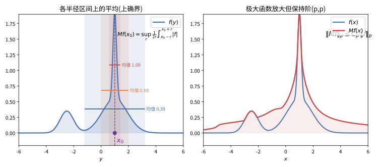

# 第 53 级：调和分析 (Harmonic Analysis)

> 调和分析是数学的核心分支之一，起源于 Fourier 研究热传导方程时提出的级数理论。它研究函数分解为基本谐波（正弦与余弦）的表示，以及这种分解在各种算子研究中的应用。现代调和分析已发展成为分析学中最为强大的工具之一，在偏微分方程、数论、信号处理、量子力学等领域有着深远的影响。本课程从 Fourier 级数的经典理论出发，逐步深入到 Calderón-Zygmund 理论、Littlewood-Paley 理论、Hardy 空间与 BMO 空间等现代调和分析的核心内容。

---

## 1. 学习目标

1. 理解 Fourier 级数的逐点收敛与 Cesàro 求和理论，掌握 Dirichlet-Jordan 定理与 Fejér 定理。
2. 掌握 Fourier 变换的基本性质，理解 Poisson 求和公式及其应用。
3. 理解振荡积分的基本概念与 stationary phase 方法。
4. 掌握 Calderón-Zygmund 分解定理及其证明，理解奇异积分算子的基本理论。
5. 理解 Littlewood-Paley 理论的核心思想，掌握平方函数与频率分解。
6. 理解 Hardy 空间与 BMO 空间的定义及基本性质。
7. 掌握拟微分算子的符号演算与基本性质。
8. 理解原子分解与 T(b) 定理的核心思想。

---

## 2. 核心概念

### 2.1 Fourier 级数

**定义 2.1**（Fourier 级数）设 $f: \mathbb{R} \to \mathbb{C}$ 是以 $2\pi$ 为周期的可积函数。$f$ 的 **Fourier 级数** 定义为：

$$
f(x) \sim \sum_{n=-\infty}^{\infty} \hat{f}(n) e^{inx},
$$

其中 **Fourier 系数** 为：

$$
\hat{f}(n) = \frac{1}{2\pi} \int_{-\pi}^{\pi} f(x) e^{-inx} \, dx, \quad n \in \mathbb{Z}.
$$

**定义 2.2**（部分和与 Dirichlet 核）Fourier 级数的第 $N$ 个 **部分和** 为：

$$
S_N f(x) = \sum_{n=-N}^{N} \hat{f}(n) e^{inx} = (f * D_N)(x),
$$

其中 **Dirichlet 核** 为：

$$
D_N(x) = \sum_{n=-N}^{N} e^{inx} = \frac{\sin\left((N+\frac{1}{2})x\right)}{\sin(x/2)}.
$$

> **直观理解（现实类比）**：卷积就像用一块"抹布"（核 $g$）贴着信号 $f$ 一路推移，每到一处就把重叠部分的取值加权求和。它和音频混音、图像高斯模糊是同一个运算——输出在每一点都是"周围输入按核加权后的重叠总和"，体现了"滑动 + 加权 + 叠加"的直观。

**定义 2.3**（Fejér 核与 Cesàro 求和）Fourier 级数的 **Cesàro 均值**（算术平均）为：

$$
\sigma_N f(x) = \frac{1}{N+1} \sum_{k=0}^{N} S_k f(x) = (f * F_N)(x),
$$

其中 **Fejér 核** 为：

$$
F_N(x) = \frac{1}{N+1} \sum_{k=0}^{N} D_k(x) = \frac{1}{N+1} \left(\frac{\sin\left(\frac{N+1}{2}x\right)}{\sin(x/2)}\right)^2.
$$

### 2.2 Fourier 变换

**定义 2.4**（Fourier 变换）设 $f \in L^1(\mathbb{R}^n)$，其 **Fourier 变换** 定义为：

$$
\hat{f}(\xi) = \mathcal{F}f(\xi) = \int_{\mathbb{R}^n} f(x) e^{-2\pi i x \cdot \xi} \, dx.
$$

**Fourier 逆变换** 定义为：

$$
\check{f}(x) = \mathcal{F}^{-1}f(x) = \int_{\mathbb{R}^n} f(\xi) e^{2\pi i x \cdot \xi} \, d\xi.
$$

### 2.3 Poisson 求和公式

**定理 2.5**（Poisson 求和公式）设 $f: \mathbb{R}^n \to \mathbb{C}$ 是 Schwartz 函数，则：

$$
\sum_{k \in \mathbb{Z}^n} f(k) = \sum_{k \in \mathbb{Z}^n} \hat{f}(k).
$$

更一般地，对于 $a > 0$：

$$
\sum_{k \in \mathbb{Z}^n} f(ak) = \frac{1}{a^n} \sum_{k \in \mathbb{Z}^n} \hat{f}\left(\frac{k}{a}\right).
$$

### 2.4 Heisenberg 群

**定义 2.6**（Heisenberg 群）**Heisenberg 群** $\mathbb{H}^n$ 是 $\mathbb{R}^{2n+1}$ 配备以下群运算的 Lie 群：

$$
(x, y, t) \cdot (x', y', t') = \left(x + x', y + y', t + t' + \frac{1}{2}(x \cdot y' - y \cdot x')\right),
$$

其中 $x, y \in \mathbb{R}^n$，$t \in \mathbb{R}$。

### 2.5 振荡积分

**定义 2.7**（振荡积分）**振荡积分** 是形如：

$$
I(\lambda) = \int_{\mathbb{R}^n} e^{i\lambda \phi(x)} a(x) \, dx
$$

的积分，其中 $\lambda > 0$ 是大参数，$\phi$ 是实值光滑函数（称为 **相位函数**），$a$ 是光滑函数（称为 **振幅函数**）。

**Stationary Phase 原理**：当 $\lambda \to \infty$ 时，振荡积分的主要贡献来自相位函数 $\phi$ 的临界点（即 $\nabla\phi(x) = 0$ 的点）。

### 2.6 奇异积分算子

**定义 2.8**（Calderón-Zygmund 算子）**Calderón-Zygmund 算子** 是具有如下形式的奇异积分算子 $T$：

$$
Tf(x) = \text{p.v.} \int_{\mathbb{R}^n} K(x, y) f(y) \, dy,
$$

其中核 $K$ 满足：
- **大小条件**：$|K(x, y)| \leq \frac{C}{|x-y|^n}$；
- **光滑性条件**：$|\nabla_x K(x, y)| + |\nabla_y K(x, y)| \leq \frac{C}{|x-y|^{n+1}}$；
- **标准性条件**：对于 $R > 0$，有 $\int_{R < |x-y| < 2R} K(x, y) \, dy = 0$。

### 2.7 Littlewood-Paley 理论

**定义 2.9**（Littlewood-Paley 分解）选择 $\phi \in C_c^\infty(\mathbb{R}^n)$ 满足：

$$
\operatorname{supp}\phi \subset \{\xi : 1/2 < |\xi| < 2\}, \quad \sum_{j=-\infty}^{\infty} \phi(2^{-j}\xi) = 1, \quad \xi \neq 0.
$$

定义 **频率局部化算子** $\Delta_j$ 为：

$$
\widehat{\Delta_j f}(\xi) = \phi(2^{-j}\xi) \hat{f}(\xi).
$$

则 $f = \sum_{j=-\infty}^{\infty} \Delta_j f$ 称为 $f$ 的 **Littlewood-Paley 分解**。

**平方函数** 定义为：

$$
Sf(x) = \left(\sum_{j=-\infty}^{\infty} |\Delta_j f(x)|^2\right)^{1/2}.
$$

对于 $1 < p < \infty$，有 $\|Sf\|_p \sim \|f\|_p$。

> **直观理解（现实类比）**：Littlewood-Paley 分解就像音响上的**均衡器（EQ）**——把一首歌拆成低音（鼓点）、中音（人声）、高音（镲片）等频段，每个频段由一个 $\Delta_j f$ 描述。平方函数 $Sf$ 则像"总音量表"，把所有频段的能量汇总。关键性质 $\|Sf\|_p \sim \|f\|_p$ 意味着：不管你怎么分频段，总音量表的读数跟原始信号的响度始终成正比——这正是调和分析中"频率分解不丢失信息"的精确表述。

### 2.8 Hardy 空间与 BMO 空间

**定义 2.10**（Hardy 空间）**Hardy 空间** $H^p(\mathbb{R}^n)$（$0 < p < \infty$）由满足以下条件的分布 $f$ 组成：

$$
\|\mathcal{M}f\|_p < \infty,
$$

其中 $\mathcal{M}f(x) = \sup_{t>0} |(f * \phi_t)(x)|$ 是 **极大函数**，$\phi_t(x) = t^{-n}\phi(x/t)$，$\phi$ 是 Schwartz 函数且 $\int \phi \neq 0$。

> **直观理解（现实类比）**：极大函数像"用最苛刻的放大镜审视信号"——在每个点 $x$ 处，把所有大小圆盘上的平均值都算一遍，再取最大的那个。尽管它把尖峰"放大"了，它仍保持可积性阶（$\Vert Mf\Vert_p \le C_p\Vert f\Vert_p$），正如把地图放大再多倍，各区域的相对面积比例依然不变。

**定义 2.11**（BMO 空间）**BMO 空间**（Bounded Mean Oscillation）由满足以下条件的局部可积函数 $f$ 组成：

$$
\|f\|_{BMO} = \sup_{Q} \frac{1}{|Q|} \int_Q |f(x) - f_Q| \, dx < \infty,
$$

其中上确界取遍所有方体 $Q \subset \mathbb{R}^n$，$f_Q = \frac{1}{|Q|} \int_Q f(x) \, dx$。

### 2.9 拟微分算子

**定义 2.12**（拟微分算子）**拟微分算子** 是具有以下形式的算子：

$$
T_a f(x) = \int_{\mathbb{R}^n} e^{2\pi i x \cdot \xi} a(x, \xi) \hat{f}(\xi) \, d\xi,
$$

其中 $a(x, \xi)$ 称为 **符号**。符号类 $S^m_{\rho, \delta}$ 由满足以下估计的函数组成：

$$
|\partial_x^\alpha \partial_\xi^\beta a(x, \xi)| \leq C_{\alpha, \beta} (1 + |\xi|)^{m - \rho|\beta| + \delta|\alpha|}.
$$

### 2.10 原子分解

**定义 2.13**（$H^p$ 原子）一个函数 $a(x)$ 称为 **$H^p$ 原子**（$0 < p \leq 1$），如果存在一个方体 $Q$ 使得：
- $\operatorname{supp} a \subset Q$；
- $\|a\|_\infty \leq |Q|^{-1/p}$；
- $\int_Q a(x) x^\alpha \, dx = 0$ 对所有 $|\alpha| \leq \lfloor n(1/p - 1)\rfloor$ 成立。

**原子分解定理**：每个 $f \in H^p(\mathbb{R}^n)$ 可以分解为 $f = \sum \lambda_k a_k$，其中 $a_k$ 是 $H^p$ 原子，$\sum |\lambda_k|^p < \infty$。

### 2.11 T(b) 定理

**定义 2.14**（T(b) 定理）**T(b) 定理** 给出了 Calderón-Zygmund 算子在 $L^2$ 上有界性的判别准则，其中 $b$ 是一个适当的测试函数（通常取为 $1$ 或一个非零的 Lipschitz 函数）。T(1) 定理是 T(b) 定理的特例，其中 $b = 1$。

---

## 3. 定理与证明

### 3.1 Fourier 级数的逐点收敛定理（Dirichlet-Jordan 定理）

**定理 3.1**（Dirichlet-Jordan）设 $f$ 是以 $2\pi$ 为周期的有界变差函数，则 $f$ 的 Fourier 级数在每一点 $x$ 处收敛到 $\frac{f(x^+) + f(x^-)}{2}$，其中 $f(x^+)$ 和 $f(x^-)$ 分别表示 $f$ 在 $x$ 处的右极限和左极限。特别地，若 $f$ 在 $x$ 处连续，则 Fourier 级数在 $x$ 处收敛到 $f(x)$。

**证明**：我们分几步完成证明。

**步骤 1：部分和的积分表示**

Fourier 级数的部分和为：

$$
S_N f(x) = \frac{1}{2\pi} \int_{-\pi}^{\pi} f(x-t) D_N(t) \, dt,
$$

其中 $D_N(t) = \frac{\sin((N+\frac{1}{2})t)}{\sin(t/2)}$ 是 Dirichlet 核。

注意到 $\frac{1}{2\pi} \int_{-\pi}^{\pi} D_N(t) \, dt = 1$，因此：

$$
S_N f(x) - \frac{f(x^+) + f(x^-)}{2} = \frac{1}{2\pi} \int_0^\pi [f(x-t) - f(x^-)] D_N(t) \, dt + \frac{1}{2\pi} \int_{-\pi}^0 [f(x-t) - f(x^+)] D_N(t) \, dt.
$$

**步骤 2：利用 Riemann-Lebesgue 引理**

定义函数 $g(t) = \frac{f(x-t) - f(x^-)}{\sin(t/2)}$ 对 $t \in (0, \pi]$。由于 $f$ 是有界变差函数，$f(x-t) - f(x^-)$ 在 $t=0$ 附近是 $O(t)$ 量级（因为 $f$ 在 $x$ 处有左右极限），且 $\sin(t/2) \sim t/2$，所以 $g(t)$ 在 $[0, \pi]$ 上可积。

于是：

$$
\frac{1}{2\pi} \int_0^\pi [f(x-t) - f(x^-)] D_N(t) \, dt = \frac{1}{2\pi} \int_0^\pi g(t) \sin\left((N+\frac{1}{2})t\right) \, dt.
$$

由 Riemann-Lebesgue 引理，当 $N \to \infty$ 时，上式趋于 $0$。

**步骤 3：对称性处理**

类似地处理第二项，得到：

$$
\lim_{N\to\infty} \left(S_N f(x) - \frac{f(x^+) + f(x^-)}{2}\right) = 0.
$$

因此 Fourier 级数在 $x$ 处收敛到 $\frac{f(x^+) + f(x^-)}{2}$。$\square$

### 3.2 Fourier 级数的 Cesàro 求和（Fejér 定理）

**定理 3.2**（Fejér）设 $f$ 是以 $2\pi$ 为周期的连续函数，则 $f$ 的 Fourier 级数的 Cesàro 均值 $\sigma_N f(x)$ 在 $[-\pi, \pi]$ 上一致收敛到 $f(x)$。

**证明**：

**步骤 1：Fejér 核的性质**

Fejér 核 $F_N(x) = \frac{1}{N+1} \sum_{k=0}^N D_k(x)$ 具有以下性质：
1. $F_N(x) \geq 0$（非负性）；
2. $\frac{1}{2\pi} \int_{-\pi}^{\pi} F_N(x) \, dx = 1$（归一化）；
3. 对任意 $\delta > 0$，$\lim_{N\to\infty} \sup_{\delta \leq |x| \leq \pi} F_N(x) = 0$（集中性）。

Fejér 核的显式表达式为：

$$
F_N(x) = \frac{1}{N+1} \left(\frac{\sin\left(\frac{N+1}{2}x\right)}{\sin(x/2)}\right)^2 \geq 0.
$$

**步骤 2：一致逼近**

Cesàro 均值可写为：

$$
\sigma_N f(x) = \frac{1}{2\pi} \int_{-\pi}^{\pi} f(x-t) F_N(t) \, dt = (f * F_N)(x).
$$

由 Fejér 核的性质，对任意 $\varepsilon > 0$，存在 $\delta > 0$ 使得当 $|t| < \delta$ 时 $|f(x-t) - f(x)| < \varepsilon$（由 $f$ 的一致连续性，$\delta$ 与 $x$ 无关）。

于是：

$$
|\sigma_N f(x) - f(x)| = \left|\frac{1}{2\pi} \int_{-\pi}^{\pi} [f(x-t) - f(x)] F_N(t) \, dt\right|
$$

$$
\leq \frac{1}{2\pi} \int_{|t| < \delta} |f(x-t) - f(x)| F_N(t) \, dt + \frac{1}{2\pi} \int_{\delta \leq |t| \leq \pi} |f(x-t) - f(x)| F_N(t) \, dt.
$$

第一项：$\leq \varepsilon \cdot \frac{1}{2\pi} \int_{-\pi}^{\pi} F_N(t) \, dt = \varepsilon$。

第二项：$\leq 2\|f\|_\infty \cdot \sup_{\delta \leq |t| \leq \pi} F_N(t) \to 0$ 当 $N \to \infty$。

因此 $\limsup_{N\to\infty} \|\sigma_N f - f\|_\infty \leq \varepsilon$，由 $\varepsilon$ 的任意性得 $\sigma_N f \rightrightarrows f$。$\square$

### 3.3 Calderón-Zygmund 分解定理

**定理 3.3**（Calderón-Zygmund 分解）设 $f \in L^1(\mathbb{R}^n)$，$\lambda > 0$。则存在可测集 $\Omega$ 和函数 $g, b$ 使得：

1. $f = g + b$；
2. $\|g\|_\infty \leq C\lambda$，且 $\|g\|_1 \leq \|f\|_1$；
3. $b = \sum_k b_k$，其中每个 $b_k$ 支撑在互不相交的方体 $Q_k$ 上，且 $\int_{Q_k} b_k(x) \, dx = 0$；
4. $\sum_k |Q_k| \leq \frac{\|f\|_1}{\lambda}$；
5. 每个 $b_k$ 满足 $\|b_k\|_1 \leq C\lambda |Q_k|$。

**证明**：我们构造性地给出分解。

**步骤 1：二进剖分**

将 $\mathbb{R}^n$ 划分为边长为 $1$ 的二进方体网格。对每个方体 $Q$，计算 $\frac{1}{|Q|} \int_Q |f(x)| \, dx$。

我们对方体进行以下算法：
- 如果 $\frac{1}{|Q|} \int_Q |f(x)| \, dx \leq \lambda$，则继续细分 $Q$ 为 $2^n$ 个相等的子方体；
- 如果 $\frac{1}{|Q|} \int_Q |f(x)| \, dx > \lambda$，则停止细分 $Q$，将其标记为 $Q_k$。

**步骤 2：定义好函数 $g$ 和坏函数 $b$**

令 $\Omega = \bigcup_k Q_k$。定义 $g$ 为：

$$
g(x) = \begin{cases}
f(x), & x \notin \Omega, \\
\frac{1}{|Q_k|} \int_{Q_k} f(y) \, dy, & x \in Q_k.
\end{cases}
$$

定义 $b = f - g$。则 $b = \sum_k b_k$，其中：

$$
b_k(x) = \begin{cases}
f(x) - \frac{1}{|Q_k|} \int_{Q_k} f(y) \, dy, & x \in Q_k, \\
0, & x \notin Q_k.
\end{cases}
$$

**步骤 3：验证性质**

**(a) 性质 4（测度估计）**：由于每个 $Q_k$ 满足 $\frac{1}{|Q_k|} \int_{Q_k} |f| > \lambda$，故：

$$
|\Omega| = \sum_k |Q_k| \leq \sum_k \frac{1}{\lambda} \int_{Q_k} |f| \leq \frac{\|f\|_1}{\lambda}.
$$

**(b) 性质 2（$g$ 的 $L^\infty$ 界）**：若 $x \notin \Omega$，则 $x$ 属于某个被无限细分的方体序列，每个方体上的平均 $\leq \lambda$，由 Lebesgue 微分定理，$|g(x)| = |f(x)| \leq \lambda$ a.e.。若 $x \in Q_k$，则 $g(x)$ 是 $Q_k$ 上的平均值，而 $Q_k$ 的父方体 $Q_k'$（包含 $Q_k$ 的上一级方体）满足 $\frac{1}{|Q_k'|} \int_{Q_k'} |f| \leq \lambda$，故：

$$
|g(x)| = \frac{1}{|Q_k|} \int_{Q_k} |f| \leq 2^n \cdot \frac{1}{|Q_k'|} \int_{Q_k'} |f| \leq 2^n \lambda.
$$

所以 $\|g\|_\infty \leq C\lambda$ 其中 $C = 2^n$。

**(c) 性质 3（$b_k$ 的零均值性）**：直接验证：

$$
\int_{Q_k} b_k(x) \, dx = \int_{Q_k} f(x) \, dx - |Q_k| \cdot \frac{1}{|Q_k|} \int_{Q_k} f = 0.
$$

**(d) 性质 5（$b_k$ 的 $L^1$ 界）**：

$$
\|b_k\|_1 = \int_{Q_k} \left|f(x) - \frac{1}{|Q_k|} \int_{Q_k} f\right| \, dx \leq \int_{Q_k} |f| \, dx + \int_{Q_k} \frac{1}{|Q_k|} \int_{Q_k} |f| \, dx
$$

$$
= \int_{Q_k} |f| \, dx + \int_{Q_k} |f| \, dx = 2 \int_{Q_k} |f| \, dx \leq 2\lambda |Q_k|.
$$

**(e) 性质 1（$f = g + b$）**：由构造即得。

**(f) $\|g\|_1 \leq \|f\|_1$**：在 $\Omega$ 外 $g = f$，在 $\Omega$ 上 $g$ 是平均值，由 Jensen 不等式：

$$
\int_{Q_k} |g| \leq \int_{Q_k} |f|,
$$

因此 $\|g\|_1 \leq \|f\|_1$。

至此，Calderón-Zygmund 分解的所有性质均得证。$\square$

### 3.4 Hörmander 乘子定理

**定理 3.4**（Hörmander 乘子定理）设 $m: \mathbb{R}^n \setminus \{0\} \to \mathbb{C}$ 满足 **Hörmander 条件**：存在整数 $k > n/2$ 使得：

$$
\sup_{R > 0} \frac{1}{R^n} \int_{R < |\xi| < 2R} \sum_{|\alpha| \leq k} R^{2|\alpha|} |\partial^\alpha m(\xi)|^2 \, d\xi < \infty.
$$

则 Fourier 乘子算子 $T_m f = \check{m} * f$（即 $\widehat{T_m f}(\xi) = m(\xi) \hat{f}(\xi)$）在 $L^p(\mathbb{R}^n)$ 上有界，对 $1 < p < \infty$ 成立。

**证明思路**：Hörmander 乘子定理的证明依赖于 Calderón-Zygmund 理论。其核心步骤如下：

1. 首先证明 $m$ 的 Fourier 逆变换 $\check{m}$ 在无穷远处满足 Calderón-Zygmund 核的衰减估计：
   $$
   |\check{m}(x)| \leq \frac{C}{|x|^n}, \quad |\nabla\check{m}(x)| \leq \frac{C}{|x|^{n+1}}.
   $$
   这由 Hörmander 条件通过 Sobolev 嵌入定理得到。

2. 因此 $T_m$ 是 Calderón-Zygmund 算子。

3. 由 Calderón-Zygmund 理论，$T_m$ 在 $L^p$ 上有界（$1 < p < \infty$）。$\square$

### 3.5 T(1) 定理

**定理 3.5**（T(1) 定理，David-Journé）设 $T: \mathcal{S}(\mathbb{R}^n) \to \mathcal{S}'(\mathbb{R}^n)$ 是具有 Calderón-Zygmund 核的线性算子，且满足以下 **弱有界性条件**：

$$
|\langle T\varphi, \psi \rangle| \leq C r^{n} \|\varphi\|_\infty \|\psi\|_\infty + C r^{n+1} \|\nabla\varphi\|_\infty \|\nabla\psi\|_\infty,
$$

对任意支撑在半径为 $r$ 的球上的 $\varphi, \psi$ 成立。则 $T$ 在 $L^2(\mathbb{R}^n)$ 上有界当且仅当 $T(1), T^*(1) \in BMO(\mathbb{R}^n)$。

**证明思路**：T(1) 定理的证明是 Calderón-Zygmund 理论中的里程碑式结果。其核心思想是：

1. **必要性**：若 $T$ 在 $L^2$ 上有界，则 $T(1) \in BMO$ 可由 $L^2$ 有界性及 BMO 的定义推导得出。

2. **充分性**：假设 $T(1), T^*(1) \in BMO$。利用 Littlewood-Paley 分解，将 $T$ 分解为：
   $$
   T = \sum_{j,k} \Delta_j T \Delta_k,
   $$
   其中 $\Delta_j$ 是 Littlewood-Paley 频率局部化算子。

3. 利用 $T(1)$ 和 $T^*(1)$ 的 BMO 条件，证明非对角项（$|j - k|$ 较大时）可以控制。具体地，通过 **几乎正交估计**：
   $$
   \|\Delta_j T \Delta_k\|_{L^2 \to L^2} \leq C 2^{-|j-k|\varepsilon},
   $$
   其中 $\varepsilon > 0$。

4. 对角项（$|j - k|$ 较小时）由 Calderón-Zygmund 核的估计控制。

5. 由 Cotlar-Stein 引理，这些算子的和（即 $T$）在 $L^2$ 上有界。$\square$

---

## 4. 示例

### 示例 4.1：方波的 Fourier 级数

考虑以 $2\pi$ 为周期的方波函数：

$$
f(x) = \begin{cases}
1, & 0 < x < \pi, \\
0, & x = 0, \pm\pi, \\
-1, & -\pi < x < 0.
\end{cases}
$$

**Fourier 系数**：

$$
\hat{f}(n) = \frac{1}{2\pi} \int_{-\pi}^{\pi} f(x) e^{-inx} \, dx = \frac{1}{2\pi} \left(\int_{0}^{\pi} e^{-inx} \, dx - \int_{-\pi}^{0} e^{-inx} \, dx\right).
$$

计算得：

$$
\hat{f}(n) = \begin{cases}
0, & n \text{ 为偶数}, \\
\frac{2}{\pi i n}, & n \text{ 为奇数}.
\end{cases}
$$

因此 Fourier 级数为：

$$
f(x) \sim \sum_{k=0}^{\infty} \frac{2}{\pi i (2k+1)} \left(e^{i(2k+1)x} - e^{-i(2k+1)x}\right) = \frac{4}{\pi} \sum_{k=0}^{\infty} \frac{\sin((2k+1)x)}{2k+1}.
$$

由 Dirichlet-Jordan 定理，在间断点 $x=0$ 处，级数收敛到 $\frac{f(0^+) + f(0^-)}{2} = 0$。

### 示例 4.2：Calderón-Zygmund 分解的构造

设 $f(x) = \frac{1}{|x|}$ 在 $[0, 1]^2$ 上（二维），取 $\lambda = 10$。

首先将 $[0, 1]^2$ 初始划分为边长为 $1$ 的方体。计算平均值：

$$
\frac{1}{|[0,1]^2|} \int_{[0,1]^2} \frac{1}{|x|} \, dx = \int_0^1 \int_0^1 \frac{1}{\sqrt{x^2 + y^2}} \, dx dy < \infty.
$$

若该平均值 $\leq 10$，则继续细分。该过程将持续直到方体上的平均值首次超过 $10$，这些方体即为 $Q_k$。在 $Q_k$ 上，$g$ 取常数值（平均值），$b_k = f - g$ 满足零均值条件。

### 示例 4.3：Hilbert 变换作为 Calderón-Zygmund 算子

**Hilbert 变换** 定义为：

$$
Hf(x) = \text{p.v.} \frac{1}{\pi} \int_{\mathbb{R}} \frac{f(y)}{x-y} \, dy.
$$

其核为 $K(x, y) = \frac{1}{\pi(x-y)}$，满足 Calderón-Zygmund 核条件：
- $|K(x, y)| = \frac{1}{\pi|x-y|}$；
- $|\partial_x K(x, y)| = \frac{1}{\pi|x-y|^2}$；
- 奇偶性条件：$K(x, y) = -K(y, x)$，保证零均值性质。

因此 Hilbert 变换是 $L^p$ 有界的（$1 < p < \infty$）。

---

## 5. 习题

### 习题 5.1

证明 Fejér 核的显式公式：

$$
F_N(x) = \frac{1}{N+1} \left(\frac{\sin\left(\frac{N+1}{2}x\right)}{\sin(x/2)}\right)^2.
$$

**提示**：利用几何级数求和公式 $\sum_{k=0}^{N} D_k(x) = \sum_{k=0}^{N} \sum_{n=-k}^{k} e^{inx}$，或直接利用恒等式 $\sum_{k=0}^{N} \sin((k+1/2)x) = \frac{\sin^2((N+1)x/2)}{\sin(x/2)}$。

### 习题 5.2

设 $f$ 是 $\mathbb{R}$ 上的 Schwartz 函数。证明 Poisson 求和公式：

$$
\sum_{k=-\infty}^{\infty} f(k) = \sum_{k=-\infty}^{\infty} \hat{f}(k).
$$

**提示**：考虑周期函数 $F(x) = \sum_{k=-\infty}^{\infty} f(x+k)$，写出其 Fourier 级数，然后令 $x=0$。

### 习题 5.3

完成 Calderón-Zygmund 分解定理证明中 $\|g\|_\infty \leq 2^n\lambda$ 的详细推导。

**提示**：对于 $x \in Q_k$，考虑 $Q_k$ 的父方体 $Q_k^*$（即 $Q_k$ 的上一级二进方体），证明 $\frac{1}{|Q_k|} \int_{Q_k} |f| \leq 2^n \cdot \frac{1}{|Q_k^*|} \int_{Q_k^*} |f|$，然后利用 $Q_k^*$ 未被选中的事实。

### 习题 5.4

证明 Hilbert 变换的 $L^2$ 有界性：$\|Hf\|_2 = \|f\|_2$。

**提示**：利用 Fourier 变换，证明 $\widehat{Hf}(\xi) = -i\operatorname{sgn}(\xi) \hat{f}(\xi)$。然后由 Plancherel 定理即得。

### 习题 5.5

设 $f \in L^1(\mathbb{R}^n)$ 且 $\int f = 0$。证明：若 $m$ 是 Hörmander 乘子，则 $T_m f$ 是良定义的，且 $\|T_m f\|_p \leq C\|f\|_p$。

**提示**：考虑 $f$ 的 Calderón-Zygmund 分解，分别处理 $g$ 和 $b$ 部分。对 $g$ 部分用 $L^2$ 估计，对 $b$ 部分用核的衰减估计。

### 习题 5.6

证明：若 $T$ 是 Calderón-Zygmund 算子且 $T(1) = 0$，则 $T$ 在 $H^1$ 上有界。

**提示**：利用原子分解，只需证明对任意 $H^1$ 原子 $a$，$\|Ta\|_1 \leq C$ 一致成立。

---

## 6. 总结

本课程系统介绍了调和分析的核心内容，从经典的 Fourier 级数理论到现代调和分析的前沿成果。

**核心收获**：

1. **Fourier 级数理论**：Fourier 级数的逐点收敛由 Dirichlet-Jordan 定理保证（对 $BV$ 函数），而 Fejér 定理表明 Cesàro 求和可以消除 Gibbs 现象，获得一致收敛。

2. **Calderón-Zygmund 理论**：Calderón-Zygmund 分解是将 $L^1$ 函数分解为"好"部分（$L^\infty$ 控制）和"坏"部分（零均值、支撑在二进方体上）的强大工具。这一分解是奇异积分算子 $L^p$ 有界性证明的基础。

3. **Littlewood-Paley 理论**：通过频率局部化将函数分解为不同尺度的成分，平方函数 $Sf$ 的 $L^p$ 范数等价于 $f$ 的 $L^p$ 范数（$1 < p < \infty$）。这一方法在拟微分算子、偏微分方程等领域有广泛应用。

4. **Hardy 空间与 BMO 空间**：$H^1$ 和 $BMO$ 分别是 $L^1$ 和 $L^\infty$ 在调和分析中的自然替代。$H^1$ 的原子分解提供了刻画 $H^1$ 的简洁方法，而 T(1) 定理则用 $T(1) \in BMO$ 刻画了 Calderón-Zygmund 算子的 $L^2$ 有界性。

**衔接**：调和分析是后续学习拟微分算子、Fourier 积分算子、非线性调和分析、几何测度论等高等专题的基础。第 54 级将更深入地探讨 Fourier 分析的具体应用，包括离散 Fourier 变换、信号处理等主题。