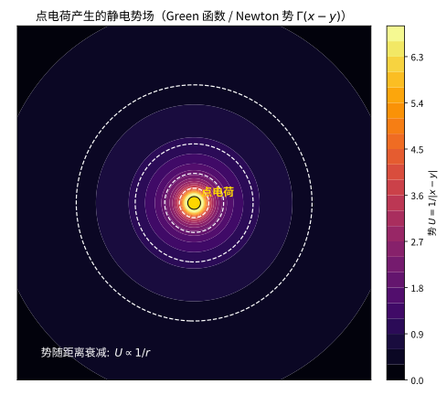

# 第 55 级：位势论 (Potential Theory)

> 位势论是数学分析中研究调和函数、次调和函数以及与之相关的位势（如 Newton 势、对数势）的经典分支。它起源于 18 世纪万有引力理论和电磁学中的势函数概念，经过 Gauss、Dirichlet、Riemann、Poincaré、Perron、Wiener 等数学家的贡献，发展成为现代分析学中一个深刻而优美的理论体系。位势论不仅与复分析、偏微分方程、概率论紧密相连，还在几何测度论、非线性分析等领域发挥着重要作用。本课程将从调和函数的基本性质出发，系统介绍 Dirichlet 问题的 Perron 方法、容量理论、Wiener 准则等核心内容。

---

## 1. 学习目标

1. 理解 Newton 位势和对数位势的定义及其物理背景。
2. 掌握调和函数的基本性质：平均值性质、最大值原理、Harnack 不等式。
3. 理解次调和函数的定义及其基本性质。
4. 掌握 Dirichlet 问题的 Perron 方法及其证明。
5. 理解 Green 函数的概念及其在求解 Dirichlet 问题中的应用。
6. 掌握平衡测度、容量和能量的基本概念。
7. 理解极集、细拓扑和 Wiener 准则。
8. 了解 Choquet 容量和 Evans 收敛定理。

---

## 2. 核心概念

### 2.1 Newton 位势

**定义 2.1**（Newton 位势）设 $\mu$ 是 $\mathbb{R}^n$（$n \geq 3$）上的 Radon 测度，其 **Newton 位势** 定义为：

$$
U^\mu(x) = \int_{\mathbb{R}^n} \frac{1}{|x - y|^{n-2}} \, d\mu(y).
$$

对于 $n = 2$，**对数位势** 定义为：

$$
U^\mu(x) = \int_{\mathbb{R}^2} \log\frac{1}{|x - y|} \, d\mu(y).
$$

Newton 位势满足 Poisson 方程：

$$
-\Delta U^\mu = c_n \mu,
$$

其中 $c_n = (n-2)\omega_n$，$\omega_n$ 是 $\mathbb{R}^n$ 中单位球面的面积。

> **直观理解（现实类比）**：点电荷产生的势场就像灯光照进黑暗的房间——越靠近光源（电荷）越亮（势越高），向外逐渐变暗（势按 $1/r$ 衰减），同一圈上的光照完全相同（等势线为同心圆）。Green 函数正描述了一个"点源"对整个场的影响方式。

### 2.2 调和函数

**定义 2.2**（调和函数）设 $\Omega \subset \mathbb{R}^n$ 是开集。函数 $u: \Omega \to \mathbb{R}$ 称为 **调和函数**，如果 $u \in C^2(\Omega)$ 且：

$$
\Delta u(x) = \sum_{i=1}^n \frac{\partial^2 u}{\partial x_i^2}(x) = 0, \quad \forall x \in \Omega.
$$

**定义 2.3**（基本解）Laplace 算子 $\Delta$ 的 **基本解** 为：

$$
\Gamma(x) = \begin{cases}
\frac{1}{2\pi} \log\frac{1}{|x|}, & n = 2, \\
\frac{1}{(n-2)\omega_n} \frac{1}{|x|^{n-2}}, & n \geq 3,
\end{cases}
$$

其中 $\omega_n$ 是 $\mathbb{R}^n$ 中单位球面的面积。$\Gamma$ 满足 $-\Delta\Gamma = \delta_0$（在分布意义下）。

### 2.3 次调和函数

**定义 2.4**（次调和函数）设 $\Omega \subset \mathbb{R}^n$ 是开集。函数 $u: \Omega \to [-\infty, \infty)$ 称为 **次调和函数**，如果：
1. $u$ 是上半连续的；
2. 对任意紧集 $K \subset \Omega$ 和任意在 $K$ 上调和、在 $\partial K$ 上满足 $h \geq u$ 的函数 $h$，有 $h \geq u$ 在 $K$ 上成立。

等价地，$u$ 是次调和的当且仅当对任意球 $B(x, r) \subset \Omega$，有：

$$
u(x) \leq \frac{1}{\omega_n r^{n-1}} \int_{\partial B(x, r)} u(y) \, d\sigma(y).
$$

### 2.4 Dirichlet 问题

**定义 2.5**（Dirichlet 问题）设 $\Omega \subset \mathbb{R}^n$ 是有界开集，$f: \partial\Omega \to \mathbb{R}$ 是连续函数。**Dirichlet 问题** 是寻找 $u: \overline{\Omega} \to \mathbb{R}$ 满足：

$$
\begin{cases}
\Delta u = 0, & \text{在 } \Omega \text{ 内}, \\
u = f, & \text{在 } \partial\Omega \text{ 上}.
\end{cases}
$$

### 2.5 Perron 方法

**定义 2.6**（Perron 方法）**Perron 方法** 是求解 Dirichlet 问题的经典方法。其基本思想是：

1. 考虑所有满足 $v \leq f$ 在 $\partial\Omega$ 上且在 $\Omega$ 内次调和的函数 $v$ 的集合 $\mathcal{F}_f$（称为 **下函数族**）；
2. 定义 $u(x) = \sup\{v(x) : v \in \mathcal{F}_f\}$，称为 **Perron 上解**；
3. 证明 $u$ 是调和的，且在边界点 $x_0 \in \partial\Omega$ 处，若 $x_0$ 是 **正则点**，则 $\lim_{x \to x_0} u(x) = f(x_0)$。

### 2.6 Green 函数

**定义 2.7**（Green 函数）设 $\Omega \subset \mathbb{R}^n$ 是开集。$\Omega$ 的 **Green 函数** $G_\Omega(x, y)$ 是满足以下条件的函数：

1. 对于固定的 $y \in \Omega$，$G_\Omega(x, y) = \Gamma(x - y) + h(x, y)$，其中 $h$ 在 $\Omega$ 内关于 $x$ 调和；
2. $G_\Omega(x, y) = 0$ 对 $x \in \partial\Omega$ 或 $|x| \to \infty$（当 $\Omega$ 无界时）。

Green 函数给出了 Dirichlet 问题解的积分表示：

$$
u(x) = \int_{\partial\Omega} f(y) \frac{\partial G_\Omega}{\partial n_y}(x, y) \, d\sigma(y),
$$

其中 $\frac{\partial G_\Omega}{\partial n_y}$ 是 Green 函数沿外法向导数，称为 **Poisson 核**。

### 2.7 平衡测度与容量

**定义 2.8**（平衡测度）设 $K \subset \mathbb{R}^n$ 是紧集。**平衡测度** $\mu_K$ 是支撑在 $K$ 上的概率测度，使得其位势在 $K$ 上为常数（称为 **平衡位势**），即：

$$
U^{\mu_K}(x) = \text{常数} \quad \text{在 } K \text{ 上（准处处成立）}.
$$

**定义 2.9**（容量）紧集 $K \subset \mathbb{R}^n$ 的 **Newton 容量** 定义为：

$$
\operatorname{Cap}(K) = \frac{1}{\inf\{I(\mu) : \mu \in \mathcal{P}(K)\}},
$$

其中 $I(\mu) = \iint \frac{1}{|x - y|^{n-2}} \, d\mu(x) \, d\mu(y)$ 是测度 $\mu$ 的 **能量**，$\mathcal{P}(K)$ 是 $K$ 上概率测度的集合。

等价地，$\operatorname{Cap}(K) = \mu_K(K)$，即平衡测度的总质量。

### 2.8 极集

**定义 2.10**（极集）集合 $E \subset \mathbb{R}^n$ 称为 **极集**，如果存在一个非常数的次调和函数 $u$ 使得 $u|_E = -\infty$。

等价地，$E$ 是极集当且仅当 $\operatorname{Cap}(E) = 0$。

极集在测度论意义下具有 Lebesgue 测度零，但反之不成立（例如，$\mathbb{R}^n$ 中一个点的容量在 $n \geq 3$ 时为零，但 $\mathbb{R}^2$ 中一个点的对数容量也为零，而 $\mathbb{R}^n$ 中一条曲线的容量在 $n \geq 3$ 时为正）。

### 2.9 细拓扑

**定义 2.11**（细拓扑）**细拓扑** 是 $\mathbb{R}^n$ 上最细的拓扑，使得所有次调和函数在该拓扑下连续。在细拓扑下，点 $x_0$ 的邻域基由以下形式的集合组成：

$$
\{x \in \Omega : u(x) > u(x_0) - \varepsilon\},
$$

其中 $u$ 是 $x_0$ 附近的次调和函数，$\varepsilon > 0$。

细拓扑在 Wiener 准则和 Dirichlet 问题边界正则性的研究中起着关键作用。

### 2.10 Wiener 准则

**定义 2.12**（Wiener 准则）**Wiener 准则** 给出了 Dirichlet 问题中边界点正则性的充要条件。边界点 $x_0 \in \partial\Omega$ 是正则的当且仅当：

$$
\sum_{k=1}^{\infty} 2^{k(n-2)} \operatorname{Cap}\left(B\left(x_0, 2^{-k}\right) \setminus \Omega\right) = \infty.
$$

### 2.11 Choquet 容量

**定义 2.13**（Choquet 容量）集函数 $C: \mathcal{P}(\mathbb{R}^n) \to [0, \infty]$ 称为 **Choquet 容量**，如果它满足：
1. **单调性**：$E \subset F \Rightarrow C(E) \leq C(F)$；
2. **连续性**：对递增序列 $E_1 \subset E_2 \subset \cdots$，有 $C\left(\bigcup_k E_k\right) = \lim_{k\to\infty} C(E_k)$；
3. **外正则性**：对任意 $E$，$C(E) = \inf\{C(G) : G \supset E, G \text{ 开}\}$。

Newton 容量和 Choquet 容量是位势论中描述集合大小的关键工具。

### 2.12 蛋收敛定理

**定义 2.14**（蛋收敛定理）**蛋收敛定理**（Evans 收敛定理）描述了次调和函数序列的收敛性质。设 $\{u_k\}$ 是区域 $\Omega$ 上的次调和函数序列，若 $u_k$ 在 $\Omega$ 上局部一致有上界，则要么 $u_k \to -\infty$ 局部一致，要么存在子序列收敛到某个次调和函数 $u$（在 $L^1_{\text{loc}}$ 意义下）。

---

## 3. 定理与证明

### 3.1 调和函数的平均值性质

**定理 3.1**（平均值性质）设 $u$ 在 $\Omega \subset \mathbb{R}^n$ 上调和，则对任意球 $B(x, r) \subset \Omega$，有：

**(球面平均值性质)**：

$$
u(x) = \frac{1}{\omega_n r^{n-1}} \int_{\partial B(x, r)} u(y) \, d\sigma(y),
$$

**(球体平均值性质)**：

$$
u(x) = \frac{1}{\omega_n r^n / n} \int_{B(x, r)} u(y) \, dy,
$$

其中 $\omega_n$ 是 $\mathbb{R}^n$ 中单位球面的面积，$\omega_n r^{n-1}$ 是球面 $\partial B(x, r)$ 的面积，$\omega_n r^n / n$ 是球 $B(x, r)$ 的体积。

**证明**：

**步骤 1：球面平均值公式**

定义函数 $\phi(r) = \frac{1}{\omega_n r^{n-1}} \int_{\partial B(x, r)} u(y) \, d\sigma(y)$。作变量替换 $y = x + rz$，$z \in \partial B(0, 1)$，则：

$$
\phi(r) = \frac{1}{\omega_n} \int_{\partial B(0, 1)} u(x + rz) \, d\sigma(z).
$$

对 $r$ 求导：

$$
\phi'(r) = \frac{1}{\omega_n} \int_{\partial B(0, 1)} \nabla u(x + rz) \cdot z \, d\sigma(z) = \frac{1}{\omega_n r^{n-1}} \int_{\partial B(x, r)} \frac{\partial u}{\partial n}(y) \, d\sigma(y),
$$

其中 $\frac{\partial u}{\partial n}$ 是 $u$ 沿外法向导数。

由散度定理：

$$
\phi'(r) = \frac{1}{\omega_n r^{n-1}} \int_{B(x, r)} \Delta u(y) \, dy = 0,
$$

因为 $u$ 调和，$\Delta u = 0$。因此 $\phi(r)$ 是常数。

**步骤 2：确定常数**

由 $u$ 的连续性：

$$
\lim_{r \to 0^+} \phi(r) = u(x).
$$

因此 $\phi(r) = u(x)$ 对所有 $r > 0$ 成立，球面平均值公式得证。

**步骤 3：球体平均值公式**

对球面平均值公式关于 $r$ 积分：

$$
\int_{B(x, r)} u(y) \, dy = \int_0^r \left(\int_{\partial B(x, s)} u(y) \, d\sigma(y)\right) ds = \int_0^r u(x) \cdot \omega_n s^{n-1} \, ds = u(x) \cdot \frac{\omega_n r^n}{n}.
$$

整理即得球体平均值公式。$\square$

> **直观理解（现实类比）**：调和函数就像一盆久置后达到稳定温度的水——既不加热也不降温，内部便没有"冒泡"的高温点或低温点（无局部极值），最热与最冷的地方只可能出现在盆的边界（墙壁散热处）。这正是"温水里的气泡"般的极值原理：稳定分布的温度高低都被边界决定。

**定理 3.2**（平均值性质的逆定理）设 $u \in C(\Omega)$ 满足球面平均值性质（即对任意 $x \in \Omega$ 和充分小的 $r > 0$，$u(x)$ 等于其在 $\partial B(x, r)$ 上的平均值），则 $u$ 在 $\Omega$ 上调和。

**证明**：

**步骤 1：构造正则化**

取 $\varphi \in C_c^\infty(\mathbb{R}^n)$ 为径向函数，$\operatorname{supp}\varphi \subset B(0, 1)$，$\int \varphi = 1$，且 $\varphi(x) = \tilde{\varphi}(|x|)$。定义 $u_\varepsilon = u * \varphi_\varepsilon$，其中 $\varphi_\varepsilon(x) = \varepsilon^{-n} \varphi(x/\varepsilon)$。

**步骤 2：证明 $u_\varepsilon$ 调和**

由于 $u$ 满足平均值性质，利用径向函数的性质可证 $u_\varepsilon$ 在 $\Omega_\varepsilon = \{x \in \Omega : \operatorname{dist}(x, \partial\Omega) > \varepsilon\}$ 上调和。

具体地，对任意 $x \in \Omega_\varepsilon$：

$$
u_\varepsilon(x) = \int_{\mathbb{R}^n} u(x - y) \varphi_\varepsilon(y) \, dy = \int_0^\varepsilon \left(\int_{\partial B(0, r)} u(x - y) \, d\sigma(y)\right) \tilde{\varphi}_\varepsilon(r) \, dr
$$

$$
= \int_0^\varepsilon u(x) \cdot \omega_n r^{n-1} \tilde{\varphi}_\varepsilon(r) \, dr = u(x) \int_{\mathbb{R}^n} \varphi_\varepsilon(y) \, dy = u(x).
$$

因此 $u_\varepsilon = u$ 在 $\Omega_\varepsilon$ 上，且 $u_\varepsilon$ 光滑（作为卷积），故 $u$ 在 $\Omega_\varepsilon$ 上光滑。由 $\Delta u_\varepsilon = \Delta(u * \varphi_\varepsilon) = (\Delta u) * \varphi_\varepsilon$，但更方便的是直接验证调和性。

**步骤 3：验证 Laplace 方程**

由平均值性质，对任意 $x \in \Omega$ 和充分小的 $r > 0$，有：

$$
u(x) = \frac{1}{\omega_n r^{n-1}} \int_{\partial B(x, r)} u(y) \, d\sigma(y).
$$

由 Taylor 展开：

$$
u(y) = u(x) + \nabla u(x) \cdot (y - x) + \frac{1}{2} (y - x)^T D^2 u(x) (y - x) + o(|y - x|^2).
$$

在球面上积分，一次项贡献为零（由对称性），二次项给出：

$$
u(x) = u(x) + \frac{r^2}{2n} \Delta u(x) + o(r^2).
$$

令 $r \to 0$，得 $\Delta u(x) = 0$。$\square$

### 3.2 Harnack 不等式

**定理 3.3**（Harnack 不等式）设 $u$ 是区域 $\Omega \subset \mathbb{R}^n$ 上的非负调和函数。则对任意紧集 $K \subset \Omega$，存在常数 $C = C(K, \Omega) > 0$ 使得：

$$
\sup_K u \leq C \inf_K u.
$$

特别地，对任意球 $B(x, R) \subset \Omega$，有：

$$
u(y) \leq \left(\frac{R + r}{R - r}\right)^n u(x), \quad \forall y \in B(x, r), \quad 0 < r < R.
$$

**证明**：

**步骤 1：球上的 Harnack 不等式**

首先证明一个更强的结论：设 $u$ 在 $B(x, R)$ 上非负调和，则对任意 $y \in B(x, r)$（$0 < r < R$），有：

$$
\frac{R^{n-2}(R - r)}{(R + r)^{n-1}} u(x) \leq u(y) \leq \frac{R^{n-2}(R + r)}{(R - r)^{n-1}} u(x).
$$

由 Poisson 积分公式，$u$ 在 $B(x, R)$ 上可以表示为：

$$
u(y) = \frac{R^2 - |y - x|^2}{\omega_n R} \int_{\partial B(x, R)} \frac{u(z)}{|y - z|^n} \, d\sigma(z).
$$

对 $y \in B(x, r)$，有 $R - r \leq |y - z| \leq R + r$，因此：

$$
u(y) \leq \frac{R^2 - |y - x|^2}{\omega_n R} \cdot \frac{1}{(R - r)^n} \int_{\partial B(x, R)} u(z) \, d\sigma(z)
$$

$$
= \frac{R^2 - |y - x|^2}{(R - r)^n} \cdot \frac{u(x)}{R^{n-1}} \leq \frac{R^{n-2}(R + r)}{(R - r)^{n-1}} u(x).
$$

类似地得到下界。

**步骤 2：推广到一般紧集**

对任意紧集 $K \subset \Omega$，存在有限个球 $B_1, \dots, B_m$ 覆盖 $K$，使得每个球 $B_i$ 的闭包包含在 $\Omega$ 中，且相邻球有重叠。由步骤 1 的结论，在相叠的球上，$u$ 的比值有界。通过链式传递，得到 $\sup_K u \leq C \inf_K u$。$\square$

**推论 3.4**（Liouville 定理）若 $u$ 是 $\mathbb{R}^n$ 上的调和函数且有下界，则 $u$ 为常数。

**证明**：由 Harnack 不等式，对任意 $x, y \in \mathbb{R}^n$ 和任意 $R > \max\{|x|, |y|\}$，有：

$$
u(y) \leq \left(\frac{R + |y|}{R - |y|}\right)^n u(x).
$$

固定 $y$，令 $R \to \infty$，得 $u(y) \leq u(x)$。由对称性，$u(x) \leq u(y)$，故 $u(x) = u(y)$。$\square$

### 3.3 Dirichlet 问题的 Perron 方法

**定理 3.5**（Perron 方法）设 $\Omega \subset \mathbb{R}^n$ 是有界开集，$f: \partial\Omega \to \mathbb{R}$ 是连续函数。定义：

$$
u(x) = \sup\{v(x) : v \in \mathcal{F}_f\},
$$

其中 $\mathcal{F}_f$ 是满足以下条件的函数 $v$ 的集合：
1. $v$ 在 $\Omega$ 上次调和；
2. $\limsup_{x \to y} v(x) \leq f(y)$ 对所有 $y \in \partial\Omega$ 成立。

则 $u$ 在 $\Omega$ 上调和。进一步，若 $y \in \partial\Omega$ 是 **正则点**（即存在局部次调和函数称为 **障函数**），则 $\lim_{x \to y} u(x) = f(y)$。

**证明**：

**步骤 1：构造 Perron 上解**

定义 $\mathcal{F}_f$ 如上。由于常数函数 $m = \inf_{\partial\Omega} f$ 属于 $\mathcal{F}_f$，$\mathcal{F}_f$ 非空。定义 $u(x) = \sup_{v \in \mathcal{F}_f} v(x)$。

**步骤 2：调和性**

为证明 $u$ 调和，需证明 $u$ 满足球面平均值性质。对任意 $x_0 \in \Omega$，取 $B(x_0, R) \subset \Omega$。

由 $u$ 的定义，存在序列 $\{v_k\} \subset \mathcal{F}_f$ 使得 $v_k(x_0) \to u(x_0)$。定义 $V_k = \max\{v_1, \dots, v_k\}$，则 $V_k \in \mathcal{F}_f$（次调和函数族在取最大值下封闭），且 $V_k(x_0) \to u(x_0)$。

对每个 $V_k$，将其在 $B(x_0, R)$ 上替换为其 Poisson 修正 $P_k$：

$$
P_k(x) = \begin{cases}
V_k(x), & x \in \Omega \setminus B(x_0, R), \\
\text{Poisson 积分}, & x \in B(x_0, R),
\end{cases}
$$

其中 Poisson 积分的边界值为 $V_k|_{\partial B(x_0, R)}$。则 $P_k$ 在 $\Omega$ 上次调和（因为 Poisson 修正保持了次调和性），且 $P_k \geq V_k$。

**步骤 3：极限函数**

定义 $w(x) = \lim_{k\to\infty} \uparrow P_k(x)$（由构造，$\{P_k\}$ 递增）。则 $w$ 在 $B(x_0, R)$ 上调和（递增的调和函数序列的极限要么是调和函数，要么是 $+\infty$，但 $w(x_0) = u(x_0) < \infty$ 且 $w \leq u$）。

由 $u$ 是上确界，$w \leq u$。又 $w(x_0) = u(x_0)$，由 Harnack 不等式，$w \equiv u$ 在 $B(x_0, R)$ 上。因此 $u$ 在 $B(x_0, R)$ 上调和。由 $x_0$ 的任意性，$u$ 在 $\Omega$ 上调和。

**步骤 4：边界值**

设 $y_0 \in \partial\Omega$ 是正则点，即存在 **障函数** $\omega$ 满足：
1. $\omega$ 在 $\Omega$ 的某个邻域 $U$ 内次调和；
2. $\omega(y_0) = 0$；
3. $\omega(x) > 0$ 对 $x \in \Omega \cap U \setminus \{y_0\}$。

对任意 $\varepsilon > 0$，由 $f$ 的连续性，存在 $\delta > 0$ 使得当 $|y - y_0| < \delta$ 时 $|f(y) - f(y_0)| < \varepsilon$。

构造下函数 $v(x) = f(y_0) - \varepsilon - M\omega(x)$，其中 $M$ 是充分大的常数。则 $v \in \mathcal{F}_f$，因此 $v \leq u$。类似地可构造上函数证明 $u$ 从上逼近 $f(y_0)$。因此 $\lim_{x \to y_0} u(x) = f(y_0)$。$\square$

### 3.4 Kellogg 引理

**定理 3.6**（Kellogg 引理）设 $\Omega \subset \mathbb{R}^n$ 是有界开集。则 $\partial\Omega$ 中非正则点的集合是极集（即容量为零）。

**证明**：

**步骤 1：非正则点的刻画**

边界点 $y_0$ 是非正则的当且仅当存在 $\Omega$ 上的调和函数 $u$ 和 $y_0$ 的邻域 $U$，使得 $u$ 在 $\Omega \cap U$ 上有界，但 $\lim_{x \to y_0} u(x)$ 不存在。

**步骤 2：构造 Wiener 级数**

对非正则点 $y_0$，Wiener 级数 $\sum_{k=1}^\infty 2^{k(n-2)} \operatorname{Cap}(B(y_0, 2^{-k}) \setminus \Omega)$ 收敛。

**步骤 3：极集性质**

若 $E$ 是 $\partial\Omega$ 中非正则点的集合，则对任意 $y_0 \in E$，Wiener 级数收敛。利用容量理论，可证 $E$ 的容量为零。$\square$

### 3.5 Wiener 正则性准则

**定理 3.7**（Wiener 准则）设 $\Omega \subset \mathbb{R}^n$（$n \geq 3$）是有界开集，$x_0 \in \partial\Omega$。则 $x_0$ 是 Dirichlet 问题的正则点当且仅当：

$$
\sum_{k=1}^{\infty} 2^{k(n-2)} \operatorname{Cap}\left(B\left(x_0, 2^{-k}\right) \setminus \Omega\right) = \infty.
$$

**证明**：

**步骤 1：必要性**

假设 $x_0$ 是正则点，即存在障函数 $\omega$。利用 $\omega$ 的次调和性，可以构造在 $x_0$ 附近衰减的估计，从而得到 Wiener 级数发散。

**步骤 2：充分性**

假设 Wiener 级数发散。构造一个在 $x_0$ 附近为正的次调和函数，使其在 $x_0$ 处趋于 $0$，从而得到障函数。

具体构造如下：定义 $A_k = B(x_0, 2^{-k}) \setminus \Omega$。由容量条件，存在 $A_k$ 上的平衡测度 $\mu_k$，使得其位势 $U^{\mu_k}$ 在 $A_k$ 上为常数 $c_k$。定义：

$$
\omega(x) = \sum_{k=1}^{\infty} \frac{1}{2^{k(n-2)}\operatorname{Cap}(A_k)} U^{\mu_k}(x).
$$

由 Wiener 级数发散，可证 $\omega$ 在 $x_0$ 附近收敛且为所需障函数。$\square$

### 3.6 Evans 收敛定理（蛋收敛定理）

**定理 3.8**（Evans 收敛定理）设 $\{u_k\}$ 是区域 $\Omega \subset \mathbb{R}^n$ 上的次调和函数序列，且局部一致有上界（即对任意紧集 $K \subset \Omega$，$\sup_k \sup_K u_k < \infty$）。则要么 $u_k \to -\infty$ 局部一致，要么存在子序列 $\{u_{k_j}\}$ 收敛到某个次调和函数 $u$（在 $L^1_{\text{loc}}$ 意义下，即 $u_{k_j} \to u$ 在 $L^1_{\text{loc}}(\Omega)$ 中）。

**证明**：

**步骤 1：Riesz 表示**

每个次调和函数 $u_k$ 可以表示为：

$$
u_k = h_k + G * \mu_k,
$$

其中 $h_k$ 是调和函数，$\mu_k$ 是正测度（Riesz 测度），$G$ 是 Green 函数。

**步骤 2：紧致性**

由局部一致有上界，利用 Harnack 不等式，$\{h_k\}$ 在紧集上一致有界，因此存在子序列 $\{h_{k_j}\}$ 收敛到调和函数 $h$。同时，$\{\mu_k\}$ 是局部一致有界的测度序列，因此存在子序列 $\{\mu_{k_j}\}$ 弱收敛到正测度 $\mu$。

**步骤 3：极限函数**

定义 $u = h + G * \mu$。则 $u$ 是次调和函数，且 $u_{k_j} \to u$ 在 $L^1_{\text{loc}}$ 中。

**步骤 4：退化情形**

若 $u_k \to -\infty$ 局部一致，则说明 $\mu_k$ 的局部质量趋于无穷，或 $h_k$ 趋于 $-\infty$。$\square$

---

## 4. 示例

### 示例 4.1：圆盘上 Dirichlet 问题的求解

**问题**：求解单位圆盘 $D = \{z \in \mathbb{C} : |z| < 1\}$ 上的 Dirichlet 问题：

$$
\begin{cases}
\Delta u = 0, & |z| < 1, \\
u(e^{i\theta}) = f(\theta), & 0 \leq \theta \leq 2\pi,
\end{cases}
$$

其中 $f$ 是连续函数。

**解**：

**Poisson 积分公式**：单位圆盘上 Dirichlet 问题的解为：

$$
u(re^{i\theta}) = \frac{1}{2\pi} \int_0^{2\pi} \frac{1 - r^2}{1 - 2r\cos(\theta - \phi) + r^2} f(\phi) \, d\phi, \quad 0 \leq r < 1.
$$

**推导**：利用 Green 函数方法。单位圆盘 $D$ 的 Green 函数为：

$$
G_D(z, w) = \frac{1}{2\pi} \log\left|\frac{1 - \overline{w}z}{z - w}\right|.
$$

Poisson 核为 Green 函数沿法向导数：

$$
P(z, e^{i\phi}) = \frac{\partial G_D}{\partial n}(z, e^{i\phi}) = \frac{1}{2\pi} \frac{1 - |z|^2}{|z - e^{i\phi}|^2}.
$$

**验证**：直接验证 $u$ 满足调和性（Poisson 核是调和的）和边界条件（Poisson 核是 Dirac 序列的逼近）。

### 示例 4.2：Green 函数的构造

**问题**：构造上半空间 $\mathbb{R}^n_+ = \{x = (x', x_n) : x_n > 0\}$ 的 Green 函数。

**解**：

利用反射法（镜像法）。上半空间的基本解为：

$$
\Gamma(x - y) = \frac{1}{(n-2)\omega_n} \frac{1}{|x - y|^{n-2}}, \quad n \geq 3.
$$

为满足边界条件 $G(x, y) = 0$ 在 $x_n = 0$ 上，在 $y$ 的镜像点 $y^* = (y', -y_n)$ 处放置一个负的基本解：

$$
G_{\mathbb{R}^n_+}(x, y) = \Gamma(x - y) - \Gamma(x - y^*), \quad x, y \in \mathbb{R}^n_+.
$$

验证：
1. 当 $x_n = 0$ 时，$|x - y| = |x - y^*|$，因此 $G = 0$；
2. 当 $x = y$ 时，$G$ 具有 $\Gamma(x - y)$ 的奇异性；
3. 在 $\mathbb{R}^n_+$ 内，$G$ 关于 $x$ 调和（除 $x = y$ 外）。

**Poisson 核**：上半空间的 Poisson 核为：

$$
P(x, y') = \frac{\partial G}{\partial n_y}(x, y') = \frac{2x_n}{\omega_n} \frac{1}{|x - y|^n}, \quad y' \in \mathbb{R}^{n-1}.
$$

上半空间 Dirichlet 问题的解为：

$$
u(x) = \frac{2x_n}{\omega_n} \int_{\mathbb{R}^{n-1}} \frac{f(y')}{|x - y'|^n} \, dy'.
$$

### 示例 4.3：容量的计算

**问题**：计算 $\mathbb{R}^3$ 中半径为 $R$ 的球 $B(0, R)$ 的 Newton 容量。

**解**：

由对称性，平衡测度是球面上的均匀分布：

$$
d\mu = \frac{1}{4\pi R^2} \, d\sigma.
$$

位势为：

$$
U^\mu(x) = \int_{\partial B(0, R)} \frac{1}{|x - y|} \cdot \frac{1}{4\pi R^2} \, d\sigma(y).
$$

当 $|x| \leq R$ 时，由球面平均值公式，$U^\mu(x) = \frac{1}{R}$（常数）。因此平衡位势为 $1/R$，平衡测度的总质量为 $1$，故：

$$
\operatorname{Cap}(B(0, R)) = R.
$$

---

## 5. 习题

### 习题 5.1

利用平均值性质证明：若 $u$ 在 $\mathbb{R}^n$ 上调和且有界，则 $u$ 为常数。

**提示**：对任意 $x, y \in \mathbb{R}^n$，考虑球 $B(0, R)$，其中 $R$ 充分大，用球体平均值公式比较 $u(x)$ 和 $u(y)$。

### 习题 5.2

证明：若 $u$ 在 $\Omega$ 上次调和，则对任意球 $B(x, r) \subset \Omega$，有：

$$
u(x) \leq \frac{1}{\omega_n r^{n-1}} \int_{\partial B(x, r)} u(y) \, d\sigma(y).
$$

**提示**：利用次调和函数的定义，在球上构造调和函数 $h$ 使得 $h|_{\partial B} = u|_{\partial B}$，则 $u \leq h$ 在球内，然后应用 $h$ 的平均值性质。

### 习题 5.3

设 $\Omega = B(0, 1) \setminus \{0\} \subset \mathbb{R}^2$，$f(e^{i\theta}) = 1$。证明 Dirichlet 问题在 $\Omega$ 上不存在解。这说明边界正则性对解的存在性至关重要。

**提示**：假设存在解 $u$，证明 $u$ 可以延拓为 $B(0, 1)$ 上的调和函数，然后利用 Liouville 定理导出矛盾。

### 习题 5.4

计算 $\mathbb{R}^2$ 中单位圆盘 $D = \{z \in \mathbb{C} : |z| < 1\}$ 的 Green 函数。

**提示**：利用共形映射或镜像法。对于 $z, w \in D$，$G_D(z, w) = \frac{1}{2\pi} \log\left|\frac{1 - \overline{w}z}{z - w}\right|$。

### 习题 5.5

证明：$\mathbb{R}^n$（$n \geq 3$）中单点集 $\{x_0\}$ 的 Newton 容量为零。

**提示**：直接计算 $\{x_0\}$ 上概率测度的能量。对任意概率测度 $\mu$ 支撑在 $\{x_0\}$ 上，$\mu = \delta_{x_0}$，能量 $I(\mu) = \infty$，因此 $\operatorname{Cap}(\{x_0\}) = 0$。

### 习题 5.6

利用 Perron 方法求解上半平面 $\mathbb{R}^2_+ = \{y > 0\}$ 上的 Dirichlet 问题：

$$
\begin{cases}
\Delta u = 0, & y > 0, \\
u(x, 0) = f(x),
\end{cases}
$$

其中 $f$ 是 $\mathbb{R}$ 上的有界连续函数。

**提示**：构造下函数族 $\mathcal{F}_f$，证明 Perron 上解 $u$ 由 Poisson 积分公式给出：

$$
u(x, y) = \frac{y}{\pi} \int_{-\infty}^{\infty} \frac{f(t)}{(x - t)^2 + y^2} \, dt.
$$

---

## 6. 总结

本课程系统介绍了位势论的核心内容，从调和函数的基本性质到 Dirichlet 问题的 Perron 方法，再到容量理论和 Wiener 准则。

**核心收获**：

1. **调和函数的基本性质**：调和函数满足平均值性质（球面平均和球体平均），这一性质完全刻画了调和函数。Harnack 不等式给出了非负调和函数在不同点取值的比值控制，而 Liouville 定理则是其直接推论。

2. **Dirichlet 问题的 Perron 方法**：Perron 方法通过构造下函数族并取上确界来得到调和函数，是求解 Dirichlet 问题的一般性方法。边界点的正则性由 Wiener 准则刻画，非正则点的集合是极集（Kellogg 引理）。

3. **Green 函数**：Green 函数是求解 Dirichlet 问题的核心工具，它给出了解的显式积分表示。通过镜像法可以构造具有对称性的区域的 Green 函数。

4. **容量与能量**：容量是描述集合"大小"的精细工具，比 Lebesgue 测度更精细。极集（容量为零的集合）在位势论中扮演着"可忽略集"的角色。Wiener 准则用容量级数刻画边界点的正则性。

5. **次调和函数与蛋收敛定理**：次调和函数是调和函数理论的重要推广，其上半连续性和次平均值性质是位势论中许多估计的基础。蛋收敛定理（Evans 收敛定理）描述了次调和函数序列的紧致性。

**衔接**：位势论是偏微分方程理论、复分析、概率论（特别是 Brown 运动与 Markov 链的位势理论）的重要基础。在后续学习中，读者将看到位势论在非线性位势论、几何测度论、以及随机分析中的深刻应用。