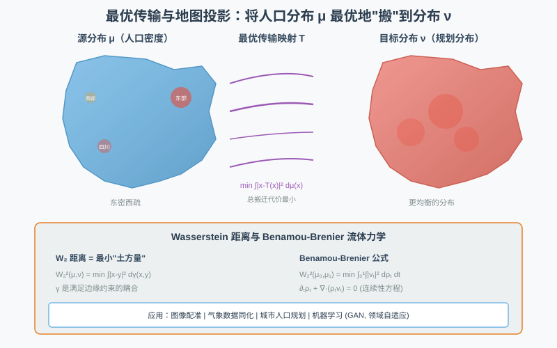
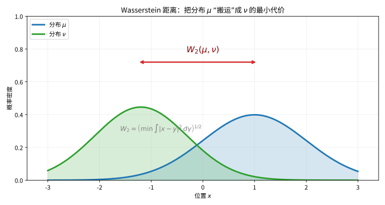

# 第 58 级：最优传输 (Optimal Transport)

> 最优传输理论研究在给定代价下将一种概率分布转换为另一种概率分布的最优方式。这一问题起源于 1781 年 Gaspard Monge 的"搬土问题"，并在 20 世纪由 Kantorovich 发展为线性规划框架。近年来，最优传输已成为数据科学、机器学习、图像处理、流体力学和几何分析等领域的重要工具。本课程将系统建立最优传输的理论基础，涵盖从 Monge 到 Wasserstein 空间的完整图景。

---

## 1. 学习目标

1. 理解 Monge 问题与 Kantorovich 问题的基本形式及其区别。
2. 掌握 Kantorovich 对偶性定理及其证明。
3. 理解 Brenier 定理的条件与结论，掌握最优传输映射的存在唯一性。
4. 掌握 Benamou-Brenier 动力学公式及其与 Wasserstein 度量之间的关系。
5. 理解 Wasserstein 空间的基本几何性质（测地线、凸性）。
6. 了解熵正则化与 Sinkhorn 算法在计算最优传输中的应用。
7. 掌握一维最优传输的显式公式以及高斯分布之间的 Wasserstein 距离。

---

## 2. 核心概念

### 2.1 Monge 问题

**定义 2.1**（Monge 问题）设 $X, Y \subseteq \mathbb{R}^n$ 是概率空间，$\mu \in \mathcal{P}(X)$，$\nu \in \mathcal{P}(Y)$ 是两个概率测度，$c: X \times Y \to \mathbb{R} \cup \{+\infty\}$ 是代价函数。Monge 问题为：
$$
\text{求可测映射 } T: X \to Y \text{ 满足 } T_\# \mu = \nu \text{，使得 } \int_X c(x, T(x)) \, d\mu(x) \text{ 最小化}.
$$
这里 $T_\# \mu$ 表示 $\mu$ 在 $T$ 下的推前测度（pushforward）：$(T_\# \mu)(A) = \mu(T^{-1}(A))$ 对任意 Borel 集 $A \subseteq Y$。

Monge 问题的难点在于：允许的映射 $T$ 必须满足非平凡的约束 $T_\# \mu = \nu$，且可行映射集可能为空集（例如 $\mu$ 是 Dirac 测度而 $\nu$ 不是时）。

### 2.2 Kantorovich 问题

**定义 2.2**（Kantorovich 问题）Kantorovich 将 Monge 问题松弛为运输计划（transport plan）的优化问题：
$$
\text{求 } \gamma \in \Pi(\mu, \nu) \text{ 使得 } \int_{X \times Y} c(x, y) \, d\gamma(x, y) \text{ 最小化},
$$
其中 $\Pi(\mu, \nu) = \{\gamma \in \mathcal{P}(X \times Y) \mid \pi_X^\# \gamma = \mu, \pi_Y^\# \gamma = \nu\}$ 是耦合（coupling）的集合，$\pi_X, \pi_Y$ 分别是到 $X$ 和 $Y$ 的投影。

Kantorovich 问题的优点是：$\Pi(\mu, \nu)$ 总是非空（包含乘积测度 $\mu \otimes \nu$），且是线性规划问题（目标函数是 $\gamma$ 的线性泛函，约束是线性的），因此具有良好的对偶理论。

直观上，最优传输问题好比"把一堆沙搬到另一堆"，在质量不丢失的前提下安排最优搬运方案，使总搬运成本最小：

> **直观理解（现实类比）**：就像把工地上的一堆沙子搬到另一处指定位置，要规划每铲沙的搬运路线，使所有人走的总路程最短。这里的"沙堆高低"代表概率质量，"搬运箭头"就是传输映射，目标是在不丢失任何沙子的前提下让总搬运成本最小。

### 2.3 Wasserstein 距离

**定义 2.3**（Wasserstein-$p$ 距离）设 $p \in [1, \infty)$，$\mu, \nu \in \mathcal{P}_p(\mathbb{R}^n)$（即具有有限 $p$ 阶矩的概率测度）。**Wasserstein-$p$ 距离** 定义为
$$
W_p(\mu, \nu) = \left( \inf_{\gamma \in \Pi(\mu, \nu)} \int_{\mathbb{R}^n \times \mathbb{R}^n} |x - y|^p \, d\gamma(x, y) \right)^{1/p}.
$$
特别地，$W_2$ 称为 **Wasserstein-$2$ 距离**，是最常用的版本。

> **直观理解（现实类比）**：最优传输就像**人口迁移规划**——假设中国的人口分布是 $\mu$（东部密集、西部稀疏），美国的人口分布是 $\nu$（沿海密集、中部稀疏）。如果要"把中国人搬到美国"，使搬运总成本（人口×距离）最小，最优传输映射 $T$ 告诉你每个中国人应该搬到美国哪里。Wasserstein 距离 $W_2(\mu,\nu)$ 则度量"这两个国家的人口分布差异有多大"——不是简单比较密度，而是计算"最少需要搬多远"。

**性质 2.4** $W_p$ 是 $\mathcal{P}_p(\mathbb{R}^n)$ 上的度量，满足对称性、三角不等式，且 $W_p(\mu, \nu) = 0$ 当且仅当 $\mu = \nu$。

$W_2$ 距离度量的是"把分布 $\mu$ 整体搬成分布 $\nu$ 需要搬多远"，是对两个概率分布之间差异的一种"土方"度量：

> **直观理解（现实类比）**：Wasserstein 距离衡量"把一座概率山 $\mu$ 整体搬成另一座概率山 $\nu$ 需要搬多远"。它不像逐点比较高度差那样只看局部，而是累计"土方量×搬运距离"的总工作量，因此在地震损毁评估中，用它衡量"把一片人口分布搬成另一片分布"的位移成本非常自然。

### 2.4 Kantorovich 对偶性

**定义 2.5**（Kantorovich 对偶问题）Kantorovich 问题的对偶问题为：
$$
\sup_{(\varphi, \psi) \in \Phi_c} \left( \int_X \varphi(x) \, d\mu(x) + \int_Y \psi(y) \, d\nu(y) \right),
$$
其中 $\Phi_c = \{(\varphi, \psi) \in L^1(\mu) \times L^1(\nu) \mid \varphi(x) + \psi(y) \le c(x, y), \forall (x, y) \in X \times Y\}$。

### 2.5 Monge-Ampère 方程

**定义 2.6**（Monge-Ampère 方程）当代价为欧氏距离平方 $c(x, y) = |x - y|^2/2$ 时，最优传输映射 $T = \nabla \phi$ 是一个凸函数 $\phi$ 的梯度，且 $\phi$ 满足 **Monge-Ampère 方程**：
$$
\det(D^2 \phi(x)) = \frac{\rho_\mu(x)}{\rho_\nu(\nabla \phi(x))},
$$
其中 $\rho_\mu$ 和 $\rho_\nu$ 分别是 $\mu$ 和 $\nu$ 的密度（假设绝对连续）。

### 2.6 Benamou-Brenier 公式

**定义 2.7**（Benamou-Brenier 动力学公式）Wasserstein-$2$ 距离可以表示为流体力学形式：
$$
W_2^2(\mu_0, \mu_1) = \inf_{(\rho, v)} \left\{ \int_0^1 \int_{\mathbb{R}^n} |v_t(x)|^2 \, d\rho_t(x) \, dt \right\},
$$
其中 $\rho_t$ 是概率密度（$\rho_0 = \mu_0$, $\rho_1 = \mu_1$），$v_t$ 是速度场，满足连续性方程 $\partial_t \rho_t + \nabla \cdot (\rho_t v_t) = 0$。

### 2.7 熵正则化与 Sinkhorn 算法

**定义 2.8**（熵正则化 Kantorovich 问题）加入熵正则化项后，Kantorovich 问题变为：
$$
\inf_{\gamma \in \Pi(\mu, \nu)} \left\{ \int c(x, y) \, d\gamma(x, y) + \varepsilon \operatorname{KL}(\gamma \| \mu \otimes \nu) \right\},
$$
其中 $\operatorname{KL}(\gamma \| \mu \otimes \nu) = \int \log \frac{d\gamma}{d(\mu \otimes \nu)} \, d\gamma$ 是 Kullback-Leibler 散度，$\varepsilon > 0$ 是正则化参数。

**Sinkhorn 算法**：正则化问题可通过 Sinkhorn 的矩阵缩放算法高效求解，迭代格式为
$$
a^{(k+1)} = \frac{\mu}{K b^{(k)}}, \quad b^{(k+1)} = \frac{\nu}{K^T a^{(k+1)}},
$$
其中 $K_{ij} = e^{-c(x_i, y_j)/\varepsilon}$。

---

## 3. 定理与证明

### 3.1 Kantorovich 对偶性定理

**定理 3.1**（Kantorovich 对偶性）设 $X, Y$ 是 Polish 空间（完备可分度量空间），$c: X \times Y \to \mathbb{R}$ 是下半连续且下有界的代价函数，$\mu \in \mathcal{P}(X)$，$\nu \in \mathcal{P}(Y)$。则
$$
\min_{\gamma \in \Pi(\mu, \nu)} \int_{X \times Y} c(x, y) \, d\gamma(x, y) = \sup_{(\varphi, \psi) \in \Phi_c} \left( \int_X \varphi(x) \, d\mu(x) + \int_Y \psi(y) \, d\nu(y) \right),
$$
其中 $\Phi_c = \{(\varphi, \psi) \in L^1(\mu) \times L^1(\nu) \mid \varphi(x) + \psi(y) \le c(x, y), \forall (x, y)\}$。若代价函数 $c$ 有界且连续，则上确界可达。

**证明**：证明使用 Fenchel-Rockafellar 对偶定理。

**第一步：问题重述。** 将 Kantorovich 问题视为线性规划问题。定义线性泛函
$$
\mathcal{L}(\gamma) = \int c \, d\gamma,
$$
约束为 $\gamma \in \Pi(\mu, \nu)$，即 $\gamma$ 的边缘分布分别为 $\mu$ 和 $\nu$。

**第二步：约束的 Lagrange 乘子表示。** 引入 Lagrange 乘子 $\varphi: X \to \mathbb{R}$ 和 $\psi: Y \to \mathbb{R}$，构造 Lagrange 函数
$$
L(\gamma, \varphi, \psi) = \int c \, d\gamma + \int \varphi(x) \, d\mu(x) - \int \varphi(x) \, d\gamma(x, y) + \int \psi(y) \, d\nu(y) - \int \psi(y) \, d\gamma(x, y).
$$
整理得
$$
L(\gamma, \varphi, \psi) = \int (c(x, y) - \varphi(x) - \psi(y)) \, d\gamma(x, y) + \int \varphi(x) \, d\mu(x) + \int \psi(y) \, d\nu(y).
$$

**第三步：鞍点问题。** 原始问题等价于
$$
\min_\gamma \max_{\varphi, \psi} L(\gamma, \varphi, \psi).
$$
交换 min 和 max（由凸分析中的 Min-Max 定理保证，因为 $\gamma$ 的约束集是凸紧的，且 $L$ 对 $\gamma$ 是线性/凸的，对 $(\varphi, \psi)$ 是凹的），得到对偶问题
$$
\max_{\varphi, \psi} \min_\gamma L(\gamma, \varphi, \psi).
$$

**第四步：内部最小化。** 对固定的 $(\varphi, \psi)$，关于 $\gamma$ 的最小化：
$$
\min_\gamma \int (c(x, y) - \varphi(x) - \psi(y)) \, d\gamma(x, y) + \int \varphi \, d\mu + \int \psi \, d\nu.
$$
若存在 $(x, y)$ 使得 $c(x, y) - \varphi(x) - \psi(y) < 0$，则可通过集中 $\gamma$ 于该点使目标趋于 $-\infty$。因此最小值有限当且仅当 $c(x, y) - \varphi(x) - \psi(y) \ge 0$ 对所有 $(x, y)$ 成立，即 $\varphi(x) + \psi(y) \le c(x, y)$。此时最小值在 $\gamma$ 集中支持于 $c - \varphi - \psi = 0$ 的集合上达到，且最小值为 $\int \varphi \, d\mu + \int \psi \, d\nu$。

**第五步：对偶问题。** 因此对偶问题为
$$
\sup_{(\varphi, \psi): \varphi(x) + \psi(y) \le c(x, y)} \left( \int \varphi \, d\mu + \int \psi \, d\nu \right).
$$
由线性规划强对偶定理（在适当条件下），原始问题与对偶问题的最优值相等。$\square$

### 3.2 Brenier 定理

**定理 3.2**（Brenier 定理）设 $\mu, \nu \in \mathcal{P}_2(\mathbb{R}^n)$，且 $\mu$ 关于 Lebesgue 测度绝对连续。则对代价函数 $c(x, y) = |x - y|^2/2$，Kantorovich 问题的最优解 $\gamma$ 是唯一的，并由某个映射 $T: \mathbb{R}^n \to \mathbb{R}^n$ 的图（graph）支撑：$\gamma = (\operatorname{id} \times T)_\# \mu$。此外，存在凸函数 $\phi: \mathbb{R}^n \to \mathbb{R}$ 使得 $T = \nabla \phi$，且 $\phi$ 是 Monge-Ampère 方程的解。

**证明**：证明分五步进行。

**第一步：对偶问题与 $c$-变换。** 对 $c(x, y) = |x - y|^2/2$，定义 $\varphi$ 的 $c$-变换为
$$
\varphi^c(y) = \inf_{x \in \mathbb{R}^n} (c(x, y) - \varphi(x)) = \inf_{x} \left( \frac{|x - y|^2}{2} - \varphi(x) \right).
$$
由 Kantorovich 对偶性，存在最优对 $(\varphi, \psi)$ 满足 $\psi = \varphi^c$ 且 $\varphi = \psi^c$。这样的函数称为 **$c$-凹函数**。

**第二步：$c$-凹函数的结构。** 对 $c(x, y) = |x - y|^2/2$，$c$-凹性等价于通常的凹性（经过变换）。具体地，令 $\phi(x) = \frac{|x|^2}{2} - \varphi(x)$，则 $\phi$ 是凸函数。此时
$$
\varphi(x) = \frac{|x|^2}{2} - \phi(x), \quad \psi(y) = \frac{|y|^2}{2} - \phi^*(y),
$$
其中 $\phi^*$ 是 $\phi$ 的 Legendre-Fenchel 变换：
$$
\phi^*(y) = \sup_{x \in \mathbb{R}^n} (\langle x, y \rangle - \phi(x)).
$$

**第三步：最优性条件。** 由对偶性，最优 $\gamma$ 满足
$$
\varphi(x) + \psi(y) = \frac{|x - y|^2}{2}, \quad \text{对 } \gamma\text{-a.e. } (x, y).
$$
代入 $\varphi$ 和 $\psi$ 的表达式：
$$
\frac{|x|^2}{2} - \phi(x) + \frac{|y|^2}{2} - \phi^*(y) = \frac{|x - y|^2}{2} = \frac{|x|^2}{2} + \frac{|y|^2}{2} - \langle x, y \rangle.
$$
化简得 $\phi(x) + \phi^*(y) = \langle x, y \rangle$。

**第四步：识别映射。** 由凸分析，$\phi(x) + \phi^*(y) = \langle x, y \rangle$ 当且仅当 $y \in \partial \phi(x)$（即 $y$ 属于 $\phi$ 在 $x$ 处的次微分）。由于 $\mu$ 绝对连续，$\phi$ 是 $\mu$-a.e. 可微的，因此 $\partial \phi(x) = \{\nabla \phi(x)\}$。故存在映射 $T(x) = \nabla \phi(x)$ 使得 $\gamma$ 由 $T$ 的图支撑。

**第五步：验证推前条件。** 由 $\gamma \in \Pi(\mu, \nu)$ 得 $T_\# \mu = \nu$。唯一性源于 $\phi$ 的唯一性（在加法常数意义下）。$\square$

**推论 3.3**（最优传输映射的存在唯一性）在 Brenier 定理的条件下，存在唯一的 $W_2$-最优传输映射 $T = \nabla \phi$，其中 $\phi$ 是凸函数。

### 3.3 Benamou-Brenier 公式

**定理 3.4**（Benamou-Brenier 公式）设 $\mu_0, \mu_1 \in \mathcal{P}_2(\mathbb{R}^n)$。则
$$
W_2^2(\mu_0, \mu_1) = \inf \left\{ \int_0^1 \int_{\mathbb{R}^n} |v_t(x)|^2 \, d\rho_t(x) \, dt \right\},
$$
其中下确界取遍所有满足连续性方程 $\partial_t \rho_t + \nabla \cdot (\rho_t v_t) = 0$ 的曲线 $(\rho_t, v_t)$，且 $\rho_0 = \mu_0$，$\rho_1 = \mu_1$。

**证明**：证明建立 Wasserstein 距离与最小作用原理之间的联系。

**第一步：回到 Monge 问题。** 设 $T$ 是 $\mu_0$ 到 $\mu_1$ 的最优传输映射（由 Brenier 定理，$T = \nabla \phi$ 是凸函数的梯度）。定义插值曲线
$$
\rho_t = (T_t)_\# \mu_0, \quad T_t(x) = (1 - t)x + t T(x).
$$
由于 $T$ 是凸函数的梯度，$T_t$ 是单调算子，从而 $\rho_t$ 是 Wasserstein 测地线。

**第二步：速度场的构造。** 定义速度场 $v_t$ 通过
$$
v_t(T_t(x)) = \frac{d}{dt} T_t(x) = T(x) - x.
$$
则 $(\rho_t, v_t)$ 满足连续性方程，且
$$
\int_0^1 \int |v_t|^2 \, d\rho_t \, dt = \int_0^1 \int |T(x) - x|^2 \, d\mu_0(x) \, dt = \int |T(x) - x|^2 \, d\mu_0(x) = W_2^2(\mu_0, \mu_1).
$$

**第三步：下界。** 对任意满足连续性方程的 $(\rho_t, v_t)$，由 Cauchy-Schwarz 不等式和 Jensen 不等式可证
$$
W_2^2(\mu_0, \mu_1) \le \int_0^1 \int |v_t(x)|^2 \, d\rho_t(x) \, dt.
$$
因此由 $T$ 构造的曲线达到下确界。$\square$

**意义**：Benamou-Brenier 公式将 Wasserstein 距离重新解释为连续性方程约束下的最小作用量问题，为数值计算最优传输提供了流体力学框架，也是理解 Wasserstein 空间几何的关键。

### 3.4 Wasserstein 距离的测地线凸性

**定理 3.5**（Wasserstein 空间的测地线凸性）Wasserstein 空间 $(\mathcal{P}_2(\mathbb{R}^n), W_2)$ 是长度空间，其测地线由 McCann 插值给出：
$$
\mu_t = ((1 - t)\operatorname{id} + t T)_\# \mu_0, \quad t \in [0, 1],
$$
其中 $T$ 是 $\mu_0$ 到 $\mu_1$ 的最优传输映射。此外，$W_2$ 沿测地线是凸的：对任意 $\mu_0, \mu_1, \nu$，
$$
W_2^2(\mu_t, \nu) \le (1 - t) W_2^2(\mu_0, \nu) + t W_2^2(\mu_1, \nu) - t(1 - t) W_2^2(\mu_0, \mu_1).
$$

**证明概要**：

**第一步：测地线的存在性。** 由 Brenier 定理，存在凸函数 $\phi$ 使 $T = \nabla \phi$ 是最优传输映射。定义 $T_t(x) = (1 - t)x + t \nabla \phi(x)$，则 $\mu_t = (T_t)_\# \mu_0$ 是连接 $\mu_0$ 和 $\mu_1$ 的 $W_2$-测地线。

**第二步：凸性证明。** 对固定的 $\nu$，设 $S$ 是 $\mu_0$ 到 $\nu$ 的最优传输映射，$S'$ 是 $\mu_1$ 到 $\nu$ 的最优传输映射。利用 $T_t$ 的线性插值结构和凸函数 $\phi$ 的性质，通过分析不等式可证得上述凸性不等式。$\square$

---

## 4. 示例

### 4.1 一维最优传输

**例 4.1** 设 $\mu, \nu$ 是 $\mathbb{R}$ 上的概率测度，$F_\mu$ 和 $F_\nu$ 分别是它们的累积分布函数（CDF）。对代价函数 $c(x, y) = |x - y|^p$（$p \ge 1$），最优传输映射由分位数函数给出：
$$
T(x) = F_\nu^{-1}(F_\mu(x)).
$$
Wasserstein-$p$ 距离为
$$
W_p^p(\mu, \nu) = \int_0^1 |F_\mu^{-1}(t) - F_\nu^{-1}(t)|^p \, dt.
$$

**特别地**，若 $\mu = \mathcal{N}(m_1, \sigma_1^2)$，$\nu = \mathcal{N}(m_2, \sigma_2^2)$ 是高斯分布，则
$$
F_\mu^{-1}(t) = m_1 + \sigma_1 \Phi^{-1}(t), \quad F_\nu^{-1}(t) = m_2 + \sigma_2 \Phi^{-1}(t),
$$
其中 $\Phi$ 是标准正态的 CDF。因此
$$
W_2^2(\mu, \nu) = \int_0^1 |(m_1 - m_2) + (\sigma_1 - \sigma_2) \Phi^{-1}(t)|^2 \, dt = (m_1 - m_2)^2 + (\sigma_1 - \sigma_2)^2.
$$

### 4.2 高斯分布之间的 Wasserstein 距离

**例 4.2** 设 $\mu = \mathcal{N}(m_1, \Sigma_1)$ 和 $\nu = \mathcal{N}(m_2, \Sigma_2)$ 是 $\mathbb{R}^n$ 上的高斯分布，$\Sigma_1, \Sigma_2$ 是对称正定矩阵。则 $W_2$ 距离有闭式公式：
$$
W_2^2(\mu, \nu) = |m_1 - m_2|^2 + \operatorname{tr}\left( \Sigma_1 + \Sigma_2 - 2 (\Sigma_1^{1/2} \Sigma_2 \Sigma_1^{1/2})^{1/2} \right).
$$

**推导概要**：最优传输映射 $T$ 是线性的：$T(x) = A x + b$，其中 $A = \Sigma_1^{-1/2} (\Sigma_1^{1/2} \Sigma_2 \Sigma_1^{1/2})^{1/2} \Sigma_1^{-1/2}$，$b = m_2 - A m_1$。验证 $T$ 是凸函数 $\phi(x) = \frac{1}{2} x^T A x + b^T x$ 的梯度，且 $T_\# \mu = \nu$。代入 $W_2$ 公式即得。

**例 4.3** 当 $\Sigma_1 = \sigma_1^2 I$，$\Sigma_2 = \sigma_2^2 I$ 时，上述公式简化为
$$
W_2^2(\mu, \nu) = |m_1 - m_2|^2 + n(\sigma_1 - \sigma_2)^2.
$$

### 4.3 一维离散最优传输

**例 4.4** 设 $\mu = \frac{1}{n} \sum_{i=1}^n \delta_{x_i}$，$\nu = \frac{1}{n} \sum_{j=1}^n \delta_{y_j}$ 是均匀离散分布。则最优传输映射将 $x_i$ 排序后一一对应到 $y_j$：
$$
T(x_{(i)}) = y_{(i)},
$$
其中 $x_{(1)} \le \cdots \le x_{(n)}$ 和 $y_{(1)} \le \cdots \le y_{(n)}$ 是排序后的样本点。$W_2^2(\mu, \nu) = \frac{1}{n} \sum_{i=1}^n (x_{(i)} - y_{(i)})^2$。

---

## 5. 习题

**习题 1** 验证 $W_p$ 满足三角不等式。

> **提示**：利用 $\Pi(\mu, \nu)$ 的粘合引理（gluing lemma）：若 $\gamma_{12} \in \Pi(\mu_1, \mu_2)$ 且 $\gamma_{23} \in \Pi(\mu_2, \mu_3)$，则存在 $\gamma \in \mathcal{P}(X_1 \times X_2 \times X_3)$ 以 $\gamma_{12}$ 和 $\gamma_{23}$ 为边缘分布。然后使用 Minkowski 不等式。

**习题 2** 对 $\mu, \nu \in \mathcal{P}(\mathbb{R}^n)$，证明 $W_1(\mu, \nu) = \sup_{\|f\|_{\text{Lip}} \le 1} \left( \int f \, d\mu - \int f \, d\nu \right)$（Kantorovich-Rubinstein 对偶公式）。

> **提示**：利用 Kantorovich 对偶性，对 $c(x, y) = |x - y|$ 证明 $\varphi^c = -\varphi$ 当 $\varphi$ 是 1-Lipschitz 函数。

**习题 3** 设 $\mu = \frac{1}{2} \delta_0 + \frac{1}{2} \delta_1$，$\nu = \frac{1}{2} \delta_0 + \frac{1}{2} \delta_2$。计算 $W_2(\mu, \nu)$，并找出所有最优传输计划。

> **提示**：列出所有可能的耦合矩阵，计算每个耦合的代价，然后取最小值。

**习题 4** 设 $\mu, \nu \in \mathcal{P}_2(\mathbb{R}^n)$，$T$ 是 $\mu$ 到 $\nu$ 的最优传输映射（代价 $c(x, y) = |x - y|^2/2$）。证明 $T$ 是单调算子：对 $\mu$-a.e. $x_1, x_2$，
$$
\langle T(x_1) - T(x_2), x_1 - x_2 \rangle \ge 0.
$$

> **提示**：$T = \nabla \phi$ 是凸函数的梯度，凸函数的梯度是单调算子。

**习题 5** 证明当 $\mu$ 和 $\nu$ 都是 $\mathbb{R}^n$ 上的 Dirac 测度时，Monge 问题有解，但 Kantorovich 问题有无穷多个解。

> **提示**：$\mu = \delta_a$，$\nu = \delta_b$，则唯一允许的 Monge 映射是 $T(a) = b$。但 Kantorovich 问题中，任何以 $\delta_a$ 和 $\delta_b$ 为边缘的耦合 $\gamma$ 都是可行的，只要 $\gamma(\{a\} \times \mathbb{R}^n) = 1$ 且 $\gamma(\mathbb{R}^n \times \{b\}) = 1$，因此 $\gamma = \delta_{(a, b)}$ 是唯一的。实际上此处两者是唯一的。

**习题 6** 推导熵正则化最优传输问题的 Sinkhorn 迭代公式。

> **提示**：正则化问题的目标函数关于 $\gamma$ 是严格凸的，最优解 $\gamma$ 满足 $\gamma_{ij} = a_i K_{ij} b_j$，其中 $K_{ij} = e^{-c_{ij}/\varepsilon}$，$a$ 和 $b$ 由边缘约束确定。通过交替投影得到迭代公式。

**习题 7** 设 $\mu_t = (1 - t)\delta_0 + t\delta_1$，$t \in [0, 1]$。计算 $W_2(\mu_s, \mu_t)$ 并验证 $W_2$ 沿该曲线是否是凸的。

> **提示**：直接利用一维公式计算 $W_2^2(\mu_s, \mu_t) = |F_{\mu_s}^{-1}(u) - F_{\mu_t}^{-1}(u)|^2$ 在 $u \in [0, 1]$ 上的积分。

**习题 8** 证明对 $\mu, \nu \in \mathcal{P}_2(\mathbb{R}^n)$，$W_2^2(\mu, \nu) = \inf_{T: T_\# \mu = \nu} \int |T(x) - x|^2 \, d\mu(x)$ 当 $\mu$ 绝对连续时（即 Monge 问题与 Kantorovich 问题等价）。

> **提示**：利用 Brenier 定理，证明绝对连续条件下 Kantorovich 问题的最优耦合必然由某个映射的图支撑。

---

## 6. 总结

最优传输理论从 18 世纪的搬土问题出发，经过 20 世纪 Kantorovich 的线性规划革新和 Brenier 的深刻洞见，发展为当代数学中一个充满活力的交叉领域。本课程覆盖了以下关键内容：

1. **Monge 问题与 Kantorovich 问题**：Monge 问题寻求最优传输映射，而 Kantorovich 问题将其松弛为耦合上的线性规划，具有更好的数学性质。
2. **Kantorovich 对偶性**：利用 Fenchel-Rockafellar 对偶理论，将原始问题转化为对偶的"势函数"问题，是理论基础的核心。
3. **Brenier 定理**：在平方代价和绝对连续条件下，证明了最优传输映射的存在唯一性，且该映射是凸函数的梯度，满足 Monge-Ampère 方程。
4. **Benamou-Brenier 公式**：将 Wasserstein 距离重新解释为最小作用量问题，建立了最优传输与流体力学之间的联系。
5. **Wasserstein 空间几何**：$(\mathcal{P}_2, W_2)$ 是长度空间，具有测地线凸性，为梯度流等动力系统问题提供了自然的几何框架。
6. **熵正则化与 Sinkhorn 算法**：通过引入熵正则化项，将最优传输问题转化为可高效求解的矩阵缩放问题，推动了最优传输在机器学习中的广泛应用。

最优传输在图像处理（颜色传输、形变配准）、机器学习（生成对抗网络、领域自适应）、计算流体力学和经济学（匹配理论）等众多领域发挥着重要作用，是连接纯数学与应用数学的典范。其与 Riemann 几何、Monge-Ampère 方程、随机微分方程和梯度流的深刻联系，使其成为现代数学分析中不可或缺的工具。