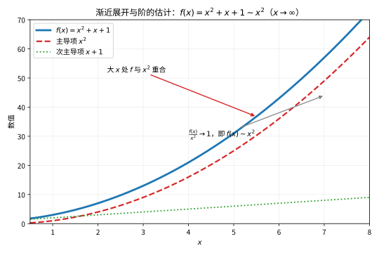
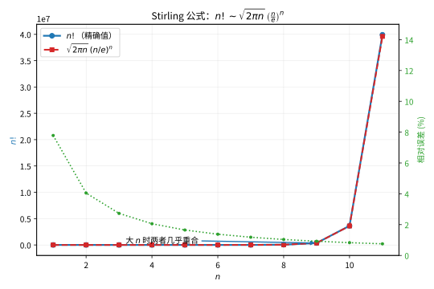

# 第59级：渐近分析 (Asymptotic Analysis)

## 学习目标

1. 理解渐近展开与渐近级数的基本概念，掌握 $O$ 与 $o$ 符号的严格定义与使用。
2. 掌握 Stirling 公式的完整推导过程及其误差估计。
3. 深入理解 Laplace 方法、最速下降法、驻相法三大渐近分析核心技术。
4. 了解 WKB 方法、鞍点法在物理与工程中的应用。
5. 掌握 Gamma 函数、Airy 函数、Bessel 函数的渐近展开。
6. 理解 Poincaré 渐近展开与可和性理论的基本思想。

---

## 1. 核心概念

### 1.1 渐近展开与渐近级数

**定义（渐近展开）** 设 $f(x)$ 是定义在某个区间上的函数，$\{\phi_n(x)\}$ 是一个渐近序列（即 $\phi_{n+1}(x)=o(\phi_n(x))$ 当 $x\to\infty$）。若对每个 $N$，有

$$
f(x)=\sum_{n=0}^{N-1} a_n\phi_n(x)+O(\phi_N(x)),\quad x\to\infty,
$$

则称 $\sum_{n=0}^{\infty}a_n\phi_n(x)$ 是 $f(x)$ 的**渐近展开**，记作

$$
f(x)\sim\sum_{n=0}^{\infty}a_n\phi_n(x),\quad x\to\infty.
$$

渐近级数可以是发散的，但它仍然能在截断后提供极好的数值近似。

当 $x$ 很大时，多项式中次数最高的项主导了函数的行为，其余项相对可忽略。下图展示了 $f(x)=x^2+x+1$ 在大 $x$ 处如何被主导项 $x^2$ 决定：

> **直观理解（现实类比）**：就像远远眺望山脉时，最高那座山峰决定了整个轮廓，其余小丘只是点缀。当 $x$ 很大时，$x^2$ 项在 $f(x)$ 中起支配作用，$x$ 和常数项都无足轻重，因此 $f(x)$ 的增长"长得像"$x^2$。

### 1.2 $O$ 与 $o$ 符号

**定义** 设 $f,g$ 是定义在 $x\to a$ 邻域内的函数。

- $f(x)=O(g(x))$ 当 $x\to a$ 表示存在常数 $C>0$ 和邻域 $U$，使得 $|f(x)|\le C|g(x)|$ 对 $x\in U$ 成立。
- $f(x)=o(g(x))$ 当 $x\to a$ 表示 $\lim_{x\to a}\frac{f(x)}{g(x)}=0$。

### 1.3 Poincaré 渐近展开

**定义（Poincaré 渐近展开）** 设 $\{z_n\}$ 是定义在区域 $D$ 上的函数序列，满足 $z_{n+1}(x)=o(z_n(x))$ 当 $x\to x_0$。若对每个固定的 $N$，

$$
f(x)-\sum_{n=0}^{N-1}a_nz_n(x)=o(z_{N-1}(x)),\quad x\to x_0,
$$

则称 $\sum_{n=0}^{\infty}a_nz_n(x)$ 为 $f(x)$ 在 $x_0$ 处的 Poincaré 渐近展开。

### 1.4 可和性 (Summability)

渐近级数通常是发散的，但可以通过可和性方法赋予其"和"。**Borel 可和性**是最常用的方法之一：若形式幂级数 $\sum a_n z^n$ 满足 $A(t)=\sum_{n=0}^{\infty}\frac{a_n}{n!}t^n$ 在某个扇形区域内收敛且可解析延拓，则其 Borel 和为

$$
\int_0^{\infty}e^{-t}A(zt)\,dt.
$$

### 1.5 常用特殊函数的渐近形式

- **Gamma 函数**：$\Gamma(z)\sim\sqrt{2\pi}z^{z-1/2}e^{-z},\quad z\to\infty,\ |\arg z|<\pi.$
- **Airy 函数**：
  $$
  \operatorname{Ai}(x)\sim\frac{1}{2\sqrt{\pi}x^{1/4}}e^{-\frac{2}{3}x^{3/2}},\quad x\to+\infty,
  $$
  $$
  \operatorname{Ai}(-x)\sim\frac{1}{\sqrt{\pi}x^{1/4}}\sin\left(\frac{2}{3}x^{3/2}+\frac{\pi}{4}\right),\quad x\to+\infty.
  $$
- **Bessel 函数**：
  $$
  J_n(x)\sim\sqrt{\frac{2}{\pi x}}\cos\left(x-\frac{n\pi}{2}-\frac{\pi}{4}\right),\quad x\to+\infty.
  $$

---

## 2. 定理与证明

### 2.1 Watson 引理

**引理（Watson）** 设 $q(t)$ 在 $[0,\infty)$ 上连续，且当 $t\to0^+$ 时有渐近展开

$$
q(t)\sim\sum_{n=0}^{\infty}a_nt^{\frac{n+\alpha}{\beta}-1},\quad \alpha>0,\ \beta>0,
$$

且 $|q(t)|\le Ce^{bt}$ 对充分大的 $t$ 成立。则对 $x\to\infty$，

$$
\int_0^{\infty}e^{-xt}q(t)\,dt\sim\sum_{n=0}^{\infty}a_n\frac{\Gamma\left(\frac{n+\alpha}{\beta}\right)}{x^{\frac{n+\alpha}{\beta}}}.
$$

**证明** 设 $N$ 为任意正整数。将 $q(t)$ 写为

$$
q(t)=\sum_{n=0}^{N-1}a_nt^{\frac{n+\alpha}{\beta}-1}+R_N(t),
$$

其中 $R_N(t)=O\left(t^{\frac{N+\alpha}{\beta}-1}\right)$ 当 $t\to0^+$。于是

$$
I(x)=\int_0^{\infty}e^{-xt}q(t)\,dt=\sum_{n=0}^{N-1}a_n\int_0^{\infty}e^{-xt}t^{\frac{n+\alpha}{\beta}-1}\,dt+\int_0^{\infty}e^{-xt}R_N(t)\,dt.
$$

对第一项中的每个积分，作变量代换 $u=xt$，得

$$
\int_0^{\infty}e^{-xt}t^{\frac{n+\alpha}{\beta}-1}\,dt=\frac{1}{x^{\frac{n+\alpha}{\beta}}}\int_0^{\infty}e^{-u}u^{\frac{n+\alpha}{\beta}-1}\,du=\frac{\Gamma\left(\frac{n+\alpha}{\beta}\right)}{x^{\frac{n+\alpha}{\beta}}}.
$$

对余项，因 $|R_N(t)|\le C_N t^{\frac{N+\alpha}{\beta}-1}e^{bt}$（对充分大的 $t$），有

$$
\left|\int_0^{\infty}e^{-xt}R_N(t)\,dt\right|\le C_N\int_0^{\infty}e^{-(x-b)t}t^{\frac{N+\alpha}{\beta}-1}\,dt=O\left(\frac{1}{x^{\frac{N+\alpha}{\beta}}}\right).
$$

因此

$$
I(x)=\sum_{n=0}^{N-1}a_n\frac{\Gamma\left(\frac{n+\alpha}{\beta}\right)}{x^{\frac{n+\alpha}{\beta}}}+O\left(\frac{1}{x^{\frac{N+\alpha}{\beta}}}\right),
$$

由 $N$ 的任意性即得渐近展开式。$\square$

### 2.2 Laplace 方法的渐近展开

**定理（Laplace 方法）** 设 $h(x)$ 在 $[a,b]$ 上连续，$f(x)$ 在 $[a,b]$ 上二次连续可微，且 $f(x)$ 在唯一的 $x=c\in(a,b)$ 处达到全局最小值，满足 $f'(c)=0$，$f''(c)>0$。则当 $\lambda\to\infty$ 时，

$$
I(\lambda)=\int_a^b h(x)e^{-\lambda f(x)}\,dx\sim h(c)\sqrt{\frac{2\pi}{\lambda f''(c)}}\,e^{-\lambda f(c)}.
$$

更一般地，若 $h$ 在 $c$ 附近有渐近展开 $h(x)\sim\sum_{n=0}^{\infty}h_n(x-c)^n$，则

$$
I(\lambda)\sim e^{-\lambda f(c)}\sqrt{\frac{2\pi}{\lambda f''(c)}}\sum_{n=0}^{\infty}\frac{h_{2n}(2n)!}{n!2^{2n}[f''(c)]^n\lambda^n}.
$$

**证明** 由于 $f$ 在 $c$ 处取最小值，且 $f'(c)=0$，由 Taylor 展开

$$
f(x)=f(c)+\frac{1}{2}f''(c)(x-c)^2+O((x-c)^3).
$$

作变量代换 $t=\sqrt{\lambda}(x-c)$，则 $x=c+t/\sqrt{\lambda}$，$dx=dt/\sqrt{\lambda}$。于是

$$
I(\lambda)=e^{-\lambda f(c)}\int_{a}^{b}h(x)e^{-\lambda\left[\frac{1}{2}f''(c)(x-c)^2+O((x-c)^3)\right]}\,dx.
$$

代入 $t$ 变量：

$$
I(\lambda)=\frac{e^{-\lambda f(c)}}{\sqrt{\lambda}}\int_{\sqrt{\lambda}(a-c)}^{\sqrt{\lambda}(b-c)}h\left(c+\frac{t}{\sqrt{\lambda}}\right)e^{-\frac{1}{2}f''(c)t^2+O(t^3/\sqrt{\lambda})}\,dt.
$$

当 $\lambda\to\infty$ 时，积分区间趋向于 $(-\infty,\infty)$。利用 $h(c+t/\sqrt{\lambda})\to h(c)$ 和 $e^{O(t^3/\sqrt{\lambda})}\to1$，由控制收敛定理得

$$
I(\lambda)\sim\frac{e^{-\lambda f(c)}}{\sqrt{\lambda}}h(c)\int_{-\infty}^{\infty}e^{-\frac{1}{2}f''(c)t^2}\,dt=h(c)\sqrt{\frac{2\pi}{\lambda f''(c)}}\,e^{-\lambda f(c)}.
$$

高阶项可通过展开 $h(c+t/\sqrt{\lambda})$ 和 $e^{O(t^3/\sqrt{\lambda})}$ 得到。$\square$

### 2.3 最速下降法 (Method of Steepest Descent)

**定理（最速下降法）** 考虑形如

$$
I(\lambda)=\int_{\Gamma} g(z)e^{\lambda f(z)}\,dz,\quad \lambda\to\infty,
$$

的积分，其中 $\Gamma$ 是复平面上的路径，$f(z)$ 和 $g(z)$ 是解析函数。设 $z_0$ 是 $f(z)$ 的鞍点（即 $f'(z_0)=0$），且 $f''(z_0)\neq0$。则沿最速下降路径 $\Gamma_{\text{SD}}$ 通过 $z_0$ 时，

$$
I(\lambda)\sim g(z_0)\sqrt{\frac{2\pi}{-\lambda f''(z_0)}}\,e^{\lambda f(z_0)},\quad \lambda\to\infty.
$$

**证明** 设 $f(z)=u(x,y)+iv(x,y)$。最速下降路径满足 $\operatorname{Im}f(z)=\text{常数}$，即沿此路径 $f(z)$ 的虚部不变。在鞍点 $z_0$ 处，$f'(z_0)=0$，Taylor 展开得

$$
f(z)=f(z_0)+\frac{1}{2}f''(z_0)(z-z_0)^2+O((z-z_0)^3).
$$

令 $w=z-z_0$，则 $f(z)-f(z_0)=\frac{1}{2}f''(z_0)w^2(1+O(w))$。由于沿最速下降路径，$f(z)-f(z_0)$ 为实数且为负值（下降方向），故 $\frac{1}{2}f''(z_0)w^2$ 为负实数。设 $f''(z_0)=|f''(z_0)|e^{i\theta}$，则 $w$ 的方向应为 $e^{-i\theta/2}$ 乘以 $\pm1$。

作变量代换 $s=\sqrt{-\frac{1}{2}f''(z_0)}(z-z_0)$，则 $s$ 沿最速下降路径为实数，且

$$
I(\lambda)\sim e^{\lambda f(z_0)}\int_{-\infty}^{\infty}g(z_0)\frac{1}{\sqrt{-\frac{1}{2}f''(z_0)}}e^{-\lambda s^2}\,ds=g(z_0)\sqrt{\frac{2\pi}{-\lambda f''(z_0)}}e^{\lambda f(z_0)}.
$$

这里使用了 $\int_{-\infty}^{\infty}e^{-\lambda s^2}\,ds=\sqrt{\pi/\lambda}$。$\square$

### 2.4 驻相法 (Method of Stationary Phase)

**定理（驻相法）** 设 $f(x)$ 在 $[a,b]$ 上实值且光滑，$\phi(x)$ 光滑。设 $f'(c)=0$，$f''(c)\neq0$，$c\in(a,b)$ 是唯一的驻点。则当 $\lambda\to\infty$ 时，

$$
I(\lambda)=\int_a^b\phi(x)e^{i\lambda f(x)}\,dx\sim\phi(c)\sqrt{\frac{2\pi}{\lambda|f''(c)|}}\,e^{i\lambda f(c)+i\frac{\pi}{4}\operatorname{sgn}f''(c)}.
$$

**证明** 在驻点 $c$ 附近展开

$$
f(x)=f(c)+\frac{1}{2}f''(c)(x-c)^2+O((x-c)^3).
$$

作变量代换 $t=\sqrt{\lambda}(x-c)$，则

$$
I(\lambda)=e^{i\lambda f(c)}\int_{a}^{b}\phi(x)e^{i\frac{\lambda}{2}f''(c)(x-c)^2+i\lambda O((x-c)^3)}\,dx.
$$

代入 $t$：

$$
I(\lambda)=\frac{e^{i\lambda f(c)}}{\sqrt{\lambda}}\int_{\sqrt{\lambda}(a-c)}^{\sqrt{\lambda}(b-c)}\phi\left(c+\frac{t}{\sqrt{\lambda}}\right)e^{i\frac{1}{2}f''(c)t^2+O(t^3/\sqrt{\lambda})}\,dt.
$$

当 $\lambda\to\infty$ 时，积分区间趋向于 $(-\infty,\infty)$。利用 Fresnel 积分

$$
\int_{-\infty}^{\infty}e^{i\alpha t^2/2}\,dt=\sqrt{\frac{2\pi}{|\alpha|}}\,e^{i\frac{\pi}{4}\operatorname{sgn}\alpha},
$$

得到

$$
I(\lambda)\sim\frac{e^{i\lambda f(c)}}{\sqrt{\lambda}}\phi(c)\sqrt{\frac{2\pi}{|f''(c)|}}\,e^{i\frac{\pi}{4}\operatorname{sgn}f''(c)}.
$$

整理即得结论。$\square$

### 2.5 Stirling 公式的完整推导

**定理（Stirling 公式）** Gamma 函数满足如下渐近展开：

$$
\Gamma(z)=\sqrt{2\pi}\,z^{z-1/2}e^{-z}\left[1+\frac{1}{12z}+\frac{1}{288z^2}-\frac{139}{51840z^3}+O\left(\frac{1}{z^4}\right)\right],
$$

特别地，对正整数 $n$，

$$
n!=\sqrt{2\pi n}\left(\frac{n}{e}\right)^n\left[1+O\left(\frac{1}{n}\right)\right].
$$

**证明** 我们从 Gamma 函数的积分表示出发：

$$
\Gamma(z+1)=\int_0^{\infty}t^ze^{-t}\,dt.
$$

作变量代换 $t=z(1+u)$，其中 $u\in(-1,\infty)$：

$$
\Gamma(z+1)=z^{z+1}e^{-z}\int_{-1}^{\infty}(1+u)^ze^{-zu}\,du=z^{z+1}e^{-z}\int_{-1}^{\infty}e^{z[\ln(1+u)-u]}\,du.
$$

令 $\phi(u)=\ln(1+u)-u$。则 $\phi(0)=0$，$\phi'(0)=0$，$\phi''(0)=-1$。在 $u=0$ 附近展开：

$$
\phi(u)=-\frac{u^2}{2}+\frac{u^3}{3}-\frac{u^4}{4}+\cdots.
$$

由于主要贡献来自 $u=0$ 附近，我们将积分区间延拓到 $(-\infty,\infty)$（误差为指数小量）。作变量代换 $u=s/\sqrt{z}$，则

$$
\int_{-1}^{\infty}e^{z\phi(u)}\,du\sim\frac{1}{\sqrt{z}}\int_{-\infty}^{\infty}e^{z\phi(s/\sqrt{z})}\,ds.
$$

展开 $\phi(s/\sqrt{z})$：

$$
\phi\left(\frac{s}{\sqrt{z}}\right)=-\frac{s^2}{2z}+\frac{s^3}{3z^{3/2}}-\frac{s^4}{4z^2}+\cdots.
$$

因此

$$
e^{z\phi(s/\sqrt{z})}=e^{-s^2/2}\exp\left(\frac{s^3}{3\sqrt{z}}-\frac{s^4}{4z}+\cdots\right).
$$

将指数中的 $\exp$ 展开为级数，逐项积分。利用 Gaussian 积分的矩：

$$
\int_{-\infty}^{\infty}e^{-s^2/2}s^{2k}\,ds=\sqrt{2\pi}\frac{(2k)!}{2^kk!},
$$

以及奇次矩为零，得到

$$
\Gamma(z+1)=z^{z+1}e^{-z}\sqrt{\frac{2\pi}{z}}\left[1+\frac{1}{12z}+\frac{1}{288z^2}+O\left(\frac{1}{z^3}\right)\right].
$$

整理即得

$$
\Gamma(z+1)=\sqrt{2\pi z}\left(\frac{z}{e}\right)^z\left[1+\frac{1}{12z}+\frac{1}{288z^2}+O\left(\frac{1}{z^3}\right)\right].
$$

**误差估计**：通过 Euler-Maclaurin 求和公式可得到更精确的误差界

$$
\ln n!=n\ln n-n+\frac{1}{2}\ln(2\pi n)+\frac{1}{12n}-\frac{1}{360n^3}+O\left(\frac{1}{n^5}\right).
$$

对于任意 $n\ge1$，有

$$
\sqrt{2\pi n}\left(\frac{n}{e}\right)^n<n!<\sqrt{2\pi n}\left(\frac{n}{e}\right)^n e^{1/(12n)}.
$$

斯特林公式用 $\sqrt{2\pi n}(n/e)^n$ 抓住了 $n!$ 增长的"量级骨架"，且 $n$ 越大越精确。下图对比了 $n!$ 的精确值与斯特林近似：

> **直观理解（现实类比）**：$n!$ 增长得比任何指数都快，斯特林公式用 $\sqrt{2\pi n}(n/e)^n$ 精确地捕获它的"量级骨架"。这就像估算一本书的印刷页数时不必逐页去数，一个简洁公式就能给出非常接近的答案，而且 $n$ 越大越精确。（图中绿线为相对误差。）

$\square$

### 2.6 WKB 近似与衔接公式

**定理（WKB 近似）** 考虑二阶线性微分方程

$$
\varepsilon^2\frac{d^2y}{dx^2}+Q(x)y=0,\quad \varepsilon\to0^+.
$$

在 $Q(x)>0$ 的区域（经典许可区），WKB 近似解为

$$
y(x)\sim\frac{C_+}{\sqrt[4]{Q(x)}}\exp\left(\frac{i}{\varepsilon}\int\sqrt{Q(x)}\,dx\right)+\frac{C_-}{\sqrt[4]{Q(x)}}\exp\left(-\frac{i}{\varepsilon}\int\sqrt{Q(x)}\,dx\right).
$$

> **直观理解（现实类比）**：WKB 近似描述的量子隧穿就像**幽灵穿墙**——经典力学中，一个小球如果能量不够，永远翻不过高山（势垒）；但在量子世界里，粒子的波函数会"渗透"进势垒，虽然指数衰减，但只要势垒不够厚，另一侧仍有非零概率找到粒子。这正是扫描隧道显微镜（STM）的工作原理：电子隧穿真空势垒，使我们能"看见"单个原子。WKB 公式给出隧穿概率 $\sim e^{-2\int\sqrt{V-E}/\hbar}$，势垒越宽越高，穿透越难。

在 $Q(x)<0$ 的区域（经典禁区），解为

$$
y(x)\sim\frac{D_+}{\sqrt[4]{|Q(x)|}}\exp\left(\frac{1}{\varepsilon}\int\sqrt{|Q(x)|}\,dx\right)+\frac{D_-}{\sqrt[4]{|Q(x)|}}\exp\left(-\frac{1}{\varepsilon}\int\sqrt{|Q(x)|}\,dx\right).
$$

**衔接公式（Connection Formulas）** 在转折点 $x_0$ 处（$Q(x_0)=0$），两侧的解通过衔接公式连接：

$$
\frac{1}{\sqrt[4]{Q(x)}}\cos\left(\frac{1}{\varepsilon}\int_{x_0}^x\sqrt{Q(t)}\,dt-\frac{\pi}{4}\right)\quad(\text{许可区})\quad\longleftrightarrow\quad\frac{1}{2\sqrt[4]{|Q(x)|}}\exp\left(-\frac{1}{\varepsilon}\int_{x}^{x_0}\sqrt{|Q(t)|}\,dt\right)\quad(\text{禁区}).
$$

**证明思路**：设 $y(x)=\exp\left(\frac{i}{\varepsilon}S(x)\right)$，代入方程得

$$
-\frac{1}{\varepsilon^2}(S')^2+\frac{i}{\varepsilon}S''+\frac{1}{\varepsilon^2}Q(x)=0.
$$

令 $\varepsilon\to0$，得到 eikonal 方程 $(S')^2=Q(x)$，解得 $S(x)=\pm\int\sqrt{Q(x)}\,dx$。下一阶近似给出 transport 方程，得到振幅因子 $1/\sqrt[4]{Q(x)}$。在转折点附近，方程退化为 Airy 方程，通过 Airy 函数的渐近形式建立衔接公式。$\square$

---

## 3. 示例

### 示例 1：使用 Laplace 方法计算 Gamma 函数的渐近

**问题** 利用 Laplace 方法推导 $\Gamma(x+1)$ 的渐近形式。

**解** Gamma 函数的定义为

$$
\Gamma(x+1)=\int_0^{\infty}t^xe^{-t}\,dt=\int_0^{\infty}e^{x\ln t-t}\,dt.
$$

令 $f(t)=-\ln t+t/x$，但更标准的方法是作代换 $t=xs$，则

$$
\Gamma(x+1)=x^{x+1}\int_0^{\infty}e^{x(\ln s-s)}\,ds.
$$

令 $\phi(s)=\ln s-s$，则 $\phi'(s)=1/s-1$，驻点在 $s=1$ 处，$\phi(1)=-1$，$\phi''(1)=-1$。应用 Laplace 方法（此时 $h(s)=1$，$\lambda=x$，$f(s)=-\phi(s)=s-\ln s$，$c=1$，$f''(1)=1$）：

$$
\int_0^{\infty}e^{x(\ln s-s)}\,ds\sim e^{-x}\sqrt{\frac{2\pi}{x}}.
$$

因此

$$
\Gamma(x+1)\sim x^{x+1}e^{-x}\sqrt{\frac{2\pi}{x}}=\sqrt{2\pi x}\left(\frac{x}{e}\right)^x.
$$

这正是 Stirling 公式的主项。

### 示例 2：使用驻相法计算 Fourier 变换

**问题** 计算如下 Fourier 变换的渐近行为（$k\to\infty$）：

$$
I(k)=\int_{-\infty}^{\infty}e^{ik(x^3/3-x)}\phi(x)\,dx,
$$

其中 $\phi(x)$ 是光滑的紧支函数。

**解** 令 $f(x)=x^3/3-x$，则 $f'(x)=x^2-1$，驻点为 $x=\pm1$。

- 在 $x=1$ 处：$f(1)=1/3-1=-2/3$，$f''(1)=2$。
- 在 $x=-1$ 处：$f(-1)=-1/3+1=2/3$，$f''(-1)=-2$。

应用驻相法，每个驻点贡献

$$
\phi(\pm1)\sqrt{\frac{2\pi}{k|f''(\pm1)|}}\,e^{ikf(\pm1)+i\frac{\pi}{4}\operatorname{sgn}f''(\pm1)}.
$$

因此

$$
I(k)\sim\phi(1)\sqrt{\frac{\pi}{k}}\,e^{-2ik/3+i\pi/4}+\phi(-1)\sqrt{\frac{\pi}{k}}\,e^{2ik/3-i\pi/4}.
$$

---

## 4. 习题

### 习题 1

使用 Watson 引理计算如下积分当 $x\to\infty$ 时的渐近展开：

$$
I(x)=\int_0^{\infty}e^{-xt}\frac{\sin t}{t}\,dt.
$$

**提示**：将 $\sin t/t$ 在 $t=0$ 附近展开为 Taylor 级数，然后应用 Watson 引理（$\alpha=1$，$\beta=1$）。

### 习题 2

利用 Laplace 方法求以下积分的渐近主项（$\lambda\to\infty$）：

$$
I(\lambda)=\int_0^1 e^{\lambda x^2}\frac{1}{1+x}\,dx.
$$

**提示**：注意 $f(x)=-x^2$ 在 $x=0$ 处取最大值，但最大值在边界 $x=1$ 处。需要分别处理边界点贡献。

### 习题 3

利用驻相法计算

$$
I(\lambda)=\int_0^1 e^{i\lambda x^2}\sin x\,dx,\quad \lambda\to\infty.
$$

**提示**：驻点在 $x=0$ 处，但注意 $x=0$ 是积分端点，需使用端点修正的驻相公式。

### 习题 4

证明 Bessel 函数 $J_0(x)$ 的积分表示

$$
J_0(x)=\frac{1}{\pi}\int_0^{\pi}\cos(x\sin\theta)\,d\theta,
$$

并利用驻相法推导其渐近形式 $J_0(x)\sim\sqrt{\frac{2}{\pi x}}\cos\left(x-\frac{\pi}{4}\right)$。

**提示**：将 $\cos$ 写为 $e^{ix\sin\theta}$ 的实部，驻点在 $\theta=\pi/2$ 处，$f''(\pi/2)=-1$。

### 习题 5

考虑微分方程

$$
\varepsilon^2y''(x)+(1-x^2)y(x)=0,\quad y(\pm1)\text{ 有界},
$$

求其 WKB 近似解，并给出转折点处的衔接公式。

**提示**：转折点在 $x=\pm1$ 处。在 $|x|<1$ 区域 $Q(x)>0$，在 $|x|>1$ 区域 $Q(x)<0$。

---

## 5. 总结

渐近分析是研究函数在极限过程中的近似行为的强大工具。本级别覆盖了以下核心内容：

1. **渐近展开与符号系统**：掌握了 $O$、$o$ 符号的严格定义和 Poincaré 渐近展开的概念，理解了渐近级数即使发散也能提供有效近似。

2. **三大核心方法**：
   - **Laplace 方法**：处理形如 $\int e^{-\lambda f(x)}h(x)\,dx$ 的积分，主贡献来自 $f$ 的最小值点。
   - **最速下降法**：Laplace 方法在复平面上的推广，通过变形积分路径经过鞍点获取主贡献。
   - **驻相法**：处理形如 $\int e^{i\lambda f(x)}\phi(x)\,dx$ 的振荡积分，主贡献来自相位 $f$ 的驻点。

3. **Watson 引理**：Laplace 型积分渐近展开的系统工具，将积分渐近转化为 Gamma 函数的级数。

4. **Stirling 公式**：通过 Laplace 方法完整推导了 Gamma 函数的渐近公式，并给出了误差估计。

5. **WKB 方法**：处理含小参数的高阶微分方程，在量子力学、波动光学中有广泛应用。

6. **特殊函数的渐近**：Gamma 函数、Airy 函数、Bessel 函数的渐近形式是物理与工程中的常用工具。

7. **可和性理论**：为发散渐近级数赋予严格意义，是渐近分析向现代数学发展的方向之一。

渐近分析不仅是一项数学技术，更是一种思维方式——在复杂系统中识别主导因素、忽略次要细节，从而获得深刻的定量理解。