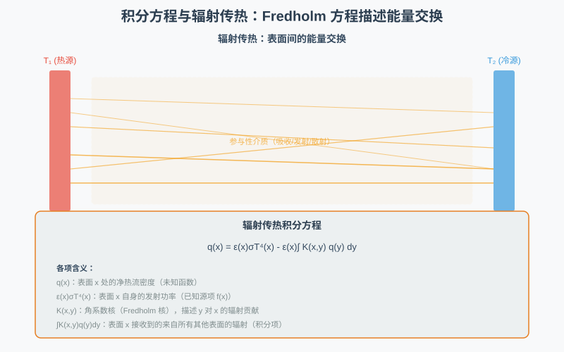
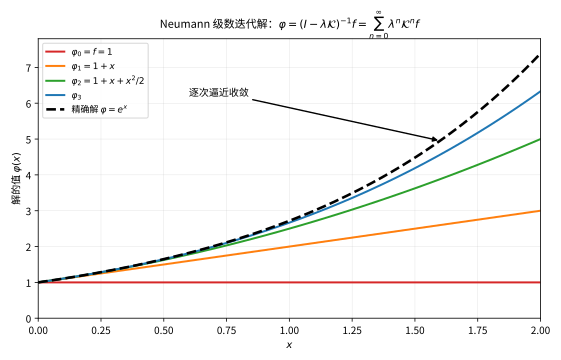

# 第60级：积分方程 (Integral Equations)

## 学习目标

1. 理解积分方程的基本分类：Fredholm 与 Volterra 类型、第一类与第二类。
2. 掌握核与积分算子的概念，熟悉 Hilbert-Schmidt 核与可积核的性质。
3. 深入理解 Fredholm 择一性定理与 Fredholm 行列式理论。
4. 掌握对称核的展开定理（Hilbert-Schmidt 理论）与 Mercer 定理。
5. 掌握 Volterra 方程的迭代解法及其存在唯一性。
6. 了解奇异积分方程与 Wiener-Hopf 方法的基本思想。

---

## 1. 核心概念

### 1.1 积分方程的分类

**定义** 积分方程是未知函数出现在积分号下的方程。一般形式为

$$
\lambda\varphi(x)-\int_a^b K(x,y)\varphi(y)\,dy=f(x),
$$

其中 $K(x,y)$ 称为**核**，$\lambda$ 是参数，$f(x)$ 是已知函数，$\varphi(x)$ 是未知函数。

**Fredholm 积分方程**：
- **第二类 Fredholm 积分方程**：
  $$
  \varphi(x)-\lambda\int_a^b K(x,y)\varphi(y)\,dy=f(x).
  $$
- **第一类 Fredholm 积分方程**：
  $$
  \int_a^b K(x,y)\varphi(y)\,dy=f(x).
  $$

**Volterra 积分方程**：
- **第二类 Volterra 积分方程**：
  $$
  \varphi(x)-\lambda\int_a^x K(x,y)\varphi(y)\,dy=f(x).
  $$
- **第一类 Volterra 积分方程**：
  $$
  \int_a^x K(x,y)\varphi(y)\,dy=f(x).
  $$

Volterra 方程与 Fredholm 方程的关键区别在于积分上限是 $x$ 而非固定值 $b$。

这一区别体现在核 $K(x,y)$ 的定义域上：Fredholm 的核覆盖整个正方形 $[a,b]\times[a,b]$，而 Volterra 的核只覆盖三角区域 $y\le x$，具有"因果"结构：

![积分核的诊断性对比：Fredholm 核 $K(x,y)$ 定义于全区域 $[a,b]\times[a,b]$，Volterra 核只定义于三角区域 $y\le x$（因果结构）](images/60_1_kernel_compare.svg)

> **直观理解（现实类比）**：Fredholm 方程像"一次看全盘"——在 $x$ 处的解依赖整个区间上所有 $y$ 的值；Volterra 方程则像"只看过去"——$x$ 处的解只依赖 $y\le x$ 的输入，具有时间单向性，就像当前天气只受过去影响、不受未来影响。

### 1.2 核与积分算子

**定义** 积分算子 $\mathcal{K}$ 定义为

$$
(\mathcal{K}\varphi)(x)=\int_a^b K(x,y)\varphi(y)\,dy.
$$

**核的类型**：
- **可分离核**（退化核）：$K(x,y)=\sum_{i=1}^n a_i(x)b_i(y)$。
- **对称核**：$K(x,y)=\overline{K(y,x)}$。
- **Hilbert-Schmidt 核**：$\int_a^b\int_a^b|K(x,y)|^2\,dx\,dy<\infty$。
- **可积核**：$\int_a^b|K(x,y)|\,dy$ 对几乎所有 $x$ 有界。

### 1.3 Fredholm 择一性

**定理（Fredholm 择一性）** 对于第二类 Fredholm 积分方程

$$
\varphi-\lambda\mathcal{K}\varphi=f,
$$

以下两种情形之一成立：
1. **若 $\lambda$ 不是 $\mathcal{K}$ 的特征值**，则对任意 $f$，方程存在唯一解。
2. **若 $\lambda$ 是 $\mathcal{K}$ 的特征值**，则齐次方程 $\varphi-\lambda\mathcal{K}\varphi=0$ 有非平凡解，且非齐次方程有解当且仅当 $f$ 与所有对应齐次方程的解正交。

### 1.4 Fredholm 行列式

**定义** Fredholm 行列式定义为

$$
D(\lambda)=\sum_{n=0}^{\infty}\frac{(-\lambda)^n}{n!}\int_a^b\cdots\int_a^b\det\begin{pmatrix}
K(x_1,x_1)&\cdots&K(x_1,x_n)\\
\vdots&\ddots&\vdots\\
K(x_n,x_1)&\cdots&K(x_n,x_n)
\end{pmatrix}dx_1\cdots dx_n.
$$

Fredholm 行列式的零点恰好是积分算子的特征值。

### 1.5 Neumann 级数

**定义** 对于第二类 Fredholm 积分方程，当 $|\lambda|$ 充分小时，解可表示为 Neumann 级数：

$$
\varphi(x)=f(x)+\lambda\int_a^b K(x,y)f(y)\,dy+\lambda^2\int_a^b\int_a^b K(x,y_1)K(y_1,y)f(y)\,dy_1\,dy+\cdots.
$$

用算子语言表示为 $\varphi=(I-\lambda\mathcal{K})^{-1}f=\sum_{n=0}^{\infty}\lambda^n\mathcal{K}^nf$。

> **直观理解（现实类比）**：辐射传热方程就像**房间里的热量对话**——假设房间有两面墙，一面热（$T_1$）一面冷（$T_2$），每面墙都在向对方辐射热量，同时吸收对方的辐射。墙 $x$ 的最终辐射能量 $\varphi(x)$ 取决于：它自身的发射 $f(x)$，加上它从墙 $y$ 吸收的辐射 $\int K(x,y)\varphi(y)\,dy$（$K(x,y)$ 是"视角因子"，描述墙 $y$ 有多少辐射能照到墙 $x$）。这是一个 Fredholm 积分方程：每面墙的辐射状态都依赖于所有其他墙的辐射状态，必须整体求解。

Neumann 级数的思想是"逐次逼近"：从 $\varphi_0=f$ 出发，一次次应用算子 $\mathcal{K}$ 叠加修正项，逐步逼向精确解。下图以 $\varphi(x)=1+\int_0^x\varphi(y)\,dy$（解为 $e^x$）为例展示迭代的收敛过程：

> **直观理解（现实类比）**：Neumann 级数像"敲钟的回响"——第一次敲响（$f$），声音在墙壁间来回反射产生越来越小的一连串回声（$\lambda\mathcal{K}f,\ \lambda^2\mathcal{K}^2f,\dots$），把这些回声全部叠加起来就是总效果。当 $|\lambda|$ 足够小时回声衰减很快，级数收敛，解的近似越加越精确。

### 1.6 Hilbert-Schmidt 理论与对称核

**定理（Hilbert-Schmidt 展开定理）** 设 $K(x,y)$ 是 $L^2[a,b]$ 上的对称 Hilbert-Schmidt 核，则存在可数无穷多特征值 $\{\lambda_n\}$ 和对应的正交特征函数 $\{\varphi_n\}$，使得

$$
K(x,y)=\sum_{n=1}^{\infty}\frac{\varphi_n(x)\overline{\varphi_n(y)}}{\lambda_n},
$$

其中级数在 $L^2$ 意义下收敛。

### 1.7 Mercer 定理

**定理（Mercer）** 设 $K(x,y)$ 是 $[a,b]\times[a,b]$ 上的连续对称正定核，则

$$
K(x,y)=\sum_{n=1}^{\infty}\frac{\varphi_n(x)\varphi_n(y)}{\lambda_n},
$$

其中级数在 $[a,b]\times[a,b]$ 上绝对且一致收敛。

### 1.8 奇异积分方程与 Wiener-Hopf 方法

**奇异积分方程** 是指积分核具有奇性的方程，如 Cauchy 型奇异积分方程：

$$
a(x)\varphi(x)+\frac{1}{\pi i}\int_{\Gamma}\frac{K(x,t)}{t-x}\varphi(t)\,dt=f(x).
$$

**Wiener-Hopf 方法** 用于求解定义在半直线上的卷积型积分方程：

$$
\varphi(x)+\int_0^{\infty}k(x-y)\varphi(y)\,dy=f(x),\quad x>0.
$$

该方法通过 Fourier 变换将方程转化为 Riemann-Hilbert 问题，然后利用函数分解（因式分解）技术求解。

---

## 2. 定理与证明

### 2.1 Fredholm 择一定理

**定理（Fredholm 择一性）** 设 $K(x,y)$ 是 $[a,b]\times[a,b]$ 上的连续核，$\mathcal{K}$ 是对应的积分算子。考虑方程

$$
\varphi-\lambda\mathcal{K}\varphi=f,
$$

其中 $f\in C[a,b]$。则以下两种情形必居其一：
1. **第一择一**：方程对任意 $f$ 存在唯一解。
2. **第二择一**：齐次方程 $\varphi-\lambda\mathcal{K}\varphi=0$ 有非平凡解，且非齐次方程有解当且仅当 $f$ 与所有齐次伴随方程 $\psi-\overline{\lambda}\mathcal{K}^*\psi=0$ 的解正交。

**证明** 我们分步证明。

**第一步：可分离核情形**。设 $K(x,y)=\sum_{i=1}^n a_i(x)b_i(y)$。则方程化为

$$
\varphi(x)-\lambda\sum_{i=1}^n a_i(x)\int_a^b b_i(y)\varphi(y)\,dy=f(x).
$$

令 $c_i=\int_a^b b_i(y)\varphi(y)\,dy$，则

$$
\varphi(x)=f(x)+\lambda\sum_{i=1}^n c_i a_i(x).
$$

代入 $c_j$ 的定义：

$$
c_j=\int_a^b b_j(x)f(x)\,dx+\lambda\sum_{i=1}^n c_i\int_a^b b_j(x)a_i(x)\,dx.
$$

令 $A_{ji}=\int_a^b b_j(x)a_i(x)\,dx$，$d_j=\int_a^b b_j(x)f(x)\,dx$，则得到线性代数方程组

$$
c_j-\lambda\sum_{i=1}^n A_{ji}c_i=d_j,\quad j=1,\dots,n.
$$

写为矩阵形式 $(I-\lambda A)\mathbf{c}=\mathbf{d}$。由线性代数，
- 若 $\det(I-\lambda A)\neq0$，则 $\mathbf{c}$ 唯一确定，从而 $\varphi$ 唯一确定。
- 若 $\det(I-\lambda A)=0$，则齐次方程有非平凡解，且非齐次方程有解当且仅当 $\mathbf{d}$ 与 $(I-\lambda A)^T$ 的零空间正交。

**第二步：一般核的逼近**。对于连续核 $K(x,y)$，存在可分离核序列 $K_n(x,y)$ 一致收敛到 $K$。对每个 $K_n$，Fredholm 择一性成立。通过取极限，可证明对 $K$ 也成立。

**第三步：正交性条件**。设 $\lambda$ 是特征值，$\psi$ 是伴随齐次方程 $\psi-\overline{\lambda}\mathcal{K}^*\psi=0$ 的解，则

$$
\langle f,\psi\rangle=\langle\varphi-\lambda\mathcal{K}\varphi,\psi\rangle=\langle\varphi,\psi\rangle-\lambda\langle\mathcal{K}\varphi,\psi\rangle.
$$

由伴随算子的定义，$\langle\mathcal{K}\varphi,\psi\rangle=\langle\varphi,\mathcal{K}^*\psi\rangle$，且 $\mathcal{K}^*\psi=\psi/\overline{\lambda}$，故

$$
\langle f,\psi\rangle=\langle\varphi,\psi\rangle-\lambda\left\langle\varphi,\frac{1}{\overline{\lambda}}\psi\right\rangle=\langle\varphi,\psi\rangle-\langle\varphi,\psi\rangle=0.
$$

因此 $f$ 必须与所有伴随齐次解正交。反之，若该条件成立，可构造解。$\square$

### 2.2 对称核的展开定理 (Hilbert-Schmidt)

**定理（对称核的展开定理）** 设 $K(x,y)$ 是 $L^2[a,b]$ 上的对称 Hilbert-Schmidt 核，即 $K(x,y)=\overline{K(y,x)}$ 且 $\iint|K(x,y)|^2\,dx\,dy<\infty$。则积分算子 $\mathcal{K}$ 是具有可数无穷多个特征值的紧自伴算子。特征值 $\{\lambda_n\}$ 满足 $\sum_{n=1}^{\infty}\frac{1}{|\lambda_n|^2}<\infty$，且对应的特征函数 $\{\varphi_n\}$ 构成 $L^2[a,b]$ 的正交基。核函数可展开为

$$
K(x,y)=\sum_{n=1}^{\infty}\frac{\varphi_n(x)\overline{\varphi_n(y)}}{\lambda_n},
$$

其中级数在 $L^2$ 意义下收敛。

**证明** 分四步进行。

**第一步：$\mathcal{K}$ 是紧算子**。由 Hilbert-Schmidt 核的定义，$\mathcal{K}$ 是 Hilbert-Schmidt 算子，因此是紧算子。由对称性，$\mathcal{K}$ 是自伴算子。

**第二步：谱分解**。由紧自伴算子的谱定理，存在可数无穷多非零特征值 $\{\lambda_n\}$（可能聚于 $0$）和对应的规范正交特征函数 $\{\varphi_n\}$，使得对任意 $f\in L^2$，

$$
\mathcal{K}f=\sum_{n=1}^{\infty}\frac{\langle f,\varphi_n\rangle}{\lambda_n}\varphi_n.
$$

**第三步：核的展开**。考虑核函数 $K(x,\cdot)$ 作为 $L^2$ 中的元素（对几乎每个固定的 $x$）。由谱分解，

$$
K(x,\cdot)=\sum_{n=1}^{\infty}\langle K(x,\cdot),\varphi_n\rangle\varphi_n(\cdot)=\sum_{n=1}^{\infty}\left(\int_a^b K(x,y)\overline{\varphi_n(y)}\,dy\right)\varphi_n(\cdot).
$$

但 $\int_a^b K(x,y)\overline{\varphi_n(y)}\,dy=(\mathcal{K}\varphi_n)(x)=\frac{\varphi_n(x)}{\lambda_n}$。因此

$$
K(x,y)=\sum_{n=1}^{\infty}\frac{\varphi_n(x)\overline{\varphi_n(y)}}{\lambda_n},
$$

其中等号在 $L^2$ 意义下成立。

**第四步：特征值的可和性**。由 Hilbert-Schmidt 范数有限性，

$$
\iint|K(x,y)|^2\,dx\,dy=\sum_{n=1}^{\infty}\frac{1}{|\lambda_n|^2}<\infty.
$$

$\square$

### 2.3 Mercer 定理

**定理（Mercer）** 设 $K(x,y)$ 是 $[a,b]\times[a,b]$ 上的连续对称正定核（即对任意 $f\in L^2$，$\iint K(x,y)f(x)\overline{f(y)}\,dx\,dy\ge0$）。则存在连续的正交特征函数系 $\{\varphi_n\}$ 和正特征值 $\{\lambda_n\}$，使得

$$
K(x,y)=\sum_{n=1}^{\infty}\frac{\varphi_n(x)\varphi_n(y)}{\lambda_n},
$$

且级数在 $[a,b]\times[a,b]$ 上绝对一致收敛。

**证明** 分五步。

**第一步：特征值的正性**。由正定性，对任意 $f$，

$$
\langle\mathcal{K}f,f\rangle=\iint K(x,y)f(x)\overline{f(y)}\,dx\,dy\ge0.
$$

因此 $\mathcal{K}$ 是正算子，所有特征值 $\lambda_n>0$。

**第二步：特征函数的连续性**。由于 $K$ 连续且 $\varphi_n=\lambda_n\mathcal{K}\varphi_n$，而 $\mathcal{K}$ 将 $L^2$ 函数映为连续函数（由 $K$ 的连续性），故 $\varphi_n$ 连续。

**第三步：核的逐点展开**。设 $R_N(x,y)=K(x,y)-\sum_{n=1}^N\frac{\varphi_n(x)\varphi_n(y)}{\lambda_n}$。则 $R_N$ 仍是连续对称正定核（因为它是 $K$ 减去前 $N$ 个特征投影）。特别地，$R_N(x,x)\ge0$，故

$$
\sum_{n=1}^N\frac{|\varphi_n(x)|^2}{\lambda_n}\le K(x,x).
$$

**第四步：一致收敛性**。由 Cauchy-Schwarz 不等式，

$$
\left|\sum_{n=M}^N\frac{\varphi_n(x)\varphi_n(y)}{\lambda_n}\right|\le\sqrt{\sum_{n=M}^N\frac{|\varphi_n(x)|^2}{\lambda_n}}\sqrt{\sum_{n=M}^N\frac{|\varphi_n(y)|^2}{\lambda_n}}\le\sqrt{K(x,x)K(y,y)}\sup_{x}\sum_{n=M}^\infty\frac{|\varphi_n(x)|^2}{\lambda_n}.
$$

由 Dini 定理，$\sum_{n=1}^\infty\frac{|\varphi_n(x)|^2}{\lambda_n}$ 一致收敛于 $K(x,x)$，因此上述级数在 $[a,b]\times[a,b]$ 上一致收敛。

**第五步：极限函数的连续性**。一致收敛的连续函数级数之和连续，故 $K(x,y)$ 等于其级数展开。$\square$

### 2.4 Volterra 方程的迭代解的存在唯一性

**定理（Volterra 方程解的存在唯一性）** 设 $K(x,y)$ 在 $a\le y\le x\le b$ 上连续，$f(x)$ 在 $[a,b]$ 上连续。则第二类 Volterra 积分方程

$$
\varphi(x)-\lambda\int_a^x K(x,y)\varphi(y)\,dy=f(x)
$$

在 $[a,b]$ 上存在唯一连续解。

**证明** 使用迭代法（Picard 迭代）。定义算子 $T$：

$$
(T\varphi)(x)=f(x)+\lambda\int_a^x K(x,y)\varphi(y)\,dy.
$$

构造迭代序列 $\varphi_0(x)=f(x)$，$\varphi_{n+1}=T\varphi_n$。

**第一步：估计迭代差**。设 $M=\max_{a\le y\le x\le b}|K(x,y)|$，$L=b-a$。则

$$
|\varphi_1(x)-\varphi_0(x)|=|\lambda|\left|\int_a^x K(x,y)f(y)\,dy\right|\le|\lambda|M\|f\|_\infty(x-a).
$$

归纳可得

$$
|\varphi_{n+1}(x)-\varphi_n(x)|\le\|f\|_\infty\frac{(|\lambda|M)^{n+1}(x-a)^{n+1}}{(n+1)!}.
$$

**第二步：一致收敛性**。因此

$$
\sum_{n=0}^{\infty}\|\varphi_{n+1}-\varphi_n\|_\infty\le\|f\|_\infty\sum_{n=0}^{\infty}\frac{(|\lambda|ML)^{n+1}}{(n+1)!}=\|f\|_\infty\left(e^{|\lambda|ML}-1\right)<\infty.
$$

由 Weierstrass M-判别法，级数 $\varphi_0+\sum_{n=0}^{\infty}(\varphi_{n+1}-\varphi_n)$ 一致收敛，记极限为 $\varphi$。

**第三步：验证 $\varphi$ 是解**。由于 $T$ 在一致范数下连续，$\varphi_{n+1}=T\varphi_n$ 取极限得 $\varphi=T\varphi$，即 $\varphi$ 是解。

**第四步：唯一性**。设 $\varphi_1,\varphi_2$ 是两个解，则 $\psi=\varphi_1-\varphi_2$ 满足

$$
\psi(x)=\lambda\int_a^x K(x,y)\psi(y)\,dy.
$$

设 $M_\psi=\max_{x\in[a,b]}|\psi(x)|$，则

$$
|\psi(x)|\le|\lambda|M\int_a^x|\psi(y)|\,dy\le|\lambda|MM_\psi(x-a).
$$

反复迭代得 $|\psi(x)|\le M_\psi\frac{(|\lambda|M(x-a))^n}{n!}$ 对任意 $n$ 成立。令 $n\to\infty$ 得 $\psi\equiv0$。$\square$

### 2.5 Fredholm 行列式表示

**定理（Fredholm 行列式与解）** 设 $K(x,y)$ 是连续核，则第二类 Fredholm 积分方程

$$
\varphi(x)-\lambda\int_a^b K(x,y)\varphi(y)\,dy=f(x)
$$

的解可表示为

$$
\varphi(x)=f(x)+\lambda\int_a^b R(x,y;\lambda)f(y)\,dy,
$$

其中预解核 $R(x,y;\lambda)$ 由 Fredholm 行列式表示：

$$
R(x,y;\lambda)=\frac{D(x,y;\lambda)}{D(\lambda)},
$$

$$
D(\lambda)=\sum_{n=0}^{\infty}\frac{(-\lambda)^n}{n!}\int_a^b\cdots\int_a^b\det\begin{pmatrix}
K(t_1,t_1)&\cdots&K(t_1,t_n)\\
\vdots&\ddots&\vdots\\
K(t_n,t_1)&\cdots&K(t_n,t_n)
\end{pmatrix}dt_1\cdots dt_n,
$$

$$
D(x,y;\lambda)=\sum_{n=0}^{\infty}\frac{(-\lambda)^n}{n!}\int_a^b\cdots\int_a^b\det\begin{pmatrix}
K(x,y)&K(x,t_1)&\cdots&K(x,t_n)\\
K(t_1,y)&K(t_1,t_1)&\cdots&K(t_1,t_n)\\
\vdots&\vdots&\ddots&\vdots\\
K(t_n,y)&K(t_n,t_1)&\cdots&K(t_n,t_n)
\end{pmatrix}dt_1\cdots dt_n.
$$

**证明思路**：将积分方程离散化为线性代数方程组，解用 Cramer 法则表示，然后取连续极限。具体地，将区间 $[a,b]$ 划分为 $n$ 等份，令 $x_i=a+i\Delta x$，$\Delta x=(b-a)/n$，将积分近似为 Riemann 和：

$$
\varphi(x_i)-\lambda\sum_{j=1}^n K(x_i,x_j)\varphi(x_j)\Delta x=f(x_i).
$$

这是一个线性代数方程组，其系数矩阵的行列式在 $n\to\infty$ 时趋向于 $D(\lambda)$，而解的分子趋向于 $D(x,y;\lambda)$。$\square$

---

## 3. 示例

### 示例 1：用 Laplace 变换求解 Volterra 方程

**问题** 求解 Volterra 积分方程

$$
\varphi(x)-\int_0^x (x-y)\varphi(y)\,dy=\sin x.
$$

**解** 注意到核 $K(x,y)=x-y$ 是卷积型核。对方程两边取 Laplace 变换，记 $\Phi(s)=\mathcal{L}\{\varphi\}(s)$。

卷积项的 Laplace 变换为 $\mathcal{L}\{(x-y)*\varphi\}=\mathcal{L}\{x\}\cdot\Phi(s)=\frac{1}{s^2}\Phi(s)$。

因此

$$
\Phi(s)-\frac{1}{s^2}\Phi(s)=\frac{1}{s^2+1}.
$$

解得

$$
\Phi(s)=\frac{1}{s^2+1}\cdot\frac{1}{1-1/s^2}=\frac{s^2}{(s^2+1)(s^2-1)}.
$$

作部分分式分解：

$$
\Phi(s)=\frac{1}{2}\cdot\frac{1}{s-1}-\frac{1}{2}\cdot\frac{1}{s+1}+\frac{1}{s^2+1}.
$$

取 Laplace 逆变换：

$$
\varphi(x)=\frac{1}{2}e^x-\frac{1}{2}e^{-x}+\sin x=\sinh x+\sin x.
$$

### 示例 2：对称核的积分方程求解

**问题** 求解 Fredholm 积分方程

$$
\varphi(x)-\lambda\int_0^1 (x+y)\varphi(y)\,dy=x.
$$

**解** 核 $K(x,y)=x+y$ 是可分离的对称核。令

$$
c_1=\int_0^1\varphi(y)\,dy,\quad c_2=\int_0^1 y\varphi(y)\,dy.
$$

则方程化为

$$
\varphi(x)=x+\lambda(xc_1+c_2).
$$

代入 $c_1$ 的定义：

$$
c_1=\int_0^1[y+\lambda(yc_1+c_2)]\,dy=\int_0^1 y\,dy+\lambda c_1\int_0^1 y\,dy+\lambda c_2\int_0^1 1\,dy=\frac{1}{2}+\frac{\lambda}{2}c_1+\lambda c_2.
$$

代入 $c_2$ 的定义：

$$
c_2=\int_0^1 y[y+\lambda(yc_1+c_2)]\,dy=\int_0^1 y^2\,dy+\lambda c_1\int_0^1 y^2\,dy+\lambda c_2\int_0^1 y\,dy=\frac{1}{3}+\frac{\lambda}{3}c_1+\frac{\lambda}{2}c_2.
$$

得到关于 $c_1,c_2$ 的方程组：

$$
\begin{cases}
(1-\frac{\lambda}{2})c_1-\lambda c_2=\frac{1}{2},\\
-\frac{\lambda}{3}c_1+(1-\frac{\lambda}{2})c_2=\frac{1}{3}.
\end{cases}
$$

系数行列式为

$$
\Delta(\lambda)=\det\begin{pmatrix}
1-\frac{\lambda}{2}&-\lambda\\
-\frac{\lambda}{3}&1-\frac{\lambda}{2}
\end{pmatrix}=\left(1-\frac{\lambda}{2}\right)^2-\frac{\lambda^2}{3}=1-\lambda+\frac{\lambda^2}{4}-\frac{\lambda^2}{3}=1-\lambda-\frac{\lambda^2}{12}.
$$

当 $\Delta(\lambda)\neq0$ 时，解得

$$
c_1=\frac{\frac{1}{2}(1-\frac{\lambda}{2})+\frac{\lambda}{3}}{\Delta(\lambda)},\quad c_2=\frac{\frac{1}{3}(1-\frac{\lambda}{2})+\frac{\lambda}{6}}{\Delta(\lambda)}.
$$

从而 $\varphi(x)=x+\lambda(xc_1+c_2)$。

---

## 4. 习题

### 习题 1

求解 Volterra 积分方程

$$
\varphi(x)=x+\int_0^x e^{x-y}\varphi(y)\,dy.
$$

**提示**：化为微分方程。对原方程求导，利用 Leibniz 法则。

### 习题 2

求解 Fredholm 积分方程

$$
\varphi(x)-\lambda\int_0^1 e^{xy}\varphi(y)\,dy=f(x),
$$

其中 $f(x)$ 是已知函数。证明特征值为 $\lambda$ 满足 $\int_0^1 e^{x^2/2}\,dx=1/\lambda$ 的实数。

**提示**：核 $e^{xy}$ 不是可分离的，但对称化后可使用 Hilbert-Schmidt 理论。

### 习题 3

设 $K(x,y)=\min(x,y)$ 是 $[0,1]\times[0,1]$ 上的核。求积分算子 $\mathcal{K}\varphi(x)=\int_0^1\min(x,y)\varphi(y)\,dy$ 的特征值和特征函数。

**提示**：将特征值问题 $\mathcal{K}\varphi=\lambda\varphi$ 化为微分方程。对 $x$ 求导两次，得到 $\varphi''+\frac{1}{\lambda}\varphi=0$，结合边界条件 $\varphi(0)=0$，$\varphi'(1)=0$。

### 习题 4

证明：若 $K(x,y)$ 是连续对称正定核，则 Mercer 展开中的特征函数系 $\{\varphi_n\}$ 在 $L^2$ 中完备。

**提示**：若存在 $f$ 与所有 $\varphi_n$ 正交，则 $\langle\mathcal{K}f,f\rangle=0$，由正定性得 $\mathcal{K}f=0$，利用展开的唯一性导出矛盾。

### 习题 5

考虑奇异积分方程

$$
\frac{1}{\pi}\int_{-1}^1\frac{\varphi(t)}{t-x}\,dt=f(x),\quad x\in(-1,1),
$$

其中积分取 Cauchy 主值。求其解（假设 $f$ 满足适当光滑性条件）。

**提示**：利用 Hilbert 变换和解析函数边值理论。令 $\Phi(z)=\frac{1}{2\pi i}\int_{-1}^1\frac{\varphi(t)}{t-z}\,dt$，利用 Plemelj 公式。

---

## 5. 总结

积分方程理论是泛函分析与应用数学的交叉领域，在物理、工程和数学物理中有着广泛的应用。本级别覆盖了以下核心内容：

1. **基本分类**：Fredholm 与 Volterra 类型、第一类与第二类。不同类型的方程在解法论上有着本质差异。

2. **Fredholm 理论**：Fredholm 择一性揭示了积分方程可解性的本质——与有限维线性代数类似，特征值决定了解的存在性与唯一性。Fredholm 行列式提供了预解核的显式构造。

3. **Hilbert-Schmidt 理论与对称核**：对称核的谱理论是积分方程中最优美的结果之一。Hilbert-Schmidt 展开定理和 Mercer 定理表明，对称正定核可以被其特征函数完全刻画。

4. **Volterra 方程**：Volterra 方程具有"因果"结构，其解可通过 Picard 迭代获得，且 Neumann 级数对任意 $\lambda$ 收敛（不像 Fredholm 方程受限于 $|\lambda|$ 的大小）。

5. **求解方法**：
   - **Neumann 级数**：适用于小 $|\lambda|$ 的一般核。
   - **Laplace 变换**：适用于卷积型 Volterra 方程。
   - **可分离核方法**：将积分方程化为线性代数方程组。
   - **谱方法**：利用对称核的特征展开求解。

6. **奇异积分方程与 Wiener-Hopf 方法**：这些是现代积分方程理论的前沿方向，在断裂力学、流体力学和通信理论中有着重要应用。

积分方程理论不仅提供了求解具体问题的工具，更重要的是建立了积分算子、微分算子与函数空间之间的深刻联系，为泛函分析的发展提供了丰富的源动力。