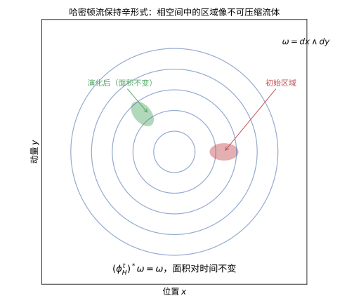
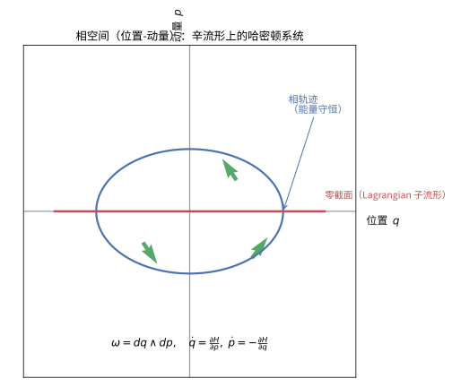

# 第64级：辛几何

## 学习目标

1. 理解辛流形与辛形式的定义及其基本性质。
2. 掌握 Darboux 定理的内容及其证明——辛几何局部无不变量的思想。
3. 理解 Lagrangian 子流形的定义及其在辛几何中的核心地位。
4. 掌握 Hamilton 向量场、Poisson 括号与可积系统的概念。
5. 理解作用-角变量与可积系统的 Arnold-Liouville 定理。
6. 掌握 Moment 映射与 Marsden-Weinstein 约化的思想。
7. 理解 Moser 稳定性定理及其在辛几何中的作用。
8. 了解 Gromov 非嵌入定理、伪全纯曲线与 Floer 同调的基本概念。
9. 了解量子化的基本概念。

---

## 核心概念

### 1. 辛流形与辛形式

**定义**（辛流形）：
一个**辛流形** $(M, \omega)$ 是一个光滑流形 $M$ 配备一个闭的非退化 $2$-形式 $\omega$，即：
- $d\omega = 0$（闭形式）。
- $\omega$ 是**非退化**的：对任意 $p \in M$ 和任意非零向量 $v \in T_pM$，存在 $w \in T_pM$ 使得 $\omega_p(v, w) \neq 0$。

**等价条件**：非退化性等价于 $\omega^n$ 是 $M$ 上的体积形式（$n = \frac{1}{2}\dim M$），因此辛流形必为偶数维。

**定义**（辛形式）：
辛形式 $\omega$ 是一个光滑的 $2$-形式，满足上述条件。最标准的例子是 $\mathbb{R}^{2n}$ 上的标准辛形式：
$$
\omega_0 = \sum_{i=1}^n dx_i \wedge dy_i.
$$

> **直观理解（现实类比）**：辛流像是流形上装了一套"特殊的面积尺"——辛形式 $\omega$ 给每对切向量配一个面积，但不测长度。它有两个关键性质：闭（$d\omega=0$，像无旋场那样自洽）和非退化（任何方向都有"搭档"使面积非零，故维数必须偶数）。经典力学的相空间（位置 $q$ + 动量 $p$）天然带着这样的结构，所以辛流形就是"相空间的几何化身"。

### 2. Darboux 定理

> **定理**（Darboux，1882 年）：每个辛流形局部上都同构于标准辛空间 $(\mathbb{R}^{2n}, \omega_0)$。即对任意点 $p \in M$，存在局部坐标 $(x_1, \dots, x_n, y_1, \dots, y_n)$，使得 $\omega = \sum_{i=1}^n dx_i \wedge dy_i$。

**意义**：辛几何没有局部不变量——所有辛流形在局部上都是相同的。这与 Riemann 几何形成鲜明对比（Riemann 几何有曲率作为局部不变量）。

> **直观理解（现实类比）**：达布定理像在说"辛几何的局部平凡性"——任何辛流形在每一点附近都能拉直成标准的 $\mathbb{R}^{2n}$ 配 $\omega_0=\sum dx_i\wedge dy_i$，就像任何曲面在小范围内都"看起来像平面"。但与 Riemann 几何不同，这里没有"曲率"这种局部不变量：你无法仅凭小范围测量区分两个辛流形。辛几何的真正信息藏在大范围（整体）结构里，这使得它的"刚性"完全是全局现象。

### 3. Lagrangian 子流形

**定义**：
辛流形 $(M^{2n}, \omega)$ 中的子流形 $L \subset M$ 称为**Lagrangian 子流形**，如果：
- $\dim L = n$（最大维数的各向同性子流形）。
- $\omega|_L = 0$（$L$ 是各向同性的，即 $\omega$ 限制在 $L$ 上为零）。

**例子**：
- 在 $(\mathbb{R}^{2n}, \omega_0)$ 中，$\mathbb{R}^n \times \{0\}$ 和 $\{0\} \times \mathbb{R}^n$ 都是 Lagrangian 子流形。
- 余切丛 $T^*Q$ 的零截面是 Lagrangian 子流形。

### 4. Hamilton 向量场

**定义**：
给定辛流形 $(M, \omega)$ 和光滑函数 $H: M \to \mathbb{R}$（称为**Hamilton 函数**），**Hamilton 向量场** $X_H$ 由下式唯一确定：
$$
\omega(X_H, \cdot) = dH(\cdot).
$$
即 $\iota_{X_H} \omega = dH$。

**Hamilton 流**：
$X_H$ 生成的流 $\phi_H^t$ 称为 **Hamilton 流**，它保持辛形式：
$$
(\phi_H^t)^* \omega = \omega.
$$

> **直观理解（现实类比）**：哈密顿流保持相空间中的面积，就像水一样**不可压缩**。设想在相空间里滴入一滴"墨汁"，它会被系统的流动带着不断变形、拉伸、扭转，但无论怎么变，这滴墨汁的面积始终不变。这正是辛形式 $\omega=dx\wedge dy$ 作为"面积形式"而非"距离形式"的体现——它衡量的是面积而非长度，而哈密顿流恰好是这个面积的守恒者。

> **直观理解（现实类比）**：辛同胚像"保持辛结构的变换"——它把辛流形映射到自身或另一个辛流形，同时把辛形式 $\omega$ 原封不动地搬过去（$\phi^*\omega=\omega$）。这好比二维里"保持面积"的映射：可以扭转、拉伸，但任何区域的面积都不变。辛同胚正是辛几何里的"刚体运动"：它们是这种几何下的合法对称，哈密顿流则是其中由能量函数驱动的一类特殊辛同胚。

### 5. Poisson 括号

**定义**：
给定辛流形 $(M, \omega)$ 上的两个光滑函数 $f, g: M \to \mathbb{R}$，其 **Poisson 括号**定义为：
$$
\{f, g\} = \omega(X_f, X_g) = dg(X_f) = -df(X_g).
$$

**性质**：
- 反对称性：$\{f, g\} = -\{g, f\}$。
- Jacobi 恒等式：$\{f, \{g, h\}\} + \{g, \{h, f\}\} + \{h, \{f, g\}\} = 0$。
- Leibniz 法则：$\{f, gh\} = \{f, g\}h + g\{f, h\}$。

因此 $(C^\infty(M), \{\cdot, \cdot\})$ 构成一个 Poisson 代数。

### 6. 可积系统

**定义**（Liouville 可积系统）：
一个 $n$ 自由度的 Hamilton 系统 $(M^{2n}, \omega, H)$ 称为**完全可积的**（Liouville 可积），如果存在 $n$ 个函数 $F_1 = H, F_2, \dots, F_n \in C^\infty(M)$，满足：
- $\{F_i, F_j\} = 0$（两两对合）。
- $dF_1, \dots, dF_n$ 在 $M$ 的一个开稠密集上线性无关。

### 7. 作用-角变量

**定义**：
对于可积系统，在紧致连通层次集上，存在**作用-角变量** $(I_1, \dots, I_n, \theta_1, \dots, \theta_n)$，使得：
- $\omega = \sum_{i=1}^n dI_i \wedge d\theta_i$。
- Hamilton 函数 $H$ 仅依赖于作用变量：$H = H(I_1, \dots, I_n)$。
- 运动方程为：$\dot{I}_i = 0$，$\dot{\theta}_i = \frac{\partial H}{\partial I_i}$（常数）。

### 8. Moment 映射

**定义**：
设 Lie 群 $G$ 作用在辛流形 $(M, \omega)$ 上，且作用保持辛形式。**Moment 映射** $\mu: M \to \mathfrak{g}^*$（$\mathfrak{g}^*$ 是 Lie 代数 $\mathfrak{g}$ 的对偶空间）由下式定义：
$$
d\langle \mu, \xi \rangle = \iota_{\xi_M} \omega,
$$
其中 $\xi_M$ 是 $\xi \in \mathfrak{g}$ 生成的基本向量场，$\langle \mu, \xi \rangle(p) = \mu(p)(\xi)$。

### 9. 约化（Marsden-Weinstein 约化）

**定义**：
设 $G$ 紧致 Lie 群作用在辛流形 $(M, \omega)$ 上，具有 Moment 映射 $\mu: M \to \mathfrak{g}^*$。若 $c \in \mathfrak{g}^*$ 是 $\mu$ 的正则值，且 $G$ 在 $\mu^{-1}(c)$ 上自由作用，则商空间：
$$
M_c = \mu^{-1}(c) / G
$$
具有自然的辛结构，称为 **Marsden-Weinstein 约化**（或辛约化）。

### 10. Moser 稳定性

**定义**（Moser 稳定性）：
Moser 稳定性定理研究辛形式的形变。粗略地说，辛流形上的闭 $2$-形式族在恰当形变下保持同构。

### 11. Gromov 非嵌入定理

**陈述**（Gromov，1985 年）：
辛嵌入 $\iota: (B^{2n}(r), \omega_0) \hookrightarrow (B^{2n}(R) \times \mathbb{R}^{2N-2n}, \omega_0 \oplus \omega_0)$ 存在仅当 $r \leq R$。特别地，大球体不能辛嵌入到小球体与任意维数空间的乘积中。

**意义**：这是辛几何中第一个"刚性"结果，表明辛几何与体积几何有本质区别。

### 12. 伪全纯曲线

**定义**：
设 $(M, J)$ 是近复流形，$\Sigma$ 是 Riemann 面。映射 $u: \Sigma \to M$ 称为 **$J$-全纯曲线**（伪全纯曲线），如果：
$$
J \circ du = du \circ j,
$$
其中 $j$ 是 $\Sigma$ 上的复结构。

**意义**：Gromov 引入伪全纯曲线来研究辛流形，由此发展出 Gromov-Witten 不变量和 Floer 同调。

### 13. Floer 同调

**定义**：
Floer 同调是用于研究辛流形上 Lagrangian 子流形交点和 Hamilton 周期轨道的同调理论。它由 Floer 在 1988 年引入，是 Morse 理论在无限维环路空间上的推广。

**基本思想**：
- 考虑 Hamilton 函数 $H$ 的 $1$-周期轨道的集合。
- 以这些轨道为生成元，以伪全纯柱面（连接轨道）为边界映射。
- 得到的同调群 $HF_*(M, H)$ 是 Hamilton 系统的同调不变量。

### 14. 量子化

**定义**（几何量子化）：
几何量子化是将经典力学系统（辛流形）映射到量子力学系统（Hilbert 空间）的程序。基本步骤包括：
1. **预量子化**：构造线丛及其联络，满足曲率条件。
2. **极化**：选择 Lagrangian 分布来缩小 Hilbert 空间。
3. **量子化**：确定可观测量的对应规则。

---

## 定理与证明

### 定理 1：Darboux 定理

> **定理**：设 $(M^{2n}, \omega)$ 是辛流形，则对任意点 $p \in M$，存在局部坐标 $(x_1, \dots, x_n, y_1, \dots, y_n)$，使得 $\omega = \sum_{i=1}^n dx_i \wedge dy_i$。

**证明**：

**第一步：选择初始坐标**。
在 $p$ 点附近取任意坐标 $(u_1, \dots, u_{2n})$，使得 $u_i(p) = 0$。在 $p$ 点，$\omega_p$ 是 $\mathbb{R}^{2n}$ 上的非退化反对称双线性形式。由线性代数，存在线性变换将 $\omega_p$ 化为标准形式：
$$
\omega_p = \sum_{i=1}^n du_i \wedge du_{n+i} \quad \text{在 } p \text{ 点}.
$$

**第二步：逐步构造（Moser 方法）**。
我们使用 Moser 的"路径方法"（homotopy method）。考虑一族辛形式：
$$
\omega_t = \omega_0 + t(\omega - \omega_0), \quad t \in [0, 1],
$$
其中 $\omega_0 = \sum_{i=1}^n du_i \wedge du_{n+i}$ 是标准形式（在 $p$ 点的切空间上）。

**第三步：构造向量场**。
我们希望找到一个时间依赖的向量场 $X_t$，其流 $\phi_t$ 满足 $\phi_t^* \omega_t = \omega_0$。对两边求导得：
$$
\frac{d}{dt}(\phi_t^* \omega_t) = \phi_t^*\left( \mathcal{L}_{X_t} \omega_t + \frac{d}{dt}\omega_t \right) = 0.
$$
因此需要 $\mathcal{L}_{X_t} \omega_t + (\omega - \omega_0) = 0$。

由 Cartan 公式：$\mathcal{L}_{X_t} \omega_t = d(\iota_{X_t} \omega_t) + \iota_{X_t} d\omega_t$。由于 $\omega_t$ 是闭的，$d\omega_t = 0$，因此：
$$
d(\iota_{X_t} \omega_t) + (\omega - \omega_0) = 0.
$$

**第四步：求解 $X_t$**。
由于 $\omega - \omega_0$ 在 $p$ 点为零，且 $d(\omega - \omega_0) = 0$，由 Poincaré 引理，存在 $1$-形式 $\alpha$ 使得 $\omega - \omega_0 = d\alpha$ 且 $\alpha_p = 0$。因此我们需要：
$$
d(\iota_{X_t} \omega_t + \alpha) = 0.
$$
即 $\iota_{X_t} \omega_t + \alpha = 0$ 在某个闭形式内。由于 $\omega_t$ 在 $p$ 点附近非退化（在足够小的邻域内），我们可以唯一解出 $X_t$：
$$
X_t = -\omega_t^\sharp(\alpha),
$$
其中 $\omega_t^\sharp: T^*M \to TM$ 是由 $\omega_t$ 诱导的同构。

**第五步：整合**。
$X_t$ 在 $p$ 点为零，因此其流 $\phi_t$ 在 $p$ 的某个邻域内有定义。令 $\phi = \phi_1$，则：
$$
\phi^* \omega_1 = \phi_1^* \omega = \omega_0.
$$
因此 $\phi$ 将 $\omega$ 拉回到标准形式。取 $\phi$ 的逆映射，就得到所需的 Darboux 坐标。$\square$

---

### 定理 2：Moser 稳定性定理

> **定理**（Moser，1965 年）：设 $M$ 是紧致光滑流形，$\{\omega_t\}_{t \in [0,1]}$ 是一族辛形式，满足 $[\omega_t] = [\omega_0] \in H^2(M; \mathbb{R})$ 对所有 $t$ 成立。则存在微分同胚 $\phi_t: M \to M$ 使得 $\phi_t^* \omega_t = \omega_0$。

**证明**：

**第一步：设定**。
假设 $\omega_t$ 是光滑依赖于 $t$ 的闭 $2$-形式族，且 $[\omega_t]$ 在 $H^2(M)$ 中为常数。则存在光滑依赖于 $t$ 的 $1$-形式族 $\alpha_t$，使得：
$$
\frac{d}{dt}\omega_t = d\alpha_t.
$$
（由 $H^2$ 中的常数性和 Poincaré 引理，在局部上成立；在整体上，适当的条件保证存在性。）

**第二步：构造向量场**。
我们希望找到 $X_t$ 使得 $\phi_t^* \omega_t = \omega_0$。对时间求导：
$$
\frac{d}{dt}(\phi_t^* \omega_t) = \phi_t^*\left( \mathcal{L}_{X_t} \omega_t + \frac{d}{dt}\omega_t \right) = 0.
$$
即 $\mathcal{L}_{X_t} \omega_t + d\alpha_t = 0$。

由 Cartan 公式：$\mathcal{L}_{X_t} \omega_t = d(\iota_{X_t} \omega_t) + \iota_{X_t} d\omega_t = d(\iota_{X_t} \omega_t)$（因为 $\omega_t$ 闭）。

因此需要：
$$
d(\iota_{X_t} \omega_t + \alpha_t) = 0.
$$
一个简单的解是取 $\iota_{X_t} \omega_t + \alpha_t = 0$，即：
$$
X_t = -\omega_t^\sharp(\alpha_t).
$$

**第三步：存在性与唯一性**。
由于 $\omega_t$ 非退化，$\omega_t^\sharp$ 是从 $1$-形式到向量场的同构。$X_t$ 光滑依赖于 $t$。在紧致流形上，$X_t$ 的流 $\phi_t$ 对所有时间存在。

**第四步：验证**。
由构造，$\phi_t^* \omega_t = \omega_0$，因此 $\phi_1^* \omega_1 = \omega_0$，即 $\phi_1$ 是所需的辛同胚。$\square$

**推论**：在紧致辛流形上，辛形式由其上同调类（直到同构）唯一确定。

---

### 定理 3：可积系统的 Arnold-Liouville 定理

> **定理**（Arnold-Liouville）：设 $(M^{2n}, \omega, H)$ 是完全可积 Hamilton 系统，具有 $n$ 个对合的首积分 $F_1 = H, F_2, \dots, F_n$。设 $M_c = \{x \in M \mid F_i(x) = c_i, i = 1, \dots, n\}$ 是正则的紧致连通层次集。则：
> 1. $M_c$ 微分同胚于 $n$ 维环面 $T^n = \mathbb{R}^n / \mathbb{Z}^n$。
> 2. 在 $M_c$ 的某个管状邻域内，存在**作用-角变量** $(I_1, \dots, I_n, \theta_1, \dots, \theta_n)$，使得：
>    - $\omega = \sum_{i=1}^n dI_i \wedge d\theta_i$。
>    - $H = H(I_1, \dots, I_n)$ 仅依赖于作用变量。
>    - Hamilton 运动方程为 $\dot{I}_i = 0$，$\dot{\theta}_i = \frac{\partial H}{\partial I_i}$（常数）。

**证明**：

**第一部分：$M_c \cong T^n$**。

**第一步：$M_c$ 是 $n$ 维流形**。
由于 $c$ 是正则值，$dF_1, \dots, dF_n$ 在 $M_c$ 上线性无关，因此 $M_c$ 是 $n$ 维子流形。

**第二步：$M_c$ 是紧致闭流形**。
由假设 $M_c$ 紧致。$M_c$ 是闭子流形（因为 $F_i$ 连续），因此是紧致流形。

**第三步：$M_c$ 上的向量场**。
对于每个 $F_i$，考虑 Hamilton 向量场 $X_{F_i}$。由于 $\{F_i, F_j\} = 0$，有：
$$
\mathcal{L}_{X_{F_i}} F_j = \{F_j, F_i\} = 0,
$$
因此 $X_{F_i}$ 与 $M_c$ 相切。此外，$[X_{F_i}, X_{F_j}] = X_{\{F_i, F_j\}} = 0$，因此这些向量场两两交换。

**第四步：$M_c$ 上的 $\mathbb{R}^n$ 作用**。
对于 $t = (t_1, \dots, t_n) \in \mathbb{R}^n$，定义作用：
$$
\phi_t = \phi_{F_1}^{t_1} \circ \cdots \circ \phi_{F_n}^{t_n},
$$
其中 $\phi_{F_i}^{t_i}$ 是 $X_{F_i}$ 的流。由于向量场交换，这些流可交换，因此 $\phi_t$ 是 $\mathbb{R}^n$ 在 $M_c$ 上的作用。

**第五步：$\mathbb{R}^n$ 作用的轨道**。
由于 $M_c$ 紧致，$\mathbb{R}^n$ 作用的轨道是 $n$ 维流形，由 $\mathbb{R}^n$ 的闭子群 $\Gamma$ 的商给出。$\Gamma$ 是 $\mathbb{R}^n$ 的离散子群，因此 $\Gamma \cong \mathbb{Z}^k$ 对某个 $k \leq n$。由于轨道是 $n$ 维（因为 $n$ 个向量场在 $M_c$ 上线性无关），必有 $k = n$，即 $\Gamma \cong \mathbb{Z}^n$。因此每条轨道同构于 $T^n = \mathbb{R}^n / \mathbb{Z}^n$。由于 $M_c$ 连通，它由一条轨道构成，因此 $M_c \cong T^n$。

**第二部分：作用-角变量的存在性**。

**第六步：构造角变量**。
在 $M_c$ 上，取环面坐标 $\theta = (\theta_1, \dots, \theta_n) \in \mathbb{R}^n / \mathbb{Z}^n$，使得 $X_{F_i} = \frac{\partial}{\partial \theta_i}$（在适当的归一化下）。

**第七步：构造作用变量**。
考虑 $M_c$ 的管状邻域 $U$。在 $U$ 上，我们希望找到 $I_1, \dots, I_n$ 使得 $\{I_i, I_j\} = 0$ 且 $\{I_i, \theta_j\} = \delta_{ij}$。

定义 $I_i$ 为以下积分：
$$
I_i = \frac{1}{2\pi} \oint_{\gamma_i} \alpha,
$$
其中 $\alpha$ 是局部 $1$-形式满足 $d\alpha = \omega$，$\gamma_i$ 是 $M_c$ 上第 $i$ 个环面的基本圈。可以证明 $I_i$ 是 $F_1, \dots, F_n$ 的函数，且与 $\gamma_i$ 的选取无关。

**第八步：验证标准形式**。
在 $(I, \theta)$ 坐标下，可以验证 $\omega = \sum_{i=1}^n dI_i \wedge d\theta_i$，且 $H$ 仅依赖于 $I$（因为 $H$ 与所有 $F_i$ 对合，因此与所有 $I_i$ 对合，故为 $I$ 的函数）。$\square$

---

### 定理 4：Marsden-Weinstein 约化

> **定理**（Marsden-Weinstein，1974 年）：设 $(M, \omega)$ 是辛流形，$G$ 是紧致 Lie 群，作用在 $M$ 上保持辛形式，具有 Moment 映射 $\mu: M \to \mathfrak{g}^*$。设 $c \in \mathfrak{g}^*$ 是 $\mu$ 的正则值，且 $G$ 在 $\mu^{-1}(c)$ 上自由作用。则商空间 $M_c = \mu^{-1}(c) / G$ 具有自然的辛结构 $\omega_c$，满足：
> $$
> \pi^* \omega_c = i^* \omega,
> $$
> 其中 $i: \mu^{-1}(c) \hookrightarrow M$ 是嵌入，$\pi: \mu^{-1}(c) \to M_c$ 是商映射。

**证明**：

**第一步：$\mu^{-1}(c)$ 是子流形**。
由于 $c$ 是正则值，$\mu^{-1}(c)$ 是 $M$ 的余维数为 $\dim \mathfrak{g}^* = \dim G$ 的子流形。

**第二步：$\mu^{-1}(c)$ 是 $G$-不变的**。
由于 Moment 映射是 $G$-等变的（$G$ 在 $\mathfrak{g}^*$ 上的余伴随作用），$G$ 保持 $\mu^{-1}(c)$。

**第三步：$\omega$ 在 $\mu^{-1}(c)$ 上的限制**。
考虑 $i^* \omega$。我们需要证明它在 $G$ 轨道方向退化，且沿水平方向非退化。

**引理 A**：对于任意 $p \in \mu^{-1}(c)$，切空间 $T_p(\mu^{-1}(c))$ 包含 $G$ 轨道的切空间 $T_p(G \cdot p)$。

**引理 B**：$\ker(i^* \omega)_p = T_p(G \cdot p)$，即 $G$ 轨道恰好是 $i^* \omega$ 的零空间。

**证明引理 B**：
$v \in \ker(i^* \omega)_p$ 当且仅当 $v \in T_p(\mu^{-1}(c))$ 且 $\omega_p(v, w) = 0$ 对所有 $w \in T_p(\mu^{-1}(c))$。

由 Moment 映射的定义，$T_p(\mu^{-1}(c)) = \ker(d\mu_p)$，且：
$$
d\mu_p(v)(\xi) = \omega_p(v, \xi_M(p)), \quad \forall \xi \in \mathfrak{g}.
$$
因此 $v \in \ker(i^* \omega)_p$ 意味着 $\omega_p(v, w) = 0$ 对所有 $w \in \ker(d\mu_p)$ 成立，且 $\omega_p(v, \xi_M(p)) = 0$ 对所有 $\xi \in \mathfrak{g}$ 成立（由 Moment 映射定义）。这等价于 $v \in T_p(G \cdot p)$（因为 $\omega$ 非退化，$T_p(G \cdot p)$ 是 $\ker(d\mu_p)$ 在 $\omega$ 下的正交补）。

**第四步：$\omega_c$ 的定义**。
由于 $\ker(i^* \omega) = T(G \cdot p)$，$i^* \omega$ 在水平方向（$G$ 轨道的法空间）上是非退化的。商空间 $M_c = \mu^{-1}(c)/G$ 的切空间 $T_{[p]} M_c$ 同构于 $(T_p(\mu^{-1}(c)) / T_p(G \cdot p))$，$i^* \omega$ 在该商空间上诱导出一个非退化 $2$-形式 $\omega_c$。

**第五步：$\omega_c$ 是闭的**。
由定义，$\pi^* \omega_c = i^* \omega$。两边取外微分：
$$
\pi^* d\omega_c = d(\pi^* \omega_c) = d(i^* \omega) = i^* d\omega = 0.
$$
由于 $\pi$ 是淹没，$d\omega_c = 0$。因此 $\omega_c$ 是闭的。

**第六步：$\omega_c$ 是非退化的**。
由第四步的构造，$\omega_c$ 在商空间的每个切空间上非退化。因此 $(M_c, \omega_c)$ 是辛流形。$\square$

---

### 定理 5：Gromov 非嵌入定理

> **定理**（Gromov，1985 年）：设 $(B^{2n}(r), \omega_0)$ 是 $\mathbb{R}^{2n}$ 中半径为 $r$ 的开球，配备标准辛形式。若存在辛嵌入 $\iota: B^{2n}(r) \hookrightarrow B^{2n}(R) \times \mathbb{R}^{2N-2n}$（其中 $\mathbb{R}^{2N-2n}$ 配备标准辛形式），则 $r \leq R$。

**证明思路**：

Gromov 的证明使用伪全纯曲线，是其"非嵌入定理"（nonsqueezing theorem）的核心。

**第一步：转换为标准形式**。
不失一般性，设 $N = n$（因为 $\mathbb{R}^{2N-2n}$ 可以任意大，但不会影响结论）。若存在辛嵌入 $\iota: B^{2n}(r) \to B^{2n}(R) \times \mathbb{R}^{2N-2n}$，则通过投影可得到 $\mathbb{R}^{2n}$ 中的辛嵌入——但投影不保持辛结构。因此需要更精细的论证。

**第二步：考虑辛闭曲面**。
考虑 $\iota$ 将 $B^{2n}(r)$ 嵌入到 $B^{2n}(R) \times \mathbb{R}^{2N-2n}$ 中。添加一个"圆筒"构造，将球嵌入到紧致辛流形中。

**第三步：构造伪全纯曲线**。
将 $\mathbb{R}^{2n}$ 视为 $\mathbb{CP}^n$ 的开子集（通过标准 embedding）。考虑 $\mathbb{CP}^n$ 中的复直线（即 $\mathbb{CP}^1$）。通过 Gromov 的紧致性定理，存在通过这些复直线的 $J$-全纯曲线，其面积可以由辛形式计算。

**第四步：面积比较**。
伪全纯曲线的辛面积等于其拓扑度乘以 $\pi r^2$（在球内）。另一方面，由于曲线必须穿过 $\iota(B^{2n}(r))$，其像在目标空间中的面积至少为 $\pi R^2$（由 $B^{2n}(R)$ 的界限）。因此 $r \leq R$。

**更具体的论证**：

考虑辛嵌入 $\iota: B^{2n}(r) \hookrightarrow B^{2n}(R) \times \mathbb{R}^{2N-2n}$。将 $\mathbb{R}^{2n}$ 视为 $\mathbb{CP}^n$ 的开子集，其中 $\mathbb{CP}^n$ 配备 Fubini-Study 辛形式 $\omega_{FS}$，在 $B^{2n}(r)$ 上 $\omega_{FS} = \omega_0$。

在 $\mathbb{CP}^n$ 中，取一条复直线 $L \cong \mathbb{CP}^1$，它通过 $B^{2n}(r)$ 的中心。Gromov 证明了存在一个 $J$-全纯曲线 $u: \mathbb{CP}^1 \to \mathbb{CP}^n \times \mathbb{R}^{2N-2n}$（对某个几乎复结构 $J$，该结构在 $\mathbb{CP}^n \times \mathbb{R}^{2N-2n}$ 上标准），使得 $u$ 通过 $\iota$ 的像，且在 $L$ 上有 $1$ 次的拓扑度。

计算辛面积：
$$
\int_{\mathbb{CP}^1} u^*(\omega_{FS} \oplus \omega_0) = \int_{L} \omega_{FS} = \pi r^2.
$$
另一方面，由于 $\iota$ 的像包含在 $B^{2n}(R) \times \mathbb{R}^{2N-2n}$ 中，且 $\omega_{FS}$ 在 $B^{2n}(R)$ 上等于 $\omega_0$，该面积也等于 $\int_{u^{-1}(B^{2n}(R))} \omega_0 \leq \pi R^2$（因为 $B^{2n}(R)$ 的最大辛面积是 $\pi R^2$）。因此 $r \leq R$。$\square$

---

## 示例

### 示例 1：标准辛空间 $\mathbb{R}^{2n}$

**定义**：
$\mathbb{R}^{2n}$ 上的标准辛形式为：
$$
\omega_0 = \sum_{i=1}^n dx_i \wedge dy_i,
$$
其中 $(x_1, \dots, x_n, y_1, \dots, y_n)$ 是标准坐标。

**向量场**：
对于 Hamilton 函数 $H(x, y) = \frac{1}{2}\sum_{i=1}^n (x_i^2 + y_i^2)$（谐振子），Hamilton 向量场为：
$$
X_H = \sum_{i=1}^n \left( \frac{\partial H}{\partial y_i} \frac{\partial}{\partial x_i} - \frac{\partial H}{\partial x_i} \frac{\partial}{\partial y_i} \right) = \sum_{i=1}^n \left( y_i \frac{\partial}{\partial x_i} - x_i \frac{\partial}{\partial y_i} \right).
$$
其流为 $\phi_H^t(x, y) = (x \cos t + y \sin t, -x \sin t + y \cos t)$，即旋转运动。

**Lagrangian 子流形**：
- $\mathbb{R}^n_x = \{(x, 0) \mid x \in \mathbb{R}^n\}$ 是 Lagrangian 子流形。
- $\mathbb{R}^n_y = \{(0, y) \mid y \in \mathbb{R}^n\}$ 也是 Lagrangian 子流形。
- 任何 Lagrangian 子流形 $L$ 的切空间可表示为 $T_p L = \{(v, A v) \mid v \in \mathbb{R}^n\}$，其中 $A$ 是 $n \times n$ 对称矩阵（$A$ 称为 $L$ 在 $p$ 点的形状算子）。

---

### 示例 2：余切丛的辛结构

**定义**：
设 $Q$ 是 $n$ 维光滑流形。余切丛 $T^*Q$ 具有自然的辛结构：
$$
\omega_{\text{can}} = -d\theta,
$$
其中 $\theta$ 是 **Liouville 1-形式**（或称 tautological 1-形式），在局部坐标 $(q_1, \dots, q_n, p_1, \dots, p_n)$ 下：
$$
\theta = \sum_{i=1}^n p_i \, dq_i, \quad \omega_{\text{can}} = \sum_{i=1}^n dq_i \wedge dp_i.
$$

**Hamilton 向量场**：
对于 Hamilton 函数 $H: T^*Q \to \mathbb{R}$，其 Hamilton 方程在局部坐标下为：
$$
\dot{q}_i = \frac{\partial H}{\partial p_i}, \quad \dot{p}_i = -\frac{\partial H}{\partial q_i}.
$$
这正是经典力学的 Hamilton 方程。

> **直观理解（现实类比）**：相空间把所有可能的位置和动量画在同一张图上——每个点代表系统的一个"瞬间状态"，就像一张地图同时标出一辆汽车的位置和速度。余切丛 $T^*Q$ 的辛结构 $\omega=dq\wedge dp$ 让"位置 $q$"与"动量 $p$"成为一对天然的对称变量，Hamilton 方程 $\dot q=\partial H/\partial p,\ \dot p=-\partial H/\partial q$ 指引系统在相空间中沿能量面流动。由此，经典力学的全部运动都被压缩进这一张"位置-动量"图里。

**零截面**：
$Q \subset T^*Q$ 作为零截面 $p = 0$ 是 Lagrangian 子流形。

---

### 示例 3：辛约化示例

**问题**：考虑 $(\mathbb{C}^n, \omega_0)$ 其中 $\omega_0 = \frac{i}{2} \sum_{i=1}^n dz_i \wedge d\bar{z}_i$。$S^1$ 作用为 $z \mapsto e^{i\theta} z$。求约化空间。

**解**：

**第一步：Moment 映射**。
$S^1$ 的 Lie 代数 $\mathfrak{g} \cong \mathbb{R}$，其对偶 $\mathfrak{g}^* \cong \mathbb{R}$。Moment 映射 $\mu: \mathbb{C}^n \to \mathbb{R}$ 由下式给出：
$$
\mu(z) = \frac{1}{2}(|z|^2 - 1) = \frac{1}{2}\left(\sum_{i=1}^n |z_i|^2 - 1\right).
$$
验证：$d\mu = \sum_{i=1}^n (x_i dx_i + y_i dy_i) = \sum_{i=1}^n r_i dr_i$，而 $\iota_{\xi_M} \omega_0 = \cdots = d\mu(\xi)$。

**第二步：水平集**。
$\mu^{-1}(0) = \{z \in \mathbb{C}^n \mid |z|^2 = 1\} = S^{2n-1}$，即 $2n-1$ 维球面。

**第三步：约化**。
$S^1$ 在 $S^{2n-1}$ 上的作用为 $z \mapsto e^{i\theta} z$，自由作用。商空间为：
$$
M_0 = \mu^{-1}(0) / S^1 = S^{2n-1} / S^1 = \mathbb{CP}^{n-1}.
$$
因此 $\mathbb{CP}^{n-1}$ 具有自然的辛结构——Fubini-Study 形式 $\omega_{FS}$。这是复射影空间作为辛商的最基本例子。

---

## 习题

### 习题 1
验证：$(\mathbb{R}^{2n}, \omega_0)$ 中 $\omega_0 = \sum_{i=1}^n dx_i \wedge dy_i$ 是辛形式。

**提示**：验证 $d\omega_0 = 0$ 且 $\omega_0^n \neq 0$。计算 $\omega_0^n = n! \cdot dx_1 \wedge dy_1 \wedge \cdots \wedge dx_n \wedge dy_n$。

### 习题 2
证明：余切丛 $T^*Q$ 上的 Liouville 1-形式 $\theta$ 具有如下性质：对任意 $1$-形式 $\alpha \in \Omega^1(Q)$（视为截面 $Q \to T^*Q$），有 $\alpha^* \theta = \alpha$。

**提示**：在局部坐标下写出 $\theta$，并计算 $\alpha^* \theta$。注意 $\alpha$ 作为 $T^*Q$ 的截面，其局部表示为 $(q, \alpha(q))$。

### 习题 3
证明：辛流形上的 Poisson 括号满足 Jacobi 恒等式。

**提示**：使用外微分和 Cartan 公式。计算 $\{f, \{g, h\}\} + \{g, \{h, f\}\} + \{h, \{f, g\}\} = \omega(X_f, [X_g, X_h]) + \text{循环} = 0$。

### 习题 4
证明：Lagrangian 子流形 $L \subset (M, \omega)$ 的法丛同构于其余切丛 $T^*L$。

**提示**：利用 $\omega$ 的非退化性，建立 $T_p M / T_p L$ 与 $T_p^* L$ 之间的同构。

### 习题 5
证明：在 Darboux 坐标下，Hamilton 方程 $\dot{x}_i = \frac{\partial H}{\partial y_i}$，$\dot{y}_i = -\frac{\partial H}{\partial x_i}$ 等价于 $\dot{z} = X_H(z)$。

**提示**：由 $\iota_{X_H} \omega = dH$，代入 $\omega = \sum dx_i \wedge dy_i$ 和 $X_H = \sum (a_i \partial_{x_i} + b_i \partial_{y_i})$，解出 $a_i$ 和 $b_i$。

### 习题 6
证明：$\mathbb{CP}^n$ 上的 Fubini-Study 形式 $\omega_{FS}$ 是辛形式，并写出其在齐次坐标下的表达式。

**提示**：$\omega_{FS} = \frac{i}{2} \partial \bar{\partial} \log(|z_0|^2 + \cdots + |z_n|^2)$。验证其在 $\mathbb{CP}^n$ 上良定义且非退化。

### 习题 7
证明：Gromov 非嵌入定理蕴含了辛容量的存在性，即 $c(B^{2n}(r)) = \pi r^2$ 是辛不变量。

**提示**：辛容量 $c(M, \omega)$ 是满足以下性质的函数：单调性（若存在辛嵌入 $M \to N$，则 $c(M) \leq c(N)$），共形性（$c(M, \lambda \omega) = \lambda c(M, \omega)$），规范化（$c(B^{2n}(1)) = \pi$）。由 Gromov 定理，$c(B^{2n}(r)) = \pi r^2$。

### 习题 8
证明：$\mathbb{R}^{2n}$ 中半径为 $r$ 的开球 $B^{2n}(r)$ 与圆柱体 $Z^{2n}(R) = B^2(R) \times \mathbb{R}^{2n-2}$ 辛同构当且仅当 $r \leq R$。

**提示**：必要性由 Gromov 非嵌入定理直接得到。充分性：当 $r < R$ 时，存在显式构造的辛嵌入（通过适当缩放）。

---

## 总结

辛几何是经典力学的几何化语言，也是现代数学中最活跃的领域之一。

**核心要点**：

1. **辛流形**：偶数维流形配备闭的非退化 $2$-形式。辛形式是"面积形式"而非"距离形式"，这是辛几何与 Riemann 几何的根本区别。

2. **Darboux 定理**：辛几何没有局部不变量——所有辛流形局部上都同构于标准辛空间 $(\mathbb{R}^{2n}, \omega_0)$。这与 Riemann 几何（曲率作为局部不变量）形成鲜明对比。

3. **Lagrangian 子流形**：最大维数的各向同性（$\omega|_L = 0$）子流形，是辛几何的核心研究对象。余切丛的零截面是最基本的例子。

4. **Hamilton 力学**：Hamilton 向量场 $X_H$ 由 $\iota_{X_H} \omega = dH$ 定义，保持辛形式。Poisson 括号给出可观测量的代数结构。

5. **可积系统**：Arnold-Liouville 定理刻画了完全可积系统的几何结构——层次集是环面，运动是环面上的拟周期运动。

6. **辛约化**：Marsden-Weinstein 约化是降低辛流形维数的有力工具，在几何和物理中有广泛应用。

7. **刚性结果**：
   - **Moser 稳定性**：辛形式由上同调类唯一确定（在紧致情形下）。
   - **Gromov 非嵌入定理**：辛几何存在"刚性"现象，与体积几何不同。这是辛拓扑的起点。

8. **现代发展**：
   - **伪全纯曲线**：Gromov 引入的工具，用于研究辛流形的全局性质。
   - **Floer 同调**：无限维 Morse 理论，用于研究 Hamilton 周期轨道和 Lagrangian 交点。
   - **量子化**：从经典力学到量子力学的数学对应。

辛几何不仅在数学内部（代数几何、拓扑学、表示论）有深刻应用，也是理论物理（经典力学、量子力学、弦论）的基础语言。它是连接数学与物理的桥梁之一。