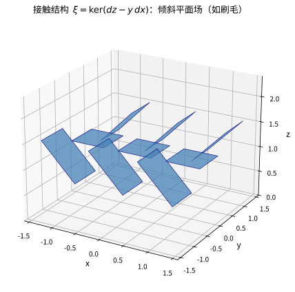
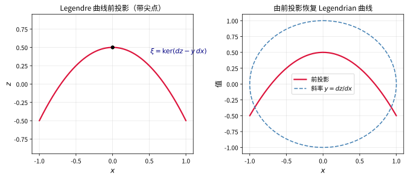

# 第65级：接触几何

## 学习目标

1. 理解接触结构、接触形式与接触流形的基本定义及性质。
2. 掌握 Darboux 定理（接触版本）及其证明——接触几何局部无不变量的思想。
3. 理解 Legendre 子流形的定义及其在接触几何中的核心地位。
4. 掌握 Reeb 向量场与接触向量场的概念。
5. 理解接触变换与接触同伦的基本思想。
6. 掌握 Gray 稳定性定理及其证明。
7. 了解 Stein 流形与 Weinstein 流形的概念及其与接触几何的联系。
8. 理解过切（Over-twisted）与紧贴（Tight）接触结构的区别。
9. 了解 Lutz 扭转与去除（Loose）接触结构的基本思想。

---

## 核心概念

### 1. 接触结构与接触流形

**定义**（接触结构）：
一个**接触结构** $\xi$ 是 $(2n+1)$ 维光滑流形 $M$ 上的一个余维数为 $1$ 的完全非可积的切分布。即：

- $\xi$ 是 $TM$ 的一个 $2n$ 维子丛。
- **完全非可积性**（最大非可积性）：若 $\xi$ 在局部上由 $1$-形式 $\alpha$ 的零空间定义（即 $\xi = \ker \alpha$），则 $\alpha$ 满足：
  $$
  \alpha \wedge (d\alpha)^n \neq 0
  $$
  处处成立（即它是一个体积形式）。

**定义**（接触形式）：
满足上述条件的 $1$-形式 $\alpha$ 称为**接触形式**。接触形式不是唯一的：若 $f$ 是非零光滑函数，则 $\alpha' = f\alpha$ 定义同一个接触结构 $\xi$。

**定义**（接触流形）：
配备接触结构的流形 $(M, \xi)$ 称为**接触流形**。

**注**：接触流形必为奇数维。条件 $\alpha \wedge (d\alpha)^n \neq 0$ 等价于 $d\alpha$ 在 $\xi$ 上的限制是非退化的 $2$-形式——因此 $(\xi, d\alpha|_\xi)$ 在每点是一个辛向量空间。

> **直观理解（现实类比）**：接触结构像一把"三维刷子"的刷毛——在空间每个点都钉上一片倾斜的小平面，且相邻平面彼此"扭转"，绝不拼成一层可积的曲面。正如刷毛向各个方向倾斜、无法铺成一张平整的布，接触结构的平面场也处处扭转；条件 $\alpha \wedge (d\alpha)^n \neq 0$ 正是保证这种"扭不齐"的数学表达。

### 2. Reeb 向量场

**定义**：
给定接触形式 $\alpha$，**Reeb 向量场** $R_\alpha$ 是由以下条件唯一确定的向量场：
$$
\alpha(R_\alpha) = 1, \quad \iota_{R_\alpha} d\alpha = 0.
$$
即 $R_\alpha$ 是 $d\alpha$ 的零方向，且被 $\alpha$ 归一化。

**注**：Reeb 向量场横截于接触结构 $\xi$，且其流保持 $\alpha$（在指数意义下）。

### 3. 接触向量场

**定义**：
向量场 $X$ 称为**接触向量场**，如果其流保持接触结构 $\xi$，即：
$$
\mathcal{L}_X \alpha = g\alpha
$$
对某个光滑函数 $g$ 成立。等价地，$\mathcal{L}_X \alpha \equiv 0 \pmod{\alpha}$。

### 4. Legendre 子流形

**定义**：
接触流形 $(M^{2n+1}, \xi)$ 中的子流形 $L \subset M$ 称为**Legendre 子流形**，如果：
- $\dim L = n$（最大维数的各向同性子流形）。
- $T_p L \subset \xi_p$ 对所有 $p \in L$ 成立。
- $d\alpha|_{T_p L} = 0$（即 $L$ 是 $d\alpha$ 的各向同性子流形）。

**例子**：
- 在标准接触空间 $(\mathbb{R}^{2n+1}, \xi_{\text{std}})$ 中，$\mathbb{R}^n \times \{0\}$ 是 Legendre 子流形。
- 余切丛的单位球面丛 $ST^*Q$ 中的纤维是 Legendre 子流形。

> **直观理解（现实类比）**：Legendre 子流形就像一条"永远顺着刷毛方向滑行"的曲线——在每个点它都必须与接触平面相切，因此它在二维"前投影"里会急剧折返并形成尖点。你可以想象一辆顺着倾斜地板滑行的车：它只能沿地面的倾斜方向走，一旦遇到"翻折"就必须急转弯，于是在正前方观察时留下尖点。

### 5. 接触变换与接触同伦

**定义**（接触变换）：
微分同胚 $\phi: M \to M$ 称为**接触变换**（或接触同构），如果 $\phi_* \xi = \xi$，即 $\phi^* \alpha = f\alpha$ 对某个非零函数 $f$ 成立。

**定义**（接触同伦）：
一族接触结构 $\{\xi_t\}_{t \in [0,1]}$ 称为**接触同伦**，如果存在光滑依赖于 $t$ 的接触形式 $\alpha_t$ 使得 $\xi_t = \ker \alpha_t$。

### 6. Stein 流形与 Weinstein 流形

**定义**（Stein 流形）：
一个**Stein 流形**是一个复流形 $X$，它全纯嵌入到某个 $\mathbb{C}^N$ 中作为闭子流形。

**定义**（Weinstein 流形）：
一个**Weinstein 流形**是一个辛流形 $(W, \omega)$ 配备一个完备的 Liouville 向量场 $Z$（即 $\mathcal{L}_Z \omega = \omega$）和一个 Morse 函数 $h: W \to \mathbb{R}$，使得 $Z$ 是 $h$ 的梯度向量场（相对于某个度量）。

**关键连接**：Stein 流形的边界自然带有接触结构。Weinstein 流形是 Stein 流形的辛类比。

### 7. 过切（Over-twisted）与紧贴（Tight）接触结构

**定义**（紧贴接触结构）：
三维流形上的接触结构 $\xi$ 称为**紧贴**（tight），如果不存在嵌入的圆盘 $D \subset M$ 使得 $TD \subset \xi$ 且 $\partial D$ 与 $\xi$ 相切（即不存在过切圆盘）。

**定义**（过切接触结构）：
三维流形上的接触结构 $\xi$ 称为**过切**（over-twisted），如果存在一个嵌入的过切圆盘（over-twisted disk），即一个嵌入圆盘 $D$ 使得 $TD \subset \xi$ 在边界附近成立，且 $\partial D$ 与 $\xi$ 相切。

**意义**：这是接触几何中最重要的分类区分。过切结构由 Eliashberg 完全分类，而紧贴结构的分类远更加复杂。

### 8. Lutz 扭转

**定义**（Lutz 扭转）：
Lutz 扭转是将三维流形上的接触结构沿一条闭曲线进行修改得到新接触结构的操作。具体地，沿一条横截于 $\xi$ 的闭曲线 $\gamma$，将 $\xi$ 扭转某个角度，产生一个过切圆盘。

**意义**：Lutz 扭转是构造过切接触结构的基本工具。

### 9. 去除（Loose）接触结构

**定义**（去除接触结构）：
高维（$> 3$）接触结构称为**去除**（loose），如果它包含一个"去除图"（loose chart）——一个特殊的局部结构，使得该接触结构在某种意义上是"可的形变"的。

**意义**：Eliashberg 与 Murphy 在 2013 年证明了高维去除接触结构的 $h$-原理，表明去除接触结构由代数拓扑数据完全分类。

---

## 定理与证明

### 定理 1：接触 Darboux 定理

> **定理**（Darboux，接触版本）：设 $(M^{2n+1}, \xi)$ 是接触流形，则对任意点 $p \in M$，存在局部坐标
> $$
> (x_1, \dots, x_n, y_1, \dots, y_n, z)
> $$
> 使得接触形式 $\alpha$ 可写为：
> $$
> \alpha = dz - \sum_{i=1}^n y_i \, dx_i.
> $$
> 等价地，存在坐标使得 $\xi = \ker(dz - \sum_{i=1}^n y_i \, dx_i)$。

**证明**：

**第一步：选取初始坐标**。
在 $p$ 点附近取任意坐标 $(u_1, \dots, u_{2n+1})$ 使得 $u_i(p) = 0$。设 $\alpha$ 是定义 $\xi$ 的接触形式。在 $p$ 点，令 $\xi_p = \ker \alpha_p$。由于 $d\alpha_p$ 在 $\xi_p$ 上非退化，$(\xi_p, d\alpha_p)$ 是一个 $2n$ 维辛向量空间。

**第二步：线性代数标准化**。
由辛线性代数，存在 $\xi_p$ 的一组基 $(e_1, \dots, e_n, f_1, \dots, f_n)$ 使得：
$$
d\alpha_p(e_i, e_j) = 0, \quad d\alpha_p(f_i, f_j) = 0, \quad d\alpha_p(e_i, f_j) = \delta_{ij}.
$$
取 $e_0 \notin \xi_p$ 使得 $\alpha_p(e_0) = 1$。则 $(e_0, e_1, \dots, e_n, f_1, \dots, f_n)$ 构成 $T_pM$ 的一组基。

**第三步：构造 Darboux 坐标**。
选择坐标函数 $(x_1, \dots, x_n, y_1, \dots, y_n, z)$ 使得在 $p$ 点：
- $dx_i(e_j) = \delta_{ij}$, $dx_i(f_j) = 0$, $dx_i(e_0) = 0$。
- $dy_i(e_j) = 0$, $dy_i(f_j) = \delta_{ij}$, $dy_i(e_0) = 0$。
- $dz(e_0) = 1$, $dz(e_i) = 0$, $dz(f_i) = 0$。

则 $\alpha_p = dz_p$（因为 $\alpha_p(e_0) = 1 = dz(e_0)$，且 $\alpha_p$ 在 $\xi_p = \ker \alpha_p$ 上为零，$dz$ 在 $\xi_p$ 上也为零）。

**第四步：Moser 方法**。
考虑标准接触形式 $\alpha_0 = dz - \sum_{i=1}^n y_i \, dx_i$，以及一族接触形式：
$$
\alpha_t = (1-t)\alpha_0 + t\alpha, \quad t \in [0, 1].
$$
在 $p$ 点附近足够小的邻域内，$\alpha_t$ 仍然满足接触条件（因为 $\alpha_t$ 在 $p$ 点等于 $\alpha_0$，且接触条件在开条件下是稳定的）。

**第五步：构造向量场**。
我们希望找到时间依赖的向量场 $X_t$，其流 $\phi_t$ 满足 $\phi_t^* \alpha_t = \alpha_0$。对时间求导：
$$
\frac{d}{dt}(\phi_t^* \alpha_t) = \phi_t^*\left( \mathcal{L}_{X_t} \alpha_t + \frac{d}{dt}\alpha_t \right) = 0.
$$
即 $\mathcal{L}_{X_t} \alpha_t + (\alpha - \alpha_0) = 0$。

由 Cartan 公式：$\mathcal{L}_{X_t} \alpha_t = d(\iota_{X_t} \alpha_t) + \iota_{X_t} d\alpha_t$。因此：
$$
d(\iota_{X_t} \alpha_t) + \iota_{X_t} d\alpha_t + (\alpha - \alpha_0) = 0. \tag{1}
$$

**第六步：求解 $X_t$**。
由于 $\alpha - \alpha_0$ 在 $p$ 点为零，我们可以尝试将 $X_t$ 分解为切向和横截部分。设：
$$
X_t = Y_t + f_t R_t,
$$
其中 $Y_t \in \xi_t = \ker \alpha_t$，$R_t$ 是 $\alpha_t$ 的 Reeb 向量场，$f_t$ 是光滑函数。

代入 $\iota_{X_t} \alpha_t = f_t$（因为 $\alpha_t(Y_t) = 0$, $\alpha_t(R_t) = 1$），以及 $\iota_{X_t} d\alpha_t = \iota_{Y_t} d\alpha_t$（因为 $\iota_{R_t} d\alpha_t = 0$）。

方程 (1) 变为：
$$
d f_t + \iota_{Y_t} d\alpha_t + (\alpha - \alpha_0) = 0.
$$

**第七步：分解方程**。
将方程限制在 $\xi_t$ 上。由于 $df_t$ 在 $\xi_t$ 上的限制是 $d_\xi f_t$（$\xi_t$ 上的微分），且 $\iota_{Y_t} d\alpha_t$ 是 $\xi_t$ 上的 $1$-形式（因为 $d\alpha_t$ 在 $\xi_t$ 上非退化），我们可以解出 $Y_t$：
$$
\iota_{Y_t} d\alpha_t = -(d_\xi f_t + (\alpha - \alpha_0)|_{\xi_t}).
$$
由于 $d\alpha_t$ 在 $\xi_t$ 上非退化，存在唯一的 $Y_t \in \xi_t$ 满足此方程。

横截方向由 $\alpha_t$ 作用给出：
$$
\alpha_t(\alpha - \alpha_0)^\sharp = \cdots
$$
更精确地，将 (1) 式作用于 $R_t$：
$$
(\mathcal{L}_{X_t} \alpha_t)(R_t) + (\alpha - \alpha_0)(R_t) = 0.
$$
由于 $\mathcal{L}_{X_t} \alpha_t = d(\iota_{X_t} \alpha_t) + \iota_{X_t} d\alpha_t$，且 $\alpha_t(R_t) = 1$，$d\alpha_t(R_t, \cdot) = 0$，我们得到：
$$
R_t(f_t) + (\alpha - \alpha_0)(R_t) = 0.
$$
这给出了 $f_t$ 沿 $R_t$ 方向的变化率。

**第八步：存在性与整合**。
上述方程在 $p$ 点附近有唯一解 $X_t$（以 $X_t(p) = 0$ 为初始条件）。其流 $\phi_t$ 在 $p$ 的某个邻域内有定义。令 $\phi = \phi_1$，则：
$$
\phi^* \alpha = \alpha_0.
$$
因此 $\phi$ 将 $\alpha$ 拉到标准形式 $\alpha_0$。取 $\phi^{-1}$ 即得所需的 Darboux 坐标。$\square$

---

### 定理 2：Gray 稳定性定理

> **定理**（Gray，1959 年）：设 $M$ 是紧致光滑流形，$\{\xi_t\}_{t \in [0,1]}$ 是 $M$ 上的一族光滑接触结构。则存在 $M$ 的微分同胚族 $\{\phi_t\}_{t \in [0,1]}$，使得 $\phi_t$ 光滑依赖于 $t$，$\phi_0 = \text{id}$，且 $(\phi_t)_* \xi_0 = \xi_t$ 对所有 $t \in [0,1]$ 成立。

**注**：Gray 稳定性定理表明，接触结构在紧致流形上的形变是平凡的——即接触结构在该形变下是"稳定"的，没有参数族中的本质变化。这与辛几何中的 Moser 稳定性定理类似。

**证明**：

**第一步：选择接触形式族**。
对每个 $t$，选择接触形式 $\alpha_t$ 使得 $\xi_t = \ker \alpha_t$。由于接触结构是光滑依赖于 $t$ 的，我们可以选择 $\alpha_t$ 也光滑依赖于 $t$。

**第二步：构造向量场**。
我们希望找到时间依赖的向量场 $X_t$，其流 $\phi_t$ 满足 $\phi_t^* \alpha_t = f_t \alpha_0$ 对某个非零函数 $f_t$ 成立（即 $\phi_t$ 是接触变换）。对 $t$ 求导得：
$$
\frac{d}{dt}(\phi_t^* \alpha_t) = \phi_t^*\left( \mathcal{L}_{X_t} \alpha_t + \frac{\partial \alpha_t}{\partial t} \right) = \frac{d f_t}{dt} \alpha_0.
$$

**第三步：简化条件**。
由于我们只要求 $\phi_t$ 将 $\xi_0$ 映到 $\xi_t$（而不是精确保持 $\alpha_t$ 到 $\alpha_0$ 的拉回关系），我们可以放宽条件。实际上，我们只需要存在非零函数 $g_t$ 使得：
$$
\phi_t^* \alpha_t = g_t \alpha_0.
$$
等价地，$(\phi_t)_* \xi_0 = \xi_t$。

**第四步：构造 $X_t$ 的方程**。
对 $\phi_t^* \alpha_t = g_t \alpha_0$ 两边求导：
$$
\phi_t^*\left( \mathcal{L}_{X_t} \alpha_t + \frac{\partial \alpha_t}{\partial t} \right) = \frac{d g_t}{dt} \alpha_0.
$$
代入 $\phi_t^* \alpha_t = g_t \alpha_0$，得到：
$$
\mathcal{L}_{X_t} \alpha_t + \frac{\partial \alpha_t}{\partial t} = \frac{d g_t}{dt} \cdot \frac{1}{g_t} \cdot \alpha_t.
$$
令 $h_t = \frac{d}{dt}(\log g_t)$，则：
$$
\mathcal{L}_{X_t} \alpha_t + \frac{\partial \alpha_t}{\partial t} = h_t \alpha_t. \tag{2}
$$

**第五步：利用接触条件**。
由 Cartan 公式，$\mathcal{L}_{X_t} \alpha_t = d(\iota_{X_t} \alpha_t) + \iota_{X_t} d\alpha_t$。设 $f_t = \alpha_t(X_t)$，则 (2) 式变为：
$$
d f_t + \iota_{X_t} d\alpha_t + \frac{\partial \alpha_t}{\partial t} = h_t \alpha_t. \tag{3}
$$

**第六步：分解 $X_t$**。
将 $X_t$ 分解为切向和横截部分：
$$
X_t = Y_t + f_t R_t,
$$
其中 $Y_t \in \xi_t = \ker \alpha_t$，$R_t$ 是 $\alpha_t$ 的 Reeb 向量场，$f_t = \alpha_t(X_t)$。

由于 $\iota_{R_t} d\alpha_t = 0$，$\iota_{X_t} d\alpha_t = \iota_{Y_t} d\alpha_t$。方程 (3) 变为：
$$
d f_t + \iota_{Y_t} d\alpha_t + \frac{\partial \alpha_t}{\partial t} = h_t \alpha_t. \tag{4}
$$

**第七步：限制在 $\xi_t$ 上**。
将 (4) 式限制在 $\xi_t$ 上（即作用于 $\xi_t$ 中的向量），$\alpha_t|_{\xi_t} = 0$，因此：
$$
d_\xi f_t + \iota_{Y_t} d\alpha_t + \left.\frac{\partial \alpha_t}{\partial t}\right|_{\xi_t} = 0. \tag{5}
$$
其中 $d_\xi f_t$ 是 $f_t$ 在 $\xi_t$ 方向上的微分。

由于 $d\alpha_t$ 在 $\xi_t$ 上非退化，方程 (5) 唯一确定了 $Y_t \in \xi_t$（给定 $f_t$ 和 $\frac{\partial \alpha_t}{\partial t}$）。

**第八步：选择 $f_t$**。
将 (4) 式作用于 $R_t$：
$$
R_t(f_t) + \frac{\partial \alpha_t}{\partial t}(R_t) = h_t \alpha_t(R_t) = h_t.
$$
由于 $R_t$ 横截于 $\xi_t$，我们可以自由选择 $h_t$ 来确保解的全局存在性。最简单的选择是取 $h_t = 0$，则：
$$
R_t(f_t) = -\frac{\partial \alpha_t}{\partial t}(R_t).
$$
这给出了 $f_t$ 沿 $R_t$ 方向的变化率。

**第九步：存在性与唯一性**。
在紧致流形 $M$ 上，上述方程有唯一解 $X_t$（因为 $d\alpha_t$ 在 $\xi_t$ 上的非退化性保证了 $Y_t$ 的唯一性，而 $R_t$ 方向的方程给出了 $f_t$ 沿流线的确定）。$X_t$ 的流 $\phi_t$ 对所有时间存在。由构造，$(\phi_t)_* \xi_0 = \xi_t$。$\square$

**推论**：在紧致接触流形上，接触结构在 $C^1$ 小形变下是稳定的——即充分接近的接触结构必同构。

---

### 定理 3：接触结构的存在性（Martin-Lutz 定理）

> **定理**（Martin-Lutz，1977 年）：每个闭可定向的 $3$ 维流形上均存在接触结构。

**注**：这是接触几何中第一个重要的存在性定理。在此之前，人们甚至不知道哪些流形上存在接触结构。Lutz 和 Martin 独立地证明了所有 $3$ 维流形上都存在接触结构。

**证明**：

**第一步：约化到存在性**。
由 $3$ 维流形的分类（Moise 定理和 Thurston 几何化猜想——现已证明），每个闭可定向 $3$ 维流形可分解为素流形的连通和。因此只需证明：
1. 每个素 $3$ 维流形上存在接触结构。
2. 连通和保持存在性。

**第二步：构造接触结构的 Lutz 扭转方法**。
Lutz 扭转的基本思想是：沿一条横截于 $\xi$ 的闭曲线 $\gamma$ 修改接触结构。具体构造如下：

设 $\gamma \subset M$ 是一条光滑闭曲线，$N(\gamma) \cong S^1 \times D^2$ 是 $\gamma$ 的管状邻域。在 $N(\gamma)$ 上取坐标 $(\theta, r, \phi)$，其中 $\theta \in S^1$ 是沿 $\gamma$ 的方向，$(r, \phi)$ 是圆盘 $D^2$ 上的极坐标。

定义 $N(\gamma)$ 上的接触形式：
$$
\alpha = \cos(2\pi r) \, d\theta + \sin(2\pi r) \, d\phi.
$$
在 $r = 0$ 附近，$\alpha \approx d\theta + 2\pi r \, d\phi$，这是标准的接触形式。在 $r = 1$ 附近，$\alpha \approx d\theta$，这定义了另一个接触结构。

**第三步：验证接触条件**。
计算：
$$
d\alpha = -2\pi \sin(2\pi r) \, dr \wedge d\theta + 2\pi \cos(2\pi r) \, dr \wedge d\phi.
$$
则：
$$
\alpha \wedge d\alpha = [\cos(2\pi r) \, d\theta + \sin(2\pi r) \, d\phi] \wedge [-2\pi \sin(2\pi r) \, dr \wedge d\theta + 2\pi \cos(2\pi r) \, dr \wedge d\phi].
$$
展开得：
$$
\alpha \wedge d\alpha = 2\pi \cos^2(2\pi r) \, d\theta \wedge dr \wedge d\phi - 2\pi \sin^2(2\pi r) \, d\phi \wedge dr \wedge d\theta.
$$
由于 $d\theta \wedge dr \wedge d\phi = - d\phi \wedge dr \wedge d\theta$，合并得：
$$
\alpha \wedge d\alpha = 2\pi (\cos^2(2\pi r) + \sin^2(2\pi r)) \, d\theta \wedge dr \wedge d\phi = 2\pi \, d\theta \wedge dr \wedge d\phi \neq 0.
$$
因此 $\alpha$ 是接触形式。

**第四步：构造过切圆盘**。
在 $r = \frac{1}{2}$ 处，$\alpha = \cos(\pi) \, d\theta + \sin(\pi) \, d\phi = -d\theta$，此时 $\ker \alpha$ 包含 $\partial/\partial r$ 和 $\partial/\partial \phi$ 方向。沿 $r = \frac{1}{2}$ 的圆盘边界，$\xi$ 的 twisting 使得圆盘成为过切圆盘。

**第五步：证明存在性**。
在 $S^3$ 上存在标准紧贴接触结构（作为 $\mathbb{C}^2$ 中单位球面的边界诱导的接触结构）。通过 Lutz 扭转，可以在 $S^3$ 上构造过切接触结构。

对于一般的 $3$ 维流形 $M$，首先取 $M$ 上的一个 $S^1$ 丛结构（由 $3$ 维流形的开书分解存在性，这总是可能的）。在 $S^1$ 纤维的方向上，通过适当的扭转构造接触形式。

**第六步：开书分解（Giroux 对应）**。
Giroux 在 2000 年建立了 $3$ 维流形上接触结构与开书分解之间的对应关系。每个接触结构对应一个开书分解，反之亦然。由于每个 $3$ 维流形都有开书分解（Alexander 定理），因此每个 $3$ 维流形上都有接触结构。$\square$

---

### 定理 4：过切接触结构的分类（Eliashberg 定理）

> **定理**（Eliashberg，1989 年）：设 $M$ 是闭可定向 $3$ 维流形。则过切接触结构在 $\xi_0$ 的同伦类（作为 $2$-维平面分布）与接触同痕类之间存在一一对应：
> $$
> \frac{\text{过切接触结构}}{\text{接触同痕}} \cong \frac{\text{可定向 $2$-平面分布}}{\text{同伦}}.
> $$

**注**：这是 $3$ 维接触几何中最深刻的定理之一。它表明过切接触结构完全由代数拓扑数据（平面分布的同伦类）分类，而紧贴接触结构则包含更多的几何信息。

**证明思路**：

**第一步：$h$-原理的建立**。
Eliashberg 证明过切接触结构满足 $h$-原理（同伦原理）。$h$-原理的基本思想是：对于过切接触结构，几何存在性问题可以约化为代数拓扑问题。

具体地，考虑接触结构作为 $TM$ 的 $2$-维子丛。不考虑可积性条件，每个 $2$-维子丛同伦于某个接触结构（对过切情形）。

**第二步：构造性证明**。
给定一个 $2$-维平面分布 $\eta$（不一定可积），通过局部修改（Lutz 扭转），可以将其变形为一个过切接触结构，且该变形在过切意义下是唯一的。

**第三步：唯一性**。
若 $\xi_0$ 和 $\xi_1$ 是两个过切接触结构，且它们作为平面分布是同伦的，则存在一族过切接触结构 $\xi_t$ 连接它们。由 Gray 稳定性，该同伦可通过接触同痕实现。

**第四步：关键引理——过切圆盘的填充**。
过切圆盘的存在性允许"过切手术"：如果两个接触结构在某个圆盘外相同，则它们可以通过一系列过切手术相互转化。这类似于 Morse 理论中的手柄附件。

**第五步：分类结果的陈述**。
因此，过切接触结构的分类问题约化为 $M$ 上可定向 $2$-平面分布的同伦分类。后者由 $M$ 的第二上同调群和 Euler 类的组合数据决定。具体地，同伦类由 $c_1(\xi) \in H^2(M; \mathbb{Z})$（第一 Chern 类）和 $d_2(\xi) \in H^3(M; \mathbb{Z})$（某个 $3$-维障碍类）确定。

在 $3$ 维流形上，$H^3(M; \mathbb{Z}) \cong \mathbb{Z}$，因此过切接触结构的分类由 $c_1(\xi)$ 和某个整数（Hopf 不变量）完全确定。$\square$

---

## 示例

### 示例 1：$\mathbb{R}^3$ 的标准接触结构

**定义**：
$\mathbb{R}^3$ 上的标准接触形式为：
$$
\alpha_{\text{std}} = dz - y \, dx.
$$
其接触结构 $\xi_{\text{std}} = \ker \alpha_{\text{std}}$ 由向量场 $\partial/\partial x + y \, \partial/\partial z$ 和 $\partial/\partial y$ 张成。

**验证**：
计算 $\alpha_{\text{std}} \wedge d\alpha_{\text{std}}$：
$$
d\alpha_{\text{std}} = -dy \wedge dx = dx \wedge dy,
$$
$$
\alpha_{\text{std}} \wedge d\alpha_{\text{std}} = (dz - y \, dx) \wedge (dx \wedge dy) = dz \wedge dx \wedge dy = dx \wedge dy \wedge dz \neq 0.
$$
因此 $\alpha_{\text{std}}$ 是接触形式。

**Reeb 向量场**：
由 $\alpha_{\text{std}}(R) = 1$ 和 $\iota_R d\alpha_{\text{std}} = 0$，解得 $R = \partial/\partial z$。

**几何直观**：
$\xi_{\text{std}}$ 可以看作 $\mathbb{R}^3$ 中每点处的一个倾斜平面族。在点 $(x, y, z)$ 处，$\xi$ 由向量 $(1, 0, y)$ 和 $(0, 1, 0)$ 张成，即该平面沿 $y$ 方向水平，沿 $x$ 方向倾斜（斜率为 $y$）。

### 示例 2：$\mathbb{R}^{2n+1}$ 的标准接触结构

**定义**：
$\mathbb{R}^{2n+1}$ 上的标准接触形式为：
$$
\alpha_{\text{std}} = dz - \sum_{i=1}^n y_i \, dx_i.
$$
其接触结构 $\xi_{\text{std}} = \ker \alpha_{\text{std}}$。

**验证**：
$$
d\alpha_{\text{std}} = \sum_{i=1}^n dx_i \wedge dy_i,
$$
$$
\alpha_{\text{std}} \wedge (d\alpha_{\text{std}})^n = (dz - \sum_{i=1}^n y_i \, dx_i) \wedge (\sum_{i=1}^n dx_i \wedge dy_i)^{\wedge n}
= n! \, dz \wedge dx_1 \wedge dy_1 \wedge \cdots \wedge dx_n \wedge dy_n \neq 0.
$$

**Reeb 向量场**：
$R = \partial/\partial z$。

**注**：这是接触几何中最重要的例子，类似于辛几何中的标准辛空间 $(\mathbb{R}^{2n}, \omega_0)$。

### 示例 3：过切接触结构的构造

**问题**：在 $S^3$ 上构造过切接触结构。

**解**：

**第一步：$S^3$ 的标准紧贴接触结构**。
将 $S^3$ 视为 $\mathbb{C}^2$ 中的单位球面 $|z_1|^2 + |z_2|^2 = 1$。$S^3$ 上的标准接触结构由以下 $1$-形式定义：
$$
\alpha_0 = \frac{i}{2} \sum_{j=1}^2 (z_j \, d\bar{z}_j - \bar{z}_j \, dz_j) \bigg|_{S^3}.
$$
这是 $S^3$ 上的紧贴接触结构（称为标准紧贴接触结构）。

**第二步：Lutz 扭转**。
沿 $S^3$ 中的一条闭曲线 $\gamma$（例如 $S^1 = \{(z_1, 0) \mid |z_1| = 1\}$）进行 Lutz 扭转。在 $\gamma$ 的管状邻域 $N(\gamma) \cong S^1 \times D^2$ 中，将接触形式修改为：
$$
\alpha = \cos(2\pi r) \, d\theta + \sin(2\pi r) \, d\phi,
$$
其中 $(r, \phi)$ 是 $D^2$ 上的极坐标，$\theta$ 是 $S^1$ 坐标。

**第三步：验证**。
在 $N(\gamma)$ 外部，$\alpha$ 与 $\alpha_0$ 一致。在 $N(\gamma)$ 内部，$\alpha$ 定义了接触结构。由于 Lutz 扭转引入了过切圆盘，得到的接触结构是过切的。

**第四步：分类**。
由 Eliashberg 分类，$S^3$ 上的过切接触结构由其 Euler 类 $c_1(\xi) \in H^2(S^3; \mathbb{Z}) = 0$ 和 Hopf 不变量 $d_3(\xi) \in \mathbb{Z}$ 分类。对于最简单的 Lutz 扭转，$d_3(\xi) = 1$。

---

## 习题

### 习题 1
验证：$\mathbb{R}^3$ 上的形式 $\alpha = dz - y \, dx$ 是接触形式，并找出其 Reeb 向量场。

**提示**：计算 $\alpha \wedge d\alpha$ 并验证其非零。Reeb 向量场 $R$ 满足 $\alpha(R) = 1$ 和 $\iota_R d\alpha = 0$。设 $R = a\partial_x + b\partial_y + c\partial_z$，解方程组。

### 习题 2
证明：$\mathbb{R}^{2n+1}$ 上的标准接触形式 $\alpha_{\text{std}} = dz - \sum_{i=1}^n y_i \, dx_i$ 满足 $\alpha_{\text{std}} \wedge (d\alpha_{\text{std}})^n \neq 0$。

**提示**：计算 $(d\alpha_{\text{std}})^n = n! \, dx_1 \wedge dy_1 \wedge \cdots \wedge dx_n \wedge dy_n$，然后计算 $\alpha_{\text{std}} \wedge (d\alpha_{\text{std}})^n$。

### 习题 3
设 $M = \mathbb{R}^3$，$\xi = \ker \alpha$ 其中 $\alpha = \cos z \, dx - \sin z \, dy$。验证 $\xi$ 是接触结构，并找出其 Legendre 曲线。

**提示**：计算 $\alpha \wedge d\alpha$。Legendre 曲线 $\gamma(t) = (x(t), y(t), z(t))$ 满足 $\alpha(\dot{\gamma}(t)) = 0$，即 $\cos z \, \dot{x} - \sin z \, \dot{y} = 0$。

### 习题 4
证明：在 Darboux 坐标 $(x, y, z)$ 下，$\mathbb{R}^3$ 中曲面 $z = f(x, y)$ 是 Legendre 曲面当且仅当 $f$ 满足 $f_x = y$。

**提示**：曲面 $z = f(x, y)$ 由参数化 $(x, y) \mapsto (x, y, f(x, y))$ 给出。计算 $\alpha = dz - y \, dx$ 在该参数化上的拉回，并令其为零。

### 习题 5
证明：若 $\alpha$ 是接触形式，则 $d\alpha$ 在 $\xi = \ker \alpha$ 上的限制是辛形式。

**提示**：由接触条件 $\alpha \wedge (d\alpha)^n \neq 0$，证明 $d\alpha|_\xi$ 是非退化的。假设存在非零 $v \in \xi$ 使得 $d\alpha(v, w) = 0$ 对所有 $w \in \xi$ 成立，导出矛盾。

### 习题 6
证明：在 $3$ 维流形上，接触结构 $\xi$ 的过切圆盘的存在性等价于 $\xi$ 中存在一个嵌入的圆盘 $D$ 使得 $TD \subset \xi$ 在 $\partial D$ 附近且 $\partial D$ 与 $\xi$ 相切。

**提示**：过切圆盘的定义是 $D$ 上存在一个点 $p \in \text{int}(D)$ 使得 $T_p D = \xi_p$。证明 $TD \subset \xi$ 在边界附近意味着 $\partial D$ 是 Legendre 曲线，且 $D$ 的"旋转数"非零。

### 习题 7
构造 $S^1 \times S^2$ 上的一个接触结构，并证明它是紧贴的。

**提示**：$S^1 \times S^2$ 可视为 $\mathbb{R}^3 \setminus \{0\}$ 在缩放作用下的商。考虑 $\mathbb{R}^3 \setminus \{0\}$ 上的接触形式 $\alpha = dz - y \, dx + x \, dy$ 在商下的像。

### 习题 8
证明：Lutz 扭转构造的 $\alpha = \cos(2\pi r) \, d\theta + \sin(2\pi r) \, d\phi$ 在 $S^1 \times D^2$ 上定义了接触结构，且该接触结构在 $r = 0$ 附近与标准接触结构同构。

**提示**：在 $r = 0$ 附近，$\cos(2\pi r) \approx 1 - 2\pi^2 r^2$，$\sin(2\pi r) \approx 2\pi r$，因此 $\alpha \approx d\theta + 2\pi r \, d\phi$。通过坐标变换 $(x, y) = (r \cos \phi, r \sin \phi)$，可化为标准形式。

---

## 总结

接触几何是辛几何的奇数维对应，也是经典力学中接触变换的几何化语言。

**核心要点**：

1. **接触结构**：奇数维流形上的完全非可积超平面分布。条件 $\alpha \wedge (d\alpha)^n \neq 0$ 是最大非可积性条件，意味着 $\xi$ 在每点附近"扭转"。

2. **Darboux 定理**：接触几何没有局部不变量——所有接触流形局部上同构于标准接触空间 $(\mathbb{R}^{2n+1}, dz - \sum y_i \, dx_i)$。这与辛几何的 Darboux 定理类似。

3. **Reeb 向量场**：横截于接触结构的特征向量场，由接触形式唯一确定。Reeb 向量场的动力学是接触几何的重要研究对象。

4. **Legendre 子流形**：接触几何中的基本对象，是辛几何中 Lagrangian 子流形的类比。在 $n$ 维接触流形中，Legendre 子流形是 $n$ 维各向同性子流形。

5. **Gray 稳定性**：紧致流形上的接触结构在形变下是稳定的——形变族可通过微分同胚实现。这类似于辛几何中的 Moser 稳定性。

6. **存在性**：每个闭可定向 $3$ 维流形上都存在接触结构（Martin-Lutz 定理）。通过 Lutz 扭转和开书分解可以构造具体的接触结构。

7. **过切与紧贴**：
   - **紧贴结构**：没有过切圆盘，几何上更"刚性"，分类更复杂。
   - **过切结构**：存在过切圆盘，满足 $h$-原理，由 Eliashberg 完全分类——同伦等价于平面分布的同伦分类。

8. **高维发展**：
   - **Stein/Weinstein 流形**：接触结构作为其边界结构出现。
   - **去除接触结构**：高维情况下的 $h$-原理（Eliashberg-Murphy）。
   - **Giroux 对应**：接触结构与开书分解的一一对应。

接触几何是联系辛几何、拓扑、动力系统和低维拓扑的重要桥梁，在 $3$ 维流形拓扑和辛拓扑中扮演着核心角色。