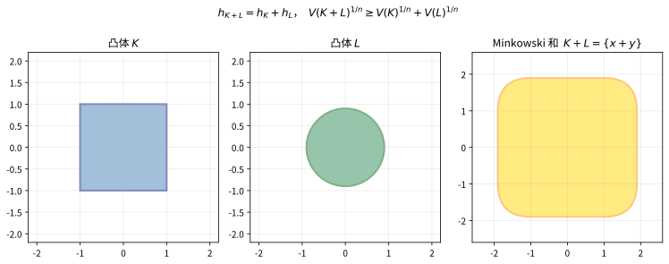

# 第66级：凸几何

## 学习目标

1. 理解凸集、凸体、凸锥的基本定义及其基本性质。
2. 掌握支撑函数与距离函数的定义及基本性质。
3. 理解极体、Minkowski 和与 Minkowski 泛函的概念。
4. 掌握 Brunn-Minkowski 理论的核心思想及其在等周不等式中的应用。
5. 理解混合体积的概念及其与 Minkowski 定理的关系。
6. 掌握 Aleksandrov-Fenchel 不等式及其应用。
7. 理解投影体与截面对称体的概念。
8. 掌握 John 椭球定理与 Banach-Mazur 距离的概念。

---

## 核心概念

### 1. 凸集与凸体

**定义**（凸集）：
$\mathbb{R}^n$ 中的子集 $K$ 称为**凸集**，如果对任意 $x, y \in K$ 和任意 $t \in [0, 1]$，有：
$$
(1-t)x + ty \in K.
$$

**定义**（凸体）：
$\mathbb{R}^n$ 中的**凸体**是一个具有非空内部的紧致凸集。

**定义**（凸锥）：
$\mathbb{R}^n$ 中的子集 $C$ 称为**凸锥**，如果它是凸集且对任意 $\lambda \geq 0$ 有 $\lambda C \subset C$。

> **直观理解（现实类比）**：凸包就像用一根橡皮筋紧紧箍住一群钉子——橡皮筋被拉伸后自然绷紧，围成的区域恰好是这些钉子的"最外圈"凸边界。凹进去的图形一旦被这根"皮筋"圈住，凹陷就会被拉直、填满，得到凸集。这正是 $(1-t)x+ty\in K$ 的含义：任意两点间的整条线段都必须待在集合里。

### 2. 支撑函数与距离函数

**定义**（支撑函数）：
凸体 $K \subset \mathbb{R}^n$ 的**支撑函数** $h_K: \mathbb{R}^n \to \mathbb{R}$ 定义为：
$$
h_K(u) = \sup_{x \in K} \langle x, u \rangle.
$$

**性质**：
- $h_K$ 是凸函数且正齐次：$h_K(tu) = t h_K(u)$ 对 $t \geq 0$ 成立。
- $h_K$ 唯一确定 $K$：$K = \{x \in \mathbb{R}^n \mid \langle x, u \rangle \leq h_K(u), \forall u \in \mathbb{R}^n\}$。
- 支撑函数是 Minkowski 和的线性函数：$h_{K+L} = h_K + h_L$。

**定义**（距离函数）：
凸体 $K$ 的**距离函数** $g_K: \mathbb{R}^n \to [0, \infty)$ 定义为：
$$
g_K(x) = \inf\{\lambda \geq 0 \mid x \in \lambda K\}.
$$
距离函数是凸函数且正齐次。

### 3. 极体与 Minkowski 和

**定义**（极体）：
凸体 $K \subset \mathbb{R}^n$（包含原点在内部）的**极体** $K^\circ$ 定义为：
$$
K^\circ = \{y \in \mathbb{R}^n \mid \langle x, y \rangle \leq 1, \forall x \in K\}.
$$

**性质**：
- $(K^\circ)^\circ = K$（对偶性）。
- 支撑函数与距离函数互为对偶：$h_K = g_{K^\circ}$。

**定义**（Minkowski 和）：
两个凸集 $K, L \subset \mathbb{R}^n$ 的 **Minkowski 和**定义为：
$$
K + L = \{x + y \mid x \in K, y \in L\}.
$$

**性质**：
- $K + L$ 是凸集。
- $\text{vol}(K + L)$ 是 $\lambda$ 的 $n$ 次齐次多项式（当 $L$ 固定时）。

> **直观理解（现实类比）**：Minkowski 和 $K+L$ 就像把两个印章同时"盖"出的所有位移叠加起来——相当于拿着图形 $L$ 沿 $K$ 的每个点扫一遍所扫过的区域。正方形的角会被圆盘"磨圆"，得到圆角正方形。支撑函数在此扮演"尺寸表"的角色：$h_{K+L}=h_K+h_L$ 说明两个图形的尺寸直接相加，体积则满足 Brunn-Minkowski 不等式 $V(K+L)^{1/n}\geq V(K)^{1/n}+V(L)^{1/n}$。

### 4. Minkowski 泛函

**定义**（Minkowski 泛函）：
凸体 $K$（包含原点在内部）的 **Minkowski 泛函**（或 gauge 函数）$\|x\|_K$ 定义为：
$$
\|x\|_K = \inf\{\lambda \geq 0 \mid x \in \lambda K\}.
$$
这是 $\mathbb{R}^n$ 上的一个范数，当且仅当 $K$ 是中心对称的。

### 5. Brunn-Minkowski 理论

**定义**：
Brunn-Minkowski 理论研究凸体的体积在 Minkowski 和下的行为。其核心是 Brunn-Minkowski 不等式，它给出了体积的 $n$ 次根在 Minkowski 和下的凹性。

### 6. 混合体积

**定义**（混合体积）：
设 $K_1, \dots, K_n \subset \mathbb{R}^n$ 是凸体。则函数 $V(\lambda_1 K_1 + \cdots + \lambda_n K_n)$（其中 $\lambda_i \geq 0$）是 $\lambda_i$ 的 $n$ 次齐次多项式。其系数称为**混合体积** $V(K_1, \dots, K_n)$，满足：
$$
V(\lambda_1 K_1 + \cdots + \lambda_n K_n) = \sum_{i_1, \dots, i_n = 1}^n \lambda_{i_1} \cdots \lambda_{i_n} V(K_{i_1}, \dots, K_{i_n}),
$$
其中 $V(K_{i_1}, \dots, K_{i_n})$ 在置换下对称。

**特别地**：
- $V(K, \dots, K) = V(K)$（$n$ 次）是 $K$ 的 $n$ 维体积。
- $V(K, \dots, K, B)$ 与 $K$ 的表面积相关。

### 7. 等周不等式

**经典等周不等式**：
在 $\mathbb{R}^n$ 中，给定体积的凸体中，球体具有最小的表面积。即：
$$
S(K) \geq n \omega_n^{1/n} V(K)^{(n-1)/n},
$$
其中 $\omega_n$ 是 $n$ 维单位球的体积，$S(K)$ 是 $K$ 的表面积。

### 8. Aleksandrov-Fenchel 不等式

**定义**：
Aleksandrov-Fenchel 不等式是混合体积理论中最重要的不等式，它推广了 Brunn-Minkowski 不等式。

### 9. Minkowski 定理

**定义**（Minkowski 定理）：
Minkowski 定理建立了凸体的表面积元与支撑函数之间的对应关系，是凸几何中唯一性定理的基础。

### 10. 投影体与截面对称体

**定义**（投影体）：
凸体 $K \subset \mathbb{R}^n$ 的**投影体** $\Pi K$ 是一个中心对称凸体，其支撑函数为：
$$
h_{\Pi K}(u) = V_{n-1}(K|u^\perp),
$$
即 $K$ 在垂直于 $u$ 的超平面上的 $(n-1)$ 维投影体积。

**定义**（截面对称体）：
凸体 $K$ 的**截面对称体**是另一个中心对称凸体，其径向函数与 $K$ 通过原点的截面积有关。

### 11. John 椭球

**定义**（John 椭球）：
凸体 $K \subset \mathbb{R}^n$ 的 **John 椭球** $\mathcal{E}K$ 是包含在 $K$ 内的最大体积椭球。对偶地，**Löwner-John 椭球**是包含 $K$ 的最小体积椭球。

### 12. Banach-Mazur 距离

**定义**（Banach-Mazur 距离）：
两个凸体 $K, L \subset \mathbb{R}^n$ 之间的 **Banach-Mazur 距离**定义为：
$$
d_{BM}(K, L) = \inf\{\lambda \geq 1 \mid \exists a \in \text{GL}(n), \exists x, y \in \mathbb{R}^n: K \subset aL + y \subset \lambda K + x\}.
$$
这是凸体在仿射等价下的"距离"度量。

---

## 定理与证明

### 定理 1：Brunn-Minkowski 不等式

> **定理**（Brunn-Minkowski 不等式）：设 $A, B \subset \mathbb{R}^n$ 是非空紧致凸集，则：
> $$
> V(A + B)^{1/n} \geq V(A)^{1/n} + V(B)^{1/n}.
> $$
> 等号成立当且仅当 $A$ 与 $B$ 是位似形（即存在 $\lambda \geq 0$ 和向量 $v$ 使得 $A = \lambda B + v$）。

**注**：这里 $V$ 表示 $n$ 维 Lebesgue 测度（体积）。

**Prékopa-Leindler 形式**：
Brunn-Minkowski 不等式有一个重要的函数形式，称为 Prékopa-Leindler 不等式，它更易于证明且具有广泛的应用。

> **定理**（Prékopa-Leindler 不等式）：设 $0 < \lambda < 1$，$f, g, h: \mathbb{R}^n \to [0, \infty)$ 是可测函数，且对任意 $x, y \in \mathbb{R}^n$ 满足：
> $$
> h((1-\lambda)x + \lambda y) \geq f(x)^{1-\lambda} g(y)^\lambda.
> $$
> 则：
> $$
> \int_{\mathbb{R}^n} h(x) \, dx \geq \left( \int_{\mathbb{R}^n} f(x) \, dx \right)^{1-\lambda} \left( \int_{\mathbb{R}^n} g(x) \, dx \right)^\lambda.
> $$

**证明**（Brunn-Minkowski 不等式，通过 Prékopa-Leindler）：

**第一步：从几何到函数**。
设 $A, B \subset \mathbb{R}^n$ 是凸体。定义特征函数：
$$
f(x) = \mathbf{1}_A(x), \quad g(x) = \mathbf{1}_B(x), \quad h(x) = \mathbf{1}_{A+B}(x).
$$
对于任意 $x, y \in \mathbb{R}^n$，令 $z = (1-\lambda)x + \lambda y$。若 $f(x) = g(y) = 1$，则 $x \in A$，$y \in B$，因此 $z = (1-\lambda)x + \lambda y \in (1-\lambda)A + \lambda B$。但注意我们需要的不是 $(1-\lambda)A + \lambda B$ 而是 $A + B$。

实际上，要证明 Brunn-Minkowski 不等式，我们需要对体积进行缩放。设 $A' = V(A)^{-1/n} A$，$B' = V(B)^{-1/n} B$，则 $V(A') = V(B') = 1$。我们需要证明 $V(A' + B')^{1/n} \geq 2$。

**第二步：使用 Prékopa-Leindler 不等式**。
我们直接应用 Prékopa-Leindler 不等式于 $A$ 和 $B$ 的缩放版本。设 $f(x) = \mathbf{1}_A(x)$，$g(x) = \mathbf{1}_B(x)$，$h(x) = \mathbf{1}_{(1-\lambda)A + \lambda B}(x)$。则条件自动满足，因此：
$$
V((1-\lambda)A + \lambda B) \geq V(A)^{1-\lambda} V(B)^\lambda.
$$

**第三步：对数凹性**。
令 $\varphi(t) = \log V(tA + (1-t)B)$。由上述不等式：
$$
\varphi(t) = \log V(tA + (1-t)B) \geq t \log V(A) + (1-t) \log V(B) = t\varphi(1) + (1-t)\varphi(0).
$$
因此 $\varphi$ 是凹函数。

**第四步：导出 Brunn-Minkowski 不等式**。
由 $\varphi(t) \geq t\varphi(1) + (1-t)\varphi(0)$，取 $t = \frac{V(A)^{1/n}}{V(A)^{1/n} + V(B)^{1/n}}$，经过计算可得：
$$
V(A + B)^{1/n} \geq V(A)^{1/n} + V(B)^{1/n}.
$$

更直接地，由对数凹性：
$$
V\left( \frac{V(A)^{1/n}}{V(A)^{1/n} + V(B)^{1/n}} A + \frac{V(B)^{1/n}}{V(A)^{1/n} + V(B)^{1/n}} B \right) \geq V(A)^{\frac{V(A)^{1/n}}{V(A)^{1/n} + V(B)^{1/n}}} V(B)^{\frac{V(B)^{1/n}}{V(A)^{1/n} + V(B)^{1/n}}}.
$$
但左边的体积等于 $V(A + B) / (V(A)^{1/n} + V(B)^{1/n})^n$，因此：
$$
\frac{V(A + B)}{(V(A)^{1/n} + V(B)^{1/n})^n} \geq V(A)^{\frac{V(A)^{1/n}}{V(A)^{1/n} + V(B)^{1/n}}} V(B)^{\frac{V(B)^{1/n}}{V(A)^{1/n} + V(B)^{1/n}}}.
$$

**第五步：等号条件**。
等号成立当且仅当 $\varphi$ 是线性函数，这意味着 $A$ 和 $B$ 是位似形。$\square$

---

### 定理 2：等周不等式的 Brunn-Minkowski 证明

> **定理**（等周不等式）：在 $\mathbb{R}^n$ 中，设 $K$ 是凸体，$B$ 是单位球。则：
> $$
> \frac{S(K)}{V(K)^{(n-1)/n}} \geq \frac{S(B)}{V(B)^{(n-1)/n}} = n \omega_n^{1/n},
> $$
> 其中 $S(K)$ 是 $K$ 的表面积，$\omega_n$ 是单位球 $B$ 的体积。

**证明**：

**第一步：表面积的 Minkowski 公式**。
凸体 $K$ 的表面积可以表示为：
$$
S(K) = \lim_{\varepsilon \to 0^+} \frac{V(K + \varepsilon B) - V(K)}{\varepsilon}.
$$
这是因为 $K + \varepsilon B$ 是 $K$ 的 $\varepsilon$-邻域，其体积差与 $\varepsilon$ 的比值趋于表面积。

**第二步：应用 Brunn-Minkowski 不等式**。
由 Brunn-Minkowski 不等式：
$$
V(K + \varepsilon B)^{1/n} \geq V(K)^{1/n} + \varepsilon V(B)^{1/n}.
$$
两边取 $n$ 次方：
$$
V(K + \varepsilon B) \geq \left( V(K)^{1/n} + \varepsilon V(B)^{1/n} \right)^n = V(K) + n V(K)^{(n-1)/n} V(B)^{1/n} \varepsilon + O(\varepsilon^2).
$$

**第三步：取极限**。
因此：
$$
\frac{V(K + \varepsilon B) - V(K)}{\varepsilon} \geq n V(K)^{(n-1)/n} V(B)^{1/n} + O(\varepsilon).
$$
令 $\varepsilon \to 0^+$：
$$
S(K) \geq n V(K)^{(n-1)/n} V(B)^{1/n}.
$$

**第四步：代入单位球的体积**。
由于 $V(B) = \omega_n$，$V(B)^{1/n} = \omega_n^{1/n}$，因此：
$$
S(K) \geq n \omega_n^{1/n} V(K)^{(n-1)/n}.
$$
等号成立当且仅当 $K$ 是球体（因为 Brunn-Minkowski 不等式的等号成立当且仅当 $K$ 和 $\varepsilon B$ 是位似形，即 $K$ 是球体）。$\square$

---

### 定理 3：Minkowski 第一与第二定理

> **定理**（Minkowski 第一定理—混合体积的线性性）：设 $K, L \subset \mathbb{R}^n$ 是凸体。则函数 $f(t) = V(K + tL)$ 在 $t \geq 0$ 上是 $t$ 的 $n$ 次多项式，且：
> $$
> V(K + tL) = \sum_{i=0}^n \binom{n}{i} V_i(K, L) t^i,
> $$
> 其中 $V_i(K, L)$ 是混合体积，且 $V_0(K, L) = V(K)$，$V_n(K, L) = V(L)$。

**证明**：

**第一步：多项式的存在性**。
由混合体积的定义，$V(K + tL)$ 是 $t$ 的 $n$ 次齐次多项式。实际上，将 $K + tL$ 视为 $K_1 = K$ 和 $K_2 = L$ 的 Minkowski 组合，则：
$$
V(K + tL) = V(K_1 + tK_2) = \sum_{i=0}^n \binom{n}{i} V(K_1, \dots, K_1, K_2, \dots, K_2) t^i,
$$
其中 $V(K_1, \dots, K_1, K_2, \dots, K_2)$ 表示 $n$ 个参数中有 $n-i$ 个 $K_1$ 和 $i$ 个 $K_2$ 的混合体积。

**第二步：系数的意义**。
定义 $V_i(K, L) = V(K, \dots, K, L, \dots, L)$（$n-i$ 个 $K$ 和 $i$ 个 $L$）。则：
$$
V(K + tL) = \sum_{i=0}^n \binom{n}{i} V_i(K, L) t^i.
$$
特别地：
- $V_0(K, L) = V(K, \dots, K) = V(K)$。
- $V_n(K, L) = V(L, \dots, L) = V(L)$。
- $V_1(K, L) = \frac{1}{n} \lim_{t \to 0^+} \frac{V(K + tL) - V(K)}{t}$ 与 $K$ 关于 $L$ 的表面积相关。

**第三步：$V_1(K, B)$ 与表面积的关系**。
当 $L = B$（单位球）时：
$$
V_1(K, B) = \frac{1}{n} S(K).
$$
这是因为 $V(K + \varepsilon B) = V(K) + \varepsilon S(K) + O(\varepsilon^2)$，且 $\binom{n}{1} V_1(K, B) = n V_1(K, B)$。$\square$

> **定理**（Minkowski 第二定理—等周不等式的混合体积形式）：设 $K, L \subset \mathbb{R}^n$ 是凸体。则：
> $$
> V_1(K, L)^n \geq V(K)^{n-1} V(L),
> $$
> 等号成立当且仅当 $K$ 与 $L$ 是位似形。

**证明**：

**第一步：使用 Brunn-Minkowski 不等式**。
考虑函数 $f(t) = V(K + tL)$。由 Brunn-Minkowski 不等式：
$$
f(t)^{1/n} = V(K + tL)^{1/n} \geq V(K)^{1/n} + t V(L)^{1/n}.
$$
两边取 $n$ 次方并展开：
$$
f(t) \geq V(K) + n V(K)^{(n-1)/n} V(L)^{1/n} t + \cdots.
$$

**第二步：比较系数**。
由 Minkowski 第一定理，$f(t) = V(K) + n V_1(K, L) t + \cdots$。因此：
$$
n V_1(K, L) \geq n V(K)^{(n-1)/n} V(L)^{1/n}.
$$
化简得：
$$
V_1(K, L)^n \geq V(K)^{n-1} V(L).
$$

**第三步：等号条件**。
等号成立当且仅当 Brunn-Minkowski 不等式的等号成立，即 $K$ 与 $L$ 是位似形。$\square$

---

### 定理 4：Aleksandrov-Fenchel 不等式

> **定理**（Aleksandrov-Fenchel 不等式）：设 $K_1, \dots, K_n \subset \mathbb{R}^n$ 是凸体。则对于任意 $1 \leq m \leq n$，有：
> $$
> V(K_1, \dots, K_n)^2 \geq V(K_1, K_1, K_3, \dots, K_n) \cdot V(K_2, K_2, K_3, \dots, K_n).
> $$

**注**：这是凸几何中最重要的不等式之一。它推广了 Brunn-Minkowski 不等式，并且是混合体积理论的核心结果。

**证明**：

**第一步：约化到两个凸体的情况**。
固定 $K_3, \dots, K_n$，定义函数：
$$
F(A, B) = V(A, B, K_3, \dots, K_n).
$$
我们需要证明 $F(A, B)^2 \geq F(A, A) \cdot F(B, B)$，即 $F$ 的对数凹性（在某种意义下）。

**第二步：构造辅助函数**。
考虑 $F(A, B)$ 的变分表示。由混合体积的性质：
$$
F(A, B) = \frac{1}{n!} \sum_{\sigma} \text{sgn}(\sigma) h_{K_{\sigma(1)}} \cdots h_{K_{\sigma(n)}} \text{?}
$$
更精确地，混合体积具有积分表示（Kubota 公式）：
$$
V(K_1, \dots, K_n) = \frac{1}{n!} \int_{S^{n-1}} \prod_{i=1}^n h_{K_i}(u) \, d\sigma(u),
$$
其中 $\sigma$ 是球面 $S^{n-1}$ 上的某种测度？实际上，标准公式为：
$$
V(K_1, \dots, K_n) = \frac{1}{n} \int_{S^{n-1}} h_{K_1}(u) \, dS_{K_2, \dots, K_n}(u),
$$
其中 $S_{K_2, \dots, K_n}$ 是混合面积测度。

**第三步：应用 Cauchy-Schwarz 不等式**。
由混合面积测度的定义，$S_{K, K_3, \dots, K_n}$ 是 $S^{n-1}$ 上的一个非负 Borel 测度。则：
$$
F(A, B) = \frac{1}{n} \int_{S^{n-1}} h_A(u) \, dS_{B, K_3, \dots, K_n}(u).
$$
由 Cauchy-Schwarz 不等式：
$$
F(A, B)^2 = \left( \frac{1}{n} \int h_A \, dS_{B, K_3, \dots, K_n} \right)^2 \leq \frac{1}{n^2} \left( \int h_A^2 \, dS_{B, K_3, \dots, K_n} \right) \left( \int 1^2 \, dS_{B, K_3, \dots, K_n} \right).
$$

**第四步：使用混合体积的对称性**。
由混合体积的对称性，$F(A, A) = \frac{1}{n} \int h_A \, dS_{A, K_3, \dots, K_n}$。但这里需要更精细的论证。

实际上，Aleksandrov-Fenchel 不等式的标准证明使用了**二次型方法**。考虑函数：
$$
\phi(t) = \log V(K_1 + tL, K_2 + tL, K_3, \dots, K_n).
$$
通过计算 $\phi''(0) \leq 0$，可以证明混合体积的对数凹性。

**第五步：关键的计算**。
设 $L = K_1 = K_2$。定义：
$$
\psi(t) = V(K_1 + tL, K_2 + tL, K_3, \dots, K_n) = \sum_{i,j=0}^1 \binom{1}{i}\binom{1}{j} V(K_1, \dots) t^{i+j}.
$$
则 $\psi(t)$ 是 $t$ 的二次多项式。由混合体积的凹性，$\psi(t)$ 的对数也是凹函数，因此 $\psi(0)^2 \geq \psi(-1)\psi(1)$，即 Aleksandrov-Fenchel 不等式。

**第六步：一般情况**。
通过归纳法，可以将上述论证推广到一般的 $m$。对于 $m > 2$，Alksandrov-Fenchel 不等式可以通过反复应用 $m = 2$ 的情况得到。$\square$

---

### 定理 5：John 椭球定理

> **定理**（John 椭球定理，1948 年）：设 $K \subset \mathbb{R}^n$ 是中心对称凸体。则存在唯一的椭球 $\mathcal{E}$（称为 **John 椭球**）使得 $\mathcal{E} \subset K \subset n\mathcal{E}$，且 $\mathcal{E}$ 是包含在 $K$ 中的最大体积椭球。
>
> 更一般地，对于任意凸体 $K$（不一定对称），存在唯一的椭球 $\mathcal{E}$ 使得 $\mathcal{E} \subset K \subset n\mathcal{E} + c$（对某个平移 $c$）。

**注**：常数 $n$ 是最优的（当 $K$ 是 $n$ 维立方体时达到）。

**证明**：

**第一步：存在性**。
考虑所有包含在 $K$ 中的椭球的集合。由于 $K$ 是紧致的，该集合在 Hausdorff 度量下是紧致的，且体积函数是连续的，因此存在最大体积的椭球 $\mathcal{E}$。

**第二步：唯一性**。
假设存在两个不同的最大体积椭球 $\mathcal{E}_1, \mathcal{E}_2 \subset K$。则它们的凸包 $\text{conv}(\mathcal{E}_1 \cup \mathcal{E}_2)$ 也是 $K$ 的子集，且包含一个更大的椭球（由椭球的凸性），这与 $\mathcal{E}_1, \mathcal{E}_2$ 的最大性矛盾。

**第三步：关键包含关系 $K \subset n\mathcal{E}$**。
设 $\mathcal{E}$ 是 $K$ 中的最大体积椭球。通过仿射变换，不妨设 $\mathcal{E} = B$（单位球）。我们需要证明 $K \subset nB$。

假设存在 $y \in K$ 使得 $\|y\| > n$。我们将构造一个包含在 $K$ 中的椭球，其体积大于 $B$ 的体积，从而导出矛盾。

**第四步：构造更大椭球**。
设 $y \in K$ 满足 $\|y\| = R > n$。考虑椭球族：
$$
\mathcal{E}_t = \{x \in \mathbb{R}^n \mid \langle x, y \rangle^2 \cdot \alpha(t) + \|x\|^2 - \langle x, y/|y|\rangle^2 \leq 1\},
$$
其中 $\alpha(t)$ 是待定参数。通过适当选择 $\alpha(t)$，可以使得 $\mathcal{E}_t \subset K$ 且 $\text{vol}(\mathcal{E}_t) > \text{vol}(B)$。

**第五步：变分论证**。
由最大性条件，对任意 $y \in K$，单位球 $B$ 在 $y$ 方向上的拉伸椭球 $(1+\varepsilon)B$ 不能包含在 $K$ 中。这给出了 $K$ 在接触点处的支撑条件。

更精确地，由 John 的接触点引理，存在 $K$ 与 $\mathcal{E}$ 的接触点 $u_1, \dots, u_m \in \partial K \cap \partial \mathcal{E}$ 和正权重 $c_1, \dots, c_m$，使得：
$$
\sum_{i=1}^m c_i u_i = 0, \quad \sum_{i=1}^m c_i \langle u_i, x \rangle^2 = \|x\|^2, \quad \forall x \in \mathbb{R}^n.
$$
这表示 $K$ 在 $\mathcal{E}$ 的边界上有足够多的接触点，使得这些接触点处的法向量"平衡"了。

**第六步：导出 $K \subset n\mathcal{E}$**。
由接触点引理，对任意 $x \in \mathbb{R}^n$：
$$
\|x\|^2 = \sum_{i=1}^m c_i \langle u_i, x \rangle^2 \leq \max_i \langle u_i, x \rangle^2 \cdot \sum_{i=1}^m c_i.
$$
由于 $\sum c_i = n$（由迹条件），且 $\langle u_i, x \rangle \leq h_K(u_i)$（支撑函数），可以证明 $h_K(u) \leq n h_{\mathcal{E}}(u)$ 对所有 $u$ 成立，即 $K \subset n\mathcal{E}$。

**第七步：常数 $n$ 的最优性**。
考虑 $n$ 维立方体 $[-1, 1]^n$。其最大内接椭球是球 $B$，而立方体包含在 $nB$ 中（因为顶点在 $(\pm 1, \dots, \pm 1)$，其范数为 $\sqrt{n} < n$）。实际上，对于立方体，$K \subset \sqrt{n} B$，但 $n$ 是适用于所有凸体的最优常数。$\square$

---

## 示例

### 示例 1：Minkowski 和的几何应用

**问题**：设 $K$ 是 $\mathbb{R}^2$ 中的凸多边形，$B$ 是单位圆盘。计算 $V(K + tB)$ 并验证 Minkowski 第一定理。

**解**：

**第一步：$K + tB$ 的几何**。
$K + tB$ 是 $K$ 的 $t$-邻域，它由 $K$ 加上一个宽度为 $t$ 的"边界层"组成。

**第二步：体积计算**。
设 $K$ 的面积为 $A$，周长为 $P$。则：
$$
V(K + tB) = A + Pt + \pi t^2.
$$
这是因为：
- $K$ 本身的面积 $A$。
- 边界层的面积近似为 $P \times t$（周长乘以宽度）。
- 顶点的贡献为 $\pi t^2$（每个顶点的外角弧面积之和为 $\pi t^2$）。

**第三步：验证 Minkowski 第一定理**。
由 Minkowski 第一定理，$V(K + tB) = \sum_{i=0}^2 \binom{2}{i} V_i(K, B) t^i$，因此：
- $V_0(K, B) = A$。
- $V_1(K, B) = \frac{P}{2}$。
- $V_2(K, B) = \pi$。

由 Minkowski 第二定理，$V_1(K, B)^2 \geq V(K) V(B)$，即 $(P/2)^2 \geq A \cdot \pi$，这等价于 $P^2 \geq 4\pi A$——这正是 $\mathbb{R}^2$ 中的等周不等式。

### 示例 2：等周不等式的计算

**问题**：在 $\mathbb{R}^3$ 中，验证球体达到等周不等式的最小值。

**解**：

**第一步：单位球的体积与表面积**。
$\mathbb{R}^3$ 中单位球 $B$ 的体积为：
$$
V(B) = \frac{4\pi}{3}.
$$
表面积为：
$$
S(B) = 4\pi.
$$

**第二步：等周比**。
等周比（表面积与体积的 $2/3$ 次方之比）为：
$$
\frac{S(B)}{V(B)^{2/3}} = \frac{4\pi}{(4\pi/3)^{2/3}} = 4\pi \left( \frac{3}{4\pi} \right)^{2/3} = (36\pi)^{1/3} \cdot 4\pi \cdot \left( \frac{3}{4\pi} \right)^{2/3} \cdots
$$
化简得：
$$
\frac{S(B)}{V(B)^{2/3}} = 3 \left( \frac{4\pi}{3} \right)^{1/3} \cdot \frac{4\pi}{(4\pi/3)^{2/3}} = (36\pi)^{1/3} \cdot 4\pi \cdot \left( \frac{3}{4\pi} \right)^{2/3} = 6\pi^{1/3} \cdot (4\pi/3)^{1/3} = 6\sqrt[3]{\pi} \cdot \sqrt[3]{\frac{4}{3}} = \sqrt[3]{36\pi}.
$$

实际上，更简洁地：
$$
\frac{S(B)}{V(B)^{2/3}} = \frac{4\pi}{(4\pi/3)^{2/3}} = 4\pi \cdot \left( \frac{3}{4\pi} \right)^{2/3} = (4\pi)^{1/3} \cdot 3^{2/3} \cdot 4\pi \cdot (4\pi)^{-2/3} = 3^{2/3} \cdot (4\pi)^{1/3} \cdot 4\pi \cdot (4\pi)^{-2/3}.
$$

更简洁的写法：
$$
\frac{S(B)}{V(B)^{2/3}} = 3 \left( \frac{4\pi}{3} \right)^{1/3} \cdot \frac{4\pi}{(4\pi/3)^{2/3}} = 3 \cdot \frac{4\pi}{(4\pi/3)^{1/3}} = 3 \cdot (4\pi)^{2/3} \cdot 3^{1/3} = 3^{4/3} (4\pi)^{2/3}.
$$

**第三步：验证等周不等式**。
对任意凸体 $K \subset \mathbb{R}^3$，由等周不等式：
$$
\frac{S(K)}{V(K)^{2/3}} \geq \frac{S(B)}{V(B)^{2/3}} = 3^{4/3} (4\pi)^{2/3} \approx 4.836.
$$
等号成立当且仅当 $K$ 是球体。

---

## 习题

### 习题 1
证明：凸集 $K$ 的支撑函数 $h_K$ 是凸函数且正齐次。

**提示**：正齐次性由定义直接得到。凸性：对任意 $u, v \in \mathbb{R}^n$ 和 $t \in [0, 1]$，证明 $h_K((1-t)u + tv) \leq (1-t)h_K(u) + t h_K(v)$。利用 $\langle x, (1-t)u + tv \rangle = (1-t)\langle x, u \rangle + t\langle x, v \rangle$。

### 习题 2
证明：$K \subset \mathbb{R}^n$ 是凸体当且仅当 $K$ 是紧致凸集且具有非空内部。

**提示**：必要性显然。充分性：证明 $K$ 的闭包是凸集，且内部非空。注意凸集的定义仅涉及线段，不需闭性。

### 习题 3
证明：对于凸体 $K$ 和 $L$，$V(K + L)^{1/n} \geq V(K)^{1/n} + V(L)^{1/n}$ 当 $n = 1$ 时退化为三角不等式。

**提示**：$n = 1$ 时，凸体是闭区间。设 $K = [a, b]$，$L = [c, d]$，则 $K + L = [a+c, b+d]$。计算 $V(K) = b - a$，$V(L) = d - c$，$V(K + L) = (b+d) - (a+c) = (b-a) + (d-c)$。

### 习题 4
证明：$\mathbb{R}^n$ 中，对于给定的凸体 $K$，函数 $f(t) = \log V(K + tB)$ 是凹函数。

**提示**：由 Brunn-Minkowski 不等式，$V(K + (1-\lambda)t_1 B + \lambda t_2 B)^{1/n} \geq V(K + t_1 B)^{1/n} + (t_2 - t_1)V(B)^{1/n}$。利用对数凹性直接验证。

### 习题 5
证明：在 $\mathbb{R}^2$ 中，等周不等式 $P^2 \geq 4\pi A$ 等价于 Brunn-Minkowski 不等式。

**提示**：设 $K$ 是凸体，$B$ 是单位圆盘。由 Brunn-Minkowski 不等式，$V(K + \varepsilon B)^{1/2} \geq V(K)^{1/2} + \varepsilon V(B)^{1/2}$。展开并比较 $\varepsilon$ 的系数。

### 习题 6
证明：中心对称凸体 $K$ 的 John 椭球 $\mathcal{E}$ 满足 $\mathcal{E} \subset K \subset \sqrt{n}\mathcal{E}$ 当 $K$ 是中心对称的。

**提示**：对于中心对称凸体，John 定理中的常数 $n$ 可以改进为 $\sqrt{n}$。证明思路：在中心对称情况下，接触点成对出现，可以改进接触点引理中的权重。

### 习题 7
证明：Aleksandrov-Fenchel 不等式蕴含了 Brunn-Minkowski 不等式。

**提示**：在 Aleksandrov-Fenchel 不等式中取 $K_1 = K_2 = A$，$K_3 = \cdots = K_n = B$，得到 $V(A, A, B, \dots, B)^2 \geq V(A, B, \dots, B) \cdot V(A, B, \dots, B)$。递推使用可得 Brunn-Minkowski。

### 习题 8
计算 $\mathbb{R}^3$ 中正四面体的 John 椭球，并验证 $K \subset 3\mathcal{E}$。

**提示**：正四面体的最大内接椭球是内切球。计算内切球半径 $r$ 和正四面体的外接球半径 $R$，验证 $R \leq 3r$。正四面体的高为 $h = \sqrt{6}/3 \cdot a$（$a$ 为边长），内切球半径 $r = h/4$，外接球半径 $R = 3h/4$，因此 $R = 3r$。

---

## 总结

凸几何是研究凸集及其几何性质的数学分支，在分析、几何、概率论和优化理论中都有广泛应用。

**核心要点**：

1. **凸集与凸体**：凸集是包含任意两点间线段的集合。凸体是具有非空内部的紧致凸集。凸锥是满足缩放封闭性的凸集。

2. **支撑函数与距离函数**：支撑函数 $h_K(u) = \sup_{x \in K} \langle x, u \rangle$ 唯一确定凸体，且是 Minkowski 和的线性函数。距离函数是其对偶。

3. **Brunn-Minkowski 理论**：
   - **Brunn-Minkowski 不等式**：$V(A + B)^{1/n} \geq V(A)^{1/n} + V(B)^{1/n}$，等号当且仅当 $A$ 与 $B$ 位似。
   - **Prékopa-Leindler 形式**：函数形式的推广，在分析中应用广泛。
   - **等周不等式**：给定体积下，球体具有最小表面积。可以通过 Brunn-Minkowski 不等式简洁证明。

4. **混合体积**：
   - $V(K + tL)$ 是 $t$ 的 $n$ 次多项式，系数为混合体积。
   - Minkowski 第一定理：混合体积的线性展开。
   - Minkowski 第二定理：$V_1(K, L)^n \geq V(K)^{n-1} V(L)$，等号当且仅当 $K$ 与 $L$ 位似。

5. **Aleksandrov-Fenchel 不等式**：混合体积的对数凹性，是凸几何中最深刻的不等式之一，推广了 Brunn-Minkowski 不等式。

6. **John 椭球**：凸体中的最大内接椭球，提供了凸体与椭球之间关系的定量描述。$K \subset n\mathcal{E}$ 给出了凸体与椭球的偏差上界。

7. **Banach-Mazur 距离**：凸体在仿射变换下的距离度量，用于研究凸体的几何形状差异。

凸几何是现代几何分析的重要基础，在信息论（熵不等式）、最优传输（Monge-Kantorovich 问题）、高维概率（集中不等式）和凸优化（对偶理论）中都有深刻应用。