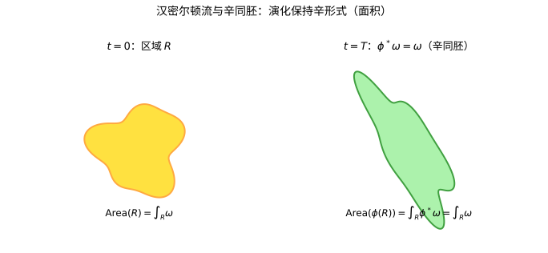

# 第69级：辛拓扑 (Symplectic Topology)

---

## 学习目标

1. 理解辛流形、Lagrangian 子流形与拟全纯曲线的基本概念。
2. 掌握 Gromov 紧致性定理与 Gromov 非嵌入定理的核心思想。
3. 理解 Gromov-Witten 不变量与量子上同调的定义与基本性质。
4. 了解 Floer 同调（包括 Lagrangian Floer 同调）的基本框架。
5. 掌握 Weinstein 邻域定理的证明。
6. 了解 Arnold 猜想的陈述与证明思路。
7. 了解辛同调、接触同调与 SFT 等现代发展。

---

## 核心概念

### 1. 辛流形 (Symplectic Manifold)

一个 **辛流形** 是一个光滑流形 $M^{2n}$ 配备一个闭的非退化 2-形式 $\omega$，即：

- $d\omega = 0$（闭性）
- $\omega^{\wedge n} \neq 0$（非退化，即 $\omega$ 诱导了 $TM$ 与 $T^*M$ 之间的同构）

标准例子是 $(\mathbb{R}^{2n}, \omega_0)$，其中 $\omega_0 = \sum_{i=1}^n dx_i \wedge dy_i$。

> **直观理解（现实类比）**：汉密尔顿流就像把一团橡皮泥在平面上任意揉捏变形，但无论如何变形，它的面积始终不变。辛同胚正是这类"保面积"的变换——它们不改变辛形式 $\omega$，正如哈密顿力学中相空间的体积（面积）在演化中守恒。

### 2. Lagrangian 子流形

设 $(M^{2n}, \omega)$ 是一个辛流形。一个嵌入子流形 $L^n \subset M$ 称为 **Lagrangian 的**，如果 $\omega|_L = 0$ 且 $\dim L = n$（即 $L$ 是极大各向同性子流形）。

> **直观理解（现实类比）**：辛流形像一面"面积测量仪"，而拉格朗日子流形是一条恰好占一半维数的"零辛面积"子流形——就像地球表面某条特定的纬线，沿它量不到任何"辛面积"。它既是极大各向同性的，又不占辛体积，是辛几何中"最省"的几何对象。

### 3. 拟全纯曲线 (Pseudo-holomorphic Curve)

给定一个辛流形 $(M, \omega)$ 以及一个相容的近复结构 $J$（即 $\omega(\cdot, J\cdot)$ 是黎曼度量，且 $\omega(J\cdot, J\cdot) = \omega(\cdot, \cdot)$），一个 **拟全纯曲线**（或称 $J$-全纯曲线）是一个映射 $u: \Sigma \to M$，其中 $(\Sigma, j)$ 是一个黎曼面，满足：

$$\bar{\partial}_J u = \frac{1}{2}(du + J \circ du \circ j) = 0.$$

### 4. Gromov-Witten 不变量

**Gromov-Witten 不变量** 是计数拟全纯曲线的模空间中的曲线数。设 $\overline{\mathcal{M}}_{g,k}(M, \beta)$ 是亏格 $g$、有 $k$ 个标记点、表示同调类 $\beta \in H_2(M;\mathbb{Z})$ 的稳定拟全纯曲线的模空间。Gromov-Witten 不变量定义为：

$$\text{GW}_{g,\beta}(\alpha_1,\dots,\alpha_k) = \int_{[\overline{\mathcal{M}}_{g,k}(M,\beta)]^{\text{vir}}} \text{ev}^*(\alpha_1 \otimes \cdots \otimes \alpha_k),$$

其中 $\text{ev}: \overline{\mathcal{M}}_{g,k}(M,\beta) \to M^k$ 是求值映射。

### 5. 量子上同调 (Quantum Cohomology)

**量子上同调** 是通常上同调环的形变，其乘积（量子乘积）由 Gromov-Witten 不变量定义：

$$\alpha \star \beta = \sum_{\beta \in H_2(M;\mathbb{Z})} \text{GW}_{0,\beta}(\alpha,\beta,\cdot) \, q^\beta.$$

### 6. Floer 同调

**Floer 同调** 是 Morse 理论在环路空间上的无穷维推广，用于研究辛流形的 Hamiltonian 动力学。

- **Hamiltonian Floer 同调**：对于辛流形 $(M,\omega)$ 上的 Hamiltonian 函数 $H: S^1 \times M \to \mathbb{R}$，考虑其 $1$-周期轨道，Floer 链复形由这些轨道生成，边界算子通过计数连接轨道间的拟全纯圆柱定义。

### 7. Lagrangian Floer 同调

对于一对 Lagrangian 子流形 $L_0, L_1 \subset M$，**Lagrangian Floer 同调** $HF(L_0, L_1)$ 由 $L_0$ 与 $L_1$ 的交点生成，边界算子通过计数连接交点的拟全纯圆盘定义。

### 8. 辛嵌入与 Gromov 非嵌入定理

一个 **辛嵌入** 是一个满足 $\phi^*\omega_N = \omega_M$ 的嵌入 $\phi: (M^{2m}, \omega_M) \to (N^{2n}, \omega_N)$。

**Gromov 非嵌入定理**：如果 $2m = 2n$ 且存在辛嵌入 $B^{2n}(R) \to B^{2n}(r) \times \mathbb{R}^{2n-2}$，则 $R \le r$。这里 $B^{2n}(R)$ 是半径为 $R$ 的辛球。

### 9. 辛容量 (Symplectic Capacity)

**辛容量** 是一个映射 $c: \{\text{辛流形}\} \to [0, \infty]$，满足：
- **单调性**：若存在辛嵌入 $(M, \omega) \hookrightarrow (N, \tau)$，则 $c(M) \le c(N)$。
- **共形性**：$c(M, \lambda \omega) = \lambda c(M, \omega)$，$\lambda > 0$。
- **标准化**：$c(B^{2n}(1)) = \pi = c(Z^{2n}(1))$，其中 $Z^{2n}(1) = B^2(1) \times \mathbb{R}^{2n-2}$。

### 10. 辛同调与接触同调

**辛同调**（Symplectic Homology）是 Floer 同调在具有适当边界条件的辛流形上的推广。**接触同调**（Contact Homology）是其在接触流形上的对应物，由 Reeb 轨道生成复形。

### 11. SFT (Symplectic Field Theory)

**SFT** 是由 Eliashberg、Givental 和 Hofer 发展的一个统一框架，将辛同调、接触同调和 Gromov-Witten 理论统一为一种代数结构。

---

## 定理与证明

### 定理 1：Gromov 紧致性定理

**定理（Gromov）**：设 $(M, \omega)$ 是一个紧致辛流形，$J$ 是一个相容的近复结构。给定常数 $C > 0$，考虑所有满足能量上界 $\int_\Sigma |du|^2 \le C$ 的拟全纯曲线 $u: \Sigma \to M$ 的集合。则这个集合在 **稳定曲线的模空间** 中是紧致的，即任意序列都有一个子序列收敛到一个可能带有泡泡的稳定拟全纯曲线。

**证明思路**：

Gromov 的证明基于几个关键的分析估计。

*步骤 1：梯度估计*

首先，对于拟全纯曲线 $u: \Sigma \to M$，其能量由拓扑决定：

$$E(u) = \frac{1}{2} \int_\Sigma |du|^2 \, d\text{vol}_\Sigma = \int_\Sigma u^*\omega.$$

由于 $u^*\omega$ 表示一个同调类，能量在固定同调类中是常数。

*步骤 2：一致导数估计*

Gromov 的核心洞察是：拟全纯曲线满足一个 **椭圆正则性估计**。对于任何 $z \in \Sigma$，如果 $u$ 的局部能量足够小，则存在一个常数 $C$ 使得：

$$|du(z)| \le C \cdot \|u^*\omega\|_{L^2}.$$

这意味着在能量集中区域之外，曲线的导数一致有界。

*步骤 3：泡泡分析*

如果能量在某点集中，则会出现 **泡泡**（bubble）：通过重缩放分析，在能量集中点处，我们可以提取一个子序列，在极限中形成一个球面拟全纯曲线 $v: \mathbb{CP}^1 \to M$。

*步骤 4：紧致化*

模空间的紧致化 $\overline{\mathcal{M}}_{g,k}(M, \beta)$ 由所有可能的退化曲线组成，包括：
- 主曲线（可能具有更低的亏格）
- 有限个泡泡球面
- 节点（nodal points）连接不同的分量

*步骤 5：Gromov 拓扑*

Gromov 定义了一种拓扑（称为 **Gromov 收敛**），使得上述序列收敛到该紧致化中的某个元素。$\square$

---

### 定理 2：Gromov 非嵌入定理

**定理（Gromov）**：设 $B^{2n}(R)$ 是 $\mathbb{R}^{2n}$ 中半径为 $R$ 的辛球（带有标准辛形式 $\omega_0 = \sum dx_i \wedge dy_i$），$Z^{2n}(r) = B^2(r) \times \mathbb{R}^{2n-2}$ 是辛圆柱。如果存在辛嵌入 $\phi: B^{2n}(R) \to Z^{2n}(r)$，则 $R \le r$。

**证明**：

**第一部分：化为一个极值问题**

*步骤 1：标准辛形式的构造*

在 $\mathbb{R}^{2n}$ 上，标准辛形式为 $\omega_0 = \sum_{i=1}^n dx_i \wedge dy_i$。辛球 $B^{2n}(R) = \{\sum (x_i^2 + y_i^2) \le R^2\}$ 是半径为 $R$ 的球体。

辛圆柱 $Z^{2n}(r) = \{x_1^2 + y_1^2 \le r^2\} \times \mathbb{R}^{2n-2}$。

*步骤 2：Gromov 的想法*

Gromov 的核心想法是使用拟全纯曲线来探测辛嵌入的障碍。假设存在嵌入 $\phi: B^{2n}(R) \to Z^{2n}(r)$。

**第二部分：构造拟全纯曲线**

*步骤 1：选择近复结构*

在 $Z^{2n}(r)$ 上选择标准近复结构 $J_0$，使得 $J_0(\partial/\partial x_i) = \partial/\partial y_i$，$J_0(\partial/\partial y_i) = -\partial/\partial x_i$。

*步骤 2：考虑一族曲线*

考虑 $\mathbb{CP}^1$ 中通过某固定点的有理曲线族。在 $Z^{2n}(r)$ 中，考虑拟全纯圆柱 $u_k: \mathbb{C} \to Z^{2n}(r)$，其像为 $\{z\} \times \mathbb{R}^{2n-2}$ 中的点，其中 $z \in B^2(r)$。

*步骤 3：通过嵌入拉回*

通过 $\phi$ 拉回，我们得到 $B^{2n}(R)$ 中的一族拟全纯曲线。关键是要证明，如果 $R > r$，则存在一个拟全纯曲线通过中心点，其能量受限于 $r$，但面积受限于 $R$，导致矛盾。

**第三部分：面积-能量矛盾**

*步骤 1：能量计算*

拟全纯曲线 $u$ 的能量为：

$$E(u) = \int u^*\omega_0 = \text{Area}(u(\Sigma)).$$

对于圆柱 $Z^{2n}(r)$ 中的拟全纯曲线，其能量至少为 $\pi r^2$（如果它穿越圆柱）。

*步骤 2：Gromov 的单调性论证*

另一方面，如果 $R > r$，则球 $B^{2n}(R)$ 中存在一个拟全纯曲线，其能量不超过 $\pi R^2$。但通过讨论曲线的相交数，可以证明该曲线必须穿越圆柱，从而其能量至少为 $\pi r^2$——但这不是矛盾。

*步骤 3：关键的矛盾*

Gromov 的更深层论证是：如果 $R > r$，则可以通过中心点构造一个拟全纯球面，其面积（即能量）为 $\pi R^2$，但这个球面必须与某个边界相交，从而其面积至少为 $\pi r^2$ + 一个正的附加值。通过更精细的相交论证，可以证明这个附加值导致矛盾。因此 $R \le r$。

**直观理解**：辛嵌入比体积嵌入更严格，因为辛形式不仅测量体积，还测量"辛面积"，而拟全纯曲线是辛面积的极小化子。$\square$

---

### 定理 3：Arnold 猜想（Arnold-Givental 定理）

**定理（Arnold 猜想 / Arnold-Givental 定理）**：设 $(M, \omega)$ 是一个紧致辛流形，$H: S^1 \times M \to \mathbb{R}$ 是一个非退化 Hamiltonian 函数。则 $H$ 的 $1$-周期轨道的数量至少等于 $M$ 的 **Betti 数之和**：

$$\# \text{Periodic orbits of } H \ge \sum_{k=0}^{2n} \dim H^k(M;\mathbb{R}).$$

**证明思路**：

Arnold 猜想的证明是 Floer 同调理论的核心应用之一。

*步骤 1：构造 Floer 链复形*

首先，我们构造 Hamiltonian Floer 链复形 $CF_*(H)$。

- 生成元：$H$ 的所有 $1$-周期轨道。
- 梯度流线：考虑方程 $\partial_s u + J(\partial_t u - X_H(u)) = 0$，其中 $X_H$ 是 Hamiltonian 向量场。这个方程的解 $u: \mathbb{R} \times S^1 \to M$ 连接两个周期轨道。

*步骤 2：定义边界算子*

边界算子 $\partial: CF_k \to CF_{k-1}$ 通过计数 index-1 的梯度流线定义：

$$\partial x = \sum_{y: \mu(y) = \mu(x)-1} \#\mathcal{M}(x,y) \cdot y,$$

其中 $\mu$ 是 Conley-Zehnder 指标，$\mathcal{M}(x,y)$ 是连接 $x$ 到 $y$ 的模空间。

*步骤 3：证明 $\partial^2 = 0$*

Floer 证明了 $\partial^2 = 0$，其证明依赖于 Gromov 紧致性定理：模空间 $\mathcal{M}(x,y)$ 的边界由断开的梯度流线组成，它们对应 $\partial^2$ 中的项相互抵消。

*步骤 4：Floer 同调与 Morse 同调的同构*

Floer 同调 $HF_*(M)$ 与 $M$ 的 Morse 同调（即通常的上同调）同构：

$$HF_*(M) \cong H^{n-*}(M;\mathbb{R}).$$

这是因为对于足够小的 Hamiltonian，Floer 复形恰好约化为 Morse 复形。

*步骤 5：Morse 不等式*

由 Morse 理论，周期轨道数至少等于 Betti 数之和：

$$\# \text{Periodic orbits} \ge \dim HF_*(M) = \sum_{k} \dim H^k(M;\mathbb{R}).$$

这就完成了证明。$\square$

---

### 定理 4：Weinstein 邻域定理

**定理（Weinstein）**：设 $(M, \omega)$ 是一个辛流形，$L \subset M$ 是一个紧致 Lagrangian 子流形。则存在 $L$ 在 $M$ 中的一个邻域 $U$，与 $L$ 在 $T^*L$ 中的零截面邻域 $V$ 辛同胚，其中 $T^*L$ 带有标准辛形式 $\omega_{\text{can}} = -d\theta$（$\theta$ 是 Liouville 1-形式）。

换句话说，所有 Lagrangian 子流形的邻域在辛意义下是相同的——它们都像余切丛中的零截面邻域。

**证明**：

**第一部分：构造余切丛上的辛形式**

*步骤 1：余切丛的标准辛形式*

在 $T^*L$ 上，标准 Liouville 1-形式 $\theta$ 定义为：

$$\theta_{(q,p)}(v) = p(d\pi(v)), \quad (q,p) \in T^*L, v \in T_{(q,p)}(T^*L),$$

其中 $\pi: T^*L \to L$ 是投影。标准辛形式为 $\omega_{\text{can}} = -d\theta$。

*步骤 2：零截面*

$L$ 在 $T^*L$ 中嵌入为零截面 $L_0 = \{(q,0) \mid q \in L\}$。容易验证 $L_0$ 是 Lagrangian 的。

**第二部分：构造法丛的同构**

*步骤 1：法丛*

考虑 $L$ 在 $M$ 中的法丛 $N L$。由于 $L$ 是 Lagrangian 的，辛形式 $\omega$ 给出了一个同构：

$$T M|_L / T L \cong T^*L, \quad v \mapsto \omega(v, \cdot)|_{TL}.$$

*步骤 2：Darboux 坐标*

利用这个同构，我们可以构造一个从 $N L$ 到 $T^*L$ 的丛同构。这个丛同构在纤维上是线性的，且将辛形式映射到标准辛形式。

**第三部分：指数映射与邻域嵌入**

*步骤 1：指数映射*

选择一个 $L$ 上的黎曼度量，构造指数映射 $\exp: N L \to M$。这个映射将零截面映到 $L$，且是零截面附近的一个微分同胚到 $L$ 的一个管状邻域。

*步骤 2：拉回辛形式*

考虑拉回辛形式 $\exp^*\omega$。在零截面上，$\exp^*\omega$ 与 $\omega_{\text{can}}$ 相差一个二阶项。

*步骤 3：Moser 变形*

使用 **Moser 技巧**，我们可以构造一个从零截面邻域到 $T^*L$ 中零截面邻域的同胚，使得辛形式被拉回为标准辛形式。

具体地，考虑一族辛形式 $\omega_t = t \exp^*\omega + (1-t)\omega_{\text{can}}$。我们求解一个依赖于时间的向量场 $X_t$，使得 $\mathcal{L}_{X_t}\omega_t + \frac{d\omega_t}{dt} = 0$。通过积分 $X_t$，我们得到所需的辛同胚。

*步骤 4：紧致性*

由于 $L$ 是紧致的，上述构造在 $L$ 的某个邻域内有效。这就完成了证明。$\square$

---

## 示例

### 示例 1：辛容量的计算

**Gromov 宽度**（Gromov width）是辛容量的一个重要例子，定义为：

$$c_G(M, \omega) = \sup\{\pi R^2 \mid \text{存在辛嵌入 } B^{2n}(R) \hookrightarrow (M, \omega)\}.$$

**示例计算**：

- $c_G(B^{2n}(R)) = \pi R^2$（由定义直接得到）。
- $c_G(\mathbb{CP}^n, \omega_{\text{FS}}) = \pi$，其中 $\omega_{\text{FS}}$ 是 Fubini-Study 形式，标准化为 $\int_{\mathbb{CP}^1} \omega_{\text{FS}} = \pi$。
- $c_G(T^{2n} = \mathbb{R}^{2n}/\mathbb{Z}^{2n}, \omega_0) = \pi$，因为最大辛球半径由最短的闭环长度决定。

### 示例 2：Gromov 非嵌入的具体应用

**应用：辛球体的嵌入障碍**

考虑 $\mathbb{R}^4$ 中两个辛球体的嵌入问题。设 $B^4(1)$ 和 $B^4(R)$ 是两个辛球，$R > 1$。Gromov 非嵌入定理告诉我们，不存在辛嵌入 $B^4(R) \hookrightarrow B^4(1) \times \mathbb{R}^2$。

更一般地，**非嵌入结果**：
- 如果 $R > r$，则 $B^{2n}(R)$ 不能辛嵌入 $Z^{2n}(r)$。
- 如果 $R > 1$，则 $B^4(R)$ 不能辛嵌入到 $B^4(1)$ 中（尽管存在体积嵌入）。

**直观意义**：辛嵌入比体积嵌入更受限制。辛形式不仅测量体积，还测量"二维辛面积"，而拟全纯曲线是这种面积的极小化子。Gromov 非嵌入定理表明，辛形式施加了类似"不确定原理"的约束。

---

## 习题

### 习题 1：辛流形的基本性质

证明：若 $(M, \omega)$ 是紧致辛流形，则 $\omega$ 不是恰当的（即 $\omega \neq d\alpha$ 对任何 $\alpha$ 成立）。

**提示**：由 Stokes 定理，$\int_M \omega^{\wedge n} = 0$ 如果 $\omega = d\alpha$。但 $\omega^{\wedge n}$ 是体积形式，其积分非零，矛盾。

### 习题 2：Lagrangian 子流形

证明：$\mathbb{R}^{2n}$ 中的零截面嵌入 $\mathbb{R}^n \hookrightarrow \mathbb{R}^{2n}$（即 $\mathbb{R}^n \times \{0\}$）是 Lagrangian 的。

**提示**：在标准辛形式 $\omega_0 = \sum dx_i \wedge dy_i$ 下，$\mathbb{R}^n \times \{0\}$ 上 $y_i = 0$，所以 $\omega_0 = 0$。维数也正确。

### 习题 3：拟全纯曲线

说明 $\mathbb{CP}^1 \to \mathbb{CP}^n$ 的嵌入映射（作为一次有理曲线）是拟全纯的。

**提示**：$\mathbb{CP}^1$ 上的标准复结构 $j$ 与 $\mathbb{CP}^n$ 上的 Fubini-Study 近复结构 $J_{\text{FS}}$ 相容。全纯映射 $[z,w] \mapsto [z^n, z^{n-1}w, \dots, w^n]$ 满足 $\bar{\partial}_{J_{\text{FS}}} u = 0$。

### 习题 4：Weinstein 邻域定理的应用

利用 Weinstein 邻域定理证明：$S^1$ 作为辛流形 $T^*S^1$ 中的零截面是 Lagrangian 的，且其邻域与 $T^*S^1$ 中的标准邻域辛同胚。

**提示**：$T^*S^1 \cong S^1 \times \mathbb{R}$，标准辛形式为 $\omega = d\theta \wedge dp$，其中 $\theta$ 是 $S^1$ 的坐标，$p$ 是纤维坐标。零截面 $p = 0$ 是 Lagrangian 的。

### 习题 5：Floer 同调的基本性质

设 $M$ 是一个紧致辛流形。证明 Floer 同调 $HF_*(M)$ 与 Hamiltonian 函数 $H$ 的选择无关（在同构意义下）。

**提示**：考虑两个 Hamiltonian $H_0$ 和 $H_1$ 之间的同伦，构造一个链映射来证明同调群同构。这类似于 Morse 理论中不同 Morse 函数给出同构的同调群。

---

## 总结

辛拓扑是数学中一个年轻而活跃的领域，其核心是研究辛流形上的全局现象。

- **拟全纯曲线** 是辛拓扑的基本工具，它提供了研究辛流形"刚性"结构的手段。
- **Gromov 紧致性定理** 保证了拟全纯曲线模空间的紧致性，这是所有计数不变量的基础。
- **Gromov 非嵌入定理** 揭示了辛嵌入与体积嵌入的本质区别，标志着辛拓扑的诞生。
- **Gromov-Witten 不变量** 和 **量子上同调** 将计数几何与代数拓扑联系起来，给出了辛流形的丰富不变量。
- **Floer 同调** 理论（包括 Hamiltonian Floer 同调和 Lagrangian Floer 同调）是解决 Arnold 猜想的关键工具，也是辛几何与低维拓扑之间的桥梁。
- **Weinstein 邻域定理** 表明 Lagrangian 子流形的局部结构是普遍的，这是辛几何中"刚性"与"柔性"的一个表现。
- 现代发展包括 **辛同调**、**接触同调** 和 **SFT**，它们将辛拓扑推广到更广泛的几何设置中。

辛拓扑与第 68 级的低维拓扑和第 70 级的几何拓扑有深刻的联系。例如，Floer 同调是研究三维流形不变量的重要工具，而 Gromov-Witten 不变量与特征类理论在代数几何中也有重要应用。