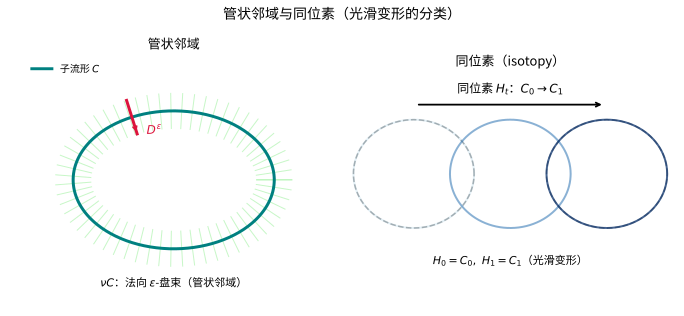
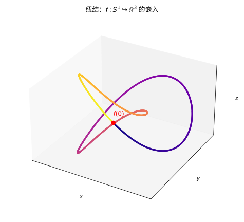

# 第70级：几何拓扑 (Geometric Topology)

---

## 学习目标

1. 理解拓扑流形、PL 流形与光滑流形的区别与联系。
2. 掌握特征类理论（Pontryagin 类、Stiefel-Whitney 类、Euler 类）的基本概念。
3. 理解 Chern-Weil 理论的基本框架。
4. 掌握 h-配边定理与 s-配边定理的陈述与证明思路。
5. 理解 Whitney 技巧及其在嵌入理论中的应用。
6. 了解 Rokhlin 定理及其在四维流形分类中的重要性。
7. 了解 Kirby 微积分与手术理论的基本思想。
8. 了解 Kervaire 不变量与拓扑特征的分类问题。

---

## 核心概念

### 1. 拓扑流形、PL 流形与光滑流形

- **拓扑流形**：局部同胚于 $\mathbb{R}^n$ 的豪斯多夫第二可数空间。
- **PL 流形**（分段线性流形）：带有 PL 坐标卡，其转移函数是分段线性的。
- **光滑流形**：带有 $C^\infty$ 坐标卡，其转移函数是光滑的。

三者之间的关系由以下包含关系表示：

$$\{\text{光滑}\} \subset \{\text{PL}\} \subset \{\text{拓扑}\}.$$

在低维中，这些概念趋于一致：$\dim \le 3$ 时，每个拓扑流形允许唯一的光滑结构。但在高维（$\dim \ge 4$）中，存在大量差异——例如，$\mathbb{R}^4$ 有不可数多个不同的光滑结构（**奇异 $\mathbb{R}^4$**）。

### 2. 分类空间

**分类空间** $BG$ 是拓扑学中用于分类 $G$-主丛的通用空间。对于任何 $G$-主丛 $P \to X$，存在一个分类映射 $f: X \to BG$，使得 $P \cong f^* EG$，其中 $EG \to BG$ 是万有丛。

### 3. Pontryagin 类

**Pontryagin 类** $p_k(E) \in H^{4k}(X;\mathbb{Z})$ 是实向量丛 $E \to X$ 的特征类，定义为 $E \otimes_{\mathbb{R}} \mathbb{C}$ 的 Chern 类：

$$p_k(E) = (-1)^k c_{2k}(E \otimes \mathbb{C}).$$

### 4. Stiefel-Whitney 类

**Stiefel-Whitney 类** $w_k(E) \in H^k(X;\mathbb{Z}_2)$ 是实向量丛 $E \to X$ 的 $\mathbb{Z}_2$-系数特征类，满足：
- $w_0(E) = 1$。
- $w(E \oplus F) = w(E) \cup w(F)$（Whitney 和公式）。
- $w_1(\gamma_1) \neq 0$，其中 $\gamma_1$ 是 $\mathbb{RP}^1$ 上的规范线丛。

### 5. Euler 类

**Euler 类** $e(E) \in H^{2k}(X;\mathbb{Z})$ 是定向实向量丛 $E \to X$ 的特征类，满足 $e(E) = c_k(E)$ 当 $E$ 是复向量丛时，且 $e(E) \equiv w_{2k}(E) \pmod{2}$。

### 6. Chern-Weil 理论

**Chern-Weil 理论** 用曲率形式表示特征类。设 $E \to M$ 是一个复向量丛，$\nabla$ 是一个联络，曲率为 $F_\nabla$。则第 $k$ 个 Chern 类由以下公式给出：

$$c_k(E) = \left[\left(\frac{i}{2\pi}\right)^k \sigma_k(F_\nabla)\right],$$

其中 $\sigma_k$ 是第 $k$ 个初等对称多项式。

### 7. Kervaire 不变量

**Kervaire 不变量** $\kappa(M) \in \mathbb{Z}_2$ 是定义在 $(4k+2)$-维流形 $M$ 上的一个不变量，用于判断 $M$ 是否可以通过手术化为标准球面。Kervaire 不变量问题（哪些维数存在非零 Kervaire 不变量的流形）是拓扑学中的经典问题。

### 8. Rokhlin 定理

**Rokhlin 定理** 断言：一个闭的、可定向的、光滑的四维流形 $M^4$，如果它的交叉形式是偶的（即所有自交数是偶数），则其第二 Betti 数的签名（signature）满足 $\sigma(M) \equiv 0 \pmod{16}$。

### 9. Kirby 微积分

**Kirby 微积分** 是处理四维流形中 Dehn 手术的图论方法，给出了两个手术框架描述给出同胚流形的充分必要条件。其基本操作包括：
- **I 型操作**：添加或移除一个平凡分量。
- **II 型操作**：Handle 滑动（handle slide）。

### 10. 手术理论 (Surgery Theory)

**手术理论** 是 Browder、Novikov、Sullivan 和 Wall 等人在 1960 年代发展起来的，用于研究流形的分类问题。其基本思想是：给定一个映射 $f: M \to X$，通过手术改变 $M$ 的同伦类型，使其成为同伦等价。

### 11. s-配边与 h-配边

- 一个配边 $(W; M, N)$ 称为 **h-配边**，如果包含映射 $M \hookrightarrow W$ 和 $N \hookrightarrow W$ 都是同伦等价。
- 一个配边称为 **s-配边**，如果包含映射是 Whitehead 挠元为零的简单同伦等价。

---

## 定理与证明

### 定理 1：h-配边定理 (Smale)

**定理（Smale h-配边定理）**：设 $(W^{n+1}; M^n, N^n)$ 是一个紧致的、可定向的 h-配边，其中 $\dim W = n+1 \ge 6$，且 $M, N$ 是单连通的。则 $W$ 同胚于圆柱 $M \times [0,1]$（从而 $M \cong N$）。

**证明**：

**第一部分：Morse 函数与手柄分解**

*步骤 1：选择 Morse 函数*

选择一个 Morse 函数 $f: W \to [0,1]$，使得 $f^{-1}(0) = M$，$f^{-1}(1) = N$，且 $f$ 在 $M, N$ 附近是标准的。由于 $W$ 是 h-配边，$f$ 的所有临界点都在内部。

*步骤 2：Morse 引理与梯度流*

在 $W$ 上选择一个黎曼度量，考虑 $f$ 的梯度流。$f$ 的每个临界点 $p$ 具有指标 $\lambda(p)$。在 $p$ 的邻域内，Morse 引理给出局部坐标：

$$f(x) = f(p) - \sum_{i=1}^{\lambda} x_i^2 + \sum_{j=\lambda+1}^{n+1} x_j^2.$$

**第二部分：消去配对临界点**

*步骤 1：h-配边的条件*

由于 $M \hookrightarrow W$ 是同伦等价，相对同调群 $H_*(W, M) = 0$。这意味着 Morse 函数 $f$ 的临界点可以配对消去。

*步骤 2：Whitney 技巧消去临界点*

Smale 的关键创新是使用 **Whitney 技巧** 来消去指标相差 $1$ 的临界点对。具体地，如果存在指标 $\lambda$ 和 $\lambda+1$ 的临界点 $p, q$，且它们的稳定流形和 unstable 流形恰好相交于一条连接两者的梯度流线，则可以通过 Whitney 技巧消去这对临界点。

*步骤 3：反复消去*

由于 $H_*(W, M) = 0$，我们可以反复使用 Whitney 技巧消去所有临界点，最终得到一个没有临界点的 Morse 函数。因此 $W \cong M \times [0,1]$。

**第三部分：维数条件**

*步骤 1：为什么 $\dim W \ge 6$ 是必要的*

Whitney 技巧要求子流形在嵌入时具有足够大的维数空间，使得我们可以构造一个嵌入的 2-圆盘来消除交点。当 $\dim W \ge 6$ 时，我们有足够的"空间"来实现 Whitney 技巧。

*步骤 2：低维的例外*

当 $\dim W = 5$ 时，维数条件不满足，Whitney 技巧可能失败。这正是 Poincaré 猜想在四维（$\dim W = 5$）中如此困难的原因。

**结论**：因此，当 $n+1 \ge 6$ 时，$W \cong M \times [0,1]$。$\square$

---

### 定理 2：Whitney 技巧（嵌入圆盘消去交点）

**定理（Whitney）**：设 $M$ 是一个光滑流形，$P^p, Q^q \subset M^m$ 是两个光滑嵌入子流形，且 $p+q = m$。设 $x, y \in P \cap Q$ 是两个交点，符号相反。如果 $m \ge 5$ 且 $P, Q$ 在 $x, y$ 处满足适当的横截性条件，则存在一个合痕将 $P$ 变形为 $P'$，使得 $P' \cap Q = (P \cap Q) \setminus \{x, y\}$（即消去这两个交点）。

**证明**：

**第一部分：构造连接路径**

*步骤 1：选择连接路径*

设 $\gamma: [0,1] \to M$ 是 $P$ 上连接 $x$ 到 $y$ 的一条嵌入路径，与 $Q$ 在内部不相交。由于 $P$ 是连通的，这样的路径存在。

*步骤 2：管状邻域*

选取 $\gamma$ 的一个管状邻域 $N(\gamma)$，使得 $N(\gamma) \cap Q$ 由两个小圆盘 $D_x, D_y$ 组成（分别以 $x, y$ 为中心）。

**第二部分：构造 Whitney 圆盘**

*步骤 1：寻找 Whitney 圆盘*

我们需要一个嵌入的 2-圆盘 $D^2 \subset M$，使得：
- $\partial D^2 = \gamma \cup \gamma'$，其中 $\gamma'$ 是 $Q$ 上连接 $x$ 和 $y$ 的路径。
- $D^2$ 的内部与 $P \cup Q$ 不相交。

*步骤 2：维数条件*

由于 $m = p+q \ge 5$，且 $P$ 和 $Q$ 的维数满足 $p, q \ge 2$（因为 $p+q = m \ge 5$），我们可以通过一般位置论证使得 $D^2$ 是嵌入的且与 $P, Q$ 在边界处横截相交。

**第三部分：沿 Whitney 圆盘移动**

*步骤 1：构造合痕*

利用 Whitney 圆盘 $D^2$ 的邻域，我们可以构造一个合痕 $\phi_t: M \to M$，使得 $\phi_1(P)$ 仅沿 $D^2$ 被推动，从而移出 $x$ 和 $y$ 附近的区域。

*步骤 2：消去交点*

由于 $x$ 和 $y$ 的符号相反，在沿 Whitney 圆盘移动后，这两个交点被消去，而不产生新的交点。

*步骤 3：横截性保持*

通过适当选择 Whitney 圆盘和合痕，我们可以确保 $\phi_1(P)$ 与 $Q$ 在除消去的点外仍然横截相交。

**结论**：Whitney 技巧成功消去了 $x$ 和 $y$ 这对交点。$\square$

> **直观理解（现实类比）**：管状邻域就像给一根铁丝套上一层粗细均匀的绝缘管，管的粗细就是"法向半径 $\varepsilon$"。同位素则是把一根曲线平滑地捏成另一根曲线的过程——只要不撕裂、不粘连，两条曲线就被视为同一类，正如橡皮筋可以任意拉长变形而不改变它的"本质"。

---

### 定理 3：Rokhlin 定理

**定理（Rokhlin）**：设 $M^4$ 是一个闭的、可定向的、光滑的四维流形，其交叉形式 $Q_M$ 是偶的（即对任意 $\alpha \in H^2(M;\mathbb{Z})$，$Q_M(\alpha, \alpha) \equiv 0 \pmod{2}$）。则 $M$ 的签名 $\sigma(M)$ 是 $16$ 的倍数。

**证明**：

**第一部分：交叉形式与签名**

*步骤 1：交叉形式*

四维流形 $M^4$ 的交叉形式 $Q_M: H^2(M;\mathbb{Z}) \times H^2(M;\mathbb{Z}) \to \mathbb{Z}$ 是对称双线性形式，由 cup 积和基本类给出：

$$Q_M(\alpha, \beta) = \langle \alpha \cup \beta, [M] \rangle.$$

*步骤 2：签名*

签名 $\sigma(M)$ 定义为 $Q_M \otimes \mathbb{R}$ 的正特征值个数减去负特征值个数。签名是 $M$ 的一个定向同胚不变量。

**第二部分：$\eta$ 不变量与 Atiyah-Singer 指标定理**

*步骤 1：考虑带边流形*

由于 $M$ 的交叉形式是偶的，存在一个可定向的三维流形 $Y$ 使得 $M$ 是某个四维流形 $X$ 的边界，且 $X$ 的交叉形式是偶的且可对角化。

*步骤 2：Atiyah-Singer 指标定理*

Rokhlin 定理的现代证明使用 Atiyah-Singer 指标定理。考虑 $M$ 上的 **Dirac 算子** $D$。Atiyah-Singer 指标定理给出：

$$\text{ind}(D) = \frac{1}{24} p_1(M) = \frac{1}{8} \sigma(M),$$

其中 $p_1(M)$ 是 $M$ 的第一 Pontryagin 类。

*步骤 3：偶交叉形式的条件*

如果 $M$ 的交叉形式是偶的，则 $M$ 是 Spin 流形，即 $w_2(M) = 0$。对于 Spin 四维流形，Atiyah-Singer 指标定理给出：

$$\text{ind}(D_+) = \frac{1}{16} \sigma(M),$$

其中 $D_+$ 是手性 Dirac 算子。

*步骤 4：指标是整数*

由于 $\text{ind}(D_+)$ 是一个整数（它是 Dirac 算子的分析指标），我们得到 $\sigma(M)/16 \in \mathbb{Z}$，即 $\sigma(M) \equiv 0 \pmod{16}$。

**第三部分：古典证明**

Rokhlin 的原始证明使用三维流形的 Pontryagin 数和流形的手术理论，但现代标准证明依赖指标定理。

**结论**：$\sigma(M) \equiv 0 \pmod{16}$。$\square$

---

### 定理 4：s-配边定理（Barden-Mazur-Stallings）

**定理（s-配边定理）**：设 $(W^{n+1}; M^n, N^n)$ 是一个紧致的 s-配边，且 $\dim W = n+1 \ge 6$。则 $W$ 同胚于圆柱 $M \times [0,1]$（从而 $M \cong N$）。

**证明思路**：

**第一部分：从 h-配边到 s-配边**

*步骤 1：h-配边定理的回顾*

Smale 的 h-配边定理要求 $M, N$ 是单连通的。当 $M, N$ 不是单连通时，h-配边定理不再成立——存在非平凡的 h-配边（称为 **h-配边障碍**）。

*步骤 2：Whitehead 挠元*

对于一般的 h-配边 $(W; M, N)$，其障碍由 **Whitehead 挠元** $\tau(W, M) \in \text{Wh}(\pi_1(M))$ 给出，其中 $\text{Wh}(G)$ 是群 $G$ 的 Whitehead 群。$\tau(W, M) = 0$ 当且仅当 $W$ 是 s-配边。

**第二部分：s-配边的分类**

*步骤 1：Morse 函数与手柄*

选择 Morse 函数 $f: W \to [0,1]$，如 h-配边定理的证明中一样。$f$ 的临界点给出 $W$ 相对于 $M$ 的手柄分解。

*步骤 2：代数化消去条件*

每个指标 $\lambda$ 的临界点对应一个 $\lambda$-手柄。s-配边的条件 $\tau(W, M) = 0$ 等价于可以消去所有临界点——但这是通过代数 $K$-理论条件来保证的，而不是通过单连通性。

*步骤 3：Barden-Mazur-Stallings 的构造*

Barden、Mazur 和 Stallings 独立地证明了：如果 $\tau(W, M) = 0$，则可以通过一系列操作消去所有临界点。关键步骤是：
- 使用 **Whitney 技巧** 消去指标相差 $1$ 的临界点对。
- 使用 **代数消去引理** 来处理非单连通情况下的基本群障碍。

**第三部分：维数条件**

*步骤 1：$\dim W \ge 6$ 的必要性*

与 h-配边定理一样，我们需要 $\dim W \ge 6$ 以确保 Whitney 技巧有效。

*步骤 2：低维情况*

当 $\dim W \le 5$ 时，s-配边定理不成立，这反映了低维流形分类的复杂性。

**结论**：s-配边定理给出了高维流形分类的完整框架：两个流形 $M, N$ 通过 s-配边等价当且仅当它们同胚。$\square$

---

### 定理 5：Kirby 微积分定理

**定理（Kirby）**：两个在 $S^3$ 中给出的 Dehn 手术框架描述（即链环 $L$ 及其标架系数）给出同胚的三维流形当且仅当它们可以通过以下两种操作相互转换：

1. **(I 型) 稳定化/去稳定化**：添加或移除一个标架系数为 $\pm 1$ 的单分量平凡结（与链环的其他部分不相交）。

2. **(II 型) Handle 滑动**：将一个分量沿另一个分量滑动，相当于将系数 $a$ 和 $b$ 的两个分量替换为系数 $a$ 和 $a+b \pm 2 \cdot \text{lk}(K_i, K_j)$ 的新分量。

**证明思路**：

**第一部分：Dehn 手术与框架表示**

*步骤 1：Dehn 手术回顾*

回忆 Lickorish-Wallace 定理（第 68 级），每个三维流形可以通过对 $S^3$ 中一个链环进行 Dehn 手术得到。每个分量 $K_i$ 赋有一个标架系数 $r_i \in \mathbb{Q} \cup \{\infty\}$。

*步骤 2：框架表示*

将标架系数表示为整数，通过将链环替换为它的 **整数框架表示**（即每个分量的系数是整数）。对于有理系数 $p/q$，可以通过添加辅助分量将其转化为整数系数。

**第二部分：基本操作的不变性**

*步骤 1：I 型操作的不变性*

添加一个标架系数为 $\pm 1$ 的平凡结等价于取 $S^3$ 与一个 $S^2 \times S^1$ 的连通和。由于 $S^3 \# (S^2 \times S^1) \cong S^2 \times S^1$，而 $S^2 \times S^1$ 可以通过 Dehn 手术得到，这个操作不改变最终的流形（的同胚类）。

*步骤 2：II 型操作的不变性*

Handle 滑动对应着在四维流形中滑动一个 2-手柄。在三维边界上，这表现为一个链环分量沿另一个分量的滑动。Kirby 证明了这种操作不改变三维流形的同胚类。

**第三部分：完备性**

*步骤 1：任意两个表示的可达性*

Kirby 证明了，如果两个链环表示同胚的三维流形，则存在一个有限序列的 I 型和 II 型操作将一个转化为另一个。

*步骤 2：证明策略*

证明的基本策略是：
1. 将两个表示提升到四维流形的手柄分解。
2. 证明这两个四维流形是微分同胚的。
3. 利用四维流形分类的结果（或直接的四维手术理论）导出三维边界上的操作。

*步骤 3：Fenn-Rourke 的简化*

Fenn 和 Rourke 后来给出了一个更初等的证明，直接使用三维流形上的操作而不依赖四维理论。

**结论**：Kirby 微积分给出了 Dehn 手术表示下三维流形的完全分类算法。$\square$

---

## 示例

### 示例 1：h-配边与 Poincaré 猜想的关系

**Poincaré 猜想** 断言：每个单连通的闭三维流形同胚于 $S^3$。

**h-配边定理与 Poincaré 猜想的关系**：

- 在高维（$\dim \ge 5$）中，h-配边定理直接证明了 **广义 Poincaré 猜想**：每个同伦等价于 $S^n$（$n \ge 5$）的流形同胚于 $S^n$。
- 证明思路：设 $M^n$ 是一个同伦球面（$n \ge 5$）。去掉两个开球 $B^n$ 后，我们得到一个 h-配边 $(W; S^{n-1}, S^{n-1})$。由 h-配边定理，$W \cong S^{n-1} \times [0,1]$，因此 $M^n \cong S^n$。
- **四维的例外**：对于 $n=4$，h-配边定理不适用（维数太低），这正是 **四维 Poincaré 猜想**（Freedman 1982 年证明）如此困难的原因。
- **三维的例外**：对于 $n=3$，h-配边定理也不适用，这解释了原始 Poincaré 猜想的困难性。

### 示例 2：Whitney 技巧的具体应用

**应用：嵌入球面的分类**

Whitney 技巧是嵌入理论中的核心工具。考虑以下问题：

**问题**：在 $S^n$ 中，两个嵌入的 $S^k$ 何时是合痕的？

**答案（Whitney 技巧的应用）**：

- 当 $n \ge 2k+2$ 时，Whitney 技巧有效，且嵌入分类由同伦论决定（即 $k$-维球面的嵌入由 $\pi_k(S^n)$ 分类）。
- 当 $n = 2k+1$ 时，Whitney 技巧部分有效，但需要处理交点的符号问题（即 **Whitney 技巧** 恰好是处理 $n = 2k+1$ 情况的关键工具）。
- **示例**：$S^2$ 在 $S^4$ 中的嵌入（$n=4, k=2$）：$4 \ge 2\cdot 2 + 2 = 6$ 不成立，所以存在非平凡的嵌入类型（如 **2-维球面的 knotting**）。

> **直观理解（现实类比）**：纽结就像一根绳子在三维空间里打成不能解开的结——它是一个低维的圆环 $S^1$ 被"放置"进高维空间 $\mathbb{R}^3$ 的方式。嵌入保证了曲线没有自交与重叠，而"打结"正体现了低维流形在高维空间中放置方式的丰富多样。

---

## 习题

### 习题 1：h-配边与广义 Poincaré 猜想

证明：如果 $M^n$（$n \ge 6$）是一个同伦球面，则 $M^n$ 同胚于 $S^n$。

**提示**：从 $M^n$ 中移除两个开球 $B^n$，得到 $W = M \setminus (B_1 \cup B_2)$。验证 $(W; S^{n-1}, S^{n-1})$ 是一个 h-配边，然后应用 h-配边定理。

### 习题 2：Whitney 技巧的维数条件

解释为什么 Whitney 技巧要求 $m \ge 5$，并说明在 $m=4$ 时会出现什么困难。

**提示**：Whitney 圆盘 $D^2$ 的维数为 $2$。在 $m=4$ 时，$D^2$ 的维数与 $P, Q$ 的维数之和可能超过 $m$，导致一般位置论证失败。在 $m=4$ 时，Whitney 圆盘可能自交。

### 习题 3：Rokhlin 定理的应用

证明：$\mathbb{CP}^2$ 的交叉形式不能是偶的，从而 $\sigma(\mathbb{CP}^2) = 1$ 不与 Rokhlin 定理矛盾。

**提示**：$\mathbb{CP}^2$ 的交叉形式是 $Q = [1]$（即只有一个正特征值），它是奇的（因为 $Q(\alpha, \alpha) = 1$ 是奇数）。Rokhlin 定理只适用于偶交叉形式的情况。

### 习题 4：特征类的计算

设 $M$ 是一个闭的可定向光滑四维流形。证明：$p_1(M) = 3\sigma(M)$，其中 $p_1$ 是第一 Pontryagin 类，$\sigma$ 是签名。

**提示**：使用 Hirzebruch 符号定理：$\sigma(M) = \frac{1}{3} p_1(M)$。这是 Atiyah-Singer 指标定理的一个特例。

### 习题 5：Kirby 微积分操作

考虑 $S^3$ 中两个分量组成的链环，其标架系数分别为 $a$ 和 $b$，且两个分量是未链接的。经过 handle 滑动，得到的新系数是什么？

**提示**：如果两个分量是未链接的，则 $\text{lk}(K_1, K_2) = 0$。Handle 滑动将 $K_1$ 沿 $K_2$ 滑动后，$K_1$ 的系数变为 $a + b$ 或 $a - b$，取决于滑动方向。具体地，如果使用 $+1$ 标架滑动，则新系数为 $a + b$。

---

## 总结

几何拓扑研究流形在更精细的等价关系下的分类问题，涉及拓扑、PL 和光滑三个范畴之间的深刻联系。

- **h-配边定理**（Smale）是高维流形分类的基石，它直接导致了广义 Poincaré 猜想的证明。
- **Whitney 技巧** 是几何拓扑中最基本的消去工具，广泛应用于嵌入、配边和手术理论中。
- **Rokhlin 定理** 揭示了四维流形的签名与 Spin 结构之间的深刻联系，是现代四维流形理论的起点。
- **s-配边定理** 将 h-配边定理推广到非单连通情况，给出了高维流形分类的完整框架。
- **Kirby 微积分** 提供了处理三维流形 Dehn 手术表示的图论方法。
- **特征类理论**（Pontryagin 类、Stiefel-Whitney 类、Euler 类）和 **Chern-Weil 理论** 为流形的分类提供了代数不变量。
- **Kervaire 不变量** 和手术理论构成了高维流形分类的代数工具。

作为第五阶段"高阶专题 I"的最后一课，第 70 级与第 68 级（低维拓扑）、第 69 级（辛拓扑）共同构成了分析、几何与统计专题的拓扑学核心。这三课分别从低维、辛几何和几何拓扑三个角度展示了流形研究的丰富面貌。

下一阶段将进入"高阶专题 II"，涵盖代数几何、数论与表示论等更深入的代数方向。