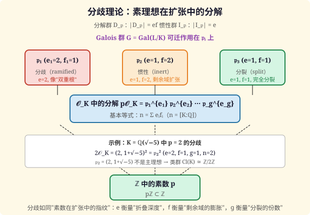

# 第76级 代数数论

## 学习目标

1. 理解代数数域和代数整数环的基本概念，掌握Dedekind整环的性质。
2. 掌握理想分解的唯一性定理及其证明。
3. 理解分歧理论，掌握惯性群、分解群、Frobenius自同构的概念。
4. 掌握Dirichlet单位定理，理解Minkowski几何方法。
5. 理解二次域和分圆域的类数计算。
6. 了解Kronecker-Weber定理和局部域的概念。
7. 理解Artin互反律，掌握代数数论方法证明二次互反律。

---

## 第一节 代数数域与代数整数环

### 1.1 基本概念

**定义1（代数数域）** 有理数域 $\mathbb{Q}$ 的有限扩张称为**代数数域**（简称数域）。若 $K/\mathbb{Q}$ 是次数为 $n$ 的扩张，记 $n = [K : \mathbb{Q}]$。

**定义2（代数整数）** 设 $\alpha \in \mathbb{C}$。若存在首一多项式 $f(x) \in \mathbb{Z}[x]$ 使得 $f(\alpha) = 0$，则称 $\alpha$ 为**代数整数**。

**定义3（代数整数环）** 数域 $K$ 中所有代数整数构成的集合记为 $\mathcal{O}_K$，称为 $K$ 的**整数环**。

**定理1（整数环的基本性质）** 设 $K$ 为数域，$n = [K : \mathbb{Q}]$。
1. $\mathcal{O}_K$ 是 $\mathbb{Z}$-模，秩为 $n$。
2. $\mathcal{O}_K$ 是整闭整环。
3. $K$ 是 $\mathcal{O}_K$ 的分式域。

**证明：**

**第一步：** 存在 $\alpha_1, \dots, \alpha_n \in \mathcal{O}_K$ 构成 $K$ 在 $\mathbb{Q}$ 上的一组基。证明需要利用迹（trace）的非退化性。

对 $\alpha \in K$，定义迹 $\operatorname{Tr}_{K/\mathbb{Q}}(\alpha) = \sum_{i=1}^n \sigma_i(\alpha)$，其中 $\sigma_i$ 是 $K$ 到 $\mathbb{C}$ 的嵌入。

迹型 $(\alpha, \beta) \mapsto \operatorname{Tr}_{K/\mathbb{Q}}(\alpha\beta)$ 是非退化的双线性型。

取 $\mathbb{Q}$-基 $\{v_1, \dots, v_n\} \subset \mathcal{O}_K$，考虑其对偶基 $\{w_1, \dots, w_n\}$（满足 $\operatorname{Tr}(v_i w_j) = \delta_{ij}$）。则存在非零整数 $m$ 使得 $m w_j \in \mathcal{O}_K$，从而 $\{v_1, \dots, v_n, m w_1, \dots, m w_n\}$ 生成 $\mathcal{O}_K$ 作为 $\mathbb{Z}$-模。由于 $\mathbb{Z}$ 是Noether环，$\mathcal{O}_K$ 是有限生成 $\mathbb{Z}$-模，秩为 $n$。

**第二步：** 整闭性：若 $\alpha \in K$ 满足 $\mathcal{O}_K$ 上的首一多项式，则 $\alpha$ 是代数整数，因此 $\alpha \in \mathcal{O}_K$。

**第三步：** 显然 $K$ 是 $\mathcal{O}_K$ 的分式域，因为任何 $\alpha \in K$ 可以乘以某个整数分母变为代数整数。$\square$

### 1.2 Dedekind整环

**定理2（数域整数环是Dedekind整环）** 设 $K$ 为数域。则 $\mathcal{O}_K$ 是Dedekind整环，即：
1. $\mathcal{O}_K$ 是Noether环。
2. $\mathcal{O}_K$ 是整闭的。
3. $\mathcal{O}_K$ 的每个非零素理想是极大理想（即 $\dim \mathcal{O}_K = 1$）。

**证明：**

**性质1（Noether性）：** $\mathcal{O}_K$ 是有限生成 $\mathbb{Z}$-模，因此是Noether $\mathbb{Z}$-模，从而作为环是Noether的（因为 $\mathbb{Z}$ 是Noether环，有限生成模上的子模都是有限生成的）。

**性质2（整闭性）：** 由定理1已证。

**性质3（维数为1）：** 设 $\mathfrak{p} \subset \mathcal{O}_K$ 为非零素理想。需证 $\mathfrak{p}$ 是极大理想。

取非零元素 $a \in \mathfrak{p}$。考虑范数 $N_{K/\mathbb{Q}}(a) = \prod_{i=1}^n \sigma_i(a) \in \mathbb{Z}$。由于 $a$ 是代数整数，$N(a) \in \mathbb{Z}$。且 $a \neq 0$ 时 $N(a) \neq 0$。

由 $N(a) \in \mathfrak{p} \cap \mathbb{Z}$，得 $\mathfrak{p} \cap \mathbb{Z}$ 是 $\mathbb{Z}$ 的非零素理想，因此 $\mathfrak{p} \cap \mathbb{Z} = p\mathbb{Z}$ 对某素数 $p$。

于是 $\mathbb{Z}/p\mathbb{Z} \hookrightarrow \mathcal{O}_K/\mathfrak{p}$，且 $\mathcal{O}_K/\mathfrak{p}$ 是有限生成 $\mathbb{Z}/p\mathbb{Z}$-模（因为 $\mathcal{O}_K$ 是有限生成 $\mathbb{Z}$-模），因此 $\mathcal{O}_K/\mathfrak{p}$ 是有限域，从而是域，故 $\mathfrak{p}$ 是极大理想。$\square$

---

## 第二节 理想分解

### 2.1 唯一分解定理

**定理3（Dedekind整环中的理想唯一分解定理）** 设 $\mathcal{O}_K$ 为数域 $K$ 的整数环。则任何非零真理想 $\mathfrak{a} \subset \mathcal{O}_K$ 可以唯一地分解为素理想的乘积：
$$\mathfrak{a} = \mathfrak{p}_1^{e_1} \mathfrak{p}_2^{e_2} \cdots \mathfrak{p}_r^{e_r},$$
其中 $\mathfrak{p}_i$ 是互不相同的非零素理想，$e_i \geq 1$ 是正整数。分解在次序交换下唯一。

**证明：**

**存在性：**

设 $\mathfrak{a}$ 为非零真理想。若 $\mathfrak{a}$ 是素理想，则分解已给出。否则，存在 $\mathfrak{a} \subsetneq \mathfrak{p}_1$ 其中 $\mathfrak{p}_1$ 是包含 $\mathfrak{a}$ 的极大理想（即素理想）。由理想乘法，$\mathfrak{a} = \mathfrak{p}_1 \mathfrak{a}_1$，其中 $\mathfrak{a}_1 = \mathfrak{p}_1^{-1} \mathfrak{a}$（在分式理想群中）。

由于 $\mathfrak{p}_1$ 是极大理想，$\mathfrak{p}_1^{-1}$ 严格大于 $\mathcal{O}_K$，因此 $\mathfrak{a}_1$ 是比 $\mathfrak{a}$ "更大"的理想（更精确地说，$\mathfrak{a} \subsetneq \mathfrak{a}_1$）。由Noether性，这一过程只能进行有限步，最终得到 $\mathfrak{a} = \mathfrak{p}_1 \cdots \mathfrak{p}_r$。

对带指数的情形，将重复的素理想合并即可。

**唯一性：**

设 $\mathfrak{a} = \mathfrak{p}_1^{e_1} \cdots \mathfrak{p}_r^{e_r} = \mathfrak{q}_1^{f_1} \cdots \mathfrak{q}_s^{f_s}$ 为两种分解。

对任意 $\mathfrak{p}_i$，由于 $\mathfrak{p}_i$ 是素理想且包含 $\mathfrak{a}$，则 $\mathfrak{p}_i$ 包含某个 $\mathfrak{q}_j$（由素理想的定义）。由于 $\mathfrak{q}_j$ 也是素理想且 $\mathfrak{p}_i$ 是极大理想，必有 $\mathfrak{p}_i = \mathfrak{q}_j$。通过归纳可得两种分解相同。$\square$

![高斯格点 Z[√-5] 的两种约化分解：6=2·3=(1+√-5)(1-√-5)，唯一分解失效，需用理想分解补救](images/76a_理想分解.svg)

> **直观理解（现实类比）**：在普通整数里，每个数拆"质因数"只有一种拆法（如 $18=2\cdot 3\cdot 3$）。但在 $\mathbb{Z}[\sqrt{-5}]$ 里，6 却有两种完全不同的拆法，就像把一盒 6 块积木既可以分成 2 和 3 两组，又可以按另一种斜向的方式分成两组，积木的"棱角方向"不同却无法再细分。此时只好把抽象的"理想"当作新的基本单位，让每个理想仍然有唯一的素理想分解——正如把方向不同的积木各自装进固定的格子盒。

### 2.2 分歧理论

**定义4（分歧）** 设 $p$ 为有理素数。考虑 $\mathfrak{p} \cap \mathbb{Z} = p\mathbb{Z}$。在 $\mathcal{O}_K$ 中分解 $p\mathcal{O}_K$：
$$p\mathcal{O}_K = \mathfrak{p}_1^{e_1} \cdots \mathfrak{p}_g^{e_g},$$
其中 $\mathfrak{p}_i$ 是互不相同的素理想。

- $e_i$ 称为**分歧指数**（ramification index）。
- $f_i = [\mathcal{O}_K/\mathfrak{p}_i : \mathbb{F}_p]$ 称为**惯性指数**（inertial degree）。

**定理4（基本等式）** $$[K : \mathbb{Q}] = \sum_{i=1}^g e_i f_i.$$

**定理5（Hilbert分歧理论）** 设 $L/K$ 为Galois扩张，$\mathfrak{p} \subset \mathcal{O}_K$ 为素理想。则Galois群 $G = \operatorname{Gal}(L/K)$ 可迁地作用在 $\mathfrak{p}$ 上方的素理想 $\mathfrak{P}_1, \dots, \mathfrak{P}_g$ 上。

**定义5（分解群与惯性群）** 设 $\mathfrak{P}$ 是 $\mathfrak{p}$ 上方的素理想。定义
- **分解群：** $D_{\mathfrak{P}} = \{\sigma \in G : \sigma(\mathfrak{P}) = \mathfrak{P}\}$。
- **惯性群：** $I_{\mathfrak{P}} = \{\sigma \in D_{\mathfrak{P}} : \sigma(\alpha) \equiv \alpha \pmod{\mathfrak{P}} \text{ 对所有 } \alpha \in \mathcal{O}_L\}$。

**定理6（Hilbert分歧理论——基本结论）** 设 $\mathfrak{P}$ 是 $\mathfrak{p}$ 上方的素理想，$L/K$ 为Galois扩张，$G = \operatorname{Gal}(L/K)$。

1. $|D_{\mathfrak{P}}| = e f$，其中 $e$ 是分歧指数，$f$ 是惯性指数。
2. $D_{\mathfrak{P}}/I_{\mathfrak{P}} \cong \operatorname{Gal}((\mathcal{O}_L/\mathfrak{P})/(\mathcal{O}_K/\mathfrak{p}))$，这是一个循环群，阶为 $f$。
3. $I_{\mathfrak{P}}$ 的阶为 $e$。

**证明：**

**第一步：分解群的作用。**

由于 $G$ 可迁地作用在 $\mathfrak{p}$ 上方的素理想上，稳定子群 $D_{\mathfrak{P}}$ 的指数 $[G : D_{\mathfrak{P}}] = g$（上方素理想的个数）。

因此 $|D_{\mathfrak{P}}| = |G|/g = n/g$，其中 $n = [L : K]$。

由基本等式 $n = e f g$，得 $|D_{\mathfrak{P}}| = e f$。

**第二步：惯性群的结构。**

考虑自然映射 $\varphi: D_{\mathfrak{P}} \to \operatorname{Gal}((\mathcal{O}_L/\mathfrak{P})/(\mathcal{O}_K/\mathfrak{p}))$，将 $\sigma \in D_{\mathfrak{P}}$ 映为 $\bar{\sigma}(x \bmod \mathfrak{P}) = \sigma(x) \bmod \mathfrak{P}$。

该映射是满射，核为 $I_{\mathfrak{P}}$。因此 $D_{\mathfrak{P}}/I_{\mathfrak{P}} \cong \operatorname{Gal}((\mathcal{O}_L/\mathfrak{P})/(\mathcal{O}_K/\mathfrak{p}))$。

剩余域扩张 $(\mathcal{O}_L/\mathfrak{P})/(\mathcal{O}_K/\mathfrak{p})$ 是有限域的扩张，因此其Galois群是循环群，阶为惯性指数 $f$。

**第三步：$I_{\mathfrak{P}}$ 的阶。**

由 $|D_{\mathfrak{P}}| = e f$ 和 $|D_{\mathfrak{P}}/I_{\mathfrak{P}}| = f$，得 $|I_{\mathfrak{P}}| = e$。$\square$

**定义6（Frobenius自同构）** 在 $D_{\mathfrak{P}}/I_{\mathfrak{P}}$ 中，生成元 $\operatorname{Frob}_{\mathfrak{P}}$ 称为**Frobenius自同构**，它对应于有限域扩张中的Frobenius映射 $x \mapsto x^{|\mathcal{O}_K/\mathfrak{p}|}$。

> **直观理解（现实类比）**：分歧理论就像研究"折纸的层数"。一张纸（有理素数 $p$）折叠后放入信封（数域扩张 $K/\mathbb{Q}$），打开信封看到纸被折成了几叠（素理想 $\mathfrak{p}_i$）。分歧指数 $e_i$ 就是第 $i$ 叠的"层数"——层数越多说明折叠越"紧密"（越分歧）；惯性指数 $f_i$ 则是每层纸上"花纹的精细度"——剩余域扩张的次数。基本等式 $\sum e_i f_i = n$ 告诉我们：所有叠的层数乘以花纹精细度之和，恰好等于整张纸的"总规模" $n$。

---

## 第三节 类群与单位定理

### 3.1 理想类群

**定义7（分式理想与类群）** 
- $K$ 的**分式理想**是 $\mathcal{O}_K$ 的有限生成 $\mathcal{O}_K$-子模。
- 所有非零分式理想构成群 $I_K$（理想群）。
- 主分式理想构成的子群记为 $P_K$。
- **理想类群**定义为 $Cl(K) = I_K / P_K$。

**定理7（类群的有限性）** 对任何数域 $K$，$Cl(K)$ 是有限群。$h_K = |Cl(K)|$ 称为 $K$ 的**类数**。

> **直观理解（现实类比）**：把整数环里的元素想象成墙砖在墙面上铺成的网格。一个"理想"就是其中按某种斜向规律选出的子网格。有些子网格正好是某个砖块的整数倍（主理想，像一排整齐的砖）；另一些子网格无论怎么"平移缩放"都无法变成整齐的一排（非主理想）。理想类群 $Cl(K)$ 就是把这些"歪斜"程度不同的子网格分类——它告诉我们：需要多少"歪斜"的子网格才能拼出一个整齐的主理想。上面例子中歪斜子网格 $\mathfrak{p}_2$ 平方后恰好拼成整齐的 $(2)$，所以类数为 2。

### 3.2 Dirichlet单位定理

**定理8（Dirichlet单位定理）** 设 $K$ 为数域，$r_1$ 为 $K$ 到 $\mathbb{R}$ 的实嵌入个数，$2r_2$ 为 $K$ 到 $\mathbb{C}$ 的非实嵌入个数（即 $n = r_1 + 2r_2$）。则 $\mathcal{O}_K^\times$ 是有限生成阿贝尔群，秩为 $r_1 + r_2 - 1$。

更精确地，
$$\mathcal{O}_K^\times \cong \mu(K) \times \mathbb{Z}^{r_1 + r_2 - 1},$$
其中 $\mu(K)$ 是 $K$ 中单位根群（有限循环群）。

**证明（使用Minkowski几何方法）：**

**第一步：Minkowski嵌入。**

定义嵌入 $\sigma: K \to \mathbb{R}^{r_1} \times \mathbb{C}^{r_2} \cong \mathbb{R}^n$ 为
$$\sigma(\alpha) = (\sigma_1(\alpha), \dots, \sigma_{r_1}(\alpha), \operatorname{Re}(\tau_1(\alpha)), \operatorname{Im}(\tau_1(\alpha)), \dots, \operatorname{Re}(\tau_{r_2}(\alpha)), \operatorname{Im}(\tau_{r_2}(\alpha))),$$
其中 $\sigma_i$ 是实嵌入，$\tau_j$ 是复嵌入。

**第二步：对数嵌入。**

定义对数嵌入 $L: K^\times \to \mathbb{R}^{r_1 + r_2}$ 为
$$L(\alpha) = (\log|\sigma_1(\alpha)|, \dots, \log|\sigma_{r_1}(\alpha)|, 2\log|\tau_1(\alpha)|, \dots, 2\log|\tau_{r_2}(\alpha)|).$$

**第三步：单位群的结构。**

$\mathcal{O}_K^\times$ 在 $L$ 下的像是一个秩为 $r_1 + r_2 - 1$ 的格，而 $\ker(L) = \mu(K)$（单位根）。

我们需要证明 $\ker(L) = \mu(K)$：若 $L(\alpha) = 0$，则对所有嵌入 $\sigma$，$|\sigma(\alpha)| = 1$。因此 $\alpha$ 的所有共轭的绝对值都是 $1$，由Kronecker定理，$\alpha$ 是单位根。

**第四步：构造基本单位（Minkowski方法）。**

考虑 $\mathbb{R}^{r_1 + r_2}$ 中的超平面 $H = \{(x_1, \dots, x_{r_1 + r_2}) : \sum x_i = 0\}$。

对 $H$ 中的任何格点，可以找到对应的单位。由Minkowski凸体定理，在适当选取的凸体中可以找到非零代数整数，从而构造出足够多的单位。

具体地，对每个 $i = 1, \dots, r_1 + r_2 - 1$，构造单位 $\varepsilon_i$ 使得 $\{L(\varepsilon_1), \dots, L(\varepsilon_{r_1 + r_2 - 1})\}$ 是 $H$ 中格的一组基。

**第五步：生成元的显式构造。**

利用Minkowski定理，对任意大的实数 $T$，存在非零代数整数 $\alpha \in \mathcal{O}_K$ 使得对所有嵌入 $\sigma$，$|\sigma(\alpha)| \leq T$ 且 $N(\alpha) \neq 0$。

通过适当选取 $\alpha$ 和 $\beta$ 并考虑 $\alpha/\beta$，可以构造出秩为 $r_1 + r_2 - 1$ 的单位群。$\square$

### 3.3 示例

**示例1（二次域的单位群）** 
- $\mathbb{Q}(\sqrt{d})$，$d > 0$ 无平方因子：
  $$r_1 = 2, r_2 = 0 \Rightarrow \text{秩} = 1.$$
  因此 $\mathcal{O}_{\mathbb{Q}(\sqrt{d})}^\times \cong \{\pm 1\} \times \mathbb{Z}$，生成元称为**基本单位**。
  
- $\mathbb{Q}(\sqrt{d})$，$d < 0$ 无平方因子：
  $$r_1 = 0, r_2 = 1 \Rightarrow \text{秩} = 0.$$
  因此单位群是有限群（单位根群）。

**示例2（分圆域的单位群）** 设 $K = \mathbb{Q}(\zeta_m)$，其中 $\zeta_m$ 是 $m$ 次本原单位根。则
$$r_1 = 0, \quad r_2 = \varphi(m)/2 \quad (m \neq 2).$$
因此单位群的秩为 $\varphi(m)/2 - 1$。

---

## 第四节 二次域与类数

### 4.1 二次域的整数环

**定理9（二次域的整数环）** 设 $K = \mathbb{Q}(\sqrt{d})$，$d$ 是无平方因子的整数。
- 若 $d \equiv 2, 3 \pmod{4}$，则 $\mathcal{O}_K = \mathbb{Z}[\sqrt{d}]$。
- 若 $d \equiv 1 \pmod{4}$，则 $\mathcal{O}_K = \mathbb{Z}[\frac{1+\sqrt{d}}{2}]$。

### 4.2 类数计算

**示例3（虚二次域的类数）** 计算 $K = \mathbb{Q}(\sqrt{-5})$ 的类数。

**解：** $\mathcal{O}_K = \mathbb{Z}[\sqrt{-5}]$。判别式 $D = -20$。

Minkowski界：
$$M_K = \frac{2}{\pi} \sqrt{|D|} = \frac{2}{\pi} \sqrt{20} \approx 2.85.$$

因此每个理想类包含一个范数 $\leq 2$ 的理想。需检查范数为 $2$ 的素理想：
- $2\mathcal{O}_K = (2, 1+\sqrt{-5})^2$，因此 $\mathfrak{p}_2 = (2, 1+\sqrt{-5})$ 是唯一的范数为 $2$ 的素理想。

可以验证 $\mathfrak{p}_2$ 不是主理想（因为 $N(a+b\sqrt{-5}) = a^2 + 5b^2 \neq 2$ 对任何整数 $a, b$ 成立），因此 $Cl(K) \cong \mathbb{Z}/2\mathbb{Z}$，类数 $h_K = 2$。

---

## 第五节 分圆域与Kronecker-Weber定理

### 5.1 分圆域

**定义8（分圆域）** $\mathbb{Q}(\zeta_m)$ 称为 $m$ 次**分圆域**，其中 $\zeta_m = e^{2\pi i/m}$。

**定理10（分圆域的性质）** 
1. $[\mathbb{Q}(\zeta_m) : \mathbb{Q}] = \varphi(m)$（Euler totient函数）。
2. $\mathcal{O}_{\mathbb{Q}(\zeta_m)} = \mathbb{Z}[\zeta_m]$。
3. 有理素数 $p$ 在 $\mathbb{Q}(\zeta_m)$ 中的分歧指数为 $e = \varphi(p^{v_p(m)})$。

### 5.2 Kronecker-Weber定理

**定理11（Kronecker-Weber定理）** 任何 $\mathbb{Q}$ 上的阿贝尔扩张（即Galois群为阿贝尔群的扩张）都包含在某个分圆域中。

**证明思路：** 该定理的经典证明使用了类域论。对于 $\mathbb{Q}$ 上的阿贝尔扩张 $K/\mathbb{Q}$，由类域论，$K$ 对应一个模 $m$ 的射线类群，从而 $K \subseteq \mathbb{Q}(\zeta_m)$。$\square$

---

## 第六节 局部域与完备化

### 6.1 p-adic数域

**定义9（p-adic完备化）** 设 $p$ 为素数。$\mathbb{Q}$ 关于 $p$-adic绝对值 $|\cdot|_p$ 的完备化称为 **$p$-adic数域** $\mathbb{Q}_p$。

**定义10（局部域）** 局部紧的非离散拓扑域称为**局部域**。$\mathbb{R}$、$\mathbb{C}$、$\mathbb{Q}_p$ 及其有限扩张都是局部域。

### 6.2 赋值

**定义11（赋值）** 域 $K$ 上的**离散赋值**是一个满射 $v: K^\times \to \mathbb{Z}$，满足：
1. $v(xy) = v(x) + v(y)$；
2. $v(x+y) \geq \min(v(x), v(y))$。

**定理12（完备化与扩张）** 设 $K$ 为数域，$\mathfrak{p}$ 为 $\mathcal{O}_K$ 的素理想。则 $K$ 关于 $\mathfrak{p}$-adic赋值的完备化 $K_\mathfrak{p}$ 是局部域，且 $[K_\mathfrak{p} : \mathbb{Q}_p] = e f$，其中 $e$ 是分歧指数，$f$ 是惯性指数。

---

## 第七节 二次互反律

### 7.1 Legendre符号

**定义12（Legendre符号）** 对奇素数 $p$ 和整数 $a$，
$$\left(\frac{a}{p}\right) = \begin{cases} 1, & a \text{ 是模 } p \text{ 的二次剩余}, \\ -1, & a \text{ 不是模 } p \text{ 的二次剩余}, \\ 0, & p | a. \end{cases}$$

### 7.2 二次互反律

**定理13（二次互反律）** 设 $p, q$ 为不同的奇素数。则
$$\left(\frac{p}{q}\right)\left(\frac{q}{p}\right) = (-1)^{\frac{p-1}{2} \cdot \frac{q-1}{2}}.$$

**证明（使用代数数论方法——分圆域方法）：**

**第一步：引入分圆域。**

考虑分圆域 $\mathbb{Q}(\zeta_p)$，其中 $\zeta_p = e^{2\pi i/p}$。在 $\mathbb{Q}(\zeta_p)$ 中，有唯一分解
$$p = (1-\zeta_p)^{p-1} \cdot \varepsilon,$$
其中 $\varepsilon$ 是单位。

**第二步：二次域嵌入分圆域。**

考虑二次域 $K = \mathbb{Q}(\sqrt{p^*})$，其中 $p^* = (-1)^{(p-1)/2} p$。

由Gauss和的计算：
$$g = \sum_{a=1}^{p-1} \left(\frac{a}{p}\right) \zeta_p^a.$$
可以证明 $g^2 = p^*$，因此 $\sqrt{p^*} \in \mathbb{Q}(\zeta_p)$，即 $K \subseteq \mathbb{Q}(\zeta_p)$。

**第三步：Frobenius自同构的作用。**

考虑 $\mathbb{Q}(\zeta_p)/\mathbb{Q}$ 的Galois群 $G \cong (\mathbb{Z}/p\mathbb{Z})^\times$。对素数 $q \neq p$，Frobenius自同构 $\operatorname{Frob}_q$ 作用为 $\zeta_p \mapsto \zeta_p^q$。

限制到二次域 $K$ 上，$\operatorname{Frob}_q$ 在 $K$ 上的作用由 $\left(\frac{p^*}{q}\right)$ 决定（由类域论或直接计算）。

**第四步：计算Frobenius的作用。**

在 $\mathbb{Q}(\zeta_p)$ 中，$\operatorname{Frob}_q(\sqrt{p^*}) = \operatorname{Frob}_q(g) = \sum_{a=1}^{p-1} \left(\frac{a}{p}\right) \zeta_p^{aq} = \left(\frac{q}{p}\right) g = \left(\frac{q}{p}\right) \sqrt{p^*}.$

因此 $\operatorname{Frob}_q$ 在 $K$ 上的限制为 $\sqrt{p^*} \mapsto \left(\frac{q}{p}\right) \sqrt{p^*}$。

**第五步：与Legendre符号的联系。**

另一方面，由类域论或直接计算，$\operatorname{Frob}_q$ 在 $K$ 上的作用对应于 $\left(\frac{p^*}{q}\right)$：
$$\operatorname{Frob}_q(\sqrt{p^*}) = \left(\frac{p^*}{q}\right) \sqrt{p^*}.$$

因此
$$\left(\frac{p^*}{q}\right) = \left(\frac{q}{p}\right).$$

而 $p^* = (-1)^{(p-1)/2} p$，因此
$$\left(\frac{p^*}{q}\right) = \left(\frac{(-1)^{(p-1)/2}}{q}\right) \left(\frac{p}{q}\right) = (-1)^{\frac{p-1}{2} \cdot \frac{q-1}{2}} \left(\frac{p}{q}\right).$$

代入上式得
$$\left(\frac{q}{p}\right) = (-1)^{\frac{p-1}{2} \cdot \frac{q-1}{2}} \left(\frac{p}{q}\right),$$
即
$$\left(\frac{p}{q}\right)\left(\frac{q}{p}\right) = (-1)^{\frac{p-1}{2} \cdot \frac{q-1}{2}}.$$

$\square$

---

## 第八节 Artin映射与互反律

### 8.1 Artin映射

**定义13（Artin映射）** 设 $L/K$ 为数域的阿贝尔扩张，$\mathfrak{p} \subset \mathcal{O}_K$ 为在 $L$ 中不分歧的素理想。定义 **Artin映射**
$$\left(\frac{L/K}{\mathfrak{p}}\right) = \operatorname{Frob}_{\mathfrak{P}} \in \operatorname{Gal}(L/K),$$
其中 $\mathfrak{P}$ 是 $\mathfrak{p}$ 上方的任一素理想，$\operatorname{Frob}_{\mathfrak{P}}$ 是Frobenius自同构。

### 8.2 Artin互反律

**定理14（Artin互反律）** 设 $L/K$ 为数域的阿贝尔扩张。则Artin映射诱导出理想类群到Galois群的满同态：
$$\operatorname{Art}: I_K^\mathfrak{m} \to \operatorname{Gal}(L/K),$$
其核为射线类群，从而建立了类域论的基本同构：
$$I_K^\mathfrak{m} / P_K^\mathfrak{m} N_{L/K}(I_L^\mathfrak{m}) \cong \operatorname{Gal}(L/K).$$

---

## 第九节 示例

### 示例4：二次域 $\mathbb{Q}(\sqrt{d})$ 的类数

**计算 $\mathbb{Q}(\sqrt{-1})$ 的类数：**

$\mathcal{O}_K = \mathbb{Z}[i]$（Gauss整数环）。Minkowski界：
$$M_K = \frac{2}{\pi} \sqrt{4} = \frac{4}{\pi} \approx 1.27.$$
因此每个理想类包含一个范数 $\leq 1$ 的理想，即只包含 $\mathcal{O}_K$ 本身。因此 $h_K = 1$。

**计算 $\mathbb{Q}(\sqrt{-6})$ 的类数：**

$\mathcal{O}_K = \mathbb{Z}[\sqrt{-6}]$。判别式 $D = -24$。Minkowski界：
$$M_K = \frac{2}{\pi} \sqrt{24} \approx 3.12.$$
需检查范数为 $2$ 和 $3$ 的理想：
- $2\mathcal{O}_K = (2, \sqrt{-6})^2$；
- $3\mathcal{O}_K = (3, \sqrt{-6})^2$。

可以证明 $Cl(K) \cong \mathbb{Z}/2\mathbb{Z}$，$h_K = 2$。

### 示例5：分圆域的单位群

对 $K = \mathbb{Q}(\zeta_5)$，$\varphi(5) = 4$，因此 $r_2 = 2$，单位群秩为 $1$。基本单位可以取为 $\varepsilon = 1 + \zeta_5 + \zeta_5^2$。

---

## 习题

### 基础题

**习题1** 证明 $\mathbb{Z}[\sqrt{-1}]$（Gauss整数环）是主理想整环。

**提示：** 利用范数 $N(a + b\sqrt{-1}) = a^2 + b^2$ 和欧几里得算法。

**习题2** 计算 $\mathbb{Q}(\sqrt{2})$ 的单位群。

**提示：** Dirichlet单位定理，基本单位是 $1 + \sqrt{2}$。

**习题3** 证明：在 $\mathbb{Q}(\sqrt{-5})$ 中，$2\mathcal{O}_K$ 是素理想的平方。

**提示：** 计算 $(2, 1+\sqrt{-5})^2$。

### 进阶题

**习题4** 证明：$\mathbb{Q}(\sqrt{-23})$ 的类数为 $3$。

**提示：** Minkowski界为 $\frac{2}{\pi}\sqrt{23} \approx 3.05$，检查范数为 $2$ 和 $3$ 的理想。

**习题5** 证明：在 $\mathbb{Q}(\zeta_p)$ 中，$1-\zeta_p$ 是素元，且 $(p) = (1-\zeta_p)^{p-1}$。

**提示：** 计算 $N(1-\zeta_p) = p$。

**习题6** 证明：若 $p \equiv 1 \pmod{4}$，则 $p$ 是 $\mathbb{Z}[i]$ 中两个共轭Gauss整数的乘积。

**提示：** 利用二次互反律和 $p = a^2 + b^2$ 的表示。

### 挑战题

**习题7** 证明Kronecker-Weber定理对 $\mathbb{Q}(\sqrt{p})$（$p$ 为素数）成立：$\mathbb{Q}(\sqrt{p}) \subseteq \mathbb{Q}(\zeta_{4p})$。

**提示：** 构造Gauss和。

**习题8** 计算 $\mathbb{Q}(\zeta_7)$ 的类数。

**提示：** 使用Minkowski界和分圆域类数的公式。

---

## 总结

| 概念 | 定义 | 关键性质 |
|------|------|----------|
| $\mathcal{O}_K$ | 代数整数环 | Dedekind整环，自由 $\mathbb{Z}$-模，秩 $n$ |
| 理想分解 | $\mathfrak{a} = \prod \mathfrak{p}_i^{e_i}$ | 唯一分解，基本等式 $n = \sum e_i f_i$ |
| $Cl(K)$ | $I_K/P_K$ | 有限群，$h_K$ 为类数 |
| $\mathcal{O}_K^\times$ | 单位群 | 秩 $r_1 + r_2 - 1$（Dirichlet单位定理） |
| $D_{\mathfrak{P}}, I_{\mathfrak{P}}$ | 分解群、惯性群 | $|D_{\mathfrak{P}}| = ef$，$D_{\mathfrak{P}}/I_{\mathfrak{P}}$ 循环 |
| Artin映射 | $\left(\frac{L/K}{\mathfrak{p}}\right)$ | Artin互反律，类域论基本同构 |

代数数论通过代数方法研究数域的结构，其核心是Dedekind整环中的理想理论、分歧理论以及类域论。从整数环的Dedekind性质到Dirichlet单位定理，从二次互反律到Artin互反律，代数数论展示了深刻的代数结构。

**进阶阅读：**
1. Neukirch, J. "Algebraic Number Theory"
2. Lang, S. "Algebraic Number Theory"
3. 冯克勤 "代数数论"
4. Cassels, J. W. S. & Fröhlich, A. "Algebraic Number Theory"
5. Milne, J. S. "Class Field Theory"