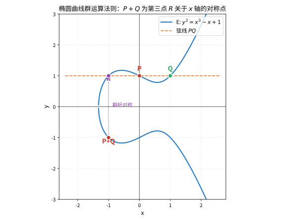

# 第77级 算术几何 (Arithmetic Geometry)

---

## 学习目标

1. 理解代数曲线与椭圆曲线的基本理论及其算术性质
2. 掌握 Pickard 群、Mordell-Weil 定理及高度函数的核心思想
3. 了解 Weil 猜想、谷山-志村定理与 Fermat 大定理的证明框架
4. 熟悉 Faltings 定理（Mordell 猜想）及其在丢番图几何中的应用
5. 掌握 Tate 模、Weil-Châtelet 群、Selmer 群与 Tate-Shafarevich 群等深层工具

---

## 一、核心概念

### 1.1 代数曲线

**定义 1.1（代数曲线）** 设 $k$ 是一个域。**代数曲线** 是指一个在 $k$ 上定义的、纯一维的、完备的、非奇异的代数簇。更具体地说，它是由一组多项式方程在 $k$ 上定义的射影簇，且其维数为 1。

**例 1.1** 射影直线 $\mathbb{P}^1_k$ 是最简单的代数曲线。平面射影曲线
$$
C: F(x,y,z)=0 \subset \mathbb{P}^2_k
$$
其中 $F$ 是齐次多项式，当 $F$ 不可约且 $\partial F/\partial x,\partial F/\partial y,\partial F/\partial z$ 不同时为零时，$C$ 是一条非奇异代数曲线。

### 1.2 椭圆曲线

**定义 1.2（椭圆曲线）** 一条 **椭圆曲线** 是一个亏格为 1 的代数曲线 $E$，其上有一个指定的基点 $O \in E(k)$。等价地，椭圆曲线可以表示为平面 Weierstrass 方程：
$$
E: y^2 = x^3 + ax + b, \quad a,b \in k, \quad \Delta = -16(4a^3 + 27b^2) \neq 0.
$$
其射影形式为：
$$
Y^2 Z = X^3 + aX Z^2 + bZ^3.
$$
基点 $O = [0:1:0]$ 是无穷远点。

**定义 1.3（群结构）** 椭圆曲线 $E$ 上的点构成一个 Abel 群，其群运算由弦切法定义：
- 加法：给定 $P,Q \in E$，作直线 $PQ$ 交 $E$ 于第三点 $R$，则 $P+Q$ 定义为 $R$ 关于 $x$ 轴的对称点。
- 单位元：$O$ 是单位元。
- 逆元：$P=(x,y)$ 的逆元是 $-P=(x,-y)$。

> **直观理解（现实类比）**：椭圆曲线上的点就像"棋盘上的棋手"，任意两位棋手连成的直线必然与第三位棋手相遇（曲线保证了这一点），而"相加"的结果就是把这第三位棋手沿 x 轴对称翻过去。于是全体棋手在这条规则下结成一个阿贝尔群：任何一个点都能通过两人相加反复生成，如同用两枚齿轮互相咬合并带动整条传动链。这就是为什么椭圆曲线的点能构成一个结构清晰的加法群。

### 1.3 Pickard 群

**定义 1.4（除子）** 设 $C$ 是一条非奇异代数曲线。$C$ 上的一个 **除子** 是形式有限和
$$
D = \sum_{P \in C} n_P P, \quad n_P \in \mathbb{Z},
$$
其中只有有限个 $n_P \neq 0$。所有除子构成 Abel 群 $\operatorname{Div}(C)$。

**定义 1.5（主除子）** 对有理函数 $f \in k(C)^\times$，定义其除子
$$
\operatorname{div}(f) = \sum_{P \in C} \operatorname{ord}_P(f) P.
$$
形如 $\operatorname{div}(f)$ 的除子称为 **主除子**，它们构成子群 $\operatorname{Prin}(C) \subset \operatorname{Div}(C)$。

**定义 1.6（Picard 群）** **Picard 群** 定义为除子群模主除子群的商群：
$$
\operatorname{Pic}(C) = \operatorname{Div}(C) / \operatorname{Prin}(C).
$$
**次数为 0 的 Picard 群** 记为 $\operatorname{Pic}^0(C)$。

对于椭圆曲线 $E$，有典范同构 $E \cong \operatorname{Pic}^0(E)$，将 $P$ 映射到除子类 $[P] - [O]$。

### 1.4 高度函数

**定义 1.7（高度函数）** 设 $E$ 是 $\mathbb{Q}$ 上的椭圆曲线，$P=(x,y) \in E(\mathbb{Q})$。将 $x$ 写为既约分数 $x = \frac{a}{b}$，其中 $\gcd(a,b)=1$。定义 **对数高度**：
$$
h(P) = \log \max\{|a|,|b|\}.
$$
**规范高度**（亦称 Néron-Tate 高度）定义为：
$$
\hat{h}(P) = \lim_{n \to \infty} \frac{h([n]P)}{n^2}.
$$
规范高度是二次型：$\hat{h}([m]P) = m^2 \hat{h}(P)$，且配对
$$
\langle P,Q \rangle = \hat{h}(P+Q) - \hat{h}(P) - \hat{h}(Q)
$$
是双线性形式。

### 1.5 Tate 模

**定义 1.8（Tate 模）** 设 $E$ 是域 $k$ 上的椭圆曲线，$\ell \neq \operatorname{char}(k)$ 是素数。**$\ell$-进 Tate 模** 定义为
$$
T_\ell(E) = \varprojlim_n E[\ell^n],
$$
其中 $E[\ell^n]$ 是 $E$ 的 $\ell^n$ 阶挠点子群，逆向极限关于自然映射 $E[\ell^{n+1}] \to E[\ell^n]$ 取。$T_\ell(E)$ 是一个自由 $\mathbb{Z}_\ell$-模，秩为 2。

Tate 模是连接椭圆曲线与 Galois 表示的核心工具：Galois 群 $G_k = \operatorname{Gal}(\bar{k}/k)$ 自然地作用在 $T_\ell(E)$ 上，给出 $\ell$-进表示
$$
\rho_{E,\ell}: G_k \to \operatorname{GL}_2(\mathbb{Z}_\ell).
$$

### 1.6 Weil-Châtelet 群、Selmer 群与 Tate-Shafarevich 群

**定义 1.9（Weil-Châtelet 群）** 设 $E/k$ 是椭圆曲线。$E$ 的 **Weil-Châtelet 群** 是 $E$ 在 $k$ 上的主齐性空间（torsor）的同构类构成的群，记为 $WC(E/k)$ 或 $H^1(G_k, E)$。

**定义 1.10（Selmer 群与 Tate-Shafarevich 群）** 考虑局部化映射的合序列：
$$
0 \to E(k)/mE(k) \to \operatorname{Sel}^{(m)}(E/k) \to \Sha(E/k)[m] \to 0,
$$
其中 $\operatorname{Sel}^{(m)}(E/k)$ 是 **$m$-Selmer 群**，$\Sha(E/k)$ 是 **Tate-Shafarevich 群**。$\Sha(E/k)$ 度量了 Hasse 原理的偏差：它衡量了在局部处处有解但全局无解的障碍。

---

## 二、定理与证明

### 2.1 Mordell-Weil 定理

**定理 2.1（Mordell-Weil 定理）** 设 $E$ 是数域 $K$ 上的椭圆曲线。则 $E(K)$ 是有限生成的 Abel 群：
$$
E(K) \cong \mathbb{Z}^r \oplus E(K)_{\text{tors}},
$$
其中 $r = \operatorname{rank}(E/K)$ 是秩，$E(K)_{\text{tors}}$ 是有限挠子群。

**证明策略**：证明分为三个主要步骤。

**步骤 1：弱 Mordell-Weil 定理**

首先证明 $E(K)/mE(K)$ 是有限群（对某个 $m \ge 2$）。这需要 Kummer 理论与 Galois 上同调。

考虑正合列：
$$
0 \to E[m] \to E \xrightarrow{[m]} E \to 0.
$$
取 Galois 上同调得到长正合列：
$$
0 \to E(K)[m] \to E(K) \xrightarrow{[m]} E(K) \to H^1(G_K, E[m]) \to H^1(G_K, E)[m] \to 0.
$$
由此得到 Kummer 映射：
$$
\kappa: E(K)/mE(K) \hookrightarrow H^1(G_K, E[m]).
$$
利用有限性论证（结合代数数论中类数有限与 Dirichlet 单位定理），可以证明 $\kappa$ 的像落在某个有限子群中，从而 $E(K)/mE(K)$ 有限。

**步骤 2：高度函数与无限下降法**

定义规范高度 $\hat{h}: E(K) \to \mathbb{R}_{\ge 0}$，满足：
1. $\hat{h}(P) \ge 0$，且 $\hat{h}(P)=0$ 当且仅当 $P$ 是挠点。
2. 对任意 $M > 0$，集合 $\{P \in E(K): \hat{h}(P) \le M\}$ 是有限的。
3. $\hat{h}([m]P) = m^2\hat{h}(P)$。
4. 配对 $\langle P,Q \rangle = \hat{h}(P+Q) - \hat{h}(P) - \hat{h}(Q)$ 是双线性形式。

**引理 2.1（无限下降引理）** 设 $A$ 是 Abel 群，$h: A \to \mathbb{R}_{\ge 0}$ 是满足上述性质的函数，$m \ge 2$ 是整数。若 $A/mA$ 有限，则 $A$ 有限生成。

**证明**：选择 $A/mA$ 的代表元 $Q_1,\dots,Q_s$。设 $P \in A$ 任意。存在 $i_1$ 使得 $P \equiv Q_{i_1} \pmod{mA}$，即 $P = mP_1 + Q_{i_1}$。同理 $P_1 = mP_2 + Q_{i_2}$，如此继续。对 $n$ 步有：
$$
P = m^n P_n + \sum_{k=1}^n m^{k-1} Q_{i_k}.
$$
由高度性质：
$$
h(P_n) = \frac{1}{m^{2n}} h(m^n P_n) = \frac{1}{m^{2n}} \left( h(P - \sum_{k=1}^n m^{k-1} Q_{i_k}) \right).
$$
当 $n$ 充分大时，$h(P_n)$ 被控制在某个界内，从而 $P_n$ 只能取有限个值。于是 $P$ 由 $Q_i$ 和这些有限个元素生成。

**步骤 3：钉住秩**

由步骤 1 和 2，$E(K)$ 有限生成。其秩 $r$ 定义为自由部分的秩。挠子群 $E(K)_{\text{tors}}$ 由复乘理论或模形式理论可具体计算。$\square$

### 2.2 椭圆曲线的 Weil 猜想

**定理 2.2（椭圆曲线的 Weil 猜想）** 设 $E$ 是有限域 $\mathbb{F}_q$ 上的椭圆曲线，其中 $q = p^a$。设 $N_m$ 为 $E$ 在 $\mathbb{F}_{q^m}$ 上的有理点个数（包括无穷远点）。则存在代数整数 $\alpha \in \mathbb{C}$，使得 $|\alpha| = \sqrt{q}$，且
$$
N_m = 1 + q^m - (\alpha^m + \bar{\alpha}^m).
$$
等价地，**Zeta 函数** 为：
$$
Z(E/\mathbb{F}_q, T) = \exp\left(\sum_{m=1}^\infty N_m \frac{T^m}{m}\right) = \frac{1 - aT + qT^2}{(1-T)(1-qT)},
$$
其中 $a = 1+q - N_1 = \alpha + \bar{\alpha}$，且 $|\alpha| = \sqrt{q}$。

**证明**：证明基于 Riemann-Roch 定理与 Frobenius 态射。

**引理 2.2（Frobenius 态射）** 定义 $\mathbb{F}_q$-Frobenius 态射 $\operatorname{Frob}_q: E \to E$，在齐次坐标下为 $(x:y:z) \mapsto (x^q:y^q:z^q)$。则 $E(\mathbb{F}_{q^m})$ 正是 $\operatorname{Frob}_q^m$ 的不动点集。

**证明**：$E/\mathbb{F}_{q^m}$ 上的有理点满足 $(x^{q^m}:y^{q^m}:z^{q^m}) = (x:y:z)$，这正是 $(\operatorname{Frob}_q^m - \operatorname{id})$ 的核。$\square$

**引理 2.3** 设 $\operatorname{Frob}_q$ 在 $T_\ell(E)$ 上的作用为 $F$，其中 $\ell \neq p$。则 $\det(F) = q$，$\operatorname{Tr}(F) = a$。

**证明**：考虑 $\ell$-进 Tate 模 $T_\ell(E) \cong \mathbb{Z}_\ell^2$。Frobenius 态射的诱导映射 $F$ 是 $T_\ell(E)$ 上的 $\mathbb{Z}_\ell$-线性变换。其特征多项式为
$$
P(T) = \det(F - T \cdot \operatorname{id}) = T^2 - (\operatorname{Tr} F) T + \det F.
$$
由 Lefschetz 不动点定理在 $\ell$-进上同调中的类比，有：
$$
N_m = 1 - \operatorname{Tr}(F^m) + q^m.
$$
记 $\alpha,\bar{\alpha}$ 为 $F$ 的特征值，则 $\alpha\bar{\alpha} = \det F = q$，且 $a = \operatorname{Tr} F = \alpha + \bar{\alpha}$。于是
$$
N_m = 1 - (\alpha^m + \bar{\alpha}^m) + q^m.
$$
还需证明 $|\alpha| = \sqrt{q}$。这由 **Riemann 假设**（Weil 猜想中 Riemann 类比的部分）给出。对椭圆曲线，可用以下论证：

考虑对偶化：$F$ 与其对偶 $\hat{F}$ 满足 $F \circ \hat{F} = q$。若 $\alpha$ 是 $F$ 的特征值，则 $q/\alpha$ 是 $\hat{F}$ 的特征值。但 $\hat{F}$ 与 $F$ 有相同的特征多项式，故 $q/\alpha = \bar{\alpha}$，从而 $|\alpha| = \sqrt{q}$。$\square$

**Zeta 函数的计算**：
$$
\begin{aligned}
Z(E/\mathbb{F}_q, T) &= \exp\left(\sum_{m=1}^\infty (1 - \alpha^m - \bar{\alpha}^m + q^m) \frac{T^m}{m}\right) \\
&= \frac{\exp(-\log(1-\alpha T) - \log(1-\bar{\alpha}T))}{\exp(-\log(1-T) - \log(1-qT))} \\
&= \frac{(1-\alpha T)(1-\bar{\alpha}T)}{(1-T)(1-qT)} \\
&= \frac{1 - aT + qT^2}{(1-T)(1-qT)}.
\end{aligned}
$$
这就完成了椭圆曲线的 Weil 猜想的证明。$\square$

### 2.3 谷山-志村定理

**定理 2.3（谷山-志村定理，Wiles-Breuil-Conrad-Diamond-Taylor）** 设 $E$ 是 $\mathbb{Q}$ 上的椭圆曲线，具有导子 $N$。则存在一个权为 2、水平为 $N$ 的 **尖点形式**（cusp form）$f \in S_2(\Gamma_0(N))$，使得 $E$ 的 Hasse-Weil $L$-函数等于 $f$ 的 Mellin 变换：
$$
L(E, s) = L(f, s).
$$
换言之，$E$ 是 **模的**（modular）。

**证明思路**（关键步骤概述）：

**步骤 1：变形环与通用变形**

设 $E$ 是 $\mathbb{Q}$ 上的椭圆曲线，$p$ 是奇素数。考虑 $E$ 的 $p$-进 Galois 表示：
$$
\bar{\rho}_{E,p}: G_\mathbb{Q} \to \operatorname{GL}_2(\mathbb{F}_p).
$$
Wiles 的思想是研究 $\bar{\rho}_{E,p}$ 的所有 **提升**（lifting）到 $\mathbb{Z}_p$ 上的变形环 $R$。当 $\bar{\rho}_{E,p}$ 是绝对不可约的且模 $p$ 表示是奇性的（即在复共轭下行列式为 $-1$）时，Mazur 证明了变形环 $R$ 的存在性。

**步骤 2：Hecke 代数与模性**

考虑 Hecke 代数 $\mathbb{T}$，它是作用在尖点形式空间 $S_2(\Gamma_0(N))$ 上的 Hecke 算子生成的 $\mathbb{Z}_p$-代数。由 Eichler-Shimura 理论，存在一个与 $\mathbb{T}$ 相关的 Galois 表示 $\rho_\mathbb{T}$。

**步骤 3：R = T 定理**

核心是证明 **变形环 $R$ 与 Hecke 代数 $\mathbb{T}$ 同构**：$R \cong \mathbb{T}$。这通过以下手段实现：
- 计算 $R$ 的完备交性质（complete intersection）。
- 建立 $R$ 与 $\mathbb{T}$ 之间的映射 $R \to \mathbb{T}$，并证明它是同构。
- 使用 **Kolyvagin 的 Euler 系统** 与 **Flach 的 Euler 系统** 来获得上界估计。

**步骤 4：模性提升**

一旦 $R \cong \mathbb{T}$，则 $\bar{\rho}_{E,p}$ 的通用变形由 $\mathbb{T}$ 参数化。特别地，$E$ 的 $p$-进 Galois 表示对应于一个 Hecke 特征形式，从而 $E$ 是模的。

**完整证明**（由 Wiles 于 1995 年完成，后由 Breuil-Conrad-Diamond-Taylor 修补）建立了所有 $\mathbb{Q}$ 上的半稳定椭圆曲线的模性，进而推出 Fermat 大定理。2001 年，Breuil-Conrad-Diamond-Taylor 完全证明了所有 $\mathbb{Q}$ 上的椭圆曲线都是模的。$\square$

### 2.4 Faltings 定理（Mordell 猜想）

**定理 2.4（Faltings 定理，原 Mordell 猜想）** 设 $C$ 是数域 $K$ 上定义的一条亏格 $g \ge 2$ 的非奇异代数曲线。则 $C(K)$ 是有限集。

**证明思路**（Faltings 1983 年的证明框架）：

**步骤 1：转化为 Abel 簇**

设 $J(C)$ 是 $C$ 的 Jacobi 簇，这是一个 $g$ 维 Abel 簇。嵌入 $C \hookrightarrow J(C)$（通过固定基点）。Mordell-Weil 定理给出 $J(C)(K)$ 是有限生成 Abel 群。

**策略**：证明 $C(K)$ 在 $J(C)(K)$ 中的像被高度函数界定在某个有限范围内。

**步骤 2：高度函数的下降**

Faltings 引入了 **Faltings 高度**（模高）的概念。对 Abel 簇 $A/K$，定义其 Faltings 高度 $h_F(A)$，它度量了 $A$ 的模空间上的高度。Faltings 证明了：
- 在给定维数与极化类型的 Abel 簇中，Faltings 高度有下界。
- 若 $A/K$ 是 $J(C)$ 的 Abel 子簇，则 $h_F(A)$ 与 $C(K)$ 中点的 Néron-Tate 高度相关。

**步骤 3：Tate 猜想的证明**

Faltings 同时证明了 **Tate 猜想** 对 Abel 簇的整除性版本：对素数 $\ell$，自然映射
$$
\operatorname{End}_K(A) \otimes_\mathbb{Z} \mathbb{Q}_\ell \to \operatorname{End}_{G_K}(T_\ell(A)) \otimes_{\mathbb{Z}_\ell} \mathbb{Q}_\ell
$$
是同构。这给出了 Abel 簇的等源分类（isogeny classification）。

**步骤 4：有限性论证**

利用 Tate 猜想与半单性，Faltings 证明了：
- 给定 $K$ 上固定维数 $g$ 与极化类型的 Abel 簇，在 $K$ 上等源的 Abel 簇只有有限多个。
- 由于 $C(K)$ 中的每个点 $P$ 对应 $J(C)$ 的一个除子类，且 $C(K)$ 中的点对应的 Abel 子簇的 Faltings 高度被一致下界所控制，从而 $C(K)$ 有限。

**注** 1990 年，Faltings 因这一工作获得 Fields 奖章。$\square$

---

## 三、示例

### 3.1 椭圆曲线 $y^2 = x^3 + 1$ 的有理点

考虑椭圆曲线
$$
E: y^2 = x^3 + 1.
$$
判别式 $\Delta = -16 \cdot 27 = -432 \neq 0$，故 $E$ 非奇异。

**有理点群的结构**：可以证明 $E(\mathbb{Q})$ 的挠子群为
$$
E(\mathbb{Q})_{\text{tors}} \cong \mathbb{Z}/6\mathbb{Z},
$$
由点 $P = (0,1)$ 生成。$6P = O$，且：
- $P = (0,1)$
- $2P = (-1,0)$
- $3P = (0,-1)$
- $4P = (-1,0)$（与 $2P$ 相同，但在群中为逆元关系）
- $5P = (0,-1)$
- $6P = O$

**秩的计算**：通过分析 $L$-函数在 $s=1$ 处的行为（或使用 2-下降法），可以证明：
$$
\operatorname{rank}(E/\mathbb{Q}) = 0.
$$
因此
$$
E(\mathbb{Q}) \cong \mathbb{Z}/6\mathbb{Z}
$$
是纯挠群。

> **直观理解（现实类比）**：把坐标系想象成一张方格纸，格线交点就是整数坐标。曲线 $x^2+y^2=1$ 上的"有理点"就像方格纸坐标轴上恰好落在格子上的点——它们对应方程的有理解。单位圆上这样的点有无数多个（如 $(\frac{3}{5},\frac{4}{5})$），仿佛在圆周上撒下了一张密不透风的"有理数渔网"。而一条亏格 $\ge 2$ 的复杂曲线（如 Fermat 曲线 $x^n+y^n=1,\ n\ge 3$）上，这样的格点往往只有很少几个，这正是 Faltings 定理（Mordell 猜想）陈述的内容。

**其他有理点**：除上述 6 个挠点外，没有其他有理点。这可以通过计算 $L(E,1)$ 的值并用 Birch-Swinnerton-Dyer 猜想（已知成立的例子）来验证。

### 3.2 Fermat 曲线与椭圆曲线的关系

Fermat 曲线
$$
F_n: x^n + y^n = 1
$$
定义了一条亏格为 $g = \frac{(n-1)(n-2)}{2}$ 的代数曲线。

**Fermat 大定理**：当 $n \ge 3$ 时，$F_n$ 没有非平凡的有理点（即 $x,y \in \mathbb{Q}$ 且 $xyz \neq 0$）。

**与椭圆曲线的联系**（Wiles 的证明思路）：

1. **反证法假设**：假设存在 $a,b,c \in \mathbb{Z}_{>0}$ 使得 $a^n + b^n = c^n$，其中 $n \ge 3$。

2. **构造 Frey 曲线**：设 $A = a^n$，$B = b^n$，$C = c^n$。Frey 构造了椭圆曲线：
   $$
   E_{a,b,c}: y^2 = x(x - A)(x + B).
   $$
   这条曲线的判别式 $\Delta = (ABC)^2$ 具有特殊的算术性质。

3. **Serre 的模性猜想**：Frey 曲线 $E_{a,b,c}$ 的模 $p$ Galois 表示在 $p$ 处具有高度分歧，Serre 的 $\varepsilon$-猜想断言这样的表示不可能来自模形式。

4. **矛盾**：由谷山-志村定理（Wiles 证明），$E_{a,b,c}$ 必须是模的，但 Serre 的 $\varepsilon$-猜想表明它不能是模的，矛盾。因此不存在这样的解。

**具体联系**：$n=3$ 时，Fermat 曲线
$$
x^3 + y^3 = 1
$$
是一条亏格为 1 的曲线（椭圆曲线）。通过变换 $X = \frac{12}{x+y}$，$Y = \frac{36(x-y)}{x+y}$，可化为 Weierstrass 形式：
$$
Y^2 = X^3 - 432.
$$
这条椭圆曲线的有理点群为 $\mathbb{Z}/3\mathbb{Z}$，对应的非平凡 Fermat 解只有 $1^3+0^3=1$ 和 $0^3+1^3=1$，与 Fermat 大定理一致。

---

## 四、习题

### 习题 1：椭圆曲线上的点加法

设 $E: y^2 = x^3 - 25x$ 是 $\mathbb{Q}$ 上的椭圆曲线。

1. 验证 $P = (-4,6)$ 和 $Q = (5,10)$ 在 $E$ 上。
2. 计算 $P+Q$ 和 $2P$。
3. 求 $E(\mathbb{Q})$ 中所有 2-挠点。

**提示**：使用弦切法公式。2-挠点满足 $y=0$，即 $x(x^2-25)=0$。

### 习题 2：高度函数

设 $E: y^2 = x^3 + 1$，$P = (0,1)$。

1. 计算 $h(P)$ 和 $h(2P)$。
2. 计算 $\hat{h}(P)$（提示：用 $\hat{h}(P) = \lim_{n\to\infty} h([2^n]P)/4^n$ 近似）。
3. 验证 $\hat{h}(2P) = 4\hat{h}(P)$。

**提示**：$2P = (-1,0)$，$x$ 坐标为 $-1$，高度为 $\log 1 = 0$。

### 习题 3：Mordell-Weil 定理的理解

设 $E/K$ 是椭圆曲线，$E(K) \cong \mathbb{Z}^r \oplus T$，其中 $T$ 是有限挠群。

1. 证明 $E(K)/2E(K) \cong (\mathbb{Z}/2\mathbb{Z})^{r} \oplus T/2T$。
2. 如果 $E(K)[2] = \mathbb{Z}/2\mathbb{Z} \times \mathbb{Z}/2\mathbb{Z}$，说明 $E(K)/2E(K)$ 的阶至少为 $2^{r+2}$。
3. 解释为什么弱 Mordell-Weil 定理（$E(K)/mE(K)$ 有限）蕴含了 $r$ 有限。

**提示**：使用 Abel 群的基本结构定理。

### 习题 4：Weil 猜想

设 $E$ 是 $\mathbb{F}_5$ 上的椭圆曲线 $y^2 = x^3 + x$。

1. 列出 $E(\mathbb{F}_5)$ 中的所有点。
2. 计算 $N_1$，并确定 $a = 1+5-N_1$。
3. 写出 Zeta 函数 $Z(E/\mathbb{F}_5, T)$。
4. 验证 Riemann 假设：$Z(E/\mathbb{F}_5, T)$ 的零点满足 $|T| = 1/\sqrt{5}$。

**提示**：直接计算每个 $x \in \mathbb{F}_5$ 对应的 $y^2$ 值。注意无穷远点。

### 习题 5：Faltings 定理的推论

1. 说明为什么 Faltings 定理意味着：对任意固定的 $d \ge 4$，Fermat 曲线 $x^d + y^d = 1$ 在 $\mathbb{Q}$ 上只有有限多个有理点。
2. 对比 Faltings 定理与 Mordell-Weil 定理：为什么亏格 $g=0$ 和 $g=1$ 的情形与 $g\ge 2$ 有本质不同？

**提示**：亏格 $g=0$ 的曲线要么没有有理点，要么有无穷多个（参数化）；$g=1$ 的曲线由 Mordell-Weil 定理给出有限生成群，可能有无穷多个有理点（若秩 $>0$）。

---

## 五、总结

在本级中，我们学习了算术几何的核心内容：

1. **代数曲线与椭圆曲线**：从代数曲线的基本概念出发，建立了椭圆曲线的 Weierstrass 方程和群结构。

2. **Picard 群与高度函数**：除子与 Picard 群是研究曲线上的函数与点的基本工具，高度函数则为有理点的"大小"提供了度量。

3. **Mordell-Weil 定理**：证明了椭圆曲线的有理点群是有限生成的，其证明中的无限下降法成为数论的标准方法。

4. **Weil 猜想**：建立了有限域上椭圆曲线的 Zeta 函数与 Frobenius 特征值之间的关系，Riemann 假设部分给出了特征值的绝对值的精确估计。

5. **谷山-志村定理**：椭圆曲线与模形式之间的深刻联系，其证明（Wiles 等）直接导致了 Fermat 大定理的解决。

6. **Faltings 定理**：高亏格代数曲线上的有理点只有有限多个，这是丢番图几何的里程碑。

7. **深层工具**：Tate 模、Galois 表示、Weil-Châtelet 群、Selmer 群与 Tate-Shafarevich 群构成了现代算术几何的核心工具箱。

---

**参考文献**
1. Silverman, J. H. *The Arithmetic of Elliptic Curves*, Springer, 2nd ed.
2. Hartshorne, R. *Algebraic Geometry*, Springer, 1977.
3. Wiles, A. *Modular Elliptic Curves and Fermat's Last Theorem*, Annals of Mathematics, 1995.
4. Faltings, G. *Endlichkeitssätze für abelsche Varietäten über Zahlkörpern*, Inventiones Mathematicae, 1983.
5. Hindry, M. & Silverman, J. H. *Diophantine Geometry: An Introduction*, Springer, 2000.