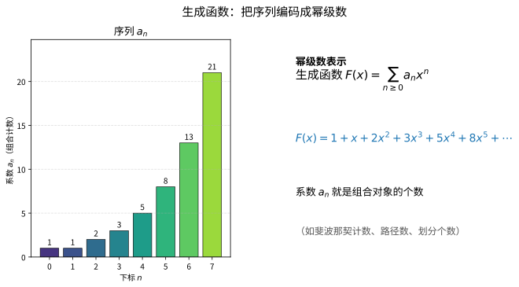
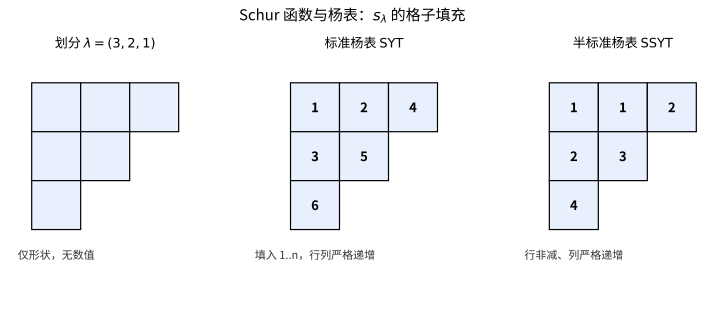
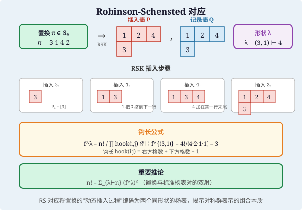

# 第80级 代数组合 (Algebraic Combinatorics)

---

## 学习目标

1. 掌握对称函数、Schur函数与Young图的基本理论
2. 理解Littlewood-Richardson系数及其在表示论中的应用
3. 掌握Pólya计数定理及其在群作用计数中的应用
4. 理解Möbius反演与关联代数的基本框架
5. 掌握Robinson-Schensted对应及其组合意义
6. 了解组合Hopf代数与非交并半格的基本概念

---

## 核心概念

### 1. 对称函数 (Symmetric Functions)

**定义**：设 $x_1, x_2, \dots, x_n$ 为不定元。一个对称函数 $f(x_1, \dots, x_n)$ 是对于任意置换 $\sigma \in S_n$ 满足 $f(x_{\sigma(1)}, \dots, x_{\sigma(n)}) = f(x_1, \dots, x_n)$ 的幂级数。

对称函数的全体构成一个环，记作 $\Lambda_n$，其逆极限为 $\Lambda$（对称函数环）。

**基本对称函数**：
$$e_k(x_1, \dots, x_n) = \sum_{1 \leq i_1 < i_2 < \cdots < i_k \leq n} x_{i_1} x_{i_2} \cdots x_{i_k}$$

**完全齐次对称函数**：
$$h_k(x_1, \dots, x_n) = \sum_{1 \leq i_1 \leq i_2 \leq \cdots \leq i_k \leq n} x_{i_1} x_{i_2} \cdots x_{i_k}$$

**幂和对称函数**：
$$p_k(x_1, \dots, x_n) = \sum_{i=1}^n x_i^k$$



> **直观理解（现实类比）**：生成函数就像"把一串数字打包进一个多项式信封"。序列 $a_n$ 的一组个数（如斐波那契计数、路径数、划分个数）被编码成幂级数 $F(x)=\sum_{n\geq 0}a_n x^n$ 的系数；你只需对 $F(x)$ 做代数运算（加减乘、求导、复合），信封里的系数 $a_n$ 就会自动跟着"变形"，从而得到新组合对象的计数——如同用一台机器同时处理整条流水线，而不是一件一件地数。

### 2. Young图与Young表 (Young Diagrams and Young Tableaux)

**Young图**：一个整数划分 $\lambda = (\lambda_1, \lambda_2, \dots, \lambda_k)$ 满足 $\lambda_1 \geq \lambda_2 \geq \cdots \geq \lambda_k > 0$ 且 $\sum \lambda_i = n$。其Young图是具有 $\lambda_i$ 个方格的左对齐行的图形。

**标准Young表 (SYT)**：将 $1, 2, \dots, n$ 填入Young图的方格中，使得每行从左到右递增，每列从上到下递增。

**半标准Young表 (SSYT)**：将正整数填入Young图的方格中，使得每行从左到右非减，每列从上到下严格递增。

### 3. Schur函数 (Schur Functions)

**定义**：设 $\lambda$ 是一个划分，$\lambda$ 对应的Schur函数定义为：
$$s_\lambda(x_1, \dots, x_n) = \frac{\det(x_i^{\lambda_j + n - j})_{i,j=1}^n}{\det(x_i^{n-j})_{i,j=1}^n}$$

Schur函数构成对称函数环的一组线性基，在表示论中对应 $GL(n)$ 的不可约表示的特征标。



> **直观理解（现实类比）**：Young图像是一种"积木格子"，划分 $\lambda$ 决定格子的外壳，而杨表则规定往格子里填数的规则。标准杨表要求每行每列都严格递增（像按顺序排队的座位号），半标准杨表则允许同行相同（像同一排允许出现并列名次）。Schur函数 $s_\lambda$ 正是把所有这些"合法填法"的贡献加起来，从而把想象中的格子变成了可计算的代数对象。

### 4. Littlewood-Richardson系数

**定义**：Schur函数的乘积可展开为Schur函数的线性组合：
$$s_\lambda \cdot s_\mu = \sum_{\nu} c_{\lambda\mu}^\nu s_\nu$$

系数 $c_{\lambda\mu}^\nu$ 称为Littlewood-Richardson系数，它们是非负整数，具有深刻的组合与表示论意义。

### 5. Pólya计数定理

**定义**：设 $G$ 是作用在集合 $X$ 上的有限群，$C$ 是颜色集。Pólya计数定理给出了用 $C$ 中的颜色对 $X$ 的元素着色，在 $G$ 作用下不等价的着色方案数。

### 6. 偏序集与Möbius反演

**定义**：偏序集 $(P, \leq)$ 的Möbius函数 $\mu$ 递归定义为：
$$\mu(x, x) = 1, \quad \sum_{x \leq z \leq y} \mu(x, z) = 0 \quad (x < y)$$

**Möbius反演公式**：若 $f, g: P \to \mathbb{C}$ 满足 $g(x) = \sum_{y \leq x} f(y)$，则：
$$f(x) = \sum_{y \leq x} \mu(y, x) g(y)$$

### 7. 关联代数 (Incidence Algebra)

**定义**：偏序集 $(P, \leq)$ 的关联代数 $I(P)$ 是所有形如 $\alpha: \{(x, y) \in P \times P : x \leq y\} \to \mathbb{C}$ 的函数的集合，卷积定义为：
$$(\alpha * \beta)(x, y) = \sum_{x \leq z \leq y} \alpha(x, z) \beta(z, y)$$

### 8. 组合Hopf代数

**定义**：组合Hopf代数是具有余乘、余单位和对极的代数结构，在组合学中用于编码和操作组合对象。例如，对称函数环 $\Lambda$ 是一个Hopf代数，余乘为 $\Delta(e_n) = \sum_{i=0}^n e_i \otimes e_{n-i}$。

### 9. 非交并半格 (Supersolvable Semilattice)

**定义**：一个有限偏序集称为非交并半格，如果它满足某些链条件，这些条件在Stanley的因子序理论中起重要作用。

---

## 定理与证明

### 定理1：Pólya计数定理

**定理**：设 $G$ 是作用在集合 $X$ 上的有限群，$C$ 是颜色集，$|C| = m$。对于每个 $g \in G$，设 $\text{cyc}(g)$ 是 $g$ 在 $X$ 上作用的不交轮换分解中轮换的个数。则不等价的着色方案数为：
$$N = \frac{1}{|G|} \sum_{g \in G} m^{\text{cyc}(g)}$$

更一般地，若引入权重，设 $w: C \to \mathbb{R}$ 为颜色权重函数，则Pólya枚举定理为：
$$\sum_{\text{轨道}} \prod_{x \in X} w(\text{颜色}(x)) = \frac{1}{|G|} \sum_{g \in G} \prod_{c \in \text{cyc}(g)} \left( \sum_{a \in C} w(a)^{|c|} \right)$$

**证明**：我们使用Burnside引理和群作用的基本理论。

**第一步：Burnside引理**

设 $G$ 是作用在有限集 $S$ 上的有限群。对于每个 $g \in G$，设 $S^g = \{s \in S : g \cdot s = s\}$ 为 $g$ 的不动点集。则 $G$ 作用在 $S$ 上的轨道数为：
$$|S/G| = \frac{1}{|G|} \sum_{g \in G} |S^g|$$

**Burnside引理的证明**：考虑集合 $\{(g, s) \in G \times S : g \cdot s = s\}$，按两种方式计数：
$$\sum_{g \in G} |S^g| = \sum_{s \in S} |\text{Stab}(s)| = \sum_{s \in S} \frac{|G|}{|\text{Orb}(s)|} = |G| \cdot \sum_{s \in S} \frac{1}{|\text{Orb}(s)|}$$

每个轨道 $O$ 贡献 $\sum_{s \in O} \frac{1}{|O|} = 1$，因此 $\sum_{s \in S} \frac{1}{|\text{Orb}(s)|} = |S/G|$。

**第二步：转化为着色问题**

设着色集为 $A = C^X$，即从 $X$ 到 $C$ 的所有函数。群 $G$ 在 $A$ 上的作用由 $(g \cdot f)(x) = f(g^{-1} \cdot x)$ 定义。我们需要计算的正是 $|A/G|$。

由Burnside引理：
$$|A/G| = \frac{1}{|G|} \sum_{g \in G} |A^g|$$

其中 $A^g = \{f \in A : g \cdot f = f\}$。

**第三步：刻画 $A^g$**

$f \in A^g$ 当且仅当对任意 $x \in X$ 和任意 $k \in \mathbb{Z}$，有 $f(g^k \cdot x) = f(x)$。这意味着 $f$ 在 $g$ 的每个轮换上是常数。

设 $g$ 在 $X$ 上的轮换分解为 $c_1, c_2, \dots, c_{\text{cyc}(g)}$，每个轮换 $c_i$ 的长度为 $|c_i|$。则 $f$ 由其在每个轮换上的取值唯一确定，因此：
$$|A^g| = m^{\text{cyc}(g)}$$

代入Burnside引理即得：
$$|A/G| = \frac{1}{|G|} \sum_{g \in G} m^{\text{cyc}(g)}$$

**第四步：带权重的版本**

对于带权重的版本，我们考虑生成函数。设 $F_g$ 为 $g$ 的轮换指标：
$$Z_g = \prod_{i=1}^{\text{cyc}(g)} \left( \sum_{a \in C} w(a)^{|c_i|} \right)$$

则Pólya枚举定理的权重版本同样由Burnside引理导出。$\square$

---

### 定理2：Möbius反演公式

**定理**：设 $(P, \leq)$ 是一个局部有限偏序集（即任意区间 $[x, y] = \{z : x \leq z \leq y\}$ 是有限集），$\mu$ 是 $P$ 上的Möbius函数。若 $f, g: P \to \mathbb{C}$ 满足：
$$g(x) = \sum_{y \leq x} f(y) \quad \text{对所有 } x \in P$$

则：
$$f(x) = \sum_{y \leq x} \mu(y, x) g(y) \quad \text{对所有 } x \in P$$

**证明**：我们使用关联代数方法。

**第一步：定义关联代数**

设 $I(P)$ 为 $P$ 的关联代数，其元素为函数 $\alpha: \{(x, y) : x \leq y\} \to \mathbb{C}$，卷积定义为：
$$(\alpha * \beta)(x, y) = \sum_{x \leq z \leq y} \alpha(x, z) \beta(z, y)$$

$I(P)$ 中的单位元 $\delta$ 定义为：
$$\delta(x, y) = \begin{cases}
1 & \text{若 } x = y \\
0 & \text{若 } x < y
\end{cases}$$

**第二步：关键元素**

定义Zeta函数：
$$\zeta(x, y) = \begin{cases}
1 & \text{若 } x \leq y \\
0 & \text{否则}
\end{cases}$$

Möbius函数 $\mu$ 定义为 $\zeta$ 在 $I(P)$ 中的逆元，即：
$$\zeta * \mu = \mu * \zeta = \delta$$

展开即得：
$$\sum_{x \leq z \leq y} \zeta(x, z) \mu(z, y) = \delta(x, y)$$
$$\sum_{x \leq z \leq y} \mu(z, y) = \delta(x, y)$$

对于 $x = y$，有 $\mu(x, x) = 1$。
对于 $x < y$，有 $\sum_{x \leq z \leq y} \mu(z, y) = 0$，即：
$$\sum_{x \leq z \leq y} \mu(z, y) = 0 \quad \Rightarrow \quad \mu(x, y) = -\sum_{x < z \leq y} \mu(z, y)$$

这给出了Möbius函数的递归定义。

**第三步：反演公式的证明**

设 $g(x) = \sum_{y \leq x} f(y)$。在关联代数中，这可以写为：
$$g(x) = \sum_{y \leq x} f(y) \zeta(y, x) = (f * \zeta)(x)$$

其中我们将 $f$ 视为 $I(P)$ 中的元素，定义为 $f(y, x) = f(y)$ 当 $y \leq x$（但更精确地说，我们考虑 $f$ 作为 $P$ 上的函数，与 $\zeta$ 卷积）。

实际上，更标准的写法是：定义 $F(x) = \sum_{y \leq x} f(y)$。则：
$$F = f * \zeta \quad \text{即} \quad F(x) = \sum_{y \leq x} f(y) \zeta(y, x)$$

由于 $\mu = \zeta^{-1}$，我们有：
$$f = F * \mu$$

展开即得：
$$f(x) = \sum_{y \leq x} F(y) \mu(y, x)$$

这正是Möbius反演公式。$\square$

**推论**：对于正整数集上的整除偏序，其中 $a \leq b$ 当且仅当 $a \mid b$，Möbius函数为：
$$\mu(m, n) = \begin{cases}
(-1)^k & \text{若 } n/m \text{ 是 } k \text{ 个不同素数的乘积} \\
0 & \text{若 } n/m \text{ 有平方因子}
\end{cases}$$

这给出了经典的数论Möbius反演公式。

---

### 定理3：Schur函数的对称性和正交性

**定理**：Schur函数满足以下性质：

1. **对称性**：$s_\lambda(x_1, \dots, x_n)$ 是 $x_1, \dots, x_n$ 的对称函数。
2. **正交性**：对于Hall内积 $\langle \cdot, \cdot \rangle$，有：
   $$\langle s_\lambda, s_\mu \rangle = \delta_{\lambda\mu}$$
   其中 $\delta_{\lambda\mu}$ 是Kronecker delta。

**证明**：

**对称性的证明**：

Schur函数的定义式为：
$$s_\lambda(x_1, \dots, x_n) = \frac{\det(x_i^{\lambda_j + n - j})_{i,j=1}^n}{\det(x_i^{n-j})_{i,j=1}^n}$$

分母 $\det(x_i^{n-j})$ 是Vandermonde行列式：
$$\det(x_i^{n-j}) = \prod_{1 \leq i < j \leq n} (x_i - x_j)$$

对于任意置换 $\sigma \in S_n$，将 $x_i$ 替换为 $x_{\sigma(i)}$，分子分母同时乘以 $\text{sgn}(\sigma)$，因此比值不变。故 $s_\lambda$ 是对称的。

**正交性的证明**：

我们首先定义Hall内积。在对称函数环 $\Lambda$ 上，Hall内积由幂和函数定义：
$$\langle p_\lambda, p_\mu \rangle = \delta_{\lambda\mu} z_\lambda$$

其中 $z_\lambda = \prod_{i \geq 1} i^{m_i(\lambda)} m_i(\lambda)!$，$m_i(\lambda)$ 是 $\lambda$ 中 $i$ 出现的次数。

**引理**：Schur函数与Jacobi-Trudi公式相关：
$$s_\lambda = \det(h_{\lambda_i - i + j})_{i,j=1}^n$$

其中 $h_k$ 是完全齐次对称函数，$h_0 = 1$，$h_k = 0$ 当 $k < 0$。

**正交性的关键在于**：利用Cauchy恒等式：
$$\prod_{i,j} \frac{1}{1 - x_i y_j} = \sum_{\lambda} s_\lambda(x) s_\lambda(y)$$

其中求和遍及所有划分。

另一方面，Hall内积的定义使得 $\{s_\lambda\}$ 成为正交基。具体地，考虑双线性形式：
$$\langle f, g \rangle = [f(\partial) g(x)]_{x=0}$$

其中 $f(\partial)$ 是通过将 $f$ 中的幂和 $p_k$ 替换为 $k \frac{\partial}{\partial p_k}$ 得到的微分算子。可以验证：
$$\langle s_\lambda, s_\mu \rangle = \delta_{\lambda\mu}$$

**详细验证**：利用Cauchy恒等式和幂和展开：
$$\prod_{i,j} \frac{1}{1 - x_i y_j} = \exp\left(\sum_{k \geq 1} \frac{p_k(x) p_k(y)}{k}\right) = \sum_{\lambda} \frac{1}{z_\lambda} p_\lambda(x) p_\lambda(y)$$

结合 $\sum_{\lambda} s_\lambda(x) s_\lambda(y) = \sum_{\lambda} \frac{1}{z_\lambda} p_\lambda(x) p_\lambda(y)$，以及 $\{p_\lambda\}$ 的正交性 $\langle p_\lambda, p_\mu \rangle = \delta_{\lambda\mu} z_\lambda$，可得 $\{s_\lambda\}$ 的正交性。$\square$

---

### 定理4：Littlewood-Richardson规则

**定理**：Schur函数乘积 $s_\lambda \cdot s_\mu$ 的展开系数 $c_{\lambda\mu}^\nu$ 等于将 $\mu$ 的Young图附加到 $\lambda$ 的Young图上得到 $\nu$ 的Young图的方式数，其中附加过程需满足Littlewood-Richardson条件：

1. 每次添加一个方格，方格中填入数字，每步得到的形状是一个Young图。
2. 填入的数字构成一个序列（称为"文字"），该序列从右到左、从上到下读入时，是一个逆格序词（reverse lattice word），即对于任意前缀，数字 $i$ 的出现次数不少于数字 $i+1$ 的出现次数。
3. 同一行中的数字不严格递减，同一列中的数字严格递增。

**证明思路**：

**第一步：转化为对称函数**

Littlewood-Richardson系数 $c_{\lambda\mu}^\nu$ 定义为：
$$s_\lambda \cdot s_\mu = \sum_{\nu} c_{\lambda\mu}^\nu s_\nu$$

**第二步：Skew Schur函数**

考虑Skew Schur函数 $s_{\nu/\lambda}$，其定义为：
$$s_{\nu/\lambda} = \sum_{\mu} c_{\lambda\mu}^\nu s_\mu$$

因此 $c_{\lambda\mu}^\nu$ 等于 $s_{\nu/\lambda}$ 中 $s_\mu$ 的系数。

**第三步：Skew Schur函数的组合解释**

Skew Schur函数 $s_{\nu/\lambda}$ 可以表示为所有形状为 $\nu/\lambda$ 的半标准Young表的权重和：
$$s_{\nu/\lambda} = \sum_{T \in \text{SSYT}(\nu/\lambda)} x^T$$

其中 $x^T = \prod_{i} x_i^{m_i(T)}$，$m_i(T)$ 是 $i$ 在 $T$ 中的出现次数。

**第四步：Littlewood-Richardson条件的推导**

为了得到 $c_{\lambda\mu}^\nu$，我们需要将 $\mu$ 的Yamanouchi词（即满足逆格序条件的词）与 $\nu/\lambda$ 的填充对应。具体地：

给定一个形状为 $\nu/\lambda$ 的半标准Young表 $T$，逐行读出 $T$ 中的数字，得到词 $w(T)$。若 $w(T)$ 是Yamanouchi词（即逆格序词），则 $T$ 对应一个Littlewood-Richardson填充。

**第五步：对应关系**

每个形状为 $\nu/\lambda$ 且满足Littlewood-Richardson条件的填充对应一个 $\mu$，其中 $\mu_i$ 等于数字 $i$ 在填充中出现的次数。这就建立了 $c_{\lambda\mu}^\nu$ 与Littlewood-Richardson填充计数之间的对应。

**第六步：证明关键**

该对应是双射的，因此 $c_{\lambda\mu}^\nu$ 确实等于满足条件的填充数。$\square$

---

### 定理5：Robinson-Schensted对应

**定理**：存在一个双射（称为Robinson-Schensted对应）：
$$\text{RS}: S_n \to \bigcup_{\lambda \vdash n} \text{SYT}(\lambda) \times \text{SYT}(\lambda)$$

其中 $S_n$ 是 $n$ 次对称群，$\text{SYT}(\lambda)$ 是形状为 $\lambda$ 的标准Young表的集合。该对应将每个置换 $\pi \in S_n$ 映射到一对相同形状的标准Young表 $(P, Q)$。

**证明**：

**第一步：算法描述（RSK算法）**

给定置换 $\pi = \pi_1 \pi_2 \cdots \pi_n$，我们递归地构造插入表 $P$ 和记录表 $Q$。

初始化 $P = \emptyset$，$Q = \emptyset$。

对于 $k = 1, 2, \dots, n$，执行以下步骤：

1. **插入步骤**：将 $\pi_k$ 插入 $P$ 中：
   - 从第一行开始，找到该行中第一个大于 $\pi_k$ 的元素。
   - 若找到，设该元素为 $x$，用 $\pi_k$ 替换 $x$，然后将 $x$ 插入下一行（递归执行）。
   - 若未找到（或行已满），将 $\pi_k$ 附加到该行末尾。

2. **记录步骤**：在 $Q$ 中与 $P$ 新增方格相同的位置填入 $k$。

**第二步：证明结果是标准Young表**

我们需要证明算法终止时 $P$ 和 $Q$ 都是标准Young表。

- $P$ 的每行从左到右严格递增：由插入规则，当 $a$ 替换 $b$（$a < b$）时，$b$ 被插入下一行，$a$ 所在位置左侧的元素都小于 $a$，右侧的元素都大于等于 $b$，因此 $a$ 保持行内递增序。
- $P$ 的每列从上到下严格递增：需要验证插入操作不破坏列递增性，这可以通过归纳法证明。
- $Q$ 的填充方式是每次在新方格中填入 $k$，由于 $k$ 递增，$Q$ 每行每列也严格递增。

**第三步：证明可逆性**

给定 $(P, Q)$，我们可以逆向恢复出 $\pi$：

1. 找到 $Q$ 中最大元素 $k$ 所在的位置 $(i, j)$。
2. 在 $P$ 的相同位置，该元素是被插入的。从 $P$ 中移除该元素，并逆向执行插入过程：
   - 从上一行中找到小于该元素的最大元素，将其上移替换当前元素。
   - 重复直到第一行，得到 $\pi_k$。
3. 从 $Q$ 中移除 $k$。

重复以上步骤即恢复 $\pi$。

**第四步：证明双射性**

由于上述正向算法和逆向算法互逆，且每个步骤都是确定性的，因此RS对应是双射。

**推论**：设 $f^\lambda$ 为形状 $\lambda$ 的标准Young表个数，则：
$$n! = \sum_{\lambda \vdash n} (f^\lambda)^2$$

这是RS对应的直接推论，因为 $|S_n| = n!$，且RS对应是双射。

**钩长公式**：$f^\lambda = \frac{n!}{\prod_{(i,j) \in \lambda} \text{hook}(i,j)}$，其中 $\text{hook}(i,j)$ 是方格 $(i,j)$ 的钩长（该方格右方和下方方格数加1）。$\square$



> **直观理解（现实类比）**：RS 对应就像"把一副打乱的扑克牌整理成两叠整齐的牌塔"。给定一个置换（如 $\pi = 3142$），RSK 算法逐张插入扑克牌：每张新牌要么放在某行末尾，要么"挤掉"该行中比它大的那张牌，被挤掉的牌再插入下一行。最终得到两个形状完全相同的标准 Young 表——插入表 $P$ 记录了"牌的最终排列"，记录表 $Q$ 记录了"每张牌是什么时候放进去的"。这种双射揭示了：$n!$ 个打乱方式恰好等于所有可能形状 $\lambda$ 下"两张相同形状标准表的配对数"之和。

---

## 示例

### 示例1：用Pólya计数计算项链着色

**问题**：用 $m$ 种颜色给 $n$ 颗珠子组成的项链着色，旋转视为等价，求不等价的着色方案数。

**解**：项链的对称群是 $n$ 阶循环群 $C_n$，作用在 $n$ 个珠子上。

对于 $g = r^k$（旋转 $k$ 个位置），$g$ 的轮换数为 $\gcd(k, n)$。因为旋转 $k$ 个位置将珠子分为 $\gcd(k, n)$ 个轮换，每个轮换有 $n/\gcd(k, n)$ 个珠子。

由Pólya计数定理：
$$N = \frac{1}{n} \sum_{k=0}^{n-1} m^{\gcd(k, n)}$$

**例**：$n = 6$，$m = 2$（2种颜色，6颗珠子）。
$$\gcd(0,6)=6, \gcd(1,6)=1, \gcd(2,6)=2, \gcd(3,6)=3, \gcd(4,6)=2, \gcd(5,6)=1$$
$$N = \frac{1}{6}(2^6 + 2^1 + 2^2 + 2^3 + 2^2 + 2^1) = \frac{1}{6}(64 + 2 + 4 + 8 + 4 + 2) = \frac{84}{6} = 14$$

因此有14种不等价的着色方案。

---

### 示例2：用Young表计算对称群表示

**问题**：对于 $S_4$，列出所有划分及对应的不可约表示维数，并计算 $S_4$ 的不可约表示的特征标（部分）。

**解**：$S_4$ 的划分有：
- $\lambda = (4)$：$f^{(4)} = 1$（平凡表示）
- $\lambda = (3,1)$：$f^{(3,1)} = 3$
- $\lambda = (2,2)$：$f^{(2,2)} = 2$
- $\lambda = (2,1,1)$：$f^{(2,1,1)} = 3$
- $\lambda = (1,1,1,1)$：$f^{(1,1,1,1)} = 1$（符号表示）

验证：$1^2 + 3^2 + 2^2 + 3^2 + 1^2 = 1 + 9 + 4 + 9 + 1 = 24 = 4!$ ✓

**钩长计算**：以 $\lambda = (3,1)$ 为例：
```
□□□
□
```
钩长分别为：第一行 4, 2, 1；第二行 1。
$$f^{(3,1)} = \frac{4!}{4 \cdot 2 \cdot 1 \cdot 1} = \frac{24}{8} = 3$$

---

### 示例3：Möbius反演在子集格上的应用

**问题**：设 $P$ 是有限集 $[n] = \{1, \dots, n\}$ 的所有子集构成的偏序集（按包含序）。求 $P$ 上的Möbius函数，并应用Möbius反演。

**解**：在子集格中，对任意 $A \subseteq B$，有：
$$\mu(A, B) = (-1)^{|B| - |A|}$$

**验证**：固定 $A$，对 $B$ 归纳。若 $B = A$，则 $\mu(A, A) = 1$。若 $B \supsetneq A$，设 $k = |B| - |A|$，则：
$$\sum_{A \subseteq C \subseteq B} \mu(A, C) = \sum_{j=0}^k \binom{k}{j} (-1)^j = (1-1)^k = 0 \quad (k > 0)$$

**应用**：容斥原理是Möbius反演在子集格上的特例。设 $f(A) = |A|$ 中满足某性质的元素个数，$g(A) = \sum_{B \subseteq A} f(B)$，则 $f(A) = \sum_{B \subseteq A} (-1)^{|A|-|B|} g(B)$。

---

## 习题

### 习题1：Pólya计数

用3种颜色给正八面体的面着色，旋转视为等价，求不等价的着色方案数。

**提示**：正八面体的旋转群同构于 $S_4$，阶为24。分析每个旋转类型的轮换结构。

### 习题2：Schur函数

证明 $s_{(2,1)}$ 的展开式，并验证 $s_{(2)} \cdot s_{(1)} = s_{(3)} + s_{(2,1)}$。

**提示**：使用Littlewood-Richardson规则，或使用Jacobi-Trudi公式直接计算。

### 习题3：Möbius反演

设 $P$ 是正整数按整除关系构成的偏序集。证明Möbius函数为 $\mu(m, n) = \mu(n/m)$，其中 $\mu$ 是经典数论Möbius函数，并推导出数论Möbius反演公式。

**提示**：利用关联代数方法，验证 $\sum_{d \mid n} \mu(d) = [n=1]$。

### 习题4：RS对应

找出置换 $\pi = 3\;1\;4\;2$ 在Robinson-Schensted对应下的像 $(P, Q)$。

**提示**：逐步执行RSK算法，记录每一步的 $P$ 和 $Q$。

### 习题5：Pólya计数（带权重）

用红、蓝两种颜色给正方形的顶点着色，旋转反射视为等价。求恰有2个红顶点的着色方案数。

**提示**：使用Pólya枚举定理的权重版本，引入变量 $r$ 和 $b$ 表示红蓝。

### 习题6：关联代数

证明偏序集 $P$ 的关联代数 $I(P)$ 在卷积运算下构成一个结合代数，并给出单位元。

**提示**：验证结合律，并检查 $\delta$ 是否为单位元。

---

## 总结

代数组合学是组合数学与代数学的交叉领域，它将代数结构（群、环、域、Hopf代数）与组合对象（划分、置换、偏序集、树）紧密结合。本章的核心内容包括：

1. **Pólya计数定理**：利用群作用对组合对象进行计数，是Burnside引理的推广，广泛应用于化学、物理和计算机科学中的对称性计数问题。

2. **Möbius反演**：通过关联代数框架统一了各种反演公式（容斥原理、数论Möbius反演等），是组合学中最强大的工具之一。

3. **Schur函数与Young表**：建立了组合学与表示论之间的桥梁，Schur函数作为对称函数环的正交基，在表示论、代数几何和数学物理中都有重要应用。

4. **Littlewood-Richardson规则**：给出了Schur函数乘积展开的组合解释，是计算表示论中Clebsch-Gordan系数的组合工具。

5. **Robinson-Schensted对应**：建立了置换与标准Young表对之间的双射，揭示了对称群表示论与组合学的深层联系。

这些工具和方法不仅在纯数学中有着广泛的应用，还在计算复杂性理论、量子信息、统计力学等领域发挥着重要作用。学习代数组合需要扎实的抽象代数和组合数学基础，建议在掌握群论、环论和基本组合计数的基础上深入学习。