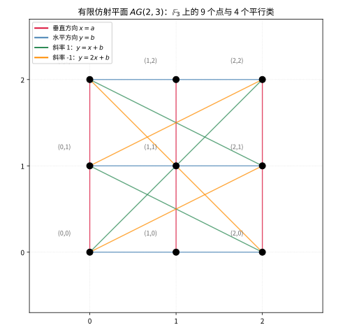

# 第88级：有限几何学

## 学习目标

1. 掌握有限射影平面与有限仿射平面的公理系统与基本性质
2. 理解Bruck-Ryser定理及其对有限射影平面存在性的限制
3. 掌握Desargues平面与Pappus平面的结构特征
4. 了解有限广义四边形与极空间的基本理论
5. 理解有限几何在编码理论、群论中的应用

---

## 1. 引言

有限几何学（Finite Geometry）研究定义在有限域上的几何结构。与经典欧氏几何不同，有限几何中的"点"和"线"是有限集合，满足特定的公理系统。有限几何在编码理论、密码学、组合设计、群论等领域有广泛应用。本节将系统介绍有限几何的核心概念与定理。

---

## 2. 核心概念

### 2.1 有限射影平面

**有限射影平面**（Finite Projective Plane）是一个由点和线组成的集合，满足以下公理：
1. 任意两点有且仅有一条线通过
2. 任意两条线有且仅有一个交点
3. 存在至少四个点，其中任意三点不共线

### 2.2 阶为 $q$ 的射影平面

若有限射影平面的每条线上有 $q+1$ 个点，则称其**阶**为 $q$。此时：
- 总点数 $= q^2 + q + 1$
- 总线数 $= q^2 + q + 1$
- 每个点恰好在 $q+1$ 条线上

### 2.3 仿射平面

**仿射平面**（Affine Plane）去掉射影平面中的一条线（称为"无穷远线"）及其上的点得到。阶为 $q$ 的仿射平面记为 $AG(2, q)$：
- 总点数 $= q^2$
- 总线数 $= q^2 + q$
- 每条线上有 $q$ 个点

### 2.4 Bruck-Ryser定理

**Bruck-Ryser定理**给出了有限射影平面存在的必要条件：若存在阶为 $q$ 的有限射影平面，且 $q \equiv 1 \pmod{4}$ 或 $q \equiv 2 \pmod{4}$，则 $q$ 必须可以表示为两个完全平方数的和。

### 2.5 Desargues平面

**Desargues平面**是满足Desargues定理的射影平面。在有限域 $\mathbb{F}_q$ 上定义的射影平面 $PG(2, q)$ 一定是Desargues平面。

### 2.6 Pappus平面

**Pappus平面**是满足Pappus定理的射影平面。Pappus平面一定是Desargues平面，但反之不必然。

### 2.7 有限广义四边形

**有限广义四边形**（Finite Generalized Quadrangle）是一个满足以下条件的点线结构：
- 任意两点至多有一条线通过
- 任意两条线至多有一个交点
- 对任意点 $p$ 和线 $l$（$p$ 不在 $l$ 上），存在唯一的点 $p'$ 在 $l$ 上且与 $p$ 共线

### 2.8 极空间

**极空间**（Polar Space）是满足极性的射影空间，对应于正交、辛、酉等双线性型。

### 2.9 有限几何与编码理论

有限几何在编码理论中的应用包括：
- 射影平面作为组合设计的来源
- 极空间用于构造LDPC码
- 有限几何中的点线结构用于构造纠错码

### 2.10 有限几何与群论

有限几何的自同构群是重要的有限群，包括：
- $PGL(3, q)$：$PG(2, q)$ 的自同构群
- 辛群、正交群、酉群作为极空间的自同构群

---

## 3. 定理与证明

### 3.1 有限射影平面的公理与性质

**定理1（有限射影平面的基本性质）**：设 $\Pi$ 是一个有限射影平面，每条线上有 $q+1$ 个点，则：
1. 每个点恰好在 $q+1$ 条线上
2. 总点数 $v = q^2 + q + 1$
3. 总线数 $b = q^2 + q + 1$

**证明**：

**对偶性**：射影平面的公理满足对偶性——将"点"与"线"互换，公理保持不变。因此，关于点的结论与关于线的结论是对偶的。

**性质1**：设 $p$ 是任意一点。取不在 $p$ 上的一条线 $l$（由公理3，存在至少一条线不通过 $p$）。$l$ 上有 $q+1$ 个点。$p$ 与 $l$ 上的每个点确定一条线，且这些线互不相同（否则两条线会有两个交点）。此外，任何通过 $p$ 的线必须与 $l$ 交于唯一一点。因此通过 $p$ 的线数等于 $l$ 上的点数，即 $q+1$。

**性质2**：固定一点 $p$。通过 $p$ 有 $q+1$ 条线，每条线上除 $p$ 外还有 $q$ 个点。这些点互不相同（否则两个不同的线会有两个交点）。因此总点数为：

$$v = 1 + (q+1) \cdot q = q^2 + q + 1$$

**性质3**：由对偶性，总线数 $b = q^2 + q + 1$。

**配置计数**：考虑关联矩阵 $A$，其行对应点，列对应线，$A_{p,l} = 1$ 当且仅当点 $p$ 在线 $l$ 上。则：
- 每行有 $q+1$ 个 $1$
- 每列有 $q+1$ 个 $1$
- 任意两行恰有一个公共的 $1$（对应唯一的线）
- 任意两列恰有一个公共的 $1$（对应唯一的交点）

因此 $A A^T = qI + J$，其中 $J$ 是全 $1$ 矩阵。由此可得 $v = q^2 + q + 1$。

### 3.2 Bruck-Ryser定理

**定理2（Bruck-Ryser定理）**：若存在阶为 $q$ 的有限射影平面，且 $q \equiv 1 \pmod{4}$ 或 $q \equiv 2 \pmod{4}$，则 $q$ 可以表示为两个整数的平方和 $q = a^2 + b^2$。

**证明**：

**证明思路**：利用射影平面关联矩阵的代数性质和数论中的Lagrange平方和定理。

**步骤1**：设 $\Pi$ 是阶为 $q$ 的有限射影平面，$v = q^2 + q + 1$。关联矩阵 $A$ 满足：

$$A A^T = qI_v + J_v$$

其中 $I_v$ 是 $v \times v$ 单位矩阵，$J_v$ 是全 $1$ 矩阵。

**步骤2**：考虑矩阵 $B = A - \frac{q+1}{v} J_v$。计算可得 $B B^T = qI_v - \frac{q+1}{v} q J_v + \cdots$。

更直接的方法：考虑 $A$ 的特征值。由 $A A^T = qI + J$，可得 $A A^T$ 的特征值为：
- $\lambda_1 = q + v = q^2 + 2q + 1 = (q+1)^2$（对应特征向量 $(1,1,\ldots,1)$）
- $\lambda_2 = \cdots = \lambda_v = q$（重数 $v-1$）

**步骤3**：由 $A A^T$ 的特征值可知，$\det(A A^T) = (q+1)^2 \cdot q^{v-1}$。

**步骤4**：关键步骤——利用有理数域上的二次型理论。考虑矩阵方程 $A A^T = qI + J$。在有理数域上，这表明二次型 $q \sum_{i=1}^v x_i^2 + (\sum x_i)^2$ 等价于 $v$ 个变量的平方和。

**步骤5**：通过Hasse-Minkowski定理（局部-全局原理），该二次型在有理数域上表示零等价于其在所有 $p$-adic 域上表示零。分析 $p=2$ 和奇素数处的局部条件，可以推导出 $q$ 必须是平方和的条件。

**步骤6**（核心数论论证）：设 $q$ 满足 $q \equiv 1$ 或 $2 \pmod{4}$。由二次型的局部可表示性条件，可以推出方程 $q = a^2 + b^2$ 必须有整数解。否则，二次型 $q \sum x_i^2 + (\sum x_i)^2$ 不能表示 $v$ 个变量的平方和，矛盾。

**推论**：阶为 $6$ 的有限射影平面不存在，因为 $6 \equiv 2 \pmod{4}$ 但 $6$ 不能表示为两个平方数的和（$6 = 1^2 + (\sqrt{5})^2$ 不是整数解）。同理，阶为 $14$ 的射影平面也不存在。

### 3.3 有限仿射平面与射影平面的关系

**定理3**：设 $A$ 是阶为 $q$ 的有限仿射平面，则 $A$ 可以唯一地扩展为一个阶为 $q$ 的有限射影平面 $\Pi$。反之，从阶为 $q$ 的有限射影平面 $\Pi$ 中去掉任意一条线及其上的点，得到一个阶为 $q$ 的有限仿射平面。

**证明**：

**前半部分**（仿射平面 → 射影平面）：

设 $A$ 是阶为 $q$ 的仿射平面，即 $A$ 有 $q^2$ 个点，每条线上有 $q$ 个点。

在 $A$ 中，线之间的关系有两种：平行或相交。平行关系是等价关系，将线划分为 $q+1$ 个平行类，每个平行类包含 $q$ 条线。

构造射影平面 $\Pi$：
- $\Pi$ 的点：$A$ 的所有点，加上 $q+1$ 个"无穷远点" $p_\infty^{(1)}, \ldots, p_\infty^{(q+1)}$，每个对应一个平行类
- $\Pi$ 的线：$A$ 的所有线，每条线加上其平行类对应的无穷远点；再加上一条"无穷远线" $l_\infty$，包含所有无穷远点

验证公理：
1. **任意两点确定一条线**：
   - 若两个点都是 $A$ 中的点，由仿射平面公理，它们确定唯一一条线
   - 若一个点是 $A$ 中的点 $p$，另一个是无穷远点 $p_\infty^{(i)}$，则 $p$ 所在的平行类 $i$ 中的线加上 $p_\infty^{(i)}$ 即为所求
   - 若两个点都是无穷远点，则无穷远线 $l_\infty$ 是唯一通过它们的线

2. **任意两条线有一个交点**：
   - 若两条线都是 $A$ 中的线且不平行，它们在 $A$ 中相交
   - 若两条线平行，它们在对应的无穷远点相交
   - 若一条是 $A$ 中的线，另一条是无穷远线，则交点为该线对应的无穷远点

3. **存在四个点，任意三点不共线**：在 $A$ 中取一个平行四边形四个顶点即可

**后半部分**（射影平面 → 仿射平面）：

设 $\Pi$ 是阶为 $q$ 的射影平面。去掉任意一条线 $l_\infty$ 及其上的 $q+1$ 个点。剩余的点集有 $q^2 + q + 1 - (q+1) = q^2$ 个点。

在 $\Pi$ 中，去掉 $l_\infty$ 后，原本通过 $l_\infty$ 上同一无穷远点的线在 $A$ 中变为平行线。因此 $A$ 满足仿射平面公理，是阶为 $q$ 的仿射平面。

### 3.4 Desargues定理在有限域中的证明

**定理4（Desargues定理）**：设 $PG(2, \mathbb{F})$ 是域 $\mathbb{F}$ 上的射影平面。若两个三角形 $\triangle ABC$ 和 $\triangle A'B'C'$ 满足 $AA'$、$BB'$、$CC'$ 三线共点，则 $AB \cap A'B'$、$BC \cap B'C'$、$CA \cap C'A'$ 三点共线。

**证明**：

设 $\mathbb{F}$ 是一个域（可以是有限域）。在 $PG(2, \mathbb{F})$ 中，使用齐次坐标进行证明。

**步骤1**：设三线 $AA'$、$BB'$、$CC'$ 交于点 $O$。选取坐标系使 $O = (0, 0, 1)$。

**步骤2**：设 $A = (a_1, a_2, 1)$，$A' = (a'_1, a'_2, 1)$。由于 $O$、$A$、$A'$ 共线，存在 $\lambda \neq 0$ 使得 $A' = \lambda A$（在齐次坐标意义下），即 $A' = (\lambda a_1, \lambda a_2, 1)$。

同理，设 $B = (b_1, b_2, 1)$，$B' = (\mu b_1, \mu b_2, 1)$；$C = (c_1, c_2, 1)$，$C' = (\nu c_1, \nu c_2, 1)$。

**步骤3**：计算直线 $AB$ 和 $A'B'$ 的方程。

$AB$ 上的点可表示为 $sA + tB = (sa_1 + tb_1, sa_2 + tb_2, s + t)$。

$AB \cap A'B'$ 是满足以下条件的点：存在 $s, t$ 和 $s', t'$ 使得 $sA + tB = s'A' + t'B'$。

即：$sA + tB = s'\lambda A + t'\mu B$。

整理得：$(s - s'\lambda)A + (t - t'\mu)B = 0$。

由于 $A$ 和 $B$ 线性无关（不共线），得 $s = s'\lambda$，$t = t'\mu$。

代入得交点坐标为：$P = s'\lambda A + t'\mu B = (\lambda s'a_1 + \mu t'b_1, \lambda s'a_2 + \mu t'b_2, \lambda s' + \mu t')$。

在齐次坐标下，该点可表示为 $(\lambda a_1, \lambda a_2, \lambda) \times (\mu b_1, \mu b_2, \mu)$ 的某种组合。

**步骤4**：类似地计算 $BC \cap B'C'$ 和 $CA \cap C'A'$。通过齐次坐标计算可以得到这三个交点满足一个线性关系，从而共线。

**代数计算**：三个交点分别对应坐标：
- $P = AB \cap A'B'$：$(\lambda a_1 - \mu b_1, \lambda a_2 - \mu b_2, \lambda - \mu)$
- $Q = BC \cap B'C'$：$(\mu b_1 - \nu c_1, \mu b_2 - \nu c_2, \mu - \nu)$
- $R = CA \cap C'A'$：$(\nu c_1 - \lambda a_1, \nu c_2 - \lambda a_2, \nu - \lambda)$

易见 $P + Q + R = 0$，因此 $P, Q, R$ 共线。

**注**：上述证明只依赖于域 $\mathbb{F}$ 的代数运算，因此对任意域（包括有限域 $\mathbb{F}_q$）成立。

### 3.5 有限广义四边形的基本性质

**定理5（有限广义四边形的基本性质）**：设 $S$ 是一个有限广义四边形，参数为 $(s, t)$，其中每条线上有 $s+1$ 个点，每个点恰好在 $t+1$ 条线上。则：
1. $|V| = (s+1)(st+1)$（总点数）
2. $|L| = (t+1)(st+1)$（总线数）
3. $s \geq 1$，$t \geq 1$
4. 若 $s > 1$ 且 $t > 1$，则 $s \leq t^2$ 且 $t \leq s^2$

**证明**：

**性质1**：固定一点 $p$。通过 $p$ 有 $t+1$ 条线，每条线上除 $p$ 外有 $s$ 个点。这些点互不相同，故有 $(t+1)s$ 个点与 $p$ 共线。

对任意不通过 $p$ 的线 $l$，由广义四边形的定义，$p$ 到 $l$ 有唯一的投影点。因此 $l$ 上的每个点与 $p$ 共线（通过该投影点）。考虑与 $p$ 不共线的点 $q$：$q$ 在 $p$ 的某条线上没有投影，但 $p$ 和 $q$ 之间通过一条线连接... 更精确的计数如下：

取定一点 $p$。设 $N_1(p)$ 为与 $p$ 共线的点（不包括 $p$），$|N_1(p)| = (t+1)s$。

设 $N_2(p)$ 为与 $p$ 不共线的点。对任意 $q \in N_2(p)$，存在唯一的一条线 $l$ 通过 $q$ 且与通过 $p$ 的某条线相交。通过 $p$ 的每条线上有 $s$ 个非 $p$ 点，每个这样的点 $r$ 在 $N_2(p)$ 中确定 $s$ 个点（通过 $r$ 但不通过 $p$ 的线上除 $r$ 外的点）。因此 $|N_2(p)| = (t+1)s \cdot s = (t+1)s^2$。

总点数 $|V| = 1 + (t+1)s + (t+1)s^2 = 1 + (t+1)s(s+1) = (s+1)(st+1)$。

**性质2**：由对偶性，将 $s$ 和 $t$ 互换，得 $|L| = (t+1)(st+1)$。

**性质3**：由定义，每条线上至少有两个点，每个点至少在两条线上，故 $s \geq 1$，$t \geq 1$。

**性质4**：设 $s > 1$，$t > 1$。取定一点 $p$ 和一条不通过 $p$ 的线 $l$。$l$ 上有 $s+1$ 个点，每个点与 $p$ 通过唯一一条线相连。这些线互不相同（否则两条不同的线会有两个交点）。因此 $s+1 \leq t+1$，即 $s \leq t$。由对偶性，$t \leq s$。因此 $s = t$。

更精确的论证：取定 $p$ 和 $l$，$p$ 到 $l$ 上每个点的连线是唯一的，这些连线都是通过 $p$ 的线，故 $s+1 \leq t+1$，即 $s \leq t$。由对偶性，$t \leq s$，故 $s = t$。

**注**：实际上，更一般的结论是 $s \leq t^2$ 和 $t \leq s^2$，这需要更复杂的计数论证。

---

## 4. 示例

### 4.1 Fano平面（阶为2的射影平面）

**Fano平面** $PG(2, 2)$ 是最小的有限射影平面，阶为 $2$。

**结构**：
- 点数：$2^2 + 2 + 1 = 7$
- 线数：$7$
- 每条线上有 $3$ 个点
- 每个点在 $3$ 条线上

**点的标记**：$1, 2, 3, 4, 5, 6, 7$

**线的构成**（每条线对应一个三元组）：
- $l_1 = \{1, 2, 3\}$
- $l_2 = \{1, 4, 5\}$
- $l_3 = \{1, 6, 7\}$
- $l_4 = \{2, 4, 6\}$
- $l_5 = \{2, 5, 7\}$
- $l_6 = \{3, 4, 7\}$
- $l_7 = \{3, 5, 6\}$

**验证**：任意两个点恰好出现在一个三元组中，任意两个三元组恰好有一个公共点。

**图示**：Fano平面通常用三角形加内接圆表示，七个点中三个在顶点，三个在边上中点，一个在中心。

**自同构群**：Fano平面的自同构群是 $PGL(3, 2)$，同构于 $168$ 阶单群 $PSL(2, 7)$。

> **直观理解（现实类比）**：把 Fano 平面想成一个"迷你班会"——7 名同学任意两人恰好分在同一个 3 人小组里，而任意两个小组恰好共享一名同学。这个"每两人恰好一桌、每两桌恰好一人"的严密结构，正是射影平面公理 *任意两点恰有一条线、任意两条线恰有一个交点* 的直观写照。

### 4.2 AG(2,3)仿射平面的构造

**AG(2, 3)** 是阶为 $3$ 的仿射平面，即域 $\mathbb{F}_3 = \{0, 1, 2\}$ 上的二维仿射空间。

**结构**：
- 点数：$3^2 = 9$
- 点集：$\{(x, y) \mid x, y \in \mathbb{F}_3\}$
- 线数：$3^2 + 3 = 12$
- 每条线上有 $3$ 个点

**线的分类**：
1. 垂直方向：$x = a$，$a \in \mathbb{F}_3$，共 $3$ 条
   - $x = 0$：$\{(0,0), (0,1), (0,2)\}$
   - $x = 1$：$\{(1,0), (1,1), (1,2)\}$
   - $x = 2$：$\{(2,0), (2,1), (2,2)\}$

2. 水平方向：$y = b$，$b \in \mathbb{F}_3$，共 $3$ 条
   - $y = 0$：$\{(0,0), (1,0), (2,0)\}$
   - $y = 1$：$\{(0,1), (1,1), (2,1)\}$
   - $y = 2$：$\{(0,2), (1,2), (2,2)\}$

3. 斜率为 $1$：$y = x + b$，$b \in \mathbb{F}_3$，共 $3$ 条
   - $y = x + 0$：$\{(0,0), (1,1), (2,2)\}$
   - $y = x + 1$：$\{(0,1), (1,2), (2,0)\}$
   - $y = x + 2$：$\{(0,2), (1,0), (2,1)\}$

4. 斜率为 $2$（即 $-1$）：$y = 2x + b$，$b \in \mathbb{F}_3$，共 $3$ 条
   - $y = 2x + 0$：$\{(0,0), (1,2), (2,1)\}$
   - $y = 2x + 1$：$\{(0,1), (1,0), (2,2)\}$
   - $y = 2x + 2$：$\{(0,2), (1,1), (2,0)\}$

**平行类**：上述四个方向各对应一个平行类，每个平行类包含 $3$ 条平行线。

**扩展为射影平面**：添加 $4$ 个无穷远点（对应四个方向）和一条无穷远线，得到 $PG(2, 3)$，具有 $13$ 个点和 $13$ 条线，每条线上有 $4$ 个点。

> **直观理解（现实类比）**：AG(2,3) 就像一张用"有限坐标"标注的 3×3 井字棋盘，每个点 $(x,y)$ 的坐标都取自只有三个值的"迷你数轴" $\mathbb{F}_3 = \{0,1,2\}$。四个平行类好比四组"方向"，每个方向上都有 3 条互不相交（永久平行）的直线，而不同方向的直线总会在某格点相交——这正是有限域上"平直几何"的离散写照。

---

## 5. 习题

### 习题1：有限射影平面的对偶性

证明：在有限射影平面中，若每条线上有 $q+1$ 个点，则每个点恰好在 $q+1$ 条线上。

**提示**：使用对偶性原理，或直接利用计数论证。

### 习题2：Fano平面的唯一性

证明：所有阶为 $2$ 的有限射影平面都同构于Fano平面。

**提示**：固定一个四边形，然后确定所有其他点和线的位置。

### 习题3：Bruck-Ryser定理的应用

判断阶为 $10$ 的有限射影平面是否存在。已知阶为 $10$ 的射影平面已被证明不存在（通过计算机搜索），但Bruck-Ryser定理是否足以排除 $q=10$？

**提示**：$10 \equiv 2 \pmod{4}$，且 $10 = 1^2 + 3^2$，因此Bruck-Ryser定理不排除 $q=10$。

### 习题4：仿射平面的构造

在 $\mathbb{F}_5$ 上构造 $AG(2, 5)$。共有多少条线？每条线上有多少个点？有多少个平行类？

**提示**：$|AG(2,5)| = 25$，线数 $= 25 + 5 = 30$，每条线上 $5$ 个点，平行类数 $= 5+1 = 6$。

### 习题5：广义四边形的参数

已知一个有限广义四边形的参数为 $(s, t) = (3, 3)$，计算总点数和总线数。

**提示**：使用公式 $|V| = (s+1)(st+1)$，$|L| = (t+1)(st+1)$。

### 习题6：Desargues定理在非Desargues平面中

是否存在不满足Desargues定理的有限射影平面？如果存在，请给出阶数。

**提示**：已知所有阶为 $q$ 的有限域上的射影平面 $PG(2, q)$ 都是Desargues平面。但存在非Desargues的有限射影平面，例如阶为 $9$ 的Hughes平面。

---

## 6. 总结

有限几何学是连接几何、代数和组合的桥梁：

| 结构 | 参数 | 点数 | 线数 | 每条线上点数 |
|------|------|------|------|-------------|
| 射影平面 $PG(2,q)$ | 阶 $q$ | $q^2+q+1$ | $q^2+q+1$ | $q+1$ |
| 仿射平面 $AG(2,q)$ | 阶 $q$ | $q^2$ | $q^2+q$ | $q$ |
| 广义四边形 $Q(s,t)$ | $(s,t)$ | $(s+1)(st+1)$ | $(t+1)(st+1)$ | $s+1$ |

**核心定理回顾**：
- **Bruck-Ryser定理**：限制了有限射影平面的存在性（$q=6, 14$ 等不存在）
- **Desargues定理**：在域上的射影平面中恒成立
- **有限射影平面的对偶性**：点与线具有对称的计数性质

**应用领域**：
- **编码理论**：有限几何点线结构用于构造LDPC码和纠错码
- **密码学**：椭圆曲线密码学基于有限域上的几何
- **组合设计**：有限射影平面是平衡不完全区组设计的特例
- **群论**：有限几何的自同构群是重要的有限单群

有限几何学展示了抽象公理系统如何产生丰富的离散结构，以及这些结构如何在数学的其他分支和实际应用中发挥重要作用。