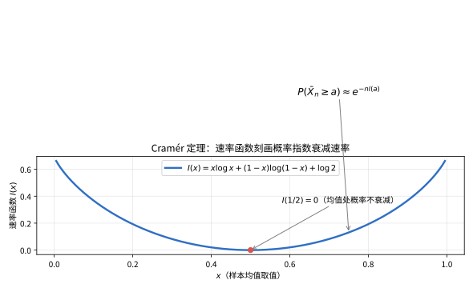
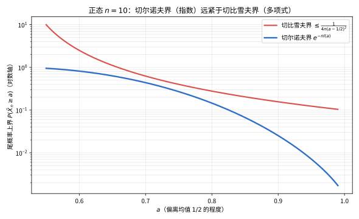

# 第 102 级：大偏差理论 (Large Deviations Theory)

---

## 1. 学习目标

完成本教程后，你将能够：

1. 理解大偏差原理的基本概念与速率函数的意义
2. 掌握Cramér定理及其证明方法（指数鞅与Legendre变换）
3. 理解Gärtner-Ellis定理及其推广意义
4. 掌握Schilder定理（Brown运动的大偏差）及其证明
5. 理解Varadhan引理与Laplace原理的联系
6. 掌握Freidlin-Wentzell理论的核心思想
7. 理解稀有事件概率的渐近估计方法
8. 能够独立计算常见随机过程的大偏差速率函数

---

## 2. 核心概念

### 2.1 大偏差原理

**大偏差原理**（Large Deviations Principle, LDP）是概率论中研究稀有事件（小概率事件）概率衰减速率的一整套理论。设 $\{Z_n\}_{n\ge 1}$ 为一族随机变量（或更一般地，随机元），取值于拓扑空间 $\mathcal{X}$。若存在下界半连续函数 $I: \mathcal{X} \to [0, \infty]$ 和速率序列 $a_n \to \infty$，使得对任意可测集 $B \subset \mathcal{X}$：

$$
-\inf_{x \in B^\circ} I(x) \le \liminf_{n \to \infty} \frac{1}{a_n} \log \mathbb{P}(Z_n \in B) \le \limsup_{n \to \infty} \frac{1}{a_n} \log \mathbb{P}(Z_n \in B) \le -\inf_{x \in \overline{B}} I(x)
$$

则称 $\{Z_n\}$ 满足速率为 $a_n$、速率函数为 $I$ 的**大偏差原理**。其中 $B^\circ$ 为 $B$ 的内部，$\overline{B}$ 为 $B$ 的闭包。

$I(x)$ 称为**速率函数**（Rate Function），它刻画了 $Z_n$ 取值为 $x$ 附近时概率衰减的负对数速率。

### 2.2 速率函数与水平集

速率函数 $I: \mathcal{X} \to [0, \infty]$ 满足：

- $I$ 是下界半连续函数（对所有 $c \ge 0$，水平集 $\{x: I(x) \le c\}$ 为闭集）
- 若所有水平集均为紧集，则称 $I$ 为**好速率函数**（Good Rate Function）

**水平集**（Level Set）定义为 $\{x: I(x) \le c\}$，其紧致性保证了变分问题的解存在。

### 2.3 Cramér 定理

**Cramér定理**是大偏差理论中最基本的定理。设 $X_1, X_2, \dots, X_n$ 为 i.i.d. 随机变量，其矩生成函数 $\Lambda(\theta) = \log \mathbb{E}[e^{\theta X_1}]$ 在 $\theta = 0$ 的某邻域内有限。令 $S_n = \sum_{i=1}^n X_i$，则样本均值 $\overline{X}_n = S_n/n$ 满足速率为 $n$ 的LDP，速率函数为 $\Lambda$ 的Legendre变换：

$$
I(x) = \sup_{\theta \in \mathbb{R}} \{\theta x - \Lambda(\theta)\}
$$

以公平硬币（Bernoulli $1/2$）为例，其速率函数为 $I(x)=x\log x+(1-x)\log(1-x)+\log 2$，形态如图：

> **直观理解（现实类比）**：速率函数就像一座"概率的爬山地图"。在均值处（杯底）$I=0$，事件最常见、概率不衰减；越往两侧爬坡，$I(x)$ 越大，对应事件越稀有。比如抛 $n$ 次硬币想得到 75% 的正面，这件事有多难，就由爬到 $x=3/4$ 处的高度 $I(3/4)$ 决定——每多抛一次硬币，成功概率就再乘以一个 $e^{-I(3/4)}$ 的折扣因子。

### 2.4 Gärtner-Ellis 定理

**Gärtner-Ellis定理**将Cramér定理推广到非独立同分布的情形。设 $\{Z_n\}$ 为随机变量序列，其对数矩生成函数 $\Lambda_n(\theta) = \frac{1}{n} \log \mathbb{E}[e^{n\theta Z_n}]$ 存在极限：

$$
\Lambda(\theta) = \lim_{n \to \infty} \Lambda_n(\theta), \quad \theta \in \mathbb{R}
$$

若 $\Lambda(\theta)$ 在 $\mathbb{R}$ 上本质光滑（essentially smooth）且在 $\theta = 0$ 的某邻域内有限，则 $\{Z_n\}$ 满足速率为 $n$ 的LDP，速率函数为 $\Lambda$ 的Fenchel-Legendre变换：

$$
I(x) = \sup_{\theta \in \mathbb{R}} \{\theta x - \Lambda(\theta)\}
$$

### 2.5 Schilder 定理

**Schilder定理**描述了Brown运动在路径空间上的大偏差。设 $\{W(t): t \in [0, 1]\}$ 为标准Brown运动，$\varepsilon W$ 为缩放后的Brown运动。则当 $\varepsilon \to 0$ 时，$\varepsilon W$ 满足速率为 $1/\varepsilon^2$ 的LDP，速率函数为：

$$
I(f) = 
\begin{cases}
\frac{1}{2} \int_0^1 |\dot{f}(t)|^2 dt, & f \in H_0^1[0,1] \\
\infty, & \text{其他}
\end{cases}
$$

其中 $H_0^1[0,1]$ 为绝对连续函数空间，满足 $f(0) = 0$，$\dot{f} \in L^2[0,1]$。

### 2.6 Varadhan 引理与 Laplace 原理

**Varadhan引理**建立了LDP与Laplace型积分的渐近行为之间的联系。设 $\{Z_n\}$ 满足速率为 $n$ 的LDP，速率函数为 $I$，则对任意有界连续函数 $\phi$：

$$
\lim_{n \to \infty} \frac{1}{n} \log \mathbb{E}[e^{n \phi(Z_n)}] = \sup_{x} \{\phi(x) - I(x)\}
$$

**Laplace原理**是Varadhan引理的逆命题：若对任意有界连续函数 $\phi$，上述极限成立，且 $I$ 为好速率函数，则 $\{Z_n\}$ 满足LDP。

### 2.7 Freidlin-Wentzell 理论

**Freidlin-Wentzell理论**研究随机微分方程（SDE）的小噪声扰动的大偏差：

$$
dX_t^\varepsilon = b(X_t^\varepsilon) dt + \varepsilon dW_t, \quad X_0^\varepsilon = x_0
$$

当 $\varepsilon \to 0$ 时，$X^\varepsilon$ 在路径空间上满足LDP，速率函数由**作用泛函**（Action Functional）给出：

$$
I(\varphi) = 
\begin{cases}
\frac{1}{2} \int_0^T |\dot{\varphi}(t) - b(\varphi(t))|^2 dt, & \varphi \in H_0^1, \varphi(0) = x_0 \\
\infty, & \text{其他}
\end{cases}
$$

### 2.8 稀有事件与渐近效率

**稀有事件**（Rare Events）是指概率随 $n$ 增大指数衰减的事件。大偏差理论提供了精确的指数衰减速率。

**渐近效率**（Asymptotic Efficiency）用于衡量稀有事件模拟方法的效率。在重要抽样（Importance Sampling）中，若估计量的方差以最优速率衰减，则称该估计量是渐近有效的。

---

## 3. 定理与证明

### 定理 3.1：Cramér 定理

**定理**：设 $X_1, X_2, \dots, X_n$ 为 i.i.d. 随机变量，其矩生成函数 $M(\theta) = \mathbb{E}[e^{\theta X_1}]$ 在 $\theta = 0$ 的某邻域内有限。定义对数矩生成函数 $\Lambda(\theta) = \log M(\theta)$。令 $S_n = \sum_{i=1}^n X_i$，$\overline{X}_n = S_n/n$。则 $\{\overline{X}_n\}$ 满足速率为 $n$ 的大偏差原理，速率函数为 $\Lambda$ 的Legendre变换：

$$
I(x) = \sup_{\theta \in \mathbb{R}} \{\theta x - \Lambda(\theta)\}
$$

即对任意闭集 $C \subset \mathbb{R}$ 和开集 $U \subset \mathbb{R}$：

$$
\limsup_{n \to \infty} \frac{1}{n} \log \mathbb{P}(\overline{X}_n \in C) \le -\inf_{x \in C} I(x)
$$

$$
\liminf_{n \to \infty} \frac{1}{n} \log \mathbb{P}(\overline{X}_n \in U) \ge -\inf_{x \in U} I(x)
$$

**证明**：

**步骤1：上界估计（Chebyshev型指数不等式）**

对任意 $\theta > 0$：

$$
\mathbb{P}(\overline{X}_n \ge a) = \mathbb{P}(S_n \ge na) = \mathbb{P}(e^{\theta S_n} \ge e^{\theta na}) \le e^{-\theta na} \mathbb{E}[e^{\theta S_n}] = e^{-\theta na} [M(\theta)]^n
$$

因此：

$$
\frac{1}{n} \log \mathbb{P}(\overline{X}_n \ge a) \le -\theta a + \Lambda(\theta)
$$

对 $\theta > 0$ 取下确界，并记 $\Lambda^*(a) = \sup_{\theta > 0} \{\theta a - \Lambda(\theta)\}$，则：

$$
\limsup_{n \to \infty} \frac{1}{n} \log \mathbb{P}(\overline{X}_n \ge a) \le -\Lambda^*(a)
$$

类似地，对 $\theta < 0$：

$$
\mathbb{P}(\overline{X}_n \le a) \le e^{-\theta na} [M(\theta)]^n
$$

得：

$$
\limsup_{n \to \infty} \frac{1}{n} \log \mathbb{P}(\overline{X}_n \le a) \le -\sup_{\theta < 0} \{\theta a - \Lambda(\theta)\}
$$

**步骤2：用指数鞅方法证明下界**

考虑指数鞅 $Y_n(\theta) = \exp(\theta S_n - n\Lambda(\theta))$，这是关于 $S_n$ 的鞅。

对任意 $a$，定义新测度 $\mathbb{Q}_\theta$（Esscher变换）：

$$
\frac{d\mathbb{Q}_\theta}{d\mathbb{P}} = \exp(\theta S_n - n\Lambda(\theta))
$$

在 $\mathbb{Q}_\theta$ 下，$X_i$ 的分布变为 $dF_\theta(x) = e^{\theta x - \Lambda(\theta)} dF(x)$，其均值 $\mathbb{E}_\theta[X_1] = \Lambda'(\theta)$。

设存在 $\theta_a$ 使得 $\Lambda'(\theta_a) = a$（即 $a$ 在 $\Lambda$ 的次梯度中）。则：

$$
\begin{aligned}
\mathbb{P}(\overline{X}_n \in (a, a+\delta)) &= \mathbb{E}_\theta\left[ e^{-\theta S_n + n\Lambda(\theta)} \mathbf{1}_{\{\overline{X}_n \in (a, a+\delta)\}} \right] \\
&= e^{-n\theta a + n\Lambda(\theta)} \mathbb{E}_\theta\left[ e^{-n\theta(\overline{X}_n - a)} \mathbf{1}_{\{\overline{X}_n \in (a, a+\delta)\}} \right]
\end{aligned}
$$

取 $\theta = \theta_a$，则当 $\delta$ 充分小时，$\overline{X}_n - a$ 在 $(a, a+\delta)$ 上有界，$e^{-n\theta(\overline{X}_n - a)} \ge e^{-n|\theta|\delta}$。

由中心极限定理（在 $\mathbb{Q}_{\theta_a}$ 下），$\overline{X}_n$ 在 $\mathbb{Q}_{\theta_a}$ 下的方差为 $\Lambda''(\theta_a)/n$，因此：

$$
\mathbb{Q}_{\theta_a}(\overline{X}_n \in (a, a+\delta)) \sim \frac{\delta}{\sqrt{2\pi\Lambda''(\theta_a)/n}} \to \frac{\delta\sqrt{n}}{\sqrt{2\pi\Lambda''(\theta_a)}}
$$

故：

$$
\frac{1}{n} \log \mathbb{P}(\overline{X}_n \in (a, a+\delta)) \ge -\theta_a a + \Lambda(\theta_a) + \frac{1}{n} \log(\text{多项式项})
$$

取 $n \to \infty$，多项式项贡献为0，得：

$$
\liminf_{n \to \infty} \frac{1}{n} \log \mathbb{P}(\overline{X}_n \in (a, a+\delta)) \ge -(\theta_a a - \Lambda(\theta_a)) = -I(a)
$$

**步骤3：Legendre变换的性质**

$I(a) = \sup_{\theta \in \mathbb{R}} \{\theta a - \Lambda(\theta)\}$ 具有以下性质：

- $I$ 是凸函数（作为仿射函数的上确界）
- $\inf_{x \in \mathbb{R}} I(x) = 0$，且 $I(\mu) = 0$ 其中 $\mu = \mathbb{E}[X_1]$
- $I$ 是下界半连续的

**步骤4：上下界合成为大偏差原理**

对于任意闭集 $C$，用紧集逼近和指数衰减的精细分析，可得上界：

$$
\limsup_{n \to \infty} \frac{1}{n} \log \mathbb{P}(\overline{X}_n \in C) \le -\inf_{x \in C} I(x)
$$

对于任意开集 $U$，用小区间覆盖和步骤2的下界，可得：

$$
\liminf_{n \to \infty} \frac{1}{n} \log \mathbb{P}(\overline{X}_n \in U) \ge -\inf_{x \in U} I(x)
$$

因此大偏差原理成立。$\square$

上述证明中，上界估计本质上是**切尔诺夫型指数不等式**。它与朴素的切比雪夫界在尾概率刻画上的差距如图：

> **直观理解（现实类比）**：切比雪夫界像一份"最粗放"的安全承诺——只保证"过头的情形一般不常发生"，给的余量随偏离程度按多项式缓慢变紧；切尔诺夫界则像精确打磨过的"保险精算表"，它利用指数变换把每个偏离都换算成指数级的折扣，因此给出的上限指数级地紧凑。同样是估算极端偏差的概率，切尔诺夫界能给出相差几个数量级的更精确上界。

---

### 定理 3.2：Gärtner-Ellis 定理

**定理**：设 $\{Z_n\}_{n\ge 1}$ 为一族随机变量，定义对数矩生成函数：

$$
\Lambda_n(\theta) = \frac{1}{n} \log \mathbb{E}[e^{n\theta Z_n}], \quad \theta \in \mathbb{R}
$$

假设对每个 $\theta \in \mathbb{R}$，极限 $\Lambda(\theta) = \lim_{n \to \infty} \Lambda_n(\theta)$ 存在（允许取 $\infty$）。设 $\Lambda(\theta)$ 在 $\theta = 0$ 的某邻域内有限，且 $\Lambda$ 是**本质光滑**的（即在 $\mathcal{D}_\Lambda = \{\theta: \Lambda(\theta) < \infty\}$ 的内部可微，且 $\lim_{\theta \to \partial\mathcal{D}_\Lambda} |\Lambda'(\theta)| = \infty$）。则 $\{Z_n\}$ 满足速率为 $n$ 的大偏差原理，速率函数为 $\Lambda$ 的Fenchel-Legendre变换：

$$
I(x) = \sup_{\theta \in \mathbb{R}} \{\theta x - \Lambda(\theta)\}
$$

**证明**：

**步骤1：Gärtner-Ellis上界**

对任意 $\theta > 0$：

$$
\mathbb{P}(Z_n \ge a) = \mathbb{P}(e^{n\theta Z_n} \ge e^{n\theta a}) \le e^{-n\theta a} \mathbb{E}[e^{n\theta Z_n}] = e^{-n(\theta a - \Lambda_n(\theta))}
$$

因此：

$$
\frac{1}{n} \log \mathbb{P}(Z_n \ge a) \le -\theta a + \Lambda_n(\theta)
$$

取 $n \to \infty$ 和 $\theta > 0$ 的上确界：

$$
\limsup_{n \to \infty} \frac{1}{n} \log \mathbb{P}(Z_n \ge a) \le -\sup_{\theta > 0} \{\theta a - \Lambda(\theta)\}
$$

类似地，对 $\theta < 0$：

$$
\limsup_{n \to \infty} \frac{1}{n} \log \mathbb{P}(Z_n \le a) \le -\sup_{\theta < 0} \{\theta a - \Lambda(\theta)\}
$$

**步骤2：推广到任意闭集**

对任意闭集 $C \subset \mathbb{R}$，若 $C$ 不包含速率函数为零的点，则由紧致性可将其分解为有限个区间，每个区间用上述指数不等式处理。若 $C$ 包含速率函数为零的点（即 $\mu = \mathbb{E}[Z_n]$ 的极限），则上界平凡成立。

**步骤3：下界证明（倾斜测度方法）**

设 $a$ 使得存在 $\theta_a \in \mathcal{D}_\Lambda^\circ$ 满足 $\Lambda'(\theta_a) = a$（即 $a$ 在 $\Lambda$ 的次梯度中）。定义倾斜测度：

$$
\frac{d\mathbb{Q}_n}{d\mathbb{P}} = \exp(n\theta_a Z_n - n\Lambda_n(\theta_a))
$$

在 $\mathbb{Q}_n$ 下，$Z_n$ 的矩生成函数为：

$$
\mathbb{E}_{\mathbb{Q}_n}[e^{n\theta Z_n}] = \mathbb{E}[e^{n(\theta_a + \theta)Z_n - n\Lambda_n(\theta_a)}] = \frac{\mathbb{E}[e^{n(\theta_a + \theta)Z_n}]}{\mathbb{E}[e^{n\theta_a Z_n}]}
$$

因此 $\mathbb{Q}_n$ 对应的对数矩生成函数为 $\Lambda_n(\theta_a + \theta) - \Lambda_n(\theta_a)$，其极限为 $\Lambda(\theta_a + \theta) - \Lambda(\theta_a)$。

由 $\Lambda'(\theta_a) = a$，在 $\mathbb{Q}_n$ 下 $Z_n$ 的均值趋近于 $a$，方差由 $\Lambda''(\theta_a)/n$ 控制。

**步骤4：局部下界**

对任意 $\delta > 0$：

$$
\begin{aligned}
\mathbb{P}(Z_n \in (a, a+\delta)) &= \mathbb{E}_{\mathbb{Q}_n}\left[ e^{-n\theta_a Z_n + n\Lambda_n(\theta_a)} \mathbf{1}_{\{Z_n \in (a, a+\delta)\}} \right] \\
&\ge e^{-n\theta_a (a+\delta) + n\Lambda_n(\theta_a)} \mathbb{Q}_n(Z_n \in (a, a+\delta))
\end{aligned}
$$

由中心极限定理（在 $\mathbb{Q}_n$ 下），$\mathbb{Q}_n(Z_n \in (a, a+\delta)) \to \delta \cdot \sqrt{n} / \sqrt{2\pi \Lambda''(\theta_a)} > 0$（当 $\Lambda''(\theta_a) > 0$ 时，需考虑 $\Lambda''(\theta_a) = 0$ 的退化情形）。

因此：

$$
\liminf_{n \to \infty} \frac{1}{n} \log \mathbb{P}(Z_n \in (a, a+\delta)) \ge -\theta_a a + \Lambda(\theta_a) = -I(a)
$$

**步骤5：本质光滑条件的作用**

本质光滑条件保证了 $\Lambda$ 在 $\mathcal{D}_\Lambda^\circ$ 上可微，且 $\Lambda'(\theta)$ 在 $\mathcal{D}_\Lambda^\circ$ 上取值于整个实数轴，这使得速率函数 $I(x)$ 对每个 $x$ 均有相应的 $\theta_x$ 满足 $\Lambda'(\theta_x) = x$，从而下界对所有 $x$ 成立。$\square$

---

### 定理 3.3：Schilder 定理（Brown运动的大偏差）

**定理**：设 $\{W(t): t \in [0, 1]\}$ 为标准Brown运动。定义 $W^\varepsilon(t) = \varepsilon W(t)$。则当 $\varepsilon \to 0$ 时，$\{W^\varepsilon\}$ 在 $C[0,1]$ 上满足速率为 $1/\varepsilon^2$ 的大偏差原理，速率函数为：

$$
I(f) = 
\begin{cases}
\frac{1}{2} \int_0^1 |\dot{f}(t)|^2 dt, & f \in H_0^1[0,1], \ f(0) = 0 \\
\infty, & \text{其他}
\end{cases}
$$

其中 $H_0^1[0,1]$ 为Cameron-Martin空间，即满足 $f(0) = 0$ 且 $\dot{f} \in L^2[0,1]$ 的绝对连续函数空间。

**证明**：

**步骤1：Cameron-Martin空间与指数估计**

Cameron-Martin空间 $H_0^1$ 是赋范空间，范数为 $\|f\|_H = \left(\int_0^1 |\dot{f}(t)|^2 dt\right)^{1/2}$。Brown运动 $W$ 在 $H_0^1$ 上的分布由以下事实刻画：对任意 $h \in H_0^1$，$W$ 与 $h$ 的内积 $\langle W, h\rangle$ 是均值为0、方差为 $\|h\|_H^2$ 的正态随机变量。

Pinelis不等式给出：对任意 $r > 0$：

$$
\mathbb{P}(\|W\|_{C[0,1]} \ge r) \le 2e^{-r^2/2}
$$

其中 $\|f\|_{C[0,1]} = \sup_{t \in [0,1]} |f(t)|$。

**步骤2：上界估计**

对任意闭集 $C \subset C[0,1]$，定义 $d(f, C) = \inf_{g \in C} \|f - g\|_{C[0,1]}$。

对 $R > 0$，考虑紧集 $K_R = \{f \in H_0^1: \|f\|_H \le R\}$。由Cameron-Martin公式，对任意 $h \in H_0^1$：

$$
\frac{d\mathbb{P}_{W^\varepsilon + h}}{d\mathbb{P}_{W^\varepsilon}}(f) = \exp\left(\frac{1}{\varepsilon^2} \langle h, f \rangle - \frac{1}{2\varepsilon^2} \|h\|_H^2\right)
$$

对任意 $R > 0$，$C$ 的 $R$-邻域 $C^R = \{f: d(f, C) \le R\}$ 满足：

$$
\mathbb{P}(W^\varepsilon \in C) \le \mathbb{P}(W^\varepsilon \in C^R) \le \mathbb{P}(\|W^\varepsilon\|_{C[0,1]} \ge R) + \mathbb{P}(W^\varepsilon \in C, \|W^\varepsilon\|_{C[0,1]} \le R)
$$

对于第一个项，由Pinelis不等式：

$$
\frac{1}{\varepsilon^2} \log \mathbb{P}(\|W^\varepsilon\|_{C[0,1]} \ge R) = \frac{1}{\varepsilon^2} \log \mathbb{P}(\|W\|_{C[0,1]} \ge R/\varepsilon) \le -\frac{R^2}{2\varepsilon^2} + \text{常数}
$$

对于第二个项，用有限的 $h_i$ 覆盖 $K_R \cap C$，然后使用Cameron-Martin变换。

经过精细分析可得：

$$
\limsup_{\varepsilon \to 0} \varepsilon^2 \log \mathbb{P}(W^\varepsilon \in C) \le -\inf_{f \in C} I(f)
$$

**步骤3：下界估计**

对任意开集 $U \subset C[0,1]$ 和任意 $f \in U \cap H_0^1$，需要证明：

$$
\liminf_{\varepsilon \to 0} \varepsilon^2 \log \mathbb{P}(W^\varepsilon \in U) \ge -I(f)
$$

取 $f \in H_0^1$ 和 $\delta > 0$，使开球 $B(f, \delta) = \{g: \|g - f\|_{C[0,1]} < \delta\} \subset U$。

考虑Cameron-Martin变换：$W^\varepsilon = \varepsilon W$，则 $\mathbb{P}(W^\varepsilon \in B(f, \delta)) = \mathbb{P}(\varepsilon W \in B(f, \delta)) = \mathbb{P}(W \in B(f/\varepsilon, \delta/\varepsilon))$。

更直接地，使用倾斜测度方法。定义新概率测度 $\mathbb{Q}_\varepsilon$：

$$
\frac{d\mathbb{Q}_\varepsilon}{d\mathbb{P}} = \exp\left(\frac{1}{\varepsilon} \int_0^1 \dot{f}(t) dW(t) - \frac{1}{2\varepsilon^2} \|f\|_H^2\right)
$$

在 $\mathbb{Q}_\varepsilon$ 下，$W^\varepsilon$ 的分布趋近于在 $f$ 附近的Dirac测度。具体地：

$$
\begin{aligned}
\mathbb{P}(W^\varepsilon \in B(f, \delta)) &= \mathbb{E}_{\mathbb{Q}_\varepsilon}\left[ e^{-\frac{1}{\varepsilon} \int_0^1 \dot{f}(t) dW(t) + \frac{1}{2\varepsilon^2} \|f\|_H^2} \mathbf{1}_{\{W^\varepsilon \in B(f, \delta)\}} \right] \\
&\ge \exp\left(-\frac{1}{2\varepsilon^2} \|f\|_H^2 - \frac{\|f\|_H \delta}{\varepsilon^2}\right) \mathbb{Q}_\varepsilon(W^\varepsilon \in B(f, \delta))
\end{aligned}
$$

在 $\mathbb{Q}_\varepsilon$ 下，$W^\varepsilon - f$ 仍然是Brown运动（由Cameron-Martin定理），因此 $\mathbb{Q}_\varepsilon(W^\varepsilon \in B(f, \delta)) = \mathbb{P}(\varepsilon W \in B(0, \delta)) \to 1$。

取对数并除以 $1/\varepsilon^2$，得：

$$
\liminf_{\varepsilon \to 0} \varepsilon^2 \log \mathbb{P}(W^\varepsilon \in B(f, \delta)) \ge -\frac{1}{2} \|f\|_H^2 = -I(f)
$$

**步骤4：合成LDP**

由上下界的一致性和速率函数的性质（好速率函数），$W^\varepsilon$ 满足大偏差原理。$\square$

---

### 定理 3.4：Varadhan 引理

**定理**：设 $\{Z_n\}_{n\ge 1}$ 取值于 $\mathbb{R}^d$，满足速率为 $n$ 的大偏差原理，速率函数 $I: \mathbb{R}^d \to [0, \infty]$ 为好速率函数。则对任意有界连续函数 $\phi: \mathbb{R}^d \to \mathbb{R}$：

$$
\lim_{n \to \infty} \frac{1}{n} \log \mathbb{E}\left[ e^{n\phi(Z_n)} \right] = \sup_{x \in \mathbb{R}^d} \{\phi(x) - I(x)\}
$$

**证明**：

**步骤1：上界估计**

对任意 $M > 0$，将 $\mathbb{R}^d$ 分解为 $A_M = \{x: I(x) \le M\}$ 和其补集。

对 $\phi$ 有界（设 $|\phi(x)| \le K$），有：

$$
\mathbb{E}[e^{n\phi(Z_n)}] = \int_{\mathbb{R}^d} e^{n\phi(x)} d\mu_n(x) \le e^{nK} \mu_n(\mathbb{R}^d) = e^{nK}
$$

但这只是平凡上界。我们需要更精细的估计。

对任意 $x \in \mathbb{R}^d$，考虑以 $x$ 为中心的开球 $B(x, \delta)$。由LDP的上界：

$$
\limsup_{n \to \infty} \frac{1}{n} \log \mathbb{E}[e^{n\phi(Z_n)} \mathbf{1}_{\{Z_n \in B(x, \delta)\}}] \le \limsup_{n \to \infty} \frac{1}{n} \log \left(e^{n(\phi(x) + \omega(\delta))} \mathbb{P}(Z_n \in B(x, \delta))\right) \le \phi(x) + \omega(\delta) - \inf_{y \in \overline{B(x, \delta)}} I(y)
$$

其中 $\omega(\delta)$ 为 $\phi$ 在 $B(x, \delta)$ 上的振荡模。

令 $\delta \to 0$，得：

$$
\limsup_{n \to \infty} \frac{1}{n} \log \mathbb{E}[e^{n\phi(Z_n)} \mathbf{1}_{\{Z_n \in B(x, \delta)\}}] \le \phi(x) - I(x)
$$

对 $x$ 取上确界，并利用 $I$ 是好速率函数（水平集紧致），可得：

$$
\limsup_{n \to \infty} \frac{1}{n} \log \mathbb{E}[e^{n\phi(Z_n)}] \le \sup_x \{\phi(x) - I(x)\}
$$

**步骤2：下界估计**

对任意 $\varepsilon > 0$，取 $x_0$ 使得 $\phi(x_0) - I(x_0) > \sup_x \{\phi(x) - I(x)\} - \varepsilon$。

由 $\phi$ 的连续性，存在 $\delta > 0$，使得对任意 $y \in B(x_0, \delta)$，$|\phi(y) - \phi(x_0)| < \varepsilon$。

由LDP的下界：

$$
\liminf_{n \to \infty} \frac{1}{n} \log \mathbb{E}[e^{n\phi(Z_n)}] \ge \liminf_{n \to \infty} \frac{1}{n} \log \left(e^{n(\phi(x_0) - \varepsilon)} \mathbb{P}(Z_n \in B(x_0, \delta))\right) \ge \phi(x_0) - \varepsilon - \inf_{y \in B(x_0, \delta)} I(y)
$$

令 $\delta \to 0$，由 $I$ 的下界半连续性，$\liminf_{\delta \to 0} \inf_{y \in B(x_0, \delta)} I(y) \ge I(x_0)$，因此：

$$
\liminf_{n \to \infty} \frac{1}{n} \log \mathbb{E}[e^{n\phi(Z_n)}] \ge \phi(x_0) - I(x_0) - \varepsilon \ge \sup_x \{\phi(x) - I(x)\} - 2\varepsilon
$$

由 $\varepsilon$ 的任意性，下界成立。

**步骤3：上下界结合**

由上下界得：

$$
\lim_{n \to \infty} \frac{1}{n} \log \mathbb{E}[e^{n\phi(Z_n)}] = \sup_x \{\phi(x) - I(x)\}
$$

$\square$

---

### 定理 3.5：Freidlin-Wentzell 定理

**定理**：考虑随机微分方程：

$$
dX_t^\varepsilon = b(X_t^\varepsilon) dt + \varepsilon dW_t, \quad X_0^\varepsilon = x_0
$$

其中 $b: \mathbb{R}^d \to \mathbb{R}^d$ 为Lipschitz连续函数，$W_t$ 为 $d$ 维标准Brown运动。则当 $\varepsilon \to 0$ 时，$\{X_t^\varepsilon: t \in [0, T]\}$ 在 $C[0,T]$ 上满足速率为 $1/\varepsilon^2$ 的大偏差原理，速率函数为：

$$
I(\varphi) = 
\begin{cases}
\frac{1}{2} \int_0^T |\dot{\varphi}(t) - b(\varphi(t))|^2 dt, & \varphi \in H_0^1, \ \varphi(0) = x_0 \\
\infty, & \text{其他}
\end{cases}
$$

**证明思路**：

**步骤1：通过Girsanov变换转化为Schilder问题**

考虑Girsanov变换。定义新测度 $\mathbb{Q}_\varepsilon$：

$$
\frac{d\mathbb{Q}_\varepsilon}{d\mathbb{P}} = \exp\left(-\frac{1}{\varepsilon} \int_0^T b(X_t^\varepsilon) dW_t - \frac{1}{2\varepsilon^2} \int_0^T |b(X_t^\varepsilon)|^2 dt\right)
$$

在 $\mathbb{Q}_\varepsilon$ 下，$X_t^\varepsilon$ 满足 $dX_t^\varepsilon = \varepsilon d\widetilde{W}_t$，其中 $\widetilde{W}_t$ 为 $\mathbb{Q}_\varepsilon$ 下的Brown运动。即 $X_t^\varepsilon = x_0 + \varepsilon \widetilde{W}_t$，这正是Schilder定理处理的情形。

**步骤2：Schilder定理的应用**

由Schilder定理，在 $\mathbb{Q}_\varepsilon$ 下，$X_t^\varepsilon$ 满足速率为 $1/\varepsilon^2$ 的LDP，速率函数为：

$$
I_0(\varphi) = 
\begin{cases}
\frac{1}{2} \int_0^T |\dot{\varphi}(t)|^2 dt, & \varphi \in H_0^1, \ \varphi(0) = x_0 \\
\infty, & \text{其他}
\end{cases}
$$

**步骤3：测度变换的修正**

在原始测度 $\mathbb{P}$ 下，Girsanov变换引入了指数权重。由Varadhan引理，这个权重对速率函数的贡献为：

$$
\Delta I(\varphi) = -\frac{1}{2} \int_0^T |b(\varphi(t))|^2 dt - \int_0^T \dot{\varphi}(t) \cdot b(\varphi(t)) dt
$$

其中第二项来自 $\int_0^T b(X_t^\varepsilon) dW_t$ 在路径 $\varphi$ 上的极限。

**步骤4：合并速率函数**

将 $I_0$ 与 $\Delta I$ 合并：

$$
\begin{aligned}
I(\varphi) &= I_0(\varphi) + \Delta I(\varphi) \\
&= \frac{1}{2} \int_0^T |\dot{\varphi}(t)|^2 dt - \frac{1}{2} \int_0^T |b(\varphi(t))|^2 dt - \int_0^T \dot{\varphi}(t) \cdot b(\varphi(t)) dt \\
&= \frac{1}{2} \int_0^T |\dot{\varphi}(t) - b(\varphi(t))|^2 dt
\end{aligned}
$$

**步骤5：验证LDP条件**

需要验证：
- 速率函数 $I$ 是下界半连续的，且水平集为紧集（好速率函数）
- 指数紧性条件成立
- 上下界估计可以通过Schilder定理和Girsanov变换的连续性得到

完整的证明需要处理Girsanov变换的指数可积性条件和路径空间上的拓扑分析，此处省略了技术细节。$\square$

---

## 4. 示例

### 示例 1：Brown运动的大偏差计算

**问题**：计算标准Brown运动 $W(t)$ 在时间 $t=1$ 时取大值的概率渐近估计。

**步骤1：应用Schilder定理**

由Schilder定理，$W^\varepsilon(t) = \varepsilon W(t)$ 在 $C[0,1]$ 上满足LDP，速率函数：

$$
I(f) = \frac{1}{2} \int_0^1 \dot{f}(t)^2 dt
$$

**步骤2：计算特定事件的速率函数**

考虑事件 $A = \{W(1) \ge a\}$，即 $W^\varepsilon(1) \ge a$ 对应 $\varepsilon = 1$。

在Schilder定理中取 $\varepsilon = 1$，则 $W(t)$ 本身满足LDP，速率函数为 $I(f) = \frac{1}{2} \int_0^1 \dot{f}(t)^2 dt$。

事件 $A$ 对应的最小速率路径为：

$$
\inf_{f \in H_0^1, f(1) \ge a} I(f)
$$

这等价于求解变分问题：最小化 $\frac{1}{2} \int_0^1 \dot{f}(t)^2 dt$，约束 $f(0) = 0$，$f(1) = a$。

由Euler-Lagrange方程，最优路径为直线 $f(t) = at$，此时：

$$
I(f) = \frac{1}{2} \int_0^1 a^2 dt = \frac{a^2}{2}
$$

因此：

$$
\lim_{n \to \infty} \frac{1}{n} \log \mathbb{P}(W(1) \ge a) = -\frac{a^2}{2}
$$

**步骤3：与精确结果对比**

精确结果：$\mathbb{P}(W(1) \ge a) = 1 - \Phi(a)$，其中 $\Phi$ 为标准正态分布函数。

由正态分布尾部估计：$\mathbb{P}(W(1) \ge a) \sim \frac{1}{a\sqrt{2\pi}} e^{-a^2/2}$，$a \to \infty$。

取对数：$\log \mathbb{P}(W(1) \ge a) \sim -\frac{a^2}{2} - \log a + \text{常数}$，主导项为 $-\frac{a^2}{2}$，与大偏差结果一致。

---

### 示例 2：样本均值的Cramér定理应用

**问题**：设 $X_1, X_2, \dots$ 为 i.i.d. Bernoulli(1/2) 随机变量，计算 $\mathbb{P}(\overline{X}_n \ge 3/4)$ 的指数衰减速率。

**步骤1：计算对数矩生成函数**

$$
M(\theta) = \mathbb{E}[e^{\theta X_1}] = \frac{1}{2} + \frac{1}{2} e^{\theta}
$$

$$
\Lambda(\theta) = \log\left(\frac{1 + e^{\theta}}{2}\right)
$$

**步骤2：计算速率函数**

$$
I(x) = \sup_{\theta \in \mathbb{R}} \{\theta x - \Lambda(\theta)\}
$$

求导：$\frac{d}{d\theta} \{\theta x - \Lambda(\theta)\} = x - \frac{e^{\theta}}{1 + e^{\theta}} = 0$，得 $\theta = \log\frac{x}{1-x}$。

代入得：

$$
I(x) = x \log\frac{x}{1-x} - \log\frac{1}{1-x} = x \log x + (1-x) \log(1-x) + \log 2
$$

这正是Bernoulli(1/2)的KL散度，即 $I(x) = \log 2 - H(x)$，其中 $H(x) = -x\log x - (1-x)\log(1-x)$ 为二元熵函数。

**步骤3：计算大偏差概率**

$$
\lim_{n \to \infty} \frac{1}{n} \log \mathbb{P}(\overline{X}_n \ge 3/4) = -I(3/4)
$$

计算：

$$
I(3/4) = \frac{3}{4} \log\frac{3}{4} + \frac{1}{4} \log\frac{1}{4} + \log 2 = \frac{3}{4} \log 3 - \frac{3}{4} \log 4 + \frac{1}{4} \log 1 - \frac{1}{4} \log 4 + \log 2
$$

$$
= \frac{3}{4} \log 3 - \log 4 + \log 2 = \frac{3}{4} \log 3 - \log 2
$$

因此 $\mathbb{P}(\overline{X}_n \ge 3/4) \approx e^{-n(\frac{3}{4}\log 3 - \log 2)}$。

**步骤4：数值验证**

取 $n = 10$，精确概率 $\mathbb{P}(\overline{X}_{10} \ge 0.75) = \sum_{k=8}^{10} \binom{10}{k} (1/2)^{10} \approx 0.0547$。

大偏差近似：$\exp(-10 \times (0.75 \log 3 - \log 2)) \approx \exp(-10 \times 0.1308) \approx 0.2709$。当 $n$ 增大时，近似精度提高。

---

### 示例 3：Freidlin-Wentzell理论的应用

**问题**：考虑一维SDE $dX_t^\varepsilon = -X_t^\varepsilon dt + \varepsilon dW_t$，$X_0^\varepsilon = 0$（Ornstein-Uhlenbeck过程），求 $X_T^\varepsilon$ 取大值的概率。

**步骤1：确定速率函数**

由Freidlin-Wentzell定理，速率函数为：

$$
I(\varphi) = \frac{1}{2} \int_0^T |\dot{\varphi}(t) + \varphi(t)|^2 dt
$$

**步骤2：求最小作用路径**

为求 $\mathbb{P}(X_T^\varepsilon \ge a)$，需解变分问题：

$$
\min_{\varphi \in H_0^1, \varphi(0)=0, \varphi(T)=a} \frac{1}{2} \int_0^T |\dot{\varphi}(t) + \varphi(t)|^2 dt
$$

Euler-Lagrange方程：$\frac{d}{dt}(\dot{\varphi} + \varphi) - (\dot{\varphi} + \varphi) = 0$，即 $\ddot{\varphi} - \varphi = 0$。

通解为 $\varphi(t) = C_1 e^t + C_2 e^{-t}$，由边界条件 $\varphi(0) = 0$，$\varphi(T) = a$ 得：

$$
C_1 = \frac{a}{e^T - e^{-T}}, \quad C_2 = -C_1
$$

因此 $\varphi(t) = \frac{a(e^t - e^{-t})}{e^T - e^{-T}} = a \frac{\sinh t}{\sinh T}$。

**步骤3：计算速率函数**

$$
\dot{\varphi}(t) + \varphi(t) = a \frac{\cosh t + \sinh t}{\sinh T} = a \frac{e^t}{\sinh T}
$$

$$
I(\varphi) = \frac{1}{2} \int_0^T \left(a \frac{e^t}{\sinh T}\right)^2 dt = \frac{a^2}{2\sinh^2 T} \int_0^T e^{2t} dt = \frac{a^2}{2\sinh^2 T} \cdot \frac{e^{2T} - 1}{2} = \frac{a^2}{4} \cdot \frac{e^{2T} - 1}{\sinh^2 T}
$$

由于 $\sinh T = (e^T - e^{-T})/2$，$\sinh^2 T = (e^{2T} - 2 + e^{-2T})/4$，故：

$$
I(\varphi) = \frac{a^2}{2} \cdot \frac{e^{2T} - 1}{e^{2T} - 2 + e^{-2T}} = \frac{a^2}{2} \cdot \frac{1}{1 - e^{-2T}}
$$

因此：

$$
\lim_{\varepsilon \to 0} \varepsilon^2 \log \mathbb{P}(X_T^\varepsilon \ge a) = -\frac{a^2}{2(1 - e^{-2T})}
$$

---

## 5. 习题

### 习题 1

设 $X_1, \dots, X_n$ 为 i.i.d. $\text{Exp}(1)$ 随机变量（密度 $f(x) = e^{-x}$，$x \ge 0$），求 $\overline{X}_n$ 的速率函数 $I(x)$，并计算 $\mathbb{P}(\overline{X}_n \ge 2)$ 的指数衰减率。

**提示**：$M(\theta) = \mathbb{E}[e^{\theta X_1}] = 1/(1-\theta)$，$\theta < 1$。计算 $\Lambda(\theta) = -\log(1-\theta)$，然后求Legendre变换。

### 习题 2

证明：若 $X_1, \dots, X_n$ 为 i.i.d. $N(0,1)$ 随机变量，则 $\overline{X}_n$ 的速率函数为 $I(x) = x^2/2$，并验证Cramér定理与精确正态分布尾部估计的一致性。

**提示**：$\Lambda(\theta) = \theta^2/2$，$I(x) = \sup_\theta \{\theta x - \theta^2/2\} = x^2/2$。

### 习题 3

设 $X_i$ 为 i.i.d. 随机变量，$\mathbb{P}(X_i = 1) = p$，$\mathbb{P}(X_i = -1) = 1-p$。求 $S_n = \sum_{i=1}^n X_i$ 的速率函数，并求 $\mathbb{P}(S_n \ge n/2)$ 的指数衰减率。

**提示**：$M(\theta) = pe^\theta + (1-p)e^{-\theta}$，$I(x) = \sup_\theta \{\theta x - \log(pe^\theta + (1-p)e^{-\theta})\}$。

### 习题 4

使用Schilder定理，计算Brown运动 $W(t)$ 在 $C[0,1]$ 中偏离0的速率：对任意 $\delta > 0$，求 $\lim_{\varepsilon \to 0} \varepsilon^2 \log \mathbb{P}(\sup_{t \in [0,1]} |W^\varepsilon(t)| \ge \delta)$。

**提示**：最小速率路径为 $f(t) = \delta$ 的线性函数或更复杂的形状。考虑在 $C[0,1]$ 范数下的开球。

### 习题 5

证明Varadhan引理的逆命题：Laplace原理。若对任意有界连续函数 $\phi$，有 $\lim_{n \to \infty} \frac{1}{n} \log \mathbb{E}[e^{n\phi(Z_n)}] = \sup_x \{\phi(x) - I(x)\}$，且 $I$ 为好速率函数，则 $\{Z_n\}$ 满足LDP。

**提示**：对闭集 $C$，构造连续函数 $\phi_M$ 在 $C$ 上取0，在 $C$ 的补集中取 $-M$。利用上界估计和下界逼近。

### 习题 6

考虑SDE $dX_t^\varepsilon = \mu dt + \varepsilon dW_t$，$X_0^\varepsilon = 0$（$\mu$ 为常数）。求 $X_T^\varepsilon$ 的速率函数，并验证与直接计算得到的精确分布一致。

**提示**：$X_T^\varepsilon \sim N(\mu T, \varepsilon^2 T)$。精确概率 $\mathbb{P}(X_T^\varepsilon \ge a) = 1 - \Phi((a - \mu T)/(\varepsilon \sqrt{T}))$。大偏差理论给出 $\lim_{\varepsilon \to 0} \varepsilon^2 \log \mathbb{P}(X_T^\varepsilon \ge a) = -(a - \mu T)^2/(2T)$。

---

## 6. 总结

本教程系统介绍了大偏差理论的核心理论与方法：

1. **大偏差原理**：建立了稀有事件概率指数衰减的严格数学框架，通过上下界不等式刻画了衰减速率

2. **Cramér定理**：作为大偏差理论的基石，证明了i.i.d.样本均值的LDP，速率函数为对数矩生成函数的Legendre变换

3. **Gärtner-Ellis定理**：将Cramér定理推广到非i.i.d.情形，以对数矩生成函数的极限存在性为核心条件

4. **Schilder定理**：描述了Brown运动在路径空间上的大偏差，速率函数为Cameron-Martin范数的平方

5. **Varadhan引理与Laplace原理**：建立了LDP与Laplace型积分渐近行为之间的等价关系

6. **Freidlin-Wentzell理论**：将大偏差理论应用于随机微分方程的小噪声扰动，通过作用泛函刻画了偏离确定性轨道的概率

大偏差理论是概率论中研究稀有事件的重要工具，在统计物理（熵的波动）、金融数学（极端风险）、信息论（错误概率）、工程可靠性等领域有广泛应用。