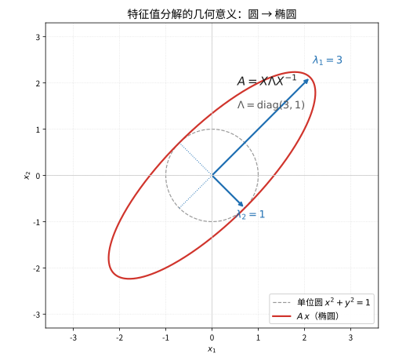
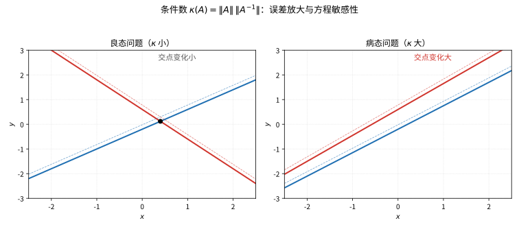

# 第 105 级：数值线性代数 (Numerical Linear Algebra)

---

## 1. 学习目标

完成本教程后，你将能够：

1. 理解矩阵分解（LU、Cholesky、QR、SVD、特征值分解）的基本原理与算法
2. 掌握条件数的概念及其在病态问题中的作用
3. 理解迭代法的基本思想（Jacobi、Gauss-Seidel、SOR、共轭梯度法）
4. 掌握 Krylov 子空间方法（Arnoldi、Lanczos、GMRES）的构造与收敛性
5. 理解 Rayleigh 商迭代与逆迭代的特征值算法
6. 掌握 QR 分解与 SVD 分解的存在唯一性证明
7. 理解共轭梯度法与 GMRES 的收敛性分析
8. 能独立运用数值线性代数方法解决实际问题

---

## 2. 核心概念

### 2.1 LU 分解

**LU 分解**将矩阵 $A \in \mathbb{R}^{n \times n}$ 分解为下三角矩阵 $L$ 和上三角矩阵 $U$ 的乘积：

$$
A = LU
$$

其中 $L$ 为单位下三角矩阵（对角线元素为 1），$U$ 为上三角矩阵。当 $A$ 的各阶顺序主子式非零时，LU 分解存在唯一。

**选主元**（Pivoting）用于处理对角线元素为零或接近零的情况，包括部分选主元（PA = LU）和全选主元。

### 2.2 Cholesky 分解

对于对称正定矩阵 $A \in \mathbb{R}^{n \times n}$，**Cholesky 分解**为：

$$
A = G G^\top
$$

其中 $G$ 是下三角矩阵且对角线元素为正。Cholesky 分解比 LU 分解更高效（约一半的计算量）。

### 2.3 QR 分解

**QR 分解**将矩阵 $A \in \mathbb{R}^{m \times n}$（$m \ge n$）分解为：

$$
A = QR
$$

其中 $Q \in \mathbb{R}^{m \times m}$ 是正交矩阵（$Q^\top Q = I$），$R \in \mathbb{R}^{m \times n}$ 是上三角矩阵。常用的实现方法有 Gram-Schmidt 正交化、Householder 变换和 Givens 旋转。

### 2.4 SVD 分解

**奇异值分解**（Singular Value Decomposition, SVD）是最重要的矩阵分解之一：

$$
A = U \Sigma V^\top
$$

其中 $A \in \mathbb{R}^{m \times n}$，$U \in \mathbb{R}^{m \times m}$ 和 $V \in \mathbb{R}^{n \times n}$ 是正交矩阵，$\Sigma \in \mathbb{R}^{m \times n}$ 是对角矩阵，其对角线元素 $\sigma_1 \ge \sigma_2 \ge \cdots \ge \sigma_r \ge 0$ 称为奇异值。

### 2.5 特征值分解

对于可对角化矩阵 $A \in \mathbb{R}^{n \times n}$，**特征值分解**为：

$$
A = X \Lambda X^{-1}
$$

其中 $\Lambda = \text{diag}(\lambda_1, \dots, \lambda_n)$ 为特征值对角矩阵，$X$ 的列向量为对应的特征向量。对于对称矩阵，$X$ 可取为正交矩阵。

> **直观理解（现实类比）**：特征值分解就像找出一个变形镜片的"骨架"。把单位圆想象成一张圆形的柔韧薄膜，被矩阵 $A$ 拉伸后变成椭圆——椭圆的长短轴方向就是特征向量，拉伸的倍数就是特征值 $\lambda$。QR 算法则像反复"正骨"：每轮迭代把矩阵转得越来越"正"（上三角），最终对角线上的数就是特征值。

### 2.6 条件数与病态

**条件数**（Condition Number）衡量矩阵对误差的敏感程度：

$$
\kappa(A) = \|A\| \cdot \|A^{-1}\|
$$

对于线性方程组 $Ax = b$，条件数给出了解的相对误差相对于输入误差的放大倍数：

$$
\frac{\|\delta x\|}{\|x\|} \le \kappa(A) \frac{\|\delta b\|}{\|b\|}
$$

当 $\kappa(A)$ 很大时，问题称为**病态**（Ill-conditioned）。

> **直观理解（现实类比）**：条件数就像测量两条几乎平行线的交点。想象在床头用两条几乎重合的绳子挂一幅画，绳子钉在墙上的位置稍微动一毫米，画框的悬挂点就会晃动很大——这就是"病态"。良态问题好比两条呈大角度的木棍，交点对扰动不敏感。条件数越大，≈"误差放大镜"的倍数越高。

### 2.7 Gauss 消元与选主元

**Gauss 消元**通过行变换将增广矩阵化为行阶梯形，再通过回代求解。**选主元**策略包括：

- **部分选主元**：在每一列中选择绝对值最大的元素作为主元
- **全选主元**：在所有剩余行和列中选择绝对值最大的元素

### 2.8 迭代法

**迭代法**通过构造迭代序列 $x^{(k+1)} = T x^{(k)} + c$ 逼近解，主要方法包括：

- **Jacobi 迭代**：$x_i^{(k+1)} = \frac{1}{a_{ii}} \left(b_i - \sum_{j \neq i} a_{ij} x_j^{(k)}\right)$
- **Gauss-Seidel 迭代**：$x_i^{(k+1)} = \frac{1}{a_{ii}} \left(b_i - \sum_{j < i} a_{ij} x_j^{(k+1)} - \sum_{j > i} a_{ij} x_j^{(k)}\right)$
- **SOR 迭代**（超松弛）：$\omega$ 参数加速的 Gauss-Seidel，$x_i^{(k+1)} = (1-\omega)x_i^{(k)} + \omega \tilde{x}_i^{(k+1)}$
- **共轭梯度法**（CG）：适用于对称正定矩阵的最优 Krylov 子空间方法

### 2.9 Krylov 子空间方法

**Krylov 子空间**定义为：

$$
\mathcal{K}_k(A, b) = \text{span}\{b, Ab, A^2b, \dots, A^{k-1}b\}
$$

Krylov 子空间方法在此子空间中寻找近似解，主要方法包括：

- **Arnoldi 迭代**：将一般矩阵化为 Hessenberg 形式
- **Lanczos 方法**：对称矩阵的 Arnoldi 迭代的简化版本
- **GMRES**（广义最小残差法）：在 Krylov 子空间中最小化残差范数

### 2.10 Rayleigh 商与逆迭代

**Rayleigh 商**：对于对称矩阵 $A$ 和非零向量 $x$，定义为

$$
\rho(x) = \frac{x^\top A x}{x^\top x}
$$

Rayleigh 商提供了特征值的近似，且满足 $\lambda_{\min} \le \rho(x) \le \lambda_{\max}$。

**逆迭代**（Inverse Iteration）：$x^{(k+1)} = (A - \mu I)^{-1} x^{(k)}$，用于计算接近 $\mu$ 的特征值。

### 2.11 奇异值计算

奇异值可以通过计算 $A^\top A$ 或 $AA^\top$ 的特征值得到，但更稳定的方法是直接对 $A$ 进行 Jacobi 旋转或分治算法。

---

## 3. 定理与证明

### 3.1 **定理 1**（QR 分解的存在唯一性）

> 设 $A \in \mathbb{R}^{m \times n}$（$m \ge n$）且 $\text{rank}(A) = n$，则存在唯一的 QR 分解 $A = QR$，其中 $Q \in \mathbb{R}^{m \times n}$ 具有标准正交列（$Q^\top Q = I_n$），$R \in \mathbb{R}^{n \times n}$ 是上三角矩阵且对角线元素为正。

**证明**（用 Gram-Schmidt 正交化）：

**存在性**：

设 $A = [a_1, a_2, \dots, a_n]$，其中 $a_j \in \mathbb{R}^m$ 是 $A$ 的列向量。由于 $\text{rank}(A) = n$，$\{a_j\}$ 线性无关。

对 $\{a_j\}$ 执行 Gram-Schmidt 正交化过程：

**步骤 1**：$u_1 = a_1$，$q_1 = \frac{u_1}{\|u_1\|}$

**步骤 2**：对 $k = 2, 3, \dots, n$，依次计算

$$
u_k = a_k - \sum_{j=1}^{k-1} \langle a_k, q_j \rangle q_j
$$

$$
q_k = \frac{u_k}{\|u_k\|}
$$

其中 $\langle \cdot, \cdot \rangle$ 为 $\mathbb{R}^m$ 中的标准内积。

由构造可知，$\{q_1, \dots, q_n\}$ 是标准正交系，即 $q_i^\top q_j = \delta_{ij}$。

**步骤 3**：将上述过程改写为矩阵形式。由 $u_k = a_k - \sum_{j=1}^{k-1} r_{jk} q_j$ 其中 $r_{jk} = \langle a_k, q_j \rangle$，且 $r_{kk} = \|u_k\|$，可得

$$
a_k = \sum_{j=1}^k r_{jk} q_j
$$

写成矩阵形式：

$$
A = [a_1, \dots, a_n] = [q_1, \dots, q_n]
\begin{bmatrix}
r_{11} & r_{12} & \cdots & r_{1n} \\
0 & r_{22} & \cdots & r_{2n} \\
\vdots & \vdots & \ddots & \vdots \\
0 & 0 & \cdots & r_{nn}
\end{bmatrix}
= QR
$$

其中 $Q = [q_1, \dots, q_n] \in \mathbb{R}^{m \times n}$ 满足 $Q^\top Q = I_n$，$R$ 是上三角矩阵且 $r_{kk} = \|u_k\| > 0$。

**唯一性**：

假设存在两种不同的 QR 分解 $A = Q_1 R_1 = Q_2 R_2$，其中 $Q_1^\top Q_1 = Q_2^\top Q_2 = I_n$，$R_1, R_2$ 为上三角矩阵且对角线元素为正。

则 $Q_2^\top Q_1 = R_2 R_1^{-1}$。由于 $Q_2^\top Q_1$ 是正交矩阵（正交矩阵的乘积仍为正交），而 $R_2 R_1^{-1}$ 是上三角矩阵（上三角矩阵的逆和乘积仍为上三角），对角线元素为正。

因此 $R_2 R_1^{-1}$ 既是正交矩阵又是上三角矩阵，故必为单位矩阵，即 $R_2 R_1^{-1} = I$，从而 $R_1 = R_2$，$Q_1 = Q_2$。$\blacksquare$

---

### 3.2 **定理 2**（SVD 分解定理）

> 设 $A \in \mathbb{R}^{m \times n}$，则存在正交矩阵 $U \in \mathbb{R}^{m \times m}$ 和 $V \in \mathbb{R}^{n \times n}$ 使得
>
> $$
> A = U \Sigma V^\top
> $$
>
> 其中 $\Sigma \in \mathbb{R}^{m \times n}$ 是对角矩阵，$\Sigma_{ii} = \sigma_i \ge 0$（奇异值），$\sigma_1 \ge \sigma_2 \ge \cdots \ge \sigma_r > 0$，$r = \text{rank}(A)$，且对 $i > r$ 有 $\sigma_i = 0$。

**证明**（用对称矩阵谱分解）：

**步骤 1：构造对称半正定矩阵**

考虑 $A^\top A \in \mathbb{R}^{n \times n}$，它是对称半正定矩阵（因为 $x^\top (A^\top A) x = \|Ax\|^2 \ge 0$）。由对称矩阵的谱分解定理，存在正交矩阵 $V \in \mathbb{R}^{n \times n}$ 使得

$$
A^\top A = V \Lambda V^\top
$$

其中 $\Lambda = \text{diag}(\lambda_1, \dots, \lambda_n)$，$\lambda_1 \ge \lambda_2 \ge \cdots \ge \lambda_n \ge 0$ 是 $A^\top A$ 的特征值。

**步骤 2：定义奇异值**

令 $r = \text{rank}(A) = \text{rank}(A^\top A)$，则 $\lambda_1 \ge \cdots \ge \lambda_r > 0$，$\lambda_{r+1} = \cdots = \lambda_n = 0$。定义奇异值为

$$
\sigma_i = \sqrt{\lambda_i},\quad i = 1, 2, \dots, r
$$

**步骤 3：构造 $U$ 的前 $r$ 列**

设 $V = [v_1, v_2, \dots, v_n]$，其中 $v_i$ 是 $A^\top A$ 的对应于 $\lambda_i$ 的特征向量。对 $i = 1, \dots, r$，定义

$$
u_i = \frac{1}{\sigma_i} A v_i
$$

则 $\{u_i\}_{i=1}^r$ 是标准正交系：

$$
u_i^\top u_j = \frac{1}{\sigma_i \sigma_j} v_i^\top A^\top A v_j = \frac{\lambda_j}{\sigma_i \sigma_j} v_i^\top v_j = \frac{\sigma_j}{\sigma_i} \delta_{ij} = \delta_{ij}
$$

**步骤 4：扩展为标准正交基**

将 $\{u_i\}_{i=1}^r$ 扩展为 $\mathbb{R}^m$ 的标准正交基 $\{u_i\}_{i=1}^m$，得到正交矩阵 $U = [u_1, \dots, u_m]$。

**步骤 5：验证分解**

对任意 $i = 1, \dots, n$，有

$$
(AV)_{i} = A v_i = 
\begin{cases}
\sigma_i u_i, & i \le r \\
0, & i > r
\end{cases}
$$

因此 $AV = U\Sigma$，即 $A = U\Sigma V^\top$。$\blacksquare$

---

### 3.3 **定理 3**（共轭梯度法的收敛性）

> 设 $A \in \mathbb{R}^{n \times n}$ 对称正定，$\kappa = \kappa_2(A) = \lambda_{\max}/\lambda_{\min}$ 为条件数。则共轭梯度法在第 $k$ 步的误差满足
>
> $$
> \|x^{(k)} - x^*\|_A \le 2 \left(\frac{\sqrt{\kappa} - 1}{\sqrt{\kappa} + 1}\right)^k \|x^{(0)} - x^*\|_A
> $$
>
> 其中 $\|x\|_A = \sqrt{x^\top A x}$ 为 $A$-范数，$x^*$ 为精确解。

**证明**（用 Chebyshev 多项式）：

**步骤 1：Krylov 子空间中的最优性**

共轭梯度法在第 $k$ 步得到的解 $x^{(k)}$ 满足

$$
x^{(k)} \in x^{(0)} + \mathcal{K}_k(A, r^{(0)})
$$

其中 $\mathcal{K}_k(A, r^{(0)}) = \text{span}\{r^{(0)}, Ar^{(0)}, \dots, A^{k-1}r^{(0)}\}$，$r^{(0)} = b - Ax^{(0)}$，且 $\|x^{(k)} - x^*\|_A$ 在该子空间中最小化。

**步骤 2：多项式表示**

设 $e^{(k)} = x^{(k)} - x^*$，则 $e^{(k)}$ 可表示为

$$
e^{(k)} = p_k(A) e^{(0)}
$$

其中 $p_k$ 是 $k$ 次多项式，满足 $p_k(0) = 1$。这是因为 $x^{(k)} \in x^{(0)} + \mathcal{K}_k(A, r^{(0)})$ 等价于 $e^{(k)} = e^{(0)} + q_{k-1}(A) r^{(0)}$，而 $r^{(0)} = -A e^{(0)}$，所以 $e^{(k)} = (I - A q_{k-1}(A)) e^{(0)}$，令 $p_k(t) = 1 - t q_{k-1}(t)$ 即得。

**步骤 3：误差的 $A$-范数**

利用 $A$ 的谱分解 $A = Q\Lambda Q^\top$，其中 $\Lambda = \text{diag}(\lambda_1, \dots, \lambda_n)$，$\lambda_{\min} = \lambda_1 \le \cdots \le \lambda_n = \lambda_{\max}$：

$$
\|e^{(k)}\|_A^2 = \|p_k(A)e^{(0)}\|_A^2 = \sum_{i=1}^n \lambda_i p_k(\lambda_i)^2 (Q^\top e^{(0)})_i^2
$$

$$
\le \max_{i} p_k(\lambda_i)^2 \cdot \sum_{i=1}^n \lambda_i (Q^\top e^{(0)})_i^2 = \max_{i} p_k(\lambda_i)^2 \cdot \|e^{(0)}\|_A^2
$$

因此

$$
\|e^{(k)}\|_A \le \left(\max_{\lambda \in [\lambda_{\min}, \lambda_{\max}]} |p_k(\lambda)|\right) \|e^{(0)}\|_A
$$

**步骤 4：Chebyshev 多项式的最优性**

共轭梯度法选择 $p_k$ 使得 $\max_{\lambda \in [\lambda_{\min}, \lambda_{\max}]} |p_k(\lambda)|$ 最小化。这是一个经典问题，其解由 **Chebyshev 多项式**给出：

$$
p_k(t) = \frac{T_k\left(\frac{\lambda_{\max} + \lambda_{\min} - 2t}{\lambda_{\max} - \lambda_{\min}}\right)}{T_k\left(\frac{\lambda_{\max} + \lambda_{\min}}{\lambda_{\max} - \lambda_{\min}}\right)}
$$

其中 $T_k(x) = \cos(k\arccos x)$ 是 Chebyshev 多项式。

**步骤 5：估计最大值**

令 $\mu = \frac{\lambda_{\max} + \lambda_{\min}}{\lambda_{\max} - \lambda_{\min}} = \frac{\kappa + 1}{\kappa - 1}$，则

$$
\max_{\lambda \in [\lambda_{\min}, \lambda_{\max}]} |p_k(\lambda)| = \frac{1}{T_k(\mu)}
$$

Chebyshev 多项式满足 $T_k(x) = \frac{1}{2}[(x + \sqrt{x^2-1})^k + (x - \sqrt{x^2-1})^k]$，因此

$$
T_k(\mu) = \frac{1}{2}\left[ \left(\frac{\sqrt{\kappa}+1}{\sqrt{\kappa}-1}\right)^k + \left(\frac{\sqrt{\kappa}-1}{\sqrt{\kappa}+1}\right)^k \right] \ge \frac{1}{2}\left(\frac{\sqrt{\kappa}+1}{\sqrt{\kappa}-1}\right)^k
$$

于是

$$
\max_{\lambda \in [\lambda_{\min}, \lambda_{\max}]} |p_k(\lambda)| \le 2 \left(\frac{\sqrt{\kappa}-1}{\sqrt{\kappa}+1}\right)^k
$$

**步骤 6：最终收敛性**

结合以上结果：

$$
\|e^{(k)}\|_A \le 2 \left(\frac{\sqrt{\kappa} - 1}{\sqrt{\kappa} + 1}\right)^k \|e^{(0)}\|_A
$$

$\blacksquare$

---

### 3.4 **定理 4**（GMRES 的收敛性）

> 设 $A \in \mathbb{R}^{n \times n}$ 可对角化，$A = X \Lambda X^{-1}$，其中 $\Lambda = \text{diag}(\lambda_1, \dots, \lambda_n)$。则 GMRES 在第 $k$ 步的残差满足
>
> $$
> \|r^{(k)}\|_2 \le \kappa_2(X) \cdot \min_{p_k \in \mathcal{P}_k, p_k(0)=1} \max_{i=1,\dots,n} |p_k(\lambda_i)| \cdot \|r^{(0)}\|_2
> $$
>
> 其中 $\mathcal{P}_k$ 为 $k$ 次多项式集合，$\kappa_2(X) = \|X\|_2\|X^{-1}\|_2$。

**证明**（用最小二乘和 Krylov 子空间）：

**步骤 1：GMRES 的最优性**

GMRES 在第 $k$ 步寻找 $x^{(k)} \in x^{(0)} + \mathcal{K}_k(A, r^{(0)})$ 使得残差 $\|r^{(k)}\|_2 = \|b - Ax^{(k)}\|_2$ 最小化。由 Krylov 子空间的结构，$r^{(k)}$ 可表示为

$$
r^{(k)} = p_k(A) r^{(0)}
$$

其中 $p_k$ 是 $k$ 次多项式，$p_k(0) = 1$。GMRES 选择 $p_k$ 以最小化 $\|p_k(A) r^{(0)}\|_2$。

**步骤 2：利用对角化**

由于 $A$ 可对角化，$A = X \Lambda X^{-1}$，则 $p_k(A) = X p_k(\Lambda) X^{-1}$。因此

$$
\|r^{(k)}\|_2 = \|X p_k(\Lambda) X^{-1} r^{(0)}\|_2 \le \|X\|_2 \|p_k(\Lambda)\|_2 \|X^{-1}\|_2 \|r^{(0)}\|_2
$$

$$
= \kappa_2(X) \cdot \|p_k(\Lambda)\|_2 \cdot \|r^{(0)}\|_2
$$

**步骤 3：估计对角矩阵多项式的范数**

由于 $\Lambda$ 是对角矩阵，$p_k(\Lambda) = \text{diag}(p_k(\lambda_1), \dots, p_k(\lambda_n))$，所以

$$
\|p_k(\Lambda)\|_2 = \max_{i=1,\dots,n} |p_k(\lambda_i)|
$$

**步骤 4：GMRES 的最优选择**

GMRES 选择使 $\|r^{(k)}\|_2$ 最小的多项式，因此

$$
\|r^{(k)}\|_2 \le \kappa_2(X) \cdot \min_{p_k \in \mathcal{P}_k, p_k(0)=1} \max_{i=1,\dots,n} |p_k(\lambda_i)| \cdot \|r^{(0)}\|_2
$$

**步骤 5：收敛性推论**

若特征值包含在一个椭圆或圆盘 $E$ 中（不包含原点），则

$$
\min_{p_k \in \mathcal{P}_k, p_k(0)=1} \max_{z \in E} |p_k(z)| \le C \rho^k
$$

其中 $\rho < 1$ 取决于 $E$ 的形状和位置。特别地，若特征值包含在区间 $[a,b]$ 中（$0 < a \le b$），则

$$
\|r^{(k)}\|_2 \le \kappa_2(X) \cdot 2 \left(\frac{\sqrt{\kappa(A)} - 1}{\sqrt{\kappa(A)} + 1}\right)^k \|r^{(0)}\|_2
$$

其中 $\kappa(A) = b/a$。$\blacksquare$

---

### 3.5 **定理 5**（Rayleigh 商迭代的收敛性）

> 设 $A \in \mathbb{R}^{n \times n}$ 为对称矩阵，$\lambda$ 是 $A$ 的一个特征值，$x$ 是对应的单位特征向量。Rayleigh 商迭代
>
> $$
> x^{(k+1)} = \frac{(A - \rho_k I)^{-1} x^{(k)}}{\|(A - \rho_k I)^{-1} x^{(k)}\|}, \quad \rho_k = \frac{(x^{(k)})^\top A x^{(k)}}{(x^{(k)})^\top x^{(k)}}
> $$
>
> 在充分接近特征对时具有**三次收敛**速度：
>
> $$
> |\rho_{k+1} - \lambda| = O(|\rho_k - \lambda|^3), \quad \|x^{(k+1)} - \pm x\| = O(\|x^{(k)} - x\|^3)
> $$

**证明**：

**步骤 1：误差的正交分解**

设 $\lambda$ 是 $A$ 的一个特征值，$x$ 是单位特征向量。设 $u^{(k)}$ 是第 $k$ 步迭代向量，将其分解为

$$
u^{(k)} = x + \epsilon^{(k)}
$$

其中 $\epsilon^{(k)} \perp x$（通过正交化），且 $\|\epsilon^{(k)}\| = \sin\theta_k$，$\theta_k$ 为 $u^{(k)}$ 与 $x$ 的夹角。

**步骤 2：Rayleigh 商的误差估计**

由 Rayleigh 商的极小化性质，$\rho_k$ 与 $\lambda$ 的差为

$$
\rho_k - \lambda = \frac{(u^{(k)})^\top A u^{(k)}}{(u^{(k)})^\top u^{(k)}} - \lambda
$$

代入 $u^{(k)} = x + \epsilon^{(k)}$，利用 $Ax = \lambda x$ 和 $x^\top \epsilon^{(k)} = 0$：

$$
\rho_k - \lambda = \frac{(\epsilon^{(k)})^\top A \epsilon^{(k)} - \lambda \|\epsilon^{(k)}\|^2}{1 + \|\epsilon^{(k)}\|^2}
$$

因此 $|\rho_k - \lambda| = O(\|\epsilon^{(k)}\|^2) = O(\sin^2\theta_k)$。

**步骤 3：逆迭代的误差减少**

逆迭代步骤为：

$$
u^{(k+1)} = (A - \rho_k I)^{-1} u^{(k)} = (A - \rho_k I)^{-1} (x + \epsilon^{(k)})
$$

使用谱分解。设 $A$ 的谱分解为 $A = \sum_{i=1}^n \lambda_i v_i v_i^\top$，其中 $\lambda_1 = \lambda$，$v_1 = x$。则

$$
(A - \rho_k I)^{-1} = \sum_{i=1}^n \frac{1}{\lambda_i - \rho_k} v_i v_i^\top
$$

因此

$$
u^{(k+1)} = \frac{1}{\lambda - \rho_k} x + \sum_{i=2}^n \frac{1}{\lambda_i - \rho_k} (v_i^\top \epsilon^{(k)}) v_i
$$

**步骤 4：新误差的估计**

归一化后，新误差向量 $\epsilon^{(k+1)}$ 满足

$$
\|\epsilon^{(k+1)}\| \approx \frac{\max_{i \ge 2} |\lambda - \rho_k| / |\lambda_i - \rho_k| \cdot \|\epsilon^{(k)}\|}{1}
$$

由于 $\rho_k$ 接近 $\lambda$，$|\lambda - \rho_k|$ 很小，而 $|\lambda_i - \rho_k| \approx |\lambda_i - \lambda|$ 是有界的。因此

$$
\|\epsilon^{(k+1)}\| = O(|\rho_k - \lambda| \cdot \|\epsilon^{(k)}\|) = O(\|\epsilon^{(k)}\|^3)
$$

其中最后一步利用了 $|\rho_k - \lambda| = O(\|\epsilon^{(k)}\|^2)$。

**步骤 5：三次收敛**

由步骤 4 可得

$$
\|\epsilon^{(k+1)}\| \le C \|\epsilon^{(k)}\|^3
$$

即收敛阶为三次。类似地，$\rho_{k+1} - \lambda = O(\|\epsilon^{(k+1)}\|^2) = O(\|\epsilon^{(k)}\|^6)$，但更精确地，$|\rho_{k+1} - \lambda| = O(|\rho_k - \lambda|^3)$。$\blacksquare$

---

## 4. 示例

### 示例 1：用 QR 算法计算特征值

**问题**：用 QR 算法计算矩阵 $A = \begin{bmatrix} 2 & 1 \\ 1 & 2 \end{bmatrix}$ 的特征值。

**解**：

**步骤 1：第一次 QR 迭代**

首先对 $A_0 = A$ 进行 QR 分解：

$$
A_0 = \begin{bmatrix} 2 & 1 \\ 1 & 2 \end{bmatrix}
$$

用 Gram-Schmidt 正交化求 QR 分解：

$$
a_1 = \begin{bmatrix} 2 \\ 1 \end{bmatrix}, \quad \|a_1\| = \sqrt{5}
$$

$$
q_1 = \frac{a_1}{\|a_1\|} = \begin{bmatrix} 2/\sqrt{5} \\ 1/\sqrt{5} \end{bmatrix}
$$

$$
r_{11} = \|a_1\| = \sqrt{5}
$$

$$
r_{12} = \langle a_2, q_1 \rangle = 1 \cdot \frac{2}{\sqrt{5}} + 2 \cdot \frac{1}{\sqrt{5}} = \frac{4}{\sqrt{5}}
$$

$$
u_2 = a_2 - r_{12} q_1 = \begin{bmatrix} 1 \\ 2 \end{bmatrix} - \frac{4}{\sqrt{5}} \begin{bmatrix} 2/\sqrt{5} \\ 1/\sqrt{5} \end{bmatrix} = \begin{bmatrix} 1 - 8/5 \\ 2 - 4/5 \end{bmatrix} = \begin{bmatrix} -3/5 \\ 6/5 \end{bmatrix}
$$

$$
r_{22} = \|u_2\| = \frac{3}{\sqrt{5}}
$$

$$
q_2 = \frac{u_2}{\|u_2\|} = \begin{bmatrix} -1/\sqrt{5} \\ 2/\sqrt{5} \end{bmatrix}
$$

因此

$$
Q = \begin{bmatrix} 2/\sqrt{5} & -1/\sqrt{5} \\ 1/\sqrt{5} & 2/\sqrt{5} \end{bmatrix}, \quad R = \begin{bmatrix} \sqrt{5} & 4/\sqrt{5} \\ 0 & 3/\sqrt{5} \end{bmatrix}
$$

**步骤 2：计算 $A_1$**

$$
A_1 = RQ = \begin{bmatrix} \sqrt{5} & 4/\sqrt{5} \\ 0 & 3/\sqrt{5} \end{bmatrix} \begin{bmatrix} 2/\sqrt{5} & -1/\sqrt{5} \\ 1/\sqrt{5} & 2/\sqrt{5} \end{bmatrix}
$$

$$
= \begin{bmatrix} \sqrt{5} \cdot \frac{2}{\sqrt{5}} + \frac{4}{\sqrt{5}} \cdot \frac{1}{\sqrt{5}} & \sqrt{5} \cdot (-\frac{1}{\sqrt{5}}) + \frac{4}{\sqrt{5}} \cdot \frac{2}{\sqrt{5}} \\ 0 \cdot \frac{2}{\sqrt{5}} + \frac{3}{\sqrt{5}} \cdot \frac{1}{\sqrt{5}} & 0 \cdot (-\frac{1}{\sqrt{5}}) + \frac{3}{\sqrt{5}} \cdot \frac{2}{\sqrt{5}} \end{bmatrix}
$$

$$
= \begin{bmatrix} 2 + \frac{4}{5} & -1 + \frac{8}{5} \\ \frac{3}{5} & \frac{6}{5} \end{bmatrix} = \begin{bmatrix} \frac{14}{5} & \frac{3}{5} \\ \frac{3}{5} & \frac{6}{5} \end{bmatrix} = \begin{bmatrix} 2.8 & 0.6 \\ 0.6 & 1.2 \end{bmatrix}
$$

**步骤 3：第二次 QR 迭代**

对 $A_1$ 进行 QR 分解：

$$
A_1 = \begin{bmatrix} 2.8 & 0.6 \\ 0.6 & 1.2 \end{bmatrix}
$$

计算 Householder 反射或 Gram-Schmidt。继续迭代，$A_k$ 将收敛到对角矩阵 $\text{diag}(3, 1)$，即 $A$ 的特征值。

精确特征值为 $\lambda_1 = 3$，$\lambda_2 = 1$。QR 算法经过若干次迭代后，对角线元素将收敛到这些值。

---

### 示例 2：用 SVD 进行图像压缩

**问题**：对 $4 \times 4$ 的灰度图像矩阵 $A$ 进行 SVD 压缩，保留前 $k$ 个奇异值。

**解**：

设图像数据为：

$$
A = \begin{bmatrix}
1 & 2 & 3 & 4 \\
5 & 6 & 7 & 8 \\
9 & 10 & 11 & 12 \\
13 & 14 & 15 & 16
\end{bmatrix}
$$

**步骤 1：计算 SVD**

首先计算 $A^\top A$ 的特征值和特征向量。

$$
A^\top A = \begin{bmatrix}
276 & 304 & 332 & 360 \\
304 & 336 & 368 & 400 \\
332 & 368 & 404 & 440 \\
360 & 400 & 440 & 480
\end{bmatrix}
$$

特征值：$\lambda_1 \approx 1432.1$，$\lambda_2 \approx 32.9$，$\lambda_3 = 0$，$\lambda_4 = 0$。

奇异值：$\sigma_1 = \sqrt{\lambda_1} \approx 37.84$，$\sigma_2 = \sqrt{\lambda_2} \approx 5.73$，$\sigma_3 = \sigma_4 = 0$。

对应的右奇异向量 $V$ 和左奇异向量 $U$ 可通过计算得到。

**步骤 2：SVD 分解**

$$
A = U \Sigma V^\top = \sigma_1 u_1 v_1^\top + \sigma_2 u_2 v_2^\top
$$

其中

$$
u_1 \approx \begin{bmatrix} -0.37 \\ -0.45 \\ -0.54 \\ -0.62 \end{bmatrix}, \quad
v_1 \approx \begin{bmatrix} -0.50 \\ -0.54 \\ -0.58 \\ -0.62 \end{bmatrix}
$$

$$
u_2 \approx \begin{bmatrix} 0.68 \\ 0.33 \\ -0.03 \\ -0.38 \end{bmatrix}, \quad
v_2 \approx \begin{bmatrix} 0.72 \\ 0.22 \\ -0.28 \\ -0.78 \end{bmatrix}
$$

**步骤 3：压缩与重建**

**保留 $k=1$ 个奇异值**（压缩比 $4:1$）：

$$
A_1 = \sigma_1 u_1 v_1^\top \approx 37.84 \cdot \begin{bmatrix} -0.37 \\ -0.45 \\ -0.54 \\ -0.62 \end{bmatrix} \cdot \begin{bmatrix} -0.50 & -0.54 & -0.58 & -0.62 \end{bmatrix}
$$

$$
\approx \begin{bmatrix}
0.70 & 0.76 & 0.81 & 0.87 \\
0.85 & 0.92 & 0.99 & 1.06 \\
1.02 & 1.10 & 1.19 & 1.27 \\
1.17 & 1.27 & 1.37 & 1.46
\end{bmatrix}
\times 37.84 \approx \begin{bmatrix}
2.65 & 2.88 & 3.07 & 3.29 \\
3.22 & 3.48 & 3.75 & 4.01 \\
3.86 & 4.16 & 4.50 & 4.81 \\
4.43 & 4.80 & 5.18 & 5.54
\end{bmatrix}
$$

**保留 $k=2$ 个奇异值**（无损压缩，因为 $\text{rank}(A)=2$）：

$$
A_2 = \sigma_1 u_1 v_1^\top + \sigma_2 u_2 v_2^\top = A
$$

**步骤 4：压缩效果分析**

对于真实图像，我们通常保留前 $k$ 个奇异值，其中 $k$ 远小于矩阵的秩。存储需求从 $m \times n$ 减少到 $k(m + n + 1)$。

例如，对于 $1024 \times 1024$ 的图像，取 $k=50$，存储量从 $1,048,576$ 减少到 $50 \times (1024 + 1024 + 1) \approx 102,450$，压缩比约 $10:1$，同时保持较好的视觉质量。

---

## 5. 习题

### 习题 1

对矩阵 $A = \begin{bmatrix} 4 & 12 & -16 \\ 12 & 37 & -43 \\ -16 & -43 & 98 \end{bmatrix}$ 进行 Cholesky 分解 $A = GG^\top$。

**提示**：利用 Cholesky 分解公式 $G_{jj} = \sqrt{A_{jj} - \sum_{k=1}^{j-1} G_{jk}^2}$，$G_{ij} = \frac{1}{G_{jj}}\left(A_{ij} - \sum_{k=1}^{j-1} G_{ik}G_{jk}\right)$。

---

### 习题 2

证明：若 $A$ 是严格对角占优矩阵（即 $|a_{ii}| > \sum_{j \neq i} |a_{ij}|$），则 Jacobi 迭代和 Gauss-Seidel 迭代均收敛。

**提示**：利用迭代矩阵的谱半径 $\rho(T) < 1$ 为收敛的充要条件，结合严格对角占优的性质。

---

### 习题 3

设 $A = \begin{bmatrix} 3 & 1 & 0 \\ 1 & 3 & 1 \\ 0 & 1 & 3 \end{bmatrix}$，用共轭梯度法求解 $Ax = b$，其中 $b = \begin{bmatrix} 4 \\ 5 \\ 4 \end{bmatrix}$，取初始向量 $x^{(0)} = 0$。

**提示**：共轭梯度法的迭代公式为：
$$
\alpha_k = \frac{r^{(k)\top} r^{(k)}}{p^{(k)\top} A p^{(k)}},\quad x^{(k+1)} = x^{(k)} + \alpha_k p^{(k)},\quad r^{(k+1)} = r^{(k)} - \alpha_k A p^{(k)}
$$
$$
\beta_k = \frac{r^{(k+1)\top} r^{(k+1)}}{r^{(k)\top} r^{(k)}},\quad p^{(k+1)} = r^{(k+1)} + \beta_k p^{(k)}
$$

---

### 习题 4

证明：对于对称矩阵 $A$，其 Rayleigh 商 $\rho(x) = \frac{x^\top A x}{x^\top x}$ 满足 $\lambda_{\min} \le \rho(x) \le \lambda_{\max}$，且 $\nabla \rho(x) = 0$ 当且仅当 $x$ 是特征向量。

**提示**：利用对称矩阵的谱分解 $A = Q\Lambda Q^\top$，令 $y = Q^\top x$，则 $\rho(x) = \frac{\sum \lambda_i y_i^2}{\sum y_i^2}$。

---

### 习题 5

用 Arnoldi 迭代计算矩阵 $A = \begin{bmatrix} 4 & 1 & 0 \\ 1 & 3 & 1 \\ 0 & 1 & 2 \end{bmatrix}$ 的近似特征值，取 $k=2$ 步。

**提示**：Arnoldi 迭代构造 Krylov 子空间 $\mathcal{K}_k(A, v_1)$ 的标准正交基，得到 Hessenberg 矩阵 $H_k$，其特征值近似 $A$ 的特征值。

---

### 习题 6

证明：SVD 中，$A$ 的最佳秩 $k$ 逼近（在 Frobenius 范数下）由截断 SVD 给出：

$$
A_k = \sum_{i=1}^k \sigma_i u_i v_i^\top
$$

且逼近误差为 $\|A - A_k\|_F = \sqrt{\sum_{i=k+1}^r \sigma_i^2}$。

**提示**：利用 Eckart-Young-Mirsky 定理，以及 Frobenius 范数的酉不变性。

---

## 6. 总结

### 6.1 核心内容回顾

1. **矩阵分解**：LU、Cholesky、QR、SVD 和特征值分解是数值线性代数的基本工具，各有不同的适用场景和数值性质。

2. **条件数与病态**：条件数 $\kappa(A)$ 决定了问题的敏感性，高条件数意味着病态问题，需要特殊处理。

3. **迭代法**：对于大规模稀疏问题，迭代法（Jacobi、Gauss-Seidel、SOR、CG）比直接法更高效。

4. **Krylov 子空间方法**：Arnoldi、Lanczos、GMRES 等方法在 Krylov 子空间中寻找最优解，收敛速度与特征值分布密切相关。

5. **特征值算法**：QR 算法、Rayleigh 商迭代、逆迭代等提供了计算特征值和特征向量的有效方法。

### 6.2 关键公式

- **SVD 分解**：$A = U\Sigma V^\top$
- **QR 分解**：$A = QR$，$Q^\top Q = I$
- **条件数**：$\kappa(A) = \|A\| \cdot \|A^{-1}\|$
- **CG 收敛性**：$\|e^{(k)}\|_A \le 2\left(\frac{\sqrt{\kappa}-1}{\sqrt{\kappa}+1}\right)^k \|e^{(0)}\|_A$
- **Rayleigh 商**：$\rho(x) = \frac{x^\top A x}{x^\top x}$

### 6.3 应用展望

数值线性代数在以下领域有广泛应用：
- **科学计算**：大规模 PDE 离散化后的线性系统求解
- **数据科学**：PCA 分析（基于 SVD）、推荐系统
- **机器学习**：神经网络训练、核方法中的矩阵计算
- **信号处理**：图像压缩（SVD）、滤波、模式识别
- **工程模拟**：有限元分析、计算流体力学