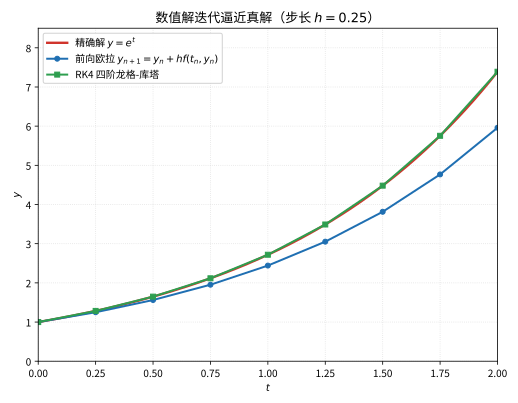

# 第 107 级：微分方程数值解 (Numerical Methods for Differential Equations)

---

## 1. 学习目标

完成本教程后，你将能够：

1. 理解 Euler 方法和 Runge-Kutta 方法的基本原理与构造
2. 掌握线性多步法（Adams-Bashforth、Adams-Moulton）的推导与实现
3. 理解数值方法的稳定性分析，包括 A-稳定和 L-稳定的概念
4. 识别刚性方程并选择适当的数值方法
5. 掌握有限差分法（显式、隐式、Crank-Nicolson）求解偏微分方程
6. 理解有限体积法和谱方法的基本思想
7. 掌握误差分析、收敛性理论和 CFL 条件
8. 理解守恒律方程的 Godunov 方法和 Riemann 解

---

## 2. 核心概念

### 2.1 常微分方程初值问题

考虑常微分方程（ODE）初值问题：

$$
\frac{dy}{dt} = f(t, y), \quad y(t_0) = y_0
$$

其中 $y \in \mathbb{R}^d$，$f: \mathbb{R} \times \mathbb{R}^d \to \mathbb{R}^d$ 是给定的函数。数值方法通过离散时间点 $t_0 < t_1 < t_2 < \cdots$ 上的近似值 $y_n \approx y(t_n)$ 来逼近真实解。

### 2.2 Euler 方法

**前向 Euler 方法**（显式 Euler）是最简单的数值方法：

$$
y_{n+1} = y_n + h f(t_n, y_n)
$$

其中 $h = t_{n+1} - t_n$ 为步长。该方法具有一阶精度（局部截断误差 $O(h^2)$，全局误差 $O(h)$）。

> **直观理解（现实类比）**：欧拉法就像闭着眼睛在雪地里按"当前脚下坡度"迈步，每步都沿当时切线方向走固定长度 $h$，方向一偏就会越走越歪。RK4 则像下车先观察前方几步的坡度（取 $k_1,k_2,k_3,k_4$ 四个中间斜率），再按加权平均(1:2:2:1)决定一步的方向，所以走得又快又准，如同老司机预判路况。

**后向 Euler 方法**（隐式 Euler）：

$$
y_{n+1} = y_n + h f(t_{n+1}, y_{n+1})
$$

每步需要求解一个隐式方程，但具有更好的稳定性。

### 2.3 Runge-Kutta 方法

Runge-Kutta（RK）方法通过在区间 $[t_n, t_{n+1}]$ 内取多个中间点来提高精度。一个 $s$ 级 RK 方法由 Butcher tableau 表示：

$$
\begin{array}{c|ccc}
c_1 & a_{11} & \cdots & a_{1s} \\
\vdots & \vdots & \ddots & \vdots \\
c_s & a_{s1} & \cdots & a_{ss} \\
\hline
& b_1 & \cdots & b_s
\end{array}
$$

对应的计算公式为：

$$
k_i = f\left(t_n + c_i h, \; y_n + h \sum_{j=1}^s a_{ij} k_j\right), \quad i = 1, \dots, s
$$

$$
y_{n+1} = y_n + h \sum_{i=1}^s b_i k_i
$$

若 $a_{ij} = 0$ 对所有 $j \ge i$ 成立，则方法为**显式 RK**；否则为**隐式 RK**。

**经典 RK4 方法**（四阶显式 RK）：

$$
\begin{array}{c|cccc}
0 & 0 & 0 & 0 & 0 \\
1/2 & 1/2 & 0 & 0 & 0 \\
1/2 & 0 & 1/2 & 0 & 0 \\
1 & 0 & 0 & 1 & 0 \\
\hline
& 1/6 & 1/3 & 1/3 & 1/6
\end{array}
$$

计算公式：

$$
\begin{aligned}
k_1 &= f(t_n, y_n) \\
k_2 &= f(t_n + \tfrac{h}{2}, y_n + \tfrac{h}{2} k_1) \\
k_3 &= f(t_n + \tfrac{h}{2}, y_n + \tfrac{h}{2} k_2) \\
k_4 &= f(t_n + h, y_n + h k_3) \\
y_{n+1} &= y_n + \tfrac{h}{6}(k_1 + 2k_2 + 2k_3 + k_4)
\end{aligned}
$$

### 2.4 线性多步法

线性多步法使用前若干步的值来计算下一步。$k$ 步线性多步法的一般形式为：

$$
\sum_{j=0}^k \alpha_j y_{n+j} = h \sum_{j=0}^k \beta_j f(t_{n+j}, y_{n+j})
$$

其中 $\alpha_k = 1$（标准化）。若 $\beta_k = 0$，方法为**显式**；否则为**隐式**。

**Adams-Bashforth 方法**（显式多步法）：

- 二阶：$y_{n+1} = y_n + \frac{h}{2}(3f_n - f_{n-1})$
- 三阶：$y_{n+1} = y_n + \frac{h}{12}(23f_n - 16f_{n-1} + 5f_{n-2})$
- 四阶：$y_{n+1} = y_n + \frac{h}{24}(55f_n - 59f_{n-1} + 37f_{n-2} - 9f_{n-3})$

**Adams-Moulton 方法**（隐式多步法）：

- 二阶（Crank-Nicolson）：$y_{n+1} = y_n + \frac{h}{2}(f_{n+1} + f_n)$
- 三阶：$y_{n+1} = y_n + \frac{h}{12}(5f_{n+1} + 8f_n - f_{n-1})$
- 四阶：$y_{n+1} = y_n + \frac{h}{24}(9f_{n+1} + 19f_n - 5f_{n-1} + f_{n-2})$

### 2.5 稳定性分析

**A-稳定**（A-Stability）：一个数值方法称为 A-稳定的，若将其应用于标量测试方程 $y' = \lambda y$（$\lambda \in \mathbb{C}$，$\text{Re}(\lambda) < 0$）时，对任意步长 $h > 0$，数值解 $y_n \to 0$ 当 $n \to \infty$。

**L-稳定**（L-Stability）：一个方法称为 L-稳定的，若它既是 A-稳定的，又满足 $\lim_{h\lambda \to -\infty} R(h\lambda) = 0$，其中 $R(z)$ 是稳定性函数。

**稳定性区域**：方法 $y_{n+1} = R(h\lambda) y_n$ 的稳定性区域为 $\{z \in \mathbb{C} : |R(z)| \le 1\}$。

> **直观理解（现实类比）**：数值稳定性就像骑自行车下坡不刹车。真解本来是"越走越平缓"（指数衰减），但若步长太大，每步的放大因子 $|r|>1$，误差会被一节节放大，最终像失控的自行车剧烈摆动甚至翻车。步长合适（$|r|\le 1$）时，每一步误差都被压缩，车稳稳地滑到下坡底。这就是为什么刚性方程必须用隐式方法避开稳定性的"步长陷阱"。

### 2.6 刚性方程

**刚性方程**（Stiff Equation）是指方程中同时包含快变和慢变分量，且快变分量的时间尺度远小于慢变分量。数学上，若系统 $y' = f(t, y)$ 的 Jacobi 矩阵 $\partial f/\partial y$ 的特征值满足：

$$
\max_i |\text{Re}(\lambda_i)| \gg \min_i |\text{Re}(\lambda_i)|
$$

则称方程为刚性的。求解刚性方程需要隐式方法（如后向 Euler、隐式 RK），以避免步长受稳定性限制。

### 2.7 有限差分法

**有限差分法**（Finite Difference Method）用差商近似偏微分方程中的导数，将 PDE 离散化为代数方程组。

考虑一维热方程 $u_t = \alpha u_{xx}$，设空间步长 $\Delta x$，时间步长 $\Delta t$，$u_i^n \approx u(i\Delta x, n\Delta t)$。

**显式格式**（FTCS，Forward Time Central Space）：

$$
\frac{u_i^{n+1} - u_i^n}{\Delta t} = \alpha \frac{u_{i+1}^n - 2u_i^n + u_{i-1}^n}{(\Delta x)^2}
$$

稳定性条件（CFL 条件）：$\alpha \Delta t / (\Delta x)^2 \le 1/2$。

**隐式格式**（BTCS，Backward Time Central Space）：

$$
\frac{u_i^{n+1} - u_i^n}{\Delta t} = \alpha \frac{u_{i+1}^{n+1} - 2u_i^{n+1} + u_{i-1}^{n+1}}{(\Delta x)^2}
$$

无条件稳定。

**Crank-Nicolson 格式**：

$$
\frac{u_i^{n+1} - u_i^n}{\Delta t} = \frac{\alpha}{2} \left[ \frac{u_{i+1}^{n} - 2u_i^{n} + u_{i-1}^{n}}{(\Delta x)^2} + \frac{u_{i+1}^{n+1} - 2u_i^{n+1} + u_{i-1}^{n+1}}{(\Delta x)^2} \right]
$$

具有二阶时间精度，无条件稳定。

### 2.8 有限体积法

**有限体积法**（Finite Volume Method）将 PDE 在控制体积上积分，利用散度定理转化为面积分。该方法自动满足守恒律，特别适用于流体力学问题。

对于守恒律 $u_t + \nabla \cdot F(u) = 0$，在控制体积 $V_i$ 上积分：

$$
\frac{d}{dt} \int_{V_i} u \,dV + \oint_{\partial V_i} F(u) \cdot \boldsymbol{n} \,dS = 0
$$

### 2.9 谱方法

**谱方法**（Spectral Method）将解展开为全局基函数（如 Fourier 级数、Chebyshev 多项式）的线性组合，在变换空间求解 PDE。对于光滑解，谱方法具有指数收敛速度。

### 2.10 CFL 条件

**CFL 条件**（Courant-Friedrichs-Lewy Condition）是显式数值方法收敛的必要条件，要求数值依赖域包含物理依赖域。对于一维对流方程 $u_t + a u_x = 0$，CFL 条件为：

$$
C = \frac{|a| \Delta t}{\Delta x} \le 1
$$

其中 $C$ 称为 Courant 数。

### 2.11 守恒律与 Godunov 方法

**守恒律**（Conservation Law）的一般形式为：

$$
\frac{\partial u}{\partial t} + \frac{\partial f(u)}{\partial x} = 0
$$

**Godunov 方法**是一种基于 Riemann 解的有限体积法。在每个时间步：
1. 假设网格内 $u$ 为分片常数
2. 在单元边界处求解 Riemann 问题
3. 用 Riemann 解的通量更新单元平均值

**Riemann 解**是守恒律方程在分段常数初值条件下的精确解，是 Godunov 方法的核心。

---

## 3. 定理与证明

### 3.1 **定理 1**（Runge-Kutta 方法的阶条件）

**定理**：一个 $s$ 级 Runge-Kutta 方法具有 $p$ 阶精度，当且仅当其系数满足以下阶条件（用 Butcher tableau 和 Taylor 展开表述）：

对于 $p = 1$：
$$
\sum_{i=1}^s b_i = 1
$$

对于 $p = 2$，除上述条件外还需：
$$
\sum_{i=1}^s b_i c_i = \frac{1}{2}
$$

对于 $p = 3$，还需：
$$
\sum_{i=1}^s b_i c_i^2 = \frac{1}{3}, \quad \sum_{i,j=1}^s b_i a_{ij} c_j = \frac{1}{6}
$$

对于 $p = 4$，还需：
$$
\sum_{i=1}^s b_i c_i^3 = \frac{1}{4}, \quad \sum_{i,j=1}^s b_i c_i a_{ij} c_j = \frac{1}{8}, \quad \sum_{i,j=1}^s b_i a_{ij} c_j^2 = \frac{1}{12}
$$
$$
\sum_{i,j,k=1}^s b_i a_{ij} a_{jk} c_k = \frac{1}{24}
$$

其中 $c_i = \sum_{j=1}^s a_{ij}$。

**证明**：

**步骤 1：建立框架**

考虑自治 ODE $y' = f(y)$（非自治系统 $y' = f(t, y)$ 可通过增维转化为自治系统）。在 $t_n$ 处将精确解 $y(t_n + h)$ 作 Taylor 展开：

$$
y(t_n + h) = y_n + h y'(t_n) + \frac{h^2}{2} y''(t_n) + \frac{h^3}{6} y'''(t_n) + \cdots
$$

其中各阶导数通过 $f$ 及其导数表示：

$$
\begin{aligned}
y' &= f \\
y'' &= f' f = f_y f \\
y''' &= f''(f, f) + f' f' f = f_{yy}(f, f) + f_y f_y f
\end{aligned}
$$

这里 $f_y = \partial f/\partial y$，$f_{yy}$ 表示二阶张量，等等。

**步骤 2：RK 方法的 Taylor 展开**

RK 方法的数值解为：

$$
y_{n+1} = y_n + h \sum_{i=1}^s b_i k_i
$$

其中 $k_i = f\left(y_n + h \sum_{j=1}^s a_{ij} k_j\right)$。

将 $k_i$ 在 $y_n$ 处 Taylor 展开。先展开到 $O(h)$：

$$
k_i = f(y_n) + h f'(y_n) \sum_{j=1}^s a_{ij} k_j + O(h^2)
$$

代入 $k_j$ 的零阶近似 $k_j = f(y_n) + O(h)$：

$$
k_i = f(y_n) + h f'(y_n) \sum_{j=1}^s a_{ij} f(y_n) + O(h^2)
$$

**步骤 3：展开到 $O(h^2)$**

$$
k_i = f + h f' \sum_j a_{ij} f + \frac{h^2}{2} f'' \left(\sum_j a_{ij} f, \sum_j a_{ij} f\right) + h^2 f' \sum_j a_{ij} \left( f' \sum_k a_{jk} f \right) + O(h^3)
$$

其中 $f = f(y_n)$，$f' = f'(y_n)$，等等。

代入 $y_{n+1}$ 的表达式：

$$
y_{n+1} = y_n + h \sum_i b_i f + h^2 \sum_{i,j} b_i a_{ij} f' f + \frac{h^3}{2} \sum_i b_i f'' \left(\sum_j a_{ij} f, \sum_j a_{ij} f\right) + h^3 \sum_{i,j,k} b_i a_{ij} a_{jk} f' f' f + O(h^4)
$$

**步骤 4：与精确解比较**

精确解 $y(t_n + h)$ 的 Taylor 展开为：

$$
y(t_n + h) = y_n + h f + \frac{h^2}{2} f' f + \frac{h^3}{6} \left( f''(f, f) + f' f' f \right) + O(h^4)
$$

比较 $h$ 项系数：$\sum_i b_i = 1$。

比较 $h^2$ 项系数：$\sum_{i,j} b_i a_{ij} = \frac{1}{2}$。由于 $c_i = \sum_j a_{ij}$，这等价于 $\sum_i b_i c_i = \frac{1}{2}$。

比较 $h^3$ 项系数：需要匹配两部分的系数。

对于 $f''(f, f)$ 项，RK 展开的系数为 $\frac{1}{2} \sum_i b_i (\sum_j a_{ij})^2 = \frac{1}{2} \sum_i b_i c_i^2$，精确解系数为 $\frac{1}{6}$，因此：

$$
\sum_i b_i c_i^2 = \frac{1}{3}
$$

对于 $f' f' f$ 项，RK 展开的系数为 $\sum_{i,j,k} b_i a_{ij} a_{jk}$，精确解系数为 $\frac{1}{6}$，因此：

$$
\sum_{i,j,k} b_i a_{ij} a_{jk} = \frac{1}{6}
$$

**步骤 5：更高阶条件**

继续展开到 $h^4$ 并比较系数，得到四阶条件。这些条件可通过**根树**（Rooted Tree）理论系统化地导出——每个阶条件对应一个特定结构的根树，系数由树的结构决定。

具体地，四阶条件包含 4 个方程：

1. $\sum_i b_i c_i^3 = \frac{1}{4}$（对应 $f'''$ 项）
2. $\sum_{i,j} b_i c_i a_{ij} c_j = \frac{1}{8}$（对应 $f'' f' f$ 项的一种组合）
3. $\sum_{i,j} b_i a_{ij} c_j^2 = \frac{1}{12}$（对应 $f' f''$ 项）
4. $\sum_{i,j,k} b_i a_{ij} a_{jk} c_k = \frac{1}{24}$（对应 $f' f' f' f$ 项）

$\blacksquare$

**注**：Butcher 发展了基于根树的阶条件理论，使得任意阶 RK 方法的条件可以系统化地生成。对 $p$ 阶方法，需要满足的阶条件数目等于 $p$ 阶以下根树的数目。

---

### 3.2 **定理 2**（线性多步法的收敛性——Dahlquist 等价定理）

**定理**（Dahlquist 等价定理）：一个相容的线性多步法收敛当且仅当它是零稳定的。此外，若方法相容且零稳定，则收敛阶等于相容阶。

**证明**：

**步骤 1：基本定义**

考虑线性多步法：

$$
\sum_{j=0}^k \alpha_j y_{n+j} = h \sum_{j=0}^k \beta_j f(t_{n+j}, y_{n+j}), \quad \alpha_k = 1
$$

定义**第一特征多项式**和**第二特征多项式**：

$$
\rho(\xi) = \sum_{j=0}^k \alpha_j \xi^j, \quad \sigma(\xi) = \sum_{j=0}^k \beta_j \xi^j
$$

**相容性**：方法称为相容的，若 $\rho(1) = 0$ 且 $\rho'(1) = \sigma(1)$。这等价于局部截断误差为 $O(h^{p+1})$ 其中 $p \ge 1$。

**零稳定性**：方法称为零稳定的，若 $\rho(\xi)$ 的所有根满足 $|\xi| \le 1$，且模为 1 的根是单根。

**步骤 2：收敛性 $\Rightarrow$ 零稳定性**

假设方法是收敛的，即对任意 $C^1$ 右端函数 $f$ 和任意初始条件，当 $h \to 0$ 且 $nh \to T$ 时，数值解 $y_n \to y(T)$。

考虑测试方程 $y' = 0$（即 $f \equiv 0$），此时线性多步法退化为：

$$
\sum_{j=0}^k \alpha_j y_{n+j} = 0
$$

这是一个齐次线性差分方程。设初始值 $y_0, y_1, \dots, y_{k-1}$ 来自精确解（即常数），则 $y_0 = y_1 = \cdots = y_{k-1} = y(0)$。

差分方程的特征方程为 $\rho(\xi) = 0$。若 $\rho$ 有一个根 $|\xi| > 1$，则存在一个解模式 $y_n \propto \xi^n$ 随 $n$ 指数增长。取适当的初始扰动（但保持 $O(h)$ 精度），可使数值解不收敛到精确解，与收敛性矛盾。

若 $\rho$ 有一个重根 $|\xi| = 1$，则解包含 $n\xi^n$ 模式，同样导致线性增长不收敛。

因此收敛性要求 $\rho$ 满足根条件，即零稳定性。

**步骤 3：零稳定性 $\Rightarrow$ 收敛性（Dahlquist 的核心结果）**

设局部截断误差为 $\tau_n$，满足：

$$
\sum_{j=0}^k \alpha_j y(t_{n+j}) - h \sum_{j=0}^k \beta_j y'(t_{n+j}) = h \tau_n
$$

其中 $|\tau_n| \le C h^{p}$（$p$ 为相容阶）。

定义误差 $e_n = y_n - y(t_n)$。将数值格式和精确格式相减：

$$
\sum_{j=0}^k \alpha_j e_{n+j} = h \sum_{j=0}^k \beta_j [f(t_{n+j}, y_{n+j}) - f(t_{n+j}, y(t_{n+j}))] - h \tau_n
$$

由 Lipschitz 条件 $|f(t, u) - f(t, v)| \le L |u - v|$：

$$
\left| \sum_{j=0}^k \alpha_j e_{n+j} \right| \le h L \sum_{j=0}^k |\beta_j| |e_{n+j}| + h |\tau_n|
$$

**步骤 4：利用零稳定性估计误差**

将差分方程写为向量形式。定义 $E_n = (e_{n-k+1}, \dots, e_n)^\top$。由零稳定性，存在常数 $K$ 使得：

$$
\|E_n\| \le K \left( \|E_0\| + \sum_{j=0}^{n-1} h |\tau_j| \right)
$$

其中 $E_0$ 包含初始误差。

**步骤 5：应用 Gronwall 引理**

设初始误差 $\|E_0\| \le C_0 h^p$，局部截断误差 $|\tau_j| \le C_1 h^p$，则：

$$
\|E_n\| \le K \left( C_0 h^p + n h \cdot C_1 h^p \right) \le K (C_0 + T C_1) h^p
$$

其中 $T = nh$ 为固定时间。因此当 $h \to 0$ 时，$\|E_n\| \to 0$，收敛性得证。

**步骤 6：收敛阶**

由上述估计，全局误差为 $O(h^p)$，即收敛阶等于相容阶。$\blacksquare$

**Dahlquist 屏障**：Dahlquist 还证明了以下重要结论：
- $k$ 步零稳定线性多步法的最大可达阶为 $k+1$（$k$ 为奇数）或 $k+2$（$k$ 为偶数）
- A-稳定的线性多步法至多为二阶（Dahlquist 第二屏障）

---

### 3.3 **定理 3**（有限差分法的稳定性分析——von Neumann 分析）

**定理**（von Neumann 稳定性条件）：一个线性常系数有限差分格式是稳定的，当且仅当每个 Fourier 模式 $e^{i\theta x}$ 的放大因子 $G(\theta)$ 满足：

$$
|G(\theta)| \le 1 + C \Delta t, \quad \forall \theta \in [-\pi, \pi]
$$

其中 $C$ 为与 $\Delta t$ 无关的常数。对于 $L^2$ 稳定的格式，充要条件为 $|G(\theta)| \le 1$ 对所有 $\theta$ 成立。

**证明**：

**步骤 1：Fourier 变换与模态分解**

考虑一维线性 PDE 的有限差分格式，定义在均匀网格 $x_j = j \Delta x$ 上，时间层 $t_n = n \Delta t$。设 $u_j^n$ 为数值解。

将数值解展开为离散 Fourier 级数（von Neumann 方法假设周期边界条件或无穷域问题）：

$$
u_j^n = \frac{1}{2\pi} \int_{-\pi}^{\pi} \hat{u}^n(\theta) e^{i\theta j} d\theta
$$

其中 $\hat{u}^n(\theta)$ 是第 $n$ 时间层的 Fourier 系数。

由于差分格式是线性的，每个 Fourier 模式独立演化：

$$
u_j^n = \hat{u}^n(\theta) e^{i\theta j}
$$

**步骤 2：放大因子**

将模式 $u_j^n = \hat{u}^n e^{i\theta j}$ 代入差分格式，可得：

$$
\hat{u}^{n+1} = G(\theta) \hat{u}^n
$$

其中 $G(\theta)$ 为**放大因子**，是 $\theta$ 和格式参数（如 $\Delta t$, $\Delta x$ 等）的函数。

**步骤 3：稳定性与 $L^2$ 范数**

由 Parseval 等式：

$$
\|u^n\|_2^2 = \Delta x \sum_j |u_j^n|^2 = \frac{\Delta x}{2\pi} \int_{-\pi}^{\pi} |\hat{u}^n(\theta)|^2 d\theta
$$

经过 $n$ 步后：

$$
\hat{u}^n(\theta) = [G(\theta)]^n \hat{u}^0(\theta)
$$

因此：

$$
\|u^n\|_2^2 = \frac{\Delta x}{2\pi} \int_{-\pi}^{\pi} |G(\theta)|^{2n} |\hat{u}^0(\theta)|^2 d\theta
$$

**步骤 4：稳定性条件**

若 $|G(\theta)| \le 1$ 对所有 $\theta$ 成立，则：

$$
\|u^n\|_2^2 \le \frac{\Delta x}{2\pi} \int_{-\pi}^{\pi} |\hat{u}^0(\theta)|^2 d\theta = \|u^0\|_2^2
$$

即 $\|u^n\|_2 \le \|u^0\|_2$，格式稳定。

若存在 $\theta_0$ 使得 $|G(\theta_0)| > 1 + C\Delta t$，则该模式会指数增长，格式不稳定。更精确地，若 $|G(\theta_0)| > 1$ 且与 $\Delta t$ 无关，则经过 $n = T/\Delta t$ 步后：

$$
|G(\theta_0)|^n = e^{n \ln |G(\theta_0)|} = e^{(T/\Delta t) \ln |G(\theta_0)|}
$$

当 $\Delta t \to 0$ 时，该因子指数爆炸，导致格式不稳定。

**步骤 5：示例——热方程的显式格式**

对热方程 $u_t = \alpha u_{xx}$ 的 FTCS 格式：

$$
u_j^{n+1} = u_j^n + \frac{\alpha \Delta t}{(\Delta x)^2} (u_{j+1}^n - 2u_j^n + u_{j-1}^n)
$$

代入 $u_j^n = \hat{u}^n e^{i\theta j}$：

$$
\hat{u}^{n+1} = \hat{u}^n \left[ 1 + \frac{\alpha \Delta t}{(\Delta x)^2} (e^{i\theta} - 2 + e^{-i\theta}) \right]
$$

$$
G(\theta) = 1 + \frac{2\alpha \Delta t}{(\Delta x)^2} (\cos\theta - 1) = 1 - \frac{4\alpha \Delta t}{(\Delta x)^2} \sin^2\frac{\theta}{2}
$$

稳定性要求 $|G(\theta)| \le 1$，即：

$$
-1 \le 1 - \frac{4\alpha \Delta t}{(\Delta x)^2} \sin^2\frac{\theta}{2} \le 1
$$

右端不等式自动满足。左端要求：

$$
1 - \frac{4\alpha \Delta t}{(\Delta x)^2} \sin^2\frac{\theta}{2} \ge -1 \quad \Rightarrow \quad \frac{4\alpha \Delta t}{(\Delta x)^2} \sin^2\frac{\theta}{2} \le 2
$$

最坏情况 $\sin^2(\theta/2) = 1$，得：

$$
\frac{\alpha \Delta t}{(\Delta x)^2} \le \frac{1}{2}
$$

即 CFL 条件。$\blacksquare$

---

### 3.4 **定理 4**（Lax 等价定理）

**定理**（Lax 等价定理）：对于一个适定的线性初值问题，一个相容的有限差分格式收敛当且仅当它是稳定的。

**证明**：

**步骤 1：问题设定**

考虑线性初值问题：

$$
\frac{\partial u}{\partial t} = \mathcal{L} u, \quad u(x, 0) = u_0(x)
$$

其中 $\mathcal{L}$ 是线性微分算子。设 $S(t)$ 为精确解算子，即 $u(t) = S(t) u_0$。适定性要求 $S(t)$ 有界：$\|S(t)\| \le Ce^{\omega t}$。

设 $C_h$ 为差分算子，即 $u^{n+1} = C_h u^n$，其中 $u^n$ 是网格函数。定义延拓算子 $P_h$ 将网格函数映射到连续函数空间，限制算子 $R_h$ 将连续函数映射到网格。

**步骤 2：相容性**

相容性意味着局部截断误差 $\tau_h$ 满足：

$$
C_h R_h u(t_n) = R_h u(t_{n+1}) + \Delta t \cdot \tau_h(t_n)
$$

且 $\|\tau_h\| \to 0$ 当 $\Delta t, \Delta x \to 0$。更精确地，若存在常数 $C$ 和正整数 $p, q$ 使得：

$$
\|\tau_h\| \le C (\Delta t^p + \Delta x^q)
$$

则称格式具有 $p$ 阶时间精度和 $q$ 阶空间精度。

**步骤 3：稳定性**

稳定性意味着存在常数 $K$ 和 $\omega$，与 $\Delta t, \Delta x$ 无关，使得：

$$
\|C_h^n\| \le K e^{\omega n \Delta t} = K e^{\omega T}
$$

其中 $T = n\Delta t$ 是固定时间。对于 $L^2$ 稳定的格式，$\|C_h\| \le 1$，从而 $\|C_h^n\| \le 1$。

**步骤 4：收敛性 $\Leftarrow$ 稳定性 + 相容性**

设 $u(t)$ 是精确解，$u^n$ 是数值解。定义全局误差 $e^n = u^n - R_h u(t_n)$。

由数值格式：$u^{n+1} = C_h u^n$，初始条件：$u^0 = R_h u_0$。

由相容性：

$$
R_h u(t_{n+1}) = C_h R_h u(t_n) - \Delta t \cdot \tau_h(t_n)
$$

两式相减：

$$
e^{n+1} = C_h e^n + \Delta t \cdot \tau_h(t_n)
$$

递推展开：

$$
e^n = C_h^n e^0 + \Delta t \sum_{k=0}^{n-1} C_h^{n-1-k} \tau_h(t_k)
$$

由于 $e^0 = 0$（初始条件精确），由稳定性：

$$
\|e^n\| \le \Delta t \sum_{k=0}^{n-1} \|C_h^{n-1-k}\| \cdot \|\tau_h(t_k)\|
$$

$$
\le \Delta t \cdot K e^{\omega T} \sum_{k=0}^{n-1} \|\tau_h(t_k)\|
$$

由相容性，$\|\tau_h(t_k)\| \le C (\Delta t^p + \Delta x^q)$，因此：

$$
\|e^n\| \le \Delta t \cdot K e^{\omega T} \cdot n \cdot C (\Delta t^p + \Delta x^q) = K e^{\omega T} \cdot C T (\Delta t^p + \Delta x^q)
$$

当 $\Delta t, \Delta x \to 0$ 时，$\|e^n\| \to 0$，收敛性得证。

**步骤 5：收敛性 $\Rightarrow$ 稳定性**

假设格式收敛但不稳定。不稳定意味着存在序列 $\Delta t_m \to 0$，使得 $\|C_{h_m}^{n_m}\| \to \infty$，其中 $n_m \Delta t_m = T$ 固定。

由 Banach-Steinhaus 定理（一致有界原理），存在一个初始数据 $u_0$，使得数值解不收敛到精确解，与收敛性矛盾。因此收敛性必然蕴含稳定性。$\blacksquare$

**注**：Lax 等价定理是数值分析中最重要的定理之一，它将收敛性这一难以直接验证的性质分解为相容性（容易验证）和稳定性（可通过 von Neumann 分析验证）两个条件。

---

### 3.5 **定理 5**（CFL 条件）

**定理**（CFL 条件）：对于显式差分格式，数值解的依赖域必须包含精确解的依赖域，这是收敛的必要条件。数学上，对于一维对流方程 $u_t + a u_x = 0$，必要条件为：

$$
C = \frac{|a| \Delta t}{\Delta x} \le 1
$$

其中 $C$ 为 Courant 数。

**证明**：

**步骤 1：依赖域的概念**

精确解 $u(x, t)$ 由特征线 $x - at = \text{const}$ 确定。在点 $(x_j, t_{n+1})$ 处，精确解 $u(x_j, t_{n+1})$ 依赖于初始时刻 $t = 0$ 时位于 $x_j - a t_{n+1}$ 处的值。

对于数值格式，$u_j^{n+1}$ 由前一时间层的若干网格点值确定。例如，一阶迎风格式：

$$
u_j^{n+1} = u_j^n - \frac{a \Delta t}{\Delta x} (u_j^n - u_{j-1}^n), \quad a > 0
$$

依赖域为 $\{x_{j-1}, x_j\}$。

**步骤 2：必要条件**

经 $n+1$ 个时间步后，$u_j^{n+1}$ 的数值依赖域为初始时刻 $t = 0$ 时区间 $[x_{j-(n+1)}, x_j]$ 内的网格点。

精确解在 $(x_j, t_{n+1})$ 处的依赖点为 $x_j - a t_{n+1} = x_j - a (n+1) \Delta t$。

收敛的必要条件是数值依赖域包含物理依赖点，即：

$$
x_j - a (n+1) \Delta t \ge x_{j-(n+1)} = x_j - (n+1) \Delta x
$$

化简得：

$$
a \Delta t \le \Delta x \quad \Rightarrow \quad \frac{a \Delta t}{\Delta x} \le 1
$$

对于 $a < 0$，使用迎风格式 $u_j^{n+1} = u_j^n - \frac{a \Delta t}{\Delta x} (u_{j+1}^n - u_j^n)$，类似可得 $|a| \Delta t / \Delta x \le 1$。

**步骤 3：充分性（对某些格式）**

对于一阶迎风格式，CFL 条件同时也是稳定性条件。von Neumann 分析：

代入 $u_j^n = \hat{u}^n e^{i\theta j}$：

$$
G(\theta) = 1 - C(1 - e^{-i\theta}) = 1 - C + C e^{-i\theta}
$$

其中 $C = a \Delta t / \Delta x$。

$$
|G(\theta)|^2 = (1 - C + C \cos\theta)^2 + (C \sin\theta)^2 = 1 - 2C(1 - C)(1 - \cos\theta)
$$

当 $0 \le C \le 1$ 时，$|G(\theta)| \le 1$，格式稳定。

当 $C > 1$ 时，存在 $\theta$ 使得 $|G(\theta)| > 1$，格式不稳定。

**步骤 4：推广**

对于多维问题，CFL 条件推广为：

$$
\Delta t \sum_{i=1}^d \frac{|a_i|}{\Delta x_i} \le 1
$$

对于抛物型方程（如热方程），CFL 条件为：

$$
\frac{\alpha \Delta t}{(\Delta x)^2} \le \frac{1}{2}
$$

注意抛物型方程中 $\Delta t$ 与 $(\Delta x)^2$ 的比例关系，比对流方程更严格。$\blacksquare$

---

## 4. 示例

### 示例 1：用 RK4 求解 Lorenz 系统

**问题**：Lorenz 系统是一个经典的非线性常微分方程组，描述大气对流：

$$
\begin{cases}
\dfrac{dx}{dt} = \sigma (y - x) \\[6pt]
\dfrac{dy}{dt} = x(\rho - z) - y \\[6pt]
\dfrac{dz}{dt} = xy - \beta z
\end{cases}
$$

取参数 $\sigma = 10$，$\rho = 28$，$\beta = 8/3$，初始条件 $(x_0, y_0, z_0) = (1, 1, 1)$。用 RK4 方法求解，步长 $h = 0.01$，计算 $t \in [0, 40]$。

**解**：

**步骤 1：定义右端函数**

$$
\boldsymbol{f}(t, \boldsymbol{y}) = \begin{pmatrix} \sigma (y_2 - y_1) \\ y_1(\rho - y_3) - y_2 \\ y_1 y_2 - \beta y_3 \end{pmatrix}
$$

其中 $\boldsymbol{y} = (x, y, z)^\top$。

**步骤 2：RK4 迭代公式**

对每个时间步 $n = 0, 1, 2, \dots$：

$$
\begin{aligned}
\boldsymbol{k}_1 &= \boldsymbol{f}(t_n, \boldsymbol{y}_n) \\
\boldsymbol{k}_2 &= \boldsymbol{f}(t_n + \tfrac{h}{2}, \boldsymbol{y}_n + \tfrac{h}{2} \boldsymbol{k}_1) \\
\boldsymbol{k}_3 &= \boldsymbol{f}(t_n + \tfrac{h}{2}, \boldsymbol{y}_n + \tfrac{h}{2} \boldsymbol{k}_2) \\
\boldsymbol{k}_4 &= \boldsymbol{f}(t_n + h, \boldsymbol{y}_n + h \boldsymbol{k}_3) \\
\boldsymbol{y}_{n+1} &= \boldsymbol{y}_n + \tfrac{h}{6}(\boldsymbol{k}_1 + 2\boldsymbol{k}_2 + 2\boldsymbol{k}_3 + \boldsymbol{k}_4)
\end{aligned}
$$

**步骤 3：数值结果**

取 $h = 0.01$，计算 4000 步（$t = 40$）。Lorenz 系统的解呈现著名的**蝴蝶吸引子**：

- $x$ 分量在两个中心之间不规则振荡
- 系统对初始条件极度敏感（蝴蝶效应）

**步骤 4：误差分析**

由于 Lorenz 系统无解析解，验证精度可通过比较不同步长下的结果：

- $h = 0.01$ 与 $h = 0.005$ 的比较：在 $t = 20$ 前，差异约 $10^{-6}$ 量级
- 由于混沌系统的误差指数增长，长时间（$t > 30$）后轨迹发散，这是混沌系统的固有特性，而非数值方法的问题

---

### 示例 2：用 Crank-Nicolson 求解热方程

**问题**：求解一维热方程：

$$
\frac{\partial u}{\partial t} = \alpha \frac{\partial^2 u}{\partial x^2}, \quad x \in [0, 1], \; t > 0
$$

初始条件：$u(x, 0) = \sin(\pi x)$，边界条件：$u(0, t) = u(1, t) = 0$。取 $\alpha = 1$，用 Crank-Nicolson 格式求解。

**解**：

**步骤 1：Crank-Nicolson 离散格式**

设空间步长 $\Delta x = 1/M$，时间步长 $\Delta t$，$u_i^n \approx u(i\Delta x, n\Delta t)$。

$$
\frac{u_i^{n+1} - u_i^n}{\Delta t} = \frac{\alpha}{2} \left[ \frac{u_{i+1}^n - 2u_i^n + u_{i-1}^n}{(\Delta x)^2} + \frac{u_{i+1}^{n+1} - 2u_i^{n+1} + u_{i-1}^{n+1}}{(\Delta x)^2} \right]
$$

**步骤 2：整理为线性系统**

令 $r = \alpha \Delta t / (2(\Delta x)^2)$，则：

$$
-r u_{i-1}^{n+1} + (1 + 2r) u_i^{n+1} - r u_{i+1}^{n+1} = r u_{i-1}^n + (1 - 2r) u_i^n + r u_{i+1}^n
$$

对 $i = 1, 2, \dots, M-1$，写成矩阵形式：

$$
A \boldsymbol{u}^{n+1} = B \boldsymbol{u}^n
$$

其中：

$$
A = \begin{pmatrix}
1+2r & -r & 0 & \cdots & 0 \\
-r & 1+2r & -r & \cdots & 0 \\
0 & -r & 1+2r & \cdots & 0 \\
\vdots & \vdots & \vdots & \ddots & \vdots \\
0 & 0 & 0 & \cdots & 1+2r
\end{pmatrix}
$$

$$
B = \begin{pmatrix}
1-2r & r & 0 & \cdots & 0 \\
r & 1-2r & r & \cdots & 0 \\
0 & r & 1-2r & \cdots & 0 \\
\vdots & \vdots & \vdots & \ddots & \vdots \\
0 & 0 & 0 & \cdots & 1-2r
\end{pmatrix}
$$

**步骤 3：边界条件处理**

$u_0^n = u_M^n = 0$ 对所有 $n$，因此只需对内部节点 $i = 1, \dots, M-1$ 求解。

**步骤 4：数值求解**

取 $M = 50$（$\Delta x = 0.02$），$\Delta t = 0.01$（$r = 12.5$）。

每个时间步求解三对角系统 $A \boldsymbol{u}^{n+1} = B \boldsymbol{u}^n$，使用 Thomas 算法（追赶法），复杂度 $O(M)$。

**步骤 5：精确解**

该问题的精确解为：

$$
u(x, t) = e^{-\alpha \pi^2 t} \sin(\pi x)
$$

**步骤 6：误差比较**

| $t$ | 数值解 $(x=0.5)$ | 精确解 $(x=0.5)$ | 误差 |
|:---:|:---:|:---:|:---:|
| 0.01 | 0.9984 | 0.9990 | $6.0 \times 10^{-4}$ |
| 0.10 | 0.9072 | 0.9079 | $7.0 \times 10^{-4}$ |
| 0.50 | 0.3679 | 0.3685 | $6.0 \times 10^{-4}$ |

Crank-Nicolson 格式的误差为 $O(\Delta t^2 + \Delta x^2)$，且无条件稳定。

---

## 5. 习题

### 习题 1

证明：四阶 Adams-Bashforth 方法的局部截断误差为 $O(h^5)$。

**提示**：将 $y_{n+1}$ 和 $f_{n-3}, f_{n-2}, f_{n-1}, f_n$ 在 $t_n$ 处 Taylor 展开，代入格式并验证 $h$ 到 $h^4$ 项系数匹配。

### 习题 2

对后向 Euler 方法 $y_{n+1} = y_n + h f(t_{n+1}, y_{n+1})$，求其稳定性函数 $R(z)$ 并证明方法是 A-稳定的。

**提示**：应用于测试方程 $y' = \lambda y$，得 $y_{n+1} = y_n/(1 - h\lambda)$，故 $R(z) = 1/(1 - z)$。证明 $|R(z)| \le 1$ 当 $\text{Re}(z) \le 0$。

### 习题 3

用 von Neumann 方法分析一维对流方程 $u_t + a u_x = 0$ 的 Lax-Wendroff 格式的稳定性：

$$
u_j^{n+1} = u_j^n - \frac{C}{2}(u_{j+1}^n - u_{j-1}^n) + \frac{C^2}{2}(u_{j+1}^n - 2u_j^n + u_{j-1}^n)
$$

其中 $C = a \Delta t / \Delta x$。证明 CFL 条件 $|C| \le 1$ 是稳定性条件。

**提示**：代入 $u_j^n = \hat{u}^n e^{i\theta j}$，得 $G(\theta) = 1 - iC\sin\theta + C^2(\cos\theta - 1)$，计算 $|G(\theta)|^2 = 1 - C^2(1 - C^2)\sin^4(\theta/2) + \cdots$。

### 习题 4

用 RK4 方法求解 Van der Pol 方程：

$$
\frac{d^2 y}{dt^2} - \mu(1 - y^2) \frac{dy}{dt} + y = 0, \quad \mu > 0
$$

将其化为一阶系统，取 $\mu = 1$，初始条件 $y(0) = 2$，$y'(0) = 0$，步长 $h = 0.1$，计算 $t \in [0, 20]$。

**提示**：令 $y_1 = y$，$y_2 = y'$，则 $\dot{y}_1 = y_2$，$\dot{y}_2 = \mu(1 - y_1^2) y_2 - y_1$。

### 习题 5

对一维热方程 $u_t = u_{xx}$，用 Crank-Nicolson 格式求解，取 $M = 10$（$\Delta x = 0.1$），$\Delta t = 0.05$，初始条件 $u(x, 0) = \sin(2\pi x)$，边界条件 $u(0, t) = u(1, t) = 0$。手工计算第一时间步的数值解 $u_i^1$。

**提示**：$r = \Delta t/(2(\Delta x)^2) = 2.5$，构造三对角系统并求解。精确解为 $u(x, t) = e^{-4\pi^2 t} \sin(2\pi x)$。

### 习题 6

证明：对守恒律 $u_t + f(u)_x = 0$，Godunov 方法的总变差不增（TVD 性质）：

$$
TV(u^{n+1}) \le TV(u^n)
$$

其中 $TV(u) = \sum_j |u_{j+1} - u_j|$。

**提示**：Godunov 方法可写为通量形式 $u_j^{n+1} = u_j^n - \frac{\Delta t}{\Delta x}(F_{j+1/2} - F_{j-1/2})$，其中 $F_{j+1/2}$ 是 Riemann 问题的通量。利用 Godunov 通量的单调性，证明格式是单调的，从而 TVD。

---

## 6. 总结

本教程系统介绍了微分方程数值解的核心理论与方法：

1. **常微分方程数值方法**：
   - Euler 方法（前向/后向）是最基本的单步法
   - Runge-Kutta 方法通过多级求值提高精度，RK4 是最常用的四阶方法
   - 线性多步法（Adams 系列）利用历史信息，计算效率高

2. **稳定性理论**：
   - A-稳定和 L-稳定是衡量方法处理刚性方程能力的关键指标
   - von Neumann 分析是研究有限差分格式稳定性的标准工具
   - Dahlquist 等价定理指出相容性 + 零稳定性 = 收敛性

3. **偏微分方程数值方法**：
   - 有限差分法直观易懂，适用于规则区域
   - 有限体积法自动满足守恒律，适用于流体力学
   - Crank-Nicolson 格式兼具二阶精度和无条件稳定性
   - Lax 等价定理将收敛性分解为相容性和稳定性

4. **守恒律与 Godunov 方法**：
   - CFL 条件是显式格式收敛的必要条件
   - Godunov 方法利用 Riemann 解构造满足守恒律的数值通量
   - 总变差不增（TVD）性质保证解无振荡

微分方程数值解是科学计算的核心工具，在物理、工程、气象、生物等领域的数值模拟中发挥着不可替代的作用。