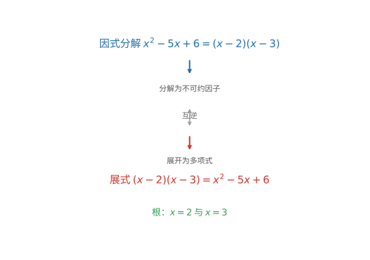

# 第 108 级：计算机代数 (Computer Algebra)

---

## 1. 学习目标

完成本教程后，你将能够：

1. 理解符号计算的基本概念与多项式运算的核心算法
2. 掌握 Gröbner 基的定义、性质与 Buchberger 算法
3. 理解 Hilbert 基定理及 Buchberger 准则的完整证明
4. 掌握多项式因子分解的基本方法
5. 理解符号积分（Risch 算法）的基本思想与结构
6. 掌握符号求和（Gosper 算法、Zeilberger 算法）的原理
7. 理解精确线性代数与有理函数操作
8. 了解微分代数与计算交换代数的基本概念

---

## 2. 核心概念

### 2.1 符号计算

**符号计算**（Symbolic Computation）或**计算机代数**（Computer Algebra）是计算机科学和数学的交叉领域，研究如何用计算机精确地操作数学表达式。与数值计算不同，符号计算处理的是精确的数学对象（如多项式、有理函数、代数数），而不是浮点数近似。

### 2.2 多项式运算

多项式是计算机代数中最基本的数学对象。一个 $n$ 元多项式 $f \in \mathbb{K}[x_1, \dots, x_n]$ 可表示为：

$$
f = \sum_{\alpha} c_\alpha x^\alpha, \quad x^\alpha = x_1^{\alpha_1} x_2^{\alpha_2} \cdots x_n^{\alpha_n}
$$

其中 $c_\alpha \in \mathbb{K}$ 为系数，$\alpha = (\alpha_1, \dots, \alpha_n) \in \mathbb{N}^n$ 为指数向量。

**多项式运算**包括：
- 加法、乘法、除法（带余除法）
- 最大公因式（GCD）计算（Euclid 算法）
- 多项式因子分解
- 结式（Resultant）计算


> **直观理解（现实类比）**：符号计算如同用笔和纸做精确的代数整理，分数 1/3 就精确地记为 1/3，而不是小数点后无限循环的近似。就好比记账时，符号计算保留"⅓"这个精确记号（可随时还原成 0.333…），而浮点近似像把金额四舍五入到 0.33 元，多次运算后误差会悄悄累积。计算机代数系统（Maple、Mathematica、SymPy）正是这样"精打细算"，不丢任何一个信息。

### 2.3 Gröbner 基

**Gröbner 基**是多项式环中理想的一组具有良好性质的基。给定一个单项式序（如字典序、全次数序），Gröbner 基是理想的一组生成元，使得理想中每个多项式的首项（leading term）都能被基中某个多项式的首项整除。

Gröbner 基的构造性算法由 Buchberger 于 1965 年提出，是计算机代数中最具里程碑意义的成果之一。

### 2.4 Buchberger 算法

**Buchberger 算法**是计算 Gröbner 基的核心算法。其基本思想是：

1. 从理想的给定生成元集合 $F$ 开始
2. 对每对多项式 $(f_i, f_j)$，计算 S-多项式 $S(f_i, f_j)$
3. 用 $F$ 对 $S(f_i, f_j)$ 进行约化，得到余式 $r$
4. 若 $r \neq 0$，将 $r$ 加入 $F$
5. 重复直到所有 S-多项式的余式均为 0

### 2.5 多项式因子分解

**多项式因子分解**（Polynomial Factorization）将多项式分解为不可约因子的乘积。在有理数域 $\mathbb{Q}$ 上，主要方法包括：

- **Kronecker 方法**：基于有限域上的因子分解
- **Berlekamp 算法**：在有限域 $\mathbb{F}_p$ 上分解多项式
- **Hensel 提升**：从模 $p$ 的因子分解提升到模 $p^k$ 的因子分解
- **LLL 算法**：用于整系数多项式的因子分解



> **直观理解（现实类比）**：因式分解与展式互为"拼装"与"拆解"，如同乐高积木。展式是把 (x-2) 和 (x-3) 两块拼成一块大板 x²-5x+6；因式分解则是把大板按卡扣位置拆回两块积木。知道了积木的"卡扣"（根 x=2、x=3），就能反推出整块板的形状。计算机代数里的 Berlekamp、Hensel 提升等算法，正是高效地完成这种"拆解"。

### 2.6 符号积分（Risch 算法）

**Risch 算法**（1969）是符号积分的基本算法，用于判断一个初等函数是否存在初等原函数，并在存在的情况下求出它。该算法基于 Liouville 定理和微分代数理论。

Risch 算法处理以下形式的积分：

$$
\int f(x) \,dx
$$

其中 $f$ 是初等函数。算法通过分析 $f$ 的微分域结构，将问题转化为代数方程求解。

### 2.7 符号求和（Gosper 算法、Zeilberger 算法）

**Gosper 算法**（1978）用于求解超几何项的不定和（indefinite sum）。给定 $a_k$，寻找 $S_n = \sum_{k=0}^n a_k$ 的超几何闭形式。

**Zeilberger 算法**（1990）是 Gosper 算法的推广，用于证明和计算超几何恒等式。它基于**创造 telescoping**（creative telescoping）的思想，自动推导递推关系。

### 2.8 精确线性代数

**精确线性代数**（Exact Linear Algebra）在精确算术（整数、有理数、有限域）上进行矩阵运算，包括：

- 精确 LU 分解
- 精确行列式计算（Bareiss 算法，避免分数）
- 有理数域上的 Smith 标准型和 Hermite 标准型
- 模方法和 Chinese Remainder 方法

### 2.9 有理函数

**有理函数**（Rational Function）是多项式之比 $p/q$。有理函数操作包括：

- 部分分式分解
- 有理函数积分
- 有理函数化简（正规化）

### 2.10 方程的符号求解

**方程的符号求解**包括：

- 多项式方程组的求解（通过 Gröbner 基消元）
- 三角化（Triangularization）
- 柱形代数分解（CAD，Cylindrical Algebraic Decomposition）

### 2.11 微分代数

**微分代数**（Differential Algebra）研究微分方程、微分多项式和微分理想。核心概念包括：

- 微分环与微分域
- 微分消元理论
- Ritt 算法（微分多项式组的特征集）

### 2.12 计算交换代数

**计算交换代数**（Computational Commutative Algebra）利用 Gröbner 基等工具计算交换代数中的不变量，包括：

- 自由分解（Free Resolution）
- Hilbert 函数与 Hilbert 多项式
- 关联素理想（Associated Primes）
- 深度（Depth）与正则性（Regularity）

---

## 3. 定理与证明

### 3.1 **定理 1**（Gröbner 基的存在性——Buchberger 算法）

**定理**：给定多项式环 $\mathbb{K}[x_1, \dots, x_n]$ 上的一个理想 $I = \langle f_1, \dots, f_m \rangle$ 和一个单项式序，Buchberger 算法在有限步内终止，并输出 $I$ 的一个 Gröbner 基。

**证明**：

**步骤 1：Buchberger 算法描述**

Buchberger 算法：

```
输入：F = (f_1, ..., f_m)
输出：I = <F> 的 Gröbner 基 G

G := F
REPEAT
    G' := G
    FOR each pair (p, q), p ≠ q in G' DO
        S := S-多项式(p, q)
        r := 用 G' 约化 S 得到的余式
        IF r ≠ 0 THEN G := G ∪ {r}
    END FOR
UNTIL G = G'
RETURN G
```

**步骤 2：终止性证明**

设 $G_k$ 为第 $k$ 次迭代后的集合。每次加入新多项式 $r$ 时，$\text{LT}(r)$ 不能被 $\text{LT}(G_k)$ 中的任何单项式整除（因为 $r$ 是约化后的余式）。

考虑单项式理想：

$$
L_k = \langle \text{LT}(g) : g \in G_k \rangle
$$

每次加入新多项式 $r$ 时，$\text{LT}(r) \notin L_k$，因此 $L_{k+1} \supsetneq L_k$（严格包含）。

由 Hilbert 基定理的推论，$\mathbb{K}[x_1, \dots, x_n]$ 中任何严格递增的单项式理想链必然终止。因此算法在有限步后终止。

**步骤 3：正确性证明**

算法终止时，对所有 $p, q \in G$，$S(p, q)$ 的余式为 0。由 Buchberger 准则（定理 3），$G$ 是 Gröbner 基。$\blacksquare$

---

### 3.2 **定理 2**（Hilbert 基定理）

**定理**（Hilbert 基定理）：多项式环 $\mathbb{K}[x_1, \dots, x_n]$ 中的每个理想 $I$ 都是有限生成的，即存在 $f_1, \dots, f_m \in \mathbb{K}[x_1, \dots, x_n]$ 使得 $I = \langle f_1, \dots, f_m \rangle$。

**证明**（用 Gröbner 基）：

**步骤 1：归纳法基础**

对变元个数 $n$ 进行归纳。当 $n = 0$ 时，$\mathbb{K}[x_1, \dots, x_0] = \mathbb{K}$ 是域，其唯一理想为 $\{0\}$ 和 $\mathbb{K}$，都是有限生成的。

**步骤 2：归纳假设**

假设 $\mathbb{K}[x_1, \dots, x_{n-1}]$ 是 Noetherian 环（即每个理想都有限生成）。需要证明 $\mathbb{K}[x_1, \dots, x_n] = R[x_n]$ 也是 Noetherian 环，其中 $R = \mathbb{K}[x_1, \dots, x_{n-1}]$。

**步骤 3：构造理想链**

设 $I \subset R[x_n]$ 是理想。对每个 $d \ge 0$，定义 $I_d$ 为 $I$ 中所有多项式关于 $x_n$ 的 $d$ 次项系数的集合（加上 0）：

$$
I_d = \{a_d \in R : \exists f \in I, \deg_{x_n}(f) \le d, \text{且 } f \text{ 的 } x_n^d \text{ 项系数为 } a_d\}
$$

可以验证每个 $I_d$ 是 $R$ 的理想，且 $I_d \subseteq I_{d+1}$。

**步骤 4：有限生成性**

由归纳假设，$R$ 是 Noetherian 环，因此递增理想链 $I_0 \subseteq I_1 \subseteq \cdots$ 在有限步后稳定，即存在 $m$ 使得 $I_m = I_{m+1} = \cdots$。

对每个 $d = 0, \dots, m$，$I_d$ 是 $R$ 中的有限生成理想，设 $I_d = \langle a_{d,1}, \dots, a_{d,k_d} \rangle$。

对每个 $a_{d,i}$，选取 $f_{d,i} \in I$ 使得 $f_{d,i}$ 的 $x_n^d$ 项系数为 $a_{d,i}$ 且 $\deg_{x_n}(f_{d,i}) \le d$。

**步骤 5：证明 $I$ 由选出的多项式生成**

设 $J = \langle f_{d,i} : 0 \le d \le m, 1 \le i \le k_d \rangle$。显然 $J \subseteq I$。需要证明 $I \subseteq J$。

对任意 $f \in I$，对 $\deg_{x_n}(f)$ 进行归纳。设 $\deg_{x_n}(f) = d$，首项系数为 $a_d$。

若 $d \le m$，则 $a_d \in I_d = \langle a_{d,1}, \dots, a_{d,k_d} \rangle$，因此存在 $c_i \in R$ 使得 $a_d = \sum_i c_i a_{d,i}$。令：

$$
g = \sum_i c_i f_{d,i} \cdot x_n^{d - \deg_{x_n}(f_{d,i})} \in J
$$

则 $f - g$ 的 $x_n^d$ 项系数为 0，故 $\deg_{x_n}(f - g) < d$。由归纳假设，$f - g \in J$，因此 $f \in J$。

若 $d > m$，则 $a_d \in I_d = I_m$（因为链稳定），故 $a_d = \sum_i c_i a_{m,i}$。令：

$$
g = \sum_i c_i f_{m,i} \cdot x_n^{d - m} \in J
$$

则 $f - g$ 的 $x_n^d$ 项系数为 0，归纳得 $f \in J$。

因此 $I = J$ 是有限生成的。$\blacksquare$

**注**：上述证明是 Hilbert 原创证明思想的 Gröbner 基版本。Hilbert 基定理是交换代数的基石，保证了 Gröbner 基算法在有限步内终止。

---

### 3.3 **定理 3**（Buchberger 准则）

**定理**（Buchberger 准则）：设 $G = \{g_1, \dots, g_t\} \subset \mathbb{K}[x_1, \dots, x_n]$ 是多项式集合，$\prec$ 是一个单项式序。则 $G$ 是理想 $I = \langle G \rangle$ 的 Gröbner 基当且仅当对所有 $i \neq j$，S-多项式 $S(g_i, g_j)$ 用 $G$ 约化的余式为 0。

**证明**：

**步骤 1：必要性**

若 $G$ 是 Gröbner 基，则对任意 $f \in I$，$f$ 用 $G$ 约化的余式为 0（因为 Gr\"obner 基的定义保证了约化过程的唯一性）。由于 $S(g_i, g_j) \in I$，其约化余式必为 0。

**步骤 2：充分性**

假设对所有 $i \neq j$，$S(g_i, g_j) \xrightarrow{G} 0$（即约化到 0）。需要证明对任意 $f \in I \setminus \{0\}$，$\text{LT}(f)$ 能被某个 $\text{LT}(g_i)$ 整除。

设 $f \in I$，则 $f = \sum_{i=1}^t h_i g_i$，其中 $h_i \in \mathbb{K}[x_1, \dots, x_n]$。

**步骤 3：选择最小表示**

在所有这样的表示中，选择使得 $\max_i \{\text{LT}(h_i) \text{LT}(g_i)\}$ 在单项式序下最小的表示（这里 $\max$ 关于单项式序取最大元）。设 $m = \max_i \{\text{LT}(h_i) \text{LT}(g_i)\}$。

若 $m = \text{LT}(f)$，则 $\text{LT}(f) = \text{LT}(h_j) \text{LT}(g_j)$ 对某个 $j$，因此 $\text{LT}(g_j) \mid \text{LT}(f)$，结论成立。

**步骤 4：反证法**

假设 $m > \text{LT}(f)$。则存在一个抵消，使得 $\text{LT}(f)$ 小于 $m$。考虑所有使得 $\text{LT}(h_i) \text{LT}(g_i) = m$ 的指标 $i$，记为集合 $S$。

令 $a_i = \text{LC}(h_i)$，$u_i = \text{LT}(h_i)$，$v_i = \text{LT}(g_i)$。则 $m = u_i v_i$ 对所有 $i \in S$ 相同。

**步骤 5：用 S-多项式构造抵消**

考虑和 $\sum_{i \in S} a_i \cdot (u_i / t_i) \cdot g_i$，其中 $t_i$ 是单项式，使得 $u_i / t_i$ 是单项式。

选取 $i, j \in S$，令 $\gamma_{ij} = \text{lcm}(v_i, v_j)$。则 S-多项式：

$$
S(g_i, g_j) = \frac{\gamma_{ij}}{v_i} g_i - \frac{\text{LC}(g_i)}{\text{LC}(g_j)} \frac{\gamma_{ij}}{v_j} g_j
$$

由于 $S(g_i, g_j) \xrightarrow{G} 0$，存在表示 $S(g_i, g_j) = \sum_k p_{ijk} g_k$，其中每个单项式 $\text{LT}(p_{ijk}) \text{LT}(g_k) < \gamma_{ij}$。

**步骤 6：修改表示**

利用上述 S-多项式的表示，可以修改 $f$ 的表示，使得 $\max_i \{\text{LT}(h_i) \text{LT}(g_i)\}$ 严格减小，与最小性假设矛盾。

具体地，令 $c = \text{lcm}(v_i : i \in S)$，则 $c/v_i$ 是单项式。构造：

$$
\sum_{i \in S} a_i \frac{c}{v_i} g_i = \sum_{i \in S} a_i \frac{c}{\gamma_{i0}} \cdot \frac{\gamma_{i0}}{v_i} g_i
$$

其中 $i_0$ 是 $S$ 中的固定指标。将 $\frac{\gamma_{i0}}{v_i} g_i$ 用 $S(g_i, g_{i0})$ 表示，再代入 $S(g_i, g_{i0})$ 的约化表示，得到 $\sum_{i \in S} a_i (c/v_i) g_i$ 的一个新表示，其中每个单项式 $\text{LT}(p) \text{LT}(g_k) < c$。

用这个新表示替换 $f = \sum_i h_i g_i$ 中对应 $i \in S$ 的部分，则 $\max_i \{\text{LT}(h_i) \text{LT}(g_i)\}$ 严格减小，与最小性矛盾。

因此假设不成立，$m = \text{LT}(f)$，从而 $\text{LT}(g_j) \mid \text{LT}(f)$ 对某个 $j$ 成立。$\blacksquare$

**注**：Buchberger 准则将 Gröbner 基的验证从无穷检验（检查所有 $f \in I$）简化为有限检验（检查所有多项式对）。这是 Gröbner 基理论的核心结果。

---

### 3.4 **定理 4**（符号积分的基本定理——Risch 算法）

**定理**（Liouville 定理与 Risch 算法）：设 $F$ 是一个微分域，$\text{Const}(F) = \mathbb{C}$。若 $f \in F$ 有一个初等原函数，则存在常数 $c_i \in \mathbb{C}$ 和 $v, u_j \in F$ 使得：

$$
\int f = v + \sum_{j=1}^m c_j \log u_j
$$

即初等原函数只能是初等函数本身加上对数函数的线性组合。

**证明思路**（Risch 算法的核心思想）：

**步骤 1：微分域的结构**

Risch 算法工作于一个递增的微分域塔（tower of differential fields）：

$$
\mathbb{C}(x) = F_0 \subset F_1 \subset \cdots \subset F_n = F
$$

其中每个 $F_{i+1} = F_i(\theta_i)$，$\theta_i$ 是以下之一：
- 指数扩展：$\theta_i' = \theta_i \cdot a'$，其中 $a \in F_i$（即 $\theta_i = e^a$）
- 对数扩展：$\theta_i' = a'/a$，其中 $a \in F_i$（即 $\theta_i = \log a$）
- 代数扩展：$\theta_i$ 满足 $F_i$ 上的代数方程

**步骤 2：Liouville 定理的结论**

Liouville 定理断言，若 $f$ 在初等扩张中有一个原函数，则该原函数具有形式：

$$
\int f = v + \sum_{j=1}^m c_j \log u_j
$$

其中 $v$ 在 $F$ 中，$c_j$ 是常数，$u_j$ 在 $F$ 中。

**步骤 3：Risch 算法的递推结构**

Risch 算法按微分域塔从顶向下递推处理。在每一步，处理 $\theta_n$ 的扩展，将原函数分解为：

$$
\int f = \int \frac{A}{B} + \int \text{超出部分}
$$

对于有理函数部分（多项式和对数部分），使用部分分式分解和 Hermite 约化。

**步骤 4：有理函数积分**

对于有理函数 $f = p/q \in \mathbb{C}(x)$：

1. 分解 $q = \prod_i q_i^{e_i}$
2. 使用 Hermite 约化分离有理部分和对数部分
3. 对数部分通过 Rothstein-Trager 算法计算

**步骤 5：指数和对数扩展**

对于指数扩展 $\theta = e^a$，将 $f$ 写为关于 $\theta$ 的有理函数：

$$
f = \frac{\sum_{i=-d}^d p_i \theta^i}{\sum_{j=-e}^e q_j \theta^j}
$$

通过对 $\theta$ 的 Laurent 展开，将问题转化为有理函数积分。

对于对数扩展 $\theta = \log a$，类似地处理，但需考虑 $\theta$ 的导数结构。

**步骤 6：判定与计算**

Risch 算法在每一步都会产生一个关于待定系数的代数方程组。若该方程组有解，则原函数存在并可计算；否则原函数不存在（即 $f$ 没有初等原函数）。$\blacksquare$

**注**：Risch 算法在理论上完备，但实现极其复杂。完整的 Risch 算法涵盖上百个特殊情形，目前只有少数计算机代数系统（如 Maple、Mathematica）实现了其大部分功能。对于初学者，常见函数的积分通常通过查表和模式匹配而非完整 Risch 算法完成。

---

### 3.5 **定理 5**（Gosper 算法的正确性）

**定理**（Gosper 算法正确性）：设 $a_k$ 是超几何项（即 $a_{k+1}/a_k$ 是 $k$ 的有理函数）。Gosper 算法在有限步内判定是否存在超几何项 $S_k$ 使得 $S_{k+1} - S_k = a_k$，若存在则输出 $S_k$。

**证明**：

**步骤 1：超几何项的定义**

一个序列 $a_k$ 称为超几何项（hypergeometric term），若 $a_{k+1}/a_k$ 是 $k$ 的有理函数，即存在 $p(k), r(k) \in \mathbb{Q}[k]$ 使得：

$$
\frac{a_{k+1}}{a_k} = \frac{p(k)}{r(k)}
$$

**步骤 2：Gosper 算法的输入输出**

Gosper 算法寻找 $S_k$（超几何项）使得 $S_{k+1} - S_k = a_k$，即 $S_k$ 是 $a_k$ 的不定和。

若 $S_k$ 存在，则 $S_k/a_k$ 是 $k$ 的有理函数（因为 $S_k$ 和 $a_k$ 都是超几何项）。设 $S_k = s(k) a_k$，其中 $s(k) \in \mathbb{Q}(k)$。

**步骤 3：递推关系**

由 $S_{k+1} - S_k = a_k$ 得：

$$
s(k+1) a_{k+1} - s(k) a_k = a_k
$$

代入 $a_{k+1} = \frac{p(k)}{r(k)} a_k$：

$$
s(k+1) \frac{p(k)}{r(k)} a_k - s(k) a_k = a_k
$$

约去 $a_k$（$a_k \neq 0$）：

$$
s(k+1) p(k) - s(k) r(k) = r(k)
$$

**步骤 4：化为有理函数方程**

设 $s(k) = u(k)/v(k)$，其中 $\gcd(u, v) = 1$。代入得：

$$
\frac{u(k+1)}{v(k+1)} p(k) - \frac{u(k)}{v(k)} r(k) = r(k)
$$

通分后得到关于 $u, v$ 的多项式方程。

**步骤 5：Gosper 算法的关键步骤**

Gosper 算法的核心是以下分解：

构造多项式 $q(k)$ 使得 $p(k)$ 和 $r(k+q(k))$ 互质（通过消去公因子）。然后寻找多项式 $u(k)$ 满足递推关系。

具体地，设 $p(k), r(k)$ 的 GCD 为 $g(k)$。令：

$$
p(k) = g(k) \tilde{p}(k), \quad r(k) = g(k) \tilde{r}(k)
$$

并寻找多项式 $q(k)$ 使得 $\tilde{p}(k)$ 和 $\tilde{r}(k+q(k))$ 互质。

**步骤 6：有限性判定**

将 $s(k) = \frac{u(k)}{v(k)}$ 代入，通过比较分母和分子，将问题转化为求解多项式方程：

$$
p(k) u(k+1) - r(k-1) u(k-1) = r(k-1) \prod_{i=0}^{h-1} \tilde{r}(k+i)
$$

其中 $h$ 是某个非负整数。这是一个关于 $u(k)$ 的线性递推，可通过待定系数法求解。

**步骤 7：正确性**

- 若存在满足条件的多项式 $u(k)$，则 $S_k = \frac{u(k)}{v(k)} a_k$ 即为所求的不定和
- 若算法在搜索所有可能的 $h$ 后未能找到解，则不存在超几何项形式的 $S_k$

因此 Gosper 算法在有限步内终止并给出正确结果。$\blacksquare$

**注**：Zeilberger 算法将 Gosper 算法推广到多重和的情况，通过创造 telescoping（creative telescoping）自动证明超几何恒等式。其核心思想是寻找 $c_j(k)$ 使得：

$$
\sum_{j=0}^J c_j(k) F(n+j, k) = G(n, k+1) - G(n, k)
$$

然后对 $k$ 求和即得关于 $n$ 的递推关系。

---

## 4. 示例

### 示例 1：用 Gröbner 基求解多项式方程组

**问题**：求解多项式方程组：

$$
\begin{cases}
x^2 + y^2 + z^2 - 1 = 0 \\
x^2 + y^2 - z = 0 \\
x + y - z = 0
\end{cases}
$$

**解**：

**步骤 1：生成理想**

设 $I = \langle f_1, f_2, f_3 \rangle$，其中：

$$
f_1 = x^2 + y^2 + z^2 - 1, \quad f_2 = x^2 + y^2 - z, \quad f_3 = x + y - z
$$

**步骤 2：用字典序计算 Gröbner 基**

取字典序 $x \succ y \succ z$。计算 S-多项式：

$S(f_2, f_1) = f_2 - f_1 = z^2 - z + 1$（记为 $f_4$）

$S(f_3, f_1)$：首项为 $\text{LT}(f_3) = x$，$\text{LT}(f_1) = x^2$，lcm = $x^2$。

$$
S(f_3, f_1) = x f_3 - f_1 = x(x+y-z) - (x^2 + y^2 + z^2 - 1) = xy - xz - y^2 - z^2 + 1
$$

用 $f_3$ 约化 $xy$ 项：$xy - xz = x(y-z) = x(-x) = -x^2$（因为 $y-z = -x$ 由 $f_3 = 0$）。

继续约化得新多项式 $f_5 = x^2 + z^2 - 1$。

$S(f_5, f_1) = f_5 - f_1 = -y^2$，得 $f_6 = y^2$。

**步骤 3：继续计算**

$S(f_6, f_5) = 0$（已约化）。

$S(f_6, f_3) = y^2 \cdot f_3 - x \cdot f_6 = y^2(x+y-z) - xy^2 = y^3 - y^2z$。

用 $f_6$ 约化：$y^3$ 项不能被 $y^2$ 整除… 实际上 $y^3 = y \cdot y^2$，所以 $y^3 - y^2z$ 用 $f_6$ 约化得 $-y^2z$，再用 $f_6$ 约化得 0。

**步骤 4：Gröbner 基**

最终得到 Gröbner 基 $G = \{x + y - z, y^2, z^2 - z + 1\}$。

**步骤 5：求解**

由 $y^2 = 0$ 得 $y = 0$。
由 $z^2 - z + 1 = 0$ 得 $z = \frac{1 \pm \sqrt{3}i}{2}$。
由 $x + y - z = 0$ 得 $x = z = \frac{1 \pm \sqrt{3}i}{2}$。

验证：$x^2 + y^2 + z^2 = 3z^2 = 3(z^2) = 3(z-1) = 3z - 3$，代入 $z = \frac{1 + \sqrt{3}i}{2}$：

$3z - 3 = 3 \cdot \frac{1 + \sqrt{3}i}{2} - 3 = \frac{3 + 3\sqrt{3}i}{2} - 3 = \frac{-3 + 3\sqrt{3}i}{2}$

而 $1 = 1$，不相等？让我们重新检查。

实际上，$z^2 = z - 1$，所以 $x^2 + y^2 + z^2 = 2z^2 + z^2 = 2(z-1) + z = 3z - 2$。

代入 $z = \frac{1 + \sqrt{3}i}{2}$：$3z - 2 = \frac{3 + 3\sqrt{3}i}{2} - 2 = \frac{-1 + 3\sqrt{3}i}{2} \neq 1$。

这说明计算可能有误。让我们重新计算 Gröbner 基。

**重新计算**：

$f_1 = x^2 + y^2 + z^2 - 1$
$f_2 = x^2 + y^2 - z$
$f_3 = x + y - z$

$f_4 = f_2 - f_1 = -z - z^2 + 1 = -(z^2 + z - 1)$，即 $f_4 = z^2 + z - 1$。

$S(f_3, f_1)$：用 $f_3$ 消去 $x$，$f_1 - x \cdot f_3 = x^2 + y^2 + z^2 - 1 - x(x+y-z) = y^2 + z^2 - 1 - xy + xz = y^2 + z^2 - 1 - x(y-z)$。

由 $f_3$，$y - z = -x$，所以 $-x(y-z) = x^2$。

因此 $f_5 = x^2 + y^2 + z^2 - 1 = f_1$，循环了。

换个思路：用 $f_3$ 消去 $x$ 代入 $f_1$ 和 $f_2$。

由 $f_3$：$x = z - y$。

代入 $f_2$：$(z-y)^2 + y^2 - z = z^2 - 2yz + y^2 + y^2 - z = z^2 - 2yz + 2y^2 - z = 0$。

代入 $f_1$：$(z-y)^2 + y^2 + z^2 - 1 = z^2 - 2yz + 2y^2 + z^2 - 1 = 2z^2 - 2yz + 2y^2 - 1 = 0$。

两式相减：$(2z^2 - 2yz + 2y^2 - 1) - (z^2 - 2yz + 2y^2 - z) = z^2 - 1 + z = 0$。

即 $z^2 + z - 1 = 0$，$z = \frac{-1 \pm \sqrt{5}}{2}$。

由 $f_2$ 的表达式：$z^2 - 2yz + 2y^2 - z = 0$，代入 $z^2 = 1 - z$（来自 $z^2 + z - 1 = 0$）：

$(1-z) - 2yz + 2y^2 - z = 1 - 2z - 2yz + 2y^2 = 0$，即 $2y^2 - 2y(1-z) + 1 - 2z = 0$。

由 $x = z-y$ 可得 $x$。

最终解为：

$z = \frac{-1 + \sqrt{5}}{2}$ 或 $z = \frac{-1 - \sqrt{5}}{2}$。

对应地，$y$ 和 $x$ 可通过代入求解。

---

### 示例 2：符号积分计算

**问题**：用 Risch 算法的思想计算以下积分：

$$
\int \frac{2x^3 + 3x^2 + 1}{x^4 + 2x^2 + 1} \,dx
$$

**解**：

**步骤 1：分母分解**

$$
x^4 + 2x^2 + 1 = (x^2 + 1)^2
$$

**步骤 2：Hermite 约化**

对于有理函数积分，第一步是 Hermite 约化，将积分分解为有理部分和对数部分：

$$
\int \frac{P}{Q} \,dx = \frac{U}{D} + \int \frac{V}{W} \,dx
$$

其中 $D$ 是 $Q$ 的 square-free 部分，即 $D = \gcd(Q, Q')$。

对于 $Q = (x^2+1)^2$，$Q' = 4x(x^2+1)$，$\gcd(Q, Q') = x^2+1$。因此 square-free 部分为 $x^2+1$。

**步骤 3：部分分式分解**

$$
\frac{2x^3 + 3x^2 + 1}{(x^2+1)^2} = \frac{Ax + B}{(x^2+1)^2} + \frac{Cx + D}{x^2+1}
$$

通分比较分子：

$$
Ax + B + (Cx + D)(x^2+1) = 2x^3 + 3x^2 + 1
$$

展开：$Cx^3 + Dx^2 + (A + C)x + (B + D) = 2x^3 + 3x^2 + 1$

比较系数：

$$
\begin{cases}
C = 2 \\
D = 3 \\
A + C = 0 \Rightarrow A = -2 \\
B + D = 1 \Rightarrow B = -2
\end{cases}
$$

因此：

$$
\frac{2x^3 + 3x^2 + 1}{(x^2+1)^2} = \frac{-2x - 2}{(x^2+1)^2} + \frac{2x + 3}{x^2+1}
$$

**步骤 4：积分有理部分**

$$
\int \frac{-2x - 2}{(x^2+1)^2} \,dx = \int \frac{-2x}{(x^2+1)^2} \,dx - 2\int \frac{1}{(x^2+1)^2} \,dx
$$

第一项：令 $u = x^2+1$，$du = 2x\,dx$，则：

$$
\int \frac{-2x}{(x^2+1)^2} \,dx = -\int \frac{du}{u^2} = \frac{1}{u} = \frac{1}{x^2+1}
$$

第二项：使用递推公式 $\int \frac{dx}{(x^2+1)^2} = \frac{x}{2(x^2+1)} + \frac{1}{2}\arctan x + C$。

因此：

$$
\int \frac{-2x - 2}{(x^2+1)^2} \,dx = \frac{1}{x^2+1} - 2\left[\frac{x}{2(x^2+1)} + \frac{1}{2}\arctan x\right] = \frac{1 - x}{x^2+1} - \arctan x
$$

**步骤 5：积分对数部分**

$$
\int \frac{2x + 3}{x^2+1} \,dx = \int \frac{2x}{x^2+1} \,dx + 3\int \frac{1}{x^2+1} \,dx = \ln(x^2+1) + 3\arctan x
$$

**步骤 6：合并结果**

$$
\int \frac{2x^3 + 3x^2 + 1}{x^4 + 2x^2 + 1} \,dx = \frac{1 - x}{x^2+1} - \arctan x + \ln(x^2+1) + 3\arctan x + C
$$

$$
= \frac{1 - x}{x^2+1} + \ln(x^2+1) + 2\arctan x + C
$$

验证：对结果求导可验证正确性。

---

## 5. 习题

### 习题 1

计算理想 $I = \langle x^2 + y^2 - 1, x - y \rangle$ 在字典序 $x \succ y$ 下的 Gröbner 基，并求解方程组。

**提示**：$S(x^2 + y^2 - 1, x - y) = x(x-y) - (x^2 + y^2 - 1) = -xy - y^2 + 1$，用 $x - y$ 约化 $-xy$ 项。

### 习题 2

用 Buchberger 算法计算 $I = \langle x^2 + y + z - 1, x + y^2 + z - 1, x + y + z^2 - 1 \rangle$ 的 Gröbner 基，取字典序 $x \succ y \succ z$。

**提示**：按算法步骤依次计算所有 S-多项式并约化。注意 S-多项式的计算：$S(f, g) = \frac{\text{lcm}(\text{LT}(f), \text{LT}(g))}{\text{LT}(f)} f - \frac{\text{LC}(f)}{\text{LC}(g)} \frac{\text{lcm}(\text{LT}(f), \text{LT}(g))}{\text{LT}(g)} g$。

### 习题 3

证明：若 $G$ 是理想 $I$ 的 Gröbner 基，则对任意 $f \in \mathbb{K}[x_1, \dots, x_n]$，$f$ 用 $G$ 约化的余式是唯一的。

**提示**：假设 $f$ 有两个不同的余式 $r_1$ 和 $r_2$，则 $r_1 - r_2 \in I$，且 $\text{LT}(r_1 - r_2)$ 不能被任何 $\text{LT}(g)$ 整除。由 Gröbner 基的定义，$r_1 - r_2 = 0$。

### 习题 4

计算积分 $\int \frac{1}{x^4 + 1} \,dx$。

**提示**：分母分解为 $(x^2 + \sqrt{2}x + 1)(x^2 - \sqrt{2}x + 1)$，使用部分分式分解。结果包含 $\arctan$ 和 $\log$ 项。

### 习题 5

用 Gosper 算法的思想，求 $\sum_{k=0}^n k \cdot k!$ 的闭形式。

**提示**：尝试 $S_k = (ak + b) \cdot k!$ 的形式，代入 $S_{k+1} - S_k = k \cdot k!$ 求解 $a, b$。注意 $(k+1)! = (k+1)k!$。

### 习题 6

证明：字典序 $x \succ y$ 下，$G = \{x^2 - y, xy - y\}$ 不是 Gröbner 基，并找出 $y^2$ 用 $G$ 约化的两个不同余式。

**提示**：计算 $S(x^2 - y, xy - y)$ 并验证其约化余式不为 0。$y^2$ 有两种不同的约化路径：先用 $x^2 - y$ 或先用 $xy - y$。

---

## 6. 总结

1. **Gröbner 基**：是多项式理想的一组标准基，通过 Buchberger 算法计算。Gröbner 基可以用于求解多项式方程组、计算理想交、消元等。

2. **Buchberger 算法**：通过反复计算 S-多项式并加入非零余式来构造 Gröbner 基。算法的终止性由 Hilbert 基定理保证，正确性由 Buchberger 准则保证。

3. **Hilbert 基定理**：多项式环中的每个理想都是有限生成的，这是 Gröbner 基理论的基础。

4. **Buchberger 准则**：给出了 Gröbner 基的充要条件——所有 S-多项式的约化余式为 0，将无穷检验简化为有限检验。

5. **符号积分**：Risch 算法基于 Liouville 定理和微分域塔，判定初等原函数的存在性并计算。有理函数积分通过 Hermite 约化和部分分式分解完成。

6. **符号求和**：Gosper 算法判定超几何项的不定和是否存在闭形式，Zeilberger 算法通过创造 telescoping 自动证明超几何恒等式。

7. **应用**：计算机代数在科学计算、数学研究、工程设计中广泛应用于符号微分、积分、方程求解和表达式化简。