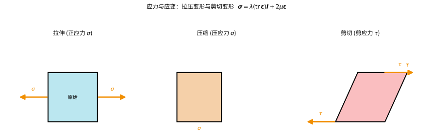

# 第119级 连续介质力学

## 学习目标

1. 理解连续介质假设的基本思想及其适用范围
2. 掌握变形梯度与各种应变张量的定义及其几何意义
3. 理解Cauchy应力张量、Piola-Kirchhoff应力张量的物理意义
4. 掌握守恒律（质量、动量、能量）在连续介质中的数学表述
5. 理解本构方程的基本原理及各向同性材料的表示定理
6. 掌握超弹性材料的本构关系及其热力学基础

---

## 核心概念

### 连续介质假设

连续介质力学的基本假设是：物质在宏观尺度上可以被视为连续分布的，即物质点填满整个空间区域，而物理量（密度、速度、应力等）是空间位置和时间的连续（或分段连续）函数。这一假设在分子平均自由程远小于特征尺度时成立。

### 变形梯度

设参考构型中物质点的位置为 $\boldsymbol{X}$，当前构型中的位置为 $\boldsymbol{x} = \boldsymbol{\varphi}(\boldsymbol{X}, t)$，则**变形梯度**定义为：

$$\boldsymbol{F} = \frac{\partial \boldsymbol{\varphi}}{\partial \boldsymbol{X}} = \nabla_{\boldsymbol{X}} \boldsymbol{\varphi}, \quad F_{iA} = \frac{\partial x_i}{\partial X_A}$$

变形梯度是一个二阶张量，包含了变形和刚体转动的一切信息。

> **直观理解（现实类比）**：把一块方形海绵画上均匀的方格网格，再用力把右端往上掰弯，网格就从"规整的方格"变成"弯曲的梯形碗"。原来每个小方格如何被拉伸、倾斜、旋转，就对应着变形梯度 $\boldsymbol{F}$ 在各点的取值——它是描述"海绵内部每一小片如何变形"的完整说明书。

### 应变张量

- **右Cauchy-Green变形张量**：$\boldsymbol{C} = \boldsymbol{F}^T \boldsymbol{F}$
- **左Cauchy-Green变形张量**：$\boldsymbol{b} = \boldsymbol{F} \boldsymbol{F}^T$
- **Green-Lagrange应变张量**：$\boldsymbol{E} = \frac{1}{2}(\boldsymbol{C} - \boldsymbol{I})$
- **无穷小应变张量**：当位移梯度很小时，$\boldsymbol{\varepsilon} = \frac{1}{2}(\nabla \boldsymbol{u} + (\nabla \boldsymbol{u})^T)$

### 应力张量

- **Cauchy应力张量** $\boldsymbol{\sigma}$：当前构型中的真实应力（单位：力/当前面积）
- **第一Piola-Kirchhoff应力张量** $\boldsymbol{P}$：力参考当前构型，面积参考参考构型，$\boldsymbol{P} = J \boldsymbol{\sigma} \boldsymbol{F}^{-T}$，其中 $J = \det \boldsymbol{F}$
- **第二Piola-Kirchhoff应力张量** $\boldsymbol{S}$：完全参考参考构型，$\boldsymbol{S} = \boldsymbol{F}^{-1} \boldsymbol{P} = J \boldsymbol{F}^{-1} \boldsymbol{\sigma} \boldsymbol{F}^{-T}$

### 守恒律

- **质量守恒**：$\dot{\rho} + \rho \nabla \cdot \boldsymbol{v} = 0$
- **动量守恒（Cauchy第一运动定律）**：$\nabla \cdot \boldsymbol{\sigma} + \rho \boldsymbol{b} = \rho \dot{\boldsymbol{v}}$
- **能量守恒（第一定律）**：$\rho \dot{e} = \boldsymbol{\sigma} : \boldsymbol{d} - \nabla \cdot \boldsymbol{q} + \rho r$

### 本构方程

本构方程描述材料对应力的响应，是联系应力与变形的物理关系。

### 材料分类

- **弹性**：应力仅取决于当前变形状态
- **塑性**：存在不可逆变形
- **粘弹性**：兼具弹性与粘性特征
- **超弹性**：存在应变能函数，应力由应变能导出

---

## 定理与证明

### 定理1：Cauchy应力张量的存在性（Cauchy定理）

**定理**：在连续介质中，若存在体力密度 $\boldsymbol{b}$ 和面力密度 $\boldsymbol{t}(\boldsymbol{n})$，且面力满足动量平衡，则存在一个对称的二阶张量场 $\boldsymbol{\sigma}$，使得对于任意方向 $\boldsymbol{n}$，有：

$$\boldsymbol{t}(\boldsymbol{n}) = \boldsymbol{\sigma} \cdot \boldsymbol{n}$$

其中 $\boldsymbol{\sigma}$ 称为Cauchy应力张量，且 $\boldsymbol{\sigma} = \boldsymbol{\sigma}^T$。

**证明**（四面体论证）：

考虑一个无穷小四面体，其三个面分别垂直于坐标轴 $x_1, x_2, x_3$，斜面法向为 $\boldsymbol{n}$。设四面体顶点在原点，斜面面积为 $\Delta S$，三个坐标面的面积分别为 $\Delta S_1, \Delta S_2, \Delta S_3$。

由几何关系，$\Delta S_i = n_i \Delta S$，其中 $n_i$ 是 $\boldsymbol{n}$ 的分量。

**步骤1：面力平衡**

四面体受到三种力的作用：体力、三个坐标面上的面力、斜面上的面力。设四面体体积为 $\Delta V$，体力密度为 $\boldsymbol{b}$。

由牛顿第二定律（动量平衡）：

$$\boldsymbol{t}(\boldsymbol{n}) \Delta S + \sum_{i=1}^{3} \boldsymbol{t}(-\boldsymbol{e}_i) \Delta S_i + \rho \boldsymbol{b} \Delta V = \rho \boldsymbol{a} \Delta V$$

其中 $\boldsymbol{t}(-\boldsymbol{e}_i)$ 是法向为 $-\boldsymbol{e}_i$ 的面上的面力。

**步骤2：利用作用力与反作用力**

由牛顿第三定律，$\boldsymbol{t}(-\boldsymbol{e}_i) = -\boldsymbol{t}(\boldsymbol{e}_i)$。

代入得：

$$\boldsymbol{t}(\boldsymbol{n}) \Delta S - \sum_{i=1}^{3} \boldsymbol{t}(\boldsymbol{e}_i) n_i \Delta S + \rho \boldsymbol{b} \Delta V = \rho \boldsymbol{a} \Delta V$$

**步骤3：取极限**

四面体缩至一点时，$\Delta V \sim O(h^3)$，$\Delta S \sim O(h^2)$，其中 $h$ 为特征尺寸。当 $h \to 0$ 时，体积项相比面积项为高阶小量，因此：

$$\boldsymbol{t}(\boldsymbol{n}) = \sum_{i=1}^{3} \boldsymbol{t}(\boldsymbol{e}_i) n_i$$

**步骤4：定义应力张量**

定义 $\sigma_{ij}$ 为作用在法向为 $\boldsymbol{e}_i$ 的面上的面力在 $j$ 方向的分量，即：

$$\boldsymbol{t}(\boldsymbol{e}_i) = \sigma_{ij} \boldsymbol{e}_j$$

则：

$$\boldsymbol{t}(\boldsymbol{n}) = \sum_{i=1}^{3} \sum_{j=1}^{3} \sigma_{ij} n_i \boldsymbol{e}_j = \boldsymbol{\sigma} \cdot \boldsymbol{n}$$

其中 $\boldsymbol{\sigma} = \sigma_{ij} \boldsymbol{e}_i \otimes \boldsymbol{e}_j$。

**步骤5：对称性证明**

由角动量守恒（Cauchy第二运动定律），可以证明 $\boldsymbol{\sigma} = \boldsymbol{\sigma}^T$，即 $\sigma_{ij} = \sigma_{ji}$。考虑一个无穷小体积元上的力矩平衡即可得到这一结果。

这就完成了Cauchy应力张量存在性的证明。$\square$

---

### 定理2：变形梯度与应变张量的关系（极分解）

**定理**：任意非奇异的变形梯度 $\boldsymbol{F}$（$\det \boldsymbol{F} > 0$）可以唯一地分解为：

$$\boldsymbol{F} = \boldsymbol{R} \boldsymbol{U} = \boldsymbol{V} \boldsymbol{R}$$

其中 $\boldsymbol{R}$ 是正交张量（$\boldsymbol{R}^T \boldsymbol{R} = \boldsymbol{I}$，代表刚体转动），$\boldsymbol{U}$ 和 $\boldsymbol{V}$ 是对称正定张量（分别称为右和左伸长张量）。

**证明**：

**步骤1：构造对称正定张量**

考虑右Cauchy-Green变形张量 $\boldsymbol{C} = \boldsymbol{F}^T \boldsymbol{F}$。它是一个对称正定张量，因为对于任意非零向量 $\boldsymbol{v}$：

$$\boldsymbol{v}^T \boldsymbol{C} \boldsymbol{v} = \boldsymbol{v}^T \boldsymbol{F}^T \boldsymbol{F} \boldsymbol{v} = \|\boldsymbol{F} \boldsymbol{v}\|^2 > 0$$

（$\boldsymbol{F} \boldsymbol{v} \neq \boldsymbol{0}$ 因为 $\det \boldsymbol{F} \neq 0$。）

**步骤2：定义伸长张量**

由对称正定张量的谱定理，$\boldsymbol{C}$ 可以正交对角化：

$$\boldsymbol{C} = \sum_{i=1}^{3} \lambda_i^2 \boldsymbol{N}_i \otimes \boldsymbol{N}_i$$

其中 $\lambda_i > 0$ 是主伸长比，$\boldsymbol{N}_i$ 是正交的单位特征向量。

定义右伸长张量：

$$\boldsymbol{U} = \sqrt{\boldsymbol{C}} = \sum_{i=1}^{3} \lambda_i \boldsymbol{N}_i \otimes \boldsymbol{N}_i$$

显然 $\boldsymbol{U}$ 是对称正定的，且 $\boldsymbol{U}^2 = \boldsymbol{C}$。

**步骤3：定义转动张量**

定义 $\boldsymbol{R} = \boldsymbol{F} \boldsymbol{U}^{-1}$。验证 $\boldsymbol{R}$ 的正交性：

$$\boldsymbol{R}^T \boldsymbol{R} = (\boldsymbol{U}^{-1})^T \boldsymbol{F}^T \boldsymbol{F} \boldsymbol{U}^{-1} = \boldsymbol{U}^{-1} \boldsymbol{C} \boldsymbol{U}^{-1} = \boldsymbol{U}^{-1} \boldsymbol{U}^2 \boldsymbol{U}^{-1} = \boldsymbol{I}$$

因此 $\boldsymbol{R}$ 是正交张量，且 $\boldsymbol{F} = \boldsymbol{R} \boldsymbol{U}$。

**步骤4：左分解**

类似地，左Cauchy-Green变形张量 $\boldsymbol{b} = \boldsymbol{F} \boldsymbol{F}^T$ 也是对称正定的。定义 $\boldsymbol{V} = \sqrt{\boldsymbol{b}}$，则 $\boldsymbol{V}$ 对称正定，且：

$$\boldsymbol{V} = \boldsymbol{R} \boldsymbol{U} \boldsymbol{R}^T$$

从而 $\boldsymbol{F} = \boldsymbol{V} \boldsymbol{R}$。

**步骤5：唯一性**

若 $\boldsymbol{F} = \boldsymbol{R}_1 \boldsymbol{U}_1 = \boldsymbol{R}_2 \boldsymbol{U}_2$，则 $\boldsymbol{F}^T \boldsymbol{F} = \boldsymbol{U}_1^2 = \boldsymbol{U}_2^2$。由对称正定矩阵平方根的唯一性，$\boldsymbol{U}_1 = \boldsymbol{U}_2$，进而 $\boldsymbol{R}_1 = \boldsymbol{R}_2$。唯一性得证。

**应变张量与变形梯度的关系**：

Green-Lagrange应变张量 $\boldsymbol{E}$ 与 $\boldsymbol{U}$ 的关系为：

$$\boldsymbol{E} = \frac{1}{2}(\boldsymbol{C} - \boldsymbol{I}) = \frac{1}{2}(\boldsymbol{U}^2 - \boldsymbol{I})$$

这表明 $\boldsymbol{E}$ 完全由伸长张量 $\boldsymbol{U}$ 决定，不受刚体转动 $\boldsymbol{R}$ 的影响，这正是应变度量应满足的基本要求。$\square$

---

### 定理3：运动方程（Cauchy第一运动定律）

**定理**：对于连续介质体，动量守恒定律等价于：

$$\nabla \cdot \boldsymbol{\sigma} + \rho \boldsymbol{b} = \rho \dot{\boldsymbol{v}}$$

其中 $\boldsymbol{\sigma}$ 是Cauchy应力张量，$\boldsymbol{b}$ 是体力密度，$\rho$ 是密度，$\boldsymbol{v}$ 是速度场，$\dot{\boldsymbol{v}} = \frac{D\boldsymbol{v}}{Dt}$ 是物质加速度。

**证明**：

**步骤1：动量守恒的积分形式**

对于任意物质体积 $\Omega(t)$，其动量 $ \boldsymbol{P}(t) = \int_{\Omega(t)} \rho \boldsymbol{v} \, dV $。动量守恒定律指出：动量的物质时间导数等于作用于该体积上的所有外力之和：

$$\frac{D}{Dt} \int_{\Omega(t)} \rho \boldsymbol{v} \, dV = \int_{\Omega(t)} \rho \boldsymbol{b} \, dV + \int_{\partial \Omega(t)} \boldsymbol{t} \, dS$$

其中 $\boldsymbol{t} = \boldsymbol{\sigma} \cdot \boldsymbol{n}$ 是面力。

**步骤2：利用Reynolds输运定理**

由Reynolds输运定理，对于任意张量场 $\boldsymbol{\phi}$：

$$\frac{D}{Dt} \int_{\Omega(t)} \rho \boldsymbol{\phi} \, dV = \int_{\Omega(t)} \rho \frac{D\boldsymbol{\phi}}{Dt} \, dV$$

应用此定理于 $\boldsymbol{\phi} = \boldsymbol{v}$：

$$\frac{D}{Dt} \int_{\Omega(t)} \rho \boldsymbol{v} \, dV = \int_{\Omega(t)} \rho \dot{\boldsymbol{v}} \, dV$$

**步骤3：将面力转化为体积分**

由Cauchy定理，$\boldsymbol{t} = \boldsymbol{\sigma} \cdot \boldsymbol{n}$。应用散度定理：

$$\int_{\partial \Omega(t)} \boldsymbol{\sigma} \cdot \boldsymbol{n} \, dS = \int_{\Omega(t)} \nabla \cdot \boldsymbol{\sigma} \, dV$$

**步骤4：代入并利用体积分的任意性**

将以上结果代入动量守恒方程：

$$\int_{\Omega(t)} \rho \dot{\boldsymbol{v}} \, dV = \int_{\Omega(t)} \rho \boldsymbol{b} \, dV + \int_{\Omega(t)} \nabla \cdot \boldsymbol{\sigma} \, dV$$

即：

$$\int_{\Omega(t)} (\nabla \cdot \boldsymbol{\sigma} + \rho \boldsymbol{b} - \rho \dot{\boldsymbol{v}}) \, dV = \boldsymbol{0}$$

由于 $\Omega(t)$ 是任意物质体积，被积函数必须处处为零，因此：

$$\nabla \cdot \boldsymbol{\sigma} + \rho \boldsymbol{b} = \rho \dot{\boldsymbol{v}}$$

这就是Cauchy第一运动定律（局部动量守恒方程）。$\square$

---

### 定理4：本构方程的各向同性表示

**定理**（各向同性张量函数表示定理）：对于各向同性弹性材料，Cauchy应力 $\boldsymbol{\sigma}$ 可以表示为左Cauchy-Green变形张量 $\boldsymbol{b}$ 的各向同性张量函数。具体地，存在一个各向同性函数 $\mathcal{G}$，使得 $\boldsymbol{\sigma} = \mathcal{G}(\boldsymbol{b})$，且 $\boldsymbol{\sigma}$ 可以表示为 $\boldsymbol{b}$ 的多项式形式：

$$\boldsymbol{\sigma} = \alpha_0 \boldsymbol{I} + \alpha_1 \boldsymbol{b} + \alpha_2 \boldsymbol{b}^2$$

其中 $\alpha_0, \alpha_1, \alpha_2$ 是 $\boldsymbol{b}$ 的三个主不变量 $I_1, I_2, I_3$ 的标量函数。

**证明**：

**步骤1：各向同性的定义**

材料是各向同性的，意味着本构关系在所有正交变换下形式不变。即对于任意正交张量 $\boldsymbol{Q}$：

$$\boldsymbol{Q} \boldsymbol{\sigma} \boldsymbol{Q}^T = \mathcal{G}(\boldsymbol{Q} \boldsymbol{b} \boldsymbol{Q}^T)$$

即 $\mathcal{G}$ 是各向同性张量函数。

**步骤2：Cayley-Hamilton定理**

对于任意二阶对称张量 $\boldsymbol{b}$，Cayley-Hamilton定理指出：

$$\boldsymbol{b}^3 - I_1 \boldsymbol{b}^2 + I_2 \boldsymbol{b} - I_3 \boldsymbol{I} = \boldsymbol{0}$$

其中 $I_1 = \text{tr}(\boldsymbol{b})$，$I_2 = \frac{1}{2}[(\text{tr}(\boldsymbol{b}))^2 - \text{tr}(\boldsymbol{b}^2)]$，$I_3 = \det(\boldsymbol{b})$ 是 $\boldsymbol{b}$ 的主不变量。

**步骤3：张量函数的一般表示**

由各向同性张量函数的表示定理，$\boldsymbol{\sigma} = \mathcal{G}(\boldsymbol{b})$ 可以表示为 $\boldsymbol{I}, \boldsymbol{b}, \boldsymbol{b}^2$ 的线性组合，系数为不变量 $I_1, I_2, I_3$ 的函数。这是因为：

- $\boldsymbol{\sigma}$ 与 $\boldsymbol{b}$ 同轴（有相同的特征向量方向）
- $\boldsymbol{\sigma}$ 的特征值 $\sigma_i$ 是 $\boldsymbol{b}$ 的特征值 $b_i$ 的函数
- 对称函数 $\sigma_i = f(b_i)$ 可以由三个标量不变量参数化

**步骤4：构造证明**

设 $\boldsymbol{b}$ 的特征值为 $\lambda_1^2, \lambda_2^2, \lambda_3^2$，对应的特征向量为 $\boldsymbol{v}_1, \boldsymbol{v}_2, \boldsymbol{v}_3$。由于各向同性，$\boldsymbol{\sigma}$ 与 $\boldsymbol{b}$ 同轴，因此 $\boldsymbol{v}_i$ 也是 $\boldsymbol{\sigma}$ 的特征向量。设 $\boldsymbol{\sigma}$ 的特征值为 $\sigma_1, \sigma_2, \sigma_3$。

由对称性，$\sigma_i$ 必须是 $\lambda_j^2$ 的对称函数，因而可以表示为 $I_1, I_2, I_3$ 的函数。

考虑 $\boldsymbol{\sigma}$ 在 $\boldsymbol{I}, \boldsymbol{b}, \boldsymbol{b}^2$ 张成的空间中的投影。由于对称张量的空间是三维的，而 $\boldsymbol{I}, \boldsymbol{b}, \boldsymbol{b}^2$ 线性无关（当 $\boldsymbol{b}$ 具有不同的特征值时），它们构成一组基。

利用Cayley-Hamilton定理，$\boldsymbol{b}^n$（$n \geq 3$）均可表示为 $\boldsymbol{I}, \boldsymbol{b}, \boldsymbol{b}^2$ 的线性组合，因此任意各向同性张量函数都存在上述表示。

**步骤5：确定系数**

因此存在标量函数 $\alpha_0(I_1, I_2, I_3), \alpha_1(I_1, I_2, I_3), \alpha_2(I_1, I_2, I_3)$ 使得：

$$\boldsymbol{\sigma} = \alpha_0 \boldsymbol{I} + \alpha_1 \boldsymbol{b} + \alpha_2 \boldsymbol{b}^2$$

这就是各向同性弹性材料最一般的本构表示。$\square$

---

### 定理5：超弹性材料的本构关系

**定理**：对于超弹性材料，存在一个应变能函数 $\Psi = \Psi(\boldsymbol{F})$（或 $\Psi = \Psi(\boldsymbol{C})$），使得第二Piola-Kirchhoff应力 $\boldsymbol{S}$ 由下式给出：

$$\boldsymbol{S} = 2 \frac{\partial \Psi}{\partial \boldsymbol{C}}$$

或等价地，第一Piola-Kirchhoff应力 $\boldsymbol{P} = \frac{\partial \Psi}{\partial \boldsymbol{F}}$。并且，由Clausius-Duhem不等式（热力学第二定律）可以推导出这一关系是热力学相容的。

**证明**：

**步骤1：Clausius-Duhem不等式**

热力学第二定律的局部形式（Clausius-Duhem不等式）为：

$$\rho \dot{\eta} + \nabla \cdot \left(\frac{\boldsymbol{q}}{\theta}\right) - \frac{\rho r}{\theta} \geq 0$$

其中 $\eta$ 是比熵，$\theta$ 是绝对温度，$\boldsymbol{q}$ 是热流，$r$ 是热源。

**步骤2：引入Helmholtz自由能**

定义Helmholtz自由能 $\psi = e - \theta \eta$，其中 $e$ 是比内能。代入能量守恒方程和Clausius-Duhem不等式，经过化简可得（在等温条件下）：

$$\boldsymbol{P} : \dot{\boldsymbol{F}} - \rho_0 \dot{\psi} \geq 0$$

其中 $\rho_0$ 是参考构型密度，$\boldsymbol{P}$ 是第一Piola-Kirchhoff应力。

**步骤3：超弹性假设**

超弹性材料假设存在一个应变能函数 $\Psi = \rho_0 \psi$，它仅依赖于变形梯度：

$$\Psi = \Psi(\boldsymbol{F})$$

则 $\dot{\Psi} = \frac{\partial \Psi}{\partial \boldsymbol{F}} : \dot{\boldsymbol{F}}$。

**步骤4：代入耗散不等式**

将 $\dot{\Psi}$ 代入Clausius-Duhem不等式：

$$\left(\boldsymbol{P} - \frac{\partial \Psi}{\partial \boldsymbol{F}}\right) : \dot{\boldsymbol{F}} \geq 0$$

**步骤5：论证任意性**

由于 $\dot{\boldsymbol{F}}$ 可以是任意值（变形可以是任意的），要使不等式对所有可能的变形过程都成立，括号内的项必须为零：

$$\boldsymbol{P} = \frac{\partial \Psi}{\partial \boldsymbol{F}}$$

**步骤6：用第二Piola-Kirchhoff应力表示**

由 $\boldsymbol{S}$ 与 $\boldsymbol{P}$ 的关系 $\boldsymbol{P} = \boldsymbol{F} \boldsymbol{S}$，以及 $\boldsymbol{C} = \boldsymbol{F}^T \boldsymbol{F}$，可得：

$$\boldsymbol{S} = 2 \frac{\partial \Psi}{\partial \boldsymbol{C}}$$

这就证明了超弹性材料的本构关系由应变能函数导出，且满足热力学第二定律。$\square$

---

## 示例

### 示例1：线性弹性材料的应力-应变关系

**问题**：对于各向同性线性弹性材料，给出其应力-应变关系，并用Lamé常数表示。

**解答**：

各向同性线性弹性材料的本构方程为广义Hooke定律：

$$\boldsymbol{\sigma} = \lambda (\text{tr} \boldsymbol{\varepsilon}) \boldsymbol{I} + 2\mu \boldsymbol{\varepsilon}$$

其中 $\lambda$ 和 $\mu$ 是Lamé常数，$\boldsymbol{\varepsilon} = \frac{1}{2}(\nabla \boldsymbol{u} + (\nabla \boldsymbol{u})^T)$ 是无穷小应变张量。

分量形式：

$$\sigma_{ij} = \lambda \varepsilon_{kk} \delta_{ij} + 2\mu \varepsilon_{ij}$$

也可用工程常数表示：

$$\boldsymbol{\varepsilon} = \frac{1+\nu}{E} \boldsymbol{\sigma} - \frac{\nu}{E} (\text{tr} \boldsymbol{\sigma}) \boldsymbol{I}$$

其中 $E$ 是杨氏模量，$\nu$ 是泊松比，关系为：

$$\lambda = \frac{E\nu}{(1+\nu)(1-2\nu)}, \quad \mu = \frac{E}{2(1+\nu)}$$

**物理意义**：该关系表明，各向同性线性弹性材料的应力包含两部分——体积变形部分（$\lambda$项）和剪切变形部分（$\mu$项）。

> **直观理解（现实类比）**：拉一根橡皮筋，它会变细变长（拉伸）；压一块海绵，它会变矮变肥（压缩）；而两手捏住一块豆腐上下错开，它会被"搓"成平行四边形（剪切）。应力就是"单位面积上的力"，应变就是"单位尺度的变形量"，它们就像价格与销量——应力驱动材料发生与之成正比的应变，这正是 Hooke 定律的直观含义。

### 示例2：Neo-Hookean超弹性材料

**问题**：给出不可压缩Neo-Hookean材料的应变能函数和应力表达式。

**解答**：

不可压缩Neo-Hookean材料的应变能函数为：

$$\Psi = \frac{\mu}{2} (I_1 - 3)$$

其中 $\mu$ 是剪切模量，$I_1 = \text{tr}(\boldsymbol{C}) = \text{tr}(\boldsymbol{b})$ 是右Cauchy-Green变形张量的第一主不变量。不可压缩条件 $\det \boldsymbol{F} = 1$ 意味着 $I_3 = 1$。

**Cauchy应力表达式**：

$$\boldsymbol{\sigma} = -p \boldsymbol{I} + \mu \boldsymbol{b}$$

其中 $p$ 是由不可压缩条件确定的静水压力（Lagrange乘子）。

**推导**：

由超弹性材料的本构关系：

$$\boldsymbol{S} = 2 \frac{\partial \Psi}{\partial \boldsymbol{C}} = \mu \boldsymbol{I}$$

其中利用了 $\frac{\partial I_1}{\partial \boldsymbol{C}} = \boldsymbol{I}$。

对于不可压缩材料，需引入约束条件 $\det \boldsymbol{F} = 1$，通过Lagrange乘子 $p$ 修正应力：

$$\boldsymbol{S} = -p \boldsymbol{C}^{-1} + \mu \boldsymbol{I}$$

通过Piola变换得到Cauchy应力：

$$\boldsymbol{\sigma} = \frac{1}{J} \boldsymbol{F} \boldsymbol{S} \boldsymbol{F}^T = -p \boldsymbol{I} + \mu \boldsymbol{b}$$

**应用**：Neo-Hookean模型广泛应用于橡胶类材料和大变形弹性体的模拟，尤其适用于描述中等变形行为。

---

## 习题

### 习题1

证明：对于任意变形梯度 $\boldsymbol{F}$，Green-Lagrange应变张量 $\boldsymbol{E}$ 在刚体运动（$\boldsymbol{F} = \boldsymbol{R}$，$\boldsymbol{R}^T\boldsymbol{R} = \boldsymbol{I}$）下为零。

**提示**：直接代入 $\boldsymbol{E} = \frac{1}{2}(\boldsymbol{F}^T \boldsymbol{F} - \boldsymbol{I})$ 并利用 $\boldsymbol{R}^T\boldsymbol{R} = \boldsymbol{I}$。

---

### 习题2

考虑一个简单剪切变形：$\boldsymbol{x} = (X_1 + \gamma X_2, X_2, X_3)$，其中 $\gamma$ 是剪切量。计算：
1. 变形梯度 $\boldsymbol{F}$
2. 右Cauchy-Green变形张量 $\boldsymbol{C}$
3. Green-Lagrange应变张量 $\boldsymbol{E}$
4. 无穷小应变张量 $\boldsymbol{\varepsilon}$（当 $\gamma \ll 1$ 时）

**提示**：分别计算 $\boldsymbol{F} = \partial \boldsymbol{x}/\partial \boldsymbol{X}$，然后按定义计算各张量。

---

### 习题3

利用Cauchy第一运动定律，推导Navier-Stokes方程（假设牛顿流体本构 $\boldsymbol{\sigma} = -p\boldsymbol{I} + 2\mu \boldsymbol{d}$，其中 $\boldsymbol{d}$ 是变形率张量）。

**提示**：将本构方程代入 $\nabla \cdot \boldsymbol{\sigma} + \rho \boldsymbol{b} = \rho \dot{\boldsymbol{v}}$，并利用不可压缩条件 $\nabla \cdot \boldsymbol{v} = 0$。

---

### 习题4

证明：对于各向同性线弹性材料，应变能密度函数为：

$$\Psi = \frac{1}{2} \lambda (\text{tr} \boldsymbol{\varepsilon})^2 + \mu \boldsymbol{\varepsilon} : \boldsymbol{\varepsilon}$$

**提示**：利用 $\boldsymbol{\sigma} = \partial \Psi / \partial \boldsymbol{\varepsilon}$ 和广义Hooke定律进行积分。

---

### 习题5

对于Mooney-Rivlin超弹性材料，应变能函数为：

$$\Psi = C_1 (I_1 - 3) + C_2 (I_2 - 3)$$

推导不可压缩Mooney-Rivlin材料的Cauchy应力表达式。

**提示**：利用 $\frac{\partial I_2}{\partial \boldsymbol{C}} = I_1 \boldsymbol{I} - \boldsymbol{C}$，然后按照与Neo-Hookean类似的方法推导。

---

## 总结

在本级中，我们学习了连续介质力学的基本框架：

1. **连续介质假设**奠定了将物质视为连续体的理论基础，使得物理量可以用连续函数描述。

2. **变形几何学**引入了变形梯度 $\boldsymbol{F}$ 作为基本变形度量，通过极分解揭示了变形的伸长和转动成分。各种应变张量（Green-Lagrange、无穷小应变等）提供了在不同变形程度下度量应变的工具。

3. **应力理论**通过Cauchy定理证明了应力张量的存在性，建立了面力与应力张量之间的线性关系。Cauchy应力、第一/第二Piola-Kirchhoff应力分别在不同构型下描述内力分布。

4. **守恒律**构成了连续介质力学的动力学基础：质量守恒、动量守恒（Cauchy第一运动定律）和能量守恒分别给出了密度演化、运动方程和热力学第一定律的数学表达。

5. **本构理论**提供了材料特定行为的数学描述。各向同性表示定理简化了本构函数的形式，超弹性材料的Clausius-Duhem分析则建立了热力学相容的本构关系。

这些知识构成了现代连续介质力学的基础，广泛应用于固体力学、流体力学、生物力学和地球科学等领域，是连接材料微观结构与宏观力学行为的桥梁。