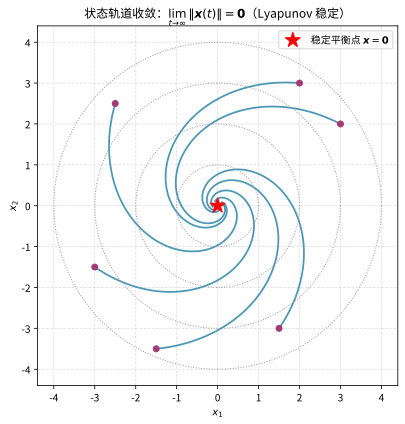

# 第121级 控制论

## 学习目标

1. 理解状态空间模型和传递函数两种系统描述方法
2. 掌握可控性和可观性的概念及其判据
3. 理解Lyapunov稳定性理论及其在系统分析中的应用
4. 掌握线性二次型调节器（LQR）的最优控制设计
5. 理解Pontryagin极大值原理及其在最优控制中的应用
6. 了解Kalman滤波、鲁棒控制等高级控制方法

---

## 核心概念

### 状态空间模型

线性时不变系统的状态空间表示为：

$$\dot{\boldsymbol{x}}(t) = \boldsymbol{A} \boldsymbol{x}(t) + \boldsymbol{B} \boldsymbol{u}(t)$$
$$\boldsymbol{y}(t) = \boldsymbol{C} \boldsymbol{x}(t) + \boldsymbol{D} \boldsymbol{u}(t)$$

其中 $\boldsymbol{x} \in \mathbb{R}^n$ 是状态向量，$\boldsymbol{u} \in \mathbb{R}^m$ 是控制输入，$\boldsymbol{y} \in \mathbb{R}^p$ 是输出，$\boldsymbol{A}, \boldsymbol{B}, \boldsymbol{C}, \boldsymbol{D}$ 是相应维度的系统矩阵。

> **直观理解（现实类比）**：这就是"恒温空调"的原理——设定温度（设定值 $r$）与室温计读数（传感器输出 $y$）相减得温度差（误差 $e$），空调据此决定制冷或制热（控制器+执行器），室温变化又改换成新的读数送回比较器，如此往复直到室温稳定在设定值。反馈的意义正是"用偏差来消除偏差"。

### 传递函数

传递函数是系统在零初始条件下的输入-输出频域表示：

$$\boldsymbol{G}(s) = \boldsymbol{C}(s\boldsymbol{I} - \boldsymbol{A})^{-1}\boldsymbol{B} + \boldsymbol{D}$$

### 可控性

系统 $(\boldsymbol{A}, \boldsymbol{B})$ 是**可控的**，如果对于任意初始状态 $\boldsymbol{x}_0$ 和任意目标状态 $\boldsymbol{x}_1$，存在一个控制输入 $\boldsymbol{u}(t)$，能在有限时间内将状态从 $\boldsymbol{x}_0$ 驱动到 $\boldsymbol{x}_1$。

### 可观性

系统 $(\boldsymbol{A}, \boldsymbol{C})$ 是**可观的**，如果通过有限时间内的输出 $\boldsymbol{y}(t)$ 和输入 $\boldsymbol{u}(t)$，可以唯一确定初始状态 $\boldsymbol{x}_0$。

### Lyapunov稳定性

- **Lyapunov稳定**：对于任意 $\epsilon > 0$，存在 $\delta > 0$，使得当 $\|\boldsymbol{x}(0)\| < \delta$ 时，对所有 $t \geq 0$ 有 $\|\boldsymbol{x}(t)\| < \epsilon$
- **渐近稳定**：系统是Lyapunov稳定的，且 $\lim_{t \to \infty} \|\boldsymbol{x}(t)\| = 0$
- **指数稳定**：存在 $\alpha, \beta > 0$ 使得 $\|\boldsymbol{x}(t)\| \leq \alpha \|\boldsymbol{x}(0)\| e^{-\beta t}$

> **直观理解（现实类比）**：把一个小球放进一只碗里，无论从碗沿哪个位置松手，小球都会沿碗壁越滚越低、来回摆动几次后停在碗底——"碗底"就是稳定平衡点，"滚向碗底"就是状态收敛。只要能量（Lyapunov 函数 $V$）不断减小，系统就必然趋向稳定，这正是稳定性分析的核心思想。

### LQR（线性二次型调节器）

LQR问题寻找最优控制律 $\boldsymbol{u}(t) = -\boldsymbol{K}\boldsymbol{x}(t)$ 最小化二次型性能指标：

$$J = \int_0^\infty (\boldsymbol{x}^T \boldsymbol{Q} \boldsymbol{x} + \boldsymbol{u}^T \boldsymbol{R} \boldsymbol{u}) \, dt$$

其中 $\boldsymbol{Q} \geq 0$，$\boldsymbol{R} > 0$ 是权重矩阵。

### Kalman滤波

Kalman滤波给出线性系统在测量噪声和过程噪声下的最优状态估计，提供最小均方误差意义下的最优估计。

### Pontryagin极大值原理

最优控制的必要条件，给出最优控制 $\boldsymbol{u}^*(t)$ 满足：

$$\mathcal{H}(\boldsymbol{x}^*, \boldsymbol{u}^*, \boldsymbol{\lambda}^*, t) = \max_{\boldsymbol{u}} \mathcal{H}(\boldsymbol{x}^*, \boldsymbol{u}, \boldsymbol{\lambda}^*, t)$$

其中 $\mathcal{H}$ 是Hamiltonian函数。

### HJB方程

动态规划在连续时间最优控制中的核心方程（Hamilton-Jacobi-Bellman方程）：

$$-\frac{\partial V}{\partial t} = \min_{\boldsymbol{u}} \left[ L(\boldsymbol{x}, \boldsymbol{u}) + \frac{\partial V}{\partial \boldsymbol{x}} \cdot f(\boldsymbol{x}, \boldsymbol{u}) \right]$$

---

## 定理与证明

### 定理1：可控性的Kalman秩条件

**定理**：线性时不变系统 $(\boldsymbol{A}, \boldsymbol{B})$（$\boldsymbol{A} \in \mathbb{R}^{n \times n}$，$\boldsymbol{B} \in \mathbb{R}^{n \times m}$）是可控的当且仅当可控性矩阵

$$\mathcal{C} = [\boldsymbol{B}, \boldsymbol{A}\boldsymbol{B}, \boldsymbol{A}^2\boldsymbol{B}, \ldots, \boldsymbol{A}^{n-1}\boldsymbol{B}]$$

满秩，即 $\text{rank}(\mathcal{C}) = n$。

**证明**：

**步骤1：可控性Gramian矩阵**

首先定义可控性Gramian矩阵：

$$\boldsymbol{W}_c(t) = \int_0^t e^{\boldsymbol{A}\tau} \boldsymbol{B} \boldsymbol{B}^T e^{\boldsymbol{A}^T\tau} \, d\tau$$

系统状态在时刻 $t$ 的解为：

$$\boldsymbol{x}(t) = e^{\boldsymbol{A}t} \boldsymbol{x}_0 + \int_0^t e^{\boldsymbol{A}(t-\tau)} \boldsymbol{B} \boldsymbol{u}(\tau) \, d\tau$$

**步骤2：可控性等价于Gramian的可逆性**

系统可控当且仅当对于任意 $t > 0$，$\boldsymbol{W}_c(t)$ 是可逆的。

**充分性（$\Leftarrow$）**：若 $\boldsymbol{W}_c(t)$ 可逆，对任意 $\boldsymbol{x}_0$ 和 $\boldsymbol{x}_1$，构造控制输入：

$$\boldsymbol{u}(\tau) = \boldsymbol{B}^T e^{\boldsymbol{A}^T(t-\tau)} \boldsymbol{W}_c(t)^{-1} (e^{\boldsymbol{A}t} \boldsymbol{x}_1 - \boldsymbol{x}_0)$$

代入状态方程的解可验证 $\boldsymbol{x}(t) = e^{\boldsymbol{A}t} \boldsymbol{x}_1$。

**必要性（$\Rightarrow$）**：若 $\boldsymbol{W}_c(t)$ 奇异，则存在非零向量 $\boldsymbol{v}$ 使得 $\boldsymbol{v}^T \boldsymbol{W}_c(t) \boldsymbol{v} = 0$，即 $\boldsymbol{v}^T e^{\boldsymbol{A}\tau} \boldsymbol{B} = \boldsymbol{0}$ 对所有 $\tau \in [0,t]$ 成立。此时状态沿 $\boldsymbol{v}$ 方向不可控。

**步骤3：Cayley-Hamilton定理的应用**

由Cayley-Hamilton定理，$\boldsymbol{A}^n$ 可以表示为 $\boldsymbol{I}, \boldsymbol{A}, \ldots, \boldsymbol{A}^{n-1}$ 的线性组合。因此，对于任意 $k \geq n$，$\boldsymbol{A}^k$ 是 $\boldsymbol{I}, \boldsymbol{A}, \ldots, \boldsymbol{A}^{n-1}$ 的线性组合。

矩阵指数 $e^{\boldsymbol{A}\tau}$ 可以展开为：

$$e^{\boldsymbol{A}\tau} = \sum_{k=0}^{\infty} \frac{\tau^k}{k!} \boldsymbol{A}^k = \sum_{j=0}^{n-1} \alpha_j(\tau) \boldsymbol{A}^j$$

其中 $\alpha_j(\tau)$ 是 $\tau$ 的解析函数。

**步骤4：Gramian与可控性矩阵的关系**

$$\boldsymbol{v}^T e^{\boldsymbol{A}\tau} \boldsymbol{B} = \sum_{j=0}^{n-1} \alpha_j(\tau) \boldsymbol{v}^T \boldsymbol{A}^j \boldsymbol{B} = \boldsymbol{0}, \quad \forall \tau \in [0,t]$$

由于 $\alpha_j(\tau)$ 是线性无关的函数（因为它们是不同模态的响应），上式对所有 $\tau$ 成立当且仅当：

$$\boldsymbol{v}^T \boldsymbol{A}^j \boldsymbol{B} = \boldsymbol{0}, \quad j = 0, 1, \ldots, n-1$$

即 $\boldsymbol{v}^T \mathcal{C} = \boldsymbol{0}$。

**步骤5：秩条件**

因此，$\boldsymbol{W}_c(t)$ 奇异当且仅当存在非零 $\boldsymbol{v}$ 使得 $\boldsymbol{v}^T \mathcal{C} = \boldsymbol{0}$，即 $\mathcal{C}$ 行不满秩（$\text{rank}(\mathcal{C}) < n$）。

所以系统可控 $\iff$ $\boldsymbol{W}_c(t)$ 可逆 $\iff$ $\text{rank}(\mathcal{C}) = n$。

这就完成了Kalman秩条件的证明。$\square$

---

### 定理2：可观性的对偶原理

**定理**：系统 $(\boldsymbol{A}, \boldsymbol{C})$ 是可观的当且仅当其对偶系统 $(\boldsymbol{A}^T, \boldsymbol{C}^T)$ 是可控的。等价地，可观性矩阵

$$\mathcal{O} = \begin{bmatrix} \boldsymbol{C} \\ \boldsymbol{C}\boldsymbol{A} \\ \boldsymbol{C}\boldsymbol{A}^2 \\ \vdots \\ \boldsymbol{C}\boldsymbol{A}^{n-1} \end{bmatrix}$$

满秩，即 $\text{rank}(\mathcal{O}) = n$。

**证明**：

**步骤1：可观性定义**

系统 $(\boldsymbol{A}, \boldsymbol{C})$ 是可观的，如果对于任意初始状态 $\boldsymbol{x}_0$，通过零输入响应 $\boldsymbol{y}(t) = \boldsymbol{C} e^{\boldsymbol{A}t} \boldsymbol{x}_0$ 可以唯一确定 $\boldsymbol{x}_0$。

**步骤2：转化为可控性问题**

考虑对偶系统：

$$\dot{\boldsymbol{z}}(t) = \boldsymbol{A}^T \boldsymbol{z}(t) + \boldsymbol{C}^T \boldsymbol{v}(t)$$

对偶系统 $(\boldsymbol{A}^T, \boldsymbol{C}^T)$ 的可控性要求对任意初始状态 $\boldsymbol{z}_0$，存在控制 $\boldsymbol{v}(t)$ 将其驱动到任意目标状态。

**步骤3：可观性Gramian**

定义可观性Gramian矩阵：

$$\boldsymbol{W}_o(t) = \int_0^t e^{\boldsymbol{A}^T\tau} \boldsymbol{C}^T \boldsymbol{C} e^{\boldsymbol{A}\tau} \, d\tau$$

系统可观当且仅当 $\boldsymbol{W}_o(t)$ 可逆（类似可控性的论证）。

**步骤4：对偶关系**

注意到 $\boldsymbol{W}_o(t)$ 正是对偶系统的可控性Gramian：

$$\boldsymbol{W}_o(t) = \int_0^t e^{\boldsymbol{A}^T\tau} \boldsymbol{C}^T \boldsymbol{C} e^{\boldsymbol{A}\tau} \, d\tau = \int_0^t e^{\boldsymbol{A}^T\tau} \boldsymbol{C}^T (\boldsymbol{C}^T)^T e^{\boldsymbol{A}\tau} \, d\tau$$

因此，$(\boldsymbol{A}, \boldsymbol{C})$ 可观 $\iff$ $\boldsymbol{W}_o(t)$ 可逆 $\iff$ $(\boldsymbol{A}^T, \boldsymbol{C}^T)$ 可控。

**步骤5：可观性秩条件**

由对偶原理和可控性Kalman秩条件，$(\boldsymbol{A}^T, \boldsymbol{C}^T)$ 可控当且仅当：

$$\text{rank}([\boldsymbol{C}^T, \boldsymbol{A}^T \boldsymbol{C}^T, (\boldsymbol{A}^T)^2 \boldsymbol{C}^T, \ldots, (\boldsymbol{A}^T)^{n-1} \boldsymbol{C}^T]) = n$$

转置后即得：

$$\text{rank}\left(\begin{bmatrix} \boldsymbol{C} \\ \boldsymbol{C}\boldsymbol{A} \\ \boldsymbol{C}\boldsymbol{A}^2 \\ \vdots \\ \boldsymbol{C}\boldsymbol{A}^{n-1} \end{bmatrix}\right) = n$$

这就是可观性的Kalman秩条件。$\square$

---

### 定理3：Lyapunov稳定性定理

**定理**：考虑自治系统 $\dot{\boldsymbol{x}} = \boldsymbol{f}(\boldsymbol{x})$，其中 $\boldsymbol{f}(\boldsymbol{0}) = \boldsymbol{0}$。如果存在一个标量函数 $V(\boldsymbol{x})$（称为Lyapunov函数）满足：

1. $V(\boldsymbol{x})$ 正定：$V(\boldsymbol{0}) = 0$，且对 $\boldsymbol{x} \neq \boldsymbol{0}$ 有 $V(\boldsymbol{x}) > 0$
2. $\dot{V}(\boldsymbol{x}) = \nabla V(\boldsymbol{x}) \cdot \boldsymbol{f}(\boldsymbol{x})$ 半负定：$\dot{V}(\boldsymbol{x}) \leq 0$

则原点 $\boldsymbol{x} = \boldsymbol{0}$ 是Lyapunov稳定的。如果 $\dot{V}(\boldsymbol{x})$ 负定（$\dot{V}(\boldsymbol{x}) < 0$ 对所有 $\boldsymbol{x} \neq \boldsymbol{0}$ 成立），则原点是渐近稳定的。

进一步，由LaSalle不变原理，如果 $\dot{V}(\boldsymbol{x}) \leq 0$，且 $\dot{V}(\boldsymbol{x}) = 0$ 的集合中不包含除 $\boldsymbol{x} = \boldsymbol{0}$ 外的完整轨迹，则原点是渐近稳定的。

**证明**：

**步骤1：Lyapunov稳定性**

给定 $\epsilon > 0$，定义球 $B_\epsilon = \{\boldsymbol{x} : \|\boldsymbol{x}\| \leq \epsilon\}$。由于 $V$ 连续且正定，在球面 $\|\boldsymbol{x}\| = \epsilon$ 上，$V$ 有正的最小值：

$$\alpha = \min_{\|\boldsymbol{x}\| = \epsilon} V(\boldsymbol{x}) > 0$$

由 $V$ 的连续性，存在 $\delta > 0$ 使得当 $\|\boldsymbol{x}\| < \delta$ 时，$V(\boldsymbol{x}) < \alpha$。

**步骤2：稳定性证明**

取初始状态 $\boldsymbol{x}_0$ 满足 $\|\boldsymbol{x}_0\| < \delta$。由于 $\dot{V} \leq 0$，$V(\boldsymbol{x}(t))$ 沿轨迹是递减的，因此：

$$V(\boldsymbol{x}(t)) \leq V(\boldsymbol{x}_0) < \alpha$$

这意味着 $\boldsymbol{x}(t)$ 不能到达球面 $\|\boldsymbol{x}\| = \epsilon$（因为在球面上 $V \geq \alpha$）。因此对所有 $t \geq 0$，$\|\boldsymbol{x}(t)\| < \epsilon$，系统是Lyapunov稳定的。

**步骤3：渐近稳定性（$\dot{V}$ 负定时）**

只需证明 $\lim_{t \to \infty} V(\boldsymbol{x}(t)) = 0$。由于 $V$ 递减且有下界（$V \geq 0$），极限 $c = \lim_{t \to \infty} V(\boldsymbol{x}(t)) \geq 0$ 存在。

假设 $c > 0$。则轨迹被限制在集合 $\Omega = \{\boldsymbol{x} : c \leq V(\boldsymbol{x}) \leq V(\boldsymbol{x}_0)\}$ 中，这是紧集。在 $\Omega$ 上，$\dot{V}$ 负定，因此存在 $\gamma > 0$ 使得 $\dot{V}(\boldsymbol{x}) \leq -\gamma$。

但 $V(\boldsymbol{x}(t)) = V(\boldsymbol{x}_0) + \int_0^t \dot{V}(\boldsymbol{x}(\tau)) \, d\tau \leq V(\boldsymbol{x}_0) - \gamma t \to -\infty$，矛盾。

因此 $c = 0$，从而 $\lim_{t \to \infty} \boldsymbol{x}(t) = \boldsymbol{0}$。

**步骤4：LaSalle不变原理（当 $\dot{V}$ 仅半负定时）**

设 $E = \{\boldsymbol{x} : \dot{V}(\boldsymbol{x}) = 0\}$，$M$ 是 $E$ 中最大的不变集。LaSalle不变原理指出：所有有界轨迹都收敛到 $M$。

如果 $M = \{\boldsymbol{0}\}$，则所有轨迹收敛到原点，原点是渐近稳定的。

**证明LaSalle原理概要**：由于 $V$ 递减且有下界，$\lim_{t \to \infty} V(\boldsymbol{x}(t)) = c$ 存在。轨迹的 $\omega$-极限集 $\omega(\boldsymbol{x}_0)$ 是紧不变集，且在其上 $V$ 恒为常数，因此 $\dot{V} = 0$。故 $\omega(\boldsymbol{x}_0) \subseteq M$。如果 $M = \{\boldsymbol{0}\}$，则所有轨迹收敛到原点。$\square$

---

### 定理4：LQR的最优反馈

**定理**：对于线性时不变系统 $\dot{\boldsymbol{x}} = \boldsymbol{A}\boldsymbol{x} + \boldsymbol{B}\boldsymbol{u}$ 和二次型性能指标

$$J = \int_0^\infty (\boldsymbol{x}^T \boldsymbol{Q} \boldsymbol{x} + \boldsymbol{u}^T \boldsymbol{R} \boldsymbol{u}) \, dt$$

其中 $\boldsymbol{Q} = \boldsymbol{Q}^T \geq 0$，$\boldsymbol{R} = \boldsymbol{R}^T > 0$，$(\boldsymbol{A}, \boldsymbol{B})$ 可控，假设 $(\boldsymbol{A}, \boldsymbol{Q}^{1/2})$ 可观。则最优控制律为线性状态反馈：

$$\boldsymbol{u}^*(t) = -\boldsymbol{K} \boldsymbol{x}(t)$$

其中 $\boldsymbol{K} = \boldsymbol{R}^{-1} \boldsymbol{B}^T \boldsymbol{P}$，$\boldsymbol{P} = \boldsymbol{P}^T \geq 0$ 是代数Riccati方程的唯一正定解：

$$\boldsymbol{A}^T \boldsymbol{P} + \boldsymbol{P} \boldsymbol{A} - \boldsymbol{P} \boldsymbol{B} \boldsymbol{R}^{-1} \boldsymbol{B}^T \boldsymbol{P} + \boldsymbol{Q} = \boldsymbol{0}$$

**证明**：

**步骤1：Hamilton-Jacobi-Bellman方程**

对于无限时域最优控制问题，HJB方程为：

$$-\frac{\partial V}{\partial t} = \min_{\boldsymbol{u}} \left[ \boldsymbol{x}^T \boldsymbol{Q} \boldsymbol{x} + \boldsymbol{u}^T \boldsymbol{R} \boldsymbol{u} + \frac{\partial V}{\partial \boldsymbol{x}} (\boldsymbol{A}\boldsymbol{x} + \boldsymbol{B}\boldsymbol{u}) \right]$$

对于无限时域定常问题，最优值函数 $V(\boldsymbol{x})$ 与时间无关，因此HJB方程简化为：

$$0 = \min_{\boldsymbol{u}} \left[ \boldsymbol{x}^T \boldsymbol{Q} \boldsymbol{x} + \boldsymbol{u}^T \boldsymbol{R} \boldsymbol{u} + \nabla V(\boldsymbol{x})^T (\boldsymbol{A}\boldsymbol{x} + \boldsymbol{B}\boldsymbol{u}) \right]$$

**步骤2：猜测值函数形式**

由于系统是线性的且性能指标是二次的，猜测最优值函数是二次型：

$$V(\boldsymbol{x}) = \boldsymbol{x}^T \boldsymbol{P} \boldsymbol{x}$$

其中 $\boldsymbol{P} = \boldsymbol{P}^T \geq 0$。则 $\nabla V(\boldsymbol{x}) = 2\boldsymbol{P}\boldsymbol{x}$。

**步骤3：求最优控制**

对HJB方程中的被最小化项关于 $\boldsymbol{u}$ 求导：

$$\frac{\partial}{\partial \boldsymbol{u}} [\boldsymbol{x}^T \boldsymbol{Q} \boldsymbol{x} + \boldsymbol{u}^T \boldsymbol{R} \boldsymbol{u} + 2\boldsymbol{x}^T \boldsymbol{P} (\boldsymbol{A}\boldsymbol{x} + \boldsymbol{B}\boldsymbol{u})] = 2\boldsymbol{R}\boldsymbol{u} + 2\boldsymbol{B}^T \boldsymbol{P} \boldsymbol{x} = \boldsymbol{0}$$

解得：

$$\boldsymbol{u}^* = -\boldsymbol{R}^{-1} \boldsymbol{B}^T \boldsymbol{P} \boldsymbol{x} = -\boldsymbol{K} \boldsymbol{x}$$

**步骤4：代入HJB方程得Riccati方程**

将 $\boldsymbol{u}^*$ 和 $V(\boldsymbol{x}) = \boldsymbol{x}^T \boldsymbol{P} \boldsymbol{x}$ 代入HJB方程：

$$\boldsymbol{x}^T \boldsymbol{Q} \boldsymbol{x} + \boldsymbol{x}^T \boldsymbol{P} \boldsymbol{B} \boldsymbol{R}^{-1} \boldsymbol{B}^T \boldsymbol{P} \boldsymbol{x} + 2\boldsymbol{x}^T \boldsymbol{P} \boldsymbol{A} \boldsymbol{x} - 2\boldsymbol{x}^T \boldsymbol{P} \boldsymbol{B} \boldsymbol{R}^{-1} \boldsymbol{B}^T \boldsymbol{P} \boldsymbol{x} = 0$$

化简得：

$$\boldsymbol{x}^T (\boldsymbol{A}^T \boldsymbol{P} + \boldsymbol{P} \boldsymbol{A} - \boldsymbol{P} \boldsymbol{B} \boldsymbol{R}^{-1} \boldsymbol{B}^T \boldsymbol{P} + \boldsymbol{Q}) \boldsymbol{x} = 0$$

由于这对所有 $\boldsymbol{x}$ 成立，括号内的矩阵必须为零：

$$\boldsymbol{A}^T \boldsymbol{P} + \boldsymbol{P} \boldsymbol{A} - \boldsymbol{P} \boldsymbol{B} \boldsymbol{R}^{-1} \boldsymbol{B}^T \boldsymbol{P} + \boldsymbol{Q} = \boldsymbol{0}$$

这就是代数Riccati方程（ARE）。

**步骤5：闭环稳定性**

由 $(\boldsymbol{A}, \boldsymbol{B})$ 可控和 $(\boldsymbol{A}, \boldsymbol{Q}^{1/2})$ 可观的假设，ARE的解 $\boldsymbol{P}$ 是正定的。取 $V(\boldsymbol{x}) = \boldsymbol{x}^T \boldsymbol{P} \boldsymbol{x}$ 作为闭环系统的Lyapunov函数：

$$\dot{V} = \boldsymbol{x}^T (\boldsymbol{A}_{cl}^T \boldsymbol{P} + \boldsymbol{P} \boldsymbol{A}_{cl}) \boldsymbol{x}$$

其中 $\boldsymbol{A}_{cl} = \boldsymbol{A} - \boldsymbol{B}\boldsymbol{K} = \boldsymbol{A} - \boldsymbol{B}\boldsymbol{R}^{-1}\boldsymbol{B}^T\boldsymbol{P}$。

由Riccati方程可推出 $\dot{V} = -\boldsymbol{x}^T (\boldsymbol{Q} + \boldsymbol{K}^T \boldsymbol{R} \boldsymbol{K}) \boldsymbol{x} < 0$（对 $\boldsymbol{x} \neq \boldsymbol{0}$），因此闭环系统是渐近稳定的。

这就完成了LQR最优反馈的证明。$\square$

---

### 定理5：Pontryagin极大值原理

**定理**：考虑最优控制问题：

$$\min_{\boldsymbol{u}(\cdot)} J = \int_{t_0}^{t_f} L(\boldsymbol{x}(t), \boldsymbol{u}(t), t) \, dt + \Phi(\boldsymbol{x}(t_f), t_f)$$

约束为 $\dot{\boldsymbol{x}} = \boldsymbol{f}(\boldsymbol{x}, \boldsymbol{u}, t)$，$\boldsymbol{x}(t_0) = \boldsymbol{x}_0$，$\boldsymbol{u}(t) \in \mathcal{U} \subseteq \mathbb{R}^m$。

定义Hamiltonian函数：

$$\mathcal{H}(\boldsymbol{x}, \boldsymbol{u}, \boldsymbol{\lambda}, t) = L(\boldsymbol{x}, \boldsymbol{u}, t) + \boldsymbol{\lambda}^T \boldsymbol{f}(\boldsymbol{x}, \boldsymbol{u}, t)$$

如果 $\boldsymbol{u}^*(t)$ 是最优控制，$\boldsymbol{x}^*(t)$ 是对应的最优轨迹，则存在协态变量 $\boldsymbol{\lambda}(t)$ 使得：

1. **正则方程**：
   $$\dot{\boldsymbol{x}}^* = \frac{\partial \mathcal{H}}{\partial \boldsymbol{\lambda}} = \boldsymbol{f}(\boldsymbol{x}^*, \boldsymbol{u}^*, t)$$
   $$\dot{\boldsymbol{\lambda}} = -\frac{\partial \mathcal{H}}{\partial \boldsymbol{x}} = -\frac{\partial L}{\partial \boldsymbol{x}} - \left(\frac{\partial \boldsymbol{f}}{\partial \boldsymbol{x}}\right)^T \boldsymbol{\lambda}$$

2. **极小化条件**：
   $$\mathcal{H}(\boldsymbol{x}^*, \boldsymbol{u}^*, \boldsymbol{\lambda}, t) = \min_{\boldsymbol{u} \in \mathcal{U}} \mathcal{H}(\boldsymbol{x}^*, \boldsymbol{u}, \boldsymbol{\lambda}, t)$$

3. **横截条件**（若终端自由）：
   $$\boldsymbol{\lambda}(t_f) = \frac{\partial \Phi}{\partial \boldsymbol{x}}(\boldsymbol{x}^*(t_f), t_f)$$

**证明**（变分法框架）：

**步骤1：构造增广性能指标**

引入Lagrange乘子 $\boldsymbol{\lambda}(t)$（协态变量），将系统动力学约束附加到性能指标中：

$$\bar{J} = \Phi(\boldsymbol{x}(t_f), t_f) + \int_{t_0}^{t_f} \left[ L(\boldsymbol{x}, \boldsymbol{u}, t) + \boldsymbol{\lambda}^T (\boldsymbol{f}(\boldsymbol{x}, \boldsymbol{u}, t) - \dot{\boldsymbol{x}}) \right] dt$$

**步骤2：分部积分**

对 $\boldsymbol{\lambda}^T \dot{\boldsymbol{x}}$ 项分部积分：

$$\int_{t_0}^{t_f} \boldsymbol{\lambda}^T \dot{\boldsymbol{x}} \, dt = \boldsymbol{\lambda}(t_f)^T \boldsymbol{x}(t_f) - \boldsymbol{\lambda}(t_0)^T \boldsymbol{x}(t_0) - \int_{t_0}^{t_f} \dot{\boldsymbol{\lambda}}^T \boldsymbol{x} \, dt$$

代入得：

$$\bar{J} = \Phi(\boldsymbol{x}(t_f), t_f) - \boldsymbol{\lambda}(t_f)^T \boldsymbol{x}(t_f) + \boldsymbol{\lambda}(t_0)^T \boldsymbol{x}(t_0) + \int_{t_0}^{t_f} \left[ \mathcal{H}(\boldsymbol{x}, \boldsymbol{u}, \boldsymbol{\lambda}, t) + \dot{\boldsymbol{\lambda}}^T \boldsymbol{x} \right] dt$$

**步骤3：计算一阶变分**

考虑最优轨迹附近的变分 $\delta \boldsymbol{x}$、$\delta \boldsymbol{u}$，$\boldsymbol{\lambda}$ 视为待定函数。一阶变分为：

$$\delta \bar{J} = \left[\left(\frac{\partial \Phi}{\partial \boldsymbol{x}} - \boldsymbol{\lambda}^T\right) \delta \boldsymbol{x}\right]_{t=t_f} + \boldsymbol{\lambda}(t_0)^T \delta \boldsymbol{x}(t_0) + \int_{t_0}^{t_f} \left[ \left(\frac{\partial \mathcal{H}}{\partial \boldsymbol{x}} + \dot{\boldsymbol{\lambda}}^T\right) \delta \boldsymbol{x} + \frac{\partial \mathcal{H}}{\partial \boldsymbol{u}} \delta \boldsymbol{u} \right] dt$$

由于 $\delta \boldsymbol{x}(t_0) = 0$（初始状态固定），$\boldsymbol{\lambda}(t_0)^T \delta \boldsymbol{x}(t_0) = 0$。

**步骤4：必要条件**

由于 $\delta \boldsymbol{u}$ 是自由的（在控制约束内），$\delta \boldsymbol{x}$ 是通过动力学方程由 $\delta \boldsymbol{u}$ 引起的，但我们可以将 $\boldsymbol{\lambda}$ 选为满足协态方程的函数，使得 $\delta \boldsymbol{x}$ 的系数为零。

令 $\dot{\boldsymbol{\lambda}} = -\left(\frac{\partial \mathcal{H}}{\partial \boldsymbol{x}}\right)^T$，则积分中 $\delta \boldsymbol{x}$ 的系数为零。

**步骤5：极小化条件**

剩余项中，$\delta \boldsymbol{u}$ 的系数必须满足最优性条件。对于无约束控制（$\mathcal{U} = \mathbb{R}^m$），有 $\frac{\partial \mathcal{H}}{\partial \boldsymbol{u}} = \boldsymbol{0}$。对于有约束控制，$\boldsymbol{u}^*$ 必须最小化Hamiltonian：

$$\mathcal{H}(\boldsymbol{x}^*, \boldsymbol{u}^*, \boldsymbol{\lambda}, t) = \min_{\boldsymbol{u} \in \mathcal{U}} \mathcal{H}(\boldsymbol{x}^*, \boldsymbol{u}, \boldsymbol{\lambda}, t)$$

**步骤6：横截条件**

终端项给出横截条件：

$$\boldsymbol{\lambda}(t_f) = \frac{\partial \Phi}{\partial \boldsymbol{x}}(\boldsymbol{x}^*(t_f), t_f)$$

这就完成了Pontryagin极大值原理的证明。$\square$

---

## 示例

### 示例1：倒立摆的LQR控制设计

**问题**：设计LQR控制器使倒立摆保持在竖直位置。

**系统建模**：

倒立摆的线性化状态方程为（在竖直位置附近）：

$$\dot{\boldsymbol{x}} = \boldsymbol{A}\boldsymbol{x} + \boldsymbol{B}u$$

其中状态向量 $\boldsymbol{x} = [\theta, \dot{\theta}]^T$，$\theta$ 是摆角，$u$ 是小车施加的力。

系统矩阵：

$$\boldsymbol{A} = \begin{bmatrix} 0 & 1 \\ \frac{g}{l} & 0 \end{bmatrix}, \quad \boldsymbol{B} = \begin{bmatrix} 0 \\ \frac{1}{ml^2} \end{bmatrix}$$

其中 $g$ 是重力加速度，$l$ 是摆长，$m$ 是摆锤质量。

**LQR设计**：

选择权重矩阵 $\boldsymbol{Q} = \text{diag}(100, 1)$（强调角度偏差的惩罚），$\boldsymbol{R} = 1$。

求解代数Riccati方程：

$$\boldsymbol{A}^T \boldsymbol{P} + \boldsymbol{P} \boldsymbol{A} - \boldsymbol{P} \boldsymbol{B} \boldsymbol{R}^{-1} \boldsymbol{B}^T \boldsymbol{P} + \boldsymbol{Q} = \boldsymbol{0}$$

设 $\boldsymbol{P} = \begin{bmatrix} p_{11} & p_{12} \\ p_{12} & p_{22} \end{bmatrix}$，代入求解得（取 $m = 1, l = 1, g = 9.8$）：

$$\boldsymbol{P} = \begin{bmatrix} 128.6 & 21.4 \\ 21.4 & 7.3 \end{bmatrix}$$

最优反馈增益：

$$\boldsymbol{K} = \boldsymbol{R}^{-1} \boldsymbol{B}^T \boldsymbol{P} = [21.4, 7.3]$$

**控制律**：

$$u = -\boldsymbol{K} \boldsymbol{x} = -21.4 \theta - 7.3 \dot{\theta}$$

**闭环系统**：

$$\dot{\boldsymbol{x}} = (\boldsymbol{A} - \boldsymbol{B}\boldsymbol{K}) \boldsymbol{x} = \begin{bmatrix} 0 & 1 \\ -21.4 & -7.3 \end{bmatrix} \boldsymbol{x}$$

闭环特征值为 $-3.65 \pm 2.87i$，系统稳定。

---

### 示例2：质量-弹簧-阻尼系统的状态反馈控制

**问题**：设计状态反馈控制器，使质量-弹簧-阻尼系统达到指定位置。

**系统建模**：

质量-弹簧-阻尼系统的动力学方程：

$$m\ddot{y} + c\dot{y} + ky = u$$

其中 $m$ 是质量，$c$ 是阻尼系数，$k$ 是弹簧刚度，$u$ 是控制力，$y$ 是位移。

**状态空间表示**：

选择状态变量 $x_1 = y$（位移），$x_2 = \dot{y}$（速度）：

$$\dot{\boldsymbol{x}} = \begin{bmatrix} 0 & 1 \\ -\frac{k}{m} & -\frac{c}{m} \end{bmatrix} \boldsymbol{x} + \begin{bmatrix} 0 \\ \frac{1}{m} \end{bmatrix} u$$

$$y = \begin{bmatrix} 1 & 0 \end{bmatrix} \boldsymbol{x}$$

**可控性检查**：

可控性矩阵 $\mathcal{C} = [\boldsymbol{B}, \boldsymbol{A}\boldsymbol{B}] = \begin{bmatrix} 0 & \frac{1}{m} \\ \frac{1}{m} & -\frac{c}{m^2} \end{bmatrix}$，$\det(\mathcal{C}) = -\frac{1}{m^2} \neq 0$，系统可控。

**极点配置设计**：

期望的闭环极点为 $s_{1,2} = -2 \pm 2i$（阻尼比 $\zeta = 0.707$，自然频率 $\omega_n = 2\sqrt{2}$）。

期望特征多项式：

$$\alpha(s) = (s + 2 - 2i)(s + 2 + 2i) = s^2 + 4s + 8$$

设状态反馈增益 $\boldsymbol{K} = [k_1, k_2]$，闭环系统矩阵：

$$\boldsymbol{A} - \boldsymbol{B}\boldsymbol{K} = \begin{bmatrix} 0 & 1 \\ -\frac{k}{m} - \frac{k_1}{m} & -\frac{c}{m} - \frac{k_2}{m} \end{bmatrix}$$

闭环特征多项式：

$$\det(s\boldsymbol{I} - (\boldsymbol{A} - \boldsymbol{B}\boldsymbol{K})) = s^2 + \left(\frac{c + k_2}{m}\right)s + \frac{k + k_1}{m}$$

令其等于期望多项式：

$$\frac{c + k_2}{m} = 4, \quad \frac{k + k_1}{m} = 8$$

解得：

$$k_1 = 8m - k, \quad k_2 = 4m - c$$

**控制律**：

$$u = -\boldsymbol{K}\boldsymbol{x} = -(8m - k)y - (4m - c)\dot{y}$$

**数值实例**：取 $m = 1\,\text{kg}$，$c = 0.5\,\text{N·s/m}$，$k = 2\,\text{N/m}$，则：

$$k_1 = 8 - 2 = 6, \quad k_2 = 4 - 0.5 = 3.5$$

$$u = -6y - 3.5\dot{y}$$

---

## 习题

### 习题1

判断以下系统是否可控：

$$\dot{\boldsymbol{x}} = \begin{bmatrix} 0 & 1 & 0 \\ 0 & 0 & 1 \\ -6 & -11 & -6 \end{bmatrix} \boldsymbol{x} + \begin{bmatrix} 0 \\ 0 \\ 1 \end{bmatrix} u$$

**提示**：计算可控性矩阵 $\mathcal{C} = [\boldsymbol{B}, \boldsymbol{A}\boldsymbol{B}, \boldsymbol{A}^2\boldsymbol{B}]$ 并检查其秩。

---

### 习题2

判断以下系统是否可观：

$$\dot{\boldsymbol{x}} = \begin{bmatrix} -2 & 1 \\ 0 & -3 \end{bmatrix} \boldsymbol{x}, \quad y = \begin{bmatrix} 1 & 0 \end{bmatrix} \boldsymbol{x}$$

**提示**：计算可观性矩阵 $\mathcal{O} = \begin{bmatrix} \boldsymbol{C} \\ \boldsymbol{C}\boldsymbol{A} \end{bmatrix}$ 并检查其秩。

---

### 习题3

考虑非线性系统 $\dot{x} = -x^3$。使用Lyapunov函数 $V(x) = x^2/2$ 分析其稳定性。

**提示**：计算 $\dot{V}(x) = x \cdot (-x^3) = -x^4 \leq 0$，判断是否为渐近稳定。

---

### 习题4

给定系统 $\dot{x} = ax + u$，性能指标 $J = \int_0^\infty (x^2 + u^2) dt$，求LQR最优反馈控制律。

**提示**：求解Riccati方程 $2aP - P^2 + 1 = 0$，取正定解。

---

### 习题5

考虑最优控制问题：$\dot{x} = u$，$x(0) = x_0$，$x(1)$ 自由，最小化 $J = \int_0^1 \frac{1}{2}u^2 dt$。用Pontryagin极大值原理求解最优控制。

**提示**：写出Hamiltonian $\mathcal{H} = \frac{1}{2}u^2 + \lambda u$，由极小化条件得 $u + \lambda = 0$，协态方程 $\dot{\lambda} = -\partial \mathcal{H}/\partial x = 0$，横截条件 $\lambda(1) = 0$。

---

## 总结

在本级中，我们学习了控制论的核心概念和主要定理：

1. **状态空间模型**提供了系统动力学的统一描述框架，适用于线性和非线性、时变和时不变系统。

2. **可控性和可观性**是控制系统理论的两个基本概念。Kalman秩条件给出了简洁的代数判据，而对偶原理揭示了这两个概念之间的深刻联系。

3. **Lyapunov稳定性理论**提供了一种不依赖显式解的系统稳定性分析方法。Lyapunov函数方法已成为非线性系统分析的标准工具，LaSalle不变原理进一步扩展了其适用范围。

4. **LQR最优控制**将线性系统的状态反馈控制与二次型性能指标相结合，通过Riccati方程给出了显式的最优解，是现代控制理论中最成功的成果之一。

5. **Pontryagin极大值原理**是最优控制理论的核心工具，它将最优控制问题转化为两点边值问题，通过Hamiltonian函数的极小化条件给出最优控制律的必要条件。

这些理论和方法广泛应用于航空航天、机器人、过程控制、自动驾驶等工程领域，构成了现代控制工程的数学基础。